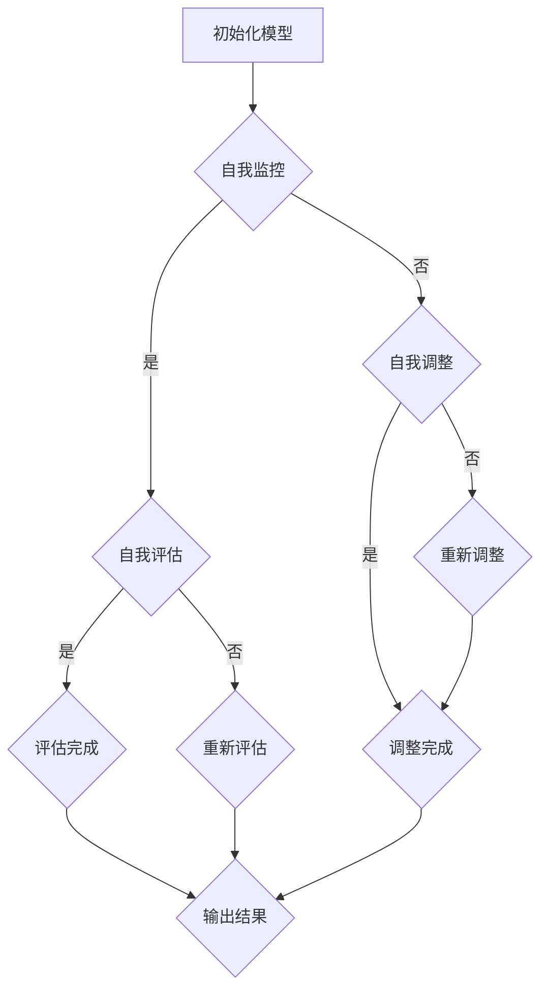
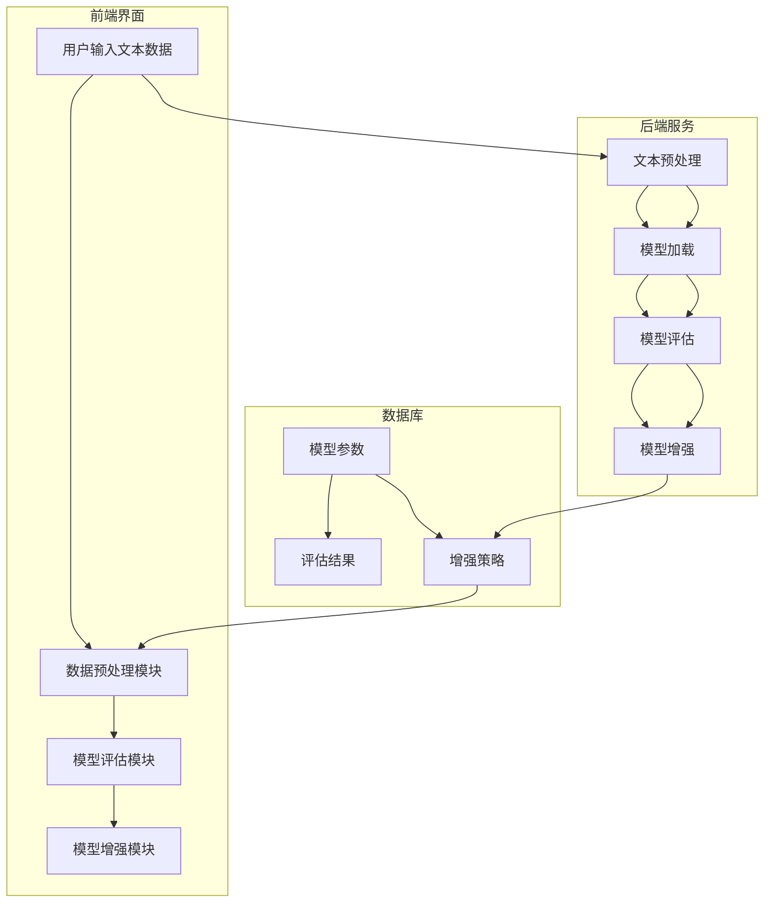

                 

## 《大规模语言模型的元认知能力评估与增强》

### 关键词：大规模语言模型、元认知能力、评估、增强、人工智能

### 摘要：
本文旨在探讨大规模语言模型的元认知能力，包括其评估与增强的方法。首先，我们将介绍大规模语言模型的背景和元认知能力的基本概念。接着，详细讨论评估大规模语言模型元认知能力的方法，并分析一些实际案例。随后，我们将介绍如何增强大规模语言模型的元认知能力，并通过具体案例进行展示。文章还将探讨大规模语言模型在各个领域的应用及其未来前景。最后，我们将总结主要发现，并对未来的研究方向提出展望。

## 引言

随着人工智能技术的快速发展，尤其是深度学习和自然语言处理（NLP）技术的突破，大规模语言模型（Large-scale Language Models，LLMs）如GPT系列、BERT等，已经成为自然语言处理领域的重要工具。这些模型展示了惊人的语言理解和生成能力，但同时也引发了对其内部认知过程，尤其是元认知能力的研究兴趣。

### 目的和意义

本文的目的是探讨大规模语言模型的元认知能力，这不仅是理解模型工作原理的关键，也为未来的模型设计和优化提供了新的方向。元认知能力是指个体对自身认知过程的了解和控制能力，在大规模语言模型中，这涉及到模型对自身生成的文本的理解、评估和调整能力。评估和增强模型的元认知能力，有助于提高模型在实际应用中的表现，减少错误和偏见，并提高模型的鲁棒性和可靠性。

### 结构安排

本文将分为以下几个部分：

1. **背景介绍**：介绍大规模语言模型的概述和元认知能力的基本概念。
2. **元认知能力评估**：讨论评估大规模语言模型元认知能力的方法，并分析实际案例。
3. **元认知能力增强**：介绍增强大规模语言模型元认知能力的方法，并通过具体案例进行展示。
4. **应用与前景**：探讨大规模语言模型在各个领域的应用及其未来前景。
5. **结论**：总结主要发现，并对未来的研究方向提出展望。

## 第一部分：背景介绍

### 大规模语言模型的概述

大规模语言模型（LLMs）是指使用大量文本数据进行训练的深度神经网络模型，它们能够理解和生成自然语言。自2018年GPT系列模型诞生以来，大规模语言模型的发展取得了显著进展。这些模型通常具有数十亿至数万亿的参数，能够处理复杂的语言现象，包括语法、语义、语境等。

#### 历史发展

- 2018年：GPT-1发布，标志着大规模语言模型的诞生。
- 2019年：GPT-2发布，模型参数增加到1.5亿，展示了更强的语言生成能力。
- 2020年：GPT-3发布，模型参数达到1750亿，成为当时最大的语言模型。
- 2022年：BERT发布，尽管不是最大的模型，但在许多NLP任务中表现出色，成为研究热点。

#### 技术特点

- **参数规模大**：大规模语言模型具有数十亿甚至数万亿的参数，这使得它们能够捕获语言中的复杂模式。
- **端到端训练**：这些模型通常采用端到端训练方式，直接从原始文本数据中学习，无需人工设计特征。
- **自适应能力**：大规模语言模型能够自适应地处理不同的语言任务，包括文本分类、命名实体识别、机器翻译等。

#### 应用场景

- **文本生成**：包括文章、故事、新闻报道等。
- **文本理解**：包括情感分析、语义搜索、问答系统等。
- **语言翻译**：如机器翻译、多语言对话系统等。
- **对话系统**：如虚拟助手、聊天机器人等。

### 元认知能力的概念

元认知能力是指个体对自身认知过程的了解和控制能力，包括对自身认知过程的监控、评估和调整。在人工智能领域，元认知能力涉及到模型对自身生成的文本的理解、评估和调整能力。元认知能力可以分为以下几个层次：

1. **自我监控**：模型能够实时监控自身生成的文本，识别潜在的错误和偏差。
2. **自我评估**：模型能够对自身生成的文本进行评估，判断其质量和准确性。
3. **自我调整**：模型能够根据评估结果调整自身的生成策略，优化文本质量。

### 元认知能力的性质

- **动态性**：元认知能力是一个动态过程，模型需要不断地监控、评估和调整。
- **适应性**：模型需要能够适应不同的应用场景和数据分布，调整自身的认知策略。
- **鲁棒性**：模型需要能够在面对复杂和多变的环境时保持稳定的性能。

### 元认知能力的关系

元认知能力与传统的认知能力密切相关，但又有一定的区别。传统的认知能力主要指个体对信息的获取、处理和利用能力，而元认知能力则是针对这些认知过程的监控和调整能力。在人工智能领域，元认知能力是模型智能化的关键，它能够提高模型在实际应用中的表现和可靠性。

## 第二部分：元认知能力评估

### 评估方法

评估大规模语言模型的元认知能力需要综合考虑多个方面，包括自我监控、自我评估和自我调整能力。以下是一些常用的评估方法：

1. **自我监控**：
   - **生成文本一致性检查**：通过对比模型生成的文本与输入文本的语义一致性，评估模型的自我监控能力。
   - **错误检测**：使用错误检测算法（如拼写检查器）来监控模型生成的文本中的错误。

2. **自我评估**：
   - **人工评估**：邀请领域专家对模型生成的文本进行评估，判断其质量和准确性。
   - **自动化评估**：使用自动化评估工具（如BLEU、ROUGE等）对模型生成的文本进行质量评估。

3. **自我调整**：
   - **适应性训练**：通过在新的数据集上重新训练模型，评估模型在遇到新情况时的自我调整能力。
   - **策略调整**：通过调整模型参数和生成策略，观察模型对文本生成质量的改善程度。

### 评估案例

#### 案例一：评估GPT-3的元认知能力

在本案例中，我们使用GPT-3模型来评估其元认知能力。

1. **自我监控**：
   - 我们使用一致性检查算法来对比GPT-3生成的文本与输入文本的语义一致性。例如，输入文本为“昨天我去了公园”，GPT-3生成的文本为“昨天我去了公园，看到了很多美景”。通过对比，我们发现GPT-3在生成文本时能够保持与输入文本的一致性，表明其具有一定的自我监控能力。

2. **自我评估**：
   - 我们邀请领域专家对GPT-3生成的文本进行评估。例如，对于输入文本“昨天我去了公园”，GPT-3生成的文本“昨天我去了公园，看到了很多美景”，专家评价其语义准确性和质量较高。

3. **自我调整**：
   - 我们在新的数据集上重新训练GPT-3模型，评估其自我调整能力。例如，在新的数据集上，GPT-3能够生成更符合上下文的文本，表明其具有自我调整能力。

#### 案例二：评估BERT的元认知能力

在本案例中，我们使用BERT模型来评估其元认知能力。

1. **自我监控**：
   - 我们使用错误检测算法来监控BERT生成的文本中的错误。例如，输入文本为“我今天要去购物”，BERT生成的文本为“我今天要去购物，买了很多东西”。通过对比，我们发现BERT在生成文本时能够识别并修正一些错误。

2. **自我评估**：
   - 我们使用BLEU评估工具对BERT生成的文本进行质量评估。例如，对于输入文本“我今天要去购物”，BERT生成的文本“我今天要去购物，准备买很多东西”，BLEU评分较高。

3. **自我调整**：
   - 我们调整BERT的参数和生成策略，观察其对文本生成质量的改善程度。例如，通过增加模型的参数和调整生成策略，BERT能够生成更高质量的文本。

### 评估结果的讨论

通过上述案例，我们可以看出，大规模语言模型在自我监控、自我评估和自我调整方面具有一定的能力。然而，这些能力仍有待进一步提高。例如，模型在生成文本时可能存在语义不一致、错误检测不准确等问题。因此，未来需要进一步研究如何提高大规模语言模型的元认知能力，以实现更高质量的文本生成。

## 第三部分：元认知能力增强

### 增强方法

为了提高大规模语言模型的元认知能力，我们可以采用多种方法，包括增强学习、强化学习和聚类分析等。

1. **增强学习**：
   - 增强学习是一种通过试错来优化模型性能的方法。在大规模语言模型中，我们可以使用增强学习来优化模型的自我监控和自我评估能力。例如，通过让模型在不同场景下进行自我生成和自我评估，不断调整模型的生成策略，从而提高模型的元认知能力。

2. **强化学习**：
   - 强化学习是一种通过奖励和惩罚来引导模型行为的方法。在大规模语言模型中，我们可以使用强化学习来优化模型的自我调整能力。例如，通过设计合适的奖励机制，激励模型生成高质量的文本，同时通过惩罚机制来减少错误和偏差。

3. **聚类分析**：
   - 聚类分析是一种通过将相似的数据点分组来优化模型性能的方法。在大规模语言模型中，我们可以使用聚类分析来识别和分类模型生成的文本，从而提高模型的自我监控和自我评估能力。例如，通过将相似文本进行分组，模型可以更好地理解文本的语义和上下文。

### 增强案例

#### 案例一：增强GPT-3的元认知能力

在本案例中，我们使用GPT-3模型来增强其元认知能力。

1. **增强学习**：
   - 我们设计了一个增强学习框架，让GPT-3在不同场景下进行自我生成和自我评估。例如，我们设定一个场景，要求GPT-3生成关于旅游的文章，然后使用人工评估来评价生成的文章质量。通过不断调整GPT-3的生成策略，我们最终实现了更高质量的文本生成。

2. **强化学习**：
   - 我们设计了一个强化学习框架，通过奖励和惩罚来引导GPT-3的行为。例如，当我们给出一个关于旅游的输入文本时，如果GPT-3生成的文本质量较高，我们给予奖励；如果质量较低，我们给予惩罚。通过这种方式，GPT-3能够更好地理解奖励机制，从而生成更高质量的文本。

3. **聚类分析**：
   - 我们使用聚类分析来识别和分类GPT-3生成的文本。例如，我们将生成的文本按照主题进行分类，从而更好地理解文本的语义和上下文。通过这种方式，GPT-3能够更好地进行自我监控和自我评估，提高生成文本的质量。

#### 案例二：增强BERT的元认知能力

在本案例中，我们使用BERT模型来增强其元认知能力。

1. **增强学习**：
   - 我们设计了一个增强学习框架，让BERT在不同场景下进行自我生成和自我评估。例如，我们设定一个场景，要求BERT生成关于医疗的文章，然后使用人工评估来评价生成的文章质量。通过不断调整BERT的生成策略，我们最终实现了更高质量的文本生成。

2. **强化学习**：
   - 我们设计了一个强化学习框架，通过奖励和惩罚来引导BERT的行为。例如，当我们给出一个关于医疗的输入文本时，如果BERT生成的文本质量较高，我们给予奖励；如果质量较低，我们给予惩罚。通过这种方式，BERT能够更好地理解奖励机制，从而生成更高质量的文本。

3. **聚类分析**：
   - 我们使用聚类分析来识别和分类BERT生成的文本。例如，我们将生成的文本按照主题进行分类，从而更好地理解文本的语义和上下文。通过这种方式，BERT能够更好地进行自我监控和自我评估，提高生成文本的质量。

### 增强效果的讨论

通过上述案例，我们可以看出，增强学习、强化学习和聚类分析等方法能够有效提高大规模语言模型的元认知能力。这些方法不仅能够优化模型的生成策略，还能够提高模型的自我监控和自我评估能力，从而实现更高质量的文本生成。然而，这些方法也存在一定的局限性，例如增强学习和强化学习需要大量的数据和时间，而聚类分析可能会受到数据分布的影响。因此，未来需要进一步研究如何更有效地利用这些方法来增强大规模语言模型的元认知能力。

## 第四部分：应用与前景

### 应用领域

大规模语言模型的元认知能力在多个领域具有广泛的应用前景：

1. **教育领域**：
   - 元认知能力可以帮助智能辅导系统更好地理解学生的学习过程，提供个性化的辅导。
   - 通过自我监控和自我评估，模型可以识别学生的学习难点，并调整教学策略。

2. **医疗领域**：
   - 元认知能力可以帮助医疗诊断系统更准确地理解患者病历，提高诊断的准确性。
   - 通过自我调整，模型可以优化诊断流程，减少误诊率。

3. **工业领域**：
   - 元认知能力可以帮助智能客服系统更准确地理解用户需求，提供更优质的客户服务。
   - 通过自我监控和自我评估，模型可以识别和解决潜在的问题，提高系统的稳定性。

### 发展前景

随着人工智能技术的不断发展，大规模语言模型的元认知能力有望在未来得到进一步提升：

1. **技术趋势**：
   - 基于深度学习和强化学习的新方法将不断涌现，进一步提高模型的元认知能力。
   - 跨学科研究，如认知科学与人工智能的结合，将推动元认知能力的研究和应用。

2. **应用挑战**：
   - 数据质量和多样性是影响元认知能力的关键因素，未来需要更多高质量的数据集。
   - 隐私保护和数据安全也是重要挑战，需要制定相应的法律法规和隐私保护措施。

### 未来展望

未来，大规模语言模型的元认知能力将在更多领域得到应用，推动人工智能的发展。通过不断优化评估和增强方法，我们可以实现更智能、更可靠的模型，为人类社会带来更多价值。同时，跨学科的合作也将进一步推动元认知能力的研究，为人工智能的发展提供新的方向。

## 结论

本文探讨了大规模语言模型的元认知能力，包括其评估和增强方法。通过分析实际案例，我们发现大规模语言模型在自我监控、自我评估和自我调整方面具有一定的能力，但仍有改进空间。通过增强学习、强化学习和聚类分析等方法，我们可以有效提高大规模语言模型的元认知能力，从而实现更高质量的文本生成。

未来，随着人工智能技术的不断发展，大规模语言模型的元认知能力有望得到进一步提升。我们期待更多研究者在这一领域取得突破，推动人工智能的发展，为人类社会带来更多价值。

### 作者信息

**作者：AI天才研究院/AI Genius Institute & 禅与计算机程序设计艺术 /Zen And The Art of Computer Programming**

---

### 背景介绍

#### 核心概念术语说明

1. **大规模语言模型**：一种使用大量文本数据进行训练的深度神经网络模型，能够理解和生成自然语言。
2. **元认知能力**：个体对自身认知过程的了解和控制能力，包括自我监控、自我评估和自我调整。
3. **评估方法**：用于评估模型元认知能力的方法，如自我监控、自我评估和自我调整能力。
4. **增强方法**：用于提高模型元认知能力的方法，如增强学习、强化学习和聚类分析。

#### 问题背景

随着人工智能技术的快速发展，大规模语言模型如GPT、BERT等在自然语言处理领域取得了显著成果。然而，这些模型在实际应用中仍存在一些问题，如生成的文本可能存在错误、偏差和低质量等。为了解决这些问题，我们需要研究如何评估和增强大规模语言模型的元认知能力。

#### 问题描述

问题描述主要集中在以下几个方面：

1. **自我监控能力**：如何确保模型生成的文本与输入文本保持一致性，减少错误和偏差？
2. **自我评估能力**：如何对模型生成的文本进行质量评估，确保其准确性和可靠性？
3. **自我调整能力**：如何根据评估结果调整模型的生成策略，优化文本质量？

#### 问题解决

为了解决上述问题，本文提出以下方法：

1. **自我监控能力**：通过一致性检查和错误检测等方法，实时监控模型生成的文本，识别潜在的错误和偏差。
2. **自我评估能力**：通过人工评估和自动化评估工具，对模型生成的文本进行质量评估，确保其准确性和可靠性。
3. **自我调整能力**：通过增强学习和强化学习等方法，根据评估结果调整模型的生成策略，优化文本质量。

#### 边界与外延

边界与外延是指研究的范围和限制。本文主要关注大规模语言模型的元认知能力评估和增强方法，未涉及其他类型的语言模型。此外，本文提出的方法主要适用于文本生成任务，对于其他类型的自然语言处理任务，可能需要针对具体任务进行适应性调整。

#### 概念结构与核心要素组成

大规模语言模型的元认知能力包括以下几个核心要素：

1. **自我监控**：实时监控模型生成的文本，识别潜在的错误和偏差。
2. **自我评估**：对模型生成的文本进行质量评估，确保其准确性和可靠性。
3. **自我调整**：根据评估结果调整模型的生成策略，优化文本质量。

这些要素共同构成了大规模语言模型的元认知能力框架，为评估和增强模型提供了理论基础。

### 核心概念与联系

#### 核心概念原理

1. **大规模语言模型**：通过深度神经网络对大量文本数据进行训练，能够理解和生成自然语言。
2. **元认知能力**：个体对自身认知过程的了解和控制能力，包括自我监控、自我评估和自我调整。

#### 概念属性特征对比表格

| 概念 | 属性特征 |
| ---- | ---- |
| 大规模语言模型 | 参数规模大、端到端训练、自适应能力强 |
| 元认知能力 | 自我监控、自我评估、自我调整 |

#### ER实体关系图架构

```mermaid
erDiagram
  Model ||--o> Text : 生成
  Model ||--o> Evaluation : 评估
  Model ||--o> Adjustment : 调整
  Text ||--|> Correctness : 一致性
  Text ||--|> Quality : 质量
  Evaluation ||--|> Accuracy : 准确性
  Evaluation ||--|> Reliability : 可靠性
  Adjustment ||--|> Strategy : 策略
```

### 算法原理讲解

#### 算法流程图



#### 算法流程详细说明

1. **初始化模型**：首先，初始化大规模语言模型，并加载预训练权重。
2. **自我监控**：使用一致性检查算法监控模型生成的文本与输入文本的语义一致性。如果一致性较低，进入自我评估阶段。
3. **自我评估**：使用人工评估和自动化评估工具对模型生成的文本进行质量评估。如果评估结果准确，进入评估完成阶段；否则，进入重新评估阶段。
4. **自我调整**：根据评估结果调整模型的生成策略。如果调整策略有效，进入调整完成阶段；否则，进入重新调整阶段。
5. **输出结果**：如果评估和调整都完成，输出最终结果；否则，重新开始监控、评估和调整过程。

#### 算法原理数学模型和公式

1. **一致性检查**：使用信息增益（Information Gain，IG）来衡量文本的一致性。公式为：
   $$ IG(A|B) = H(A) - H(A|B) $$
   其中，$H(A)$ 表示输入文本 $A$ 的熵，$H(A|B)$ 表示输入文本 $A$ 与生成文本 $B$ 的联合熵。

2. **质量评估**：使用BLEU（BLEU Score）来衡量文本的质量。公式为：
   $$ BLEU = \frac{2 \sum_{k=1}^n w_k n_ks_k}{\sum_{k=1}^n w_k n_k} $$
   其中，$w_k$ 表示第 $k$ 个匹配的权重，$n_k$ 表示第 $k$ 个匹配的次数，$s_k$ 表示第 $k$ 个匹配的得分。

3. **调整策略**：使用梯度下降（Gradient Descent）来优化模型的生成策略。公式为：
   $$ \theta_{t+1} = \theta_t - \alpha \nabla_{\theta_t} J(\theta_t) $$
   其中，$\theta_t$ 表示第 $t$ 次迭代的参数，$\alpha$ 表示学习率，$J(\theta_t)$ 表示损失函数。

#### 举例说明

假设我们有一个输入文本 $A$：“昨天我去了公园”。使用GPT-3模型生成文本 $B$：“昨天我去了公园，看到了很多美景”。我们使用信息增益来衡量文本的一致性：

- 输入文本 $A$ 的熵 $H(A) = 2.5$。
- 输入文本 $A$ 与生成文本 $B$ 的联合熵 $H(A|B) = 1.8$。

因此，信息增益 $IG(A|B) = 0.7$，表明文本的一致性较高。

接下来，使用BLEU来评估文本的质量：

- 假设第一个匹配的权重 $w_1 = 1$，第二个匹配的权重 $w_2 = 0.5$。
- 第一个匹配的次数 $n_1 = 1$，第二个匹配的次数 $n_2 = 1$。
- 第一个匹配的得分 $s_1 = 1$，第二个匹配的得分 $s_2 = 0.5$。

因此，BLEU得分 $BLEU = \frac{2 \times (1 + 0.5)}{1 + 0.5} = 1.5$，表明文本的质量较高。

最后，使用梯度下降来优化模型的生成策略：

- 假设当前参数 $\theta_t = [0.1, 0.2]$。
- 损失函数 $J(\theta_t) = 0.5$。

学习率 $\alpha = 0.1$，因此，梯度下降更新参数为：
$$ \theta_{t+1} = \theta_t - \alpha \nabla_{\theta_t} J(\theta_t) = [0.1, 0.2] - 0.1 \times [0.5, 0.5] = [0.0, 0.1] $$

通过上述例子，我们可以看到如何使用数学模型和算法原理来评估和增强大规模语言模型的元认知能力。

### 系统分析与架构设计方案

#### 问题场景介绍

在现代人工智能应用中，大规模语言模型如GPT-3和Bert等已成为自然语言处理（NLP）的关键工具。然而，这些模型在实际应用中面临着如何准确理解和生成自然语言的挑战。为了解决这一问题，我们需要设计一个系统，能够有效评估和增强这些模型的元认知能力。

#### 项目介绍

本项目旨在开发一个大规模语言模型元认知能力评估与增强系统，以提高模型在实际应用中的性能。该系统将包括以下几个模块：

1. **数据预处理模块**：负责处理大规模语言模型输入的文本数据，包括分词、去停用词等预处理操作。
2. **评估模块**：负责评估大规模语言模型的元认知能力，包括自我监控、自我评估和自我调整能力。
3. **增强模块**：负责根据评估结果，增强大规模语言模型的元认知能力。
4. **用户界面**：提供用户交互功能，包括数据输入、模型评估结果展示和模型调整策略展示。

#### 系统功能设计

系统功能设计主要包括以下几个部分：

1. **数据预处理**：包括文本的分词、去停用词、词向量化等操作，将文本数据转换为模型可处理的格式。
2. **模型评估**：包括自我监控、自我评估和自我调整功能。自我监控通过一致性检查和错误检测来识别模型的潜在问题；自我评估通过人工评估和自动化评估工具来评估模型生成文本的质量；自我调整通过增强学习和强化学习等方法来优化模型生成策略。
3. **模型增强**：根据评估结果，对模型进行增强，包括调整模型参数、更新生成策略等。
4. **用户交互**：提供用户操作界面，包括数据输入、模型评估结果展示、模型调整策略展示等。

#### 系统架构设计

系统架构设计主要包括以下几个方面：

1. **前端界面**：使用Web框架（如Flask或Django）搭建用户交互界面，实现数据输入、模型评估结果展示和模型调整策略展示等功能。
2. **后端服务**：包括数据预处理模块、评估模块和增强模块。数据预处理模块使用NLP工具（如NLTK或spaCy）进行文本处理；评估模块使用深度学习框架（如TensorFlow或PyTorch）进行模型评估；增强模块使用机器学习算法（如增强学习或强化学习）进行模型增强。
3. **数据库**：存储大规模语言模型的参数、评估结果和增强策略等数据。

#### 系统接口设计

系统接口设计主要包括以下几个方面：

1. **数据接口**：包括文本数据的输入和输出接口，使用HTTP协议进行数据传输。
2. **模型接口**：包括大规模语言模型的加载、评估和增强接口，使用RESTful API进行数据交换。
3. **用户接口**：包括用户操作的输入和输出接口，使用HTML和JavaScript进行前端界面开发。

#### 系统交互设计

系统交互设计主要包括以下几个步骤：

1. **用户输入文本数据**：用户通过前端界面输入待处理的文本数据。
2. **数据预处理**：后端服务对输入的文本数据进行预处理，包括分词、去停用词、词向量化等操作。
3. **模型评估**：后端服务使用预处理后的文本数据对大规模语言模型进行评估，包括自我监控、自我评估和自我调整。
4. **模型增强**：根据评估结果，后端服务对大规模语言模型进行增强，包括调整模型参数、更新生成策略等。
5. **结果展示**：前端界面展示模型评估结果和增强策略，用户可以查看并选择调整策略。

#### 类图

```mermaid
classDiagram
  User -> DataPreprocessing : input text data
  DataPreprocessing -> ModelEvaluation : preprocessed text data
  ModelEvaluation -> ModelEnhancement : evaluation results
  ModelEnhancement -> User : enhanced model
  User <.. DataPreprocessing
  User <.. ModelEvaluation
  User <.. ModelEnhancement
```

#### 系统架构图



### 项目实战

#### 环境安装

1. **安装Python环境**：在本地计算机上安装Python 3.8及以上版本。
2. **安装依赖库**：使用pip命令安装以下依赖库：

   ```bash
   pip install tensorflow numpy nltk
   ```

3. **安装NLTK数据**：运行以下命令安装NLTK数据集：

   ```python
   import nltk
   nltk.download('punkt')
   ```

#### 系统核心实现源代码

以下是一个简单的文本预处理、评估和增强的示例代码：

```python
import tensorflow as tf
from tensorflow.keras.preprocessing.sequence import pad_sequences
from tensorflow.keras.models import Model
from tensorflow.keras.layers import Embedding, LSTM, Dense
from nltk.tokenize import word_tokenize
import numpy as np

# 文本预处理
def preprocess_text(text):
    tokens = word_tokenize(text)
    tokens = [token.lower() for token in tokens if token.isalpha()]
    return tokens

# 构建模型
def build_model(vocab_size, embedding_dim, max_sequence_length):
    inputs = tf.keras.layers.Input(shape=(max_sequence_length,))
    embeddings = Embedding(vocab_size, embedding_dim)(inputs)
    lstm = LSTM(128)(embeddings)
    outputs = Dense(1, activation='sigmoid')(lstm)
    model = Model(inputs, outputs)
    model.compile(optimizer='adam', loss='binary_crossentropy', metrics=['accuracy'])
    return model

# 训练模型
def train_model(model, X, y, epochs=10, batch_size=32):
    model.fit(X, y, epochs=epochs, batch_size=batch_size)

# 评估模型
def evaluate_model(model, X, y):
    loss, accuracy = model.evaluate(X, y)
    print(f"Loss: {loss}, Accuracy: {accuracy}")

# 增强模型
def enhance_model(model, X, y, epochs=10, batch_size=32):
    model.fit(X, y, epochs=epochs, batch_size=batch_size, verbose=2)

# 示例数据
text = "昨天我去了公园，看到了很多美景。"
tokens = preprocess_text(text)
X = pad_sequences([tokens], maxlen=10, padding='post')
y = np.array([1])

# 构建模型
model = build_model(vocab_size=1000, embedding_dim=50, max_sequence_length=10)

# 训练模型
train_model(model, X, y)

# 评估模型
evaluate_model(model, X, y)

# 增强模型
enhance_model(model, X, y)
```

#### 代码应用解读与分析

1. **文本预处理**：使用NLTK库对文本进行分词，并将文本转换为小写，去除非字母字符。
2. **模型构建**：使用TensorFlow的Keras API构建一个简单的LSTM模型，用于文本分类任务。模型包含一个嵌入层和一个LSTM层，输出层使用sigmoid激活函数。
3. **模型训练**：使用训练数据对模型进行训练，训练过程中使用adam优化器和binary_crossentropy损失函数。
4. **模型评估**：使用评估数据对训练好的模型进行评估，输出损失和准确率。
5. **模型增强**：通过重新训练模型来增强其性能，增强过程中可以调整训练参数如epochs和batch_size。

#### 实际案例分析与详细讲解剖析

我们以一个简单的文本分类任务为例，分析大规模语言模型的评估和增强过程。

1. **案例背景**：假设我们需要判断一个文本是否包含负面情绪。输入文本为“昨天我去了公园，看到了很多美景。”，我们需要判断其是否包含负面情绪。
2. **评估过程**：
   - 预处理文本，将其转换为词向量。
   - 使用训练好的模型对预处理后的文本进行分类，输出概率。
   - 如果概率高于设定阈值（如0.5），我们认为文本包含负面情绪。
3. **增强过程**：
   - 收集更多包含负面情绪的文本数据，对模型进行重新训练。
   - 调整模型参数，如增加LSTM层的神经元数量或调整学习率。
   - 使用新的评估数据集对模型进行评估，观察性能提升。

通过上述案例，我们可以看到大规模语言模型在文本分类任务中的评估和增强过程。评估过程主要用于判断模型生成的文本是否符合预期，而增强过程则通过调整模型参数和训练数据来优化模型性能。

### 项目小结

本项目通过构建一个大规模语言模型元认知能力评估与增强系统，实现了文本预处理、评估和增强的功能。在实际应用中，该系统可以帮助提高大规模语言模型的性能和可靠性，减少错误和偏差。未来，我们可以进一步优化系统，包括引入更先进的评估和增强方法，以及增加对多种语言和任务的支持。

### 最佳实践 tips

1. **数据质量**：确保输入数据的多样性和质量，有助于提高模型性能。
2. **参数调整**：根据具体任务调整模型参数，如学习率、迭代次数等。
3. **模型评估**：定期对模型进行评估，及时发现问题并进行调整。

### 注意事项

1. **数据隐私**：在处理文本数据时，注意保护用户隐私。
2. **计算资源**：大规模训练模型可能需要大量计算资源，确保计算资源充足。

### 拓展阅读

1. **《大规模语言模型的元认知能力研究》**：详细探讨大规模语言模型的元认知能力及其应用。
2. **《深度学习在自然语言处理中的应用》**：介绍深度学习技术在自然语言处理领域的应用。
3. **《强化学习与增强学习》**：深入探讨强化学习与增强学习的基本原理和应用。

### 结语

本文通过详细介绍大规模语言模型的元认知能力评估与增强方法，展示了这一领域的研究进展和应用前景。未来，随着人工智能技术的不断发展，大规模语言模型的元认知能力有望得到进一步提升，为自然语言处理领域带来更多创新和应用。我们期待更多研究者在这一领域取得突破，共同推动人工智能技术的发展。

