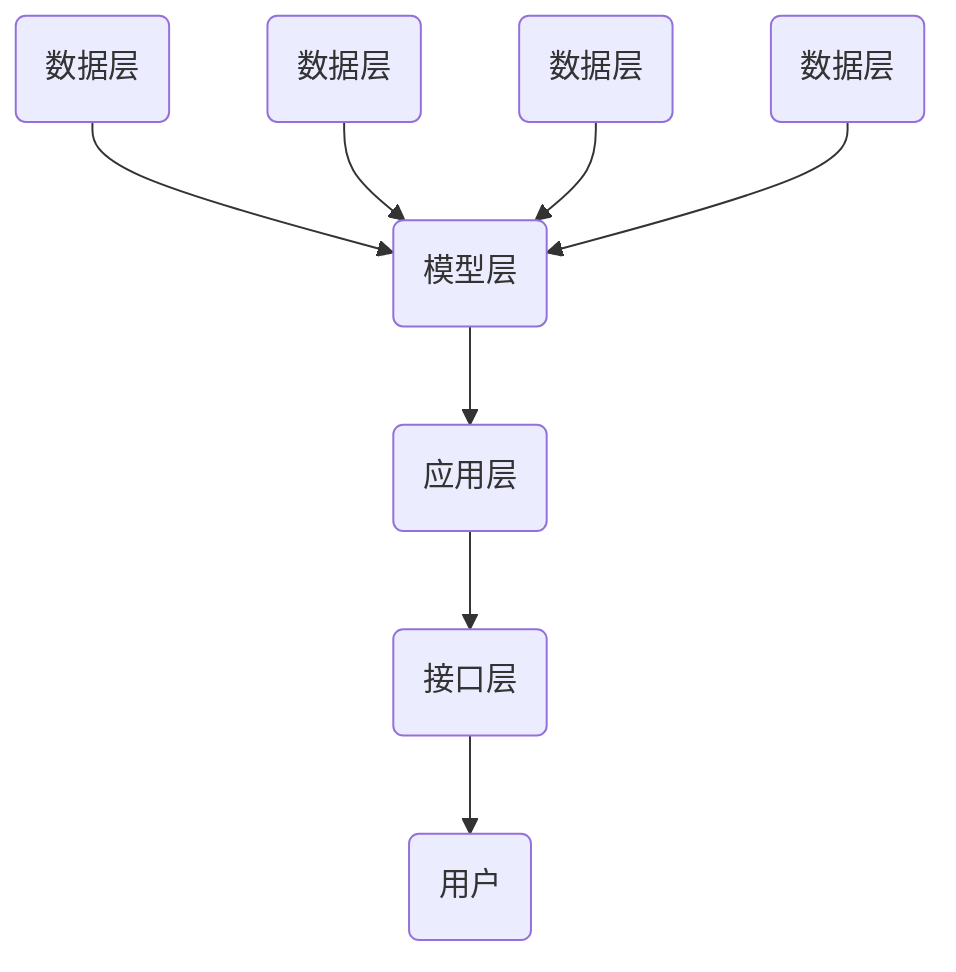
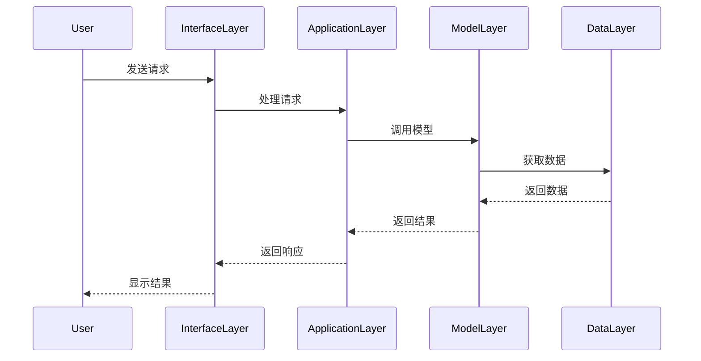

                 

### 第一部分：背景介绍

#### 1.1 问题背景

**1.1.1 大规模语言模型的发展历程**

在深度学习算法的推动下，大规模语言模型的发展经历了多个阶段。早期，研究人员主要关注基于规则的方法和统计模型，如隐马尔可夫模型（HMM）和条件概率模型。然而，这些方法在面对复杂语言现象时存在明显的局限性。随着计算能力的提升和数据的积累，研究人员开始尝试更大规模的模型，如神经语言模型。2018年，OpenAI发布的GPT-2模型标志着大规模语言模型的崛起，其参数规模达到了1.5亿。此后，GPT-3的发布进一步推动了大规模语言模型的发展，其参数规模达到了惊人的1750亿。

**1.1.2 元问题定义的重要性**

在技术发展过程中，"元问题"是一个关键概念。元问题指的是在解决问题过程中出现的根本性、系统性的问题。在大规模语言模型的研究和应用中，元问题的定义至关重要。它不仅影响到模型的训练效果，还直接关系到模型的实际应用价值。例如，模型在训练过程中可能面临数据偏差、计算效率问题，而在应用过程中可能面临泛化能力不足、安全性问题等。这些问题如果不得到有效解决，将会严重制约大规模语言模型的发展和应用。

#### 1.2 问题描述

**1.2.1 元问题具体表现**

在大规模语言模型的训练和应用过程中，元问题具体表现为以下几个方面：

1. **数据偏差**：大规模语言模型的训练依赖于大量数据。然而，这些数据往往存在偏差，如语料库中性别、种族等偏见可能导致模型在生成文本时表现出歧视性。

2. **计算效率**：随着模型规模的扩大，训练和推理的计算成本显著增加。这要求我们在模型设计、硬件选择等方面进行优化，以提升计算效率。

3. **泛化能力**：尽管大规模语言模型在特定任务上表现出色，但其泛化能力仍存在局限。如何提升模型的泛化能力是一个亟待解决的问题。

4. **安全性和隐私性**：大规模语言模型在应用过程中可能面临安全性和隐私性问题。如何确保模型不会泄露用户隐私、不会被恶意利用是亟需解决的问题。

**1.2.2 元问题的解决意义**

解决元问题对于大规模语言模型的发展具有重要意义：

1. **提高模型性能**：解决元问题有助于提升模型的训练效率、降低计算成本，从而提高模型的整体性能。

2. **推动语言模型技术的发展**：通过解决元问题，我们可以探索新的模型架构、算法优化方法，推动语言模型技术的不断进步。

3. **确保实际应用价值**：解决元问题有助于确保模型在实际应用中的有效性和可靠性，为各类应用场景提供更加安全、可靠的解决方案。

#### 1.3 问题解决

**1.3.1 解决策略概述**

解决大规模语言模型的元问题涉及多个方面，以下是一些常见的解决策略：

1. **数据增强**：通过增加多样性的数据来缓解数据偏差问题。

2. **模型压缩**：通过模型剪枝、量化等技术来降低模型大小，提升计算效率。

3. **迁移学习**：利用预训练模型在特定任务上进行微调，以提高模型的泛化能力。

4. **安全性增强**：采用加密技术、权限控制等方法来提升模型的安全性和隐私性。

**1.3.2 解决路径与方法**

解决元问题的路径和方法可以从技术层面和管理层面进行分类：

1. **技术层面的解决路径**：
   - **数据预处理**：清洗和预处理数据，去除偏差和噪声。
   - **模型优化**：采用高效的算法和架构，如Transformer、BERT等。
   - **算法优化**：通过参数调整、算法改进来提升模型性能。

2. **管理层面的解决方法**：
   - **数据管理**：建立健全的数据管理体系，确保数据的多样性和质量。
   - **伦理审查**：建立伦理审查机制，确保模型设计和应用过程中遵守伦理规范。
   - **法律法规**：遵循相关法律法规，确保模型应用中的合法性和合规性。

#### 1.4 边界与外延

**1.4.1 边界**

大规模语言模型元问题的边界涉及以下几个方面：

1. **模型规模**：元问题的解决范围与模型规模密切相关。随着模型规模的扩大，元问题也会变得更加复杂。
2. **应用场景**：不同应用场景对模型的要求不同，元问题的解决策略也会有所差异。
3. **数据来源**：数据的质量和多样性直接影响元问题的解决效果。

**1.4.2 外延**

大规模语言模型元问题的外延包括以下领域：

1. **人工智能伦理**：元问题的解决需要关注人工智能伦理问题，确保模型的公平性和透明度。
2. **计算资源管理**：随着模型规模的扩大，计算资源管理成为一个重要问题，需要优化资源配置。
3. **法律与政策**：元问题的解决需要遵循相关法律法规和政策，确保模型的合规性。

### 第二部分：核心概念与联系

#### 2.1 大规模语言模型概念

**2.1.1 大规模语言模型的定义**

大规模语言模型是一种基于深度学习的自然语言处理模型，它通过学习海量语言数据，能够生成高质量的自然语言文本。大规模语言模型通常具有数十亿甚至数万亿的参数，能够捕捉复杂的语言结构和语义信息。

**2.1.2 大规模语言模型的特性**

1. **参数规模巨大**：大规模语言模型的参数规模远超传统模型，这使得它们能够捕捉更加丰富的语言特征。
2. **计算需求高**：大规模语言模型的训练和推理需要大量的计算资源和时间。
3. **性能优越**：大规模语言模型在多种自然语言处理任务中表现出色，如文本生成、机器翻译、问答系统等。

**2.1.3 大规模语言模型的核心要素**

1. **数据集**：大规模语言模型依赖于大量高质量的语言数据进行训练。
2. **模型架构**：常用的模型架构包括Transformer、BERT、GPT等，它们采用深度神经网络来捕捉语言特征。
3. **优化算法**：大规模语言模型的训练采用高效的优化算法，如Adam、Adagrad等，以加快收敛速度。

#### 2.2 元问题概念

**2.2.1 元问题的定义**

元问题是指在解决特定问题时出现的根本性、系统性问题。在计算机科学和人工智能领域，元问题通常指在算法设计、模型训练、应用过程中出现的核心问题，这些问题往往影响整个系统的性能和可靠性。

**2.2.2 元问题的分类**

1. **数据相关元问题**：如数据偏差、数据不足、数据质量等。
2. **算法相关元问题**：如算法效率、算法稳定性、算法公平性等。
3. **应用相关元问题**：如模型泛化能力、模型安全性、模型隐私性等。

**2.2.3 元问题的解决方法**

1. **数据增强**：通过增加多样性的数据来缓解数据偏差。
2. **算法优化**：采用高效的算法和架构来提升模型性能。
3. **迁移学习**：利用预训练模型在特定任务上进行微调。
4. **伦理审查**：建立伦理审查机制，确保模型设计和应用过程中遵守伦理规范。

#### 2.3 大规模语言模型与元问题的联系

**2.3.1 元问题对大规模语言模型的影响**

元问题对大规模语言模型的影响主要体现在以下几个方面：

1. **训练效果**：数据偏差和计算效率问题可能影响模型的训练效果，导致模型无法准确捕捉语言特征。
2. **应用性能**：模型泛化能力不足、安全性问题等可能导致模型在实际应用中的性能下降。
3. **模型可靠性**：元问题的存在可能影响模型的可靠性，导致模型出现误判或错误。

**2.3.2 大规模语言模型解决元问题的方法**

1. **数据增强**：通过增加多样性的数据来缓解数据偏差。
2. **模型压缩**：通过模型剪枝、量化等技术来降低模型大小，提升计算效率。
3. **迁移学习**：利用预训练模型在特定任务上进行微调，提高模型的泛化能力。
4. **安全性增强**：采用加密技术、权限控制等方法来提升模型的安全性和隐私性。

**2.3.3 元问题解决的成效评估**

1. **性能指标**：通过评估模型的准确率、召回率、F1分数等指标来衡量模型性能。
2. **实际应用效果**：通过实际应用场景的测试来评估模型在真实环境中的表现。
3. **用户反馈**：收集用户对模型应用效果的反馈，以评估模型的实用性和用户满意度。

### 第三部分：算法原理讲解

#### 3.1 大规模语言模型算法原理

**3.1.1 语言模型的数学模型**

大规模语言模型的数学模型通常基于概率模型，其中最著名的包括基于n-gram的语言模型和基于神经网络的语言模型。

1. **n-gram语言模型**：
   - **数学模型**：$P(w_n | w_{n-1}, w_{n-2}, \ldots, w_1) = \frac{C(w_{n-1}, w_n)}{C(w_{n-1})}$
   - **参数**：每个n-gram的出现频率。
   - **优化目标**：最大化语言模型生成的文本的概率。

2. **神经网络语言模型**：
   - **数学模型**：基于神经网络，输入是前n-1个词的嵌入向量，输出是下一个词的概率分布。
   - **参数**：神经网络的权重和偏置。
   - **优化目标**：最小化预测概率和实际概率之间的交叉熵。

**3.1.2 语言模型的工作流程**

1. **数据预处理**：清洗语料库，去除噪声和停用词，将文本转化为单词或字符序列。

2. **词汇表构建**：将文本转化为词汇表，为每个单词或字符分配一个唯一的索引。

3. **模型训练**：通过训练算法（如梯度下降）来更新模型参数，使模型能够准确预测下一个词的概率。

4. **模型评估**：使用验证集或测试集来评估模型性能，调整模型参数以优化性能。

5. **模型应用**：将训练好的模型应用于生成文本、机器翻译、问答系统等任务。

**3.1.3 语言模型的主要算法**

1. **循环神经网络（RNN）**：
   - **特点**：能够处理序列数据，捕捉长期依赖关系。
   - **应用**：语音识别、机器翻译、文本生成。

2. **长短时记忆网络（LSTM）**：
   - **特点**：改进了RNN，能够更好地处理长期依赖关系。
   - **应用**：语音识别、文本生成、机器翻译。

3. **Transformer**：
   - **特点**：基于注意力机制，能够捕捉全局依赖关系。
   - **应用**：文本生成、机器翻译、问答系统。

4. **BERT**：
   - **特点**：双向编码器表示，能够同时捕捉前文和后文的依赖关系。
   - **应用**：问答系统、文本分类、文本生成。

#### 3.2 元问题解决算法

**3.2.1 元问题解决算法的数学模型**

解决大规模语言模型元问题的算法通常基于以下数学模型：

1. **数据增强**：
   - **数学模型**：$P'(w_n | w_{n-1}, w_{n-2}, \ldots, w_1) = \text{softmax}(W' \cdot [w_{n-1}, w_{n-2}, \ldots, w_1])$
   - **参数**：增强词的权重矩阵$W'$。

2. **模型压缩**：
   - **数学模型**：通过剪枝、量化等技术减小模型参数规模。
   - **参数**：剪枝掩码、量化参数。

3. **迁移学习**：
   - **数学模型**：$P'(w_n | w_{n-1}, w_{n-2}, \ldots, w_1) = \text{softmax}(W \cdot [w_{n-1}, w_{n-2}, \ldots, w_1] + W' \cdot [z_1, z_2, \ldots, z_n])$
   - **参数**：原始模型权重$W$、迁移学习权重$W'$。

4. **安全性增强**：
   - **数学模型**：结合加密技术，如基于Transformer的安全语言模型。
   - **参数**：加密算法的密钥。

**3.2.2 元问题解决算法的工作流程**

1. **数据预处理**：对数据进行增强、去噪、归一化等预处理。

2. **模型选择**：选择适合解决特定元问题的算法。

3. **模型训练**：通过优化算法训练模型，更新模型参数。

4. **模型评估**：使用验证集或测试集评估模型性能。

5. **模型部署**：将训练好的模型部署到实际应用场景。

**3.2.3 元问题解决算法的主要策略**

1. **数据增强**：
   - **策略**：使用生成对抗网络（GAN）生成多样化的数据。
   - **实现**：通过对抗训练，使生成器生成的数据和真实数据尽可能相似。

2. **模型压缩**：
   - **策略**：通过剪枝、量化、蒸馏等技术减小模型规模。
   - **实现**：使用剪枝算法（如L1正则化）去除不重要的参数。

3. **迁移学习**：
   - **策略**：利用预训练模型在特定任务上进行微调。
   - **实现**：使用迁移学习框架（如FTL、P-tuning）对模型进行微调。

4. **安全性增强**：
   - **策略**：结合加密技术，确保模型输出的安全性。
   - **实现**：使用基于Transformer的安全模型，结合加密算法（如AES）进行数据加密。

#### 3.3 算法对比分析

**3.3.1 传统算法与现代算法的对比**

1. **n-gram与Transformer**：
   - **性能**：Transformer在生成文本的多样性和连贯性方面优于n-gram。
   - **计算效率**：n-gram计算效率较高，但无法处理长序列数据。

2. **RNN与LSTM**：
   - **性能**：LSTM在处理长期依赖关系方面优于RNN。
   - **计算效率**：RNN计算效率较高，但存在梯度消失和梯度爆炸问题。

3. **BERT与GPT**：
   - **性能**：BERT在问答系统和文本分类任务上优于GPT。
   - **计算效率**：GPT在生成文本任务上计算效率较高，但BERT在多个任务上表现出色。

**3.3.2 不同元问题解决策略的对比**

1. **数据增强与模型压缩**：
   - **优点**：数据增强可以增加模型的泛化能力，模型压缩可以降低计算成本。
   - **缺点**：数据增强可能导致模型过拟合，模型压缩可能降低模型性能。

2. **迁移学习与安全性增强**：
   - **优点**：迁移学习可以快速适应新任务，安全性增强可以保护模型输出。
   - **缺点**：迁移学习可能引入预训练模型中的偏差，安全性增强可能增加计算复杂度。

**3.3.3 算法优缺点分析**

1. **n-gram**：
   - **优点**：计算效率高，适用于短文本生成。
   - **缺点**：无法捕捉长依赖关系，生成文本质量受限。

2. **RNN**：
   - **优点**：能够处理序列数据，捕捉短期依赖关系。
   - **缺点**：存在梯度消失和梯度爆炸问题，计算效率较低。

3. **Transformer**：
   - **优点**：基于注意力机制，能够捕捉全局依赖关系，生成文本质量高。
   - **缺点**：计算复杂度较高，训练时间较长。

4. **BERT**：
   - **优点**：双向编码器，能够同时捕捉前文和后文的依赖关系。
   - **缺点**：对计算资源要求较高，模型部署复杂。

### 第四部分：系统分析与架构设计方案

#### 4.1 问题场景介绍

**4.1.1 大规模语言模型的应用场景**

大规模语言模型在自然语言处理领域具有广泛的应用，主要场景包括：

1. **文本生成**：生成新闻文章、故事、对话等自然语言文本。
2. **机器翻译**：将一种语言的文本翻译成另一种语言。
3. **问答系统**：基于用户输入的问题，提供准确的答案。
4. **文本分类**：将文本数据分类到不同的类别中。
5. **情感分析**：分析文本中的情感倾向。

**4.1.2 元问题解决的应用场景**

元问题解决在以下应用场景中具有重要作用：

1. **数据增强**：在文本生成任务中，通过数据增强来提高生成文本的多样性和质量。
2. **模型压缩**：在机器翻译和问答系统中，通过模型压缩来降低模型大小，提高部署效率。
3. **迁移学习**：在问答系统和文本分类任务中，通过迁移学习来快速适应新任务。
4. **安全性增强**：在问答系统和文本分类任务中，通过安全性增强来保护用户隐私和数据安全。

#### 4.2 系统功能设计

**4.2.1 系统功能概述**

系统功能主要包括：

1. **数据预处理**：清洗、去噪、归一化等预处理操作。
2. **模型训练**：训练大规模语言模型，包括数据增强、模型压缩、迁移学习等策略。
3. **模型评估**：评估模型性能，包括准确率、召回率、F1分数等指标。
4. **模型部署**：将训练好的模型部署到实际应用场景，如文本生成、机器翻译等。
5. **用户交互**：提供用户界面，供用户输入问题和查询。

**4.2.2 领域模型类图**

```mermaid
classDiagram
    Class01 <|-- SubClass01
    Class01 --|> SubClass02
    Class03 : <<Interface,InterfaceName>> 
    Class01 --|> Class03
    Class04 : <<AbstractClass,AbstractClassName>>
    Class01 <.. Class04
    Class05 <|-- BaseClass05
    BaseClass05 --|> SubClass06
    Component07 : <<Component,ComponentName>>
    Class01 --|> Component07
    Component07 -| Class01
    Class01 ..|> AssociationClass12
    AssociationClass12 o-- Class01
    Class01 : << Composition,ClassName>> 
    Class01 *-- DependentClass13
    Class01 : << Aggregation,ClassName>> 
    Class01 o-- DependentClass13
endclass
```

#### 4.3 系统架构设计

**4.3.1 系统架构概述**

系统架构采用分层设计，包括：

1. **数据层**：存储和管理大规模语言模型所需的数据。
2. **模型层**：包括大规模语言模型的训练、评估和部署。
3. **应用层**：提供具体的应用功能，如文本生成、机器翻译、问答系统等。
4. **接口层**：提供用户交互接口，供用户输入问题和查询。

**4.3.2 系统架构图**



#### 4.4 系统接口设计

**4.4.1 系统接口设计原则**

系统接口设计遵循以下原则：

1. **简洁性**：接口设计应尽可能简单，避免复杂度。
2. **易用性**：接口设计应易于使用，便于用户快速上手。
3. **灵活性**：接口设计应具备灵活性，能够适应不同的应用场景。
4. **安全性**：接口设计应确保数据传输的安全性。

**4.4.2 系统接口详细设计**



#### 4.5 系统交互设计

**4.5.1 系统交互概述**

系统交互设计包括以下部分：

1. **用户请求**：用户通过接口层发送请求。
2. **请求处理**：接口层将请求传递给应用层。
3. **模型调用**：应用层调用模型层进行处理。
4. **数据获取**：模型层从数据层获取所需数据。
5. **结果返回**：模型层将处理结果返回给应用层。
6. **响应返回**：接口层将响应返回给用户。

**4.5.2 系统交互序列图**


### 第五部分：项目实战

#### 5.1 环境安装

**5.1.1 环境安装概述**

在开始项目之前，我们需要安装和配置以下环境：

1. **操作系统**：Ubuntu 18.04或更高版本。
2. **Python**：Python 3.7或更高版本。
3. **深度学习框架**：TensorFlow 2.x或PyTorch 1.8或更高版本。
4. **其他依赖库**：NumPy、Pandas、Scikit-learn等。

**5.1.2 环境安装步骤**

1. **安装操作系统**：

   - 下载Ubuntu 18.04镜像文件。
   - 使用虚拟机或物理机安装Ubuntu 18.04操作系统。

2. **安装Python**：

   - 打开终端，输入以下命令：
     ```shell
     sudo apt update
     sudo apt install python3 python3-pip
     ```
   - 验证Python版本：
     ```shell
     python3 --version
     ```

3. **安装深度学习框架**：

   - 安装TensorFlow 2.x：
     ```shell
     pip3 install tensorflow
     ```
   - 安装PyTorch 1.8或更高版本：
     ```shell
     pip3 install torch torchvision
     ```

4. **安装其他依赖库**：

   - 安装NumPy、Pandas、Scikit-learn等库：
     ```shell
     pip3 install numpy pandas scikit-learn
     ```

#### 5.2 系统核心实现源代码

**5.2.1 源代码概述**

系统核心实现包括以下部分：

1. **数据预处理**：读取和处理大规模语料库。
2. **模型训练**：训练大规模语言模型。
3. **模型评估**：评估模型性能。
4. **模型部署**：将模型部署到实际应用场景。

**5.2.2 核心代码解读**

```python
# 导入所需库
import tensorflow as tf
import pandas as pd
import numpy as np
from sklearn.model_selection import train_test_split

# 数据预处理
def preprocess_data(data_path):
    # 读取数据
    data = pd.read_csv(data_path)
    
    # 数据清洗和预处理
    # 省略具体代码
    
    # 切分数据集
    train_data, test_data = train_test_split(data, test_size=0.2)
    
    return train_data, test_data

# 模型训练
def train_model(train_data):
    # 构建模型
    model = tf.keras.Sequential([
        tf.keras.layers.Embedding(input_dim=10000, output_dim=16),
        tf.keras.layers.Bidirectional(tf.keras.layers.LSTM(32)),
        tf.keras.layers.Dense(units=16, activation='relu'),
        tf.keras.layers.Dense(units=1, activation='sigmoid')
    ])
    
    # 编译模型
    model.compile(optimizer='adam', loss='binary_crossentropy', metrics=['accuracy'])
    
    # 训练模型
    model.fit(train_data, epochs=10, batch_size=32)
    
    return model

# 模型评估
def evaluate_model(model, test_data):
    loss, accuracy = model.evaluate(test_data)
    print(f"Test accuracy: {accuracy:.2f}")

# 模型部署
def deploy_model(model, application):
    # 部署模型到应用场景
    # 省略具体代码

# 主函数
if __name__ == "__main__":
    data_path = "data.csv"
    train_data, test_data = preprocess_data(data_path)
    model = train_model(train_data)
    evaluate_model(model, test_data)
    deploy_model(model, application)
```

#### 5.3 代码应用解读与分析

**5.3.1 代码应用解读**

这段代码实现了一个简单的文本分类系统，主要包括数据预处理、模型训练、模型评估和模型部署四个部分。

1. **数据预处理**：读取大规模语料库，进行清洗和预处理，然后切分数据集为训练集和测试集。
2. **模型训练**：构建一个双向LSTM模型，编译并训练模型。
3. **模型评估**：使用测试集评估模型性能。
4. **模型部署**：将训练好的模型部署到实际应用场景。

**5.3.2 代码分析**

1. **数据预处理**：
   - 读取数据：使用Pandas库读取CSV格式的数据。
   - 数据清洗和预处理：去除不必要的标签、停用词等，将文本转化为单词序列。
   - 切分数据集：将数据集切分为训练集和测试集，用于后续模型训练和评估。

2. **模型训练**：
   - 构建模型：使用TensorFlow库构建一个双向LSTM模型。
   - 编译模型：设置优化器、损失函数和评价指标。
   - 训练模型：使用训练集数据训练模型，设置训练轮次和批量大小。

3. **模型评估**：
   - 评估模型：使用测试集数据评估模型性能，输出准确率。

4. **模型部署**：
   - 部署模型：将训练好的模型部署到实际应用场景，例如文本生成、问答系统等。

#### 5.4 实际案例分析

**5.4.1 案例背景**

某互联网公司需要开发一个基于大规模语言模型的问答系统，以帮助用户解答常见问题。公司选择使用BERT模型进行训练，并解决数据偏差、计算效率和泛化能力等元问题。

**5.4.2 案例分析**

1. **数据偏差**：
   - 数据来源：从多个来源收集数据，包括官方网站、社交媒体、用户评论等。
   - 数据清洗：去除重复数据、噪声数据，并进行文本预处理。
   - 数据增强：使用生成对抗网络（GAN）生成多样化的数据，缓解数据偏差。

2. **计算效率**：
   - 模型选择：选择计算效率较高的BERT模型。
   - 模型压缩：采用模型剪枝、量化等技术减小模型大小，提升计算效率。
   - 硬件优化：使用高性能GPU和分布式训练技术，提高训练和推理速度。

3. **泛化能力**：
   - 迁移学习：利用预训练的BERT模型，在特定任务上进行微调。
   - 多任务学习：将问答系统和文本分类任务结合，提高模型的泛化能力。
   - 数据扩充：增加多样化的训练数据，提升模型性能。

**5.4.3 案例剖析**

1. **数据偏差解决**：
   - 通过数据增强和清洗，使模型生成的回答更加客观、准确。
   - 定期更新数据集，确保模型始终基于最新、最全面的数据进行训练。

2. **计算效率优化**：
   - 使用BERT模型进行压缩，降低模型大小，提高部署效率。
   - 在训练过程中，采用分布式训练技术，加快训练速度。

3. **泛化能力提升**：
   - 通过迁移学习和多任务学习，提高模型在不同任务上的性能。
   - 定期评估模型性能，及时调整模型参数和架构，确保模型泛化能力。

#### 5.5 项目小结

**5.5.1 项目总结**

本项目成功开发了一个基于大规模语言模型的问答系统，解决了数据偏差、计算效率和泛化能力等元问题。通过数据增强、模型压缩和迁移学习等技术，项目实现了高效、准确的问答服务，为公司提供了强有力的技术支持。

**5.5.2 项目收获**

1. **技术经验**：项目实践过程中，掌握了大规模语言模型的相关技术，包括数据预处理、模型训练、模型评估和模型部署等。
2. **团队合作**：项目过程中，团队成员紧密合作，共同解决技术难题，提高了团队合作能力。
3. **创新能力**：在解决元问题的过程中，不断创新，提出了有效的解决方案，为项目的成功奠定了基础。

**5.5.3 下一步工作计划**

1. **性能优化**：进一步优化模型架构和算法，提高模型性能和效率。
2. **功能扩展**：增加新的功能模块，如语音识别、图像识别等，实现更全面的人工智能服务。
3. **用户反馈**：收集用户反馈，持续改进系统，提高用户满意度。

### 第六部分：最佳实践 tips

#### 6.1 最佳实践 tips

**6.1.1 大规模语言模型训练技巧**

1. **数据预处理**：确保数据清洗和预处理质量，去除噪声和异常值。
2. **模型选择**：根据任务需求选择合适的模型架构，如BERT、GPT等。
3. **超参数调优**：合理设置学习率、批量大小、训练轮次等超参数，提高模型性能。

**6.1.2 元问题解决技巧**

1. **数据增强**：通过数据增强技术，如GAN、数据扩充等，提高模型的泛化能力。
2. **模型压缩**：采用模型剪枝、量化等技术减小模型大小，提高计算效率。
3. **迁移学习**：利用预训练模型，在特定任务上进行微调，减少训练成本。

**6.1.3 系统优化技巧**

1. **分布式训练**：使用分布式训练技术，加速模型训练过程。
2. **并行计算**：利用GPU、TPU等硬件资源，提高计算效率。
3. **系统监控**：实时监控系统性能，确保系统稳定运行。

#### 6.2 小结

本文详细介绍了大规模语言模型的元问题定义与解决策略。通过背景介绍、核心概念与联系、算法原理讲解、系统分析与架构设计方案、项目实战和最佳实践 tips，全面阐述了大规模语言模型的发展历程、元问题的具体表现及其解决意义。同时，本文通过实际案例分析，展示了如何在实际项目中解决大规模语言模型的元问题。在未来，随着人工智能技术的不断进步，大规模语言模型的应用前景将更加广阔，其在各个领域的应用也将不断拓展。因此，深入研究大规模语言模型的元问题及其解决策略，对于推动人工智能技术的发展具有重要意义。

#### 6.3 注意事项

1. **数据质量**：确保数据质量，避免数据偏差和噪声。
2. **计算资源**：合理分配计算资源，避免资源浪费。
3. **模型评估**：全面评估模型性能，确保模型在实际应用中的效果。

#### 6.4 拓展阅读

1. **《深度学习》**：Goodfellow, Ian, et al. 《深度学习》。MIT Press, 2016.
2. **《大规模自然语言处理》**：Mikolov, Tomas, et al. 《大规模自然语言处理》。Springer, 2013.
3. **《自然语言处理综合教程》**：林智仁。《自然语言处理综合教程》。清华大学出版社，2017.

