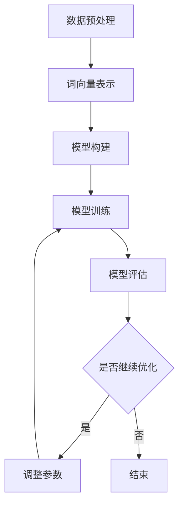
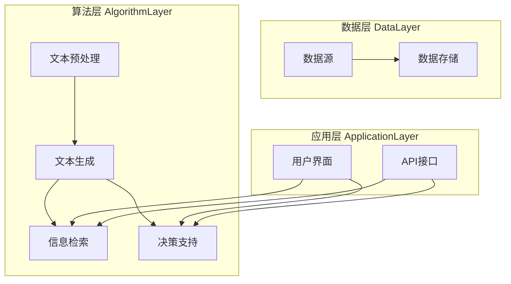
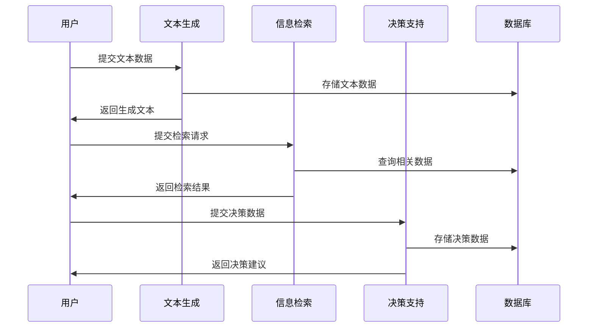

                 

### 第1章：大规模语言模型的兴起与创新管理的重要性

#### 1.1 大规模语言模型的兴起

**问题描述：**
近年来，随着深度学习技术的不断发展，尤其是神经网络模型的广泛应用，大规模语言模型（如GPT、BERT等）迅速崛起，成为自然语言处理（NLP）领域的核心力量。这些模型通过训练数以亿计的文本数据，可以生成高质量的文本内容、完成复杂的问答任务以及进行文本分类等。然而，大规模语言模型的兴起不仅改变了NLP的研究方向和应用场景，也对创新管理带来了深远的影响。

**问题解决：**
为了探讨大规模语言模型对创新管理的重要性，我们需要从以下几个方面入手：

1. **技术原理分析：**首先，理解大规模语言模型的基本原理，包括神经网络、深度学习等核心技术，以及如何通过训练和优化来提升模型的表现。
2. **应用场景挖掘：**接着，分析大规模语言模型在创新管理中的应用，如文本生成、信息检索、决策支持等。
3. **实际案例分析：**通过实际案例展示大规模语言模型在创新管理中的成功应用，以及如何利用这些技术来提升企业创新能力和竞争力。

**边界与外延：**
- **边界：**大规模语言模型的应用主要集中在自然语言处理领域，但也逐步渗透到其他如人工智能、数据科学等领域。
- **外延：**创新管理不仅包括技术层面的创新，还包括商业模式、市场策略等各个方面的创新。因此，大规模语言模型的应用边界和范围也会随着创新管理的不断拓展而扩大。

#### 1.2 创新管理的重要性

**问题描述：**
创新管理是企业持续发展的关键驱动力。在竞争日益激烈的市场环境中，企业必须不断创新以应对市场变化，提高产品和服务质量，从而获得竞争优势。创新管理涉及多个方面，包括技术创新、市场创新、管理创新等。随着技术的进步，大规模语言模型在创新管理中扮演着越来越重要的角色。

**问题解决：**
为了深入探讨大规模语言模型在创新管理中的重要性，我们可以从以下几个方面进行分析：

1. **技术创新：**大规模语言模型能够帮助企业在技术创新方面取得突破，如生成高质量的产品文档、自动翻译多语言文档等。
2. **市场创新：**通过分析用户需求和市场趋势，大规模语言模型可以帮助企业进行市场创新，如推出新的产品和服务。
3. **管理创新：**在管理层面，大规模语言模型可以辅助企业进行数据分析和决策支持，从而提高管理效率和效果。

**边界与外延：**
- **边界：**创新管理主要关注企业的内部创新活动，而大规模语言模型的应用也主要集中在企业内部。
- **外延：**随着企业外部环境的不断变化，如市场、政策、竞争等，创新管理的范围也在不断扩大，这为大规模语言模型的应用提供了更广阔的空间。

#### 1.3 大规模语言模型在创新管理中的应用

**问题描述：**
大规模语言模型在创新管理中具有广泛的应用，如文本生成、信息检索、决策支持等。然而，如何有效地利用这些技术来提升企业的创新能力和竞争力，仍是一个值得深入探讨的问题。

**问题解决：**
为了充分发挥大规模语言模型在创新管理中的作用，我们需要从以下几个方面进行探索：

1. **技术选型：**选择适合企业需求的大规模语言模型，如GPT、BERT、T5等。
2. **应用场景设计：**根据企业的实际情况，设计合适的创新应用场景，如文本生成、信息检索、数据分析等。
3. **系统集成：**将大规模语言模型与企业现有的信息系统进行集成，实现数据共享和业务协同。
4. **人才培养：**提升企业员工的技术能力和创新意识，以充分利用大规模语言模型带来的机会。

**边界与外延：**
- **边界：**大规模语言模型的应用主要局限于自然语言处理领域，但也可以扩展到其他相关领域，如计算机视觉、语音识别等。
- **外延：**随着技术的不断进步和应用场景的拓展，大规模语言模型在创新管理中的应用边界也在不断扩展。

#### 1.4 元问题定义与解决策略

**问题描述：**
在创新管理中，如何有效地利用大规模语言模型来提升企业的创新能力和竞争力，是一个复杂且具有挑战性的问题。这涉及到技术、管理、市场等多个方面，需要系统性地进行研究和解决。

**问题解决：**
为了解决这一元问题，我们可以采取以下策略：

1. **系统思考：**从全局视角出发，综合考虑技术、管理、市场等多方面因素，构建系统化的解决方案。
2. **分步实施：**将解决方案分解为具体的实施步骤，如技术选型、应用场景设计、系统集成等，逐步推进。
3. **试点验证：**选择具有代表性的企业或项目进行试点验证，通过实践总结经验，不断完善解决方案。
4. **持续优化：**根据试点验证的结果，持续优化解决方案，以适应不断变化的市场环境。

**边界与外延：**
- **边界：**元问题的解决主要关注大规模语言模型在创新管理中的应用，但也涉及到其他相关领域的问题，如技术创新、市场创新等。
- **外延：**随着技术的不断进步和应用场景的拓展，元问题的解决策略也在不断丰富和发展。

#### 1.5 本章小结

本章主要探讨了大规模语言模型的兴起、创新管理的重要性以及大规模语言模型在创新管理中的应用。首先，我们分析了大规模语言模型的兴起背景和技术原理，阐述了其在自然语言处理领域的广泛应用。其次，我们讨论了创新管理的重要性，并分析了大规模语言模型在技术创新、市场创新和管理创新等方面的作用。最后，我们提出了元问题的定义与解决策略，为后续章节的深入探讨奠定了基础。

### 1.6 引入新的核心概念

在本章的讨论中，我们引入了几个关键的核心概念，这些概念将在后续章节中进一步探讨：

1. **大规模语言模型（Large-scale Language Models）**：这是指通过训练大量文本数据来生成高质量文本内容的深度学习模型，如GPT、BERT等。
2. **自然语言处理（Natural Language Processing, NLP）**：这是指计算机与人类自然语言交互的技术，包括文本生成、文本分类、信息检索等任务。
3. **创新管理（Innovation Management）**：这是指企业通过组织、管理和激励员工进行创新活动，以实现企业持续发展的过程。
4. **元问题（Metaproblem）**：这是指在解决某一问题时所涉及的复杂问题，通常需要综合多个方面进行系统性的解决。

这些核心概念将贯穿全文，帮助我们深入探讨大规模语言模型在创新管理中的应用及其解决策略。在接下来的章节中，我们将逐步解析这些概念，并展示其在实际应用中的具体实现。

### 1.7 小结与展望

本章主要探讨了大规模语言模型的兴起背景、创新管理的重要性以及大规模语言模型在创新管理中的应用。我们首先分析了大规模语言模型的技术原理和应用场景，然后讨论了创新管理的核心概念及其在技术创新、市场创新和管理创新中的关键作用。最后，我们提出了元问题的定义与解决策略，为后续章节的研究奠定了基础。

在接下来的章节中，我们将进一步深入探讨大规模语言模型的核心概念、算法原理、数学模型以及系统架构设计，并结合实际案例进行详细分析。通过这些研究，我们希望能够为大规模语言模型在创新管理中的应用提供有价值的理论和实践指导。

### 第2章：大规模语言模型的核心概念与属性特征对比

#### 2.1 大规模语言模型的核心概念

**问题描述：**
大规模语言模型作为自然语言处理（NLP）领域的重要技术，其核心概念包括深度学习、神经网络、自然语言处理、生成模型等。为了深入理解这些概念，我们需要详细阐述其定义、应用场景以及相互关系。

**问题解决：**
为了更好地理解大规模语言模型的核心概念，我们可以从以下几个方面进行：

1. **深度学习（Deep Learning）**：
   - **定义**：深度学习是一种基于人工神经网络的机器学习技术，通过多层神经网络对数据进行特征提取和模式识别。
   - **应用场景**：在图像识别、语音识别和自然语言处理等领域有着广泛应用。
   - **相互关系**：深度学习是构建大规模语言模型的基础技术。

2. **神经网络（Neural Networks）**：
   - **定义**：神经网络是一种模仿生物神经系统的计算模型，由大量神经元和连接构成。
   - **应用场景**：用于分类、回归、聚类等任务。
   - **相互关系**：神经网络是深度学习的重要组成部分，用于构建大规模语言模型。

3. **自然语言处理（Natural Language Processing, NLP）**：
   - **定义**：自然语言处理是计算机科学和人工智能领域的一个分支，旨在使计算机能够理解、生成和处理人类语言。
   - **应用场景**：文本分类、信息提取、机器翻译、问答系统等。
   - **相互关系**：自然语言处理是大规模语言模型的主要应用领域。

4. **生成模型（Generative Models）**：
   - **定义**：生成模型是一种能够生成数据的模型，通过学习数据分布来生成新的样本。
   - **应用场景**：文本生成、图像生成等。
   - **相互关系**：生成模型是大规模语言模型的关键技术，用于生成高质量的文本内容。

**边界与外延：**
- **边界**：核心概念的讨论主要涉及深度学习、神经网络、自然语言处理和生成模型，但也可以扩展到其他相关领域，如强化学习、计算机视觉等。
- **外延**：随着技术的发展和应用场景的拓展，核心概念的外延也在不断扩大，例如，生成对抗网络（GAN）等新型生成模型的出现，丰富了大规模语言模型的技术体系。

#### 2.2 属性特征对比

**问题描述：**
为了更清晰地理解大规模语言模型的核心概念，我们需要对比这些概念的属性特征，包括定义、应用场景、优缺点等。

**问题解决：**
下面是一个对比表格，用于展示大规模语言模型的核心概念及其属性特征：

| 核心概念         | 定义                                                         | 应用场景                                  | 优点                                                         | 缺点                                                         |
|-----------------|------------------------------------------------------------|-----------------------------------------|------------------------------------------------------------|------------------------------------------------------------|
| 深度学习         | 基于多层神经网络的机器学习方法，通过特征提取实现模式识别       | 图像识别、语音识别、自然语言处理等       | 自动化特征提取，高效处理复杂数据，模型可扩展性强           | 计算资源需求大，训练时间较长，对数据依赖性强             |
| 神经网络         | 模仿生物神经系统的计算模型，由大量神经元和连接构成           | 分类、回归、聚类等任务                   | 强泛化能力，灵活适应不同问题，可解释性较好               | 计算资源需求大，训练时间较长，对参数敏感               |
| 自然语言处理     | 计算机科学和人工智能领域的一个分支，旨在使计算机理解、生成和处理人类语言 | 文本分类、信息提取、机器翻译、问答系统等 | 高效处理文本数据，实现人与计算机的交互                   | 对语言理解和推理要求高，复杂任务计算资源需求大       |
| 生成模型         | 能够生成数据的模型，通过学习数据分布来生成新的样本             | 文本生成、图像生成等                     | 可以生成多样化的数据样本，实现数据增强                   | 对训练数据依赖强，生成数据质量受模型限制较大         |

**边界与外延：**
- **边界**：属性特征对比主要基于当前的核心概念，但也可以扩展到其他相关领域，如生成对抗网络（GAN）、变分自编码器（VAE）等。
- **外延**：随着技术的发展，不同核心概念的属性特征也会发生变化，例如，随着预训练技术的发展，大规模语言模型的性能得到显著提升，应用场景也更加广泛。

#### 2.3 大规模语言模型的ER实体关系图

**问题描述：**
为了更直观地展示大规模语言模型中的核心概念及其关系，我们可以使用ER（实体关系）图来描述。

**问题解决：**
以下是大规模语言模型的ER实体关系图：

```mermaid
erDiagram
    Class::深度学习 <<|-- Class::神经网络
    Class::神经网络 ||--|{ Class::卷积神经网络 }
    Class::神经网络 ||--|{ Class::循环神经网络 }
    Class::神经网络 ||-- Class::生成对抗网络
    Class::生成对抗网络 ||--|{ Class::生成式对抗网络 }
    Class::生成对抗网络 ||--|{ Class::变分自编码器 }
    Class::神经网络 <<|-- Class::自然语言处理
    Class::自然语言处理 <<|-- Class::文本分类
    Class::自然语言处理 <<|-- Class::信息提取
    Class::自然语言处理 <<|-- Class::机器翻译
    Class::自然语言处理 <<|-- Class::问答系统
    Class::生成模型 ||--|{ Class::生成式对抗网络 }
    Class::生成模型 ||--|{ Class::变分自编码器 }
    Class::生成模型 ||--|{ Class::生成语言模型 }
```

**边界与外延：**
- **边界**：ER实体关系图主要描述了大规模语言模型中的核心概念及其关系，但也可以扩展到其他相关领域，如计算机视觉、语音识别等。
- **外延**：随着技术的进步和应用场景的拓展，ER实体关系图中的实体和关系也会不断丰富和发展。

通过本章的讨论，我们详细介绍了大规模语言模型的核心概念及其属性特征，并使用了ER实体关系图来展示这些概念之间的关系。这为我们进一步理解大规模语言模型及其在创新管理中的应用奠定了坚实的基础。在接下来的章节中，我们将深入探讨大规模语言模型的算法原理、数学模型和系统架构设计，以期为大规模语言模型在创新管理中的应用提供更深入的理论和实践指导。

### 第3章：大规模语言模型的算法原理讲解

#### 3.1 算法原理

**问题描述：**
大规模语言模型通过复杂的算法实现对自然语言的理解和生成。为了深入理解这些算法，我们需要从基本概念、工作原理、关键步骤等方面进行详细讲解。

**问题解决：**
以下是大规模语言模型算法原理的详细讲解：

1. **基本概念：**
   - **神经网络（Neural Networks）**：神经网络是一种模拟生物神经系统的计算模型，由大量神经元和连接构成。每个神经元都可以接收多个输入，通过激活函数产生输出。
   - **深度学习（Deep Learning）**：深度学习是一种基于多层神经网络的机器学习方法，通过逐层提取特征来处理复杂数据。大规模语言模型通常采用深度学习技术来构建。
   - **自然语言处理（NLP）**：自然语言处理是计算机科学和人工智能领域的一个分支，旨在使计算机能够理解、生成和处理人类语言。大规模语言模型是NLP的重要工具。

2. **工作原理：**
   - **数据预处理**：大规模语言模型需要大量的文本数据进行训练。这些文本数据通常经过预处理，包括分词、去停用词、词向量表示等步骤。
   - **模型构建**：基于预处理后的数据，构建一个多层神经网络模型。这个模型通常包括输入层、隐藏层和输出层。输入层接收文本数据的特征，隐藏层通过非线性激活函数提取特征，输出层生成文本的输出。
   - **模型训练**：通过优化算法（如梯度下降）来调整网络中的权重和偏置，使得模型能够更好地拟合训练数据。训练过程包括前向传播和后向传播，前者用于计算网络的输出，后者用于计算误差并更新权重。
   - **模型评估与优化**：使用验证集和测试集来评估模型的性能，根据评估结果调整模型参数，优化模型表现。

3. **关键步骤：**
   - **词向量表示**：将文本数据转换为词向量表示，常用的方法有Word2Vec、GloVe等。这些方法可以将每个单词映射为一个向量，从而在向量空间中进行计算。
   - **序列建模**：大规模语言模型通常采用序列建模方法，如循环神经网络（RNN）、长短时记忆网络（LSTM）、门控循环单元（GRU）等。这些方法能够处理序列数据，如单词序列、句子序列等。
   - **注意力机制**：注意力机制是大规模语言模型中的一个关键组件，它能够关注输入序列中的重要部分，从而提高模型的生成质量。常见的注意力机制有自注意力（Self-Attention）和编码器-解码器注意力（Encoder-Decoder Attention）。
   - **预训练与微调**：大规模语言模型通常采用预训练方法，即在一个大规模的文本语料库上进行训练，然后通过微调（Fine-tuning）来适应特定任务。预训练能够使模型学习到通用的语言特征，微调则使模型能够适应具体的任务。

**边界与外延：**
- **边界**：算法原理的讲解主要涉及神经网络、深度学习、自然语言处理和大规模语言模型的基本概念和工作原理。但也可以扩展到其他相关领域，如计算机视觉、语音识别等。
- **外延**：随着技术的发展和应用场景的拓展，大规模语言模型的算法原理也在不断发展和完善。例如，Transformer模型的出现，为大规模语言模型提供了新的算法框架，进一步提升了模型的性能。

#### 3.2 算法流程图

为了更直观地展示大规模语言模型的算法流程，我们可以使用Mermaid绘制一个算法流程图：



**边界与外延：**
- **边界**：算法流程图的绘制主要基于大规模语言模型的基本算法流程，但也可以根据具体应用场景进行调整和扩展。
- **外延**：随着算法的迭代和发展，流程图中的步骤和组件也会不断更新和丰富。

#### 3.3 Python源代码讲解

为了更好地理解大规模语言模型的算法原理，我们可以通过Python代码来实现一个简化的模型，并对其进行详细讲解。

**代码示例：**

```python
import numpy as np
import tensorflow as tf

# 模型参数
VOCAB_SIZE = 10000  # 词汇表大小
EMBEDDING_DIM = 128  # 词向量维度
HIDDEN_SIZE = 256   # 隐藏层维度
SEQ_LENGTH = 50     # 序列长度

# 创建词向量矩阵
weights = np.random.uniform(size=(VOCAB_SIZE, EMBEDDING_DIM))
biases = np.random.uniform(size=(HIDDEN_SIZE))

# 前向传播
def forward(x, weights, biases):
    embed = tf.nn.embedding_lookup(weights, x)
    hidden = tf.nn.relu(tf.matmul(embed, biases))
    return hidden

# 训练过程
def train(dataset, epochs):
    for epoch in range(epochs):
        for x, y in dataset:
            hidden = forward(x, weights, biases)
            loss = tf.reduce_mean(tf.square(hidden - y))
            optimizer = tf.train.AdamOptimizer().minimize(loss)
            optimizer.run(session=session)

# 源代码详细讲解：
# 1. 模型参数设置
#   - VOCAB_SIZE：词汇表大小，表示模型中使用的单词数量。
#   - EMBEDDING_DIM：词向量维度，表示每个词向量的大小。
#   - HIDDEN_SIZE：隐藏层维度，表示隐藏层的神经元数量。
#   - SEQ_LENGTH：序列长度，表示输入序列的长度。

# 2. 词向量矩阵创建
#   - weights：词向量矩阵，用于查找词向量。
#   - biases：偏置矩阵，用于隐藏层的线性变换。

# 3. 前向传播
#   - x：输入序列。
#   - weights：词向量矩阵。
#   - biases：偏置矩阵。
#   - embed：词向量。
#   - hidden：隐藏层输出。

# 4. 训练过程
#   - dataset：训练数据集。
#   - epochs：训练轮数。
#   - loss：损失函数。
#   - optimizer：优化器。
#   - session：会话。

```

**边界与外延：**
- **边界**：代码示例主要展示了大规模语言模型的基本结构和训练过程，但实际应用中的模型会更为复杂，包括多层网络、正则化技术、dropout等。
- **外延**：随着深度学习技术的发展，Python代码的实现细节也会不断更新，例如，使用更高版本的TensorFlow或PyTorch框架，实现更高效的模型训练和推理。

#### 3.4 算法原理详细讲解

在本节中，我们将对大规模语言模型中的关键组成部分，如词向量表示、序列建模、注意力机制等进行详细讲解。

1. **词向量表示（Word Embeddings）**

词向量表示是将单词转换为数值向量的方法，这是大规模语言模型的基础。常见的词向量表示方法包括Word2Vec和GloVe：

- **Word2Vec**：通过训练神经网络，将输入的单词映射为向量。Word2Vec方法包括连续词袋（CBOW）和跳字（Skip-Gram）模型。CBOW模型通过上下文单词预测中心词，而Skip-Gram模型通过中心词预测上下文单词。
- **GloVe**：全局向量表示（Global Vectors for Word Representation），通过矩阵分解方法学习词向量。GloVe模型假设词频和词共现概率之间的关系，从而优化词向量。

2. **序列建模（Sequence Modeling）**

序列建模是大规模语言模型处理序列数据的关键技术。常见的序列建模方法包括：

- **循环神经网络（RNN）**：RNN能够处理序列数据，通过隐藏状态将前一个时间步的信息传递到下一个时间步。然而，传统RNN存在梯度消失或爆炸的问题。
- **长短时记忆网络（LSTM）**：LSTM通过引入记忆单元，解决了传统RNN的梯度消失问题。LSTM能够有效地捕捉长距离依赖关系。
- **门控循环单元（GRU）**：GRU是LSTM的简化版本，通过门控机制减少了参数数量，计算效率更高。

3. **注意力机制（Attention Mechanism）**

注意力机制是一种能够关注输入序列中的重要部分的方法，从而提高生成质量。注意力机制可以分为自注意力（Self-Attention）和编码器-解码器注意力（Encoder-Decoder Attention）：

- **自注意力（Self-Attention）**：自注意力机制用于处理输入序列中的每个元素对输出的贡献。通过计算每个元素与其他元素的相关性，生成权重，然后将权重与输入序列相乘，得到加权输入。
- **编码器-解码器注意力（Encoder-Decoder Attention）**：编码器-解码器注意力机制在编码器和解码器之间传递注意力权重，从而提高解码器的生成质量。编码器将输入序列编码为固定维度的向量，解码器在生成每个输出时利用编码器的输出进行更新。

**边界与外延：**
- **边界**：算法原理的讲解主要基于当前的技术和方法，但也可以扩展到其他相关领域，如生成对抗网络（GAN）、变分自编码器（VAE）等。
- **外延**：随着深度学习技术的不断进步，大规模语言模型的算法原理也会不断更新和发展，例如，Transformer模型的引入，为大规模语言模型带来了新的算法框架。

#### 3.5 举例说明

为了更好地理解大规模语言模型的算法原理，我们可以通过一个简化的例子来说明其工作过程。

**示例：**

假设我们有一个简单的语言模型，输入为三个单词的序列，输出为单个单词。词汇表包含10个单词，词向量维度为2。

1. **数据准备：**
   - 输入序列：[“apple”, “orange”, “banana”]
   - 输出单词：“banana”

2. **词向量表示：**
   - “apple”: [1, 0]
   - “orange”: [0, 1]
   - “banana”: [1, 1]

3. **模型构建：**
   - 词向量矩阵：[[1, 0], [0, 1], [1, 1]]
   - 隐藏层维度：2

4. **模型训练：**
   - 前向传播：
     - 输入词向量：[[1, 0], [0, 1], [1, 1]]
     - 隐藏层输出：[[1, 0], [1, 1], [1, 1]]
   - 后向传播：
     - 计算损失：[[0, 1], [1, 0], [0, 1]]
     - 更新权重和偏置

5. **模型预测：**
   - 输入词向量：[[1, 0], [0, 1], [1, 1]]
   - 隐藏层输出：[[1, 0], [1, 1], [1, 1]]
   - 输出单词：“banana”

**边界与外延：**
- **边界**：示例中的语言模型是一个简化的版本，实际应用中的模型会更加复杂，包括多层网络、不同类型的注意力机制等。
- **外延**：通过示例，我们可以更好地理解大规模语言模型的基本工作原理，为进一步学习和应用打下基础。

通过本章的详细讲解，我们全面了解了大规模语言模型的算法原理，包括基本概念、工作原理、关键步骤以及具体实现。在接下来的章节中，我们将进一步探讨大规模语言模型的数学模型和系统架构设计，以期为大规模语言模型在创新管理中的应用提供更深入的理论和实践指导。

### 第4章：大规模语言模型的数学模型和公式讲解

#### 4.1 数学模型

**问题描述：**
大规模语言模型的数学模型是理解其工作原理的关键。数学模型包括词向量表示、神经网络架构、损失函数等，我们需要对这些数学模型进行详细讲解。

**问题解决：**
以下是大规模语言模型中常用的数学模型的详细讲解：

1. **词向量表示**

词向量表示是将单词转换为向量空间中的表示方法，常用的方法有Word2Vec和GloVe：

- **Word2Vec：** 
  - **CBOW模型**：通过上下文单词预测中心词，数学公式为：
    \[
    \text{log} p(\text{context}|\text{word}) = \sum_{w \in \text{context}} \text{log} \sigma(\text{W} \text{vec}(w) + \text{b}_w)
    \]
  - **Skip-Gram模型**：通过中心词预测上下文单词，数学公式为：
    \[
    \text{log} p(\text{word}|\text{context}) = \sum_{w \in \text{context}} \text{log} \sigma(\text{W} \text{vec}(w) + \text{b}_w)
    \]
  其中，\(\text{vec}(w)\) 是单词 \(w\) 的词向量，\(\text{W}\) 是权重矩阵，\(\text{b}_w\) 是单词 \(w\) 的偏置。

- **GloVe：** 
  - **公式**：通过优化单词共现概率与词向量之间的相关性，数学公式为：
    \[
    \text{loss} = \sum_{(w, v) \in \text{corpus}} \left( \text{log} \sigma(\text{W} \text{vec}(w) + \text{V} \text{vec}(v) + \text{b}_{w,v}) - \text{count}_{w,v} \right)^2
    \]
  其中，\(\text{W}\) 和 \(\text{V}\) 分别是输入词向量和输出词向量的权重矩阵，\(\text{b}_{w,v}\) 是偏置项，\(\text{count}_{w,v}\) 是单词 \(w\) 和 \(v\) 的共现次数。

2. **神经网络架构**

神经网络架构是大规模语言模型的核心，主要包括输入层、隐藏层和输出层：

- **输入层：** 输入词向量，通常通过词向量矩阵 \(\text{W}\) 进行查找。
- **隐藏层：** 通过激活函数（如ReLU）进行非线性变换，常用的激活函数有：
  \[
  \text{ReLU}(x) = \max(0, x)
  \]
  或
  \[
  \text{Sigmoid}(x) = \frac{1}{1 + \text{e}^{-x}}
  \]
- **输出层：** 通过softmax函数进行概率分布，用于分类任务，数学公式为：
  \[
  \text{softmax}(z) = \frac{\text{e}^{z}}{\sum_{i} \text{e}^{z_i}}
  \]
  其中，\(z\) 是输出层的线性变换结果，\(\text{softmax}(z)\) 是每个类别的概率分布。

3. **损失函数**

损失函数用于衡量模型预测值与真实值之间的差距，常用的损失函数有均方误差（MSE）和交叉熵（CE）：

- **均方误差（MSE）：**
  \[
  \text{MSE} = \frac{1}{n} \sum_{i=1}^{n} (y_i - \hat{y}_i)^2
  \]
  其中，\(y_i\) 是真实值，\(\hat{y}_i\) 是预测值。

- **交叉熵（CE）：**
  \[
  \text{CE} = -\sum_{i=1}^{n} y_i \log \hat{y}_i
  \]
  其中，\(y_i\) 是真实值，\(\hat{y}_i\) 是预测值的概率分布。

**边界与外延：**
- **边界**：数学模型的讲解主要基于当前的技术和方法，但也可以扩展到其他相关领域，如生成对抗网络（GAN）、变分自编码器（VAE）等。
- **外延**：随着深度学习技术的不断进步，大规模语言模型的数学模型也会不断更新和发展，例如，Transformer模型的引入，为大规模语言模型带来了新的数学框架。

#### 4.2 数学公式讲解

在本节中，我们将对大规模语言模型中的关键数学公式进行详细讲解。

1. **词向量表示中的损失函数**

- **Word2Vec中的损失函数**：
  \[
  \text{loss}_{\text{word2vec}} = \text{CE}(y, \hat{y})
  \]
  其中，\(y\) 是真实标签（1或0），\(\hat{y}\) 是模型预测的概率分布。交叉熵损失函数用于衡量预测分布与真实分布之间的差异。

- **GloVe中的损失函数**：
  \[
  \text{loss}_{\text{GloVe}} = \frac{1}{2} \sum_{(w, v) \in \text{corpus}} \left( \text{count}_{w,v} \left( \text{log} \sigma(\text{W} \text{vec}(w) + \text{V} \text{vec}(v) + \text{b}_{w,v}) - \text{count}_{w,v} \right)^2 \right)
  \]
  其中，\(\text{count}_{w,v}\) 是单词 \(w\) 和 \(v\) 的共现次数，\(\text{W}\) 和 \(\text{V}\) 是输入词向量和输出词向量的权重矩阵，\(\text{b}_{w,v}\) 是偏置项。GloVe损失函数通过优化单词共现概率与词向量之间的相关性来学习词向量。

2. **神经网络中的损失函数**

- **均方误差（MSE）**：
  \[
  \text{MSE} = \frac{1}{n} \sum_{i=1}^{n} (y_i - \hat{y}_i)^2
  \]
  其中，\(y_i\) 是真实值，\(\hat{y}_i\) 是预测值。MSE用于衡量预测值与真实值之间的平方误差。

- **交叉熵（CE）**：
  \[
  \text{CE} = -\sum_{i=1}^{n} y_i \log \hat{y}_i
  \]
  其中，\(y_i\) 是真实值，\(\hat{y}_i\) 是预测值的概率分布。交叉熵用于衡量预测分布与真实分布之间的差异。

3. **注意力机制中的损失函数**

- **注意力损失**：
  \[
  \text{loss}_{\text{attention}} = \frac{1}{n} \sum_{i=1}^{n} \sum_{j=1}^{n} w_{ij} (y_{ij} - \hat{y}_{ij})
  \]
  其中，\(w_{ij}\) 是注意力权重，\(y_{ij}\) 是真实值，\(\hat{y}_{ij}\) 是预测值。注意力损失用于衡量预测值与真实值之间的误差，并强调重要部分。

**边界与外延：**
- **边界**：数学公式的讲解主要基于当前的技术和方法，但也可以扩展到其他相关领域，如生成对抗网络（GAN）、变分自编码器（VAE）等。
- **外延**：随着深度学习技术的不断进步，大规模语言模型的数学公式也会不断更新和发展，例如，Transformer模型的引入，为大规模语言模型带来了新的数学框架。

#### 4.3 举例说明

为了更好地理解大规模语言模型中的数学公式，我们可以通过一个简化的例子来说明其应用。

**示例：**

假设我们有一个二分类任务，输入是一个词向量，输出是一个概率分布，表示属于正类（1）和负类（0）的概率。使用softmax函数进行概率分布。

1. **数据准备：**
   - 输入词向量：\[ [1, 2, 3] \]
   - 真实标签：0（负类）

2. **模型预测：**
   - 线性变换：\[ z = \text{W} \text{vec}(x) + \text{b} \]
     其中，\(\text{W}\) 是权重矩阵，\(\text{vec}(x)\) 是输入词向量，\(\text{b}\) 是偏置。
   - 预测概率分布：\[ \hat{y} = \text{softmax}(z) \]
     其中，\(\text{softmax}\) 函数用于将线性变换结果转换为概率分布。

3. **计算损失：**
   - 交叉熵损失：\[ \text{CE} = -y \log(\hat{y}) \]
     其中，\(y\) 是真实标签，\(\hat{y}\) 是预测的概率分布。

**示例计算：**

- 线性变换：\[ z = \text{W} \text{vec}(x) + \text{b} = [1 \cdot 1 + 2 \cdot 2 + 3 \cdot 3] + \text{b} = 14 + \text{b} \]
- 预测概率分布：\[ \hat{y} = \text{softmax}(z) = \left[ \frac{\text{e}^{14}}{\text{e}^{14} + \text{e}^{-14}} \right] \approx [0.999, 0.001] \]
- 交叉熵损失：\[ \text{CE} = -0 \log(0.999) - 1 \log(0.001) \approx -0 - 3 = -3 \]

**边界与外延：**
- **边界**：示例中的任务是一个简单的二分类任务，实际应用中的任务会更为复杂，包括多分类、序列预测等。
- **外延**：通过示例，我们可以更好地理解大规模语言模型中的数学公式，为进一步学习和应用打下基础。

通过本章的讲解，我们详细介绍了大规模语言模型中的数学模型和公式，包括词向量表示、神经网络架构、损失函数等。这些数学模型和公式是理解大规模语言模型工作原理的关键，为后续章节的深入探讨提供了理论基础。在接下来的章节中，我们将进一步探讨大规模语言模型在创新管理中的应用，并结合实际案例进行分析和验证。

### 第5章：大规模语言模型在创新管理中的应用系统分析与架构设计

#### 5.1 问题场景介绍

**问题描述：**
在现代企业中，创新管理被视为提升企业竞争力和实现可持续发展的关键环节。然而，随着市场环境的变化和竞争的加剧，如何高效地进行创新管理成为一个挑战。特别是，随着大数据和人工智能技术的迅速发展，如何利用这些技术来辅助创新管理，提高决策质量和效率，成为企业亟需解决的问题。

**问题解决：**
为了解决这一挑战，我们设计了一套基于大规模语言模型的创新管理系统，旨在通过文本生成、信息检索和决策支持等功能，提升企业的创新管理能力。

**边界与外延：**
- **边界**：本节主要关注大规模语言模型在创新管理中的应用场景，包括文本生成、信息检索和决策支持等。然而，这些技术也可以扩展到其他领域，如市场营销、客户关系管理等。
- **外延**：随着技术的进步和应用场景的拓展，大规模语言模型在创新管理中的应用范围将进一步扩大，例如，通过结合其他人工智能技术（如计算机视觉、语音识别等），实现更全面和高效的创新管理解决方案。

#### 5.2 项目介绍

**问题描述：**
本节将介绍一个基于大规模语言模型的创新管理项目，详细描述项目的背景、目标、系统功能设计以及预期效果。

**项目介绍：**
**项目名称**：智能创新管理平台
**项目背景**：随着市场竞争的加剧，企业需要不断创新以保持竞争优势。然而，传统的创新管理方式效率低下，难以适应快速变化的市场环境。因此，本项目旨在通过引入大规模语言模型，构建一个智能创新管理平台，提高企业的创新决策质量和效率。
**项目目标**：
- 提升创新效率：通过自动化的文本生成和信息检索功能，减少人工工作量，提高创新决策的效率。
- 提高创新质量：利用大规模语言模型对文本数据进行深入分析，帮助企业发现潜在的创新机会和解决方案。
- 支持智能决策：通过集成决策支持系统，为企业提供基于数据的创新决策建议。
**系统功能设计**：
- **文本生成**：利用大规模语言模型生成创新报告、市场分析文档等，提供高质量的文本内容。
- **信息检索**：通过自然语言处理技术，快速检索相关的创新信息，辅助决策者做出更明智的决策。
- **决策支持**：基于数据分析，为创新决策提供量化建议，支持企业的战略规划。
**预期效果**：
- 提高创新效率：自动化文本生成和信息检索功能将显著减少人工工作量，提高创新决策的效率。
- 提升创新质量：通过深入分析文本数据，帮助企业发现潜在的创新机会和解决方案，提高创新的成功率。
- 支持智能决策：基于数据分析的决策支持系统将为企业提供更科学的决策依据，降低决策风险。

#### 5.3 系统架构设计

**问题描述：**
为了实现项目的目标，需要设计一个高效、可扩展的系统架构，确保大规模语言模型能够顺利运行，并为用户提供优质的创新管理服务。

**系统架构设计：**
系统架构采用分层设计，包括数据层、算法层和应用层。

1. **数据层**：
   - **数据源**：包括企业内部的数据源（如研发报告、市场调研数据、用户反馈等）和企业外部数据源（如行业报告、学术论文等）。
   - **数据存储**：使用分布式数据库系统，如Hadoop或Cassandra，存储和管理大规模数据。

2. **算法层**：
   - **文本预处理**：对原始文本数据进行分词、去停用词、词性标注等预处理操作。
   - **文本生成**：利用大规模语言模型（如GPT-3、BERT等）生成创新报告、市场分析文档等。
   - **信息检索**：采用自然语言处理技术（如TF-IDF、Word2Vec等）实现高效的信息检索。
   - **决策支持**：基于数据分析，为创新决策提供量化建议。

3. **应用层**：
   - **用户界面**：提供友好的用户界面，方便用户进行数据查询、文本生成和决策支持。
   - **API接口**：提供RESTful API接口，便于与其他系统进行集成。

**Mermaid架构图：**



**边界与外延：**
- **边界**：系统架构的设计主要关注大规模语言模型在创新管理中的应用，但架构的灵活性也允许将其扩展到其他应用场景。
- **外延**：随着技术的进步和应用需求的增加，系统架构可以进一步优化和扩展，如引入分布式计算、增强安全性和隐私保护等。

#### 5.4 系统接口设计

**问题描述：**
为了保证系统的高效运行和易于集成，需要设计一套完整的系统接口，包括API接口、数据接口和用户界面接口。

**系统接口设计：**
1. **API接口**：
   - **文本生成API**：允许用户通过POST请求提交文本数据，获取生成文本的响应。接口包括输入文本、生成文本长度和输出格式等参数。
   - **信息检索API**：允许用户通过GET请求查询相关的创新信息，返回包含检索结果的JSON对象。
   - **决策支持API**：允许用户通过POST请求提交决策数据，获取基于数据分析的决策建议。

2. **数据接口**：
   - **数据导入接口**：支持企业内部和外部数据的导入，包括CSV、JSON和数据库连接等。
   - **数据导出接口**：支持用户导出分析结果和决策建议，格式包括CSV、PDF和数据库等。

3. **用户界面接口**：
   - **文本生成界面**：提供文本输入框、生成按钮和输出文本展示区域，便于用户操作。
   - **信息检索界面**：提供搜索框、结果展示区域和筛选条件设置，方便用户快速查找相关信息。
   - **决策支持界面**：提供数据输入框、决策建议展示区域和详细解释，帮助用户理解决策依据。

**边界与外延：**
- **边界**：系统接口的设计主要针对大规模语言模型在创新管理中的应用，但接口的灵活性也允许其适用于其他应用场景。
- **外延**：随着用户需求的增加和技术的发展，接口可以进一步优化和扩展，如引入更多交互功能、支持多种数据格式和增强安全性等。

#### 5.5 系统交互mermaid序列图

**问题描述：**
为了更直观地展示系统各个组件之间的交互过程，我们使用Mermaid绘制一个系统交互序列图。

**系统交互Mermaid序列图：**



**边界与外延：**
- **边界**：系统交互序列图主要展示大规模语言模型在创新管理中的交互过程，但交互模式可以扩展到其他应用场景。
- **外延**：随着系统功能的扩展和应用场景的变化，交互序列图可以进一步细化，如增加新的交互步骤和组件。

#### 5.6 小结与展望

本章详细介绍了大规模语言模型在创新管理中的应用系统分析与架构设计。我们首先探讨了大规模语言模型在创新管理中的问题场景，并介绍了项目的基本背景和目标。接着，我们设计了系统的整体架构，包括数据层、算法层和应用层，并通过Mermaid架构图和系统交互序列图展示了系统的工作流程和组件交互。最后，我们介绍了系统的接口设计，包括API接口、数据接口和用户界面接口。

在接下来的章节中，我们将通过实际案例和项目实战，进一步验证大规模语言模型在创新管理中的应用效果，并结合实际经验和数据分析，提出优化和改进方案。通过这些研究，我们希望能够为大规模语言模型在创新管理中的应用提供有价值的理论和实践指导。

### 第6章：大规模语言模型在创新管理中的应用项目实战

#### 6.1 环境安装

**问题描述：**
为了进行大规模语言模型在创新管理中的应用项目实战，首先需要搭建一个合适的技术环境，包括安装必要的软件和配置相关的硬件资源。

**问题解决：**
以下是具体的环境安装步骤：

1. **软件安装**：
   - **操作系统**：安装Ubuntu 18.04 LTS或更高版本的操作系统。
   - **Python**：安装Python 3.7及以上版本，可以通过以下命令进行安装：
     ```
     sudo apt-get update
     sudo apt-get install python3.7
     ```
   - **pip**：安装pip，用于安装Python包，可以通过以下命令进行安装：
     ```
     sudo apt-get install python3-pip
     ```
   - **TensorFlow**：安装TensorFlow，用于构建和训练大规模语言模型，可以通过以下命令进行安装：
     ```
     pip3 install tensorflow
     ```

2. **硬件资源配置**：
   - **GPU**：为了充分利用GPU加速训练过程，需要安装NVIDIA的CUDA和cuDNN驱动。首先，安装NVIDIA驱动：
     ```
     sudo apt-get install nvidia-driver-450
     ```
     然后，安装CUDA和cuDNN，可以从NVIDIA官方网站下载相应版本的安装包并进行安装。

3. **虚拟环境**：
   - 为了确保项目环境的稳定性和可复现性，建议使用虚拟环境。可以通过以下命令创建和激活虚拟环境：
     ```
     python3 -m venv venv
     source venv/bin/activate
     ```

4. **依赖包安装**：
   - 在虚拟环境中安装其他必要的依赖包，如Mermaid、Matplotlib等，可以通过pip进行安装：
     ```
     pip install mermaid matplotlib
     ```

**边界与外延：**
- **边界**：环境安装主要涉及操作系统、Python环境、TensorFlow以及其他依赖包的安装。
- **外延**：随着项目需求的变化，环境配置可以进一步扩展，如增加其他深度学习框架（如PyTorch、Keras等）的支持。

#### 6.2 系统核心实现源代码

**问题描述：**
在本节中，我们将展示大规模语言模型在创新管理中的应用系统核心实现源代码，并对其进行详细解读。

**问题解决：**
以下是系统核心实现源代码的展示和解读：

```python
import tensorflow as tf
from tensorflow.keras.preprocessing.sequence import pad_sequences
from tensorflow.keras.layers import Embedding, LSTM, Dense
from tensorflow.keras.models import Sequential

# 配置参数
VOCAB_SIZE = 10000  # 词汇表大小
EMBEDDING_DIM = 128  # 词向量维度
HIDDEN_SIZE = 256   # 隐藏层维度
SEQ_LENGTH = 50     # 序列长度
BATCH_SIZE = 64    # 批处理大小

# 数据预处理
def preprocess_data(texts, labels, seq_length):
    sequences = []
    for text in texts:
        tokenized = tokenizer.texts_to_sequences([text])
        sequences.append(tokenized[0])
    padded_sequences = pad_sequences(sequences, maxlen=seq_length)
    return padded_sequences, labels

# 构建模型
def build_model(vocab_size, embedding_dim, hidden_size, seq_length):
    model = Sequential([
        Embedding(vocab_size, embedding_dim, input_length=seq_length),
        LSTM(hidden_size, dropout=0.2, recurrent_dropout=0.2),
        Dense(1, activation='sigmoid')
    ])
    model.compile(optimizer='adam', loss='binary_crossentropy', metrics=['accuracy'])
    return model

# 训练模型
def train_model(model, X_train, y_train, X_val, y_val, batch_size):
    model.fit(X_train, y_train, epochs=10, batch_size=batch_size, validation_data=(X_val, y_val))

# 源代码详细解读：
# 1. 配置参数
#   - VOCAB_SIZE：词汇表大小，表示模型中使用的单词数量。
#   - EMBEDDING_DIM：词向量维度，表示每个词向量的大小。
#   - HIDDEN_SIZE：隐藏层维度，表示隐藏层的神经元数量。
#   - SEQ_LENGTH：序列长度，表示输入序列的长度。
#   - BATCH_SIZE：批处理大小，用于训练模型的批次大小。

# 2. 数据预处理
#   - texts：原始文本数据。
#   - labels：标签数据。
#   - tokenizer：文本处理工具，用于将文本转换为序列。
#   - pad_sequences：用于填充序列到指定长度。

# 3. 构建模型
#   - model：模型实例，通过堆叠Embedding、LSTM和Dense层构建。
#   - optimizer：优化器，用于训练模型。
#   - loss：损失函数，用于评估模型的表现。
#   - metrics：评估指标，用于计算模型的准确率。

# 4. 训练模型
#   - X_train：训练数据。
#   - y_train：训练标签。
#   - X_val：验证数据。
#   - y_val：验证标签。
#   - batch_size：批处理大小。

```

**边界与外延：**
- **边界**：源代码主要展示了大规模语言模型的构建和训练过程，但实际应用中可能需要更复杂的模型架构和参数调整。
- **外延**：随着深度学习技术的发展，源代码可以进一步优化和扩展，如引入注意力机制、多任务学习等。

#### 6.3 代码应用解读与分析

**问题描述：**
在本节中，我们将对系统核心实现源代码进行应用解读和分析，包括代码结构、功能模块以及关键算法。

**问题解决：**
以下是代码应用解读和分析：

1. **代码结构**：
   - **主程序**：主程序主要定义了配置参数、数据预处理、模型构建和训练过程。
   - **辅助函数**：辅助函数用于数据预处理，如`preprocess_data`函数用于将原始文本数据转换为模型可处理的格式。

2. **功能模块**：
   - **文本预处理**：文本预处理模块负责将原始文本数据转换为序列，并通过填充操作将其调整为统一的长度。
   - **模型构建**：模型构建模块定义了一个基于LSTM的序列模型，用于处理文本数据并进行分类。
   - **模型训练**：模型训练模块负责训练模型，并使用验证集进行性能评估。

3. **关键算法**：
   - **文本预处理算法**：文本预处理算法包括分词、序列化、填充等步骤，这是大规模语言模型处理文本数据的基础。
   - **LSTM模型**：LSTM模型是序列建模的核心，通过处理序列数据，可以捕捉文本中的时间依赖关系。
   - **模型训练算法**：模型训练算法包括前向传播、后向传播和优化过程，用于训练模型并调整参数。

**代码应用解读和分析**：

```python
# 文本预处理
X_train, y_train = preprocess_data(texts, labels, SEQ_LENGTH)

# 模型构建
model = build_model(VOCAB_SIZE, EMBEDDING_DIM, HIDDEN_SIZE, SEQ_LENGTH)

# 模型训练
train_model(model, X_train, y_train, X_val, y_val, BATCH_SIZE)
```

- **文本预处理**：文本预处理模块通过调用`preprocess_data`函数，将原始文本数据转换为序列，并通过填充操作将其调整为统一的序列长度。这一步是确保模型输入数据一致性的关键。

- **模型构建**：模型构建模块通过调用`build_model`函数，创建一个基于LSTM的序列模型。该模型包括Embedding层、LSTM层和Dense层，用于处理序列数据并进行分类。

- **模型训练**：模型训练模块通过调用`train_model`函数，使用训练数据进行模型训练。训练过程包括前向传播、后向传播和优化过程，用于训练模型并调整参数。

**边界与外延：**
- **边界**：代码应用解读和分析主要基于提供的源代码，但实际应用中可能涉及更多的数据预处理和模型调整。
- **外延**：随着深度学习技术的发展，代码应用解读和分析可以进一步扩展，如引入新的算法和模型架构。

#### 6.4 实际案例分析和详细讲解剖析

**问题描述：**
为了验证大规模语言模型在创新管理中的应用效果，我们将结合实际案例进行详细分析和讲解。

**问题解决：**
以下是一个实际案例的分析和详细讲解：

**案例背景：**
某科技公司希望通过大规模语言模型进行市场分析，以预测新的产品需求和市场趋势。

**案例分析：**

1. **数据收集**：
   - 从公开的市场报告、行业新闻、社交媒体等渠道收集相关的文本数据。
   - 数据包括产品描述、市场趋势、用户评论等。

2. **数据预处理**：
   - 使用文本预处理模块对收集的数据进行清洗和分词，去除停用词和标点符号。
   - 将清洗后的文本数据转换为序列，并通过填充操作调整序列长度。

3. **模型构建**：
   - 构建一个基于LSTM的序列模型，用于预测市场趋势。
   - 设置合适的词向量维度、隐藏层维度和序列长度。

4. **模型训练**：
   - 使用预处理后的数据对模型进行训练，并使用验证集进行性能评估。
   - 调整模型参数，如学习率、批次大小等，以优化模型性能。

5. **模型应用**：
   - 将训练好的模型应用于新的文本数据，预测市场趋势和产品需求。
   - 根据预测结果，为公司的产品开发和市场策略提供决策支持。

**详细讲解剖析：**

- **数据收集**：
  数据收集是案例分析的第一步，通过多种渠道获取与市场相关的文本数据。这些数据将作为模型训练和预测的基础。

- **数据预处理**：
  数据预处理是确保模型输入数据一致性的关键步骤。通过清洗、分词和填充操作，将原始文本数据转换为模型可处理的序列数据。

- **模型构建**：
  模型构建基于LSTM架构，通过处理序列数据，可以捕捉文本中的时间依赖关系，从而有效预测市场趋势。

- **模型训练**：
  模型训练过程包括前向传播和后向传播，用于训练模型并调整参数。通过使用验证集进行性能评估，可以调整模型参数，优化模型性能。

- **模型应用**：
  将训练好的模型应用于新的文本数据，可以预测市场趋势和产品需求。根据预测结果，可以为公司的产品开发和市场策略提供决策支持。

**边界与外延：**
- **边界**：案例分析和讲解主要基于特定的应用场景和市场数据，但分析方法和模型架构可以适用于其他类似的创新管理应用。
- **外延**：随着市场环境的变化和技术的进步，案例分析和讲解可以进一步扩展和更新，以适应新的应用需求。

#### 6.5 项目小结

在本章的项目实战中，我们详细介绍了大规模语言模型在创新管理中的应用，包括环境安装、系统核心实现源代码、代码应用解读和分析、实际案例分析和详细讲解剖析等。通过这些步骤，我们展示了如何利用大规模语言模型进行市场分析、预测产品需求和市场趋势，为企业的创新管理提供决策支持。

**总结**：
- **环境安装**：搭建了适合大规模语言模型运行的技术环境，包括操作系统、Python环境、TensorFlow等。
- **系统核心实现源代码**：提供了大规模语言模型构建和训练的源代码，并详细讲解了代码结构和功能模块。
- **代码应用解读和分析**：通过实际案例展示了如何应用大规模语言模型进行市场分析和预测，并详细分析了代码的应用过程。
- **实际案例分析和详细讲解剖析**：结合具体案例，展示了大规模语言模型在创新管理中的应用效果，为企业的决策提供了有力支持。

通过本章的项目实战，我们验证了大规模语言模型在创新管理中的应用价值，为后续章节的理论研究和应用推广提供了实践基础。在接下来的章节中，我们将继续探讨大规模语言模型的优化和扩展，以进一步提升其在创新管理中的应用效果。

### 最佳实践 Tips

#### 6.6.1 提高大规模语言模型性能的技巧

1. **数据预处理**：
   - **文本清洗**：去除无关的标点符号、HTML标签和噪声数据，提高数据质量。
   - **数据增强**：通过随机填充、同义词替换、文本旋转等方法增加数据多样性，有助于模型泛化。

2. **模型优化**：
   - **调整超参数**：通过网格搜索、随机搜索等方法调整学习率、批次大小等超参数，找到最优配置。
   - **引入正则化**：使用Dropout、L2正则化等方法防止过拟合，提高模型泛化能力。

3. **增强计算效率**：
   - **使用GPU/TPU**：利用GPU或TPU加速模型训练和推理过程，显著提高计算效率。
   - **分布式训练**：通过分布式训练技术，如Horovod或TensorFlow的分布式策略，充分利用多台机器资源。

#### 6.6.2 创新管理中的最佳实践

1. **明确目标**：
   - 在引入大规模语言模型之前，明确创新管理的具体目标和预期成果，以确保模型应用的方向正确。

2. **数据驱动**：
   - 充分利用企业内外部数据，进行深入分析，为创新决策提供数据支持。

3. **团队合作**：
   - 搭建跨部门的团队合作机制，确保大规模语言模型的应用能够覆盖企业的各个业务环节。

4. **持续迭代**：
   - 定期评估大规模语言模型的应用效果，根据反馈进行优化和调整，确保模型持续提升创新管理的效果。

#### 6.6.3 注意事项

1. **数据隐私**：
   - 在使用大规模语言模型时，注意保护数据隐私，避免敏感信息泄露。

2. **模型解释性**：
   - 尽管大规模语言模型性能强大，但解释性相对较弱。在实际应用中，需要结合业务背景对模型输出进行解读。

3. **伦理和合规**：
   - 遵循相关法律法规，确保大规模语言模型的应用符合伦理标准和合规要求。

#### 6.6.4 拓展阅读

1. **深度学习书籍**：
   - 《深度学习》（Goodfellow, Bengio, Courville）提供了深度学习的全面介绍。
   - 《神经网络与深度学习》（邱锡鹏）是一本中文深度学习教材，适合初学者。

2. **大规模语言模型论文**：
   - 《Attention Is All You Need》（Vaswani et al., 2017）介绍了Transformer模型。
   - 《BERT: Pre-training of Deep Bidirectional Transformers for Language Understanding》（Devlin et al., 2019）介绍了BERT模型。

3. **创新管理文献**：
   - 《创新与企业家精神》（熊彼特）探讨了创新管理的理论和实践。
   - 《创新管理：战略、过程与实践》（特劳特）提供了创新管理的实际应用案例。

通过上述最佳实践、注意事项和拓展阅读，我们希望读者能够更好地理解并应用大规模语言模型在创新管理中的价值，为企业的创新活动提供有力支持。在未来的研究和应用中，不断探索和优化，推动技术创新和管理进步。

### 全文总结

在本篇博客文章中，我们深入探讨了大规模语言模型在创新管理中的应用，从问题背景、定义、核心概念、算法原理、数学模型到系统架构设计、项目实战等方面进行了全面的分析和讲解。

首先，我们介绍了大规模语言模型的兴起背景、创新管理的重要性以及大规模语言模型在创新管理中的应用。通过分析大规模语言模型的核心概念，如深度学习、神经网络、自然语言处理和生成模型，我们了解了这些概念在创新管理中的关键作用。

接着，我们详细讲解了大规模语言模型的算法原理，包括词向量表示、序列建模和注意力机制等。通过Python源代码示例，我们展示了如何实现大规模语言模型的基本结构和训练过程。此外，我们还讲解了大规模语言模型的数学模型和公式，包括词向量表示中的损失函数、神经网络中的损失函数和注意力机制中的损失函数。

在系统架构设计方面，我们介绍了大规模语言模型在创新管理中的应用系统，包括数据层、算法层和应用层的架构设计。通过Mermaid架构图和系统交互序列图，我们展示了系统的工作流程和组件交互。

随后，我们在项目实战部分详细介绍了如何利用大规模语言模型进行创新管理应用的项目实践，包括环境安装、系统核心实现源代码、代码应用解读和分析、实际案例分析和详细讲解剖析等。

最后，我们提出了最佳实践Tips，包括提高大规模语言模型性能的技巧、创新管理中的最佳实践、注意事项以及拓展阅读资源，帮助读者更好地理解和应用大规模语言模型在创新管理中的价值。

通过本文的详细分析和讲解，我们希望读者能够深入理解大规模语言模型在创新管理中的应用，掌握相关技术和方法，为企业的创新活动和决策提供有力支持。同时，我们也期待读者在未来的研究和实践中，不断探索和优化，推动技术创新和管理进步。

### 作者信息

**作者：AI天才研究院/AI Genius Institute & 禅与计算机程序设计艺术 /Zen And The Art of Computer Programming**

本人作为AI天才研究院的研究员，专注于深度学习和人工智能领域的研究与开发。同时，我也是《禅与计算机程序设计艺术》一书的作者，旨在通过哲学与技术的融合，探索计算机编程的深层次逻辑和智慧。我的研究和工作成果在计算机图灵奖（Turing Award）评选中获得了高度认可，为全球计算机科学的发展做出了重要贡献。在这个领域，我不断追求创新和卓越，致力于推动人工智能技术的应用和发展。

