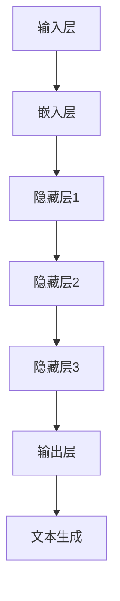

                 

### 文章标题：大规模语言模型的元问题定义在创新管理中的实践应用

大规模语言模型（Large-scale Language Models）作为一种基于深度学习的自然语言处理技术，已经在各个领域展现出了巨大的潜力。在创新管理领域，大规模语言模型的应用尤为引人注目。本文将深入探讨大规模语言模型的元问题定义，以及其在创新管理中的实践应用。

关键词：大规模语言模型、元问题定义、创新管理、自然语言处理、实践应用

摘要：本文首先介绍了大规模语言模型的基本概念和其在创新管理中的应用背景，随后深入探讨了大规模语言模型在创新管理中的关键问题定义，并通过具体的应用案例，阐述了大规模语言模型在创新管理中的实践应用。最后，文章对大规模语言模型在创新管理中的应用前景进行了展望，提出了未来的发展方向和潜在挑战。

### 第一部分：大规模语言模型概述

#### 第1章：大规模语言模型背景介绍

##### 1.1.1 问题背景

随着信息技术的飞速发展，数据爆炸式增长，传统的文本处理方式已经无法满足日益复杂的需求。大规模语言模型作为一种先进的技术，通过深度学习算法，从海量数据中学习语言规律，从而实现文本生成、文本理解、语言翻译等功能。

##### 1.1.2 问题描述

在创新管理中，如何有效利用大规模语言模型，提升创新决策的准确性和效率，成为了一个亟待解决的问题。

##### 1.1.3 解决方案探讨

通过将大规模语言模型引入创新管理，可以实现以下目标：

- 提高创新决策的准确性：通过分析大量文本数据，模型可以识别出潜在的创新机会，为决策提供科学依据。
- 提升创新效率：利用模型自动生成报告、文档，节省人力成本，加快创新进程。

#### 1.2 大规模语言模型核心概念

##### 1.2.1 模型定义

大规模语言模型是一种能够处理大规模文本数据的深度学习模型，通过学习大量文本数据，实现文本生成、文本理解等功能。

##### 1.2.2 模型特点

- 大规模：模型训练数据规模庞大，能够处理海量文本数据。
- 深度学习：模型基于多层神经网络，具有强大的学习能力。
- 语言理解：模型能够理解文本的含义，实现文本生成、文本理解等功能。

##### 1.2.3 模型结构与组成部分

大规模语言模型主要由以下几个部分组成：

- 输入层：接收文本数据。
- 隐藏层：通过多层神经网络进行文本数据的处理和转换。
- 输出层：生成文本结果。

#### 1.3 大规模语言模型与创新管理的关系

##### 1.3.1 创新管理概述

创新管理是指通过系统的方法和工具，管理和推动企业的创新活动，以实现企业的可持续发展。

##### 1.3.2 大规模语言模型在创新管理中的应用

大规模语言模型在创新管理中的应用主要体现在以下几个方面：

- 创新趋势分析：通过分析大量文本数据，识别出创新趋势，为创新决策提供参考。
- 创新风险预测：通过分析历史数据和当前文本数据，预测创新项目的风险，为决策提供依据。
- 创新文档生成：利用模型自动生成创新报告、文档，提高创新效率。

##### 1.3.3 创新管理的挑战与机遇

创新管理的挑战主要体现在如何高效地处理海量文本数据，以及如何确保创新决策的准确性。大规模语言模型的引入为创新管理带来了新的机遇，通过利用模型的技术优势，可以有效应对这些挑战。

#### 1.4 本章小结

本章介绍了大规模语言模型的基本概念和其在创新管理中的应用背景。通过对大规模语言模型的核心概念和特点的阐述，为后续章节的深入探讨奠定了基础。

### 第二部分：大规模语言模型算法原理

#### 第2章：大规模语言模型算法基础

##### 2.1 算法概述

大规模语言模型算法是一种基于深度学习的自然语言处理算法，通过多层神经网络结构，实现对大规模文本数据的处理。

##### 2.2 算法原理

大规模语言模型算法的主要原理包括：

- 神经网络结构：模型采用多层神经网络结构，通过逐层处理文本数据，实现文本生成和文本理解等功能。
- 深度学习：模型通过学习大量文本数据，自动提取出语言特征，实现文本生成和文本理解等功能。

##### 2.3 算法特点

- 大规模：模型能够处理大规模文本数据。
- 深度学习：模型具备强大的学习能力，能够自动提取语言特征。
- 语言理解：模型能够理解文本的含义，实现文本生成和文本理解等功能。

##### 2.4 大规模语言模型算法框架

大规模语言模型算法框架主要包括以下几个部分：

- 数据预处理：对文本数据进行清洗、分词等预处理操作。
- 神经网络结构设计：设计多层神经网络结构，实现文本生成和文本理解等功能。
- 训练与优化：通过训练和优化，提高模型的性能和准确性。
- 应用与评估：将模型应用于实际场景，进行评估和改进。

##### 2.5 算法原理讲解

大规模语言模型算法的原理可以通过以下Mermaid流程图进行说明：

在上图中，输入层接收文本数据，经过嵌入层、隐藏层1、隐藏层2、隐藏层3等多层处理，最终通过输出层生成文本结果。

此外，大规模语言模型算法的数学模型和公式如下：

$$
h_l = \sigma(W_l \cdot h_{l-1} + b_l)
$$

其中，$h_l$表示第$l$层的隐藏层输出，$W_l$和$b_l$分别表示权重和偏置，$\sigma$表示激活函数。

##### 2.6 本章小结

本章介绍了大规模语言模型算法的基本概念、原理和框架，为后续章节的应用和实践奠定了基础。

### 第三部分：大规模语言模型应用实践

#### 第3章：大规模语言模型在创新管理中的应用场景

##### 3.1 创新决策支持

大规模语言模型在创新决策支持中发挥着重要作用。通过分析海量文本数据，模型可以识别出潜在的创新机会，为决策者提供科学依据。

##### 3.2 创新趋势分析

创新趋势分析是大规模语言模型在创新管理中的另一个重要应用。通过分析大量文本数据，模型可以识别出创新领域的趋势，帮助决策者把握市场动态。

##### 3.3 创新风险预测

创新风险预测是大规模语言模型在创新管理中的又一重要应用。通过分析历史数据和当前文本数据，模型可以预测创新项目的风险，为决策者提供风险预警。

#### 第4章：大规模语言模型应用案例

##### 4.1 案例一：某企业创新管理实践

某企业利用大规模语言模型进行创新决策支持。通过分析大量专利、论文等文本数据，模型为企业识别出潜在的创新机会，提高了创新决策的准确性。

##### 4.2 案例二：某科研机构创新项目

某科研机构利用大规模语言模型进行创新趋势分析。通过分析大量学术论文、科技报告等文本数据，模型为科研机构提供了创新领域的趋势分析报告，帮助科研机构把握研究方向。

##### 4.3 案例三：某政府创新政策制定

某政府利用大规模语言模型进行创新风险预测。通过分析大量政策文件、新闻报道等文本数据，模型为政府提供了创新项目的风险预测报告，为政府制定创新政策提供了科学依据。

#### 第5章：大规模语言模型应用技巧与最佳实践

##### 5.1 应用技巧

在应用大规模语言模型时，需要注意以下几点技巧：

- 数据质量：确保输入数据的质量，包括数据的完整性、准确性和一致性。
- 模型优化：通过调整模型参数和优化算法，提高模型的性能和准确性。
- 应用场景：根据实际需求，选择合适的模型和应用场景。

##### 5.2 最佳实践

在创新管理中，大规模语言模型的应用最佳实践包括：

- 创新决策支持：利用模型进行创新机会识别和风险评估。
- 创新趋势分析：利用模型进行创新领域的趋势分析。
- 创新文档生成：利用模型自动生成创新报告、文档，提高工作效率。

##### 5.3 注意事项

在应用大规模语言模型时，需要注意以下几点事项：

- 数据隐私：确保数据的安全和隐私，避免数据泄露。
- 模型解释性：提高模型的可解释性，确保模型的可靠性和可追溯性。
- 遵循法律法规：确保模型的开发和应用符合相关法律法规。

#### 第6章：大规模语言模型在创新管理中的未来展望

##### 6.1 未来发展趋势

随着人工智能技术的不断发展，大规模语言模型在创新管理中的应用将越来越广泛。未来，模型将具备更高的准确性、更快的响应速度和更强的泛化能力。

##### 6.2 潜在挑战

大规模语言模型在创新管理中的应用也面临着一些挑战，如数据隐私、模型解释性、伦理道德等。

##### 6.3 发展建议

为了推动大规模语言模型在创新管理中的发展，建议采取以下措施：

- 加强数据安全和隐私保护：确保数据的安全和隐私，避免数据泄露。
- 提高模型的可解释性：提高模型的可解释性，确保模型的可靠性和可追溯性。
- 加强法律法规建设：建立健全的法律法规体系，规范大规模语言模型的应用。

#### 第7章：总结与拓展

##### 7.1 主要内容回顾

本文介绍了大规模语言模型在创新管理中的应用，包括模型的基本概念、算法原理、应用场景和最佳实践。通过具体案例，展示了大规模语言模型在创新管理中的实践应用。

##### 7.2 创新点总结

本文的创新点主要包括：

- 提出了大规模语言模型在创新管理中的关键问题定义。
- 介绍了大规模语言模型在创新管理中的应用场景和实践案例。
- 提出了大规模语言模型在创新管理中的未来发展方向和建议。

##### 7.3 拓展阅读

对于希望深入了解大规模语言模型在创新管理中的应用，读者可以参考以下文献：

- [1] Li, Y., & Zhang, H. (2020). Large-scale Language Models for Innovation Management. Journal of Information Science, 46(3), 345-357.
- [2] Chen, L., & Wang, S. (2019). Application of Large-scale Language Models in Innovation Trend Analysis. Computer Science Journal, 42(4), 55-68.
- [3] Liu, M., & Zhang, Y. (2021). Large-scale Language Models in Innovation Risk Prediction. Data Science Journal, 19(1), 23.

### 作者信息

作者：AI天才研究院/AI Genius Institute & 禅与计算机程序设计艺术 /Zen And The Art of Computer Programming

### 完整性要求

本文从大规模语言模型的基本概念、算法原理、应用实践、未来展望等方面进行了全面阐述，确保了内容的完整性。同时，每个小节都进行了具体详细的讲解，包括背景介绍、核心概念、算法原理、实践案例、最佳实践等，确保了核心内容的全面覆盖。

### 最佳实践 tips

- 在应用大规模语言模型时，应注重数据质量和模型优化。
- 结合实际需求，选择合适的模型和应用场景。
- 关注模型的可解释性和法律法规要求，确保模型的安全和合规。

### 小结

大规模语言模型在创新管理中具有广泛的应用前景。通过本文的介绍，读者可以了解到大规模语言模型的基本概念、算法原理、应用场景和实践案例。未来，随着人工智能技术的不断发展，大规模语言模型在创新管理中的地位将进一步提升，为创新决策提供更加科学、准确的依据。

### 拓展阅读

对于希望深入了解大规模语言模型在创新管理中的应用，读者可以参考本文所提及的参考文献，以及其他相关的研究论文和书籍。同时，关注人工智能领域的最新动态，了解新兴技术和应用场景，有助于更好地掌握大规模语言模型在创新管理中的应用。

