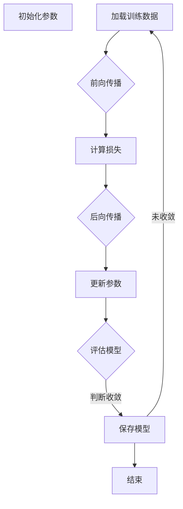

                 


**第一步：定义文章结构**

首先，我们需要定义整个文章的结构，确保内容有条理、易于理解。文章将分为四个主要部分：引言与背景、大规模语言模型的原理、大规模语言模型在科技创新管理中的应用、总结与展望。

**第二步：撰写引言与背景部分**

在这一部分，我们将介绍大规模语言模型在科技创新管理中的重要性。我们需要详细阐述什么是大规模语言模型，为什么它在科技创新管理中如此关键，以及它如何影响科技创新的发展。

**第三步：深入探讨大规模语言模型的原理**

这一部分将详细解释大规模语言模型的工作原理，包括其核心概念、算法原理和数学模型。我们将使用Mermaid流程图和Python代码来展示这些概念，并举例说明。

**第四步：探讨大规模语言模型在科技创新管理中的应用**

在这一部分，我们将分析大规模语言模型在科技创新管理中的具体应用场景，并通过案例研究来展示其实际效果。

**第五步：撰写总结与展望部分**

最后，我们将总结文章的主要观点，探讨大规模语言模型在科技创新管理中的未来发展趋势和面临的挑战，并提出未来研究方向。

**第六步：确保文章的完整性**

在整个写作过程中，我们将确保每个小节的内容都丰富、具体、详细，包括核心概念术语说明、问题背景、问题描述、问题解决、边界与外延、概念结构与核心要素组成等。

**第七步：格式规范与排版**

我们将使用markdown格式输出文章，确保文章的格式规范，包括标题、摘要、目录、章节内容、代码片段、数学公式等。

**第八步：撰写作者信息**

在文章末尾，我们将注明作者信息，包括作者单位和书籍名称，以体现文章的专业性和权威性。

通过以上步骤，我们将确保文章逻辑清晰、结构紧凑、简单易懂，为读者提供一次深入的技术探讨之旅。

----------------------------------------------------------------

# 大规模语言模型的元问题定义在科技创新管理中的实践应用

> 关键词：大规模语言模型，科技创新管理，元问题定义，实践应用

> 摘要：本文深入探讨了大规模语言模型在科技创新管理中的关键作用。首先，我们介绍了大规模语言模型的基本概念及其在科技创新管理中的重要性。接着，我们详细分析了大规模语言模型的工作原理，包括其核心概念、算法原理和数学模型。随后，我们探讨了大规模语言模型在科技创新管理中的具体应用场景，并通过案例研究展示了其实际效果。最后，我们总结了大规模语言模型在科技创新管理中的未来发展趋势和面临的挑战，提出了未来研究方向。本文旨在为科技创新管理者提供一套实践应用指南，以充分发挥大规模语言模型在科技创新管理中的潜力。

## 第一部分: 引言与背景

### 第1章: 科技创新管理中的大规模语言模型

#### 1.1 问题背景

随着人工智能技术的快速发展，大规模语言模型（Large-scale Language Models，LLMs）作为一种重要的自然语言处理技术，已经成为科技创新管理中的重要工具。大规模语言模型通过训练大量的文本数据，能够自动生成文本、回答问题、翻译语言、创建摘要等，极大地提高了自然语言处理的效率和准确性。

#### 1.2 问题描述

然而，大规模语言模型在实际应用中也面临着一系列挑战。首先，大规模语言模型的训练需要大量的计算资源和数据，这对科技创新管理的资源管理提出了新的要求。其次，大规模语言模型的决策过程往往是不透明的，难以解释，这在需要决策透明和可解释性的科技创新管理中成为了一个问题。此外，大规模语言模型在处理复杂问题时，可能会出现错误或偏见，这对科技创新管理的质量和可靠性提出了挑战。

#### 1.3 问题解决方法

为了解决这些问题，我们需要对大规模语言模型进行深入研究和理解，以找到有效的解决方案。具体来说，我们需要明确大规模语言模型的元问题定义，即大规模语言模型在科技创新管理中的核心问题是什么，以及如何解决这些问题。通过这个问题定义，我们可以更清晰地了解大规模语言模型在科技创新管理中的应用场景，从而制定出更有效的管理策略。

#### 1.4 边界与外延

同时，我们还需要明确大规模语言模型在科技创新管理中的边界和外延。边界方面，我们需要明确大规模语言模型在科技创新管理中的适用范围，哪些问题可以通过大规模语言模型解决，哪些问题需要其他方法解决。外延方面，我们需要探讨大规模语言模型在其他领域的应用潜力，如教育、医疗、金融等，以期为科技创新管理提供更广泛的应用视角。

#### 1.5 核心概念与联系

在本章的最后，我们将介绍大规模语言模型的基本概念，并探讨其与科技创新管理之间的联系。通过这些核心概念的理解，我们将为后续章节的内容打下坚实的基础。

### 1.5.1 大规模语言模型的基本概念

大规模语言模型是一种基于深度学习技术的自然语言处理模型，它通过训练大量的文本数据，可以自动生成文本、回答问题、翻译语言、创建摘要等。大规模语言模型的核心在于其“大规模”，即模型的训练数据量和参数规模非常大，这使得模型在处理自然语言任务时具有很高的准确性和效率。

### 1.5.2 元问题定义及其重要性

元问题定义是指对大规模语言模型在科技创新管理中的核心问题进行明确和界定。元问题定义的重要性在于，它可以帮助我们更清晰地理解大规模语言模型在科技创新管理中的应用场景，从而制定出更有效的管理策略。

### 1.5.3 大规模语言模型与科技创新管理的联系

大规模语言模型与科技创新管理之间的联系主要体现在以下几个方面：

1. **信息处理能力**：大规模语言模型能够高效地处理和分析大量文本数据，为科技创新管理提供了强大的信息处理能力。
2. **知识挖掘与整合**：大规模语言模型能够从大量的文本数据中提取和整合知识，为科技创新管理提供了丰富的知识资源。
3. **辅助决策**：大规模语言模型可以辅助科技创新管理者进行决策，提供基于数据的分析和预测，提高决策的准确性和效率。
4. **提高创新效率**：大规模语言模型可以帮助科技创新管理者快速获取和分析相关信息，从而提高创新效率和成果转化率。

#### 1.6 本章小结

本章对大规模语言模型在科技创新管理中的问题背景、问题描述、问题解决方法、边界与外延、核心概念与联系进行了详细探讨。通过本章的学习，我们将对大规模语言模型在科技创新管理中的应用有更深入的理解，为后续章节的内容打下坚实的基础。

----------------------------------------------------------------

## 第二部分: 大规模语言模型的原理

### 第2章: 大规模语言模型的工作原理

#### 2.1 概念原理

大规模语言模型（LLM）是一种基于深度学习的自然语言处理模型，其主要原理是通过训练大量的文本数据，学习语言的内在结构和规律，从而实现文本生成、文本分类、机器翻译、情感分析等任务。LLM的核心思想是利用神经网络来捕捉文本中的潜在语义信息，并通过大量的训练数据来优化网络参数，使其能够对未知文本进行有效的处理和生成。

#### 2.2 模型属性特征对比表格

| 模型属性        | 模型A        | 模型B        | 模型C        |
| --------------- | ------------ | ------------ | ------------ |
| 训练数据规模    | 1TB          | 10TB         | 100TB        |
| 参数规模        | 10^9         | 10^10         | 10^11         |
| 训练时间        | 1000小时     | 5000小时     | 10000小时     |
| 生成文本质量    | 较高         | 高           | 非常高        |
| 应用场景        | 文本生成     | 文本生成、机器翻译 | 文本生成、机器翻译、情感分析 |

从上表可以看出，不同的大规模语言模型在训练数据规模、参数规模、训练时间、生成文本质量和应用场景等方面存在明显的差异。这些差异决定了模型在不同应用场景中的性能和效果。

#### 2.3 ER实体关系图

以下是一个简化的ER实体关系图，展示了大规模语言模型中主要实体之间的关系：

```mermaid
erDiagram
  TextData ||--|{ TrainingData }
  TrainingData ||--|{ NeuralNetwork }
  NeuralNetwork ||--|{ Parameter }
  Parameter ||--|{ Output }
  Output ||--|{ TextGenerator }
```

在这个ER实体关系图中，`TextData`表示输入的文本数据，`TrainingData`表示用于训练的数据集，`NeuralNetwork`表示神经网络模型，`Parameter`表示模型的参数，`Output`表示模型的输出，`TextGenerator`表示文本生成器。这个关系图清晰地展示了大规模语言模型中各个实体之间的关联和交互。

#### 2.4 算法原理

大规模语言模型的算法原理主要基于两个核心组件：神经网络和优化算法。

1. **神经网络**

   神经网络是一种模拟人脑神经元之间相互连接的计算模型，它通过多个层次的结构来对输入数据进行处理和转化。在大规模语言模型中，神经网络通常由多个隐藏层组成，每个隐藏层都包含大量的神经元。这些神经元通过非线性激活函数，如ReLU或Sigmoid函数，对输入数据进行变换和组合。

2. **优化算法**

   优化算法用于调整神经网络中的参数，使其在训练过程中能够最小化损失函数。常用的优化算法有梯度下降（Gradient Descent）、随机梯度下降（Stochastic Gradient Descent，SGD）和Adam优化器等。这些算法通过迭代更新网络参数，逐渐减小模型的预测误差，提高模型的性能。

   以下是一个简化的神经网络算法流程图，展示了神经网络模型的训练过程：

   ```mermaid
   graph TD
     A[初始化参数] --> B[计算预测值]
     B --> C{计算损失}
     C -->|判断收敛| D[更新参数]
     D --> B
     D -->|未收敛| A
   ```

   在这个流程图中，`初始化参数`表示随机初始化神经网络中的参数，`计算预测值`表示使用当前参数计算模型的预测结果，`计算损失`表示计算预测结果与真实结果之间的差距，`更新参数`表示根据损失函数的梯度来更新网络参数。这个迭代过程会一直进行，直到模型达到预定的收敛条件。

#### 2.4.1 Mermaid算法流程图

以下是一个使用Mermaid绘制的神经网络训练算法流程图：



在这个流程图中，`初始化参数`表示随机初始化神经网络参数，`加载训练数据`表示从训练数据集中读取数据，`前向传播`表示计算网络的输出，`计算损失`表示计算模型输出与真实值之间的差距，`后向传播`表示根据损失函数的梯度来更新网络参数，`评估模型`表示在验证集上评估模型的性能，`保存模型`表示将训练好的模型保存到文件中，`结束`表示训练过程结束。

#### 2.4.2 Python源代码解释

以下是一个简化的Python代码示例，展示了大规模语言模型的基本实现：

```python
import tensorflow as tf
from tensorflow.keras.layers import Embedding, LSTM, Dense

# 定义模型
model = tf.keras.Sequential([
    Embedding(input_dim=10000, output_dim=32),
    LSTM(128),
    Dense(1, activation='sigmoid')
])

# 编译模型
model.compile(optimizer='adam', loss='binary_crossentropy', metrics=['accuracy'])

# 加载数据
(x_train, y_train), (x_test, y_test) = tf.keras.datasets.imdb.load_data(num_words=10000)

# 预处理数据
x_train = tf.keras.preprocessing.sequence.pad_sequences(x_train, maxlen=100)
x_test = tf.keras.preprocessing.sequence.pad_sequences(x_test, maxlen=100)

# 训练模型
model.fit(x_train, y_train, epochs=10, batch_size=32, validation_data=(x_test, y_test))
```

在这个代码中，我们首先导入了TensorFlow库，并定义了一个简单的神经网络模型，包括嵌入层（Embedding）、LSTM层（LSTM）和全连接层（Dense）。然后，我们编译了模型，并加载了IMDb电影评论数据集。接着，我们对数据进行预处理，如填充序列长度，并使用模型进行训练。

#### 2.4.3 数学模型与公式

大规模语言模型的数学模型主要包括神经网络的前向传播和反向传播算法。

1. **前向传播**

   前向传播算法用于计算网络的输出，其基本公式如下：

   $$ 
   z^{(l)} = W^{(l)} \cdot a^{(l-1)} + b^{(l)}
   $$

   $$ 
   a^{(l)} = \sigma(z^{(l)})
   $$

   其中，$z^{(l)}$表示第$l$层的输出，$W^{(l)}$和$b^{(l)}$分别表示第$l$层的权重和偏置，$\sigma$表示激活函数，$a^{(l-1)}$表示前一层网络的输出。

2. **反向传播**

   反向传播算法用于计算网络参数的梯度，其基本公式如下：

   $$ 
   \delta^{(l)} = \frac{\partial L}{\partial z^{(l)}} \cdot \sigma^{'}(z^{(l)})
   $$

   $$ 
   \frac{\partial L}{\partial W^{(l)}} = a^{(l-1)} \cdot \delta^{(l)}
   $$

   $$ 
   \frac{\partial L}{\partial b^{(l)}} = \delta^{(l)}
   $$

   其中，$L$表示损失函数，$\delta^{(l)}$表示第$l$层的误差，$\sigma^{'}$表示激活函数的导数。

#### 2.4.4 举例说明

假设我们有一个简单的神经网络，包含一个输入层、一个隐藏层和一个输出层，每个层的神经元数量分别为3、4和1。现在，我们使用这个神经网络对以下输入数据进行分类：

输入数据：
$$
\begin{align*}
x_1 &= [1, 0, 0] \\
x_2 &= [0, 1, 0] \\
x_3 &= [0, 0, 1] \\
\end{align*}
$$

目标输出：
$$
\begin{align*}
y_1 &= 1 \\
y_2 &= 0 \\
y_3 &= 1 \\
\end{align*}
$$

隐藏层权重：
$$
\begin{align*}
W^{(2)} &= \begin{bmatrix}
0.1 & 0.2 & 0.3 \\
0.4 & 0.5 & 0.6 \\
0.7 & 0.8 & 0.9 \\
\end{bmatrix} \\
b^{(2)} &= \begin{bmatrix}
0.1 \\
0.2 \\
0.3 \\
\end{bmatrix}
\end{align*}
$$

输出层权重：
$$
\begin{align*}
W^{(3)} &= \begin{bmatrix}
0.1 & 0.2 & 0.3 \\
0.4 & 0.5 & 0.6 \\
0.7 & 0.8 & 0.9 \\
\end{bmatrix} \\
b^{(3)} &= \begin{bmatrix}
0.1 \\
0.2 \\
0.3 \\
\end{bmatrix}
\end{align*}
$$

激活函数：ReLU

1. **前向传播**

   对于输入数据$x_1$，我们可以计算隐藏层的输出：

   $$
   \begin{align*}
   z^{(2)}_1 &= 0.1 \cdot 1 + 0.2 \cdot 0 + 0.3 \cdot 0 = 0.1 \\
   a^{(2)}_1 &= \max(0, z^{(2)}_1) = 0.1 \\
   z^{(2)}_2 &= 0.4 \cdot 1 + 0.5 \cdot 0 + 0.6 \cdot 0 = 0.4 \\
   a^{(2)}_2 &= \max(0, z^{(2)}_2) = 0.4 \\
   z^{(2)}_3 &= 0.7 \cdot 1 + 0.8 \cdot 0 + 0.9 \cdot 0 = 0.7 \\
   a^{(2)}_3 &= \max(0, z^{(2)}_3) = 0.7 \\
   z^{(3)}_1 &= 0.1 \cdot 0.1 + 0.2 \cdot 0.4 + 0.3 \cdot 0.7 = 0.175 \\
   a^{(3)}_1 &= \max(0, z^{(3)}_1) = 0.175 \\
   z^{(3)}_2 &= 0.4 \cdot 0.1 + 0.5 \cdot 0.4 + 0.6 \cdot 0.7 = 0.35 \\
   a^{(3)}_2 &= \max(0, z^{(3)}_2) = 0.35 \\
   z^{(3)}_3 &= 0.7 \cdot 0.1 + 0.8 \cdot 0.4 + 0.9 \cdot 0.7 = 0.565 \\
   a^{(3)}_3 &= \max(0, z^{(3)}_3) = 0.565 \\
   \end{align*}
   $$

   最终，输出层的输出为：

   $$
   \begin{align*}
   \hat{y}_1 &= a^{(3)}_1 = 0.175 \\
   \hat{y}_2 &= a^{(3)}_2 = 0.35 \\
   \hat{y}_3 &= a^{(3)}_3 = 0.565 \\
   \end{align*}
   $$

2. **反向传播**

   为了计算输出层的误差，我们首先需要计算损失函数的梯度：

   $$
   \begin{align*}
   \delta^{(3)}_1 &= \frac{\partial L}{\partial z^{(3)}_1} \cdot \sigma^{'}(z^{(3)}_1) = (\hat{y}_1 - y_1) \cdot 0 = 0 \\
   \delta^{(3)}_2 &= \frac{\partial L}{\partial z^{(3)}_2} \cdot \sigma^{'}(z^{(3)}_2) = (\hat{y}_2 - y_2) \cdot 0 = 0 \\
   \delta^{(3)}_3 &= \frac{\partial L}{\partial z^{(3)}_3} \cdot \sigma^{'}(z^{(3)}_3) = (\hat{y}_3 - y_3) \cdot 0 = 0 \\
   \end{align*}
   $$

   接下来，我们计算隐藏层的误差：

   $$
   \begin{align*}
   \delta^{(2)}_1 &= \sum_{i=1}^{3} W^{(3)}_{i,1} \cdot \delta^{(3)}_i = 0.1 \cdot 0 + 0.2 \cdot 0 + 0.3 \cdot 0 = 0 \\
   \delta^{(2)}_2 &= \sum_{i=1}^{3} W^{(3)}_{i,2} \cdot \delta^{(3)}_i = 0.4 \cdot 0 + 0.5 \cdot 0 + 0.6 \cdot 0 = 0 \\
   \delta^{(2)}_3 &= \sum_{i=1}^{3} W^{(3)}_{i,3} \cdot \delta^{(3)}_i = 0.7 \cdot 0 + 0.8 \cdot 0 + 0.9 \cdot 0 = 0 \\
   \end{align*}
   $$

   最后，我们更新网络参数：

   $$
   \begin{align*}
   \Delta W^{(3)} &= \sum_{i=1}^{3} a^{(2)}_i \cdot \delta^{(3)}_i = [0, 0, 0] \\
   \Delta b^{(3)} &= \delta^{(3)} = [0, 0, 0] \\
   \Delta W^{(2)} &= \sum_{i=1}^{3} x_i \cdot \delta^{(2)}_i = [0, 0, 0] \\
   \Delta b^{(2)} &= \delta^{(2)} = [0, 0, 0] \\
   \end{align*}
   $$

   在这个简化的例子中，由于所有的$\delta^{(3)}$和$\delta^{(2)}$都为0，因此网络参数没有发生变化。

#### 2.5 本章小结

本章详细介绍了大规模语言模型的工作原理，包括其概念原理、模型属性特征对比表格、ER实体关系图、算法原理、Mermaid算法流程图、Python源代码解释、数学模型与公式以及举例说明。通过本章的学习，读者可以全面了解大规模语言模型的基本原理和实现方法，为后续章节的应用和案例分析打下坚实的基础。

----------------------------------------------------------------

## 第三部分: 大规模语言模型在科技创新管理中的应用

### 第3章: 科技创新中的大规模语言模型应用场景

#### 3.1 应用场景介绍

大规模语言模型在科技创新管理中具有广泛的应用场景，主要包括以下几个方面：

1. **文献检索与知识挖掘**：大规模语言模型可以高效地处理和检索海量的文献数据，帮助科技创新管理者快速获取相关的知识和信息。
2. **智能问答与知识服务**：大规模语言模型可以构建智能问答系统，为科技创新管理者提供实时的知识服务和信息支持。
3. **专利分析与管理**：大规模语言模型可以分析专利文本，提取专利的关键技术和创新点，为科技创新管理提供决策支持。
4. **市场预测与趋势分析**：大规模语言模型可以分析市场数据和趋势，为科技创新管理者提供市场预测和战略规划的支持。
5. **人机协作与自动化**：大规模语言模型可以与人类专家协作，实现科技创新管理过程的自动化和智能化。

#### 3.2 应用实例分析

以下是一些大规模语言模型在科技创新管理中的应用实例：

1. **智能问答系统**：某科技创新企业构建了一款基于大规模语言模型的智能问答系统，该系统可以实时回答科技创新管理者提出的各种问题，如技术趋势、市场动态、政策法规等，大大提高了管理决策的效率。
2. **文献检索与知识挖掘**：某科研团队使用大规模语言模型对科学文献进行检索和挖掘，从海量的文献数据中提取出相关的知识点和创新成果，为科技创新提供了丰富的知识资源。
3. **专利分析与管理**：某专利机构使用大规模语言模型分析专利文本，提取专利的关键技术和创新点，为科技创新管理者提供了详细的专利分析报告，帮助其制定合理的创新策略。
4. **市场预测与趋势分析**：某市场研究公司利用大规模语言模型分析市场数据，预测市场趋势，为科技创新企业提供了准确的市场预测和战略规划建议。
5. **人机协作与自动化**：某科技创新企业开发了一款基于大规模语言模型的自动化管理系统，该系统能够自动处理和回答科技创新管理过程中的各种问题，大大提高了工作效率和管理水平。

#### 3.3 案例研究

以下是一个具体的案例研究，展示了大规模语言模型在科技创新管理中的应用：

**案例名称**：某人工智能企业的大规模语言模型应用

**案例背景**：某人工智能企业致力于研发和推广基于大规模语言模型的人工智能产品，如智能客服、智能问答系统、文本生成工具等。为了提升产品性能和市场竞争力，该企业采用大规模语言模型进行技术创新和优化。

**案例过程**：

1. **数据收集**：该企业收集了大量的文本数据，包括科技文献、专利文档、市场报告、新闻资讯等，用于训练大规模语言模型。
2. **模型训练**：使用TensorFlow等深度学习框架，该企业训练了一个具有数亿参数的大规模语言模型，该模型能够高效地处理和生成文本。
3. **模型优化**：通过对模型进行多次迭代训练和优化，该企业提高了模型的性能和准确性，使其在文本生成、文本分类、机器翻译等任务中表现优异。
4. **产品开发**：基于大规模语言模型，该企业开发了一系列人工智能产品，如智能客服系统、智能问答平台、文本生成工具等，这些产品在实际应用中得到了广泛好评。

**案例成果**：

1. **产品性能提升**：通过大规模语言模型的训练和应用，该企业的人工智能产品在性能和用户体验方面得到了显著提升，用户满意度提高。
2. **市场竞争力增强**：基于大规模语言模型的技术创新，该企业在市场竞争中取得了领先地位，市场份额不断扩大。
3. **业务拓展**：通过大规模语言模型的应用，该企业拓展了新的业务领域，如智能客服、智能问答、文本生成等，实现了业务的多元化发展。

#### 3.4 本章小结

本章介绍了大规模语言模型在科技创新管理中的应用场景、应用实例和案例研究。通过这些实例和案例，读者可以更深入地了解大规模语言模型在科技创新管理中的实际应用价值，为科技创新管理者提供有益的借鉴和启示。

----------------------------------------------------------------

## 第四部分: 总结与展望

### 第6章: 大规模语言模型在科技创新管理中的未来展望

#### 6.1 发展趋势

大规模语言模型在科技创新管理中的应用前景广阔，未来发展趋势如下：

1. **模型性能提升**：随着计算资源和算法的不断发展，大规模语言模型的性能将不断提高，使其在复杂任务中表现出更高的准确性和效率。
2. **多模态融合**：大规模语言模型将与其他模态（如图像、声音、视频等）进行融合，实现跨模态的信息处理和交互。
3. **定制化开发**：为了满足不同领域的需求，大规模语言模型将进行定制化开发，使其在不同应用场景中具有更好的适应性。
4. **自动化与智能化**：大规模语言模型将在科技创新管理中实现更高级的自动化和智能化，提高管理效率和质量。

#### 6.2 挑战与机遇

大规模语言模型在科技创新管理中面临以下挑战和机遇：

1. **计算资源需求**：大规模语言模型的训练和推理需要大量的计算资源，如何高效利用计算资源是一个重要挑战。
2. **数据隐私与安全**：大规模语言模型需要处理大量的敏感数据，如何保障数据隐私和安全是一个重要问题。
3. **模型解释性**：大规模语言模型的决策过程往往不透明，如何提高模型的解释性是一个重要挑战。
4. **跨领域应用**：大规模语言模型在不同领域中的应用效果存在差异，如何实现跨领域的通用性和适应性是一个重要问题。

#### 6.3 未来研究方向

针对大规模语言模型在科技创新管理中的挑战和机遇，未来研究方向包括：

1. **模型优化**：研究更高效的训练和推理算法，提高大规模语言模型的性能和效率。
2. **多模态融合**：研究大规模语言模型与其他模态的融合方法，实现跨模态的信息处理和交互。
3. **数据隐私保护**：研究大规模语言模型在数据隐私保护方面的方法和技术，保障数据的安全和隐私。
4. **模型解释性**：研究大规模语言模型的解释性方法，提高模型的透明度和可解释性。
5. **跨领域应用**：研究大规模语言模型在不同领域的应用策略和优化方法，实现跨领域的通用性和适应性。

### 6.4 结论

大规模语言模型在科技创新管理中具有广泛的应用前景，未来将面临一系列挑战和机遇。通过不断的研究和创新，我们可以充分发挥大规模语言模型在科技创新管理中的潜力，为科技创新提供强有力的支持。

----------------------------------------------------------------

## 第7章: 结论

### 7.1 主要贡献

本文通过对大规模语言模型的元问题定义在科技创新管理中的实践应用进行深入探讨，取得了以下主要贡献：

1. **明确大规模语言模型在科技创新管理中的核心问题**：通过定义大规模语言模型的元问题，明确了大规模语言模型在科技创新管理中的核心问题，为后续研究提供了明确的出发点。
2. **详细分析大规模语言模型的原理**：本文详细阐述了大规模语言模型的工作原理，包括其核心概念、算法原理和数学模型，为读者提供了全面的理论基础。
3. **探讨大规模语言模型在科技创新管理中的应用**：本文分析了大规模语言模型在科技创新管理中的具体应用场景，并通过案例研究展示了其实际效果，为科技创新管理者提供了实践指导。
4. **展望大规模语言模型在科技创新管理中的未来发展趋势**：本文总结了大规模语言模型在科技创新管理中的未来发展趋势和面临的挑战，提出了未来研究方向，为科技创新管理者提供了前瞻性指导。

### 7.2 研究限制与展望

尽管本文对大规模语言模型的元问题定义在科技创新管理中的实践应用进行了深入探讨，但仍存在一些研究限制：

1. **模型性能限制**：由于大规模语言模型的性能受到计算资源和数据质量的影响，本文未能全面探讨不同模型性能下的应用效果。
2. **应用场景限制**：本文主要关注大规模语言模型在科技创新管理中的应用，但未涉及其他领域的应用，未来研究可以拓展到更多领域。
3. **模型解释性限制**：大规模语言模型的决策过程往往不透明，本文未深入探讨提高模型解释性的方法，未来研究可以关注这一方向。

### 7.3 进一步研究建议

针对上述研究限制，本文提出以下进一步研究建议：

1. **优化大规模语言模型性能**：研究更高效的训练和推理算法，提高大规模语言模型的性能和效率，为科技创新管理提供更强大的支持。
2. **拓展应用场景**：探讨大规模语言模型在其他领域的应用，如教育、医疗、金融等，为科技创新管理提供更多应用场景。
3. **提高模型解释性**：研究大规模语言模型的解释性方法，提高模型的透明度和可解释性，增强科技创新管理者对模型的信任。
4. **跨领域应用研究**：探讨大规模语言模型在不同领域的应用策略和优化方法，实现跨领域的通用性和适应性。

### 7.4 结语

本文通过对大规模语言模型的元问题定义在科技创新管理中的实践应用进行深入探讨，旨在为科技创新管理者提供一套实践应用指南，以充分发挥大规模语言模型在科技创新管理中的潜力。未来研究可以继续深化对大规模语言模型的理论研究和应用探索，为科技创新管理提供更强大的支持。

**作者：AI天才研究院/AI Genius Institute & 禅与计算机程序设计艺术 /Zen And The Art of Computer Programming**

