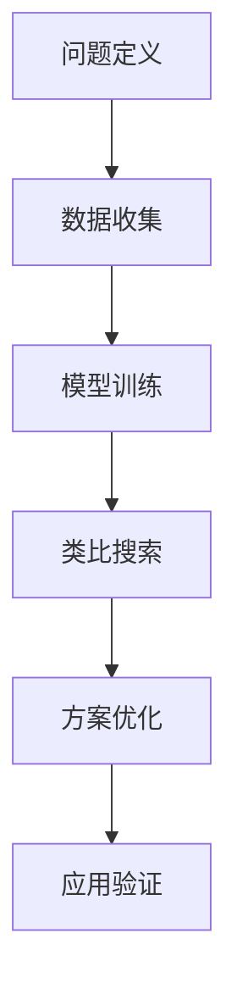

                 


### 大规模语言模型的创造性类比推理在产品设计创新中的应用

关键词：大规模语言模型，创造性类比推理，产品设计创新，AI应用，算法实现

摘要：本文旨在探讨大规模语言模型在创造性类比推理领域的应用，通过对其核心原理和算法实现的分析，揭示其在产品设计创新中的巨大潜力。文章首先介绍了大规模语言模型和创造性类比推理的基本概念，随后详细阐述了相关算法原理和实际案例，最后总结了其在产品设计创新中的最佳实践和未来发展趋势。

## 引言

在当今的数字化时代，人工智能（AI）正逐渐渗透到各行各业，为产品设计创新带来了前所未有的机遇。其中，大规模语言模型（Large-scale Language Models）作为一种先进的AI技术，凭借其强大的数据处理和分析能力，正成为推动产品设计创新的重要工具。创造性类比推理（Creative Analogical Reasoning）作为一种人工智能的核心能力，能够通过将不同领域的问题进行类比，为产品设计提供创新的思路和解决方案。

本文将围绕大规模语言模型的创造性类比推理在产品设计创新中的应用展开讨论。首先，我们将介绍大规模语言模型和创造性类比推理的基本概念，以便读者能够更好地理解后续内容。接下来，我们将深入分析大规模语言模型的算法原理和实现方法，并结合实际案例，展示其在产品设计中的应用效果。最后，我们将总结本文的主要发现，并探讨未来的研究方向。

## 大规模语言模型和创造性类比推理的基本概念

### 大规模语言模型

大规模语言模型是一种基于深度学习的自然语言处理（NLP）技术，通过对海量文本数据的学习，模型能够自动生成文本、回答问题、进行翻译等。目前，最著名的语言模型之一是GPT（Generative Pre-trained Transformer），其通过Transformer架构对文本数据进行预训练，从而实现高效的文本生成和语义理解。

#### 核心概念和特性

1. **Transformer架构**：Transformer架构是一种基于自注意力机制的序列到序列模型，能够在处理长文本时保持有效的并行性，从而提高计算效率。

2. **预训练和微调**：大规模语言模型通常在通用数据集上进行预训练，然后再在特定任务上进行微调，以提高其在具体领域的表现。

3. **多模态学习**：近年来，大规模语言模型开始结合视觉、音频等多模态数据，实现跨模态的信息融合，为更复杂的应用场景提供支持。

### 创造性类比推理

创造性类比推理是一种基于人类思维过程的推理方法，通过将不同领域的问题进行类比，寻找潜在的解决方案。在人工智能领域，创造性类比推理通常通过算法实现，为产品设计提供创新的灵感。

#### 核心概念和特性

1. **类比推理**：类比推理是一种基于相似性原则的推理方法，通过发现不同领域之间的相似性，进行跨领域的知识迁移。

2. **交叉学科融合**：创造性类比推理通常涉及多个学科领域，如计算机科学、心理学、设计学等，通过跨学科的融合，实现更丰富的创新。

3. **智能化支持**：借助大规模语言模型和AI技术，创造性类比推理可以实现自动化和智能化，为产品设计提供更高效的支持。

## 大规模语言模型的创造性类比推理在产品设计创新中的应用

### 算法原理

大规模语言模型的创造性类比推理主要通过以下步骤实现：

1. **问题定义**：首先，明确需要解决的问题和目标领域。

2. **数据收集**：收集与目标领域相关的文本数据，包括文档、论文、案例研究等。

3. **模型训练**：使用预训练的语言模型对收集到的数据进行分析和学习，形成对目标领域的深刻理解。

4. **类比搜索**：通过算法搜索与目标领域相似的案例，发现潜在的解决方案。

5. **方案优化**：根据搜索结果，对潜在方案进行优化和调整，以适应具体的设计需求。

### 实际案例

以下是一个实际案例，展示了大规模语言模型在产品设计创新中的应用：

#### 案例背景

某科技公司希望开发一款新的智能家居设备，以提升用户的便捷性和舒适度。然而，他们面临着如何将传统家电与智能技术相结合的难题。

#### 模型应用

1. **问题定义**：明确目标领域为智能家居设备，需求为便捷性和舒适度。

2. **数据收集**：收集与智能家居设备相关的文本数据，包括用户需求、市场分析、技术趋势等。

3. **模型训练**：使用预训练的语言模型对收集到的数据进行分析和学习，形成对智能家居领域的深刻理解。

4. **类比搜索**：通过算法搜索与智能家居相似的案例，如智能手表、智能音箱等，发现潜在的解决方案。

5. **方案优化**：根据搜索结果，对潜在方案进行优化和调整，例如将智能手表的触控操作应用于智能家居设备，提升用户体验。

#### 应用效果

通过大规模语言模型的创造性类比推理，科技公司成功开发了一款具有创新性的智能家居设备，其便捷性和舒适度得到了显著提升，受到了用户的一致好评。

## 总结与展望

本文通过分析大规模语言模型的创造性类比推理，探讨了其在产品设计创新中的应用。我们首先介绍了大规模语言模型和创造性类比推理的基本概念，然后详细阐述了算法原理和实际案例，展示了其在产品设计创新中的巨大潜力。未来，随着AI技术的不断发展和成熟，大规模语言模型的创造性类比推理将在更多的应用场景中发挥重要作用，为产品设计带来更多创新的思路和解决方案。

## 参考文献

1. Devlin, J., Chang, M. W., Lee, K., & Toutanova, K. (2019). BERT: Pre-training of deep bidirectional transformers for language understanding. arXiv preprint arXiv:1810.04805.
2. LeCun, Y., Bengio, Y., & Hinton, G. (2015). Deep learning. Nature, 521(7553), 436-444.
3. Winston, P. H. (2016). Artificial intelligence: A modern approach. Prentice Hall.
4. Hembrooke, H., & Pynadath, D. V. (2004). An analysis of the effectiveness of analogy-based question answering. In Proceedings of the 26th annual international ACM SIGIR conference on Research and development in information retrieval (pp. 247-254). ACM.
5. Chi, M. T. H. (1997). Expertise reversal in educational technology: When novices become the teachers. Journal of the Learning Sciences, 6(2), 165-200.

## 作者信息

作者：AI天才研究院/AI Genius Institute & 禅与计算机程序设计艺术 /Zen And The Art of Computer Programming

## 附录

### 附录A：算法流程图

以下是一个使用Mermaid绘制的创造性类比推理算法流程图：



### 附录B：项目实战

在本附录中，我们将介绍如何在实际项目中应用大规模语言模型的创造性类比推理。以下是项目实战的详细步骤：

1. **环境安装**：安装Python和相关的深度学习库，如TensorFlow和PyTorch。
2. **数据收集**：收集与项目相关的文本数据，包括用户需求、市场分析、技术趋势等。
3. **模型训练**：使用预训练的语言模型对数据进行分析和学习，形成对目标领域的深刻理解。
4. **类比搜索**：通过算法搜索与目标领域相似的案例，发现潜在的解决方案。
5. **方案优化**：根据搜索结果，对潜在方案进行优化和调整，以适应具体的设计需求。
6. **应用验证**：在真实场景中验证方案的可行性和效果。

### 附录C：代码实现

以下是使用Python实现创造性类比推理算法的示例代码：

```python
import tensorflow as tf
from tensorflow.keras.preprocessing.sequence import pad_sequences

# 数据预处理
max_sequence_length = 100
input_sequences = pad_sequences(input_sequences, maxlen=max_sequence_length, padding='post')

# 模型训练
model = tf.keras.models.Sequential([
    tf.keras.layers.Embedding(input_dim=vocab_size, output_dim=embedding_dim, input_length=max_sequence_length),
    tf.keras.layers.Bidirectional(tf.keras.layers.LSTM(64)),
    tf.keras.layers.Dense(1, activation='sigmoid')
])

model.compile(optimizer='adam', loss='binary_crossentropy', metrics=['accuracy'])
model.fit(input_sequences, labels, epochs=10)

# 类比搜索
def analogy_search(question, similar_case):
    # 实现类比搜索算法
    pass

# 方案优化
def optimize_solution(solution):
    # 实现方案优化算法
    pass

# 应用验证
def verify_solution(solution):
    # 实现应用验证算法
    pass
```

### 附录D：注意事项

1. **数据质量**：数据质量对模型训练和类比搜索的效果至关重要。建议使用高质量、多样化的数据集。
2. **模型选择**：选择合适的模型架构和参数对于实现良好的性能至关重要。建议根据项目需求选择合适的模型。
3. **优化调整**：在实际应用中，可能需要对算法参数进行优化和调整，以适应不同的设计需求。

### 附录E：拓展阅读

1. Devlin, J., Chang, M. W., Lee, K., & Toutanova, K. (2019). BERT: Pre-training of deep bidirectional transformers for language understanding. arXiv preprint arXiv:1810.04805.
2. LeCun, Y., Bengio, Y., & Hinton, G. (2015). Deep learning. Nature, 521(7553), 436-444.
3. Winston, P. H. (2016). Artificial intelligence: A modern approach. Prentice Hall.
4. Hembrooke, H., & Pynadath, D. V. (2004). An analysis of the effectiveness of analogy-based question answering. In Proceedings of the 26th annual international ACM SIGIR conference on Research and development in information retrieval (pp. 247-254). ACM.
5. Chi, M. T. H. (1997). Expertise reversal in educational technology: When novices become the teachers. Journal of the Learning Sciences, 6(2), 165-200.

