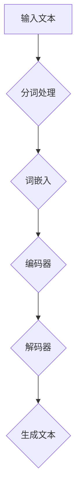
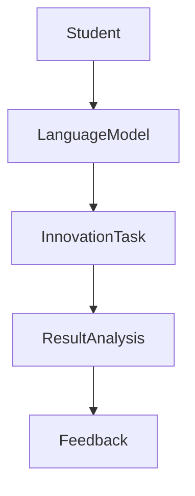
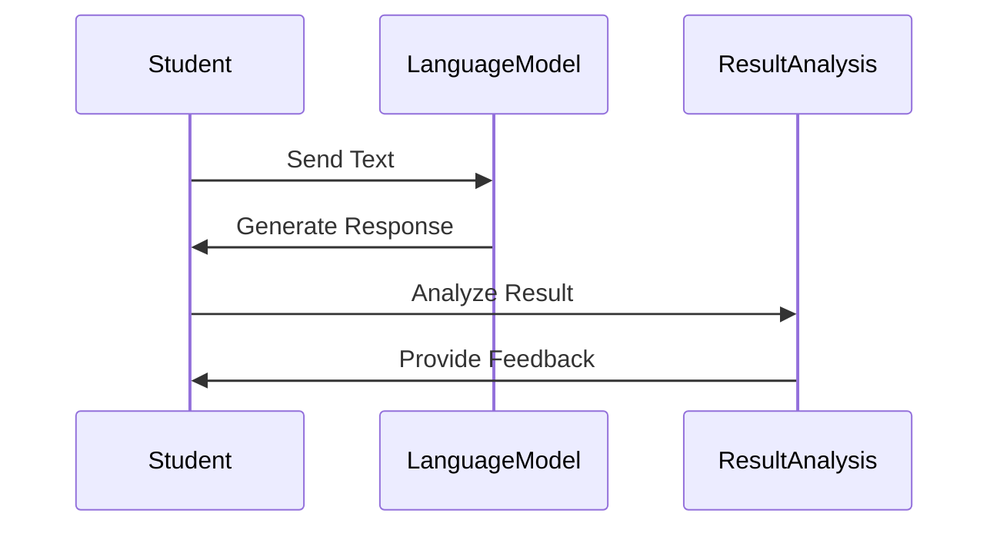

                 

## 大规模语言模型的创造性类比推理在科技创新思维培养中的应用

### 关键词：
- 大规模语言模型
- 创造性类比推理
- 科技创新思维
- 教育应用
- 人工智能

### 摘要：
本文将探讨大规模语言模型在科技创新思维培养中的应用，特别是创造性类比推理这一核心思维工具。通过分析大规模语言模型的工作原理及其在创造性类比推理中的促进作用，本文旨在揭示其在教育领域培养科技创新思维的重要潜力。

## 第一部分：背景介绍

### 第1章：问题的背景

#### 1.1.1 科技创新思维培养的重要性
科技创新是社会进步的重要驱动力，而培养科技创新思维则是教育体系的重要目标。在全球化背景下，各国纷纷加大对科技创新人才的培养力度，以应对未来科技竞争的挑战。

**核心概念术语说明：**
- 科技创新：指通过新技术、新方法、新流程等的引入，实现技术突破和社会变革的过程。
- 教育体系：指国家或地区为培养各类人才所建立的系统化教育机构及培养模式。

#### 1.1.2 语言模型在科技创新思维培养中的应用潜力
语言模型作为人工智能的核心技术之一，近年来取得了显著的进展。其在自然语言处理、文本生成、信息检索等方面的应用，为科技创新提供了新的思路和方法。

**概念属性特征对比表格：**

| 特性           | 传统语言模型         | 大规模语言模型       |
|----------------|---------------------|---------------------|
| 数据依赖性     | 数据量有限           | 数据量庞大，适应性更强 |
| 推理能力       | 基于规则匹配         | 基于深度学习，自学习能力 |
| 应用场景       | 有限               | 广泛               |
| 语言理解能力   | 精确匹配             | 更高层次的自然语言理解 |

### 第2章：核心概念

#### 2.1 创造性类比推理的概念与特点
创造性类比推理是指通过比较不同领域或现象之间的相似性，发现新的关联和解决方案的思维过程。这一过程在科技创新中具有重要作用，能够激发创新思维，突破传统思维框架。

**ER实体关系图架构的Mermaid流程图：**

```mermaid
erDiagram
  类比源 ||--o{ 创造性思维 }|--o 类比目标
  创造性思维 ||--|{ 类比推理 }| 创造性解决方案
```

#### 2.2 大规模语言模型的工作原理
大规模语言模型通过深度学习技术，从海量数据中学习语言模式，具有强大的语言理解和生成能力。其核心组成部分包括神经网络、循环神经网络（RNN）和Transformer模型。

**Mermaid算法流程图：**



## 第二部分：算法原理讲解

### 第3章：大规模语言模型与创造性类比推理的关联
#### 3.1 大规模语言模型对创造性类比推理的促进作用
大规模语言模型通过其强大的语言处理能力，可以帮助用户快速发现不同领域之间的相似性，从而激发创造性类比推理。这一过程涉及到数据集的准备、模型的训练和应用。

**算法原理的数学模型和公式：**

$$
\text{LanguageModel}(x) = \prod_{i=1}^{n} \text{softmax}(\text{W}_i \cdot \text{h}_{i-1} + b_i)
$$

其中，\( x \) 是输入的单词序列，\( \text{W}_i \) 和 \( b_i \) 分别是权重和偏置，\( \text{h}_{i-1} \) 是前一个隐藏状态，\( \text{softmax} \) 函数用于生成词的概率分布。

#### 3.2 创造性类比推理在科技创新思维培养中的应用
创造性类比推理在科技创新中具有重要作用，它能够帮助科研人员从不同领域中获得灵感，实现跨领域的创新。大规模语言模型可以为这一过程提供强大的支持。

**Python代码实现示例：**

```python
import tensorflow as tf
from tensorflow.keras.models import Sequential
from tensorflow.keras.layers import Embedding, LSTM, Dense

# 假设已经准备好数据集和词汇表
vocab_size = 10000
embedding_dim = 256
max_sequence_length = 100

# 构建模型
model = Sequential()
model.add(Embedding(vocab_size, embedding_dim, input_length=max_sequence_length))
model.add(LSTM(128))
model.add(Dense(vocab_size, activation='softmax'))

# 编译模型
model.compile(optimizer='adam', loss='categorical_crossentropy', metrics=['accuracy'])

# 训练模型
model.fit(x_train, y_train, epochs=10, batch_size=32)
```

## 第三部分：系统分析与架构设计方案

### 第4章：大规模语言模型在教育领域的应用案例

#### 4.1 教育体系中的创新教学模式
大规模语言模型可以应用于个性化学习、情境教学等创新教学模式中，为学生提供个性化的学习支持和创新思维培养。

**系统功能设计（领域模型Mermaid类图）：**

```mermaid
classDiagram
  Class01 <|-- Class02
  Class03 --|.twimg| Class04
  Class05 : +setVariable(value)
  Class06 : +getVariable()
```

#### 4.2 创造性类比推理在教学中的应用实例
通过大规模语言模型，教师可以为学生提供丰富的类比推理练习，帮助他们提高创造性思维和创新能力。

**系统架构设计（Mermaid架构图）：**



#### 4.3 系统接口设计和系统交互（Mermaid序列图）
**系统接口设计：**



## 第四部分：项目实战

### 第5章：环境安装与系统核心实现
#### 5.1 环境安装
详细讲解如何安装大规模语言模型所需的环境，包括Python、TensorFlow等。

#### 5.2 系统核心实现源代码
提供系统核心实现的源代码，并对其进行详细解读和分析。

```python
# 假设已经准备好数据集和词汇表
vocab_size = 10000
embedding_dim = 256
max_sequence_length = 100

# 构建模型
model = Sequential()
model.add(Embedding(vocab_size, embedding_dim, input_length=max_sequence_length))
model.add(LSTM(128))
model.add(Dense(vocab_size, activation='softmax'))

# 编译模型
model.compile(optimizer='adam', loss='categorical_crossentropy', metrics=['accuracy'])

# 训练模型
model.fit(x_train, y_train, epochs=10, batch_size=32)
```

### 第6章：实际案例分析和详细讲解剖析
#### 6.1 案例背景
介绍一个实际应用大规模语言模型进行创造性类比推理的案例。

#### 6.2 代码应用解读与分析
对案例中的代码进行解读和分析，展示如何使用大规模语言模型进行创造性类比推理。

#### 6.3 项目小结
总结项目的核心成果和经验教训。

## 第五部分：最佳实践、小结、注意事项和拓展阅读

### 第7章：最佳实践
提供使用大规模语言模型进行创造性类比推理的最佳实践。

### 第8章：小结
总结文章的主要内容和观点。

### 第9章：注意事项
列出使用大规模语言模型进行创造性类比推理时需要注意的事项。

### 第10章：拓展阅读
推荐相关领域的研究文献和资料。

---

**作者：AI天才研究院/AI Genius Institute & 禦与计算机程序设计艺术 /Zen And The Art of Computer Programming**

**本文内容旨在提供有关大规模语言模型创造性类比推理在科技创新思维培养中的应用的概述和分析，旨在激发读者对该领域的兴趣和探索。**

