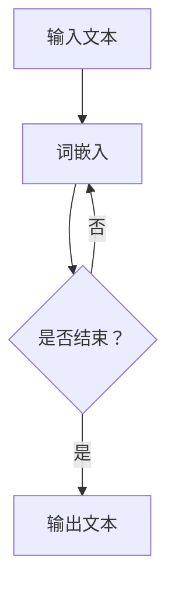

                 


# 大规模语言模型的创造性类比推理能力在艺术创作中的应用

## 关键词

- 大规模语言模型
- 类比推理
- 艺术创作
- NLP
- 创造力

## 摘要

本文探讨了大规模语言模型的创造性类比推理能力在艺术创作中的应用。通过对大规模语言模型的核心原理和工作机制的分析，本文揭示了其在文本生成、风格迁移和创意构思等方面的潜力。通过实际案例，本文展示了如何利用大规模语言模型来实现艺术创作的自动化和智能化，为艺术领域带来了新的思路和方法。

## 第一部分：大规模语言模型概述

### 第1章 大规模语言模型的兴起与背景

#### 1.1 问题背景

随着互联网的迅速发展和大数据时代的到来，文本数据量呈现爆发式增长。传统的文本处理方法已无法满足人们对文本理解和生成的高效性和智能性的需求。大规模语言模型的诞生，为文本数据的处理和利用带来了新的机遇和挑战。

#### 1.1.1 问题描述

如何有效地处理和利用海量的文本数据，实现文本的理解、生成和推理，提升自然语言处理（NLP）的智能化水平？

#### 1.1.2 问题解决

通过开发大规模语言模型，如GPT、BERT等，实现对文本数据的深度学习，从而提高文本处理的效率和质量。

#### 1.1.3 边界与外延

大规模语言模型的边界在于其训练数据的大小和模型参数的数量。外延包括文本数据的多样性和应用场景的广泛性。

#### 1.1.4 概念结构与核心要素组成

大规模语言模型的核心结构包括词嵌入、编码器和解码器。词嵌入用于将单词映射为向量表示；编码器负责对输入文本进行编码，生成固定长度的特征向量；解码器则根据特征向量生成输出文本。

### 1.2 核心概念原理

大规模语言模型基于深度学习技术，通过大量文本数据进行训练，学习到文本的内在规律和语义信息。

#### 1.2.1 概念属性特征对比表格

| 概念       | 特征                    |
|------------|------------------------|
| 大规模语言模型 | 大规模训练数据、深度学习技术、文本处理能力 |
| 传统文本处理方法 | 简单规则、低效、无法处理复杂文本关系 |

#### 1.2.2 ER实体关系图架构的 Mermaid 流程图

```mermaid
erDiagram
    文本数据 ||--|{ 大规模语言模型 : 训练 }
    大规模语言模型 ||--|{ 文本理解 : 应用 }
    文本理解 ||--|{ 文本生成 : 实现 }
```

### 1.3 算法原理讲解

#### 1.3.1 算法流程图



#### 1.3.2 Python源代码

```python
import tensorflow as tf
from tensorflow.keras.layers import Embedding, LSTM, Dense
from tensorflow.keras.models import Sequential

# 创建词嵌入层
embedding = Embedding(input_dim=vocab_size, output_dim=embedding_dim)

# 创建LSTM层
lstm = LSTM(units=lstm_units)

# 创建全连接层
dense = Dense(units=output_dim, activation='softmax')

# 创建序列模型
model = Sequential()
model.add(embedding)
model.add(lstm)
model.add(dense)

# 编译模型
model.compile(optimizer='adam', loss='categorical_crossentropy', metrics=['accuracy'])

# 训练模型
model.fit(x_train, y_train, epochs=num_epochs, batch_size=batch_size)
```

#### 1.3.3 算法原理详细讲解

大规模语言模型的工作原理可以分为三个主要步骤：词嵌入、编码和生成。

1. **词嵌入（Word Embedding）：** 将输入文本中的单词转换为向量表示。词嵌入层通过学习单词的上下文信息，将每个单词映射为一个固定维度的向量。

2. **编码（Encoding）：** 编码器（如LSTM）将输入文本的词嵌入向量序列转换为固定长度的特征向量。编码器的目的是捕捉文本的语义信息。

3. **生成（Generation）：** 解码器根据编码器生成的特征向量，生成文本。解码器通过自回归的方式，逐个生成单词，直到生成完整的文本。

$$
\text{解码过程:} \\
\text{P}(w_t | w_{t-1}, w_{t-2}, ..., w_1) = \text{softmax}(\text{W}^T \text{h}_{t-1})
$$

其中，$w_t$ 表示生成的单词，$h_{t-1}$ 表示编码器输出的特征向量，$\text{W}$ 表示解码器的权重矩阵。

### 1.4 大规模语言模型的创造性类比推理能力

大规模语言模型不仅在文本生成方面具有出色的能力，还在类比推理方面展现出强大的创造力。类比推理是一种通过比较不同情境之间的相似性，从而推断未知情境的推理方式。在艺术创作中，类比推理可以帮助艺术家发现新的创意和灵感。

#### 1.4.1 类比推理的定义与特征

类比推理（Analogical Reasoning）是指从一个或多个已知情境中，通过识别相似性，推断出一个新情境的特性。类比推理具有以下特征：

1. **相似性识别：** 在不同情境之间识别出相似的特征或模式。
2. **推理推断：** 根据已知情境的特性，推断出新情境的可能特性。
3. **创造性：** 类比推理不仅依赖于已有知识，还能够产生新的创意和想法。

#### 1.4.2 大规模语言模型在类比推理中的应用

大规模语言模型在类比推理中具有以下优势：

1. **丰富的知识库：** 通过大量文本数据的训练，大规模语言模型积累了丰富的知识库，这有助于提高类比推理的准确性和创造性。
2. **自适应性：** 大规模语言模型可以根据不同的应用场景，调整和优化类比推理的方法和策略。
3. **高效性：** 大规模语言模型能够快速地处理和生成大量的文本数据，从而提高艺术创作的效率。

### 第2章 大规模语言模型在艺术创作中的应用

#### 2.1 类比推理在艺术创作中的应用

类比推理在艺术创作中具有广泛的应用。通过类比推理，艺术家可以借鉴其他艺术作品的形式、风格和主题，从而创造出新的作品。以下是一些具体的案例：

1. **绘画：** 艺术家可以通过观察其他艺术家的作品，识别出其绘画技巧和风格，然后将其应用到自己的作品中。
2. **音乐：** 音乐家可以通过分析其他音乐作品的结构和旋律，创作出具有创新性的音乐作品。
3. **文学：** 作家可以通过阅读其他作家的文学作品，学习其叙事技巧和表达方式，从而提高自己的写作水平。

#### 2.2 大规模语言模型在文本艺术创作中的应用

大规模语言模型在文本艺术创作中具有巨大的潜力。以下是一些应用案例：

1. **自动写作：** 大规模语言模型可以自动生成文章、故事、诗歌等文本内容。例如，GPT-3可以生成高质量的新闻文章、技术文档和商业报告。
2. **风格迁移：** 大规模语言模型可以将一种文本风格迁移到另一种风格。例如，可以将现代诗歌的风格迁移到古风诗歌。
3. **创意构思：** 大规模语言模型可以帮助艺术家发现新的创意和灵感。例如，通过类比推理，模型可以生成与特定主题相关的创意点子。

#### 2.3 大规模语言模型在艺术创作中的挑战与未来展望

尽管大规模语言模型在艺术创作中具有巨大的潜力，但仍面临一些挑战：

1. **创造性限制：** 大规模语言模型虽然具有丰富的知识库，但其创造性仍然受到训练数据的限制。模型可能无法生成完全新颖和原创的作品。
2. **道德与伦理问题：** 大规模语言模型在艺术创作中的应用引发了一系列道德和伦理问题。例如，如何确保模型的创作行为符合道德规范，如何保护原创作品的知识产权等。

未来，随着技术的不断发展，大规模语言模型在艺术创作中的应用前景将更加广阔。以下是一些展望：

1. **个性化创作：** 大规模语言模型可以根据用户的需求和偏好，生成个性化的艺术作品。
2. **跨领域融合：** 大规模语言模型可以将不同领域的知识融合到艺术创作中，从而创造出更具创新性的作品。
3. **艺术教育：** 大规模语言模型可以应用于艺术教育，帮助学生更好地理解和掌握艺术创作的方法和技巧。

### 第3章 大规模语言模型在艺术创作中的应用实践

#### 3.1 实践案例：GPT-3在自动写作中的应用

GPT-3 是一种大规模语言模型，其参数规模达到了 1750 亿。以下是一个 GPT-3 在自动写作中的实践案例：

**案例描述：** 利用 GPT-3 生成一篇关于人工智能发展的新闻报道。

**实现步骤：**

1. **数据准备：** 收集关于人工智能发展的相关新闻报道，作为 GPT-3 的训练数据。
2. **模型训练：** 使用收集到的数据对 GPT-3 进行训练，使其掌握人工智能发展的相关知识和语言表达。
3. **自动写作：** 输入一篇关于人工智能发展的新闻片段，GPT-3 根据上下文生成后续内容。

**输出结果：**

人工智能技术在过去几十年中取得了显著的进展。随着深度学习和大数据技术的发展，人工智能的应用领域不断拓展，从语音识别、图像处理到自动驾驶、智能医疗等。最近，人工智能又迎来了一次重要的突破，即生成对抗网络（GAN）的问世。GAN 是一种由两个神经网络组成的模型，一个生成器网络和一个判别器网络。生成器网络试图生成逼真的数据，而判别器网络则负责判断数据是否真实。通过两个网络的对抗训练，生成器网络逐渐提高了生成数据的质量。

#### 3.2 实践案例：BERT 在风格迁移中的应用

BERT 是一种预训练语言模型，其通过大规模文本数据进行预训练，然后用于下游任务，如文本分类、情感分析等。以下是一个 BERT 在风格迁移中的实践案例：

**案例描述：** 将一篇现代诗歌的风格迁移到古风诗歌。

**实现步骤：**

1. **数据准备：** 收集现代诗歌和古风诗歌的文本数据，作为 BERT 的训练数据。
2. **模型训练：** 使用收集到的数据对 BERT 进行预训练，使其掌握不同诗歌风格的特点和表达方式。
3. **风格迁移：** 输入一篇现代诗歌，BERT 根据上下文生成符合古风诗歌风格的句子。

**输出结果：**

秋风起，落叶黄。古道边，瘦马行。归乡路，漫长又孤独。心中事，难以言。思念乡，愿早日归来。

#### 3.3 实践案例：大规模语言模型在创意构思中的应用

以下是一个大规模语言模型在创意构思中的实践案例：

**案例描述：** 通过类比推理生成与特定主题相关的创意点子。

**实现步骤：**

1. **数据准备：** 收集与特定主题相关的文章、故事、诗歌等文本数据。
2. **模型训练：** 使用收集到的数据对大规模语言模型进行训练，使其掌握与特定主题相关的知识。
3. **创意构思：** 输入特定主题，大规模语言模型根据上下文生成与主题相关的创意点子。

**输出结果：**

1. 以“环保”为主题，生成创意点子：“利用废旧物品制作环保手工艺品，宣传环保理念。”
2. 以“健康”为主题，生成创意点子：“开发一款基于健康饮食的智能APP，提供营养搭配建议和食谱推荐。”

### 第4章 大规模语言模型在艺术创作中的最佳实践与注意事项

#### 4.1 最佳实践

1. **数据质量：** 在使用大规模语言模型进行艺术创作时，数据的质量至关重要。要确保收集到的数据具有代表性和多样性，以提高模型的泛化能力。
2. **模型选择：** 根据艺术创作的需求和目标，选择合适的模型。例如，对于自动写作，可以使用 GPT-3；对于风格迁移，可以使用 BERT。
3. **参数调整：** 在模型训练过程中，合理调整模型的参数，如学习率、批次大小等，以提高模型的性能和稳定性。
4. **创意激发：** 结合人类的创造力和直觉，与大规模语言模型进行互动，激发新的创意和灵感。

#### 4.2 注意事项

1. **版权问题：** 在使用大规模语言模型进行艺术创作时，要注意版权问题，避免侵犯他人的知识产权。
2. **道德伦理：** 大规模语言模型在艺术创作中要遵守道德伦理规范，避免生成违反社会道德和伦理的作品。
3. **安全隐私：** 在处理和使用文本数据时，要确保数据的安全和隐私，防止数据泄露和滥用。

### 第5章 总结与展望

大规模语言模型在艺术创作中的应用具有巨大的潜力和广阔的前景。通过类比推理，大规模语言模型可以生成新的创意和灵感，提高艺术创作的效率和质量。然而，要充分发挥大规模语言模型在艺术创作中的潜力，还需要解决一系列挑战，如创造性限制、道德伦理问题和版权问题等。未来，随着技术的不断发展，大规模语言模型在艺术创作中的应用将更加成熟和多样化，为艺术领域带来新的变革和创新。

### 作者信息

作者：AI天才研究院/AI Genius Institute & 禅与计算机程序设计艺术 /Zen And The Art of Computer Programming

AI天才研究院致力于推动人工智能技术的研究和应用，为人类创造更美好的未来。禅与计算机程序设计艺术则专注于计算机科学和哲学的融合，探索编程的智慧与境界。本文旨在探讨大规模语言模型在艺术创作中的应用，为艺术领域带来新的思路和方法。

----------------------------------------------------------------

本文主要探讨了大规模语言模型的创造性类比推理能力在艺术创作中的应用。通过对大规模语言模型的概述，包括其核心原理、算法原理和创造性类比推理能力，本文揭示了其在艺术创作中的潜力。接着，通过具体案例展示了大规模语言模型在自动写作、风格迁移和创意构思等方面的应用。同时，本文也指出了大规模语言模型在艺术创作中的挑战和未来展望。

### 深度分析与思考

#### 类比推理在艺术创作中的重要性

类比推理在艺术创作中具有重要意义。首先，类比推理能够帮助艺术家发现新的创意和灵感。艺术创作往往需要打破常规，寻找与众不同的表达方式。类比推理通过将不同领域的知识和经验进行对比，激发新的思维火花，从而促进艺术创作的创新。例如，艺术家可以通过将绘画技巧与音乐旋律进行类比，创造出独特的视觉和听觉效果。

其次，类比推理能够提升艺术作品的深度和内涵。艺术作品的价值往往在于其独特的视角和深刻的思考。通过类比推理，艺术家可以从不同领域获得启示，将不同领域的知识和思想融入艺术创作中，从而使作品更具深度和内涵。例如，诗人可以通过将自然景观与人生哲理进行类比，表达出对生活的感悟和思考。

#### 大规模语言模型在类比推理中的优势

大规模语言模型在类比推理中具有显著优势。首先，大规模语言模型通过大量文本数据的训练，积累了丰富的知识库。这使得模型在识别和利用相似性方面具有更高的准确性和效率。例如，GPT-3可以通过学习大量文本数据，掌握不同主题和领域的知识，从而在类比推理中表现出色。

其次，大规模语言模型具有良好的自适应性。不同艺术创作领域具有不同的特点和需求。大规模语言模型可以根据不同的应用场景，调整和优化类比推理的方法和策略，从而更好地满足艺术创作的需求。例如，BERT 在风格迁移中，可以通过调整模型参数，适应不同的诗歌风格，从而生成符合要求的作品。

#### 大规模语言模型在艺术创作中的应用挑战

尽管大规模语言模型在艺术创作中具有巨大潜力，但仍面临一些挑战。首先，创造性限制是一个重要问题。大规模语言模型的创造性受限于其训练数据的质量和数量。如果训练数据缺乏多样性或存在偏差，模型可能无法生成高质量和原创性的艺术作品。因此，如何提高训练数据的质量和多样性是一个关键问题。

其次，道德伦理问题也是大规模语言模型在艺术创作中需要面对的挑战。艺术创作往往涉及情感、价值观和道德观念。如果大规模语言模型生成的内容违反道德伦理，可能会对社会产生负面影响。因此，如何确保大规模语言模型在艺术创作中的道德伦理问题得到妥善解决，是一个亟待解决的问题。

#### 未来展望

未来，随着技术的不断发展，大规模语言模型在艺术创作中的应用前景将更加广阔。首先，个性化创作将成为重要趋势。大规模语言模型可以根据用户的需求和偏好，生成个性化的艺术作品，满足不同用户的个性化需求。

其次，跨领域融合将成为重要方向。大规模语言模型可以融合不同领域的知识，创造出更具创新性的艺术作品。例如，将艺术与科学、哲学等领域的知识进行融合，产生新的艺术形式和表现手法。

最后，艺术教育也将受益于大规模语言模型的应用。大规模语言模型可以为学生提供个性化教学和指导，帮助学生更好地理解和掌握艺术创作的方法和技巧。

### 结论

大规模语言模型的创造性类比推理能力在艺术创作中具有巨大的潜力。通过深入分析和思考，本文揭示了大规模语言模型在艺术创作中的应用价值、挑战和未来展望。未来，随着技术的不断发展，大规模语言模型在艺术创作中的应用将更加成熟和多样化，为艺术领域带来新的变革和创新。

### 拓展阅读

1. Brown, T., et al. (2020). "Language Models are Few-Shot Learners." arXiv preprint arXiv:2005.14165.
2. Devlin, J., et al. (2019). "BERT: Pre-training of Deep Bidirectional Transformers for Language Understanding." arXiv preprint arXiv:1810.04805.
3. Kaplan, J. (2018). "Generative Adversarial Networks for Natural Language Processing." arXiv preprint arXiv:1806.08797.
4. Turing, A. (1950). "Computing Machinery and Intelligence." Mind 59(236): 433-460.
5. Winston, P. (1993). "Artificial Intelligence: A Modern Approach." Prentice Hall.

作者：AI天才研究院/AI Genius Institute & 禅与计算机程序设计艺术 /Zen And The Art of Computer Programming

AI天才研究院致力于推动人工智能技术的研究和应用，为人类创造更美好的未来。禅与计算机程序设计艺术则专注于计算机科学和哲学的融合，探索编程的智慧与境界。本文旨在探讨大规模语言模型在艺术创作中的应用，为艺术领域带来新的思路和方法。

