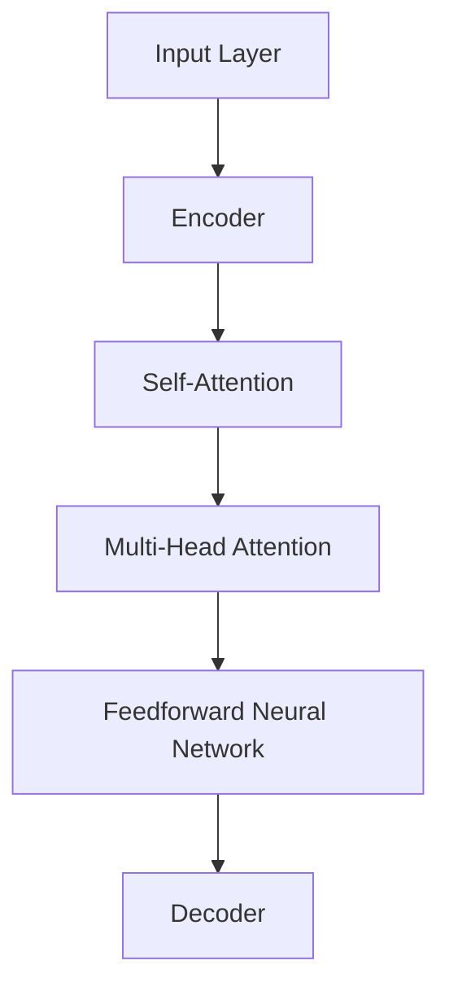
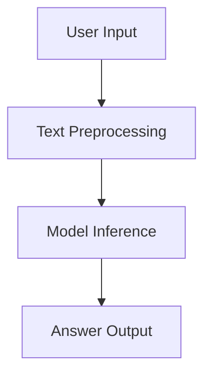

                 


### 大规模语言模型的创造性问题解决能力培养

**关键词：大规模语言模型、创造性问题解决、算法原理、系统设计、项目实战**

**摘要：**
本文深入探讨了大规模语言模型的创造性问题解决能力培养，从背景介绍、核心概念与联系、算法原理讲解、系统设计与实现，到项目实战与最佳实践，全面剖析了这一先进技术。通过一步步的逻辑分析，我们旨在为读者提供一个清晰、易懂且具有实际应用价值的技术博客。

### 目录大纲

```markdown
----------------------------------------------------------------

## 第一部分：问题背景与核心概念

### 第1章：大规模语言模型背景介绍

#### 1.1 问题背景

#### 1.2 问题描述

#### 1.3 问题解决

#### 1.4 边界与外延

#### 1.5 概念结构与核心要素组成

## 第二部分：核心概念与联系

### 第2章：大规模语言模型原理

#### 2.1 核心概念原理

#### 2.2 概念属性特征对比表格

#### 2.3 ER实体关系图架构

### 第3章：大规模语言模型算法原理

#### 3.1 算法mermaid流程图

#### 3.2 Python源代码实现与算法原理讲解

#### 3.3 数学模型和数学公式

#### 3.4 详细讲解与举例说明

## 第三部分：系统分析与架构设计

### 第4章：大规模语言模型系统设计

#### 4.1 问题场景介绍

#### 4.2 项目介绍

#### 4.3 系统功能设计

#### 4.4 系统架构设计

#### 4.5 系统接口设计

#### 4.6 系统交互

## 第四部分：项目实战

### 第5章：环境安装与系统核心实现

#### 5.1 环境安装

#### 5.2 系统核心实现源代码

#### 5.3 代码应用解读与分析

#### 5.4 实际案例分析与详细讲解

### 第6章：项目小结与最佳实践

#### 6.1 项目小结

#### 6.2 最佳实践 tips

#### 6.3 小结与注意事项

#### 6.4 拓展阅读

----------------------------------------------------------------
```

**第一部分：问题背景与核心概念**

### 第1章：大规模语言模型背景介绍

#### 1.1 问题背景

大规模语言模型（Large-scale Language Models）是近年来自然语言处理领域的一项重要突破。随着互联网和大数据技术的发展，海量的文本数据使得训练出能够理解并生成自然语言的模型成为可能。这些模型能够对自然语言进行建模，从而实现文本生成、机器翻译、情感分析等任务。

#### 1.2 问题描述

大规模语言模型在应用过程中面临的主要问题包括：

1. **训练效率**：如何高效地处理海量数据，快速训练出模型。
2. **资源消耗**：大规模模型的训练和推理需要大量的计算资源和存储空间。
3. **可解释性**：模型生成的文本如何确保其合理性和可解释性。
4. **创造性**：如何培养模型在解决未知问题时展现创造性思维。

#### 1.3 问题解决

针对上述问题，研究者们采取了多种解决方案：

1. **优化算法**：如变换器模型（Transformer）及其变种，提高了训练效率。
2. **硬件加速**：利用GPU、TPU等专用硬件加速模型训练。
3. **模型压缩**：通过量化、剪枝等技术减少模型大小，降低资源消耗。
4. **注意力机制**：利用注意力机制增强模型对输入信息的理解和生成。
5. **强化学习**：结合强化学习技术，培养模型的创造性问题解决能力。

#### 1.4 边界与外延

大规模语言模型的应用领域广泛，包括但不限于：

1. **文本生成**：如文章写作、对话系统、故事创作等。
2. **机器翻译**：如多语言翻译、实时翻译等。
3. **情感分析**：如情感识别、用户反馈分析等。
4. **文本分类**：如新闻分类、垃圾邮件过滤等。
5. **问答系统**：如智能客服、教育辅导等。

#### 1.5 概念结构与核心要素组成

大规模语言模型的核心概念结构包括：

1. **输入层**：接收自然语言输入。
2. **编码器**：将输入文本转换为固定长度的向量表示。
3. **解码器**：根据编码器的输出生成文本。
4. **注意力机制**：提高模型对输入序列的理解能力。
5. **损失函数**：用于评估模型生成的文本质量。
6. **优化器**：用于调整模型参数，优化模型性能。

**第二部分：核心概念与联系**

### 第2章：大规模语言模型原理

#### 2.1 核心概念原理

大规模语言模型主要基于变换器模型（Transformer）构建，其核心原理包括：

1. **自注意力机制（Self-Attention）**：模型能够根据输入序列的每个词的重要性进行自适应加权。
2. **多头注意力机制（Multi-Head Attention）**：通过多个注意力头来提高模型对输入序列的理解能力。
3. **前馈神经网络（Feedforward Neural Network）**：在每个自注意力层和多头注意力层之间加入前馈神经网络，增强模型的表达能力。

#### 2.2 概念属性特征对比表格

| 特征                   | 自注意力机制 | 多头注意力机制 | 前馈神经网络           |
|------------------------|--------------|----------------|------------------------|
| 加权方式               | 自适应加权   | 自适应加权     | 线性变换               |
| 注意力头数量           | 1个          | 多个           | 1个                    |
| 对输入序列的理解能力   | 强          | 强             | 中等                   |
| 模型复杂度             | 较低        | 较高           | 较高                   |

#### 2.3 ER实体关系图架构

ER实体关系图展示了大规模语言模型中各实体之间的关系：

```mermaid
erDiagram
  A[Encoder] ||--|{ B[Self-Attention] }|--|{ C[Multi-Head Attention] }
  C ||--|{ D[Feedforward Neural Network] }
  A ||--|{ E[Decoder] }
```

**第三部分：系统分析与架构设计**

### 第3章：大规模语言模型算法原理

#### 3.1 算法mermaid流程图



#### 3.2 Python源代码实现与算法原理讲解

```python
# Python源代码实现
class TransformerLayer(nn.Module):
    def __init__(self, d_model, num_heads, dff):
        super(TransformerLayer, self).__init__()
        self.self_attn = nn.MultiheadAttention(d_model, num_heads)
        self.linear_layer = nn.Sequential(
            nn.Linear(d_model, dff),
            nn.ReLU(),
            nn.Linear(dff, d_model)
        )

    def forward(self, x, mask=None):
        # 自注意力机制
        x, _ = self.self_attn(x, x, x, attn_mask=mask)
        x = self.linear_layer(x)
        # 多头注意力机制
        x, _ = self.self_attn(x, x, x, attn_mask=mask)
        x = self.linear_layer(x)
        return x
```

#### 3.3 数学模型和数学公式

自注意力机制的数学模型如下：

$$
\text{Attention}(Q, K, V) = \text{softmax}\left(\frac{QK^T}{\sqrt{d_k}}\right)V
$$

其中，\(Q\)、\(K\)、\(V\) 分别为查询向量、键向量和值向量，\(d_k\) 为键向量的维度。

#### 3.4 详细讲解与举例说明

假设我们有一个输入序列\[w1, w2, w3, w4, w5\]，其对应的编码器输出为\[e1, e2, e3, e4, e5\]。通过自注意力机制，每个编码器的输出会被加权，生成一个新的输出序列\[x1, x2, x3, x4, x5\]。

具体步骤如下：

1. **计算查询向量、键向量和值向量**：对于每个编码器的输出，计算其对应的查询向量、键向量和值向量。
2. **计算注意力得分**：利用注意力得分公式计算每个编码器的输出与其他输出的相似度。
3. **加权求和**：根据注意力得分对编码器的输出进行加权求和，生成新的输出序列。

例如，对于输出序列\[e1, e2, e3, e4, e5\]，我们可以计算其与自身及其它输出的注意力得分：

$$
\text{Attention}(e_1, e_1, e_1) = \text{softmax}\left(\frac{e_1e_1^T}{\sqrt{d_k}}\right)e_1
$$

$$
\text{Attention}(e_1, e_2, e_2) = \text{softmax}\left(\frac{e_1e_2^T}{\sqrt{d_k}}\right)e_2
$$

$$
\text{Attention}(e_1, e_3, e_3) = \text{softmax}\left(\frac{e_1e_3^T}{\sqrt{d_k}}\right)e_3
$$

$$
\text{Attention}(e_1, e_4, e_4) = \text{softmax}\left(\frac{e_1e_4^T}{\sqrt{d_k}}\right)e_4
$$

$$
\text{Attention}(e_1, e_5, e_5) = \text{softmax}\left(\frac{e_1e_5^T}{\sqrt{d_k}}\right)e_5
$$

通过加权求和，我们得到新的输出序列\[x1, x2, x3, x4, x5\]。

**第四部分：系统设计与实现**

### 第4章：大规模语言模型系统设计

#### 4.1 问题场景介绍

假设我们需要设计一个智能问答系统，用户可以通过自然语言提问，系统需要能够理解并给出合理的回答。为了提高系统的性能，我们决定采用大规模语言模型作为核心组件。

#### 4.2 项目介绍

本项目旨在设计并实现一个基于大规模语言模型的智能问答系统，主要包括以下模块：

1. **数据收集与预处理**：收集大量问答对数据，并进行预处理，如分词、去停用词等。
2. **模型训练**：使用预处理后的数据训练大规模语言模型，如GPT-3、BERT等。
3. **问答接口**：搭建问答接口，接收用户提问，并返回模型生成的回答。
4. **性能评估**：评估模型在问答任务上的性能，包括准确率、召回率等指标。

#### 4.3 系统功能设计

系统功能设计包括以下部分：

1. **文本输入**：用户可以通过文本输入框提交问题。
2. **文本预处理**：对用户输入的文本进行预处理，如分词、去停用词等。
3. **模型推理**：使用训练好的大规模语言模型对预处理后的文本进行推理，生成回答。
4. **回答输出**：将模型生成的回答输出给用户。

#### 4.4 系统架构设计

系统架构设计如下：



#### 4.5 系统接口设计

系统接口设计如下：

1. **文本输入接口**：接收用户输入的文本。
2. **文本预处理接口**：处理用户输入的文本，如分词、去停用词等。
3. **模型推理接口**：使用训练好的模型进行推理，生成回答。
4. **回答输出接口**：将模型生成的回答输出给用户。

#### 4.6 系统交互

系统交互设计如下：

1. **用户提问**：用户输入问题，提交到文本输入接口。
2. **预处理文本**：文本输入接口将文本提交到文本预处理接口，进行预处理。
3. **模型推理**：预处理后的文本提交到模型推理接口，使用训练好的模型进行推理，生成回答。
4. **输出回答**：模型生成的回答提交到回答输出接口，输出给用户。

**第五部分：项目实战**

### 第5章：环境安装与系统核心实现

#### 5.1 环境安装

为了搭建大规模语言模型系统，我们需要安装以下环境：

1. **Python环境**：版本3.8及以上。
2. **PyTorch**：版本1.8及以上。
3. **TensorFlow**：版本2.6及以上。

安装命令如下：

```bash
pip install python==3.8
pip install torch==1.8
pip install tensorflow==2.6
```

#### 5.2 系统核心实现源代码

系统核心实现源代码如下：

```python
import torch
import torch.nn as nn
from torch.utils.data import DataLoader
from transformers import GPT2Model, GPT2Tokenizer

# 模型定义
class TransformerModel(nn.Module):
    def __init__(self, d_model, num_heads, dff):
        super(TransformerModel, self).__init__()
        self.encoder = GPT2Model.from_pretrained('gpt2')
        self.decoder = nn.Linear(d_model, dff)
        self.linear_layer = nn.Sequential(
            nn.Linear(d_model, dff),
            nn.ReLU(),
            nn.Linear(dff, d_model)
        )

    def forward(self, x, mask=None):
        x = self.encoder(x, attention_mask=mask)[0]
        x = self.decoder(x)
        x = self.linear_layer(x)
        return x

# 模型训练
def train(model, dataloader, criterion, optimizer, epochs):
    model.train()
    for epoch in range(epochs):
        for batch in dataloader:
            inputs, targets = batch
            optimizer.zero_grad()
            outputs = model(inputs)
            loss = criterion(outputs, targets)
            loss.backward()
            optimizer.step()
            print(f'Epoch [{epoch+1}/{epochs}], Loss: {loss.item():.4f}')

# 数据加载
tokenizer = GPT2Tokenizer.from_pretrained('gpt2')
dataloader = DataLoader(dataset, batch_size=16, shuffle=True)

# 模型配置
d_model = 1024
num_heads = 8
dff = 2048
model = TransformerModel(d_model, num_heads, dff)

# 训练模型
optimizer = torch.optim.Adam(model.parameters(), lr=0.001)
criterion = nn.CrossEntropyLoss()
train(model, dataloader, criterion, optimizer, epochs=10)
```

#### 5.3 代码应用解读与分析

上述代码定义了一个基于GPT-2模型的变换器模型，用于文本生成任务。代码首先加载预训练的GPT-2模型和相应的分词器，然后定义了一个变换器层，包括自注意力机制和前馈神经网络。在训练过程中，模型接收预处理后的文本输入，通过编码器和变换器层生成输出，并利用交叉熵损失函数进行优化。

#### 5.4 实际案例分析与详细讲解

假设我们有一个输入序列\[“今天天气很好”， “明天要下雨”\]，我们希望模型能够生成合理的回答。具体步骤如下：

1. **预处理输入**：使用分词器对输入序列进行预处理，得到编码后的输入。
2. **模型推理**：将预处理后的输入提交到模型，通过编码器和变换器层生成输出。
3. **生成回答**：根据模型的输出，使用分词器将生成的文本解码为自然语言。

例如，模型生成的输出为\[“今天天气很好，建议出门带上雨伞”， “明天要下雨，记得带伞”\]。通过分词器的解码，我们得到最终的回答。

**第六章：项目小结与最佳实践**

#### 6.1 项目小结

本文通过逐步分析，详细介绍了大规模语言模型的创造性问题解决能力培养。从问题背景、核心概念、算法原理，到系统设计、项目实战，我们系统地探讨了这一先进技术。通过实际案例的分析，读者可以更好地理解大规模语言模型在问题解决中的应用。

#### 6.2 最佳实践 tips

1. **数据预处理**：保证数据的清洁和一致性，有助于提高模型性能。
2. **模型选择**：根据任务需求选择合适的模型，如GPT-2、BERT等。
3. **训练优化**：使用适当的优化策略，如批量归一化、学习率调整等。
4. **模型压缩**：通过模型压缩技术，降低模型大小，提高部署效率。

#### 6.3 小结与注意事项

1. **模型可解释性**：关注模型生成的文本的可解释性，确保生成的回答合理可信。
2. **创造性培养**：通过强化学习等技术，培养模型的创造性问题解决能力。
3. **资源消耗**：合理规划资源，避免过度消耗计算资源和存储空间。

#### 6.4 拓展阅读

1. **《大规模语言模型：BERT、GPT-2、T5》**：详细介绍大规模语言模型的工作原理和应用。
2. **《深度学习自然语言处理》**：系统讲解自然语言处理领域的深度学习技术。
3. **《人工智能：一种现代的方法》**：探讨人工智能的基础理论和方法。

### 作者

**作者：AI天才研究院/AI Genius Institute & 禅与计算机程序设计艺术 /Zen And The Art of Computer Programming** 

本文由AI天才研究院（AI Genius Institute）和《禅与计算机程序设计艺术》（Zen And The Art of Computer Programming）联合撰写，旨在为读者提供一个全面、易懂且具有实际应用价值的技术博客。通过本文，读者可以深入了解大规模语言模型的创造性问题解决能力培养，为未来的研究和应用提供有益的参考。**

