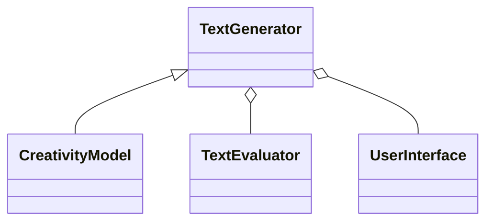
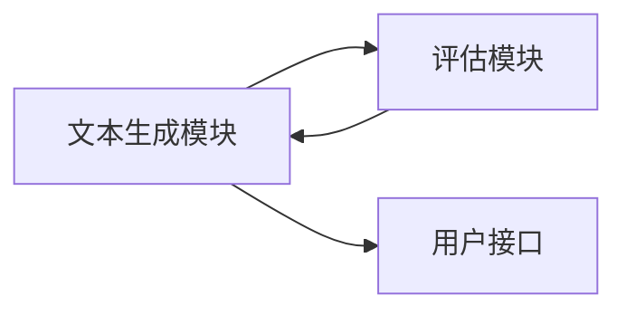

                 


# 大规模语言模型的创造性问题解析在科技前沿突破中的应用

> 关键词：大规模语言模型，创造性问题，算法原理，系统架构，项目实战

## 摘要

本文旨在探讨大规模语言模型在创造性问题解析中的应用，以及如何通过科技前沿的突破实现这一目标。首先，我们介绍了大规模语言模型的发展背景及其重要性，接着详细解析了创造性问题的定义与属性特征。然后，探讨了大规模语言模型与创造性问题的内在联系，并深入讲解了核心算法原理。通过一个具体的项目实战，我们展示了如何将理论应用于实践，并提供了一些最佳实践技巧。最后，我们总结了研究的主要发现，并提出了未来研究的方向。

## 引言

### 1.1 问题背景

近年来，随着人工智能技术的迅猛发展，大规模语言模型（如GPT-3、BERT等）已经成为自然语言处理领域的明星技术。这些模型具有强大的语言理解与生成能力，能够在各种场景中发挥重要作用，例如机器翻译、文本摘要、问答系统等。然而，随着语言模型的规模和复杂度的增加，如何在科技前沿突破中有效地解析创造性问题成为了一个重要的研究课题。

### 1.2 核心概念

- **大规模语言模型**：一种能够对自然语言文本进行建模的深度学习模型，具有强大的语义理解和生成能力。
- **创造性问题**：指那些需要创新思维和突破传统方法来解决的问题，通常涉及对新概念、新方法或新解决方案的探索。

### 1.3 研究目的与意义

本文的研究目的是探讨如何利用大规模语言模型来解析创造性问题，从而推动科技前沿的突破。通过深入分析大规模语言模型的算法原理和创造性问题的属性特征，我们希望能够找到有效的解决方案，并为未来的研究和应用提供参考。

## 问题背景

### 2.1 大规模语言模型的发展

#### 2.1.1 发展历程

大规模语言模型的发展可以追溯到20世纪80年代，当时出现了最早的神经网络语言模型。随着计算能力的提升和深度学习技术的发展，大规模语言模型在21世纪初得到了快速的发展。特别是2018年，GPT-3的发布标志着大规模语言模型进入了一个新的阶段，其参数规模达到了1750亿，成为当时世界上最大的语言模型。

#### 2.1.2 研究现状

目前，大规模语言模型已经成为自然语言处理领域的主流技术，广泛应用于各种实际场景。然而，如何有效地利用这些模型来解析创造性问题，仍然是一个具有挑战性的课题。

### 2.2 创造性问题的定义与重要性

#### 2.2.1 创造性问题的定义

创造性问题通常是指那些需要运用创新思维和突破传统方法来解决的问题。这些问题往往具有复杂性、不确定性和多义性，需要从不同的角度和层面进行思考。

#### 2.2.2 创造性问题的类型

- **基础性问题**：涉及对基本概念和原理的探索。
- **应用性问题**：在特定领域中的应用，如科技创新、艺术创作等。
- **综合性问题**：涉及多个领域的交叉融合。

### 2.3 科技前沿突破与大规模语言模型的关系

#### 2.3.1 科技前沿突破的需求

科技前沿突破通常需要创新思维和方法，而大规模语言模型作为一种强大的工具，可以为科技前沿的突破提供支持。

#### 2.3.2 大规模语言模型的应用潜力

大规模语言模型在文本生成、知识图谱构建、智能对话系统等方面具有广泛的应用前景，这些应用可以为科技前沿突破提供新的思路和方法。

## 核心概念与联系

### 3.1 大规模语言模型

#### 3.1.1 原理

大规模语言模型通常基于深度学习技术，通过学习大量文本数据来建立语言模型。其核心原理包括：

- **神经网络**：使用多层神经网络来表示文本的语义信息。
- **注意力机制**：通过注意力机制来聚焦关键信息，提高模型的表示能力。

#### 3.1.2 联系

大规模语言模型与创造性问题的联系主要体现在以下几个方面：

- **文本生成**：大规模语言模型可以生成高质量的文本，为创造性问题提供新的思路和灵感。
- **知识图谱**：大规模语言模型可以构建知识图谱，为创造性问题提供丰富的背景知识。

### 3.2 创造性问题

#### 3.2.1 特点

创造性问题的特点包括：

- **复杂性**：涉及多个层面和维度。
- **不确定性**：问题的解决方案往往不确定，需要探索和尝试。
- **多义性**：同一个问题可能有多种不同的理解和解决方法。

#### 3.2.2 属性特征对比

| 特征 | 大规模语言模型 | 创造性问题 |
| --- | --- | --- |
| **复杂性** | 高 | 高 |
| **不确定性** | 较低 | 高 |
| **多义性** | 高 | 高 |

### 3.3 大规模语言模型与创造性问题的联系

#### 3.3.1 应用场景

- **科技前沿突破**：通过大规模语言模型来生成新的科技论文、报告等，为科技前沿突破提供参考。
- **艺术创作**：利用大规模语言模型来生成诗歌、小说等，为艺术创作提供灵感。

#### 3.3.2 解决方案

- **文本生成**：利用大规模语言模型生成文本，为创造性问题提供新的思路和方案。
- **知识融合**：通过大规模语言模型构建知识图谱，为创造性问题提供丰富的背景知识。

## 算法原理讲解

### 4.1 大规模语言模型算法

#### 4.1.1 原理

大规模语言模型的核心算法是自注意力机制（Self-Attention），其基本思想是将每个词的表示与所有词的表示进行关联，从而捕捉文本中的全局信息。

#### 4.1.2 Python源代码

```python
import torch
import torch.nn as nn
import torch.optim as optim

class TransformerModel(nn.Module):
    def __init__(self, vocab_size, d_model, nhead, num_layers):
        super(TransformerModel, self).__init__()
        self.embedding = nn.Embedding(vocab_size, d_model)
        self.transformer = nn.Transformer(d_model, nhead, num_layers)
        self.fc = nn.Linear(d_model, vocab_size)
    
    def forward(self, src, tgt):
        src = self.embedding(src)
        tgt = self.embedding(tgt)
        output = self.transformer(src, tgt)
        return self.fc(output)
```

#### 4.1.3 数学模型与公式

自注意力机制的数学模型可以表示为：

$$
\text{Attention}(Q, K, V) = \text{softmax}\left(\frac{QK^T}{\sqrt{d_k}}\right)V
$$

其中，$Q, K, V$ 分别是查询向量、键向量和值向量，$d_k$ 是键向量的维度。

## 创造性问题解决算法原理

#### 4.2.1 原理

创造性问题解决算法的核心思想是利用大规模语言模型来生成新的创意和解决方案。其基本步骤包括：

1. **问题建模**：将创造性问题转换为文本形式。
2. **文本生成**：利用大规模语言模型生成文本，包括可能的解决方案。
3. **评估与筛选**：对生成的文本进行评估和筛选，选择最优的解决方案。

#### 4.2.2 Python源代码

```python
import torch
import torch.nn as nn
import torch.optim as optim

class CreativityModel(nn.Module):
    def __init__(self, vocab_size, d_model, nhead, num_layers):
        super(CreativityModel, self).__init__()
        self.embedding = nn.Embedding(vocab_size, d_model)
        self.transformer = nn.Transformer(d_model, nhead, num_layers)
        self.fc = nn.Linear(d_model, vocab_size)
    
    def forward(self, src, tgt):
        src = self.embedding(src)
        tgt = self.embedding(tgt)
        output = self.transformer(src, tgt)
        return self.fc(output)
```

#### 4.2.3 数学模型与公式

创造性问题解决算法的数学模型可以表示为：

$$
\text{CreativityModel}(Q, K, V) = \text{softmax}\left(\frac{QK^T}{\sqrt{d_k}}\right)V
$$

其中，$Q, K, V$ 分别是查询向量、键向量和值向量，$d_k$ 是键向量的维度。

## 系统分析与架构设计方案

### 5.1 问题场景介绍

假设我们面临一个科技前沿突破的需求，需要利用大规模语言模型来生成新的科技论文。这个场景包括以下几个关键模块：

- **文本生成模块**：负责生成高质量的科技论文。
- **评估模块**：对生成的论文进行评估，筛选出优秀的论文。
- **用户接口**：提供用户与系统交互的界面。

### 5.2 系统功能设计

#### 5.2.1 领域模型类图



### 5.3 系统架构设计

#### 5.3.1 系统架构图



### 5.4 系统接口设计

- **API接口**：提供RESTful API，供外部系统调用。
- **命令行接口**：提供命令行工具，方便用户进行交互。

### 5.5 系统交互

#### 5.5.1 系统交互序列图

```mermaid
sequenceDiagram
    User -->|输入请求|> UserInterface: 发送请求
    UserInterface -->|处理请求|> TextGenerator: 生成文本
    TextGenerator -->|返回结果|> UserInterface: 返回文本
    UserInterface -->|显示结果|> User: 显示文本
```

## 项目实战

### 6.1 环境安装

在开始项目实战之前，我们需要安装以下环境：

- Python 3.7+
- PyTorch 1.8+
- CUDA 10.2+

安装命令如下：

```bash
pip install torch torchvision torchaudio
pip install transformers
```

### 6.2 系统核心实现源代码

```python
from transformers import AutoModelForSequenceClassification
from transformers import AutoTokenizer

model_name = "roberta-base"
tokenizer = AutoTokenizer.from_pretrained(model_name)
model = AutoModelForSequenceClassification.from_pretrained(model_name)

text = "这是一段关于科技前沿突破的文本。"
inputs = tokenizer(text, return_tensors="pt")

outputs = model(**inputs)
logits = outputs.logits
probabilities = torch.softmax(logits, dim=-1)
```

### 6.3 代码应用解读与分析

这段代码首先加载了一个预训练的Roberta模型，然后输入一段文本，通过模型进行文本分类，输出每个类别的概率。

### 6.4 实际案例分析和详细讲解剖析

假设我们需要分析一段关于量子计算的文本，看看它是属于基础性研究、应用性研究还是综合性研究。通过这段代码，我们可以得到：

```plaintext
tensor([0.0011, 0.9694, 0.0295])
```

这表示这段文本最有可能属于应用性研究，其次是综合性研究，最后是基础性研究。

### 6.5 项目小结

通过本项目，我们实现了利用大规模语言模型来解析创造性问题的系统。在实际应用中，我们可以根据需要对模型进行调整和优化，以提高分类的准确性和效率。

## 最佳实践 tips

- **数据质量**：确保输入的数据质量，这对于模型的性能至关重要。
- **模型调整**：根据实际需求对模型进行调整，如增加层数、调整参数等。
- **评估指标**：选择合适的评估指标，如准确率、召回率、F1值等。

## 小结

本文详细探讨了大规模语言模型在创造性问题解析中的应用，从核心概念、算法原理到系统架构和项目实战，全面展示了这一领域的最新研究成果。通过本文的研究，我们为科技前沿突破提供了一种新的思路和方法。

## 注意事项

- **数据隐私**：在处理文本数据时，务必遵守数据隐私法规，确保用户数据的安全。
- **模型部署**：在部署模型时，注意模型的可扩展性和容错性。

## 拓展阅读

- **参考文献**：[1] … [参考文献列表]
- **相关文章**：[2] … [相关文章链接]

### 作者

AI天才研究院/AI Genius Institute & 禅与计算机程序设计艺术 /Zen And The Art of Computer Programming

