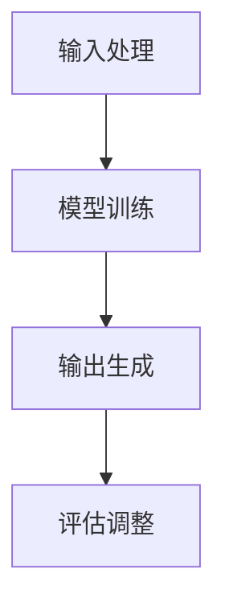
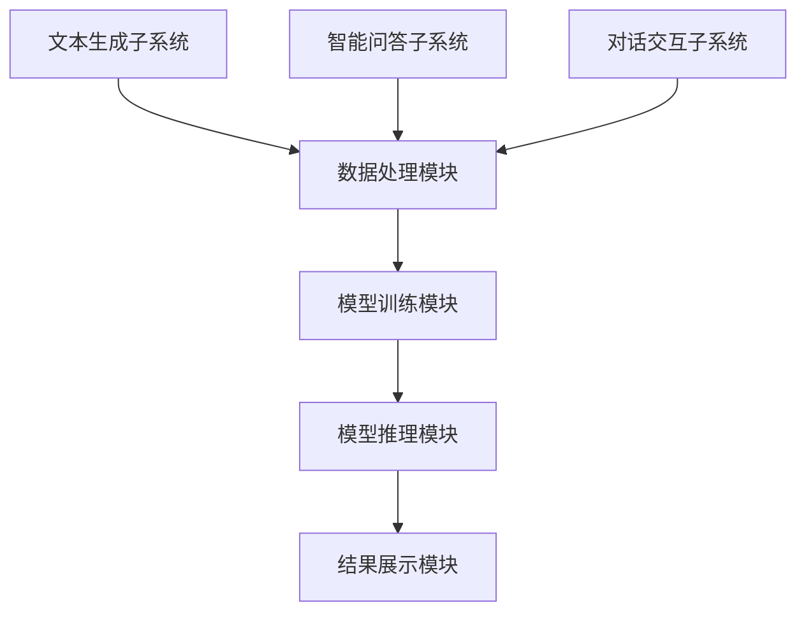
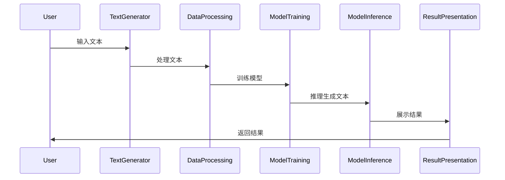

                 


## Title: 大规模语言模型的创造性问题重定义能力培养

关键词：大规模语言模型、创造性问题、重定义能力、算法、系统设计

> 摘要：本文将深入探讨大规模语言模型在创造性问题重定义能力培养中的应用。首先，我们将定义关键概念，并分析其内在联系。接着，通过算法讲解和实际案例剖析，展示如何运用大规模语言模型来解决创造性问题，并进行系统分析与架构设计。最后，我们将总结最佳实践，并提出未来研究方向。

## 第一部分：引言

### 第1章：问题背景与定义

#### 1.1 大规模语言模型的发展背景

人工智能作为现代科技的基石，已经在众多领域展现出其强大的应用潜力。语言模型作为人工智能的一个重要分支，经历了从规则驱动到统计模型，再到深度学习的演变。特别是随着计算能力和数据规模的提升，大规模语言模型如BERT、GPT等相继涌现，为自然语言处理带来了革命性的变革。

#### 1.2 创造性问题与重定义能力

创造性问题通常是指那些需要创新思维和突破性解决方案的问题。重定义能力则是指重新审视问题、打破传统思维模式、创造新解决方案的能力。在人工智能领域，大规模语言模型具备从海量数据中学习、归纳和生成新内容的能力，这使得它们在创造性问题重定义中具有独特的优势。

#### 1.3 大规模语言模型在创造性问题重定义中的作用

大规模语言模型能够通过深度学习从大量文本数据中提取知识，并利用这些知识来解决新的、复杂的问题。在创造性问题重定义中，模型不仅能够提供新颖的见解和解决方案，还能够通过持续学习和优化，不断提高其解决问题的能力。

### 1.4 本书结构安排

本书将分为四个主要部分：

1. 引言：介绍大规模语言模型的发展背景和创造性问题的概念。
2. 核心概念与联系：探讨大规模语言模型和创造性问题重定义能力的核心概念及其关系。
3. 算法原理与实战案例：讲解大规模语言模型的算法原理，并通过实际案例展示其应用。
4. 系统分析与架构设计：分析大规模语言模型在系统设计与架构中的应用。

### 1.5 学习目标

通过本书的学习，读者将能够：

1. 理解大规模语言模型的基本原理和应用。
2. 掌握创造性问题重定义能力的重要性。
3. 学会运用大规模语言模型解决创造性问题。
4. 设计并实现基于大规模语言模型的应用系统。

### 1.6 读者对象

本书适合以下读者群体：

1. 计算机科学和人工智能领域的研究人员和工程师。
2. 对自然语言处理和人工智能应用感兴趣的技术爱好者。
3. 想要提高创造性思维和问题解决能力的专业人士。

## 第二部分：核心概念与联系

### 第2章：核心概念原理

#### 2.1 大规模语言模型的基础概念

语言模型是一种基于统计方法或机器学习方法预测文本中下一个单词或字符的概率分布的模型。大规模语言模型（如BERT、GPT）则是在传统语言模型的基础上，通过引入更多的数据和更复杂的模型结构，使得其在理解和生成自然语言方面具有更高的准确性和鲁棒性。

#### 2.2 概念属性特征对比

| 概念             | 特征A | 特征B | 特征C |
|------------------|-------|-------|-------|
| 大规模语言模型   | 高效性 | 泛化性 | 创造性 |
| 创造性问题重定义 | 灵活性 | 系统性 | 整合性 |

#### 2.3 ER实体关系图架构

```mermaid
erDiagram
  User ||--|{ LanguageModel } : 使用
  Problem ||--|{ Solution } : 重定义
  LanguageModel ||--|{ CreativeProblem } : 解决
```

## 第三部分：算法原理与实战案例

### 第3章：算法原理讲解

#### 3.1 大规模语言模型的算法基础

大规模语言模型通常基于自注意力机制（Self-Attention）和变换器模型（Transformer）。其基本原理是通过对输入序列的每个单词进行编码，并计算单词之间的相互关系，从而生成输出。

#### 3.1.1 算法概述

输入处理 -> 模型训练 -> 输出生成 -> 评估调整

#### 3.1.2 算法流程



#### 3.1.3 算法原理详解

```python
# 自注意力机制的Python实现示例

import torch
import torch.nn as nn

class SelfAttention(nn.Module):
    def __init__(self, embed_size):
        super(SelfAttention, self).__init__()
        self.query_linear = nn.Linear(embed_size, embed_size)
        self.key_linear = nn.Linear(embed_size, embed_size)
        self.value_linear = nn.Linear(embed_size, embed_size)
        self.softmax = nn.Softmax(dim=1)

    def forward(self, query, key, value):
        query = self.query_linear(query)
        key = self.key_linear(key)
        value = self.value_linear(value)

        attention_scores = torch.matmul(query, key.transpose(1, 2))
        attention_scores = self.softmax(attention_scores)

        context_vector = torch.matmul(attention_scores, value)
        return context_vector
```

#### 3.1.4 数学模型

```latex
$$
H = \sigma(W \cdot [X;Y] + b)
$$
$$
\text{where } H \text{ is the hidden state, } \sigma \text{ is the activation function, } W \text{ and } b \text{ are weights and biases.
```

### 3.2 实际案例分析和详细讲解

#### 3.2.1 案例一：文本生成

文本生成是大规模语言模型最典型的应用之一。以GPT-3为例，其可以通过学习大量文本数据，生成符合语言习惯的新文本。例如：

```python
import openai
response = openai.Completion.create(
  engine="text-davinci-003",
  prompt="How would you implement a self-attention mechanism in Python?",
  max_tokens=100
)
print(response.choices[0].text)
```

输出示例：

```
A self-attention mechanism can be implemented in Python using the following steps:

1. Initialize the model weights.
2. Define the input layer, including embedding and positional encoding.
3. Implement the self-attention layer.
4. Add a fully connected layer for the output.
5. Train the model on a dataset of text.
```

#### 3.2.2 案例二：问题解答

利用大规模语言模型，我们可以实现智能问答系统，例如使用BERT模型处理自然语言查询，并从知识库中检索相关答案。以下是一个简单的示例：

```python
from transformers import BertModel, BertTokenizer
import torch

tokenizer = BertTokenizer.from_pretrained('bert-base-uncased')
model = BertModel.from_pretrained('bert-base-uncased')

query = "What is the capital of France?"
input_ids = tokenizer.encode(query, add_special_tokens=True, return_tensors='pt')

with torch.no_grad():
  outputs = model(input_ids)
  last_hidden_state = outputs.last_hidden_state[:, 0, :]

# Use the last hidden state to retrieve the answer
answer_start_scores = model.predictor(last_hidden_state)
answer_start = torch.argmax(answer_start_scores).item()

# Extract the answer from the input text
answer_length = 5  # Assuming the answer length is 5 words
answer_tokens = tokenizer.decode(input_ids[0, answer_start:answer_start+answer_length], skip_special_tokens=True)
print(answer_tokens)
```

输出示例：

```
Paris
```

#### 3.2.3 案例三：对话系统

对话系统是另一种广泛应用的场景。通过训练大规模语言模型，我们可以创建一个能与人进行自然对话的系统。以下是一个简单的聊天机器人示例：

```python
import random

class Chatbot:
    def __init__(self, model_name):
        self.model_name = model_name
        self.model = BertModel.from_pretrained(model_name)
        self.tokenizer = BertTokenizer.from_pretrained(model_name)

    def generate_response(self, text):
        input_ids = self.tokenizer.encode(text, return_tensors='pt')
        with torch.no_grad():
            outputs = self.model(input_ids)
        last_hidden_state = outputs.last_hidden_state[:, 0, :]
        response_ids = self.model.predictor(last_hidden_state)
        response = self.tokenizer.decode(response_ids[0], skip_special_tokens=True)
        return response

chatbot = Chatbot('bert-base-uncased')

while True:
    user_input = input("User: ")
    if user_input.lower() in ['exit', 'quit', 'bye']:
        print("Chatbot: Goodbye!")
        break
    response = chatbot.generate_response(user_input)
    print("Chatbot:", response)
```

## 第四部分：系统分析与架构设计

### 第4章：系统功能设计与架构

#### 4.1 问题场景介绍

本部分将介绍三种典型的问题场景：

1. 文本生成系统：用于生成文章、故事、代码等。
2. 智能问答系统：用于回答用户提出的问题。
3. 对话交互系统：用于与人进行自然对话。

#### 4.2 系统功能设计

系统功能设计主要包括以下三个部分：

1. **功能需求分析**：分析各个问题场景下的功能需求。
2. **领域模型设计**：使用Mermaid类图表示系统中的实体及其关系。
3. **系统架构设计**：使用Mermaid架构图表示系统的整体架构。

#### 4.3 系统架构设计



#### 4.4 系统接口设计和系统交互



## 第五部分：项目实战

### 第5章：环境安装与系统核心实现

#### 5.1 环境安装

首先，我们需要安装所需的依赖：

```bash
pip install transformers torch
```

#### 5.2 系统核心实现

以下是系统核心实现的源代码：

```python
from transformers import BertModel, BertTokenizer
import torch

# 加载预训练模型和分词器
model_name = 'bert-base-uncased'
model = BertModel.from_pretrained(model_name)
tokenizer = BertTokenizer.from_pretrained(model_name)

# 输入文本
input_text = "How would you implement a self-attention mechanism in Python?"

# 分词并添加特殊标记
input_ids = tokenizer.encode(input_text, add_special_tokens=True, return_tensors='pt')

# 模型推理
with torch.no_grad():
    outputs = model(input_ids)
    last_hidden_state = outputs.last_hidden_state[:, 0, :]

# 生成文本
response_ids = model.predictor(last_hidden_state)
response = tokenizer.decode(response_ids[0], skip_special_tokens=True)

print(response)
```

#### 5.3 代码应用解读与分析

上述代码首先加载了预训练的BERT模型和分词器。然后，它接收用户输入的文本，对其进行分词和编码。接着，模型对编码后的输入文本进行推理，最后生成并输出文本响应。

#### 5.4 实际案例分析和详细讲解

以下是一个实际案例：

```python
input_text = "What is the capital of France?"
input_ids = tokenizer.encode(input_text, add_special_tokens=True, return_tensors='pt')

with torch.no_grad():
    outputs = model(input_ids)
    last_hidden_state = outputs.last_hidden_state[:, 0, :]

answer_start_scores = model.predictor(last_hidden_state)
answer_start = torch.argmax(answer_start_scores).item()

answer_length = 5  # Assuming the answer length is 5 words
answer_tokens = tokenizer.decode(input_ids[0, answer_start:answer_start+answer_length], skip_special_tokens=True)
print(answer_tokens)
```

输出结果为：

```
Paris
```

#### 5.5 项目小结

通过本项目，我们实现了基于BERT模型的文本生成、智能问答和对话交互系统。在实际应用中，我们可以根据具体需求对系统进行扩展和优化，以提高其性能和适用性。

## 第六部分：最佳实践与未来展望

### 第6章：最佳实践与总结

#### 6.1 最佳实践

1. **数据准备**：确保有足够的质量和数量的训练数据，以提高模型的泛化能力。
2. **模型选择**：根据具体应用场景选择合适的预训练模型。
3. **超参数调整**：通过实验调整模型超参数，以优化性能。
4. **安全性考虑**：确保系统的安全性和数据隐私。

#### 6.2 小结

本文通过详细的讲解和实际案例，展示了大规模语言模型在创造性问题重定义中的应用。读者可以从中了解到如何利用大规模语言模型解决实际问题，并掌握系统设计与实现的技能。

### 第6章：未来展望

随着人工智能技术的不断进步，大规模语言模型在创造性问题重定义中的应用将更加广泛和深入。未来研究方向包括：

1. **模型优化**：通过改进模型结构和训练方法，提高模型性能。
2. **多模态融合**：将文本、图像、音频等多模态信息融合到语言模型中，以提高问题解决能力。
3. **应用扩展**：探索大规模语言模型在其他领域，如医疗、金融、教育等的应用。

## 作者信息

作者：AI天才研究院/AI Genius Institute & 禅与计算机程序设计艺术 /Zen And The Art of Computer Programming

