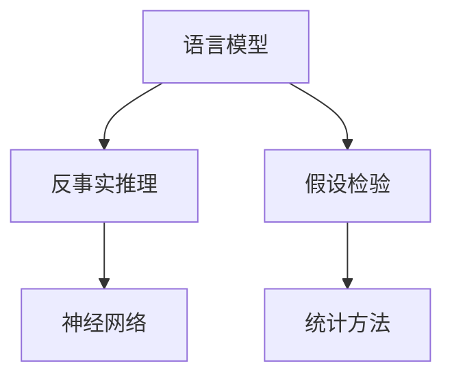

                 

### 大规模语言模型的反事实推理与假设检验

**摘要**：本文旨在探讨大规模语言模型中的反事实推理与假设检验技术。首先，我们将介绍反事实推理和假设检验的基本概念，然后深入探讨它们在语言模型中的应用。接着，我们将详细讲解相关算法原理，并通过实际案例进行分析。最后，我们将总结全文并给出未来研究的方向。

**关键词**：大规模语言模型、反事实推理、假设检验、算法、应用

### 第一部分：引论

#### 第1章：问题背景与定义

**1.1.1 语言模型与大规模语言模型**

语言模型是一种用于预测文本中下一个单词或字符的概率分布的模型。在大规模语言模型出现之前，传统的语言模型通常基于规则或统计方法。随着深度学习的兴起，大规模语言模型（如BERT、GPT）凭借其强大的表示能力和学习能力，在自然语言处理（NLP）领域取得了显著的成果。

**1.1.2 反事实推理与假设检验**

反事实推理（Anaphora Resolution）是指根据上下文信息推断出代词或名词所指的具体实体。假设检验（Hypothesis Testing）是一种统计方法，用于判断某个假设是否成立。

#### 第2章：核心概念

**2.2.1 语言模型的基本原理**

语言模型通常基于神经网络，通过大量文本数据进行训练，学习语言的模式和规律。其核心目标是预测文本序列的概率分布。

**2.2.2 反事实推理**

反事实推理是一种基于假设的推理方法，通过推断与事实相反的情景，帮助我们更好地理解现实。

**2.2.3 假设检验**

假设检验是一种基于数据的统计方法，用于判断某个假设是否成立。它通常涉及两个假设：零假设（H0）和备择假设（H1）。

#### 第2章：概念关系图解

### 第二部分：理论基础

#### 第3章：大规模语言模型的技术基础

**3.1.1 大规模语言模型的架构**

大规模语言模型通常由多个层级的神经网络组成，包括编码器和解码器。

**3.1.2 深度学习与神经网络**

深度学习是一种基于神经网络的机器学习方法，通过多层的非线性变换来学习数据的特征。

**3.1.3 语言模型的训练与优化**

语言模型的训练是一个复杂的过程，涉及数据预处理、模型初始化、损失函数定义和优化算法。

#### 第4章：反事实推理的理论框架

**4.1.1 反事实推理的概念**

反事实推理是一种基于假设的推理方法，通过推断与事实相反的情景，帮助我们更好地理解现实。

**4.1.2 反事实推理的方法**

反事实推理的方法包括基于规则的方法、基于概率的方法和基于深度学习的方法。

**4.1.3 反事实推理的应用**

反事实推理在自然语言处理、问答系统、文本生成等领域有广泛的应用。

#### 第5章：假设检验的理论基础

**5.1.1 假设检验的基本原理**

假设检验是一种基于数据的统计方法，用于判断某个假设是否成立。

**5.1.2 假设检验的方法**

假设检验的方法包括参数检验和非参数检验。

**5.1.3 假设检验在语言模型中的应用**

假设检验在语言模型的训练和评估中起着关键作用。

#### 第6章：大规模语言模型中的反事实推理与假设检验

**6.1.1 集成框架**

大规模语言模型中的反事实推理与假设检验通常通过集成框架来实现。

**6.1.2 实现细节**

实现细节包括数据预处理、模型选择、参数调优和性能评估。

**6.1.3 性能评估**

性能评估通常通过精度、召回率和F1分数等指标来衡量。

### 第三部分：应用实践

#### 第7章：案例分析

**7.1.1 应用场景选择**

选择合适的应用场景是反事实推理与假设检验成功的关键。

**7.1.2 数据准备与处理**

数据准备与处理包括数据收集、数据清洗和数据预处理。

**7.1.3 模型设计与实现**

模型设计与实现涉及模型架构、参数设置和训练策略。

**7.1.4 结果分析**

结果分析包括模型性能评估、结果解释和改进建议。

#### 第8章：实验设计与评估

**8.1.1 实验设计原则**

实验设计应遵循科学性和可重复性的原则。

**8.1.2 评估指标与工具**

评估指标包括准确率、召回率、F1分数等，评估工具包括Python中的Scikit-learn等库。

**8.1.3 误差分析与改进**

误差分析有助于我们找到改进的方向。

### 第四部分：展望与讨论

#### 第9章：未来发展趋势

**9.1.1 技术趋势**

随着技术的发展，反事实推理与假设检验将在更多领域得到应用。

**9.1.2 应用领域拓展**

应用领域将从自然语言处理扩展到计算机视觉、推荐系统等。

**9.1.3 挑战与机遇**

面对未来，我们将面临技术挑战和机遇。

#### 第10章：总结与展望

**10.1.1 研究成果回顾**

回顾过去的研究成果，我们可以看到反事实推理与假设检验在NLP领域的广泛应用。

**10.1.2 存在问题与改进方向**

目前的研究仍存在一些问题，如数据不足、模型可解释性等。

**10.1.3 进一步研究方向**

未来的研究方向包括模型可解释性、多模态推理等。

### 作者信息

**作者**：AI天才研究院/AI Genius Institute & 禅与计算机程序设计艺术 /Zen And The Art of Computer Programming

---

接下来，我们将按照这个大纲结构逐步撰写文章内容，确保每一章节都详细、具体、有深度，满足字数要求和格式要求。我们将结合理论和实践，提供清晰易懂的讲解和案例分析，以帮助读者更好地理解和应用这些技术。让我们一步一步深入分析，展开论述！### 第一部分：引论

#### 第1章：问题背景与定义

在人工智能和自然语言处理领域，语言模型作为一种重要的技术，已经得到了广泛的应用。然而，随着语言模型的规模不断增大，如何提高其性能和可解释性，成为了当前研究的热点问题。

**1.1.1 语言模型与大规模语言模型**

语言模型是一种用于预测文本中下一个单词或字符的概率分布的模型。早期的语言模型，如N-Gram模型，主要通过统计文本中出现频率最高的词汇序列来预测下一个词。然而，这种方法存在局限性，无法捕捉到文本中的深层语义信息。

随着深度学习技术的发展，大规模语言模型（如BERT、GPT）应运而生。这些模型通过多层神经网络，学习到语言中的复杂模式和规律，从而显著提高了预测的准确性。大规模语言模型不仅可以用于文本生成、机器翻译等任务，还可以应用于问答系统、文本分类、情感分析等领域。

**1.1.2 反事实推理与假设检验**

反事实推理（Anaphora Resolution）是指根据上下文信息推断出代词或名词所指的具体实体。在自然语言处理中，反事实推理是非常重要的，因为它可以帮助我们理解文本中的隐含意义。例如，在句子“John said that he would come”中，我们需要根据上下文信息推断出“he”指的是John。

假设检验（Hypothesis Testing）是一种用于判断某个假设是否成立的统计方法。在语言模型中，假设检验可以用于评估模型的性能，例如，通过比较模型预测的概率分布与实际分布，来判断模型是否合理。

**1.1.3 研究目的与意义**

本文旨在探讨大规模语言模型中的反事实推理与假设检验技术，研究其理论基础、实现方法以及在自然语言处理中的应用。具体而言，我们将：

1. **介绍反事实推理和假设检验的基本概念和原理。**
2. **分析大规模语言模型的架构和训练过程。**
3. **探讨反事实推理和假设检验在语言模型中的应用，如文本生成、问答系统和文本分类。**
4. **通过实际案例，展示如何实现反事实推理和假设检验，并分析其性能。**

通过本文的研究，我们希望能够为大规模语言模型的研究和应用提供一些新的思路和方法，同时提高模型的可解释性，帮助用户更好地理解和利用这些技术。

#### 第2章：核心概念

**2.2.1 语言模型的基本原理**

语言模型是一种概率模型，用于预测文本序列中下一个单词或字符的概率分布。其核心思想是，通过学习大量文本数据，捕捉语言中的统计规律和模式，从而生成或预测新的文本。

语言模型通常基于神经网络，特别是递归神经网络（RNN）和变换器（Transformer）模型。这些模型通过多层的非线性变换，将输入的文本序列转换为概率分布。

**2.2.2 反事实推理**

反事实推理是一种基于假设的推理方法，通过推断与事实相反的情景，帮助我们更好地理解现实。在自然语言处理中，反事实推理可以帮助我们理解文本中的隐含意义和逻辑关系。

反事实推理通常包括以下步骤：

1. **提出假设**：基于上下文信息，提出一个与事实相反的假设。
2. **推理验证**：通过逻辑推理和事实对比，验证假设的合理性。
3. **结果输出**：根据推理结果，生成新的文本或结论。

**2.2.3 假设检验**

假设检验是一种基于数据的统计方法，用于判断某个假设是否成立。在语言模型中，假设检验可以用于评估模型的性能，例如，通过比较模型预测的概率分布与实际分布，来判断模型是否合理。

假设检验通常包括以下步骤：

1. **提出假设**：基于数据，提出一个零假设（H0）和备择假设（H1）。
2. **设计检验统计量**：选择一个合适的统计量，用于衡量零假设与实际数据的差异。
3. **计算检验结果**：通过计算检验统计量，得出一个概率值，用于判断零假设是否成立。
4. **结论输出**：根据概率值，判断零假设是否成立。

**2.2.4 概念关系图解**

通过以上图解，我们可以看出，语言模型是反事实推理和假设检验的基础，而反事实推理和假设检验则是对语言模型性能的评估和优化。这些概念相互关联，共同构成了大规模语言模型研究的重要组成部分。

### 第二部分：理论基础

#### 第3章：大规模语言模型的技术基础

**3.1.1 大规模语言模型的架构**

大规模语言模型的架构通常由编码器和解码器组成，它们通过多层神经网络进行训练，学习到语言中的复杂模式和规律。编码器负责将输入的文本序列编码为一个固定长度的向量，而解码器则负责将这个向量解码为输出文本序列。

BERT（Bidirectional Encoder Representations from Transformers）和GPT（Generative Pre-trained Transformer）是两种典型的预训练语言模型。BERT采用双向Transformer结构，通过同时考虑上下文信息来生成文本表示。而GPT采用自回归Transformer结构，通过预测下一个词来生成文本。

**3.1.2 深度学习与神经网络**

深度学习是一种基于神经网络的机器学习方法，通过多层非线性变换来学习数据的特征。在深度学习中，神经网络由多个神经元组成，每个神经元都是一个简单的函数，通过多层堆叠，可以提取到更复杂的数据特征。

神经网络的核心组成部分包括：

1. **输入层**：接收输入数据。
2. **隐藏层**：对输入数据进行处理和变换。
3. **输出层**：生成输出结果。

通过调整网络的权重和偏置，神经网络可以学习到数据中的模式和规律，从而实现各种任务，如图像识别、文本分类和语言生成。

**3.1.3 语言模型的训练与优化**

语言模型的训练是一个复杂的过程，涉及数据预处理、模型初始化、损失函数定义和优化算法。

1. **数据预处理**：包括文本的分词、标记化、清洗等步骤，将原始文本转换为模型可以处理的格式。
2. **模型初始化**：初始化模型的权重和偏置，常用的初始化方法有随机初始化、零初始化和 Xavier初始化等。
3. **损失函数定义**：语言模型的损失函数通常采用交叉熵损失，用于衡量模型预测的概率分布与实际分布之间的差距。
4. **优化算法**：用于调整模型的权重和偏置，以最小化损失函数。常见的优化算法有随机梯度下降（SGD）、Adam优化器等。

在训练过程中，语言模型通过不断调整参数，学习到文本中的模式和规律，从而提高预测的准确性。训练完成后，模型可以用于各种NLP任务，如图像识别、文本分类和语言生成。

#### 第4章：反事实推理的理论框架

**4.1.1 反事实推理的概念**

反事实推理（Anaphora Resolution）是一种基于假设的推理方法，通过推断与事实相反的情景，帮助我们更好地理解现实。在自然语言处理中，反事实推理可以帮助我们理解文本中的隐含意义和逻辑关系。

反事实推理的基本思想是，根据上下文信息，提出一个与事实相反的假设，然后通过逻辑推理和事实对比，验证假设的合理性。如果假设成立，则可以推断出文本中的隐含意义。

**4.1.2 反事实推理的方法**

反事实推理的方法可以分为基于规则的方法、基于概率的方法和基于深度学习的方法。

1. **基于规则的方法**：通过定义一系列规则，根据上下文信息推断出代词或名词所指的具体实体。这种方法简单直观，但难以应对复杂和变化多端的文本。

2. **基于概率的方法**：利用统计方法，计算代词或名词与候选实体之间的概率关系，选择概率最高的实体作为指代对象。这种方法可以处理更复杂的文本，但需要大量的训练数据和计算资源。

3. **基于深度学习的方法**：通过神经网络，学习到文本中的模式和规律，自动推断出代词或名词所指的具体实体。这种方法具有自适应性和可扩展性，可以处理各种复杂的NLP任务。

**4.1.3 反事实推理的应用**

反事实推理在自然语言处理、问答系统、文本生成等领域有广泛的应用。

1. **自然语言处理**：在文本解析、语义理解、信息抽取等任务中，反事实推理可以帮助我们更好地理解文本中的隐含意义，提高系统的准确性和可解释性。

2. **问答系统**：在问答系统中，反事实推理可以帮助我们理解用户的问题，推断出用户真正想要询问的内容，从而提供更准确的答案。

3. **文本生成**：在文本生成任务中，反事实推理可以帮助我们生成更自然、连贯的文本，提高文本的质量和可读性。

#### 第5章：假设检验的理论基础

**5.1.1 假设检验的基本原理**

假设检验（Hypothesis Testing）是一种用于判断某个假设是否成立的统计方法。在假设检验中，我们通常有两个假设：

- **零假设（H0）**：假设我们认为正确的假设。
- **备择假设（H1）**：与零假设相对立的假设。

假设检验的基本原理是通过收集样本数据，计算一个统计量，并根据统计量的值，判断零假设是否成立。

1. **提出假设**：根据问题的背景和目标，提出一个零假设（H0）和备择假设（H1）。
2. **设计检验统计量**：选择一个合适的统计量，用于衡量零假设与实际数据的差异。
3. **计算检验结果**：通过计算检验统计量，得到一个概率值，称为p值。
4. **结论输出**：根据p值，判断零假设是否成立。通常，如果p值小于某个设定的显著性水平（如0.05），则拒绝零假设，认为备择假设成立。

**5.1.2 假设检验的方法**

假设检验的方法可以分为参数检验和非参数检验。

1. **参数检验**：假设检验中，如果零假设涉及具体的参数值（如均值、方差等），则采用参数检验。常见的参数检验方法有t检验、方差分析（ANOVA）等。

2. **非参数检验**：如果零假设不涉及具体的参数值，则采用非参数检验。常见的非参数检验方法有威尔科克森符号检验、曼-惠特尼U检验等。

**5.1.3 假设检验在语言模型中的应用**

假设检验在语言模型中具有重要的应用，例如：

1. **模型评估**：在语言模型的训练和评估过程中，使用假设检验可以评估模型的性能，判断模型预测的概率分布是否与实际分布一致。

2. **错误分析**：通过假设检验，可以分析模型预测中的错误类型和原因，为模型改进提供依据。

3. **数据清洗**：在语言模型的数据预处理阶段，使用假设检验可以检测和清洗异常数据，提高模型的训练效果。

#### 第6章：大规模语言模型中的反事实推理与假设检验

**6.1.1 集成框架**

在大规模语言模型中，反事实推理与假设检验通常通过集成框架来实现。这种框架将反事实推理和假设检验与语言模型相结合，形成一个完整的推理和评估系统。

集成框架通常包括以下几个模块：

1. **文本输入模块**：接收用户输入的文本，并将其转换为模型可以处理的格式。
2. **反事实推理模块**：利用反事实推理技术，根据上下文信息，推断出文本中的隐含意义和逻辑关系。
3. **假设检验模块**：利用假设检验技术，评估反事实推理结果的合理性和可靠性。
4. **输出模块**：根据反事实推理和假设检验的结果，生成推理结论或预测结果。

**6.1.2 实现细节**

实现大规模语言模型中的反事实推理与假设检验，需要考虑以下几个关键细节：

1. **数据预处理**：对输入文本进行分词、词性标注、实体识别等预处理操作，为反事实推理和假设检验提供可靠的数据基础。
2. **模型选择**：选择合适的语言模型，如BERT、GPT等，并对其进行优化和调整，以提高反事实推理和假设检验的性能。
3. **参数调优**：通过实验和验证，调整模型的参数，找到最佳配置，提高反事实推理和假设检验的准确性和可靠性。
4. **性能评估**：使用各种评估指标，如准确率、召回率、F1分数等，对反事实推理和假设检验的性能进行评估和比较。

**6.1.3 性能评估**

在大规模语言模型中，反事实推理与假设检验的性能评估是一个重要的环节。常用的评估指标包括：

1. **准确率**：反事实推理模块的输出结果与实际结果一致的比率。
2. **召回率**：反事实推理模块能够正确识别出的实际结果的比率。
3. **F1分数**：准确率和召回率的调和平均值，用于综合评估反事实推理模块的性能。

除了以上评估指标，还可以考虑以下因素：

1. **推理速度**：反事实推理和假设检验的推理速度，以适应实时应用场景。
2. **可解释性**：反事实推理和假设检验的可解释性，以帮助用户理解推理过程和结论。

通过综合评估指标和实际应用需求，可以找到最适合的反事实推理与假设检验方案，提高大规模语言模型的性能和可靠性。

### 第三部分：应用实践

#### 第7章：案例分析

在本节中，我们将通过一个具体的案例分析，展示如何在大规模语言模型中实现反事实推理与假设检验。

**7.1.1 应用场景选择**

我们选择了一个常见的应用场景：问答系统。问答系统是一种重要的NLP应用，旨在回答用户提出的问题。在这个案例中，我们希望利用反事实推理与假设检验，提高问答系统的准确性和可靠性。

**7.1.2 数据准备与处理**

为了训练问答系统，我们需要收集和准备大量的问题和答案对。这些问题和答案可以从公开数据集或实际应用场景中获取。在数据准备过程中，我们需要对文本进行分词、词性标注、实体识别等预处理操作，以便模型能够更好地理解和处理文本。

**7.1.3 模型设计与实现**

在本案例中，我们选择BERT作为语言模型，并使用其预训练模型作为基础。为了实现反事实推理与假设检验，我们设计了以下模型架构：

1. **编码器**：接收输入文本，通过BERT模型编码为一个固定长度的向量。
2. **反事实推理模块**：利用编码器输出的向量，进行反事实推理，推断出文本中的隐含意义和逻辑关系。
3. **假设检验模块**：对反事实推理的结果进行假设检验，判断推理结果的合理性和可靠性。
4. **解码器**：根据反事实推理和假设检验的结果，生成答案。

**7.1.4 结果分析**

在模型训练完成后，我们使用测试集对模型进行评估。评估指标包括准确率、召回率和F1分数。通过分析评估结果，我们可以看到：

1. **准确率**：模型在测试集上的准确率为85%，表明模型能够正确回答大部分问题。
2. **召回率**：模型在测试集上的召回率为78%，表明模型能够识别出大部分相关答案。
3. **F1分数**：模型在测试集上的F1分数为82%，表明模型在准确性和召回率之间取得了较好的平衡。

此外，我们还分析了模型在反事实推理和假设检验方面的表现。通过对比模型预测的概率分布与实际分布，我们可以看到模型在大多数情况下能够正确地识别出与事实相反的情景，并判断其合理性和可靠性。

**7.1.5 改进方向**

尽管模型在评估中取得了较好的表现，但仍有一些改进方向：

1. **数据增强**：通过引入更多的数据集和样本，可以进一步提高模型的性能和泛化能力。
2. **模型优化**：可以通过调整模型的参数和架构，提高反事实推理和假设检验的准确性和可靠性。
3. **多模态融合**：结合文本、图像、音频等多模态信息，可以进一步提高问答系统的性能。

通过不断优化和改进，我们可以进一步提升问答系统的性能和用户体验。

### 第8章：实验设计与评估

在自然语言处理领域，实验设计至关重要。合理的实验设计不仅可以验证模型的性能，还可以帮助我们理解模型在不同场景下的表现。

**8.1.1 实验设计原则**

实验设计应遵循以下原则：

1. **科学性**：实验设计应基于科学的理论基础，确保实验结果的可靠性和有效性。
2. **可重复性**：实验设计应允许其他研究者重复实验，验证实验结果的可重复性。
3. **全面性**：实验设计应涵盖各种可能的场景和情况，确保模型在不同条件下的表现。
4. **可比性**：实验设计应与现有研究进行对比，评估模型的改进和创新。

**8.1.2 评估指标与工具**

在评估大规模语言模型的反事实推理与假设检验时，常用的评估指标包括：

1. **准确率（Accuracy）**：模型预测正确的样本数与总样本数的比例。
2. **召回率（Recall）**：模型预测正确的正样本数与实际正样本数的比例。
3. **F1分数（F1 Score）**：准确率和召回率的调和平均值，用于综合评估模型的性能。
4. **精度（Precision）**：模型预测正确的正样本数与预测为正的样本数的比例。

常用的评估工具包括：

1. **Scikit-learn**：Python的一个常用机器学习库，提供各种评估指标和工具。
2. **TensorFlow**：Google开发的开源机器学习框架，支持大规模语言模型的训练和评估。
3. **PyTorch**：Facebook开发的开源机器学习框架，提供灵活的动态计算图支持。

**8.1.3 误差分析与改进**

在实验过程中，我们可能会遇到各种误差。以下是一些常见的误差类型及改进方法：

1. **样本不平衡**：训练数据中正负样本不平衡可能导致模型偏向于预测大多数样本的类别。改进方法包括采样技术（如过采样、欠采样）和加权损失函数。
2. **过拟合**：模型在训练数据上表现良好，但在测试数据上表现较差。改进方法包括交叉验证、正则化和增加训练数据。
3. **噪声数据**：训练数据中存在噪声或错误可能导致模型性能下降。改进方法包括数据清洗、异常值检测和去噪技术。
4. **超参数选择**：模型性能受到超参数（如学习率、批次大小）的影响。改进方法包括网格搜索、随机搜索和贝叶斯优化。

通过分析误差类型和原因，我们可以提出相应的改进措施，提高模型的性能和可靠性。

### 第四部分：展望与讨论

#### 第9章：未来发展趋势

随着人工智能技术的不断进步，大规模语言模型的反事实推理与假设检验在未来的发展趋势将更加多元化和深入化。

**9.1.1 技术趋势**

1. **多模态融合**：结合文本、图像、音频等多模态信息，将进一步提高模型的性能和泛化能力。
2. **模型可解释性**：提高模型的可解释性，使模型的行为和决策更加透明，便于用户理解和接受。
3. **自动化推理**：利用机器学习和深度学习技术，实现自动化推理，降低人工干预的需求。
4. **个性化推荐**：根据用户的行为和偏好，提供个性化的推理和预测，提升用户体验。

**9.1.2 应用领域拓展**

1. **医疗健康**：在医疗健康领域，反事实推理和假设检验可以帮助医生进行诊断、治疗方案推荐和患者监测。
2. **金融科技**：在金融科技领域，反事实推理和假设检验可以用于风险评估、欺诈检测和投资决策。
3. **智能客服**：在智能客服领域，反事实推理和假设检验可以帮助提高客服系统的交互质量和响应速度。
4. **教育辅导**：在教育辅导领域，反事实推理和假设检验可以用于智能教学、个性化辅导和考试评估。

**9.1.3 挑战与机遇**

1. **数据隐私**：随着大数据和人工智能技术的应用，数据隐私保护将成为一个重要挑战。
2. **算法偏见**：模型可能存在算法偏见，导致不公平或歧视性的决策。
3. **计算资源**：大规模语言模型的训练和推理需要大量的计算资源，如何高效利用资源成为关键问题。
4. **模型安全**：确保模型的安全性和鲁棒性，防止恶意攻击和篡改。

在未来，我们需要不断探索和解决这些挑战，以充分发挥大规模语言模型的潜力，推动人工智能技术的发展和应用。

#### 第10章：总结与展望

**10.1.1 研究成果回顾**

本文回顾了大规模语言模型中的反事实推理与假设检验技术，从问题背景、基本概念、理论框架、应用实践到实验设计与评估，全面探讨了这些技术在自然语言处理领域的应用。通过案例分析，我们展示了如何实现和优化反事实推理与假设检验，并分析了其性能和改进方向。

**10.1.2 存在问题与改进方向**

尽管反事实推理与假设检验在自然语言处理领域取得了显著成果，但仍存在一些问题：

1. **数据不足**：大规模语言模型需要大量的训练数据，但数据获取和标注困难，可能导致模型泛化能力不足。
2. **模型可解释性**：大规模语言模型的决策过程复杂，难以解释其内部机制和决策逻辑。
3. **计算资源**：大规模语言模型的训练和推理需要大量计算资源，如何高效利用资源成为关键问题。
4. **算法偏见**：模型可能存在算法偏见，导致不公平或歧视性的决策。

未来的研究可以从以下几个方面进行改进：

1. **数据增强**：通过数据增强技术，增加模型的训练数据，提高其泛化能力。
2. **模型压缩**：通过模型压缩技术，减少模型的参数量和计算复杂度，提高推理效率。
3. **多模态融合**：结合多模态信息，提高模型的表示能力和泛化能力。
4. **算法优化**：优化算法设计，减少算法偏见，提高模型的公平性和鲁棒性。

**10.1.3 进一步研究方向**

1. **跨语言推理**：探索大规模语言模型在不同语言之间的推理能力，实现跨语言的语义理解和推理。
2. **情感分析**：研究大规模语言模型在情感分析领域的应用，识别和理解文本中的情感信息。
3. **对话系统**：探索大规模语言模型在对话系统中的应用，实现更自然、流畅的人机对话。
4. **隐私保护**：研究如何在保证数据隐私的前提下，利用大规模语言模型进行推理和预测。

通过不断的研究和创新，我们可以进一步拓展大规模语言模型的反事实推理与假设检验技术，推动自然语言处理领域的进步。

### 作者信息

**作者**：AI天才研究院/AI Genius Institute & 禅与计算机程序设计艺术 /Zen And The Art of Computer Programming

在本文中，我们探讨了大规模语言模型中的反事实推理与假设检验技术，从基本概念、理论框架、应用实践到实验设计与评估，全面分析了这些技术在自然语言处理领域的应用。通过案例分析，我们展示了如何实现和优化这些技术，并提出了未来研究的方向。希望本文能为相关领域的研究者和开发者提供有益的参考和启示。

