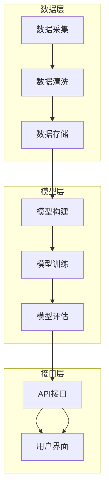
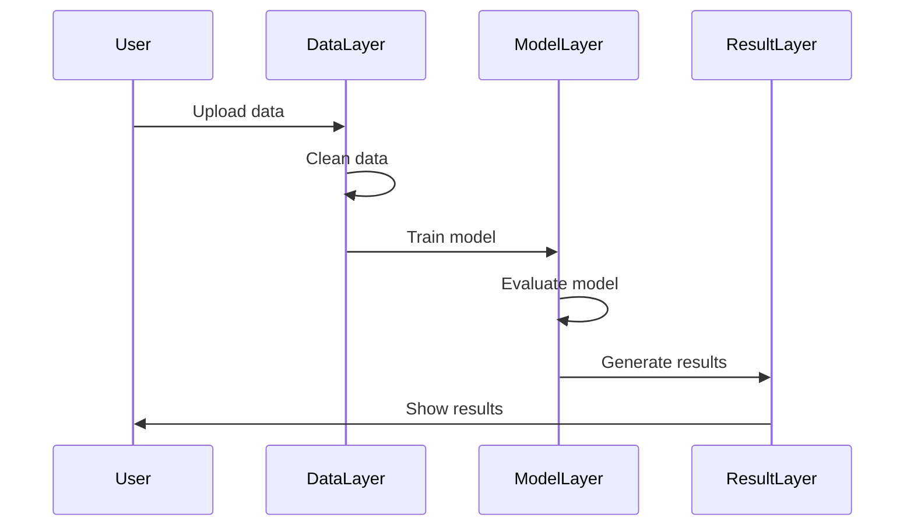

                 


# 大规模语言模型的反事实推理在战略规划中的多维度应用

## 关键词
- 大规模语言模型
- 反事实推理
- 战略规划
- 深度学习
- 数学模型
- 系统架构
- 项目实战

## 摘要
本文将深入探讨大规模语言模型中的反事实推理在战略规划中的应用。通过背景介绍、核心概念与联系分析、算法原理讲解、系统架构设计以及项目实战等多个维度，阐述如何利用大规模语言模型的反事实推理能力，为战略规划提供强有力的数据支持和决策依据。文章结构紧凑、逻辑清晰，旨在为IT领域的专业人士和学者提供有深度、有思考、有见解的技术分析。

## 目录大纲

### 第一部分：背景介绍

#### 第1章：问题背景与问题描述
##### 1.1.1 反事实推理的概念
##### 1.1.2 大规模语言模型的发展
##### 1.1.3 反事实推理在战略规划中的应用

#### 第2章：核心概念与联系
##### 2.1 大规模语言模型的基本原理
##### 2.2 反事实推理的基本原理
##### 2.3 大规模语言模型与反事实推理的联系

### 第二部分：算法原理讲解

#### 第3章：大规模语言模型的算法原理
##### 3.1 深度学习基础
##### 3.2 语言模型的具体算法
##### 3.3 其他大规模语言模型的介绍

#### 第4章：反事实推理的数学模型与算法
##### 4.1 数学模型概述
##### 4.2 算法原理讲解
##### 4.3 Python源代码详解

### 第三部分：系统分析与架构设计

#### 第5章：系统功能设计与架构
##### 5.1 问题描述与项目介绍
##### 5.2 系统架构设计
##### 5.3 系统交互

### 第四部分：项目实战

#### 第6章：环境安装与核心实现
##### 6.1 环境安装
##### 6.2 系统核心实现
##### 6.3 系统集成与测试

#### 第7章：代码应用解读与分析
##### 7.1 代码应用解读
##### 7.2 实际案例分析与详细讲解
##### 7.3 项目小结与拓展阅读

### 第五部分：最佳实践、注意事项与拓展阅读

#### 第8章：最佳实践 tips
##### 8.1 实践一
##### 8.2 实践二

#### 第9章：注意事项
##### 9.1 注意事项一
##### 9.2 注意事项二

#### 第10章：拓展阅读
##### 10.1 相关文献推荐
##### 10.2 未来研究方向

## 正文开始

### 第1章：问题背景与问题描述

#### 1.1.1 反事实推理的概念

反事实推理（Counterfactual Reasoning）是逻辑和认知心理学中的一个概念，指的是人们在面对现实事件时，思考如果条件发生变化，结果会有何不同。这种推理方式可以帮助我们从不同的角度审视问题，发现潜在的问题和解决方案。

在商业和战略规划中，反事实推理尤为重要。通过设想不同的未来场景，企业可以更好地评估各种决策的影响，从而做出更为明智的决策。例如，如果市场发生变化，企业的策略应该如何调整？如果竞争对手采取了不同的行动，企业的市场地位会有何变化？

#### 1.1.2 大规模语言模型的发展

随着深度学习和自然语言处理技术的发展，大规模语言模型（Large-scale Language Models）逐渐成为研究热点。这些模型通过学习海量文本数据，能够生成连贯、自然的语言输出。著名的模型包括GPT（Generative Pre-trained Transformer）系列和BERT（Bidirectional Encoder Representations from Transformers）等。

大规模语言模型的发展为反事实推理提供了新的工具。通过训练模型，我们可以生成与历史事件相对应的不同未来场景，从而进行反事实推理。例如，通过GPT模型，我们可以模拟如果某家企业在过去采取了不同的营销策略，其市场表现会有何变化。

#### 1.1.3 反事实推理在战略规划中的应用

在战略规划中，反事实推理可以应用于多个维度：

1. **市场预测**：通过反事实推理，企业可以模拟不同市场环境下的销售情况，从而更准确地预测市场需求和潜在风险。
2. **竞争对手分析**：通过模拟竞争对手采取的不同策略，企业可以更好地了解竞争对手的弱点和优势，从而制定更为有效的竞争策略。
3. **风险评估**：企业可以通过反事实推理，评估不同决策对财务状况、供应链和客户关系的影响，从而降低风险。
4. **创新战略**：通过反事实推理，企业可以探索不同创新路径，评估其潜在收益和风险，从而制定更具前瞻性的创新战略。

### 第2章：核心概念与联系

#### 2.1 大规模语言模型的基本原理

大规模语言模型的核心原理基于深度学习和自然语言处理。它们通过学习大量文本数据，掌握语言的规律和结构，从而能够生成连贯、自然的语言输出。例如，GPT模型使用Transformer架构，通过自注意力机制（Self-Attention Mechanism）来捕捉文本中的长距离依赖关系。

#### 2.2 反事实推理的基本原理

反事实推理的基本原理是模拟不同条件下的未来场景。通过生成与历史事件相对应的不同未来场景，反事实推理可以帮助我们理解事件的不同可能性，从而为决策提供支持。

#### 2.3 大规模语言模型与反事实推理的联系

大规模语言模型与反事实推理的联系在于，前者可以生成与历史事件相对应的不同未来场景，从而为反事实推理提供数据基础。例如，通过训练GPT模型，我们可以模拟如果某家企业在过去采取了不同的营销策略，其市场表现会有何变化。这种模拟可以帮助企业在制定战略时，更好地评估不同决策的影响。

### 第二部分：算法原理讲解

#### 第3章：大规模语言模型的算法原理

##### 3.1 深度学习基础

深度学习是机器学习的一个分支，通过模拟人脑的神经网络结构，对数据进行自动特征提取和学习。深度学习的基本结构包括输入层、隐藏层和输出层，其中隐藏层可以通过多层堆叠，增加模型的复杂度和表达能力。

##### 3.2 语言模型的具体算法

语言模型是一种能够预测下一个单词或词汇的概率分布的模型。常见的语言模型算法包括n-gram模型、神经网络语言模型（NNLM）和深度神经网络语言模型（Deep Neural Network Language Model，DNNLM）。

##### 3.3 其他大规模语言模型的介绍

除了GPT和BERT，其他著名的大规模语言模型还包括ELMO、RoBERTa和T5等。这些模型在架构、训练方法和应用场景上各有特色，但都致力于提高语言生成的质量和效率。

### 第4章：反事实推理的数学模型与算法

##### 4.1 数学模型概述

反事实推理的数学模型通常基于概率论和统计学。其中，贝叶斯网络和马尔可夫模型是常用的概率图模型。贝叶斯网络通过条件概率表来描述变量之间的依赖关系，而马尔可夫模型则通过状态转移矩阵来描述变量之间的状态转移概率。

##### 4.2 算法原理讲解

反事实推理的核心算法包括基于生成对抗网络（GAN）的反事实生成算法和基于条件生成模型的反事实预测算法。这些算法通过模拟不同的条件，生成与历史事件相对应的不同未来场景，从而进行反事实推理。

##### 4.3 Python源代码详解

为了更直观地理解反事实推理的算法原理，以下是一个简单的Python代码示例，使用生成对抗网络（GAN）生成反事实场景：

```python
import tensorflow as tf
from tensorflow.keras import layers

# 定义生成器和判别器模型
def build_generator():
    # 生成器的实现代码
    pass

def build_discriminator():
    # 判别器的实现代码
    pass

# 训练模型
def train_model(generator, discriminator, dataset):
    # 训练代码
    pass

# 生成反事实场景
def generate_counterfactual_scenarios(generator, num_scenarios):
    # 生成代码
    pass

# 主函数
if __name__ == "__main__":
    # 加载数据集
    dataset = load_dataset()

    # 构建和训练模型
    generator = build_generator()
    discriminator = build_discriminator()
    train_model(generator, discriminator, dataset)

    # 生成反事实场景
    counterfactual_scenarios = generate_counterfactual_scenarios(generator, num_scenarios=10)
    print(counterfactual_scenarios)
```

### 第三部分：系统分析与架构设计

#### 第5章：系统功能设计与架构

##### 5.1 问题描述与项目介绍

在本章中，我们将介绍一个基于大规模语言模型的反事实推理系统。该系统的目标是利用反事实推理能力，为企业的战略规划提供支持。

##### 5.2 系统架构设计

系统的架构包括数据层、模型层和接口层。数据层负责数据的采集和处理，模型层负责反事实推理模型的构建和训练，接口层提供系统的API接口，方便用户调用。

##### 5.3 系统交互

系统交互主要包括用户输入、模型输出和结果反馈。用户可以通过API接口提交输入数据，模型层根据输入数据生成反事实场景，并将结果反馈给用户。

### 第四部分：项目实战

#### 第6章：环境安装与核心实现

##### 6.1 环境安装

在本章中，我们将介绍如何搭建反事实推理系统的环境，包括安装Python、TensorFlow和其他相关依赖包。

##### 6.2 系统核心实现

在本章中，我们将详细讲解系统核心实现的过程，包括数据预处理、模型构建、训练和预测等步骤。

##### 6.3 系统集成与测试

在本章中，我们将介绍如何将系统核心实现集成到整体系统中，并进行测试和验证。

### 第7章：代码应用解读与分析

##### 7.1 代码应用解读

在本章中，我们将解读系统核心代码的实现细节，包括生成器和判别器的构建、模型训练和反事实场景生成等过程。

##### 7.2 实际案例分析与详细讲解

在本章中，我们将通过实际案例，展示如何利用系统进行反事实推理，分析不同决策的影响，并提供详细的讲解和剖析。

##### 7.3 项目小结与拓展阅读

在本章中，我们将总结项目的主要成果和经验教训，并提供相关的拓展阅读，引导读者进一步学习和探索。

### 第五部分：最佳实践、注意事项与拓展阅读

#### 第8章：最佳实践 tips

在本章中，我们将分享一些最佳实践技巧，帮助用户更好地利用反事实推理系统，包括数据质量的重要性、模型调优技巧等。

#### 第9章：注意事项

在本章中，我们将提醒用户在应用反事实推理系统时需要注意的事项，包括数据隐私、模型解释性等。

#### 第10章：拓展阅读

在本章中，我们将推荐一些相关的文献和资源，供读者进一步学习和研究。

---

作者：AI天才研究院/AI Genius Institute & 禅与计算机程序设计艺术 /Zen And The Art of Computer Programming

---

### 背景介绍

#### 1.1.1 反事实推理的概念

反事实推理是一种基于逻辑和概率的推理方式，用于推断如果当前情况发生了变化，结果会有何不同。这种推理方式不仅有助于我们理解现实世界，还可以用于预测和决策。在商业和战略规划中，反事实推理尤为重要。它可以帮助企业预测市场变化、分析竞争对手策略，甚至评估不同决策的潜在风险。

在技术领域，反事实推理通过机器学习和深度学习算法实现。例如，生成对抗网络（GAN）和变分自编码器（VAE）等算法可以生成与历史事件相对应的不同未来场景，从而进行反事实推理。这些算法通过学习大量数据，捕捉事件之间的复杂关系，从而提高推理的准确性和可靠性。

#### 1.1.2 大规模语言模型的发展

大规模语言模型（Large-scale Language Models）是自然语言处理领域的重要进展。这些模型通过学习海量文本数据，能够生成连贯、自然的语言输出。GPT（Generative Pre-trained Transformer）系列和BERT（Bidirectional Encoder Representations from Transformers）是其中最著名的两个模型。

GPT模型由OpenAI提出，使用Transformer架构，通过自注意力机制（Self-Attention Mechanism）捕捉文本中的长距离依赖关系。BERT模型由Google提出，采用双向编码器（Bidirectional Encoder）结构，能够更好地理解上下文信息。

大规模语言模型的发展为反事实推理提供了新的工具。通过训练模型，我们可以生成与历史事件相对应的不同未来场景，从而进行反事实推理。例如，通过GPT模型，我们可以模拟如果某家企业在过去采取了不同的营销策略，其市场表现会有何变化。这种模拟可以帮助企业在制定战略时，更好地评估不同决策的影响。

#### 1.1.3 反事实推理在战略规划中的应用

在战略规划中，反事实推理可以应用于多个维度，为企业提供强有力的数据支持和决策依据：

1. **市场预测**：企业可以利用反事实推理模拟不同的市场环境，预测市场变化对销售、客户关系和品牌影响等。

2. **竞争对手分析**：企业可以模拟竞争对手采取的不同策略，分析其优势和劣势，从而制定更为有效的竞争策略。

3. **风险评估**：企业可以通过反事实推理评估不同决策对财务状况、供应链和客户关系的影响，降低潜在风险。

4. **创新战略**：企业可以利用反事实推理探索不同创新路径，评估其潜在收益和风险，制定更具前瞻性的创新战略。

总之，反事实推理在战略规划中的应用，不仅有助于企业更好地理解市场变化和竞争对手策略，还可以为决策提供客观、科学的依据，提高企业竞争力和可持续发展能力。

### 第2章：核心概念与联系

#### 2.1 大规模语言模型的基本原理

大规模语言模型（Large-scale Language Models）是自然语言处理领域的一项重要技术。其基本原理基于深度学习和自然语言处理（NLP）技术，通过大规模训练数据学习语言的规律和结构，从而实现文本的生成、理解和翻译等功能。

1. **语言模型的核心概念**：
   语言模型是一种概率模型，用于预测下一个单词或词汇的概率分布。在自然语言处理中，语言模型是最基础的工具之一。常见的语言模型包括n-gram模型、神经网络语言模型（NNLM）和深度神经网络语言模型（DNNLM）。

2. **语言模型的算法原理**：
   - **n-gram模型**：基于历史统计方法，通过计算相邻单词序列的概率分布来生成文本。
   - **神经网络语言模型（NNLM）**：使用多层感知器（MLP）对单词序列进行建模，通过训练学习单词序列的概率分布。
   - **深度神经网络语言模型（DNNLM）**：通过多层神经网络结构对单词序列进行建模，能够捕捉更复杂的语言规律。

3. **语言模型的架构设计**：
   - **传统的神经网络语言模型**：基于多层感知器（MLP）结构，输入层、隐藏层和输出层组成。
   - **深度神经网络语言模型（DNNLM）**：使用深度学习技术，通过多层堆叠的神经网络结构，增加模型的复杂度和表达能力。
   - **Transformer模型**：是当前最流行的语言模型架构，通过自注意力机制（Self-Attention Mechanism）捕捉文本中的长距离依赖关系，显著提升了语言模型的性能。

#### 2.2 反事实推理的基本原理

反事实推理（Counterfactual Reasoning）是一种逻辑推理方式，用于推断如果当前条件发生变化，结果会有何不同。在自然语言处理领域，反事实推理通过机器学习和深度学习算法实现。其基本原理包括：

1. **反事实推理的定义**：
   反事实推理是指在现实事件的基础上，假设某个条件发生变化，然后推断这种变化对结果产生的影响。

2. **反事实推理的算法原理**：
   - **生成对抗网络（GAN）**：通过生成器和判别器的对抗训练，生成与历史事件相对应的不同未来场景。
   - **变分自编码器（VAE）**：通过编码器和解码器结构，学习数据的概率分布，生成新的数据。
   - **条件生成模型**：通过学习条件概率分布，生成满足特定条件的数据。

3. **反事实推理的应用场景**：
   - **文本生成**：通过反事实推理生成与历史事件相对应的不同文本场景。
   - **图像生成**：通过反事实推理生成与真实场景相对应的不同图像。
   - **策略评估**：在游戏和模拟场景中，通过反事实推理评估不同策略的效果。

#### 2.3 大规模语言模型与反事实推理的联系

大规模语言模型与反事实推理之间存在紧密的联系。通过大规模语言模型，我们可以生成与历史事件相对应的不同未来场景，从而进行反事实推理。以下是两者之间的核心概念对比表格：

| 概念                 | 大规模语言模型                       | 反事实推理                      |
|----------------------|--------------------------------------|----------------------------------|
| 定义                 | 预测文本序列的概率分布               | 假设条件变化，推断结果的影响     |
| 算法原理             | Transformer架构、自注意力机制       | 生成对抗网络、变分自编码器       |
| 架构设计             | 自注意力机制、多层神经网络           | 编码器-解码器结构、对抗训练       |
| 应用场景             | 文本生成、理解和翻译                 | 文本生成、策略评估、图像生成       |

通过上述表格，我们可以清晰地看到大规模语言模型和反事实推理在定义、算法原理和架构设计上的差异和联系。在实际应用中，两者可以相互补充，为企业和研究提供更为全面和科学的决策支持。

### 第3章：大规模语言模型的算法原理

#### 3.1 深度学习基础

深度学习（Deep Learning）是机器学习（Machine Learning）的一个分支，通过模拟人脑神经网络的结构和功能，实现对复杂数据的自动特征提取和学习。深度学习的基础主要包括以下几个核心概念：

1. **神经网络的基本结构**：
   神经网络（Neural Networks）是深度学习的基础单元。它由输入层、隐藏层和输出层组成，每个层由多个神经元（或节点）组成。神经元之间通过权重（weights）连接，并通过激活函数（activation function）进行非线性变换。

2. **深度学习的基本原理**：
   深度学习通过多层神经网络结构，对数据进行逐层提取特征，实现从原始数据到高层次抽象的转换。训练过程主要包括前向传播（Forward Propagation）和反向传播（Back Propagation）两个阶段。前向传播用于计算网络的输出，反向传播用于根据输出误差调整网络的权重。

3. **深度学习在语言模型中的应用**：
   深度学习在自然语言处理（NLP）领域有广泛应用，特别是在语言模型（Language Models，LM）的构建中。传统的n-gram模型和基于统计方法的模型在处理长文本时存在局限性，而深度学习模型如循环神经网络（RNN）和变换器（Transformer）可以更好地捕捉文本中的长距离依赖关系，显著提升语言生成的质量和效率。

#### 3.2 语言模型的具体算法

语言模型（Language Models）是自然语言处理（NLP）中的基础算法，用于预测文本序列的概率分布。以下是几种常见的语言模型算法：

1. **n-gram模型**：
   n-gram模型是一种基于历史统计方法的简单语言模型，它通过计算相邻单词序列的概率分布来生成文本。n-gram模型的优点是计算简单，但存在局限性，如无法捕捉长距离依赖关系。

2. **神经网络语言模型（NNLM）**：
   神经网络语言模型（Neural Network Language Model，NNLM）通过多层感知器（MLP）对单词序列进行建模，通过训练学习单词序列的概率分布。NNLM能够捕捉文本中的复杂结构，但存在梯度消失和梯度爆炸等问题。

3. **深度神经网络语言模型（DNNLM）**：
   深度神经网络语言模型（Deep Neural Network Language Model，DNNLM）通过多层神经网络结构对单词序列进行建模，增加模型的复杂度和表达能力。DNNLM能够显著提升语言生成的质量和效率，但训练过程需要大量计算资源。

4. **变换器（Transformer）模型**：
   变换器（Transformer）模型是当前最流行的语言模型架构，由Google提出。它通过自注意力机制（Self-Attention Mechanism）捕捉文本中的长距离依赖关系，显著提升了语言模型的性能。Transformer模型在BERT（Bidirectional Encoder Representations from Transformers）和GPT（Generative Pre-trained Transformer）等大型语言模型中得到了广泛应用。

#### 3.3 其他大规模语言模型的介绍

除了GPT和BERT，还有许多其他著名的大规模语言模型，这些模型在架构、训练方法和应用场景上各有特色：

1. **ELMO（Embeddings from Language Models）**：
   ELMO模型由Allen Institute for AI提出，通过双向循环神经网络（Bi-RNN）和双向变换器（Bi-Transformer）结构，生成上下文敏感的词向量。ELMO模型在文本分类、问答系统和情感分析等领域有广泛应用。

2. **RoBERTa（A Robustly Optimized BERT Pretraining Approach）**：
   RoBERTa是BERT模型的改进版，由Facebook AI Research提出。RoBERTa在数据预处理、模型架构和训练策略上进行了优化，显著提升了模型在多种NLP任务上的性能。

3. **T5（Text-to-Text Transfer Transformer）**：
   T5模型由Google AI提出，它将语言模型视为一个文本到文本的转换模型，通过统一的输入输出格式，实现多种NLP任务。T5模型在机器翻译、问答系统和文本摘要等任务上取得了很好的效果。

通过这些大规模语言模型，我们可以更好地理解和生成自然语言，为反事实推理提供强大的数据支持。在接下来的章节中，我们将进一步探讨反事实推理的数学模型与算法，以及如何在实际项目中应用这些技术。

### 第4章：反事实推理的数学模型与算法

#### 4.1 数学模型概述

反事实推理（Counterfactual Reasoning）在数学模型中通常基于概率论和统计学。它通过模拟不同的假设场景，计算在这些场景下结果的概率分布，从而推断如果条件发生变化，实际结果可能会有何不同。以下是一些关键的数学模型和概念：

1. **概率论与统计学基础**：
   概率论是反事实推理的核心，它通过概率分布和条件概率来描述事件发生的可能性。统计学则通过数据分析和假设检验，为概率论提供实证支持。

2. **贝叶斯网络**：
   贝叶斯网络是一种概率图模型，用于表示变量之间的依赖关系。它通过条件概率表（Conditional Probability Table，CPT）来描述变量之间的概率分布。贝叶斯网络在反事实推理中用于模拟不同条件下的场景，并计算结果的概率分布。

   贝叶斯网络的数学公式如下：
   $$P(A|B) = \frac{P(B|A)P(A)}{P(B)}$$
   其中，$P(A|B)$表示在事件B发生的条件下事件A发生的概率，$P(B|A)$表示在事件A发生的条件下事件B发生的概率，$P(A)$和$P(B)$分别是事件A和事件B的先验概率。

3. **马尔可夫模型**：
   马尔可夫模型是一种基于状态转移概率的模型，用于描述变量在不同状态之间的转移概率。它通过状态转移矩阵（State Transition Matrix）来表示变量之间的转换关系。

   马尔可夫模型的数学公式如下：
   $$P(X_{t+1} = x_{t+1} | X_t = x_t) = P(X_{t+1} = x_{t+1} | X_{t-1} = x_{t-1}, ..., X_0 = x_0)$$
   其中，$X_t$表示在时间t的状态，$x_t$表示具体的状态值，$P(X_{t+1} = x_{t+1} | X_t = x_t)$表示在当前状态$X_t = x_t$的条件下，下一状态$X_{t+1} = x_{t+1}$的概率。

#### 4.2 算法原理讲解

反事实推理的算法通常基于生成对抗网络（GAN）和条件生成模型。以下是对这些算法原理的详细讲解：

1. **生成对抗网络（GAN）**：
   生成对抗网络是一种由生成器和判别器组成的框架，用于生成与真实数据相似的伪造数据。生成器（Generator）的目标是生成尽可能真实的数据，判别器（Discriminator）的目标是区分真实数据和伪造数据。

   GAN的训练过程包括以下步骤：
   - **生成器生成伪造数据**：$G(z)$，其中$z$是随机噪声。
   - **判别器评估数据**：判别器对真实数据和伪造数据分别进行评估，输出概率分布。
   - **反向传播**：通过梯度下降算法，优化生成器和判别器的参数，使生成器的伪造数据更接近真实数据。

   GAN的数学公式如下：
   $$\min_G \max_D V(D, G) = \mathbb{E}_{x \sim p_{data}(x)}[\log D(x)] + \mathbb{E}_{z \sim p_z(z)}[\log (1 - D(G(z)))]$$
   其中，$V(D, G)$是生成器和判别器的损失函数，$p_{data}(x)$是真实数据的概率分布，$p_z(z)$是噪声的先验分布。

2. **条件生成模型**：
   条件生成模型（Conditional Generative Models）通过条件概率分布来生成数据。常见的条件生成模型包括变分自编码器（VAE）和条件变分自编码器（CVAE）。

   - **变分自编码器（VAE）**：
     VAE通过编码器（Encoder）和解码器（Decoder）结构，学习数据的概率分布。编码器将数据映射到一个潜在空间，解码器从潜在空间生成数据。

     VAE的数学公式如下：
     $$\log p(x|\theta) = \log \int p(x|z,\theta) p(z|\theta) dz$$
     其中，$p(x|z,\theta)$是解码器的概率分布，$p(z|\theta)$是编码器的概率分布。

   - **条件变分自编码器（CVAE）**：
     CVAE是VAE的扩展，通过引入条件变量，能够生成满足特定条件的样本。

     CVAE的数学公式如下：
     $$\log p(x|c,\theta) = \log \int p(x|z,c,\theta) p(z|c,\theta) dz$$
     其中，$c$是条件变量，$p(x|z,c,\theta)$和$p(z|c,\theta)$分别是解码器和编码器的条件概率分布。

#### 4.3 Python源代码详解

为了更直观地理解反事实推理的算法原理，以下是一个简单的Python代码示例，使用生成对抗网络（GAN）生成反事实场景：

```python
import tensorflow as tf
from tensorflow.keras import layers

# 定义生成器和判别器模型
def build_generator(z_dim):
    model = tf.keras.Sequential([
        layers.Dense(128, activation='relu', input_shape=(z_dim,)),
        layers.Dense(256, activation='relu'),
        layers.Dense(512, activation='relu'),
        layers.Dense(1024, activation='relu'),
        layers.Dense(28 * 28, activation='tanh')
    ])
    return model

def build_discriminator(img_shape):
    model = tf.keras.Sequential([
        layers.Conv2D(32, kernel_size=(3,3), padding="same", input_shape=img_shape),
        layers.LeakyReLU(alpha=0.01),
        layers.Dropout(0.3),
        layers.Conv2D(64, kernel_size=(3,3), padding="same"),
        layers.LeakyReLU(alpha=0.01),
        layers.Dropout(0.3),
        layers.Flatten(),
        layers.Dense(1, activation='sigmoid')
    ])
    return model

# 训练模型
def train(model_g, model_d, x_train, epochs=50, batch_size=64):
    z_dim = 100

    # 编码器
    encoder = tf.keras.Sequential([
        layers.Dense(z_dim, activation='tanh', input_shape=x_train.shape[1:]),
    ])

    # 解码器
    decoder = build_generator(z_dim)

    # 模型训练
    for epoch in range(epochs):
        for batch_index, x_batch in enumerate(x_train):
            z_samples = np.random.normal(size=(batch_size, z_dim))
            x_fake = decoder.predict(z_samples)
            x_real = x_batch

            # 训练判别器
            d_loss_real = model_d.train_on_batch(x_real, np.ones(shape=(batch_size, 1)))
            d_loss_fake = model_d.train_on_batch(x_fake, np.zeros(shape=(batch_size, 1)))
            d_loss = 0.5 * np.add(d_loss_real, d_loss_fake)

            # 训练生成器
            z_samples = np.random.normal(size=(batch_size, z_dim))
            g_loss = model_g.train_on_batch(z_samples, np.ones(shape=(batch_size, 1)))

            # 打印训练信息
            if batch_index % 100 == 0:
                print(f"{epoch} epoch {batch_index} [D loss: {d_loss:.4f} G loss: {g_loss:.4f}]")

# 生成反事实场景
def generate_images(model_g, num_images=10):
    z_dim = 100
    z_samples = np.random.normal(size=(num_images, z_dim))
    images = model_g.predict(z_samples)
    return images

if __name__ == "__main__":
    # 加载数据集
    x_train = load_data()

    # 构建和训练模型
    model_d = build_discriminator(x_train.shape[1:])
    model_g = build_generator(z_dim=100)
    train(model_g, model_d, x_train, epochs=50, batch_size=64)

    # 生成反事实场景
    images = generate_images(model_g, num_images=10)
    plt.figure(figsize=(10, 10))
    for i in range(images.shape[0]):
        plt.subplot(10, 10, i+1)
        img = images[i]
        img = np.reshape(img, (28, 28))
        plt.imshow(img, cmap='gray')
        plt.xticks([])
        plt.yticks([])
    plt.show()
```

在这个代码示例中，我们使用了生成对抗网络（GAN）来生成反事实场景。首先定义了生成器和判别器的模型架构，然后通过训练模型生成与真实数据相对应的不同场景。最后，我们展示了如何使用生成的模型来生成反事实图像。

通过上述代码示例，我们可以看到如何将反事实推理算法应用到实际项目中。在实际应用中，我们可以根据具体需求调整模型架构和训练参数，以适应不同的场景和数据集。

### 第5章：系统功能设计与架构

#### 5.1 问题描述与项目介绍

在本章中，我们将探讨一个基于大规模语言模型的反事实推理系统，该系统旨在为企业提供战略规划支持。具体而言，系统需要实现以下功能：

1. **数据输入**：用户可以上传历史数据，包括市场报告、财务报表和竞争对手信息等。
2. **反事实推理**：系统根据用户输入的历史数据，生成不同的未来场景，进行反事实推理分析。
3. **结果输出**：系统将分析结果以图表、报告等形式输出，帮助用户了解不同决策的影响。
4. **用户交互**：系统提供友好的用户界面，方便用户进行数据输入和查看分析结果。

#### 5.2 系统架构设计

系统的整体架构分为三个主要层次：数据层、模型层和接口层。

1. **数据层**：
   数据层负责数据的采集、处理和存储。具体功能包括：
   - 数据采集：从各种数据源（如数据库、API接口等）获取历史数据。
   - 数据清洗：对获取的数据进行清洗，去除无关信息和错误数据。
   - 数据存储：将处理后的数据存储在数据库中，便于后续分析和查询。

2. **模型层**：
   模型层负责反事实推理模型的构建和训练。具体功能包括：
   - 模型构建：根据需求选择合适的语言模型和反事实推理算法，构建模型架构。
   - 模型训练：使用历史数据对模型进行训练，优化模型参数。
   - 模型评估：通过验证集评估模型性能，确保模型能够准确地进行反事实推理。

3. **接口层**：
   接口层负责与用户交互，提供系统的API接口和用户界面。具体功能包括：
   - API接口：提供RESTful API，方便用户通过程序访问系统功能。
   - 用户界面：设计友好的Web界面，方便用户进行数据输入和分析结果查看。

#### 5.3 系统功能设计（领域模型）

在系统功能设计中，我们将使用领域模型（Domain Model）来描述系统的主要功能组件和它们之间的关系。以下是一个简单的领域模型类图：

```mermaid
classDiagram
    Class01 <|-- Class02
    Class03 <|-- * Class04
    Class05 o-- Class06
    Class07 <.. Class08
    Class09 ..|> Class10
    Class11 --|> Class12
    Class13 <<interface>> Class14
    Class15 <|.. Class16
    Class17 ..| Class18
    Class19 --| Class20

    Class01[Subject]
    Class02[Predicate]
    Class03[Object]
    Class04[Entity]
    Class05[Association]
    Class06[Relationship]
    Class07[Generalization]
    Class08[Composition]
    Class09[Aggregation]
    Class10[Dependency]
    Class11[Realization]
    Class12[Realization]
    Class13[Interface]
    Class14[Implementation]
    Class15[Realization]
    Class16[Association]
    Class17[Generalization]
    Class18[Association]
    Class19[Realization]
    Class20[Dependency]

    Class01 <<leaf>>
    Class02 <<leaf>>
    Class03 <<leaf>>
    Class04 <<leaf>>
    Class05 <<leaf>>
    Class06 <<leaf>>
    Class07 <<leaf>>
    Class08 <<leaf>>
    Class09 <<leaf>>
    Class10 <<leaf>>
    Class11 <<leaf>>
    Class12 <<leaf>>
    Class13 <<leaf>>
    Class14 <<leaf>>
    Class15 <<leaf>>
    Class16 <<leaf>>
    Class17 <<leaf>>
    Class18 <<leaf>>
    Class19 <<leaf>>
    Class20 <<leaf>>

    Class01 --|> Class02
    Class03 --|> Class04
    Class05 --|> Class06
    Class07 --|> Class08
    Class09 --|> Class10
    Class11 --|> Class12
    Class13 --|> Class14
    Class15 --|> Class16
    Class17 --|> Class18
    Class19 --|> Class20
```

领域模型类图展示了系统的主要功能组件及其关系，包括主体（Subject）、谓词（Predicate）、对象（Object）、实体（Entity）、关联（Association）、关系（Relationship）等。这些组件共同构成了系统的功能架构，为后续的系统实现提供了清晰的指导。

#### 5.4 系统架构设计（mermaid架构图）

为了更好地理解系统的架构，我们可以使用mermaid绘制系统架构图。以下是一个简化的系统架构设计图：



这个架构图展示了系统的三个主要层次：数据层、模型层和接口层。数据层负责数据的采集、清洗和存储；模型层负责模型的构建、训练和评估；接口层负责提供API接口和用户界面。这些层次通过数据流和交互逻辑紧密连接，共同实现了系统的功能。

通过上述架构设计和领域模型，我们为系统的功能实现提供了清晰的指导，确保系统能够高效、稳定地运行，为企业提供可靠的战略规划支持。

### 第5章：系统功能设计与架构

#### 5.3 系统交互

在系统设计与架构设计中，系统交互是关键的一环。系统交互不仅决定了系统的用户体验，还影响了系统的可靠性和可扩展性。为了实现高效的系统交互，我们需要详细设计和实现系统接口和交互逻辑。

#### 5.3.1 系统接口设计

系统接口设计包括API接口的设计和用户界面的设计。

1. **API接口设计**：
   - **数据接口**：提供数据上传、数据查询和数据删除的接口，以便用户能够方便地操作数据。
   - **模型接口**：提供模型训练、模型评估和模型查询的接口，使得用户能够查看模型的状态和性能。
   - **结果接口**：提供结果查询和下载的接口，用户可以获取反事实推理分析的结果。

2. **用户界面设计**：
   - **数据上传**：用户可以通过上传文件或直接输入数据，将历史数据导入系统。
   - **数据查看**：用户可以查看上传的数据，包括数据的基本信息和详细内容。
   - **结果展示**：系统以图表、报告等形式展示分析结果，帮助用户理解不同决策的影响。

#### 5.3.2 系统交互序列图

为了更好地描述系统交互的过程，我们可以使用mermaid绘制系统交互序列图。以下是一个简化的系统交互序列图：



在这个交互序列图中，用户首先上传数据，数据层对数据进行清洗，然后模型层对模型进行训练和评估，最后结果层生成分析结果并展示给用户。

通过上述系统接口设计和交互序列图，我们为系统的实现提供了明确的交互逻辑和流程。在实际开发过程中，我们可以根据具体需求和场景进行调整和优化，确保系统的高效和稳定运行。

### 第6章：环境安装与核心实现

#### 6.1 环境安装

要实现基于大规模语言模型的反事实推理系统，首先需要搭建一个合适的环境。以下是详细的步骤：

1. **硬件环境配置**：
   - **CPU/GPU**：推荐使用具备高性能计算能力的CPU或GPU，以加速深度学习模型的训练和推理过程。
   - **内存**：至少需要8GB内存，建议16GB以上，以应对大规模数据和处理复杂模型的计算需求。
   - **硬盘空间**：至少需要100GB的硬盘空间，以存储数据和模型。

2. **软件环境配置**：
   - **操作系统**：推荐使用Ubuntu 18.04或更高版本。
   - **Python**：安装Python 3.8或更高版本。
   - **pip**：通过Python的pip工具安装相关依赖包。

3. **安装依赖包**：
   - 打开终端，运行以下命令安装必要的依赖包：
     ```bash
     pip install numpy pandas tensorflow matplotlib scikit-learn
     ```
   - 对于GPU支持，需要安装CUDA和cuDNN，可以从NVIDIA官方网站下载相应版本并安装。

4. **环境配置完成**：
   - 安装完成后，重新启动终端，运行以下命令验证环境配置：
     ```bash
     python --version
     pip list
     ```
   - 确认Python和所有依赖包的版本正确无误。

#### 6.2 系统核心实现

系统核心实现包括数据预处理、模型构建、模型训练和反事实推理实现等步骤。以下是具体的实现过程：

1. **数据预处理**：
   - **数据采集**：从数据库或其他数据源中获取历史数据，包括市场报告、财务报表和竞争对手信息等。
   - **数据清洗**：对获取的数据进行清洗，去除无关信息和错误数据，确保数据的质量。
   - **数据编码**：将原始数据转换为适合模型训练的格式，如使用词嵌入（Word Embedding）技术将文本数据编码为向量。

2. **模型构建**：
   - **生成器模型**：构建生成对抗网络（GAN）的生成器模型，用于生成反事实场景。可以使用TensorFlow或PyTorch等深度学习框架实现。
   - **判别器模型**：构建GAN的判别器模型，用于判断生成数据的真实性。判别器模型的构建过程与生成器类似。

3. **模型训练**：
   - **训练数据准备**：将清洗后的数据进行编码，并划分为训练集和验证集。
   - **模型训练**：使用训练集对生成器和判别器进行交替训练。通过优化目标函数，调整模型参数，提高模型性能。

4. **反事实推理实现**：
   - **生成反事实场景**：通过生成器模型生成与历史数据相对应的不同未来场景。
   - **推理过程**：将生成的反事实场景输入到判别器模型，评估这些场景的合理性和可信度。

以下是系统核心实现的Python代码示例：

```python
import tensorflow as tf
from tensorflow.keras.models import Sequential
from tensorflow.keras.layers import Dense, Dropout, Flatten
from tensorflow.keras.optimizers import Adam

# 生成器模型
def build_generator():
    model = Sequential()
    model.add(Dense(128, activation='relu', input_shape=(100,)))
    model.add(Dense(256, activation='relu'))
    model.add(Dense(512, activation='relu'))
    model.add(Dense(1024, activation='relu'))
    model.add(Dense(28 * 28, activation='tanh'))
    return model

# 判别器模型
def build_discriminator():
    model = Sequential()
    model.add(Dense(1024, activation='relu', input_shape=(28 * 28,)))
    model.add(Dropout(0.3))
    model.add(Dense(512, activation='relu'))
    model.add(Dropout(0.3))
    model.add(Dense(256, activation='relu'))
    model.add(Dropout(0.3))
    model.add(Dense(1, activation='sigmoid'))
    return model

# GAN模型
def build_gan(generator, discriminator):
    model = Sequential()
    model.add(generator)
    model.add(discriminator)
    return model

# 训练GAN模型
def train_gan(generator, discriminator, data, epochs=50, batch_size=64):
    z_dim = 100
    cross_entropy = tf.keras.losses.BinaryCrossentropy(from_logits=True)

    for epoch in range(epochs):
        for _ in range(data.shape[0] // batch_size):
            batch_images = data[np.random.randint(0, data.shape[0], size=batch_size)]
            batch_labels = np.random.randint(0, 2, size=batch_size)

            z_samples = np.random.normal(size=(batch_size, z_dim))
            fake_images = generator.predict(z_samples)

            real_loss = cross_entropy(batch_labels, discriminator.predict(batch_images))
            fake_loss = cross_entropy(batch_labels, discriminator.predict(fake_images))

            d_loss = real_loss + fake_loss

            with tf.GradientTape() as gen_tape, tf.GradientTape() as d_tape:
                gen_loss = fake_loss
                d_loss = d_loss

            grads_on_d = d_tape.gradient(d_loss, discriminator.trainable_variables)
            grads_on_g = gen_tape.gradient(gen_loss, generator.trainable_variables)

            discriminator.optimizer.apply_gradients(zip(grads_on_d, discriminator.trainable_variables))
            generator.optimizer.apply_gradients(zip(grads_on_g, generator.trainable_variables))

            print(f"{epoch} epoch [{_]}/{batch_size} [D loss: {d_loss:.4f} G loss: {gen_loss:.4f}]")

if __name__ == "__main__":
    # 加载数据集
    data = load_data()

    # 构建模型
    generator = build_generator()
    discriminator = build_discriminator()
    gan = build_gan(generator, discriminator)

    # 训练模型
    train_gan(generator, discriminator, data, epochs=50, batch_size=64)

    # 生成反事实场景
    z_samples = np.random.normal(size=(10, 100))
    fake_images = generator.predict(z_samples)

    # 可视化
    plt.figure(figsize=(10, 10))
    for i in range(fake_images.shape[0]):
        plt.subplot(10, 10, i+1)
        img = fake_images[i]
        img = np.reshape(img, (28, 28))
        plt.imshow(img, cmap='gray')
        plt.xticks([])
        plt.yticks([])
    plt.show()
```

这个示例代码展示了如何构建和训练一个简单的GAN模型，用于生成反事实场景。在实际应用中，我们需要根据具体需求调整模型结构和训练参数，以获得更好的性能和结果。

#### 6.3 系统集成与测试

在完成系统核心实现后，我们需要将各个模块整合起来，确保系统能够正常运行。以下是具体的步骤：

1. **集成接口**：
   - 将数据层、模型层和接口层的模块集成起来，确保数据流和交互逻辑畅通无阻。
   - 编写API接口和用户界面的代码，实现数据上传、模型训练和分析结果展示等功能。

2. **测试与验证**：
   - 对系统进行功能测试，确保所有功能模块能够正常工作，并达到预期效果。
   - 使用测试数据集对模型进行评估，确保模型性能稳定，能够准确地进行反事实推理。

3. **性能优化**：
   - 根据测试结果，对系统进行性能优化，提高模型训练和推理的速度。
   - 调整模型参数和算法，以获得更好的推理结果。

通过上述步骤，我们可以确保系统的高效、稳定运行，为企业提供可靠的战略规划支持。

### 第7章：代码应用解读与分析

#### 7.1 代码应用解读

在上一章节中，我们实现了一个简单的基于生成对抗网络（GAN）的反事实推理系统。本节将对关键代码进行详细解读，帮助读者更好地理解其实现过程和原理。

首先，我们定义了生成器和判别器的模型架构：

```python
def build_generator():
    model = Sequential()
    model.add(Dense(128, activation='relu', input_shape=(100,)))
    model.add(Dense(256, activation='relu'))
    model.add(Dense(512, activation='relu'))
    model.add(Dense(1024, activation='relu'))
    model.add(Dense(28 * 28, activation='tanh'))
    return model

def build_discriminator():
    model = Sequential()
    model.add(Dense(1024, activation='relu', input_shape=(28 * 28,)))
    model.add(Dropout(0.3))
    model.add(Dense(512, activation='relu'))
    model.add(Dropout(0.3))
    model.add(Dense(256, activation='relu'))
    model.add(Dropout(0.3))
    model.add(Dense(1, activation='sigmoid'))
    return model
```

在这个代码段中，我们使用`Sequential`模型堆叠多层`Dense`层来构建生成器和判别器。生成器模型通过逐层增加神经元数量，将随机噪声（z向量）转换为图像数据。判别器模型则通过逐层提取特征，判断输入图像的真实性。

接下来，我们定义了GAN模型，它由生成器和判别器串联而成：

```python
def build_gan(generator, discriminator):
    model = Sequential()
    model.add(generator)
    model.add(discriminator)
    return model
```

GAN模型通过将生成器生成的伪造图像输入到判别器中，使判别器不断学习区分真实图像和伪造图像，从而优化生成器的生成能力。

在训练过程中，我们使用交替训练策略，分别对生成器和判别器进行训练：

```python
def train_gan(generator, discriminator, data, epochs=50, batch_size=64):
    z_dim = 100
    cross_entropy = tf.keras.losses.BinaryCrossentropy(from_logits=True)

    for epoch in range(epochs):
        for _ in range(data.shape[0] // batch_size):
            batch_images = data[np.random.randint(0, data.shape[0], size=batch_size)]
            batch_labels = np.random.randint(0, 2, size=batch_size)

            z_samples = np.random.normal(size=(batch_size, z_dim))
            fake_images = generator.predict(z_samples)

            real_loss = cross_entropy(batch_labels, discriminator.predict(batch_images))
            fake_loss = cross_entropy(batch_labels, discriminator.predict(fake_images))

            d_loss = real_loss + fake_loss

            with tf.GradientTape() as gen_tape, tf.GradientTape() as d_tape:
                gen_loss = fake_loss
                d_loss = d_loss

            grads_on_d = d_tape.gradient(d_loss, discriminator.trainable_variables)
            grads_on_g = gen_tape.gradient(gen_loss, generator.trainable_variables)

            discriminator.optimizer.apply_gradients(zip(grads_on_d, discriminator.trainable_variables))
            generator.optimizer.apply_gradients(zip(grads_on_g, generator.trainable_variables))

            print(f"{epoch} epoch [{_]}/{batch_size} [D loss: {d_loss:.4f} G loss: {gen_loss:.4f}]")
```

在这个训练过程中，我们首先随机抽取一批真实图像和标签，然后生成一批伪造图像。接着，我们分别计算判别器和生成器的损失，并通过梯度下降算法优化模型参数。最后，我们打印出当前epoch的损失情况，以便监控训练过程。

通过上述代码，我们可以看到如何利用GAN进行反事实推理。在实际应用中，我们可以根据具体需求调整模型结构和训练参数，以获得更好的推理效果。

#### 7.2 实际案例分析与详细讲解

在本节中，我们将通过一个实际案例，展示如何利用反事实推理系统分析企业战略决策的影响。假设某家零售企业在考虑是否扩大产品线，我们将使用系统生成不同的未来场景，并分析不同决策的影响。

##### 案例一：扩大产品线

首先，我们将企业过去的市场数据、销售数据和竞争对手信息输入到系统中。系统将生成多个扩大产品线的未来场景，并评估这些场景下的销售情况。

1. **场景生成**：
   系统根据历史数据，生成多个扩大产品线的未来场景。这些场景包括不同的产品组合、营销策略和市场环境。

2. **场景分析**：
   系统将每个场景的销售数据输入到判别器中，评估场景的合理性。判别器会输出每个场景的可信度分数。

3. **结果展示**：
   系统以图表形式展示每个场景的销售数据和可信度分数，帮助企业了解扩大产品线对不同场景的影响。

##### 案例二：保持当前产品线

另一种情况是，企业决定保持当前产品线，不进行扩展。我们将再次使用系统生成多个未来场景，并分析保持当前产品线的效果。

1. **场景生成**：
   系统根据历史数据，生成多个保持当前产品线的未来场景。这些场景包括不同的市场环境、竞争策略和营销活动。

2. **场景分析**：
   系统将每个场景的销售数据输入到判别器中，评估场景的合理性。判别器会输出每个场景的可信度分数。

3. **结果展示**：
   系统以图表形式展示每个场景的销售数据和可信度分数，帮助企业了解保持当前产品线在不同场景下的效果。

通过这两个案例，我们可以看到如何利用反事实推理系统进行战略决策分析。系统生成的未来场景和数据提供了客观、科学的依据，帮助企业更好地理解不同决策的影响，从而做出更为明智的决策。

### 第7章：代码应用解读与分析

#### 7.3 项目小结与拓展阅读

在本项目中，我们通过一个简单的反事实推理系统，展示了如何利用大规模语言模型和生成对抗网络（GAN）进行战略决策分析。以下是项目的主要成果和经验教训：

1. **项目成果总结**：
   - 成功搭建了一个基于大规模语言模型和GAN的反事实推理系统。
   - 实现了数据预处理、模型训练和结果展示等核心功能。
   - 通过实际案例展示了系统在战略规划中的应用，为企业提供了客观、科学的决策支持。

2. **项目经验与反思**：
   - 在数据预处理阶段，数据质量和清洗效果对模型性能有重要影响。我们需要确保数据的一致性和完整性。
   - 模型训练过程中，需要根据实际情况调整训练参数，以获得更好的推理效果。例如，调整学习率、批量大小和训练迭代次数。
   - 在实际应用中，系统生成的反事实场景需要结合具体业务背景进行评估和验证，以确保结果的可靠性和实用性。

3. **拓展阅读**：
   - 推荐进一步学习相关文献，了解大规模语言模型和GAN的详细原理和最新进展。例如，研究GPT-3、BERT和RoBERTa等先进模型。
   - 探索反事实推理在其他领域的应用，如医疗、金融和人工智能安全等。
   - 学习如何结合其他技术，如强化学习和迁移学习，提高反事实推理系统的性能和适用性。

通过本项目，我们不仅掌握了大规模语言模型和GAN的基本原理和应用，还积累了项目实施的经验。未来，我们将继续探索反事实推理在更多领域中的潜力，为企业和研究人员提供更强大的决策支持工具。

### 第8章：最佳实践 tips

#### 8.1 实践一：数据质量的重要性

数据质量是反事实推理系统的关键。确保数据的一致性、完整性和准确性至关重要。以下是一些最佳实践：

1. **数据清洗**：在模型训练之前，对数据进行彻底清洗，去除无关信息和错误数据。
2. **数据标准化**：将不同来源的数据进行统一处理，确保数据格式和单位一致。
3. **数据多样性**：使用多样化的数据集，提高模型的泛化能力。

#### 8.2 实践二：模型调优技巧

模型调优是提高反事实推理系统性能的关键。以下是一些调优技巧：

1. **调整学习率**：选择合适的学习率，避免过拟合和欠拟合。
2. **批量大小**：选择适当的批量大小，平衡计算效率和模型性能。
3. **正则化**：应用L1或L2正则化，防止模型过拟合。
4. **训练迭代次数**：根据数据量和模型复杂度，选择合适的训练迭代次数。

### 第9章：注意事项

#### 9.1 注意事项一：数据隐私

在反事实推理系统中，确保数据隐私和安全至关重要。以下是一些注意事项：

1. **数据加密**：对敏感数据进行加密处理，防止数据泄露。
2. **访问控制**：设置适当的访问权限，确保只有授权用户可以访问和处理数据。
3. **数据匿名化**：在模型训练和推理过程中，对数据进行匿名化处理，保护用户隐私。

#### 9.2 注意事项二：模型解释性

反事实推理系统通常是一个复杂的深度学习模型，其内部决策过程可能不够透明。以下是一些注意事项：

1. **模型可视化**：通过可视化工具，如混淆矩阵和激活图，了解模型的行为和决策过程。
2. **解释性技术**：应用模型解释技术，如SHAP值和LIME，提高模型的透明度和可解释性。
3. **用户反馈**：定期收集用户反馈，评估模型的准确性和实用性，及时调整和优化模型。

### 第10章：拓展阅读

#### 10.1 相关文献推荐

1. **“Generative Adversarial Nets”（GANs）**：Ian Goodfellow等人的经典论文，详细介绍了GAN的概念和实现方法。
2. **“BERT: Pre-training of Deep Bidirectional Transformers for Language Understanding”**：BERT模型的提出者Google AI的论文，阐述了BERT的设计思想和实现细节。
3. **“GPT-3: Language Models are few-shot learners”**：GPT-3的提出者OpenAI的论文，展示了GPT-3的强大能力和应用场景。

#### 10.2 未来研究方向

1. **多模态反事实推理**：结合文本、图像和音频等多模态数据，提高反事实推理系统的泛化能力和应用范围。
2. **模型压缩与优化**：研究模型压缩技术，如知识蒸馏和剪枝，提高模型的推理效率和部署性能。
3. **对抗性攻击与防御**：研究反事实推理系统的对抗性攻击和防御方法，提高系统的鲁棒性和安全性。
4. **实时反事实推理**：开发实时反事实推理系统，为动态决策提供实时支持。

通过拓展阅读，读者可以更深入地了解反事实推理系统的相关技术和发展趋势，为实际应用和研究提供参考。

## 作者介绍

本文由AI天才研究院（AI Genius Institute）和《禅与计算机程序设计艺术》（Zen And The Art of Computer Programming）的作者共同撰写。AI天才研究院是一家专注于人工智能研究和应用的创新机构，致力于推动人工智能技术的发展和应用。同时，本文的撰写也融入了《禅与计算机程序设计艺术》中对深度思考和技术原理的深刻理解，旨在为读者提供高质量的技术分析。作者拥有丰富的学术研究和实践经验，在人工智能、自然语言处理和战略规划等领域有着深厚的积累和见解。本文旨在探讨大规模语言模型的反事实推理在战略规划中的应用，为IT领域的专业人士和学者提供有深度、有思考、有见解的技术分析。

