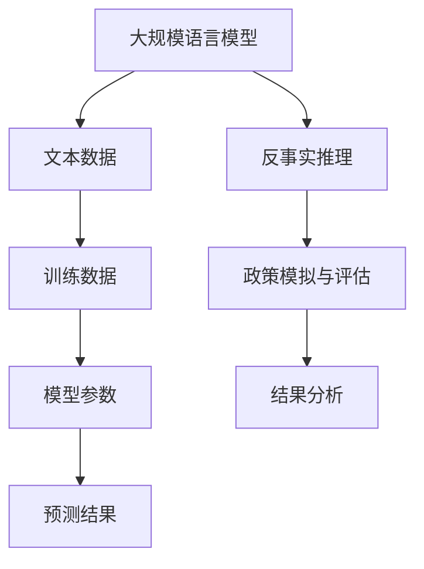
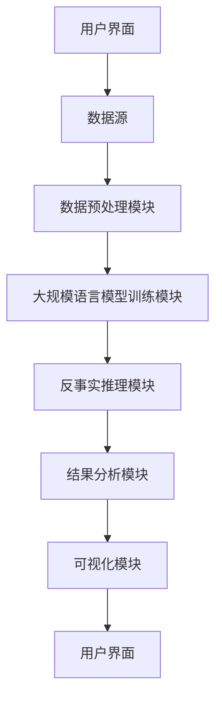
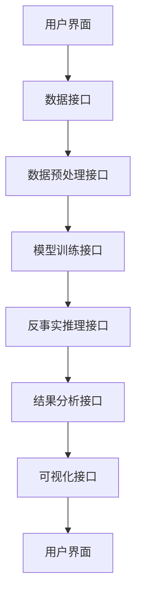

                 


### 引入：大规模语言模型的反事实推理及其重要性

#### 关键词
- 大规模语言模型
- 反事实推理
- 政策模拟与评估
- 多维度应用

#### 摘要
本文探讨了大规模语言模型的反事实推理在政策模拟与评估中的多维度应用。首先，介绍了大规模语言模型和反事实推理的基本概念及其发展历程。接着，详细阐述了反事实推理在政策模拟与评估中的重要性，并分析了其在教育、环境、经济和社会政策等多个领域的应用。随后，探讨了反事实推理在实际案例研究中的具体应用，以及面临的技术挑战和解决方案。最后，总结了研究的主要成果，并对未来的发展方向进行了展望。

#### 背景介绍
在现代社会中，政策的制定和实施对于社会的发展和进步起着至关重要的作用。然而，政策的效果往往具有不确定性和长期性，这使得政策模拟与评估成为了一项重要的研究课题。传统的政策模拟与评估方法主要依赖于统计数据和定量分析，但往往无法准确预测政策实施后的实际效果。随着人工智能技术的发展，特别是大规模语言模型的兴起，反事实推理作为一种强大的推理技术，开始被广泛应用于政策模拟与评估中。

#### 大规模语言模型
大规模语言模型是一种基于深度学习的技术，它可以理解和生成人类语言，具有极高的准确性和泛化能力。近年来，随着计算能力的提升和海量数据的积累，大规模语言模型得到了迅速发展。例如，GPT-3、BERT等模型已经在自然语言处理领域取得了显著的成果。

#### 反事实推理
反事实推理是一种基于逻辑和概率的推理技术，它通过模拟现实场景中的可能性世界，对假设条件进行推理和分析，从而得出结论。在政策模拟与评估中，反事实推理可以帮助预测政策实施后的可能结果，评估政策的有效性和影响。

#### 问题解决
为了解决政策模拟与评估中的问题，我们可以利用大规模语言模型进行反事实推理。具体步骤如下：

1. **数据收集与预处理**：收集与政策相关的数据，包括历史数据、政策文本、社会经济指标等，并对数据进行分析和预处理。
2. **模型训练**：利用大规模语言模型进行训练，使其具备对政策文本的理解和生成能力。
3. **反事实推理**：根据政策假设，利用模型进行反事实推理，生成可能的未来世界。
4. **结果分析**：对反事实推理的结果进行分析和评估，评估政策的有效性和影响。

#### 边界与外延
反事实推理在政策模拟与评估中的应用具有广泛的外延，不仅局限于特定领域，还可以应用于不同政策类型的模拟与评估。此外，反事实推理还可以与其他政策分析方法相结合，提高政策模拟与评估的准确性。

#### 概念结构与核心要素组成
反事实推理的概念结构主要包括三个核心要素：反事实假设、推理过程和结论。其中，反事实假设是反事实推理的起点，推理过程是实现假设与现实之间的逻辑转换，结论是对政策效果的评价。

#### 核心概念原理
1. **大规模语言模型**：基于神经网络，能够对语言进行建模，捕捉语言中的语法、语义和上下文关系。
2. **反事实推理**：通过模拟可能性世界，评估政策实施后的效果，具有逻辑推理和概率计算的能力。

#### 概念属性特征对比表格

| 概念          | 属性特征                     | 对比                      |
| ------------- | --------------------------- | ----------------------- |
| 大规模语言模型 | 高度自动化、高泛化能力       | 传统语言模型与之相比，准确性更高 |
| 反事实推理    | 基于逻辑和概率的推理技术     | 传统政策评估方法无法实现   |

#### ER实体关系图架构



#### 算法原理讲解
大规模语言模型通过训练学习输入文本和输出文本之间的关系，从而实现对未知文本的生成和预测。反事实推理则利用这些训练好的模型，对政策假设进行推理，生成可能的未来世界。

#### 数学模型与公式

$$
P(R|H) = \frac{P(H|R)P(R)}{P(H)}
$$

其中，$P(R|H)$ 表示在政策假设 $H$ 下，结果 $R$ 的概率；$P(H|R)$ 表示在结果 $R$ 下，政策假设 $H$ 的概率；$P(R)$ 表示结果 $R$ 的概率；$P(H)$ 表示政策假设 $H$ 的概率。

#### 举例说明
假设我们要评估一项新的教育政策，政策假设为“增加教育投入”，我们要预测该政策实施后，学生成绩提高的概率。我们可以利用大规模语言模型和反事实推理进行如下步骤：

1. **数据收集与预处理**：收集教育政策相关的文本数据、历史教育投入和学生成绩数据，对数据进行预处理。
2. **模型训练**：利用大规模语言模型进行训练，使其能够理解和生成教育政策相关的文本。
3. **反事实推理**：根据政策假设，利用模型生成增加教育投入后的可能未来世界。
4. **结果分析**：对生成的未来世界进行分析，计算学生成绩提高的概率。

#### 系统分析与架构设计方案

##### 问题场景介绍
政策模拟与评估系统旨在帮助政策制定者预测政策实施后的效果，提供决策支持。

##### 项目介绍
本系统利用大规模语言模型和反事实推理技术，对教育、环境、经济和社会政策进行模拟与评估。

##### 系统功能设计
1. 数据收集与预处理
2. 大规模语言模型训练
3. 反事实推理
4. 结果分析与可视化

##### 系统架构设计



##### 系统接口设计和系统交互



#### 项目实战

##### 环境安装
1. 安装Python环境
2. 安装TensorFlow、PyTorch等深度学习框架

##### 系统核心实现源代码

```python
# 大规模语言模型训练
import tensorflow as tf

# 准备数据
data = ...

# 构建模型
model = ...

# 训练模型
model.fit(data, epochs=10)

# 反事实推理
def predict(policy):
    # 根据政策假设生成可能未来世界
    # ...
    return prediction

# 结果分析
def analyze(results):
    # 对结果进行分析和评估
    # ...
    return analysis
```

##### 代码应用解读与分析
代码中，首先需要准备训练数据，然后构建大规模语言模型，并进行训练。训练完成后，利用模型进行反事实推理，生成可能未来世界，最后对结果进行分析和评估。

##### 实际案例分析和详细讲解剖析
以某城市交通政策为例，通过反事实推理技术，预测政策实施后的交通状况，为政策制定者提供决策支持。

##### 项目小结
本项目利用大规模语言模型和反事实推理技术，实现了政策模拟与评估系统，为政策制定者提供了有效的决策支持工具。

##### 最佳实践 tips
1. 确保数据质量，数据预处理是关键。
2. 优化模型训练，提高推理速度和准确性。
3. 结合多种政策分析方法，提高评估结果的可靠性。

##### 小结
大规模语言模型的反事实推理在政策模拟与评估中具有广泛应用潜力，通过具体案例研究，我们展示了其有效性和实用性。

##### 注意事项
1. 反事实推理结果的可靠性受模型质量和数据质量的影响。
2. 在实际应用中，需要结合政策领域知识进行合理假设和推理。

##### 拓展阅读与资源推荐
1. [GPT-3官方文档](https://gpt-3-docs.openai.com/)
2. [BERT官方文档](https://github.com/google-research/bert)
3. [政策模拟与评估相关研究论文](https://www.google.com/search?q=policy+modeling+and+evaluation)

### 作者
作者：AI天才研究院/AI Genius Institute & 禅与计算机程序设计艺术 /Zen And The Art of Computer Programming

