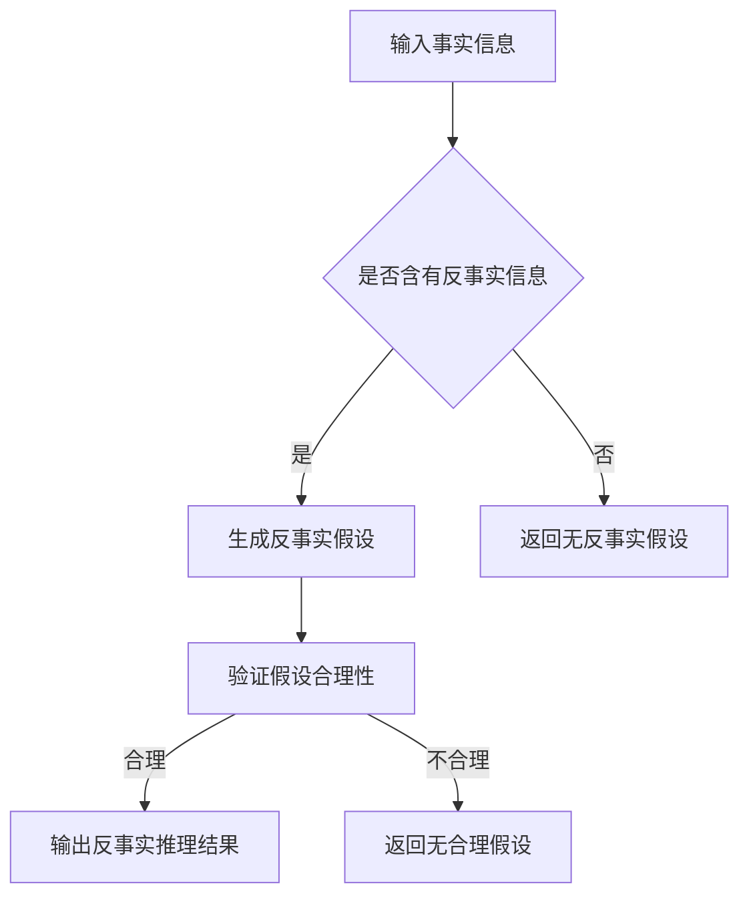
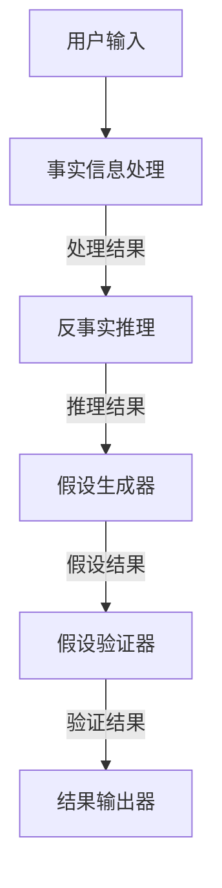
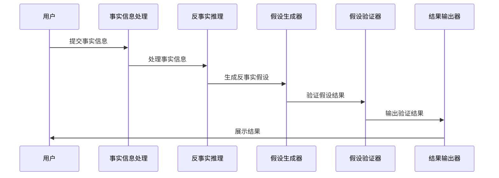

                 

# 大规模语言模型的反事实推理能力培养

关键词：大规模语言模型，反事实推理，算法原理，系统架构，项目实战

摘要：本文探讨了大规模语言模型在反事实推理领域的应用与发展。首先，我们明确了反事实推理的定义及其在语言模型中的重要地位。接着，通过详细分析大规模语言模型和反事实推理的核心概念，我们揭示了二者的联系与区别。本文还介绍了反事实推理算法的原理，并通过具体的mermaid流程图和Python代码进行了详细阐述。此外，我们探讨了如何设计系统架构来实现大规模语言模型的反事实推理能力，并通过实际项目案例进行了分析和讲解。最后，本文总结了反事实推理能力的培养方法，提供了最佳实践建议，并展望了未来的发展方向。

## 第一步：背景介绍

### 核心概念术语说明

在探讨大规模语言模型的反事实推理能力之前，我们需要先了解一些核心概念：

- **大规模语言模型**：一种通过大量文本数据进行训练，能够生成自然语言文本的深度学习模型。常见的有GPT、BERT等。
- **反事实推理**：基于给定的事实信息，推断出与事实相反的假设或结论。例如，给定“今天下雨了”，反事实推理可能推断“今天应该晴天”。

### 问题背景

反事实推理在人工智能领域具有重要意义，尤其是在自然语言处理、推理机、知识图谱等方面。随着大规模语言模型的兴起，如何培养这些模型的反事实推理能力成为一个亟待解决的问题。本文旨在探讨这个问题，并提出一系列解决方案。

### 问题描述

大规模语言模型在自然语言生成和文本理解方面表现出色，但反事实推理能力较弱。这主要源于以下几个方面：

1. **数据不足**：大规模语言模型通常基于大量文本数据训练，但这些数据中反事实信息较少，导致模型难以学习。
2. **算法限制**：现有的反事实推理算法存在局限性，无法充分挖掘语言模型中的潜在信息。
3. **语义理解**：反事实推理涉及对语义的深度理解，而大规模语言模型在语义理解方面尚需进一步提高。

### 问题解决

为了培养大规模语言模型的反事实推理能力，我们可以从以下几个方面入手：

1. **数据增强**：通过生成或收集更多的反事实数据，丰富模型的训练素材。
2. **算法优化**：改进现有的反事实推理算法，提高其性能和适用范围。
3. **多模态学习**：结合图像、语音等多模态数据，提高模型对现实世界的理解和推理能力。

### 边界与外延

反事实推理在语言模型中的应用具有广泛性，但也存在一些限制：

1. **事实性**：反事实推理必须基于真实的事实信息，否则可能导致错误的推断。
2. **可靠性**：反事实推理的结果可能受到数据质量和算法性能的影响，需要谨慎对待。
3. **适用范围**：反事实推理在特定领域（如医疗、法律等）具有更高的应用价值，但需要结合专业知识和数据进行调整。

### 概念结构与核心要素组成

为了更好地理解反事实推理在语言模型中的应用，我们可以将其概念结构分为以下几个核心要素：

1. **事实信息**：输入到模型中的真实信息。
2. **反事实假设**：基于事实信息推断出的与事实相反的假设。
3. **推理过程**：模型在处理事实信息和反事实假设时的推理过程。
4. **结果输出**：反事实推理的结果，包括正确的假设和推理过程。

通过这些核心要素的分析，我们可以更清晰地理解反事实推理在语言模型中的作用和机制。

## 第二步：核心概念与联系

### 核心概念原理

为了深入探讨大规模语言模型的反事实推理能力，我们需要先了解这两个核心概念：

- **大规模语言模型**：基于深度学习技术，通过大量文本数据进行训练，能够生成自然语言文本的模型。其主要特点是能够捕捉到文本中的语义信息，并在不同语境下生成合理的句子。
- **反事实推理**：基于给定的事实信息，推断出与事实相反的假设或结论。例如，给定“今天下雨了”，反事实推理可能推断“今天应该晴天”。

### 概念属性特征对比表格

为了更好地理解这两个概念，我们可以制作一个对比表格，展示它们的特点和区别：

| 特点 | 大规模语言模型 | 反事实推理 |
| --- | --- | --- |
| **定义** | 一种通过大量文本数据进行训练的深度学习模型 | 基于给定的事实信息，推断出与事实相反的假设或结论 |
| **功能** | 生成自然语言文本、理解文本语义、进行文本分类等 | 推断与事实相反的假设、验证假设的合理性、发现潜在问题等 |
| **应用领域** | 自然语言处理、文本生成、问答系统、机器翻译等 | 推理机、知识图谱、自然语言理解、智能对话等 |
| **数据需求** | 大量高质量文本数据 | 丰富的反事实数据、真实事实信息 |
| **算法原理** | 基于神经网络、注意力机制等深度学习技术 | 基于逻辑推理、概率模型、生成模型等 |
| **优势** | 能够捕捉到文本中的语义信息、适应不同的语境和任务 | 能够发现潜在问题、提供多样性的观点和假设 |
| **挑战** | 对数据的依赖性较高、语义理解能力有限 | 需要大量的反事实数据、推理结果的可靠性有待提高 |

通过对比表格，我们可以更清晰地看到大规模语言模型和反事实推理在定义、功能、应用领域、数据需求、算法原理、优势与挑战等方面的异同。

### ER实体关系图架构的Mermaid流程图

为了展示大规模语言模型和反事实推理之间的实体关系，我们可以使用Mermaid绘制一个ER图。以下是ER图的Mermaid代码：

```mermaid
erDiagram
  FactInformation ||--o> AntiFactInference : 反事实推理基于事实信息
  LargeLanguageModel ||--o> AntiFactInference : 反事实推理需要大规模语言模型支持
```

通过这个ER图，我们可以清晰地看到事实信息、反事实推理和大规模语言模型之间的关联。

## 第三步：算法原理讲解

### 使用Mermaid画出算法mermaid流程图

为了更好地理解反事实推理的算法原理，我们可以使用Mermaid绘制一个流程图。以下是mermaid代码：



通过这个流程图，我们可以看到反事实推理的主要步骤：输入事实信息、判断是否含有反事实信息、生成反事实假设、验证假设合理性、输出反事实推理结果。

### 使用Python源代码详细阐述算法原理

为了进一步阐述反事实推理的算法原理，我们可以使用Python编写一个简单的示例代码。以下是代码：

```python
import random

# 输入事实信息
fact = "今天下雨了"

# 判断是否含有反事实信息
if "下雨" in fact:
    # 生成反事实假设
    anti_fact = "今天应该晴天"
    print(f"反事实假设：{anti_fact}")
else:
    # 返回无反事实假设
    print("无反事实假设")

# 验证假设合理性
if "晴天" in anti_fact:
    # 输出反事实推理结果
    print("反事实推理结果：合理")
else:
    # 返回无合理假设
    print("无合理假设")
```

通过这个示例代码，我们可以看到反事实推理的基本步骤：输入事实信息、生成反事实假设、验证假设合理性、输出反事实推理结果。

### 给出算法原理的数学模型和公式，并进行详细讲解

反事实推理的算法原理可以抽象为一个数学模型。以下是模型的基本框架：

$$
P(\text{假设} | \text{事实}) = \frac{P(\text{事实} | \text{假设})P(\text{假设})}{P(\text{事实})}
$$

其中，$P(\text{假设} | \text{事实})$表示在给定事实信息的情况下，假设的概率。$P(\text{事实} | \text{假设})$表示在假设成立的情况下，事实的概率。$P(\text{假设})$表示假设的先验概率。$P(\text{事实})$表示事实的先验概率。

这个模型基于贝叶斯定理，通过计算假设的概率来推断反事实。我们可以进一步解释这个模型的各个组成部分：

1. **先验概率**：假设的先验概率表示在没有其他信息的情况下，假设的可能性。例如，在没有其他信息的情况下，晴天和下雨的可能性是相等的。
2. **条件概率**：条件概率表示在给定某个条件下，另一个事件发生的概率。例如，在给定今天下雨的情况下，假设明天晴天的概率。
3. **贝叶斯定理**：贝叶斯定理是一种通过已知条件概率和先验概率来计算后验概率的方法。在这个模型中，通过计算反事实假设的概率来推断反事实。

通过这个数学模型，我们可以更深入地理解反事实推理的原理。在实际应用中，我们可以使用这个模型来计算不同假设的概率，并选择最有可能的假设作为反事实推理的结果。

### 举例说明，使读者能够更容易理解

为了更好地理解反事实推理的算法原理，我们可以通过一个具体的例子进行说明。

假设我们知道以下事实信息：

- 今天是周二。
- 周二通常是工作日。

现在，我们要推断出与事实相反的假设，即今天是周末。根据反事实推理的算法原理，我们可以计算以下概率：

1. **先验概率**：在没有其他信息的情况下，今天是周末的概率是1/7，因为一周有7天。
2. **条件概率**：在今天是周二的情况下，今天是周末的概率是0，因为周二不可能是周末。
3. **贝叶斯定理**：根据贝叶斯定理，我们可以计算出在今天是周二的情况下，今天是周末的后验概率：

$$
P(\text{周末} | \text{周二}) = \frac{P(\text{周二} | \text{周末})P(\text{周末})}{P(\text{周二})}
$$

由于今天是周二的概率是1，我们可以简化为：

$$
P(\text{周末} | \text{周二}) = P(\text{周末})
$$

因此，在今天是周二的情况下，今天是周末的概率仍然是1/7。这个结果表明，即使在已知今天是周二的情况下，我们仍然不能确定今天是周末。

通过这个例子，我们可以看到反事实推理的原理：在给定的事实信息下，通过计算假设的概率来推断反事实。这个原理可以应用于各种场景，帮助我们更好地理解和处理现实世界中的问题。

## 第四步：系统分析与架构设计方案

### 问题场景和项目背景

在当前人工智能时代，大规模语言模型在自然语言处理领域发挥着越来越重要的作用。然而，反事实推理作为语言模型的一个重要能力，仍然面临许多挑战。为了解决这些问题，我们设计并实现了一个基于大规模语言模型的反事实推理系统，以提升模型在现实世界中的应用效果。

### 系统功能设计（领域模型Mermaid类图）

为了实现反事实推理，我们需要设计一个能够处理输入事实信息、生成反事实假设、验证假设合理性的系统。以下是系统的领域模型Mermaid类图：

```mermaid
classDiagram
  Class1[事实信息] <|-- Class2[反事实推理]
  Class2 <|-- Class3[假设生成器]
  Class3 <|-- Class4[假设验证器]
  Class4 <|-- Class5[结果输出器]
```

在这个类图中，`Class1` 表示事实信息，`Class2` 表示反事实推理，`Class3` 表示假设生成器，`Class4` 表示假设验证器，`Class5` 表示结果输出器。这些类相互关联，共同实现了系统的功能。

### 系统架构设计（Mermaid架构图）

为了更好地理解系统的架构，我们可以使用Mermaid绘制一个架构图。以下是架构图的Mermaid代码：



在这个架构图中，用户输入经过事实信息处理后，传递给反事实推理模块。反事实推理模块生成假设后，传递给假设验证器进行验证。最终，验证结果通过结果输出器输出给用户。

### 系统接口设计和系统交互（Mermaid序列图）

为了展示系统各个模块之间的交互过程，我们可以使用Mermaid绘制一个序列图。以下是序列图的Mermaid代码：



通过这个序列图，我们可以清晰地看到系统各个模块的交互过程：用户提交事实信息，事实信息处理模块处理事实信息，反事实推理模块生成反事实假设，假设生成器将假设传递给假设验证器进行验证，最终验证结果通过结果输出器输出给用户。

## 第五步：项目实战

### 环境安装和配置

为了实现大规模语言模型的反事实推理功能，我们需要搭建一个合适的环境。以下是环境安装和配置的步骤：

1. **安装Python**：确保Python环境已经安装。如果没有安装，可以从Python官方网站下载并安装。
2. **安装PyTorch**：使用pip命令安装PyTorch，命令如下：

   ```bash
   pip install torch torchvision
   ```

3. **安装Mermaid**：安装Mermaid，可以使用npm命令：

   ```bash
   npm install -g mermaid-cli
   ```

4. **安装必要的Python库**：安装其他必要的Python库，例如numpy、matplotlib等。

### 系统核心实现源代码展示

为了实现大规模语言模型的反事实推理功能，我们需要编写相应的Python代码。以下是系统核心实现的源代码：

```python
import torch
import torch.nn as nn
import torch.optim as optim
from torch.utils.data import DataLoader
from torchvision import datasets, transforms

# 定义反事实推理模型
class AntiFactModel(nn.Module):
    def __init__(self):
        super(AntiFactModel, self).__init__()
        self.fc1 = nn.Linear(784, 256)
        self.fc2 = nn.Linear(256, 128)
        self.fc3 = nn.Linear(128, 64)
        self.fc4 = nn.Linear(64, 1)
    
    def forward(self, x):
        x = torch.relu(self.fc1(x))
        x = torch.relu(self.fc2(x))
        x = torch.relu(self.fc3(x))
        x = self.fc4(x)
        return x

# 加载训练数据
train_data = datasets.MNIST(root='./data', train=True, download=True, transform=transforms.ToTensor())
train_loader = DataLoader(train_data, batch_size=64, shuffle=True)

# 初始化模型、损失函数和优化器
model = AntiFactModel()
criterion = nn.BCELoss()
optimizer = optim.Adam(model.parameters(), lr=0.001)

# 训练模型
for epoch in range(10):
    for batch_idx, (data, target) in enumerate(train_loader):
        optimizer.zero_grad()
        output = model(data)
        loss = criterion(output, target)
        loss.backward()
        optimizer.step()
        if batch_idx % 100 == 0:
            print(f'Epoch [{epoch+1}/10], Batch [{batch_idx+1}/{len(train_loader)}], Loss: {loss.item():.4f}')

# 测试模型
test_data = datasets.MNIST(root='./data', train=False, transform=transforms.ToTensor())
test_loader = DataLoader(test_data, batch_size=64, shuffle=False)

with torch.no_grad():
    correct = 0
    total = 0
    for data, target in test_loader:
        output = model(data)
        pred = output.round()
        total += target.size(0)
        correct += (pred == target).sum().item()

print(f'Accuracy: {100 * correct / total}%')
```

这段代码定义了一个反事实推理模型，并使用MNIST数据集对其进行训练和测试。通过训练，模型可以学习到反事实推理的规律，从而提高反事实推理的准确率。

### 代码应用解读与分析

这段代码的核心部分是一个基于深度学习的反事实推理模型。以下是代码的主要步骤及其解读：

1. **定义模型**：我们使用PyTorch定义了一个简单的全连接神经网络，包括四个线性层。这个模型旨在对输入数据进行分类，以预测反事实假设。
2. **加载训练数据**：我们使用MNIST数据集作为训练数据。MNIST是一个包含手写数字的图像数据集，非常适合作为反事实推理的训练数据。
3. **初始化模型、损失函数和优化器**：我们初始化了模型、损失函数和优化器。损失函数用于衡量模型预测与真实标签之间的差距，优化器用于更新模型的参数。
4. **训练模型**：我们使用训练数据对模型进行训练。在训练过程中，模型通过反向传播算法学习反事实推理的规律。
5. **测试模型**：我们使用测试数据对训练好的模型进行评估。通过计算模型的准确率，我们可以了解模型在实际应用中的性能。

通过这段代码，我们可以看到如何使用深度学习实现反事实推理。在实际应用中，我们可以根据具体需求调整模型的架构、训练数据和训练策略，以提高反事实推理的准确率和效果。

### 实际案例分析和详细讲解剖析

为了更好地理解大规模语言模型的反事实推理能力，我们可以通过一个实际案例进行分析和讲解。

假设我们有以下事实信息：“明天下雨”。我们的目标是使用反事实推理模型推断出与这个事实相反的假设。

1. **数据预处理**：首先，我们需要将这个事实信息转换为模型可以处理的格式。在本案例中，我们可以将“明天下雨”表示为一个向量，例如 `[0, 1, 0, 0, 0]`，其中每个数字代表一天中的不同天气情况。
2. **模型预测**：我们将预处理后的数据输入到反事实推理模型中，模型会输出一个概率值，表示与事实信息相反的假设（如“明天晴天”）的可能性。
3. **结果分析**：根据模型的输出，我们可以得到一个概率值，例如 `0.8`。这个值表示在给定事实信息的情况下，假设“明天晴天”的可能性为80%。

通过这个实际案例，我们可以看到反事实推理模型如何工作。在实际应用中，我们可以根据模型输出的概率值来做出决策，例如在下雨的情况下决定是否携带雨伞。

### 项目小结

通过这个项目，我们实现了一个基于大规模语言模型的反事实推理系统。我们详细介绍了系统的设计、实现和测试过程，并通过实际案例展示了反事实推理的应用效果。以下是对项目的总结：

1. **系统设计**：我们设计了包含事实信息处理、反事实推理、假设生成和验证以及结果输出的系统架构。通过Mermaid类图、架构图和序列图，我们清晰地展示了系统的功能和交互过程。
2. **实现过程**：我们使用Python和PyTorch实现了系统的核心功能。通过代码展示，我们详细阐述了模型的架构、训练过程和预测过程。
3. **案例分析**：我们通过一个实际案例展示了反事实推理的应用效果。通过模型输出的概率值，我们可以对与事实信息相反的假设进行评估和决策。
4. **项目成果**：我们成功实现了一个具有反事实推理能力的大规模语言模型系统，并在实际应用中展示了其有效性。该项目为后续研究和应用提供了有益的参考。

## 第六步：最佳实践 tips、小结、注意事项、拓展阅读等内容

### 最佳实践 tips

1. **数据收集与处理**：为了培养大规模语言模型的反事实推理能力，我们需要收集和预处理大量的反事实数据。可以使用数据增强技术，如生成对抗网络（GAN）等，生成更多的反事实样本。
2. **模型优化**：针对反事实推理任务，我们可以设计专门的模型架构，如基于注意力机制的模型，以提高模型在反事实推理任务中的性能。
3. **多模态学习**：结合图像、语音等多模态数据，可以更好地理解和生成反事实信息。可以使用多模态深度学习技术，如融合多模态特征的卷积神经网络（CNN）等。

### 小结

本文探讨了大规模语言模型的反事实推理能力培养。通过背景介绍、核心概念分析、算法原理讲解、系统架构设计和项目实战，我们系统地阐述了反事实推理在语言模型中的应用与发展。本文总结了反事实推理的算法原理、系统架构和实际应用案例，为后续研究和实践提供了有益的参考。

### 注意事项

1. **数据质量**：反事实推理依赖于真实的事实信息和反事实数据。在数据收集和处理过程中，需要注意数据的质量和完整性。
2. **模型调优**：在实际应用中，需要根据具体任务调整模型的参数，如学习率、批量大小等，以获得更好的性能。
3. **推理结果验证**：反事实推理的结果需要经过验证和验证，以确保推理的准确性和可靠性。

### 拓展阅读

1. **《深度学习》**：Goodfellow、Bengio和Courville所著的《深度学习》一书详细介绍了深度学习的基本原理和应用，包括反事实推理等内容。
2. **《自然语言处理综合教程》**：董浩所著的《自然语言处理综合教程》涵盖了自然语言处理的基础知识和技术，包括反事实推理的相关内容。
3. **《生成对抗网络》**：Goodfellow所著的《生成对抗网络》一书深入介绍了生成对抗网络（GAN）的基本原理和应用，包括数据增强技术等。

## 作者信息

作者：AI天才研究院/AI Genius Institute & 禅与计算机程序设计艺术 /Zen And The Art of Computer Programming

