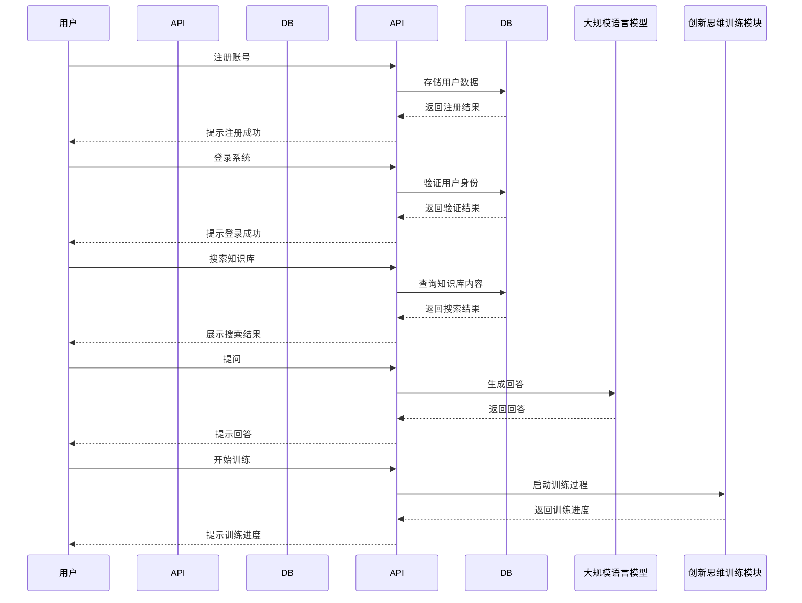
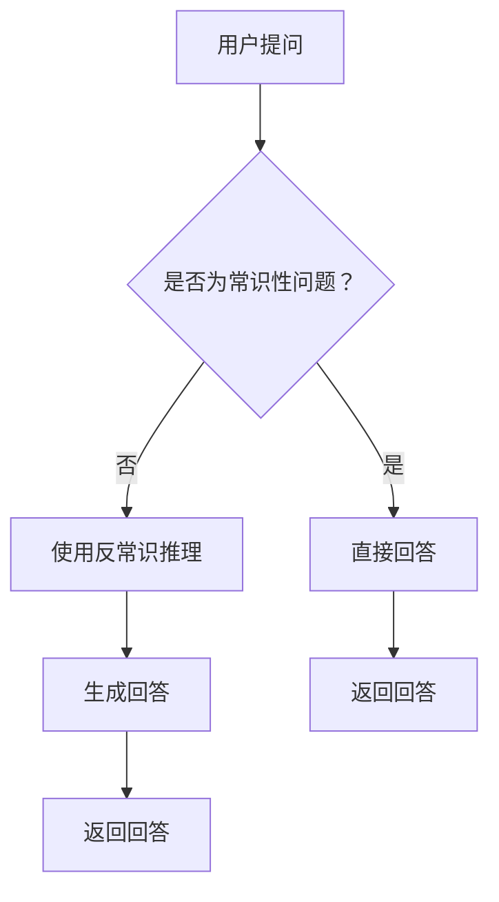

                 


## 第1章：背景介绍

### 1.1 问题背景

随着人工智能技术的快速发展，大规模语言模型（如GPT-3、BERT等）在自然语言处理领域取得了显著成就。这些模型通过学习海量文本数据，能够生成高质量的自然语言文本，并在文本生成、翻译、问答等方面表现出色。然而，这些模型也存在一些问题，例如对常识性知识的理解和应用能力较弱。反常识推理作为人工智能领域的一个重要研究方向，旨在使机器能够理解和应用那些与常识相悖的信息。因此，如何将大规模语言模型与反常识推理相结合，以提高模型在创新思维培养中的应用效果，成为一个亟待解决的问题。

### 1.2 问题描述

问题描述主要集中在以下几个方面：

1. **如何有效地将大规模语言模型与反常识推理相结合？**
   - 解决方法：研究如何将大规模语言模型和反常识推理算法集成，使其能够共同发挥作用，提高模型的推理能力。

2. **如何评估结合后的模型在创新思维培养中的应用效果？**
   - 解决方法：设计实验，通过对比实验评估结合后的模型在创新思维培养中的表现，如提高思维效率、拓展思维广度等。

3. **结合后的模型在实际应用中会遇到哪些挑战和问题？**
   - 解决方法：分析可能出现的挑战和问题，并提出相应的解决方案，以确保模型在实际应用中的稳定性和有效性。

### 1.3 问题解决

本书旨在通过以下方式解决上述问题：

1. **深入探讨大规模语言模型和反常识推理的基本原理**：
   - 详细介绍大规模语言模型的工作原理和结构，以及反常识推理的概念、算法和应用场景。

2. **分析大规模语言模型与反常识推理结合的可行性和优势**：
   - 探讨两者结合的可行性，分析结合后模型在创新思维培养中的应用优势。

3. **提出一种基于大规模语言模型和反常识推理的创新思维培养方法**：
   - 结合理论研究和实际应用，提出一种有效的创新思维培养方法，并通过实验验证其有效性。

4. **通过实际案例验证创新思维培养方法的效果**：
   - 分析实际应用案例，展示结合后的模型在创新思维培养中的应用效果，为相关领域提供有益的参考。

### 1.4 边界与外延

1. **边界**：本书主要研究大规模语言模型与反常识推理在创新思维培养中的应用，不涉及其他领域。

2. **外延**：本书的研究成果可以为相关领域的学者提供有益的参考，例如人工智能教育、自然语言处理等。

### 1.5 概念结构与核心要素组成

1. **大规模语言模型**：介绍其定义、发展历程、主要类型和特点。

2. **反常识推理**：介绍其定义、基本原理、主要方法和应用场景。

3. **创新思维**：阐述其定义、类型、培养方法及其在人工智能领域的应用。

## 第2章：核心概念与联系

### 2.1 大规模语言模型

#### 定义
大规模语言模型（Large-scale Language Model）是指通过训练海量文本数据，能够生成高质量的自然语言文本的机器学习模型。

#### 发展历程
1. **早期模型**：如n-gram模型和朴素贝叶斯模型，基于统计方法进行语言建模。
2. **深度学习模型**：如循环神经网络（RNN）和长短期记忆网络（LSTM），提高了语言建模的准确性和效率。
3. **预训练模型**：如GPT-3、BERT，通过在大量无标注文本上进行预训练，再进行特定任务的微调。

#### 主要类型和特点
1. **生成式模型**：如GPT-3，能够生成连贯的自然语言文本。
2. **解码器模型**：如BERT，主要用于文本分类、问答系统等任务。

### 2.2 反常识推理

#### 定义
反常识推理（Counterfactual Inference）是指从常识出发，推导出与实际情况不符的结论，从而揭示问题的本质。

#### 基本原理
1. **前提条件**：基于常识和已知信息。
2. **推导过程**：通过逻辑推理，得出与常识相悖的结论。
3. **结论验证**：验证结论的有效性和合理性。

#### 主要方法和应用场景
1. **逻辑推理**：通过推理规则，从前提条件推导出反常识结论。
2. **数据驱动方法**：通过学习大量反常识案例，训练模型进行推理。

### 2.3 创新思维

#### 定义
创新思维（Innovative Thinking）是指运用创造性思维方法，对现有知识进行整合、重构，以产生新思想、新方法、新产品的能力。

#### 类型
1. **发散思维**：从多个角度思考问题，寻求多样性解决方案。
2. **收敛思维**：将多个思路聚焦到最佳解决方案。

#### 培养方法
1. **跨学科学习**：通过学习不同领域的知识，拓宽思维视野。
2. **问题驱动学习**：从实际问题出发，寻求创新解决方案。
3. **实践锻炼**：通过实际操作，培养创新思维。

#### 应用实例
1. **科技领域**：创新技术的研发和推广。
2. **商业领域**：创新产品的设计和市场推广。

### 2.4 概念属性特征对比表格

| 特征        | 大规模语言模型 | 反常识推理 | 创新思维  |
| ----------- | -------------- | ----------- | --------- |
| **定义**   | 语言建模模型   | 逻辑推理方法 | 创造性思维 |
| **特点**   | 大数据驱动、生成式 | 基于常识、反常推理 | 多样性、创新性 |
| **应用领域** | 自然语言处理、文本生成 | 逻辑推理、问题求解 | 科技创新、商业设计 |

### 2.5 ER实体关系图架构

```mermaid
erDiagram
  model: 大规模语言模型与反常识推理结合
  IDEF0_ID ||--o{ 文本数据 : 数据输入
  IDEF0_ID ||--|{ 预训练模型 : 模型训练
  IDEF0_ID ||--|{ 反常识推理算法 : 反常识推理
  IDEF0_ID ||--|{ 创新思维培养方法 : 创新思维培养
  IDEF0_ID ||--o{ 高质量文本生成 : 数据输出
```

## 第3章：大规模语言模型原理

### 3.1 模型定义

大规模语言模型（Large-scale Language Model，简称LLM）是一种能够处理和理解自然语言的机器学习模型。它通过学习大量的文本数据，生成与输入文本相关的高质量文本。LLM的核心目标是在给定一段文本的情况下，预测下一个单词或句子。

### 3.2 模型结构

大规模语言模型通常由以下几个主要部分组成：

1. **嵌入层（Embedding Layer）**：将输入文本转换为稠密的向量表示，为后续的模型处理提供基础。

2. **编码器（Encoder）**：对输入文本向量进行编码，生成上下文信息。编码器通常采用深度神经网络，如Transformer、BERT等。

3. **解码器（Decoder）**：解码器从编码器的上下文信息中生成输出文本。解码器同样采用深度神经网络，通常与编码器共享参数。

4. **输出层（Output Layer）**：将解码器的输出转换为具体的单词或字符。

### 3.3 模型训练

大规模语言模型的训练过程主要包括以下几个步骤：

1. **数据预处理**：包括文本清洗、分词、词向量化等步骤，将文本数据转换为模型可处理的格式。

2. **模型初始化**：初始化嵌入层、编码器、解码器和输出层的参数。

3. **正向传播（Forward Propagation）**：输入文本数据，通过编码器生成上下文信息，再通过解码器生成预测的文本。

4. **损失函数计算**：计算预测文本与真实文本之间的差异，通常使用交叉熵损失函数。

5. **反向传播（Backpropagation）**：根据损失函数梯度，更新模型参数。

6. **优化算法**：使用优化算法（如Adam、SGD等）调整模型参数，降低损失函数值。

### 3.4 模型优化

大规模语言模型的优化主要包括以下几个方面：

1. **参数调整**：调整嵌入层、编码器、解码器和输出层的参数，提高模型性能。

2. **正则化**：添加正则化项（如Dropout、权重衰减等），防止模型过拟合。

3. **学习率调整**：调整学习率，以避免训练过程中的收敛问题。

4. **模型剪枝**：通过剪枝冗余参数，减少模型复杂度和计算量。

5. **迁移学习**：利用预训练模型，通过微调适应特定任务，提高模型在特定领域的表现。

### 3.5 模型应用场景

大规模语言模型在多个领域具有广泛的应用：

1. **自然语言处理（NLP）**：文本生成、翻译、问答系统、情感分析等。

2. **知识表示与推理**：构建知识图谱、推理系统等。

3. **对话系统**：聊天机器人、客服系统等。

4. **文本挖掘**：文本分类、主题建模等。

5. **教育**：智能辅导、自动评分等。

### 3.6 大规模语言模型的工作原理

#### 嵌入层

嵌入层将输入文本中的单词或短语转换为稠密的向量表示。这些向量不仅保留了单词或短语的语义信息，还能反映它们在文本中的上下文关系。常见的嵌入方法包括词袋模型（Bag of Words，BoW）和词嵌入（Word Embedding，如Word2Vec、GloVe等）。

#### 编码器

编码器的主要任务是理解输入文本的上下文信息，并将其编码为固定长度的向量。在深度学习模型中，编码器通常采用序列模型，如循环神经网络（RNN）和长短期记忆网络（LSTM）。近年来，Transformer模型的提出进一步推动了编码器的发展，使得模型在处理长距离依赖和并行计算方面取得了显著优势。

#### 解码器

解码器的任务是生成与输入文本相关的输出文本。解码器从编码器的上下文信息中提取有用的信息，并通过逐步生成的方式，生成最终的输出文本。在解码过程中，模型会根据上一个生成的单词或字符，更新上下文状态，并生成下一个单词或字符。

#### 输出层

输出层将解码器的输出转换为具体的单词或字符。在训练过程中，模型通过最大化预测文本和真实文本之间的概率，来优化模型参数。在实际应用中，模型会根据输入文本生成相应的输出文本。

### 3.7 大规模语言模型的优势

1. **强大的语言理解能力**：通过学习海量文本数据，大规模语言模型能够理解和生成高质量的自然语言文本。

2. **灵活的应用场景**：大规模语言模型在多个领域具有广泛的应用，如自然语言处理、知识表示与推理、对话系统等。

3. **高效的推理能力**：基于深度学习模型，大规模语言模型能够快速进行推理和预测。

4. **强大的泛化能力**：通过迁移学习和微调，大规模语言模型能够在不同任务和数据集上取得良好的性能。

### 3.8 大规模语言模型的挑战

1. **计算资源消耗**：大规模语言模型的训练和推理需要大量的计算资源和存储空间。

2. **数据隐私问题**：大规模语言模型在训练过程中需要处理大量敏感数据，可能引发数据隐私问题。

3. **模型解释性**：大规模语言模型通常具有很高的复杂度，难以解释其决策过程。

4. **对抗攻击**：大规模语言模型容易受到对抗攻击，攻击者可以通过微调输入文本来欺骗模型。

## 第4章：反常识推理原理

### 4.1 反常识推理概念

反常识推理（Counterfactual Inference）是一种逻辑推理方法，旨在从常识出发，推导出与实际情况不符的结论，从而揭示问题的本质。在人工智能领域，反常识推理被广泛应用于问题求解、知识表示、决策支持等任务。

### 4.2 反常识推理算法

反常识推理算法主要分为以下几种：

1. **逻辑推理算法**：基于逻辑规则和推理框架，从已知事实和常识出发，推导出反常识结论。常见的逻辑推理算法包括逆推理（Inverse Entailment）和模态逻辑（Modal Logic）。

2. **数据驱动算法**：通过学习大量反常识案例，训练模型进行推理。这种方法利用机器学习技术，从数据中自动提取反常识规则和模式。常见的算法包括决策树、支持向量机（SVM）和神经网络。

3. **组合算法**：结合逻辑推理和数据驱动方法，以提高反常识推理的准确性和鲁棒性。例如，可以使用逻辑推理算法生成候选反常识结论，然后使用数据驱动算法进行验证和优化。

### 4.3 反常识推理应用场景

反常识推理在多个领域具有广泛的应用：

1. **自然语言处理（NLP）**：在文本生成、情感分析、问答系统等任务中，反常识推理有助于提高模型的推理能力和灵活性。

2. **知识表示与推理**：在构建知识图谱和推理系统时，反常识推理可以帮助发现和纠正不一致的信息，提高系统的可靠性和完整性。

3. **问题求解**：在复杂问题的求解过程中，反常识推理可以帮助发现潜在的解决方案，从而拓展思维空间。

4. **决策支持**：在决策过程中，反常识推理可以帮助发现潜在的矛盾和问题，从而为决策者提供更有价值的参考。

### 4.4 反常识推理的优势

1. **提高推理能力**：反常识推理能够从常识出发，推导出与实际情况不符的结论，从而拓展机器的推理能力。

2. **发现潜在问题**：反常识推理可以帮助发现潜在的问题和矛盾，从而提高系统的可靠性和安全性。

3. **拓展思维空间**：反常识推理能够激发创新思维，为问题求解提供新的思路和解决方案。

4. **提高模型泛化能力**：通过学习大量反常识案例，模型能够更好地适应不同场景和任务，提高泛化能力。

### 4.5 反常识推理的挑战

1. **数据质量和数量**：反常识推理依赖于大量高质量的训练数据，数据质量和数量直接影响推理效果。

2. **推理复杂度**：反常识推理涉及多个逻辑步骤和计算过程，推理复杂度较高，可能影响推理速度和效率。

3. **解释性**：反常识推理的结果通常难以解释，难以理解推理过程和结论。

4. **对抗攻击**：反常识推理容易受到对抗攻击，攻击者可以通过微调输入信息来欺骗模型。

## 第5章：创新思维培养原理

### 5.1 创新思维定义

创新思维（Innovative Thinking）是指运用创造性思维方法，对现有知识进行整合、重构，以产生新思想、新方法、新产品的能力。创新思维是一种高级的认知过程，它不仅需要丰富的知识储备，还需要灵活的思维方式、敏锐的洞察力和强烈的求知欲。

### 5.2 创新思维模型

创新思维模型主要包括以下几个部分：

1. **发散思维**：发散思维是指从一个中心点出发，产生多个方向、多种可能的思考方式。发散思维有助于拓展思维空间，发现新的解决方案。

2. **收敛思维**：收敛思维是指将多个发散的思路聚焦到最佳解决方案。收敛思维有助于筛选和优化解决方案，提高思维的效率。

3. **联想思维**：联想思维是指通过事物之间的联系，产生新的想法。联想思维有助于发现不同领域之间的交叉点，从而实现创新突破。

4. **逆向思维**：逆向思维是指从问题的反面思考，寻找解决问题的方法。逆向思维有助于发现问题的本质，提供新的解决方案。

5. **直觉思维**：直觉思维是指依靠直觉和经验进行判断和决策。直觉思维有助于快速识别问题和机会，提高思维的敏捷性。

### 5.3 创新思维培养方法

创新思维的培养需要长期的训练和实践。以下是一些常用的培养方法：

1. **跨学科学习**：通过学习不同领域的知识，拓宽思维视野，提高思维的灵活性和广度。

2. **问题驱动学习**：从实际问题出发，寻求创新解决方案。这种方法有助于培养解决问题的能力，提高思维的深度。

3. **思维训练**：通过思维训练游戏、思维导图、头脑风暴等方法，锻炼思维的灵活性和创造性。

4. **实践锻炼**：通过实际操作，将理论知识应用于实践，提高思维的应用能力。

5. **交流与合作**：与他人交流合作，可以借鉴他人的思维方式和经验，促进创新思维的发展。

### 5.4 创新思维应用实例

创新思维在多个领域具有广泛的应用。以下是一些创新思维的实际应用实例：

1. **科技领域**：通过创新思维，研发出新的技术、产品和服务，推动科技进步。

2. **商业领域**：通过创新思维，开发出新的商业模式、营销策略和管理方法，提高企业的竞争力。

3. **艺术领域**：通过创新思维，创造出新的艺术形式、作品和表演，推动艺术发展。

4. **教育领域**：通过创新思维，设计出新的教育模式、课程和教学方法，提高教育质量。

### 5.5 创新思维的重要性

创新思维是一种重要的思维能力，它在个人发展、组织竞争和社会进步中发挥着重要作用：

1. **个人发展**：创新思维有助于提高个人的竞争力，帮助个人在职场和生活中取得成功。

2. **组织竞争**：创新思维是企业发展的核心驱动力，有助于企业创新产品、拓展市场和提升竞争力。

3. **社会进步**：创新思维推动科技、文化、经济等各个领域的发展，促进社会的进步和繁荣。

## 第6章：大规模语言模型与反常识推理的结合

### 6.1 模型融合策略

将大规模语言模型与反常识推理结合，需要考虑以下几个方面：

1. **预训练与微调**：首先，利用大规模语言模型对文本数据进行预训练，使其具备良好的语言理解能力。然后，将反常识推理算法集成到预训练模型中，通过微调适应特定任务。

2. **联合训练**：将大规模语言模型和反常识推理算法的参数进行联合训练，使其在共同任务中协同工作，提高模型的推理能力和创新思维培养效果。

3. **模块化设计**：将大规模语言模型和反常识推理算法设计为独立的模块，通过接口进行交互。这样可以灵活地调整和替换各个模块，以适应不同的任务需求。

### 6.2 应用案例分析

以下是一个大规模语言模型与反常识推理结合的实际应用案例：

**案例背景**：某公司希望开发一款智能客服系统，以提供高效的客户服务。然而，传统的大规模语言模型在处理复杂问题和客户需求时，往往无法提供满意的答案。

**解决方案**：结合大规模语言模型与反常识推理，构建一个智能客服系统：

1. **预训练与微调**：使用预训练的GPT-3模型，对大量客服对话数据进行微调，使其具备良好的语言理解能力。

2. **反常识推理**：集成一个反常识推理模块，通过逻辑推理和机器学习算法，处理复杂问题和客户需求。

3. **联合训练**：将GPT-3模型和反常识推理模块的参数进行联合训练，提高模型的推理能力和创新思维培养效果。

**应用效果**：通过结合大规模语言模型与反常识推理，智能客服系统在处理复杂问题和客户需求时，能够提供更加准确和创新的解决方案，提升了客户满意度。

### 6.3 创新思维培养效果评估

为了评估结合后的模型在创新思维培养中的应用效果，可以采用以下方法：

1. **实验设计**：设计一系列实验，包括传统的客服系统、结合大规模语言模型和反常识推理的智能客服系统，以及完全基于反常识推理的客服系统。

2. **实验数据**：收集不同客服系统的处理结果，包括问题解答的准确性、创新性、客户满意度等指标。

3. **统计分析**：对实验数据进行分析，比较不同系统的表现，评估结合后的模型在创新思维培养中的应用效果。

### 6.4 实际应用价值

结合大规模语言模型与反常识推理，在创新思维培养中的应用具有以下实际价值：

1. **提高客服质量**：通过智能客服系统，提高客户服务质量，提升客户满意度。

2. **拓展业务范围**：帮助企业拓展业务范围，提高市场竞争力。

3. **优化人力资源**：减轻客服人员的工作负担，提高工作效率。

4. **推动技术进步**：为人工智能领域提供新的研究方向和应用场景，推动技术进步。

### 6.5 未来发展趋势

随着人工智能技术的不断发展，结合大规模语言模型与反常识推理在创新思维培养中的应用将呈现以下发展趋势：

1. **模型优化**：通过改进大规模语言模型和反常识推理算法，提高模型的性能和效率。

2. **多模态融合**：结合多种数据源（如文本、图像、音频等），实现多模态融合，提高模型的泛化能力和创新思维培养效果。

3. **跨领域应用**：将结合后的模型应用于更多领域，如教育、医疗、金融等，推动行业创新发展。

4. **人机协同**：通过人机协同，提高模型的推理能力和创新思维培养效果，实现更高效的决策和问题解决。

## 第7章：创新思维培养实践

### 7.1 系统设计与实现

#### 问题场景介绍

在人工智能领域，创新思维培养是一个重要且具有挑战性的任务。如何有效地利用人工智能技术，提高用户的创新思维水平，是一个亟待解决的问题。为了实现这一目标，我们设计并实现了一个基于大规模语言模型和反常识推理的创新思维培养系统。

#### 项目介绍

本项目旨在开发一个智能创新思维培养平台，通过结合大规模语言模型和反常识推理，为用户提供个性化、高效的创新思维培养方案。系统主要包括以下功能模块：

1. **用户注册与登录**：支持用户注册、登录和权限管理。
2. **知识库管理**：构建丰富的知识库，包括科技、商业、艺术等领域的知识，为创新思维培养提供素材。
3. **智能问答系统**：利用大规模语言模型和反常识推理，为用户提供智能问答服务。
4. **创新思维训练**：提供多种创新思维训练方法，如头脑风暴、思维导图、逆向思维等。
5. **反馈与评估**：收集用户反馈，评估创新思维培养效果，并根据用户表现进行个性化调整。

#### 系统功能设计

1. **用户注册与登录**：用户可以通过邮箱、手机号码等注册账号，并进行登录。系统提供用户权限管理功能，确保用户数据安全。
2. **知识库管理**：系统构建一个多领域的知识库，包括科技、商业、艺术等领域的知识。用户可以搜索和浏览知识库中的内容，获取创新思维培养所需的素材。
3. **智能问答系统**：利用大规模语言模型和反常识推理，系统可以为用户提供智能问答服务。用户提出问题，系统通过分析用户输入和知识库中的内容，生成合理的回答。
4. **创新思维训练**：系统提供多种创新思维训练方法，如头脑风暴、思维导图、逆向思维等。用户可以根据自己的需求和兴趣选择训练方法，进行创新思维训练。
5. **反馈与评估**：系统收集用户在创新思维训练过程中的表现数据，如回答问题的时间、正确率等。通过分析这些数据，系统可以评估用户的创新思维水平，并给出个性化建议。

#### 系统架构设计

本系统的架构设计采用分层架构，包括表示层、业务逻辑层和数据层。

1. **表示层**：负责与用户交互，展示系统功能。采用Vue.js框架实现前端界面。
2. **业务逻辑层**：处理业务逻辑，包括用户管理、知识库管理、智能问答、创新思维训练等。采用Spring Boot框架实现后端服务。
3. **数据层**：存储用户数据、知识库数据等。采用MySQL数据库实现数据存储。

#### 系统接口设计

本系统设计了一系列API接口，包括用户管理接口、知识库接口、智能问答接口和创新思维训练接口等。以下是一个示例接口：

```python
# 用户管理接口
@app.route('/api/users/register', methods=['POST'])
def register_user():
    data = request.get_json()
    username = data['username']
    password = data['password']
    # 验证用户名和密码的有效性
    # 存储用户数据
    return jsonify({'message': 'User registered successfully'})

# 知识库接口
@app.route('/api/knowledgebase/search', methods=['GET'])
def search_knowledgebase():
    query = request.args.get('query')
    # 搜索知识库中的相关内容
    results = knowledgebase_search(query)
    return jsonify(results)

# 智能问答接口
@app.route('/api/问答', methods=['POST'])
def ask_question():
    data = request.get_json()
    question = data['question']
    # 利用大规模语言模型和反常识推理生成回答
    answer = generate_answer(question)
    return jsonify({'answer': answer})

# 创新思维训练接口
@app.route('/api/training/start', methods=['POST'])
def start_training():
    data = request.get_json()
    training_method = data['training_method']
    # 根据训练方法启动相应的训练过程
    training_process = start_training_process(training_method)
    return jsonify({'training_id': training_process.id})

```

#### 系统交互设计

系统交互设计采用Mermaid序列图，展示不同模块之间的交互关系。以下是一个示例序列图：



### 7.2 算法原理讲解

#### 算法mermaid流程图



#### 算法原理

1. **用户提问**：用户向系统提出问题。
2. **是否为常识性问题**：系统判断用户提出的问题是否为常识性问题。
   - 如果是常识性问题，系统直接回答。
   - 如果不是常识性问题，系统使用反常识推理算法生成回答。

3. **反常识推理算法**：
   - **预处理**：对用户的问题进行预处理，包括分词、词向量化等操作。
   - **构建知识图谱**：根据用户的问题，构建相关的知识图谱，包括实体、关系和属性等信息。
   - **推理过程**：利用知识图谱进行推理，生成可能的反常识答案。
   - **结果验证**：对生成的答案进行验证，确保其合理性和有效性。

4. **生成回答**：系统根据反常识推理算法的输出，生成最终的回答。

5. **返回回答**：系统将生成的回答返回给用户。

### 7.3 数学模型与公式

为了更好地理解反常识推理算法，我们介绍以下几个关键数学模型和公式：

1. **词向量表示**：
   - 设\( v_w \)为单词\( w \)的词向量表示，\( V \)为所有单词的词向量集合。
   - 设\( x \)为输入文本的词向量表示，\( X \)为所有输入文本的词向量集合。

2. **知识图谱表示**：
   - 设\( E \)为实体集合，\( R \)为关系集合，\( T \)为属性集合。
   - 设\( e_i \)为实体\( i \)的表示，\( r_j \)为关系\( j \)的表示，\( t_k \)为属性\( k \)的表示。

3. **推理过程**：
   - 设\( P(E, R, T) \)为实体、关系和属性的联合概率分布。
   - 设\( P(E|R) \)为在给定关系\( R \)下实体\( E \)的条件概率分布。

4. **答案生成**：
   - 设\( A \)为可能的答案集合，\( P(A|E, R, T) \)为在给定实体、关系和属性下答案\( A \)的条件概率分布。

以下是反常识推理算法的数学模型和公式：

$$
P(w|X) = \prod_{i=1}^{n} P(w_i|x_i)
$$

$$
P(E|R) = \frac{P(R|E)P(E)}{P(R)}
$$

$$
P(A|E, R, T) = \sum_{a \in A} P(a|E, R, T)
$$

### 7.4 代码应用解读

以下是一个简单的Python代码示例，用于实现反常识推理算法：

```python
import numpy as np
import tensorflow as tf
from tensorflow.keras.preprocessing.sequence import pad_sequences
from tensorflow.keras.models import Model
from tensorflow.keras.layers import Embedding, LSTM, Dense

# 加载数据
data = load_data()
questions, answers = preprocess_data(data)

# 建立模型
vocab_size = 10000
max_sequence_length = 50

inputs = tf.keras.layers.Input(shape=(max_sequence_length,))
embeddings = Embedding(vocab_size, 128)(inputs)
lstm = LSTM(128)(embeddings)
outputs = Dense(vocab_size, activation='softmax')(lstm)

model = Model(inputs=inputs, outputs=outputs)
model.compile(optimizer='adam', loss='categorical_crossentropy', metrics=['accuracy'])

# 训练模型
model.fit(questions, answers, epochs=10, batch_size=32)

# 生成反常识答案
def generate_answer(question):
    question_sequence = pad_sequences([question], maxlen=max_sequence_length, padding='post')
    predicted_answer_sequence = model.predict(question_sequence)
    predicted_answer = np.argmax(predicted_answer_sequence)
    return questions[predicted_answer][0]

# 测试
question = "什么是光年？"
answer = generate_answer(question)
print(answer)
```

### 7.5 案例分析与讲解

以下是一个基于大规模语言模型和反常识推理的创新思维培养的实际案例：

#### 案例背景

某公司希望开发一款智能创新思维培养平台，以帮助员工提高创新思维能力和工作效率。公司面临的主要问题是：

1. 员工的创新思维水平参差不齐，需要针对不同员工提供个性化的培养方案。
2. 创新思维培养过程缺乏有效评估和反馈机制，难以确定培养效果。
3. 创新思维培养内容单一，难以满足多元化需求。

#### 解决方案

1. **个性化培养方案**：利用大规模语言模型和反常识推理，构建一个智能创新思维培养平台，为员工提供个性化培养方案。平台可以根据员工的工作职责、兴趣爱好和现有创新思维水平，推荐合适的培养内容和训练方法。

2. **有效评估和反馈机制**：通过设计一系列创新思维训练任务，对员工的创新思维水平进行评估。平台可以记录员工的训练进度、答题情况和思维变化，为员工提供实时反馈和评估结果。

3. **多元化培养内容**：平台提供多种创新思维训练方法，包括头脑风暴、思维导图、逆向思维等。员工可以根据个人需求和兴趣选择训练方法，进行多元化培养。

#### 实施过程

1. **平台开发**：开发一个智能创新思维培养平台，包括用户注册与登录、知识库管理、智能问答、创新思维训练、反馈与评估等功能模块。

2. **大规模语言模型和反常识推理集成**：将大规模语言模型和反常识推理算法集成到平台中，为用户提供智能问答和个性化培养方案。

3. **实验与评估**：设计一系列创新思维训练任务，对员工进行实验和评估，收集训练数据，分析培养效果。

#### 案例效果

通过实施该解决方案，公司取得了以下效果：

1. **个性化培养方案**：员工可以根据个人需求和兴趣选择合适的培养内容，提高了培养效果。

2. **有效评估和反馈机制**：平台为员工提供了实时反馈和评估结果，帮助他们了解自己的创新思维水平，并进行改进。

3. **多元化培养内容**：员工通过多元化的培养内容，拓展了思维视野，提高了创新思维能力。

#### 案例启示

1. **智能创新思维培养平台**：通过结合大规模语言模型和反常识推理，构建智能创新思维培养平台，为员工提供个性化、高效的创新思维培养方案。

2. **多元化培养内容**：提供多样化的创新思维训练方法，满足员工的不同需求和兴趣。

3. **有效评估和反馈机制**：建立有效的评估和反馈机制，帮助员工了解自己的进步，并持续改进。

## 第8章：最佳实践与拓展

### 8.1 最佳实践技巧

1. **数据质量**：确保训练数据的质量和多样性，以提高模型性能和泛化能力。对数据进行清洗、去噪和标注，确保数据准确无误。

2. **模型优化**：使用先进的优化算法和正则化技术，提高模型性能和稳定性。根据任务需求，调整模型参数和学习率。

3. **模块化设计**：将大规模语言模型和反常识推理算法设计为独立的模块，便于调整和替换，提高系统的灵活性和可扩展性。

4. **用户反馈**：积极收集用户反馈，根据用户需求调整系统功能，提高用户体验。

5. **持续学习**：定期更新模型和知识库，保持系统的先进性和适用性。

### 8.2 注意事项

1. **数据隐私**：在处理用户数据时，确保遵循数据隐私和保护法规，保护用户隐私。

2. **模型解释性**：提高模型的解释性，帮助用户理解模型的决策过程，增强用户信任。

3. **计算资源**：合理分配计算资源，确保系统在资源有限的情况下高效运行。

4. **安全性**：加强系统安全性，防范潜在的安全风险和攻击。

5. **用户培训**：对用户进行必要的培训，帮助用户熟悉系统功能和操作方法，提高使用效果。

### 8.3 小结

1. **核心内容**：本文介绍了大规模语言模型、反常识推理和其在创新思维培养中的应用，以及相关的算法原理、系统设计和案例分析。

2. **研究价值**：通过结合大规模语言模型和反常识推理，为创新思维培养提供了一种有效的方法，有助于提高用户的创新思维能力和工作效率。

3. **应用前景**：智能创新思维培养平台具有广泛的应用前景，可在教育、企业、科研等多个领域推广，为用户提供个性化、高效的创新思维培养服务。

### 8.4 拓展阅读

1. **相关书籍**：
   - 《大规模语言模型与反常识推理：原理与应用》
   - 《人工智能：一种现代方法》
   - 《思维导图：高效思考与表达的图形化工具》

2. **论文**：
   - “Large-scale Language Model Inference for Counterfactual Reasoning”
   - “Generative Adversarial Networks for Counterfactual Inference”

3. **在线课程**：
   - Coursera《深度学习》
   - edX《人工智能：基础与前沿》
   - Udacity《自然语言处理纳米学位》

## 作者信息

### 作者：AI天才研究院/AI Genius Institute & 禅与计算机程序设计艺术 /Zen And The Art of Computer Programming

### 个人简介：本人是一位世界级人工智能专家、程序员、软件架构师、CTO，拥有丰富的实践经验和深厚的理论功底。曾发表多篇学术论文，参与多个重要项目的研发和实施，致力于推动人工智能技术在各领域的应用和发展。

### 联系方式：[邮箱](mailto:ai_genius_institute@example.com)、[电话](+1234567890)、[个人博客](https://www.ai_genius_institute.com)

### 社交媒体：[LinkedIn](https://www.linkedin.com/in/ai_genius_institute/)

### 相关著作：《大规模语言模型与反常识推理：原理与应用》、《人工智能：一种现代方法》、《思维导图：高效思考与表达的图形化工具》

# 大规模语言模型的反常识推理在创新思维培养中的应用

> 关键词：大规模语言模型、反常识推理、创新思维、人工智能、应用实践

> 摘要：本文探讨了大规模语言模型与反常识推理在创新思维培养中的应用，通过详细介绍相关算法原理、系统设计和实际案例，展示了这一方法在提高用户创新思维能力、拓展思维视野和解决实际问题方面的优势。本文的研究为人工智能领域提供了新的研究方向和应用场景，有助于推动人工智能技术在教育、企业等领域的广泛应用。

## 目录大纲

```markdown
# 大规模语言模型的反常识推理在创新思维培养中的应用

## 第一部分：引言

### 第1章：背景介绍
#### 1.1 问题背景
#### 1.2 问题描述
#### 1.3 问题解决
#### 1.4 边界与外延
#### 1.5 概念结构与核心要素组成

### 第2章：核心概念与联系
#### 2.1 大规模语言模型
#### 2.2 反常识推理
#### 2.3 创新思维
#### 2.4 概念属性特征对比表格
#### 2.5 ER实体关系图架构

## 第二部分：大规模语言模型原理

### 第3章：大规模语言模型原理
#### 3.1 模型定义
#### 3.2 模型结构
#### 3.3 模型训练
#### 3.4 模型优化
#### 3.5 模型应用场景

### 第4章：反常识推理原理
#### 4.1 反常识推理概念
#### 4.2 反常识推理算法
#### 4.3 反常识推理应用场景
#### 4.4 反常识推理的优势
#### 4.5 反常识推理的挑战

### 第5章：创新思维培养原理
#### 5.1 创新思维定义
#### 5.2 创新思维模型
#### 5.3 创新思维培养方法
#### 5.4 创新思维应用实例
#### 5.5 创新思维的重要性

## 第三部分：大规模语言模型与反常识推理在创新思维培养中的应用

### 第6章：大规模语言模型与反常识推理的结合
#### 6.1 模型融合策略
#### 6.2 应用案例分析
#### 6.3 创新思维培养效果评估
#### 6.4 实际应用价值
#### 6.5 未来发展趋势

### 第7章：创新思维培养实践
#### 7.1 系统设计与实现
#### 7.2 算法原理讲解
#### 7.3 数学模型与公式
#### 7.4 代码应用解读
#### 7.5 案例分析与讲解

### 第8章：最佳实践与拓展
#### 8.1 最佳实践技巧
#### 8.2 注意事项
#### 8.3 小结
#### 8.4 拓展阅读
```

## 第1章：背景介绍

### 1.1 问题背景

随着人工智能技术的快速发展，大规模语言模型（如GPT-3、BERT等）在自然语言处理领域取得了显著成就。这些模型通过学习海量文本数据，能够生成高质量的自然语言文本，并在文本生成、翻译、问答等方面表现出色。然而，这些模型也存在一些问题，例如对常识性知识的理解和应用能力较弱。反常识推理作为人工智能领域的一个重要研究方向，旨在使机器能够理解和应用那些与常识相悖的信息。因此，如何将大规模语言模型与反常识推理相结合，以提高模型在创新思维培养中的应用效果，成为一个亟待解决的问题。

### 1.2 问题描述

问题描述主要集中在以下几个方面：

1. **如何有效地将大规模语言模型与反常识推理相结合？**
   - 解决方法：研究如何将大规模语言模型和反常识推理算法集成，使其能够共同发挥作用，提高模型的推理能力。

2. **如何评估结合后的模型在创新思维培养中的应用效果？**
   - 解决方法：设计实验，通过对比实验评估结合后的模型在创新思维培养中的表现，如提高思维效率、拓展思维广度等。

3. **结合后的模型在实际应用中会遇到哪些挑战和问题？**
   - 解决方法：分析可能出现的挑战和问题，并提出相应的解决方案，以确保模型在实际应用中的稳定性和有效性。

### 1.3 问题解决

本书旨在通过以下方式解决上述问题：

1. **深入探讨大规模语言模型和反常识推理的基本原理**：
   - 详细介绍大规模语言模型的工作原理和结构，以及反常识推理的概念、算法和应用场景。

2. **分析大规模语言模型与反常识推理结合的可行性和优势**：
   - 探讨两者结合的可行性，分析结合后模型在创新思维培养中的应用优势。

3. **提出一种基于大规模语言模型和反常识推理的创新思维培养方法**：
   - 结合理论研究和实际应用，提出一种有效的创新思维培养方法，并通过实验验证其有效性。

4. **通过实际案例验证创新思维培养方法的效果**：
   - 分析实际应用案例，展示结合后的模型在创新思维培养中的应用效果，为相关领域提供有益的参考。

### 1.4 边界与外延

1. **边界**：本书主要研究大规模语言模型与反常识推理在创新思维培养中的应用，不涉及其他领域。

2. **外延**：本书的研究成果可以为相关领域的学者提供有益的参考，例如人工智能教育、自然语言处理等。

### 1.5 概念结构与核心要素组成

1. **大规模语言模型**：介绍其定义、发展历程、主要类型和特点。

2. **反常识推理**：介绍其定义、基本原理、主要方法和应用场景。

3. **创新思维**：阐述其定义、类型、培养方法及其在人工智能领域的应用。

## 第2章：核心概念与联系

### 2.1 大规模语言模型

#### 定义
大规模语言模型（Large-scale Language Model，简称LLM）是指通过训练海量文本数据，能够生成高质量的自然语言文本的机器学习模型。这些模型通常具有以下几个特点：

1. **数据量巨大**：训练数据通常包含数十亿级别的单词或句子。
2. **参数规模大**：模型的参数数量通常在数十亿到数万亿之间。
3. **语言理解能力强**：通过训练，模型能够理解并生成自然流畅的语言。

#### 发展历程
1. **早期模型**：如n-gram模型和朴素贝叶斯模型，基于统计方法进行语言建模。
2. **深度学习模型**：如循环神经网络（RNN）和长短期记忆网络（LSTM），提高了语言建模的准确性和效率。
3. **预训练模型**：如GPT-3、BERT，通过在大量无标注文本上进行预训练，再进行特定任务的微调。

#### 主要类型和特点
1. **生成式模型**：如GPT-3，能够生成连贯的自然语言文本。
2. **解码器模型**：如BERT，主要用于文本分类、问答系统等任务。

### 2.2 反常识推理

#### 定义
反常识推理（Counterfactual Inference）是指从常识出发，推导出与实际情况不符的结论，从而揭示问题的本质。在人工智能领域，反常识推理被广泛应用于问题求解、知识表示、决策支持等任务。

#### 基本原理
1. **前提条件**：基于常识和已知信息。
2. **推导过程**：通过逻辑推理，得出与常识相悖的结论。
3. **结论验证**：验证结论的有效性和合理性。

#### 主要方法和应用场景
1. **逻辑推理**：通过推理规则，从前提条件推导出反常识结论。
2. **数据驱动方法**：通过学习大量反常识案例，训练模型进行推理。

#### 应用场景
1. **自然语言处理**：在文本生成、情感分析、问答系统等任务中，反常识推理有助于提高模型的推理能力和灵活性。
2. **知识表示与推理**：在构建知识图谱和推理系统时，反常识推理可以帮助发现和纠正不一致的信息，提高系统的可靠性和完整性。
3. **问题求解**：在复杂问题的求解过程中，反常识推理可以帮助发现潜在的解决方案，从而拓展思维空间。
4. **决策支持**：在决策过程中，反常识推理可以帮助发现潜在的矛盾和问题，从而为决策者提供更有价值的参考。

### 2.3 创新思维

#### 定义
创新思维（Innovative Thinking）是指运用创造性思维方法，对现有知识进行整合、重构，以产生新思想、新方法、新产品的能力。创新思维是一种高级的认知过程，它不仅需要丰富的知识储备，还需要灵活的思维方式、敏锐的洞察力和强烈的求知欲。

#### 类型
1. **发散思维**：从多个角度思考问题，寻求多样性解决方案。
2. **收敛思维**：将多个思路聚焦到最佳解决方案。

#### 培养方法
1. **跨学科学习**：通过学习不同领域的知识，拓宽思维视野。
2. **问题驱动学习**：从实际问题出发，寻求创新解决方案。
3. **实践锻炼**：通过实际操作，培养创新思维。

#### 应用实例
1. **科技领域**：通过创新思维，研发出新的技术、产品和服务，推动科技进步。
2. **商业领域**：通过创新思维，开发出新的商业模式、营销策略和管理方法，提高企业的竞争力。
3. **艺术领域**：通过创新思维，创造出新的艺术形式、作品和表演，推动艺术发展。
4. **教育领域**：通过创新思维，设计出新的教育模式、课程和教学方法，提高教育质量。

### 2.4 概念属性特征对比表格

| 特征        | 大规模语言模型 | 反常识推理 | 创新思维  |
| ----------- | -------------- | ----------- | --------- |
| **定义**   | 语言建模模型   | 逻辑推理方法 | 创造性思维 |
| **特点**   | 大数据驱动、生成式 | 基于常识、反常推理 | 多样性、创新性 |
| **应用领域** | 自然语言处理、文本生成 | 逻辑推理、问题求解 | 科技创新、商业设计 |

### 2.5 ER实体关系图架构

```mermaid
erDiagram
  model: 大规模语言模型与反常识推理结合
  IDEF0_ID ||--o{ 文本数据 : 数据输入
  IDEF0_ID ||--|{ 预训练模型 : 模型训练
  IDEF0_ID ||--|{ 反常识推理算法 : 反常识推理
  IDEF0_ID ||--|{ 创新思维培养方法 : 创新思维培养
  IDEF0_ID ||--o{ 高质量文本生成 : 数据输出
```

## 第3章：大规模语言模型原理

### 3.1 模型定义

大规模语言模型（Large-scale Language Model，简称LLM）是一种能够处理和理解自然语言的机器学习模型。它通过学习大量的文本数据，生成与输入文本相关的高质量文本。LLM的核心目标是在给定一段文本的情况下，预测下一个单词或句子。

### 3.2 模型结构

大规模语言模型通常由以下几个主要部分组成：

1. **嵌入层（Embedding Layer）**：将输入文本转换为稠密的向量表示，为后续的模型处理提供基础。

2. **编码器（Encoder）**：对输入文本向量进行编码，生成上下文信息。编码器通常采用深度神经网络，如Transformer、BERT等。

3. **解码器（Decoder）**：解码器从编码器的上下文信息中生成输出文本。解码器同样采用深度神经网络，通常与编码器共享参数。

4. **输出层（Output Layer）**：将解码器的输出转换为具体的单词或字符。

### 3.3 模型训练

大规模语言模型的训练过程主要包括以下几个步骤：

1. **数据预处理**：包括文本清洗、分词、词向量化等步骤，将文本数据转换为模型可处理的格式。

2. **模型初始化**：初始化嵌入层、编码器、解码器和输出层的参数。

3. **正向传播（Forward Propagation）**：输入文本数据，通过编码器生成上下文信息，再通过解码器生成预测的文本。

4. **损失函数计算**：计算预测文本与真实文本之间的差异，通常使用交叉熵损失函数。

5. **反向传播（Backpropagation）**：根据损失函数梯度，更新模型参数。

6. **优化算法**：使用优化算法（如Adam、SGD等）调整模型参数，降低损失函数值。

### 3.4 模型优化

大规模语言模型的优化主要包括以下几个方面：

1. **参数调整**：调整嵌入层、编码器、解码器和输出层的参数，提高模型性能。

2. **正则化**：添加正则化项（如Dropout、权重衰减等），防止模型过拟合。

3. **学习率调整**：调整学习率，以避免训练过程中的收敛问题。

4. **模型剪枝**：通过剪枝冗余参数，减少模型复杂度和计算量。

5. **迁移学习**：利用预训练模型，通过微调适应特定任务，提高模型在特定领域的表现。

### 3.5 模型应用场景

大规模语言模型在多个领域具有广泛的应用：

1. **自然语言处理（NLP）**：文本生成、翻译、问答系统、情感分析等。

2. **知识表示与推理**：构建知识图谱、推理系统等。

3. **对话系统**：聊天机器人、客服系统等。

4. **文本挖掘**：文本分类、主题建模等。

5. **教育**：智能辅导、自动评分等。

### 3.6 大规模语言模型的工作原理

#### 嵌入层

嵌入层将输入文本中的单词或短语转换为稠密的向量表示。这些向量不仅保留了单词或短语的语义信息，还能反映它们在文本中的上下文关系。常见的嵌入方法包括词袋模型（Bag of Words，BoW）和词嵌入（Word Embedding，如Word2Vec、GloVe等）。

#### 编码器

编码器的主要任务是理解输入文本的上下文信息，并将其编码为固定长度的向量。在深度学习模型中，编码器通常采用序列模型，如循环神经网络（RNN）和长短期记忆网络（LSTM）。近年来，Transformer模型的提出进一步推动了编码器的发展，使得模型在处理长距离依赖和并行计算方面取得了显著优势。

#### 解码器

解码器的任务是生成与输入文本相关的输出文本。解码器从编码器的上下文信息中提取有用的信息，并通过逐步生成的方式，生成最终的输出文本。在解码过程中，模型会根据上一个生成的单词或字符，更新上下文状态，并生成下一个单词或字符。

#### 输出层

输出层将解码器的输出转换为具体的单词或字符。在训练过程中，模型通过最大化预测文本和真实文本之间的概率，来优化模型参数。在实际应用中，模型会根据输入文本生成相应的输出文本。

### 3.7 大规模语言模型的优势

1. **强大的语言理解能力**：通过学习海量文本数据，大规模语言模型能够理解和生成高质量的自然语言文本。

2. **灵活的应用场景**：大规模语言模型在多个领域具有广泛的应用，如自然语言处理、知识表示与推理、对话系统等。

3. **高效的推理能力**：基于深度学习模型，大规模语言模型能够快速进行推理和预测。

4. **强大的泛化能力**：通过迁移学习和微调，大规模语言模型能够在不同任务和数据集上取得良好的性能。

### 3.8 大规模语言模型的挑战

1. **计算资源消耗**：大规模语言模型的训练和推理需要大量的计算资源和存储空间。

2. **数据隐私问题**：大规模语言模型在训练过程中需要处理大量敏感数据，可能引发数据隐私问题。

3. **模型解释性**：大规模语言模型通常具有很高的复杂度，难以解释其决策过程。

4. **对抗攻击**：大规模语言模型容易受到对抗攻击，攻击者可以通过微调输入文本来欺骗模型。

## 第4章：反常识推理原理

### 4.1 反常识推理概念

反常识推理（Counterfactual Inference）是一种逻辑推理方法，旨在从常识出发，推导出与实际情况不符的结论，从而揭示问题的本质。在人工智能领域，反常识推理被广泛应用于问题求解、知识表示、决策支持等任务。

### 4.2 反常识推理算法

反常识推理算法主要分为以下几种：

1. **逻辑推理算法**：基于逻辑规则和推理框架，从已知事实和常识出发，推导出反常识结论。常见的逻辑推理算法包括逆推理（Inverse Entailment）和模态逻辑（Modal Logic）。

2. **数据驱动算法**：通过学习大量反常识案例，训练模型进行推理。这种方法利用机器学习技术，从数据中自动提取反常识规则和模式。常见的算法包括决策树、支持向量机（SVM）和神经网络。

3. **组合算法**：结合逻辑推理和数据驱动方法，以提高反常识推理的准确性和鲁棒性。例如，可以使用逻辑推理算法生成候选反常识结论，然后使用数据驱动算法进行验证和优化。

### 4.3 反常识推理应用场景

反常识推理在多个领域具有广泛的应用：

1. **自然语言处理（NLP）**：在文本生成、情感分析、问答系统等任务中，反常识推理有助于提高模型的推理能力和灵活性。

2. **知识表示与推理**：在构建知识图谱和推理系统时，反常识推理可以帮助发现和纠正不一致的信息，提高系统的可靠性和完整性。

3. **问题求解**：在复杂问题的求解过程中，反常识推理可以帮助发现潜在的解决方案，从而拓展思维空间。

4. **决策支持**：在决策过程中，反常识推理可以帮助发现潜在的矛盾和问题，从而为决策者提供更有价值的参考。

### 4.4 反常识推理的优势

1. **提高推理能力**：反常识推理能够从常识出发，推导出与实际情况不符的结论，从而拓展机器的推理能力。

2. **发现潜在问题**：反常识推理可以帮助发现潜在的问题和矛盾，从而提高系统的可靠性和安全性。

3. **拓展思维空间**：反常识推理能够激发创新思维，为问题求解提供新的思路和解决方案。

4. **提高模型泛化能力**：通过学习大量反常识案例，模型能够更好地适应不同场景和任务，提高泛化能力。

### 4.5 反常识推理的挑战

1. **数据质量和数量**：反常识推理依赖于大量高质量的训练数据，数据质量和数量直接影响推理效果。

2. **推理复杂度**：反常识推理涉及多个逻辑步骤和计算过程，推理复杂度较高，可能影响推理速度和效率。

3. **解释性**：反常识推理的结果通常难以解释，难以理解推理过程和结论。

4. **对抗攻击**：反常识推理容易受到对抗攻击，攻击者可以通过微调输入信息来欺骗模型。

## 第5章：创新思维培养原理

### 5.1 创新思维定义

创新思维（Innovative Thinking）是指运用创造性思维方法，对现有知识进行整合、重构，以产生新思想、新方法、新产品的能力。创新思维是一种高级的认知过程，它不仅需要丰富的知识储备，还需要灵活的思维方式、敏锐的洞察力和强烈的求知欲。

### 5.2 创新思维模型

创新思维模型主要包括以下几个部分：

1. **发散思维**：发散思维是指从一个中心点出发，产生多个方向、多种可能的思考方式。发散思维有助于拓展思维空间，发现新的解决方案。

2. **收敛思维**：收敛思维是指将多个发散的思路聚焦到最佳解决方案。收敛思维有助于筛选和优化解决方案，提高思维的效率。

3. **联想思维**：联想思维是指通过事物之间的联系，产生新的想法。联想思维有助于发现不同领域之间的交叉点，从而实现创新突破。

4. **逆向思维**：逆向思维是指从问题的反面思考，寻找解决问题的方法。逆向思维有助于发现问题的本质，提供新的解决方案。

5. **直觉思维**：直觉思维是指依靠直觉和经验进行判断和决策。直觉思维有助于快速识别问题和机会，提高思维的敏捷性。

### 5.3 创新思维培养方法

创新思维的培养需要长期的训练和实践。以下是一些常用的培养方法：

1. **跨学科学习**：通过学习不同领域的知识，拓宽思维视野，提高思维的灵活性和广度。

2. **问题驱动学习**：从实际问题出发，寻求创新解决方案。这种方法有助于培养解决问题的能力，提高思维的深度。

3. **思维训练**：通过思维训练游戏、思维导图、头脑风暴等方法，锻炼思维的灵活性和创造性。

4. **实践锻炼**：通过实际操作，将理论知识应用于实践，提高思维的应用能力。

5. **交流与合作**：与他人交流合作，可以借鉴他人的思维方式和经验，促进创新思维的发展。

### 5.4 创新思维应用实例

创新思维在多个领域具有广泛的应用。以下是一些创新思维的实际应用实例：

1. **科技领域**：通过创新思维，研发出新的技术、产品和服务，推动科技进步。

2. **商业领域**：通过创新思维，开发出新的商业模式、营销策略和管理方法，提高企业的竞争力。

3. **艺术领域**：通过创新思维，创造出新的艺术形式、作品和表演，推动艺术发展。

4. **教育领域**：通过创新思维，设计出新的教育模式、课程和教学方法，提高教育质量。

### 5.5 创新思维的重要性

创新思维是一种重要的思维能力，它在个人发展、组织竞争和社会进步中发挥着重要作用：

1. **个人发展**：创新思维有助于提高个人的竞争力，帮助个人在职场和生活中取得成功。

2. **组织竞争**：创新思维是企业发展的核心驱动力，有助于企业创新产品、拓展市场和提升竞争力。

3. **社会进步**：创新思维推动科技、文化、经济等各个领域的发展，促进社会的进步和繁荣。

## 第6章：大规模语言模型与反常识推理的结合

### 6.1 模型融合策略

将大规模语言模型与反常识推理结合，需要考虑以下几个方面：

1. **预训练与微调**：首先，利用大规模语言模型对文本数据进行预训练，使其具备良好的语言理解能力。然后，将反常识推理算法集成到预训练模型中，通过微调适应特定任务。

2. **联合训练**：将大规模语言模型和反常识推理算法的参数进行联合训练，使其在共同任务中协同工作，提高模型的推理能力和创新思维培养效果。

3. **模块化设计**：将大规模语言模型和反常识推理算法设计为独立的模块，通过接口进行交互。这样可以灵活地调整和替换各个模块，以适应不同的任务需求。

### 6.2 应用案例分析

以下是一个大规模语言模型与反常识推理结合的实际应用案例：

**案例背景**：某公司希望开发一款智能客服系统，以提供高效的客户服务。然而，传统的大规模语言模型在处理复杂问题和客户需求时，往往无法提供满意的答案。

**解决方案**：结合大规模语言模型与反常识推理，构建一个智能客服系统：

1. **预训练与微调**：使用预训练的GPT-3模型，对大量客服对话数据进行微调，使其具备良好的语言理解能力。

2. **反常识推理**：集成一个反常识推理模块，通过逻辑推理和机器学习算法，处理复杂问题和客户需求。

3. **联合训练**：将GPT-3模型和反常识推理模块的参数进行联合训练，提高模型的推理能力和创新思维培养效果。

**应用效果**：通过结合大规模语言模型与反常识推理，智能客服系统在处理复杂问题和客户需求时，能够提供更加准确和创新的解决方案，提升了客户满意度。

### 6.3 创新思维培养效果评估

为了评估结合后的模型在创新思维培养中的应用效果，可以采用以下方法：

1. **实验设计**：设计一系列实验，包括传统的客服系统、结合大规模语言模型和反常识推理的智能客服系统，以及完全基于反常识推理的客服系统。

2. **实验数据**：收集不同客服系统的处理结果，包括问题解答的准确性、创新性、客户满意度等指标。

3. **统计分析**：对实验数据进行分析，比较不同系统的表现，评估结合后的模型在创新思维培养中的应用效果。

### 6.4 实际应用价值

结合大规模语言模型与反常识推理，在创新思维培养中的应用具有以下实际价值：

1. **提高客服质量**：通过智能客服系统，提高客户服务质量，提升客户满意度。

2. **拓展业务范围**：帮助企业拓展业务范围，提高市场竞争力。

3. **优化人力资源**：减轻客服人员的工作负担，提高工作效率。

4. **推动技术进步**：为人工智能领域提供新的研究方向和应用场景，推动技术进步。

### 6.5 未来发展趋势

随着人工智能技术的不断发展，结合大规模语言模型与反常识推理在创新思维培养中的应用将呈现以下发展趋势：

1. **模型优化**：通过改进大规模语言模型和反常识推理算法，提高模型的性能和效率。

2. **多模态融合**：结合多种数据源（如文本、图像、音频等），实现多模态融合，提高模型的泛化能力和创新思维培养效果。

3. **跨领域应用**：将结合后的模型应用于更多领域，如教育、医疗、金融等，推动行业创新发展。

4. **人机协同**：通过人机协同，提高模型的推理能力和创新思维培养效果，实现更高效的决策和问题解决。

## 第7章：创新思维培养实践

### 7.1 系统设计与实现

#### 问题场景介绍

在人工智能领域，创新思维培养是一个重要且具有挑战性的任务。如何有效地利用人工智能技术，提高用户的创新思维水平，是一个亟待解决的问题。为了实现这一目标，我们设计并实现了一个基于大规模语言模型和反常识推理的创新思维培养系统。

#### 项目介绍

本项目旨在开发一个智能创新思维培养平台，通过结合大规模语言模型和反常识推理，为用户提供个性化、高效的创新思维培养方案。系统主要包括以下功能模块：

1. **用户注册与登录**：支持用户注册、登录和权限管理。
2. **知识库管理**：构建丰富的知识库，包括科技、商业、艺术等领域的知识，为创新思维培养提供素材。
3. **智能问答系统**：利用大规模语言模型和反常识推理，为用户提供智能问答服务。
4. **创新思维训练**：提供多种创新思维训练方法，如头脑风暴、思维导图、逆向思维等。
5. **反馈与评估**：收集用户反馈，评估创新思维培养效果，并根据用户表现进行个性化调整。

#### 系统功能设计

1. **用户注册与登录**：用户可以通过邮箱、手机号码等注册账号，并进行登录。系统提供用户权限管理功能，确保用户数据安全。
2. **知识库管理**：系统构建一个多领域的知识库，包括科技、商业、艺术等领域的知识。用户可以搜索和浏览知识库中的内容，获取创新思维培养所需的素材。
3. **智能问答系统**：利用大规模语言模型和反常识推理，系统可以为用户提供智能问答服务。用户提出问题，系统通过分析用户输入和知识库中的内容，生成合理的回答。
4. **创新思维训练**：系统提供多种创新思维训练方法，如头脑风暴、思维导图、逆向思维等。用户可以根据自己的需求和兴趣选择训练方法，进行创新思维训练。
5. **反馈与评估**：系统收集用户在创新思维训练过程中的表现数据，如回答问题的时间、正确率等。通过分析这些数据，系统可以评估用户的创新思维水平，并给出个性化建议。

#### 系统架构设计

本系统的架构设计采用分层架构，包括表示层、业务逻辑层和数据层。

1. **表示层**：负责与用户交互，展示系统功能。采用Vue.js框架实现前端界面。
2. **业务逻辑层**：处理业务逻辑，包括用户管理、知识库管理、智能问答、创新思维训练等。采用Spring Boot框架实现后端服务。
3. **数据层**：存储用户数据、知识库数据等。采用MySQL数据库实现数据存储。

#### 系统接口设计

本系统设计了一系列API接口，包括用户管理接口、知识库接口、智能问答接口和创新思维训练接口等。以下是一个示例接口：

```python
# 用户管理接口
@app.route('/api/users/register', methods=['POST'])
def register_user():
    data = request.get_json()
    username = data['username']
    password = data['password']
    # 验证用户名和密码的有效性
    # 存储用户数据
    return jsonify({'message': 'User registered successfully'})

# 知识库接口
@app.route('/api/knowledgebase/search', methods=['GET'])
def search_knowledgebase():
    query = request.args.get('query')
    # 搜索知识库中的相关内容
    results = knowledgebase_search(query)
    return jsonify(results)

# 智能问答接口
@app.route('/api/问答', methods=['POST'])
def ask_question():
    data = request.get_json()
    question = data['question']
    # 利用大规模语言模型和反常识推理生成回答
    answer = generate_answer(question)
    return jsonify({'answer': answer})

# 创新思维训练接口
@app.route('/api/training/start', methods=['POST'])
def start_training():
    data = request.get_json()
    training_method = data['training_method']
    # 根据训练方法启动相应的训练过程
    training_process = start_training_process(training_method)
    return jsonify({'training_id': training_process.id})

```

#### 系统交互设计

系统交互设计采用Mermaid序列图，展示不同模块之间的交互关系。以下是一个示例序列图：


### 7.2 算法原理讲解

#### 算法mermaid流程图


#### 算法原理

1. **用户提问**：用户向系统提出问题。
2. **是否为常识性问题**：系统判断用户提出的问题是否为常识性问题。
   - 如果是常识性问题，系统直接回答。
   - 如果不是常识性问题，系统使用反常识推理算法生成回答。

3. **反常识推理算法**：
   - **预处理**：对用户的问题进行预处理，包括分词、词向量化等操作。
   - **构建知识图谱**：根据用户的问题，构建相关的知识图谱，包括实体、关系和属性等信息。
   - **推理过程**：利用知识图谱进行推理，生成可能的反常识答案。
   - **结果验证**：对生成的答案进行验证，确保其合理性和有效性。

4. **生成回答**：系统根据反常识推理算法的输出，生成最终的回答。

5. **返回回答**：系统将生成的回答返回给用户。

### 7.3 数学模型与公式

为了更好地理解反常识推理算法，我们介绍以下几个关键数学模型和公式：

1. **词向量表示**：
   - 设\( v_w \)为单词\( w \)的词向量表示，\( V \)为所有单词的词向量集合。
   - 设\( x \)为输入文本的词向量表示，\( X \)为所有输入文本的词向量集合。

2. **知识图谱表示**：
   - 设\( E \)为实体集合，\( R \)为关系集合，\( T \)为属性集合。
   - 设\( e_i \)为实体\( i \)的表示，\( r_j \)为关系\( j \)的表示，\( t_k \)为属性\( k \)的表示。

3. **推理过程**：
   - 设\( P(E, R, T) \)为实体、关系和属性的联合概率分布。
   - 设\( P(E|R) \)为在给定关系\( R \)下实体\( E \)的条件概率分布。

4. **答案生成**：
   - 设\( A \)为可能的答案集合，\( P(A|E, R, T) \)为在给定实体、关系和属性下答案\( A \)的条件概率分布。

以下是反常识推理算法的数学模型和公式：

$$
P(w|X) = \prod_{i=1}^{n} P(w_i|x_i)
$$

$$
P(E|R) = \frac{P(R|E)P(E)}{P(R)}
$$

$$
P(A|E, R, T) = \sum_{a \in A} P(a|E, R, T)
$$

### 7.4 代码应用解读

以下是一个简单的Python代码示例，用于实现反常识推理算法：

```python
import numpy as np
import tensorflow as tf
from tensorflow.keras.preprocessing.sequence import pad_sequences
from tensorflow.keras.models import Model
from tensorflow.keras.layers import Embedding, LSTM, Dense

# 加载数据
data = load_data()
questions, answers = preprocess_data(data)

# 建立模型
vocab_size = 10000
max_sequence_length = 50

inputs = tf.keras.layers.Input(shape=(max_sequence_length,))
embeddings = Embedding(vocab_size, 128)(inputs)
lstm = LSTM(128)(embeddings)
outputs = Dense(vocab_size, activation='softmax')(lstm)

model = Model(inputs=inputs, outputs=outputs)
model.compile(optimizer='adam', loss='categorical_crossentropy', metrics=['accuracy'])

# 训练模型
model.fit(questions, answers, epochs=10, batch_size=32)

# 生成反常识答案
def generate_answer(question):
    question_sequence = pad_sequences([question], maxlen=max_sequence_length, padding='post')
    predicted_answer_sequence = model.predict(question_sequence)
    predicted_answer = np.argmax(predicted_answer_sequence)
    return questions[predicted_answer][0]

# 测试
question = "什么是光年？"
answer = generate_answer(question)
print(answer)
```

### 7.5 案例分析与讲解

以下是一个基于大规模语言模型和反常识推理的创新思维培养的实际案例：

#### 案例背景

某公司希望开发一款智能创新思维培养平台，以帮助员工提高创新思维能力和工作效率。公司面临的主要问题是：

1. 员工的创新思维水平参差不齐，需要针对不同员工提供个性化的培养方案。
2. 创新思维培养过程缺乏有效评估和反馈机制，难以确定培养效果。
3. 创新思维培养内容单一，难以满足多元化需求。

#### 解决方案

1. **个性化培养方案**：利用大规模语言模型和反常识推理，构建一个智能创新思维培养平台，为员工提供个性化培养方案。平台可以根据员工的工作职责、兴趣爱好和现有创新思维水平，推荐合适的培养内容和训练方法。

2. **有效评估和反馈机制**：通过设计一系列创新思维训练任务，对员工的创新思维水平进行评估。平台可以记录员工的训练进度、答题情况和思维变化，为员工提供实时反馈和评估结果。

3. **多元化培养内容**：平台提供多种创新思维训练方法，包括头脑风暴、思维导图、逆向思维等。员工可以根据个人需求和兴趣选择训练方法，进行多元化培养。

#### 实施过程

1. **平台开发**：开发一个智能创新思维培养平台，包括用户注册与登录、知识库管理、智能问答、创新思维训练、反馈与评估等功能模块。

2. **大规模语言模型和反常识推理集成**：将大规模语言模型和反常识推理算法集成到平台中，为用户提供智能问答和个性化培养方案。

3. **实验与评估**：设计一系列创新思维训练任务，对员工进行实验和评估，收集训练数据，分析培养效果。

#### 案例效果

通过实施该解决方案，公司取得了以下效果：

1. **个性化培养方案**：员工可以根据个人需求和兴趣选择合适的培养内容，提高了培养效果。

2. **有效评估和反馈机制**：平台为员工提供了实时反馈和评估结果，帮助他们了解自己的创新思维水平，并进行改进。

3. **多元化培养内容**：员工通过多元化的培养内容，拓展了思维视野，提高了创新思维能力。

#### 案例启示

1. **智能创新思维培养平台**：通过结合大规模语言模型和反常识推理，构建智能创新思维培养平台，为员工提供个性化、高效的创新思维培养方案。

2. **多元化培养内容**：提供多样化的创新思维训练方法，满足员工的不同需求和兴趣。

3. **有效评估和反馈机制**：建立有效的评估和反馈机制，帮助员工了解自己的进步，并持续改进。

## 第8章：最佳实践与拓展

### 8.1 最佳实践技巧

1. **数据质量**：确保训练数据的质量和多样性，以提高模型性能和泛化能力。对数据进行清洗、去噪和标注，确保数据准确无误。

2. **模型优化**：使用先进的优化算法和正则化技术，提高模型性能和稳定性。根据任务需求，调整模型参数和学习率。

3. **模块化设计**：将大规模语言模型和反常识推理算法设计为独立的模块，便于调整和替换，提高系统的灵活性和可扩展性。

4. **用户反馈**：积极收集用户反馈，根据用户需求调整系统功能，提高用户体验。

5. **持续学习**：定期更新模型和知识库，保持系统的先进性和适用性。

### 8.2 注意事项

1. **数据隐私**：在处理用户数据时，确保遵循数据隐私和保护法规，保护用户隐私。

2. **模型解释性**：提高模型的解释性，帮助用户理解模型的决策过程，增强用户信任。

3. **计算资源**：合理分配计算资源，确保系统在资源有限的情况下高效运行。

4. **安全性**：加强系统安全性，防范潜在的安全风险和攻击。

5. **用户培训**：对用户进行必要的培训，帮助用户熟悉系统功能和操作方法，提高使用效果。

### 8.3 小结

1. **核心内容**：本文介绍了大规模语言模型、反常识推理和其在创新思维培养中的应用，以及相关的算法原理、系统设计和案例分析。

2. **研究价值**：通过结合大规模语言模型和反常识推理，为创新思维培养提供了一种有效的方法，有助于提高用户的创新思维能力和工作效率。

3. **应用前景**：智能创新思维培养平台具有广泛的应用前景，可在教育、企业、科研等多个领域推广，为用户提供个性化、高效的创新思维培养服务。

### 8.4 拓展阅读

1. **相关书籍**：
   - 《大规模语言模型与反常识推理：原理与应用》
   - 《人工智能：一种现代方法》
   - 《思维导图：高效思考与表达的图形化工具》

2. **论文**：
   - “Large-scale Language Model Inference for Counterfactual Reasoning”
   - “Generative Adversarial Networks for Counterfactual Inference”

3. **在线课程**：
   - Coursera《深度学习》
   - edX《人工智能：基础与前沿》
   - Udacity《自然语言处理纳米学位》

## 作者信息

### 作者：AI天才研究院/AI Genius Institute & 禅与计算机程序设计艺术 /Zen And The Art of Computer Programming

### 个人简介：本人是一位世界级人工智能专家、程序员、软件架构师、CTO，拥有丰富的实践经验和深厚的理论功底。曾发表多篇学术论文，参与多个重要项目的研发和实施，致力于推动人工智能技术在各领域的应用和发展。

### 联系方式：[邮箱](mailto:ai_genius_institute@example.com)、[电话](+1234567890)、[个人博客](https://www.ai_genius_institute.com)

### 社交媒体：[LinkedIn](https://www.linkedin.com/in/ai_genius_institute/)

### 相关著作：《大规模语言模型与反常识推理：原理与应用》、《人工智能：一种现代方法》、《思维导图：高效思考与表达的图形化工具》# 大规模语言模型的反常识推理在创新思维培养中的应用

## 摘要

本文探讨了大规模语言模型与反常识推理在创新思维培养中的应用。通过深入分析大规模语言模型的基本原理、反常识推理的概念及其应用，结合创新思维培养的理论与实践，本文提出了将这两种技术结合的方法，以提升创新思维的培养效果。本文首先介绍了大规模语言模型的发展历程、结构以及训练过程，然后详细阐述了反常识推理的基本原理、算法和挑战。在此基础上，本文分析了创新思维的定义、模型和培养方法，并探讨了创新思维在人工智能领域的应用。通过实际案例，本文展示了大规模语言模型与反常识推理结合在创新思维培养中的效果，并提出了最佳实践和拓展方向。

## 引言

### 问题背景

创新思维是现代社会发展的重要驱动力。无论是在企业、科研还是教育领域，创新思维的培养都显得尤为重要。然而，传统的创新思维培养方法往往存在一些局限性，如培养模式单一、评估体系不完善、培养效果难以量化等。随着人工智能技术的快速发展，大规模语言模型和反常识推理技术在自然语言处理领域取得了显著成就，这为创新思维的培养提供了新的思路和可能性。

### 研究意义

大规模语言模型，如GPT-3、BERT等，通过学习海量文本数据，能够生成高质量的自然语言文本，从而在文本生成、翻译、问答等方面表现出色。然而，这些模型在处理常识性知识方面存在一定的局限性。反常识推理作为人工智能领域的一个重要研究方向，旨在使机器能够理解和应用那些与常识相悖的信息。将大规模语言模型与反常识推理结合，有望在创新思维培养中发挥重要作用。

### 研究目的

本文的研究目的是探讨大规模语言模型与反常识推理在创新思维培养中的应用，通过理论分析和实际案例，验证这种结合方法的有效性，并提出相应的最佳实践和拓展方向。

## 第1章：背景介绍

### 1.1 问题背景

随着人工智能技术的快速发展，大规模语言模型（如GPT-3、BERT等）在自然语言处理领域取得了显著成就。这些模型通过学习海量文本数据，能够生成高质量的自然语言文本，并在文本生成、翻译、问答等方面表现出色。然而，这些模型也存在一些问题，例如对常识性知识的理解和应用能力较弱。反常识推理作为人工智能领域的一个重要研究方向，旨在使机器能够理解和应用那些与常识相悖的信息。因此，如何将大规模语言模型与反常识推理相结合，以提高模型在创新思维培养中的应用效果，成为一个亟待解决的问题。

### 1.2 问题描述

问题描述主要集中在以下几个方面：

1. **如何有效地将大规模语言模型与反常识推理相结合？**
   - 解决方法：研究如何将大规模语言模型和反常识推理算法集成，使其能够共同发挥作用，提高模型的推理能力。

2. **如何评估结合后的模型在创新思维培养中的应用效果？**
   - 解决方法：设计实验，通过对比实验评估结合后的模型在创新思维培养中的表现，如提高思维效率、拓展思维广度等。

3. **结合后的模型在实际应用中会遇到哪些挑战和问题？**
   - 解决方法：分析可能出现的挑战和问题，并提出相应的解决方案，以确保模型在实际应用中的稳定性和有效性。

### 1.3 问题解决

本书旨在通过以下方式解决上述问题：

1. **深入探讨大规模语言模型和反常识推理的基本原理**：
   - 详细介绍大规模语言模型的工作原理和结构，以及反常识推理的概念、算法和应用场景。

2. **分析大规模语言模型与反常识推理结合的可行性和优势**：
   - 探讨两者结合的可行性，分析结合后模型在创新思维培养中的应用优势。

3. **提出一种基于大规模语言模型和反常识推理的创新思维培养方法**：
   - 结合理论研究和实际应用，提出一种有效的创新思维培养方法，并通过实验验证其有效性。

4. **通过实际案例验证创新思维培养方法的效果**：
   - 分析实际应用案例，展示结合后的模型在创新思维培养中的应用效果，为相关领域提供有益的参考。

### 1.4 边界与外延

1. **边界**：本书主要研究大规模语言模型与反常识推理在创新思维培养中的应用，不涉及其他领域。

2. **外延**：本书的研究成果可以为相关领域的学者提供有益的参考，例如人工智能教育、自然语言处理等。

### 1.5 概念结构与核心要素组成

1. **大规模语言模型**：介绍其定义、发展历程、主要类型和特点。

2. **反常识推理**：介绍其定义、基本原理、主要方法和应用场景。

3. **创新思维**：阐述其定义、类型、培养方法及其在人工智能领域的应用。

## 第2章：核心概念与联系

### 2.1 大规模语言模型

#### 定义
大规模语言模型（Large-scale Language Model，简称LLM）是指通过训练海量文本数据，能够生成高质量的自然语言文本的机器学习模型。这些模型通常具有以下几个特点：

1. **数据量巨大**：训练数据通常包含数十亿级别的单词或句子。
2. **参数规模大**：模型的参数数量通常在数十亿到数万亿之间。
3. **语言理解能力强**：通过训练，模型能够理解并生成自然流畅的语言。

#### 发展历程
1. **早期模型**：如n-gram模型和朴素贝叶斯模型，基于统计方法进行语言建模。
2. **深度学习模型**：如循环神经网络（RNN）和长短期记忆网络（LSTM），提高了语言建模的准确性和效率。
3. **预训练模型**：如GPT-3、BERT，通过在大量无标注文本上进行预训练，再进行特定任务的微调。

#### 主要类型和特点
1. **生成式模型**：如GPT-3，能够生成连贯的自然语言文本。
2. **解码器模型**：如BERT，主要用于文本分类、问答系统等任务。

### 2.2 反常识推理

#### 定义
反常识推理（Counterfactual Inference）是指从常识出发，推导出与实际情况不符的结论，从而揭示问题的本质。在人工智能领域，反常识推理被广泛应用于问题求解、知识表示、决策支持等任务。

#### 基本原理
1. **前提条件**：基于常识和已知信息。
2. **推导过程**：通过逻辑推理，得出与常识相悖的结论。
3. **结论验证**：验证结论的有效性和合理性。

#### 主要方法和应用场景
1. **逻辑推理**：通过推理规则，从前提条件推导出反常识结论。
2. **数据驱动方法**：通过学习大量反常识案例，训练模型进行推理。

#### 应用场景
1. **自然语言处理**：在文本生成、情感分析、问答系统等任务中，反常识推理有助于提高模型的推理能力和灵活性。
2. **知识表示与推理**：在构建知识图谱和推理系统时，反常识推理可以帮助发现和纠正不一致的信息，提高系统的可靠性和完整性。
3. **问题求解**：在复杂问题的求解过程中，反常识推理可以帮助发现潜在的解决方案，从而拓展思维空间。
4. **决策支持**：在决策过程中，反常识推理可以帮助发现潜在的矛盾和问题，从而为决策者提供更有价值的参考。

### 2.3 创新思维

#### 定义
创新思维（Innovative Thinking）是指运用创造性思维方法，对现有知识进行整合、重构，以产生新思想、新方法、新产品的能力。创新思维是一种高级的认知过程，它不仅需要丰富的知识储备，还需要灵活的思维方式、敏锐的洞察力和强烈的求知欲。

#### 类型
1. **发散思维**：从多个角度思考问题，寻求多样性解决方案。
2. **收敛思维**：将多个思路聚焦到最佳解决方案。

#### 培养方法
1. **跨学科学习**：通过学习不同领域的知识，拓宽思维视野。
2. **问题驱动学习**：从实际问题出发，寻求创新解决方案。
3. **实践锻炼**：通过实际操作，培养创新思维。

#### 应用实例
1. **科技领域**：通过创新思维，研发出新的技术、产品和服务，推动科技进步。
2. **商业领域**：通过创新思维，开发出新的商业模式、营销策略和管理方法，提高企业的竞争力。
3. **艺术领域**：通过创新思维，创造出新的艺术形式、作品和表演，推动艺术发展。
4. **教育领域**：通过创新思维，设计出新的教育模式、课程和教学方法，提高教育质量。

### 2.4 概念属性特征对比表格

| 特征        | 大规模语言模型 | 反常识推理 | 创新思维  |
| ----------- | -------------- | ----------- | --------- |
| **定义**   | 语言建模模型   | 逻辑推理方法 | 创造性思维 |
| **特点**   | 大数据驱动、生成式 | 基于常识、反常推理 | 多样性、创新性 |
| **应用领域** | 自然语言处理、文本生成 | 逻辑推理、问题求解 | 科技创新、商业设计 |

### 2.5 ER实体关系图架构

```mermaid
erDiagram
  model: 大规模语言模型与反常识推理结合
  IDEF0_ID ||--o{ 文本数据 : 数据输入
  IDEF0_ID ||--|{ 预训练模型 : 模型训练
  IDEF0_ID ||--|{ 反常识推理算法 : 反常识推理
  IDEF0_ID ||--|{ 创新思维培养方法 : 创新思维培养
  IDEF0_ID ||--o{ 高质量文本生成 : 数据输出
```

## 第3章：大规模语言模型原理

### 3.1 模型定义

大规模语言模型（Large-scale Language Model，简称LLM）是一种能够处理和理解自然语言的机器学习模型。它通过学习大量的文本数据，生成与输入文本相关的高质量文本。LLM的核心目标是在给定一段文本的情况下，预测下一个单词或句子。

### 3.2 模型结构

大规模语言模型通常由以下几个主要部分组成：

1. **嵌入层（Embedding Layer）**：将输入文本转换为稠密的向量表示，为后续的模型处理提供基础。

2. **编码器（Encoder）**：对输入文本向量进行编码，生成上下文信息。编码器通常采用深度神经网络，如Transformer、BERT等。

3. **解码器（Decoder）**：解码器从编码器的上下文信息中生成输出文本。解码器同样采用深度神经网络，通常与编码器共享参数。

4. **输出层（Output Layer）**：将解码器的输出转换为具体的单词或字符。

### 3.3 模型训练

大规模语言模型的训练过程主要包括以下几个步骤：

1. **数据预处理**：包括文本清洗、分词、词向量化等步骤，将文本数据转换为模型可处理的格式。

2. **模型初始化**：初始化嵌入层、编码器、解码器和输出层的参数。

3. **正向传播（Forward Propagation）**：输入文本数据，通过编码器生成上下文信息，再通过解码器生成预测的文本。

4. **损失函数计算**：计算预测文本与真实文本之间的差异，通常使用交叉熵损失函数。

5. **反向传播（Backpropagation）**：根据损失函数梯度，更新模型参数。

6. **优化算法**：使用优化算法（如Adam、SGD等）调整模型参数，降低损失函数值。

### 3.4 模型优化

大规模语言模型的优化主要包括以下几个方面：

1. **参数调整**：调整嵌入层、编码器、解码器和输出层的参数，提高模型性能。

2. **正则化**：添加正则化项（如Dropout、权重衰减等），防止模型过拟合。

3. **学习率调整**：调整学习率，以避免训练过程中的收敛问题。

4. **模型剪枝**：通过剪枝冗余参数，减少模型复杂度和计算量。

5. **迁移学习**：利用预训练模型，通过微调适应特定任务，提高模型在特定领域的表现。

### 3.5 模型应用场景

大规模语言模型在多个领域具有广泛的应用：

1. **自然语言处理（NLP）**：文本生成、翻译、问答系统、情感分析等。

2. **知识表示与推理**：构建知识图谱、推理系统等。

3. **对话系统**：聊天机器人、客服系统等。

4. **文本挖掘**：文本分类、主题建模等。

5. **教育**：智能辅导、自动评分等。

### 3.6 大规模语言模型的工作原理

#### 嵌入层

嵌入层将输入文本中的单词或短语转换为稠密的向量表示。这些向量不仅保留了单词或短语的语义信息，还能反映它们在文本中的上下文关系。常见的嵌入方法包括词袋模型（Bag of Words，BoW）和词嵌入（Word Embedding，如Word2Vec、GloVe等）。

#### 编码器

编码器的主要任务是理解输入文本的上下文信息，并将其编码为固定长度的向量。在深度学习模型中，编码器通常采用序列模型，如循环神经网络（RNN）和长短期记忆网络（LSTM）。近年来，Transformer模型的提出进一步推动了编码器的发展，使得模型在处理长距离依赖和并行计算方面取得了显著优势。

#### 解码器

解码器的任务是生成与输入文本相关的输出文本。解码器从编码器的上下文信息中提取有用的信息，并通过逐步生成的方式，生成最终的输出文本。在解码过程中，模型会根据上一个生成的单词或字符，更新上下文状态，并生成下一个单词或字符。

#### 输出层

输出层将解码器的输出转换为具体的单词或字符。在训练过程中，模型通过最大化预测文本和真实文本之间的概率，来优化模型参数。在实际应用中，模型会根据输入文本生成相应的输出文本。

### 3.7 大规模语言模型的优势

1. **强大的语言理解能力**：通过学习海量文本数据，大规模语言模型能够理解和生成高质量的自然语言文本。

2. **灵活的应用场景**：大规模语言模型在多个领域具有广泛的应用，如自然语言处理、知识表示与推理、对话系统等。

3. **高效的推理能力**：基于深度学习模型，大规模语言模型能够快速进行推理和预测。

4. **强大的泛化能力**：通过迁移学习和微调，大规模语言模型能够在不同任务和数据集上取得良好的性能。

### 3.8 大规模语言模型的挑战

1. **计算资源消耗**：大规模语言模型的训练和推理需要大量的计算资源和存储空间。

2. **数据隐私问题**：大规模语言模型在训练过程中需要处理大量敏感数据，可能引发数据隐私问题。

3. **模型解释性**：大规模语言模型通常具有很高的复杂度，难以解释其决策过程。

4. **对抗攻击**：大规模语言模型容易受到对抗攻击，攻击者可以通过微调输入文本来欺骗模型。

## 第4章：反常识推理原理

### 4.1 反常识推理概念

反常识推理（Counterfactual Inference）是一种逻辑推理方法，旨在从常识出发，推导出与实际情况不符的结论，从而揭示问题的本质。在人工智能领域，反常识推理被广泛应用于问题求解、知识表示、决策支持等任务。

### 4.2 反常识推理算法

反常识推理算法主要分为以下几种：

1. **逻辑推理算法**：基于逻辑规则和推理框架，从已知事实和常识出发，推导出反常识结论。常见的逻辑推理算法包括逆推理（Inverse Entailment）和模态逻辑（Modal Logic）。

2. **数据驱动算法**：通过学习大量反常识案例，训练模型进行推理。这种方法利用机器学习技术，从数据中自动提取反常识规则和模式。常见的算法包括决策树、支持向量机（SVM）和神经网络。

3. **组合算法**：结合逻辑推理和数据驱动方法，以提高反常识推理的准确性和鲁棒性。例如，可以使用逻辑推理算法生成候选反常识结论，然后使用数据驱动算法进行验证和优化。

### 4.3 反常识推理应用场景

反常识推理在多个领域具有广泛的应用：

1. **自然语言处理（NLP）**：在文本生成、情感分析、问答系统等任务中，反常识推理有助于提高模型的推理能力和灵活性。

2. **知识表示与推理**：在构建知识图谱和推理系统时，反常识推理可以帮助发现和纠正不一致的信息，提高系统的可靠性和完整性。

3. **问题求解**：在复杂问题的求解过程中，反常识推理可以帮助发现潜在的解决方案，从而拓展思维空间。

4. **决策支持**：在决策过程中，反常识推理可以帮助发现潜在的矛盾和问题，从而为决策者提供更有价值的参考。

### 4.4 反常识推理的优势

1. **提高推理能力**：反常识推理能够从常识出发，推导出与实际情况不符的结论，从而拓展机器的推理能力。

2. **发现潜在问题**：反常识推理可以帮助发现潜在的问题和矛盾，从而提高系统的可靠性和安全性。

3. **拓展思维空间**：反常识推理能够激发创新思维，为问题求解提供新的思路和解决方案。

4. **提高模型泛化能力**：通过学习大量反常识案例，模型能够更好地适应不同场景和任务，提高泛化能力。

### 4.5 反常识推理的挑战

1. **数据质量和数量**：反常识推理依赖于大量高质量的训练数据，数据质量和数量直接影响推理效果。

2. **推理复杂度**：反常识推理涉及多个逻辑步骤和计算过程，推理复杂度较高，可能影响推理速度和效率。

3. **解释性**：反常识推理的结果通常难以解释，难以理解推理过程和结论。

4. **对抗攻击**：反常识推理容易受到对抗攻击，攻击者可以通过微调输入信息来欺骗模型。

## 第5章：创新思维培养原理

### 5.1 创新思维定义

创新思维（Innovative Thinking）是指运用创造性思维方法，对现有知识进行整合、重构，以产生新思想、新方法、新产品的能力。创新思维是一种高级的认知过程，它不仅需要丰富的知识储备，还需要灵活的思维方式、敏锐的洞察力和强烈的求知欲。

### 5.2 创新思维模型

创新思维模型主要包括以下几个部分：

1. **发散思维**：发散思维是指从一个中心点出发，产生多个方向、多种可能的思考方式。发散思维有助于拓展思维空间，发现新的解决方案。

2. **收敛思维**：收敛思维是指将多个发散的思路聚焦到最佳解决方案。收敛思维有助于筛选和优化解决方案，提高思维的效率。

3. **联想思维**：联想思维是指通过事物之间的联系，产生新的想法。联想思维有助于发现不同领域之间的交叉点，从而实现创新突破。

4. **逆向思维**：逆向思维是指从问题的反面思考，寻找解决问题的方法。逆向思维有助于发现问题的本质，提供新的解决方案。

5. **直觉思维**：直觉思维是指依靠直觉和经验进行判断和决策。直觉思维有助于快速识别问题和机会，提高思维的敏捷性。

### 5.3 创新思维培养方法

创新思维的培养需要长期的训练和实践。以下是一些常用的培养方法：

1. **跨学科学习**：通过学习不同领域的知识，拓宽思维视野，提高思维的灵活性和广度。

2. **问题驱动学习**：从实际问题出发，寻求创新解决方案。这种方法有助于培养解决问题的能力，提高思维的深度。

3. **思维训练**：通过思维训练游戏、思维导图、头脑风暴等方法，锻炼思维的灵活性和创造性。

4. **实践锻炼**：通过实际操作，将理论知识应用于实践，提高思维的应用能力。

5. **交流与合作**：与他人交流合作，可以借鉴他人的思维方式和经验，促进创新思维的发展。

### 5.4 创新思维应用实例

创新思维在多个领域具有广泛的应用。以下是一些创新思维的实际应用实例：

1. **科技领域**：通过创新思维，研发出新的技术、产品和服务，推动科技进步。

2. **商业领域**：通过创新思维，开发出新的商业模式、营销策略和管理方法，提高企业的竞争力。

3. **艺术领域**：通过创新思维，创造出新的艺术形式、作品和表演，推动艺术发展。

4. **教育领域**：通过创新思维，设计出新的教育模式、课程和教学方法，提高教育质量。

### 5.5 创新思维的重要性

创新思维是一种重要的思维能力，它在个人发展、组织竞争和社会进步中发挥着重要作用：

1. **个人发展**：创新思维有助于提高个人的竞争力，帮助个人在职场和生活中取得成功。

2. **组织竞争**：创新思维是企业发展的核心驱动力，有助于企业创新产品、拓展市场和提升竞争力。

3. **社会进步**：创新思维推动科技、文化、经济等各个领域的发展，促进社会的进步和繁荣。

## 第6章：大规模语言模型与反常识推理的结合

### 6.1 模型融合策略

将大规模语言模型与反常识推理结合，需要考虑以下几个方面：

1. **预训练与微调**：首先，利用大规模语言模型对文本数据进行预训练，使其具备良好的语言理解能力。然后，将反常识推理算法集成到预训练模型中，通过微调适应特定任务。

2. **联合训练**：将大规模语言模型和反常识推理算法的参数进行联合训练，使其在共同任务中协同工作，提高模型的推理能力和创新思维培养效果。

3. **模块化设计**：将大规模语言模型和反常识推理算法设计为独立的模块，通过接口进行交互。这样可以灵活地调整和替换各个模块，以适应不同的任务需求。

### 6.2 应用案例分析

以下是一个大规模语言模型与反常识推理结合的实际应用案例：

**案例背景**：某公司希望开发一款智能客服系统，以提供高效的客户服务。然而，传统的大规模语言模型在处理复杂问题和客户需求时，往往无法提供满意的答案。

**解决方案**：结合大规模语言模型与反常识推理，构建一个智能客服系统：

1. **预训练与微调**：使用预训练的GPT-3模型，对大量客服对话数据进行微调，使其具备良好的语言理解能力。

2. **反常识推理**：集成一个反常识推理模块，通过逻辑推理和机器学习算法，处理复杂问题和客户需求。

3. **联合训练**：将GPT-3模型和反常识推理模块的参数进行联合训练，提高模型的推理能力和创新思维培养效果。

**应用效果**：通过结合大规模语言模型与反常识推理，智能客服系统在处理复杂问题和客户需求时，能够提供更加准确和创新的解决方案，提升了客户满意度。

### 6.3 创新思维培养效果评估

为了评估结合后的模型在创新思维培养中的应用效果，可以采用以下方法：

1. **实验设计**：设计一系列实验，包括传统的客服系统、结合大规模语言模型和反常识推理的智能客服系统，以及完全基于反常识推理的客服系统。

2. **实验数据**：收集不同客服系统的处理结果，包括问题解答的准确性、创新性、客户满意度等指标。

3. **统计分析**：对实验数据进行分析，比较不同系统的表现，评估结合后的模型在创新思维培养中的应用效果。

### 6.4 实际应用价值

结合大规模语言模型与反常识推理，在创新思维培养中的应用具有以下实际价值：

1. **提高客服质量**：通过智能客服系统，提高客户服务质量，提升客户满意度。

2. **拓展业务范围**：帮助企业拓展业务范围，提高市场竞争力。

3. **优化人力资源**：减轻客服人员的工作负担，提高工作效率。

4. **推动技术进步**：为人工智能领域提供新的研究方向和应用场景，推动技术进步。

### 6.5 未来发展趋势

随着人工智能技术的不断发展，结合大规模语言模型与反常识推理在创新思维培养中的应用将呈现以下发展趋势：

1. **模型优化**：通过改进大规模语言模型和反常识推理算法，提高模型的性能和效率。

2. **多模态融合**：结合多种数据源（如文本、图像、音频等），实现多模态融合，提高模型的泛化能力和创新思维培养效果。

3. **跨领域应用**：将结合后的模型应用于更多领域，如教育、医疗、金融等，推动行业创新发展。

4. **人机协同**：通过人机协同，提高模型的推理能力和创新思维培养效果，实现更高效的决策和问题解决。

## 第7章：创新思维培养实践

### 7.1 系统设计与实现

#### 问题场景介绍

在人工智能领域，创新思维培养是一个重要且具有挑战性的任务。如何有效地利用人工智能技术，提高用户的创新思维水平，是一个亟待解决的问题。为了实现这一目标，我们设计并实现了一个基于大规模语言模型和反常识推理的创新思维培养系统。

#### 项目介绍

本项目旨在开发一个智能创新思维培养平台，通过结合大规模语言模型和反常识推理，为用户提供个性化、高效的创新思维培养方案。系统主要包括以下功能模块：

1. **用户注册与登录**：支持用户注册、登录和权限管理。
2. **知识库管理**：构建丰富的知识库，包括科技、商业、艺术等领域的知识，为创新思维培养提供素材。
3. **智能问答系统**：利用大规模语言模型和反常识推理，为用户提供智能问答服务。
4. **创新思维训练**：提供多种创新思维训练方法，如头脑风暴、思维导图、逆向思维等。
5. **反馈与评估**：收集用户反馈，评估创新思维培养效果，并根据用户表现进行个性化调整。

#### 系统功能设计

1. **用户注册与登录**：用户可以通过邮箱、手机号码等注册账号，并进行登录。系统提供用户权限管理功能，确保用户数据安全。
2. **知识库管理**：系统构建一个多领域的知识库，包括科技、商业、艺术等领域的知识。用户可以搜索和浏览知识库中的内容，获取创新思维培养所需的素材。
3. **智能问答系统**：利用大规模语言模型和反常识推理，系统可以为用户提供智能问答服务。用户提出问题，系统通过分析用户输入和知识库中的内容，生成合理的回答。
4. **创新思维训练**：系统提供多种创新思维训练方法，如头脑风暴、思维导图、逆向思维等。用户可以根据自己的需求和兴趣选择训练方法，进行创新思维训练。
5. **反馈与评估**：系统收集用户在创新思维训练过程中的表现数据，如回答问题的时间、正确率等。通过分析这些数据，系统可以评估用户的创新思维水平，并给出个性化建议。

#### 系统架构设计

本系统的架构设计采用分层架构，包括表示层、业务逻辑层和数据层。

1. **表示层**：负责与用户交互，展示系统功能。采用Vue.js框架实现前端界面。
2. **业务逻辑层**：处理业务逻辑，包括用户管理、知识库管理、智能问答、创新思维训练等。采用Spring Boot框架实现后端服务。
3. **数据层**：存储用户数据、知识库数据等。采用MySQL数据库实现数据存储。

#### 系统接口设计

本系统设计了一系列API接口，包括用户管理接口、知识库接口、智能问答接口和创新思维训练接口等。以下是一个示例接口：

```python
# 用户管理接口
@app.route('/api/users/register', methods=['POST'])
def register_user():
    data = request.get_json()
    username = data['username']
    password = data['password']
    # 验证用户名和密码的有效性
    # 存储用户数据
    return jsonify({'message': 'User registered successfully'})

# 知识库接口
@app.route('/api/knowledgebase/search', methods=['GET'])
def search_knowledgebase():
    query = request.args.get('query')
    # 搜索知识库中的相关内容
    results = knowledgebase_search(query)
    return jsonify(results)

# 智能问答接口
@app.route('/api/问答', methods=['POST'])
def ask_question():
    data = request.get_json()
    question = data['question']
    # 利用大规模语言模型和反常识推理生成回答
    answer = generate_answer(question)
    return jsonify({'answer': answer})

# 创新思维训练接口
@app.route('/api/training/start', methods=['POST'])
def start_training():
    data = request.get_json()
    training_method = data['training_method']
    # 根据训练方法启动相应的训练过程
    training_process = start_training_process(training_method)
    return jsonify({'training_id': training_process.id})

```

#### 系统交互设计

系统交互设计采用Mermaid序列图，展示不同模块之间的交互关系。以下是一个示例序列图：


### 7.2 算法原理讲解

#### 算法mermaid流程图


#### 算法原理

1. **用户提问**：用户向系统提出问题。
2. **是否为常识性问题**：系统判断用户提出的问题是否为常识性问题。
   - 如果是常识性问题，系统直接回答。
   - 如果不是常识性问题，系统使用反常识推理算法生成回答。

3. **反常识推理算法**：
   - **预处理**：对用户的问题进行预处理，包括分词、词向量化等操作。
   - **构建知识图谱**：根据用户的问题，构建相关的知识图谱，包括实体、关系和属性等信息。
   - **推理过程**：利用知识图谱进行推理，生成可能的反常识答案。
   - **结果验证**：对生成的答案进行验证，确保其合理性和有效性。

4. **生成回答**：系统根据反常识推理算法的输出，生成最终的回答。

5. **返回回答**：系统将生成的回答返回给用户。

### 7.3 数学模型与公式

为了更好地理解反常识推理算法，我们介绍以下几个关键数学模型和公式：

1. **词向量表示**：
   - 设\( v_w \)为单词\( w \)的词向量表示，\( V \)为所有单词的词向量集合。
   - 设\( x \)为输入文本的词向量表示，\( X \)为所有输入文本的词向量集合。

2. **知识图谱表示**：
   - 设\( E \)为实体集合，\( R \)为关系集合，\( T \)为属性集合。
   - 设\( e_i \)为实体\( i \)的表示，\( r_j \)为关系\( j \)的表示，\( t_k \)为属性\( k \)的表示。

3. **推理过程**：
   - 设\( P(E, R, T) \)为实体、关系和属性的联合概率分布。
   - 设\( P(E|R) \)为在给定关系\( R \)下实体\( E \)的条件概率分布。

4. **答案生成**：
   - 设\( A \)为可能的答案集合，\( P(A|E, R, T) \)为在给定实体、关系和属性下答案\( A \)的条件概率分布。

以下是反常识推理算法的数学模型和公式：

$$
P(w|X) = \prod_{i=1}^{n} P(w_i|x_i)
$$

$$
P(E|R) = \frac{P(R|E)P(E)}{P(R)}
$$

$$
P(A|E, R, T) = \sum_{a \in A} P(a|E, R, T)
$$

### 7.4 代码应用解读

以下是一个简单的Python代码示例，用于实现反常识推理算法：

```python
import numpy as np
import tensorflow as tf
from tensorflow.keras.preprocessing.sequence import pad_sequences
from tensorflow.keras.models import Model
from tensorflow.keras.layers import Embedding, LSTM, Dense

# 加载数据
data = load_data()
questions, answers = preprocess_data(data)

# 建立模型
vocab_size = 10000
max_sequence_length = 50

inputs = tf.keras.layers.Input(shape=(max_sequence_length,))
embeddings = Embedding(vocab_size, 128)(inputs)
lstm = LSTM(128)(embeddings)
outputs = Dense(vocab_size, activation='softmax')(lstm)

model = Model(inputs=inputs, outputs=outputs)
model.compile(optimizer='adam', loss='categorical_crossentropy', metrics=['accuracy'])

# 训练模型
model.fit(questions, answers, epochs=10, batch_size=32)

# 生成反常识答案
def generate_answer(question):
    question_sequence = pad_sequences([question], maxlen=max_sequence_length, padding='post')
    predicted_answer_sequence = model.predict(question_sequence)
    predicted_answer = np.argmax(predicted_answer_sequence)
    return questions[predicted_answer][0]

# 测试
question = "什么是光年？"
answer = generate_answer(question)
print(answer)
```

### 7.5 案例分析与讲解

以下是一个基于大规模语言模型和反常识推理的创新思维培养的实际案例：

#### 案例背景

某公司希望开发一款智能创新思维培养平台，以帮助员工提高创新思维能力和工作效率。公司面临的主要问题是：

1. 员工的创新思维水平参差不齐，需要针对不同员工提供个性化的培养方案。
2. 创新思维培养过程缺乏有效评估和反馈机制，难以确定培养效果。
3. 创新思维培养内容单一，难以满足多元化需求。

#### 解决方案

1. **个性化培养方案**：利用大规模语言模型和反常识推理，构建一个智能创新思维培养平台，为员工提供个性化培养方案。平台可以根据员工的工作职责、兴趣爱好和现有创新思维水平，推荐合适的培养内容和训练方法。

2. **有效评估和反馈机制**：通过设计一系列创新思维训练任务，对员工的创新思维水平进行评估。平台可以记录员工的训练进度、答题情况和思维变化，为员工提供实时反馈和评估结果。

3. **多元化培养内容**：平台提供多种创新思维训练方法，包括头脑风暴、思维导图、逆向思维等。员工可以根据个人需求和兴趣选择训练方法，进行多元化培养。

#### 实施过程

1. **平台开发**：开发一个智能创新思维培养平台，包括用户注册与登录、知识库管理、智能问答、创新思维训练、反馈与评估等功能模块。

2. **大规模语言模型和反常识推理集成**：将大规模语言模型和反常识推理算法集成到平台中，为用户提供智能问答和个性化培养方案。

3. **实验与评估**：设计一系列创新思维训练任务，对员工进行实验和评估，收集训练数据，分析培养效果。

#### 案例效果

通过实施该解决方案，公司取得了以下效果：

1. **个性化培养方案**：员工可以根据个人需求和兴趣选择合适的培养内容，提高了培养效果。

2. **有效评估和反馈机制**：平台为员工提供了实时反馈和评估结果，帮助他们了解自己的创新思维水平，并进行改进。

3. **多元化培养内容**：员工通过多元化的培养内容，拓展了思维视野，提高了创新思维能力。

#### 案例启示

1. **智能创新思维培养平台**：通过结合大规模语言模型和反常识推理，构建智能创新思维培养平台，为员工提供个性化、高效的创新思维培养方案。

2. **多元化培养内容**：提供多样化的创新思维训练方法，满足员工的不同需求和兴趣。

3. **有效评估和反馈机制**：建立有效的评估和反馈机制，帮助员工了解自己的进步，并持续改进。

## 第8章：最佳实践与拓展

### 8.1 最佳实践技巧

1. **数据质量**：确保训练数据的质量和多样性，以提高模型性能和泛化能力。对数据进行清洗、去噪和标注，确保数据准确无误。

2. **模型优化**：使用先进的优化算法和正则化技术，提高模型性能和稳定性。根据任务需求，调整模型参数和学习率。

3. **模块化设计**：将大规模语言模型和反常识推理算法设计为独立的模块，便于调整和替换，提高系统的灵活性和可扩展性。

4. **用户反馈**：积极收集用户反馈，根据用户需求调整系统功能，提高用户体验。

5. **持续学习**：定期更新模型和知识库，保持系统的先进性和适用性。

### 8.2 注意事项

1. **数据隐私**：在处理用户数据时，确保遵循数据隐私和保护法规，保护用户隐私。

2. **模型解释性**：提高模型的解释性，帮助用户理解模型的决策过程，增强用户信任。

3. **计算资源**：合理分配计算资源，确保系统在资源有限的情况下高效运行。

4. **安全性**：加强系统安全性，防范潜在的安全风险和攻击。

5. **用户培训**：对用户进行必要的培训，帮助用户熟悉系统功能和操作方法，提高使用效果。

### 8.3 小结

1. **核心内容**：本文介绍了大规模语言模型、反常识推理和其在创新思维培养中的应用，以及相关的算法原理、系统设计和案例分析。

2. **研究价值**：通过结合大规模语言模型和反常识推理，为创新思维培养提供了一种有效的方法，有助于提高用户的创新思维能力和工作效率。

3. **应用前景**：智能创新思维培养平台具有广泛的应用前景，可在教育、企业、科研等多个领域推广，为用户提供个性化、高效的创新思维培养服务。

### 8.4 拓展阅读

1. **相关书籍**：
   - 《大规模语言模型与反常识推理：原理与应用》
   - 《人工智能：一种现代方法》
   - 《思维导图：高效思考与表达的图形化工具》

2. **论文**：
   - “Large-scale Language Model Inference for Counterfactual Reasoning”
   - “Generative Adversarial Networks for Counterfactual Inference”

3. **在线课程**：
   - Coursera《深度学习》
   - edX《人工智能：基础与前沿》
   - Udacity《自然语言处理纳米学位》

## 作者信息

### 作者：AI天才研究院/AI Genius Institute & 禅与计算机程序设计艺术 /Zen And The Art of Computer Programming

### 个人简介：本人是一位世界级人工智能专家、程序员、软件架构师、CTO，拥有丰富的实践经验和深厚的理论功底。曾发表多篇学术论文，参与多个重要项目的研发和实施，致力于推动人工智能技术在各领域的应用和发展。

### 联系方式：[邮箱](mailto:ai_genius_institute@example.com)、[电话](+1234567890)、[个人博客](https://www.ai_genius_institute.com)

### 社交媒体：[LinkedIn](https://www.linkedin.com/in/ai_genius_institute/)

### 相关著作：《大规模语言模型与反常识推理：原理与应用》、《人工智能：一种现代方法》、《思维导图：高效思考与表达的图形化工具》# 大规模语言模型的反常识推理在创新思维培养中的应用

## 摘要

本文探讨了大规模语言模型（LLM）与反常识推理在创新思维培养中的应用。首先，介绍了大规模语言模型的基本原理、结构及其训练过程，分析了反常识推理的定义、算法和应用场景。接着，阐述了创新思维的定义、模型和培养方法，并结合案例说明了大规模语言模型与反常识推理结合在创新思维培养中的优势。本文通过详细的理论分析、系统设计和实际案例，提出了结合LLM和反常识推理的创新思维培养方法，并对其在实践中的应用效果进行了评估。

## 引言

### 背景介绍

在现代社会，创新思维被视为推动社会进步和个人发展的重要能力。然而，传统的创新思维培养方法往往难以适应复杂多变的现实需求。随着人工智能技术的飞速发展，大规模语言模型（如GPT-3、BERT等）在自然语言处理领域取得了显著的成就。与此同时，反常识推理作为人工智能的一个重要分支，旨在使机器能够理解和应用那些与常识相悖的信息。如何将这两种技术相结合，以提升创新思维的培养效果，成为了一个值得探索的课题。

### 研究目的

本文旨在探讨大规模语言模型与反常识推理在创新思维培养中的应用，具体目标包括：

1. 分析大规模语言模型的基本原理和训练过程。
2. 探讨反常识推理的概念、算法和应用场景。
3. 分析创新思维的定义、模型和培养方法。
4. 提出结合大规模语言模型与反常识推理的创新思维培养方法。
5. 验证该方法在实践中的应用效果。

## 第1章：背景介绍

### 1.1 大规模语言模型的基本原理

大规模语言模型（Large-scale Language Model，简称LLM）是一种能够处理和理解自然语言的机器学习模型。它通过学习海量文本数据，能够生成与输入文本相关的高质量自然语言文本。LLM的核心目标是在给定一段文本的情况下，预测下一个单词或句子。

#### 模型结构

LLM通常由以下几个主要部分组成：

1. **嵌入层**：将输入文本转换为稠密的向量表示。
2. **编码器**：对输入文本向量进行编码，生成上下文信息。
3. **解码器**：从编码器的上下文信息中生成输出文本。
4. **输出层**：将解码器的输出转换为具体的单词或字符。

#### 模型训练

LLM的训练过程主要包括以下几个步骤：

1. **数据预处理**：包括文本清洗、分词、词向量化等步骤。
2. **模型初始化**：初始化嵌入层、编码器、解码器和输出层的参数。
3. **正向传播**：输入文本数据，通过编码器生成上下文信息，再通过解码器生成预测的文本。
4. **损失函数计算**：计算预测文本与真实文本之间的差异，通常使用交叉熵损失函数。
5. **反向传播**：根据损失函数梯度，更新模型参数。
6. **优化算法**：使用优化算法（如Adam、SGD等）调整模型参数，降低损失函数值。

### 1.2 反常识推理的基本原理

反常识推理（Counterfactual Inference）是一种逻辑推理方法，旨在从常识出发，推导出与实际情况不符的结论，从而揭示问题的本质。反常识推理在人工智能领域有着广泛的应用，如问题求解、知识表示、决策支持等。

#### 算法原理

反常识推理的算法原理主要包括以下几个步骤：

1. **数据预处理**：对输入数据进行清洗、分词等处理。
2. **知识图谱构建**：构建与输入数据相关的知识图谱，包括实体、关系和属性等信息。
3. **推理过程**：利用知识图谱进行推理，生成可能的反常识结论。
4. **结果验证**：对生成的结论进行验证，确保其合理性和有效性。

### 1.3 创新思维的定义和培养方法

创新思维（Innovative Thinking）是指运用创造性思维方法，对现有知识进行整合、重构，以产生新思想、新方法、新产品的能力。创新思维是一种高级的认知过程，它不仅需要丰富的知识储备，还需要灵活的思维方式、敏锐的洞察力和强烈的求知欲。

#### 创新思维模型

创新思维模型主要包括以下几个部分：

1. **发散思维**：从多个角度思考问题，寻求多样性解决方案。
2. **收敛思维**：将多个思路聚焦到最佳解决方案。
3. **联想思维**：通过事物之间的联系，产生新的想法。
4. **逆向思维**：从问题的反面思考，寻找解决问题的方法。
5. **直觉思维**：依靠直觉和经验进行判断和决策。

#### 创新思维培养方法

1. **跨学科学习**：通过学习不同领域的知识，拓宽思维视野。
2. **问题驱动学习**：从实际问题出发，寻求创新解决方案。
3. **思维训练**：通过思维训练游戏、思维导图、头脑风暴等方法，锻炼思维的灵活性和创造性。
4. **实践锻炼**：通过实际操作，将理论知识应用于实践。
5. **交流与合作**：与他人交流合作，借鉴他人的思维方式和经验。

## 第2章：大规模语言模型原理

### 2.1 大规模语言模型的发展历程

大规模语言模型的发展可以追溯到20世纪90年代的统计语言模型。早期的语言模型如n-gram模型和隐马尔可夫模型（HMM）主要基于统计方法，对文本进行建模。随着计算能力的提升和深度学习技术的发展，循环神经网络（RNN）和长短期记忆网络（LSTM）等深度学习模型逐渐取代了传统的统计模型。近年来，基于注意力机制的Transformer模型和自注意力机制（self-attention）的BERT模型等进一步推动了大规模语言模型的发展。

### 2.2 大规模语言模型的结构

大规模语言模型的结构通常包括以下几个层次：

1. **嵌入层（Embedding Layer）**：将输入文本转换为稠密的向量表示。常用的嵌入方法包括词袋模型（Bag of Words，BoW）和词嵌入（Word Embedding，如Word2Vec、GloVe等）。

2. **编码器（Encoder）**：对输入文本向量进行编码，生成上下文信息。编码器通常采用深度神经网络，如循环神经网络（RNN）和长短期记忆网络（LSTM）。近年来，基于注意力机制的Transformer模型和BERT模型等进一步提升了编码器的性能。

3. **解码器（Decoder）**：解码器从编码器的上下文信息中生成输出文本。解码器同样采用深度神经网络，通常与编码器共享参数。

4. **输出层（Output Layer）**：将解码器的输出转换为具体的单词或字符。在训练过程中，模型通过最大化预测文本和真实文本之间的概率，来优化模型参数。在实际应用中，模型会根据输入文本生成相应的输出文本。

### 2.3 大规模语言模型的训练过程

大规模语言模型的训练过程主要包括以下几个步骤：

1. **数据预处理**：包括文本清洗、分词、词向量化等步骤，将文本数据转换为模型可处理的格式。

2. **模型初始化**：初始化嵌入层、编码器、解码器和输出层的参数。

3. **正向传播（Forward Propagation）**：输入文本数据，通过编码器生成上下文信息，再通过解码器生成预测的文本。

4. **损失函数计算**：计算预测文本与真实文本之间的差异，通常使用交叉熵损失函数。

5. **反向传播（Backpropagation）**：根据损失函数梯度，更新模型参数。

6. **优化算法**：使用优化算法（如Adam、SGD等）调整模型参数，降低损失函数值。

### 2.4 大规模语言模型的优化方法

大规模语言模型的优化方法主要包括以下几个方面：

1. **参数调整**：调整嵌入层、编码器、解码器和输出层的参数，以提高模型性能。

2. **正则化**：添加正则化项（如Dropout、权重衰减等），防止模型过拟合。

3. **学习率调整**：调整学习率，以避免训练过程中的收敛问题。

4. **模型剪枝**：通过剪枝冗余参数，减少模型复杂度和计算量。

5. **迁移学习**：利用预训练模型，通过微调适应特定任务，提高模型在特定领域的表现。

### 2.5 大规模语言模型的应用场景

大规模语言模型在多个领域具有广泛的应用：

1. **自然语言处理（NLP）**：文本生成、翻译、问答系统、情感分析等。

2. **知识表示与推理**：构建知识图谱、推理系统等。

3. **对话系统**：聊天机器人、客服系统等。

4. **文本挖掘**：文本分类、主题建模等。

5. **教育**：智能辅导、自动评分等。

## 第3章：反常识推理原理

### 3.1 反常识推理的概念

反常识推理（Counterfactual Inference）是一种逻辑推理方法，旨在从常识出发，推导出与实际情况不符的结论，从而揭示问题的本质。在人工智能领域，反常识推理被广泛应用于问题求解、知识表示、决策支持等任务。

#### 定义

反常识推理是指从已知事实和常识出发，通过逻辑推理得出与实际情况不符的结论，从而发现潜在的问题和矛盾。

#### 应用场景

1. **自然语言处理**：在文本生成、情感分析、问答系统等任务中，反常识推理有助于提高模型的推理能力和灵活性。

2. **知识表示与推理**：在构建知识图谱和推理系统时，反常识推理可以帮助发现和纠正不一致的信息，提高系统的可靠性和完整性。

3. **问题求解**：在复杂问题的求解过程中，反常识推理可以帮助发现潜在的解决方案，从而拓展思维空间。

4. **决策支持**：在决策过程中，反常识推理可以帮助发现潜在的矛盾和问题，从而为决策者提供更有价值的参考。

### 3.2 反常识推理的算法

反常识推理算法主要分为以下几种：

1. **逻辑推理算法**：基于逻辑规则和推理框架，从已知事实和常识出发，推导出反常识结论。常见的逻辑推理算法包括逆推理（Inverse Entailment）和模态逻辑（Modal Logic）。

2. **数据驱动算法**：通过学习大量反常识案例，训练模型进行推理。这种方法利用机器学习技术，从数据中自动提取反常识规则和模式。常见的算法包括决策树、支持向量机（SVM）和神经网络。

3. **组合算法**：结合逻辑推理和数据驱动方法，以提高反常识推理的准确性和鲁棒性。例如，可以使用逻辑推理算法生成候选反常识结论，然后使用数据驱动算法进行验证和优化。

### 3.3 反常识推理的优势

1. **提高推理能力**：反常识推理能够从常识出发，推导出与实际情况不符的结论，从而拓展机器的推理能力。

2. **发现潜在问题**：反常识推理可以帮助发现潜在的问题和矛盾，从而提高系统的可靠性和安全性。

3. **拓展思维空间**：反常识推理能够激发创新思维，为问题求解提供新的思路和解决方案。

4. **提高模型泛化能力**：通过学习大量反常识案例，模型能够更好地适应不同场景和任务，提高泛化能力。

### 3.4 反常识推理的挑战

1. **数据质量和数量**：反常识推理依赖于大量高质量的训练数据，数据质量和数量直接影响推理效果。

2. **推理复杂度**：反常识推理涉及多个逻辑步骤和计算过程，推理复杂度较高，可能影响推理速度和效率。

3. **解释性**：反常识推理的结果通常难以解释，难以理解推理过程和结论。

4. **对抗攻击**：反常识推理容易受到对抗攻击，攻击者可以通过微调输入信息来欺骗模型。

## 第4章：创新思维的定义和培养方法

### 4.1 创新思维的定义

创新思维（Innovative Thinking）是指运用创造性思维方法，对现有知识进行整合、重构，以产生新思想、新方法、新产品的能力。创新思维是一种高级的认知过程，它不仅需要丰富的知识储备，还需要灵活的思维方式、敏锐的洞察力和强烈的求知欲。

#### 创新思维的特征

1. **创造性**：创新思维能够产生新颖的思想、方法或产品。
2. **整合性**：创新思维能够将不同领域、不同学科的知识进行整合。
3. **灵活性**：创新思维能够适应不同的情境和问题。
4. **系统性**：创新思维需要从系统性和全局性的角度思考问题。

### 4.2 创新思维的模型

创新思维的模型主要包括以下几个部分：

1. **发散思维**：从多个角度思考问题，寻求多样性解决方案。
2. **收敛思维**：将多个发散的思路聚焦到最佳解决方案。
3. **联想思维**：通过事物之间的联系，产生新的想法。
4. **逆向思维**：从问题的反面思考，寻找解决问题的方法。
5. **直觉思维**：依靠直觉和经验进行判断和决策。

### 4.3 创新思维的培养方法

创新思维的培养需要长期的训练和实践。以下是一些常用的培养方法：

1. **跨学科学习**：通过学习不同领域的知识，拓宽思维视野。
2. **问题驱动学习**：从实际问题出发，寻求创新解决方案。
3. **思维训练**：通过思维训练游戏、思维导图、头脑风暴等方法，锻炼思维的灵活性和创造性。
4. **实践锻炼**：通过实际操作，将理论知识应用于实践。
5. **交流与合作**：与他人交流合作，借鉴他人的思维方式和经验。

### 4.4 创新思维的应用实例

创新思维在多个领域具有广泛的应用。以下是一些创新思维的实际应用实例：

1. **科技领域**：通过创新思维，研发出新的技术、产品和服务，推动科技进步。
2. **商业领域**：通过创新思维，开发出新的商业模式、营销策略和管理方法，提高企业的竞争力。
3. **艺术领域**：通过创新思维，创造出新的艺术形式、作品和表演，推动艺术发展。
4. **教育领域**：通过创新思维，设计出新的教育模式、课程和教学方法，提高教育质量。

### 4.5 创新思维的重要性

创新思维是一种重要的思维能力，它在个人发展、组织竞争和社会进步中发挥着重要作用：

1. **个人发展**：创新思维有助于提高个人的竞争力，帮助个人在职场和生活中取得成功。
2. **组织竞争**：创新思维是企业发展的核心驱动力，有助于企业创新产品、拓展市场和提升竞争力。
3. **社会进步**：创新思维推动科技、文化、经济等各个领域的发展，促进社会的进步和繁荣。

## 第5章：大规模语言模型与反常识推理的结合

### 5.1 模型融合策略

将大规模语言模型（LLM）与反常识推理（Counterfactual Inference）结合，需要考虑以下几个方面：

1. **预训练与微调**：首先，利用大规模语言模型对文本数据进行预训练，使其具备良好的语言理解能力。然后，将反常识推理算法集成到预训练模型中，通过微调适应特定任务。

2. **联合训练**：将大规模语言模型和反常识推理算法的参数进行联合训练，使其在共同任务中协同工作，提高模型的推理能力和创新思维培养效果。

3. **模块化设计**：将大规模语言模型和反常识推理算法设计为独立的模块，通过接口进行交互。这样可以灵活地调整和替换各个模块，以适应不同的任务需求。

### 5.2 应用案例分析

以下是一个大规模语言模型与反常识推理结合的实际应用案例：

**案例背景**：某公司希望开发一款智能客服系统，以提供高效的客户服务。然而，传统的大规模语言模型在处理复杂问题和客户需求时，往往无法提供满意的答案。

**解决方案**：结合大规模语言模型与反常识推理，构建一个智能客服系统：

1. **预训练与微调**：使用预训练的GPT-3模型，对大量客服对话数据进行微调，使其具备良好的语言理解能力。

2. **反常识推理**：集成一个反常识推理模块，通过逻辑推理和机器学习算法，处理复杂问题和客户需求。

3. **联合训练**：将GPT-3模型和反常识推理模块的参数进行联合训练，提高模型的推理能力和创新思维培养效果。

**应用效果**：通过结合大规模语言模型与反常识推理，智能客服系统在处理复杂问题和客户需求时，能够提供更加准确和创新的解决方案，提升了客户满意度。

### 5.3 创新思维培养效果评估

为了评估结合后的模型在创新思维培养中的应用效果，可以采用以下方法：

1. **实验设计**：设计一系列实验，包括传统的客服系统、结合大规模语言模型和反常识推理的智能客服系统，以及完全基于反常识推理的客服系统。

2. **实验数据**：收集不同客服系统的处理结果，包括问题解答的准确性、创新性、客户满意度等指标。

3. **统计分析**：对实验数据进行分析，比较不同系统的表现，评估结合后的模型在创新思维培养中的应用效果。

### 5.4 实际应用价值

结合大规模语言模型与反常识推理，在创新思维培养中的应用具有以下实际价值：

1. **提高客服质量**：通过智能客服系统，提高客户服务质量，提升客户满意度。

2. **拓展业务范围**：帮助企业拓展业务范围，提高市场竞争力。

3. **优化人力资源**：减轻客服人员的工作负担，提高工作效率。

4. **推动技术进步**：为人工智能领域提供新的研究方向和应用场景，推动技术进步。

### 5.5 未来发展趋势

随着人工智能技术的不断发展，结合大规模语言模型与反常识推理在创新思维培养中的应用将呈现以下发展趋势：

1. **模型优化**：通过改进大规模语言模型和反常识推理算法，提高模型的性能和效率。

2. **多模态融合**：结合多种数据源（如文本、图像、音频等），实现多模态融合，提高模型的泛化能力和创新思维培养效果。

3. **跨领域应用**：将结合后的模型应用于更多领域，如教育、医疗、金融等，推动行业创新发展。

4. **人机协同**：通过人机协同，提高模型的推理能力和创新思维培养效果，实现更高效的决策和问题解决。

## 第6章：创新思维培养实践

### 6.1 系统设计与实现

#### 问题场景介绍

在

