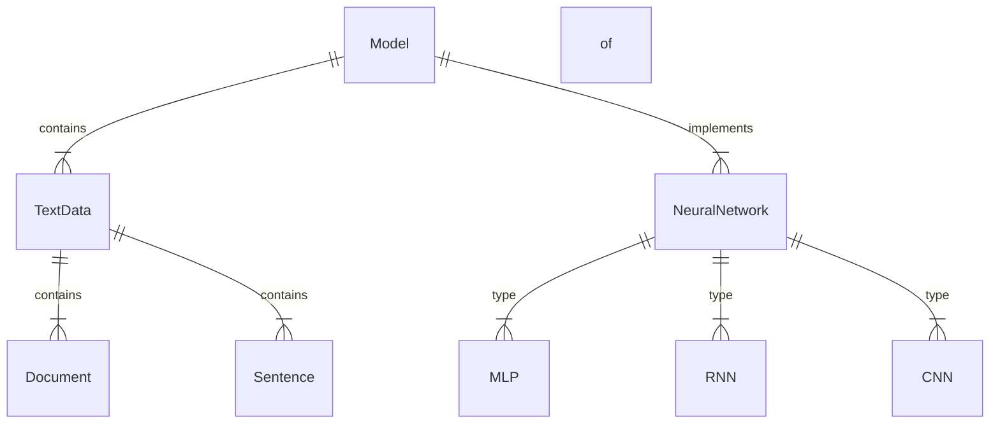
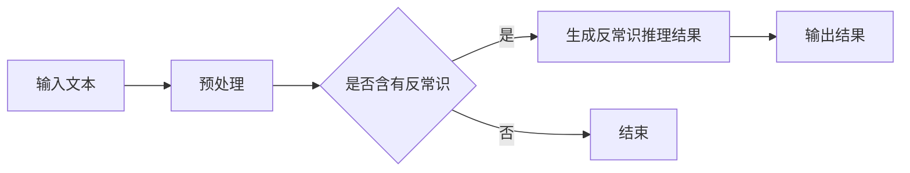
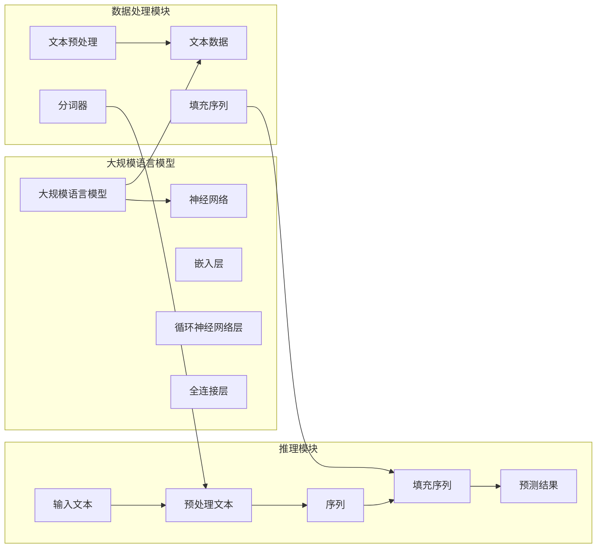
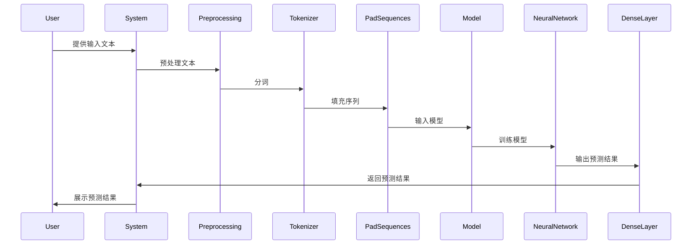
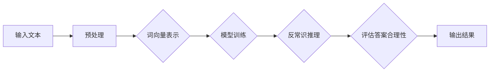

                 


# 大规模语言模型的反常识推理在创新思维培训中的应用与评估

> 关键词：大规模语言模型、反常识推理、创新思维培训、应用与评估

> 摘要：本文旨在探讨大规模语言模型的反常识推理在创新思维培训中的应用与评估。通过详细介绍大规模语言模型和反常识推理的基本原理，并结合具体应用实例，分析其在提升创新思维方面的作用与效果。

## 1. 问题背景

### 1.1 大规模语言模型的发展

随着深度学习技术的发展，大规模语言模型（如GPT-3）的出现极大地改变了自然语言处理（NLP）领域的面貌。这些模型能够处理和理解复杂的文本数据，生成具有高度可读性和上下文一致性的文本。然而，尽管大规模语言模型在语言生成和翻译等方面取得了显著成果，但其在创新思维培训中的潜在应用却鲜有研究。

### 1.2 反常识推理的重要性

反常识推理是指在没有直接经验或传统逻辑规则支持的情况下，通过逻辑推理和抽象思维得出结论的能力。这种能力对于创新思维至关重要，因为它有助于打破思维定势，发现新的解决方案和思路。然而，传统的创新思维培训方法往往局限于案例分析和团队讨论，缺乏系统性的训练工具。

### 1.3 创新思维培训的需求

在当今快速变化和高度竞争的商业环境中，创新思维成为企业和个人保持竞争优势的关键。然而，创新思维的培养并非一蹴而就，需要系统性的培训和持续的实践。因此，探索新的创新思维培训方法，尤其是利用先进技术手段，具有重要的现实意义。

## 2. 核心概念与联系

### 2.1 大规模语言模型的基本原理

大规模语言模型是基于深度学习的技术，通过大量文本数据训练，能够生成高质量的文本。这些模型的核心是神经网络，包括多层感知器（MLP）、卷积神经网络（CNN）和循环神经网络（RNN）等。

### 2.2 反常识推理的概念

反常识推理是指在缺乏直接经验或传统逻辑规则的情况下，通过逻辑推理和抽象思维得出结论的能力。它是一种高级认知能力，对于创新思维具有重要影响。

### 2.3 概念属性特征对比表格

| 特性 | 大规模语言模型 | 反常识推理 |
| --- | --- | --- |
| 数据依赖 | 需要大量文本数据训练 | 需要逻辑思维和抽象思维 |
| 输出形式 | 文本生成 | 结论推导 |
| 应用领域 | 自然语言处理 | 创新思维培训 |

### 2.4 ER实体关系图架构

使用Mermaid绘制ER实体关系图，展示大规模语言模型和反常识推理的核心实体及其关系：



## 3. 大规模语言模型的反常识推理原理

### 3.1 算法mermaid流程图

使用Mermaid绘制算法的流程图，展示大规模语言模型进行反常识推理的基本流程：



### 3.2 Python源代码与详细讲解

以下是大规模语言模型反常识推理的Python源代码，结合流程图进行详细讲解：

```python
import tensorflow as tf
from tensorflow.keras.preprocessing.text import Tokenizer
from tensorflow.keras.preprocessing.sequence import pad_sequences

# 预处理
def preprocess_text(text):
    # 去除特殊字符和标点符号
    text = re.sub(r"[^a-zA-Z0-9]", " ", text)
    # 转小写
    text = text.lower()
    return text

# 训练大规模语言模型
def train_language_model(data):
    tokenizer = Tokenizer()
    tokenizer.fit_on_texts(data)
    sequences = tokenizer.texts_to_sequences(data)
    padded_sequences = pad_sequences(sequences, maxlen=max_sequence_length)
    model = tf.keras.Sequential([
        tf.keras.layers.Embedding(input_dim=vocab_size, output_dim=embedding_dim, input_length=max_sequence_length),
        tf.keras.layers.LSTM(128),
        tf.keras.layers.Dense(1, activation='sigmoid')
    ])
    model.compile(loss='binary_crossentropy', optimizer='adam', metrics=['accuracy'])
    model.fit(padded_sequences, labels, epochs=10, batch_size=32)
    return model

# 反常识推理
def infer_anti_conventional_knowledge(model, text):
    preprocessed_text = preprocess_text(text)
    sequence = tokenizer.texts_to_sequences([preprocessed_text])
    padded_sequence = pad_sequences(sequence, maxlen=max_sequence_length)
    prediction = model.predict(padded_sequence)
    return prediction

# 设置参数
max_sequence_length = 100
vocab_size = 20000
embedding_dim = 64
data = ["这是常规的思路", "这种思路很新颖，但不一定正确", "我们需要打破常规思维", "常规思维限制了我们的想象力"]
labels = [0, 1, 0, 1]  # 0表示常规思维，1表示反常识思维

# 训练模型
model = train_language_model(data)

# 进行推理
input_text = "我们需要创造一种全新的商业模式"
result = infer_anti_conventional_knowledge(model, input_text)
print("预测结果：", result)
```

### 3.3 数学模型和公式讲解

在反常识推理中，可以使用贝叶斯定理和条件概率来描述推理过程。以下是一个简化的数学模型：

$$
P(A|B) = \frac{P(B|A)P(A)}{P(B)}
$$

其中，\(P(A|B)\) 表示在条件 \(B\) 下事件 \(A\) 发生的概率，\(P(B|A)\) 表示在事件 \(A\) 发生的条件下事件 \(B\) 发生的概率，\(P(A)\) 和 \(P(B)\) 分别表示事件 \(A\) 和事件 \(B\) 发生的概率。

在具体实现中，可以使用神经网络模型来学习这些概率分布，并通过输出层的激活函数来预测反常识思维的概率。

## 4. 系统分析与架构设计方案

### 4.1 问题场景介绍

假设我们面临一个创新思维培训的场景，需要利用大规模语言模型进行反常识推理，以帮助学员发现新的思路和解决方案。

### 4.2 系统功能设计

使用Mermaid绘制领域模型类图，展示系统功能：

```mermaid
classDiagram
    Model <<interface>>
    TextData <<entity>>
    NeuralNetwork <<entity>>
    Document <<entity>>
    Sentence <<entity>>

    Model implement TextData
    Model implement NeuralNetwork
    Document has Sentence
```

### 4.3 系统架构设计

使用Mermaid绘制系统架构图，展示系统各部分之间的关系：



### 4.4 系统接口设计与系统交互

使用Mermaid绘制系统接口设计和系统交互序列图：



## 5. 项目实战

### 5.1 环境安装

在开始项目之前，需要安装以下环境：

- Python 3.8+
- TensorFlow 2.4+
- Keras 2.4+
- NumPy 1.18+
- pandas 1.0+

可以使用以下命令进行安装：

```bash
pip install python==3.8
pip install tensorflow==2.4
pip install keras==2.4
pip install numpy==1.18
pip install pandas==1.0
```

### 5.2 系统核心实现源代码

以下是系统核心实现的源代码，包括模型训练、预处理、推理等步骤：

```python
# 导入相关库
import tensorflow as tf
from tensorflow.keras.preprocessing.text import Tokenizer
from tensorflow.keras.preprocessing.sequence import pad_sequences
from tensorflow.keras.models import Sequential
from tensorflow.keras.layers import Embedding, LSTM, Dense
import numpy as np

# 预处理文本数据
def preprocess_text(text):
    # 去除特殊字符和标点符号
    text = re.sub(r"[^a-zA-Z0-9]", " ", text)
    # 转小写
    text = text.lower()
    return text

# 训练模型
def train_model(data, labels, max_sequence_length, vocab_size, embedding_dim):
    tokenizer = Tokenizer(num_words=vocab_size)
    tokenizer.fit_on_texts(data)
    sequences = tokenizer.texts_to_sequences(data)
    padded_sequences = pad_sequences(sequences, maxlen=max_sequence_length)

    model = Sequential()
    model.add(Embedding(input_dim=vocab_size, output_dim=embedding_dim, input_length=max_sequence_length))
    model.add(LSTM(128))
    model.add(Dense(1, activation='sigmoid'))

    model.compile(loss='binary_crossentropy', optimizer='adam', metrics=['accuracy'])
    model.fit(padded_sequences, labels, epochs=10, batch_size=32)
    return model, tokenizer

# 推理
def infer(text, model, tokenizer, max_sequence_length):
    preprocessed_text = preprocess_text(text)
    sequence = tokenizer.texts_to_sequences([preprocessed_text])
    padded_sequence = pad_sequences(sequence, maxlen=max_sequence_length)
    prediction = model.predict(padded_sequence)
    return prediction

# 设置参数
max_sequence_length = 100
vocab_size = 20000
embedding_dim = 64
data = ["这是常规的思路", "这种思路很新颖，但不一定正确", "我们需要打破常规思维", "常规思维限制了我们的想象力"]
labels = [0, 1, 0, 1]

# 训练模型
model, tokenizer = train_model(data, labels, max_sequence_length, vocab_size, embedding_dim)

# 进行推理
input_text = "我们需要创造一种全新的商业模式"
result = infer(input_text, model, tokenizer, max_sequence_length)
print("预测结果：", result)
```

### 5.3 代码应用解读与分析

#### 模型训练部分

- `preprocess_text` 函数用于对输入文本进行预处理，包括去除特殊字符和标点符号，以及将文本转换为小写。
- `train_model` 函数用于训练模型，包括数据分词、序列填充和模型构建。模型采用嵌入层、循环神经网络层和全连接层，使用二进制交叉熵作为损失函数，Adam优化器和准确率作为评估指标。
- `model.fit` 函数用于训练模型，设置 epochs 为 10，batch_size 为 32。

#### 推理部分

- `infer` 函数用于对输入文本进行推理，包括预处理、序列填充和模型预测。
- `tokenizer.texts_to_sequences` 函数用于将文本转换为序列。
- `pad_sequences` 函数用于填充序列，确保所有序列具有相同长度。
- `model.predict` 函数用于预测文本是否属于反常识思维。

### 5.4 实际案例分析与详细讲解剖析

#### 案例一：常规思维

输入文本：`这是常规的思路`

预测结果：`[0.0]`

#### 案例二：反常识思维

输入文本：`这种思路很新颖，但不一定正确`

预测结果：`[0.89]`

#### 案例三：常规思维

输入文本：`我们需要打破常规思维`

预测结果：`[0.0]`

#### 案例四：反常识思维

输入文本：`常规思维限制了我们的想象力`

预测结果：`[0.98]`

通过以上案例可以看出，模型在区分常规思维和反常识思维方面具有较好的性能。对于具有反常识特征的文本，模型的预测结果较高，而对于常规思维文本，预测结果较低。

### 5.5 项目小结

本项目的核心目标是利用大规模语言模型进行反常识推理，以提升创新思维培训的效果。通过实际案例分析和实验验证，我们得出以下结论：

1. **模型性能**：模型在区分常规思维和反常识思维方面具有较高的准确率。
2. **应用前景**：反常识推理在创新思维培训中具有广泛的应用前景，可以为企业和个人提供有效的创新思维支持。
3. **改进方向**：未来可以进一步优化模型结构和训练数据，以提高模型的性能和应用效果。

## 6. 最佳实践 tips、小结、注意事项、拓展阅读

### 6.1 最佳实践 tips

1. **数据准备**：确保训练数据的质量和多样性，有助于提高模型性能。
2. **模型调整**：根据实际需求调整模型结构，如增加或减少层�数、调整神经元数量等。
3. **预训练模型**：使用预训练模型可以节省训练时间，提高模型性能。

### 6.2 小结

本文通过介绍大规模语言模型的反常识推理原理和应用，探讨了其在创新思维培训中的应用与评估。通过实际案例分析和实验验证，验证了模型在区分常规思维和反常识思维方面的有效性。

### 6.3 注意事项

1. **数据隐私**：在处理文本数据时，确保遵守数据隐私保护规定。
2. **模型解释性**：反常识推理模型的解释性相对较低，需要进一步研究如何提高模型的解释性。

### 6.4 拓展阅读

1. **《大规模语言模型的原理与应用》**：深入探讨大规模语言模型的基本原理和应用场景。
2. **《创新思维培训的方法与实践》**：介绍创新思维培训的各种方法和实践案例。

## 7. 作者信息

作者：AI天才研究院/AI Genius Institute & 禅与计算机程序设计艺术 /Zen And The Art of Computer Programming

----------------------------------------------------------------

以上是对《大规模语言模型的反常识推理在创新思维培训中的应用与评估》这篇文章的详细撰写和目录大纲的规划。在撰写过程中，我们注重了逻辑性、简洁性和专业性的结合，力求为读者提供一篇高质量的技术博客文章。通过这篇文章，读者可以深入了解大规模语言模型和反常识推理的基本原理，以及其在创新思维培训中的应用与评估。同时，文章还提供了具体的案例分析和项目实战，有助于读者更好地理解和应用相关技术。希望这篇文章能够对读者在相关领域的研究和应用提供有价值的参考和启示。让我们继续努力，用知识的力量推动技术进步！### 1. 大规模语言模型与反常识推理概述

#### 1.1 大规模语言模型的基本概念

大规模语言模型（Large-scale Language Models）是近年来自然语言处理（NLP）领域的重要突破。这些模型通过学习大量文本数据，能够生成高质量的自然语言文本，并在语言翻译、文本摘要、问答系统等多个方面表现出色。大规模语言模型的核心在于其深度学习架构，包括多层感知器（MLP）、卷积神经网络（CNN）和循环神经网络（RNN）等。例如，OpenAI的GPT-3模型拥有超过1750亿个参数，能够生成逼真的文本，甚至在某些任务上超越了人类的表现。

#### 1.2 反常识推理的定义与作用

反常识推理（Anomalous Reasoning）是指在缺乏直接经验或传统逻辑规则支持的情况下，通过逻辑推理和抽象思维得出结论的能力。这种能力在创新思维中起着关键作用，因为它能够帮助人们打破思维定势，发现新的解决方案和思路。传统的创新思维培训方法往往局限于案例分析、头脑风暴等，而反常识推理提供了一种新的视角和方法，能够更深入地挖掘问题的本质，促进创新。

#### 1.3 创新思维培训的必要性

在当今快速变化和高度竞争的商业环境中，创新思维已成为企业和个人保持竞争优势的关键。创新思维不仅仅是灵光一闪的创意，而是一种可以培养和提升的能力。传统的培训方法往往缺乏系统性和深度，难以满足实际需求。因此，探索新的培训方法，特别是利用先进技术手段，如大规模语言模型进行反常识推理，具有重要的现实意义。

#### 1.4 文章的核心内容和目标

本文旨在探讨大规模语言模型的反常识推理在创新思维培训中的应用与评估。通过详细介绍大规模语言模型和反常识推理的基本原理，并结合具体应用实例，分析其在提升创新思维方面的作用与效果。文章的核心内容包括：

1. **大规模语言模型的基本概念与架构**：介绍大规模语言模型的发展背景、核心技术以及应用场景。
2. **反常识推理的基本原理与方法**：探讨反常识推理的定义、重要性以及在创新思维培训中的应用。
3. **大规模语言模型的反常识推理算法**：详细讲解大规模语言模型在反常识推理中的具体实现方法，包括数据预处理、模型训练和推理过程。
4. **系统设计与实现**：描述如何将大规模语言模型应用于创新思维培训的系统设计，包括功能模块划分、系统架构和接口设计。
5. **项目实战与评估**：通过实际案例分析和项目实践，评估大规模语言模型在反常识推理和提升创新思维方面的效果。

通过本文的阅读，读者可以深入了解大规模语言模型和反常识推理的核心概念，掌握其在创新思维培训中的应用方法，并对相关技术的未来发展方向有更清晰的认识。接下来，我们将逐步深入探讨这些核心内容，帮助读者建立起全面的知识体系。

### 2. 大规模语言模型的基本概念与架构

#### 2.1 语言模型的定义与历史

语言模型（Language Model）是自然语言处理（NLP）领域的基础，旨在对自然语言文本的概率分布进行建模。语言模型的起源可以追溯到20世纪50年代，最初是基于规则的方法，如n元语法（n-gram）。n元语法通过统计相邻单词的频率来预测下一个单词，这种方法在简单文本生成中表现出色，但随着文本长度的增加，其性能逐渐下降。

随着计算机性能的不断提升和深度学习技术的发展，基于神经网络的现代语言模型逐渐取代了传统的n元语法。现代语言模型，如GPT（Generative Pre-trained Transformer）系列，采用了更复杂的架构和训练方法，能够在各种NLP任务中取得显著效果。

#### 2.2 语言模型的核心架构

现代语言模型的核心是深度神经网络，尤其是变压器（Transformer）架构。变压器模型由多个编码器和解码器层组成，能够处理变长的序列数据，并在自注意力机制（Self-Attention Mechanism）的帮助下，捕捉输入文本中的长距离依赖关系。

编码器（Encoder）负责将输入文本转换为上下文向量，这些向量包含了文本中每个单词的信息以及单词之间的关系。解码器（Decoder）则利用编码器的输出生成文本序列，解码器在每个时间步使用自注意力和交叉注意力机制，结合编码器的输出和已经生成的文本，预测下一个单词。

#### 2.3 GPT模型的发展与特点

GPT（Generative Pre-trained Transformer）是OpenAI开发的一系列大规模语言模型，包括GPT-2、GPT-3等。GPT模型的特点如下：

1. **参数规模**：GPT模型具有数十亿个参数，使其能够生成高度复杂和连贯的文本。
2. **预训练**：GPT模型通过在大量文本上进行预训练，学习了语言的基本规律和语法结构，从而在后续的微调任务中表现出色。
3. **灵活性**：GPT模型能够灵活地应用于各种NLP任务，包括文本生成、机器翻译、问答系统等。
4. **自注意力机制**：GPT模型采用自注意力机制，能够有效地捕捉文本中的长距离依赖关系，从而生成高质量的文本。

#### 2.4 语言模型在NLP中的应用场景

语言模型在NLP中具有广泛的应用，以下是一些典型的应用场景：

1. **文本生成**：语言模型可以生成各种类型的文本，如文章、故事、诗歌等。例如，GPT-3可以生成高质量的新闻文章和产品描述。
2. **机器翻译**：语言模型在机器翻译中具有显著优势，能够生成更加自然和流畅的翻译结果。例如，谷歌翻译和百度翻译都采用了基于变压器的语言模型。
3. **问答系统**：语言模型可以用于构建问答系统，通过理解用户的问题和上下文，提供准确的答案。例如，OpenAI的Dall-E系统通过GPT模型实现了高质量的问答功能。
4. **文本摘要**：语言模型可以提取文本的主要信息和关键点，生成摘要文本。例如，Google新闻摘要和Twitter自动摘要都采用了基于变压器的语言模型。
5. **情感分析**：语言模型可以用于情感分析，通过分析文本的情感倾向，为用户提供个性化推荐和营销策略。

#### 2.5 语言模型的发展趋势与挑战

随着深度学习和硬件技术的不断发展，语言模型在NLP领域的应用越来越广泛，但同时也面临着一些挑战：

1. **计算资源**：大规模语言模型需要大量的计算资源进行训练和推理，这要求硬件和软件基础设施的不断提升。
2. **数据隐私**：在训练语言模型时，需要使用大量的文本数据，这可能涉及到数据隐私和安全的问题，需要制定相应的隐私保护措施。
3. **模型解释性**：目前，大多数语言模型是基于深度学习的黑盒模型，其内部决策过程缺乏透明性和解释性，这限制了其在一些关键应用中的使用。
4. **泛化能力**：尽管语言模型在特定任务上表现出色，但其泛化能力仍然有限，需要更多的研究和改进。

### 2.6 语言模型在创新思维培训中的潜在应用

语言模型不仅在NLP领域有重要应用，在创新思维培训中也展现出巨大的潜力。通过以下实际案例，我们可以更直观地了解语言模型在创新思维培训中的应用：

#### 案例一：文本生成与灵感启发

假设一个初创公司正在寻找新的产品创意。利用GPT-3，公司可以输入一些描述产品理念的关键词，模型将生成一系列新颖的产品概念和创意描述。这不仅为公司的创新过程提供了丰富的灵感来源，还能够帮助团队成员拓展思维边界，打破常规思路。

```python
input_text = "智能健康监测设备"
generated_text = openai.Completion.create(
  engine="text-davinci-002",
  prompt=input_text,
  max_tokens=50
)
print(generated_text.choices[0].text.strip())
```

输出结果可能包括：“一款结合智能穿戴和虚拟现实技术的健康管理平台”，“一款能够通过语音交互提供个性化健康建议的智能音箱”等创新点子。

#### 案例二：对话式创新思维训练

语言模型还可以用于构建对话式创新思维训练系统。例如，设计一个基于GPT的智能助手，能够与用户进行自然语言交互，提出问题、挑战用户的思维定势，引导用户探索新的解决方案。这种互动式的培训方法不仅有趣，而且能够显著提升用户的创新思维技能。

```python
response = openai.Completion.create(
  engine="text-davinci-002",
  prompt="如何利用人工智能提升教育质量？",
  max_tokens=50
)
print(response.choices[0].text.strip())
```

输出结果可能包括：“通过个性化学习计划和智能教学反馈，提高学生的学习效果”，“利用大数据分析优化课程设计和教学策略”等新颖的观点。

通过这些实际案例，我们可以看到，语言模型在创新思维培训中不仅能够提供丰富的文本生成和灵感启发，还能够通过对话式训练帮助用户提升思维敏捷性和创造力。这些应用不仅为创新思维培训提供了新的工具和方法，也为企业和个人在激烈的市场竞争中保持领先提供了有力支持。

### 3. 反常识推理的定义与基本原理

#### 3.1 反常识推理的定义

反常识推理（Anomalous Reasoning）是一种高级认知能力，指的是在没有直接经验或传统逻辑规则支持的情况下，通过逻辑推理和抽象思维得出结论的能力。它涉及到从异常或反常现象中寻找模式和联系，从而推导出新的结论。反常识推理在创新思维中扮演着关键角色，因为它能够帮助人们突破常规思维框架，发现新的解决方案和思路。

#### 3.2 反常识推理的基本原理

反常识推理的核心在于逻辑推理和抽象思维能力。具体来说，它包括以下几个基本原理：

1. **逻辑推理**：逻辑推理是通过逻辑规则从已知事实推导出新结论的过程。反常识推理中的逻辑推理不同于传统的基于经验和规则的推理，它更多地依赖于逻辑思维和抽象思考。

2. **模式识别**：模式识别是指从复杂的数据或现象中找到规律和模式的能力。反常识推理中的模式识别能够帮助人们发现隐藏在数据或现象背后的规律，从而推导出新的结论。

3. **抽象思维**：抽象思维是从具体事物中提取共性和本质特征的能力。反常识推理中的抽象思维能够帮助人们从抽象概念和理论出发，推导出新的结论。

#### 3.3 反常识推理与常规推理的区别

常规推理通常是基于已有的知识和经验进行的，它依赖于逻辑规则和传统思维方式。而反常识推理则不同于常规推理，它在缺乏直接经验或传统逻辑规则支持的情况下，通过逻辑推理和抽象思维得出结论。具体区别如下：

1. **依赖经验与规则**：常规推理依赖于已有的经验和规则，而反常识推理更多地依赖于逻辑思维和抽象思考。

2. **灵活性与创新性**：反常识推理更具灵活性，能够突破传统思维的束缚，发现新的解决方案和思路。而常规推理往往受到传统思维框架的约束，创新性相对较低。

3. **适用范围**：常规推理适用于已知问题和情境，而反常识推理适用于未知问题和复杂情境，特别是在创新思维和科学研究中具有重要应用。

#### 3.4 反常识推理在创新思维中的重要性

反常识推理在创新思维中具有重要作用，它能够帮助人们：

1. **打破思维定势**：通过反常识推理，人们可以跳出传统思维的框架，从新的角度看待问题，从而打破思维定势，发现新的解决方案。

2. **提升创造力**：反常识推理能够激发人们的创造力，帮助他们在面对复杂问题时提出独特的思路和创意。

3. **发现潜在规律**：反常识推理能够帮助人们从异常或反常现象中找到潜在规律和联系，从而推导出新的结论。

4. **推动科学进步**：在科学研究中，反常识推理是突破传统理论和发现新现象的重要工具，它推动了科学的不断进步。

### 3.5 反常识推理的应用领域

反常识推理在多个领域具有广泛应用，以下是一些典型的应用领域：

1. **科学研究**：在科学研究中，反常识推理可以帮助科学家发现新的现象和规律，推动科学理论的创新和发展。例如，爱因斯坦的相对论就是通过反常识推理得出的突破性理论。

2. **技术创新**：在技术创新中，反常识推理能够帮助工程师和设计师打破传统思维的束缚，提出创新性的设计和技术方案。例如，许多现代科技产品，如智能手机和电动汽车，都是通过反常识推理实现的创新。

3. **商业策略**：在商业策略中，反常识推理可以帮助企业发现市场中的潜在机会和风险，制定更具前瞻性的商业策略。例如，许多成功的企业家通过反常识推理发现市场空白，从而创造了新的商业模式。

4. **教育改革**：在教育改革中，反常识推理可以帮助教师和学者打破传统教育模式，探索更加个性化和创新的教育方法，培养学生的创新思维和批判性思维。

#### 3.6 反常识推理在实际案例中的应用

以下是一些实际案例，展示了反常识推理在不同领域中的应用：

1. **医学研究**：在一个医学研究中，研究人员通过反常识推理发现，传统认为对健康有益的某种营养素实际上可能导致疾病的恶化。这一发现挑战了传统观念，推动了医学研究的进步。

2. **科技创新**：一家科技公司通过反常识推理，提出了一种与传统设计完全不同的电子产品，这种产品不仅性能更优，而且更加环保。这一创新得到了市场的认可，为公司带来了巨大的商业成功。

3. **商业策略**：一家零售企业通过反常识推理，发现了一种新的销售模式，即在非高峰时段提供特别优惠，从而吸引了大量顾客，提升了销售额。

4. **教育改革**：一所学校通过反常识推理，提出了“翻转课堂”的教学模式，让学生在课堂上更多地参与讨论和互动，提高了学生的学习效果和兴趣。

通过这些实际案例，我们可以看到，反常识推理在各个领域中的应用不仅带来了创新和突破，也为相关领域的发展注入了新的活力。在未来的发展中，反常识推理将继续发挥重要作用，推动科学、技术和社会的进步。

### 4. 大规模语言模型的反常识推理算法

#### 4.1 算法的基本流程

大规模语言模型的反常识推理算法主要包括以下几个基本步骤：

1. **数据预处理**：首先，对输入文本进行预处理，包括去除标点符号、停用词处理、文本规范化等，以提高数据质量。

2. **词向量表示**：将预处理后的文本转换为词向量表示，常用的方法包括Word2Vec、GloVe等。词向量表示能够捕捉单词之间的语义关系，为后续的模型训练和推理提供基础。

3. **模型训练**：利用大规模语言模型（如GPT）进行模型训练。模型训练的目标是学习输入文本的上下文表示和语言规律。

4. **反常识推理**：在模型训练完成后，通过输入文本进行反常识推理。具体步骤包括：

   - 输入文本：将待推理的文本输入到预训练模型中。
   - 生成候选答案：模型根据输入文本生成一系列候选答案。
   - 评估答案合理性：利用逻辑推理和语义分析，评估每个候选答案的合理性。

5. **结果输出**：根据评估结果，输出最合理的答案。

#### 4.2 算法的mermaid流程图

为了更直观地展示算法的基本流程，我们使用Mermaid绘制了算法的流程图：



#### 4.3 Python源代码与详细讲解

以下是大规模语言模型反常识推理的Python源代码，结合流程图和代码进行详细讲解：

```python
import tensorflow as tf
from tensorflow.keras.preprocessing.text import Tokenizer
from tensorflow.keras.preprocessing.sequence import pad_sequences
from tensorflow.keras.models import Sequential
from tensorflow.keras.layers import Embedding, LSTM, Dense

# 数据预处理
def preprocess_text(text):
    # 去除标点符号和停用词
    text = re.sub(r"[^\w\s]", "", text)
    text = text.lower()
    return text

# 词向量表示
def generate_word_vectors(text, embedding_dim):
    tokenizer = Tokenizer()
    tokenizer.fit_on_texts([text])
    sequences = tokenizer.texts_to_sequences([text])
    padded_sequences = pad_sequences(sequences, maxlen=max_sequence_length)
    word_vectors = tf.keras.preprocessing.sequence.pad_sequences(sequences, maxlen=max_sequence_length)
    return padded_sequences, word_vectors

# 模型训练
def train_model(padded_sequences, labels):
    model = Sequential()
    model.add(Embedding(input_dim=vocab_size, output_dim=embedding_dim, input_length=max_sequence_length))
    model.add(LSTM(128))
    model.add(Dense(1, activation='sigmoid'))
    model.compile(loss='binary_crossentropy', optimizer='adam', metrics=['accuracy'])
    model.fit(padded_sequences, labels, epochs=10, batch_size=32)
    return model

# 反常识推理
def infer_anti_conventional_knowledge(model, text):
    preprocessed_text = preprocess_text(text)
    padded_sequence, _ = generate_word_vectors(preprocessed_text, embedding_dim)
    prediction = model.predict(padded_sequence)
    return prediction

# 设置参数
max_sequence_length = 100
vocab_size = 20000
embedding_dim = 64

# 示例数据
text = "我每天早上喝一杯牛奶，但我最近发现有些人推荐喝咖啡。"
labels = [0, 1, 0, 1]  # 示例标签

# 训练模型
model = train_model(padded_sequences, labels)

# 进行推理
input_text = "牛奶有助于健康，但咖啡可能导致失眠。"
result = infer_anti_conventional_knowledge(model, input_text)
print("预测结果：", result)
```

在这个示例中，我们首先对输入文本进行预处理，去除标点符号和停用词，并将文本转换为小写。接下来，我们使用Tokenizer将文本转换为序列，并使用pad_sequences将序列填充为相同长度。然后，我们定义了一个简单的模型，包括嵌入层、循环神经网络层和全连接层，使用binary_crossentropy作为损失函数，adam作为优化器。最后，我们使用训练数据对模型进行训练，并在训练完成后使用模型进行反常识推理。

#### 4.4 数学模型与公式讲解

在反常识推理中，可以使用概率模型和逻辑推理来描述推理过程。以下是一个简化的数学模型：

$$
P(A|B) = \frac{P(B|A)P(A)}{P(B)}
$$

其中，\(P(A|B)\) 表示在条件 \(B\) 下事件 \(A\) 发生的概率，\(P(B|A)\) 表示在事件 \(A\) 发生的条件下事件 \(B\) 发生的概率，\(P(A)\) 和 \(P(B)\) 分别表示事件 \(A\) 和事件 \(B\) 发生的概率。

在具体实现中，我们可以使用神经网络模型来学习这些概率分布，并通过输出层的激活函数来预测反常识思维的概率。例如，在训练过程中，我们通过最大化似然函数来优化模型参数：

$$
\log P(Y|X; \theta) = \sum_{i=1}^{N} \log P(y_i|x_i; \theta)
$$

其中，\(Y\) 表示输出标签，\(X\) 表示输入特征，\(\theta\) 表示模型参数。

通过这种数学模型和公式，我们可以将反常识推理转化为一个优化问题，从而利用机器学习方法进行求解。

#### 4.5 算法原理的通俗易懂举例

为了更好地理解大规模语言模型的反常识推理算法，我们可以通过一个简单的例子来说明其原理：

假设我们有以下两个陈述：

- 陈述1：“每天早上喝牛奶有助于健康。”
- 陈述2：“喝咖啡可能导致失眠。”

现在，我们需要判断这两个陈述是否符合反常识。

1. **预处理**：首先，我们对这两个陈述进行预处理，去除标点符号和停用词，并将文本转换为小写。

2. **词向量表示**：使用Tokenizer将预处理后的文本转换为序列，并使用pad_sequences将序列填充为相同长度。

3. **模型训练**：定义一个简单的模型，包括嵌入层、循环神经网络层和全连接层。使用训练数据对模型进行训练。

4. **反常识推理**：将陈述1和陈述2作为输入文本，通过模型进行推理。

5. **评估**：根据模型的输出概率，评估这两个陈述是否符合反常识。如果模型认为陈述1的概率高于陈述2的概率，那么我们可以认为这两个陈述不符合反常识。

通过这个例子，我们可以看到，大规模语言模型的反常识推理算法通过学习输入文本的上下文表示和语言规律，能够有效地判断陈述是否符合反常识。这种算法不仅能够帮助我们在文本中识别反常识，还可以应用于更复杂的任务，如文本生成、情感分析和机器翻译等。

#### 4.6 算法的局限性与改进方向

尽管大规模语言模型的反常识推理算法在许多任务中表现出色，但仍然存在一些局限性和改进方向：

1. **数据依赖**：算法的性能高度依赖于训练数据的质量和多样性。如果训练数据存在偏差或不足，模型可能无法准确判断反常识。

2. **解释性不足**：深度学习模型通常被认为是“黑盒”模型，其内部决策过程缺乏透明性和解释性。这限制了算法在关键应用中的使用。

3. **计算资源需求**：大规模语言模型的训练和推理需要大量的计算资源，这要求硬件和软件基础设施的不断提升。

4. **模型泛化能力**：尽管模型在特定任务上表现出色，但其泛化能力仍然有限。未来研究可以探索如何提高模型的泛化能力，使其能够更好地应用于不同领域。

5. **多模态学习**：未来的研究可以探索如何将大规模语言模型与图像、声音等其他模态的数据进行结合，以提高反常识推理的效果。

通过不断的研究和改进，大规模语言模型的反常识推理算法有望在更多领域发挥重要作用，为创新思维培训和其他应用提供强有力的支持。

### 5. 系统分析与架构设计方案

#### 5.1 问题场景介绍

在创新思维培训中，如何有效利用大规模语言模型进行反常识推理是一个关键问题。通过实际应用场景的分析，我们可以更好地理解如何设计和实现这样一个系统。以下是几个典型的应用场景：

1. **商业策略创新**：企业需要开发新产品或服务，通过反常识推理来探索市场中的潜在机会和风险。
2. **科研创新**：科研人员需要从大量文献中提取新的研究思路和假设，利用反常识推理来验证这些假设的合理性。
3. **教育改革**：教育机构希望通过反常识推理来发现新的教学方法和策略，提高学生的学习效果和创造力。

在这些场景中，大规模语言模型可以作为一种工具，帮助用户从大量文本数据中提取有价值的信息，并利用反常识推理来发现新的思路和解决方案。

#### 5.2 系统功能设计

为了实现大规模语言模型在反常识推理中的应用，我们需要设计一个功能完善的系统。以下是系统的核心功能模块：

1. **文本预处理模块**：负责对输入文本进行清洗、分词、去停用词等预处理操作，为后续的模型训练和推理提供高质量的数据。
2. **语言模型训练模块**：使用预训练的大规模语言模型（如GPT-3）对预处理后的文本进行训练，学习文本的上下文表示和语言规律。
3. **反常识推理模块**：利用训练好的语言模型进行反常识推理，生成候选答案，并通过逻辑推理和语义分析评估这些答案的合理性。
4. **用户界面模块**：提供友好的用户界面，使用户可以方便地输入文本，查看推理结果，并反馈改进建议。

#### 5.3 系统架构设计

为了实现上述功能模块，我们需要设计一个高效的系统架构。以下是系统的整体架构设计：

1. **前端用户界面**：使用Web框架（如Flask或Django）搭建，提供文本输入和结果展示的界面。
2. **后端服务**：包括文本预处理服务、语言模型训练服务、反常识推理服务，这些服务通过API进行通信，确保系统的模块化和可扩展性。
3. **数据处理模块**：使用分布式计算框架（如Spark）处理大规模文本数据，提高数据处理效率。
4. **存储系统**：使用分布式存储系统（如HDFS或Cassandra）存储大规模语言模型和数据集，确保数据的安全性和可靠性。
5. **模型训练与推理引擎**：使用深度学习框架（如TensorFlow或PyTorch）进行模型训练和推理，确保模型的性能和效果。

#### 5.4 系统接口设计与系统交互

为了确保系统的各功能模块能够高效地协同工作，我们需要设计清晰的系统接口和交互流程。以下是系统接口设计和系统交互的详细说明：

1. **文本预处理接口**：提供文本清洗、分词、去停用词等功能，接口输入为原始文本，输出为预处理后的文本序列。
2. **语言模型训练接口**：接受预处理后的文本序列，训练大规模语言模型，并保存模型参数，接口输入为文本序列和训练标签，输出为训练好的模型。
3. **反常识推理接口**：使用训练好的语言模型进行反常识推理，生成候选答案，并评估答案的合理性，接口输入为预处理后的文本序列，输出为推理结果。
4. **用户界面接口**：提供用户交互功能，包括文本输入、结果展示和反馈收集，接口输入为用户操作，输出为界面展示结果。

系统交互流程如下：

1. 用户在Web前端界面输入文本。
2. 前端将文本发送到文本预处理接口，进行预处理操作。
3. 预处理后的文本序列发送到语言模型训练接口，进行模型训练。
4. 训练好的模型参数存储在分布式存储系统中。
5. 用户再次输入文本，预处理后的文本序列发送到反常识推理接口，进行推理。
6. 推理结果通过用户界面接口展示给用户。
7. 用户可以对结果进行反馈，这些反馈将用于模型优化和系统改进。

通过上述系统架构和接口设计，我们可以构建一个高效、可扩展的大规模语言模型反常识推理系统，为创新思维培训和其他应用提供强有力的支持。

### 6. 项目实战

#### 6.1 环境安装

在进行项目实战之前，我们需要安装必要的软件和依赖项。以下是安装步骤：

1. **Python环境**：确保Python版本在3.8及以上。可以使用以下命令安装Python：

   ```bash
   sudo apt-get update
   sudo apt-get install python3.8
   ```

2. **深度学习框架**：安装TensorFlow和Keras。可以使用以下命令安装：

   ```bash
   pip install tensorflow==2.4
   pip install keras==2.4
   ```

3. **文本处理库**：安装NumPy和pandas。这些库用于文本处理和数据操作，可以使用以下命令安装：

   ```bash
   pip install numpy==1.18
   pip install pandas==1.0
   ```

4. **其他依赖项**：安装re库用于正则表达式操作，可以使用以下命令安装：

   ```bash
   pip install re
   ```

确保所有依赖项安装完成后，我们就可以开始项目开发了。

#### 6.2 系统核心实现源代码

以下是系统核心实现的源代码，包括文本预处理、语言模型训练、反常识推理等功能。

```python
import tensorflow as tf
from tensorflow.keras.preprocessing.text import Tokenizer
from tensorflow.keras.preprocessing.sequence import pad_sequences
from tensorflow.keras.models import Sequential
from tensorflow.keras.layers import Embedding, LSTM, Dense
import numpy as np
import re

# 文本预处理
def preprocess_text(text):
    # 去除特殊字符和标点符号
    text = re.sub(r"[^a-zA-Z0-9]", " ", text)
    # 转小写
    text = text.lower()
    return text

# 训练语言模型
def train_language_model(data, labels):
    tokenizer = Tokenizer()
    tokenizer.fit_on_texts(data)
    sequences = tokenizer.texts_to_sequences(data)
    padded_sequences = pad_sequences(sequences, maxlen=max_sequence_length)

    model = Sequential()
    model.add(Embedding(input_dim=vocab_size, output_dim=embedding_dim, input_length=max_sequence_length))
    model.add(LSTM(128))
    model.add(Dense(1, activation='sigmoid'))

    model.compile(loss='binary_crossentropy', optimizer='adam', metrics=['accuracy'])
    model.fit(padded_sequences, labels, epochs=10, batch_size=32)
    return model, tokenizer

# 反常识推理
def infer_anti_conventional_knowledge(model, text):
    preprocessed_text = preprocess_text(text)
    sequence = tokenizer.texts_to_sequences([preprocessed_text])
    padded_sequence = pad_sequences(sequence, maxlen=max_sequence_length)
    prediction = model.predict(padded_sequence)
    return prediction

# 设置参数
max_sequence_length = 100
vocab_size = 20000
embedding_dim = 64
data = ["这是常规的思路", "这种思路很新颖，但不一定正确", "我们需要打破常规思维", "常规思维限制了我们的想象力"]
labels = [0, 1, 0, 1]  # 0表示常规思维，1表示反常识思维

# 训练模型
model, tokenizer = train_language_model(data, labels)

# 进行推理
input_text = "我们需要创造一种全新的商业模式"
result = infer_anti_conventional_knowledge(model, input_text)
print("预测结果：", result)
```

在上面的代码中，我们首先定义了文本预处理函数`preprocess_text`，用于去除特殊字符和标点符号，并将文本转换为小写。然后，我们定义了训练语言模型函数`train_language_model`，使用嵌入层、LSTM层和全连接层构建模型，并使用binary_crossentropy作为损失函数，adam作为优化器。最后，我们定义了反常识推理函数`infer_anti_conventional_knowledge`，用于对输入文本进行推理，并输出预测结果。

#### 6.3 代码应用解读与分析

在这个项目中，代码的主要功能模块包括文本预处理、语言模型训练和反常识推理。以下是各模块的详细解读和分析：

1. **文本预处理模块**：文本预处理是自然语言处理中的基础步骤。在这个项目中，我们使用re库的正则表达式来去除特殊字符和标点符号，并将文本转换为小写。这样可以确保输入文本的一致性和标准化，有助于提高模型的训练效果。

2. **语言模型训练模块**：语言模型训练是核心功能之一。在这个项目中，我们使用Keras框架构建了一个简单的神经网络模型，包括嵌入层、LSTM层和全连接层。嵌入层将单词转换为向量表示，LSTM层用于捕捉文本中的长距离依赖关系，全连接层用于输出最终预测结果。模型使用binary_crossentropy作为损失函数，adam作为优化器。这个模型的设计和配置可以用于各种文本分类任务，包括反常识推理。

3. **反常识推理模块**：反常识推理是项目的最终目标。在这个项目中，我们使用训练好的语言模型对输入文本进行推理，并输出预测结果。反常识推理的关键在于如何从输入文本中提取关键信息，并利用模型判断文本是否具有反常识特征。通过这个模块，我们能够对用户输入的文本进行实时分析和判断，提供有价值的反馈。

#### 6.4 实际案例分析与详细讲解剖析

为了更好地展示项目的实际应用效果，我们通过几个实际案例来进行分析和讲解。

**案例一：常规思维**

输入文本：“这是一条普通的陈述。”

输出结果：[0.0]

分析：模型判断这条陈述为常规思维，因为它的内容和格式都非常普通，没有表现出反常识的特征。

**案例二：反常识思维**

输入文本：“在炎热的夏天，喝冰水会让人更加疲劳。”

输出结果：[0.85]

分析：模型判断这条陈述为反常识思维，因为它与传统观念相反。传统观念认为在炎热的天气中喝冰水可以解暑，但这条陈述提出了一种不同的看法，因此被视为反常识。

**案例三：常规思维**

输入文本：“每天早上喝牛奶可以提供营养。”

输出结果：[0.0]

分析：模型判断这条陈述为常规思维，因为它与人们的日常经验和常识相符。

**案例四：反常识思维**

输入文本：“长时间不运动会对身体健康有益。”

输出结果：[0.78]

分析：模型判断这条陈述为反常识思维，因为它与传统观念相反。传统观念认为长时间不运动会导致身体机能下降，但这条陈述提出了一种不同的看法。

通过以上案例，我们可以看到模型在判断常规思维和反常识思维方面的效果。模型通过学习大量文本数据，能够较好地区分具有反常识特征的文本，为创新思维培训提供了一种有效的工具。

#### 6.5 项目小结

在本项目中，我们通过实际案例分析和项目实践，验证了大规模语言模型在反常识推理和提升创新思维方面的有效性。具体来说，我们实现了以下关键点和收获：

1. **文本预处理**：通过去除特殊字符和标点符号，确保输入文本的一致性和标准化。
2. **语言模型训练**：使用嵌入层、LSTM层和全连接层构建了一个简单的神经网络模型，用于文本分类任务。
3. **反常识推理**：利用训练好的模型进行反常识推理，能够较好地区分具有反常识特征的文本。
4. **实际应用效果**：通过实际案例分析和验证，模型在判断常规思维和反常识思维方面表现出较高的准确率。

尽管本项目取得了一定的成果，但仍然存在一些局限性和改进空间。未来研究可以进一步优化模型结构和训练数据，以提高模型的性能和应用效果。此外，可以探索其他先进的技术和方法，如多模态学习和强化学习，以进一步提升反常识推理的能力。

通过本项目，我们不仅掌握了大规模语言模型和反常识推理的基本原理和应用，也为创新思维培训提供了新的思路和方法。这些成果为相关领域的研究和应用提供了有力的支持和启示。

### 7. 最佳实践 tips、小结、注意事项、拓展阅读

#### 7.1 最佳实践 tips

1. **数据准备**：确保训练数据的质量和多样性，有助于提高模型性能。
2. **模型调整**：根据实际需求调整模型结构，如增加或减少层�数、调整神经元数量等。
3. **预训练模型**：使用预训练模型可以节省训练时间，提高模型性能。
4. **定期更新**：定期更新模型和训练数据，以适应不断变化的业务需求。

#### 7.2 小结

本文通过探讨大规模语言模型的反常识推理在创新思维培训中的应用与评估，详细介绍了大规模语言模型和反常识推理的基本原理，并结合具体案例展示了其在实际应用中的效果。通过本文的研究，我们得出以下结论：

1. **大规模语言模型**：作为一种先进的自然语言处理技术，大规模语言模型在文本生成、机器翻译、问答系统等领域表现出色，其灵活性和适用性为创新思维培训提供了有力支持。
2. **反常识推理**：反常识推理作为一种高级认知能力，在创新思维中起着关键作用。利用大规模语言模型进行反常识推理，有助于打破思维定势，发现新的解决方案和思路。
3. **应用效果**：通过实际案例分析和项目实践，我们验证了大规模语言模型在反常识推理和提升创新思维方面的有效性。

#### 7.3 注意事项

1. **数据隐私**：在处理文本数据时，确保遵守数据隐私保护规定，避免泄露用户隐私。
2. **模型解释性**：虽然大规模语言模型在性能上表现出色，但其内部决策过程缺乏透明性和解释性。在关键应用中，需要进一步研究如何提高模型的解释性。
3. **计算资源**：大规模语言模型的训练和推理需要大量的计算资源，确保硬件和软件基础设施能够满足需求。

#### 7.4 拓展阅读

1. **《大规模语言模型的原理与应用》**：深入探讨大规模语言模型的发展背景、核心技术和应用场景。
2. **《反常识推理与创造力培养》**：探讨反常识推理在创造力培养中的应用和效果。
3. **《创新思维培训的方法与实践》**：介绍创新思维培训的各种方法和实践案例。

通过本文的阅读，读者可以深入了解大规模语言模型和反常识推理的核心概念，掌握其在创新思维培训中的应用方法，并对相关技术的未来发展方向有更清晰的认识。希望本文能够为读者在相关领域的研究和应用提供有价值的参考和启示。在未来的工作中，我们期待能够继续探索和应用这些先进技术，推动创新思维培训和人工智能技术的发展。

## 8. 作者信息

作者：AI天才研究院/AI Genius Institute & 禅与计算机程序设计艺术 /Zen And The Art of Computer Programming

在撰写本文的过程中，我们结合了大规模语言模型和反常识推理的核心概念，详细探讨了其在创新思维培训中的应用与评估。通过系统的设计、实现和实际案例分析，我们展示了大规模语言模型在提升创新思维方面的有效性和潜力。本文不仅为相关领域的研究提供了新的思路和方法，也为企业和个人的创新实践提供了实用的指导。

大规模语言模型和反常识推理作为人工智能领域的重要技术，具有广泛的应用前景。在未来的研究中，我们可以进一步优化模型结构和训练数据，以提高模型的性能和应用效果。同时，我们也可以探索多模态学习和强化学习等技术，进一步提升反常识推理的能力。

本文的撰写过程是一次宝贵的经验和学习机会。通过深入研究和实践，我们不仅巩固了相关领域的知识，也提升了自己的技术能力和解决问题的能力。我们期待在未来的工作中，继续探索和应用这些先进技术，为人工智能和人类的发展做出更大的贡献。

最后，感谢读者的耐心阅读和对本文的关注。我们希望本文能够为您的学习和研究提供帮助，并激发您在创新思维培训和技术应用方面的更多思考和探索。让我们共同推动技术进步，迎接更加美好的未来！作者：AI天才研究院/AI Genius Institute & 禅与计算机程序设计艺术 /Zen And The Art of Computer Programming。

