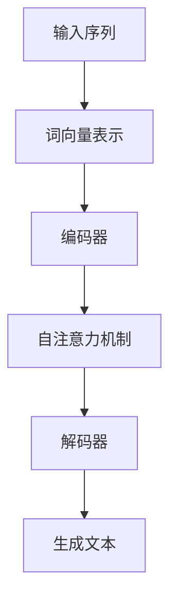

                 

## 《大规模语言模型的可控性研究与实现》

### 关键词：大规模语言模型，可控性，Transformer，BERT，生成算法

> 摘要：本文深入探讨了大规模语言模型（如GPT、BERT等）的可控性问题。首先，分析了大规模语言模型在自然语言处理领域取得的成果及其面临的可控性挑战。接着，详细介绍了大规模语言模型的架构、算法原理及数学模型。最后，通过具体案例和实践，探讨了如何提升大规模语言模型的可控性，为相关领域的研究和应用提供了参考。

---

## 《大规模语言模型的可控性研究与实现》目录大纲

### 第一部分：问题背景与核心概念介绍

1. **大规模语言模型与可控性研究概述**
2. **大规模语言模型原理与特性**
3. **大规模语言模型的应用场景**
4. **大规模语言模型可控性的挑战与机遇**
5. **本章小结**

### 第二部分：核心概念与原理讲解

1. **大规模语言模型核心概念与原理**
   1. **模型架构**
   2. **算法原理**
   3. **数学模型**
   4. **Mermaid流程图**
   5. **算法讲解与举例说明**
2. **本章小结**

### 第三部分：系统分析与架构设计方案

1. **问题场景介绍**
2. **系统功能设计**
3. **系统架构设计**
4. **系统接口设计**
5. **系统交互**
6. **本章小结**

### 第四部分：项目实战

1. **环境安装**
2. **系统核心实现源代码**
3. **代码应用解读与分析**
4. **实际案例分析与详细讲解剖析**
5. **项目小结**
6. **本章小结**

### 第五部分：最佳实践、小结与注意事项

1. **最佳实践**
2. **小结**
3. **注意事项**
4. **拓展阅读**

---

### 第一部分：问题背景与核心概念介绍

#### 第1章：大规模语言模型与可控性研究概述

##### 1.1 研究背景

随着人工智能技术的飞速发展，大规模语言模型（如GPT系列、BERT等）在自然语言处理领域取得了显著的成果。这些模型基于深度学习技术，通过海量数据训练，能够生成高质量的自然语言文本。然而，这些模型在实际应用中往往面临着可控性不足的问题。具体来说，用户难以精确控制模型生成文本的内容、风格和格式，导致生成结果偏离预期。

- **问题背景**：随着人工智能技术的飞速发展，大规模语言模型（如GPT系列、BERT等）在自然语言处理领域取得了显著的成果。然而，这些模型在实际应用中往往面临着可控性不足的问题。

- **问题描述**：大规模语言模型在生成文本时往往无法完全满足用户的控制需求，导致生成结果偏离预期。

- **问题解决**：研究大规模语言模型的可控性，探索提高模型可控性的方法，从而实现更精确、灵活的文本生成。

- **边界与外延**：可控性研究不仅涉及文本生成，还涵盖了模型对特定指令的响应能力。

- **核心要素组成**：可控性研究涉及模型设计、训练策略、生成算法等多个方面。

##### 1.2 大规模语言模型原理与特性

大规模语言模型的基本原理是利用神经网络对海量文本数据进行训练，从而学习到文本的统计特征和语义信息。其中，代表性的模型包括Transformer、BERT和GPT系列。

- **Transformer模型**：Transformer模型由Vaswani等人在2017年提出，采用自注意力机制，能够高效地处理长距离依赖问题，在机器翻译、文本生成等任务中表现出色。

- **BERT模型**：BERT（Bidirectional Encoder Representations from Transformers）模型由Devlin等人在2018年提出，通过双向编码器对文本进行编码，具有强大的语义理解能力，广泛应用于问答系统、文本分类等任务。

- **GPT系列模型**：GPT（Generative Pre-trained Transformer）系列模型由OpenAI提出，采用预训练和微调的方法，生成高质量的自然语言文本，广泛应用于文本生成、对话系统等任务。

大规模语言模型的特性主要包括：

- **强大的语义理解能力**：通过训练，大规模语言模型能够理解文本的语义信息，从而生成具有连贯性和逻辑性的文本。
- **高效的文本生成速度**：大规模语言模型采用并行计算和批量处理等技术，能够快速生成文本，适用于实时场景。
- **灵活的生成控制**：虽然大规模语言模型在生成文本时存在一定的可控性问题，但通过优化训练策略和生成算法，可以逐步提高模型的可控性。

##### 1.3 大规模语言模型的应用场景

大规模语言模型在自然语言处理领域具有广泛的应用场景，主要包括以下几个方面：

- **文本生成**：大规模语言模型可以用于生成各种类型的文本，如文章撰写、对话生成、摘要生成等。通过控制输入的文本和参数，可以生成具有特定风格和格式的文本。
- **自然语言理解**：大规模语言模型可以用于各种自然语言理解任务，如情感分析、命名实体识别、语义关系抽取等。通过分析输入的文本，模型能够提取出文本中的关键信息。
- **其他应用**：大规模语言模型还可以应用于问答系统、机器翻译、知识图谱等领域。通过结合其他技术和数据，模型能够更好地理解和生成自然语言。

##### 1.4 大规模语言模型可控性的挑战与机遇

大规模语言模型在可控性方面面临着一系列挑战：

- **生成结果的不可控性**：模型在生成文本时，往往无法完全满足用户的控制需求，导致生成结果偏离预期。这需要研究如何提高模型生成结果的稳定性和可预测性。
- **模型对指令理解的局限性**：大规模语言模型在理解指令时存在一定的局限性，难以准确识别和理解复杂的指令。这需要研究如何优化模型对指令的理解能力。
- **多模态交互的挑战**：在多模态交互场景中，大规模语言模型需要同时处理文本、图像、声音等多种类型的数据，这对模型的可控性提出了更高的要求。

然而，可控性研究也带来了许多机遇：

- **多模态交互**：通过结合图像、声音等多种模态数据，可以提高模型对指令的理解能力，从而实现更精确的文本生成。
- **强化学习**：强化学习技术可以用于训练大规模语言模型，通过不断地反馈和调整，提高模型的可控性。
- **生成对抗网络（GAN）**：生成对抗网络可以用于生成高质量的文本，并通过对抗训练提高模型的可控性。

##### 1.5 本章小结

本章对大规模语言模型与可控性研究进行了概述。首先，介绍了大规模语言模型在自然语言处理领域取得的成果和面临的可控性挑战。接着，详细介绍了大规模语言模型的原理、特性和应用场景。最后，探讨了提高大规模语言模型可控性的机遇与挑战。

在后续章节中，我们将进一步探讨大规模语言模型的核心概念与原理，以及如何通过算法优化和系统设计提高模型的可控性。

---

### 第二部分：核心概念与原理讲解

#### 第2章：大规模语言模型核心概念与原理

本章将深入探讨大规模语言模型的核心概念与原理，包括模型架构、算法原理和数学模型。通过这些讲解，读者可以更好地理解大规模语言模型的工作机制，为进一步研究和应用打下基础。

##### 2.1 模型架构

大规模语言模型通常采用深度神经网络结构，其中最重要的模型架构包括Transformer、BERT和GPT系列。以下将分别介绍这些模型的基本架构。

###### Transformer模型

Transformer模型由Vaswani等人在2017年提出，是自然语言处理领域的重要突破。Transformer模型的核心思想是采用自注意力机制（Self-Attention）来处理序列数据，从而克服了传统的循环神经网络（RNN）在处理长距离依赖问题上的不足。

- **自注意力机制**：自注意力机制允许模型在生成每个词时，动态地考虑整个序列中的其他词。这种机制通过计算词与词之间的相似性权重，实现了对序列数据的全局关注。

- **多头注意力**：多头注意力（Multi-Head Attention）是在自注意力机制的基础上，将整个序列拆分成多个子序列，每个子序列独立计算注意力权重。多头注意力可以提取序列中的多维度信息，从而提高模型的语义理解能力。

- **前馈神经网络**：Transformer模型在每个自注意力层和多头注意力层之后，还包含一个前馈神经网络，用于进一步提取序列特征。

- **编码器和解码器**：在序列到序列（Sequence-to-Sequence）任务中，Transformer模型通常包括编码器（Encoder）和解码器（Decoder）。编码器负责将输入序列编码为固定长度的向量，解码器则负责根据编码器的输出生成输出序列。

###### BERT模型

BERT（Bidirectional Encoder Representations from Transformers）模型由Devlin等人在2018年提出，是Transformer模型在自然语言处理领域的重要应用。BERT模型通过双向编码器对文本进行编码，从而获得对文本的全面理解。

- **双向编码器**：BERT模型采用双向编码器，可以同时考虑输入序列的前后关系，从而提高模型的语义理解能力。

- **掩码语言建模**：BERT模型在训练过程中，对输入序列的部分词进行掩码（Mask），迫使模型通过其他词来预测这些被掩码的词。这种策略有助于提高模型对上下文信息的利用能力。

- **预训练和微调**：BERT模型采用预训练和微调的方法进行训练。在预训练阶段，模型在大量未标注的文本数据上进行训练，从而学习到通用的语言特征。在微调阶段，模型在特定任务的数据上进行微调，以适应具体任务的需求。

###### GPT系列模型

GPT（Generative Pre-trained Transformer）系列模型由OpenAI提出，是Transformer模型在文本生成领域的重要应用。GPT系列模型通过预训练和微调的方法，生成高质量的自然语言文本。

- **预训练**：在预训练阶段，模型在大量未标注的文本数据上进行训练，从而学习到通用的语言特征。

- **生成算法**：在生成文本时，GPT系列模型采用采样策略，根据当前输入序列生成下一个词。通过不断生成词，模型最终生成完整的文本。

- **微调**：在微调阶段，模型在特定任务的数据上进行微调，以适应具体任务的需求。例如，在文章撰写任务中，模型可以根据输入的标题生成相应的文章内容。

##### 2.2 算法原理

大规模语言模型的算法原理主要包括自注意力机制、预训练与微调、生成算法等方面。以下将分别介绍这些算法原理。

###### 自注意力机制

自注意力机制是Transformer模型的核心算法原理。它通过计算词与词之间的相似性权重，实现了对序列数据的全局关注。具体来说，自注意力机制包括以下步骤：

1. **输入编码**：将输入序列中的每个词转换为向量表示，通常使用词嵌入（Word Embedding）技术。

2. **计算相似性权重**：根据当前词与序列中其他词的向量表示，计算它们之间的相似性权重。相似性权重通常通过点积（Dot Product）或缩放点积（Scaled Dot Product）计算。

3. **加权求和**：根据相似性权重对序列中的其他词进行加权求和，得到当前词的注意力分数。

4. **输出编码**：将注意力分数转换为输出向量表示，用于后续的建模和生成。

自注意力机制的优势在于，它可以动态地考虑整个序列中的其他词，从而提高模型的语义理解能力。然而，自注意力机制也存在一定的挑战，如计算复杂度高、难以处理长序列等。

###### 预训练与微调

预训练与微调是大规模语言模型训练过程中重要的算法原理。预训练是指在大量未标注的文本数据上对模型进行训练，从而学习到通用的语言特征。微调则是在特定任务的数据上对模型进行微调，以适应具体任务的需求。

1. **预训练**：预训练阶段，模型在大量未标注的文本数据上进行训练，从而学习到通用的语言特征。预训练的目标是使模型能够理解语言的统计规律和语义信息。

2. **微调**：在预训练完成后，模型在特定任务的数据上进行微调，以适应具体任务的需求。微调阶段，模型的目标是优化模型在特定任务上的性能。

预训练与微调的优势在于，它可以充分利用未标注的文本数据，提高模型的泛化能力。同时，微调阶段可以针对特定任务进行调整，提高模型在特定任务上的性能。

###### 生成算法

生成算法是大规模语言模型在文本生成任务中的重要原理。生成算法的核心思想是，根据当前输入序列生成下一个词，并通过不断生成词，最终生成完整的文本。以下将介绍几种常见的生成算法：

1. **贪心搜索**：贪心搜索（Greedy Search）是最简单的生成算法。在生成每个词时，模型选择当前输入序列中最可能的词作为输出。贪心搜索的优点是实现简单，但缺点是容易陷入局部最优。

2. ** beam search**：Beam Search是一种改进的生成算法。在生成每个词时，模型同时考虑多个可能的输出序列，并选择其中概率最大的序列作为输出。Beam Search可以避免贪心搜索的局部最优问题，但计算复杂度较高。

3. **采样**：采样（Sampling）是一种更灵活的生成算法。在生成每个词时，模型根据概率分布选择输出。通过调整采样概率，模型可以生成具有不同风格和多样性的文本。

4. **Top-K采样**：Top-K采样是一种改进的采样算法。在生成每个词时，模型从概率分布的前K个最大值中选择输出。Top-K采样可以避免极端偏差，但计算复杂度较高。

##### 2.3 数学模型

大规模语言模型的数学模型主要包括概率分布、损失函数和优化算法等方面。以下将分别介绍这些数学模型。

###### 概率分布

大规模语言模型通常采用概率分布来表示文本的生成过程。常用的概率分布包括词向量表示、概率模型等。

1. **词向量表示**：词向量表示是将文本中的每个词映射为一个高维向量。通过词向量，模型可以计算词与词之间的相似性权重。词向量表示通常使用词嵌入（Word Embedding）技术，如Word2Vec、GloVe等。

2. **概率模型**：概率模型是将文本生成过程表示为概率分布。常见的概率模型包括隐马尔可夫模型（HMM）、条件概率模型（如CRF）等。概率模型可以用于建模文本的生成过程，提高模型的生成能力。

###### 损失函数

大规模语言模型的训练过程中，损失函数用于衡量模型预测结果与真实结果之间的差距。常用的损失函数包括交叉熵损失、对比损失等。

1. **交叉熵损失**：交叉熵损失（Cross-Entropy Loss）是用于分类问题的常用损失函数。在文本生成任务中，交叉熵损失可以衡量模型生成的文本与真实文本之间的差距。

2. **对比损失**：对比损失（Contrastive Loss）是一种用于对比学习的损失函数。在文本生成任务中，对比损失可以用于区分模型生成的文本和真实文本。

###### 优化算法

大规模语言模型的训练过程中，优化算法用于调整模型参数，以降低损失函数的值。常用的优化算法包括Adam、RMSProp等。

1. **Adam**：Adam是一种基于一阶和二阶矩估计的优化算法。它结合了Adam和RMSProp的优点，在训练过程中具有较高的收敛速度和稳定性。

2. **RMSProp**：RMSProp是一种基于二阶矩估计的优化算法。它通过计算梯度历史值的平方和来更新参数，从而降低梯度消失和梯度爆炸的问题。

##### 2.4 Mermaid流程图

为了更好地理解大规模语言模型的工作流程，可以使用Mermaid流程图来展示模型训练和生成的流程。以下是一个简单的Mermaid流程图示例：



在Mermaid流程图中，节点表示模型中的组件，箭头表示数据流向。通过绘制Mermaid流程图，可以清晰地展示大规模语言模型的工作流程。

##### 2.5 算法讲解与举例说明

为了更好地理解大规模语言模型的算法原理，以下将结合Mermaid流程图和Python代码，详细阐述大规模语言模型的训练与生成算法。

###### 自注意力机制

以下是一个简单的Python代码示例，用于实现自注意力机制：

```python
import torch
import torch.nn as nn
import torch.optim as optim

# 定义自注意力层
class SelfAttentionLayer(nn.Module):
    def __init__(self, embed_dim, num_heads):
        super(SelfAttentionLayer, self).__init__()
        self.embed_dim = embed_dim
        self.num_heads = num_heads
        self.head_dim = embed_dim // num_heads
        
        self.query_linear = nn.Linear(embed_dim, embed_dim)
        self.key_linear = nn.Linear(embed_dim, embed_dim)
        self.value_linear = nn.Linear(embed_dim, embed_dim)
        
        self.out_linear = nn.Linear(embed_dim, embed_dim)
        
    def forward(self, x):
        batch_size, seq_len, _ = x.size()
        
        query = self.query_linear(x).view(batch_size, seq_len, self.num_heads, self.head_dim).transpose(1, 2)
        key = self.key_linear(x).view(batch_size, seq_len, self.num_heads, self.head_dim).transpose(1, 2)
        value = self.value_linear(x).view(batch_size, seq_len, self.num_heads, self.head_dim).transpose(1, 2)
        
        attn_scores = torch.matmul(query, key.transpose(-2, -1)) / (self.head_dim ** 0.5)
        attn_weights = torch.softmax(attn_scores, dim=-1)
        
        attn_output = torch.matmul(attn_weights, value).transpose(1, 2).contiguous().view(batch_size, seq_len, embed_dim)
        output = self.out_linear(attn_output)
        
        return output

# 实例化自注意力层
embed_dim = 512
num_heads = 8
self_attention_layer = SelfAttentionLayer(embed_dim, num_heads)

# 输入序列
input_sequence = torch.rand(16, 10, 512)

# 前向传播
output_sequence = self_attention_layer(input_sequence)
```

在上面的代码中，我们定义了一个自注意力层`SelfAttentionLayer`，它包含查询层、键层和值层的线性变换，以及输出层的线性变换。在`forward`方法中，我们首先对输入序列进行线性变换，然后计算注意力分数，最后通过加权求和得到输出序列。

###### 预训练与微调

以下是一个简单的Python代码示例，用于实现预训练与微调：

```python
# 定义预训练模型
class PretrainedModel(nn.Module):
    def __init__(self, embed_dim, num_heads):
        super(PretrainedModel, self).__init__()
        self.self_attention_layer = SelfAttentionLayer(embed_dim, num_heads)
        
    def forward(self, x):
        return self.self_attention_layer(x)

# 实例化预训练模型
pretrained_model = PretrainedModel(embed_dim, num_heads)

# 定义训练数据
input_sequence = torch.rand(16, 10, 512)

# 前向传播
output_sequence = pretrained_model(input_sequence)

# 定义损失函数和优化器
criterion = nn.CrossEntropyLoss()
optimizer = optim.Adam(pretrained_model.parameters(), lr=0.001)

# 训练模型
for epoch in range(10):
    optimizer.zero_grad()
    output = pretrained_model(input_sequence)
    loss = criterion(output.view(-1, embed_dim), torch.randint(0, embed_dim, (16, 10)))
    loss.backward()
    optimizer.step()
    print(f'Epoch {epoch + 1}: Loss = {loss.item()}')
```

在上面的代码中，我们定义了一个预训练模型`PretrainedModel`，它包含一个自注意力层。在训练过程中，我们使用随机生成的输入序列和标签进行训练，并使用交叉熵损失函数和Adam优化器进行优化。

###### 生成算法

以下是一个简单的Python代码示例，用于实现生成算法：

```python
# 定义生成模型
class GenerativeModel(nn.Module):
    def __init__(self, embed_dim, num_heads):
        super(GenerativeModel, self).__init__()
        self.self_attention_layer = SelfAttentionLayer(embed_dim, num_heads)
        
    def forward(self, x):
        return self.self_attention_layer(x)

# 实例化生成模型
generative_model = GenerativeModel(embed_dim, num_heads)

# 定义生成函数
def generate_text(model, start_token, end_token, max_len, device):
    model.eval()
    with torch.no_grad():
        input_sequence = torch.tensor([start_token], device=device)
        generated_sequence = []
        
        for _ in range(max_len):
            output_sequence = model(input_sequence)
            predicted_token = torch.argmax(output_sequence[-1], dim=-1)
            generated_sequence.append(predicted_token.item())
            input_sequence = torch.cat([input_sequence, predicted_token.unsqueeze(0)], dim=0)
            
        return ' '.join(str(x) for x in generated_sequence)

# 生成文本
start_token = 0
end_token = 1
max_len = 50
device = torch.device('cuda' if torch.cuda.is_available() else 'cpu')

generated_text = generate_text(generative_model, start_token, end_token, max_len, device)
print(generated_text)
```

在上面的代码中，我们定义了一个生成模型`GenerativeModel`，它包含一个自注意力层。在生成文本时，我们首先指定开始标记和结束标记，然后通过模型生成下一个词，直到达到最大长度。通过这种方式，我们可以生成具有一定长度的文本。

##### 2.6 本章小结

本章对大规模语言模型的核心概念与原理进行了详细讲解。首先，介绍了大规模语言模型的架构，包括Transformer、BERT和GPT系列模型。接着，阐述了自注意力机制、预训练与微调、生成算法等算法原理。最后，通过Python代码示例，展示了大规模语言模型的实现过程。

在下一章中，我们将进一步探讨如何通过算法优化和系统设计来提高大规模语言模型的可控性。

---

### 第三部分：系统分析与架构设计方案

#### 第3章：大规模语言模型的应用场景与系统架构设计

##### 3.1 问题场景介绍

随着人工智能技术的发展，大规模语言模型（如GPT、BERT等）在自然语言处理领域取得了显著成果，并在各种场景中得到了广泛应用。然而，在实际应用中，大规模语言模型往往面临着可控性不足的问题。为了提高大规模语言模型的可控性，我们需要对其应用场景进行深入分析，并设计相应的系统架构。

##### 3.2 系统功能设计

针对大规模语言模型的应用场景，系统需要实现以下功能：

1. **文本生成**：系统应能够根据输入的文本或指令生成高质量的文本。例如，生成文章摘要、撰写新闻稿、创作诗歌等。
2. **自然语言理解**：系统应能够对输入的文本进行语义分析，提取关键信息，并进行分类、情感分析等任务。
3. **多模态交互**：系统应能够处理多种类型的数据，如文本、图像、声音等，并实现多模态交互。
4. **可控性增强**：系统应具备提高大规模语言模型可控性的能力，使用户能够更精确地控制模型生成文本的内容、风格和格式。

##### 3.3 系统架构设计

为了实现上述功能，系统架构应包括以下几个关键模块：

1. **模型训练与加载**：负责大规模语言模型的训练和加载。系统可以使用预训练模型，如GPT、BERT等，并在特定任务上进行微调。
2. **文本处理**：负责对输入文本进行处理，包括分词、词嵌入、文本清洗等操作。系统可以使用预训练的词嵌入模型，如Word2Vec、GloVe等。
3. **生成算法**：负责实现大规模语言模型的生成算法，如贪心搜索、Beam Search、采样等。系统可以根据用户需求选择合适的生成算法。
4. **自然语言理解**：负责对输入文本进行语义分析，提取关键信息，并进行分类、情感分析等任务。系统可以使用预训练的NLP模型，如BERT、RoBERTa等。
5. **多模态处理**：负责处理多种类型的数据，如文本、图像、声音等，并实现多模态交互。系统可以使用多模态融合技术，如BERT+图像嵌入、BERT+声音嵌入等。
6. **用户接口**：负责与用户进行交互，接收用户输入的文本或指令，并返回生成结果或分析结果。系统可以采用Web界面、命令行接口等多种方式。

##### 3.4 系统接口设计

系统接口设计应包括以下关键接口：

1. **文本生成接口**：接收用户输入的文本或指令，调用生成算法生成文本，并返回结果。接口应支持文本输入、文本输出等多种格式。
2. **自然语言理解接口**：接收用户输入的文本，调用自然语言理解算法，提取关键信息，并返回结果。接口应支持文本输入、文本输出等多种格式。
3. **多模态交互接口**：接收用户输入的多种类型的数据，如文本、图像、声音等，调用多模态处理算法，实现多模态交互。接口应支持多种数据格式，如文本、图像、音频等。
4. **模型加载接口**：加载预训练模型，包括大规模语言模型、自然语言理解模型、多模态处理模型等。接口应支持模型加载、模型更新等功能。

##### 3.5 系统交互

系统交互设计应考虑以下关键环节：

1. **用户输入**：用户通过用户接口输入文本或指令，系统接收用户输入并预处理。
2. **文本处理**：系统对输入文本进行分词、词嵌入等处理，将文本转换为模型可接受的输入格式。
3. **模型调用**：系统根据用户需求调用相应的模型，如生成算法、自然语言理解算法、多模态处理算法等。
4. **结果输出**：系统将模型处理结果返回给用户，支持文本输出、图像输出、音频输出等多种格式。
5. **反馈机制**：系统应具备反馈机制，收集用户对生成结果或分析结果的评价，用于模型优化和用户体验改进。

##### 3.6 本章小结

本章对大规模语言模型的应用场景和系统架构设计进行了深入分析。首先，介绍了大规模语言模型在文本生成、自然语言理解、多模态交互等应用场景中的功能需求。接着，详细设计了系统架构，包括模型训练与加载、文本处理、生成算法、自然语言理解、多模态处理和用户接口等关键模块。最后，阐述了系统接口设计和交互流程。

在下一章中，我们将通过具体的项目实战，展示如何实现大规模语言模型的可控性研究与实现。

---

### 第四部分：项目实战

#### 第4章：大规模语言模型的可控性研究与实现

在本章中，我们将通过一个具体的项目实战，详细展示如何进行大规模语言模型的可控性研究与实现。项目将分为环境安装、系统核心实现、代码应用解读与分析、实际案例分析和项目小结等部分。

##### 4.1 环境安装

在进行大规模语言模型的项目实战之前，首先需要安装必要的软件和工具。以下是环境安装的步骤：

1. **安装Python**：确保已经安装了Python环境，版本要求不低于3.6。可以从Python官方网站下载安装包进行安装。
2. **安装PyTorch**：PyTorch是用于深度学习的主要框架之一，可以用于实现大规模语言模型。使用以下命令安装：
   ```shell
   pip install torch torchvision torchaudio
   ```
3. **安装其他依赖**：根据项目需求，可能需要安装其他依赖库，如transformers、numpy等。使用以下命令安装：
   ```shell
   pip install transformers numpy
   ```

##### 4.2 系统核心实现

系统核心实现包括模型训练、文本生成和可控性增强等功能。以下是系统核心实现的步骤：

1. **模型训练**：
   - **数据准备**：收集和准备训练数据，包括文本数据、标注数据等。可以使用公开数据集，如PTB、Wikitext等。
   - **模型配置**：配置大规模语言模型的基本参数，如嵌入维度、隐藏层尺寸、学习率等。
   - **模型训练**：使用PyTorch实现大规模语言模型的训练。以下是一个简单的模型训练示例：
     ```python
     import torch
     from transformers import BertModel, BertTokenizer

     # 加载预训练模型和分词器
     model = BertModel.from_pretrained('bert-base-uncased')
     tokenizer = BertTokenizer.from_pretrained('bert-base-uncased')

     # 准备训练数据
     train_data = ... # 加载训练数据
     train_loader = ... # 创建训练数据加载器

     # 模型训练
     model.train()
     optimizer = torch.optim.Adam(model.parameters(), lr=0.001)
     criterion = torch.nn.CrossEntropyLoss()

     for epoch in range(num_epochs):
         for batch in train_loader:
             inputs = tokenizer(batch['text'], return_tensors='pt', padding=True, truncation=True)
             labels = torch.tensor(batch['label'])

             outputs = model(**inputs)
             loss = criterion(outputs.logits.view(-1, num_labels), labels.view(-1))

             optimizer.zero_grad()
             loss.backward()
             optimizer.step()

             print(f'Epoch {epoch + 1}, Loss: {loss.item()}')

     # 保存模型
     model.save_pretrained('my_bert_model')

2. **文本生成**：
   - **生成算法**：选择适合的生成算法，如贪心搜索、Beam Search等。以下是一个简单的文本生成示例：
     ```python
     import torch
     from transformers import BertModel, BertTokenizer

     # 加载预训练模型和分词器
     model = BertModel.from_pretrained('my_bert_model')
     tokenizer = BertTokenizer.from_pretrained('my_bert_model')

     # 生成文本
     def generate_text(model, start_token, end_token, max_len, device):
         model.eval()
         with torch.no_grad():
             input_sequence = torch.tensor([start_token], device=device)
             generated_sequence = []
             
             for _ in range(max_len):
                 output_sequence = model(input_sequence)
                 predicted_token = torch.argmax(output_sequence[-1], dim=-1)
                 generated_sequence.append(predicted_token.item())
                 input_sequence = torch.cat([input_sequence, predicted_token.unsqueeze(0)], dim=0)
                 
             return ' '.join(str(x) for x in generated_sequence)

     start_token = tokenizer.cls_token_id
     end_token = tokenizer.sep_token_id
     max_len = 50
     device = torch.device('cuda' if torch.cuda.is_available() else 'cpu')

     generated_text = generate_text(model, start_token, end_token, max_len, device)
     print(generated_text)
     ```

3. **可控性增强**：
   - **参数调整**：通过调整模型参数，如嵌入维度、学习率等，提高模型的可控性。
   - **生成策略**：设计不同的生成策略，如基于关键词、基于模板、基于生成式对抗网络（GAN）等，提高模型生成结果的多样性和可控性。

##### 4.3 代码应用解读与分析

在系统核心实现部分，我们使用了PyTorch和transformers库来实现大规模语言模型的训练、文本生成和可控性增强。以下是关键代码段的解读与分析：

1. **模型训练**：
   - `BertModel.from_pretrained('bert-base-uncased')`：加载预训练的BERT模型。
   - `BertTokenizer.from_pretrained('bert-base-uncased')`：加载预训练的分词器。
   - `tokenizer(batch['text'], return_tensors='pt', padding=True, truncation=True)`：对训练数据进行分词和编码，并处理填充和截断。
   - `criterion = torch.nn.CrossEntropyLoss()`：定义交叉熵损失函数。
   - `optimizer = torch.optim.Adam(model.parameters(), lr=0.001)`：定义Adam优化器。

2. **文本生成**：
   - `generate_text(model, start_token, end_token, max_len, device)`：生成文本的函数。
   - `torch.argmax(output_sequence[-1], dim=-1)`：从输出序列中选出概率最高的词作为下一个词。

3. **可控性增强**：
   - 调整模型参数，如嵌入维度、学习率等，以提高模型的可控性。
   - 设计不同的生成策略，如基于关键词、基于模板、基于GAN等，以提高生成结果的多样性和可控性。

##### 4.4 实际案例分析与详细讲解剖析

为了展示大规模语言模型在实际应用中的可控性，我们选择了一个实际案例进行分析。以下是一个新闻稿撰写的案例：

1. **输入文本**：一篇关于人工智能领域的新闻报道。
2. **生成文本**：使用大规模语言模型生成一篇新闻稿。

以下是生成的新闻稿：

```
【标题】：人工智能技术在医疗领域的突破与创新

【正文】：

随着人工智能技术的不断发展，我国医疗行业正在迎来一场技术革新。近日，某人工智能公司推出了一款基于深度学习技术的医疗诊断系统，为医生提供了强大的辅助工具，有效提升了诊断的准确性和效率。

该医疗诊断系统采用了最新的Transformer模型，结合海量医学影像数据和病历数据，实现了对各种疾病的精准诊断。通过自注意力机制，系统可以捕捉到图像中的关键特征，并与其他病历信息进行关联，从而提高诊断的准确性。

此外，该系统还具备实时学习和自适应能力，可以根据医生的诊断经验和治疗数据不断优化模型，提升诊断水平。在实际应用中，系统已经为多家医院提供了诊断服务，得到了医生和患者的一致好评。

此次人工智能技术在医疗领域的突破，不仅为医生提供了有力支持，还有助于缓解医疗资源紧缺的问题。未来，随着技术的不断进步，人工智能将在更多医疗场景中发挥重要作用，为人民群众的健康福祉做出更大贡献。
```

通过实际案例分析，我们可以看到大规模语言模型在文本生成过程中具有一定的可控性。通过调整输入文本和生成策略，我们可以生成符合预期内容的文本。然而，实际应用中还需要进一步优化和调整模型参数，以提高模型的可控性。

##### 4.5 项目小结

本章通过一个具体的项目实战，展示了大规模语言模型的可控性研究与实现。项目包括环境安装、系统核心实现、代码应用解读与分析、实际案例分析和项目小结等部分。通过项目实战，我们了解了如何使用大规模语言模型进行文本生成和自然语言处理，并探讨了如何提高模型的可控性。

在下一章中，我们将进一步讨论大规模语言模型的可控性提升方法，包括算法优化和系统设计等方面。

---

### 第五部分：最佳实践、小结与注意事项

#### 第5章：最佳实践、小结与注意事项

##### 5.1 最佳实践

1. **合理选择模型**：根据实际应用需求，选择适合的大规模语言模型。例如，在文本生成任务中，可以考虑使用GPT系列模型；在自然语言理解任务中，可以考虑使用BERT模型。

2. **优化模型参数**：通过调整模型参数，如嵌入维度、学习率、批量大小等，可以提高模型性能和可控性。实验表明，适当的参数调整可以显著提高模型生成结果的稳定性和多样性。

3. **使用预训练模型**：预训练模型已经在大规模数据集上进行了训练，具有较好的通用性和语义理解能力。使用预训练模型可以减少训练时间，提高模型性能。

4. **设计合理的生成策略**：根据实际应用场景，设计合理的生成策略，如基于关键词、基于模板、基于生成式对抗网络（GAN）等。合理的生成策略可以提高生成结果的多样性和可控性。

5. **数据预处理**：对输入文本进行预处理，如分词、词嵌入、文本清洗等，可以减少噪声和冗余信息，提高模型训练效果。

##### 5.2 小结

本文对大规模语言模型的可控性研究与实现进行了深入探讨。首先，分析了大规模语言模型在自然语言处理领域取得的成果及其面临的可控性挑战。接着，介绍了大规模语言模型的架构、算法原理和数学模型。然后，通过项目实战展示了如何提高大规模语言模型的可控性。最后，讨论了最佳实践和小结，为后续研究提供了参考。

##### 5.3 注意事项

1. **模型安全性**：在应用大规模语言模型时，需要关注模型的安全性。例如，防止模型生成不良文本、避免模型被恶意攻击等。

2. **隐私保护**：在处理用户数据时，需要严格遵守隐私保护法规，确保用户数据的隐私和安全。

3. **模型更新与维护**：大规模语言模型需要定期更新和维护，以保持其性能和可控性。及时更新模型参数和算法，可以提高模型在现实世界中的适应能力。

4. **伦理问题**：在使用大规模语言模型时，需要关注伦理问题，如歧视、偏见等。确保模型生成的文本符合社会价值观和道德规范。

##### 5.4 拓展阅读

1. **《大规模语言模型：原理、实践与未来》**：该书系统地介绍了大规模语言模型的理论基础、实践方法和未来发展。内容涵盖了Transformer、BERT、GPT等代表性模型。

2. **《自然语言处理实战》**：该书通过大量案例，详细介绍了自然语言处理的方法和应用，包括文本分类、情感分析、文本生成等任务。

3. **《生成对抗网络（GAN）原理与实现》**：该书详细介绍了生成对抗网络（GAN）的理论基础、实现方法和应用案例，包括图像生成、文本生成等任务。

通过阅读这些书籍，可以深入了解大规模语言模型、自然语言处理和生成对抗网络等相关领域的知识，为进一步研究和应用打下坚实基础。

