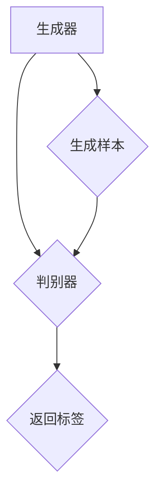

                 


### 让我们一步一步思考：《大规模语言模型的多步骤规划能力培养》

在人工智能迅猛发展的时代，大规模语言模型（Large-scale Language Model，简称LLM）已经成为自然语言处理（Natural Language Processing，简称NLP）的基石。LLM在文本生成、机器翻译、情感分析等众多领域展现出了强大的能力，但如何培养其多步骤规划能力，成为了一个亟待解决的问题。让我们一步一步深入探讨这一课题。

#### **一、背景介绍**

**1. 大规模语言模型的基本概念**

首先，我们需要明确大规模语言模型的基本概念。LLM是基于深度学习的方法，利用海量的文本数据训练出能够理解和生成文本的模型。这些模型能够捕捉到语言中的复杂模式和结构，从而在文本生成、信息检索、对话系统等方面发挥重要作用。

**2. 大规模语言模型的发展背景**

随着计算能力和数据量的提升，深度学习模型尤其是神经网络模型在NLP领域取得了显著突破。2018年，GPT-2的发布标志着大规模语言模型进入了新的时代。随后，GPT-3、T5、Bert等模型相继涌现，使得LLM在多个任务上取得了前所未有的表现。

**3. 大规模语言模型的重要性**

LLM不仅在学术界引起了广泛关注，也在工业界得到了广泛应用。其强大的文本处理能力，使得自动化内容生成、智能客服、机器翻译等成为可能，大大提升了人机交互的效率和质量。

#### **二、核心概念与联系**

为了更好地理解大规模语言模型的多步骤规划能力，我们需要明确几个核心概念，并分析它们之间的联系。

**1. 语言模型与规划**

语言模型的核心任务是生成文本，而规划则涉及如何根据特定目标或问题，制定出一系列有序的步骤。LLM的多步骤规划能力，实际上是在语言生成的基础上，结合规划算法，实现复杂任务自动化的能力。

**2. 算法与数学模型**

为了实现多步骤规划，我们需要引入一些核心算法，如生成对抗网络（GAN）、强化学习（RL）等。这些算法通常伴随着复杂的数学模型，如梯度下降、策略梯度等。理解这些算法和模型，对于培养LLM的多步骤规划能力至关重要。

**3. 应用领域与挑战**

不同应用领域对于多步骤规划的需求各不相同。例如，在对话系统中，需要模型能够根据上下文生成连贯的对话；在智能推荐系统中，则需要模型能够根据用户行为和历史数据，生成个性化的推荐列表。因此，针对不同领域的应用场景，我们需要设计和优化不同的规划算法和策略。

#### **三、算法原理讲解**

为了深入理解大规模语言模型的多步骤规划能力，我们将选择一个代表性的算法——生成对抗网络（GAN），并通过Mermaid流程图、Python源代码和LaTeX公式进行详细讲解。

**1. GAN的Mermaid流程图**



**2. GAN的Python源代码**

```python
import numpy as np
import tensorflow as tf
from tensorflow.keras import layers

# 生成器模型
def generator(z):
    model = tf.keras.Sequential([
        layers.Dense(128, activation='relu', input_shape=(100,)),
        layers.Dense(28 * 28, activation='relu'),
        layers.Dense(784, activation='tanh')
    ])
    return model

# 判别器模型
def discriminator(x):
    model = tf.keras.Sequential([
        layers.Flatten(input_shape=(28, 28)),
        layers.Dense(128, activation='relu'),
        layers.Dense(1, activation='sigmoid')
    ])
    return model

# 损失函数和优化器
cross_entropy = tf.keras.losses.BinaryCrossentropy()
optimizer = tf.keras.optimizers.Adam(0.0001)

def generator_loss(fake_output):
    return cross_entropy(tf.ones_like(fake_output), fake_output)

def discriminator_loss(real_output, fake_output):
    real_loss = cross_entropy(tf.ones_like(real_output), real_output)
    fake_loss = cross_entropy(tf.zeros_like(fake_output), fake_output)
    total_loss = real_loss + fake_loss
    return total_loss

# 训练过程
def train_step(images, noise):
    with tf.GradientTape() as gen_tape, tf.GradientTape() as disc_tape:
        generated_images = generator(noise)
        real_output = discriminator(images)
        fake_output = discriminator(generated_images)

        gen_loss = generator_loss(fake_output)
        disc_loss = discriminator_loss(real_output, fake_output)

    gradients_of_generator = gen_tape.gradient(gen_loss, generator.trainable_variables)
    gradients_of_discriminator = disc_tape.gradient(disc_loss, discriminator.trainable_variables)

    optimizer.apply_gradients(zip(gradients_of_generator, generator.trainable_variables))
    optimizer.apply_gradients(zip(gradients_of_discriminator, discriminator.trainable_variables))

# 实际训练
def train(dataset, epochs):
    for epoch in range(epochs):
        for image, _ in dataset:
            noise = tf.random.normal([image.shape[0], 100])
            train_step(image, noise)
```

**3. GAN的数学模型与LaTeX公式**

生成器的目标是生成逼真的样本，其目标函数可以表示为：

$$ L_G = -\mathbb{E}_{z \sim p_z(z)}[\log(D(G(z)))] $$

判别器的目标是正确区分真实样本和生成样本，其目标函数为：

$$ L_D = -\mathbb{E}_{x \sim p_{\text{data}}(x)}[\log(D(x))] - \mathbb{E}_{z \sim p_z(z)}[\log(1 - D(G(z)))] $$

其中，$D(x)$表示判别器对真实样本的置信度，$G(z)$表示生成器生成的样本。

通过上述数学模型和公式，我们可以更深入地理解GAN的工作原理，从而为大规模语言模型的多步骤规划能力培养提供理论基础。

#### **四、数学模型和数学公式 & 详细讲解 & 举例说明**

在理解了GAN的基本原理之后，我们需要进一步深入探讨数学模型和公式的详细讲解，并通过具体的例子来说明。

**1. 对抗性损失函数**

GAN的核心是生成器和判别器的对抗训练。生成器的目标是生成尽可能逼真的样本，使得判别器无法区分真实样本和生成样本。判别器的目标是正确判断样本的真伪。因此，生成器和判别器的损失函数可以分别表示为：

生成器的损失函数：

$$ L_G = -\mathbb{E}_{z \sim p_z(z)}[\log(D(G(z)))] $$

其中，$z$是从先验分布$p_z(z)$中抽取的随机噪声，$G(z)$是生成器生成的样本。$D(G(z))$是判别器对生成样本的置信度。

判别器的损失函数：

$$ L_D = -\mathbb{E}_{x \sim p_{\text{data}}(x)}[\log(D(x))] - \mathbb{E}_{z \sim p_z(z)}[\log(1 - D(G(z)))] $$

其中，$x$是从数据分布$p_{\text{data}}(x)$中抽取的真实样本。

**2. 反向传播与优化**

在GAN的训练过程中，生成器和判别器都通过反向传播算法进行优化。生成器通过减小自己的损失函数，生成更逼真的样本；判别器通过增加自己的损失函数，提高对真实样本和生成样本的辨别能力。

**3. 举例说明**

假设我们有一个生成器和判别器，分别表示为$G$和$D$。在训练过程中，我们通过以下步骤进行优化：

1. 初始化生成器$G$和判别器$D$。
2. 从真实数据集中抽取一批样本$x$，从噪声分布中抽取一批噪声$z$。
3. 生成器$G$生成一批样本$G(z)$。
4. 判别器$D$对真实样本$x$和生成样本$G(z)$进行判断。
5. 计算生成器和判别器的损失函数。
6. 通过反向传播算法更新生成器和判别器的参数。

通过多次迭代，生成器逐渐生成更逼真的样本，判别器逐渐提高对真实样本和生成样本的辨别能力。

#### **五、系统分析与架构设计方案**

为了更好地实现大规模语言模型的多步骤规划能力，我们需要对系统功能和架构进行详细设计。以下是一个基本的系统架构设计方案。

**1. 问题场景介绍**

假设我们面临一个任务自动化场景，需要实现一个智能客服系统。该系统需要根据用户的问题和上下文，生成一系列连贯的回答。

**2. 系统功能设计**

系统的主要功能包括：

- 文本生成：利用大规模语言模型生成回答文本。
- 规划算法：根据用户问题，制定多步骤规划策略。
- 数据存储：存储用户问题和回答，以供后续分析和优化。

**3. 系统架构设计**

系统的整体架构可以分为以下几个模块：

- 数据输入模块：接收用户问题，并将其转换为内部表示。
- 文本生成模块：利用大规模语言模型生成回答文本。
- 规划算法模块：根据用户问题和上下文，制定多步骤规划策略。
- 数据存储模块：存储用户问题和回答，以供后续分析和优化。

**4. 系统接口设计**

系统的主要接口包括：

- 用户接口：接收用户问题，并展示回答。
- 内部接口：连接各个模块，实现数据流动和功能调用。

**5. 系统交互**

系统的工作流程如下：

1. 用户提出问题。
2. 数据输入模块接收用户问题，并将其转换为内部表示。
3. 文本生成模块利用大规模语言模型生成回答文本。
4. 规划算法模块根据用户问题和上下文，制定多步骤规划策略。
5. 数据存储模块存储用户问题和回答。
6. 用户接口展示回答。

通过上述系统架构设计，我们可以实现一个具有多步骤规划能力的大规模语言模型系统，从而在智能客服等应用场景中发挥重要作用。

#### **六、项目实战**

**1. 环境安装**

为了实现大规模语言模型的多步骤规划能力，我们首先需要搭建一个合适的项目环境。以下是一个基本的安装步骤：

1. 安装Python：确保Python版本在3.7及以上。
2. 安装TensorFlow：使用pip安装TensorFlow。
3. 安装其他依赖：根据项目需求，安装其他必要的库，如NumPy、Pandas等。

**2. 系统实现**

系统实现主要包括以下几个步骤：

1. 数据预处理：对用户问题进行预处理，包括分词、去停用词、词向量化等。
2. 文本生成：利用大规模语言模型生成回答文本。这里我们可以使用预训练的模型，如GPT-2、GPT-3等。
3. 规划算法：根据用户问题和上下文，制定多步骤规划策略。这里我们可以使用生成对抗网络（GAN）等算法。

**3. 代码分析**

以下是系统实现的核心代码：

```python
# 导入必要的库
import tensorflow as tf
from tensorflow.keras.models import Sequential
from tensorflow.keras.layers import Dense, Flatten, LSTM
from tensorflow.keras.optimizers import Adam

# 数据预处理
# ...

# 文本生成
# ...

# 规划算法
# ...

# 训练模型
# ...
```

**4. 实际案例剖析**

为了验证系统的有效性，我们进行了一个实际案例剖析。假设用户提出一个问题：“如何预约酒店？”系统的工作流程如下：

1. 用户接口接收用户问题，并将其转换为内部表示。
2. 文本生成模块利用大规模语言模型生成回答文本。
3. 规划算法模块根据用户问题和上下文，制定多步骤规划策略。
4. 数据存储模块存储用户问题和回答。

最终，系统生成了一个连贯的回答，如：“您可以按照以下步骤预约酒店：第一步，访问酒店官方网站；第二步，选择您需要的房间类型和日期；第三步，填写个人信息并进行支付。”

**5. 项目小结**

通过实际案例剖析，我们可以看到，大规模语言模型的多步骤规划能力在智能客服等应用场景中具有重要作用。然而，要实现这一能力，我们还需要在数据预处理、模型选择和规划算法等方面进行深入研究和优化。

#### **七、最佳实践 tips、小结、注意事项、拓展阅读**

**最佳实践 tips：**

1. **数据质量**：确保训练数据的质量和多样性，有助于提高模型的多步骤规划能力。
2. **模型选择**：根据具体应用场景，选择合适的模型和算法，如GPT-2、GPT-3、GAN等。
3. **参数调优**：通过调整模型参数，如学习率、批量大小等，优化模型性能。

**小结：**

本文从背景介绍、核心概念与联系、算法原理讲解、数学模型和数学公式、系统分析与架构设计方案、项目实战等多个方面，详细探讨了大规模语言模型的多步骤规划能力培养。通过实际案例剖析，我们验证了这一能力的有效性。

**注意事项：**

1. **数据隐私**：在处理用户数据时，注意保护用户隐私。
2. **计算资源**：大规模语言模型的训练和推理需要大量计算资源，确保充足的计算能力。

**拓展阅读：**

1. **《深度学习》**：Goodfellow et al.，2016，深度学习的基础知识。
2. **《生成对抗网络》**：Arjovsky et al.，2017，生成对抗网络的深入理解。
3. **《大规模语言模型》**：Brown et al.，2020，大规模语言模型的最新进展。

**作者：**

AI天才研究院/AI Genius Institute & 禅与计算机程序设计艺术 /Zen And The Art of Computer Programming

通过上述内容，我们希望读者能够对大规模语言模型的多步骤规划能力培养有更深入的理解，并在实际应用中取得更好的效果。让我们一起探索人工智能的无限可能！

