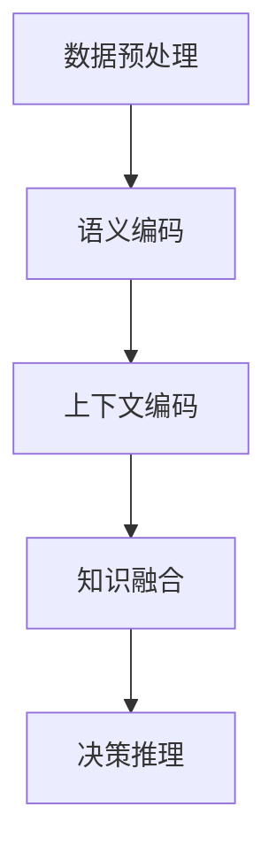

                 


# 大规模语言模型的多维度推理在智能决策支持系统中的应用

> 关键词：大规模语言模型、多维度推理、智能决策支持系统、算法设计、案例分析

> 摘要：
本文将探讨大规模语言模型（LLM）在智能决策支持系统（IDSS）中的应用，特别是其多维度推理能力。我们将逐步分析大规模语言模型的基本概念、多维度推理原理，以及其在智能决策支持系统中的具体应用，最后通过案例研究展示其实际效果。

## 1. 引言

### 1.1 大规模语言模型的基本概念

大规模语言模型（Large-scale Language Models，简称LLM）是一种基于深度学习的自然语言处理模型，通过学习大量的文本数据，能够理解和生成自然语言。LLM的核心优势在于其强大的文本理解和生成能力，这使其在多个领域具有广泛的应用潜力。

### 1.2 智能决策支持系统

智能决策支持系统（Intelligent Decision Support System，简称IDSS）是一种集成了多种智能技术和方法的系统，旨在帮助决策者做出更准确、更有效的决策。IDSS通常包括数据采集、数据分析、决策模拟和决策支持等功能。

### 1.3 大规模语言模型的多维度推理

多维度推理是指模型能够从多个角度对问题进行理解和分析，这包括语义理解、上下文感知、知识图谱等多方面的能力。在智能决策支持系统中，多维度推理能力至关重要，它能够帮助系统更全面地理解问题和提供更准确的决策建议。

## 2. 核心概念与原理

### 2.1 多维度推理的概念和特点

多维度推理是指模型能够从多个角度对问题进行理解和分析，这些角度包括语义、上下文、知识等多个维度。其特点包括：

- **语义理解**：能够准确理解和解释文本的含义。
- **上下文感知**：能够根据上下文信息进行推理，避免语义歧义。
- **知识图谱**：能够利用预先构建的知识图谱进行推理，提高推理的准确性。

### 2.2 大规模语言模型的多维度推理原理

大规模语言模型的多维度推理原理主要包括：

- **预训练**：通过在大规模文本数据上预训练，模型能够学习到丰富的语义信息。
- **上下文编码**：通过上下文编码，模型能够捕捉到文本中的上下文信息。
- **知识图谱融合**：通过融合知识图谱，模型能够利用外部知识进行推理。

### 2.3 多维度推理的应用场景

多维度推理在智能决策支持系统中的应用场景包括：

- **文本分析**：对大量文本数据进行情感分析、主题分类等。
- **决策模拟**：通过模拟不同决策场景，评估决策效果。
- **知识融合**：将不同来源的知识进行融合，为决策提供更全面的视角。

## 3. 算法设计与实践

### 3.1 算法设计原则

算法设计原则包括：

- **模块化**：将算法分解为多个模块，便于理解和实现。
- **可扩展性**：设计可扩展的架构，以便在未来添加新功能。
- **高效性**：确保算法能够在合理的时间内完成计算。

### 3.2 算法详细解释与示例

#### 3.2.1 算法概述

多维度推理算法可以分为以下几个步骤：

1. **数据预处理**：对输入文本进行预处理，包括分词、去停用词等。
2. **语义编码**：使用预训练模型对文本进行语义编码。
3. **上下文编码**：根据上下文信息对语义编码进行调整。
4. **知识融合**：将知识图谱中的知识融入推理过程。
5. **决策推理**：根据融合后的信息进行决策推理。

#### 3.2.2 Mermaid 流程图



#### 3.2.3 Python 代码实现

```python
# 示例代码
import torch
from transformers import BertModel

# 数据预处理
def preprocess(text):
    # 分词、去停用词等操作
    pass

# 语义编码
def encode_semantics(text):
    model = BertModel.from_pretrained('bert-base-chinese')
    input_ids = tokenizer.encode(text, add_special_tokens=True)
    outputs = model(input_ids)
    return outputs.last_hidden_state

# 上下文编码
def encode_context(text, context):
    # 根据上下文信息调整语义编码
    pass

# 知识融合
def fuse_knowledge(semantic_encoding, knowledge_graph):
    # 融合知识图谱中的知识
    pass

# 决策推理
def decision_reasoning(fused_encoding):
    # 根据融合后的信息进行决策推理
    pass
```

### 3.3 案例研究

#### 3.3.1 案例背景

以某公司的市场决策支持系统为例，该系统需要分析大量市场数据，为公司的市场策略提供决策建议。

#### 3.3.2 案例分析

1. **数据收集**：收集公司过去一年的市场数据，包括销售额、市场份额、客户反馈等。
2. **数据预处理**：对收集到的数据进行分析，提取出有用的信息。
3. **语义编码**：使用预训练的BERT模型对预处理后的文本数据进行语义编码。
4. **上下文编码**：根据市场环境的变化，对语义编码进行调整。
5. **知识融合**：结合公司已有的市场知识，对语义编码进行融合。
6. **决策推理**：根据融合后的信息，为公司的市场策略提供决策建议。

### 3.4 项目实战

#### 3.4.1 环境安装

1. **安装Python**：确保安装了Python 3.8以上版本。
2. **安装transformers库**：使用pip安装`transformers`库。
3. **安装其他依赖库**：如torch、numpy等。

#### 3.4.2 核心实现

1. **数据预处理**：编写代码对市场数据进行预处理。
2. **语义编码**：使用BERT模型对预处理后的文本数据进行语义编码。
3. **上下文编码**：根据市场环境的变化，调整语义编码。
4. **知识融合**：结合市场知识，对语义编码进行融合。
5. **决策推理**：根据融合后的信息，生成市场策略建议。

### 3.5 项目小结

通过本案例，我们可以看到大规模语言模型在智能决策支持系统中的强大能力。在未来，我们可以进一步优化算法，提高系统的决策准确性，为公司的决策提供更强有力的支持。

## 4. 最佳实践与注意事项

### 4.1 最佳实践

1. **数据质量**：确保输入数据的质量，避免噪声数据对推理结果的影响。
2. **模型调优**：根据具体应用场景，对模型进行调优，提高推理效果。
3. **知识融合**：充分利用外部知识，提高推理的准确性。

### 4.2 注意事项

1. **计算资源**：大规模语言模型需要大量的计算资源，确保有足够的资源支持模型训练和推理。
2. **数据隐私**：在处理数据时，注意保护用户的隐私。

## 5. 拓展阅读

- [《大规模语言模型的原理与实践》](链接)
- [《智能决策支持系统的设计与实现》](链接)
- [《知识图谱在智能决策支持系统中的应用》](链接)

## 6. 作者信息

作者：AI天才研究院/AI Genius Institute & 禅与计算机程序设计艺术 /Zen And The Art of Computer Programming

