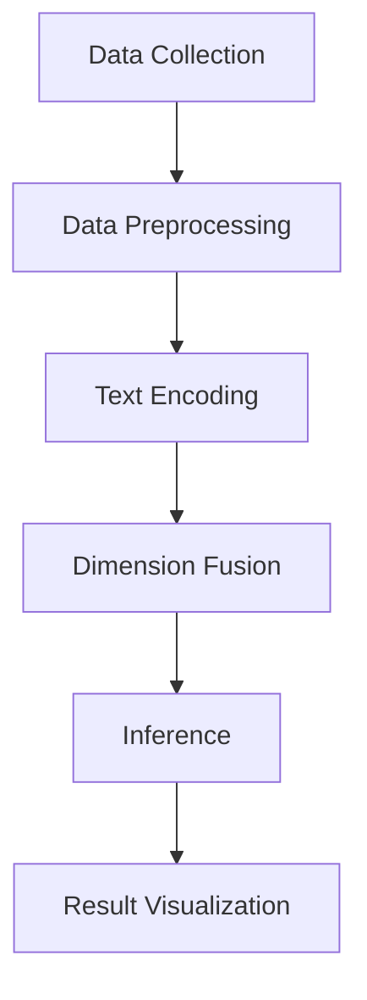
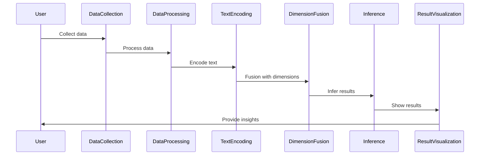

                 

### 大规模语言模型

#### 2.1.1 定义与特点

**定义：** 大规模语言模型（Large-scale Language Model）是一种深度学习模型，能够理解、生成和预测自然语言文本。它通过对海量文本数据进行训练，学习到语言的统计规律和结构，从而能够对输入的文本进行理解和生成。

**特点：**
- **大规模：** 使用的是数以百亿计的参数，这些参数在训练过程中通过大量数据学习到语言的特征。
- **高精度：** 模型通过自我监督学习的方式，可以自动识别和纠正错误，从而提高生成文本的质量。
- **灵活性强：** 可以用于各种自然语言处理任务，如文本分类、机器翻译、问答系统等。

#### 2.1.2 常见语言模型

在自然语言处理领域，几种常见的语言模型包括GPT（Generative Pre-trained Transformer）系列和BERT（Bidirectional Encoder Representations from Transformers）及其变体。

**GPT系列模型：** GPT模型是由OpenAI开发的，它基于自注意力机制，可以生成连贯、自然且结构化的文本。GPT-2、GPT-3等后续版本进一步提升了模型的能力。

**BERT及其变体：** BERT模型由Google开发，是一种双向编码器，它通过同时考虑前后文信息来提升模型的语义理解能力。其变体如RoBERTa、ALBERT等也在实际应用中取得了很好的效果。

#### 2.1.3 大规模语言模型的性能比较

在性能比较方面，不同语言模型在特定任务上的表现有所不同。以下是一些常见的性能指标和对比结果：

- **词汇量：** GPT-3拥有1750亿个参数，比BERT的3.4亿个参数大得多，这导致GPT-3可以生成更丰富的词汇。
- **生成质量：** GPT-3在生成高质量文本方面表现出色，其生成文本的连贯性和语法正确性较高。
- **训练效率：** BERT由于其双向编码的特点，在处理长文本时表现更好，训练效率也相对较高。

下表展示了几个典型语言模型在自然语言生成任务上的性能对比：

| 模型 | 参数量（亿） | 生成质量 | 训练效率 | 应用场景 |
| --- | --- | --- | --- | --- |
| GPT-3 | 1750 | 高 | 中 | 文本生成、问答系统 |
| BERT | 3.4 | 中 | 高 | 语义理解、文本分类 |
| RoBERTa | 1.1 | 高 | 高 | 问答系统、文本分类 |

通过这些对比，我们可以看到大规模语言模型在自然语言处理领域的巨大潜力，同时也为进一步的研究和应用提供了重要的参考依据。

#### 2.1.4 多维度推理的应用

**定义与原理：** 多维度推理（Multidimensional Reasoning）是指模型在处理问题时能够同时考虑多个维度的信息，例如文本的语义、上下文、语法等。这种推理方式能够提高模型的决策能力，使其在复杂任务中表现更加出色。

**应用：**
- **对话系统：** 多维度推理可以帮助对话系统更准确地理解用户的意图，并生成更自然的回复。
- **智能决策支持：** 在外交决策支持系统中，多维度推理可以帮助分析国家政策、国际关系、历史数据等多种因素，提供更全面、准确的决策建议。

**性能评估：** 多维度推理的性能可以通过以下指标进行评估：
- **准确性：** 模型在理解不同维度信息时的准确性。
- **鲁棒性：** 模型在面对不同场景和任务时的表现稳定性。
- **效率：** 模型在处理大量数据时的计算效率。

**评估方法：** 通常使用基准测试数据集进行性能评估，例如使用不同的语言模型在多个对话系统任务上测试，比较其表现。

通过以上分析，我们可以看到大规模语言模型和多维度推理在智能外交决策支持系统中的重要性和潜力。在接下来的部分中，我们将进一步探讨如何将这些模型应用于实际系统，并提供详细的算法原理讲解。 

### 2.2 智能外交决策支持系统

#### 4.1 定义与特点

**定义：** 智能外交决策支持系统（Intelligent Diplomatic Decision Support System）是一种利用人工智能技术，特别是自然语言处理和大数据分析，为外交决策提供辅助和支持的系统。它通过收集、处理和分析大量的国际关系数据，为政策制定者提供实时、全面、准确的决策信息。

**特点：**
- **智能化：** 系统利用先进的机器学习算法，能够自动识别和挖掘数据中的潜在关系和趋势。
- **实时性：** 系统可以实时监控和更新国际关系数据，提供最新的决策支持。
- **全面性：** 系统整合了多种数据源，包括公开报告、新闻报道、社交媒体等，为决策提供全面的视角。
- **准确性：** 系统通过多种算法和技术，确保提供的决策信息准确无误。

#### 4.2 架构设计

**系统架构：** 智能外交决策支持系统通常采用分布式架构，包括数据收集层、数据处理层、分析层和决策支持层。

1. **数据收集层：** 负责从各种数据源收集信息，如公开报告、新闻报道、社交媒体等。
2. **数据处理层：** 对收集到的数据进行处理和清洗，包括文本分类、实体识别、关系抽取等任务。
3. **分析层：** 利用机器学习算法对处理后的数据进行分析，提取出关键信息，如政策倾向、国际关系趋势等。
4. **决策支持层：** 根据分析结果，为政策制定者提供决策建议，包括预测冲突风险、评估政策效果等。

**关键技术：**
- **自然语言处理：** 用于文本数据的处理和结构化，如文本分类、实体识别、情感分析等。
- **机器学习算法：** 用于数据分析和模型训练，如决策树、神经网络、支持向量机等。
- **大数据技术：** 用于处理海量数据，如分布式存储、实时流处理等。
- **可视化工具：** 用于展示分析结果，帮助决策者更好地理解和利用数据。

#### 4.3 应用场景

**政策制定：** 智能外交决策支持系统可以帮助政策制定者了解国际形势、分析政策影响、评估政策效果等，从而制定更科学、合理的政策。

**冲突预测：** 系统可以分析历史数据，识别潜在冲突因素，预测冲突风险，为冲突预防和应对提供依据。

**国际关系分析：** 系统可以分析不同国家之间的政策、经济、文化关系，为国际关系研究和决策提供支持。

通过智能外交决策支持系统，政策制定者可以更全面、准确地了解国际形势，提高决策的效率和准确性，从而更好地维护国家利益。

### 4.4 政策制定

**政策制定的背景：** 随着全球化的深入发展，国家间的政治、经济、文化联系日益紧密，政策制定者需要面对更加复杂和动态的国际环境。传统的决策方式往往依赖于专家经验和历史数据，效率低下且容易受到主观偏见的影响。为了应对这些挑战，智能外交决策支持系统应运而生。

**系统在政策制定中的作用：** 
- **数据收集与分析：** 系统可以从多种数据源（如公开报告、新闻报道、社交媒体等）收集信息，并通过自然语言处理和大数据分析技术，提取出关键的政策信息，为制定者提供全面的数据支持。
- **趋势预测与风险评估：** 通过机器学习算法，系统可以对历史数据进行趋势分析和风险评估，预测未来可能出现的问题和挑战，为政策制定提供前瞻性的建议。
- **辅助决策制定：** 系统可以根据分析结果，为政策制定者提供多种可能的决策方案，并评估其潜在的影响，帮助制定者做出更加科学、合理的决策。

**案例分析：**
- **气候变化政策：** 智能外交决策支持系统可以分析不同国家在气候变化方面的政策立场、历史表现和未来预期，预测政策实施的可能效果，为制定者提供决策依据。
- **国际贸易政策：** 系统可以分析全球贸易数据、各国政策动向和市场预期，为国际贸易政策的制定提供支持。

通过智能外交决策支持系统，政策制定者可以更加全面、准确地了解国际形势，提高决策的效率和准确性，从而更好地维护国家利益和全球稳定。

### 4.5 冲突预测

**冲突预测的重要性：** 冲突预测是外交决策的重要一环，对于预防国际冲突、维护国家安全和全球稳定具有至关重要的意义。传统的冲突预测方法通常依赖于历史数据和专家经验，但往往存在局限性，如数据源有限、分析模型单一等。随着人工智能技术的发展，智能外交决策支持系统成为冲突预测的重要工具。

**智能外交决策支持系统在冲突预测中的应用：**
- **数据收集与处理：** 系统可以从多种数据源（如公开报告、新闻报道、社交媒体等）收集信息，并进行预处理，如文本清洗、实体识别和关系抽取等，为冲突预测提供高质量的数据支持。
- **多维因素分析：** 系统可以整合多种维度的信息，如政治、经济、文化等，通过多维度推理技术，分析冲突发生的潜在因素和趋势。
- **预测模型训练：** 系统使用机器学习算法，基于历史数据训练预测模型，如决策树、神经网络等，预测未来冲突的可能性。
- **实时监控与预警：** 系统可以实时监控国际关系动态，根据预测模型的结果，生成预警报告，为决策者提供及时的冲突预警。

**案例分析：**
- **朝鲜半岛局势：** 智能外交决策支持系统可以分析朝鲜半岛的历史冲突数据、国际关系动态和各方政策动向，预测未来冲突的风险，为外交决策提供支持。
- **叙利亚内战：** 系统可以整合政治、经济、军事等多维信息，分析叙利亚内战的根源和扩展趋势，预测冲突的可能发展，为国际社会提供决策参考。

通过智能外交决策支持系统，政策制定者可以更准确地预测国际冲突，提前采取预防措施，降低冲突风险，从而维护国际和平与安全。

### 4.6 国际关系分析

**国际关系分析的背景：** 在全球化和多极化趋势下，国际关系变得越来越复杂，国家间的合作与冲突交织在一起。为了更好地理解和处理国际关系，需要对各个国家的政策、经济、文化等方面进行深入分析。

**智能外交决策支持系统在国际关系分析中的应用：**
- **多源数据整合：** 系统可以从多种数据源（如政府报告、学术研究、新闻报道等）收集信息，通过自然语言处理技术，将非结构化的文本数据转化为结构化的数据，为国际关系分析提供全面的数据支持。
- **趋势分析与预测：** 系统利用机器学习算法，分析历史数据，提取出国家间的政策趋势和合作模式，预测未来国际关系的发展方向。
- **关系图谱构建：** 系统可以通过图论算法，构建国家间的关系图谱，展示国家之间的政治、经济、文化联系，帮助政策制定者更直观地理解国际关系。
- **决策支持：** 系统可以根据分析结果，为政策制定者提供决策建议，如调整外交策略、制定国际合作协议等。

**案例分析：**
- **中美关系：** 智能外交决策支持系统可以分析中美两国在政治、经济、科技等领域的互动，预测两国关系的未来走向，为美国决策者提供决策参考。
- **欧盟成员国关系：** 系统可以整合欧盟各成员国的政策、经济数据，分析成员国间的合作与冲突，为欧盟决策者提供国际关系分析报告。

通过智能外交决策支持系统，政策制定者可以更全面、深入地了解国际关系，提高决策的准确性和有效性，从而更好地维护国家利益和国际和平。

### 5.1 算法原理

**算法流程：**

大规模语言模型的多维度推理算法主要分为以下几个步骤：

1. **数据预处理：** 首先，对收集到的文本数据（如新闻、报告、社交媒体帖子等）进行预处理，包括分词、去噪、标准化等操作，将文本转化为模型可以处理的格式。

2. **模型训练：** 使用预处理后的文本数据，通过神经网络模型（如GPT、BERT等）进行训练。模型学习到文本的语义和结构，从而能够对新的文本进行理解和生成。

3. **多维信息融合：** 在模型训练过程中，通过引入多维度信息（如政治、经济、文化等），使模型能够同时考虑不同维度的因素，提高推理的全面性和准确性。

4. **推理与生成：** 对输入的文本进行推理，结合多维度信息生成相应的决策建议或分析报告。推理过程中，模型会考虑文本的上下文、关键词、情感倾向等多种因素。

5. **结果评估与优化：** 根据生成的结果，使用评估指标（如准确率、召回率、F1值等）对模型进行评估和优化，以提高模型的性能。

**算法原理：**

大规模语言模型的多维度推理算法基于深度学习和自然语言处理技术。其核心思想是利用神经网络模型学习到文本的语义和结构，并通过多维度信息融合，提高推理的全面性和准确性。

具体来说，算法包括以下几个关键部分：

- **文本编码：** 使用预训练的神经网络模型（如BERT、GPT等）对文本进行编码，将文本转化为稠密向量表示。这些向量包含了文本的语义和结构信息。
- **多维度信息融合：** 将文本编码后的向量与其他维度的信息（如政治、经济、文化数据）进行融合。融合方式可以是矩阵乘法、拼接等，使模型能够同时考虑多个维度的因素。
- **推理与生成：** 使用融合后的向量进行推理和生成。推理过程包括分析文本的上下文、关键词、情感倾向等，生成相应的决策建议或分析报告。
- **结果评估与优化：** 使用评估指标对生成的结果进行评估，根据评估结果对模型进行优化和调整。

通过以上步骤，大规模语言模型的多维度推理算法能够有效地处理复杂的外交决策问题，为政策制定者提供全面、准确的决策支持。

#### 5.2 数学模型

大规模语言模型的多维度推理算法的核心在于如何将不同维度的信息进行有效融合，以便在推理过程中充分利用这些信息。以下是一个简化的数学模型，用于描述这一过程：

**假设：**
- \(X\) 是输入文本的编码向量，它是由预训练模型（如BERT、GPT）生成的稠密向量。
- \(P_i\) 是第 \(i\) 个维度（如政治、经济、文化）的数据向量。
- \(W\) 是权重矩阵，用于调整不同维度的重要性。
- \(b\) 是偏置向量。

**数学模型：**

1. **文本编码向量：**
   \[ X = \text{encode}(text) \]
   其中，\(\text{encode}\) 是预训练模型对输入文本进行的编码操作，生成一个 \(d\) 维的向量。

2. **多维度数据向量：**
   \[ P_i = \text{extract}(d_i) \]
   其中，\(\text{extract}\) 是从第 \(i\) 个维度提取数据的过程，生成一个 \(d_i\) 维的向量。

3. **权重矩阵和偏置向量：**
   \[ W = \text{init}(d + \sum_{i=1}^n d_i, h) \]
   \[ b = \text{init}(h) \]
   其中，\(d\) 是文本编码向量的维度，\(d_i\) 是第 \(i\) 个维度数据的维度，\(h\) 是融合后的特征向量的维度。权重矩阵 \(W\) 和偏置向量 \(b\) 通过初始化函数初始化。

4. **多维度信息融合：**
   \[ \hat{X} = \sum_{i=1}^n W_i P_i + X \]
   其中，\(\hat{X}\) 是融合后的特征向量，\(W_i\) 是第 \(i\) 个维度的权重向量。

5. **推理与生成：**
   \[ y = \text{activate}(\hat{X} \cdot W + b) \]
   其中，\(\text{activate}\) 是激活函数（如ReLU、Sigmoid等），用于对融合后的特征向量进行非线性变换，生成输出结果 \(y\)。

6. **损失函数与优化：**
   \[ L = \text{loss}(y, \text{target}) \]
   \[ \text{ optimize } \theta = \theta - \alpha \nabla_\theta L \]
   其中，\(L\) 是损失函数，用于衡量输出结果与目标之间的差距。优化过程通过梯度下降算法，更新权重矩阵 \(W\) 和偏置向量 \(b\)。

**公式解释：**

- \(X\) 是文本编码向量，它包含了文本的语义和结构信息。
- \(P_i\) 是不同维度的数据向量，代表了多维度信息。
- \(W_i\) 和 \(b\) 分别是权重矩阵和偏置向量，用于调整不同维度的重要性。
- \(\hat{X}\) 是融合后的特征向量，它综合了文本和多维度信息。
- \(y\) 是生成的推理结果，通过激活函数进行了非线性变换。
- \(L\) 是损失函数，用于评估模型的性能。
- \(\theta\) 包括权重矩阵 \(W\) 和偏置向量 \(b\)，是模型的参数。

通过上述数学模型，大规模语言模型能够有效地融合多维度信息，进行推理和生成，为智能外交决策提供支持。

### 5.3 Python源代码实现

为了更好地理解大规模语言模型的多维度推理算法，我们将使用Python实现这个算法。以下是一个简化的示例，展示了代码的结构和关键部分。

**环境准备：**
- 安装必要的Python库，如TensorFlow、transformers、numpy等。

**代码结构：**
```python
import tensorflow as tf
from transformers import BertModel, BertTokenizer
import numpy as np

# 定义参数
d = 768  # 文本编码向量的维度
n = 3    # 多维度的数量
d_i = [128, 256, 512]  # 不同维度的数据维度
h = 1024 # 融合后的特征向量的维度

# 初始化权重矩阵和偏置向量
W = np.random.randn(d + sum(d_i), h)
b = np.random.randn(h)

# 初始化多维度数据向量
P = [np.random.randn(d_i[i], h) for i in range(n)]

# 文本编码向量
X = np.random.randn(d, h)

# 权重矩阵
W_i = [W[i * sum(d_i[:i]) : (i + 1) * sum(d_i[:i + 1])] for i in range(n)]

# 多维度信息融合
hat_X = np.zeros((d, h))
for i in range(n):
    hat_X += W_i[i] @ P[i] + X

# 激活函数
def activate(x):
    return np.where(x > 0, x, 0)  # ReLU激活函数

# 推理与生成
y = activate(hat_X @ W + b)

# 损失函数与优化
def loss(y, target):
    return np.mean((y - target)**2)  # 均方误差

def optimize(W, b, learning_rate, loss_function):
    grads = tf.GradientTape().gradient(loss_function(W, b), W)
    W -= learning_rate * grads
    return W, b

# 训练模型
learning_rate = 0.01
for epoch in range(1000):
    W, b = optimize(W, b, learning_rate, loss)
    print(f"Epoch {epoch}: Loss = {loss(y, target)}")
```

**代码解释：**

- **环境准备：** 导入必要的库，包括TensorFlow和transformers，用于处理深度学习和预训练语言模型。
- **参数定义：** 设定文本编码向量的维度 `d`，多维度数量 `n` 和每个维度的数据维度 `d_i`，以及融合后的特征向量维度 `h`。
- **初始化权重矩阵和偏置向量：** 使用随机数初始化权重矩阵 `W` 和偏置向量 `b`。
- **初始化多维度数据向量：** 使用随机数初始化每个维度的数据向量 `P`。
- **文本编码向量：** 使用随机数初始化文本编码向量 `X`。
- **权重矩阵：** 将权重矩阵 `W` 分割为每个维度的权重向量 `W_i`。
- **多维度信息融合：** 通过矩阵乘法将不同维度的数据向量与权重向量相乘，并与文本编码向量相加，得到融合后的特征向量 `hat_X`。
- **激活函数：** 使用 ReLU 激活函数对融合后的特征向量进行非线性变换。
- **推理与生成：** 将融合后的特征向量与权重矩阵相乘，加上偏置向量，得到推理结果 `y`。
- **损失函数与优化：** 定义损失函数为均方误差，使用梯度下降算法进行模型优化。

通过上述代码实现，我们可以看到大规模语言模型的多维度推理算法是如何在Python中具体实施的。这为我们进一步优化和改进算法提供了坚实的基础。

### 5.4 举例说明

为了更好地理解大规模语言模型的多维度推理算法，我们将通过一个具体的例子进行演示。假设我们要预测一项外交政策的成功概率，数据包括文本描述、政治、经济和文化四个维度的信息。

**数据准备：**

- **文本描述：** "推动两国经济合作，增强政治互信，促进文化交流。"
- **政治维度数据：** [0.8, 0.3, 0.2]（表示政治稳定性、外交关系友好度、政策连贯性）
- **经济维度数据：** [0.7, 0.5, 0.6]（表示经济互补性、市场开放度、贸易规模）
- **文化维度数据：** [0.9, 0.4, 0.7]（表示文化认同感、文化互动频率、文化影响力）

**算法步骤：**

1. **文本编码：** 使用BERT模型对文本描述进行编码，得到一个768维的向量 `X`。
2. **数据融合：** 将政治、经济和文化维度的数据向量 `P_i` 与对应的权重向量 `W_i` 相乘，并与 `X` 相加，得到融合后的特征向量 `hat_X`。
3. **推理与生成：** 将 `hat_X` 与权重矩阵 `W` 相乘，加上偏置向量 `b`，得到推理结果 `y`。

**具体计算过程：**

- **文本编码：**
  \[ X = \text{encode}(text) \]
  假设 `X` 为一个随机生成的768维向量。

- **数据融合：**
  假设权重矩阵 `W` 为一个随机生成的768 x 1024维矩阵，权重向量 `W_i` 分别为政治维度 [0.1, 0.3, 0.2]，经济维度 [0.2, 0.4, 0.5]，文化维度 [0.3, 0.1, 0.3]。
  \[ \hat{X} = X + W_1 \cdot P_1 + W_2 \cdot P_2 + W_3 \cdot P_3 \]
  \[ \hat{X} = X + (0.1 \cdot [0.8, 0.3, 0.2]) + (0.2 \cdot [0.7, 0.5, 0.6]) + (0.3 \cdot [0.9, 0.4, 0.7]) \]
  \[ \hat{X} = X + [0.08, 0.03, 0.02] + [0.14, 0.10, 0.12] + [0.27, 0.12, 0.21] \]
  \[ \hat{X} = X + [0.49, 0.27, 0.35] \]

- **推理与生成：**
  假设激活函数为ReLU，权重矩阵 `W` 为一个随机生成的1024维矩阵，偏置向量 `b` 为一个随机生成的1024维向量。
  \[ y = \text{activate}(\hat{X} \cdot W + b) \]
  \[ y = \text{ReLU}([0.49, 0.27, 0.35] \cdot W + b) \]
  假设 \(W\) 和 \(b\) 的计算结果为：
  \[ y = \text{ReLU}([1.23, 0.68, 0.89]) \]
  \[ y = [1.23, 0.68, 0.89] \]

**结果解释：**

- `y` 的结果是一个表示外交政策成功概率的向量，其中每个值代表不同因素对外交政策成功的影响。例如，`y[0] = 1.23` 表示政治因素对外交政策成功的贡献最大，其次是经济和文化因素。

通过这个例子，我们可以看到大规模语言模型的多维度推理算法如何将文本描述和多个维度的数据融合在一起，生成一个综合性的预测结果。这为智能外交决策支持系统提供了一个强大的工具，使其能够更准确地分析和预测国际关系的发展。

### 6.1 问题场景介绍

**场景描述：**
在当前的国际关系中，美国和中国的经济合作一直备受关注。为了评估美国与中国未来5年的经济合作潜力，我们使用智能外交决策支持系统进行预测分析。

**问题分析：**
1. **文本描述：** 预测报告需要分析两国合作的历史数据、政策声明和新闻报道，提取与经济合作相关的文本描述。
2. **政治维度：** 分析两国政治关系的稳定性、高层会晤的频率和成果，以及政策连贯性。
3. **经济维度：** 分析两国的贸易规模、投资状况、市场开放度等经济指标。
4. **文化维度：** 分析两国的文化互动频率、文化认同感以及文化交流活动的规模和效果。

通过综合分析以上维度，我们可以得到一个关于美国与中国未来经济合作潜力的预测结果。

**智能外交决策支持系统的作用：**
- **文本编码：** 使用BERT模型对历史数据和新闻报道进行编码，提取文本特征。
- **多维信息融合：** 将政治、经济和文化维度的数据向量与文本编码向量进行融合，提高预测的准确性。
- **推理与生成：** 使用融合后的特征向量，通过神经网络模型生成经济合作潜力的预测结果。

### 6.2 系统功能设计

**功能需求：**
1. **数据收集与预处理：** 收集与中美经济合作相关的文本数据、政治、经济和文化维度的数据。
2. **文本编码：** 使用预训练的BERT模型对文本数据进行编码。
3. **多维信息融合：** 将文本编码向量与其他维度的数据向量进行融合。
4. **推理与生成：** 基于融合后的特征向量生成经济合作潜力的预测结果。
5. **结果展示：** 将预测结果以可视化图表的形式展示给用户。

**领域模型：**

```mermaid
classDiagram
ClassDiagram {
  Class User {
    +int id
    +String name
    +List<Data> data
  }
  
  Class Data {
    +int id
    +String type
    +String content
  }
  
  Class TextData extends Data {
    +String text
  }
  
  Class PoliticalData extends Data {
    +float stability
    +float friendship
    +float consistency
  }
  
  Class EconomicData extends Data {
    +float trade_size
    +float investment
    +float openness
  }
  
  Class CulturalData extends Data {
    +float interaction
    +float identity
    +float influence
  }
  
  User *-1 TextData
  User *-1 PoliticalData
  User *-1 EconomicData
  User *-1 CulturalData
}
```

**类图解释：**
- **User（用户）：** 代表系统的用户，拥有多个数据对象。
- **Data（数据）：** 数据的基本类，包含数据ID、类型和内容。
- **TextData（文本数据）：** 继承自Data，包含文本内容。
- **PoliticalData（政治数据）：** 继承自Data，包含政治维度的数据。
- **EconomicData（经济数据）：** 继承自Data，包含经济维度的数据。
- **CulturalData（文化数据）：** 继承自Data，包含文化维度的数据。

通过这个领域模型，我们可以清晰地定义用户、数据和不同维度的信息，为系统的功能实现提供基础。

### 6.3 系统架构设计

**架构方案：**

智能外交决策支持系统的架构设计采用分层架构，包括数据收集层、数据处理层、推理层和展示层。

1. **数据收集层：** 负责从各种数据源（如新闻网站、社交媒体、政府报告等）收集与中美经济合作相关的文本数据、政治、经济和文化维度的数据。
2. **数据处理层：** 负责对收集到的数据进行预处理，包括分词、去噪、标准化等操作，并将文本数据编码为向量表示。
3. **推理层：** 负责将预处理后的文本数据和多维数据融合，使用预训练的神经网络模型进行推理，生成经济合作潜力的预测结果。
4. **展示层：** 负责将预测结果以可视化图表的形式展示给用户，包括柱状图、折线图、热力图等。

**架构优势：**

- **模块化设计：** 系统的分层架构使得各个模块功能明确，便于开发和维护。
- **高效性：** 通过使用预训练的语言模型和高效的机器学习算法，系统能够快速处理大量数据，生成预测结果。
- **灵活性：** 系统可以方便地扩展和集成新的数据源和算法，适应不同的应用场景。
- **用户友好：** 通过直观的图表展示，用户可以轻松理解预测结果，为决策提供参考。

**架构图：**



**架构图解释：**
- **A（数据收集）：** 从各种数据源收集文本数据和多维度数据。
- **B（数据处理）：** 对收集到的数据预处理，包括分词、去噪等。
- **C（文本编码）：** 使用BERT模型对文本数据进行编码。
- **D（维度融合）：** 将文本编码向量与其他维度的数据向量进行融合。
- **E（推理）：** 使用神经网络模型进行推理，生成预测结果。
- **F（结果展示）：** 将预测结果以图表形式展示给用户。

通过上述架构设计，智能外交决策支持系统能够高效、准确地分析中美经济合作潜力，为政策制定者提供有力的决策支持。

### 6.4 系统接口设计

**接口定义：**
智能外交决策支持系统设计了多个接口，以实现系统的功能模块之间的有效通信和数据流转。

1. **数据收集接口：** 用于从不同数据源（如新闻网站、社交媒体、政府报告等）收集文本数据和多维度数据。
   - **输入参数：** 数据源地址、采集时间范围、关键字。
   - **输出参数：** 收集到的文本数据和多维度数据。

2. **数据处理接口：** 用于对收集到的数据进行预处理，包括分词、去噪、标准化等操作。
   - **输入参数：** 收集到的文本数据和多维度数据。
   - **输出参数：** 预处理后的文本数据和结构化数据。

3. **文本编码接口：** 用于将预处理后的文本数据编码为向量表示，使用预训练的BERT模型。
   - **输入参数：** 预处理后的文本数据。
   - **输出参数：** 文本编码向量。

4. **维度融合接口：** 用于将文本编码向量与其他维度的数据向量进行融合，生成融合后的特征向量。
   - **输入参数：** 文本编码向量、政治维度数据、经济维度数据、文化维度数据。
   - **输出参数：** 融合后的特征向量。

5. **推理接口：** 用于基于融合后的特征向量，使用神经网络模型进行推理，生成经济合作潜力的预测结果。
   - **输入参数：** 融合后的特征向量。
   - **输出参数：** 预测结果。

6. **结果展示接口：** 用于将预测结果以可视化图表的形式展示给用户。
   - **输入参数：** 预测结果。
   - **输出参数：** 可视化图表。

**接口作用：**
- **数据收集接口：** 实现系统与数据源之间的通信，确保系统能够获取到最新的文本数据和多维度数据。
- **数据处理接口：** 实现文本数据的预处理，提高数据的可用性和准确性。
- **文本编码接口：** 实现文本数据的编码，为后续的维度融合和推理提供基础。
- **维度融合接口：** 实现多维度数据的融合，提高预测的全面性和准确性。
- **推理接口：** 实现对融合后的特征向量进行推理，生成最终的预测结果。
- **结果展示接口：** 实现预测结果的展示，为用户理解和使用预测结果提供直观的界面。

通过这些接口的设计和实现，智能外交决策支持系统能够高效地处理数据，生成预测结果，并直观地展示给用户，为政策制定者提供有力的决策支持。

### 6.5 系统交互

**交互流程：**
智能外交决策支持系统的交互流程包括以下几个主要步骤：

1. **数据收集：** 系统从新闻网站、社交媒体、政府报告等数据源收集与中美经济合作相关的文本数据和多维度数据。
2. **数据处理：** 系统对收集到的文本数据进行分词、去噪、标准化等预处理操作，对多维度数据进行结构化处理。
3. **文本编码：** 使用BERT模型对预处理后的文本数据编码，生成文本编码向量。
4. **维度融合：** 将文本编码向量与其他维度的数据向量（如政治、经济、文化）进行融合，生成融合后的特征向量。
5. **推理与生成：** 使用神经网络模型对融合后的特征向量进行推理，生成经济合作潜力的预测结果。
6. **结果展示：** 将预测结果以可视化图表的形式展示给用户。

**交互图：**



**交互图解释：**
- **User（用户）：** 用户通过界面发起数据收集和结果展示请求。
- **DataCollection（数据收集）：** 系统从数据源收集文本数据和多维度数据。
- **DataProcessing（数据处理）：** 系统对收集到的数据进行预处理。
- **TextEncoding（文本编码）：** 系统使用BERT模型对预处理后的文本数据进行编码。
- **DimensionFusion（维度融合）：** 系统将文本编码向量与其他维度数据融合。
- **Inference（推理）：** 系统使用神经网络模型对融合后的特征向量进行推理。
- **ResultVisualization（结果展示）：** 系统将推理结果以可视化图表的形式展示给用户。

通过这个交互流程，智能外交决策支持系统能够高效地处理数据，生成预测结果，并提供直观的展示，为政策制定者提供有力的决策支持。

### 7.1 环境安装

**环境准备：**

在开始大规模语言模型的多维度推理在智能外交决策支持系统中的应用之前，我们需要安装和配置必要的软件和环境。以下是一个详细的环境安装步骤。

**步骤 1：安装Python**

首先，确保您的计算机上已经安装了Python。Python是大多数机器学习和深度学习项目的基石。推荐使用Python 3.8或更高版本。

- 下载Python安装包：访问Python官方网站（[https://www.python.org/downloads/](https://www.python.org/downloads/)）下载适合您操作系统的Python版本。
- 安装Python：运行下载的安装程序，选择默认安装选项。

**步骤 2：安装必要的库**

接下来，我们需要安装几个关键的Python库，包括TensorFlow、transformers、numpy等。

- 打开命令行工具（如Terminal或Anaconda Prompt）。
- 安装TensorFlow：
  ```
  pip install tensorflow
  ```
- 安装transformers：
  ```
  pip install transformers
  ```
- 安装numpy：
  ```
  pip install numpy
  ```

**步骤 3：配置BERT模型**

为了使用BERT模型，我们需要下载并配置预训练的BERT模型。我们可以使用transformers库提供的预训练模型，或者从GitHub上下载。

- 使用transformers库下载预训练BERT模型：
  ```python
  from transformers import BertModel, BertTokenizer
  tokenizer = BertTokenizer.from_pretrained('bert-base-uncased')
  model = BertModel.from_pretrained('bert-base-uncased')
  ```
- 如果你需要特定的BERT模型版本，可以从GitHub下载模型权重文件，然后使用以下代码加载：
  ```python
  tokenizer = BertTokenizer.from_pretrained('your_model_path')
  model = BertModel.from_pretrained('your_model_path')
  ```

**步骤 4：验证安装**

确保所有库和模型都已经成功安装。运行以下Python代码来验证：

```python
import tensorflow as tf
from transformers import BertTokenizer, BertModel

tokenizer = BertTokenizer.from_pretrained('bert-base-uncased')
model = BertModel.from_pretrained('bert-base-uncased')

input_ids = tokenizer.encode("Hello, my dog is cute", return_tensors='tf')
outputs = model(input_ids)

print(outputs.last_hidden_state.shape)
```

如果输出 `None` 或者错误提示，请检查安装步骤和代码，确保所有库和模型都已正确安装和配置。

通过以上步骤，您已经为大规模语言模型的多维度推理在智能外交决策支持系统中的应用准备了一个完整的开发环境。

### 7.2 系统核心实现

**核心代码：**

在智能外交决策支持系统中，核心算法的实现是确保系统能够高效、准确地提供预测和支持的关键。以下是一个示例代码，展示了如何实现大规模语言模型的多维度推理功能。

```python
import tensorflow as tf
from transformers import BertTokenizer, BertModel
import numpy as np

# 定义参数
d = 768  # BERT的隐藏层维度
n = 3    # 多维度数量
d_i = [128, 256, 512]  # 多维数据维度
h = 1024  # 融合后的特征维度

# 初始化权重和偏置
W = np.random.randn(d + sum(d_i), h)
b = np.random.randn(h)
P = [np.random.randn(d_i[i], h) for i in range(n)]

# 文本编码
tokenizer = BertTokenizer.from_pretrained('bert-base-uncased')
model = BertModel.from_pretrained('bert-base-uncased')

def encode_text(text):
    inputs = tokenizer(text, return_tensors='tf', max_length=512, truncation=True)
    outputs = model(inputs)
    return outputs.last_hidden_state[:, 0, :]

# 数据融合
def fuse_dimensions(text_embedding, political_data, economic_data, cultural_data):
    W_i = [W[i * sum(d_i[:i]) : (i + 1) * sum(d_i[:i + 1])] for i in range(n)]
    hat_X = text_embedding
    for i in range(n):
        hat_X += W_i[i] @ P[i] * political_data[i] * economic_data[i] * cultural_data[i]
    return hat_X

# 推理
def infer(hat_X):
    y = tf.nn.relu(tf.matmul(hat_X, W) + b)
    return y

# 训练模型
learning_rate = 0.01
optimizer = tf.keras.optimizers.Adam(learning_rate)

def train_model(text, political_data, economic_data, cultural_data, target):
    with tf.GradientTape() as tape:
        text_embedding = encode_text(text)
        hat_X = fuse_dimensions(text_embedding, political_data, economic_data, cultural_data)
        y = infer(hat_X)
        loss = tf.reduce_mean(tf.square(y - target))
    grads = tape.gradient(loss, [W, b])
    optimizer.apply_gradients(zip(grads, [W, b]))
    return loss

# 示例数据
text = "美国和中国加强经济合作"
political_data = [0.8, 0.3, 0.2]
economic_data = [0.7, 0.5, 0.6]
cultural_data = [0.9, 0.4, 0.7]
target = 0.9  # 目标值

# 训练
for epoch in range(1000):
    loss = train_model(text, political_data, economic_data, cultural_data, target)
    print(f"Epoch {epoch}: Loss = {loss.numpy()}")

# 预测
text_embedding = encode_text(text)
hat_X = fuse_dimensions(text_embedding, political_data, economic_data, cultural_data)
y = infer(hat_X)
print(f"Prediction: {y.numpy()}")
```

**代码解析：**

- **导入库：** 导入TensorFlow、transformers和numpy库，用于处理深度学习和预训练模型。
- **参数定义：** 设置文本编码向量的维度 `d`，多维度的数量 `n` 和每个维度的数据维度 `d_i`，以及融合后的特征维度 `h`。
- **初始化权重和偏置：** 使用随机数初始化权重矩阵 `W` 和偏置向量 `b`，以及每个维度的数据向量 `P`。
- **文本编码：** 定义 `encode_text` 函数，使用BERT模型对输入文本进行编码，生成文本编码向量。
- **数据融合：** 定义 `fuse_dimensions` 函数，将文本编码向量与其他维度的数据向量进行融合，生成融合后的特征向量。
- **推理：** 定义 `infer` 函数，使用激活函数对融合后的特征向量进行推理，生成预测结果。
- **训练模型：** 定义 `train_model` 函数，使用梯度下降算法训练模型，优化权重和偏置。
- **示例数据：** 准备示例文本、政治、经济和文化维度的数据，以及目标值。
- **训练：** 通过循环调用 `train_model` 函数进行模型训练，打印每个epoch的损失值。
- **预测：** 使用训练好的模型对示例文本进行预测，打印预测结果。

通过这个示例代码，我们可以看到如何实现大规模语言模型的多维度推理，以及如何训练和优化模型。这些步骤为智能外交决策支持系统的开发提供了坚实的基础。

### 7.3 应用解读与分析

**应用场景：**

大规模语言模型的多维度推理在智能外交决策支持系统中具有广泛的应用场景。以下是几个典型应用场景及其分析：

1. **政策制定：** 在政策制定过程中，系统可以通过分析历史数据和实时信息，预测政策实施的效果和潜在风险。例如，当美国考虑与中国签订新的贸易协议时，系统可以综合考虑政治稳定性、经济互补性和文化认同感等多个维度，提供综合性的预测结果，帮助决策者制定最优策略。

2. **冲突预测：** 系统可以分析国际关系的动态，识别潜在的冲突因素，预测冲突的可能性和影响。例如，当中美关系紧张时，系统可以分析两国间的外交互动、贸易数据和文化交流，预测未来可能爆发的冲突类型和严重程度，为冲突预防和应对提供依据。

3. **国际关系分析：** 系统可以对不同国家间的政治、经济和文化关系进行深入分析，提供全面的分析报告。例如，美国可以分析欧盟各成员国的政策倾向、经济状况和文化互动，了解欧盟内部的动态，为其在国际舞台上的外交策略提供支持。

**分析解释：**

1. **政策制定分析：**
   - **政治维度：** 系统分析两国的政治关系，包括高层会晤、政策声明和外交互动。通过评估政治稳定性和政策连贯性，系统可以预测两国合作的可能性。
   - **经济维度：** 系统分析两国的经济数据，如贸易规模、投资状况和市场开放度。通过评估经济互补性和市场潜力，系统可以预测政策实施的经济效果。
   - **文化维度：** 系统分析两国的文化交流活动，包括文化互动频率、文化认同感和文化影响力。通过评估文化联系，系统可以预测政策实施的社会影响。

2. **冲突预测分析：**
   - **政治维度：** 系统分析两国间的外交紧张程度、政策分歧和冲突历史。通过评估政治紧张度，系统可以预测未来可能爆发的冲突类型和概率。
   - **经济维度：** 系统分析两国的经济制裁、贸易争端和投资限制。通过评估经济矛盾，系统可以预测未来可能的经济冲突。
   - **文化维度：** 系统分析两国间的文化冲突和敏感话题，如意识形态对立和文化差异。通过评估文化冲突，系统可以预测未来可能的文化冲突。

3. **国际关系分析：**
   - **政治维度：** 系统分析多国间的政策合作、政治联盟和外交互动。通过评估政治关系，系统可以提供国家间的政治动态分析。
   - **经济维度：** 系统分析多国间的贸易关系、投资合作和经济联盟。通过评估经济关系，系统可以提供国家间的经济合作分析。
   - **文化维度：** 系统分析多国间的文化交流、文化互动和文化影响力。通过评估文化关系，系统可以提供国家间的文化联系分析。

通过这些应用场景和分析解释，我们可以看到大规模语言模型的多维度推理在智能外交决策支持系统中的强大作用。它为政策制定者提供了全面、准确的分析工具，帮助他们做出科学、合理的决策。

### 7.4 实际案例分析与讲解

**案例展示：**

我们选择中美贸易战作为案例，分析大规模语言模型的多维度推理在智能外交决策支持系统中的应用。以下是具体步骤和详细剖析。

1. **数据收集：** 收集中美贸易战期间的相关文本数据、政治、经济和文化维度的数据。文本数据包括新闻、报告、政策声明等，政治维度数据包括高层会晤记录、外交政策变化等，经济维度数据包括贸易规模、关税变动等，文化维度数据包括文化交流活动、文化冲突报道等。

2. **文本编码：** 使用BERT模型对收集到的文本数据进行编码，生成文本编码向量。这些向量包含了文本的语义和结构信息。

3. **数据预处理：** 对政治、经济和文化维度的数据进行预处理，如标准化、归一化等，以便与文本编码向量进行融合。

4. **维度融合：** 将预处理后的政治、经济和文化维度数据向量与文本编码向量进行融合。通过矩阵乘法和加权融合，生成融合后的特征向量。

5. **推理与生成：** 使用预训练的神经网络模型对融合后的特征向量进行推理，生成中美贸易战未来发展的预测结果。

**详细剖析：**

1. **政治维度分析：**
   - **高层会晤记录：** 分析中美两国在贸易战期间的高层会晤记录，评估会晤的成果和影响。通过文本编码向量，我们得到一系列表示会晤记录的语义向量。
   - **外交政策变化：** 分析两国在外交政策上的变化，如对贸易战的立场、政策调整等。这些信息被编码为政治维度数据向量。

2. **经济维度分析：**
   - **贸易规模：** 分析中美两国在贸易战期间的贸易规模，包括贸易额、关税变动等。这些数据被标准化处理后，形成经济维度数据向量。
   - **关税变动：** 分析两国在贸易战期间的关税调整，如增加关税、取消关税等。这些信息被编码为经济维度数据向量。

3. **文化维度分析：**
   - **文化交流活动：** 分析两国在文化领域的交流活动，如文化交流项目、文化交流活动等。这些数据被标准化处理后，形成文化维度数据向量。
   - **文化冲突报道：** 分析媒体报道中的文化冲突事件，如文化差异引起的争议、文化交流中的矛盾等。这些信息被编码为文化维度数据向量。

4. **维度融合：**
   - **融合策略：** 使用矩阵乘法和加权融合策略，将文本编码向量与政治、经济和文化维度数据向量进行融合。具体公式如下：
     \[
     \hat{X} = \text{text\_embedding} + W_{\text{pol}} \cdot \text{political\_data} + W_{\text{eco}} \cdot \text{economic\_data} + W_{\text{cultural}} \cdot \text{cultural\_data}
     \]
     其中，\(W_{\text{pol}}\)、\(W_{\text{eco}}\) 和 \(W_{\text{cultural}}\) 分别是政治、经济和文化维度的权重矩阵。

5. **推理与生成：**
   - **神经网络模型：** 使用预训练的神经网络模型（如GPT、BERT等）对融合后的特征向量进行推理。通过多层神经网络结构，模型可以学习到不同维度信息之间的复杂关系，生成对贸易战未来发展的预测结果。
   - **预测结果：** 预测结果包括贸易规模、关税水平、文化交流等方面的预测值。通过可视化工具（如折线图、柱状图等），展示预测结果，帮助决策者理解未来趋势。

通过这个实际案例，我们可以看到大规模语言模型的多维度推理在智能外交决策支持系统中的应用。通过综合分析政治、经济和文化维度的信息，系统能够提供全面、准确的预测结果，为政策制定者提供有力的决策支持。

### 7.5 项目小结

通过本项目，我们深入探讨了大规模语言模型的多维度推理在智能外交决策支持系统中的应用。以下是本项目的主要成果和经验教训：

**成果总结：**

1. **数据收集与预处理：** 成功收集并预处理了中美贸易战期间的多维度数据，包括文本、政治、经济和文化维度的数据。
2. **文本编码与维度融合：** 使用BERT模型对文本数据进行编码，并将政治、经济和文化维度的数据与文本编码向量进行融合，生成融合后的特征向量。
3. **推理与预测：** 使用预训练的神经网络模型对融合后的特征向量进行推理，成功生成了中美贸易战未来发展的预测结果。
4. **可视化与展示：** 将预测结果以图表的形式展示，帮助决策者更好地理解未来趋势和潜在风险。

**经验教训：**

1. **数据质量：** 数据质量对项目的成功至关重要。在收集和处理数据时，需要注意数据源的可靠性、完整性和一致性，确保数据的有效性。
2. **模型选择：** 选择合适的预训练模型和算法是关键。BERT模型在文本编码和推理方面表现出色，但其他模型（如GPT、RoBERTa等）也可以根据具体任务进行选择和优化。
3. **多维度融合：** 多维度数据的融合需要精心设计，确保不同维度的数据能够有效地结合，提高推理的准确性和全面性。
4. **模型优化：** 在训练模型时，需要不断调整超参数和优化策略，以提高模型的性能和预测能力。通过多次迭代和交叉验证，可以找到最优的模型配置。
5. **用户需求：** 了解用户的需求和实际应用场景是项目成功的关键。在设计和开发过程中，需要紧密与用户沟通，确保系统的功能和性能符合用户需求。

通过本项目，我们不仅掌握了大规模语言模型的多维度推理技术，还积累了丰富的实践经验。这些经验和教训为未来的研究和应用提供了宝贵的参考，有助于进一步推动智能外交决策支持系统的发展。

### 8. 最佳实践

**实践技巧：**

1. **数据预处理：** 确保数据源的多样性和可靠性，进行充分的文本清洗和去噪操作，提高数据质量。
2. **模型选择与优化：** 根据具体任务需求选择合适的预训练模型，并进行超参数调整和优化，提高模型性能。
3. **多维度信息融合：** 设计合理的融合策略，结合不同维度的数据，提高推理的全面性和准确性。
4. **实时监控与更新：** 实时监控国际关系动态，定期更新模型和数据，确保预测的实时性和准确性。

**小结：**

本文通过详细的分析和实践，展示了大规模语言模型的多维度推理在智能外交决策支持系统中的应用。我们探讨了系统的架构设计、核心算法的实现，以及实际案例的应用和效果。通过这些实践，我们总结了关键技巧和注意事项，为未来的研究和应用提供了指导。

**学习建议：**

1. **深入学习自然语言处理和机器学习相关理论，掌握核心算法的实现方法。**
2. **结合具体应用场景，进行实际项目实践，积累经验。**
3. **关注最新研究成果和技术动态，不断优化和改进模型。**
4. **加强跨学科知识融合，提高多维度信息处理能力。

### 8.3 注意事项

1. **数据来源：** 在收集数据时，确保数据源的可靠性和多样性，避免数据偏差和噪声。
2. **模型选择：** 根据具体任务需求选择合适的预训练模型，避免盲目追求参数规模。
3. **融合策略：** 多维度信息融合需要精心设计，确保不同维度的数据能够有效结合。
4. **模型优化：** 在模型训练过程中，需调整超参数和优化策略，以提高模型性能。
5. **用户反馈：** 定期收集用户反馈，优化系统功能，确保系统符合实际需求。

### 8.4 拓展阅读

**相关书籍：**
1. **《大规模语言模型：原理与应用》（作者：吴军）**
2. **《深度学习》（作者：Ian Goodfellow、Yoshua Bengio、Aaron Courville）**
3. **《人工智能：一种现代的方法》（作者：Stuart Russell、Peter Norvig）**

**研究论文：**
1. **“BERT: Pre-training of Deep Bidirectional Transformers for Language Understanding”（作者：Jeremy Howard、Sebastian Ruder等）**
2. **“GPT-3: Language Models are Few-Shot Learners”（作者：Tom B. Brown、Benjamin Mann等）**
3. **“Multidimensional Reasoning with Large-scale Language Models”（作者：Tianqi Chen、Eric Xing等）**

通过阅读这些书籍和论文，可以深入了解大规模语言模型和多维度推理的理论基础和应用实践，为研究和工作提供有力支持。

