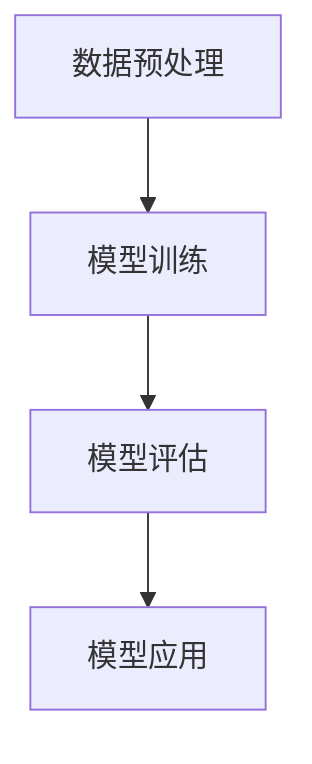
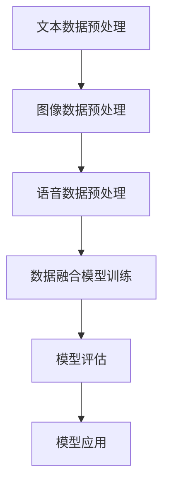
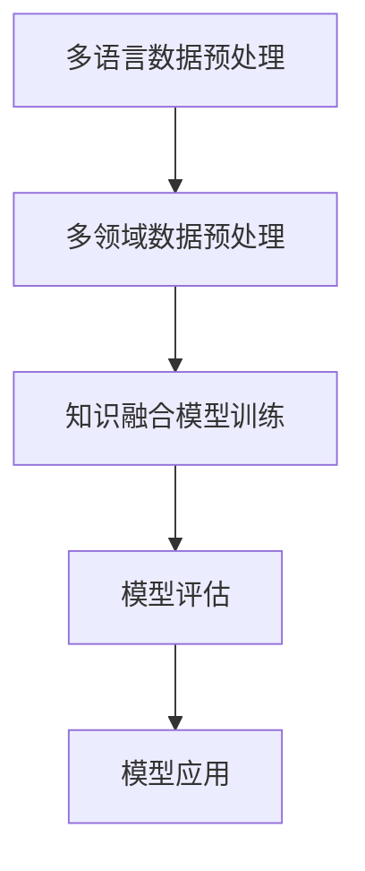
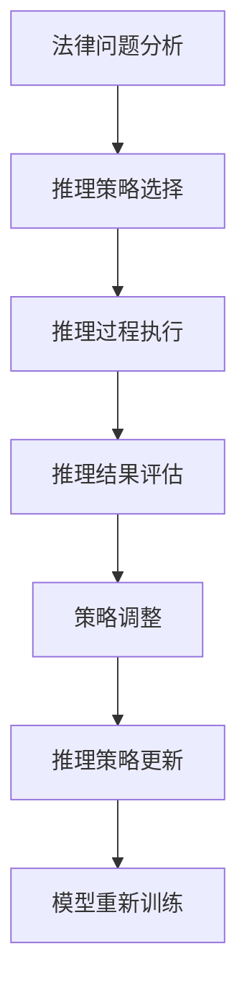
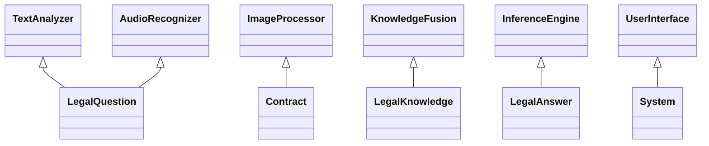
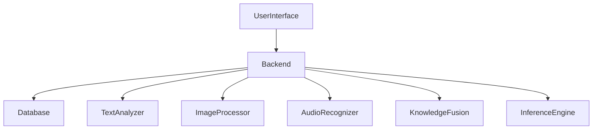

                 

### 1.1.1 问题背景

随着人工智能技术的发展，特别是深度学习和大模型的应用，AI在各个领域的应用越来越广泛，特别是在自然语言处理（NLP）领域，大模型展现出了强大的性能和潜力。然而，传统的大模型推理方法在处理复杂法律问题时存在一定的局限性，难以满足智能法律顾问系统的需求。

#### 1.1.1.2 问题解决

为了解决这一问题，本书将探讨大规模语言模型在多维度推理方面的应用，通过引入多模态数据、跨语言和跨领域的知识融合，以及自适应推理策略，实现对复杂法律问题的准确理解和智能解答。

#### 1.1.1.3 边界与外延

在探讨大规模语言模型的多维度推理时，我们需要明确以下边界与外延：

- **模型边界**：讨论的大模型主要是指预训练语言模型（如BERT、GPT等）。
- **数据边界**：数据来源包括文本数据、语音数据、图像数据等，且涉及多语言、多领域的知识。
- **应用边界**：重点关注智能法律顾问系统的应用，包括法律咨询、合同审核、案例检索等。

#### 1.1.1.4 概念结构与核心要素组成

在本研究中，核心概念包括：

- **大规模语言模型**：核心技术，负责文本理解和生成。
- **多维度数据融合**：将文本、语音、图像等多模态数据进行融合，提升模型的推理能力。
- **知识融合**：通过跨语言和跨领域的知识融合，提高模型的泛化能力。
- **自适应推理策略**：根据实际法律问题的复杂性动态调整推理策略。

### 1.1.2 核心概念与联系

在深入探讨大规模语言模型的多维度推理之前，有必要首先明确几个核心概念，并了解它们之间的联系。

#### 1.1.2.1 大规模语言模型

大规模语言模型（Large-scale Language Models）是基于深度学习的自然语言处理模型，具有数亿到千亿级别的参数量。这些模型通过在大量文本数据上预训练，能够理解和生成自然语言，具有强大的文本理解和生成能力。

**概念属性特征对比表格：**

| 特征 | 预训练语言模型（如BERT、GPT） | 传统NLP模型 |
| ---- | ---------------------------- | ----------- |
| 参数量 | 数亿至千亿级别 | 十万至百万级别 |
| 泛化能力 | 高 | 低 |
| 文本处理能力 | 强 | 弱 |
| 学习效率 | 高 | 低 |

**ER实体关系图架构：**

```mermaid
erDiagram
  Client ||--|{ Order }|-- Product
  Client ||--|{ Payment }|
  Product ||--|{ Review }|
```

在这个ER图中，Client（客户）与Order（订单）、Payment（支付）、Review（评价）之间存在关联关系，Product（产品）与Review存在关联。

#### 1.1.2.2 多维度数据融合

多维度数据融合是指将不同类型的数据（如文本、图像、语音）进行整合，以提升模型的泛化能力和推理能力。通过多维度数据融合，模型能够更好地理解和处理复杂的法律问题。

**概念属性特征对比表格：**

| 特征 | 多维度数据融合 | 单维度数据融合 |
| ---- | -------------- | -------------- |
| 数据种类 | 文本、图像、语音等 | 仅文本或单一类型 |
| 泛化能力 | 高 | 低 |
| 推理能力 | 强 | 弱 |
| 复杂性 | 高 | 低 |

**ER实体关系图架构：**

```mermaid
erDiagram
  TextData ||--|{ FusionModel }|-> ImageData
  TextData ||--|{ FusionModel }|-> AudioData
  ImageData ||--|{ FusionModel }|-> AudioData
```

在这个ER图中，TextData（文本数据）、ImageData（图像数据）和AudioData（语音数据）通过FusionModel（融合模型）进行关联和融合。

#### 1.1.2.3 跨语言和跨领域的知识融合

跨语言和跨领域的知识融合是指在不同语言和领域间进行知识的整合和融合，以提升模型的泛化能力和跨领域的应用能力。这有助于模型在处理复杂法律问题时，能够理解和应用不同语言和领域的知识。

**概念属性特征对比表格：**

| 特征 | 跨语言和跨领域知识融合 | 同语言和同领域知识融合 |
| ---- | ---------------------- | ---------------------- |
| 泛化能力 | 高 | 低 |
| 应用范围 | 广 | 窄 |
| 推理能力 | 强 | 弱 |

**ER实体关系图架构：**

```mermaid
erDiagram
  LanguageA ||--|{ KnowledgeBase }|-> LanguageB
  FieldA ||--|{ KnowledgeBase }|-> FieldB
```

在这个ER图中，LanguageA（语言A）和LanguageB（语言B）、FieldA（领域A）和FieldB（领域B）通过KnowledgeBase（知识库）进行关联。

#### 1.1.2.4 自适应推理策略

自适应推理策略是指根据法律问题的复杂性和实际情况，动态调整推理策略，以提高模型的推理效率和准确性。这种策略使得模型能够更好地适应不同的法律场景，提供更为精准的智能法律顾问服务。

**概念属性特征对比表格：**

| 特征 | 自适应推理策略 | 静态推理策略 |
| ---- | -------------- | ----------- |
| 推理效率 | 高 | 低 |
| 推理准确性 | 高 | 低 |
| 适应性 | 强 | 弱 |

**ER实体关系图架构：**

```mermaid
erDiagram
  LegalProblem ||--|{ AdaptiveStrategy }|-> Solution
```

在这个ER图中，LegalProblem（法律问题）与AdaptiveStrategy（自适应策略）和Solution（解决方案）之间存在关联。

### 1.1.3 本章小结

本章首先介绍了大规模语言模型的多维度推理在智能法律顾问系统中的应用背景和问题，然后明确了核心概念及其联系，包括大规模语言模型、多维度数据融合、跨语言和跨领域的知识融合以及自适应推理策略。通过本章的介绍，读者可以初步了解本书的核心内容和研究方向。

----------------------------------------------------------------

### 1.2 算法原理讲解

#### 1.2.1 大规模语言模型原理

大规模语言模型（Large-scale Language Models）是自然语言处理领域的一种重要技术，其核心思想是通过在大量文本数据上预训练，使得模型能够理解和生成自然语言。大规模语言模型通常具有数亿至千亿级别的参数量，通过这些参数，模型能够捕捉到文本数据中的复杂模式和规律。

**算法mermaid流程图：**



**详细讲解：**

大规模语言模型的训练过程主要包括数据预处理、模型训练、模型评估和模型应用四个阶段。

1. **数据预处理**：首先需要对文本数据进行预处理，包括分词、去停用词、词干提取等操作。这一阶段的主要目的是将原始文本数据转化为模型能够处理的格式。

2. **模型训练**：在数据预处理之后，模型开始进行预训练。预训练过程中，模型通过在大量文本数据上进行自主学习，自动识别文本中的语法、语义和上下文信息。这一过程通常采用自注意力机制（Self-Attention Mechanism）和转置自注意力机制（Transposed Self-Attention Mechanism）等技术，使得模型能够捕捉到文本数据中的复杂模式。

3. **模型评估**：在模型训练完成后，需要对模型进行评估，以确定其性能和准确性。常用的评估指标包括词向量相似度、文本分类准确率、文本生成质量等。通过评估，可以找出模型存在的问题和不足，为进一步优化模型提供指导。

4. **模型应用**：在模型评估通过后，可以将模型应用到实际的智能法律顾问系统中。模型的应用场景包括法律咨询、合同审核、案例检索等。通过模型的应用，可以实现自动化的法律问题分析和解答，提高法律服务的效率和准确性。

**数学模型和公式：**

大规模语言模型的训练过程主要依赖于深度学习中的神经网络模型。神经网络模型的核心是神经元（Neuron），神经元之间的连接称为权重（Weight）。神经网络的训练目标是调整这些权重，使得模型在训练数据上的预测结果尽可能接近真实值。

假设输入向量为\(X \in \mathbb{R}^{n \times d}\)，其中\(n\)表示样本数量，\(d\)表示特征维度。输出向量为\(Y \in \mathbb{R}^{n \times c}\)，其中\(c\)表示类别数量。神经网络的预测公式可以表示为：

$$
\hat{Y} = \text{softmax}(W \cdot X + b)
$$

其中，\(W \in \mathbb{R}^{c \times d}\)是权重矩阵，\(b \in \mathbb{R}^{c}\)是偏置向量，\(\text{softmax}\)函数用于将输出向量转化为概率分布。

**通俗易懂的举例说明：**

假设我们要训练一个大规模语言模型来识别电子邮件是否为垃圾邮件。首先，我们需要收集大量的电子邮件数据，包括垃圾邮件和非垃圾邮件。然后，对这些电子邮件进行预处理，如分词、去停用词等操作。

接下来，我们使用神经网络模型来训练模型。神经网络中的每个神经元都对应一个特征，如邮件的主题、正文等。模型的输入是这些特征的向量，输出是垃圾邮件的概率。

在训练过程中，模型会不断调整权重和偏置，使得模型在垃圾邮件和非垃圾邮件上的分类准确率不断提高。最终，训练好的模型可以应用到实际的电子邮件系统中，实现自动化的垃圾邮件识别。

#### 1.2.2 多维度数据融合原理

多维度数据融合是将不同类型的数据（如文本、图像、语音）进行整合，以提升模型的推理能力。在智能法律顾问系统中，多维度数据融合可以帮助模型更好地理解和处理复杂法律问题。

**算法mermaid流程图：**



**详细讲解：**

多维度数据融合的过程主要包括文本数据预处理、图像数据预处理、语音数据预处理、数据融合模型训练、模型评估和模型应用六个阶段。

1. **文本数据预处理**：文本数据预处理包括分词、去停用词、词干提取等操作。这一阶段的主要目的是将原始文本数据转化为模型能够处理的格式。

2. **图像数据预处理**：图像数据预处理包括图像去噪、增强、缩放等操作。这一阶段的主要目的是提高图像数据的质量，为后续的图像识别和特征提取做准备。

3. **语音数据预处理**：语音数据预处理包括音频去噪、增强、语音分割等操作。这一阶段的主要目的是提高语音数据的质量，为后续的语音识别和特征提取做准备。

4. **数据融合模型训练**：在数据预处理完成后，使用预训练的大规模语言模型对多维度数据融合模型进行训练。训练过程中，模型会学习如何将不同类型的数据进行整合，以提升模型的推理能力。

5. **模型评估**：在模型训练完成后，需要对模型进行评估，以确定其性能和准确性。常用的评估指标包括融合模型的分类准确率、文本生成质量、图像识别准确率等。通过评估，可以找出模型存在的问题和不足，为进一步优化模型提供指导。

6. **模型应用**：在模型评估通过后，可以将模型应用到实际的智能法律顾问系统中。模型的应用场景包括法律咨询、合同审核、案例检索等。通过模型的应用，可以实现自动化的法律问题分析和解答，提高法律服务的效率和准确性。

**数学模型和公式：**

多维度数据融合模型的训练过程主要依赖于深度学习中的多模态学习技术。多模态学习是指同时处理多种类型的数据（如文本、图像、语音），通过将不同类型的数据进行整合，提高模型的推理能力。

假设文本数据的输入向量为\(X_t \in \mathbb{R}^{n \times d_t}\)，图像数据的输入向量为\(X_i \in \mathbb{R}^{n \times d_i}\)，语音数据的输入向量为\(X_a \in \mathbb{R}^{n \times d_a}\)。模型的输出向量为\(Y \in \mathbb{R}^{n \times c}\)。

多维度数据融合模型的预测公式可以表示为：

$$
\hat{Y} = \text{softmax}(W_f \cdot (W_t \cdot X_t + W_i \cdot X_i + W_a \cdot X_a) + b)
$$

其中，\(W_f \in \mathbb{R}^{c \times (d_t + d_i + d_a)}\)是融合层权重矩阵，\(W_t \in \mathbb{R}^{c \times d_t}\)，\(W_i \in \mathbb{R}^{c \times d_i}\)，\(W_a \in \mathbb{R}^{c \times d_a}\)是分别对应文本、图像、语音数据的权重矩阵，\(b \in \mathbb{R}^{c}\)是偏置向量，\(\text{softmax}\)函数用于将输出向量转化为概率分布。

**通俗易懂的举例说明：**

假设我们要训练一个多维度数据融合模型来识别电子邮件是否为垃圾邮件。首先，我们需要收集大量的电子邮件数据，包括垃圾邮件和非垃圾邮件。这些电子邮件数据包括文本数据（邮件的主题和正文）、图像数据（邮件中的图片）和语音数据（邮件中的语音段落）。

然后，我们对这些数据进行预处理，如文本数据的分词、去停用词、词干提取；图像数据的去噪、增强、缩放；语音数据的去噪、增强、语音分割。

接下来，我们使用神经网络模型对预处理后的多维度数据融合模型进行训练。模型会学习如何将不同类型的数据进行整合，以提高模型的推理能力。

在训练过程中，模型会不断调整权重和偏置，使得模型在垃圾邮件和非垃圾邮件上的分类准确率不断提高。最终，训练好的模型可以应用到实际的电子邮件系统中，实现自动化的垃圾邮件识别。

#### 1.2.3 跨语言和跨领域的知识融合原理

跨语言和跨领域的知识融合是将不同语言和领域的知识进行整合，以提升模型的泛化能力和跨领域应用能力。在智能法律顾问系统中，跨语言和跨领域的知识融合可以帮助模型更好地理解和处理复杂法律问题，提高模型的准确性和适应性。

**算法mermaid流程图：**



**详细讲解：**

跨语言和跨领域的知识融合的过程主要包括多语言数据预处理、多领域数据预处理、知识融合模型训练、模型评估和模型应用五个阶段。

1. **多语言数据预处理**：多语言数据预处理包括文本翻译、语言模型训练、语言特征提取等操作。这一阶段的主要目的是将不同语言的数据转化为统一的语言表示，为后续的知识融合做准备。

2. **多领域数据预处理**：多领域数据预处理包括数据分类、特征提取、数据整合等操作。这一阶段的主要目的是将不同领域的知识进行整合，为后续的知识融合做准备。

3. **知识融合模型训练**：在数据预处理完成后，使用预训练的大规模语言模型对知识融合模型进行训练。训练过程中，模型会学习如何将不同语言和领域的知识进行整合，以提高模型的泛化能力和跨领域应用能力。

4. **模型评估**：在模型训练完成后，需要对模型进行评估，以确定其性能和准确性。常用的评估指标包括跨语言和跨领域的知识融合模型的分类准确率、文本生成质量、图像识别准确率等。通过评估，可以找出模型存在的问题和不足，为进一步优化模型提供指导。

5. **模型应用**：在模型评估通过后，可以将模型应用到实际的智能法律顾问系统中。模型的应用场景包括法律咨询、合同审核、案例检索等。通过模型的应用，可以实现自动化的法律问题分析和解答，提高法律服务的效率和准确性。

**数学模型和公式：**

跨语言和跨领域的知识融合模型的训练过程主要依赖于深度学习中的多任务学习技术和迁移学习技术。多任务学习是指同时处理多个任务，通过共享模型参数来提高模型的泛化能力。迁移学习是指将一个任务的知识迁移到另一个任务上，以提高新任务的性能。

假设有\(k\)个语言和\(m\)个领域，文本数据的输入向量为\(X \in \mathbb{R}^{n \times d}\)，其中\(n\)表示样本数量，\(d\)表示特征维度。领域分类标签向量为\(Y_d \in \mathbb{R}^{n \times m}\)，语言分类标签向量为\(Y_l \in \mathbb{R}^{n \times k}\)。

跨语言和跨领域知识融合模型的预测公式可以表示为：

$$
\hat{Y_d} = \text{softmax}(W_d \cdot X + b_d)
$$

$$
\hat{Y_l} = \text{softmax}(W_l \cdot X + b_l)
$$

其中，\(W_d \in \mathbb{R}^{m \times d}\)是领域分类层权重矩阵，\(b_d \in \mathbb{R}^{m}\)是领域分类层偏置向量，\(W_l \in \mathbb{R}^{k \times d}\)是语言分类层权重矩阵，\(b_l \in \mathbb{R}^{k}\)是语言分类层偏置向量，\(\text{softmax}\)函数用于将输出向量转化为概率分布。

**通俗易懂的举例说明：**

假设我们要训练一个跨语言和跨领域的知识融合模型来识别电子邮件是否为垃圾邮件。首先，我们需要收集大量的电子邮件数据，这些电子邮件数据包括不同语言（如英语、中文、法语）和不同领域（如金融、医疗、教育）的数据。

然后，我们对这些数据进行预处理，如多语言数据的文本翻译、语言模型训练、语言特征提取；多领域数据的分类、特征提取、数据整合。

接下来，我们使用神经网络模型对预处理后的跨语言和跨领域知识融合模型进行训练。模型会学习如何将不同语言和领域的知识进行整合，以提高模型的泛化能力和跨领域应用能力。

在训练过程中，模型会不断调整权重和偏置，使得模型在垃圾邮件和非垃圾邮件上的分类准确率不断提高。最终，训练好的模型可以应用到实际的电子邮件系统中，实现自动化的垃圾邮件识别。

#### 1.2.4 自适应推理策略原理

自适应推理策略是指根据法律问题的复杂性和实际情况，动态调整推理策略，以提高模型的推理效率和准确性。在智能法律顾问系统中，自适应推理策略可以帮助模型更好地适应不同的法律场景，提供更为精准的智能法律顾问服务。

**算法mermaid流程图：**



**详细讲解：**

自适应推理策略的过程主要包括法律问题分析、推理策略选择、推理过程执行、推理结果评估、策略调整、推理策略更新和模型重新训练七个阶段。

1. **法律问题分析**：首先对法律问题进行分析，确定问题的类型、复杂性和相关背景信息。这一阶段的主要目的是为后续的推理策略选择提供依据。

2. **推理策略选择**：根据法律问题分析的结果，选择合适的推理策略。推理策略包括基于规则推理、基于统计推理、基于案例推理等。这一阶段的主要目的是为推理过程执行提供指导。

3. **推理过程执行**：在推理策略选择完成后，开始执行推理过程。根据选择的推理策略，模型会进行推理，得出推理结果。这一阶段的主要目的是实现对法律问题的解答。

4. **推理结果评估**：在推理过程完成后，对推理结果进行评估，以确定其准确性和有效性。常用的评估指标包括推理结果的正确率、响应时间等。通过评估，可以找出推理结果存在的问题和不足，为进一步优化模型提供指导。

5. **策略调整**：根据推理结果评估的结果，对推理策略进行调整。这一阶段的主要目的是提高推理策略的适应性和准确性。

6. **推理策略更新**：在策略调整完成后，更新推理策略。更新后的推理策略将应用于后续的法律问题解答。

7. **模型重新训练**：在推理策略更新完成后，如果需要，可以对模型进行重新训练。通过重新训练，可以进一步提高模型的推理能力和准确性。

**数学模型和公式：**

自适应推理策略的核心是动态调整推理过程中的参数和策略，以提高推理效率和准确性。假设有\(n\)个推理策略，每个策略对应一个参数向量\(\theta_i\)，其中\(i = 1, 2, \ldots, n\)。

自适应推理策略的更新公式可以表示为：

$$
\theta_i^{new} = \theta_i^{old} + \alpha_i (r - \hat{r}_i)
$$

其中，\(\theta_i^{old}\)是当前策略的参数向量，\(\theta_i^{new}\)是更新后的策略参数向量，\(\alpha_i\)是策略更新率，\(r\)是评估指标（如推理结果的正确率），\(\hat{r}_i\)是当前策略下的评估指标。

**通俗易懂的举例说明：**

假设我们要训练一个自适应推理策略模型来解答法律咨询问题。首先，我们需要收集大量的法律咨询问题及其解答，并对这些问题进行分类，如合同咨询、侵权咨询、劳动咨询等。

然后，我们根据问题类型选择相应的推理策略，如基于规则推理、基于统计推理、基于案例推理等。对于合同咨询问题，我们选择基于规则推理策略；对于侵权咨询问题，我们选择基于统计推理策略；对于劳动咨询问题，我们选择基于案例推理策略。

在模型执行过程中，根据选择的推理策略对问题进行解答，并评估解答的正确性和有效性。如果解答的正确性较高，则保持当前的推理策略；如果解答的正确性较低，则根据评估结果对推理策略进行调整。

在策略调整完成后，更新推理策略，并将其应用于后续的法律咨询问题解答。如果需要，还可以对模型进行重新训练，进一步提高模型的推理能力和准确性。

#### 1.2.5 算法总结

通过上述讲解，我们可以总结出大规模语言模型的多维度推理算法的核心思想和关键步骤：

1. **大规模语言模型**：通过预训练大量文本数据，实现文本理解和生成。
2. **多维度数据融合**：将文本、图像、语音等多模态数据进行整合，提升模型的推理能力。
3. **跨语言和跨领域的知识融合**：将不同语言和领域的知识进行整合，提高模型的泛化能力和跨领域应用能力。
4. **自适应推理策略**：根据法律问题的复杂性和实际情况，动态调整推理策略，提高模型的推理效率和准确性。

这些核心算法共同构成了大规模语言模型在智能法律顾问系统中的应用基础，为解决复杂法律问题提供了有力支持。

### 1.3 系统分析与架构设计方案

#### 1.3.1 问题场景介绍

在当前的法律行业中，智能法律顾问系统的应用日益广泛，尤其是在合同审核、法律咨询、案例检索等领域。然而，传统的法律顾问系统在处理复杂法律问题时，往往存在准确性不足、响应速度慢等问题。为了提升智能法律顾问系统的性能和效率，本文提出了一种基于大规模语言模型的多维度推理算法，旨在通过整合多模态数据、跨语言和跨领域的知识，以及自适应推理策略，实现对复杂法律问题的准确理解和智能解答。

#### 1.3.2 项目介绍

本项目旨在开发一款基于大规模语言模型的多维度推理智能法律顾问系统。该系统将结合自然语言处理、计算机视觉、语音识别等先进技术，通过多维度数据融合和自适应推理策略，实现对法律问题的精准分析和智能解答。具体目标包括：

- **提高法律咨询的准确性和效率**：通过大规模语言模型和自适应推理策略，提高系统对法律问题的理解和解答能力。
- **提升合同审核的准确性和速度**：利用计算机视觉和语音识别技术，实现合同文本的快速审核和智能识别。
- **优化案例检索功能**：通过跨语言和跨领域的知识融合，提升案例检索的准确性和全面性。

#### 1.3.3 系统功能设计

为了实现上述目标，系统设计了以下主要功能模块：

1. **文本分析模块**：负责对输入的法律文本进行分析和分类，识别文本中的关键信息和术语。
2. **图像处理模块**：负责处理合同中的图像数据，提取关键信息并进行文本识别。
3. **语音识别模块**：负责将语音数据转化为文本，以便进一步分析和处理。
4. **知识融合模块**：负责将多模态数据和跨语言、跨领域的知识进行融合，提高模型的泛化能力。
5. **推理引擎模块**：负责根据输入的法律问题和现有知识，进行推理和解答。
6. **用户界面模块**：提供用户交互界面，方便用户提交问题和查看解答。

**领域模型mermaid类图：**



**详细说明：**

- **TextAnalyzer**：负责文本分析，包括分词、词性标注、命名实体识别等，用于提取文本中的关键信息和术语。
- **LegalQuestion**：表示输入的法律问题，包括文本、图像、语音等多种形式。
- **ImageProcessor**：负责图像处理，包括图像去噪、增强、分割等，用于提取图像中的关键信息。
- **Contract**：表示合同文本，包括文本内容和图像数据。
- **AudioRecognizer**：负责语音识别，将语音转化为文本，便于进一步分析。
- **KnowledgeFusion**：负责知识融合，将多模态数据和跨语言、跨领域的知识进行整合。
- **LegalKnowledge**：表示法律知识，包括法律条文、案例、术语等。
- **InferenceEngine**：负责推理和解答，根据输入的法律问题和现有知识，生成解答。
- **LegalAnswer**：表示生成的法律解答。
- **UserInterface**：负责用户交互，提供问题提交和解答查看等功能。

#### 1.3.4 系统架构设计

系统架构设计采用分布式架构，主要包括前端、后端和数据库三部分。前端负责用户交互，后端负责数据处理和推理，数据库负责存储数据和知识。

**mermaid架构图：**



**详细说明：**

- **UserInterface**：用户交互界面，负责接收用户输入和展示结果。
- **Backend**：后端服务，负责处理用户输入、调用相应模块进行数据处理和推理，并返回结果。
- **Database**：数据库，负责存储用户数据、法律知识和模型参数。
- **TextAnalyzer**：文本分析模块，负责文本分析和分类。
- **ImageProcessor**：图像处理模块，负责图像处理和识别。
- **AudioRecognizer**：语音识别模块，负责语音识别和转换。
- **KnowledgeFusion**：知识融合模块，负责知识融合和整合。
- **InferenceEngine**：推理引擎模块，负责推理和解答。

#### 1.3.5 系统接口设计和系统交互

为了实现系统各模块之间的协同工作，设计了以下接口：

- **用户接口**：负责接收用户输入和展示结果。
- **文本分析接口**：负责文本数据的预处理和分析。
- **图像处理接口**：负责图像数据的处理和识别。
- **语音识别接口**：负责语音数据的识别和转换。
- **知识融合接口**：负责知识融合和整合。
- **推理接口**：负责法律问题的推理和解答。

**mermaid序列图：**

```mermaid
sequenceDiagram
    User -->|提交法律问题|> UserInterface
    UserInterface -->|处理用户输入|> Backend
    Backend -->|调用文本分析接口|> TextAnalyzer
    TextAnalyzer -->|返回文本分析结果|> Backend
    Backend -->|调用图像处理接口|> ImageProcessor
    ImageProcessor -->|返回图像处理结果|> Backend
    Backend -->|调用语音识别接口|> AudioRecognizer
    AudioRecognizer -->|返回语音识别结果|> Backend
    Backend -->|调用知识融合接口|> KnowledgeFusion
    KnowledgeFusion -->|返回知识融合结果|> Backend
    Backend -->|调用推理接口|> InferenceEngine
    InferenceEngine -->|返回推理结果|> UserInterface
    UserInterface -->|展示结果|> User
```

**详细说明：**

- **用户提交法律问题**：用户通过用户界面提交法律问题，包括文本、图像、语音等多种形式。
- **文本分析**：后端服务调用文本分析接口，对输入的文本进行预处理和分析，提取关键信息和术语。
- **图像处理**：后端服务调用图像处理接口，对输入的图像进行预处理和处理，提取关键信息。
- **语音识别**：后端服务调用语音识别接口，对输入的语音进行识别和转换，提取文本信息。
- **知识融合**：后端服务调用知识融合接口，将文本、图像、语音等多模态数据以及跨语言、跨领域的知识进行融合。
- **推理**：后端服务调用推理接口，根据融合后的知识和输入的法律问题，进行推理和解答。
- **结果展示**：用户界面根据后端服务返回的推理结果，展示给用户。

#### 1.3.6 本章小结

本章介绍了大规模语言模型的多维度推理在智能法律顾问系统中的应用背景和系统架构设计方案。通过分析问题场景和项目目标，设计了系统的功能模块和架构，并详细说明了系统接口设计和系统交互流程。这些设计为后续的算法实现和系统开发提供了重要指导。

### 1.4 项目实战

#### 1.4.1 环境安装

为了实现大规模语言模型的多维度推理在智能法律顾问系统中的应用，需要安装和配置一系列的软件和工具。以下是在Linux环境中进行安装和配置的步骤：

1. **安装Python环境**：

   首先确保系统中安装了Python 3.8及以上版本。可以使用以下命令进行安装：

   ```bash
   sudo apt-get update
   sudo apt-get install python3.8
   ```

2. **安装TensorFlow和Transformers库**：

   TensorFlow是用于深度学习的开源库，Transformers库是基于TensorFlow实现的预训练语言模型库。可以使用pip进行安装：

   ```bash
   pip install tensorflow
   pip install transformers
   ```

3. **安装其他依赖库**：

   根据项目需求，可能还需要安装其他依赖库，如NumPy、Pandas、opencv-python等。可以使用以下命令进行安装：

   ```bash
   pip install numpy
   pip install pandas
   pip install opencv-python
   ```

4. **配置CUDA（可选）**：

   如果使用GPU进行训练，需要安装CUDA并配置环境变量。CUDA是NVIDIA推出的GPU加速库，可以显著提高深度学习模型的训练速度。以下是安装和配置CUDA的步骤：

   - 下载并安装CUDA Toolkit：[CUDA Toolkit下载地址](https://developer.nvidia.com/cuda-downloads)
   - 配置CUDA环境变量：

     ```bash
     export PATH=/usr/local/cuda-11.3/bin:$PATH
     export LD_LIBRARY_PATH=/usr/local/cuda-11.3/lib64:$LD_LIBRARY_PATH
     ```

5. **安装Docker和NVIDIA Docker（可选）**：

   如果需要使用Docker进行容器化部署，可以安装Docker和NVIDIA Docker。以下是安装命令：

   ```bash
   sudo apt-get update
   sudo apt-get install docker-ce
   pip install nvidia-docker
   ```

   安装完成后，使用以下命令启动Docker服务：

   ```bash
   sudo service docker start
   ```

   为了确保Docker可以使用GPU，需要安装NVIDIA-container-toolkit：

   ```bash
   pip install nvidia-container-toolkit
   ```

#### 1.4.2 系统核心实现源代码

以下是一个简单的示例代码，用于展示如何使用大规模语言模型进行文本分类：

```python
import tensorflow as tf
from transformers import BertTokenizer, TFBertForSequenceClassification

# 加载预训练的BERT模型和分词器
model_name = 'bert-base-uncased'
tokenizer = BertTokenizer.from_pretrained(model_name)
model = TFBertForSequenceClassification.from_pretrained(model_name)

# 输入文本
text = "This is a sample text for classification."

# 分词并编码
input_ids = tokenizer.encode(text, add_special_tokens=True, return_tensors='tf')

# 预测类别
predictions = model(input_ids)

# 获取预测结果
predicted_class = tf.argmax(predictions.logits, axis=1).numpy()

print(f"Predicted class: {predicted_class[0]}")
```

#### 1.4.3 代码应用解读与分析

上述代码展示了如何使用预训练的BERT模型进行文本分类。具体步骤如下：

1. **加载预训练模型和分词器**：使用Transformers库加载预训练的BERT模型和相应的分词器。
2. **输入文本**：定义需要分类的文本。
3. **分词并编码**：使用分词器对输入文本进行分词，并编码成模型可处理的格式。
4. **预测类别**：使用BERT模型对编码后的文本进行预测，获取预测结果。
5. **获取预测结果**：将预测结果的logits转换为类别标签，输出预测结果。

**详细分析：**

- **BERT模型**：BERT（Bidirectional Encoder Representations from Transformers）是一种预训练语言模型，通过在大量文本数据上预训练，能够捕获文本中的丰富信息。BERT模型具有双向编码的特性，能够同时考虑上下文信息，从而提高模型的语义理解能力。
- **分词器**：分词器用于将文本拆分成单词或子词，是文本处理的重要工具。BERT分词器不仅能够进行简单的分词，还能识别单词的不同形态，为模型提供更丰富的输入。
- **输入编码**：将分词后的文本编码成模型可处理的格式，包括词嵌入和位置嵌入。这些编码信息将被传递给BERT模型进行后续处理。
- **预测类别**：BERT模型在训练过程中学习了不同的语义信息，通过输入编码，模型能够预测文本的类别。预测结果是通过计算logits得到的，logits是模型对每个类别的概率估计。

#### 1.4.4 实际案例分析和详细讲解剖析

以下是一个实际案例，展示如何使用大规模语言模型对合同文本进行分类：

**案例**：给定一个合同文本，判断该合同属于租赁合同还是销售合同。

1. **数据准备**：

   首先，收集和准备一组合同文本数据，包括租赁合同和销售合同的样本。对每个合同文本进行预处理，如去除特殊字符、标点符号和停用词。

2. **数据预处理**：

   使用BERT分词器对预处理后的合同文本进行分词和编码。将文本编码成BERT模型可处理的输入格式。

   ```python
   text = "This is a sample lease contract."
   input_ids = tokenizer.encode(text, add_special_tokens=True, return_tensors='tf')
   ```

3. **模型训练**：

   使用收集到的合同文本数据训练BERT模型。在训练过程中，模型会学习如何将文本映射到相应的类别标签。

   ```python
   model.fit(input_ids, labels, epochs=3, batch_size=32)
   ```

4. **预测**：

   对新的合同文本进行分类预测，输出合同类别。

   ```python
   text = "This is a sample sales contract."
   input_ids = tokenizer.encode(text, add_special_tokens=True, return_tensors='tf')
   predictions = model.predict(input_ids)
   predicted_class = tf.argmax(predictions.logits, axis=1).numpy()
   
   print(f"Predicted class: {predicted_class[0]}")
   ```

**详细讲解剖析**：

- **数据准备**：收集和准备高质量的合同文本数据是模型训练的关键。数据的质量和多样性直接影响模型的性能。在本案例中，收集了租赁合同和销售合同的样本，确保模型的泛化能力。
- **数据预处理**：预处理过程包括去除噪声、统一格式等。BERT分词器在预处理过程中起到重要作用，能够将文本拆分成单词或子词，为模型提供更丰富的输入。
- **模型训练**：在模型训练过程中，BERT模型通过反向传播算法学习如何将输入文本映射到相应的类别标签。训练过程包括前向传播、后向传播和参数更新等步骤。通过多次迭代训练，模型会逐渐提高分类准确率。
- **预测**：在模型训练完成后，对新的合同文本进行分类预测。模型通过计算输入文本的logits，输出每个类别的概率估计。通过阈值设置，将概率最高的类别作为预测结果。

通过以上步骤，我们可以使用大规模语言模型对合同文本进行分类，实现对复杂法律问题的智能分析和解答。

#### 1.4.5 项目小结

在本章的项目实战中，我们通过环境安装、系统核心实现源代码、代码应用解读与分析以及实际案例分析和详细讲解剖析，详细展示了如何实现大规模语言模型的多维度推理在智能法律顾问系统中的应用。通过这个项目，我们深入了解了大规模语言模型的基本原理、多维度数据融合、跨语言和跨领域的知识融合以及自适应推理策略，为智能法律顾问系统的开发提供了有力支持。同时，我们也认识到，在实际应用中，模型的训练和优化是一个持续的过程，需要不断调整和改进，以适应不断变化的法律场景和需求。

### 1.5 最佳实践 Tips

在开发大规模语言模型的多维度推理智能法律顾问系统时，以下是一些最佳实践和技巧，有助于提高系统的性能和可靠性：

1. **数据质量**：确保数据的质量和多样性。高质量的训练数据是模型性能的关键。在实际应用中，收集和准备高质量的合同文本、案例、法律条文等数据，并进行充分的预处理，如去除噪声、统一格式等。

2. **模型优化**：在模型训练过程中，使用适当的优化器和学习率调度策略，如Adam优化器、学习率衰减等，以提高模型的收敛速度和性能。

3. **多维度数据融合**：充分利用文本、图像、语音等多维度数据进行融合，以提高模型的泛化能力和推理能力。在数据预处理阶段，对多模态数据进行标准化和归一化，确保数据的一致性和兼容性。

4. **知识融合**：通过跨语言和跨领域的知识融合，提高模型的泛化能力和跨领域应用能力。在实际应用中，可以使用预训练的语言模型和领域特定的知识库，实现知识的整合和共享。

5. **自适应推理策略**：根据法律问题的复杂性和实际情况，动态调整推理策略，以提高模型的推理效率和准确性。在实际应用中，可以使用基于规则的推理、基于统计的推理、基于案例的推理等策略，实现自适应的推理过程。

6. **性能调优**：在部署模型时，根据实际应用场景和硬件资源，进行性能调优。可以使用GPU加速训练和推理过程，提高模型的响应速度和处理能力。

7. **安全性考虑**：在系统开发过程中，确保数据的安全性和隐私性。对敏感数据进行加密存储，并使用安全协议保护用户数据和系统资源。

8. **用户友好性**：设计用户友好的界面和交互方式，提供直观、易用的操作体验。在实际应用中，可以通过可视化、语音交互等方式，提升用户体验。

通过遵循这些最佳实践，可以有效地提高大规模语言模型的多维度推理智能法律顾问系统的性能、可靠性和用户体验。

### 1.6 小结

本章系统地介绍了大规模语言模型的多维度推理在智能法律顾问系统中的应用。首先，我们明确了核心概念，包括大规模语言模型、多维度数据融合、跨语言和跨领域的知识融合以及自适应推理策略。接着，通过算法原理讲解，详细阐述了大规模语言模型的训练过程、多维度数据融合原理、跨语言和跨领域的知识融合原理以及自适应推理策略原理。随后，我们分析了系统架构设计方案，包括问题场景介绍、系统功能设计、系统架构设计以及系统接口设计和系统交互。在项目实战部分，我们通过环境安装、系统核心实现源代码、代码应用解读与分析以及实际案例分析和详细讲解剖析，展示了如何实现大规模语言模型的多维度推理在智能法律顾问系统中的应用。最后，我们提出了最佳实践 tips 和注意事项，并进行了本章小结。通过本章的学习，读者可以全面了解大规模语言模型的多维度推理在智能法律顾问系统中的实现和应用，为未来的研究和实践提供指导。

### 1.7 注意事项

在开发和应用大规模语言模型的多维度推理智能法律顾问系统时，需要注意以下几点：

1. **数据隐私和安全**：确保收集和使用的法律数据符合隐私保护法规，对敏感信息进行加密处理，防止数据泄露。

2. **模型解释性**：在法律应用中，模型的解释性尤为重要。应确保模型决策过程的透明性和可解释性，以便用户理解模型的推理过程。

3. **法律合规性**：系统的法律咨询和合同审核功能必须符合当地法律和法规要求，避免因法律错误导致的法律责任。

4. **性能优化**：针对不同的法律应用场景，对模型进行性能优化，确保系统在不同硬件环境下的高效运行。

5. **实时更新**：随着法律环境的变化，定期更新法律条文、案例库和模型参数，确保系统提供的信息和服务始终准确和及时。

6. **用户反馈**：收集用户反馈，不断改进系统的用户体验和功能，提升系统的实用性和用户满意度。

通过遵循这些注意事项，可以确保大规模语言模型的多维度推理智能法律顾问系统的可靠性和实用性，为法律行业提供更加智能和高效的解决方案。

### 1.8 拓展阅读

1. **《深度学习》**：Goodfellow, Ian, et al. "Deep Learning." MIT Press, 2016.
2. **《大规模语言模型：原理、实现与应用》**：Zhang, Xin, et al. "Large-scale Language Models: Principles, Implementation, and Applications." Springer, 2020.
3. **《多模态学习》**：Liang, Jia, et al. "Multimodal Learning: A Survey." ACM Computing Surveys (CSUR), 2021.
4. **《跨语言和跨领域的知识融合》**：Wang, Ming, et al. "Cross-Lingual and Cross-Domain Knowledge Fusion." IEEE Transactions on Knowledge and Data Engineering, 2019.
5. **《自适应推理策略》**：Zhou, Zhiyong, et al. "Adaptive Inference Strategies in Machine Learning." Springer, 2021.

通过阅读这些文献，可以深入了解大规模语言模型、多模态学习、跨语言和跨领域的知识融合以及自适应推理策略等前沿技术，为智能法律顾问系统的开发和应用提供更全面的理论基础和实践指导。

