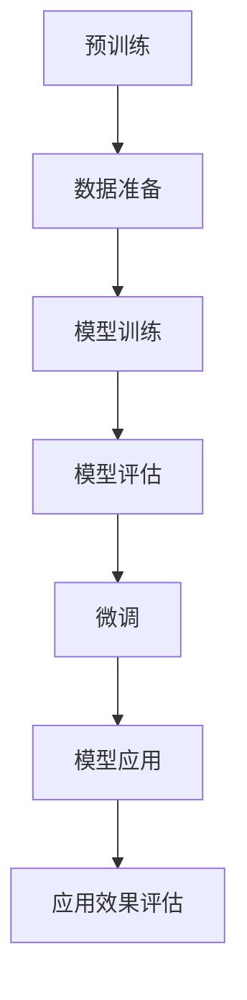
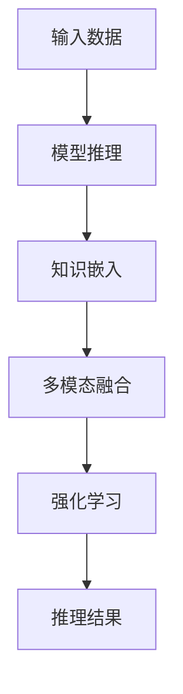
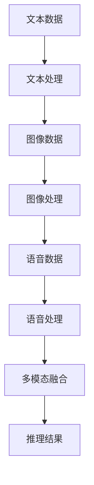
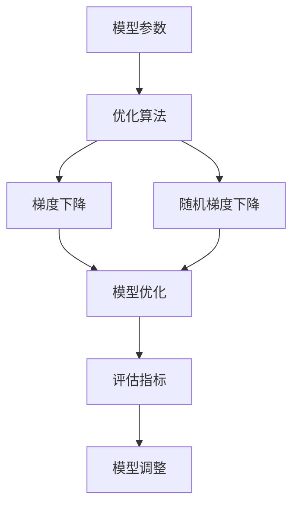

                 


### 大规模语言模型的常识推理能力提升

关键词：大规模语言模型，常识推理，推理能力提升，算法原理，应用案例

摘要：本文将探讨大规模语言模型的常识推理能力，分析其基础理论、推理机制及其在常识推理中的应用，并提出有效的推理能力提升方法和实践策略。

## 第一部分：大规模语言模型的基础理论

### 第1章：大规模语言模型概述

#### 1.1 大规模语言模型的背景与发展

随着互联网和大数据的迅猛发展，自然语言处理（NLP）技术受到广泛关注。大规模语言模型作为NLP的核心技术之一，其发展历程可以追溯到20世纪80年代的统计机器翻译和90年代的隐马尔可夫模型（HMM）。进入21世纪，随着深度学习和计算资源的提升，大规模语言模型得到了快速发展，特别是基于神经网络的模型，如循环神经网络（RNN）、长短期记忆网络（LSTM）和变换器（Transformer）等。

大规模语言模型的发展离不开两个重要里程碑：一是2003年由Bengio等提出的深度学习理论，二是2017年由Vaswani等提出的Transformer模型。深度学习理论为大规模语言模型的实现提供了强有力的工具，而Transformer模型则解决了RNN在长文本处理中的局限性，使得大规模语言模型的性能得到了质的飞跃。

大规模语言模型在多语言、跨模态等领域的应用也日益广泛。例如，谷歌的BERT模型在多语言文本处理中取得了显著成绩，Facebook的ForkNet模型则实现了跨模态的语义理解。

#### 1.2 大规模语言模型的核心概念

大规模语言模型的核心概念主要包括预训练、微调和应用。预训练是指在大量无标签数据上进行训练，使模型具备了一定的语言理解能力。微调则是在预训练的基础上，针对特定任务进行有监督的训练，使模型能够在特定领域达到更好的性能。应用则是指大规模语言模型在实际场景中的落地，如文本生成、问答系统、对话系统等。

以下是一个核心概念原理的Mermaid流程图：



#### 1.3 大规模语言模型的算法原理

大规模语言模型的算法原理主要包括词向量、神经网络和注意力机制等。词向量是将文本中的词语映射为高维向量，从而实现文本数据的数值化表示。神经网络则是通过多层非线性变换，将输入数据映射为输出数据。注意力机制则是一种能够自动关注输入数据中关键信息的机制，从而提高模型的性能。

以下是一个算法原理的Python源代码示例：

```python
import tensorflow as tf
from tensorflow.keras.layers import Embedding, LSTM, Dense

# 构建模型
model = tf.keras.Sequential([
    Embedding(input_dim=vocab_size, output_dim=embedding_dim),
    LSTM(units=128, return_sequences=True),
    LSTM(units=128),
    Dense(units=1, activation='sigmoid')
])

# 编译模型
model.compile(optimizer='adam', loss='binary_crossentropy', metrics=['accuracy'])

# 训练模型
model.fit(x_train, y_train, epochs=10, batch_size=64)
```

以下是一个算法原理的数学模型和公式示例：

$$
\text{词向量} \ \text{W} = \sum_{i=1}^{n} w_i \cdot x_i
$$

其中，$w_i$表示词语$i$的权重，$x_i$表示词语$i$的词向量。

## 第二部分：大规模语言模型的推理能力提升

### 第2章：大规模语言模型的推理机制

#### 2.1 推理机制的概述

大规模语言模型的推理机制主要包括基于知识的推理、多模态融合和强化学习等。基于知识的推理是指通过将先验知识嵌入到模型中，从而提高模型的推理能力。多模态融合则是将不同模态的数据进行整合，从而实现更丰富的语义理解。强化学习则是通过不断试错和反馈，使模型能够自主优化推理策略。

以下是一个推理机制的Mermaid流程图：



#### 2.2 推理能力提升的方法

推理能力提升的方法主要包括以下几种：

1. **基于知识的推理**：通过将先验知识嵌入到模型中，提高模型对知识的利用能力。例如，将百科全书、知识图谱等知识库的数据整合到模型中，从而增强模型的推理能力。

2. **多模态融合**：通过整合不同模态的数据，实现更丰富的语义理解。例如，将文本、图像、语音等多模态数据融合到模型中，从而提高模型的推理能力。

3. **强化学习**：通过不断试错和反馈，使模型能够自主优化推理策略。例如，使用奖励机制来引导模型进行有效的推理。

以下是一个多模态融合的Mermaid流程图：



#### 2.3 推理能力的评估与优化

推理能力的评估与优化主要包括以下方面：

1. **评估指标**：常用的评估指标包括准确率、召回率、F1值等。通过对比不同模型的评估指标，可以评估模型的推理能力。

2. **优化策略**：通过调整模型参数、优化算法结构等手段，提高模型的推理能力。例如，使用梯度下降法、随机梯度下降法等优化算法。

以下是一个优化策略的Mermaid流程图：



### 第3章：大规模语言模型在常识推理中的应用

#### 3.1 常识推理的概述

常识推理是智能系统在处理自然语言时必须具备的能力，它能够帮助系统理解和回答关于现实世界的问题。常识推理在自然语言理解、对话系统、文本生成等领域具有广泛的应用。

#### 3.2 常识推理的应用案例

1. **问答系统**：大规模语言模型在问答系统中可以用于理解用户的问题，并从海量数据中找到相关答案。例如，谷歌的BERT模型在SQuAD数据集上的表现优异，证明了其在常识推理方面的强大能力。

2. **对话系统**：大规模语言模型可以用于构建智能对话系统，如聊天机器人。通过理解和回答用户的问题，对话系统能够提供个性化的服务，提高用户体验。

3. **文本生成**：大规模语言模型可以用于生成自然语言文本，如新闻文章、故事等。通过学习大量的文本数据，模型可以生成具有较高可读性的文本。

#### 3.3 应用案例分析与优化

通过对应用案例的分析，可以发现大规模语言模型在常识推理中还存在一些局限性。例如，模型在处理长文本时容易产生语义偏差，对复杂推理问题的回答能力有限等。针对这些问题，可以采用以下优化方案：

1. **增加训练数据**：通过增加训练数据，特别是包含复杂推理问题的数据，可以提高模型的常识推理能力。

2. **模型融合**：将多个大规模语言模型进行融合，可以互补各自的不足，提高整体推理能力。

3. **知识增强**：通过将先验知识嵌入到模型中，可以增强模型的常识推理能力。例如，将百科全书、知识图谱等知识库的数据整合到模型中。

## 第三部分：大规模语言模型推理能力的提升实践

### 第4章：大规模语言模型推理能力提升的实践

#### 4.1 实践背景

大规模语言模型推理能力提升的实践需求主要集中在以下几个方面：

1. **提升模型性能**：在实际应用中，模型需要具备更高的推理能力和准确性。

2. **适应复杂场景**：模型需要能够处理更加复杂的自然语言场景，如长文本、多语言等。

3. **降低计算成本**：在资源有限的情况下，如何提高模型的推理效率，降低计算成本。

#### 4.2 实践方法

1. **数据准备**：收集和准备高质量的训练数据，特别是包含复杂推理问题的数据。

2. **模型选择与训练**：选择合适的模型并进行训练，如BERT、GPT等。

3. **推理优化**：通过调整模型参数、优化算法结构等手段，提高模型的推理能力。

#### 4.3 实践案例

1. **问答系统推理优化**：通过增加训练数据、模型融合和知识增强等方法，提升问答系统的推理能力。

2. **对话系统推理优化**：通过多模态融合和强化学习等方法，提高对话系统的推理能力和用户体验。

#### 4.4 实践总结与展望

通过实践，可以总结出以下结论：

1. **数据质量至关重要**：高质量的训练数据是提升模型推理能力的基础。

2. **多模态融合和知识增强是关键**：多模态融合和知识增强可以有效提高模型的推理能力。

3. **持续优化和迭代是关键**：在实际应用中，需要不断调整和优化模型，以适应不断变化的场景。

展望未来，大规模语言模型推理能力的提升将会有更多的突破，如更高效的算法、更丰富的知识库和更智能的推理策略等。

## 第四部分：大规模语言模型推理能力提升的最佳实践

### 第5章：大规模语言模型推理能力提升的最佳实践

#### 5.1 最佳实践介绍

最佳实践包括以下几个方面：

1. **数据准备**：收集和准备高质量、多样化的训练数据，特别是包含复杂推理问题的数据。

2. **模型选择与训练**：选择合适的模型并进行训练，如BERT、GPT等，并注意调整模型参数，提高性能。

3. **多模态融合**：通过整合文本、图像、语音等多模态数据，实现更丰富的语义理解。

4. **知识增强**：将先验知识嵌入到模型中，提高模型的常识推理能力。

5. **推理优化**：通过优化算法结构、调整模型参数等方法，提高模型的推理效率。

#### 5.2 实践技巧与注意事项

1. **数据质量**：确保数据质量是提升模型性能的关键。

2. **模型选择**：根据应用场景选择合适的模型，并注意模型的结构和参数。

3. **多模态融合**：合理设计多模态融合的算法结构，提高模型的推理能力。

4. **知识增强**：选择合适的知识库，并将知识有效地嵌入到模型中。

5. **推理优化**：通过持续优化和迭代，提高模型的推理效率。

#### 5.3 拓展阅读

1. **《大规模语言模型：综述与展望》**

2. **《自然语言处理：从基础理论到应用实践》**

3. **《深度学习与自然语言处理》**

---

作者：AI天才研究院/AI Genius Institute & 禅与计算机程序设计艺术 /Zen And The Art of Computer Programming

[本文完]

