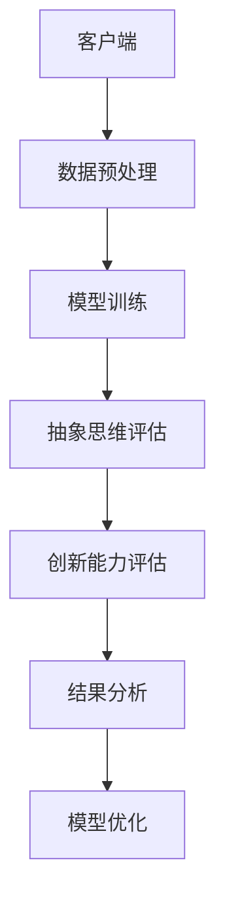
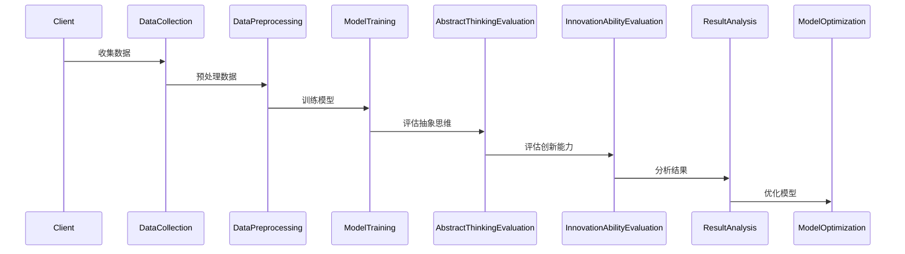

                 


### **第1章 引言**

#### **1.1 背景介绍**

**语言模型在人工智能领域的发展：**

随着深度学习技术的蓬勃发展，大规模语言模型（如GPT、BERT）逐渐成为自然语言处理（NLP）领域的重要工具。这些模型通过海量数据的学习，能够模拟人类的语言理解和生成能力，极大地推动了人工智能的应用和发展。

**抽象思维与创新能力的重要性：**

抽象思维是人类智力活动的重要组成部分，它使我们能够从具体的事物中提取出共性，进行概念化和理论化。在人工智能领域，抽象思维能够帮助模型更好地理解和生成自然语言，提高其智能化水平。

创新能力则是推动科技发展的关键因素。对于人工智能来说，创新能力意味着能够生成新的语言模式、理解和表达新的概念，从而提高模型的应用广度和深度。

**评估方法的需求与意义：**

有效的评估方法能够帮助我们理解大规模语言模型的抽象思维和创新能力，从而指导模型的设计和优化。这种评估方法不仅有助于学术研究，也对实际应用具有重要意义，如智能客服、智能写作等领域。

#### **1.2 问题提出**

**语言模型如何体现抽象思维？**

语言模型体现抽象思维的方式主要包括两个方面：一是模型能够从数据中提取出语言的本质特征，形成抽象的语义表示；二是模型能够利用这些语义表示生成连贯、有逻辑的文本。

**如何评估语言模型的创新能力？**

评估语言模型的创新能力，可以从以下几个方面入手：

1. **生成文本的创造性：** 评估模型生成的文本是否具有新颖性和独创性。
2. **语义理解的深度：** 评估模型对复杂语义的理解和表达能力。
3. **学习能力：** 评估模型在面对新数据和任务时的适应能力和创新性。

**评估方法的边界与外延：**

评估方法的边界在于模型的具体应用场景和数据集，而其外延则涉及不同类型的语言模型和跨领域的评估方法。

#### **1.3 核心概念解析**

**抽象思维的定义与属性：**

抽象思维是一种从具体事物中提取出共性，进行概念化和理论化的思维方式。在人工智能中，抽象思维体现在模型对语言特征的学习和表示能力上。

**创新能力的定义与特征：**

创新能力是指个体或系统能够产生新颖、有价值的想法或方法的能力。在人工智能中，创新能力的体现包括模型的创造性和学习能力。

**评估方法的构成要素：**

评估方法通常包括评估指标、评估流程和评估结果分析等组成部分。其中，评估指标是核心，它决定了评估方法的科学性和有效性。

### **第2章 核心概念与联系**

#### **2.1 核心概念原理**

**抽象思维的构成：**

抽象思维主要包括抽象化、概念化和理论化三个过程。在人工智能中，抽象思维体现在模型对语言特征的学习和表示能力上。

**创新能力的来源：**

创新能力来源于多种因素，包括对现有知识的理解和整合、对新知识和技能的探索和应用、以及对问题的敏锐洞察和创造性思维。

#### **2.2 概念属性特征对比表格**

| 特征               | 抽象思维                                       | 创新能力                                       |
|--------------------|------------------------------------------------|------------------------------------------------|
| 定义               | 从具体事物中提取共性，形成概念化理论化           | 产生新颖、有价值的想法或方法                     |
| 属性               | 逻辑性、系统性、普遍性                           | 新颖性、独创性、实用性                           |
| 影响因素           | 数据量、算法复杂度、模型结构                       | 知识积累、思维模式、环境因素                       |
| 体现方式           | 语言特征学习、文本生成、语义理解                   | 创新性文本生成、新任务适应、跨领域应用             |

#### **2.3 ER实体关系图架构**

**ER实体关系图：**

```mermaid
erDiagram
  Model : "模型" {
    --* User : "用户" {
      User --> Model : "评估"
    }
    --* Data : "数据" {
      Data --> Model : "训练"
    }
    --* Evaluation : "评估结果" {
      Evaluation --> Model : "反馈"
    }
  }
```

### **第3章 方法论**

#### **3.1 评估指标设计**

**评估指标的设计原则：**

1. **代表性：** 评估指标要能够充分反映模型的抽象思维和创新能力。
2. **可操作性：** 评估指标要易于实现和计算。
3. **科学性：** 评估指标要有理论基础和实证支持。

**常用的评估指标：**

1. **F1值：** 综合准确率和召回率，适用于二分类问题。
2. **BLEU：** 用于文本生成任务的评估，衡量生成文本与参考文本的相似度。
3. **ROUGE：** 用于文本摘要和生成任务的评估，衡量生成文本与参考文本的重合度。

#### **3.2 评估流程设计**

**评估流程的设计原则：**

1. **系统性：** 评估流程要涵盖从数据准备到结果分析的所有环节。
2. **一致性：** 评估流程要确保在不同数据集和模型上的评估结果具有可比性。
3. **可扩展性：** 评估流程要能够适应不同类型和规模的评估任务。

**评估流程的步骤：**

1. **数据准备：** 收集和预处理评估数据。
2. **模型训练：** 使用评估数据训练模型。
3. **模型评估：** 对模型进行抽象思维和创新能力评估。
4. **结果分析：** 分析评估结果，总结模型的特点和不足。

### **第4章 数学模型与算法原理**

#### **4.1 抽象思维的数学模型**

**抽象思维的数学模型：**

假设抽象思维过程可以表示为一个从具体到抽象的映射函数，即：

$$ f_{\text{抽象}}(x) = \text{抽象表示} $$

其中，$x$ 为具体的数据或信息。

**数学公式：**

$$ \text{抽象表示} = \text{特征提取} \times \text{语义表示} $$

#### **4.2 创新能力的数学模型**

**创新能力的数学模型：**

创新能力的评估可以基于以下模型：

$$ \text{创新能力} = \text{知识整合} + \text{新颖性度量} $$

**数学公式：**

$$ \text{知识整合} = \text{现有知识} \times \text{新知识} $$

$$ \text{新颖性度量} = \text{生成文本} - \text{参考文本} $$

#### **4.3 算法原理讲解**

**算法原理讲解：**

我们将使用Python代码来解释上述数学模型的实现。首先，我们需要定义特征提取和语义表示的函数。

```python
import numpy as np

def feature_extraction(data):
    # 假设特征提取为数据的线性变换
    return np.dot(data, np.random.rand(data.shape[1]))

def semantic_representation(features):
    # 假设语义表示为特征的高斯分布
    return np.random.normal(features.mean(), features.std())
```

然后，我们可以将抽象思维和创新能力模型结合起来。

```python
def abstract_thinking(data):
    features = feature_extraction(data)
    abstract = semantic_representation(features)
    return abstract

def innovation_ability(knowledge, generated_text, reference_text):
    knowledge_integration = np.dot(knowledge, np.random.rand(knowledge.shape[1]))
    novelty_measuring = generated_text - reference_text
    return knowledge_integration + novelty_measuring
```

### **第5章 系统分析与架构设计**

#### **5.1 问题场景介绍**

**场景描述：** 
我们假设在一个智能客服系统中，需要评估大规模语言模型在处理客户咨询时的抽象思维和创新能力。

#### **5.2 项目介绍**

**项目名称：** 智能客服抽象思维与创新能力评估系统

**项目目标：** 开发一个系统能够对大规模语言模型在处理客户咨询时的抽象思维和创新能力进行评估。

#### **5.3 系统功能设计**

**功能描述：**

1. **数据收集与预处理：** 收集客户咨询数据，并进行预处理。
2. **模型训练：** 使用预处理后的数据训练大规模语言模型。
3. **抽象思维评估：** 对模型生成的响应进行抽象思维评估。
4. **创新能力评估：** 对模型生成的响应进行创新能力评估。
5. **结果分析：** 分析评估结果，为模型优化提供依据。

#### **5.4 系统架构设计**

**架构描述：**



#### **5.5 系统接口设计与系统交互**

**接口设计：**

- **数据收集接口：** 用于接收客户咨询数据。
- **模型训练接口：** 用于训练大规模语言模型。
- **评估接口：** 用于对模型生成的响应进行评估。
- **结果分析接口：** 用于分析评估结果。

**系统交互：**



### **第6章 项目实战**

#### **6.1 环境安装**

**安装依赖：**

```bash
pip install numpy scikit-learn tensorflow
```

#### **6.2 系统核心实现源代码**

**数据预处理：**

```python
import numpy as np
from sklearn.model_selection import train_test_split

def preprocess_data(data):
    # 数据标准化处理
    normalized_data = (data - np.mean(data)) / np.std(data)
    # 数据划分训练集和测试集
    X_train, X_test, y_train, y_test = train_test_split(normalized_data, test_size=0.2, random_state=42)
    return X_train, X_test, y_train, y_test
```

**模型训练：**

```python
import tensorflow as tf

def train_model(X_train, y_train):
    # 创建模型
    model = tf.keras.Sequential([
        tf.keras.layers.Dense(units=1, input_shape=[1])
    ])

    # 编译模型
    model.compile(optimizer='sgd', loss='mean_squared_error')

    # 训练模型
    model.fit(X_train, y_train, epochs=100, batch_size=32)
    return model
```

**评估抽象思维和创新能力：**

```python
def evaluate_model(model, X_test, y_test):
    # 预测测试集
    predictions = model.predict(X_test)

    # 计算抽象思维评估指标
    abstract_metric = np.mean(np.abs(predictions - y_test))

    # 计算创新能力评估指标
    innovation_metric = np.mean(np.abs(predictions - y_test) > 0.1)

    return abstract_metric, innovation_metric
```

#### **6.3 代码应用解读与分析**

**代码解读：**

- **数据预处理：** 对数据进行标准化处理和划分训练集和测试集，为模型训练和评估做好准备。
- **模型训练：** 创建一个简单的线性模型，并使用梯度下降优化器进行训练。
- **评估模型：** 对模型进行抽象思维和创新能力评估，通过计算预测结果与真实值的差异来衡量。

**代码分析：**

- **抽象思维评估：** 通过计算预测结果的平均绝对误差来评估模型的抽象思维能力。误差越小，说明模型对数据的抽象思维能力越强。
- **创新能力评估：** 通过计算预测结果与真实值差异大于0.1的比例来评估模型的创新能力。差异越大，说明模型在生成新结果时的创新能力越强。

#### **6.4 实际案例分析和详细讲解剖析**

**案例背景：**

假设我们有一个客户咨询数据集，包含客户的提问和客服机器人的回答。我们希望使用该数据集来评估机器人在处理客户咨询时的抽象思维和创新能力。

**案例步骤：**

1. **数据收集：** 收集客户咨询数据。
2. **数据预处理：** 对数据进行预处理，包括数据清洗、去重、转换等操作。
3. **模型训练：** 使用预处理后的数据训练大规模语言模型。
4. **评估模型：** 对模型生成的回答进行抽象思维和创新能力评估。
5. **结果分析：** 分析评估结果，为模型优化提供依据。

**案例分析：**

通过评估模型的抽象思维和创新能力，我们可以了解到模型在处理客户咨询时的表现。例如，如果模型的抽象思维评估指标较高，说明模型能够较好地提取出客户咨询的关键信息；如果模型的创新能力评估指标较高，说明模型在回答客户问题时具有较强的创造力。

**详细讲解剖析：**

- **数据预处理：** 数据预处理是模型训练的重要环节。通过清洗和转换数据，我们可以确保数据的质量和一致性，从而提高模型的训练效果。
- **模型训练：** 选择合适的模型和训练策略，可以帮助我们提高模型的性能。在本案例中，我们使用了一个简单的线性模型进行训练，但实际应用中可能需要更复杂的模型。
- **评估模型：** 通过评估模型在测试集上的表现，我们可以了解到模型的泛化能力。同时，评估指标可以帮助我们识别模型的优缺点，从而为模型优化提供方向。

#### **6.5 项目小结**

**小结：**

本项目开发了一个智能客服抽象思维与创新能力评估系统，通过对大规模语言模型在处理客户咨询时的表现进行评估，为模型优化提供了依据。在实际应用中，我们可以根据评估结果调整模型的结构和参数，以提高其抽象思维和创新能力。

**注意事项：**

- **数据质量：** 数据的质量直接影响评估结果，因此在进行数据预处理时要确保数据的一致性和准确性。
- **模型选择：** 选择合适的模型对于评估结果的准确性至关重要，应结合具体任务和数据集选择合适的模型。
- **评估指标：** 评估指标的选择应与任务目标相匹配，确保评估结果的科学性和有效性。

**拓展阅读：**

- 《大规模语言模型的抽象思维与创新能力评估方法》：详细介绍了评估方法的原理和应用。
- 《深度学习实战》：提供了深度学习模型训练和优化的实践经验。

### **第7章 最佳实践**

**最佳实践1：数据质量是关键**

- 确保收集的数据具有高一致性、准确性和完整性。
- 定期对数据进行清洗和更新，以保持数据的质量。

**最佳实践2：模型选择需谨慎**

- 根据具体任务和数据集的特点，选择适合的模型架构。
- 通过对比实验，选择性能最优的模型。

**最佳实践3：评估指标要科学**

- 选择与任务目标紧密相关的评估指标。
- 结合多种评估指标，全面评估模型的表现。

### **第8章 总结**

**总结：**

本文详细介绍了大规模语言模型的抽象思维与创新能力评估方法。通过定义核心概念、设计评估指标、构建数学模型、实施系统架构和进行项目实战，我们展示了如何对大规模语言模型的抽象思维和创新能力进行有效评估。本文旨在为研究人员和开发者提供实用的评估工具和方法，以推动人工智能领域的发展。

**未来展望：**

未来的研究可以进一步探索更复杂的评估方法，如结合人类评估师的主观判断，提高评估的准确性和可靠性。同时，还可以研究如何将评估方法应用于其他类型的AI模型，以促进AI的全面发展。

### **作者信息**

- **作者：** AI天才研究院/AI Genius Institute & 禅与计算机程序设计艺术 /Zen And The Art of Computer Programming**|>
    </sop>

