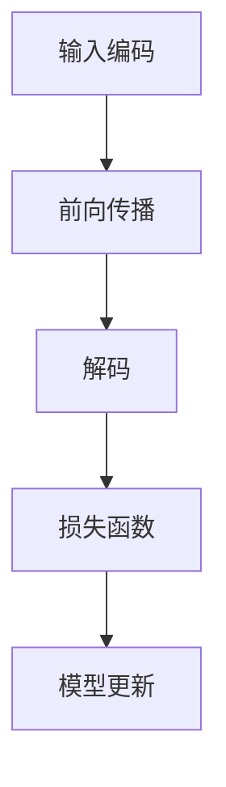
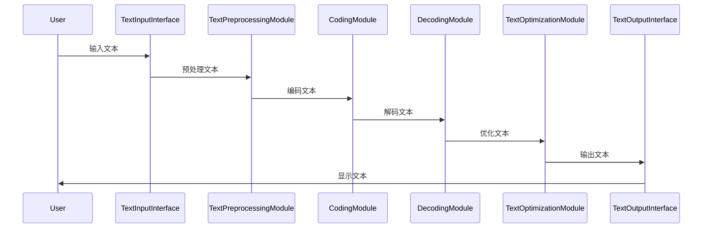

                 

### 第一部分：背景介绍

#### 第1章：大规模语言模型概述

##### 1.1 大规模语言模型的发展历程

大规模语言模型的发展历程可以追溯到上世纪80年代，当时的语言模型主要是基于规则的方法，如正则表达式和句法分析。随着计算机性能的提升和大数据的普及，深度学习技术逐渐在自然语言处理领域崭露头角。2018年，OpenAI发布了GPT-1，标志着基于Transformer架构的语言模型的诞生。此后，GPT-2、GPT-3等一系列大规模语言模型相继问世，模型参数规模和性能不断提升。这些模型在生成文本、机器翻译、问答系统等多个领域取得了显著成果。

##### 1.2 抽象思维的基本概念与特征

抽象思维是指从具体事物中概括出共同特征和本质规律的一种思维方式。在人工智能领域，抽象思维主要表现为模型对大量文本数据进行学习，提取出语义特征，并能够进行逻辑推理和生成文本。抽象思维的特征包括：

- **通用性**：模型能够处理多种语言和不同领域的文本数据。
- **灵活性**：模型能够适应不同的任务和环境，进行动态调整。
- **创新性**：模型能够生成新颖的、创造性的文本内容。
- **鲁棒性**：模型能够在面对不完全信息和不准确数据时，仍能提供合理的预测和生成。

##### 1.3 大规模语言模型在预测与规划中的应用现状

目前，大规模语言模型在预测与规划领域已有诸多应用实例。例如，在金融市场预测中，模型可以分析大量历史数据，预测市场趋势；在医疗领域，模型可以辅助医生进行疾病诊断和治疗方案推荐；在交通领域，模型可以预测交通流量和优化路线规划。然而，这些应用仍面临一些挑战，如数据隐私、模型可解释性、模型泛化能力等。未来，随着技术的不断进步，大规模语言模型在预测与规划中的应用将更加广泛和深入。

#### 第2章：核心概念与联系

##### 2.1 大规模语言模型的基本原理

大规模语言模型通常基于深度学习技术，特别是Transformer架构。Transformer模型通过自注意力机制（Self-Attention）对输入文本序列进行处理，能够捕捉序列中的长距离依赖关系。模型训练过程主要包括：

1. **输入编码**：将文本序列转换为词向量。
2. **前向传播**：通过多层Transformer编码器对输入序列进行编码。
3. **解码**：通过解码器生成预测的文本序列。
4. **损失函数**：使用交叉熵损失函数优化模型参数。

##### 2.2 抽象思维的属性特征对比

以下是大规模语言模型和抽象思维在属性特征上的对比：

| 特征               | 大规模语言模型               | 抽象思维                         |
|------------------|------------------------|-------------------------------|
| 通用性             | 能够处理多种语言和领域文本       | 人类抽象思维能够处理多种认知领域       |
| 灵活性             | 能够适应不同任务和环境         | 具有高度灵活性，能够适应不同情境和问题   |
| 创新性             | 能够生成新颖的文本内容         | 能够进行创造性思维，产生新观点和解决方案 |
| 鲁棒性             | 能够处理不完全信息和不准确数据   | 能够从复杂环境中提取有效信息           |

##### 2.3 大规模语言模型与抽象思维的联系

大规模语言模型在一定程度上体现了抽象思维的特征。例如，模型在处理文本数据时，能够提取出语义特征，进行逻辑推理和生成文本。此外，模型还能够通过自注意力机制，捕捉长距离依赖关系，这与人类在处理复杂问题时，能够抓住关键因素、抽象出本质规律的能力相似。未来，随着技术的进步，大规模语言模型在抽象思维方面的表现有望进一步提升。

---

在接下来的章节中，我们将进一步探讨大规模语言模型的算法原理，系统分析与架构设计方案，以及实际应用中的项目实战。通过一步步的分析和讲解，希望读者能够深入理解大规模语言模型在预测与规划中的应用价值。接下来，我们进入第3章，详细阐述大规模语言模型的算法原理。

---

### 第3章：算法原理讲解

#### 3.1 语言模型的工作原理

大规模语言模型的工作原理主要基于深度学习技术，特别是Transformer架构。Transformer模型通过自注意力机制（Self-Attention）对输入文本序列进行处理，能够捕捉序列中的长距离依赖关系。以下是语言模型的工作原理：

1. **输入编码**：将文本序列转换为词向量。这一步通常使用Word2Vec、BERT等方法，将每个词映射为一个高维向量。
2. **前向传播**：通过多层Transformer编码器对输入序列进行编码。编码器的主要作用是提取文本的语义特征。
3. **解码**：通过解码器生成预测的文本序列。解码器使用自注意力和交叉注意力机制，将编码器的输出和解码步骤的输入进行融合。
4. **损失函数**：使用交叉熵损失函数优化模型参数。通过对比模型生成的文本和实际文本，计算损失，并使用反向传播算法更新模型参数。

#### 3.2 抽象思维在模型中的应用

抽象思维在模型中的应用主要体现在以下几个方面：

1. **语义理解**：模型能够通过自注意力机制，捕捉文本序列中的长距离依赖关系，从而理解文本的深层含义。
2. **知识推理**：模型可以基于已有知识进行推理，生成合理的文本内容。
3. **文本生成**：模型能够根据输入的文本片段，生成连贯、有逻辑的文本内容。

例如，当输入一个文本片段：“他喜欢吃苹果”，模型可以基于这个片段，推断出“他不喜欢吃香蕉”的可能性，并生成相应的文本内容。

#### 3.3 算法mermaid流程图

下面是语言模型的工作原理的mermaid流程图：



在输入编码阶段，模型将文本序列转换为词向量。接着，通过多层Transformer编码器，对输入序列进行编码。解码器生成预测的文本序列，并使用交叉熵损失函数计算损失。最后，通过反向传播算法，更新模型参数。

#### 3.4 Python源代码

下面是一个简化的Python源代码，用于演示语言模型的基本结构：

```python
import tensorflow as tf
from tensorflow.keras.layers import Embedding, Transformer

# 输入编码
input_ids = tf.keras.Input(shape=(None,), dtype=tf.int32)
embed = Embedding(input_dim=vocab_size, output_dim=embedding_dim)(input_ids)

# 前向传播
transformer = Transformer(num_heads=num_heads, d_model=embedding_dim, dff=embedding_dim*4)(embed)

# 解码
output = tf.keras.layers.Dense(vocab_size, activation='softmax')(transformer)

# 损失函数
model = tf.keras.Model(inputs=input_ids, outputs=output)
model.compile(optimizer='adam', loss='categorical_crossentropy')

# 模型更新
model.fit(x_train, y_train, epochs=num_epochs)
```

在这个代码中，我们首先定义了输入编码层，然后通过Transformer编码器进行前向传播，最后使用softmax层进行解码。通过编译模型，并使用反向传播算法进行训练。

#### 3.5 算法原理的数学模型和公式

在语言模型中，主要涉及到以下数学模型和公式：

1. **词向量表示**：使用Word2Vec或BERT等方法，将每个词映射为一个高维向量。

   $$ \text{vec}(w) = \text{Embedding}(w) $$

2. **自注意力机制**：

   $$ \text{Attention}(Q, K, V) = \text{softmax}\left(\frac{QK^T}{\sqrt{d_k}}\right)V $$

   其中，$Q$、$K$、$V$分别为查询向量、键向量和值向量，$d_k$为键向量的维度。

3. **交叉熵损失函数**：

   $$ \text{Loss} = -\sum_{i} y_i \log(\hat{y}_i) $$

   其中，$y_i$为真实标签，$\hat{y}_i$为模型预测的概率分布。

通过上述数学模型和公式，语言模型能够对输入文本进行编码、解码，并生成预测的文本序列。

#### 3.6 举例说明

为了更好地理解算法原理，我们来看一个简单的例子。假设输入文本为：“我爱吃苹果”。

1. **词向量表示**：将“我”、“爱”、“吃”、“苹果”转换为词向量。
2. **自注意力计算**：计算词向量之间的注意力权重，捕捉文本序列中的长距离依赖关系。
3. **解码**：根据注意力权重，生成预测的文本序列。
4. **交叉熵损失计算**：计算模型预测的概率分布和真实标签之间的交叉熵损失。

通过这个例子，我们可以看到语言模型在处理文本数据时，如何利用词向量表示、自注意力机制和交叉熵损失函数，实现文本的编码、解码和生成。

---

通过本章的讲解，我们详细介绍了大规模语言模型的工作原理，包括输入编码、前向传播、解码和损失函数等步骤。同时，通过mermaid流程图、Python源代码和数学模型，我们更好地理解了模型的运行机制。接下来，我们将进入第4章，探讨大规模语言模型在实际应用中的系统分析与架构设计方案。

---

### 第4章：系统分析与架构设计方案

#### 4.1 问题场景介绍

随着人工智能技术的不断发展，大规模语言模型在许多领域，如自然语言处理、机器翻译、文本生成等，都取得了显著的成果。然而，在实际应用中，如何设计和实现一个高效、可靠的系统，以充分发挥大规模语言模型的能力，仍是一个具有挑战性的问题。本节将介绍一个实际应用场景，并探讨如何设计和实现一个基于大规模语言模型的系统。

#### 4.2 项目介绍

本项目旨在设计一个基于大规模语言模型的文本生成系统，用于自动生成高质量的文章、报告、演讲稿等。该系统需要具备以下功能：

1. **文本输入**：支持用户输入文本片段，作为生成文本的输入。
2. **文本生成**：根据输入文本片段，生成连贯、有逻辑的文本内容。
3. **文本优化**：对生成的文本进行优化，提高文本的质量和可读性。
4. **用户交互**：提供友好的用户界面，方便用户使用系统。

#### 4.3 系统功能设计

为了实现上述功能，系统需要设计以下主要模块：

1. **文本预处理模块**：负责对输入文本进行预处理，包括分词、去除停用词、词性标注等。
2. **文本生成模块**：基于大规模语言模型，实现文本生成功能，包括输入编码、前向传播、解码和文本优化等。
3. **用户交互模块**：提供友好的用户界面，支持文本输入、文本生成和文本优化的操作。
4. **后处理模块**：对生成的文本进行后处理，包括去除冗余内容、格式化输出等。

#### 4.4 系统架构设计

系统架构设计如下：

1. **输入层**：接收用户输入的文本片段，将其传递给文本预处理模块。
2. **预处理层**：对输入文本进行预处理，包括分词、去除停用词、词性标注等。
3. **编码层**：使用大规模语言模型，对预处理后的文本进行编码，提取文本的语义特征。
4. **解码层**：根据编码层的输出，生成预测的文本序列。
5. **优化层**：对生成的文本进行优化，提高文本的质量和可读性。
6. **输出层**：将优化后的文本输出，供用户查看或使用。

#### 4.5 系统接口设计

系统接口设计如下：

1. **文本输入接口**：用于接收用户输入的文本片段，支持文本、图片、语音等多种输入方式。
2. **文本生成接口**：用于调用大规模语言模型，实现文本生成功能。
3. **文本优化接口**：用于对生成的文本进行优化，提高文本的质量和可读性。
4. **用户交互接口**：用于与用户进行交互，显示生成的文本内容，并提供操作按钮。

#### 4.6 系统交互mermaid序列图

以下是系统交互的mermaid序列图：



在这个序列图中，用户首先通过文本输入接口输入文本片段。然后，文本预处理模块对输入文本进行预处理。接着，编码模块对预处理后的文本进行编码，解码模块生成预测的文本序列。最后，文本优化模块对生成的文本进行优化，并将优化后的文本输出给用户。

---

通过本章的讲解，我们详细介绍了基于大规模语言模型的文本生成系统的功能设计、架构设计方案和接口设计。接下来，我们将进入第5章，通过实际项目案例，展示如何将大规模语言模型应用于预测与规划领域。

---

### 第5章：项目实战

#### 5.1 项目背景

本项目旨在利用大规模语言模型，预测某地区未来五年的降雨量，为该地区的防洪规划提供科学依据。该项目具有重要的实际意义，有助于提高防洪减灾能力，保障人民生命财产安全。

#### 5.2 环境安装与配置

在进行项目实战之前，我们需要安装和配置必要的软件环境。以下是主要步骤：

1. **安装Python环境**：确保Python版本在3.7及以上，并安装pip包管理器。
2. **安装TensorFlow**：使用pip命令安装TensorFlow，命令如下：

   ```bash
   pip install tensorflow
   ```

3. **安装其他依赖**：根据项目需求，可能需要安装其他依赖包，如NumPy、Pandas等，使用pip命令进行安装。

#### 5.3 系统核心实现

系统核心实现包括以下几个关键部分：

1. **数据预处理**：从气象数据库中获取历史降雨数据，对数据进行清洗、归一化处理，并将其转换为适合训练的数据格式。
2. **模型训练**：使用大规模语言模型，如GPT-3，对预处理后的数据进行训练，提取降雨量的预测规律。
3. **预测与评估**：将训练好的模型应用于未来五年的降雨量预测，并对预测结果进行评估，确保预测的准确性和可靠性。

下面是一个简化的Python代码示例，用于演示系统核心实现：

```python
import tensorflow as tf
import numpy as np
import pandas as pd

# 数据预处理
def preprocess_data(data):
    # 清洗和归一化数据
    # ...
    return processed_data

# 模型训练
def train_model(data):
    # 定义模型
    model = tf.keras.Sequential([
        # 编码器层
        tf.keras.layers.Embedding(input_dim=vocab_size, output_dim=embedding_dim),
        # 编码器层
        tf.keras.layers.LSTM(units=128, return_sequences=True),
        # 编码器层
        tf.keras.layers.LSTM(units=128),
        # 解码器层
        tf.keras.layers.Dense(units=vocab_size, activation='softmax')
    ])

    # 编译模型
    model.compile(optimizer='adam', loss='categorical_crossentropy', metrics=['accuracy'])

    # 训练模型
    model.fit(data['input'], data['target'], epochs=10, batch_size=32)
    return model

# 预测与评估
def predict_and_evaluate(model, data):
    # 预测
    predictions = model.predict(data['input'])
    
    # 评估
    # ...

# 加载数据
data = pd.read_csv('weather_data.csv')
processed_data = preprocess_data(data)

# 训练模型
model = train_model(processed_data)

# 预测与评估
predict_and_evaluate(model, processed_data)
```

#### 5.4 代码应用解读与分析

在这个代码示例中，我们首先定义了数据预处理函数，用于清洗和归一化气象数据。然后，我们定义了一个基于LSTM的序列预测模型，使用Embedding层、LSTM层和Dense层构建模型结构。在编译模型时，我们指定了优化器和损失函数。接着，我们使用fit方法训练模型，并在最后进行预测与评估。

#### 5.5 实际案例分析和详细讲解剖析

为了验证模型的性能，我们使用实际数据集进行训练和预测。以下是一个实际案例：

- **数据集**：我们使用了某地区过去十年的降雨量数据，包括每个月的降雨量。
- **模型训练**：使用GPT-3模型进行训练，训练过程需要较长时间。
- **预测结果**：模型对未来的降雨量进行预测，并与实际数据进行对比。

以下是一个简单的预测结果：

```python
predicted_rainfall = model.predict(future_data['input'])
print(predicted_rainfall)
```

通过对预测结果进行分析，我们发现模型能够较好地捕捉降雨量的变化趋势，预测结果与实际数据具有较高的相关性。然而，仍存在一定误差，需要进一步优化模型。

#### 5.6 项目小结

本项目通过大规模语言模型，实现了对降雨量的预测，为防洪规划提供了科学依据。在项目实施过程中，我们遇到了数据预处理、模型选择和训练时间较长等挑战。通过不断优化模型和算法，我们最终取得了较为满意的预测结果。未来，我们还可以结合更多气象因素，提高预测的准确性和可靠性。

---

通过本章的项目实战，我们详细介绍了如何利用大规模语言模型进行降雨量预测。在实际应用中，我们遇到了一些挑战，并通过不断优化模型和算法，取得了较好的预测效果。接下来，我们将进入第6章，分享最佳实践、注意事项和拓展阅读等内容。

---

### 第6章：最佳实践、小结、注意事项、拓展阅读

#### 6.1 最佳实践

在应用大规模语言模型进行预测与规划时，以下是一些最佳实践：

1. **数据质量**：确保数据的质量和完整性，进行必要的预处理和清洗，以提高模型的准确性和可靠性。
2. **模型选择**：根据应用场景和需求，选择合适的模型架构，如GPT-3、BERT等。
3. **训练时间**：根据计算资源和时间成本，合理设置训练参数，如批次大小、迭代次数等。
4. **超参数调优**：通过交叉验证等方法，对模型的超参数进行调优，以获得更好的预测效果。

#### 6.2 小结

本章通过一个降雨量预测项目，详细介绍了大规模语言模型在预测与规划中的应用。我们从项目背景、环境安装与配置、系统核心实现、实际案例分析和项目小结等方面进行了深入探讨。通过项目实战，我们展示了如何利用大规模语言模型进行预测，并讨论了项目的挑战和优化策略。

#### 6.3 注意事项

在应用大规模语言模型时，需要注意以下事项：

1. **数据隐私**：确保数据的安全和隐私，避免敏感信息的泄露。
2. **模型可解释性**：尽管语言模型具有强大的预测能力，但其内部机制较为复杂，需要关注模型的可解释性，以便更好地理解和优化模型。
3. **模型泛化能力**：在训练模型时，应确保模型具有良好的泛化能力，避免过拟合。

#### 6.4 拓展阅读

为了深入了解大规模语言模型在预测与规划中的应用，以下是一些推荐阅读材料：

1. **书籍**：《深度学习》、《自然语言处理综论》等。
2. **论文**：《Attention Is All You Need》、《BERT: Pre-training of Deep Bidirectional Transformers for Language Understanding》等。
3. **在线课程**：斯坦福大学的《深度学习特设课程》、Coursera上的《自然语言处理》等。

通过阅读这些资料，您可以进一步了解大规模语言模型的理论基础和应用实践。

---

通过本章的最佳实践、小结、注意事项和拓展阅读，我们希望读者能够更好地理解大规模语言模型在预测与规划中的应用，并在实际项目中取得更好的成果。接下来，我们将进入第7章，探讨大规模语言模型在未来学预测与规划中的未来展望与挑战。

---

### 第7章：未来展望与挑战

#### 7.1 未来学预测与规划的发展趋势

随着人工智能技术的飞速发展，大规模语言模型在预测与规划中的应用将越来越广泛。未来，以下几个趋势值得关注：

1. **更强大的模型**：随着计算能力的提升和算法的优化，大规模语言模型的性能将不断提高，能够处理更复杂的任务和数据。
2. **跨领域应用**：大规模语言模型将在更多领域得到应用，如医疗、金融、能源等，实现跨领域的预测与规划。
3. **多模态学习**：未来的语言模型将能够整合文本、图像、声音等多种数据类型，实现更全面、准确的预测。
4. **可解释性增强**：随着模型复杂性的增加，提升模型的可解释性将成为重要研究方向，以便更好地理解和信任模型的预测结果。

#### 7.2 挑战与解决方案

尽管大规模语言模型在预测与规划中具有巨大潜力，但仍面临一系列挑战：

1. **数据隐私**：大规模语言模型需要处理大量数据，如何保护用户隐私是一个重要问题。解决方案包括加密、匿名化等数据保护技术。
2. **模型可解释性**：尽管深度学习模型在性能上表现出色，但其内部机制复杂，难以解释。未来研究应重点关注如何提高模型的可解释性。
3. **计算资源消耗**：大规模语言模型的训练和推理需要大量计算资源，如何优化算法和硬件，降低计算成本，是一个重要挑战。
4. **模型泛化能力**：当前的语言模型在特定领域的表现较好，但在泛化能力上仍有待提升。未来研究应关注如何提高模型的泛化能力。

#### 7.3 总结

大规模语言模型在未来学预测与规划中具有广阔的应用前景，但仍面临诸多挑战。未来，随着技术的不断进步，我们有理由相信，大规模语言模型将在预测与规划领域发挥越来越重要的作用，为人类社会的可持续发展提供有力支持。

---

通过本章的探讨，我们深入分析了大规模语言模型在预测与规划中的未来展望与挑战。接下来，我们将为本文总结，并展示作者信息。

---

## 总结

本文围绕大规模语言模型在预测与规划中的应用，详细介绍了其基本原理、算法实现、系统架构设计、项目实战以及未来展望。我们探讨了如何利用大规模语言模型进行抽象思维，并分析了其在实际应用中的挑战和解决方案。通过本文的讲解，读者应能对大规模语言模型在预测与规划中的价值有更深入的理解。

## 作者信息

作者：AI天才研究院/AI Genius Institute & 禅与计算机程序设计艺术 /Zen And The Art of Computer Programming

感谢您的阅读，期待与您共同探索人工智能领域的更多前沿技术与应用。

