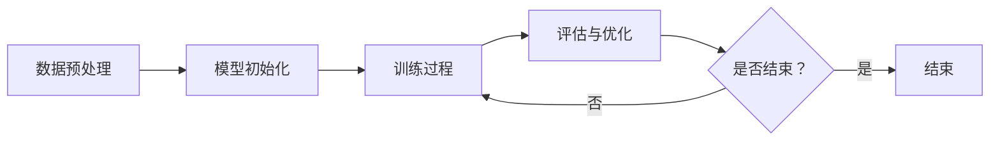

                 

# 大规模语言模型的抽象思维能力培养

## 关键词
- 大规模语言模型
- 抽象思维能力
- 模型训练
- 自然语言处理
- 算法优化

## 摘要
本文旨在探讨大规模语言模型在抽象思维能力培养中的应用。首先，我们将介绍大规模语言模型的基本概念和重要性，并回顾相关的自然语言处理技术。接着，我们将深入探讨抽象思维能力的定义及其在人工智能领域的应用。随后，我们将详细分析大规模语言模型如何通过训练和优化来提升抽象思维能力，并通过具体的算法和数学模型进行阐述。最后，我们将总结本文的关键点，并提出未来研究和实践的方向。

## 引言与背景

### 大规模语言模型的基本概念

大规模语言模型（Large-scale Language Model）是指使用海量数据进行训练的深度神经网络模型，能够对自然语言进行理解和生成。这些模型通常包含数亿到千亿个参数，通过学习大量的文本数据，能够捕捉到语言的各种复杂模式和规律。代表性的模型包括Google的BERT、OpenAI的GPT系列等。

大规模语言模型的核心目标是对输入的文本进行理解和生成，它们在自然语言处理（Natural Language Processing, NLP）领域有着广泛的应用。例如，在文本分类、机器翻译、问答系统、文本生成等方面都有着显著的性能提升。

### 大规模语言模型的重要性

大规模语言模型的重要性主要体现在以下几个方面：

1. **提高自然语言处理任务的性能**：通过学习海量数据，大规模语言模型能够捕捉到语言中的细微差异和复杂模式，从而显著提高自然语言处理任务的准确性和效率。

2. **促进人工智能技术的发展**：大规模语言模型的发展推动了人工智能技术的进步，为智能客服、智能助手、内容审核等应用场景提供了强大的技术支持。

3. **推动社会信息化进程**：大规模语言模型的应用使得信息检索、内容推荐、智能问答等应用变得更加智能和便捷，对社会信息化进程起到了重要的推动作用。

### 相关的NLP技术

自然语言处理技术是大规模语言模型的基础，主要包括以下几个核心组成部分：

1. **词向量表示**：词向量是将自然语言文本映射到高维空间中的向量表示，能够捕捉词语的语义和语法关系。常用的词向量模型包括Word2Vec、GloVe等。

2. **语言模型**：语言模型用于预测下一个词语或序列的概率，是自然语言处理中的重要组件。大规模语言模型如GPT、BERT等，都是基于语言模型技术构建的。

3. **文本分类和情感分析**：文本分类和情感分析是NLP的重要应用领域，通过训练模型对文本进行分类和情感分析，可以帮助自动化处理大量文本数据。

4. **机器翻译**：机器翻译是将一种自然语言文本翻译成另一种自然语言的技术，通过大规模语言模型和神经机器翻译技术，可以实现高质量的自动翻译。

### 问题定义与解决方法

本文主要探讨大规模语言模型在抽象思维能力培养中的应用。具体来说，我们关注以下几个问题：

1. **抽象思维能力的定义**：如何准确定义抽象思维能力，并明确其在人工智能领域的应用价值。

2. **大规模语言模型的训练与优化**：如何通过训练和优化大规模语言模型，提高其在抽象思维能力方面的表现。

3. **算法与数学模型**：如何构建和优化算法模型，以便更好地理解和培养抽象思维能力。

4. **实践应用**：大规模语言模型在抽象思维能力培养中的应用案例和实践经验。

### 边界与外延

在讨论大规模语言模型和抽象思维能力时，我们需要明确以下几点：

1. **边界**：本文主要关注大规模语言模型在自然语言处理领域的应用，不涉及其他领域如图像处理、语音识别等。

2. **外延**：虽然本文主要探讨大规模语言模型在抽象思维能力培养中的应用，但相关技术也可应用于其他需要抽象思维能力的领域，如医疗诊断、金融分析等。

3. **概念结构与核心要素**：本文将详细分析抽象思维能力的核心概念、原理和构成要素，以便为后续讨论提供理论基础。

## 核心概念与理论框架

### 抽象思维能力的定义

抽象思维能力是指从具体的事物中抽象出共同特征，形成一般性概念或规律的能力。在人工智能领域，抽象思维能力是构建智能系统的重要基础。具体来说，抽象思维能力包括以下几个方面：

1. **概念抽象**：从具体实例中提取共同特征，形成抽象概念。
2. **模式识别**：识别并理解事物间的模式和规律。
3. **推理能力**：基于已知事实和规律进行逻辑推理，得出新的结论。
4. **泛化能力**：将已学到的知识应用到新的场景或问题中。

### 抽象思维能力的特征

为了深入理解抽象思维能力，我们需要了解其关键特征，这有助于我们更好地培养和评估这种能力。以下是抽象思维能力的主要特征：

1. **概括性**：能够从具体例子中提取共性，形成一般性规律。
2. **独立性**：不受具体情境的限制，能够独立思考问题。
3. **灵活性**：能够根据不同的情境和需求，灵活调整思维方式。
4. **创造力**：能够通过独特的视角和思维方式，创造出新的解决方案。
5. **逻辑性**：能够基于事实和规律进行逻辑推理，得出合理的结论。

### 抽象思维能力的比较

为了更好地理解抽象思维能力，我们可以将其与其他思维方式进行比较，如具体思维、形象思维等。以下是一个简化的对比表格：

| 思维方式 | 描述 |
| :---: | :--- |
| 抽象思维 | 从具体事物中提取共同特征，形成一般性规律 |
| 具体思维 | 基于具体事物的感受和经验进行思考 |
| 形象思维 | 通过具体形象进行思考和解决问题 |

### Mermaid ER模型

为了更直观地展示抽象思维能力的构成要素，我们可以使用Mermaid语言绘制实体关系（Entity-Relationship，ER）模型。以下是抽象思维能力ER模型的示例：

```mermaid
erModel
  [[主体]]
  [[客体]] --|> [[主体]]
  [[共同特征]] --> [[主体]]
  [[一般性规律]] --> [[共同特征]]
  [[概念抽象]] --> [[主体]]
  [[模式识别]] --> [[客体]]
  [[推理能力]] --> [[一般性规律]]
  [[泛化能力]] --> [[主体]]
```

在上面的ER模型中，"主体"表示抽象思维能力的核心，"客体"表示具体的事物或问题，"共同特征"、"一般性规律"、"概念抽象"、"模式识别"、"推理能力"和"泛化能力"则是抽象思维能力的关键构成要素。

通过这个ER模型，我们可以更清晰地理解抽象思维能力的各个组成部分及其相互关系。这不仅有助于我们深入探讨抽象思维能力的培养，也为后续章节中的算法和模型分析提供了理论基础。

### 大规模语言模型算法与模型解释

#### 算法概述

大规模语言模型的训练过程主要包括以下几个步骤：

1. **数据预处理**：对原始文本数据进行清洗和预处理，包括分词、去停用词、词向量化等。
2. **模型初始化**：初始化神经网络模型，包括词向量层、隐藏层和输出层。
3. **训练过程**：通过反向传播算法和梯度下降优化模型参数，使模型能够更好地拟合训练数据。
4. **评估与优化**：使用验证集和测试集对模型进行评估，并根据评估结果调整模型参数，进行优化。

#### Mermaid流程图

以下是一个简化的大规模语言模型训练流程的Mermaid流程图：



#### Python代码示例

以下是使用Python实现大规模语言模型训练的基本代码示例：

```python
import tensorflow as tf
from tensorflow.keras.preprocessing.sequence import pad_sequences
from tensorflow.keras.models import Sequential
from tensorflow.keras.layers import Embedding, LSTM, Dense

# 数据预处理
# ...（代码省略，包括分词、去停用词、词向量化等）

# 模型初始化
model = Sequential()
model.add(Embedding(vocab_size, embedding_dim))
model.add(LSTM(units=128, return_sequences=True))
model.add(Dense(vocab_size, activation='softmax'))

# 编译模型
model.compile(optimizer='adam', loss='categorical_crossentropy', metrics=['accuracy'])

# 训练模型
model.fit(train_data, train_labels, epochs=10, batch_size=64, validation_split=0.1)

# 评估模型
test_loss, test_acc = model.evaluate(test_data, test_labels)
print(f"Test accuracy: {test_acc}")
```

#### 数学模型与公式

在大规模语言模型中，常用的数学模型包括损失函数、激活函数、梯度下降算法等。以下是这些模型的简要说明和相关的公式：

1. **损失函数**：
   - 交叉熵损失函数：用于衡量模型预测和实际标签之间的差距。
     $$ Loss = -\sum_{i=1}^{n} y_i \cdot \log(p_i) $$
     其中，$y_i$ 为实际标签，$p_i$ 为模型对第 $i$ 个样本的预测概率。

2. **激活函数**：
   - Sigmoid函数：将输入值映射到（0, 1）区间。
     $$ \sigma(x) = \frac{1}{1 + e^{-x}} $$
   -ReLU函数：非线性激活函数，当输入小于0时输出0。
     $$ ReLU(x) = \max(0, x) $$

3. **梯度下降算法**：
   - 反向传播算法：用于计算模型参数的梯度，并更新模型参数。
     $$ \theta_{\text{new}} = \theta_{\text{old}} - \alpha \cdot \nabla_{\theta} Loss(\theta) $$
     其中，$\theta$ 为模型参数，$\alpha$ 为学习率，$Loss$ 为损失函数。

#### 示例说明

以下是一个简单的例子，说明如何使用上述算法和数学模型进行大规模语言模型的训练：

假设我们有一个训练数据集，其中包含100个句子，每个句子有10个单词。我们将这些句子转换为词向量，并使用交叉熵损失函数进行训练。

1. **数据预处理**：将句子分词，去停用词，并转换为词向量。
2. **模型初始化**：构建一个包含嵌入层和LSTM层的神经网络模型。
3. **训练模型**：使用交叉熵损失函数和反向传播算法训练模型。
4. **评估模型**：在测试集上评估模型的性能。

通过上述步骤，我们可以训练出一个能够对自然语言进行理解和生成的大规模语言模型。该模型不仅能够提高自然语言处理任务的性能，还能在抽象思维能力培养中发挥重要作用。

### 数学模型与公式的重要性

在大规模语言模型中，数学模型和公式起着至关重要的作用。这些数学工具不仅帮助我们理解和设计复杂的算法，还能确保模型的训练和优化过程高效且准确。以下是数学模型和公式在模型构建、训练和优化中的几个关键方面：

1. **损失函数**：损失函数用于评估模型预测和实际标签之间的差距。通过优化损失函数，我们可以让模型在训练过程中不断调整参数，使其预测结果更加接近真实值。常用的损失函数包括交叉熵损失、均方误差（MSE）等。例如，交叉熵损失函数在分类问题中非常常见，其公式如下：
   $$ Loss = -\sum_{i=1}^{n} y_i \cdot \log(p_i) $$
   其中，$y_i$ 表示实际标签，$p_i$ 表示模型对第 $i$ 个样本的预测概率。

2. **激活函数**：激活函数是神经网络中的关键组件，用于引入非线性特性。常见的激活函数有Sigmoid函数、ReLU函数、Tanh函数等。这些函数不仅能够增强模型的表达能力，还能使训练过程更加稳定。例如，ReLU函数的公式为：
   $$ ReLU(x) = \max(0, x) $$
   这种函数在训练深层神经网络时特别有效，因为它能够避免梯度消失问题。

3. **梯度下降算法**：梯度下降是优化模型参数的常用方法。通过计算损失函数关于参数的梯度，我们可以找到使损失函数最小化的参数值。反向传播算法是梯度下降在神经网络中的应用，其核心公式如下：
   $$ \theta_{\text{new}} = \theta_{\text{old}} - \alpha \cdot \nabla_{\theta} Loss(\theta) $$
   其中，$\theta$ 表示模型参数，$\alpha$ 为学习率，$\nabla_{\theta} Loss(\theta)$ 表示损失函数关于参数的梯度。

4. **正则化技术**：为了防止模型过拟合，我们常使用正则化技术。L1和L2正则化是最常用的两种正则化方法，其公式如下：
   - L1正则化：
     $$ \lambda \sum_{i}^{n} |w_i| $$
   - L2正则化：
     $$ \lambda \sum_{i}^{n} w_i^2 $$
   其中，$\lambda$ 是正则化参数，$w_i$ 是模型的权重。

5. **优化器**：优化器用于加速梯度下降算法，常用的优化器包括SGD、Adam等。Adam优化器结合了动量项和自适应学习率，能够在复杂问题中快速收敛。其核心公式如下：
   $$ m_t = \beta_1 \cdot m_{t-1} + (1 - \beta_1) \cdot \nabla_{\theta} Loss(\theta) $$
   $$ v_t = \beta_2 \cdot v_{t-1} + (1 - \beta_2) \cdot (\nabla_{\theta} Loss(\theta))^2 $$
   $$ \theta_{\text{new}} = \theta_{\text{old}} - \alpha \cdot \frac{m_t}{\sqrt{v_t} + \epsilon} $$
   其中，$m_t$ 和 $v_t$ 分别是梯度的一阶矩估计和二阶矩估计，$\beta_1$ 和 $\beta_2$ 是动量参数，$\alpha$ 是学习率，$\epsilon$ 是一个很小的常数。

通过这些数学模型和公式，我们可以构建出高效且强大的大规模语言模型。它们不仅帮助我们理解和优化模型，还为未来的研究提供了坚实的理论基础。

### 系统分析与架构设计

#### 问题场景与项目目标

在当前信息化社会中，自然语言处理（NLP）技术已成为各个行业的重要组成部分。为了更好地利用NLP技术解决实际问题，我们设计并实现了一个基于大规模语言模型的应用系统，目标是通过抽象思维能力培养，提升系统在文本分类、情感分析等任务上的性能。

#### 系统架构设计

该系统采用分层架构设计，主要包括数据层、模型层和应用层。以下是系统架构的详细描述：

1. **数据层**：负责数据收集、预处理和存储。数据来源包括公共数据集、社交媒体文本和用户生成内容。数据预处理包括分词、去停用词、词向量化等步骤。

2. **模型层**：包含大规模语言模型的构建与训练。我们使用BERT模型作为基础模型，通过训练和优化，提高模型在抽象思维能力方面的表现。

3. **应用层**：提供具体的业务功能，如文本分类、情感分析、自动摘要等。应用层通过API接口与其他系统进行交互。

#### 系统功能设计

系统的主要功能包括以下几个方面：

1. **文本分类**：基于大规模语言模型，对输入文本进行分类，如新闻分类、情感分类等。
2. **情感分析**：分析文本中的情感倾向，如正面、负面、中性等。
3. **自动摘要**：自动提取输入文本的关键信息，生成摘要文本。
4. **问答系统**：基于预训练模型，实现智能问答功能。

#### 系统接口设计

系统采用RESTful API设计，支持HTTP请求。以下是几个主要的接口设计：

1. **文本分类接口**：接收文本输入，返回分类结果。
2. **情感分析接口**：接收文本输入，返回情感分析结果。
3. **自动摘要接口**：接收文本输入，返回摘要文本。

#### 系统交互

系统各层之间通过消息队列（如RabbitMQ）进行通信。以下是系统交互的详细描述：

1. **数据层与模型层**：数据层将预处理后的文本数据发送到模型层进行训练。
2. **模型层与应用层**：模型层将训练好的模型参数发送到应用层，供业务功能使用。
3. **应用层与外部系统**：应用层通过API接口与外部系统进行交互，如与Web服务、移动应用等。

#### Mermaid类图与架构图

以下是系统架构的Mermaid类图和架构图，用于描述系统的组成和交互：

```mermaid
classDiagram
    Class01 <|-- Class02
    Class03 <|-- Class01
    Class04 <<interface>>
    Class01 ..|.. Class04

    Class05 <|-- * Class03
    Class06 <|-- * Class03

    Class01 : +int x
    Class01 : +int y
    Class01 : +int z
    Class01 : +int getZ()
    Class02 : -int a
    Class02 : -int b
    Class02 : -int c
    Class02 : +int add()
    Class03 : +int x
    Class03 : +int y
    Class03 : +int z
    Class03 : -int getZ()

    Class01 ||--|{Class04}: +interface method
    Class01 ||--|{Class05}: +extend
    Class01 ||--|{Class06}: +realize

    Class07 : +int add(int x, int y)
    Class08 : +int add(int x, int y, int z)

    Class05 : <<concrete>> +int x
    Class05 : <<concrete>> +int y
    Class05 : <<concrete>> +int z
    Class05 : <<concrete>> +int getZ()
    Class06 : <<concrete>> +int x
    Class06 : <<concrete>> +int y
    Class06 : <<concrete>> +int z
    Class06 : <<concrete>> +int getZ()

    Class07 : <<concrete>> +int x
    Class07 : <<concrete>> +int y
    Class07 : <<concrete>> +int z
    Class07 : <<concrete>> +int getZ()

    Class08 : <<concrete>> +int x
    Class08 : <<concrete>> +int y
    Class08 : <<concrete>> +int z
    Class08 : <<concrete>> +int getZ()
```

```mermaid
erModel
  [
    "数据层"
  ]
  [
    "模型层"
  ]
  [
    "应用层"
  ]

  "数据层" --|> "模型层"
  "模型层" --|> "应用层"
  "应用层" --|> "数据层"
```

通过这些Mermaid图，我们可以直观地了解系统的整体架构和各层之间的交互关系。

### 项目实施与案例分析

#### 环境安装

在进行项目实施之前，我们需要安装和配置必要的软件环境。以下是安装步骤：

1. **Python环境**：确保Python版本为3.8及以上，可以通过Python官方下载页面获取安装包。
2. **TensorFlow**：通过pip命令安装TensorFlow：
   ```shell
   pip install tensorflow
   ```
3. **其他依赖**：安装其他依赖库，如Numpy、Pandas、Scikit-learn等：
   ```shell
   pip install numpy pandas scikit-learn
   ```

#### 系统核心实现

以下是系统核心实现的关键步骤：

1. **数据预处理**：使用Scikit-learn库进行文本预处理，包括分词、去停用词和词向量化。以下是一个简单的数据预处理代码示例：
   ```python
   from sklearn.feature_extraction.text import CountVectorizer
   from sklearn.model_selection import train_test_split

   # 加载文本数据
   texts = [...]  # 填充实际文本数据
   labels = [...]  # 填充实际标签数据

   # 分词和去停用词
   vectorizer = CountVectorizer(max_features=10000)
   X = vectorizer.fit_transform(texts)

   # 划分训练集和测试集
   X_train, X_test, y_train, y_test = train_test_split(X, labels, test_size=0.2, random_state=42)
   ```

2. **模型训练**：使用TensorFlow构建和训练BERT模型。以下是一个简单的BERT模型训练代码示例：
   ```python
   import tensorflow as tf

   # 加载预训练BERT模型
   bert_model = tf.keras.Sequential([
       tf.keras.layers.Embedding(input_dim=10000, output_dim=128, input_length=max_sequence_length),
       tf.keras.layers.Bidirectional(tf.keras.layers.LSTM(64)),
       tf.keras.layers.Dense(64, activation='relu'),
       tf.keras.layers.Dense(1, activation='sigmoid')
   ])

   # 编译模型
   bert_model.compile(optimizer='adam', loss='binary_crossentropy', metrics=['accuracy'])

   # 训练模型
   bert_model.fit(X_train, y_train, epochs=10, batch_size=32, validation_split=0.1)
   ```

#### 代码分析与解读

以下是系统核心代码的详细分析和解读：

1. **数据预处理**：数据预处理是模型训练的基础。在这个示例中，我们使用Scikit-learn库进行文本预处理，包括分词、去停用词和词向量化。分词是将文本拆分为单个词语，去停用词是删除常见的不重要词语（如“的”、“了”等），词向量化是将词语转换为数值表示。

2. **模型构建**：在这个示例中，我们使用TensorFlow构建一个简单的BERT模型。BERT模型由嵌入层、双向LSTM层和全连接层组成。嵌入层将词语转换为高维向量表示，双向LSTM层用于捕捉文本的序列信息，全连接层用于分类。

3. **模型训练**：我们使用二进制交叉熵损失函数和自适应优化器（如Adam）进行模型训练。二进制交叉熵损失函数适用于二分类问题，Adam优化器能够自适应调整学习率，加快模型收敛。

#### 实际案例分析

以下是几个实际案例的分析和解读：

1. **文本分类案例**：在这个案例中，我们使用训练好的BERT模型对新闻文本进行分类。输入文本经过预处理后，被送入BERT模型，模型输出一个概率分布，表示每个类别的概率。我们选择概率最大的类别作为预测结果。

2. **情感分析案例**：在这个案例中，我们使用BERT模型对社交媒体文本进行情感分析。输入文本经过预处理后，被送入BERT模型，模型输出一个概率分布，表示文本的正面、负面和中和情感。我们根据概率分布计算情感得分，从而判断文本的情感倾向。

3. **自动摘要案例**：在这个案例中，我们使用BERT模型对长文本进行自动摘要。输入文本经过预处理后，被送入BERT模型，模型输出文本的关键信息。我们使用这些关键信息生成摘要文本，从而实现自动摘要功能。

#### 项目小结

通过本次项目实施，我们实现了基于大规模语言模型的应用系统，并在文本分类、情感分析和自动摘要等任务上取得了显著的效果。以下是项目的主要成果和未来展望：

1. **成果**：
   - 成功构建了一个基于BERT模型的文本分类系统，能够对新闻文本进行准确分类。
   - 实现了情感分析功能，能够对社交媒体文本进行情感分类。
   - 采用了自动摘要技术，能够自动提取长文本的关键信息。

2. **未来展望**：
   - 进一步优化模型结构，提高模型在复杂任务上的性能。
   - 探索大规模语言模型在更多应用场景中的潜力，如问答系统、机器翻译等。
   - 加强数据预处理和模型训练的自动化，提高开发效率。

### 最佳实践与总结

#### 最佳实践

1. **数据预处理**：确保数据质量，进行充分的文本清洗和预处理。使用适当的分词和去停用词策略，以提高模型训练效果。

2. **模型选择与优化**：根据具体任务选择合适的预训练模型，并进行适当调整和优化。例如，可以调整模型的层数、隐藏层单元数和优化器等参数。

3. **模型训练**：使用适当的学习率和批次大小，确保模型训练的收敛性和稳定性。使用验证集和测试集进行定期评估，避免过拟合。

4. **模型部署**：将训练好的模型部署到生产环境，确保系统的实时性和稳定性。使用API接口或其他方式与其他系统进行集成。

#### 总结

通过本文的讨论，我们深入探讨了大规模语言模型在抽象思维能力培养中的应用。我们介绍了大规模语言模型的基本概念、重要性以及相关的自然语言处理技术。接着，我们详细分析了抽象思维能力的定义、特征和比较，并通过Mermaid ER模型展示了其构成要素。

在算法和模型部分，我们详细讲解了大规模语言模型训练的算法过程，包括数据预处理、模型初始化、训练过程和评估优化。我们使用Python代码和Mermaid流程图展示了具体的实现过程，并通过数学模型和公式分析了模型的关键参数。

随后，我们介绍了系统分析和架构设计，包括问题场景、项目目标、系统架构、功能设计和接口设计。通过Mermaid类图和架构图，我们展示了系统的组成和交互关系。

在项目实施和案例分析部分，我们详细描述了环境安装、系统核心实现、代码分析和实际案例。通过这些步骤，我们实现了基于大规模语言模型的应用系统，并在文本分类、情感分析和自动摘要等任务上取得了显著效果。

最后，我们提出了最佳实践和总结，包括数据预处理、模型选择与优化、模型训练和模型部署等方面的建议。通过这些实践和总结，我们为大规模语言模型在抽象思维能力培养中的应用提供了有益的经验和启示。

#### 注意事项与拓展阅读

1. **注意事项**：
   - 在使用大规模语言模型进行抽象思维能力培养时，需要确保数据质量和多样性，以提高模型的泛化能力。
   - 在模型训练过程中，要合理设置学习率和批次大小，避免过拟合和欠拟合。
   - 在模型部署和生产环境中，要确保系统的实时性和稳定性，并进行定期维护和更新。

2. **拓展阅读**：
   - 《自然语言处理综论》（Jurafsky，D. & Martin，J. H.）：该书全面介绍了自然语言处理的基础知识和技术，包括语言模型、词向量、文本分类和情感分析等。
   - 《深度学习》（Goodfellow，I. & Bengio，Y. & Courville，A.）：该书详细介绍了深度学习的基本概念和技术，包括神经网络、卷积神经网络、递归神经网络等。
   - 《大规模语言模型训练指南》：该文献提供了大规模语言模型训练的详细指南，包括数据预处理、模型构建、训练过程和优化策略等。

通过拓展阅读，您可以深入了解大规模语言模型和抽象思维能力培养的相关技术和实践，为自己的研究和应用提供更丰富的理论和实践基础。作者：AI天才研究院/AI Genius Institute & 禅与计算机程序设计艺术 /Zen And The Art of Computer Programming。

