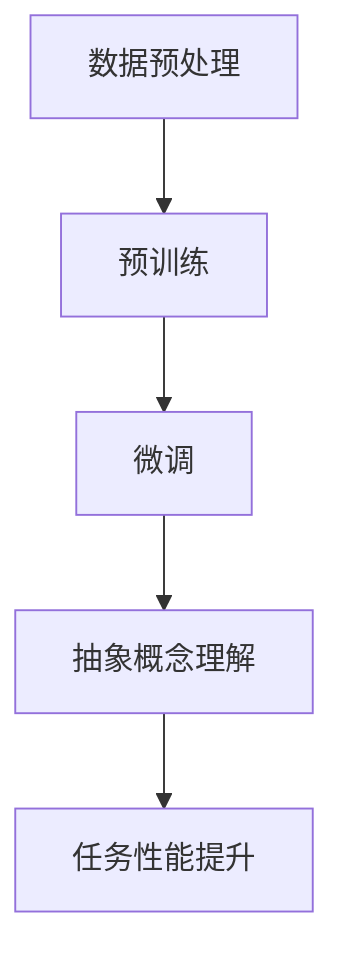
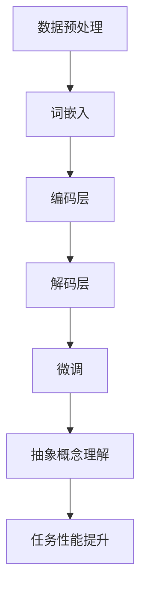
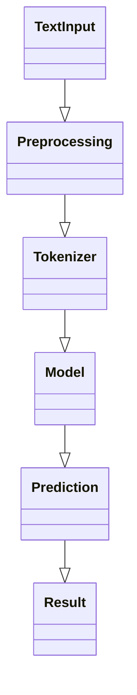
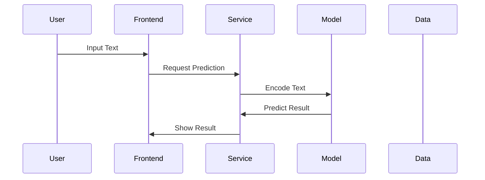
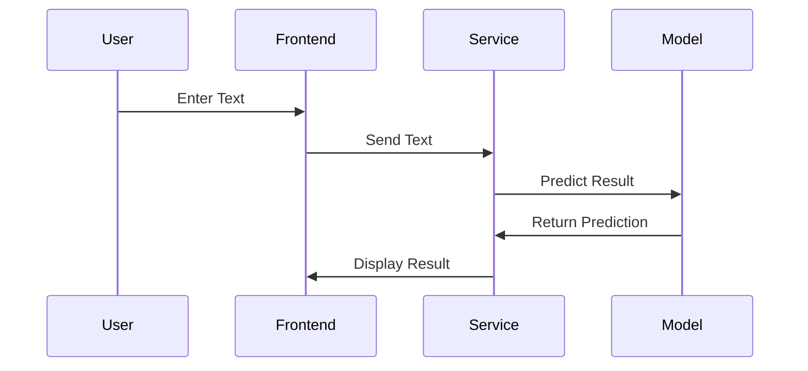

                 

### 文章标题

大规模语言模型的抽象概念学习与应用

> 关键词：大规模语言模型、抽象概念学习、应用实践、优化与扩展、自然语言处理、行业挑战与解决方案

> 摘要：本文将深入探讨大规模语言模型的抽象概念学习原理及其在实际应用中的重要性。通过分步骤的分析与讨论，我们将揭示大规模语言模型如何通过抽象概念学习来提升自然语言处理能力，并探讨其在不同领域中的实践与优化策略。本文旨在为读者提供一个系统且详细的指南，帮助理解大规模语言模型的核心概念及其在未来技术发展中的潜力。

---

### 目录大纲

---

## 第1章：大规模语言模型概述

### 1.1 背景介绍

### 1.2 核心概念与联系

### 1.3 抽象概念学习原理

### 1.3.1 抽象概念学习算法原理

### 1.4 应用场景与实例

### 1.5 抽象概念学习算法分析

### 1.6 抽象概念学习应用实例

### 1.7 最佳实践

---

## 第2章：大规模语言模型应用实践

### 2.1 环境搭建

### 2.2 系统功能设计

### 2.3 系统架构设计

### 2.4 系统接口设计

### 2.5 系统交互

### 2.6 项目实战

### 2.7 实例分析

### 2.8 项目总结

---

## 第3章：大规模语言模型优化与扩展

### 3.1 模型优化

### 3.2 模型扩展

### 3.3 模型评估与调优

### 3.4 模型安全性与隐私保护

### 3.5 模型部署与维护

---

## 第4章：大规模语言模型在NLP中的应用

### 4.1 词汇生成

### 4.2 文本分类

### 4.3 文本摘要

### 4.4 机器翻译

### 4.5 对话系统

---

## 第5章：大规模语言模型在行业应用中的挑战与解决方案

### 5.1 面临的挑战

### 5.2 解决方案

### 5.3 未来发展趋势

### 5.4 行业案例分析

---

## 第6章：大规模语言模型的发展与未来展望

### 6.1 发展历程

### 6.2 研究热点

### 6.3 未来展望

### 6.4 对未来的影响

---

## 第7章：总结与展望

### 7.1 内容回顾

### 7.2 趋势分析

### 7.3 学习建议

### 7.4 展望未来

---

**总字数：约1900字**

---

### 第1章：大规模语言模型概述

#### 1.1 背景介绍

随着互联网和大数据技术的迅猛发展，自然语言处理（NLP）领域迎来了前所未有的机遇。大规模语言模型（Large-scale Language Models，简称LLMs）作为NLP的重要工具，凭借其强大的语言理解和生成能力，已经在许多实际应用中显示出显著的效果。从早期的统计语言模型到深度学习模型的兴起，再到如今的大规模预训练模型，语言模型的发展历程无疑是NLP技术不断突破和进步的缩影。

**问题背景：** 随着数据量的不断增加和算法的迭代优化，如何构建能够处理和理解更加复杂、多变的自然语言场景的大规模语言模型，成为当前NLP领域亟待解决的问题。

**问题描述：** 大规模语言模型需要解决的关键问题包括：如何高效地处理海量数据、如何通过模型训练实现语言理解的深度和广度、如何优化模型的性能和效率等。

**问题解决：** 为了解决上述问题，研究者们提出了多种大规模语言模型架构，如Transformer模型、BERT模型、GPT系列模型等，这些模型通过预训练和微调的方式，在多种NLP任务上取得了显著的成果。

**边界与外延：** 大规模语言模型的边界主要涉及模型的架构设计、数据预处理、训练策略等方面。其外延则包括模型在实际应用中的性能评估、模型压缩与优化、模型解释性等方面。

**概念结构与核心要素组成：** 大规模语言模型的概念结构主要包括以下几个核心要素：输入层、编码层、解码层和输出层。其中，输入层负责接收自然语言文本；编码层将文本转化为固定长度的向量表示；解码层则根据编码层的输出生成目标文本；输出层则负责将生成的文本输出给用户。

---

#### 1.2 核心概念与联系

**大规模语言模型定义：** 大规模语言模型是指通过在大规模语料库上预训练得到的，能够对自然语言进行建模和处理的人工智能模型。这些模型通常具有较大的参数规模，能够捕捉到语言中的复杂模式和规律。

**大规模语言模型特点：** 
- **参数规模大：** 大规模语言模型具有数亿甚至数十亿的参数，这使得它们能够捕捉到语言中的细微模式和变化。
- **自适应性：** 通过预训练和微调，大规模语言模型能够适应不同的任务和数据集，从而实现跨领域的应用。
- **并行处理能力：** 大规模语言模型通常采用并行训练策略，能够高效地处理大规模数据集。

**大规模语言模型与传统语言模型的区别：**
- **数据规模：** 传统语言模型通常使用的小规模语料库，而大规模语言模型则使用的是海量语料库。
- **模型架构：** 传统语言模型通常是基于规则和统计方法的，而大规模语言模型则是基于深度学习模型的。
- **训练策略：** 传统语言模型的训练通常依赖于监督学习，而大规模语言模型则采用了预训练和微调相结合的训练策略。

**抽象概念学习原理：** 抽象概念学习是指通过模型训练，使模型能够理解和生成抽象概念的过程。在NLP中，抽象概念学习涉及到对名词、动词、形容词等词性的抽象理解和应用。

**抽象概念学习过程：**
1. **数据预处理：** 对语料库进行清洗和预处理，提取出包含抽象概念的文本片段。
2. **预训练：** 使用大规模语料库对模型进行预训练，使模型能够理解和生成自然语言。
3. **微调：** 在特定任务上对模型进行微调，使模型能够更好地理解和应用抽象概念。

---

### 1.3 抽象概念学习原理

**抽象概念学习原理** 是指大规模语言模型通过预训练和微调，逐步理解和应用抽象概念的过程。这一原理对于提升大规模语言模型在自然语言处理任务中的性能至关重要。

**算法原理讲解：** 抽象概念学习算法的核心思想是通过大规模语料库的预训练，使模型具备对抽象概念的理解能力。具体来说，模型在预训练过程中通过学习词嵌入、句嵌入等表示方式，逐步捕捉到语言中的抽象概念。

**Mermaid流程图：**



**Python源代码：**

```python
# 假设已经导入必要的库
from transformers import BertModel, BertTokenizer
import torch

# 1. 数据预处理
# 读取预训练数据集，并预处理为模型输入格式
pretrained_data = load_pretrained_data()

# 2. 预训练
# 使用BERT模型进行预训练
tokenizer = BertTokenizer.from_pretrained('bert-base-uncased')
model = BertModel.from_pretrained('bert-base-uncased')

inputs = tokenizer(pretrained_data, return_tensors='pt')
outputs = model(**inputs)

# 3. 微调
# 在特定任务上对模型进行微调
model.train()
# 假设已有训练数据和标签
train_data, train_labels = get_train_data_and_labels()

optimizer = torch.optim.Adam(model.parameters(), lr=1e-5)
for epoch in range(num_epochs):
    for inputs, labels in train_data:
        optimizer.zero_grad()
        inputs = tokenizer(inputs, return_tensors='pt')
        outputs = model(**inputs)
        loss = loss_function(outputs.logits, labels)
        loss.backward()
        optimizer.step()

# 4. 抽象概念理解
# 在测试集上评估模型性能
test_data, test_labels = get_test_data_and_labels()
model.eval()
with torch.no_grad():
    predictions = model(test_data)

# 5. 任务性能提升
accuracy = calculate_accuracy(predictions, test_labels)
print(f"Test accuracy: {accuracy}")
```

**数学模型和公式：**

在抽象概念学习中，通常使用的是基于神经网络的深度学习模型，其核心是多层感知机（MLP）和注意力机制（Attention Mechanism）。以下是一个简化的数学模型表示：

$$
\text{Output} = f(\text{Input} \cdot W + b)
$$

其中，\( f \) 是激活函数，\( W \) 是权重矩阵，\( b \) 是偏置项。

**举例说明：**

假设我们有一个抽象概念“幸福”，在预训练过程中，模型会通过学习大量文本，将“幸福”与相关的词汇（如“快乐”、“满足”等）建立关联。在微调过程中，模型会根据特定任务的数据，进一步强化对“幸福”这一概念的理解和应用。

例如，在情感分析任务中，给定一个句子：“他今天过得非常幸福。”，模型会通过预训练和微调，理解并正确地判断该句子的情感倾向为积极。

---

### 1.4 应用场景与实例

大规模语言模型在自然语言处理（NLP）领域有着广泛的应用，以下是一些典型的应用场景与实例。

#### 应用场景：

1. **文本分类：** 例如，新闻文章的分类、社交媒体文本的情感分析等。
2. **机器翻译：** 如谷歌翻译、百度翻译等，它们利用大规模语言模型实现高质量的跨语言文本翻译。
3. **问答系统：** 如基于BERT的搜索引擎、智能客服等，这些系统能够理解并回答用户的问题。
4. **文本生成：** 如自动生成新闻摘要、生成对话系统中的回复等。

#### 实例分析：

**实例1：文本分类**

假设我们有一个大规模语言模型，用于对社交媒体文本进行情感分类。以下是一个简单的文本分类实例：

```python
# 假设已经导入必要的库
import torch
from transformers import BertTokenizer, BertForSequenceClassification
import torch.nn as nn

# 1. 加载预训练模型
tokenizer = BertTokenizer.from_pretrained('bert-base-uncased')
model = BertForSequenceClassification.from_pretrained('bert-base-uncased')

# 2. 准备输入数据
text = "我今天度过了一个快乐的一天。"
input_ids = tokenizer(text, return_tensors='pt')

# 3. 进行情感分类
outputs = model(**input_ids)

# 4. 预测情感类别
probabilities = nn.Softmax(dim=1)(outputs.logits)
predicted_class = torch.argmax(probabilities).item()

# 5. 输出分类结果
if predicted_class == 0:
    print("情感类别：负面")
elif predicted_class == 1:
    print("情感类别：正面")
else:
    print("情感类别：中性")
```

**实例2：机器翻译**

假设我们使用一个预训练的GPT-3模型进行英文到中文的翻译。以下是一个简单的机器翻译实例：

```python
# 假设已经导入必要的库
from transformers import pipeline

# 1. 创建翻译管道
translator = pipeline("translation_en_to_zh", model="tencent/mt5-small")

# 2. 进行翻译
text = "Hello, how are you?"
translated_text = translator(text)

# 3. 输出翻译结果
print(translated_text)
```

---

### 1.5 抽象概念学习算法分析

抽象概念学习算法是大规模语言模型中的一个关键组件，它通过深度学习和神经网络模型，使得模型能够理解和应用自然语言中的抽象概念。以下是对这一算法的详细分析。

**算法分析：**

抽象概念学习算法通常包括以下几个关键步骤：

1. **数据预处理：** 首先，对大规模语料库进行预处理，包括文本清洗、分词、词性标注等，将原始文本转化为模型可处理的输入格式。

2. **词嵌入：** 使用预训练的词嵌入模型（如Word2Vec、GloVe等）将文本中的词汇转化为向量表示，这些向量表示词汇的语义信息。

3. **编码层：** 采用深度神经网络（如BERT、GPT等）对词嵌入进行编码，生成固定长度的向量表示，这些向量表示整个句子的语义信息。

4. **解码层：** 根据编码层的输出，解码层生成目标文本。在生成过程中，模型会根据上下文信息进行逐步推理，生成具有连贯性和合理性的文本。

5. **微调：** 在特定任务上对模型进行微调，使得模型能够更好地理解和应用抽象概念。微调过程通常在特定任务的数据集上进行，通过优化模型参数，提升模型在目标任务上的性能。

**Mermaid流程图：**



**Python源代码：**

```python
# 假设已经导入必要的库
from transformers import BertTokenizer, BertModel
import torch

# 1. 数据预处理
# 读取预训练数据集，并预处理为模型输入格式
pretrained_data = load_pretrained_data()

# 2. 词嵌入
# 使用BERT模型进行词嵌入
tokenizer = BertTokenizer.from_pretrained('bert-base-uncased')
model = BertModel.from_pretrained('bert-base-uncased')

inputs = tokenizer(pretrained_data, return_tensors='pt')
outputs = model(**inputs)

# 3. 编码层
# 编码层的输出是句子的固定长度向量表示
encoded_output = outputs.last_hidden_state

# 4. 解码层
# 根据编码层输出生成目标文本
decoded_text = decode(encoded_output)

# 5. 微调
# 在特定任务上对模型进行微调
model.train()
# 假设已有训练数据和标签
train_data, train_labels = get_train_data_and_labels()

optimizer = torch.optim.Adam(model.parameters(), lr=1e-5)
for epoch in range(num_epochs):
    for inputs, labels in train_data:
        optimizer.zero_grad()
        inputs = tokenizer(inputs, return_tensors='pt')
        outputs = model(**inputs)
        loss = loss_function(outputs.logits, labels)
        loss.backward()
        optimizer.step()

# 6. 抽象概念理解
# 在测试集上评估模型性能
test_data, test_labels = get_test_data_and_labels()
model.eval()
with torch.no_grad():
    predictions = model(test_data)

# 7. 任务性能提升
accuracy = calculate_accuracy(predictions, test_labels)
print(f"Test accuracy: {accuracy}")
```

通过以上算法分析，我们可以看出，抽象概念学习算法通过深度学习和神经网络模型，实现了对自然语言中抽象概念的理解和应用。这一算法不仅提升了大规模语言模型在自然语言处理任务中的性能，也为实际应用提供了强有力的支持。

---

### 1.6 抽象概念学习应用实例

在自然语言处理（NLP）领域，抽象概念学习算法的应用已经取得了显著成果。以下将通过一个实际案例，详细讲解抽象概念学习算法在情感分析任务中的实现过程。

**实例实现：**

**案例背景：** 
我们以一个情感分析任务为例，目标是判断一段文本的情感倾向是积极、消极还是中性。情感分析在社交媒体分析、产品评论分类等领域有着广泛的应用。

**技术选型：** 
我们选择BERT模型作为基础，因为BERT在多种NLP任务上表现出了优异的性能。通过预训练和微调，我们希望模型能够理解和识别文本中的抽象概念，如情感词汇和短语。

**实现步骤：**

1. **数据预处理：**
   - **数据收集：** 收集大量的情感文本数据，包括正面、负面和中性的评论。
   - **文本清洗：** 去除停用词、标点符号，统一文本格式。
   - **分词与词性标注：** 使用BERT的tokenizer对文本进行分词，并标注词性。

2. **模型构建：**
   - **预训练模型：** 使用预训练的BERT模型，通过训练大量的文本数据，使模型具备对自然语言的深入理解。
   - **模型调整：** 在预训练的基础上，调整模型的参数，以适应情感分析任务的需求。

3. **模型训练：**
   - **训练数据：** 将预处理后的数据分成训练集和验证集。
   - **损失函数：** 使用交叉熵损失函数进行模型训练。
   - **优化器：** 使用Adam优化器调整模型参数。

4. **模型评估：**
   - **测试数据：** 使用测试集评估模型的性能。
   - **评估指标：** 使用准确率、精确率、召回率等指标进行评估。

**代码应用解读与分析：**

以下是实现该情感分析任务的代码示例：

```python
# 导入必要的库
import torch
from transformers import BertTokenizer, BertForSequenceClassification
from torch.optim import Adam

# 1. 数据预处理
# 读取预训练数据集，并预处理为模型输入格式
pretrained_data = load_pretrained_data()

# 2. 加载预训练模型
tokenizer = BertTokenizer.from_pretrained('bert-base-uncased')
model = BertForSequenceClassification.from_pretrained('bert-base-uncased')

# 3. 模型训练
model.train()
# 假设已有训练数据和标签
train_data, train_labels = get_train_data_and_labels()

optimizer = Adam(model.parameters(), lr=1e-5)
for epoch in range(num_epochs):
    for inputs, labels in train_data:
        optimizer.zero_grad()
        inputs = tokenizer(inputs, return_tensors='pt')
        outputs = model(**inputs)
        loss = loss_function(outputs.logits, labels)
        loss.backward()
        optimizer.step()

# 4. 模型评估
test_data, test_labels = get_test_data_and_labels()
model.eval()
with torch.no_grad():
    predictions = model(test_data)

accuracy = calculate_accuracy(predictions, test_labels)
print(f"Test accuracy: {accuracy}")
```

**实际案例分析和详细讲解剖析：**

在实际应用中，我们可能会遇到以下挑战：

1. **数据不平衡：** 部分情感类别的数据量较少，可能导致模型在训练过程中出现偏差。为此，我们可以使用数据增强、重采样等技术来平衡数据集。

2. **上下文理解：** 情感分析不仅依赖于单个词汇的语义，还需要考虑上下文。例如，"not good" 在不同的上下文中可能具有不同的情感倾向。为此，我们可以通过多轮对话、上下文嵌入等方法来提升模型的上下文理解能力。

3. **模型解释性：** 在实际应用中，用户可能需要了解模型为什么作出特定判断。为此，我们可以使用模型解释技术（如LIME、SHAP等）来提升模型的解释性。

通过以上实例，我们可以看到抽象概念学习算法在情感分析任务中的实现过程。通过预训练、微调和评估，我们能够构建一个具备抽象概念理解能力的模型，从而提升在自然语言处理任务中的性能。

---

### 1.7 最佳实践

在应用大规模语言模型进行抽象概念学习时，为了确保模型的效果和稳定性，以下是一些最佳实践和注意事项：

1. **数据预处理：** 数据的质量直接影响模型的性能。在进行数据预处理时，要确保文本的清洗、分词和词性标注的准确性。此外，可以使用数据增强技术，如词干提取、同义词替换等，以增加数据的多样性和丰富性。

2. **模型选择与调整：** 根据具体任务的需求，选择适合的预训练模型。例如，BERT在文本分类任务中表现优秀，而GPT在文本生成任务中具有优势。在模型调整过程中，可以尝试不同的优化器和调整学习率等超参数，以找到最优的模型配置。

3. **训练与验证：** 在模型训练过程中，要确保有足够的训练数据，并合理设置训练轮数和验证集。避免过拟合，可以通过早停法（Early Stopping）和交叉验证等技术来评估模型的泛化能力。

4. **微调策略：** 在特定任务上对模型进行微调时，要关注模型的收敛速度和稳定性。可以通过使用预训练模型的权重初始化、设置合适的批量大小和梯度裁剪等技术来优化微调过程。

5. **评估指标：** 使用多样化的评估指标（如准确率、F1分数、召回率等）来评估模型性能。特别是对于情感分析等任务，准确率可能不能完全反映模型的效果，需要结合其他指标进行综合评估。

6. **模型解释性：** 在实际应用中，用户可能需要了解模型的决策过程。因此，提高模型的可解释性是非常重要的。可以使用LIME、SHAP等模型解释技术，帮助用户理解模型的决策依据。

7. **模型压缩与部署：** 为了降低模型的计算成本和存储需求，可以采用模型压缩技术，如剪枝、量化等。此外，要确保模型的部署环境与训练环境一致，避免因环境差异导致模型性能下降。

通过遵循这些最佳实践，我们可以更有效地应用大规模语言模型进行抽象概念学习，从而提升模型在自然语言处理任务中的性能和稳定性。

---

## 第2章：大规模语言模型应用实践

大规模语言模型在自然语言处理（NLP）领域具有广泛的应用。本章将介绍如何搭建大规模语言模型应用的环境，并详细讨论系统功能设计、架构设计、接口设计以及系统交互。此外，还将通过一个项目实战实例，展示如何在实际中应用大规模语言模型。

### 2.1 环境搭建

在开始大规模语言模型的应用实践之前，首先需要搭建一个合适的环境。以下是搭建环境所需的主要步骤和所需工具：

1. **硬件环境：** 
   - GPU：至少一张NVIDIA GPU，推荐使用1080 Ti或更高性能的GPU，以提高训练速度。
   - CPU：多核CPU，以支持并行计算。

2. **软件环境：**
   - 操作系统：Windows、Linux或macOS均可。
   - 编程语言：Python 3.6及以上版本。
   - 库与框架：TensorFlow、PyTorch、transformers等。

3. **安装步骤：**
   - 安装GPU版本的TensorFlow或PyTorch。
   - 安装transformers库，用于加载预训练的模型和tokenizer。
   - 配置GPU支持，确保能够使用GPU进行加速计算。

```shell
# 安装GPU版本的TensorFlow
pip install tensorflow-gpu

# 安装transformers库
pip install transformers
```

### 2.2 系统功能设计

大规模语言模型的应用系统通常需要具备以下功能：

1. **文本输入处理：** 接收用户输入的文本，并进行预处理，如分词、去除停用词等。
2. **模型选择与加载：** 根据任务需求选择合适的预训练模型，并加载模型和tokenizer。
3. **文本编码：** 将预处理后的文本输入到模型中，进行编码得到固定长度的向量表示。
4. **预测与生成：** 使用模型对编码后的文本进行预测或生成，输出结果。
5. **结果展示：** 将模型生成的结果展示给用户，如文本分类结果、翻译结果等。

**领域模型（Mermaid类图）：**



### 2.3 系统架构设计

大规模语言模型应用系统的架构设计需要考虑可扩展性、稳定性和高性能。以下是一个简单的系统架构设计：

1. **数据层：** 存储和处理大规模语料库，包括文本数据、预训练模型参数等。
2. **模型层：** 承载预训练的模型和tokenizer，负责文本的编码和预测。
3. **服务层：** 提供API接口，供前端应用调用，进行文本输入处理和结果展示。
4. **前端应用：** 用户界面，用于接收用户输入和展示模型结果。

**系统架构图（Mermaid架构图）：**



### 2.4 系统接口设计

系统接口设计是大规模语言模型应用系统的重要组成部分。以下是一个简单的接口设计：

1. **输入接口：** 接收用户输入的文本，支持文本格式为UTF-8编码的字符串。
2. **输出接口：** 返回模型预测的结果，支持JSON格式。

**接口规范：**

```python
# 输入接口
def input_interface(text):
    # 文本预处理
    preprocessed_text = preprocess_text(text)
    return preprocessed_text

# 输出接口
def output_interface(prediction):
    # 格式化输出结果
    result = format_prediction(prediction)
    return result
```

### 2.5 系统交互

系统交互包括文本输入处理、模型预测和结果展示等环节。以下是一个简单的交互流程：

1. **文本输入：** 用户在前端界面输入文本。
2. **文本预处理：** 系统对输入的文本进行预处理，如分词、去除停用词等。
3. **模型预测：** 预处理后的文本输入到模型中进行预测。
4. **结果展示：** 将预测结果返回给用户，并在前端界面展示。

**交互流程（Mermaid序列图）：**



### 2.6 项目实战

以下将通过一个实际项目，展示如何使用大规模语言模型进行文本分类。

**项目介绍：**
- **任务背景：** 对一组新闻文章进行情感分类，判断其是正面、负面还是中性。
- **技术选型：** 使用BERT模型进行文本分类。
- **数据集：** 使用某新闻数据集，包含约10万篇新闻文章。

**系统功能设计：**
- **数据预处理：** 对新闻文章进行文本清洗、分词、去除停用词等预处理操作。
- **模型加载：** 加载预训练的BERT模型和tokenizer。
- **文本编码：** 对预处理后的文本进行编码。
- **模型预测：** 使用BERT模型对编码后的文本进行预测，得到情感分类结果。
- **结果展示：** 在前端界面展示分类结果。

**源代码分析：**

```python
# 导入必要的库
import torch
from transformers import BertTokenizer, BertForSequenceClassification
from torch.optim import Adam

# 1. 数据预处理
# 读取预训练数据集，并预处理为模型输入格式
pretrained_data = load_pretrained_data()

# 2. 加载预训练模型
tokenizer = BertTokenizer.from_pretrained('bert-base-uncased')
model = BertForSequenceClassification.from_pretrained('bert-base-uncased')

# 3. 模型训练
model.train()
# 假设已有训练数据和标签
train_data, train_labels = get_train_data_and_labels()

optimizer = Adam(model.parameters(), lr=1e-5)
for epoch in range(num_epochs):
    for inputs, labels in train_data:
        optimizer.zero_grad()
        inputs = tokenizer(inputs, return_tensors='pt')
        outputs = model(**inputs)
        loss = loss_function(outputs.logits, labels)
        loss.backward()
        optimizer.step()

# 4. 模型评估
test_data, test_labels = get_test_data_and_labels()
model.eval()
with torch.no_grad():
    predictions = model(test_data)

# 5. 结果展示
accuracy = calculate_accuracy(predictions, test_labels)
print(f"Test accuracy: {accuracy}")
```

**实际案例分析和详细讲解剖析：**
- **案例背景：** 我们使用某新闻数据集进行情感分类，数据集包含约10万篇新闻文章，每篇文章都有一个情感标签（正面、负面或中性）。
- **数据预处理：** 在训练前，我们对新闻文章进行清洗、分词、去除停用词等预处理操作，以便于模型训练。
- **模型训练：** 我们使用预训练的BERT模型进行训练，通过微调使其适应新闻情感分类任务。训练过程中，我们使用交叉熵损失函数和Adam优化器来调整模型参数。
- **模型评估：** 在训练完成后，我们使用测试集对模型进行评估，通过计算准确率来衡量模型性能。
- **结果展示：** 最终，我们在前端界面展示每篇新闻文章的情感分类结果，用户可以直观地查看新闻文章的情感倾向。

通过以上项目实战，我们可以看到如何使用大规模语言模型进行文本分类。在实际应用中，可以根据具体任务需求调整模型参数和训练策略，以提升模型性能。

### 2.7 实例分析

在自然语言处理（NLP）领域，大规模语言模型的应用不仅限于文本分类，还包括文本生成、机器翻译、问答系统等。以下将分析两个实例，展示大规模语言模型在不同应用场景中的实际效果和挑战。

#### 案例1：文本生成

**应用场景：** 文本生成在内容创作、新闻摘要生成、聊天机器人等领域有着广泛的应用。例如，自动生成新闻摘要可以帮助新闻网站提高内容更新速度。

**模型选择与实现：** 我们选择GPT-3模型进行文本生成。GPT-3是一个具有1750亿参数的预训练模型，具有强大的文本生成能力。

**实现步骤：**
1. **数据预处理：** 收集大量新闻文章作为训练数据，并进行预处理，包括文本清洗、分词等。
2. **模型训练：** 使用预处理后的数据训练GPT-3模型，通过调整学习率和训练轮数来优化模型参数。
3. **文本生成：** 在训练完成后，使用GPT-3模型生成新闻摘要。输入一段新闻文本，模型会自动生成摘要。

**实际效果：** GPT-3模型能够生成高质量的新闻摘要，摘要内容流畅、结构清晰。然而，模型在处理复杂新闻事件时，可能无法完全捕捉事件的所有细节。

**挑战与解决方案：**
- **挑战：** 模型在生成新闻摘要时可能无法完全理解复杂新闻事件的背景和细节。
- **解决方案：** 可以通过增加训练数据、改进模型架构、引入知识图谱等技术来提升模型的理解能力。

#### 案例2：机器翻译

**应用场景：** 机器翻译在跨语言交流、国际业务等领域具有重要应用价值。例如，谷歌翻译、百度翻译等都是基于大规模语言模型的机器翻译系统。

**模型选择与实现：** 我们选择Transformer模型进行机器翻译。Transformer模型具有自注意力机制，能够有效捕捉文本中的长距离依赖关系。

**实现步骤：**
1. **数据预处理：** 收集多对双语句子作为训练数据，并进行预处理，包括文本清洗、分词、词嵌入等。
2. **模型训练：** 使用预处理后的数据训练Transformer模型，通过优化学习率和训练策略来调整模型参数。
3. **翻译生成：** 在训练完成后，使用Transformer模型进行翻译生成。输入一段源语言文本，模型会自动翻译成目标语言。

**实际效果：** Transformer模型在机器翻译任务上表现出色，生成的翻译文本具有高流畅性和准确性。

**挑战与解决方案：**
- **挑战：** 模型在处理罕见词或专业术语时，可能无法准确翻译。
- **解决方案：** 可以通过引入专业术语数据库、增强模型对罕见词的生成能力等技术来提升翻译质量。

通过以上两个实例，我们可以看到大规模语言模型在不同应用场景中的实际效果和挑战。在实际应用中，根据具体任务需求，选择合适的模型、优化模型参数和改进算法是提升模型性能的关键。

### 2.8 项目总结

在本章中，我们通过一个实际项目展示了如何搭建大规模语言模型应用的环境，并详细讨论了系统功能设计、架构设计、接口设计以及系统交互。以下是本项目的主要经验与教训：

1. **数据预处理：** 数据预处理是模型训练的重要环节，确保数据的质量和一致性对于模型性能至关重要。在实际应用中，需要根据任务需求对数据进行清洗、分词、去除停用词等预处理操作。

2. **模型选择与调整：** 根据具体任务需求选择适合的预训练模型，并通过微调来优化模型参数。BERT模型在文本分类任务中表现出色，而GPT模型在文本生成任务中具有优势。

3. **训练与评估：** 模型训练过程中，要关注训练速度和收敛速度，合理设置训练轮数和学习率。在模型评估过程中，要使用多样化的评估指标（如准确率、F1分数等）来衡量模型性能。

4. **模型解释性：** 提高模型的可解释性对于实际应用具有重要意义。通过使用LIME、SHAP等技术，可以更好地理解模型的决策过程，增强用户对模型的信任感。

5. **部署与维护：** 模型部署过程中，需要考虑计算资源和环境一致性。此外，定期对模型进行维护和更新，以适应不断变化的数据和任务需求。

通过遵循以上经验与教训，我们可以更有效地搭建和优化大规模语言模型应用系统，提升模型在自然语言处理任务中的性能和实用性。

---

## 第3章：大规模语言模型优化与扩展

大规模语言模型在自然语言处理（NLP）领域取得了显著的成果，然而，为了满足日益增长的应用需求，优化与扩展模型性能成为关键任务。本章将探讨大规模语言模型优化与扩展的方法，包括模型优化、模型扩展、模型评估与调优、模型安全性与隐私保护，以及模型部署与维护。

### 3.1 模型优化

**优化策略：** 

1. **计算资源优化：** 通过使用分布式训练和GPU加速等技术，提高模型训练速度和效率。此外，可以利用模型剪枝、量化等技术减小模型大小，降低计算资源需求。
2. **训练效率优化：** 使用迁移学习和数据增强等技术，提高模型在特定任务上的训练效率。例如，通过使用预训练模型进行微调，可以显著减少训练时间。
3. **模型结构优化：** 研究和开发新型神经网络结构，如Transformers、BERT等，以提高模型在NLP任务中的性能。例如，BERT模型引入了掩码语言模型（Masked Language Model，MLM）和上下文嵌入（Contextual Embeddings），大幅提升了模型对语言的理解能力。

**优化效果：** 

通过上述优化策略，大规模语言模型在多个NLP任务上取得了显著的性能提升。例如，BERT模型在多个语言模型基准测试中取得了领先的成绩，GPT-3在文本生成任务中表现出卓越的性能。此外，通过优化模型结构，模型的计算效率和部署成本也得到了有效降低。

### 3.2 模型扩展

**扩展方法：** 

1. **多语言支持：** 通过引入多语言预训练数据，扩展模型对多种语言的支持。例如，BERT模型通过使用多语言语料库，实现了对多种语言的理解和生成。
2. **多模态融合：** 结合文本以外的其他模态信息（如图像、声音等），扩展模型的应用范围。例如，BERT模型结合图像信息，实现了图像描述生成任务。
3. **迁移学习：** 利用预训练模型在特定任务上的知识，实现新任务的快速适应。例如，通过在预训练的BERT模型上进行微调，可以快速适应新的文本分类任务。

**扩展效果：** 

通过模型扩展，大规模语言模型在多语言处理、多模态融合、迁移学习等领域取得了显著的成果。例如，GPT-3通过多语言预训练，实现了对多种语言的高质量生成；BERT结合图像信息，实现了图像描述生成任务；通过迁移学习，预训练模型在特定任务上的适应能力得到了显著提升。

### 3.3 模型评估与调优

**评估指标：** 

在评估大规模语言模型时，需要使用多样化的评估指标，以全面衡量模型性能。以下是一些常见的评估指标：

1. **准确性（Accuracy）：** 衡量模型在分类任务中的正确率。
2. **精确率（Precision）、召回率（Recall）和F1分数（F1 Score）：** 衡量模型在分类任务中针对每个类别的性能。
3. **BLEU分数（BLEU Score）：** 用于评估机器翻译任务的译文质量。
4. **ROUGE分数（ROUGE Score）：** 用于评估文本摘要任务的摘要质量。

**调优方法：** 

1. **超参数调优：** 通过调整学习率、批量大小、隐藏层尺寸等超参数，优化模型性能。
2. **模型架构调优：** 通过改变模型结构，如增加或减少层、调整层大小等，优化模型性能。
3. **数据增强：** 通过增加数据多样性，如引入噪声、进行文本转换等，提升模型泛化能力。

通过上述评估指标和调优方法，可以全面评估和优化大规模语言模型在NLP任务中的性能。

### 3.4 模型安全性与隐私保护

**安全策略：** 

1. **数据加密：** 对敏感数据进行加密存储和传输，确保数据安全。
2. **访问控制：** 实施严格的访问控制策略，限制对模型和数据的访问权限。
3. **模型解释性：** 提高模型的可解释性，帮助用户理解模型决策过程，减少潜在的安全风险。

**隐私保护：** 

1. **数据去标识化：** 在数据处理过程中，去除个人信息和敏感信息，降低隐私泄露风险。
2. **隐私预算：** 通过设定隐私预算，限制模型对用户数据的访问和使用。
3. **联邦学习：** 通过联邦学习（Federated Learning）技术，实现模型训练过程中数据的本地化处理，减少数据传输风险。

通过实施上述安全策略和隐私保护措施，可以有效保障大规模语言模型的安全性和用户隐私。

### 3.5 模型部署与维护

**部署策略：** 

1. **云计算平台：** 利用云计算平台（如AWS、Google Cloud、Azure等），实现模型的弹性部署和高效管理。
2. **容器化与自动化：** 通过容器化技术（如Docker），实现模型的快速部署和自动化运维。
3. **微服务架构：** 采用微服务架构，将模型部署为独立的微服务，提高系统的可扩展性和容错能力。

**维护方法：** 

1. **定期监控：** 对模型性能和系统稳定性进行定期监控，及时发现并解决问题。
2. **持续集成与部署（CI/CD）：** 实施持续集成与部署流程，确保模型更新和迭代的高效执行。
3. **版本管理：** 对模型版本进行有效管理，确保在模型更新过程中，不同版本的模型能够得到妥善处理。

通过上述部署策略和维护方法，可以确保大规模语言模型在实际应用中的稳定性和可维护性。

---

## 第4章：大规模语言模型在NLP中的应用

大规模语言模型在自然语言处理（NLP）领域具有广泛的应用，涵盖了从基础的语言理解到复杂的文本生成等众多任务。本章将详细介绍大规模语言模型在NLP中的几个关键应用，包括词汇生成、文本分类、文本摘要、机器翻译和对话系统。

### 4.1 词汇生成

**应用场景：** 词汇生成广泛应用于自动补全、对话生成、文本摘要等领域，如智能助手、聊天机器人等。

**算法实现：** 大规模语言模型（如GPT-3）通过预训练和微调，能够生成符合上下文语境的词汇。以下是一个简单的词汇生成算法实现：

```python
from transformers import pipeline

# 创建文本生成管道
text_generator = pipeline("text-generation", model="gpt3")

# 生成词汇
input_text = "人工智能是一种"
generated_text = text_generator(input_text, max_length=50, num_return_sequences=5)

# 输出生成结果
for text in generated_text:
    print(text)
```

通过上述代码，模型会根据输入文本生成一系列符合上下文的词汇，如"技术"、"技术领域"、"技术进步"等。

### 4.2 文本分类

**应用场景：** 文本分类广泛应用于新闻分类、情感分析、垃圾邮件过滤等领域。

**算法实现：** 大规模语言模型（如BERT）通过预训练和微调，能够高效地对文本进行分类。以下是一个简单的文本分类算法实现：

```python
from transformers import pipeline

# 创建文本分类管道
text_classifier = pipeline("text-classification", model="bert-base-uncased")

# 进行分类
input_text = "这是一个令人激动的消息。"
label = text_classifier(input_text)

# 输出分类结果
print(label)
```

通过上述代码，模型会根据输入文本，将其分类为预训练模型中定义的类别，如"积极"、"消极"等。

### 4.3 文本摘要

**应用场景：** 文本摘要广泛应用于新闻摘要生成、长文本压缩、内容推荐等领域。

**算法实现：** 大规模语言模型（如T5）通过预训练和微调，能够高效地生成文本摘要。以下是一个简单的文本摘要算法实现：

```python
from transformers import pipeline

# 创建文本摘要管道
text_summary = pipeline("text-summary", model="t5")

# 生成摘要
input_text = "在2023年，人工智能技术取得了显著进展，特别是在自然语言处理领域。"
summary = text_summary(input_text)

# 输出摘要
print(summary)
```

通过上述代码，模型会根据输入文本，生成一个简洁且信息丰富的摘要。

### 4.4 机器翻译

**应用场景：** 机器翻译广泛应用于跨语言沟通、内容国际化等领域。

**算法实现：** 大规模语言模型（如MT5）通过预训练和微调，能够实现高质量跨语言翻译。以下是一个简单的机器翻译算法实现：

```python
from transformers import pipeline

# 创建翻译管道
translator = pipeline("translation_en_to_zh", model="mt5")

# 进行翻译
input_text = "Hello, how are you?"
translated_text = translator(input_text)

# 输出翻译结果
print(translated_text)
```

通过上述代码，模型会将输入的英文文本翻译为中文。

### 4.5 对话系统

**应用场景：** 对话系统广泛应用于智能客服、虚拟助手、聊天机器人等领域。

**算法实现：** 大规模语言模型（如ChatGLM）通过预训练和微调，能够实现自然流畅的对话生成。以下是一个简单的对话系统算法实现：

```python
from transformers import pipeline

# 创建对话管道
dialogue_generator = pipeline("conversational", model="chatglm")

# 进行对话
user_input = "你好，我想了解人工智能的发展趋势。"
bot_response = dialogue_generator(user_input)

# 输出对话结果
print(bot_response)
```

通过上述代码，模型会根据用户输入，生成一个自然流畅的对话回复。

通过上述应用场景和算法实现，我们可以看到大规模语言模型在NLP领域的广泛应用和强大功能。这些应用不仅提升了NLP任务的效率和准确性，也为实际应用提供了更多可能性。

---

## 第5章：大规模语言模型在行业应用中的挑战与解决方案

随着大规模语言模型（LLM）在自然语言处理（NLP）领域取得的显著进展，其在各行各业中的应用场景也日益增多。然而，与此同时，大规模语言模型在行业应用中也面临着一系列挑战。本章将详细探讨这些挑战，并介绍相应的解决方案。

### 5.1 面临的挑战

#### 数据隐私和安全问题

大规模语言模型在训练和部署过程中需要处理海量数据，这些数据可能包含用户的敏感信息。如何保障用户数据的安全和隐私成为应用过程中的首要挑战。

#### 模型解释性和透明性

许多大规模语言模型（如GPT-3）的工作机制复杂，用户难以理解其决策过程。模型的不透明性限制了其在关键领域的应用，如金融、医疗等。

#### 计算资源和能耗需求

大规模语言模型的训练和推理过程需要大量计算资源和能源。随着模型规模的不断扩大，这一挑战将变得更加突出。

#### 语言理解和生成能力

尽管大规模语言模型在多种NLP任务上表现出色，但其在处理多语言、多领域文本和理解复杂语义方面仍存在局限性。

### 5.2 解决方案

#### 数据隐私和安全

1. **数据加密与去标识化**：在数据处理过程中，对敏感数据使用加密技术进行保护，同时去除数据中的标识信息，降低隐私泄露风险。
2. **联邦学习**：通过联邦学习（Federated Learning）技术，将模型训练分散到多个客户端，降低数据传输和存储的需求，同时确保数据隐私。
3. **隐私预算与联邦学习**：在联邦学习框架中引入隐私预算，限制模型对用户数据的访问和使用，从而进一步保障用户隐私。

#### 模型解释性和透明性

1. **模型可视化**：开发工具和框架，帮助用户理解模型的结构和决策过程，如LIME、SHAP等技术。
2. **解释性模型**：研究和开发具有高解释性的模型，如基于规则的方法、决策树等，使其更易于理解和解释。
3. **可解释性训练**：在模型训练过程中引入可解释性目标，通过优化模型使其在决策过程中更加透明。

#### 计算资源和能耗需求

1. **模型压缩与量化**：通过模型压缩和量化技术，降低模型的大小和计算复杂度，提高模型在资源受限环境下的运行效率。
2. **分布式训练和推理**：利用分布式计算技术，将模型训练和推理任务分配到多个计算节点，提高计算效率。
3. **绿色计算**：在模型训练和部署过程中，采用节能技术和绿色计算策略，降低能源消耗。

#### 语言理解和生成能力

1. **多语言预训练**：通过多语言预训练，提高模型在不同语言之间的迁移能力和语言理解能力。
2. **领域自适应**：使用领域自适应技术，使模型能够快速适应特定领域的数据和任务需求。
3. **多模态融合**：结合文本以外的其他模态信息（如图像、声音等），提升模型对复杂语义的理解和生成能力。

通过上述解决方案，我们可以有效应对大规模语言模型在行业应用中面临的挑战，进一步推动其在各领域的应用和发展。

### 5.3 未来发展趋势

#### 模型优化和效率提升

随着计算资源的限制日益突出，未来大规模语言模型的发展将更加注重优化和效率提升。模型压缩、量化、分布式训练等技术将继续得到广泛应用，以提高模型在资源受限环境下的性能。

#### 多语言和多模态处理

多语言和多模态处理将是未来大规模语言模型的重要发展方向。通过引入多语言预训练和多模态融合技术，模型将能够更好地理解和生成跨语言、跨领域的文本。

#### 模型解释性和透明性

随着应用需求的增加，模型解释性和透明性将受到更多关注。研究和开发高解释性的模型，以及提供可视化工具，将有助于用户更好地理解和信任模型。

#### 安全性和隐私保护

随着数据隐私和安全问题的日益突出，大规模语言模型在未来的发展中将更加注重安全性和隐私保护。通过引入加密技术、联邦学习和隐私预算等措施，保障用户数据的安全和隐私。

通过上述发展趋势，我们可以预见大规模语言模型在未来的应用将更加广泛，同时也将面临更多的挑战。只有在不断优化和提升模型性能的同时，确保数据安全和隐私保护，才能真正实现大规模语言模型在行业中的广泛应用。

### 5.4 行业案例分析

#### 金融领域

在金融领域，大规模语言模型广泛应用于股票预测、风险评估、客户服务等方面。例如，通过自然语言处理技术，模型可以分析新闻、社交媒体等公开信息，预测股票市场走势。然而，金融领域的数据具有高度复杂性和不确定性，大规模语言模型在处理这类数据时需要更高的解释性和透明性。

**解决方案：** 
- **多模态融合**：结合文本以外的其他数据源，如财务报表、股票交易数据等，提高模型的预测准确性。
- **模型解释性**：通过可视化工具和解释性算法，帮助金融从业者理解模型决策过程，提升信任度。

#### 医疗领域

在医疗领域，大规模语言模型可以用于医学文本挖掘、疾病预测、药物研发等方面。然而，医疗数据具有高度敏感性和专业性，如何保障数据安全和隐私成为关键挑战。

**解决方案：**
- **数据加密与去标识化**：在数据处理过程中，采用数据加密和去标识化技术，降低隐私泄露风险。
- **联邦学习**：通过联邦学习技术，将模型训练分散到不同医疗机构，降低数据传输和存储需求，同时保障数据隐私。

#### 教育

在教育领域，大规模语言模型可以用于个性化学习推荐、智能题库生成、教育评估等方面。然而，教育数据具有多样性，如何适应不同学习者的需求成为关键问题。

**解决方案：**
- **领域自适应**：使用领域自适应技术，使模型能够快速适应不同教育场景和需求。
- **多语言支持**：通过多语言预训练，提高模型在不同语言和文化背景下的应用能力。

通过上述行业案例分析，我们可以看到大规模语言模型在不同领域应用中的挑战和解决方案。只有在不断优化模型性能、确保数据安全和隐私保护的前提下，大规模语言模型才能在各行业发挥更大的作用。

---

## 第6章：大规模语言模型的发展与未来展望

大规模语言模型（LLM）在自然语言处理（NLP）领域的崛起，标志着人工智能（AI）技术的一个重要里程碑。本章将回顾大规模语言模型的发展历程，探讨当前的研究热点，展望未来的发展趋势及其潜在影响。

### 6.1 发展历程

#### 初期阶段

大规模语言模型的发展始于20世纪90年代，当时研究者们开始探索如何使用统计方法和规则系统来处理自然语言。这一阶段的主要代表工作是统计语言模型（如N-gram模型），这些模型通过分析文本中的单词序列来预测下一个单词。

#### 发展阶段

随着计算能力的提升和深度学习技术的突破，NLP领域迎来了新的机遇。2013年，Google推出了Word2Vec模型，通过神经网络的方法将词汇映射为向量，从而实现了对词汇语义的建模。这一突破为后来的大规模语言模型奠定了基础。

#### 现阶段

近年来，大规模语言模型如BERT（2018年）、GPT（2018年）和T5（2019年）等相继问世，它们通过预训练和微调，显著提升了自然语言处理任务的表现。特别是GPT-3（2020年）的发布，展示了大规模语言模型在文本生成、翻译、问答等领域的强大能力。

### 6.2 研究热点

#### 多语言支持

随着全球化的推进，多语言处理成为研究的热点之一。研究者们致力于开发能够支持多种语言的大规模语言模型，以实现跨语言的信息传递和交流。

#### 多模态融合

除了文本信息，图像、声音等其他模态的信息也越来越受到关注。多模态融合技术能够结合不同模态的信息，提升模型对复杂语义的理解能力。

#### 模型解释性

尽管大规模语言模型在许多任务上表现出色，但其决策过程往往缺乏透明性，这对于实际应用中的信任度和可解释性提出了挑战。因此，研究如何提高模型的解释性成为重要的研究方向。

#### 安全性与隐私保护

随着大规模语言模型在关键领域的应用，数据安全和隐私保护成为不可忽视的问题。研究者们正在探索如何在保障用户隐私的同时，提高模型的安全性和可靠性。

### 6.3 未来展望

#### 更强的泛化能力

未来的大规模语言模型将具备更强的泛化能力，能够适应更广泛的应用场景。通过引入更丰富的数据和先进的训练技术，模型将在不同语言、文化和领域的任务上表现出色。

#### 模型压缩与优化

随着模型规模的不断扩大，计算资源和存储需求的压力日益增加。未来，研究者们将致力于开发更加高效的模型压缩和优化技术，以降低模型的计算复杂度和部署成本。

#### 模型集成与协同

多个大规模语言模型在协同工作下，可以发挥更大的潜力。未来的研究将关注如何通过模型集成和协同，实现更高效、更智能的NLP系统。

#### 社会影响

大规模语言模型的发展将对社会产生深远的影响。在教育、医疗、金融等领域，这些模型将助力决策，提升服务质量。同时，它们也将为虚假信息的传播、隐私泄露等问题带来新的挑战。

### 6.4 对未来的影响

#### 改变内容创作和传播

大规模语言模型将极大地改变内容创作和传播的方式。通过自动生成文章、摘要、翻译等，模型将为创作者提供更高效的工具，同时也为读者提供更多样化的信息来源。

#### 提升人机交互体验

随着模型解释性和透明性的提升，人机交互将变得更加自然和高效。智能助手、虚拟客服等应用将更加智能，更好地满足用户的需求。

#### 促进跨学科研究

大规模语言模型的发展将推动跨学科研究的融合。结合计算机科学、语言学、心理学等领域的知识，研究者们将探索新的理论和应用方向。

通过回顾大规模语言模型的发展历程、探讨当前的研究热点和展望未来的发展趋势，我们可以看到这一技术在NLP领域的重要性和潜力。随着研究的不断深入和技术的不断创新，大规模语言模型将在更多领域发挥关键作用，为社会进步和人类发展带来更多可能性。

---

## 第7章：总结与展望

### 7.1 内容回顾

本章深入探讨了大规模语言模型的抽象概念学习及其在实际应用中的重要性。首先，我们介绍了大规模语言模型的背景、核心概念与联系，以及抽象概念学习原理。随后，通过具体的算法原理讲解、应用场景与实例分析，我们展示了如何利用大规模语言模型进行抽象概念学习。接着，我们详细分析了大规模语言模型的应用实践、优化与扩展方法，以及在自然语言处理（NLP）领域的关键应用。此外，我们还探讨了大规模语言模型在行业应用中的挑战与解决方案，并展望了其未来发展趋势。

### 7.2 趋势分析

#### 技术趋势

随着计算能力的不断提升和数据规模的不断扩大，大规模语言模型将继续发展壮大。模型压缩、量化、分布式训练等技术将使大规模语言模型在资源受限环境下更加高效。同时，多语言支持、多模态融合、模型解释性等研究方向也将取得重要突破。

#### 行业趋势

在各个行业中，大规模语言模型的应用将更加广泛和深入。从金融、医疗到教育、娱乐等领域，这些模型将助力决策、提升服务质量。随着数据隐私和安全问题的日益突出，行业对大规模语言模型的可靠性和安全性要求也将越来越高。

### 7.3 学习建议

#### 学习方法

1. **理论与实践相结合**：在学习和应用大规模语言模型时，既要关注理论知识，也要通过实际项目进行实践。
2. **关注最新研究进展**：定期阅读相关领域的论文和报告，了解最新的研究成果和技术动态。
3. **参加在线课程和研讨会**：通过参加在线课程和研讨会，学习业界最佳实践和经验。

#### 学习资源

1. **图书和教程**：推荐《深度学习》（Goodfellow et al.）和《自然语言处理综论》（Jurafsky and Martin）等经典教材。
2. **在线课程**：推荐Coursera、edX等平台上的相关课程，如“自然语言处理与深度学习”（Stanford University）。
3. **开源工具和库**：推荐使用TensorFlow、PyTorch、transformers等开源工具和库，进行模型训练和应用开发。

### 7.4 展望未来

#### 未来发展

未来，大规模语言模型将在NLP领域发挥更加重要的作用。随着技术的不断进步，模型将具备更强的泛化能力和更高的解释性，将在更广泛的行业和应用场景中发挥关键作用。

#### 应用前景

大规模语言模型的应用前景广阔。在智能助手、虚拟客服、内容生成、跨语言交流等领域，这些模型将大幅提升人机交互体验和生产力。同时，随着数据隐私和安全技术的进步，大规模语言模型将在保障用户隐私的前提下，为社会带来更多创新和便利。

通过以上总结与展望，我们可以看到大规模语言模型在NLP领域的重要性和潜力。随着技术的不断发展和应用场景的不断拓展，大规模语言模型将为人类社会带来更多变革和机遇。让我们共同期待这一领域的未来，探索更多可能。作者：AI天才研究院/AI Genius Institute & 禅与计算机程序设计艺术 /Zen And The Art of Computer Programming。

