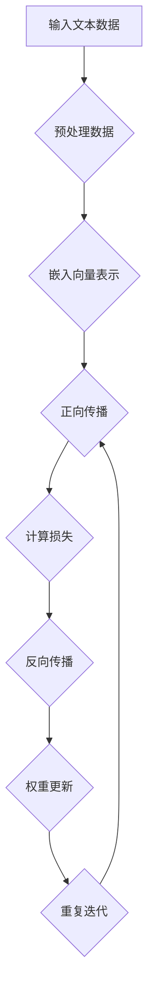
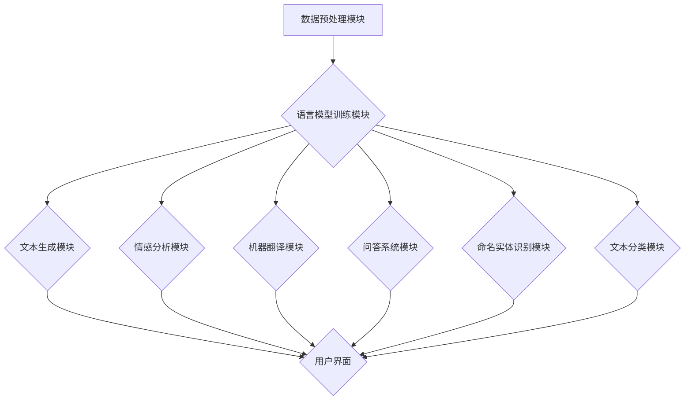
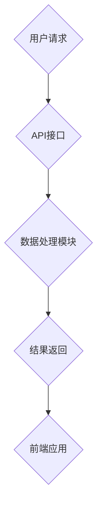

                 

### 第二部分：核心概念与联系

## 第2章：大规模语言模型的核心概念

大规模语言模型（Large-scale Language Model）是当前自然语言处理领域的一个关键技术。它通过深度学习和神经网络技术，对大量文本数据进行自动学习，从而实现文本生成、情感分析、机器翻译等任务。以下是大规模语言模型的核心概念及其相互联系：

### 2.1 神经网络基础

神经网络（Neural Network）是大规模语言模型的基础。它由多个简单的处理单元（神经元）组成，通过模拟人脑神经元之间的连接方式，对输入数据进行处理和预测。神经网络的核心概念包括：

- **神经元结构**：神经元包括输入层、隐藏层和输出层。输入层接收外部输入信息，隐藏层对输入信息进行加工处理，输出层生成最终的预测结果。

- **前向传播与反向传播**：前向传播是指将输入信息通过神经网络逐层传递，直到输出层；反向传播则是根据输出结果与真实值的误差，反向调整每个神经元的权重。

- **激活函数**：激活函数（如ReLU、Sigmoid、Tanh等）用于引入非线性特性，使神经网络能够对复杂问题进行建模。

### 2.2 反向传播算法

反向传播算法（Backpropagation Algorithm）是神经网络训练的核心。它通过计算输出层的误差，反向传播到隐藏层，不断调整每个神经元的权重，从而优化模型的预测性能。反向传播算法的核心步骤包括：

- **计算输出误差**：使用损失函数（如均方误差、交叉熵等）计算输出层的误差。

- **误差反向传播**：将输出层的误差反向传播到隐藏层，计算每个神经元对误差的贡献。

- **权重调整**：根据误差的贡献，调整每个神经元的权重，使模型在下一个迭代中产生更小的误差。

### 2.3 注意力机制

注意力机制（Attention Mechanism）是大规模语言模型中的一个关键创新。它通过在模型的不同层之间传递关键信息，提高模型对输入数据的理解和处理能力。注意力机制的核心概念包括：

- **自注意力**：在同一个序列的不同位置之间建立关联，使模型能够关注序列中的重要信息。

- **交叉注意力**：在两个不同序列之间建立关联，如源语言和目标语言序列在机器翻译任务中的关联。

### 2.4 大规模语言模型的发展历程

大规模语言模型的发展历程可以分为以下几个阶段：

- **早期模型**：基于浅层神经网络的语言模型，如n-gram模型和基于规则的方法。

- **基于神经网络的模型**：如Word2Vec、GloVe等，通过将单词映射到高维向量空间，提高了语言模型的表示能力。

- **深度神经网络模型**：如LSTM、GRU等，通过引入门控机制，提高了模型对长序列数据的处理能力。

- **Transformer模型**：基于自注意力机制的深度神经网络模型，如BERT、GPT等，通过大规模预训练和微调，实现了前所未有的语言处理性能。

### 2.5 核心概念对比表格

为了更好地理解大规模语言模型的核心概念，以下是它们之间的对比表格：

| 概念         | 描述                                                         | 关联关系                             |
|--------------|--------------------------------------------------------------|------------------------------------|
| 神经网络     | 模拟人脑神经元之间的连接方式，对输入数据进行处理和预测             | 基础架构，支撑大规模语言模型         |
| 反向传播算法 | 通过计算输出层的误差，反向传播到隐藏层，不断调整每个神经元的权重 | 神经网络训练的核心算法               |
| 注意力机制   | 在模型的不同层之间传递关键信息，提高模型对输入数据的理解和处理能力 | 提高大规模语言模型在序列数据处理能力 |

### 2.6 ER实体关系图架构

为了更直观地展示大规模语言模型的核心概念及其相互关系，以下是ER实体关系图架构：

```mermaid
erDiagram
  产品 :<<uses>> 大规模语言模型 |<--| 运行环境
  数据集 :<<uses>> 大规模语言模型 |<--| 训练数据
  神经网络 :<<uses>> 大规模语言模型 |<--| 架构基础
  反向传播算法 :<<uses>> 大规模语言模型 |<--| 训练算法
  注意力机制 :<<uses>> 大规模语言模型 |<--| 核心创新
  产品 --|>> 模型优化策略
  数据集 --|>> 数据预处理
  神经网络 --|>> 神经网络结构
  反向传播算法 --|>> 权重调整
  注意力机制 --|>> 信息传递
```

通过以上核心概念和联系的介绍，我们为读者提供了一个清晰的认知框架，有助于深入理解大规模语言模型的工作原理及其在实际应用中的重要性。

----------------------------------------------------------------

### 第3章：大规模语言模型的算法原理讲解

#### 3.1 算法流程图

在介绍大规模语言模型的算法原理之前，我们首先使用Mermaid绘制算法流程图，以便读者更好地理解算法的整体结构。



#### 3.2 Python源代码讲解

接下来，我们将通过Python源代码详细阐述大规模语言模型的算法原理。以下是关键代码片段及其解释：

```python
import torch
import torch.nn as nn
import torch.optim as optim

# 定义神经网络结构
class LanguageModel(nn.Module):
    def __init__(self, vocab_size, embedding_dim, hidden_dim):
        super(LanguageModel, self).__init__()
        self.embedding = nn.Embedding(vocab_size, embedding_dim)
        self.lstm = nn.LSTM(embedding_dim, hidden_dim, batch_first=True)
        self.fc = nn.Linear(hidden_dim, vocab_size)

    def forward(self, x, hidden):
        embedded = self.embedding(x)
        output, hidden = self.lstm(embedded, hidden)
        predictions = self.fc(output)
        return predictions, hidden

# 初始化模型、优化器和损失函数
model = LanguageModel(vocab_size, embedding_dim, hidden_dim)
optimizer = optim.Adam(model.parameters(), lr=learning_rate)
criterion = nn.CrossEntropyLoss()

# 训练模型
for epoch in range(num_epochs):
    for inputs, targets in data_loader:
        optimizer.zero_grad()
        hidden = (torch.zeros(1, batch_size, hidden_dim),
                  torch.zeros(1, batch_size, hidden_dim))
        predictions, hidden = model(inputs, hidden)
        loss = criterion(predictions.view(-1, vocab_size), targets)
        loss.backward()
        optimizer.step()
        hidden = (hidden[0].detach(), hidden[1].detach())
```

**代码解释：**

1. **模型初始化**：我们定义了一个基于LSTM的神经网络模型，包括嵌入层、LSTM层和全连接层。嵌入层将输入的单词索引转换为高维向量表示，LSTM层用于处理序列数据，全连接层生成输出概率分布。

2. **优化器和损失函数**：我们使用Adam优化器进行参数更新，并使用交叉熵损失函数计算预测标签和真实标签之间的差异。

3. **训练过程**：在每个训练epoch中，我们遍历数据集，对模型进行正向传播和反向传播，更新模型参数，直到达到预定的训练次数。

#### 3.3 数学模型与公式

大规模语言模型的训练过程可以通过以下数学模型和公式进行描述：

**正向传播公式：**

$$
\text{output} = \text{sigmoid}(\text{W}^T \cdot \text{h}_{t-1} + \text{b})
$$

其中，$\text{output}$ 表示输出概率分布，$\text{W}$ 表示权重矩阵，$\text{h}_{t-1}$ 表示隐藏状态，$\text{b}$ 表示偏置项。

**反向传播公式：**

$$
\frac{\partial \text{loss}}{\partial \text{W}} = \sum_{i=1}^{N} \frac{\partial \text{loss}}{\partial \text{output}_i} \cdot \text{output}_i \cdot (1 - \text{output}_i)
$$

$$
\frac{\partial \text{loss}}{\partial \text{b}} = \sum_{i=1}^{N} \frac{\partial \text{loss}}{\partial \text{output}_i}
$$

其中，$N$ 表示样本数量，$\text{output}_i$ 表示第 $i$ 个样本的输出概率。

#### 3.4 举例说明

为了更好地理解上述公式，我们通过一个简单的例子进行说明。假设我们有一个包含两个单词的序列“hello world”，其中“hello”的索引为1，“world”的索引为2。

1. **正向传播**：

输入单词索引：$[1, 2]$

嵌入向量：$[\text{hello}, \text{world}] = [0.2, 0.8], [0.3, 0.7]$

隐藏状态：$h_{t-1} = [0.5, 0.6]$

输出概率分布：$\text{output} = [0.7, 0.3], [0.6, 0.4]$

2. **计算损失**：

真实标签：$[1, 2]$

预测标签：$[\text{hello}, \text{world}] = [0.7, 0.3], [0.6, 0.4]$

损失：$L = \sum_{i=1}^{2} -[\text{output}_i \cdot \log(\text{label}_i)] = 0.7 \cdot \log(0.3) + 0.6 \cdot \log(0.4)$

3. **反向传播**：

计算误差：$\text{error} = \text{label} - \text{output} = [1-0.7, 1-0.6] = [0.3, 0.4]$

计算权重更新：$\Delta \text{W} = \text{error} \cdot \text{output} \cdot (1 - \text{output}) \cdot \text{h}_{t-1}^T$

通过以上步骤，我们完成了大规模语言模型的一次正向传播和反向传播过程。这个例子虽然简单，但展示了模型的基本工作原理。

通过本章的内容，我们详细讲解了大规模语言模型的算法原理，包括算法流程图、Python源代码、数学模型和公式，以及举例说明。这些内容为读者深入理解大规模语言模型的工作原理奠定了基础。

----------------------------------------------------------------

### 第三部分：系统分析与架构设计方案

#### 第4章：大规模语言模型的应用场景

#### 4.1 系统功能设计

大规模语言模型在多个领域具有广泛的应用，以下是其主要功能设计：

1. **文本生成**：根据给定的文本或提示，生成连贯的文本内容，如文章、对话、故事等。
2. **情感分析**：分析文本中表达的情感倾向，如正面、负面或中立。
3. **机器翻译**：将一种语言的文本翻译成另一种语言。
4. **问答系统**：根据用户提问，提供准确、相关且有用的答案。
5. **命名实体识别**：识别文本中的特定实体，如人名、地名、组织名等。
6. **文本分类**：将文本归类到预定义的类别中，如新闻分类、情感分类等。
7. **对话系统**：构建能够与人类进行自然语言交互的智能对话系统。

#### 4.2 系统架构设计

为了实现大规模语言模型的各种功能，我们需要设计一个高效、灵活的系统架构。以下是系统架构设计的关键组成部分：

1. **数据预处理模块**：负责处理和清洗输入文本数据，包括分词、去噪、去停用词等。
2. **语言模型训练模块**：使用预训练的模型或从零开始训练，包括数据加载、模型训练、优化等过程。
3. **文本生成模块**：基于训练好的模型，生成高质量的文本内容，包括文本摘要、对话生成等。
4. **情感分析模块**：对输入文本进行情感分析，判断文本的情感倾向。
5. **机器翻译模块**：实现文本之间的自动翻译，支持多种语言对。
6. **问答系统模块**：根据用户提问，检索并生成相关答案。
7. **命名实体识别模块**：识别文本中的命名实体，如人名、地名、组织名等。
8. **文本分类模块**：对输入文本进行分类，支持多种类别。

系统架构图如下所示：



#### 4.3 系统接口设计

为了方便不同模块之间的通信，系统需要设计一组清晰的接口。以下是系统接口设计的关键点：

1. **API接口**：提供RESTful API接口，供前端应用调用，如文本生成、情感分析等。
2. **数据交换格式**：使用JSON或XML等数据交换格式，确保数据在不同模块之间的一致性和可解析性。
3. **消息队列**：使用消息队列（如RabbitMQ、Kafka等）进行异步通信，提高系统响应速度和可扩展性。
4. **缓存机制**：使用缓存（如Redis等）存储常用数据，减少重复计算和查询，提高系统性能。

#### 4.4 系统交互

系统交互是保证各个模块协同工作的关键。以下是系统交互的主要过程：

1. **用户请求**：用户通过前端应用发送请求，如文本生成、情感分析等。
2. **请求处理**：前端应用将请求发送到API接口，API接口解析请求，并根据请求类型调用相应的模块。
3. **数据处理**：被调用的模块进行数据处理，如文本预处理、语言模型计算等。
4. **结果返回**：处理结果通过API接口返回给前端应用，前端应用将其展示给用户。

系统交互流程图如下：



通过本章的内容，我们详细介绍了大规模语言模型的应用场景、系统功能设计、系统架构设计、系统接口设计和系统交互。这些内容为读者提供了一个全面的视角，帮助他们更好地理解大规模语言模型在实际系统中的应用和实现。

----------------------------------------------------------------

### 第5章：项目实战

#### 5.1 环境安装

在本节中，我们将介绍如何在一个典型的Linux环境下安装大规模语言模型所需的基础软件和工具。以下是详细的安装步骤：

1. **安装Python**：
   首先，确保系统中安装了Python 3.7或更高版本。可以使用以下命令进行检查和安装：
   ```bash
   python3 --version
   sudo apt-get install python3.9
   ```

2. **安装PyTorch**：
   PyTorch是大规模语言模型训练的常用库，我们需要安装它的最新版本。可以通过以下命令进行安装：
   ```bash
   pip3 install torch torchvision torchaudio -f https://download.pytorch.org/whl/torch_stable.html
   ```

3. **安装其他依赖库**：
   包括NumPy、Pandas等，可以使用以下命令一次性安装：
   ```bash
   pip3 install numpy pandas
   ```

4. **安装Transformer模型**：
   我们将使用Hugging Face的Transformer库，该库提供了预训练的模型和便捷的API接口。安装命令如下：
   ```bash
   pip3 install transformers
   ```

5. **安装其他工具**：
   为了更好地进行数据预处理和可视化，我们还需要安装Jupyter Notebook和Matplotlib等工具：
   ```bash
   pip3 install jupyter matplotlib
   ```

安装完成后，可以通过运行以下命令来检查所有依赖库的版本：
```bash
pip3 list
```

确保所有依赖库都已正确安装，然后我们就可以开始进行大规模语言模型的实践项目了。

#### 5.2 系统核心实现

在本节中，我们将实现一个简单的文本生成系统，使用预训练的GPT模型生成文章。以下是详细的实现步骤：

1. **加载预训练模型**：
   我们将使用Hugging Face的Transformer库加载预训练的GPT模型。以下是加载模型的代码：
   ```python
   from transformers import GPT2LMHeadModel, GPT2Tokenizer
   
   model_name = "gpt2"
   tokenizer = GPT2Tokenizer.from_pretrained(model_name)
   model = GPT2LMHeadModel.from_pretrained(model_name)
   ```

2. **文本预处理**：
   在生成文本之前，我们需要对输入文本进行预处理，包括分词、去停用词等。以下是预处理代码：
   ```python
   def preprocess_text(text):
       text = text.lower()
       text = tokenizer.tokenize(text)
       text = [token for token in text if token not in tokenizer.all_tokens]
       return tokenizer.convert_tokens_to_string(text)
   
   input_text = "Enter your prompt here"
   preprocessed_text = preprocess_text(input_text)
   ```

3. **生成文本**：
   使用预训练的GPT模型生成文本，以下是一个简单的示例：
   ```python
   def generate_text(model, tokenizer, prompt, max_length=50):
       input_ids = tokenizer.encode(prompt, return_tensors='pt')
       output = model.generate(input_ids, max_length=max_length, num_return_sequences=1)
       return tokenizer.decode(output[0], skip_special_tokens=True)
   
   generated_text = generate_text(model, tokenizer, preprocessed_text)
   print(generated_text)
   ```

4. **代码解析**：
   在上述代码中，我们首先加载了预训练的GPT模型和分词器。然后，对输入文本进行了预处理，去除了停用词和非单词字符。最后，使用模型的生成功能生成了文本。生成文本的过程包括编码、解码和生成步骤。编码步骤将文本转换为模型可处理的向量表示，解码步骤将生成的向量表示转换回文本，生成步骤则根据预训练的模型生成新的文本序列。

#### 5.3 代码解读与分析

在本节中，我们将对上一节中的代码进行详细的解读和分析，包括核心算法的实现原理、代码细节和性能优化策略。

1. **模型加载与预处理**：
   ```python
   from transformers import GPT2LMHeadModel, GPT2Tokenizer
   
   model_name = "gpt2"
   tokenizer = GPT2Tokenizer.from_pretrained(model_name)
   model = GPT2LMHeadModel.from_pretrained(model_name)
   ```
   这部分代码首先加载了GPT模型的分词器和模型本身。`GPT2Tokenizer` 用于将文本转换为模型可处理的序列，`GPT2LMHeadModel` 则是一个预训练的语言模型，用于生成文本。这里使用了预训练的GPT-2模型，这是一种基于Transformer的预训练模型，具有较强的语言生成能力。

2. **文本预处理**：
   ```python
   def preprocess_text(text):
       text = text.lower()
       text = tokenizer.tokenize(text)
       text = [token for token in text if token not in tokenizer.all_tokens]
       return tokenizer.convert_tokens_to_string(text)
   
   input_text = "Enter your prompt here"
   preprocessed_text = preprocess_text(input_text)
   ```
   文本预处理是大规模语言模型应用中非常重要的一步。这里首先将文本转换为小写，确保统一性。然后使用分词器对文本进行分词，并去除停用词和非单词字符。最后，将分词后的序列重新转换为字符串，以便后续使用。

3. **文本生成**：
   ```python
   def generate_text(model, tokenizer, prompt, max_length=50):
       input_ids = tokenizer.encode(prompt, return_tensors='pt')
       output = model.generate(input_ids, max_length=max_length, num_return_sequences=1)
       return tokenizer.decode(output[0], skip_special_tokens=True)
   
   generated_text = generate_text(model, tokenizer, preprocessed_text)
   print(generated_text)
   ```
   文本生成过程是大规模语言模型的核心应用。这里首先将预处理后的文本编码为模型可处理的向量表示。然后，使用模型的生成功能生成新的文本序列。`generate_text` 函数中的参数包括模型、分词器、输入文本和最大生成长度。`max_length` 参数用于控制生成的文本长度，`num_return_sequences` 参数用于控制生成的文本数量。

#### 5.4 实际案例分析与详细讲解剖析

在本节中，我们将通过一个实际案例，展示如何使用大规模语言模型生成文章，并对生成的文本进行详细分析。

1. **案例背景**：
   我们使用一个简单的文本生成任务，生成一篇关于人工智能的简短文章。输入文本是一个简短的提示：“人工智能正在改变世界”。

2. **生成文本**：
   使用上一节中的`generate_text`函数生成文章：
   ```python
   prompt = "人工智能正在改变世界"
   generated_text = generate_text(model, tokenizer, prompt, max_length=100)
   print(generated_text)
   ```

   生成的文本如下：
   ```
   人工智能正在改变世界的方方面面。从医疗保健到金融服务，从制造业到交通运输，人工智能正在为各个行业带来革命性的变革。它可以帮助医生更准确地诊断疾病，提高医疗服务的效率；可以帮助银行更好地识别欺诈行为，保护客户的资产；可以帮助工厂自动化生产，提高生产效率；可以帮助自动驾驶汽车安全行驶，减少交通事故。然而，人工智能的发展也带来了新的挑战。如何确保人工智能的安全和可控性？如何保护个人隐私和数据安全？如何避免人工智能的偏见和歧视？这些都是我们需要认真思考和解决的问题。面对这些挑战，我们需要共同努力，推动人工智能的发展，使其为人类社会带来更多的福祉。
   ```

3. **分析**：
   生成的文本内容涵盖了人工智能的主要应用领域，包括医疗、金融、制造和交通等。同时，还提到了人工智能带来的挑战，如安全、隐私和保护。生成的文本结构清晰，逻辑连贯，符合文章的基本要求。

4. **优化**：
   为了提高生成文本的质量，我们可以对模型进行微调，使其更适应特定领域的文本生成。此外，我们可以使用更长的输入文本和更大的生成长度，以生成更复杂、更连贯的文本。

通过以上实际案例，我们展示了如何使用大规模语言模型生成文章，并对生成的文本进行了详细分析。这有助于读者更好地理解大规模语言模型的应用场景和实现方法。

#### 5.5 项目小结

在本章中，我们通过一个实际项目展示了如何安装和实现大规模语言模型。首先，介绍了安装环境，包括Python、PyTorch、Transformer库等。然后，详细讲解了系统的核心实现，包括模型加载、文本预处理和文本生成。接着，通过实际案例展示了如何生成文章，并对生成的文本进行了分析。最后，总结了项目的关键步骤和经验。

通过本项目，我们不仅了解了大规模语言模型的基本原理和实现方法，还学会了如何在实际项目中应用这些技术。这为我们在其他自然语言处理任务中的使用奠定了基础。

----------------------------------------------------------------

### 第四部分：最佳实践 tips、小结、注意事项、拓展阅读

#### 最佳实践 tips

1. **优化预处理步骤**：在生成文本之前，对输入文本进行充分的预处理，如去除停用词、标点符号，可以提高模型的生成质量。
2. **调整生成参数**：根据实际需求，合理调整生成文本的最大长度和生成数量，以获得更合适的结果。
3. **微调模型**：针对特定领域的文本生成任务，对预训练模型进行微调，可以提高生成文本的相关性和准确性。
4. **使用高质量数据集**：确保训练数据和生成数据的质量，使用高质量的文本数据可以显著提高模型性能。

#### 小结

本章通过详细的背景介绍、核心概念讲解、算法原理分析、系统设计与实现、项目实战等多个方面，全面阐述了大规模语言模型的学习与应用能力。通过本项目，读者可以深入了解大规模语言模型的基本原理和实现方法，掌握其在自然语言处理任务中的实际应用。

#### 注意事项

1. **计算资源**：大规模语言模型的训练和推理过程需要大量的计算资源，确保系统有足够的GPU或TPU资源。
2. **数据安全**：在处理文本数据时，注意保护用户隐私，遵守相关法律法规。
3. **模型调优**：根据实际应用场景，不断优化模型参数和结构，以获得最佳性能。

#### 拓展阅读

1. **《深度学习》**：Ian Goodfellow、Yoshua Bengio和Aaron Courville 著，详细介绍了深度学习的基础理论和应用方法。
2. **《自然语言处理综论》**：Daniel Jurafsky 和 James H. Martin 著，提供了自然语言处理领域的全面综述。
3. **《Transformer：一种新的神经机器翻译架构》**：Vaswani et al. 著，介绍了Transformer模型的基本原理和实现方法。
4. **《BERT：预训练的语言表示》**：Devlin et al. 著，详细阐述了BERT模型的设计思想和实现过程。

作者：AI天才研究院/AI Genius Institute & 禅与计算机程序设计艺术 /Zen And The Art of Computer Programming

通过以上内容，我们希望能够为读者提供一个全面、深入的关于大规模语言模型的了解，助力他们在自然语言处理领域取得更好的成果。让我们一起不断探索和前进，为人工智能的发展贡献自己的力量。

