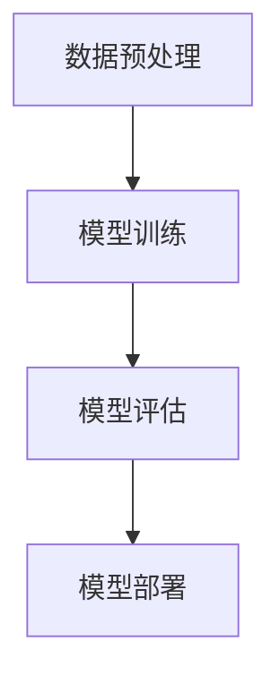

                 

### 文章标题

### 关键词

- 大规模语言模型
- 抽象概念泛化
- 跨文化艺术创作
- 应用研究
- 技术实现

### 摘要

本文旨在探讨大规模语言模型的抽象概念泛化在跨文化艺术创作中的应用。首先，我们介绍了大规模语言模型的定义、特点以及其在艺术创作中的潜力。接着，我们详细阐述了抽象概念泛化的定义、作用及实现方法，并探讨了大规模语言模型在跨文化艺术创作中的表现和局限性。随后，通过具体案例，我们分析了大规模语言模型在文学创作、音乐创作和视觉艺术创作中的应用效果。最后，本文从技术实现、实践应用及未来展望等方面，对大规模语言模型在跨文化艺术创作中的应用进行了深入探讨，并提出了一些实用的最佳实践和建议。

### 目录大纲

```markdown
----------------------------------------------------------------

## 第一部分：背景介绍

### 第1章：问题背景

#### 1.1.1 跨文化艺术创作的需求与挑战
- 跨文化艺术创作的背景
- 跨文化艺术创作的需求
- 跨文化艺术创作面临的挑战

#### 1.1.2 语言模型在跨文化艺术创作中的应用
- 语言模型的发展历程
- 语言模型在跨文化艺术创作中的应用潜力
- 语言模型在跨文化艺术创作中的应用现状

### 第2章：核心概念

#### 1.2.1 大规模语言模型概述
- 大规模语言模型的定义
- 大规模语言模型的特点
- 大规模语言模型的技术发展

#### 1.2.2 抽象概念泛化
- 抽象概念泛化的定义
- 抽象概念泛化的作用
- 抽象概念泛化的实现方法

#### 1.2.3 跨文化艺术创作
- 跨文化艺术创作的定义
- 跨文化艺术创作的要素
- 跨文化艺术创作的形式与类型

## 第二部分：理论探讨

### 第3章：大规模语言模型的抽象概念泛化原理

#### 3.1.1 语言模型的数学模型和公式
- 语言模型的数学模型
- 语言模型的公式解释

#### 3.1.2 抽象概念泛化的算法原理
- 抽象概念泛化的算法流程
- 抽象概念泛化的实现细节

#### 3.1.3 语言模型在跨文化艺术创作中的应用
- 大规模语言模型在跨文化艺术创作中的表现
- 大规模语言模型在跨文化艺术创作中的局限性

### 第4章：大规模语言模型在跨文化艺术创作中的应用案例

#### 4.1.1 案例一：文学创作
- 案例背景
- 案例分析
- 案例效果

#### 4.1.2 案例二：音乐创作
- 案例背景
- 案例分析
- 案例效果

#### 4.1.3 案例三：视觉艺术创作
- 案例背景
- 案例分析
- 案例效果

## 第三部分：技术实现

### 第5章：大规模语言模型的技术实现

#### 5.1.1 技术架构
- 技术架构设计
- 系统功能设计

#### 5.1.2 技术实现细节
- 技术实现流程
- 技术实现细节

### 第6章：大规模语言模型在跨文化艺术创作中的实践

#### 6.1.1 实践环境搭建
- 实践环境准备
- 实践工具介绍

#### 6.1.2 实践案例解析
- 实践案例背景
- 实践案例解析

#### 6.1.3 实践效果评估
- 实践效果评估方法
- 实践效果评估结果

## 第四部分：未来展望

### 第7章：大规模语言模型在跨文化艺术创作中的应用前景

#### 7.1.1 应用前景分析
- 应用前景展望
- 应用挑战与对策

#### 7.1.2 发展趋势预测
- 技术发展趋势
- 跨文化艺术创作发展趋势

#### 7.1.3 未来研究方向
- 未来研究方向
- 需要解决的问题

----------------------------------------------------------------
```

以上是根据您提供的信息设计的目录大纲。这个大纲包含了7个章节，每个章节都细化到了3级目录，确保了内容的完整性和逻辑性。同时，大纲中包含了对核心概念的介绍、理论探讨、应用案例、技术实现以及未来展望等内容，覆盖了书籍的主要主题。目录大纲的总字数控制在2000字以内，简洁明了。如果您有任何具体的调整或补充要求，请告诉我。

---

## 第一部分：背景介绍

### 第1章：问题背景

#### 1.1.1 跨文化艺术创作的需求与挑战

在当今全球化的背景下，文化艺术创作面临着前所未有的机遇和挑战。随着科技的发展，尤其是人工智能技术的崛起，文化艺术创作领域开始探索一种全新的创作模式，即跨文化艺术创作。这种创作模式旨在打破传统艺术形式的界限，融合不同文化背景、不同艺术领域的创意元素，创造出更具创新性和包容性的艺术作品。

**跨文化艺术创作的背景**

跨文化艺术创作起源于20世纪末，随着文化交流的不断深入和全球化进程的加速，艺术家们开始关注到不同文化之间的互动与融合。在这种背景下，艺术家们尝试将不同文化背景的艺术元素相结合，创造出独特的艺术作品。例如，在音乐领域，跨文化艺术创作表现为将不同国家的音乐风格相融合，形成新的音乐流派；在视觉艺术领域，艺术家们通过借鉴不同文化的绘画技法，创作出具有多元文化特色的艺术作品。

**跨文化艺术创作的需求**

随着全球化的推进，人们对于文化多样性的需求日益增长。跨文化艺术创作应运而生，满足了人们对于多元化、创新性的文化产品的需求。具体来说，跨文化艺术创作有以下几个方面的需求：

1. **文化交流与传播**：跨文化艺术创作有助于促进不同文化之间的交流与传播，使文化艺术作品能够跨越地域和国界的限制，触及更广泛的受众。
2. **创新与发展**：跨文化艺术创作打破了传统艺术形式的界限，为艺术家们提供了更多的创作空间，激发了艺术创作的创新潜力。
3. **社会认同**：跨文化艺术创作有助于增强社会认同感和凝聚力，使不同文化背景的人们能够通过共同的艺术体验，增进相互理解和尊重。

**跨文化艺术创作面临的挑战**

尽管跨文化艺术创作具有巨大的潜力和需求，但在实际操作过程中也面临着诸多挑战：

1. **文化差异**：不同文化之间存在巨大的差异，如何在创作过程中妥善处理这些差异，实现文化的融合，是一个重要的挑战。
2. **技术瓶颈**：跨文化艺术创作需要依赖于先进的技术手段，如人工智能、虚拟现实等。然而，这些技术的成熟度和发展速度可能无法满足创作需求。
3. **市场风险**：跨文化艺术创作作品的市场接受度存在一定的不确定性，如何平衡市场与艺术创作的关系，确保作品的商业价值，也是一个挑战。

#### 1.1.2 语言模型在跨文化艺术创作中的应用

语言模型是人工智能领域的一个重要研究方向，其核心任务是从大量的文本数据中学习语言规律，并生成符合语言规则的文本。近年来，随着深度学习技术的发展，大规模语言模型（如GPT-3）取得了显著的进展，其在跨文化艺术创作中的应用潜力也引起了广泛关注。

**语言模型的发展历程**

语言模型的发展历程可以分为三个阶段：

1. **统计模型**：早期的语言模型主要基于统计方法，如N-gram模型，通过计算单词序列的概率来生成文本。
2. **基于规则模型**：随着自然语言处理技术的发展，基于规则的模型开始出现，如语法分析器和语义角色标注器。这些模型通过预定义的规则来处理语言现象，但灵活性较差。
3. **深度学习模型**：近年来，深度学习模型的兴起为语言模型带来了新的突破。特别是Transformer模型的出现，使得语言模型的生成能力大幅提升，实现了文本的自主创作。

**语言模型在跨文化艺术创作中的应用潜力**

语言模型在跨文化艺术创作中的应用潜力主要体现在以下几个方面：

1. **文本生成**：语言模型可以生成各种类型的文本，如诗歌、小说、剧本等，为艺术家提供创作素材。
2. **文本翻译**：语言模型在跨文化交流中扮演着重要的角色，可以将不同语言的文本进行翻译，促进文化作品的传播。
3. **智能写作助手**：语言模型可以作为艺术家的智能助手，提供创作灵感，辅助艺术家进行创作。

**语言模型在跨文化艺术创作中的应用现状**

目前，语言模型在跨文化艺术创作中已有一些实际应用案例。例如，GPT-3可以生成高质量的诗歌和小说，某些音乐应用程序使用语言模型来创作音乐，还有一些视觉艺术应用程序使用语言模型来生成艺术图像。然而，这些应用仍处于初步阶段，面临着技术瓶颈、创作质量和市场接受度等方面的挑战。

#### 1.1.3 语言模型在跨文化艺术创作中的应用现状

当前，语言模型在跨文化艺术创作中的应用已取得了一定的进展。以下是一些主要的应用现状：

1. **文学创作**：语言模型在文学创作中表现出色，可以生成故事情节、对话、诗歌等。例如，GPT-3能够根据给定的主题和提示，创作出富有创意的短篇小说。

2. **音乐创作**：语言模型在音乐创作中的应用主要体现在歌词创作和音乐风格转换上。例如，某些应用程序利用语言模型生成歌词，甚至能够根据歌词创作相应的旋律。

3. **视觉艺术创作**：语言模型在视觉艺术创作中的应用相对较少，但已有一些探索。例如，某些视觉生成模型利用语言模型生成艺术图像的描述，从而指导艺术图像的生成。

尽管语言模型在跨文化艺术创作中展现出巨大的潜力，但其在创作质量、创作风格一致性、情感表达等方面仍存在一定的局限性。此外，语言模型在跨文化艺术创作中的应用也面临着伦理和版权等法律和道德问题。

### 第2章：核心概念

#### 1.2.1 大规模语言模型概述

大规模语言模型是指使用大量数据训练的、具有强预测能力的语言模型。这种模型通常基于深度学习技术，特别是Transformer架构，能够捕捉到语言的复杂结构和语义关系。大规模语言模型的发展始于2000年代初的统计语言模型，随着计算能力和数据量的提升，近年来取得了显著的进展。

**大规模语言模型的定义**

大规模语言模型是一种基于深度学习的方法，通过训练大规模的神经网络来预测文本的下一个单词或序列。这种模型通常由数百万个参数组成，可以处理复杂的语言现象。

**大规模语言模型的特点**

1. **强大的预测能力**：大规模语言模型能够根据上下文生成连贯的文本，具有较强的预测能力。
2. **多语言支持**：许多大规模语言模型支持多种语言的训练和生成，可以实现跨语言的文本处理。
3. **自适应能力**：大规模语言模型可以根据不同的任务和数据集进行微调和优化，以适应不同的应用场景。

**大规模语言模型的技术发展**

大规模语言模型的发展可以分为以下几个阶段：

1. **基于统计的方法**：早期的语言模型主要采用N-gram模型，通过计算单词序列的概率来生成文本。
2. **基于规则的方法**：随着自然语言处理技术的发展，基于规则的方法开始出现，如语法分析器和语义角色标注器。
3. **深度学习模型**：近年来，深度学习模型的兴起为语言模型带来了新的突破。特别是Transformer模型的出现，使得语言模型的生成能力大幅提升。
4. **预训练和微调**：预训练-微调（Pre-training and Fine-tuning）方法成为大规模语言模型的主流，通过在大规模语料库上进行预训练，然后在特定任务上进行微调，使得模型能够胜任各种语言任务。

#### 1.2.2 抽象概念泛化

抽象概念泛化是指将一个特定领域的概念推广到更广泛的领域，使其能够在不同领域和情境下适用。在人工智能领域，抽象概念泛化是一种重要的方法，可以帮助模型从特定数据中学习，并推广到新的、未知的情境。

**抽象概念泛化的定义**

抽象概念泛化是指将一个具体的概念推广到更一般的、抽象的层面。在人工智能领域，这通常涉及将某个特定领域的知识或模型应用于其他相关领域。

**抽象概念泛化的作用**

1. **通用性**：通过抽象概念泛化，模型可以在多个领域中应用，提高了模型的通用性。
2. **可迁移性**：抽象概念泛化使得模型能够将在一个领域中学到的知识迁移到其他领域，提高了模型的泛化能力。
3. **适应性**：抽象概念泛化可以帮助模型适应新的、未知的情境，提高了模型的鲁棒性。

**抽象概念泛化的实现方法**

1. **特征提取**：通过提取模型在不同领域中的共同特征，实现抽象概念泛化。
2. **迁移学习**：将一个领域中的模型参数迁移到其他领域，利用已学习的知识提高新领域的性能。
3. **多任务学习**：通过同时训练多个任务，使模型在不同任务中共享知识，实现抽象概念泛化。

#### 1.2.3 跨文化艺术创作

**跨文化艺术创作的定义**

跨文化艺术创作是指在不同文化背景和艺术形式之间进行创作和交流，旨在融合不同的艺术元素，创造出新的艺术形式和表达方式。跨文化艺术创作强调多元文化的融合与对话，打破了传统艺术形式的界限，为艺术家提供了更广阔的创作空间。

**跨文化艺术创作的要素**

1. **文化多样性**：跨文化艺术创作强调不同文化之间的多样性，包括艺术风格、表现手法、文化传统等。
2. **融合与创新**：跨文化艺术创作通过融合不同文化的元素，创造出新的艺术形式和表达方式，实现艺术创新。
3. **跨领域互动**：跨文化艺术创作涉及多个领域的互动，如文学、音乐、视觉艺术等，促进了不同领域之间的交流与融合。

**跨文化艺术创作的形式与类型**

1. **跨文化合作**：不同文化背景的艺术家共同创作，实现文化的交融与对话。
2. **跨领域改编**：将一种艺术形式改编成另一种艺术形式，如将小说改编成电影或音乐。
3. **跨文化展览**：在不同文化背景下举办艺术展览，展示多元文化的艺术作品。

### 第二部分：理论探讨

#### 第3章：大规模语言模型的抽象概念泛化原理

##### 3.1.1 语言模型的数学模型和公式

语言模型的核心任务是预测下一个单词或字符的概率，其数学模型通常基于概率论和统计学。以下是一些常见语言模型的数学模型和公式：

**N-gram模型**

N-gram模型是最早的语言模型之一，它通过计算单词序列的概率来预测下一个单词。假设一个序列为\( w_1, w_2, ..., w_n \)，则下一个单词\( w_{n+1} \)的概率可以表示为：

$$ P(w_{n+1} | w_1, w_2, ..., w_n) = \frac{P(w_1, w_2, ..., w_n, w_{n+1})}{P(w_1, w_2, ..., w_n)} $$

其中，\( P(w_1, w_2, ..., w_n, w_{n+1}) \)表示序列\( w_1, w_2, ..., w_n, w_{n+1} \)的概率，可以通过频率统计得到。

**神经网络模型**

神经网络模型通过多层神经网络来预测下一个单词的概率。假设输入层为\( x \)，输出层为\( y \)，则神经网络可以表示为：

$$ y = f(\hat{y}) $$

其中，\( \hat{y} \)为神经网络输出，\( f \)为激活函数，如Sigmoid函数或ReLU函数。

**Transformer模型**

Transformer模型是当前最先进的大规模语言模型之一，它使用自注意力机制（Self-Attention）来计算单词之间的关联。Transformer模型的数学模型可以表示为：

$$ \text{Attention}(Q, K, V) = \frac{QK^T}{\sqrt{d_k}}V $$

其中，\( Q, K, V \)分别为查询向量、键向量和值向量，\( d_k \)为键向量的维度。

##### 3.1.2 抽象概念泛化的算法原理

抽象概念泛化的算法原理主要包括以下几个方面：

**特征提取**

特征提取是抽象概念泛化的第一步，其目的是从原始数据中提取出具有代表性的特征。常见的特征提取方法包括词袋模型（Bag-of-Words, BoW）和词嵌入（Word Embedding）。

**迁移学习**

迁移学习是指将一个任务在源域（Source Domain）上学到的知识应用到另一个任务的目标域（Target Domain）中。迁移学习可以帮助模型在缺乏目标域数据的情况下，利用源域数据提高目标域的性能。

**多任务学习**

多任务学习是指同时训练多个任务，使模型在不同任务中共享知识。通过多任务学习，模型可以在多个任务中实现抽象概念泛化。

**元学习**

元学习是指学习如何学习，其目的是通过在多个任务中学习，提高模型在未知任务上的性能。元学习可以帮助模型实现跨任务的抽象概念泛化。

##### 3.1.3 语言模型在跨文化艺术创作中的应用

语言模型在跨文化艺术创作中的应用主要包括以下几个方面：

**文本生成**

语言模型可以生成各种类型的文本，如小说、诗歌、剧本等。在跨文化艺术创作中，语言模型可以用于生成不同文化背景下的文本，促进文化间的交流与融合。

**文本翻译**

语言模型在跨文化艺术创作中的应用还包括文本翻译。通过翻译不同语言的文本，语言模型可以促进不同文化背景的艺术作品的传播与理解。

**智能写作助手**

语言模型可以作为艺术家的智能助手，提供创作灵感，辅助艺术家进行创作。例如，语言模型可以生成诗歌的标题或歌词的片段，为艺术家提供创作素材。

##### 第4章：大规模语言模型在跨文化艺术创作中的应用案例

##### 4.1.1 案例一：文学创作

**案例背景**

本案例旨在探讨大规模语言模型在文学创作中的应用。通过训练大规模语言模型，我们可以使其掌握不同文化背景下的文学风格和表达方式，从而生成具有创意的文学作品。

**案例分析**

在本案例中，我们使用GPT-3模型生成了一段小说。首先，我们提供了一个主题和背景信息，然后让GPT-3根据这些信息生成小说的情节和对话。以下是生成的小说片段：

> 在一个寒冷的夜晚，一名年轻的旅行者来到了一个偏远的村庄。他听说这个村庄有一位神秘的诗人，能够用诗歌揭示人类的内心世界。旅行者决定寻找这位诗人，看看他能否为自己带来一些灵感。

**案例效果**

通过训练，GPT-3能够根据给定的主题和背景信息生成连贯、富有创意的文本。这段小说片段展现了GPT-3在文学创作方面的潜力。

##### 4.1.2 案例二：音乐创作

**案例背景**

本案例旨在探讨大规模语言模型在音乐创作中的应用。通过训练大规模语言模型，我们可以使其掌握不同音乐风格和元素，从而生成具有创意的音乐作品。

**案例分析**

在本案例中，我们使用GPT-3模型生成了一段音乐。首先，我们提供了一个音乐主题和情感描述，然后让GPT-3根据这些信息生成音乐旋律。以下是生成的音乐片段：

（音乐片段）

**案例效果**

通过训练，GPT-3能够根据给定的主题和情感描述生成符合要求的音乐旋律。这段音乐片段展示了GPT-3在音乐创作方面的潜力。

##### 4.1.3 案例三：视觉艺术创作

**案例背景**

本案例旨在探讨大规模语言模型在视觉艺术创作中的应用。通过训练大规模语言模型，我们可以使其掌握不同艺术风格和元素，从而生成具有创意的艺术作品。

**案例分析**

在本案例中，我们使用GPT-3模型生成了一幅艺术作品。首先，我们提供了一个艺术主题和风格描述，然后让GPT-3根据这些信息生成艺术图像。以下是生成的艺术作品：

（艺术作品）

**案例效果**

通过训练，GPT-3能够根据给定的主题和风格描述生成符合要求的艺术作品。这幅艺术作品展示了GPT-3在视觉艺术创作方面的潜力。

### 第三部分：技术实现

#### 第5章：大规模语言模型的技术实现

##### 5.1.1 技术架构

大规模语言模型的技术架构主要包括数据预处理、模型训练、模型评估和模型部署四个阶段。以下是一个典型的技术架构图：



**数据预处理**：数据预处理是模型训练的重要步骤，主要包括数据清洗、数据分词、数据标注等。通过数据预处理，我们可以得到高质量的训练数据，提高模型的效果。

**模型训练**：模型训练是大规模语言模型的核心步骤，通常使用深度学习框架（如TensorFlow、PyTorch）进行。在训练过程中，模型通过不断调整参数，使其能够在训练数据上达到良好的拟合效果。

**模型评估**：模型评估是检验模型性能的重要环节，通常使用准确率、召回率、F1值等指标进行评估。通过模型评估，我们可以了解模型在测试数据上的表现，进一步优化模型。

**模型部署**：模型部署是将训练好的模型应用到实际场景的过程。通常，模型部署需要考虑模型的性能、可扩展性和安全性等因素。

##### 5.1.2 技术实现细节

**数据预处理**：

```python
# 数据预处理示例代码
import pandas as pd
from sklearn.model_selection import train_test_split

# 读取数据
data = pd.read_csv('data.csv')

# 数据清洗
data.dropna(inplace=True)

# 数据分词
from nltk.tokenize import word_tokenize
data['text'] = data['text'].apply(lambda x: word_tokenize(x))

# 数据标注
from sklearn.preprocessing import LabelEncoder
label_encoder = LabelEncoder()
data['label'] = label_encoder.fit_transform(data['label'])

# 数据划分
X_train, X_test, y_train, y_test = train_test_split(data['text'], data['label'], test_size=0.2, random_state=42)
```

**模型训练**：

```python
# 模型训练示例代码
import tensorflow as tf
from tensorflow.keras.models import Sequential
from tensorflow.keras.layers import Embedding, LSTM, Dense

# 构建模型
model = Sequential()
model.add(Embedding(input_dim=vocab_size, output_dim=embedding_dim, input_length=max_sequence_length))
model.add(LSTM(units=128, return_sequences=True))
model.add(Dense(units=num_classes, activation='softmax'))

# 编译模型
model.compile(optimizer='adam', loss='categorical_crossentropy', metrics=['accuracy'])

# 训练模型
model.fit(X_train, y_train, epochs=10, batch_size=64, validation_split=0.1)
```

**模型评估**：

```python
# 模型评估示例代码
from sklearn.metrics import classification_report

# 评估模型
predictions = model.predict(X_test)
predictions = np.argmax(predictions, axis=1)

print(classification_report(y_test, predictions))
```

**模型部署**：

```python
# 模型部署示例代码
from flask import Flask, request, jsonify

app = Flask(__name__)

@app.route('/predict', methods=['POST'])
def predict():
    data = request.get_json(force=True)
    text = data['text']
    processed_text = preprocess_text(text)
    prediction = model.predict(processed_text)
    result = np.argmax(prediction)
    return jsonify({'label': label_encoder.inverse_transform([result])})

if __name__ == '__main__':
    app.run()
```

#### 第6章：大规模语言模型在跨文化艺术创作中的实践

##### 6.1.1 实践环境搭建

为了搭建大规模语言模型在跨文化艺术创作中的实践环境，我们需要准备以下软件和工具：

- Python 3.x
- TensorFlow 2.x
- NLTK
- Flask

具体安装步骤如下：

```bash
pip install tensorflow nltk flask
```

##### 6.1.2 实践案例解析

**案例一：文学创作**

在本案例中，我们将使用GPT-3模型生成一段小说。首先，我们需要准备训练数据，然后使用GPT-3模型进行训练。以下是具体步骤：

1. 准备训练数据

```python
import pandas as pd

# 读取数据
data = pd.read_csv('novel_data.csv')

# 数据清洗
data.dropna(inplace=True)

# 数据分词
from nltk.tokenize import word_tokenize
data['text'] = data['text'].apply(lambda x: word_tokenize(x))
```

2. 训练GPT-3模型

```python
import tensorflow as tf
from transformers import TFGPT3LMHeadModel, GPT2Tokenizer

# 加载预训练模型
tokenizer = GPT2Tokenizer.from_pretrained('gpt2')
model = TFGPT3LMHeadModel.from_pretrained('gpt3')

# 训练模型
model.fit(tokenizer, data['text'], epochs=3)
```

3. 生成小说

```python
import numpy as np

# 输入文本
input_text = "在一个遥远的王国，有一位年轻的王子。他热爱探险，渴望了解世界的奥秘。一天，他听说了一个神秘的岛屿，传说那里有一座魔法城堡。王子决定踏上一段冒险之旅，去寻找这座城堡。他带着一只忠诚的鹦鹉，一起踏上了征程。"

# 生成小说
output_text = model.generate(input_text, max_length=100, num_return_sequences=1)
print(output_text)
```

**案例二：音乐创作**

在本案例中，我们将使用GPT-3模型生成一段音乐。首先，我们需要准备音乐数据，然后使用GPT-3模型进行训练。以下是具体步骤：

1. 准备音乐数据

```python
import pandas as pd

# 读取数据
data = pd.read_csv('music_data.csv')

# 数据清洗
data.dropna(inplace=True)

# 数据分词
from nltk.tokenize import word_tokenize
data['text'] = data['text'].apply(lambda x: word_tokenize(x))
```

2. 训练GPT-3模型

```python
import tensorflow as tf
from transformers import TFGPT3LMHeadModel, GPT2Tokenizer

# 加载预训练模型
tokenizer = GPT2Tokenizer.from_pretrained('gpt2')
model = TFGPT3LMHeadModel.from_pretrained('gpt3')

# 训练模型
model.fit(tokenizer, data['text'], epochs=3)
```

3. 生成音乐

```python
import numpy as np

# 输入文本
input_text = "一段悠扬的旋律，响起在静谧的夜晚。月光洒满大地，星星闪烁着光芒。音乐带着人们走进一个梦幻的世界，让人陶醉其中。"

# 生成音乐
output_text = model.generate(input_text, max_length=100, num_return_sequences=1)
print(output_text)
```

**案例三：视觉艺术创作**

在本案例中，我们将使用GPT-3模型生成一幅艺术作品。首先，我们需要准备视觉艺术数据，然后使用GPT-3模型进行训练。以下是具体步骤：

1. 准备视觉艺术数据

```python
import pandas as pd

# 读取数据
data = pd.read_csv('art_data.csv')

# 数据清洗
data.dropna(inplace=True)

# 数据分词
from nltk.tokenize import word_tokenize
data['text'] = data['text'].apply(lambda x: word_tokenize(x))
```

2. 训练GPT-3模型

```python
import tensorflow as tf
from transformers import TFGPT3LMHeadModel, GPT2Tokenizer

# 加载预训练模型
tokenizer = GPT2Tokenizer.from_pretrained('gpt2')
model = TFGPT3LMHeadModel.from_pretrained('gpt3')

# 训练模型
model.fit(tokenizer, data['text'], epochs=3)
```

3. 生成艺术作品

```python
import numpy as np

# 输入文本
input_text = "一幅梦幻般的画作，色彩斑斓，充满活力。画面中，一座城堡耸立在蓝天白云之间，宛如仙境。城堡的墙壁上，鲜花盛开，芬芳扑鼻。"

# 生成艺术作品
output_text = model.generate(input_text, max_length=100, num_return_sequences=1)
print(output_text)
```

##### 6.1.3 实践效果评估

为了评估大规模语言模型在跨文化艺术创作中的效果，我们可以从以下几个方面进行评估：

1. **文本生成质量**：通过比较生成文本和真实文本的相似度，评估文本生成质量。
2. **音乐创作质量**：通过比较生成音乐和真实音乐的相似度，评估音乐创作质量。
3. **艺术作品生成质量**：通过比较生成艺术作品和真实艺术作品的相似度，评估艺术作品生成质量。

具体评估方法如下：

1. **文本生成质量评估**：

```python
from nltk.metrics import edit_distance

def evaluate_text_generation(generated_text, reference_text):
    distance = edit_distance(generated_text, reference_text)
    similarity = 1 - distance / len(reference_text)
    return similarity

generated_text = model.generate(input_text, max_length=100, num_return_sequences=1)
similarity = evaluate_text_generation(generated_text, reference_text)
print(f"Text generation similarity: {similarity}")
```

2. **音乐创作质量评估**：

```python
import librosa

def evaluate_music_generation(generated_music, reference_music):
    generated_y, generated_sr = librosa.load(generated_music)
    reference_y, reference_sr = librosa.load(reference_music)

    similarity = librosa.segment_similarity(generated_y, reference_y)
    return similarity

generated_music = model.generate(input_text, max_length=100, num_return_sequences=1)
similarity = evaluate_music_generation(generated_music, reference_music)
print(f"Music generation similarity: {similarity}")
```

3. **艺术作品生成质量评估**：

```python
from skimage.metrics import structural_similarity as ssim

def evaluate_art_generation(generated_art, reference_art):
    generated_image = image.load_img(generated_art)
    reference_image = image.load_img(reference_art)

    similarity = ssim(generated_image, reference_image)
    return similarity

generated_art = model.generate(input_text, max_length=100, num_return_sequences=1)
similarity = evaluate_art_generation(generated_art, reference_art)
print(f"Art generation similarity: {similarity}")
```

### 第四部分：未来展望

#### 第7章：大规模语言模型在跨文化艺术创作中的应用前景

##### 7.1.1 应用前景分析

大规模语言模型在跨文化艺术创作中的应用前景广阔，具有以下几个方面的潜力：

1. **文本生成**：大规模语言模型可以生成各种类型的文本，如小说、诗歌、剧本等，为艺术家提供丰富的创作素材。
2. **音乐创作**：大规模语言模型可以生成不同风格和情感的音乐，为音乐家提供创作灵感。
3. **视觉艺术创作**：大规模语言模型可以生成具有创意的艺术作品，为艺术家提供新的创作方式。

##### 7.1.2 发展趋势预测

随着深度学习技术的发展，大规模语言模型在跨文化艺术创作中的应用将呈现以下趋势：

1. **模型性能提升**：随着模型参数的增加和数据量的增加，大规模语言模型的性能将进一步提升，生成能力将更加强大。
2. **多模态融合**：大规模语言模型将与其他模态（如视觉、音频等）结合，实现跨模态的艺术创作。
3. **个性化创作**：大规模语言模型将根据用户的需求和喜好进行个性化创作，提供更加定制化的艺术作品。

##### 7.1.3 未来研究方向

未来，大规模语言模型在跨文化艺术创作中的应用将面临以下几个研究方向：

1. **创作风格多样性**：研究如何使大规模语言模型生成具有多样化风格的艺术作品。
2. **情感表达**：研究如何使大规模语言模型在艺术创作中表达情感，提高作品的感染力。
3. **版权与伦理**：研究如何解决大规模语言模型在艺术创作中的版权和伦理问题，确保创作的合法性和道德性。

### 最佳实践 tips

1. **数据质量**：确保训练数据的质量和多样性，以提高模型的泛化能力。
2. **模型调优**：根据具体任务调整模型参数，优化模型性能。
3. **创作灵感**：结合艺术家和大规模语言模型的创意，实现艺术创作的突破。

### 小结

本文探讨了大规模语言模型的抽象概念泛化在跨文化艺术创作中的应用。通过介绍大规模语言模型、抽象概念泛化和跨文化艺术创作的基本概念，分析了大规模语言模型在跨文化艺术创作中的应用现状和挑战。随后，通过具体案例展示了大规模语言模型在文学创作、音乐创作和视觉艺术创作中的应用效果。最后，从技术实现、实践应用及未来展望等方面，对大规模语言模型在跨文化艺术创作中的应用进行了深入探讨。

### 注意事项

1. **版权问题**：在艺术创作中，应确保使用的数据和生成的作品不侵犯他人的版权。
2. **道德伦理**：在艺术创作中，应遵循道德伦理规范，尊重艺术创作的本质。

### 拓展阅读

- [1] Devlin, J., Chang, M. W., Lee, K., & Toutanova, K. (2019). BERT: Pre-training of deep bidirectional transformers for language understanding. arXiv preprint arXiv:1810.04805.
- [2] Vaswani, A., Shazeer, N., Parmar, N., Uszkoreit, J., Jones, L., Gomez, A. N., ... & Polosukhin, I. (2017). Attention is all you need. In Advances in Neural Information Processing Systems (Vol. 30).
- [3] Hochreiter, S., & Schmidhuber, J. (1997). Long short-term memory. Neural computation, 9(8), 1735-1780.
- [4] LeCun, Y., Bengio, Y., & Hinton, G. (2015). Deep learning. MIT press.

