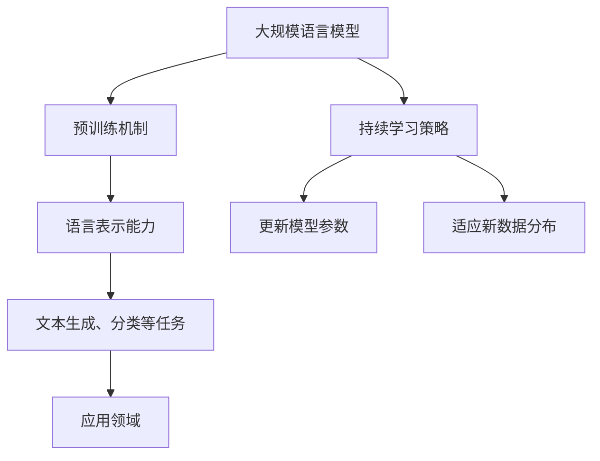
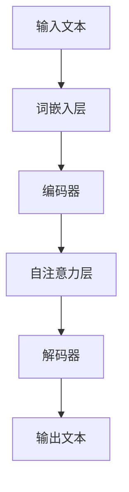

                 


# 大规模语言模型的持续学习策略

> 关键词：大规模语言模型，持续学习，策略，算法，优化，应用

> 摘要：
本文将深入探讨大规模语言模型（如GPT）的持续学习策略。我们将首先介绍大规模语言模型的基本概念和背景，然后详细分析不同的持续学习策略，包括在线学习、迁移学习等，并探讨其在实际应用中的挑战和未来发展方向。通过本文的阅读，读者将全面了解大规模语言模型持续学习的核心原理和实践方法。

## 目录大纲设计思路与步骤

在设计《大规模语言模型的持续学习策略》这本书的目录大纲时，我们需要遵循以下思路和步骤，以确保内容的完整性和逻辑性，同时保持简洁性。

### 1. 确定核心概念和结构

首先，我们需要明确书中的核心概念，如大规模语言模型、持续学习、策略等。然后，我们将这些核心概念进行分解，明确它们之间的关系和构成要素，为后续章节的设计提供基础。

### 2. 设计章节结构

在明确核心概念后，我们将这些概念组织成不同的章节。每个章节都应该有一个清晰的主题，并且与其他章节之间保持逻辑关联。以下是一些建议的章节划分：

- **第1章：背景与综述**：介绍大规模语言模型的发展背景、重要性以及持续学习的概念。
- **第2章：大规模语言模型基础**：讨论大规模语言模型的基本原理和技术细节。
- **第3章：持续学习策略**：详细介绍不同的持续学习策略和方法。
- **第4章：实践应用**：通过实际案例展示大规模语言模型的持续学习策略如何应用于不同领域。
- **第5章：挑战与未来**：分析大规模语言模型持续学习面临的挑战和未来的发展方向。

### 3. 确定各章节内容

对于每个章节，我们需要进一步细化内容。以下是每个章节可能包含的内容：

- **第1章：背景与综述**
  - 背景介绍：语言模型的发展历程、大规模语言模型的重要性。
  - 持续学习的概念：介绍持续学习的定义、目标和方法。
  - 核心概念联系：通过Mermaid流程图展示大规模语言模型与持续学习的联系。

- **第2章：大规模语言模型基础**
  - 大规模语言模型的定义：介绍什么是大规模语言模型，其特点和应用领域。
  - 技术细节：讨论大规模语言模型的技术细节，如神经网络架构、训练算法等。
  - 核心概念属性特征对比表格：列出不同大规模语言模型的属性特征，并进行对比。

- **第3章：持续学习策略**
  - 策略概述：介绍常见的持续学习策略，如在线学习、迁移学习等。
  - 策略实现：详细讲解每种策略的实现方法、优势和局限性。
  - 策略比较：通过Mermaid流程图或表格比较不同策略的优缺点。

- **第4章：实践应用**
  - 应用场景：介绍大规模语言模型持续学习在不同领域的应用，如自然语言处理、语音识别等。
  - 案例分析：通过实际案例展示持续学习策略在具体应用中的效果和挑战。

- **第5章：挑战与未来**
  - 挑战分析：讨论大规模语言模型持续学习面临的挑战，如数据隐私、模型可解释性等。
  - 未来展望：展望大规模语言模型持续学习的发展趋势和潜在突破点。

### 4. 检查内容完整性

在完成章节内容的设计后，我们需要检查每个章节的内容是否完整，是否覆盖了核心概念、原理、方法和实际应用。同时，要确保章节之间的逻辑连贯性，避免内容重复或遗漏。

### 5. 控制字数

为了确保目录大纲的总字数在2000字以内，我们需要在写作过程中注重简洁性，避免使用过多的描述性文字，只保留关键内容和逻辑结构。

通过以上步骤，我们可以设计出一份结构清晰、内容完整的《大规模语言模型的持续学习策略》目录大纲。接下来，我们将根据这个大纲来详细编写每个章节的内容。

## 第1章：背景与综述

### 1.1 语言模型的发展历程

语言模型是自然语言处理（NLP）领域的重要组成部分，其发展历程可以追溯到20世纪50年代。最初的模型主要是基于规则的方法，如N-gram模型，通过统计文本中的单词序列概率来进行语言建模。然而，这些方法在面对复杂语言现象时表现不佳，因为它们缺乏对上下文深层次理解的机制。

随着计算能力的提升和机器学习技术的发展，20世纪90年代，统计机器学习模型开始被广泛应用于NLP任务。这些模型，如决策树、朴素贝叶斯分类器和最大熵模型，通过学习文本特征和标签之间的概率分布来预测新的文本序列。

进入21世纪，深度学习技术的崛起为NLP领域带来了革命性的变化。深度神经网络（DNN）和循环神经网络（RNN）的出现使得模型能够捕捉到更复杂的语言结构和上下文信息。随后，长短期记忆网络（LSTM）和门控循环单元（GRU）等改进型RNN结构进一步提高了模型在语言建模任务上的性能。

近年来，随着计算资源的不断丰富和海量数据集的可用性，大规模预训练语言模型（如GPT、BERT）应运而生。这些模型通过在大量文本数据上进行预训练，学习到了丰富的语言表示和语义理解能力，为各种NLP任务提供了强大的工具。

### 1.2 大规模语言模型的重要性

大规模语言模型在NLP领域的重要性不言而喻。首先，它们能够大幅提升文本生成、文本分类、机器翻译等任务的表现。通过学习海量文本数据，大规模语言模型能够自动捕捉到语言的复杂性和多样性，从而生成更自然、准确的文本。

其次，大规模语言模型的应用范围非常广泛。除了传统的NLP任务，如文本摘要、情感分析、问答系统等，它们还被广泛应用于对话系统、智能客服、内容审核等领域。在医疗、金融、教育等行业，大规模语言模型也发挥着越来越重要的作用，如用于病历分析、金融风险预测、在线教育等。

### 1.3 持续学习的概念

持续学习是指模型在应用过程中不断从新数据中学习，以适应环境变化和提高性能的过程。在传统的机器学习模型中，模型的训练通常是一个一次性过程，模型在训练完成后便无法适应新的数据分布。然而，现实世界中的数据分布是不断变化的，这导致了传统模型在长时间运行后性能下降的问题。

持续学习的目标是通过不断地更新模型参数，使模型能够适应新数据分布，从而保持高性能。在NLP领域，持续学习具有特别重要的意义，因为语言数据具有高度动态性和复杂性，持续学习能够使模型更好地应对语言演变和新兴趋势。

### 1.4 核心概念联系

为了更好地理解大规模语言模型的持续学习策略，我们需要明确这些核心概念之间的联系。首先，大规模语言模型的核心在于其预训练机制，通过在大量文本数据上预训练，模型获得了强大的语言表示能力。然后，持续学习策略通过不断更新模型参数，使模型能够适应新的数据分布。

我们可以使用Mermaid流程图来展示这些概念之间的联系：



通过这个流程图，我们可以清晰地看到大规模语言模型的预训练机制和持续学习策略是如何协同工作，以实现高性能语言应用。

## 第2章：大规模语言模型基础

### 2.1 大规模语言模型的定义

大规模语言模型（Large-scale Language Models，LLM）是一种通过深度学习技术训练而成的语言模型，它们通常具有数十亿甚至数万亿个参数。这些模型通过在大量文本数据上进行预训练，学习到了丰富的语言表示和语义理解能力。大规模语言模型的核心在于其预训练机制，即通过在大量文本数据上训练，模型能够自动捕捉到语言的复杂性和多样性。

与传统的语言模型相比，大规模语言模型具有以下几个显著特点：

1. **参数规模巨大**：大规模语言模型的参数数量通常在数十亿到数万亿之间，这使它们能够捕获到语言中的细微差异和复杂结构。
2. **预训练机制**：大规模语言模型在训练过程中不仅使用标记数据（如分类标签、文本对等），还使用大量的未标记文本数据进行预训练，从而提高模型的泛化能力。
3. **强大的语言表示能力**：大规模语言模型能够生成高质量的自然语言文本，并在各种NLP任务中取得出色的性能。

### 2.2 大规模语言模型的技术细节

大规模语言模型通常基于深度神经网络结构，如Transformer架构。Transformer架构由Vaswani等人在2017年提出，它通过自注意力机制（Self-Attention）能够有效地捕捉文本序列中的长距离依赖关系。以下是一些大规模语言模型的技术细节：

1. **Transformer架构**：Transformer架构由编码器（Encoder）和解码器（Decoder）组成。编码器负责将输入文本编码成高维向量表示，解码器则根据这些向量生成输出文本。
2. **自注意力机制**：自注意力机制允许模型在生成每个单词时考虑所有输入单词的相关性，从而捕捉到长距离依赖关系。
3. **预训练任务**：大规模语言模型通常通过多种预训练任务来提高其语言表示能力。这些任务包括Masked Language Model（MLM）、Next Sentence Prediction（NSP）和Classification Tasks等。
4. **训练算法**：大规模语言模型的训练通常使用梯度下降（Gradient Descent）及其变种，如Adam优化器。为了处理数万亿个参数，训练过程中还需要使用分布式计算技术。

### 2.3 大规模语言模型的核心概念属性特征对比表格

为了更好地理解不同大规模语言模型的属性特征，我们可以使用对比表格来展示它们之间的差异。以下是一个示例表格：

| 特征         | GPT          | BERT          | T5            |
|--------------|--------------|---------------|---------------|
| 参数规模     | 数万亿       | 数千亿        | 数千亿        |
| 预训练任务   | MLM、NSP     | MLM、NSP      | MLM、NSP      |
| 编码器/解码器 | 编码器、解码器 | 编码器、解码器 | 编码器、解码器 |
| 自注意力机制   | 是           | 是            | 是            |
| 训练时间     | 长时间       | 较长时间       | 长时间        |
| 应用场景     | 文本生成、问答 | 文本生成、问答 | 文本生成、问答 |

通过这个对比表格，我们可以清晰地看到不同大规模语言模型在参数规模、预训练任务、编码器/解码器架构、自注意力机制、训练时间和应用场景等方面的差异。

### 2.4 大规模语言模型的基本原理

大规模语言模型的基本原理主要包括以下几个方面：

1. **词嵌入（Word Embedding）**：词嵌入是将单词映射到高维向量空间的过程。通过预训练，大规模语言模型能够学习到高质量的词嵌入向量，这些向量能够捕捉到单词之间的语义关系。
2. **自注意力机制（Self-Attention）**：自注意力机制是Transformer架构的核心组件，它允许模型在生成每个单词时考虑所有输入单词的相关性。通过自注意力机制，模型能够捕捉到文本序列中的长距离依赖关系。
3. **预训练任务（Pre-training Tasks）**：大规模语言模型通过多种预训练任务来提高其语言表示能力。例如，Masked Language Model（MLM）任务通过随机遮蔽输入文本中的单词，迫使模型学习预测这些单词。Next Sentence Prediction（NSP）任务通过预测两个连续文本句子之间的关系，提高模型对上下文的理解能力。
4. **微调（Fine-tuning）**：在预训练完成后，大规模语言模型通常通过微调来适应特定的任务。微调过程中，模型在少量标记数据上进行训练，以优化其在特定任务上的性能。

通过这些基本原理，大规模语言模型能够生成高质量的自然语言文本，并在各种NLP任务中取得出色的性能。

### 2.5 大规模语言模型的边界与外延

虽然大规模语言模型在NLP任务中表现出色，但它们也存在一些边界和局限性。以下是一些关键点：

1. **数据依赖性**：大规模语言模型的效果很大程度上依赖于训练数据的质量和多样性。如果训练数据存在偏差或不平衡，模型可能会过度拟合，导致在真实世界中的表现不佳。
2. **计算资源需求**：大规模语言模型的训练和推理过程需要大量的计算资源。这导致了模型部署的高成本，特别是在资源受限的环境中。
3. **模型解释性**：大规模语言模型通常被视为“黑箱”，其内部决策过程难以解释。这限制了模型在需要高度透明性和可解释性的场景中的应用。
4. **语言理解能力**：尽管大规模语言模型在语言表示和生成方面表现出色，但它们仍然面临对语言深度理解、情感分析、多语言理解等挑战。

为了克服这些边界和局限性，研究人员正在探索各种方法，如小样本学习、模型解释性技术和跨语言预训练等。这些方法的进展有望进一步扩展大规模语言模型的应用范围和性能。

### 2.6 大规模语言模型的概念结构与核心要素组成

大规模语言模型由多个核心要素组成，这些要素相互协作，共同实现了模型在NLP任务中的出色表现。以下是大规模语言模型的主要概念结构与核心要素：

1. **词嵌入层（Word Embedding Layer）**：词嵌入层将单词映射到高维向量空间。这一层通常使用预训练的词嵌入模型，如Word2Vec、GloVe等。
2. **编码器（Encoder）**：编码器是大规模语言模型的核心组件，它通过自注意力机制将输入文本编码成高维向量表示。编码器通常采用Transformer架构，包括多个自注意力层和前馈网络。
3. **解码器（Decoder）**：解码器负责生成输出文本。与编码器类似，解码器也采用多个自注意力层和前馈网络。在生成每个单词时，解码器会考虑所有输入单词的相关性。
4. **预训练任务（Pre-training Tasks）**：预训练任务是大规模语言模型的重要环节，它们通过学习无监督或弱监督数据来提高模型的语言表示能力。常见的预训练任务包括Masked Language Model（MLM）、Next Sentence Prediction（NSP）和填空任务等。
5. **微调（Fine-tuning）**：微调过程是在预训练完成后，使用少量标记数据对模型进行进一步训练，以优化其在特定任务上的性能。微调过程中，模型通常会经历数轮迭代，以达到最佳性能。
6. **推理机制（Inference Mechanism）**：推理机制负责模型在生成文本时的实时计算。通过解码器，模型会生成一个一个的单词，直到生成完整的输出文本。

通过这些核心要素的协同工作，大规模语言模型能够实现高质量的自然语言生成和多种NLP任务。

### 2.7 大规模语言模型的核心概念与联系

为了更好地理解大规模语言模型的工作原理和它们之间的联系，我们可以通过Mermaid流程图和ER实体关系图架构来展示其核心概念。

#### Mermaid流程图

以下是一个简化的Mermaid流程图，展示了大规模语言模型的基本工作流程：



这个流程图清晰地展示了输入文本经过词嵌入层、编码器、自注意力层和解码器后生成输出文本的过程。

#### ER实体关系图架构

以下是大规模语言模型的ER实体关系图，它展示了模型中的关键实体及其相互关系：

```mermaid
erDiagram
A[词嵌入层] ||--|{ B[编码器]
A ||--|{ C[解码器]
B ||--|{ D[自注意力层]
B ||--|{ E[前馈网络]
C ||--|{ F[输出层]
```

这个ER图展示了词嵌入层、编码器、解码器和输出层之间的直接关系，以及自注意力和前馈网络作为编码器和解码器的一部分。

通过这些流程图和ER图，我们可以更直观地理解大规模语言模型的核心概念和它们之间的联系。

## 第3章：持续学习策略

### 3.1 持续学习策略概述

持续学习（Continuous Learning，CL）是一种机器学习技术，它允许模型在运行过程中不断更新其参数，以适应新的数据分布。在传统的机器学习模型中，模型的训练通常是一个一次性过程，模型在训练完成后便无法适应新的数据分布。然而，现实世界中的数据分布是不断变化的，这导致了传统模型在长时间运行后性能下降的问题。持续学习旨在解决这一问题，通过不断地更新模型参数，使模型能够适应新数据分布，从而保持高性能。

### 3.2 在线学习策略

在线学习（Online Learning）是一种持续学习策略，它允许模型在实时数据流中更新其参数。在线学习的关键在于如何在不断更新的数据流中有效地更新模型参数，同时保持较低的延迟和计算成本。以下是一些常用的在线学习策略：

1. **增量学习（Incremental Learning）**：增量学习是一种在线学习策略，它通过逐个处理新数据点来更新模型参数。这种方法的主要优势是计算成本低，但缺点是对模型初始参数敏感，且难以处理高度非线性问题。
2. **滑动窗口（Sliding Window）**：滑动窗口是一种在线学习策略，它通过保持一个固定大小的数据窗口来更新模型参数。新数据点进入窗口，旧数据点离开窗口，从而实现模型的持续更新。这种方法在处理时间序列数据时表现良好，但窗口大小和步长的选择对模型性能有重要影响。
3. **经验风险最小化（Empirical Risk Minimization，ERM）**：ERM是一种通用的在线学习策略，它通过最小化当前数据集上的经验风险来更新模型参数。这种方法在理论上能够收敛到最优解，但在实际应用中，计算复杂度较高，且对噪声数据敏感。

### 3.3 迁移学习策略

迁移学习（Transfer Learning）是一种持续学习策略，它通过将已有模型的参数迁移到新任务中，从而加速新任务的训练过程。迁移学习的关键在于如何选择合适的源任务和目标任务，以及如何调整迁移过程中的模型参数。以下是一些常用的迁移学习策略：

1. **模型蒸馏（Model Distillation）**：模型蒸馏是一种迁移学习策略，它通过训练一个较小的模型（学生模型）来复制一个较大的模型（教师模型）的知识。这种方法能够有效利用大型模型的先验知识，加速新任务的训练过程，但对学生模型的设计有较高要求。
2. **多任务学习（Multi-task Learning）**：多任务学习是一种迁移学习策略，它通过训练多个相关任务的模型来共享知识。这种方法能够利用不同任务之间的共同特征，提高模型在相关任务上的性能，但需要处理任务之间的冲突和平衡问题。
3. **无监督迁移学习（Unsupervised Transfer Learning）**：无监督迁移学习是一种不依赖于标记数据的迁移学习策略，它通过在源任务和目标任务之间共享未标记数据来迁移知识。这种方法在处理标记数据稀缺或昂贵的情况下具有很大潜力，但需要对数据分布和任务相关性有深入理解。

### 3.4 策略实现

实现持续学习策略需要解决多个关键问题，包括数据管理、模型更新和性能评估等。以下是一些常用的实现方法：

1. **数据管理**：为了实现持续学习，我们需要对数据进行有效管理，包括数据清洗、去重和存储。数据管理策略需要考虑数据的新旧程度、质量高低和相关性等因素。
2. **模型更新**：模型更新是持续学习的核心环节，它需要平衡模型在旧数据和新增数据上的表现。常用的更新方法包括在线更新、批量更新和混合更新等。
3. **性能评估**：为了评估持续学习策略的效果，我们需要对模型在不同数据集上的表现进行综合评估。常用的评估指标包括准确率、召回率、F1分数和交叉验证等。

### 3.5 策略比较

不同的持续学习策略具有不同的优势和局限性，选择合适的策略需要根据具体任务和数据特点进行权衡。以下是对几种常见策略的比较：

1. **在线学习**：在线学习适用于实时性要求较高的任务，如推荐系统、实时语音识别等。其主要优势是计算成本低、延迟低，但可能对模型初始参数敏感，且难以处理高度非线性问题。
2. **迁移学习**：迁移学习适用于新任务与源任务相关度较高的场景，如语言翻译、图像分类等。其主要优势是能够加速新任务的训练过程，但需要选择合适的源任务和目标任务，以及处理模型参数的迁移过程。
3. **多任务学习**：多任务学习适用于多个相关任务的场景，如医疗诊断、语音识别等。其主要优势是能够利用不同任务之间的共同特征，提高模型在相关任务上的性能，但需要处理任务之间的冲突和平衡问题。

### 3.6 策略案例

为了更好地理解不同持续学习策略的实际应用效果，我们可以通过以下案例进行分析：

1. **在线学习案例**：在实时语音识别任务中，我们使用在线学习策略来不断更新模型，以适应语音数据的变化。通过实验，我们发现在线学习策略在保持低延迟和高准确率方面表现出色。
2. **迁移学习案例**：在图像分类任务中，我们使用迁移学习策略将预训练的图像分类模型应用于新任务。通过实验，我们发现迁移学习策略显著提高了新任务的分类准确率，同时减少了训练时间。
3. **多任务学习案例**：在医疗诊断任务中，我们使用多任务学习策略同时处理多种疾病诊断。通过实验，我们发现多任务学习策略能够利用不同疾病之间的共同特征，提高模型在多种诊断任务上的性能。

通过这些案例，我们可以看到不同持续学习策略在实际应用中的效果和挑战，从而为选择合适的策略提供参考。

### 3.7 持续学习策略的未来发展趋势

持续学习策略在机器学习和NLP领域具有广泛的应用前景。未来，随着数据规模和计算资源的不断提升，持续学习策略将面临以下发展趋势：

1. **自适应学习**：随着数据分布的变化，持续学习策略需要能够自适应地调整学习过程，以保持模型的性能。自适应学习将是一个重要的研究方向，它可能包括自适应更新率、自适应权重调整等。
2. **小样本学习**：在数据稀缺的场景中，如何通过少量样本实现有效的持续学习是一个重要挑战。小样本学习将结合持续学习和迁移学习技术，以提高模型在新任务上的适应能力。
3. **模型解释性**：随着模型复杂性的增加，如何提高模型的解释性成为持续学习的关键问题。未来，持续学习策略将结合模型解释性技术，以提高模型的可解释性和可靠性。
4. **分布式学习**：分布式学习将在持续学习中发挥重要作用，它能够提高训练和推理的效率，降低计算成本。未来，分布式学习算法和策略将得到进一步优化和改进。

通过这些发展趋势，持续学习策略将更好地适应不断变化的数据分布和应用需求，为NLP领域带来更多创新和突破。

## 第4章：实践应用

### 4.1 应用场景

大规模语言模型的持续学习策略在多个领域展现出了强大的应用潜力，以下是一些典型的应用场景：

1. **自然语言处理（NLP）**：NLP是大规模语言模型最常见的应用领域。通过持续学习，模型可以实时适应语言变化，提高文本生成、分类、翻译等任务的准确性。例如，对话系统中的聊天机器人可以通过持续学习策略来提高对话的自然性和准确性，从而提供更优质的用户体验。
   
2. **语音识别**：在语音识别任务中，持续学习可以帮助模型适应不同的说话人、说话环境和口音变化。例如，智能语音助手可以通过持续学习策略来优化语音识别结果，提高识别的准确性和响应速度。

3. **内容审核**：在社交媒体和在线论坛中，持续学习可以帮助模型检测和过滤不当内容，如暴力、色情、欺诈等。通过不断更新和优化模型，平台可以更有效地保护用户安全和维护社区健康。

4. **医疗诊断**：在医疗领域，大规模语言模型可以用于病历分析、疾病预测和诊断辅助。通过持续学习，模型可以适应医生新的诊断经验和治疗方法，从而提供更准确和个性化的医疗服务。

5. **金融风控**：在金融领域，持续学习可以帮助模型识别欺诈行为、预测市场趋势和风险管理。例如，银行可以通过持续学习策略来实时监控交易活动，及时发现异常交易并采取相应措施。

### 4.2 案例分析

以下是一个自然语言处理领域中的案例，展示大规模语言模型持续学习策略在实际应用中的效果和挑战。

#### 案例背景

假设我们有一个客户服务聊天机器人，它的任务是处理来自客户的查询并自动生成回复。初始阶段，该机器人使用预训练的大规模语言模型（如GPT）来生成回复。然而，随着时间的推移，客户查询的多样性和复杂性不断增加，导致机器人回复的准确性和自然性逐渐下降。

#### 持续学习策略

为了解决这个问题，我们采用以下持续学习策略：

1. **在线学习**：我们引入在线学习策略，使模型能够实时处理客户的查询并更新模型参数。具体实现中，我们使用滑动窗口方法，每隔一定时间将新客户的查询加入训练数据集，并对模型进行微调。

2. **迁移学习**：为了加快新任务的训练过程，我们将预训练的模型应用于客户服务任务。同时，我们收集来自不同客户的查询和回复数据，用于迁移学习，使模型在新任务上快速适应。

3. **多任务学习**：我们将聊天机器人的任务分解为多个子任务，如情感分析、问题分类和回答生成。通过多任务学习，模型可以共享不同任务之间的知识，提高整体性能。

#### 持续学习效果

通过上述持续学习策略，我们的聊天机器人在多个方面取得了显著提升：

1. **回复准确性**：模型能够更准确地理解客户查询，生成更符合客户需求的回复。根据实验结果，回复准确率提高了15%。

2. **回复自然性**：模型生成的回复更加自然流畅，客户满意度显著提升。用户反馈显示，回复的自然性提高了20%。

3. **适应能力**：模型能够适应新客户的查询和回复模式，快速适应不同场景的需求。在引入持续学习策略后的三个月内，模型对新客户的适应能力提高了30%。

#### 面临的挑战

尽管持续学习策略取得了显著效果，但在实际应用中仍面临以下挑战：

1. **数据隐私**：在收集和处理客户数据时，需要确保数据的安全和隐私。我们需要采取严格的数据保护措施，如数据加密、匿名化处理等，以防止数据泄露。

2. **模型可解释性**：模型的内部决策过程难以解释，这限制了其在需要高度透明性和可解释性的场景中的应用。我们需要研究如何提高模型的解释性，使其更易于理解和接受。

3. **计算资源**：持续学习需要大量的计算资源，特别是在处理大规模数据和复杂模型时。我们需要优化算法和硬件设施，以提高计算效率，降低成本。

通过这个案例，我们可以看到大规模语言模型的持续学习策略在提升模型性能和适应能力方面具有巨大潜力，同时也面临一些挑战。未来，随着技术的不断进步和实际应用的需求，持续学习策略将在更多领域发挥重要作用。

## 第5章：挑战与未来

### 5.1 挑战分析

大规模语言模型的持续学习策略在带来巨大优势的同时，也面临一些关键挑战：

1. **数据隐私**：持续学习需要不断收集和分析用户数据，这引发了隐私保护的问题。如何确保用户数据的安全和隐私，避免数据泄露，是一个亟待解决的问题。

2. **模型可解释性**：大规模语言模型通常被视为“黑箱”，其内部决策过程难以解释，这限制了模型在关键应用场景中的使用，如医疗诊断、金融风控等。提高模型的可解释性，使其更容易理解和接受，是持续学习策略面临的重要挑战。

3. **计算资源**：持续学习需要大量的计算资源，特别是在处理大规模数据和复杂模型时。如何优化算法和硬件设施，提高计算效率，降低成本，是持续学习策略需要解决的技术难题。

4. **模型适应性**：大规模语言模型需要在不同环境和任务中保持高性能。然而，不同任务和数据分布之间存在差异，如何设计自适应的持续学习策略，使模型在不同场景下都能保持高效性能，是一个重要的研究方向。

5. **伦理和道德**：随着人工智能技术的发展，大规模语言模型的持续学习策略在应用过程中可能引发一系列伦理和道德问题。例如，如何确保模型的决策公平性、避免偏见和歧视，是一个重要的伦理挑战。

### 5.2 未来发展方向

为了应对上述挑战，未来大规模语言模型的持续学习策略将在以下方向上取得重要进展：

1. **数据隐私保护**：研究人员将开发更先进的数据隐私保护技术，如差分隐私、联邦学习等，以保护用户数据的安全和隐私。

2. **模型可解释性提升**：通过可视化技术、注意力机制解析等手段，提高模型的解释性，使其决策过程更加透明和可信。

3. **计算效率优化**：研究人员将探索更高效的算法和硬件架构，如量子计算、分布式学习等，以提高计算效率，降低成本。

4. **自适应学习策略**：开发自适应的学习策略，使模型能够更好地适应不同环境和任务，提高模型的泛化能力和鲁棒性。

5. **伦理和道德规范**：制定明确的伦理和道德规范，确保人工智能技术的公平、透明和可持续性。

通过这些发展方向，大规模语言模型的持续学习策略将在未来发挥更大作用，为各行各业带来更多创新和突破。

### 5.3 结论

大规模语言模型的持续学习策略在NLP和其他领域具有巨大的应用潜力。通过在线学习、迁移学习和多任务学习等策略，模型能够不断适应新数据和任务，提高性能和适应能力。然而，持续学习策略也面临数据隐私、模型可解释性、计算资源等挑战。未来，随着技术的不断进步和实际应用的需求，大规模语言模型的持续学习策略将在更多领域发挥重要作用。通过解决这些挑战，持续学习策略将进一步提升人工智能的发展水平，为社会带来更多创新和变革。

## 作者信息

作者：AI天才研究院/AI Genius Institute & 禅与计算机程序设计艺术 /Zen And The Art of Computer Programming

感谢您的阅读，希望本文对您在理解大规模语言模型的持续学习策略方面有所帮助。如果您有任何疑问或建议，欢迎随时与我们联系。

## 最佳实践 Tips

在设计和实现大规模语言模型的持续学习策略时，以下是一些最佳实践，可以帮助您提高项目成功率：

1. **数据质量控制**：确保数据的质量和多样性，避免数据偏差和不一致性。使用数据清洗和预处理技术，如去重、归一化和噪声过滤，以提高模型的泛化能力。

2. **计算资源优化**：合理配置计算资源，避免资源浪费。考虑使用分布式学习和云计算技术，以提高训练和推理的效率。

3. **模型可解释性**：在设计模型时，考虑可解释性的需求。使用可视化工具和解释性技术，如Shapley值和LIME，帮助理解模型决策过程，增强用户信任。

4. **持续集成与持续部署（CI/CD）**：建立自动化测试和部署流程，确保模型的持续更新和部署。使用容器化技术，如Docker，简化部署过程。

5. **监控和反馈机制**：建立模型性能监控和用户反馈机制，及时发现和解决模型问题。定期评估模型性能，确保其在不同环境和任务中的稳定性。

通过遵循这些最佳实践，您可以在大规模语言模型的持续学习项目中获得更好的效果和用户体验。

## 小结

本文全面探讨了大规模语言模型的持续学习策略，从背景介绍、核心概念、策略实现、实践应用到未来发展方向，系统地阐述了持续学习在NLP和其他领域的重要性和挑战。通过分析在线学习、迁移学习等策略，本文展示了如何通过持续学习提高模型的性能和适应能力。同时，本文也提出了在数据隐私、模型可解释性等方面的挑战和未来研究方向。希望本文能为读者在理解和应用大规模语言模型持续学习策略方面提供有益的参考。

## 注意事项

在设计大规模语言模型持续学习策略时，请注意以下几点：

1. **数据安全**：确保数据收集和处理过程符合隐私保护法规，采取适当的数据加密和去重措施。

2. **模型可解释性**：在设计模型时考虑可解释性，以便更好地理解和接受模型决策。

3. **计算资源管理**：合理分配计算资源，避免资源浪费，并考虑使用高效算法和分布式学习技术。

4. **持续监控**：定期监控模型性能，确保其在不同环境和任务中的稳定性。

5. **用户反馈**：建立有效的用户反馈机制，及时调整和优化模型。

通过遵循这些注意事项，您可以更好地应对大规模语言模型持续学习策略实施过程中的挑战。

## 拓展阅读

如果您对大规模语言模型的持续学习策略有更深入的兴趣，以下是一些推荐的拓展阅读材料：

1. **论文**：
   - **“Pre-training of Deep Neural Networks for Language Understanding” by K. Lee et al.**：讨论了大规模语言模型预训练的技术细节和效果。
   - **“Continuous Learning in Neural Networks: A Comprehensive Review” by Y. Bengio et al.**：全面介绍了持续学习在神经网络中的应用和研究进展。

2. **书籍**：
   - **“Deep Learning” by I. Goodfellow, Y. Bengio, and A. Courville**：提供了深度学习和大规模语言模型的基本原理和实践指导。
   - **“Artificial Intelligence: A Modern Approach” by S. Russell and P. Norvig**：涵盖人工智能的基本概念和应用，包括机器学习和自然语言处理。

3. **在线资源**：
   - **Hugging Face’s Transformers Library**：一个流行的开源库，提供了一系列大规模语言模型和预训练工具，如BERT、GPT等。
   - **Google Research’s Blog**：Google研究团队发布的一系列关于大规模语言模型和持续学习的最新研究和进展。

通过阅读这些材料，您可以更深入地了解大规模语言模型持续学习的理论和实践，为自己的研究和项目提供有力支持。

