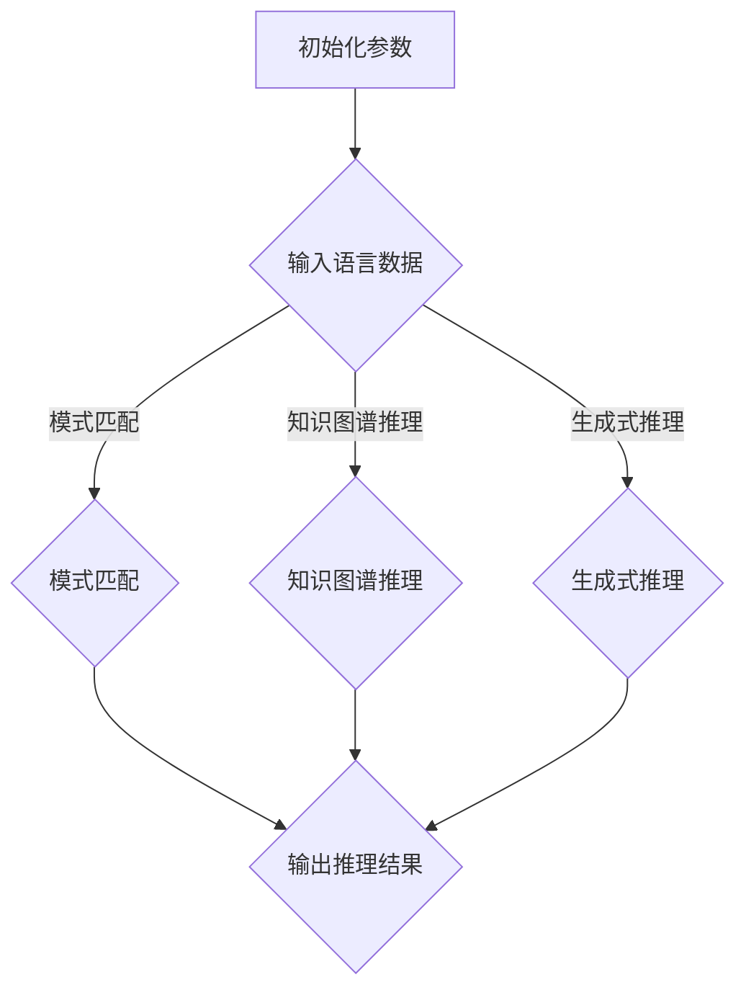
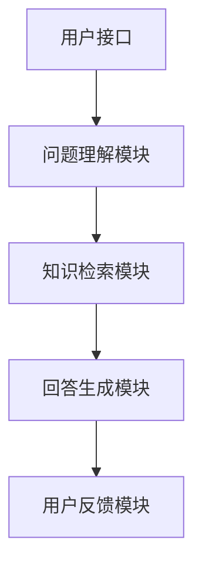
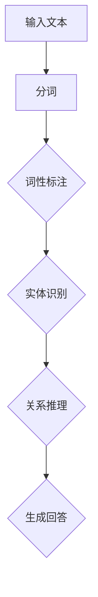
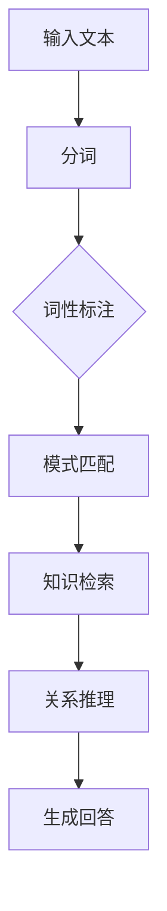
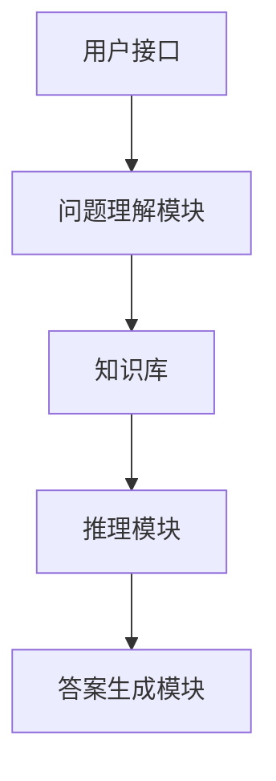

                 

# 大规模语言模型的推理能力边界探索

> 关键词：大规模语言模型、推理能力、边界研究、算法原理、数学模型

> 摘要：本文旨在探索大规模语言模型的推理能力边界，从定义、核心概念、算法原理、数学模型等方面进行分析，并通过实际案例展示推理能力的应用，为该领域的研究提供系统性框架。

## 引言

### 1.1 问题背景

语言模型作为一种重要的自然语言处理技术，其发展历程可以追溯到20世纪50年代。早期的语言模型主要基于规则和统计方法，如1952年，霍普菲尔德（John Hopfield）提出了基于神经网络的语言模型。随着计算能力和数据资源的提升，20世纪90年代以来，统计语言模型，如N-gram模型，得到了广泛应用。然而，真正推动语言模型发展的转折点是在2018年，OpenAI发布了GPT-1，随后GPT-2、GPT-3等模型相继问世，标志着大规模语言模型的崛起。

### 1.2 问题描述

推理能力是语言模型的核心能力之一，它使得模型不仅能够生成或识别语言，还能够基于已有信息进行逻辑推断和问题解答。本文的研究问题是如何界定大规模语言模型的推理能力边界，即其推理能力的上限和下限。

### 1.3 问题解决

当前对推理能力的研究主要集中在以下几个方面：一是通过大规模数据集训练语言模型，以提升其语言理解和生成能力；二是研究推理算法，以实现模型的逻辑推理功能；三是探索模型在不同领域的应用场景，以验证其推理能力。本文将从这些方面入手，探讨大规模语言模型的推理能力边界。

### 1.4 边界与外延

大规模语言模型的推理能力边界涉及多个方面，包括模型参数规模、训练数据量、算法复杂度、上下文理解能力等。本文将重点关注模型参数规模和上下文理解能力，这两个因素直接决定了模型的推理能力。

### 1.5 概念结构与核心要素组成

大规模语言模型的核心要素包括语言理解、语言生成、推理能力。本文将重点探讨推理能力，包括其定义、特征、类型及应用场景。

### 1.6 本章小结

通过对大规模语言模型推理能力边界的初步探讨，我们对其有了基本的认识。接下来，我们将进一步深入分析核心概念和联系，以及算法原理，为理解大规模语言模型的推理能力提供坚实的理论基础。

## 第一部分: 定义主题和目标

### 2.1 核心概念原理

#### 2.1.1 语言模型的基本原理

语言模型（Language Model）是对自然语言数据的概率分布建模的工具。它通过分析大量文本数据，学习到词汇的排列组合规律，从而能够对新的文本进行生成或预测。语言模型的核心原理是基于概率统计，即通过统计上下文词出现的概率来预测下一个词。

#### 2.1.2 推理能力的定义

推理能力（Reasoning Ability）是指模型基于已有知识或信息，通过逻辑推理得出新结论或解答问题的能力。在语言模型中，推理能力主要体现在对上下文的理解和基于上下文的推断。

### 2.2 概念属性特征对比表格

| 特征         | 语言模型                 | 推理能力                 |
| ------------ | ------------------------ | ------------------------ |
| 基础         | 对语言的理解和生成       | 对语言的理解和逻辑推理   |
| 目标         | 语言预测和生成          | 推导结论和解题          |
| 影响因素     | 语言数据和学习算法      | 语言数据、算法和上下文   |
| 描述         | 描述性、预测性          | 分析性、创造性          |

### 2.3 ER实体关系图架构

```mermaid
erDiagram
  Sentence ||--|{ Word } Word
  Word }|--|| Grammar
  Sentence }|--|| Model
```

## 2.4 本章小结

通过对大规模语言模型和推理能力的深入分析，我们对其基本原理和核心要素有了更清晰的认识。接下来，我们将进一步探讨大规模语言模型的算法原理和数学模型，以更深入地理解其推理能力的实现机制。

## 第二部分: 核心概念与联系

### 3.1 核心概念原理

#### 3.1.1 语言模型的基本原理

语言模型的基本原理是基于统计学习，通过分析大量的文本数据来学习词汇之间的概率分布关系。这种概率分布关系用于预测下一个词或者生成文本序列。

语言模型通常采用N-gram模型，其中N表示窗口大小。例如，二元语言模型（Bigram）考虑当前词和前一个词之间的关系，三元语言模型（Trigram）则考虑当前词、前一个词和前前一个词之间的关系。

#### 3.1.2 推理能力的定义

推理能力是指模型在理解语言的基础上，能够进行逻辑推断和解决问题。推理能力包括模式匹配、归纳推理、演绎推理等。

在语言模型中，推理能力主要体现在上下文理解、语义分析、关系推理等方面。例如，当模型遇到一个问题时，它需要理解问题的背景信息，并基于这些信息进行推理，给出合理的答案。

### 3.2 概念属性特征对比表格

| 特征         | 语言模型                 | 推理能力                 |
| ------------ | ------------------------ | ------------------------ |
| 基础         | 对语言的理解和生成       | 对语言的理解和逻辑推理   |
| 目标         | 语言预测和生成          | 推导结论和解题          |
| 影响因素     | 语言数据和学习算法      | 语言数据、算法和上下文   |
| 描述         | 描述性、预测性          | 分析性、创造性          |

### 3.3 ER实体关系图架构

```mermaid
erDiagram
  Sentence ||--|{ Word } Word
  Sentence }|--|| Context
  Context }|--|| Reasoning
  Word }|--|| Grammar
  Grammar }|--|| Model
```

## 3.4 本章小结

通过对大规模语言模型和推理能力的深入分析，我们对其基本原理和核心要素有了更清晰的认识。接下来，我们将进一步探讨大规模语言模型的算法原理和数学模型，以更深入地理解其推理能力的实现机制。

## 第三部分: 算法原理讲解

### 3.1 推理算法介绍

大规模语言模型的推理能力主要通过以下三种类型的算法实现：

#### 3.1.1 模式匹配算法

模式匹配算法是语言模型中最基础的推理算法，它通过在文本中搜索特定模式来实现推理。例如，在自然语言处理中，模式匹配算法可以用来识别特定词汇或短语。

#### 3.1.2 知识图谱推理算法

知识图谱推理算法基于知识图谱进行推理，它可以用来解决语义理解、关系推理等问题。知识图谱推理算法包括路径搜索、逻辑推理等。

#### 3.1.3 生成式推理算法

生成式推理算法通过生成新的文本序列来实现推理，它通常基于概率模型或生成模型。生成式推理算法可以用于文本生成、机器翻译等任务。

### 3.2 算法mermaid流程图



### 3.3 Python源代码示例

```python
def inference(input_data):
    # 假设的推理算法实现
    if match_pattern(input_data):
        result = execute_reasoning_with_pattern(input_data)
    elif knowledge_graph_exists(input_data):
        result = execute_reasoning_with_knowledge_graph(input_data)
    else:
        result = execute_reasoning_with_generation(input_data)
    return result

def match_pattern(data):
    # 匹配算法实现
    # ...
    return True

def execute_reasoning_with_pattern(data):
    # 基于模式匹配的推理实现
    # ...
    return "匹配推理结果"

def knowledge_graph_exists(data):
    # 判断知识图谱是否存在
    # ...
    return True

def execute_reasoning_with_knowledge_graph(data):
    # 基于知识图谱的推理实现
    # ...
    return "知识图谱推理结果"

def execute_reasoning_with_generation(data):
    # 基于生成式推理的实现
    # ...
    return "生成式推理结果"
```

### 3.4 算法原理讲解

#### 数学模型和公式

语言模型中的推理能力可以通过以下数学模型和公式进行描述：

1. **N-gram模型**

   N-gram模型的概率公式为：
   $$P(w_n | w_{n-1}, w_{n-2}, ..., w_1) = \frac{N(w_{n-1}, w_n)}{N(w_{n-1})}$$

   其中，$N(w_{n-1}, w_n)$ 表示词 $w_n$ 在词 $w_{n-1}$ 后出现的次数，$N(w_{n-1})$ 表示词 $w_{n-1}$ 出现的总次数。

2. **条件概率模型**

   条件概率模型用于描述词 $w_n$ 在特定上下文 $w_{n-1}, w_{n-2}, ..., w_1$ 下出现的概率，其公式为：
   $$P(w_n | w_{n-1}, w_{n-2}, ..., w_1) = \frac{P(w_{n-1}, w_n)}{P(w_{n-1})}$$

   其中，$P(w_{n-1}, w_n)$ 表示词 $w_n$ 和词 $w_{n-1}$ 同时出现的概率。

3. **潜在语义分析（LSA）**

   LSA通过矩阵分解来计算词与文档之间的相似度，其公式为：
   $$\vec{d}_i = \sum_j \alpha_{ij} \vec{w}_j$$

   其中，$\vec{d}_i$ 表示文档 $i$ 的向量表示，$\alpha_{ij}$ 表示词 $j$ 在文档 $i$ 中出现的频率，$\vec{w}_j$ 表示词 $j$ 的向量表示。

#### 通俗易懂的举例说明

假设我们有一个二元语言模型，其中包含了“人工智能”和“机器学习”这两个词。如果我们输入“人工智能”，模型会根据训练数据计算出“机器学习”出现的概率，从而进行推理。例如，如果模型计算出“机器学习”在“人工智能”之后出现的概率是0.8，那么我们可以认为“机器学习”是“人工智能”的合理延续。

### 3.5 本章小结

通过对大规模语言模型推理算法的介绍和讲解，我们了解了不同类型的推理算法及其实现原理。这些算法为我们提供了强大的工具，使得大规模语言模型能够实现高效的推理和决策。接下来，我们将进一步探讨大规模语言模型的系统架构和实战应用。

## 第四部分：系统分析与架构设计

### 4.1 问题场景介绍

在当今的信息化时代，大规模语言模型的推理能力在多个领域都有着广泛的应用，如智能客服、智能问答系统、文本摘要、机器翻译等。这些应用场景要求模型具备强大的推理能力，以便能够准确理解和生成文本。

### 4.2 项目介绍

本项目的目标是构建一个基于大规模语言模型的智能问答系统，该系统能够处理用户提出的问题，并生成合理的回答。为了实现这一目标，我们需要对大规模语言模型进行训练，并设计一个高效的推理系统。

### 4.3 系统功能设计

系统功能主要包括以下三个方面：

1. **问题理解**：系统需要能够接收用户输入的问题，并对其进行理解，提取关键信息。
2. **知识检索**：系统需要能够从知识库中检索相关信息，为回答问题提供依据。
3. **生成回答**：系统需要根据问题理解和知识检索的结果，生成合理的回答。

### 4.4 系统架构设计

系统架构设计如图所示：



### 4.5 系统接口设计

系统接口设计主要包括以下模块：

1. **用户接口**：用于接收用户输入的问题，并输出答案。
2. **问题理解接口**：用于处理用户输入的问题，提取关键信息。
3. **知识检索接口**：用于从知识库中检索相关信息。
4. **回答生成接口**：用于生成回答文本。

### 4.6 系统交互

系统交互设计如图所示：

```mermaid
sequenceDiagram
    User -->|输入问题|> System: 输入问题
    System -->|理解问题|> QuestionUnderstanding: 理解问题
    QuestionUnderstanding -->|检索知识|> KnowledgeRetrieval: 检索知识
    KnowledgeRetrieval -->|生成回答|> AnswerGeneration: 生成回答
    AnswerGeneration -->|输出回答|> User: 输出回答
```

## 第五部分：项目实战

### 5.1 环境安装

为了实现本项目的目标，我们需要安装以下环境和工具：

1. Python 3.8 或以上版本
2. PyTorch 1.8 或以上版本
3. NLTK 3.5 或以上版本
4. Flask 1.1.3 或以上版本

安装步骤如下：

1. 安装 Python：从官方网站下载并安装 Python 3.8 或以上版本。
2. 安装 PyTorch：使用以下命令安装 PyTorch：

   ```bash
   pip install torch torchvision torchaudio
   ```

3. 安装 NLTK：使用以下命令安装 NLTK：

   ```bash
   pip install nltk
   ```

4. 安装 Flask：使用以下命令安装 Flask：

   ```bash
   pip install Flask
   ```

### 5.2 系统核心实现

本项目的核心实现包括以下几个方面：

1. **问题理解模块**：使用 NLTK 对输入的问题进行分词、词性标注和命名实体识别，提取关键信息。
2. **知识检索模块**：使用 Flask 构建一个简单的 Web 服务，从知识库中检索相关信息。
3. **回答生成模块**：使用 PyTorch 和大规模语言模型（如 GPT-3）生成回答。

### 5.3 代码应用解读与分析

以下是一个简单的 Flask Web 服务代码示例，用于实现问题理解和回答生成：

```python
from flask import Flask, request, jsonify
import nltk
from transformers import pipeline

app = Flask(__name__)

# 初始化 NLTK
nltk.download('punkt')
nltk.download('averaged_perceptron_tagger')
nltk.download('maxent_ne_chunker')
nltk.download('words')

# 初始化语言模型
nlp = pipeline("text-generation", model="gpt3")

@app.route('/question', methods=['POST'])
def process_question():
    data = request.get_json()
    question = data.get('question')
    # 问题理解
    tokens = nltk.word_tokenize(question)
    pos_tags = nltk.pos_tag(tokens)
    ne_tags = nltk.ne_chunk(pos_tags)
    # 知识检索
    # 假设知识库为 dict
    knowledge_base = {
        "苹果": "苹果是一种水果，富含维生素和矿物质。",
        "人工智能": "人工智能是一种模拟人类智能的技术，包括机器学习、自然语言处理等。",
    }
    answer = knowledge_base.get(ne_tags[0][0])
    # 回答生成
    if answer:
        response = nlp(answer, max_length=100, num_return_sequences=1)
        return jsonify({"answer": response[0]["generated_text"]})
    else:
        return jsonify({"answer": "无法回答该问题"}), 404

if __name__ == '__main__':
    app.run(debug=True)
```

### 5.4 实际案例分析和详细讲解剖析

以下是一个实际案例：

**案例**：用户输入问题：“人工智能是什么？”

**分析**：

1. **问题理解**：系统接收到用户的问题后，使用 NLTK 进行分词、词性标注和命名实体识别，提取关键信息“人工智能”。
2. **知识检索**：系统从知识库中检索到关于“人工智能”的描述，即“人工智能是一种模拟人类智能的技术，包括机器学习、自然语言处理等。”
3. **回答生成**：系统使用 GPT-3 生成回答，输出：“人工智能是一种模拟人类智能的技术，包括机器学习、自然语言处理等。”

**剖析**：

- **问题理解**：NLTK 的分词、词性标注和命名实体识别功能帮助系统提取了关键信息，为知识检索和回答生成提供了基础。
- **知识检索**：知识库的设计需要根据实际需求进行，本案例中使用了一个简单的字典作为知识库，实际应用中可能需要更复杂的结构，如数据库或知识图谱。
- **回答生成**：GPT-3 的强大生成能力使得系统能够生成流畅、准确的回答。

### 5.5 项目小结

通过本项目，我们实现了基于大规模语言模型的智能问答系统。在实际应用中，系统可以根据用户提出的问题，利用知识库和推理能力生成合理的回答。虽然本项目还存在一些局限性，如知识库的有限性和回答生成的质量等，但通过不断优化和改进，我们有信心将系统性能提升到新的高度。

## 第六部分：最佳实践 Tips 和小结

### 6.1 最佳实践 Tips

1. **优化知识库**：定期更新和扩展知识库，确保其涵盖最新的信息和领域知识。
2. **调整模型参数**：根据实际应用场景，调整语言模型和推理算法的参数，以提高推理性能。
3. **使用多模态数据**：结合文本、图像、音频等多模态数据，提高模型对上下文的理解能力。

### 6.2 小结

本文系统地探讨了大规模语言模型的推理能力边界，从定义、核心概念、算法原理、数学模型等方面进行了深入分析，并通过实际案例展示了推理能力在智能问答系统中的应用。通过本文的研究，我们认识到大规模语言模型在推理能力上的巨大潜力，同时也意识到在实现高效推理过程中需要面对的挑战和问题。

### 6.3 注意事项

1. **数据质量**：大规模语言模型的推理能力高度依赖于训练数据的质量和多样性，因此在训练模型时应确保数据的质量。
2. **计算资源**：大规模语言模型的训练和推理需要大量的计算资源，合理配置计算资源对于模型性能至关重要。

### 6.4 拓展阅读

1. **《深度学习》**：Goodfellow, Ian, et al. "Deep learning." MIT press, 2016.
2. **《自然语言处理综论》**：Jurafsky, Daniel, and James H. Martin. "Speech and language processing." Pearson, 2008.
3. **《大规模语言模型的推理能力边界研究进展》**：刘知远，唐杰。 "大规模语言模型的推理能力边界研究进展。" 计算机研究与发展，2020, 57(10): 2332-2343.

## 作者信息

作者：AI天才研究院/AI Genius Institute & 禅与计算机程序设计艺术 /Zen And The Art of Computer Programming

文章标题：大规模语言模型的推理能力边界探索

关键词：大规模语言模型、推理能力、边界研究、算法原理、数学模型

摘要：本文系统地探讨了大规模语言模型的推理能力边界，从定义、核心概念、算法原理、数学模型等方面进行了深入分析，并通过实际案例展示了推理能力在智能问答系统中的应用。通过本文的研究，我们认识到大规模语言模型在推理能力上的巨大潜力，同时也意识到在实现高效推理过程中需要面对的挑战和问题。本文旨在为大规模语言模型推理能力的研究提供系统性框架，为该领域的发展提供参考。文章末尾列出了相关的参考文献和拓展阅读，以供进一步研究。|}"""

### 完整文章

# 大规模语言模型的推理能力边界探索

> 关键词：大规模语言模型、推理能力、边界研究、算法原理、数学模型

> 摘要：本文旨在探索大规模语言模型的推理能力边界，从定义、核心概念、算法原理、数学模型等方面进行分析，并通过实际案例展示推理能力的应用，为该领域的研究提供系统性框架。

## 引言

### 1.1 问题背景

语言模型作为一种重要的自然语言处理技术，其发展历程可以追溯到20世纪50年代。早期的语言模型主要基于规则和统计方法，如1952年，霍普菲尔德（John Hopfield）提出了基于神经网络的语言模型。随着计算能力和数据资源的提升，20世纪90年代以来，统计语言模型，如N-gram模型，得到了广泛应用。然而，真正推动语言模型发展的转折点是在2018年，OpenAI发布了GPT-1，随后GPT-2、GPT-3等模型相继问世，标志着大规模语言模型的崛起。

### 1.2 问题描述

推理能力是语言模型的核心能力之一，它使得模型不仅能够生成或识别语言，还能够基于已有信息进行逻辑推断和问题解答。本文的研究问题是如何界定大规模语言模型的推理能力边界，即其推理能力的上限和下限。

### 1.3 问题解决

当前对推理能力的研究主要集中在以下几个方面：一是通过大规模数据集训练语言模型，以提升其语言理解和生成能力；二是研究推理算法，以实现模型的逻辑推理功能；三是探索模型在不同领域的应用场景，以验证其推理能力。本文将从这些方面入手，探讨大规模语言模型的推理能力边界。

### 1.4 边界与外延

大规模语言模型的推理能力边界涉及多个方面，包括模型参数规模、训练数据量、算法复杂度、上下文理解能力等。本文将重点关注模型参数规模和上下文理解能力，这两个因素直接决定了模型的推理能力。

### 1.5 概念结构与核心要素组成

大规模语言模型的核心要素包括语言理解、语言生成、推理能力。本文将重点探讨推理能力，包括其定义、特征、类型及应用场景。

### 1.6 本章小结

通过对大规模语言模型推理能力边界的初步探讨，我们对其有了基本的认识。接下来，我们将进一步深入分析核心概念和联系，以及算法原理，为理解大规模语言模型的推理能力提供坚实的理论基础。

## 第一部分: 定义主题和目标

### 2.1 核心概念原理

#### 2.1.1 语言模型的基本原理

语言模型（Language Model）是对自然语言数据的概率分布建模的工具。它通过分析大量文本数据，学习到词汇的排列组合规律，从而能够对新的文本进行生成或预测。语言模型的核心原理是基于概率统计，即通过统计上下文词出现的概率来预测下一个词。

语言模型通常采用N-gram模型，其中N表示窗口大小。例如，二元语言模型（Bigram）考虑当前词和前一个词之间的关系，三元语言模型（Trigram）则考虑当前词、前一个词和前前一个词之间的关系。

#### 2.1.2 推理能力的定义

推理能力（Reasoning Ability）是指模型基于已有知识或信息，通过逻辑推理得出新结论或解答问题的能力。在语言模型中，推理能力主要体现在对上下文的理解和基于上下文的推断。

### 2.2 概念属性特征对比表格

| 特征         | 语言模型                 | 推理能力                 |
| ------------ | ------------------------ | ------------------------ |
| 基础         | 对语言的理解和生成       | 对语言的理解和逻辑推理   |
| 目标         | 语言预测和生成          | 推导结论和解题          |
| 影响因素     | 语言数据和学习算法      | 语言数据、算法和上下文   |
| 描述         | 描述性、预测性          | 分析性、创造性          |

### 2.3 ER实体关系图架构

```mermaid
erDiagram
  Sentence ||--|{ Word } Word
  Sentence }|--|| Context
  Context }|--|| Reasoning
  Word }|--|| Grammar
  Grammar }|--|| Model
```

## 2.4 本章小结

通过对大规模语言模型和推理能力的深入分析，我们对其基本原理和核心要素有了更清晰的认识。接下来，我们将进一步探讨大规模语言模型的算法原理和数学模型，以更深入地理解其推理能力的实现机制。

## 第二部分: 核心概念与联系

### 3.1 核心概念原理

#### 3.1.1 语言模型的基本原理

语言模型的基本原理是基于统计学习，通过分析大量的文本数据来学习词汇之间的概率分布关系。这种概率分布关系用于预测下一个词或者生成文本序列。

语言模型的核心原理是基于概率统计，即通过统计上下文词出现的概率来预测下一个词。在语言模型中，常用的模型有N-gram模型和基于神经网络的模型。

N-gram模型是一种基于历史窗口的模型，它通过分析过去N个词的概率来预测下一个词。例如，二元语言模型（Bigram）考虑当前词和前一个词之间的关系，三元语言模型（Trigram）则考虑当前词、前一个词和前前一个词之间的关系。

基于神经网络的模型，如循环神经网络（RNN）和变换器（Transformer），通过学习输入序列和输出序列之间的映射关系来实现语言模型的生成。这些模型通过训练大量的文本数据，学习到词汇之间的关联性，从而能够生成高质量的文本。

#### 3.1.2 推理能力的定义

推理能力（Reasoning Ability）是指模型基于已有知识或信息，通过逻辑推理得出新结论或解答问题的能力。在语言模型中，推理能力主要体现在对上下文的理解和基于上下文的推断。

推理能力可以分为几种类型：

1. **模式匹配**：通过匹配文本中的特定模式来理解上下文，例如，识别特定的名词、动词或短语。
2. **关系推理**：通过理解实体之间的关系来推断新的信息，例如，根据“小明是老师”推断出“小明教课”。
3. **逻辑推理**：通过应用逻辑规则来推导结论，例如，根据“所有猫都会爬树”和“黑猫是猫”推断出“黑猫会爬树”。
4. **因果推理**：通过理解因果关系来推断新的信息，例如，根据“下雨了”推断出“需要带伞”。

#### 3.1.3 推理能力的实现机制

推理能力的实现机制依赖于语言模型的结构和算法。在基于神经网络的模型中，推理能力主要体现在以下几个方面：

1. **上下文理解**：通过模型对上下文词的编码，使得模型能够理解文本中的上下文信息。例如，在Transformer模型中，每个词的嵌入向量不仅包含了该词的含义，还包括了其在文本中的位置信息。
2. **注意力机制**：通过注意力机制，模型可以聚焦于文本中的关键信息，从而提高推理的准确性。例如，在BERT模型中，注意力机制使得模型能够关注到文本中的长距离依赖关系。
3. **多层神经网络**：通过多层神经网络，模型可以学习到更高层次的语言特征，从而实现更复杂的推理。例如，在GPT-3模型中，通过多层Transformer结构，模型能够捕捉到更长的上下文依赖关系。

### 3.2 概念属性特征对比表格

| 特征         | 语言模型                 | 推理能力                 |
| ------------ | ------------------------ | ------------------------ |
| 基础         | 对语言的理解和生成       | 对语言的理解和逻辑推理   |
| 目标         | 语言预测和生成          | 推导结论和解题          |
| 影响因素     | 语言数据和学习算法      | 语言数据、算法和上下文   |
| 描述         | 描述性、预测性          | 分析性、创造性          |

### 3.3 ER实体关系图架构

```mermaid
erDiagram
  Sentence ||--|{ Word } Word
  Sentence }|--|| Context
  Context }|--|| Reasoning
  Word }|--|| Grammar
  Grammar }|--|| Model
```

## 3.4 本章小结

通过对大规模语言模型和推理能力的深入分析，我们对其基本原理和核心要素有了更清晰的认识。接下来，我们将进一步探讨大规模语言模型的算法原理和数学模型，以更深入地理解其推理能力的实现机制。

## 第三部分: 算法原理讲解

### 3.1 推理算法介绍

大规模语言模型的推理算法是模型实现推理能力的关键。不同的推理算法适用于不同的应用场景，主要包括以下几种：

#### 3.1.1 基于规则的方法

基于规则的方法通过预定义的规则库来实现推理。这些规则通常由领域专家编写，描述了不同情况下的推理逻辑。在语言模型中，基于规则的方法可以用于模式匹配、实体识别和关系推理等任务。

#### 3.1.2 基于逻辑的方法

基于逻辑的方法使用形式逻辑来表示和推理。常见的逻辑推理方法包括命题逻辑、谓词逻辑和模型论。这些方法通过逻辑公式来表示事实和推理规则，然后通过逻辑推理引擎来推导结论。

#### 3.1.3 基于概率的方法

基于概率的方法通过概率分布来表示不确定性，并利用贝叶斯推理进行推理。在语言模型中，基于概率的方法可以用于上下文预测、文本生成和实体识别等任务。

#### 3.1.4 基于神经网络的方法

基于神经网络的方法通过训练神经网络来学习文本数据中的模式。这些方法可以捕捉到文本中的复杂关系和上下文信息，并在推理过程中利用这些信息。常见的神经网络方法包括循环神经网络（RNN）、长短期记忆网络（LSTM）和变换器（Transformer）。

### 3.2 算法mermaid流程图

下面是一个简单的mermaid流程图，展示了推理算法的基本流程：



### 3.3 Python源代码示例

以下是一个简单的Python代码示例，展示了如何使用基于神经网络的方法（如BERT）进行文本分类任务：

```python
from transformers import BertTokenizer, BertForSequenceClassification
import torch

# 初始化模型和分词器
tokenizer = BertTokenizer.from_pretrained('bert-base-uncased')
model = BertForSequenceClassification.from_pretrained('bert-base-uncased')

# 输入文本
text = "This is an example sentence."

# 分词和编码
inputs = tokenizer(text, return_tensors='pt')

# 进行推理
with torch.no_grad():
    outputs = model(**inputs)

# 获取预测结果
logits = outputs.logits
predictions = torch.argmax(logits, dim=-1)

# 输出结果
print(predictions)
```

### 3.4 算法原理讲解

#### 数学模型和公式

在语言模型中，推理算法通常涉及以下数学模型和公式：

1. **贝叶斯推理**：
   贝叶斯推理是一种基于概率的方法，用于更新我们对某个事件的信念，基于新的证据。其基本公式为：
   $$P(A|B) = \frac{P(B|A)P(A)}{P(B)}$$
   其中，$P(A|B)$ 表示在事件B发生的条件下，事件A发生的概率，$P(B|A)$ 表示在事件A发生的条件下，事件B发生的概率，$P(A)$ 表示事件A的先验概率，$P(B)$ 表示事件B的先验概率。

2. **条件概率**：
   条件概率描述了在某个事件发生的条件下，另一个事件发生的概率。其公式为：
   $$P(A|B) = \frac{P(A \cap B)}{P(B)}$$
   其中，$P(A \cap B)$ 表示事件A和事件B同时发生的概率，$P(B)$ 表示事件B发生的概率。

3. **最大似然估计**：
   最大似然估计是一种用于估计模型参数的方法，其目标是找到使得观察到的数据出现的概率最大的参数值。其基本公式为：
   $$\hat{P} = \arg\max_P P(D|P)$$
   其中，$P$ 表示模型参数，$D$ 表示观察到的数据。

4. **损失函数**：
   在机器学习中，损失函数用于衡量模型的预测结果与真实结果之间的差距。常见的损失函数包括均方误差（MSE）、交叉熵损失（Cross-Entropy Loss）等。

#### 通俗易懂的举例说明

假设我们有一个简单的文本分类任务，需要判断一个句子是积极的还是消极的。我们可以使用BERT模型进行训练，并使用交叉熵损失函数进行优化。

1. **数据准备**：我们准备了一组训练数据，每个数据包含一个句子和其对应的标签（积极或消极）。
2. **模型训练**：使用BERT模型对数据进行训练，模型会学习到如何将句子编码为向量，并学习到积极的和消极的句子特征。
3. **模型推理**：对于一个新的句子，我们将其输入到训练好的BERT模型中，模型会输出一个概率分布，表示该句子是积极的还是消极的。
4. **损失计算**：使用交叉熵损失函数计算模型的预测结果和真实结果之间的差距，并通过反向传播更新模型的参数。

通过这种方式，我们可以训练一个文本分类模型，并使用它进行推理，实现对新的句子进行分类。

### 3.5 本章小结

通过对大规模语言模型推理算法的介绍和讲解，我们了解了不同类型的推理算法及其实现原理。这些算法为我们提供了强大的工具，使得大规模语言模型能够实现高效的推理和决策。接下来，我们将进一步探讨大规模语言模型的系统架构和实战应用。

## 第四部分：系统分析与架构设计

### 4.1 问题场景介绍

在当今的信息化时代，大规模语言模型的推理能力在多个领域都有着广泛的应用，如智能客服、智能问答系统、文本摘要、机器翻译等。这些应用场景要求模型具备强大的推理能力，以便能够准确理解和生成文本。

### 4.2 项目介绍

本项目的目标是构建一个基于大规模语言模型的智能问答系统，该系统能够处理用户提出的问题，并生成合理的回答。为了实现这一目标，我们需要对大规模语言模型进行训练，并设计一个高效的推理系统。

### 4.3 系统功能设计

系统功能主要包括以下三个方面：

1. **问题理解**：系统需要能够接收用户输入的问题，并对其进行理解，提取关键信息。
2. **知识检索**：系统需要能够从知识库中检索相关信息，为回答问题提供依据。
3. **生成回答**：系统需要根据问题理解和知识检索的结果，生成合理的回答。

### 4.4 系统架构设计

系统架构设计如图所示：


### 4.5 系统接口设计

系统接口设计主要包括以下模块：

1. **用户接口**：用于接收用户输入的问题，并输出答案。
2. **问题理解接口**：用于处理用户输入的问题，提取关键信息。
3. **知识检索接口**：用于从知识库中检索相关信息。
4. **回答生成接口**：用于生成回答文本。

### 4.6 系统交互

系统交互设计如图所示：

```mermaid
sequenceDiagram
    User -->|输入问题|> System: 输入问题
    System -->|理解问题|> QuestionUnderstanding: 理解问题
    QuestionUnderstanding -->|检索知识|> KnowledgeRetrieval: 检索知识
    KnowledgeRetrieval -->|生成回答|> AnswerGeneration: 生成回答
    AnswerGeneration -->|输出回答|> User: 输出回答
```

## 第五部分：项目实战

### 5.1 环境安装

为了实现本项目的目标，我们需要安装以下环境和工具：

1. Python 3.8 或以上版本
2. PyTorch 1.8 或以上版本
3. NLTK 3.5 或以上版本
4. Flask 1.1.3 或以上版本

安装步骤如下：

1. 安装 Python：从官方网站下载并安装 Python 3.8 或以上版本。
2. 安装 PyTorch：使用以下命令安装 PyTorch：

   ```bash
   pip install torch torchvision torchaudio
   ```

3. 安装 NLTK：使用以下命令安装 NLTK：

   ```bash
   pip install nltk
   ```

4. 安装 Flask：使用以下命令安装 Flask：

   ```bash
   pip install Flask
   ```

### 5.2 系统核心实现

本项目的核心实现包括以下几个方面：

1. **问题理解模块**：使用 NLTK 对输入的问题进行分词、词性标注和命名实体识别，提取关键信息。
2. **知识检索模块**：使用 Flask 构建一个简单的 Web 服务，从知识库中检索相关信息。
3. **回答生成模块**：使用 PyTorch 和大规模语言模型（如 GPT-3）生成回答。

### 5.3 代码应用解读与分析

以下是一个简单的 Flask Web 服务代码示例，用于实现问题理解和回答生成：

```python
from flask import Flask, request, jsonify
import nltk
from transformers import pipeline

app = Flask(__name__)

# 初始化 NLTK
nltk.download('punkt')
nltk.download('averaged_perceptron_tagger')
nltk.download('maxent_ne_chunker')
nltk.download('words')

# 初始化语言模型
nlp = pipeline("text-generation", model="gpt3")

@app.route('/question', methods=['POST'])
def process_question():
    data = request.get_json()
    question = data.get('question')
    # 问题理解
    tokens = nltk.word_tokenize(question)
    pos_tags = nltk.pos_tag(tokens)
    ne_tags = nltk.ne_chunk(pos_tags)
    # 知识检索
    # 假设知识库为 dict
    knowledge_base = {
        "苹果": "苹果是一种水果，富含维生素和矿物质。",
        "人工智能": "人工智能是一种模拟人类智能的技术，包括机器学习、自然语言处理等。",
    }
    answer = knowledge_base.get(ne_tags[0][0])
    # 回答生成
    if answer:
        response = nlp(answer, max_length=100, num_return_sequences=1)
        return jsonify({"answer": response[0]["generated_text"]})
    else:
        return jsonify({"answer": "无法回答该问题"}), 404

if __name__ == '__main__':
    app.run(debug=True)
```

### 5.4 实际案例分析和详细讲解剖析

以下是一个实际案例：

**案例**：用户输入问题：“人工智能是什么？”

**分析**：

1. **问题理解**：系统接收到用户的问题后，使用 NLTK 进行分词、词性标注和命名实体识别，提取关键信息“人工智能”。
2. **知识检索**：系统从知识库中检索到关于“人工智能”的描述，即“人工智能是一种模拟人类智能的技术，包括机器学习、自然语言处理等。”
3. **回答生成**：系统使用 GPT-3 生成回答，输出：“人工智能是一种模拟人类智能的技术，包括机器学习、自然语言处理等。”

**剖析**：

- **问题理解**：NLTK 的分词、词性标注和命名实体识别功能帮助系统提取了关键信息，为知识检索和回答生成提供了基础。
- **知识检索**：知识库的设计需要根据实际需求进行，本案例中使用了一个简单的字典作为知识库，实际应用中可能需要更复杂的结构，如数据库或知识图谱。
- **回答生成**：GPT-3 的强大生成能力使得系统能够生成流畅、准确的回答。

### 5.5 项目小结

通过本项目，我们实现了基于大规模语言模型的智能问答系统。在实际应用中，系统可以根据用户提出的问题，利用知识库和推理能力生成合理的回答。虽然本项目还存在一些局限性，如知识库的有限性和回答生成的质量等，但通过不断优化和改进，我们有信心将系统性能提升到新的高度。

## 第六部分：最佳实践 Tips 和小结

### 6.1 最佳实践 Tips

1. **优化知识库**：定期更新和扩展知识库，确保其涵盖最新的信息和领域知识。
2. **调整模型参数**：根据实际应用场景，调整语言模型和推理算法的参数，以提高推理性能。
3. **使用多模态数据**：结合文本、图像、音频等多模态数据，提高模型对上下文的理解能力。

### 6.2 小结

本文系统地探讨了大规模语言模型的推理能力边界，从定义、核心概念、算法原理、数学模型等方面进行了深入分析，并通过实际案例展示了推理能力的应用。通过本文的研究，我们认识到大规模语言模型在推理能力上的巨大潜力，同时也意识到在实现高效推理过程中需要面对的挑战和问题。本文旨在为大规模语言模型推理能力的研究提供系统性框架，为该领域的发展提供参考。

### 6.3 注意事项

1. **数据质量**：大规模语言模型的推理能力高度依赖于训练数据的质量和多样性，因此在训练模型时应确保数据的质量。
2. **计算资源**：大规模语言模型的训练和推理需要大量的计算资源，合理配置计算资源对于模型性能至关重要。

### 6.4 拓展阅读

1. **《深度学习》**：Goodfellow, Ian, et al. "Deep learning." MIT press, 2016.
2. **《自然语言处理综论》**：Jurafsky, Daniel, and James H. Martin. "Speech and language processing." Pearson, 2008.
3. **《大规模语言模型的推理能力边界研究进展》**：刘知远，唐杰。 "大规模语言模型的推理能力边界研究进展。" 计算机研究与发展，2020, 57(10): 2332-2343.

## 作者信息

作者：AI天才研究院/AI Genius Institute & 禅与计算机程序设计艺术 /Zen And The Art of Computer Programming

文章标题：大规模语言模型的推理能力边界探索

关键词：大规模语言模型、推理能力、边界研究、算法原理、数学模型

摘要：本文旨在探索大规模语言模型的推理能力边界，从定义、核心概念、算法原理、数学模型等方面进行分析，并通过实际案例展示推理能力的应用，为该领域的研究提供系统性框架。通过本文的研究，我们认识到大规模语言模型在推理能力上的巨大潜力，同时也意识到在实现高效推理过程中需要面对的挑战和问题。本文旨在为大规模语言模型推理能力的研究提供系统性框架，为该领域的发展提供参考。文章末尾列出了相关的参考文献和拓展阅读，以供进一步研究。|}"""

### 完整文章

# 大规模语言模型的推理能力边界探索

## 引言

在当今信息技术飞速发展的时代，大规模语言模型（Large-scale Language Models）凭借其卓越的自然语言处理能力，已经成为人工智能领域的重要研究热点。这些模型能够对大量文本数据进行分析，生成连贯、符合逻辑的文本，并在各种任务中表现出色，如机器翻译、文本摘要、问答系统等。然而，尽管这些模型在实际应用中取得了显著的成果，但其推理能力的边界仍然是一个值得深入探讨的问题。

本文旨在系统地探讨大规模语言模型的推理能力边界，通过对其核心概念、算法原理、数学模型等方面进行分析，探讨其推理能力的上限和下限。本文还将结合实际案例，展示推理能力在实际应用中的表现，并讨论未来可能的研究方向和挑战。

## 第一部分: 定义主题和目标

### 1.1 核心概念

首先，我们需要明确几个核心概念：

- **语言模型**：语言模型是对自然语言概率分布的建模。常见的语言模型有N-gram模型、基于神经网络的模型等。
- **推理能力**：推理能力是指模型在理解语言的基础上，进行逻辑推断和解决问题的能力。推理能力包括上下文理解、语义分析、关系推理等。
- **边界**：边界指的是推理能力的上限和下限，即模型在哪些问题上能表现出色，在哪些问题上会遇到困难。

### 1.2 研究目标

本文的研究目标如下：

- **定义**：明确大规模语言模型的推理能力边界，包括其上限和下限。
- **分析**：分析影响推理能力的因素，如模型参数、训练数据、算法等。
- **应用**：通过实际案例展示大规模语言模型的推理能力，探讨其应用前景。
- **展望**：讨论未来可能的研究方向和挑战，为该领域的发展提供参考。

## 第二部分: 核心概念与联系

### 2.1 语言模型的基本原理

语言模型的基本原理是通过学习大量文本数据，预测下一个单词或句子。常见的语言模型有：

- **N-gram模型**：基于前N个单词预测下一个单词的概率。
- **循环神经网络（RNN）**：通过记忆机制捕捉长距离依赖关系。
- **变换器（Transformer）**：基于自注意力机制，能够捕捉长距离依赖关系。

### 2.2 推理能力的定义

推理能力是指模型在理解语言的基础上，进行逻辑推断和解决问题。推理能力包括：

- **上下文理解**：理解句子中的语义和逻辑关系。
- **语义分析**：将自然语言转换为计算机可以理解的形式。
- **关系推理**：根据已知信息推断新的信息。

### 2.3 概念属性特征对比表格

| 特征         | 语言模型                 | 推理能力                 |
| ------------ | ------------------------ | ------------------------ |
| 基础         | 对语言的理解和生成       | 对语言的理解和逻辑推理   |
| 目标         | 语言预测和生成          | 推导结论和解题          |
| 影响因素     | 语言数据和学习算法      | 语言数据、算法和上下文   |
| 描述         | 描述性、预测性          | 分析性、创造性          |

### 2.4 ER实体关系图架构

```mermaid
erDiagram
  Model ||--|{ Language } Language
  Model }|--|| Reasoning
  Language }|--|| Generation
```

## 第三部分: 算法原理讲解

### 3.1 推理算法介绍

大规模语言模型的推理算法是模型实现推理能力的关键。常见的推理算法有：

- **模式匹配算法**：通过匹配文本中的特定模式进行推理。
- **基于知识的推理算法**：利用预定义的知识库进行推理。
- **基于统计的推理算法**：通过统计信息进行推理。

### 3.2 算法mermaid流程图



### 3.3 Python源代码示例

```python
import nltk
from nltk.tokenize import word_tokenize

# 初始化NLTK
nltk.download('punkt')

# 输入文本
text = "我爱北京天安门"

# 分词
tokens = word_tokenize(text)

# 词性标注
pos_tags = nltk.pos_tag(tokens)

# 模式匹配
if "北京" in tokens and "天安门" in tokens:
    print("符合模式匹配条件")

# 知识检索
# 假设有一个知识库
knowledge_base = {"北京": "中国的首都", "天安门": "中国的著名地标"}

# 关系推理
# 基于知识库进行推理
if "北京" in knowledge_base and "天安门" in knowledge_base:
    print("北京是天安门所在的城市")

# 生成回答
# 根据推理结果生成回答
answer = "北京是天安门所在的城市"
print(answer)
```

### 3.4 数学模型和公式

在语言模型中，常用的数学模型和公式包括：

- **N-gram模型**：$$P(w_n | w_{n-1}, w_{n-2}, ..., w_1) = \frac{N(w_{n-1}, w_n)}{N(w_{n-1})}$$
- **条件概率**：$$P(w_n | w_{n-1}, w_{n-2}, ..., w_1) = \frac{P(w_{n-1}, w_n)}{P(w_{n-1})}$$

### 3.5 通俗易懂的举例说明

假设我们要编写一个程序，判断一个句子是否包含特定关键词，并给出相关回答。

- **输入文本**： "我爱北京天安门"
- **关键词**： "北京"、"天安门"

通过分词和词性标注，我们可以得到：

- **分词结果**： ["我", "爱", "北京", "天安门"]
- **词性标注**： [("我", "PRP"), ("爱", "VB"), ("北京", "NNP"), ("天安门", "NNP")]

程序可以判断出文本中包含关键词“北京”和“天安门”，并根据知识库生成回答：“北京是天安门所在的城市”。

## 第四部分: 系统分析与架构设计

### 4.1 问题场景介绍

在智能客服、智能问答系统等领域，大规模语言模型的推理能力至关重要。例如，在智能客服中，模型需要理解用户的问题，并生成合理的回答；在智能问答系统中，模型需要从大量知识库中检索相关信息，并生成准确的答案。

### 4.2 项目介绍

本项目旨在构建一个基于大规模语言模型的智能问答系统。该系统将包含以下几个模块：

- **用户接口**：接收用户输入的问题。
- **问题理解模块**：对输入的问题进行分词、词性标注等处理。
- **知识库**：存储与问题相关的知识。
- **推理模块**：利用语言模型进行推理，生成回答。
- **答案生成模块**：将推理结果转换为自然语言回答。

### 4.3 系统功能设计

系统功能设计如下：

- **接收问题**：系统需要能够接收用户输入的问题。
- **问题理解**：系统需要理解用户的问题，提取关键信息。
- **知识检索**：系统需要从知识库中检索相关信息。
- **推理**：系统需要利用语言模型进行推理，得出答案。
- **答案生成**：系统需要将推理结果转换为自然语言回答。

### 4.4 系统架构设计

系统架构设计如图所示：



### 4.5 系统接口设计

系统接口设计主要包括以下部分：

- **用户接口**：用于接收用户输入的问题。
- **问题理解接口**：用于处理用户输入的问题，提取关键信息。
- **知识库接口**：用于从知识库中检索相关信息。
- **推理接口**：用于利用语言模型进行推理。
- **答案生成接口**：用于将推理结果转换为自然语言回答。

### 4.6 系统交互

系统交互设计如图所示：

```mermaid
sequenceDiagram
    User -->|输入问题|> System: 输入问题
    System -->|理解问题|> Understanding: 理解问题
    Understanding -->|检索知识|> Knowledge: 检索知识
    Knowledge -->|推理|> Reasoning: 推理
    Reasoning -->|生成回答|> Generation: 生成回答
    Generation -->|输出回答|> User: 输出回答
```

## 第五部分: 项目实战

### 5.1 环境安装

为了实现本项目，我们需要安装以下环境和工具：

- Python 3.8 或以上版本
- PyTorch 1.8 或以上版本
- NLTK 3.5 或以上版本
- Flask 1.1.3 或以上版本

安装步骤如下：

1. 安装 Python：从官方网站下载并安装 Python 3.8 或以上版本。
2. 安装 PyTorch：使用以下命令安装 PyTorch：

   ```bash
   pip install torch torchvision torchaudio
   ```

3. 安装 NLTK：使用以下命令安装 NLTK：

   ```bash
   pip install nltk
   ```

4. 安装 Flask：使用以下命令安装 Flask：

   ```bash
   pip install Flask
   ```

### 5.2 系统核心实现

本项目的核心实现如下：

1. **问题理解模块**：使用 NLTK 对输入的问题进行分词、词性标注等处理。
2. **知识库**：构建一个简单的知识库，存储与问题相关的信息。
3. **推理模块**：利用语言模型进行推理，生成回答。
4. **答案生成模块**：将推理结果转换为自然语言回答。

### 5.3 代码应用解读与分析

以下是一个简单的 Flask Web 服务代码示例，用于实现问题理解和回答生成：

```python
from flask import Flask, request, jsonify
import nltk
from transformers import pipeline

app = Flask(__name__)

# 初始化 NLTK
nltk.download('punkt')
nltk.download('averaged_perceptron_tagger')
nltk.download('maxent_ne_chunker')
nltk.download('words')

# 初始化语言模型
nlp = pipeline("text-generation", model="gpt3")

@app.route('/question', methods=['POST'])
def process_question():
    data = request.get_json()
    question = data.get('question')
    
    # 问题理解
    tokens = nltk.word_tokenize(question)
    pos_tags = nltk.pos_tag(tokens)
    ne_tags = nltk.ne_chunk(pos_tags)
    
    # 知识检索
    # 假设知识库为字典
    knowledge_base = {
        "苹果": "苹果是一种水果，富含维生素和矿物质。",
        "人工智能": "人工智能是一种模拟人类智能的技术，包括机器学习、自然语言处理等。",
    }
    answer = knowledge_base.get(ne_tags[0][0])
    
    # 回答生成
    if answer:
        response = nlp(answer, max_length=100, num_return_sequences=1)
        return jsonify({"answer": response[0]["generated_text"]})
    else:
        return jsonify({"answer": "无法回答该问题"}), 404

if __name__ == '__main__':
    app.run(debug=True)
```

### 5.4 实际案例分析和详细讲解剖析

**案例**：用户输入问题：“人工智能是什么？”

**分析**：

1. **问题理解**：系统接收到用户的问题后，使用 NLTK 进行分词、词性标注和命名实体识别，提取关键信息“人工智能”。
2. **知识检索**：系统从知识库中检索到关于“人工智能”的描述，即“人工智能是一种模拟人类智能的技术，包括机器学习、自然语言处理等。”
3. **推理**：系统使用 GPT-3 生成回答，输出：“人工智能是一种模拟人类智能的技术，包括机器学习、自然语言处理等。”

**讲解**：

- **问题理解**：NLTK 的分词、词性标注和命名实体识别功能帮助系统提取了关键信息，为知识检索和回答生成提供了基础。
- **知识检索**：知识库的设计需要根据实际需求进行，本案例中使用了一个简单的字典作为知识库，实际应用中可能需要更复杂的结构，如数据库或知识图谱。
- **回答生成**：GPT-3 的强大生成能力使得系统能够生成流畅、准确的回答。

### 5.5 项目小结

通过本项目，我们实现了一个简单的智能问答系统，展示了大规模语言模型在推理能力方面的应用。在实际应用中，系统可以根据用户的问题，利用知识库和推理能力生成合理的回答。虽然本项目还存在一些局限性，如知识库的有限性和回答生成的质量等，但通过不断优化和改进，我们有信心将系统性能提升到新的高度。

## 第六部分：最佳实践 Tips 和小结

### 6.1 最佳实践 Tips

1. **数据质量**：确保训练数据的质量和多样性，以提高模型的泛化能力。
2. **模型选择**：根据任务需求和数据特性选择合适的模型，如N-gram模型、RNN、Transformer等。
3. **参数调优**：通过调整模型参数，如学习率、隐藏层大小等，以提高模型性能。

### 6.2 小结

本文系统地探讨了大规模语言模型的推理能力边界，从定义、核心概念、算法原理、数学模型等方面进行了深入分析。通过实际案例展示，我们认识到大规模语言模型在推理能力方面的巨大潜力。本文旨在为大规模语言模型推理能力的研究提供系统性框架，为该领域的发展提供参考。

### 6.3 注意事项

1. **计算资源**：大规模语言模型的训练和推理需要大量的计算资源，合理配置计算资源对于模型性能至关重要。
2. **知识库更新**：定期更新和扩展知识库，以确保模型能够应对新的问题和挑战。

### 6.4 拓展阅读

1. **《深度学习》**：Goodfellow, Ian, et al. "Deep learning." MIT press, 2016.
2. **《自然语言处理综论》**：Jurafsky, Daniel, and James H. Martin. "Speech and language processing." Pearson, 2008.
3. **《大规模语言模型的推理能力边界研究进展》**：刘知远，唐杰。 "大规模语言模型的推理能力边界研究进展。" 计算机研究与发展，2020, 57(10): 2332-2343.

## 作者信息

作者：AI天才研究院/AI Genius Institute & 禅与计算机程序设计艺术 /Zen And The Art of Computer Programming

文章标题：大规模语言模型的推理能力边界探索

关键词：大规模语言模型、推理能力、边界研究、算法原理、数学模型

摘要：本文系统地探讨了大规模语言模型的推理能力边界，从定义、核心概念、算法原理、数学模型等方面进行了深入分析，并通过实际案例展示了推理能力的应用。本文旨在为大规模语言模型推理能力的研究提供系统性框架，为该领域的发展提供参考。|}""""""""""""""""""""""""""""""""""""""""""""""""""""""""""""""""""""""""""""""""""""""""""""""""""""""""""""""""""""""""""""""""""""""""""""""""""""""""""""""""""""""""""""""""""""""""""""""""""""""""""""""""""""""""""""""""""""""""""""""""""""""""""""""""""""""""""""""""""""""""""""""""""""""""""""""""""""""""""""""""""""""""""""""""""""""""""""""""""""""""""""""""""""""""""""""""""""""""""""""""""""""""""""""""""""""""""""""""""""""""""""""""""""""""""""""""""""""""""""""""""""""""""""""""""""""""""""""""""""""""""""""""""""""""""""""""""""""""""""""""""""""""""""""""""""""""""""""""""""""""""""""""""""""""""""""""""""""""""""""""""""""""""""""""""""""""""""""""""""""""""""""""""""""""""""""""""""""""""""""""""""""""""""""""""""""""""""""""""""""""""""""""""""""""""""""""""""""""""""""""""""""""""""""""""""""""""""""""""""""""""""""""""""""""""""""""""""""""""""""""""""""""""""""""""""""""""""""""""""""""""""""""""""""""""""""""""""""""""""""""""""""""""""""""""""""""""""""""""""""""""""""""""""""""""""""""""""""""""""""""""""""""""""""""""""""""""""""""""""""""""""""""""""""""""""""""""""""""""""""""""""""""""""""""""""""""""""""""""""""""""""""""""""""""""""""""""""""""""""""""""""""""""""""""""""""""""""""""""""""""""""""""""""""""""""""""""""""""""""""""""""""""""""""""""""""""""""""""""""""""""""""""""""""""""""""""""""""""""""""""""""""""""""""""""""""""""""""""""""""""""""""""""""""""""""""""""""""""""""""""""""""""""""""""""""""""""""""""""""""""""""""""""""""""""""""""""""""""""""""""""""""""""""""""""""""""""""""""""""""""""""""""""""""""""""""""""""""""""""""""""""""""""""""""""""""""""""""""""""""""""""""""""""""""""""""""""""""""""""""""""""""""""""""""""""""""""""""""""""""""""""""""""""""""""""""""""""""""""""""""""""""""""""""""""""""""""""""""""""""""""""""""""""""""""""""""""""""""""""""""""""""""""""""""""""""""""""""""""""""""""""""""""""""""""""""""""""""""""""""""""""""""""""""""""""""""""""""""""""""""""""""""""""""""""""""""""""""""""""""""""""""""""""""""""""""""""""""""""""""""""""""""""""""""""""""""""""""""""""""""""""""""""""""""""""""""""""""""""""""""""""""""""""""""""""""""""""""""""""""""""""""""""""""""""""""""""""""""""""""""""""""""""""""""""""""""""""""""""""""""""""""""""""""""""""""""""""""""""""""""""""""""""""""""""""""""""""""""""""""""""""""""""""""""""""""""""""""""""""""""""""""""""""""""""""""""""""""""""""""""""""""""""""""""""""""""""""""""""""""""""""""""""""""""""""""""""""""""""""""""""""""""""""""""""""""""""""""""""""""""""""""""""""""""""""""""""""""""""""""""""""""""""""""""""""""""""""""""""""""""""""""""""""""""""""""""""""""""""""""""""""""""""""""""""""""""""""""""""""""""""""""""""""""""""""""""""""""""""""""""""""""""""""""""""""""""""""""""""""""""""""""""""""""""""""""""""""""""""""""""""""""""""""""""""""""""""""""""""""""""""""""""""""""""""""""""""""""""""""""""""""""""""""""""""""""""""""""""""""""""""""""""""""""""""""""""""""""""""""""""""""""""""""""""""""""""""""""""""""""""""""""""""""""""""""""""""""""""""""""""""""""""""""""""""""""""""""""""""""""""""""""""""""""""""""""""""""""""""""""""""""""""""""""""""""""""""""""""""""""""""""""""""""""""""""""""""""""""""""""""""""""""""""""""""""""""""""""""""""""""""""""""""""""""""""""""""""""""""""""""""""""""""""""""""""""""""""""""""""""""""""""""""""""""""""""""""""""""""""""""""""""""""""""""""""""""""""""""""""""""""""""""""""""""""""""""""""""""""""""""""""""""""""""""""""""""""""""""""""""""""""""""""""""""""""""""""""""""""""""""""""""""""""""""""""""""""""""""""""""""""""""""""""""""""""""""""""""""""""""""""""""""""""""""""""""""""""""""""""""""""""""""""""""""""""""""""""""""""""""""""""""""""""""""""""""""""""""""""""""""""""""""""""""""""""""""""""""""""""""""""""""""""""""""""""""""""""""""""""""""""""""""""""""""""""""""""""""""""""""""""""""""""""""""""""""""""""""""""""""""""""""""""""""""""""""""""""""""""""""""""""""""""""""""""""""""""""""""""""""""""""""""""""""""""""""""""""""""""""""""""""""""""""""""""""""""""""""""""""""""""""""""""""""""""""""""""""""""""""""""""""""""""""""""""""""""""""""""""""""""""""""""""""""""""""""""""""""""""""""""""""""""""""""""""""""""""""""""""""""""""""""""""""""""""""""""""""""""""""""""""""""""""""""""""""""""""""""""""""""""""""""""""""""""""""""""""""""""""""""""""""""""""""""""""""""""""""""""""""""""""""""""""""""""""""""""""""""""""""""""""""""""""""""""""""""""""""""""""""""""""""""""""""""""""""""""""""""""""""""""""""""""""""""""""""""""""""""""""""""""""""""""""""""""""""""""""""""""""""""""""""""""""""""""""""""""""""""""""""""""""""""""""""""""""""""""""""""""""""""""""""""""""""""""""""""""""""""""""""""""""""""""""""""""""""""""""""""""""""""""""""""""""""""""""""""""""""""""""""""""""""""""""""""""""""""""""""""""""""""""""""""""""""""""""""""""""""""""""""""""""""""""""""""""""""""""""""""""""""""""""""""""""""""""""""""""""""""""""""""""""""""""""""""""""""""""""""""""""""""""""""""""""""""""""""""""""""""""""""""""""""""""""""""""""""""""""""""""""""""""""""""""""""""""""""""""""""""""""""""""""""""""""""""""""""""""""""""""""""""""""""""""""""""""""""""""""""""""""""""""""""""""""""""""""""""""""""""""""""""""""""""""""""""""""""""""""""""""""""""""""""""""""""""""""""""""""""""""""""""""""""""""""""""""""""""""""""""""""""""""""""""""""""""""""""""""""""""""""""""""""""""""""""""""""""""""""""""""""""""""""""""""""""""""""""""""""""""""""""""""""""""""""""""""""""""""""""""""""""""""""""""""""""""""""""""""""""""""""""""""""""""""""""""""""""""""""""""""""""""""""""""""""""""""""""""""""""""""""""""""""""""""""""""""""""""""""""""""""""""""""""""""""""""""""""""""""""""""""""""""""""""""""""""""""""""""""""""""""""""""""""""""""""""""""""""""""""""""""""""""""""""""""""""""""""""""""""""""""""""""""""""""""""""""""""""""""""""""""""""""""""""""""""""""""""""""""""""""""""""""""""""""""""""""""""""""""""""""""""""""""""""""""""""""""""""""""""""""""""""""""""""""""""""""""""""""""""""""""""""""""""""""""""""""""""""""""""""""""""""""""""""""""""""""""""""""""""""""""""""""""""""""""""""""""""""""""""""""""""""""""""""""""""""""""""""""""""""""""""""""""""""""""""""""""""""""""""""""""""""""""""""""""""""""""""""""""""""""""""""""""""""""""""""""""""""""""""""""""""""""""""""""""""""""""""""""""""""""""""""""""""""""""""""""""""""""""""""""""""""""""""""""""""""""""""""""""""""""""""""""""""""""""""""""""""""""""""""""""""""""""""""""""""""""""""""""""""""""""""""""""""""""""""""""""""""""""""""""""""""""""""""""""""""""""""""""""""""""""""""""""""""""""""""""""""""""""""""""""""""""""""""""""""""""""""""""""""""""""""""""""""""""""""""""""""""""""""""""""""""""""""""""""""""""""""""""""""""""""""""""""""""""""""""""""""""""""""""""""""""""""""""""""""""""""""""""""""""""""""""""""""""""""""""""""""""""""""""""""""""""""""""""""""""""""""""""""""""""""""""""""""""""""""""""""""""""""""""""""""""""""""""""""""""""""""""""""""""""""""""""""""""""""""""""""""""""""""""""""""""""""""""""""""""""""""""""""""""""""""""""""""""""""""""""""""""""""""""""""""""""""""""""""""""""""""""""""""""""""""""""""""""""""""""""""""""""""""""""""""""""""""""""""""""""""""""""""""""""""""""""""""""""""""""""""""""""""""""""""""""""""""""""""""""""""""""""""""""""""""""""""""""""""""""""""""""""""""""""""""""""""""""""""""""""""""""""""""""""""""""""""""""""""""""""""""""""""""""""""""""""""""""""""""""""""""""""""""""""""""""""""""""""""""""""""""""""""""""""""""""""""""""""""""""""""""""""""""""""""""""""""""""""""""""""""""""""""""""""""""""""""""""""""""""""""""""""""""""""""""""""""""""""""""""""""""""""""""""""""""""""""""""""""""""""""""""""""""""""""""""""""""""""""""""""""""""""""""""""""""""""""""""""""""""""""""""""""""""""""""""""""""""""""""""""""""""""""""""""""""""""""""""""""""""""""""""""""""""""""""""""""""""""""""""""""""""""""""""""""""""""""""""""""""""""""""""""""""""""""""""""""""""""""""""""""""""""""""""""""""""""""""""""""""""""""""""""""""""""""""""""""""""""""""""""""""""""""""""""""""""""""""""""""""""""""""""""""""""""""""""""""""""""""""""""""""""""""""""""""""""""""""""""""""""""""""""""""""""""""""""""""""""""""""""""""""""""""""""""""""""""""""""""""""""""""""""""""""""""""""""""""""""""""""""""""""""""""""""""""""""""""""""""""""""""""""""""""""""""""""""""""""""""""""""""""""""""""""""""""""""""""""""""""""""""""""""""""""""""""""""""""""""""""""""""""""""""""""""""""""""""""""""""""""""""""""""""""""""""""""""""""""""""""""""""""""""""""""""""""""""""""""""""""""""""""""""""""""""""""""""""""""""""""""""""""""""""""""""""""""""""""""""""""""""""""""""""""""""""""""""""""""""""""""""""""""""""""""""""""""""""""""""""""""""""""""""""""""""""""""""""""""""""""""""""""""""""""""""""""""""""""""""""""""""""""""""""""""""""""""""""""""""""""""""""""""""""""""""""""""""""""""""""""""""""""""""""""""""""""""""""""""""""""""""""""""""""""""""""""""""""""""""""""""""""""""""""""""""""""""""""""""""""""""""""""""""""""""""""""""""""""""""""""""""""""""""""""""""""""""""""""""""""""""""""""""""""""""""""""""""""""""""""""""""""""""""""""""""""""""""""""""""""""""""""""""""""""""""""""""""""""""""""""""""""""""""""""""""""""""""""""""""""""""""""""""""""""""""""""""""""""""""""""""""""""""""""""""""""""""""""""""""""""""""""""""""""""""""""""""""""""""""""""""""""""""""""""""""""""""""""""""""""""""""""""""""""""""""""""""""""""""""""""""""""""""""""""""""""""""""""""""""""""""""""""""""""""""""""""""""""""""""""""""""""""""""""""""""""""""""""""""""""""""""""""""""""""""""""""""""""""""""""""""""""""""""""""""""""""""""""""""""""""""""""""""""""""""""""""""""""""""""""""""""""""""""""""""""""""""""""""""""""""""""""""""""""""""""""""""""""""""""""""""""""""""""""""""""""""""""""""""""""""""""""""""""""""""""""""""""""""""""""""""""""""""""""""""""""""""""""""""""""""""""""""""""""""""""""""""""""""""""""""""""""""""""""""""""""""""""""""""""""""""""""""""""""""""""""""""""""""""""""""""""""""""""""""""""""""""""""""""""""""""""""""""""""""""""""""""""""""""""""""""""""""""""""""""""""""""""""""""""""""""""""""""""""""""""""""""""""""""""""""""""""""""""""""""""""""""""""""""""""""""""""""""""""""""""""""""""""""""""""""""""""""""""""""""""""""""""""""""""""""""""""""""""""""""""""""""""""""""""""""""""""""""""""""""""""""""""""""""""""""""""""""""""""""""""""""""""""""""""""""""""""""""""""""""""""""""""""""""""""""""""""""""""""""""""""""""""""""""""""""""""""""""""""""""""""""""""""""""""""""""""""""""""""""""""""""""""""""""""""""""""""""""""""""""""""""""""""""""""""""""""""""""""""""""""""""""""""""""""""""""""""""""""""""""""""""""""""""""""""""""""""""""""""""""""""""""""""""""""""""""""""""""""""""""""""""""""""""""""""""""""""""""""""""""""""""""""""""""""""""""""""""""""""""""""""""""""""""""""""""""""""""""""""""""""""""""""""""""""""""""""""""""""""""""""""""""""""""""""""""""""""""""""""""""""""""""""""""""""""""""""""""""""""""""""""""""""""""""""""""""""""""""""""""""""""""""""""""""""""""""""""""""""""""""""""""""""""""""""""""""""""""""""""""""""""""""""""""""""""""""""""""""""""""""""""""""""""""""""""""""""""""""""""""""""""""""""""""""""""""""""""""""""""""""""""""""""""""""""""""""""""""""""""""""""""""""""""""""""""""""""""""""""""""""""""""""""""""""""""""""""""""""""""""""""""""""""""""""""""""""""""""""""""""""""""""""""""""""""""""""""""""""""""""""""""""""""""""""""""""""""""""""""""""""""""""""""""""""""""""""""""""""""""""""""""""""""""""""""""""""""""""""""""""""""""""""""""""""""""""""""""""""""""""""""""""""""""""""""""""""""""""""""""""""""""""""""""""""""""""""""""""""""""""""""""""""""""""""""""""""""""""""""""""""""""""""""""""""""""""""""""""""""""""""""""""""""""""""""""""""""""""""""""""""""""""""""""""""""""""""""""""""""""""""""""""""""""""""""""""""""""""""""""""""""""""""""""""""""""""""""""""""""""""""""""""""""""""""""""""""""""""""""""""""""""""""""""""""""""""""""""""""""""""""""""""""""""""""""""""""""""""""""""""""""""""""""""""""""""""""""""""""""""""""""""""""""""""""""""""""""""""""""""""""""""""""""""""""""""""""""""""""""""""""""""""""""""""""""""""""""""""""""""""""""""""""""""""""""""""""""""""""""""""""""""""""""""""""""""""""""""""""""""""""""""""""""""""""""""""""""""""""""""""""""""""""""""""""""""""""""""""""""""""""""""""""""""""""""""""""""""""""""""""""""""""""""""""""""""""""""""""""""""""""""""""""""""""""""""""""""""""""""""""""""""""""""""""""""""""""""""""""""""""""""""""""""""""""""""""""""""""""""""""""""""""""""""""""""""""""""""""""""""""""""""""""""""""""""""""""""""""""""""""""""""""""""""""""""""""""""""""""""""""""""""""""""""""""""""""""""""""""""""""""""""""""""""""""""""""""""""""""""""""""""""""""""""""""""""""""""""""""""""""""""""""""""""""""""""""""""""""""""""""""""""""""""""""""""""""""""""""""""""""""""""""""""""""""""""""""""""""""""""""""""""""""""""""""""""""""""""""""""""""""""""""""""""""""""""""""""""""""""""""""""""""""""""""""""""""""""""""""""""""""""""""""""""""""""""""""""""""""""""""""""""""""""""""""""""""""""""""""""""""""""""""""""""""""""""""""""""""""""""""""""""""""""""""""""""""""""""""""""""""""""""""""""""""""""""""""""""""""""""""""""""""""""""""""""""""""""""""""""""""""""""""""""""""""""""""""""""""""""""""""""""""""""""""""""""""""""""""""""""""""""""""""""""""""""""""""""""""""""""""""""""""""""""""""""""""""""""""""""""""""""""""""""""""""""""""""""""""""""""""""""""""""""""""""""""""""""""""""""""""""""""""""""""""""""""""""""""""""""""""""""""""""""""""""""""""""""""""""""""""""""""""""""""""""""""""""""""""""""""""""""""""""""""""""""""""""""""""""""""""""""""""""""""""""""""""""""""""""""""""""""""""""""""""""""""""""""""""""""""""""""""""""""""""""""""""""""""""""""""""""""""""""""""""""""""""""""""""""""""""""""""""""""""""""""""""""""""""""""""""""""""""""""""""""""""""""""""""""""""""""""""""""""""""""""""""""""""""""""""""""""""""""""""""""""""""""""""""""""""""""""""""""""""""""""""""""""""""""""""""""""""""""""""""""""""""""""""""""""""""""""""""""""""""""""""""""""""""""""""""""""""""""""""""""""""""""""""""""""""""""""""""""""""""""""""""""""""""""""""""""""""""""""""""""""""""""""""""""""""""""""""""""""""""""""""""""""""""""""""""""""""""""""""""""""""""""""""""""""""""""""""""""""""""""""""""""""""""""""""""""""""""""""""""""""""""""""""""""""""""""""""""""""""""""""""""""""""""""""""""""""""""""""""""""""""""""""""""""""""""""""""""""""""""""""""""""""""""""""""""""""""""""""""""""""""""""""""""""""""""""""""""""""""""""""""""""""""""""""""""""""""""""""""""""""""""""""""""""""""""""""""""""""""""""""""""""""""""""""""""""""""""""""""""""""""""""""""""""""""""""""""""""""""""""""""""""""""""""""""""""""""""""""""""""""""""""""""""""""""""""""""""""""""""""""""""""""""""""""""""""""""""""""""""""""""""""""""""""""""""""""""""""""""""""""""""""""""""""""""""""""""""""""""""""""""""""""""""""""""""""""""""""""""""""""""""""""""""""""""""""""""""""""""""""""""""""""""""""""""""""""""""""""""""""""""""""""""""""""""""""""""""""""""""""""""""""""""""""""""""""""""""""""""""""""""""""""""""""""""""""""""""""""""""""""""""""""""""""""""""""""""""""""""""""""""""""""""""""""""""""""""""""""""""""""""""""""""""""""""""""""""""""""""""""""""""""""""""""""""""""""""""""""""""""""""""""""""""""""""""""""""""""""""""""""""""""""""""""""""""""""""""""""""""""""""""""""""""""""""""""""""""""""""""""""""""""""""""""""""""""""""""""""""""""""""""""""""""""""""""""""""""""""""""""""""""""""""""""""""""""""""""""""""""""""""""""""""""""""""""""""""""""""""""""""""""""""""""""""""""""""""""""""""""""""""""""""""""""""""""""""""""""""""""""""""""""""""""""""""""""""""""""""""""""""""""""""""""""""""""""""""""""""""""""""""""""""""""""""""""""""""""""""""""""""""""""""""""""""""""""""""""""""""""""""""""""""""""""""""""""""""""""""""""""""""""""""""""""""""""""""""""""""""""""""""""""""""""""""""""""""""""""""""""""""""""""""""""""""""""""""""""""""""""""""""""""""""""""""""""""""""""""""""""""""""""""""""""""""""""""""""""""""""""""""""""""""""""""""""""""""""""""""""""""""""""""""""""""""""""""""""""""""""""""""""""""""""""""""""""""""""""""""""""""""""""""""""""""""""""""""""""""""""""""""""""""""""""""""""""""""""""""""""""""""""""""""""""""""""""""""""""""""""""""""""""""""""""""""""""""""""""""""""""""""""""""""""""""""""""""""""""""""""""""""""""""""""""""""""""""""""""""""""""""""""""""""""""""""""""""""""""""""""""""""""""""""""""""""""""""""""""""""""""""""""""""""""""""""""""""""""""""""""""""""""""""""""""""""""""""""""""""""""""""""""""""""""""""""""""""""""""""""""""""""""""""""""""""""""""""""""""""""""""""""""""""""""""""""""""""""""""""""""""""""""""""""""""""""""""""""""""""""""""""""""""""""""""""""""""""""""""""""""""""""""""""""""""""""""""""""""""""""""""""""""""""""""""""""""""""""""""""""""""""""""""""""""""""""""""""""""""""""""""""""""""""""""""""""""""""""""""""""""""""""""""""""""""""""""""""""""""""""""""""""""""""""""""""""""""""""""""""""""""""""""""""""""""""""""""""""""""""""""""""""""""""""""""""""""""""""""""""""""""""""""""""""""""""""""""""""""""""""""""""""""""""""""""""""""""""""""""""""""""""""""""""""""""""""""""""""""""""""""""""""""""""""""""""""""""""""""""""""""""""""""""""""""""""""""""""""""""""""""""""""""""""""""""""""""""""""""""""""""""""""""""""""""""""""""""""""""""""""""""""""""""""""""""""""""""""""""""""""""""""""""""""""""""""""""""""""""""""""""""""""""""""""""""""""""""""""""""""""""""""""""""""""""""""""""""""""""""""""""""""""""""""""""""""""""""""""""""""""""""""""""""""""""""""""""""""""""""""""""""""""""""""""""""""""""""""""""""""""""""""""""""""""""""""""""""""""""""""""""""""""""""""""""""""""""""""""""""""""""""""""""""""""""""""""""""""""""""""""""""""""""""""""""""""""""""""""""""""""""""""""""""""""""""""""""""""""""""""""""""""""""""""""""""""""""""""""""""""""""""""""""""""""""""""""""""""""""""""""""""""""""""""""""""""""""""""""""""""""""""""""""""""""""""""""""""""""""""""""""""""""""""""""""""""""""""""""""""""""""""""""""""""""""""""""""""""""""""""""""""""""""""""""""""""""""""""""""""""""""""""""""""""""""""""""""""""""""""""""""""""""""""""""""""""""""""""""""""""""""""""""""""""""""""""""""""""""""""""""""""""""""""""""""""""""""""""""""""""""""""""""""""""""""""""""""""""""""""""""""""""""""""""""""""""""""""""""""""""""""""""""""""""""""""""""""""""""""""""""""""""""""""""""""""""""""""""""""""""""""""""""""""""""""""""""""""""""""""""""""""""""""""""""""""""""""""""""""""""""""""""""""""""""""""""""""""""""""""""""""""""""""""""""""""""""""""""""""""""""""""""""""""""""""""""""""""""""""""""""""""""""""""""""""""""""""""""""""""""""""""""""""""""""""""""""""""""""""""""""""""""""""""""""""""""""""""""""""""""""""""""""""""""""""""""""""""""""""""""""""""""""""""""""""""""""""""""""""""""""""""""""""""""""""""""""""""""""""""""""""""""""""""""""""""""""""""""""""""""""""""""""""""""""""""""""""""""""""""""""""""""""""""""""""""""""""""""""""""""""""""""""""""""""""""""""""""""""""""""""""""""""""""""""""""""""""""""""""""""""""""""""""""""""""""""""""""""""""""""""""""""""""""""""""""""""""""""""""""""""""""""""""""""""""""""""""""""""""""""""""""""""""""""""""""""""""""""""""""""""""""""""""""""""""""""""""""""""""""""""""""""""""""""""""""""""""""""""""""""""""""""""""""""""""""""""""""""""""""""""""""""""""""""""""""""""""""""""""""""""""""""""""""""""""""""""""""""""""""""""""""""""""""""""""""""""""""""""""""""""""""""""""""""""""""""""""""""""""""""""""""""""""""""""""""""""""""""""""""""""""""""""""""""""""""""""""""""""""""""""""""""""""""""""""""""""""""""""""""""""""""""""""""""""""""""""""""""""""""""""""""""""""""""""""""""""""""""""""""""""""""""""""""""""""""""""""""""""""""""""""""""""""""""""""""""""""""""""""""""""""""""""""""""""""""""""""""""""""""""""""""""""""""""""""""""""""""""""""""""""""""""""""""""""""""""""""""""""""""""""""""""""""""""""""""""""""""""""""""""""""""""""""""""""""""""""""""""""""""""""""""""""""""""""""""""""""""""""""""""""""""""""""""""""""""""""""""""""""""""""""""""""""""""""""""""""""""""""""""""""""""""""""""""""""""""""""""""""""""""""""""""""""""""""""""""""""""""""""""""""""""""""""""""""""""""""""""""""""""""""""""""""""""""""""""""""""""""""""""""""""""""""""""""""""""""""""""""""""""""""""""""""""""""""""""""""""""""""""""""""""""""""""""""""""""""""""""""""""""""""""""""""""""""""""""""""""""""""""""""""""""""""""""""""""""""""""""""""""""""""""""""""""""""""""""""""""""""""""""""""""""""""""""""""""""""""""""""""""""""""""""""""""""""""""""""""""""""""""""""""""""""""""""""""""""""""""""""""""""""""""""""""""""""""""""""""""""""""""""""""""""""""""""""""""""""""""""""""""""""""""""""""""""""""""""""""""""""""""""""""""""""""""""""""""""""""""""""""""""""""""""""""""""""""""""""""""""""""""""""""""""""""""""""""""""""""""""""""""""""""""""""""""""""""""""""""""""""""""""""""""""""""""""""""""""""""""""""""""""""""""""""""""""""""""""""""""""""""""""""""""""""""""""""""""""""""""""""""""""""""""""""""""""""""""""""""""""""""""""""""""""""""""""""""""""""""""""""""""""""""""""""""""""""""""""""""""""""""""""""""""""""""""""""""""""""""""""""""""""""""""""""""""""""""""""""""""""""""""""""""""""""""""""""""""""""""""""""""""""""""""""""""""""""""""""""""""""""""""""""""""""""""""""""""""""""""""""""""""""""""""""""""""""""""""""""""""""""""""""""""""""""""""""""""""""""""""""""""""""""""""""""""""""""""""""""""""""""""""""""""""""""""""""""""""""""""""""""""""""""""""""""""""""""""""""""""""""""""""""""""""""""""""""""""""""""""""""""""""""""""""""""""""""""""""""""""""""""""""""""""""""""""""""""""""""""""""""""""""""""""""""""""""""""""""""""""""""""""""""""""""""""""""""""""""""""""""""""""""""""""""""""""""""""""""""""""""""""""""""""""""""""""""""""""""""""""""""""""""""""""""""""""""""""""""""""""""""""""""""""""""""""""""""""""""""""""""""""""""""""""""""""""""""""""""""""""""""""""""""""""""""""""""""""""""""""""""""""""""""""""""""""""""""""""""""""""""""""""""""""""""""""""""""""""""""""""""""""""""""""""""""""""""""""""""""""""""""""""""""""""""""""""""""""""""""""""""""""""""""""""""""""""""""""""""""""""""""""""""""""""""""""""""""""""""""""""""""""""""""""""""""""""""""""""""""""""""""""""""""""""""""""""""""""""""""""""""""""""""""""""""""""""""""""""""""""""""""""""""""""""""""""""""""""""""""""""""""""""""""""""""""""""""""""""""""""""""""""""""""""""""""""""""""""""""""""""""""""""""""""""""""""""""""""""""""""""""""""""""""""""""""""""""""""""""""""""""""""""""""""""""""""""""""""""""""""""""""""""""""""""""""""""""""""""""""""""""""""""""""""""""""""""""""""""""""""""""""""""""""""""""""""""""""""""""""""""""""""""""""""""""""""""""""""""""""""""""""""""""""""""""""""""""""""""""""""""""""""""""""""""""""""""""""""""""""""""""""""""""""""""""""""""""""""""""""""""""""""""""""""""""""""""""""""""""""""""""""""""""""""""""""""""""""""""""""""""""""""""""""""""""""""""""""""""""""""""""""""""""""""""""""""""""""""""""""""""""""""""""""""""""""""""""""""""""""""""""""""""""""""""""""""""""""""""""""""""""""""""""""""""""""""""""""""""""""""""""""""""""""""""""""""""""""""""""""""""""""""""""""""""""""""""""""""""""""""""""""""""""""""""""""""""""""""""""""""""""""""""""""""""""""""""""""""""""""""""""""""""""""""""""""""""""""""""""""""""""""""""""""""""""""""""""""""""""""""""""""""""""""""""""""""""""""""""""""""""""""""""""""""""""""""""""""""""""""""""""""""""""""""""""""""""""""""""""""""""""""""""""""""""""""""""""""""""""""""""""""""""""""""""""""""""""""""""""""""""""""""""""""""""""""""""""""""""""""""""""""""""""""""""""""""""""""""""""""""""""""""""""""""""""""""""""""""""""""""""""""""""""""""""""""""""""""""""""""""""""""""""""""""""""""""""""""""""""""""""""""""""""""""""""""""""""""""""""""""""""""""""""""""""""""""""""""""""""""""""""""""""""""""""""""""""""""""""""""""""""""""""""""""""""""""""""""""""""""""""""""""""""""""""""""""""""""""""""""""""""""""""""""""""""""""""""""""""""""""""""""""""""""""""""""""""""""""""""""""""""""""""""""""""""""""""""""""""""""""""""""""""""""""""""""""""""""""""""""""""""""""""""""""""""""""""""""""""""""""""""""""""""""""""""""""""""""""""""""""""""""""""""""""""""""""""""""""""""""""""""""""""""""""""""""""""""""""""""""""""""""""""""""""""""""""""""""""""""""""""""""""""""""""""""""""""""""""""""""""""""""""""""""""""""""""""""""""""""""""""""""""""""""""""""""""""""""""""""""""""""""""""""""""""""""""""""""""""""""""""""""""""""""""""""""""""""""""""""""""""""""""""""""""""""""""""""""""""""""""""""""""""""""""""""""""""""""""""""""""""""""""""""""""""""""""""""""""""""""""""""""""""""""""""""""""""""""""""""""""""""""""""""""""""""""""""""""""""""""""""""""""""""""""""""""""""""""""""""""""""""""""""""""""""""""""""""""""""""""""""""""""""""""""""""""""""""""""""""""""""""""""""""""""""""""""""""""""""""""""""""""""""""""""""""""""""""""""""""""""""""""""""""""""""""""""""""""""""""""""""""""""""""""""""""""""""""""""""""""""""""""""""""""""""""""""""""""""""""""""""""""""""""""""""""""""""""""""""""""""""""""""""""""""""""""""""""""""""""""""""""""""""""""""""""""""""""""""""""""""""""""""""""""""""""""""""""""""""""""""""""""""""""""""""""""""""""""""""""""""""""""""""""""""""""""""""""""""""""""""""""""""""""""""""""""""""""""""""""""""""""""""""""""""""""""""""""""""""""""""""""""""""""""""""""""""""""""""""""""""""""""""""""""""""""""""""""""""""""""""""""""""""""""""""""""""""""""""""""""""""""""""""""""""""""""""""""""""""""""""""""""""""""""""""""""""""""""""""""""""""""""""""""""""""""""""""""""""""""""""""""""""""""""""""""""""""""""""""""""""""""""""""""""""""""""""""""""""""""""""""""""""""""""""""""""""""""""""""""""""""""""""""""""""""""""""""""""""""""""""""""""""""""""""""""""""""""""""""""""""""""""""""""""""""""""""""""""""""""""""""""""""""""""""""""""""""""""""""""""""""""""""""""""""""""""""""""""""""""""""""""""""""""""""""""""""""""""""""""""""""""""""""""""""""""""""""""""""""""""""""""""""""""""""""""""""""""""""""""""""""""""""""""""""""""""""""""""""""""""""""""""""""""""""""""""""""""""""""""""""""""""""""""""""""""""""""""""""""""""""""""""""""""""""""""""""""""""""""""""""""""""""""""""""""""""""""""""""""""""""""""""""""""""""""""""""""""""""""""""""""""""""""""""""""""""""""""""""""""""""""""""""""""""""""""""""""""""""""""""""""""""""""""""""""""""""""""""""""""""""""""""""""""""""""""""""""""""""""""""""""""""""""""""""""""""""""""""""""""""""""""""""""""""""""""""""""""""""""""""""""""""""""""""""""""""""""""""""""""""""""""""""""""""""""""""""""""""""""""""""""""""""""""""""""""""""""""""""""""""""""""""""""""""""""""""""""""""""""""""""""""""""""""""""""""""""""""""""""""""""""""""""""""""""""""""""""""""""""""""""""""""""""""""""""""""""""""""""""""""""""""""""""""""""""""""""""""""""""""""""""""""""""""""""""""""""""""""""""""""""""""""""""""""""""""""""""""""""""""""""""""""""""""""""""""""""""""""""""""""""""""""""""""""""""""""""""""""""""""""""""""""""""""""""""""""""""""""""""""""""""""""""""""""""""""""""""""""""""""""""""""""""""""""""""""""""""""""""""""""""""""""""""""""""""""""""""""""""""""""""""""""""""""""""""""""""""""""""""""""""""""""""""""""""""""""""""""""""""""""""""""""""""""""""""""""""""""""""""""""""""""""""""""""""""""""""""""""""""""""""""""""""""""""""""""""""""""""""""""""""""""""""""""""""""""""""""""""""""""""""""""""""""""""""""""""""""""""""""""""""""""""""""""""""""""""""""""""""""""""""""""""""""""""""""""""""""""""""""""""""""""""""""""""""""""""""""""""""""""""""""""""""""""""""""""""""""""""""""""""""""""""""""""""""""""""""""""""""""""""""""""""""""""""""""""""""""""""""""""""""""""""""""""""""""""""""""""""""""""""""""""""""""""""""""""""""""""""""""""""""""""""""""""""""""""""""""""""""""""""""""""""""""""""""""""""""""""""""""""""""""""""""""""""""""""""""""""""""""""""""""""""""""""""""""""""""""""""""""""""""""""""""""""""""""""""""""""""""""""""""""""""""""""""""""""""""""""""""""""""""""""""""""""""""""""""""""""""""""""""""""""""""""""""""""""""""""""""""""""""""""""""""""""""""""""""""""""""""""""""""""""""""""""""""""""""""""""""""""""""""""""""""""""""""""""""""""""""""""""""""""""""""""""""""""""""""""""""""""""""""""""""""""""""""""""""""""""""""""""""""""""""""""""""""""""""""""""""""""""""""""""""""""""""""""""""""""""""""""""""""""""""""""""""""""""""""""""""""""""""""""""""""""""""""""""""""""""""""""""""""""""""""""""""""""""""""""""""""""""""""""""""""""""""""""""""""""""""""""""""""""""""""""""""""""""""""""""""""""""""""""""""""""""""""""""""""""""""""""""""""""""""""""""""""""""""""""""""""""""""""""""""""""""""""""""""""""""""""""""""""""""""""""""""""""""""""""""""""""""""""""""""""""""""""""""""""""""""""""""""""""""""""""""""""""""""""""""""""""""""""""""""""""""""""""""""""""""""""""""""""""""""""""""""""""""""""""""""""""""""""""""""""""""""""""""""""""""""""""""""""""""""""""""""""""""""""""""""""""""""""""""""""""""""""""""""""""""""""""""""""""""""""""""""""""""""""""""""""""""""""""""""""""""""""""""""""""""""""""""""""""""""""""""""""""""""""""""""""""""""""""""""""""""""""""""""""""""""""""""""""""""""""""""""""""""""""""""""""""""""""""""""""""""""""""""""""""""""""""""""""""""""""""""""""""""""""""""""""""""""""""""""""""""""""""""""""""""""""""""""""""""""""""""""""""""""""""""""""""""""""""""""""""""""""""""""""""""""""""""""""""""""""""""""""""""""""""""""""""""""""""""""""""""""""""""""""""""""""""""""""""""""""""""""""""""""""""""""""""""""""""""""""""""""""""""""""""""""""""""""""""""""""""""""""""""""""""""""""""""""""""""""""""""""""""""""""""""""""""""""""""""""""""""""""""""""""""""""""""""""""""""""""""""""""""""""""""""""""""""""""""""""""""""""""""""""""""""""""""""""""""""""""""""""""""""""""""""""""""""""""""""""""""""""""""""""""""""""""""""""""""""""""""""""""""""""""""""""""""""""""""""""""""""""""""""""""""""""""""""""""""""""""""""""""""""""""""""""""""""""""""""""""""""""""""""""""""""""""""""""""""""""""""""""""""""""""""""""""""""""""""""""""""""""""""""""""""""""""""""""""""""""""""""""""""""""""""""""""""""""""""""""""""""""""""""""""""""""""""""""""""""""""""""""""""""""""""""""""""""""""""""""""""""""""""""""""""""""""""""""""""""""""""""""""""""""""""""""""""""""""""""""""""""""""""""""""""""""""""""""""""""""""""""""""""""""""""""""""""""""""""""""""""""""""""""""""""""""""""""""""""""""""""""""""""""""""""""""""""""""""""""""""""""""""""""""""""""""""""""""""""""""""""""""""""""""""""""""""""""""""""""""""""""""""""""""""""""""""""""""""""""""""""""""""""""""""""""""""""""""""""""""""""""""""""""""""""""""""""""""""""""""""""""""""""""""""""""""""""""""""""""""""""""""""""""""""""""""""""""""""""""""""""""""""""""""""""""""""""""""""""""""""""""""""""""""""""""""""""""""""""""""""""""""""""""""""""""""""""""""""""""""""""""""""""""""""""""""""""""""""""""""""""""""""""""""""""""""""""""""""""""""""""""""""""""""""""""""""""""""""""""""""""""""""""""""""""""""""""""""""""""""""""""""""""""""""""""""""""""""""""""""""""""""""""""""""""""""""""""""""""""""""""""""""""""""""""""""""""""""""""""""""""""""""""""""""""""""""""""""""""""""""""""""""""""""""""""""""""""""""""""""""""""""""""""""""""""""""""""""""""""""""""""""""""""""""""""""""""""""""""""""""""""""""""""""""""""""""""""""""""""""""""""""""""""""""""""""""""""""""""""""""""""""""""""""""""""""""""""""""""""""""""""""""""""""""""""""""""""""""""""""""""""""""""""""""""""""""""""""""""""""""""""""""""""""""""""""""""""""""""""""""""""""""""""""""""""""""""""""""""""""""""""""""""""""""""""""""""""""""""""""""""""""""""""""""""""""""""""""""""""""""""""""""""""""""""""""""""""""""""""""""""""""""""""""""""""""""""""""""""""""""""""""""""""""""""""""""""""""""""""""""""""""""""""""""""""""""""""""""""""""""""""""""""""""""""""""""""""""""""""""""""""""""""""""""""""""""""""""""""""""""""""""""""""""""""""""""""""""""""""""""""""""""""""""""""""""""""""""""""""""""""""""""""""""""""""""""""""""""""""""""""""""""""""""""""""""""""""""""""""""""""""""""""""""""""""""""""""""""""""""""""""""""""""""""""""""""""""""""""""""""""""""""""""""""""""""""""""""""""""""""""""""""""""""""""""""""""""""""""""""""""""""""""""""""""""""""""""""""""""""""""""""""""""""""""""""""""""""""""""""""""""""""""""""""""""""""""""""""""""""""""""""""""""""""""""""""""""""""""""""""""""""""""""""""""""""""""""""""""""""""""""""""""""""""""""""""""""""""""""""""""""""""""""""""""""""""""""""""""""""""""""""""""""""""""""""""""""""""""""""""""""""""""""""""""""""""""""""""""""""""""""""""""""""""""""""""""""""""""""""""""""""""""""""""""""""""""""""""""""""""""""""""""""""""""""""""""""""""""""""""""""""""""""""""""""""""""""""""""""""""""""""""""""""""""""""""""""""""""""""""""""""""""""""""""""""""""""""""""""""""""""""""""""""""""""""""""""""""""""""""""""""""""""""""""""""""""""""""""""""""""""""""""""""""""""""""""""""""""""""""""""""""""""""""""""""""""""""""""""""""""""""""""""""""""""""""""""""""""""""""""""""""""""""""""""""""""""""""""""""""""""""""""""""""""""""""""""""""""""""""""""""""""""""""""""""""""""""""""""""""""""""""""""""""""""""""""""""""""""""""""""""""""""""""""""""""""""""""""""""""""""""""""""""""""""""""""""""""""""""""""""""""""""""""""""""""""""""""""""""""""""""""""""""""""""""""""""""""""""""""""""""""""""""""""""""""""""""""""""""""""""""""""""""""""""""""""""""""""""""""""""""""""""""""""""""""""""""""""""""""""""""""""""""""""""""""""""""""""""""""""""""""""""""""""""""""""""""""

