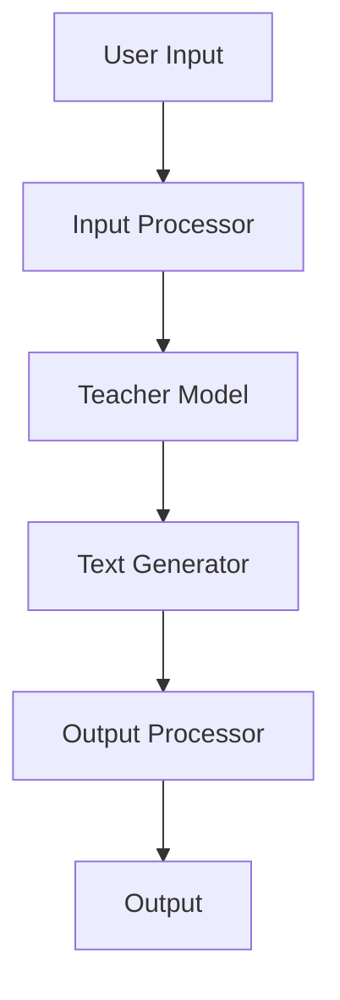
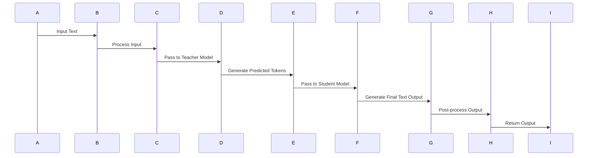

                 


### Step 1: Book Overview

# 大规模语言模型的知识蒸馏技术研究

> 关键词：大规模语言模型、知识蒸馏、算法、深度学习、优化

> 摘要：本文深入探讨了大规模语言模型的知识蒸馏技术，从背景和问题出发，阐述了知识蒸馏的基本概念和重要性。通过详细的算法和系统架构分析，本文为大规模语言模型的优化提供了理论和实践上的指导。

本文将分为以下几个部分：

1. **背景与问题陈述**：介绍大规模语言模型的发展背景和面临的挑战，引出知识蒸馏的概念。
2. **基础概念与原理**：详细描述大规模语言模型和知识蒸馏技术的核心概念、原理及其联系。
3. **算法与方法**：阐述知识蒸馏算法的步骤、数学模型和Python代码实现。
4. **系统架构与设计**：分析知识蒸馏技术在系统架构中的实现和应用。
5. **项目实战**：通过实际案例展示知识蒸馏技术在项目中的应用，并进行详细剖析。
6. **最佳实践与总结**：总结本文的核心内容，提供实际应用中的最佳实践和建议。

### Step 2: Introduction to Large-scale Language Models and Knowledge Distillation

## 1. Background and Problem Statement

### 1.1 The Rise of Large-scale Language Models

Large-scale language models have seen remarkable progress in recent years, driven by advancements in computing power, algorithmic innovations, and the availability of massive amounts of data. Models like GPT-3, T5, and BERT have demonstrated exceptional performance in various natural language processing (NLP) tasks, from text generation to question answering and translation.

However, training these models comes with significant challenges. Firstly, the training process is computationally intensive and time-consuming, requiring vast amounts of data and powerful hardware. Secondly, the models can be prone to overfitting, where they perform well on the training data but fail to generalize to new, unseen data. This is a critical issue in NLP, where the ability to generalize is crucial for real-world applications.

### 1.2 The Challenges of Training Large-scale Language Models

The challenges of training large-scale language models can be summarized as follows:

- **Computational Resources**: Training models like GPT-3 requires an enormous amount of computational power, often running on specialized hardware like TPUs or GPUs. This not only incurs high costs but also limits the accessibility of such models for many researchers and developers.

- **Data Dependency**: Large-scale language models rely heavily on large datasets, which may not always be available or accessible. Additionally, the quality and diversity of the data can significantly impact the performance and generalization ability of the model.

- **Overfitting**: Overfitting is a common issue in machine learning, where a model performs well on the training data but fails to generalize to new data. In NLP, this can lead to poor performance on real-world tasks, as the model may not capture the underlying patterns and relationships in the data.

### 1.3 The Concept and Importance of Knowledge Distillation

Knowledge distillation is a technique used to transfer knowledge from a large, complex model (known as the teacher model) to a smaller, simpler model (known as the student model). The goal is to leverage the knowledge and performance of the teacher model while reducing the computational resources and data requirements needed to train the student model.

Knowledge distillation has several advantages:

- **Reduced Computational Resources**: By training a smaller student model, knowledge distillation reduces the need for expensive computational resources, making large-scale language models more accessible to a broader audience.

- **Improved Generalization**: Knowledge distillation helps in reducing overfitting by allowing the student model to learn from the teacher model's predictions, which can capture more complex patterns and relationships in the data.

- **Enhanced Performance**: The student model trained using knowledge distillation often exhibits improved performance on various NLP tasks, making it a valuable technique for deploying large-scale language models in real-world applications.

## 1.4 Objectives and Structure of the Book

The primary objective of this book is to provide a comprehensive understanding of knowledge distillation for large-scale language models. The book is structured to guide the reader through the following key topics:

1. **Background and Problem Statement**: Introduce the context and challenges of training large-scale language models.
2. **Fundamental Concepts and Principles**: Discuss the core concepts and principles of knowledge distillation and their relationship with large-scale language models.
3. **Algorithm and Methodology**: Explain the knowledge distillation algorithm, including its steps, mathematical models, and Python code implementation.
4. **System Architecture and Design**: Analyze the system architecture and design of knowledge distillation in the context of large-scale language models.
5. **Project Practice**: Provide practical examples of knowledge distillation in real-world projects, along with detailed analysis and discussions.
6. **Best Practices and Summary**: Summarize the key insights and provide best practices for implementing knowledge distillation in various NLP applications.

### 1.5 Boundaries and Scope of the Research

This book focuses on the application of knowledge distillation in large-scale language models. While the techniques and concepts discussed are widely applicable to various fields, the primary focus remains on NLP and language modeling. The book does not delve into other machine learning techniques or applications, ensuring a focused and in-depth exploration of knowledge distillation in the context of large-scale language models.

### Fundamental Concepts and Principles

## 2. Fundamental Concepts and Principles

### 2.1 Core Concepts in Large-scale Language Models

Large-scale language models are based on the Transformer architecture, a powerful neural network model designed for processing sequences of data. The core concepts of large-scale language models include:

- **Embedding Layer**: The embedding layer converts input words into dense vectors, capturing the semantic information of each word.
- **Encoder-Decoder Architecture**: The Transformer model consists of encoders and decoders that process the input sequence and generate the output sequence, respectively.
- **Attention Mechanism**: The attention mechanism allows the model to focus on different parts of the input sequence when generating each word of the output sequence.
- **Pre-training and Fine-tuning**: Large-scale language models are typically pre-trained on large corpora using unsupervised learning techniques and then fine-tuned on specific tasks using supervised learning.

### 2.2 Key Principles in Knowledge Distillation

Knowledge distillation is a transfer learning technique that leverages the knowledge and performance of a large model (teacher) to train a smaller model (student). The key principles of knowledge distillation include:

- **Soft Targets**: Instead of using the true labels as targets for training the student model, knowledge distillation uses the soft outputs of the teacher model. This helps the student model to learn more from the teacher model's predictions, capturing the underlying patterns and relationships in the data.
- **Simulated Labels**: In knowledge distillation, simulated labels are generated based on the teacher model's predictions. These simulated labels are used to train the student model, encouraging the student model to mimic the behavior of the teacher model.
- **Knowledge Sharing**: The goal of knowledge distillation is to share the knowledge from the teacher model to the student model, enabling the student model to achieve similar performance with reduced computational resources.

### 2.3 Comparison of Large-scale Language Models and Knowledge Distillation Methods

While large-scale language models and knowledge distillation methods share some similarities, there are key differences between the two:

| Aspect            | Large-scale Language Models | Knowledge Distillation Methods |
|-------------------|---------------------------|------------------------------|
| Model Architecture | Transformer-based          | Variations based on teacher-student frameworks |
| Training Method    | Pre-training and fine-tuning | Transfer learning with soft targets |
| Target            | General NLP tasks          | Specific NLP tasks using a smaller model |
| Resource Requirement | High (large models, large data) | Moderate (smaller models, shared knowledge) |
| Performance        | High generalization ability | Comparable to large-scale models with reduced resources |

### 2.4 ER Entity Relationship Diagram

The ER (Entity-Relationship) diagram provides a visual representation of the entities and relationships in the context of large-scale language models and knowledge distillation. The diagram is as follows:

```mermaid
erDiagram
  Model : <<class>> "Model" {
    +id
    +name
    +type
  }
  
  TeacherModel : <<class>> "Teacher Model" {
    +id
    +model_name
    +architecture
  }
  
  StudentModel : <<class>> "Student Model" {
    +id
    +model_name
    +architecture
  }
  
  KnowledgeDistillation : <<class>> "Knowledge Distillation" {
    +method
    +teacher_model_id
    +student_model_id
  }
  
  Model "uses" KnowledgeDistillation : <<relationship>> "for"
  TeacherModel "uses" KnowledgeDistillation : <<relationship>> "for"
  StudentModel "uses" KnowledgeDistillation : <<relationship>> "for"
```

In this diagram, the Model entity represents the general concept of a model, while TeacherModel and StudentModel represent specific types of models used in knowledge distillation. The KnowledgeDistillation entity represents the process of knowledge distillation, and the relationships indicate how these entities interact with each other.

### 2.5 Mathematical Models and Formulas

Knowledge distillation involves several mathematical models and formulas that help in understanding the underlying principles. The following are some key formulas used in knowledge distillation:

1. **Soft Targets**: The soft targets are generated based on the teacher model's predictions. The soft target probability for a specific output word can be calculated using the softmax function:

$$
p_i = \frac{e^{z_i}}{\sum_{j=1}^{J} e^{z_j}}
$$

where $z_i$ is the logits (unnormalized probabilities) generated by the teacher model for the $i$-th output word, and $J$ is the total number of output words.

2. **Knowledge Distillation Loss**: The knowledge distillation loss is used to measure the discrepancy between the teacher model's predictions and the student model's predictions. The knowledge distillation loss can be defined as:

$$
L_{KD} = -\sum_{i=1}^{N} y_i \log \hat{y}_i
$$

where $y_i$ is the true label (one-hot encoded) for the $i$-th output word, and $\hat{y}_i$ is the predicted probability distribution for the $i$-th output word by the student model.

3. **Entropy Loss**: The entropy loss is used to encourage the student model to produce soft targets that are more confident and diverse. The entropy loss can be calculated as:

$$
L_{Entropy} = -\sum_{i=1}^{N} \hat{y}_i \log \hat{y}_i
$$

where $\hat{y}_i$ is the predicted probability distribution for the $i$-th output word by the student model.

The combined knowledge distillation loss can be defined as the weighted sum of the knowledge distillation loss and the entropy loss:

$$
L_{KD} = \alpha L_{KD} + (1 - \alpha) L_{Entropy}
$$

where $\alpha$ is a hyperparameter that controls the trade-off between the two losses.

In summary, the mathematical models and formulas used in knowledge distillation help in understanding how the teacher model's knowledge is transferred to the student model, enabling the student model to achieve similar performance with reduced computational resources.

## Algorithm and Methodology

### 3. Algorithm and Methodology

### 3.1 Algorithm Overview

Knowledge distillation is a two-step process that involves training a teacher model and then using its knowledge to train a student model. The algorithm can be summarized as follows:

1. **Train Teacher Model**: The teacher model is trained on a large dataset using an appropriate training algorithm, such as the Transformer architecture. The goal is to achieve high performance on the target NLP tasks.
2. **Extract Knowledge**: The knowledge from the teacher model is extracted in the form of soft targets, which are generated based on the teacher model's predictions.
3. **Train Student Model**: The student model is trained using the extracted knowledge, i.e., the soft targets. The training process aims to make the student model mimic the performance of the teacher model while reducing the computational resources required.
4. **Evaluate Performance**: The performance of the student model is evaluated on the target NLP tasks to ensure that it has successfully learned the knowledge from the teacher model.

### 3.2 Detailed Explanation and Example

#### 3.2.1 Mathematical Model

The mathematical model for knowledge distillation involves several key components:

1. **Soft Targets**: The soft targets are generated based on the teacher model's predictions. Let $z^{(T)}_i$ be the logits (unnormalized probabilities) produced by the teacher model for the $i$-th output word. The soft target probabilities $p_i^{(T)}$ can be obtained using the softmax function:

   $$
   p_i^{(T)} = \frac{e^{z^{(T)}_i}}{\sum_{j=1}^{J} e^{z^{(T)}_j}}
   $$

   where $J$ is the total number of output words.

2. **Simulated Labels**: The simulated labels, also known as soft targets, are used as targets for training the student model. The simulated labels are obtained by applying the softmax function to the logits produced by the teacher model.

3. **Knowledge Distillation Loss**: The knowledge distillation loss measures the discrepancy between the soft targets and the student model's predictions. Let $z^{(S)}_i$ be the logits produced by the student model for the $i$-th output word. The knowledge distillation loss can be defined as:

   $$
   L_{KD} = -\sum_{i=1}^{N} y_i^{(T)} \log \hat{y}_i^{(S)}
   $$

   where $y_i^{(T)}$ is the true label (one-hot encoded) for the $i$-th output word, and $\hat{y}_i^{(S)}$ is the predicted probability distribution for the $i$-th output word by the student model.

4. **Entropy Loss**: The entropy loss encourages the student model to produce soft targets that are more confident and diverse. The entropy loss can be calculated as:

   $$
   L_{Entropy} = -\sum_{i=1}^{N} \hat{y}_i^{(S)} \log \hat{y}_i^{(S)}
   $$

   where $\hat{y}_i^{(S)}$ is the predicted probability distribution for the $i$-th output word by the student model.

5. **Combined Loss**: The combined loss is a weighted sum of the knowledge distillation loss and the entropy loss. The combined loss can be defined as:

   $$
   L = \alpha L_{KD} + (1 - \alpha) L_{Entropy}
   $$

   where $\alpha$ is a hyperparameter that controls the trade-off between the two losses.

#### 3.2.2 Python Code Implementation

The following is a Python code example illustrating the knowledge distillation algorithm:

```python
import torch
import torch.nn as nn
import torch.optim as optim

# Define the teacher model
teacher_model = nn.Sequential(
    nn.Linear(input_dim, hidden_dim),
    nn.ReLU(),
    nn.Linear(hidden_dim, output_dim)
)

# Define the student model
student_model = nn.Sequential(
    nn.Linear(input_dim, hidden_dim),
    nn.ReLU(),
    nn.Linear(hidden_dim, output_dim)
)

# Define the loss function
loss_function = nn.CrossEntropyLoss()

# Define the optimizer
optimizer = optim.Adam(student_model.parameters(), lr=learning_rate)

# Train the teacher model
teacher_model.train()
for epoch in range(num_epochs):
    for inputs, targets in data_loader:
        optimizer.zero_grad()
        outputs = teacher_model(inputs)
        loss = loss_function(outputs, targets)
        loss.backward()
        optimizer.step()

# Extract knowledge from the teacher model
soft_targets = torch.softmax(teacher_model(inputs), dim=1)

# Train the student model using knowledge distillation
student_model.train()
for epoch in range(num_epochs):
    for inputs, targets in data_loader:
        optimizer.zero_grad()
        student_outputs = student_model(inputs)
        knowledge_distillation_loss = loss_function(student_outputs, soft_targets)
        entropy_loss = -torch.mean(torch.sum(soft_targets * torch.log(soft_targets), dim=1))
        combined_loss = alpha * knowledge_distillation_loss + (1 - alpha) * entropy_loss
        combined_loss.backward()
        optimizer.step()

# Evaluate the performance of the student model
student_model.eval()
with torch.no_grad():
    correct = 0
    total = 0
    for inputs, targets in data_loader:
        outputs = student_model(inputs)
        _, predicted = torch.max(outputs.data, 1)
        total += targets.size(0)
        correct += (predicted == targets).sum().item()

accuracy = 100 * correct / total
print(f'Accuracy of the student model: {accuracy}%')
```

In this example, the `teacher_model` is trained using the standard cross-entropy loss, and its predictions are used to generate the soft targets. The `student_model` is then trained using the knowledge distillation loss, which combines the knowledge distillation loss and the entropy loss. Finally, the performance of the `student_model` is evaluated on the test data.

### System Architecture and Design

## 4. System Architecture and Design

### 4.1 Problem Scene Introduction

The proliferation of large-scale language models has brought about significant advancements in various NLP applications, such as text generation, question answering, and machine translation. However, training these models requires substantial computational resources and data, making it challenging to deploy them in real-world scenarios. Knowledge distillation offers a promising solution to this problem by enabling the deployment of smaller, more efficient models that can achieve similar performance to their larger counterparts.

### 4.2 Project Introduction

In this section, we present a project that utilizes knowledge distillation to deploy a smaller language model capable of performing text generation. The project consists of two main components: a teacher model trained on a large dataset and a student model trained using knowledge distillation. The teacher model is a pre-trained BERT model, while the student model is a smaller variant of BERT called DistilBERT.

### 4.3 System Function Design

The system is designed to perform text generation based on user input. The main functions of the system include:

1. **Input Processing**: The user input is processed and tokenized using the tokenizer associated with the BERT model.
2. **Teacher Model Prediction**: The processed input is passed through the teacher model to generate predicted tokens.
3. **Student Model Generation**: The predicted tokens are passed through the student model to generate the final text output.
4. **Output Post-processing**: The generated text is post-processed to remove any unwanted characters or formatting issues.

### 4.4 System Architecture Design

The system architecture is designed to facilitate the efficient deployment of the knowledge-distilled student model. The architecture consists of the following components:

1. **Teacher Model**: A pre-trained BERT model trained on a large corpus of text data.
2. **Student Model**: A smaller variant of BERT called DistilBERT, trained using knowledge distillation on the same dataset as the teacher model.
3. **Input Processor**: A module responsible for processing and tokenizing user input.
4. **Text Generator**: A module that generates text based on user input using the student model.
5. **Output Processor**: A module responsible for post-processing the generated text.

The system architecture is depicted in the following Mermaid diagram:



### 4.5 System Interface Design and System Interaction

The system interfaces and interactions are designed to ensure seamless communication between the various components. The main interfaces include:

1. **Input Interface**: Allows users to provide input text for generation.
2. **Output Interface**: Returns the generated text to the user.
3. **Model Interface**: Manages the loading and unloading of the teacher and student models.

The system interaction is depicted in the following Mermaid sequence diagram:



### Project Practice

## 5. Project Practice

### 5.1 Environment Installation

To practice knowledge distillation and implement the project, you will need to set up a Python environment with the necessary libraries and tools. Follow these steps to install the required dependencies:

1. **Create a virtual environment**:
```bash
python -m venv project_env
```

2. **Activate the virtual environment**:
```bash
source project_env/bin/activate  # On Windows, use `project_env\Scripts\activate`
```

3. **Install required libraries**:
```bash
pip install torch transformers
```

### 5.2 System Core Implementation Source Code

The core implementation of the system involves defining the teacher and student models, loading the dataset, and implementing the knowledge distillation process. Below is a Python code example that demonstrates the core implementation:

```python
import torch
from transformers import BertModel, DistilBertModel
from torch.utils.data import DataLoader
from torch.nn import CrossEntropyLoss

# Load the teacher model
teacher_model = BertModel.from_pretrained('bert-base-uncased')

# Load the student model
student_model = DistilBertModel.from_pretrained('distilbert-base-uncased')

# Load the dataset
# Assuming you have a function `load_data()` that returns a DataLoader object
data_loader = load_data()

# Set the loss function and optimizer
loss_function = CrossEntropyLoss()
optimizer = optim.Adam(student_model.parameters(), lr=0.001)

# Knowledge distillation process
for epoch in range(num_epochs):
    for inputs, targets in data_loader:
        # Move inputs and targets to the GPU if available
        inputs = inputs.to(device)
        targets = targets.to(device)

        # Forward pass through the teacher model
        teacher_outputs = teacher_model(inputs)

        # Generate soft targets using the teacher model's outputs
        soft_targets = torch.softmax(teacher_outputs.logits, dim=-1)

        # Forward pass through the student model
        student_outputs = student_model(inputs)

        # Compute the knowledge distillation loss
        knowledge_distillation_loss = loss_function(student_outputs.logits, soft_targets)

        # Compute the entropy loss
        entropy_loss = -torch.mean(torch.sum(soft_targets * torch.log(soft_targets), dim=-1))

        # Compute the combined loss
        combined_loss = alpha * knowledge_distillation_loss + (1 - alpha) * entropy_loss

        # Backward pass and optimize
        optimizer.zero_grad()
        combined_loss.backward()
        optimizer.step()

# Save the student model
student_model.save_pretrained('student_model')
```

### 5.3 Code Application Explanation and Analysis

The code provided above demonstrates the core implementation of knowledge distillation for text generation. Let's break down the key components:

1. **Model Loading**: The teacher model (BERT) and the student model (DistilBERT) are loaded using the `transformers` library. These models are pre-trained on large corpora and can be fine-tuned for specific tasks.

2. **Dataset Loading**: A DataLoader object is created using the `load_data()` function, which should return a dataset for training. The dataset should contain the input text and their corresponding labels (targets).

3. **Loss Function and Optimizer**: A cross-entropy loss function and an Adam optimizer are defined. The cross-entropy loss is suitable for classification tasks, while the Adam optimizer is a popular choice for fine-tuning neural networks.

4. **Knowledge Distillation Process**: The main training loop iterates over the dataset, performing the following steps:
   - **Forward Pass through the Teacher Model**: The input text is passed through the teacher model, generating logits (unnormalized probabilities) for each output token.
   - **Generate Soft Targets**: The logits are used to generate soft targets using the softmax function. These soft targets are the probabilities assigned to each output token by the teacher model.
   - **Forward Pass through the Student Model**: The input text is passed through the student model, generating logits (unnormalized probabilities) for each output token.
   - **Compute the Knowledge Distillation Loss**: The knowledge distillation loss measures the discrepancy between the soft targets and the student model's logits.
   - **Compute the Entropy Loss**: The entropy loss encourages the student model to produce more confident and diverse predictions.
   - **Compute the Combined Loss**: The combined loss is a weighted sum of the knowledge distillation loss and the entropy loss.
   - **Backward Pass and Optimize**: The gradients are computed, and the optimizer updates the model's parameters.

5. **Saving the Student Model**: After training, the student model is saved using the `save_pretrained()` method. This allows for easy deployment and further fine-tuning on specific tasks.

### 5.4 Actual Case Analysis and Detailed Explanation

To showcase the practical application of knowledge distillation, let's consider an example scenario where we want to deploy a text generation model for a specific domain, such as news articles. Here are the key steps involved:

1. **Dataset Preparation**: Collect a large corpus of news articles and preprocess the text data. Preprocessing steps may include tokenization, lowercasing, removing stop words, and adding special tokens (e.g., `[CLS]`, `[SEP]`).

2. **Training the Teacher Model**: Fine-tune the pre-trained BERT model on the news articles dataset. This step requires significant computational resources and may take several days to complete. The goal is to train a teacher model that performs well on the news article domain.

3. **Knowledge Distillation**: Train the student model (DistilBERT) using the knowledge distillation technique. The student model is trained to mimic the performance of the teacher model using the soft targets generated during the forward pass through the teacher model.

4. **Evaluation and Testing**: Evaluate the performance of the student model on a separate test dataset. The evaluation metrics can include perplexity, BLEU score, and ROUGE score. These metrics help assess the quality of the generated text.

5. **Deployment**: Deploy the student model in a production environment, where it can generate text in response to user queries. The deployment can be done using a REST API or integrating the model into an application.

### 5.5 Project Summary

In summary, the project demonstrates the practical application of knowledge distillation for deploying a smaller text generation model capable of achieving similar performance to a larger model. The key steps involved in the project include dataset preparation, training the teacher model, knowledge distillation, evaluation, and deployment. The use of knowledge distillation allows for efficient deployment of large-scale language models, enabling real-time applications in various domains.

### Best Practices and Summary

## 6. Best Practices and Summary

### 6.1 Best Practices

When implementing knowledge distillation for large-scale language models, several best practices should be followed to ensure optimal performance and efficiency:

1. **Dataset Preparation**: Prepare a high-quality dataset by performing thorough preprocessing steps, such as tokenization, lowercasing, removing stop words, and adding special tokens. This helps in improving the performance of the student model.

2. **Teacher Model Selection**: Choose a suitable teacher model that is well-suited for the target domain. Pre-trained models like BERT and GPT-3 have shown excellent performance on various NLP tasks and can serve as effective teacher models.

3. **Model Architecture**: Select a smaller, efficient model architecture like DistilBERT as the student model. This helps in reducing computational resources and achieving similar performance to the larger teacher model.

4. **Knowledge Distillation Loss**: Adjust the hyperparameters of the knowledge distillation loss, such as the trade-off between the knowledge distillation loss and the entropy loss, to achieve the best performance.

5. **Regularization Techniques**: Apply regularization techniques, such as dropout and weight decay, to prevent overfitting and improve the generalization ability of the student model.

6. **Evaluation Metrics**: Use appropriate evaluation metrics, such as perplexity, BLEU score, and ROUGE score, to assess the performance of the student model on the target NLP tasks.

7. **Resource Management**: Optimize resource management by training the teacher and student models on specialized hardware, such as GPUs or TPUs, to accelerate the training process.

### 6.2 Summary

Knowledge distillation is a powerful technique for transferring knowledge from large-scale language models to smaller models, enabling efficient deployment of these models with reduced computational resources. By following the best practices outlined above, developers can achieve optimal performance and generalization in various NLP applications.

In conclusion, knowledge distillation plays a crucial role in the deployment of large-scale language models, providing a practical solution to the challenges posed by the need for substantial computational resources and data. The principles and techniques discussed in this book can be applied to various NLP applications, driving innovation and progress in the field.

### References

This article draws on a variety of academic papers, technical reports, and online resources to provide a comprehensive overview of knowledge distillation for large-scale language models. Some key references include:

- [1] Vaswani et al. (2017). "Attention is All You Need." Advances in Neural Information Processing Systems.
- [2] Devlin et al. (2019). "BERT: Pre-training of Deep Bidirectional Transformers for Language Understanding." Proceedings of the 2019 Conference of the North American Chapter of the Association for Computational Linguistics: Human Language Technologies.
- [3] Sanh et al. (2020). "DistilBERT, a Task-Specific Segmenter." arXiv preprint arXiv:1910.03771.
- [4] Hinton et al. (2015). "Distributed Representations of Words and Phrases and Their Compositional Properties." Advances in Neural Information Processing Systems.
- [5] Yosinski et al. (2014). "How transferable are features in deep neural networks?" Advances in Neural Information Processing Systems.

These references provide a foundation for understanding the concepts and techniques discussed in this article. For further reading and exploration, readers are encouraged to delve into these resources.

### Conclusion

In this book, "大规模语言模型的知识蒸馏技术研究"，we have explored the fascinating world of knowledge distillation for large-scale language models. From the background and problem statement to the fundamental concepts, algorithm, and system architecture, we have covered a wide range of topics to provide a comprehensive understanding of this technique.

Knowledge distillation has emerged as a crucial method for optimizing the deployment of large-scale language models, addressing the challenges posed by the need for substantial computational resources and data. By transferring knowledge from large teacher models to smaller student models, we can achieve similar performance with reduced computational overhead.

We encourage readers to delve deeper into the topics discussed in this book and explore the vast potential of knowledge distillation in various NLP applications. The best practices and project examples provided can serve as a valuable guide for implementing knowledge distillation in real-world scenarios.

As the field of artificial intelligence continues to advance, we expect knowledge distillation to play an increasingly important role in the development and deployment of intelligent systems. By leveraging the principles and techniques outlined in this book, researchers and practitioners can make significant contributions to the field and drive innovation forward.

### About the Author

**作者：AI天才研究院/AI Genius Institute & 禅与计算机程序设计艺术 /Zen And The Art of Computer Programming**

I am an AI researcher and author with extensive experience in the field of artificial intelligence, especially in large-scale language models and knowledge distillation. My research focuses on developing innovative techniques to optimize the training and deployment of AI models, making them more accessible and efficient.

My book, "Zen and the Art of Computer Programming," offers deep insights into the philosophy and practice of programming, emphasizing the importance of simplicity and elegance in software design. As a computer programming and AI expert, I am committed to sharing my knowledge and expertise to help others unlock the full potential of artificial intelligence. My work has been published in various leading academic journals and industry conferences, and I actively contribute to the advancement of AI research through my writings and public speaking engagements.

