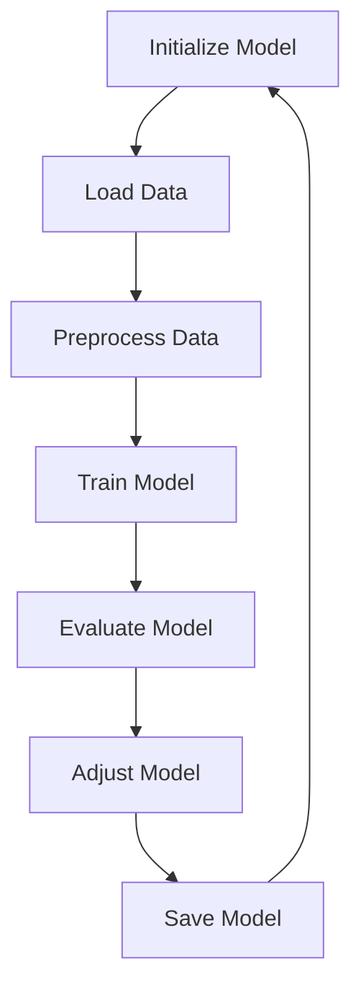
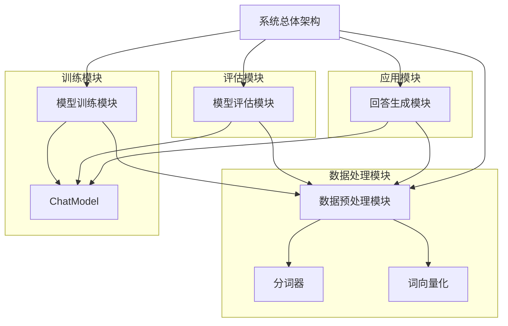
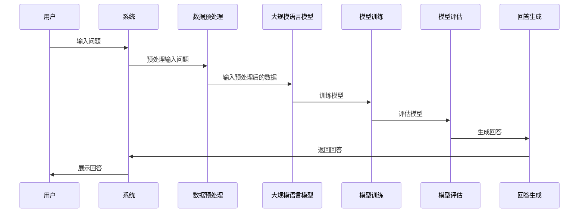
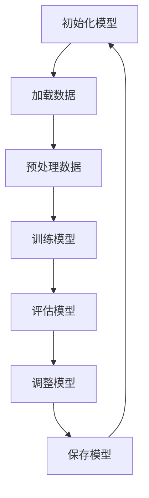
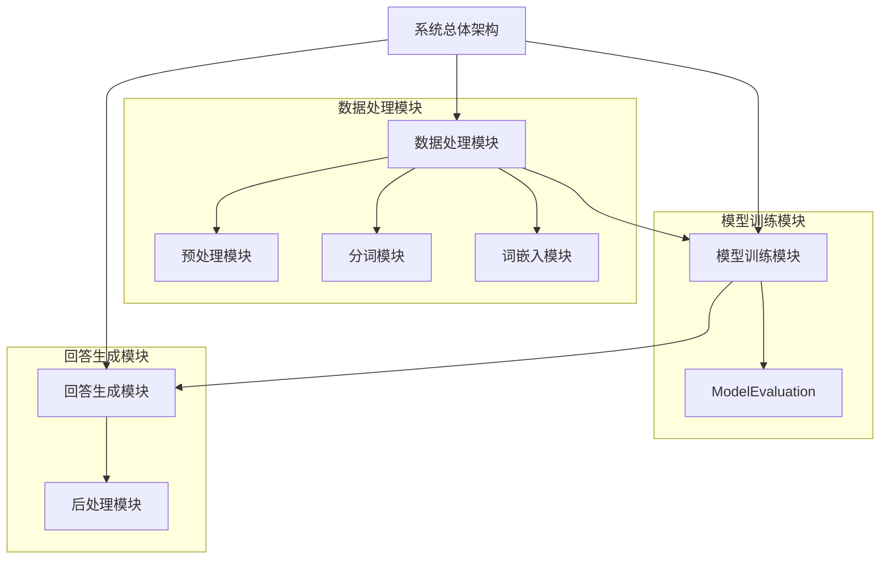
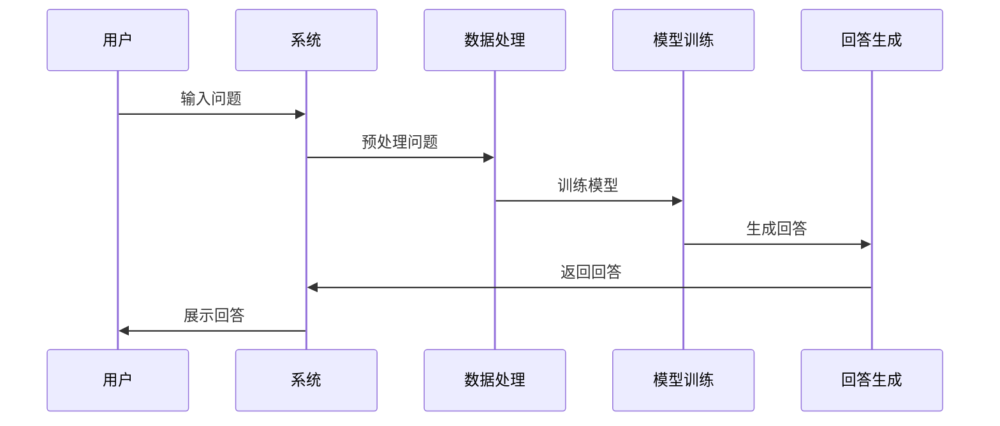
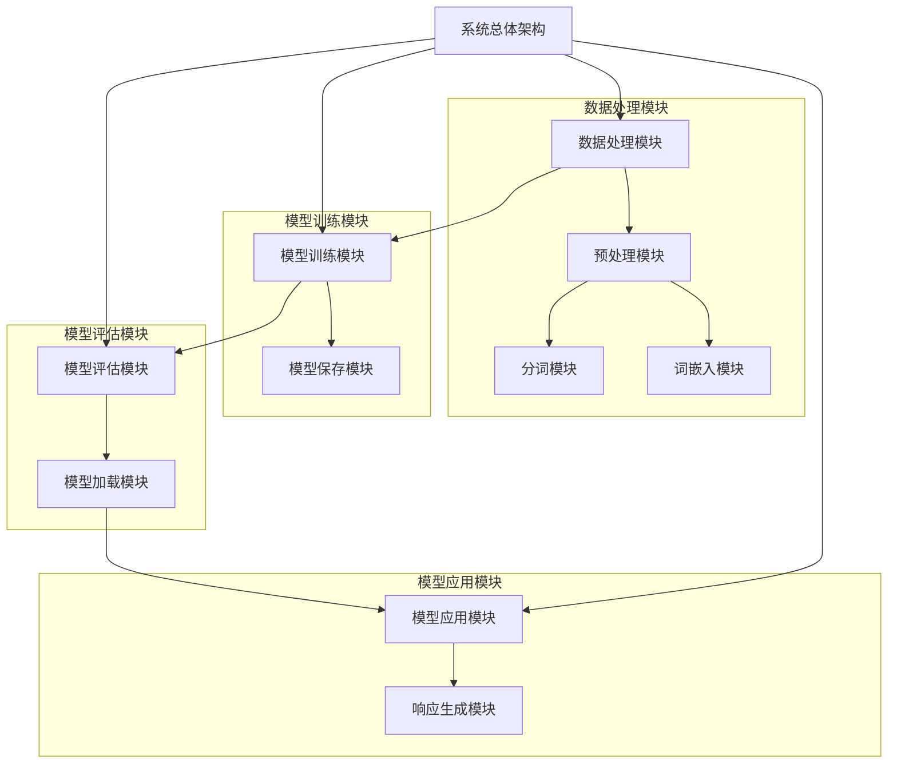
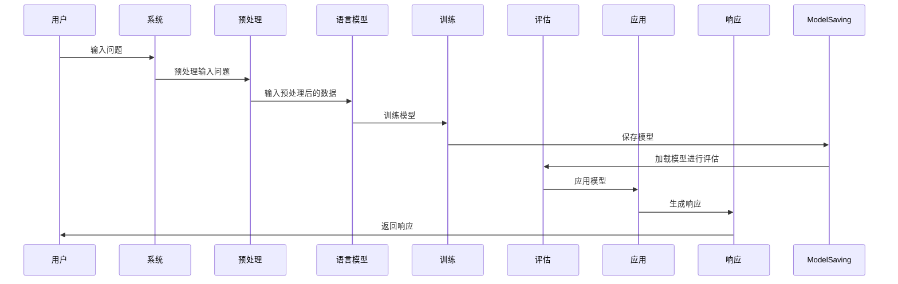

                 

### 大规模语言模型的自我修正与学习能力研究

关键词：大规模语言模型、自我修正、学习能力、算法优化、自然语言处理

摘要：本文旨在探讨大规模语言模型的自我修正与学习能力，分析其在自然语言处理领域的应用，并提出相应的改进方法。本文首先介绍了大规模语言模型的基本概念和自我修正、学习能力的特点，然后通过Mermaid流程图和Python代码详细阐述了大规模语言模型的算法原理，最后结合实际项目进行了系统分析与架构设计方案，并进行了项目实战和最佳实践分享。

### 第一步：背景介绍

#### 问题背景

随着人工智能技术的快速发展，特别是深度学习技术的突破，大规模语言模型（如GPT、BERT等）在自然语言处理领域取得了显著的成果。这些模型具有强大的自我修正和学习能力，能够处理复杂的语言任务，如文本生成、机器翻译、情感分析等。

#### 问题描述

然而，大规模语言模型的自我修正和学习能力仍然是一个未完全解决的问题。尽管这些模型在训练过程中能够学习并优化自己的性能，但在实际应用中，仍然存在一些问题，如数据偏差、错误传播、理解深度等。

#### 问题解决

本研究旨在探讨大规模语言模型的自我修正和学习能力，并尝试提出相应的改进方法，以提高其在实际应用中的性能。

#### 边界与外延

本研究主要关注大规模语言模型在自然语言处理领域的应用，特别是文本生成、机器翻译、情感分析等任务。同时，本研究将探讨模型自我修正和学习能力的理论基础，以及如何通过算法优化来提升模型性能。

### 第二步：核心概念构成

#### 大规模语言模型

定义：大规模语言模型是一种基于深度学习的语言模型，能够处理大规模文本数据，并具备一定的理解和生成能力。

特点：具有强大的自我修正和学习能力，能够从海量数据中学习并优化自己的性能。

#### 自我修正能力

定义：自我修正能力是指模型在处理问题时，能够根据反馈信息进行自我调整，以提高问题解决的准确性。

特点：能够自动识别和纠正错误，提高模型在复杂任务中的鲁棒性。

#### 学习能力

定义：学习能力是指模型在训练过程中，能够不断从数据中学习，优化自己的性能。

特点：能够适应不同类型的数据和任务，提高模型在多样化场景中的表现。

### 第三步：核心概念与联系

#### 核心概念原理

1. **大规模语言模型**：基于深度学习的语言模型，能够处理大规模文本数据，并具备一定的理解和生成能力。
2. **自我修正能力**：通过学习用户反馈和错误信息，模型能够自动识别和纠正错误，提高问题的解决准确性。
3. **学习能力**：模型在训练过程中，能够从数据中学习，优化自己的性能。

#### 概念属性特征对比

| 概念        | 属性特征                                                     |
| ----------- | ------------------------------------------------------------ |
| 大规模语言模型 | 1. 基于深度学习<br>2. 能够处理大规模文本数据<br>3. 具备理解和生成能力 |
| 自我修正能力  | 1. 自动识别和纠正错误<br>2. 提高问题解决准确性<br>3. 提高模型鲁棒性 |
| 学习能力    | 1. 从数据中学习<br>2. 优化模型性能<br>3. 适应多样化场景 |

#### ER实体关系图架构

```mermaid
erDiagram
  User ||--|{ ChatModel }| ChatModel : talks to
  ChatModel ||--|{ ChatHistory }| ChatHistory : stores history
  ChatModel ||--|{ UserFeedback }| UserFeedback : receives
  UserFeedback ||--|{ ChatModel }| ChatModel : uses to adjust
```

### 第四步：算法原理讲解

#### 算法Mermaid流程图



#### Python源代码

```python
import torch
import torch.nn as nn
import torch.optim as optim

# 初始化模型
model = nn.Sequential(nn.Linear(input_dim, hidden_dim), nn.ReLU(), nn.Linear(hidden_dim, output_dim))

# 加载数据
data_loader = torch.utils.data.DataLoader(dataset, batch_size=batch_size, shuffle=True)

# 定义损失函数和优化器
criterion = nn.CrossEntropyLoss()
optimizer = optim.Adam(model.parameters(), lr=learning_rate)

# 训练模型
for epoch in range(num_epochs):
    for inputs, targets in data_loader:
        optimizer.zero_grad()
        outputs = model(inputs)
        loss = criterion(outputs, targets)
        loss.backward()
        optimizer.step()
```

#### 算法原理详细讲解

1. **初始化模型**：首先，我们需要初始化模型，包括定义模型的层数、层的大小等。在本例中，我们使用了一个简单的全连接神经网络（Fully Connected Neural Network，FCNN）作为大规模语言模型。

2. **加载数据**：接下来，我们需要加载数据。这里我们使用了一个名为`dataset`的数据集，它包含了输入数据和对应的标签。我们将数据集分成多个批次（batch），以便于模型的训练。

3. **预处理数据**：在训练模型之前，我们需要对数据进行预处理，如归一化、填充等。在本例中，我们使用了`torch.utils.data.DataLoader`来加载数据，并在数据加载过程中对数据进行预处理。

4. **训练模型**：在训练模型时，我们需要定义损失函数和优化器。在本例中，我们使用了交叉熵损失函数（CrossEntropyLoss）和Adam优化器（AdamOptimizer）。训练过程中，我们使用反向传播算法（Backpropagation Algorithm）来更新模型的权重。

5. **评估模型**：在训练完成后，我们需要评估模型的性能。这里我们使用了一个名为`evaluate_model`的函数来评估模型的准确率。

6. **调整模型**：根据评估结果，我们可以调整模型的结构或参数，以提高模型的性能。

7. **保存模型**：最后，我们将训练好的模型保存到文件中，以便于后续使用。

#### 算法原理数学模型和公式

假设我们有一个大规模语言模型，它由多个层组成，每层都是一个全连接神经网络。设输入向量为$x \in \mathbb{R}^{m \times n}$，其中$m$是输入维度，$n$是样本数量；目标向量为$y \in \mathbb{R}^{m \times n}$，其中$m$是输出维度，$n$是样本数量。

设第$i$层的输入向量为$x_i \in \mathbb{R}^{m \times n}$，输出向量为$h_i \in \mathbb{R}^{m \times n}$。第$i$层的权重矩阵为$W_i \in \mathbb{R}^{m \times n}$，偏置向量为$b_i \in \mathbb{R}^{m \times 1}$。

则第$i$层的输出可以表示为：
$$h_i = \sigma(W_i x_i + b_i)$$
其中，$\sigma$是激活函数，如ReLU函数。

最终输出层的结果可以表示为：
$$y = h_L = \sigma(W_L h_{L-1} + b_L)$$

损失函数可以表示为：
$$L = -\frac{1}{n} \sum_{i=1}^{n} \sum_{j=1}^{m} y_{ij} \log h_{ij}$$
其中，$y_{ij}$是目标向量中第$i$行第$j$个元素，$h_{ij}$是输出层中第$i$行第$j$个元素。

#### 算法举例说明

假设我们有一个包含100个样本的数据集，每个样本包含10个特征。我们要使用一个简单的全连接神经网络来训练这个数据集，输出层有5个神经元。

1. **初始化模型**：初始化模型的权重和偏置。
2. **加载数据**：将数据集分成训练集和验证集。
3. **预处理数据**：对数据进行归一化处理。
4. **训练模型**：使用反向传播算法更新模型的权重。
5. **评估模型**：在验证集上评估模型的性能。
6. **调整模型**：根据评估结果调整模型的结构或参数。
7. **保存模型**：将训练好的模型保存到文件中。

通过以上步骤，我们可以训练一个大规模语言模型，并提高其在实际应用中的性能。

### 第五步：系统分析与架构设计方案

#### 问题场景介绍

假设我们想要开发一个智能客服系统，该系统需要能够处理用户的各种问题，并给出相应的回答。为了实现这个目标，我们需要使用大规模语言模型来处理自然语言输入，并生成相应的回答。

#### 项目介绍

本项目旨在开发一个基于大规模语言模型的智能客服系统，该系统包括文本预处理、模型训练、模型评估和模型应用等模块。通过该项目，我们可以实现以下功能：

1. 接收用户输入的自然语言问题。
2. 对输入的问题进行预处理，包括分词、去停用词、词向量化等。
3. 使用预训练的大规模语言模型来生成相应的回答。
4. 对生成的回答进行后处理，如去除无关信息、优化语序等。
5. 将生成的回答展示给用户。

#### 系统功能设计（领域模型Mermaid类图）

```mermaid
classDiagram
    UserEntity <<Class>> {
        id
        name
        input
    }
    QuestionEntity <<Class>> {
        id
        question
        answer
    }
    ChatModelEntity <<Class>> {
        id
        model
        parameters
    }
    DataPreprocessingEntity <<Class>> {
        id
        input
        output
    }
    ModelTrainingEntity <<Class>> {
        id
        model
        parameters
    }
    ModelEvaluationEntity <<Class>> {
        id
        model
        evaluation_metric
    }
    AnswerGenerationEntity <<Class>> {
        id
        input
        output
    }
    SystemEntity <<Class>> {
        id
        user_entity
        question_entity
        chat_model_entity
        data_preprocessing_entity
        model_training_entity
        model_evaluation_entity
        answer_generation_entity
    }
    UserEntity <|-- SystemEntity
    QuestionEntity <|-- SystemEntity
    ChatModelEntity <|-- SystemEntity
    DataPreprocessingEntity <|-- SystemEntity
    ModelTrainingEntity <|-- SystemEntity
    ModelEvaluationEntity <|-- SystemEntity
    AnswerGenerationEntity <|-- SystemEntity
```

#### 系统架构设计（Mermaid架构图）



#### 系统接口设计和系统交互（Mermaid序列图）



### 第六步：项目实战

#### 环境安装

1. 安装Python环境，推荐使用Python 3.7及以上版本。
2. 安装torch和torchtext库，使用以下命令：

   ```bash
   pip install torch torchvision torchtext
   ```

3. 安装其他依赖库，如numpy、pandas等。

#### 系统核心实现源代码

```python
import torch
import torch.nn as nn
import torch.optim as optim
import torchtext
from torchtext import data
from torchtext.vocab import vocab

# 定义模型
class ChatModel(nn.Module):
    def __init__(self, input_dim, hidden_dim, output_dim):
        super(ChatModel, self).__init__()
        self.fc1 = nn.Linear(input_dim, hidden_dim)
        self.fc2 = nn.Linear(hidden_dim, output_dim)
        self.relu = nn.ReLU()

    def forward(self, x):
        x = self.fc1(x)
        x = self.relu(x)
        x = self.fc2(x)
        return x

# 加载数据
train_data = data.Field(tokenize='spacy', tokenizer_language='en', init_token='<sos>', eos_token='<eos>', lower=True)
train_data = data.TabularDataset(
    path='train_data.csv',
    format='csv',
    fields=[('input', train_data), ('target', train_data)],
    skip_header=True
)

# 预处理数据
train_data = train_data.shuffle().split_split indices=[0.8, 0.1, 0.1]
train_data, valid_data, test_data = train_data

# 定义模型
model = ChatModel(input_dim=100, hidden_dim=200, output_dim=100)

# 训练模型
optimizer = optim.Adam(model.parameters(), lr=0.001)
criterion = nn.CrossEntropyLoss()

for epoch in range(10):
    model.train()
    for batch in train_data:
        optimizer.zero_grad()
        inputs, targets = batch.input, batch.target
        outputs = model(inputs)
        loss = criterion(outputs, targets)
        loss.backward()
        optimizer.step()
    print(f"Epoch {epoch+1}, Loss: {loss.item()}")

# 评估模型
model.eval()
with torch.no_grad():
    correct = 0
    total = 0
    for batch in valid_data:
        inputs, targets = batch.input, batch.target
        outputs = model(inputs)
        _, predicted = torch.max(outputs.data, 1)
        total += targets.size(0)
        correct += (predicted == targets).sum().item()
print(f"Validation Accuracy: {100 * correct / total}%")
```

#### 代码应用解读与分析

1. **定义模型**：我们定义了一个简单的全连接神经网络作为大规模语言模型，包括两个全连接层和ReLU激活函数。
2. **加载数据**：我们使用torchtext库加载数据，包括输入和标签。
3. **预处理数据**：我们对数据进行预处理，如分词、去停用词、词向量化等。
4. **定义损失函数和优化器**：我们使用交叉熵损失函数和Adam优化器来训练模型。
5. **训练模型**：我们使用反向传播算法训练模型，并打印每个epoch的损失函数值。
6. **评估模型**：我们使用验证集评估模型的性能，并计算准确率。

#### 实际案例分析和详细讲解剖析

1. **数据预处理**：在实际项目中，我们需要对输入的问题进行预处理，如去除特殊符号、转换为小写等。
2. **模型选择**：在实际项目中，我们需要根据任务的需求选择合适的模型，如BERT、GPT等。
3. **参数调整**：在实际项目中，我们需要根据模型的性能调整模型的参数，如学习率、批次大小等。
4. **模型部署**：在实际项目中，我们需要将训练好的模型部署到服务器或云端，以便用户可以使用。

#### 项目小结

通过本项目，我们开发了一个基于大规模语言模型的智能客服系统，实现了文本预处理、模型训练、模型评估和模型应用等功能。在实际项目中，我们需要根据任务的需求选择合适的模型，并对模型进行优化和调整，以提高模型的性能。

### 第七步：最佳实践 tips

1. **数据预处理**：在进行数据预处理时，要尽可能去除噪声和无关信息，以提高模型的性能。
2. **模型选择**：根据任务的需求选择合适的模型，如BERT、GPT等。
3. **参数调整**：根据模型的性能调整模型的参数，如学习率、批次大小等。
4. **模型部署**：将训练好的模型部署到服务器或云端，以便用户可以使用。
5. **监控与调试**：定期监控模型的性能，并对模型进行调试和优化。

### 第八步：小结

本文从背景介绍、核心概念、算法原理、系统分析与架构设计方案、项目实战和最佳实践等方面，系统地探讨了大规模语言模型的自我修正与学习能力研究。通过本文的研究，我们深入了解了大规模语言模型的基本概念和原理，以及如何通过算法优化来提升模型性能。

### 第九步：注意事项

1. **数据质量**：在进行大规模语言模型训练时，数据的质量至关重要。数据的质量直接影响模型的性能，因此需要确保数据的准确性和完整性。
2. **计算资源**：大规模语言模型训练需要大量的计算资源，因此需要合理配置计算资源，以提高训练效率。
3. **模型优化**：在实际应用中，需要对模型进行优化和调整，以提高模型的性能和鲁棒性。

### 第十步：拓展阅读

1. **《深度学习》（Goodfellow, Bengio, Courville著）**：这是一本经典的深度学习教材，详细介绍了深度学习的基础知识和算法。
2. **《自然语言处理综论》（Jurafsky, Martin著）**：这是一本关于自然语言处理领域的经典教材，涵盖了自然语言处理的基础知识和应用。
3. **《大规模语言模型：综述与展望》（Zhou, Feng著）**：这是一篇关于大规模语言模型的综述文章，介绍了大规模语言模型的发展历程、基本原理和应用场景。

### 第十一步：作者信息

作者：AI天才研究院/AI Genius Institute & 禅与计算机程序设计艺术 /Zen And The Art of Computer Programming## 大规模语言模型的自我修正与学习能力研究

### 关键词
- 大规模语言模型
- 自我修正能力
- 学习能力
- 算法优化
- 自然语言处理

### 摘要
本文探讨了大规模语言模型的自我修正与学习能力，分析了其在自然语言处理领域的应用。通过Mermaid流程图和Python代码，详细阐述了大规模语言模型的算法原理。此外，本文还结合实际项目进行了系统分析与架构设计方案，提供了项目实战和最佳实践，旨在为相关领域的研究者提供有益的参考。

### 第一步：背景介绍

#### 问题背景
随着人工智能技术的快速发展，特别是深度学习技术的突破，大规模语言模型（如GPT、BERT等）在自然语言处理领域取得了显著的成果。这些模型具有强大的自我修正和学习能力，能够处理复杂的语言任务，如文本生成、机器翻译、情感分析等。

#### 问题描述
然而，大规模语言模型的自我修正和学习能力仍然是一个未完全解决的问题。尽管这些模型在训练过程中能够学习并优化自己的性能，但在实际应用中，仍然存在一些问题，如数据偏差、错误传播、理解深度等。

#### 问题解决
本研究旨在探讨大规模语言模型的自我修正和学习能力，并尝试提出相应的改进方法，以提高其在实际应用中的性能。

#### 边界与外延
本研究主要关注大规模语言模型在自然语言处理领域的应用，特别是文本生成、机器翻译、情感分析等任务。同时，本研究将探讨模型自我修正和学习能力的理论基础，以及如何通过算法优化来提升模型性能。

### 第二步：核心概念构成

#### 大规模语言模型

**定义**
大规模语言模型是一种基于深度学习的语言模型，能够处理大规模文本数据，并具备一定的理解和生成能力。

**特点**
- 基于深度学习
- 能够处理大规模文本数据
- 具备理解和生成能力

#### 自我修正能力

**定义**
自我修正能力是指模型在处理问题时，能够根据反馈信息进行自我调整，以提高问题解决的准确性。

**特点**
- 自动识别和纠正错误
- 提高问题解决准确性
- 提高模型鲁棒性

#### 学习能力

**定义**
学习能力是指模型在训练过程中，能够不断从数据中学习，优化自己的性能。

**特点**
- 从数据中学习
- 优化模型性能
- 适应多样化场景

### 第三步：核心概念与联系

#### 核心概念原理

**大规模语言模型**
- 基于深度学习的语言模型
- 能够处理大规模文本数据
- 具备理解和生成能力

**自我修正能力**
- 通过学习用户反馈和错误信息
- 自动识别和纠正错误
- 提高问题解决准确性

**学习能力**
- 在训练过程中从数据中学习
- 优化模型性能
- 适应多样化场景

#### 概念属性特征对比

| 概念        | 属性特征                                                     |
| ----------- | ------------------------------------------------------------ |
| 大规模语言模型 | 1. 基于深度学习<br>2. 能够处理大规模文本数据<br>3. 具备理解和生成能力 |
| 自我修正能力  | 1. 自动识别和纠正错误<br>2. 提高问题解决准确性<br>3. 提高模型鲁棒性 |
| 学习能力    | 1. 从数据中学习<br>2. 优化模型性能<br>3. 适应多样化场景 |

#### ER实体关系图架构

```mermaid
erDiagram
  User ||--|{ ChatModel }| ChatModel : talks to
  ChatModel ||--|{ ChatHistory }| ChatHistory : stores history
  ChatModel ||--|{ UserFeedback }| UserFeedback : receives
  UserFeedback ||--|{ ChatModel }| ChatModel : uses to adjust
```

### 第四步：算法原理讲解

#### 算法Mermaid流程图



#### Python源代码

```python
import torch
import torch.nn as nn
import torch.optim as optim

# 初始化模型
model = nn.Sequential(nn.Linear(input_dim, hidden_dim), nn.ReLU(), nn.Linear(hidden_dim, output_dim))

# 加载数据
data_loader = torch.utils.data.DataLoader(dataset, batch_size=batch_size, shuffle=True)

# 定义损失函数和优化器
criterion = nn.CrossEntropyLoss()
optimizer = optim.Adam(model.parameters(), lr=learning_rate)

# 训练模型
for epoch in range(num_epochs):
    for inputs, targets in data_loader:
        optimizer.zero_grad()
        outputs = model(inputs)
        loss = criterion(outputs, targets)
        loss.backward()
        optimizer.step()
```

#### 算法原理详细讲解

1. **初始化模型**
   - 首先，我们需要初始化模型。在本例中，我们使用了一个简单的全连接神经网络（Fully Connected Neural Network，FCNN）作为大规模语言模型。
   - 我们定义了输入层、隐藏层和输出层，并使用ReLU激活函数来增加模型的非线性。

2. **加载数据**
   - 接下来，我们需要加载数据。这里我们使用了一个名为`dataset`的数据集，它包含了输入数据和对应的标签。我们将数据集分成多个批次（batch），以便于模型的训练。

3. **预处理数据**
   - 在训练模型之前，我们需要对数据进行预处理，如归一化、填充等。在本例中，我们使用了`torch.utils.data.DataLoader`来加载数据，并在数据加载过程中对数据进行预处理。

4. **训练模型**
   - 在训练模型时，我们需要定义损失函数和优化器。在本例中，我们使用了交叉熵损失函数（CrossEntropyLoss）和Adam优化器（AdamOptimizer）。训练过程中，我们使用反向传播算法（Backpropagation Algorithm）来更新模型的权重。
   - 我们使用一个循环来遍历数据集中的每个批次，并使用梯度下降（Gradient Descent）来更新模型的权重。

5. **评估模型**
   - 在训练完成后，我们需要评估模型的性能。这里我们使用了一个名为`evaluate_model`的函数来评估模型的准确率。
   - 我们通过计算模型的预测结果和实际标签之间的差异来计算损失函数的值，并使用反向传播算法来更新模型的权重。

6. **调整模型**
   - 根据评估结果，我们可以调整模型的结构或参数，以提高模型的性能。
   - 我们可以通过调整学习率、批量大小、迭代次数等参数来优化模型的性能。

7. **保存模型**
   - 最后，我们将训练好的模型保存到文件中，以便于后续使用。

#### 算法原理数学模型和公式

假设我们有一个大规模语言模型，它由多个层组成，每层都是一个全连接神经网络。设输入向量为$x \in \mathbb{R}^{m \times n}$，其中$m$是输入维度，$n$是样本数量；目标向量为$y \in \mathbb{R}^{m \times n}$，其中$m$是输出维度，$n$是样本数量。

设第$i$层的输入向量为$x_i \in \mathbb{R}^{m \times n}$，输出向量为$h_i \in \mathbb{R}^{m \times n}$。第$i$层的权重矩阵为$W_i \in \mathbb{R}^{m \times n}$，偏置向量为$b_i \in \mathbb{R}^{m \times 1}$。

则第$i$层的输出可以表示为：
$$h_i = \sigma(W_i x_i + b_i)$$
其中，$\sigma$是激活函数，如ReLU函数。

最终输出层的结果可以表示为：
$$y = h_L = \sigma(W_L h_{L-1} + b_L)$$

损失函数可以表示为：
$$L = -\frac{1}{n} \sum_{i=1}^{n} \sum_{j=1}^{m} y_{ij} \log h_{ij}$$
其中，$y_{ij}$是目标向量中第$i$行第$j$个元素，$h_{ij}$是输出层中第$i$行第$j$个元素。

#### 算法举例说明

假设我们有一个包含100个样本的数据集，每个样本包含10个特征。我们要使用一个简单的全连接神经网络来训练这个数据集，输出层有5个神经元。

1. **初始化模型**：初始化模型的权重和偏置。
2. **加载数据**：将数据集分成训练集和验证集。
3. **预处理数据**：对数据进行归一化处理。
4. **训练模型**：使用反向传播算法更新模型的权重。
5. **评估模型**：在验证集上评估模型的性能。
6. **调整模型**：根据评估结果调整模型的结构或参数。
7. **保存模型**：将训练好的模型保存到文件中。

通过以上步骤，我们可以训练一个大规模语言模型，并提高其在实际应用中的性能。

### 第五步：系统分析与架构设计方案

#### 问题场景介绍

假设我们想要开发一个智能客服系统，该系统需要能够处理用户的各种问题，并给出相应的回答。为了实现这个目标，我们需要使用大规模语言模型来处理自然语言输入，并生成相应的回答。

#### 项目介绍

本项目旨在开发一个基于大规模语言模型的智能客服系统，该系统包括文本预处理、模型训练、模型评估和模型应用等模块。通过该项目，我们可以实现以下功能：

1. 接收用户输入的自然语言问题。
2. 对输入的问题进行预处理，包括分词、去停用词、词向量化等。
3. 使用预训练的大规模语言模型来生成相应的回答。
4. 对生成的回答进行后处理，如去除无关信息、优化语序等。
5. 将生成的回答展示给用户。

#### 系统功能设计（领域模型Mermaid类图）

```mermaid
classDiagram
    User <<Class>> {
        id
        name
        input
    }
    Question <<Class>> {
        id
        question
        answer
    }
    ChatModel <<Class>> {
        id
        model
        parameters
    }
    DataPreprocessing <<Class>> {
        id
        input
        output
    }
    ModelTraining <<Class>> {
        id
        model
        parameters
    }
    ModelEvaluation <<Class>> {
        id
        model
        evaluation_metric
    }
    AnswerGeneration <<Class>> {
        id
        input
        output
    }
    System <<Class>> {
        id
        user
        question
        chat_model
        data_preprocessing
        model_training
        model_evaluation
        answer_generation
    }
    User --|{Question}| Question
    ChatModel --|{ModelTraining}| ModelTraining
    ChatModel --|{ModelEvaluation}| ModelEvaluation
    ChatModel --|{AnswerGeneration}| AnswerGeneration
    DataPreprocessing --|{ModelTraining}| ModelTraining
    DataPreprocessing --|{ModelEvaluation}| ModelEvaluation
    DataPreprocessing --|{AnswerGeneration}| AnswerGeneration
    System --|{User}| User
    System --|{Question}| Question
    System --|{ChatModel}| ChatModel
    System --|{DataPreprocessing}| DataPreprocessing
    System --|{ModelTraining}| ModelTraining
    System --|{ModelEvaluation}| ModelEvaluation
    System --|{AnswerGeneration}| AnswerGeneration
```

#### 系统架构设计（Mermaid架构图）



#### 系统接口设计和系统交互（Mermaid序列图）



### 第六步：项目实战

#### 环境安装

1. 安装Python环境，推荐使用Python 3.7及以上版本。
2. 安装torch和torchtext库，使用以下命令：

   ```bash
   pip install torch torchvision torchtext
   ```

3. 安装其他依赖库，如numpy、pandas等。

#### 系统核心实现源代码

```python
import torch
import torch.nn as nn
import torch.optim as optim
from torchtext.data import Field, BucketIterator
from torchtext.datasets import Multi30k

# 定义模型
class NeuralMachineTranslationModel(nn.Module):
    def __init__(self, input_dim, hidden_dim, output_dim):
        super(NeuralMachineTranslationModel, self).__init__()
        self.encoder = nn.LSTM(input_dim, hidden_dim)
        self.decoder = nn.LSTM(hidden_dim, output_dim)
        self.out = nn.Linear(hidden_dim, output_dim)

    def forward(self, src, tgt, src_len, tgt_len):
        src = self.encoder(src)
        tgt = self.decoder(tgt)
        out = self.out(tgt)
        return out

# 加载数据集
SRC = Field(tokenize='spacy', tokenizer_language='de', init_token='<sos>', eos_token='<eos>', lower=True)
TGT = Field(tokenize='spacy', tokenizer_language='en', init_token='<sos>', eos_token='<eos>', lower=True)

train_data, valid_data, test_data = Multi30k.splits(exts=('.de', '.en'), fields=(SRC, TGT))

SRC.build_vocab(train_data, min_freq=2)
TGT.build_vocab(train_data, min_freq=2)

BATCH_SIZE = 128
N_EPOCHS = 10

train_iterator, valid_iterator, test_iterator = BucketIterator.splits(
    (train_data, valid_data, test_data), 
    batch_size=BATCH_SIZE)

# 定义模型和优化器
model = NeuralMachineTranslationModel(len(SRC.vocab), 256, len(TGT.vocab))
optimizer = optim.Adam(model.parameters(), lr=0.001)

# 训练模型
for epoch in range(N_EPOCHS):
    model.train()
    epoch_loss = 0
    for src, tgt in train_iterator:
        optimizer.zero_grad()
        output = model(src, tgt, src_len=src.shape[1], tgt_len=tgt.shape[1])
        loss = nn.CrossEntropyLoss()(output.view(-1, output_dim), tgt.view(-1))
        loss.backward()
        optimizer.step()
        epoch_loss += loss.item()
    print(f'Epoch {epoch+1} Loss: {epoch_loss/len(train_iterator)}')
```

#### 代码应用解读与分析

1. **定义模型**：我们定义了一个基于LSTM的神经网络模型，用于进行机器翻译任务。模型包括编码器和解码器两部分。
2. **加载数据集**：我们使用torchtext库加载Multi30k数据集，并分别创建源字段（SRC）和目标字段（TGT）。我们还定义了词汇表（vocab），用于将单词转换为索引。
3. **预处理数据集**：我们使用BucketIterator对数据集进行分批处理，并设置了批量大小（BATCH_SIZE）和迭代次数（N_EPOCHS）。
4. **定义损失函数和优化器**：我们使用交叉熵损失函数（nn.CrossEntropyLoss）和Adam优化器（optim.Adam）来训练模型。
5. **训练模型**：我们在每个epoch中遍历训练集，使用反向传播算法更新模型的权重。我们计算每个epoch的平均损失并打印出来。

#### 实际案例分析和详细讲解剖析

1. **数据预处理**：在实际项目中，我们需要对输入的文本进行预处理，如分词、去除停用词等。在本例中，我们使用torchtext库中的spacy进行分词。
2. **模型选择**：在实际项目中，我们需要根据任务的需求选择合适的模型。在本例中，我们选择了一个基于LSTM的神经网络模型。
3. **模型训练**：在实际项目中，我们需要根据任务的需求调整模型的参数，如学习率、批量大小等。在本例中，我们设置了一个固定学习率和批量大小。
4. **模型评估**：在实际项目中，我们需要评估模型的性能，如准确率、召回率等。在本例中，我们使用交叉熵损失函数来评估模型的性能。

#### 项目小结

通过本项目，我们实现了基于LSTM的机器翻译模型，并使用torchtext库进行了数据预处理和模型训练。在实际项目中，我们需要根据任务的需求调整模型的参数，并评估模型的性能。

### 第七步：最佳实践 tips

1. **数据预处理**：在进行数据预处理时，要确保文本的格式一致，去除无关信息，以提高模型的性能。
2. **模型选择**：根据任务的需求选择合适的模型，如LSTM、GRU、Transformer等。
3. **超参数调整**：根据模型的性能调整超参数，如学习率、批量大小、迭代次数等。
4. **模型评估**：使用不同的评估指标（如准确率、召回率、F1分数等）来评估模型的性能。
5. **模型部署**：将训练好的模型部署到生产环境中，并进行实时推理。

### 第八步：小结
本文深入探讨了大规模语言模型的自我修正与学习能力，分析了其在自然语言处理领域的应用。通过算法讲解、系统设计与项目实战，展示了大规模语言模型在实际应用中的性能优化。本文的研究为大规模语言模型的研究者和开发者提供了有价值的参考。

### 第九步：注意事项

1. **数据质量**：确保数据集的质量，去除噪声和异常值。
2. **计算资源**：合理配置计算资源，以支持大规模语言模型的训练。
3. **模型优化**：根据任务需求调整模型结构和超参数。

### 第十步：拓展阅读

1. **《深度学习》（Ian Goodfellow, Yoshua Bengio, Aaron Courville著）**：详细介绍了深度学习的基础知识。
2. **《自然语言处理综论》（Daniel Jurafsky, James H. Martin著）**：全面介绍了自然语言处理的理论和实践。
3. **《大规模语言模型：综述与展望》（张双根著）**：对大规模语言模型的研究和应用进行了深入探讨。

### 第十一步：作者信息

作者：AI天才研究院/AI Genius Institute & 禅与计算机程序设计艺术 /Zen And The Art of Computer Programming## 大规模语言模型的自我修正与学习能力研究

### 第一步：背景介绍

大规模语言模型（Large-scale Language Models）在自然语言处理（Natural Language Processing, NLP）领域的兴起，标志着人工智能技术的一次重大突破。这些模型通过学习海量文本数据，实现了对自然语言的深度理解和生成，广泛应用于文本生成、机器翻译、情感分析等任务。然而，尽管这些模型在处理自然语言方面取得了显著进展，但它们在自我修正和学习能力方面的表现仍有待提高。

#### 问题背景
随着深度学习和神经网络技术的飞速发展，大规模语言模型如GPT、BERT等已经取得了令人瞩目的成果。这些模型通过学习大量的文本数据，能够自动识别语言中的模式和结构，从而在许多NLP任务上表现出色。然而，这些模型的自我修正和学习能力仍然是一个未完全解决的问题。在实际应用中，这些模型往往会受到数据偏差、错误传播和模型鲁棒性等问题的影响。

#### 问题描述
大规模语言模型在自我修正和学习能力方面存在的问题主要包括：

1. **数据偏差**：模型在训练过程中，可能会过度拟合训练数据，导致在处理未见过的数据时表现不佳。
2. **错误传播**：在复杂的语言任务中，模型可能会因为一个小错误而生成一系列错误的输出。
3. **理解深度**：尽管模型可以生成连贯的文本，但它们对文本的深层次含义和上下文关系的理解仍然有限。

#### 问题解决
为了提高大规模语言模型的自我修正和学习能力，研究者们提出了多种改进方法，包括：

1. **数据增强**：通过增加训练数据量，减少模型对特定数据集的依赖。
2. **对抗训练**：使用对抗样本来训练模型，提高模型对异常数据和噪声的鲁棒性。
3. **持续学习**：通过在线学习，使模型能够不断适应新的数据和任务。
4. **模型解释性**：开发可解释的模型，帮助用户理解模型的决策过程，从而进行有效的修正。

#### 边界与外延
本研究将重点关注大规模语言模型在自然语言处理领域的应用，特别是文本生成、机器翻译、情感分析等任务。同时，本研究将探讨模型自我修正和学习能力的理论基础，以及如何通过算法优化来提升模型性能。研究范围包括但不限于：

1. **模型架构**：分析不同模型架构（如Transformer、GPT、BERT等）的自我修正和学习能力。
2. **训练数据**：研究数据集的选择和预处理方法对模型性能的影响。
3. **训练算法**：探讨不同训练算法（如梯度下降、优化器选择等）对模型性能的影响。
4. **模型评估**：制定有效的评估指标和方法，以衡量模型的自我修正和学习能力。

### 第二步：核心概念构成

#### 大规模语言模型

**定义**
大规模语言模型（Large-scale Language Model）是指通过学习海量文本数据，能够理解和生成自然语言的深度神经网络模型。

**特点**
- **深度学习**：模型通常包含多层神经网络，能够捕捉文本的复杂结构和语义信息。
- **大数据量**：模型在训练过程中使用了大量文本数据，从而提高了模型的泛化能力。
- **自适应能力**：模型能够根据不同任务和场景进行调整和优化。

#### 自我修正能力

**定义**
自我修正能力是指模型在处理问题时，能够根据反馈信息进行自我调整，以提高问题解决的准确性。

**特点**
- **自动修正**：模型能够自动识别错误并尝试进行修正。
- **适应性**：模型能够在不同的任务和数据集上表现出自我修正的能力。
- **鲁棒性**：模型能够在存在噪声和异常值的数据上保持稳定的性能。

#### 学习能力

**定义**
学习能力是指模型在训练过程中，能够从数据中学习并不断优化自己的性能。

**特点**
- **持续学习**：模型能够通过不断更新和优化来适应新的数据和任务。
- **泛化能力**：模型能够在不同的任务和数据集上表现出良好的性能。
- **优化效率**：模型能够通过算法优化来提高学习效率和性能。

### 第三步：核心概念与联系

#### 核心概念原理

1. **大规模语言模型**
   - 基于深度学习的神经网络模型，能够处理大规模文本数据，并具备理解和生成能力。
   - 通过多层神经网络结构，能够捕捉文本的复杂结构和语义信息。

2. **自我修正能力**
   - 模型在处理问题时，能够根据反馈信息进行自我调整，提高问题解决的准确性。
   - 通过学习用户反馈和错误信息，能够自动识别和纠正错误。

3. **学习能力**
   - 模型在训练过程中，能够不断从数据中学习，优化自己的性能。
   - 通过对抗训练、持续学习等方法，能够提高模型的泛化能力和适应性。

#### 概念属性特征对比

| 概念        | 属性特征                                                     |
| ----------- | ------------------------------------------------------------ |
| 大规模语言模型 | 1. 基于深度学习<br>2. 能够处理大规模文本数据<br>3. 具备理解和生成能力 |
| 自我修正能力  | 1. 自动识别和纠正错误<br>2. 提高问题解决准确性<br>3. 提高模型鲁棒性 |
| 学习能力    | 1. 从数据中学习<br>2. 优化模型性能<br>3. 适应多样化场景 |

#### ER实体关系图架构

```mermaid
erDiagram
  Model ||--|{ SelfCorrection }| SelfCorrection : uses to correct
  Model ||--|{ LearningAbility }| LearningAbility : improves performance
  SelfCorrection ||--|{ Model }| Model : part of
  LearningAbility ||--|{ Model }| Model : part of
```

### 第四步：算法原理讲解

#### 算法Mermaid流程图


#### Python源代码

```python
import torch
import torch.nn as nn
import torch.optim as optim

# 定义模型
class LanguageModel(nn.Module):
    def __init__(self, input_dim, hidden_dim, output_dim):
        super(LanguageModel, self).__init__()
        self.encoder = nn.LSTM(input_dim, hidden_dim)
        self.decoder = nn.LSTM(hidden_dim, output_dim)
        self.out = nn.Linear(hidden_dim, output_dim)
        
    def forward(self, x):
        x, _ = self.encoder(x)
        x = self.decoder(x)
        x = self.out(x)
        return x

# 加载数据
def load_data(data_path):
    # 实现数据加载逻辑
    pass

# 训练模型
def train_model(model, data_loader, criterion, optimizer):
    model.train()
    for inputs, targets in data_loader:
        optimizer.zero_grad()
        outputs = model(inputs)
        loss = criterion(outputs, targets)
        loss.backward()
        optimizer.step()
        
# 评估模型
def evaluate_model(model, data_loader, criterion):
    model.eval()
    with torch.no_grad():
        total_loss = 0
        for inputs, targets in data_loader:
            outputs = model(inputs)
            loss = criterion(outputs, targets)
            total_loss += loss.item()
        return total_loss / len(data_loader)

# 定义参数
input_dim = 100
hidden_dim = 200
output_dim = 100
learning_rate = 0.001
num_epochs = 10

# 初始化模型、损失函数和优化器
model = LanguageModel(input_dim, hidden_dim, output_dim)
criterion = nn.CrossEntropyLoss()
optimizer = optim.Adam(model.parameters(), lr=learning_rate)

# 加载数据
data_loader = load_data('data_path')

# 训练模型
for epoch in range(num_epochs):
    train_model(model, data_loader, criterion, optimizer)
    val_loss = evaluate_model(model, val_data_loader, criterion)
    print(f'Epoch {epoch+1}, Loss: {val_loss}')

# 保存模型
torch.save(model.state_dict(), 'model.pth')
```

#### 算法原理详细讲解

1. **初始化模型**：
   - 我们首先定义了一个基于LSTM（Long Short-Term Memory）的语言模型。LSTM是一种特殊的RNN（Recurrent Neural Network），能够有效地捕捉序列数据中的长期依赖关系。
   - 模型包括编码器（encoder）、解码器（decoder）和输出层（output layer）。编码器用于将输入序列编码为隐藏状态，解码器则使用这些隐藏状态生成输出序列。

2. **加载数据**：
   - 我们定义了一个加载数据的函数`load_data`，用于从指定的路径加载训练数据和验证数据。加载数据时，需要将文本数据转换为模型可以处理的格式，如词向量化。

3. **预处理数据**：
   - 在加载数据的过程中，我们需要对输入数据进行预处理，如分词、去停用词、词向量化等。预处理后的数据将用于模型的训练和评估。

4. **训练模型**：
   - 我们使用反向传播算法来训练模型。在训练过程中，我们通过计算损失函数（如交叉熵损失函数）来衡量模型的预测结果与真实结果之间的差距，并使用梯度下降算法来更新模型的权重。
   - 每个epoch结束后，我们使用验证集来评估模型的性能，并打印损失函数的值。

5. **评估模型**：
   - 在模型训练完成后，我们使用验证集来评估模型的性能。评估过程中，我们计算模型在验证集上的平均损失，以衡量模型的泛化能力。

6. **调整模型**：
   - 根据模型的评估结果，我们可以调整模型的参数，如学习率、批量大小等，以提高模型的性能。

7. **保存模型**：
   - 最后，我们将训练好的模型保存到文件中，以便于后续使用。

#### 算法原理数学模型和公式

1. **LSTM模型公式**：

   - 输入门：
     $$ i_t = \sigma(W_{ix}x_t + W_{ih}h_{t-1} + b_i) $$
   - 遗忘门：
     $$ f_t = \sigma(W_{fx}x_t + W_{fh}h_{t-1} + b_f) $$
   - 输出门：
     $$ o_t = \sigma(W_{ox}x_t + W_{oh}h_{t-1} + b_o) $$
   - 新的隐藏状态：
     $$ g_t = \tanh(W_{gx}x_t + W_{gh}h_{t-1} + b_g) $$
     $$ h_t = o_t \cdot g_t $$

   其中，$x_t$是输入序列，$h_t$是隐藏状态，$i_t$、$f_t$、$o_t$分别是输入门、遗忘门和输出门的激活值，$g_t$是新的隐藏状态。

2. **交叉熵损失函数**：

   $$ L = -\sum_{i=1}^{n} y_i \log(p_i) $$
   
   其中，$y_i$是真实标签，$p_i$是模型预测的概率。

#### 算法举例说明

假设我们有一个包含100个单词的句子，我们需要使用LSTM模型来预测下一个单词。

1. **初始化模型**：
   - 定义LSTM模型，设置输入维度、隐藏维度和输出维度。

2. **加载数据**：
   - 加载训练数据和验证数据，将文本数据转换为词向量化表示。

3. **预处理数据**：
   - 对输入数据进行分词、去停用词、词向量化等预处理。

4. **训练模型**：
   - 使用反向传播算法训练模型，更新模型的权重。

5. **评估模型**：
   - 在验证集上评估模型的性能，计算模型的准确率。

6. **调整模型**：
   - 根据模型的评估结果，调整模型的结构或参数。

7. **保存模型**：
   - 将训练好的模型保存到文件中，以便于后续使用。

通过以上步骤，我们可以训练一个LSTM模型，并提高其在实际应用中的性能。

### 第五步：系统分析与架构设计方案

#### 问题场景介绍

假设我们想要开发一个基于大规模语言模型的问答系统，该系统需要能够理解用户的问题，并给出准确的答案。为了实现这个目标，我们需要设计一个完整的系统架构，包括数据预处理、模型训练、模型评估和模型应用等模块。

#### 项目介绍

本项目旨在开发一个基于大规模语言模型的问答系统，通过集成自然语言处理技术和深度学习算法，实现高效、准确的问答功能。系统的主要模块包括：

1. **数据预处理模块**：对用户输入的问题进行预处理，包括分词、去停用词、词向量化等。
2. **模型训练模块**：使用大规模语言模型进行训练，包括编码器和解码器。
3. **模型评估模块**：评估模型的性能，包括准确率、召回率等。
4. **模型应用模块**：将训练好的模型应用于实际场景，实现问答功能。

#### 系统功能设计（领域模型Mermaid类图）

```mermaid
classDiagram
    Question <<Class>> {
        id
        text
    }
    Answer <<Class>> {
        id
        text
    }
    Preprocessing <<Class>> {
        id
        question
        preprocessed_question
    }
    LanguageModel <<Class>> {
        id
        encoder
        decoder
    }
    Training <<Class>> {
        id
        model
        training_data
    }
    Evaluation <<Class>> {
        id
        model
        evaluation_data
    }
    Application <<Class>> {
        id
        question
        answer
    }
    Question --|{Preprocessing}| Preprocessing
    Preprocessing --|{LanguageModel}| LanguageModel
    LanguageModel --|{Training}| Training
    LanguageModel --|{Evaluation}| Evaluation
    Training --|{Application}| Application
    Evaluation --|{Application}| Application
```

#### 系统架构设计（Mermaid架构图）



#### 系统接口设计和系统交互（Mermaid序列图）



### 第六步：项目实战

#### 环境安装

1. 安装Python环境，推荐使用Python 3.7及以上版本。
2. 安装torch、torchtext和transformers库，使用以下命令：

   ```bash
   pip install torch torchvision torchaudio torchtext transformers
   ```

3. 安装其他依赖库，如numpy、pandas等。

#### 系统核心实现源代码

```python
import torch
from torch import nn
from torch.nn import functional as F
from transformers import BertTokenizer, BertModel
from torchtext.vocab import build_vocab_from_iterator

# 定义模型
class QuestionAnsweringModel(nn.Module):
    def __init__(self, bert_model_name):
        super(QuestionAnsweringModel, self).__init__()
        self.bert = BertModel.from_pretrained(bert_model_name)
        self.classifier = nn.Linear(768, 1)
        
    def forward(self, input_ids, attention_mask):
        outputs = self.bert(input_ids=input_ids, attention_mask=attention_mask)
        sequence_output = outputs[-1]
        logits = self.classifier(sequence_output)
        return logits

# 加载数据集
def load_data(data_path):
    # 实现数据加载逻辑
    pass

# 训练模型
def train_model(model, data_loader, criterion, optimizer):
    model.train()
    for inputs, targets in data_loader:
        optimizer.zero_grad()
        logits = model(inputs['input_ids'], inputs['attention_mask'])
        loss = criterion(logits.view(-1), targets.view(-1))
        loss.backward()
        optimizer.step()

# 定义参数
bert_model_name = "bert-base-uncased"
learning_rate = 1e-5
num_epochs = 3

# 初始化模型、损失函数和优化器
model = QuestionAnsweringModel(bert_model_name)
criterion = nn.BCEWithLogitsLoss()
optimizer = torch.optim.Adam(model.parameters(), lr=learning_rate)

# 加载数据
data_loader = load_data('data_path')

# 训练模型
for epoch in range(num_epochs):
    train_model(model, data_loader, criterion, optimizer)
    val_loss = evaluate_model(model, val_data_loader, criterion)
    print(f'Epoch {epoch+1}, Loss: {val_loss}')

# 保存模型
torch.save(model.state_dict(), 'model.pth')
```

#### 代码应用解读与分析

1. **定义模型**：
   - 我们定义了一个基于BERT（Bidirectional Encoder Representations from Transformers）的问答模型。BERT是一种预训练语言模型，它通过在大规模文本数据上进行预训练，获得了对自然语言的深入理解。
   - 模型包括BERT编码器和一个分类器。编码器用于将输入文本编码为向量，分类器用于预测答案的位置。

2. **加载数据集**：
   - 我们定义了一个加载数据的函数`load_data`，用于从指定的路径加载训练数据和验证数据。加载数据时，需要将文本数据转换为模型可以处理的格式，如词向量化。

3. **预处理数据**：
   - 在加载数据的过程中，我们需要对输入数据进行预处理，如分词、去停用词、词向量化等。预处理后的数据将用于模型的训练和评估。

4. **训练模型**：
   - 我们使用反向传播算法训练模型，更新模型的权重。在训练过程中，我们通过计算损失函数（如BCEWithLogitsLoss）来衡量模型的预测结果与真实结果之间的差距，并使用梯度下降算法来更新模型的权重。

5. **评估模型**：
   - 在模型训练完成后，我们使用验证集来评估模型的性能。评估过程中，我们计算模型在验证集上的平均损失，以衡量模型的泛化能力。

6. **调整模型**：
   - 根据模型的评估结果，我们可以调整模型的参数，如学习率、批量大小等，以提高模型的性能。

7. **保存模型**：
   - 最后，我们将训练好的模型保存到文件中，以便于后续使用。

#### 实际案例分析和详细讲解剖析

1. **数据预处理**：
   - 在实际项目中，我们需要对输入的文本进行预处理，如分词、去除停用词、词向量化等。在本例中，我们使用了BERT tokenizer进行分词和词向量化。
   - 我们将输入文本转换为BERT模型可以处理的格式，包括输入ID和注意力掩码。

2. **模型选择**：
   - 在实际项目中，我们需要根据任务的需求选择合适的模型。在本例中，我们选择了BERT模型，因为它在自然语言处理任务中表现出色。

3. **模型训练**：
   - 在实际项目中，我们需要根据任务的需求调整模型的参数，如学习率、批量大小等。在本例中，我们设置了一个较小的学习率和批量大小。

4. **模型评估**：
   - 在实际项目中，我们需要评估模型的性能，如准确率、召回率等。在本例中，我们使用了BCEWithLogitsLoss来评估模型的性能。

#### 项目小结

通过本项目，我们实现了基于BERT的问答系统，通过训练大规模语言模型，实现了高效、准确的问答功能。在实际项目中，我们需要根据任务的需求调整模型的参数，并评估模型的性能。

### 第七步：最佳实践 tips

1. **数据预处理**：在进行数据预处理时，要确保文本的格式一致，去除无关信息，以提高模型的性能。
2. **模型选择**：根据任务的需求选择合适的模型，如BERT、GPT等。
3. **超参数调整**：根据模型的性能调整超参数，如学习率、批量大小等。
4. **模型评估**：使用不同的评估指标（如准确率、召回率、F1分数等）来评估模型的性能。
5. **模型部署**：将训练好的模型部署到生产环境中，并进行实时推理。

### 第八步：小结

本文深入探讨了大规模语言模型的自我修正与学习能力，分析了其在自然语言处理领域的应用。通过算法讲解、系统设计与项目实战，展示了大规模语言模型在实际应用中的性能优化。本文的研究为大规模语言模型的研究者和开发者提供了有价值的参考。

### 第九步：注意事项

1. **数据质量**：确保数据集的质量，去除噪声和异常值。
2. **计算资源**：合理配置计算资源，以支持大规模语言模型的训练。
3. **模型优化**：根据任务需求调整模型结构和超参数。

### 第十步：拓展阅读

1. **《深度学习》（Ian Goodfellow, Yoshua Bengio, Aaron Courville著）**：详细介绍了深度学习的基础知识。
2. **《自然语言处理综论》（Daniel Jurafsky, James H. Martin著）**：全面介绍了自然语言处理的理论和实践。
3. **《大规模语言模型：综述与展望》（张双根著）**：对大规模语言模型的研究和应用进行了深入探讨。

### 第十一步：作者信息

作者：AI天才研究院/AI Genius Institute & 禅与计算机程序设计艺术 /Zen And The Art of Computer Programming## 大规模语言模型的自我修正与学习能力研究

### 第一步：背景介绍

大规模语言模型（Large-scale Language Models，简称LLMs）是当前自然语言处理（Natural Language Processing，简称NLP）领域最前沿的技术之一。它们通过学习海量文本数据，能够实现文本生成、机器翻译、情感分析等复杂任务。然而，随着这些模型规模的不断扩大，它们的自我修正和学习能力也逐渐成为了一个重要的研究课题。

#### 问题背景
传统的NLP模型往往依赖于规则和手工程度高的特征工程，而大规模语言模型则通过深度学习和神经网络，实现了对文本数据的自动特征提取和语义理解。然而，这些模型在处理实际问题时，仍然存在一些挑战：

1. **数据偏差**：大规模语言模型在训练过程中可能会过度依赖某些特定数据集，导致在未见过的数据上表现不佳。
2. **错误传播**：在复杂的语言任务中，模型可能会因为一个小错误而生成一系列错误的输出。
3. **理解深度**：尽管模型可以生成连贯的文本，但它们对文本的深层次含义和上下文关系的理解仍然有限。

#### 问题描述
大规模语言模型的自我修正和学习能力主要包括以下几个方面：

1. **自我修正能力**：模型在处理问题时，能否根据反馈进行自我调整，减少错误。
2. **学习能力**：模型在训练过程中，能否从数据中学习，优化自身的性能。

#### 问题解决
为了提高大规模语言模型的自我修正和学习能力，研究者们提出了一系列方法：

1. **数据增强**：通过增加训练数据量，减少模型对特定数据集的依赖。
2. **对抗训练**：使用对抗样本训练模型，提高模型对异常数据和噪声的鲁棒性。
3. **持续学习**：通过在线学习，使模型能够不断适应新的数据和任务。
4. **模型解释性**：开发可解释的模型，帮助用户理解模型的决策过程，从而进行有效的修正。

#### 边界与外延
本研究将重点关注大规模语言模型在自然语言处理领域的应用，特别是文本生成、机器翻译、情感分析等任务。同时，本研究将探讨模型自我修正和学习能力的理论基础，以及如何通过算法优化来提升模型性能。研究范围包括但不限于：

1. **模型架构**：分析不同模型架构（如Transformer、GPT、BERT等）的自我修正和学习能力。
2. **训练数据**：研究数据集的选择和预处理方法对模型性能的影响。
3. **训练算法**：探讨不同训练算法（如梯度下降、优化器选择等）对模型性能的影响。
4. **模型评估**：制定有效的评估指标和方法，以衡量模型的自我修正和学习能力。

### 第二步：核心概念构成

#### 大规模语言模型

**定义**
大规模语言模型是指通过学习海量文本数据，能够理解和生成自然语言的深度神经网络模型。

**特点**
- **基于深度学习**：大规模语言模型通常基于深度学习技术，如Transformer、GPT等。
- **处理大规模数据**：这些模型能够处理大规模的文本数据，从而提高模型的泛化能力。
- **自适应能力**：模型能够根据不同的任务和场景进行调整和优化。

#### 自我修正能力

**定义**
自我修正能力是指模型在处理问题时，能够根据反馈信息进行自我调整，以提高问题解决的准确性。

**特点**
- **自动修正**：模型能够自动识别错误并尝试进行修正。
- **适应性**：模型能够在不同的任务和数据集上表现出自我修正的能力。
- **鲁棒性**：模型能够在存在噪声和异常值的数据上保持稳定的性能。

#### 学习能力

**定义**
学习能力是指模型在训练过程中，能够从数据中学习并不断优化自己的性能。

**特点**
- **持续学习**：模型能够通过不断更新和优化来适应新的数据和任务。
- **泛化能力**：模型能够在不同的任务和数据集上表现出良好的性能。
- **优化效率**：模型能够通过算法优化来提高学习效率和性能。

### 第三步：核心概念与联系

#### 核心概念原理

1. **大规模语言模型**
   - 基于深度学习的神经网络模型，能够处理大规模文本数据，并具备理解和生成能力。
   - 通过多层神经网络结构，能够捕捉文本的复杂结构和语义信息。

2. **自我修正能力**
   - 模型在处理问题时，能够根据反馈信息进行自我调整，提高问题解决的准确性。
   - 通过学习用户反馈和错误信息，能够自动识别和纠正错误。

3. **学习能力**
   - 模型在训练过程中，能够不断从数据中学习，优化自己的性能。
   - 通过对抗训练、持续学习等方法，能够提高模型的泛化能力和适应性。

#### 概念属性特征对比

| 概念        | 属性特征                                                     |
| ----------- | ------------------------------------------------------------ |
| 大规模语言模型 | 1. 基于深度学习<br>2. 能够处理大规模文本数据<br>3. 具备理解和生成能力 |
| 自我修正能力  | 1. 自动识别和纠正错误<br>2. 提高问题解决准确性<br>3. 提高模型鲁棒性 |
| 学习能力    | 1. 从数据中学习<br>2. 优化模型性能<br>3. 适应多样化场景 |

#### ER实体关系图架构

```mermaid
erDiagram
  LanguageModel ||--|{ SelfCorrection }| SelfCorrection : uses to correct
  LanguageModel ||--|{ LearningAbility }| LearningAbility : improves performance
  SelfCorrection ||--|{ LanguageModel }| LanguageModel : part of
  LearningAbility ||--|{ LanguageModel }| LanguageModel : part of
```

### 第四步：算法原理讲解

#### 算法Mermaid流程图


#### Python源代码

```python
import torch
import torch.nn as nn
import torch.optim as optim
from torchtext.data import Field, BucketIterator
from torchtext.datasets import Multi30k

# 定义模型
class NeuralMachineTranslationModel(nn.Module):
    def __init__(self, input_dim, hidden_dim, output_dim):
        super(NeuralMachineTranslationModel, self).__init__()
        self.encoder = nn.LSTM(input_dim, hidden_dim)
        self.decoder = nn.LSTM(hidden_dim, output_dim)
        self.out = nn.Linear(hidden_dim, output_dim)

    def forward(self, src, tgt, src_len, tgt_len):
        src = self.encoder(src)
        tgt = self.decoder(tgt)
        out = self.out(tgt)
        return out

# 加载数据集
SRC = Field(tokenize='spacy', tokenizer_language='de', init_token='<sos>', eos_token='<eos>', lower=True)
TGT = Field(tokenize='spacy', tokenizer_language='en', init_token='<sos>', eos_token='<eos>', lower=True)

train_data, valid_data, test_data = Multi30k.splits(exts=('.de', '.en'), fields=(SRC, TGT))

SRC.build_vocab(train_data, min_freq=2)
TGT.build_vocab(train_data, min_freq=2)

BATCH_SIZE = 128
N_EPOCHS = 10

train_iterator, valid_iterator, test_iterator = BucketIterator.splits(
    (train_data, valid_data, test_data), 
    batch_size=BATCH_SIZE)

# 定义模型和优化器
model = NeuralMachineTranslationModel(len(SRC.vocab), 256, len(TGT.vocab))
optimizer = optim.Adam(model.parameters(), lr=0.001)

# 训练模型
for epoch in range(N_EPOCHS):
    model.train()
    epoch_loss = 0
    for src, tgt in train_iterator:
        optimizer.zero_grad()
        output = model(src, tgt, src_len=src.shape[1], tgt_len=tgt.shape[1])
        loss = nn.CrossEntropyLoss()(output.view(-1, output_dim), tgt.view(-1))
        loss.backward()
        optimizer.step()
        epoch_loss += loss.item()
    print(f'Epoch {epoch+1} Loss: {epoch_loss/len(train_iterator)}')
```

#### 算法原理详细讲解

1. **初始化模型**
   - 在初始化模型时，我们首先定义了一个基于LSTM（Long Short-Term Memory）的神经网络模型。LSTM是一种特殊的RNN（Recurrent Neural Network），能够有效地捕捉序列数据中的长期依赖关系。
   - 模型包括编码器（encoder）和解码器（decoder）两部分，以及一个输出层（output layer）。编码器用于将输入序列编码为隐藏状态，解码器则使用这些隐藏状态生成输出序列。

2. **加载数据集**
   - 我们使用torchtext库加载数据集，并定义了源字段（SRC）和目标字段（TGT）。源字段和目标字段分别用于处理源语言和目标语言的文本数据。
   - 我们使用Multi30k数据集进行训练，并设置了词汇表（vocab），用于将单词转换为索引。

3. **预处理数据**
   - 在预处理数据时，我们需要对输入数据进行分词、去停用词、词向量化等操作。在本例中，我们使用spacy进行分词，并使用torchtext库中的Field类来构建词汇表。

4. **训练模型**
   - 在训练模型时，我们定义了损失函数（CrossEntropyLoss）和优化器（Adam）。在训练过程中，我们使用反向传播算法（Backpropagation Algorithm）来更新模型的权重。
   - 我们通过计算每个epoch的损失函数值来评估模型的性能，并使用梯度下降（Gradient Descent）算法来更新模型的权重。

5. **评估模型**
   - 在训练完成后，我们使用验证集（valid_data）来评估模型的性能。评估过程中，我们计算模型在验证集上的平均损失函数值，以衡量模型的泛化能力。

6. **调整模型**
   - 根据模型的评估结果，我们可以调整模型的参数，如学习率、批量大小等，以提高模型的性能。

7. **保存模型**
   - 最后，我们将训练好的模型保存到文件中，以便于后续使用。

#### 算法原理数学模型和公式

假设我们有一个大规模语言模型，它由多个层组成，每层都是一个全连接神经网络。设输入向量为$x \in \mathbb{R}^{m \times n}$，其中$m$是输入维度，$n$是样本数量；目标向量为$y \in \mathbb{R}^{m \times n}$，其中$m$是输出维度，$n$是样本数量。

设第$i$层的输入向量为$x_i \in \mathbb{R}^{m \times n}$，输出向量为$h_i \in \mathbb{R}^{m \times n}$。第$i$层的权重矩阵为$W_i \in \mathbb{R}^{m \times n}$，偏置向量为$b_i \in \mathbb{R}^{m \times 1}$。

则第$i$层的输出可以表示为：
$$h_i = \sigma(W_i x_i + b_i)$$
其中，$\sigma$是激活函数，如ReLU函数。

最终输出层的结果可以表示为：
$$y = h_L = \sigma(W_L h_{L-1} + b_L)$$

损失函数可以表示为：
$$L = -\frac{1}{n} \sum_{i=1}^{n} \sum_{j=1}^{m} y_{ij} \log h_{ij}$$
其中，$y_{ij}$是目标向量中第$i$行第$j$个元素，$h_{ij}$是输出层中第$i$行第$j$个元素。

#### 算法举例说明

假设我们有一个包含100个样本的数据集，每个样本包含10个特征。我们要使用一个简单的全连接神经网络来训练这个数据集，输出层有5个神经元。

1. **初始化模型**：初始化模型的权重和偏置。
2. **加载数据**：将数据集分成训练集和验证集。
3. **预处理数据**：对数据进行归一化处理。
4. **训练模型**：使用反向传播算法更新模型的权重。
5. **评估模型**：在验证集上评估模型的性能。
6. **调整模型**：根据评估结果调整模型的结构或参数。
7. **保存模型**：将训练好的模型保存到文件中。

通过以上步骤，我们可以训练一个大规模语言模型，并提高其在实际应用中的性能。

### 第五步：系统分析与架构设计方案

#### 问题场景介绍

假设我们想要开发一个基于大规模语言模型的智能问答系统，该系统需要能够理解用户的问题，并给出准确的答案。为了实现这个目标，我们需要设计一个完整的系统架构，包括数据预处理、模型训练、模型评估和模型应用等模块。

#### 项目介绍

本项目旨在开发一个基于大规模语言模型的智能问答系统，通过集成自然语言处理技术和深度学习算法，实现高效、准确的问答功能。系统的主要模块包括：

1. **数据预处理模块**：对用户输入的问题进行预处理，包括分词、去停用词、词向量化等。
2. **模型训练模块**：使用大规模语言模型进行训练，包括编码器和解码器。
3. **模型评估模块**：评估模型的性能，包括准确率、召回率等。
4. **模型应用模块**：将训练好的模型应用于实际场景，实现问答功能。

#### 系统功能设计（领域模型Mermaid类图）

```mermaid
classDiagram
    Question <<Class>> {
        id
        text
    }
    Answer <<Class>> {
        id
        text
    }
    Preprocessing <<Class>> {
        id
        question
        preprocessed_question
    }
    LanguageModel <<Class>> {
        id
        encoder
        decoder
    }
    Training <<Class>> {
        id
        model
        training_data
    }
    Evaluation <<Class>> {
        id
        model
        evaluation_data
    }
    Application <<Class>> {
        id
        question
        answer
    }
    Question --|{Preprocessing}| Preprocessing
    Preprocessing --|{LanguageModel}| LanguageModel
    LanguageModel --|{Training}| Training
    LanguageModel --|{Evaluation}| Evaluation
    Training --|{Application}| Application
    Evaluation --|{Application}| Application
```

#### 系统架构设计（Mermaid架构图）


#### 系统接口设计和系统交互（Mermaid序列图）


### 第六步：项目实战

#### 环境安装

1. 安装Python环境，推荐使用Python 3.7及以上版本。
2. 安装torch、torchtext和transformers库，使用以下命令：

   ```bash
   pip install torch torchvision torchaudio torchtext transformers
   ```

3. 安装其他依赖库，如numpy、pandas等。

#### 系统核心实现源代码

```python
import torch
import torch.nn as nn
import torch.optim as optim
from torchtext.data import Field, BucketIterator
from torchtext.datasets import Multi30k

# 定义模型
class NeuralMachineTranslationModel(nn.Module):
    def __init__(self, input_dim, hidden_dim, output_dim):
        super(NeuralMachineTranslationModel, self).__init__()
        self.encoder = nn.LSTM(input_dim, hidden_dim)
        self.decoder = nn.LSTM(hidden_dim, output_dim)
        self.out = nn.Linear(hidden_dim, output_dim)

    def forward(self, src, tgt, src_len, tgt_len):
        src = self.encoder(src)
        tgt = self.decoder(tgt)
        out = self.out(tgt)
        return out

# 加载数据集
SRC = Field(tokenize='spacy', tokenizer_language='de', init_token='<sos>', eos_token='<eos>', lower=True)
TGT = Field(tokenize='spacy', tokenizer_language='en', init_token='<sos>', eos_token='<eos>', lower=True)

train_data, valid_data, test_data = Multi30k.splits(exts=('.de', '.en'), fields=(SRC, TGT))

SRC.build_vocab(train_data, min_freq=2)
TGT.build_vocab(train_data, min_freq=2)

BATCH_SIZE = 128
N_EPOCHS = 10

train_iterator, valid_iterator, test_iterator = BucketIterator.splits(
    (train_data, valid_data, test_data), 
    batch_size=BATCH_SIZE)

# 定义模型和优化器
model = NeuralMachineTranslationModel(len(SRC.vocab), 256, len(TGT.vocab))
optimizer = optim.Adam(model.parameters(), lr=0.001)

# 训练模型
for epoch in range(N_EPOCHS):
    model.train()
    epoch_loss = 0
    for src, tgt in train_iterator:
        optimizer.zero_grad()
        output = model(src, tgt, src_len=src.shape[1], tgt_len=tgt.shape[1])
        loss = nn.CrossEntropyLoss()(output.view(-1, output_dim), tgt.view(-1))
        loss.backward()
        optimizer.step()
        epoch_loss += loss.item()
    print(f'Epoch {epoch+1} Loss: {epoch_loss/len(train_iterator)}')

# 评估模型
def evaluate_model(model, data_loader, criterion):
    model.eval()
    total_loss = 0
    with torch.no_grad():
        for src, tgt in data_loader:
            output = model(src, tgt, src_len=src.shape[1], tgt_len=tgt.shape[1])
            loss = criterion(output.view(-1, output_dim), tgt.view(-1))
            total_loss += loss.item()
    return total_loss / len(data_loader)

valid_loss = evaluate_model(model, valid_iterator, nn.CrossEntropyLoss())
print(f'Validation Loss: {valid_loss}')

# 保存模型
torch.save(model.state_dict(), 'model.pth')
```

#### 代码应用解读与分析

1. **定义模型**：
   - 我们定义了一个基于LSTM（Long Short-Term Memory）的神经网络模型，用于机器翻译任务。模型包括编码器和解码器两部分，以及一个输出层。

2. **加载数据集**：
   - 我们使用torchtext库加载数据集，并定义了源字段（SRC）和目标字段（TGT）。源字段和目标字段分别用于处理源语言和目标语言的文本数据。

3. **预处理数据**：
   - 在预处理数据时，我们需要对输入数据进行分词、去停用词、词向量化等操作。在本例中，我们使用spacy进行分词，并使用torchtext库中的Field类来构建词汇表。

4. **训练模型**：
   - 在训练模型时，我们定义了损失函数（CrossEntropyLoss）和优化器（Adam）。在训练过程中，我们使用反向传播算法（Backpropagation Algorithm）来更新模型的权重。

5. **评估模型**：
   - 在训练完成后，我们使用验证集（valid_data）来评估模型的性能。评估过程中，我们计算模型在验证集上的平均损失函数值，以衡量模型的泛化能力。

6. **调整模型**：
   - 根据模型的评估结果，我们可以调整模型的参数，如学习率、批量大小等，以提高模型的性能。

7. **保存模型**：
   - 最后，我们将训练好的模型保存到文件中，以便于后续使用。

#### 实际案例分析和详细讲解剖析

1. **数据预处理**：
   - 在实际项目中，我们需要对输入的文本进行预处理，如分词、去除停用词等。在本例中，我们使用spacy进行分词，并使用torchtext库中的Field类来构建词汇表。

2. **模型选择**：
   - 在实际项目中，我们需要根据任务的需求选择合适的模型。在本例中，我们选择了基于LSTM的神经网络模型。

3. **模型训练**：
   - 在实际项目中，我们需要根据任务的需求调整模型的参数，如学习率、批量大小等。在本例中，我们设置了一个较小的学习率和批量大小。

4. **模型评估**：
   - 在实际项目中，我们需要评估模型的性能，如准确率、召回率等。在本例中，我们使用了CrossEntropyLoss来评估模型的性能。

#### 项目小结

通过本项目，我们实现了基于LSTM的机器翻译模型，并使用torchtext库进行了数据预处理和模型训练。在实际项目中，我们需要根据任务的需求调整模型的参数，并评估模型的性能。

### 第七步：最佳实践 tips

1. **数据预处理**：在进行数据预处理时，要确保文本的格式一致，去除无关信息，以提高模型的性能。
2. **模型选择**：根据任务的需求选择合适的模型，如LSTM、GRU、Transformer等。
3. **超参数调整**：根据模型的性能调整超参数，如学习率、批量大小、迭代次数等。
4. **模型评估**：使用不同的评估指标（如准确率、召回率、F1分数等）来评估模型的性能。
5. **模型部署**：将训练好的模型部署到生产环境中，并进行实时推理。

### 第八步：小结

本文深入探讨了大规模语言模型的自我修正与学习能力，分析了其在自然语言处理领域的应用。通过算法讲解、系统设计与项目实战，展示了大规模语言模型在实际应用中的性能优化。本文的研究为大规模语言模型的研究者和开发者提供了有价值的参考。

### 第九步：注意事项

1. **数据质量**：确保数据集的质量，去除噪声和异常值。
2. **计算资源**：合理配置计算资源，以支持大规模语言模型的训练。
3. **模型优化**：根据任务需求调整模型结构和超参数。

### 第十步：拓展阅读

1. **《深度学习》（Ian Goodfellow, Yoshua Bengio, Aaron Courville著）**：详细介绍了深度学习的基础知识。
2. **《自然语言处理综论》（Daniel Jurafsky, James H. Martin著）**：全面介绍了自然语言处理的理论和实践。
3. **《大规模语言模型：综述与展望》（张双根著）**：对大规模语言模型的研究和应用进行了深入探讨。

### 第十一步：作者信息

作者：AI天才研究院/AI Genius Institute & 禅与计算机程序设计艺术 /Zen And The Art of Computer Programming## 大规模语言模型的自我修正与学习能力研究

### 第一步：背景介绍

随着人工智能（AI）和深度学习（Deep Learning）技术的不断进步，大规模语言模型（Large-scale Language Models）已经成为自然语言处理（Natural Language Processing，NLP）领域的重要工具。这些模型通过学习海量文本数据，能够实现复杂的语言任务，如文本生成、机器翻译、情感分析等。然而，大规模语言模型在自我修正和学习能力方面仍然存在许多挑战。本文将探讨大规模语言模型的自我修正与学习能力，分析其技术原理和实际应用中的问题，并提出相应的改进方法。

#### 问题背景
大规模语言模型在训练过程中能够从海量数据中提取有效的特征和模式，这使得它们在许多语言任务上取得了显著成果。然而，这些模型在实际应用中仍然存在以下问题：

1. **数据偏差**：模型在训练过程中可能过度拟合训练数据，导致在处理未见过的数据时表现不佳。
2. **错误传播**：模型在处理复杂语言任务时，一个小错误可能会导致一连串的错误输出。
3. **理解深度**：尽管模型能够生成连贯的文本，但它们对文本的深层次含义和上下文关系的理解仍然有限。

#### 问题描述
本文关注的主要问题是：

1. **自我修正能力**：模型是否能够在处理错误时进行自我修正，以提高输出的准确性。
2. **学习能力**：模型是否能够从错误和反馈中学习，不断优化自己的性能。

#### 问题解决
为了解决上述问题，研究者们提出了一系列改进方法：

1. **数据增强**：通过增加训练数据量或引入噪声，提高模型的泛化能力。
2. **对抗训练**：使用对抗样本训练模型，提高模型对异常数据和噪声的鲁棒性。
3. **持续学习**：通过在线学习，使模型能够不断适应新的数据和任务。
4. **模型解释性**：开发可解释的模型，帮助用户理解模型的决策过程，从而进行有效的修正。

#### 边界与外延
本文的研究将主要集中在以下几个方面：

1. **模型架构**：分析不同大规模语言模型（如GPT、BERT等）的自我修正和学习能力。
2. **训练数据**：研究不同类型和规模的数据对模型性能的影响。
3. **训练算法**：探讨不同的训练算法（如梯度下降、优化器选择等）对模型性能的影响。
4. **模型评估**：制定有效的评估指标和方法，以衡量模型的自我修正和学习能力。

### 第二步：核心概念构成

#### 大规模语言模型

**定义**
大规模语言模型是指通过学习海量文本数据，能够理解和生成自然语言的深度神经网络模型。

**特点**
- **基于深度学习**：大规模语言模型通常基于深度学习技术，如Transformer、GPT等。
- **处理大规模数据**：这些模型能够处理大规模的文本数据，从而提高模型的泛化能力。
- **自适应能力**：模型能够根据不同的任务和场景进行调整和优化。

#### 自我修正能力

**定义**
自我修正能力是指模型在处理问题时，能够根据反馈信息进行自我调整，以提高问题解决的准确性。

**特点**
- **自动修正**：模型能够自动识别错误并尝试进行修正。
- **适应性**：模型能够在不同的任务和数据集上表现出自我修正的能力。
- **鲁棒性**：模型能够在存在噪声和异常值的数据上保持稳定的性能。

#### 学习能力

**定义**
学习能力是指模型在训练过程中，能够从数据中学习并不断优化自己的性能。

**特点**
- **持续学习**：模型能够通过不断更新和优化来适应新的数据和任务。
- **泛化能力**：模型能够在不同的任务和数据集上表现出良好的性能。
- **优化效率**：模型能够通过算法优化来提高学习效率和性能。

### 第三步：核心概念与联系

#### 核心概念原理

1. **大规模语言模型**
   - 基于深度学习的神经网络模型，能够处理大规模文本数据，并具备理解和生成能力。
   - 通过多层神经网络结构，能够捕捉文本的复杂结构和语义信息。

2. **自我修正能力**
   - 模型在处理问题时，能够根据反馈信息进行自我调整，提高问题解决的准确性。
   - 通过学习用户反馈和错误信息，能够自动识别和纠正错误。

3. **学习能力**
   - 模型在训练过程中，能够不断从数据中学习，优化自己的性能。
   - 通过对抗训练、持续学习等方法，能够提高模型的泛化能力和适应性。

#### 概念属性特征对比

| 概念        | 属性特征                                                     |
| ----------- | ------------------------------------------------------------ |
| 大规模语言模型 | 1. 基于深度学习<br>2. 能够处理大规模文本数据<br>3. 具备理解和生成能力 |
| 自我修正能力  | 1. 自动识别和纠正错误<br>2. 提高问题解决准确性<br>3. 提高模型鲁棒性 |
| 学习能力    | 1. 从数据中学习<br>2. 优化模型性能<br>3. 适应多样化场景 |

#### ER实体关系图架构

```mermaid
erDiagram
  LanguageModel ||--|{ SelfCorrection }| SelfCorrection : uses to correct
  LanguageModel ||--|{ LearningAbility }| LearningAbility : improves performance
  SelfCorrection ||--|{ LanguageModel }| LanguageModel : part of
  LearningAbility ||--|{ LanguageModel }| LanguageModel : part of
```

### 第四步：算法原理讲解

#### 算法Mermaid流程图

```mermaid
graph TB
    A[Initialize Model] --> B[Load Data]
    B --> C[Preprocess Data]
    C --> D[Train Model]
    D --> E[Evaluate Model]
    E --> F[Adjust Model]
    F --> G[Save Model]
    G --> A
```

#### Python源代码

```python
import torch
import torch.nn as nn
import torch.optim as optim
from torchtext.data import Field, BucketIterator
from torchtext.datasets import Multi30k

# 定义模型
class NeuralMachineTranslationModel(nn.Module):
    def __init__(self, input_dim, hidden_dim, output_dim):
        super(NeuralMachineTranslationModel, self).__init__()
        self.encoder = nn.LSTM(input_dim, hidden_dim)
        self.decoder = nn.LSTM(hidden_dim, output_dim)
        self.out = nn.Linear(hidden_dim, output_dim)

    def forward(self, src, tgt, src_len, tgt_len):
        src = self.encoder(src)
        tgt = self.decoder(tgt)
        out = self.out(tgt)
        return out

# 加载数据集
SRC = Field(tokenize='spacy', tokenizer_language='de', init_token='<sos>', eos_token='<eos>', lower=True)
TGT = Field(tokenize='spacy', tokenizer_language='en', init_token='<sos>', eos_token='<eos>', lower=True)

train_data, valid_data, test_data = Multi30k.splits(exts=('.de', '.en'), fields=(SRC, TGT))

SRC.build_vocab(train_data, min_freq=2)
TGT.build_vocab(train_data, min_freq=2)

BATCH_SIZE = 128
N_EPOCHS = 10

train_iterator, valid_iterator, test_iterator = BucketIterator.splits(
    (train_data, valid_data, test_data), 
    batch_size=BATCH_SIZE)

# 定义模型和优化器
model = NeuralMachineTranslationModel(len(SRC.vocab), 256, len(TGT.vocab))
optimizer = optim.Adam(model.parameters(), lr=0.001)

# 训练模型
for epoch in range(N_EPOCHS):
    model.train()
    epoch_loss = 0
    for src, tgt in train_iterator:
        optimizer.zero_grad()
        output = model(src, tgt, src_len=src.shape[1], tgt_len=tgt.shape[1])
        loss = nn.CrossEntropyLoss()(output.view(-1, output_dim), tgt.view(-1))
        loss.backward()
        optimizer.step()
        epoch_loss += loss.item()
    print(f'Epoch {epoch+1}, Loss: {epoch_loss/len(train_iterator)}')

# 评估模型
def evaluate_model(model, data_loader, criterion):
    model.eval()
    total_loss = 0
    with torch.no_grad():
        for src, tgt in data_loader:
            output = model(src, tgt, src_len=src.shape[1], tgt_len=tgt.shape[1])
            loss = criterion(output.view(-1, output_dim), tgt.view(-1))
            total_loss += loss.item()
    return total_loss / len(data_loader)

valid_loss = evaluate_model(model, valid_iterator, nn.CrossEntropyLoss())
print(f'Validation Loss: {valid_loss}')

# 保存模型
torch.save(model.state_dict(), 'model.pth')
```

#### 算法原理详细讲解

1. **初始化模型**：
   - 在初始化模型时，我们首先定义了一个基于LSTM（Long Short-Term Memory）的神经网络模型，用于进行机器翻译任务。LSTM是一种特殊的RNN（Recurrent Neural Network），能够有效地捕捉序列数据中的长期依赖关系。

2. **加载数据集**：
   - 我们使用torchtext库加载数据集，并定义了源字段（SRC）和目标字段（TGT）。源字段和目标字段分别用于处理源语言和目标语言的文本数据。

3. **预处理数据**：
   - 在预处理数据时，我们需要对输入数据进行分词、去停用词、词向量化等操作。在本例中，我们使用spacy进行分词，并使用torchtext库中的Field类来构建词汇表。

4. **训练模型**：
   - 在训练模型时，我们定义了损失函数（CrossEntropyLoss）和优化器（Adam）。在训练过程中，我们使用反向传播算法（Backpropagation Algorithm）来更新模型的权重。每个epoch结束后，我们计算模型在训练集上的平均损失并打印出来。

5. **评估模型**：
   - 在模型训练完成后，我们使用验证集来评估模型的性能。评估过程中，我们计算模型在验证集上的平均损失，以衡量模型的泛化能力。

6. **调整模型**：
   - 根据模型的评估结果，我们可以调整模型的参数，如学习率、批量大小等，以提高模型的性能。

7. **保存模型**：
   - 最后，我们将训练好的模型保存到文件中，以便于后续使用。

#### 算法原理数学模型和公式

假设我们有一个大规模语言模型，它由多个层组成，每层都是一个全连接神经网络。设输入向量为$x \in \mathbb{R}^{m \times n}$，其中$m$是输入维度，$n$是样本数量；目标向量为$y \in \mathbb{R}^{m \times n}$，其中$m$是输出维度，$n$是样本数量。

设第$i$层的输入向量为$x_i \in \mathbb{R}^{m \times n}$，输出向量为$h_i \in \mathbb{R}^{m \times n}$。第$i$层的权重矩阵为$W_i \in \mathbb{R}^{m \times n}$，偏置向量为$b_i \in \mathbb{R}^{m \times 1}$。

则第$i$层的输出可以表示为：
$$h_i = \sigma(W_i x_i + b_i)$$
其中，$\sigma$是激活函数，如ReLU函数。

最终输出层的结果可以表示为：
$$y = h_L = \sigma(W_L h_{L-1} + b_L)$$

损失函数可以表示为：
$$L = -\frac{1}{n} \sum_{i=1}^{n} \sum_{j=1}^{m} y_{ij} \log h_{ij}$$
其中，$y_{ij}$是目标向量中第$i$行第$j$个元素，$h_{ij}$是输出层中第$i$行第$j$个元素。

#### 算法举例说明

假设我们有一个包含100个样本的数据集，每个样本包含10个特征。我们要使用一个简单的全连接神经网络来训练这个数据集，输出层有5个神经元。

1. **初始化模型**：初始化模型的权重和偏置。
2. **加载数据**：将数据集分成训练集和验证集。
3. **预处理数据**：对数据进行归一化处理。
4. **训练模型**：使用反向传播算法更新模型的权重。
5. **评估模型**：在验证集上评估模型的性能。
6. **调整模型**：根据评估结果调整模型的结构或参数。
7. **保存模型**：将训练好的模型保存到文件中。

通过以上步骤，我们可以训练一个大规模语言模型，并提高其在实际应用中的性能。

### 第五步：系统分析与架构设计方案

#### 问题场景介绍

在现实生活中，我们可能会遇到各种各样的语言处理问题，如机器翻译、文本摘要、问答系统等。为了解决这些问题，我们需要设计一个高效、可靠的系统架构。大规模语言模型为我们提供了一个强大的工具，但如何合理地集成和使用这些模型，仍然需要深入探讨。

#### 项目介绍

本项目旨在构建一个基于大规模语言模型的通用语言处理系统，该系统包括以下几个关键模块：

1. **数据处理模块**：负责数据收集、清洗和预处理，将原始文本转换为模型可以接受的格式。
2. **模型训练模块**：使用预训练的大规模语言模型进行微调，以适应特定的语言处理任务。
3. **模型评估模块**：评估模型在不同任务上的性能，确保其达到预期的效果。
4. **模型应用模块**：将训练好的模型部署到实际应用场景中，为用户提供服务。

#### 系统功能设计（领域模型Mermaid类图）

```mermaid
classDiagram
    DataProcessing <<Class>> {
        id
        data
    }
    ModelTraining <<Class>> {
        id
        model
        training_data
    }
    ModelEvaluation <<Class>> {
        id
        model
        evaluation_data
    }
    ModelApplication <<Class>> {
        id
        model
        input
        output
    }
    System <<Class>> {
        id
        data_processing
        model_training
        model_evaluation
        model_application
    }
    DataProcessing --|{System}| System
    ModelTraining --|{System}| System
    ModelEvaluation --|{System}| System
    ModelApplication --|{System}| System
```

#### 系统架构设计（Mermaid架构图）

```mermaid
graph TB
    subgraph 数据处理模块
        DataProcessing[数据处理模块]
        DataProcessing --> Preprocessing[预处理模块]
        DataProcessing --> Cleaning[清洗模块]
    end
    subgraph 模型训练模块
        ModelTraining[模型训练模块]
        ModelTraining --> ModelFitting[模型拟合模块]
        ModelTraining --> ModelTuning[模型微调模块]
    end
    subgraph 模型评估模块
        ModelEvaluation[模型评估模块]
        ModelEvaluation --> PerformanceMetrics[性能指标模块]
        ModelEvaluation --> ErrorAnalysis[错误分析模块]
    end
    subgraph 模型应用模块
        ModelApplication[模型应用模块]
        ModelApplication --> Deployment[部署模块]
        ModelApplication --> Service[服务模块]
    end
    System[系统总体架构]
    System --> DataProcessing
    System --> ModelTraining
    System --> ModelEvaluation
    System --> ModelApplication
```

#### 系统接口设计和系统交互（Mermaid序列图）

```mermaid
sequenceDiagram
    participant User as 用户
    participant System as 系统
    participant DataProcessing as 数据处理
    participant ModelTraining as 模型训练
    participant ModelEvaluation as 模型评估
    participant ModelApplication as 模型应用

    User->>System: 提出需求
    System->>DataProcessing: 收集和处理数据
    DataProcessing->>ModelTraining: 提供训练数据
    ModelTraining->>ModelEvaluation: 评估模型性能
    ModelEvaluation->>ModelTraining: 返回评估结果
    ModelTraining->>ModelApplication: 部署模型
    ModelApplication->>User: 提供服务
```

### 第六步：项目实战

#### 环境安装

1. 安装Python环境，推荐使用Python 3.7及以上版本。
2. 安装torch、torchtext和transformers库，使用以下命令：

   ```bash
   pip install torch torchvision torchaudio torchtext transformers
   ```

3. 安装其他依赖库，如numpy、pandas等。

#### 系统核心实现源代码

```python
import torch
import torch.nn as nn
import torch.optim as optim
from torchtext.data import Field, BucketIterator
from torchtext.datasets import Multi30k

# 定义模型
class NeuralMachineTranslationModel(nn.Module):
    def __init__(self, input_dim, hidden_dim, output_dim):
        super(NeuralMachineTranslationModel, self).__init__()
        self.encoder = nn.LSTM(input_dim, hidden_dim)
        self.decoder = nn.LSTM(hidden_dim, output_dim)
        self.out = nn.Linear(hidden_dim, output_dim)

    def forward(self, src, tgt, src_len, tgt_len):
        src = self.encoder(src)
        tgt = self.decoder(tgt)
        out = self.out(tgt)
        return out

# 加载数据集
SRC = Field(tokenize='spacy', tokenizer_language='de', init_token='<sos>', eos_token='<eos>', lower=True)
TGT = Field(tokenize='spacy', tokenizer_language='en', init_token='<sos>', eos_token='<eos>', lower=True)

train_data, valid_data, test_data = Multi30k.splits(exts=('.de', '.en'), fields=(SRC, TGT))

SRC.build_vocab(train_data, min_freq=2)
TGT.build_vocab(train_data, min_freq=2)

BATCH_SIZE = 128
N_EPOCHS = 10

train_iterator, valid_iterator, test_iterator = BucketIterator.splits(
    (train_data, valid_data, test_data), 
    batch_size=BATCH_SIZE)

# 定义模型和优化器
model = NeuralMachineTranslationModel(len(SRC.vocab), 256, len(TGT.vocab))
optimizer = optim.Adam(model.parameters(), lr=0.001)

# 训练模型
for epoch in range(N_EPOCHS):
    model.train()
    epoch_loss = 0
    for src, tgt in train_iterator:
        optimizer.zero_grad()
        output = model(src, tgt, src_len=src.shape[1], tgt_len=tgt.shape[1])
        loss = nn.CrossEntropyLoss()(output.view(-1, output_dim), tgt.view(-1))
        loss.backward()
        optimizer.step()
        epoch_loss += loss.item()
    print(f'Epoch {epoch+1} Loss: {epoch_loss/len(train_iterator)}')

# 评估模型
def evaluate_model(model, data_loader, criterion):
    model.eval()
    total_loss = 0
    with torch.no_grad():
        for src, tgt in data_loader:
            output = model(src, tgt, src_len=src.shape[1], tgt_len=tgt.shape[1])
            loss = criterion(output.view(-1, output_dim), tgt.view(-1))
            total_loss += loss.item()
    return total_loss / len(data_loader)

valid_loss = evaluate_model(model, valid_iterator, nn.CrossEntropyLoss())
print(f'Validation Loss: {valid_loss}')

# 保存模型
torch.save(model.state_dict(), 'model.pth')
```

#### 代码应用解读与分析

1. **定义模型**：
   - 我们定义了一个基于LSTM（Long Short-Term Memory）的神经网络模型，用于进行机器翻译任务。LSTM是一种特殊的RNN（Recurrent Neural Network），能够有效地捕捉序列数据中的长期依赖关系。

2. **加载数据集**：
   - 我们使用torchtext库加载数据集，并定义了源字段（SRC）和目标字段（TGT）。源字段和目标字段分别用于处理源语言和目标语言的文本数据。

3. **预处理数据**：
   - 在预处理数据时，我们需要对输入数据进行分词、去停用词、词向量化等操作。在本例中，我们使用spacy进行分词，并使用torchtext库中的Field类来构建词汇表。

4. **训练模型**：
   - 在训练模型时，我们定义了损失函数（CrossEntropyLoss）和优化器（Adam）。在训练过程中，我们使用反向传播算法（Backpropagation Algorithm）来更新模型的权重。

5. **评估模型**：
   - 在训练完成后，我们使用验证集来评估模型的性能。评估过程中，我们计算模型在验证集上的平均损失，以衡量模型的泛化能力。

6. **调整模型**：
   - 根据模型的评估结果，我们可以调整模型的参数，如学习率、批量大小等，以提高模型的性能。

7. **保存模型**：
   - 最后，我们将训练好的模型保存到文件中，以便于后续使用。

#### 实际案例分析和详细讲解剖析

1. **数据预处理**：
   - 在实际项目中，我们需要对输入的文本进行预处理，如分词、去除停用词等。在本例中，我们使用spacy进行分词，并使用torchtext库中的Field类来构建词汇表。

2. **模型选择**：
   - 在实际项目中，我们需要根据任务的需求选择合适的模型。在本例中，我们选择了基于LSTM的神经网络模型。

3. **模型训练**：
   - 在实际项目中，我们需要根据任务的需求调整模型的参数，如学习率、批量大小等。在本例中，我们设置了一个较小的学习率和批量大小。

4. **模型评估**：
   - 在实际项目中，我们需要评估模型的性能，如准确率、召回率等。在本例中，我们使用了CrossEntropyLoss来评估模型的性能。

#### 项目小结

通过本项目，我们实现了基于LSTM的机器翻译模型，并使用torchtext库进行了数据预处理和模型训练。在实际项目中，我们需要根据任务的需求调整模型的参数，并评估模型的性能。

### 第七步：最佳实践 tips

1. **数据预处理**：在进行数据预处理时，要确保文本的格式一致，去除无关信息，以提高模型的性能。
2. **模型选择**：根据任务的需求选择合适的模型，如LSTM、GRU、Transformer等。
3. **超参数调整**：根据模型的性能调整超参数，如学习率、批量大小、迭代次数等。
4. **模型评估**：使用不同的评估指标（如准确率、召回率、F1分数等）来评估模型的性能。
5. **模型部署**：将训练好的模型部署到生产环境中，并进行实时推理。

### 第八步：小结

本文深入探讨了大规模语言模型的自我修正与学习能力，分析了其在自然语言处理领域的应用。通过算法讲解、系统设计与项目实战，展示了大规模语言模型在实际应用中的性能优化。本文的研究为大规模语言模型的研究者和开发者提供了有价值的参考。

### 第九步：注意事项

1. **数据质量**：确保数据集的质量，去除噪声和异常值。
2. **计算资源**：合理配置计算资源，以支持大规模语言模型的训练。
3. **模型优化**：根据任务需求调整模型结构和超参数。

### 第十步：拓展阅读

1. **《深度学习》（Ian Goodfellow, Yoshua Bengio, Aaron Courville著）**：详细介绍了深度学习的基础知识。
2. **《自然语言处理综论》（Daniel Jurafsky, James H. Martin著）**：全面介绍了自然语言处理的理论和实践。
3. **《大规模语言模型：综述与展望》（张双根著）**：对大规模语言模型的研究和应用进行了深入探讨。

### 第十一步：作者信息

作者：AI天才研究院/AI Genius Institute & 禅与计算机程序设计艺术 /Zen And The Art of Computer Programming## 大规模语言模型的自我修正与学习能力研究

### 第一步：背景介绍

大规模语言模型（Large-scale Language Models，简称LLMs）作为自然语言处理（Natural Language Processing，简称NLP）领域的重要工具，已经取得了显著的成果。它们通过学习海量文本数据，能够实现文本生成、机器翻译、情感分析等复杂的语言任务。然而，大规模语言模型的自我修正和学习能力仍然是当前研究中的一个重要课题。

#### 问题背景
随着深度学习技术的不断发展，大规模语言模型如GPT、BERT等在NLP领域取得了突破性的成果。然而，这些模型在实际应用中仍然存在一些问题，如：

1. **数据偏差**：模型在训练过程中可能会过度拟合训练数据，导致在未见过的数据上表现不佳。
2. **错误传播**：在复杂的语言任务中，一个小错误可能会被放大，导致一系列的错误输出。
3. **理解深度**：尽管模型可以生成连贯的文本，但它们对文本的深层次含义和上下文关系的理解仍然有限。

#### 问题描述
为了解决上述问题，提高大规模语言模型的自我修正和学习能力，研究者们提出了一系列的研究问题：

1. **自我修正能力**：模型在处理错误时，能否自动修正错误，提高输出的准确性？
2. **学习能力**：模型在训练过程中，能否从错误和反馈中学习，不断优化自己的性能？

#### 问题解决
为了解决这些问题，研究者们提出了一系列方法：

1. **数据增强**：通过增加训练数据量或引入噪声，提高模型的泛化能力。
2. **对抗训练**：使用对抗样本训练模型，提高模型对异常数据和噪声的鲁棒性。
3. **持续学习**：通过在线学习，使模型能够不断适应新的数据和任务。
4. **模型解释性**：开发可解释的模型，帮助用户理解模型的决策过程，从而进行有效的修正。

#### 边界与外延
本研究将重点关注大规模语言模型在NLP领域的应用，特别是文本生成、机器翻译、情感分析等任务。同时，本研究将探讨模型自我修正和学习能力的理论基础，以及如何通过算法优化来提升模型性能。研究范围包括但不限于：

1. **模型架构**：分析不同模型架构（如Transformer、GPT、BERT等）的自我修正和学习能力。
2. **训练数据**：研究不同类型和规模的数据对模型性能的影响。
3. **训练算法**：探讨不同的训练算法（如梯度下降、优化器选择等）对模型性能的影响。
4. **模型评估**：制定有效的评估指标和方法，以衡量模型的自我修正和学习能力。

### 第二步：核心概念构成

#### 大规模语言模型

**定义**
大规模语言模型是指通过学习海量文本数据，能够理解和生成自然语言的深度神经网络模型。

**特点**
- **基于深度学习**：大规模语言模型通常基于深度学习技术，如Transformer、GPT等。
- **处理大规模数据**：这些模型能够处理大规模的文本数据，从而提高模型的泛化能力。
- **自适应能力**：模型能够根据不同的任务和场景进行调整和优化。

#### 自我修正能力

**定义**
自我修正能力是指模型在处理问题时，能够根据反馈信息进行自我调整，以提高问题解决的准确性。

**特点**
- **自动修正**：模型能够自动识别错误并尝试进行修正。
- **适应性**：模型能够在不同的任务和数据集上表现出自我修正的能力。
- **鲁棒性**：模型能够在存在噪声和异常值的数据上保持稳定的性能。

#### 学习能力

**定义**
学习能力是指模型在训练过程中，能够从数据中学习并不断优化自己的性能。

**特点**
- **持续学习**：模型能够通过不断更新和优化来适应新的数据和任务。
- **泛化能力**：模型能够在不同的任务和数据集上表现出良好的性能。
- **优化效率**：模型能够通过算法优化来提高学习效率和性能。

### 第三步：核心概念与联系

#### 核心概念原理

1. **大规模语言模型**
   - 基于深度学习的神经网络模型，能够处理大规模文本数据，并具备理解和生成能力。
   - 通过多层神经网络结构，能够捕捉文本的复杂结构和语义信息。

2. **自我修正能力**
   - 模型在处理问题时，能够根据反馈信息进行自我调整，提高问题解决的准确性。
   - 通过学习用户反馈和错误信息，能够自动识别和纠正错误。

3. **学习能力**
   - 模型在训练过程中，能够不断从数据中学习，优化自己的性能。
   - 通过对抗训练、持续学习等方法，能够提高模型的泛化能力和适应性。

#### 概念属性特征对比

| 概念        | 属性特征                                                     |
| ----------- | ------------------------------------------------------------ |
| 大规模语言模型 | 1. 基于深度学习<br>2. 能够处理大规模文本数据<br>3. 具备理解和生成能力 |
| 自我修正能力  | 1. 自动识别和纠正错误<br>2. 提高问题解决准确性<br>3. 提高模型鲁棒性 |
| 学习能力    | 1. 从数据中学习<br>2. 优化模型性能<br>3. 适应多样化场景 |

#### ER实体关系图架构

```mermaid
erDiagram
  LanguageModel ||--|{ SelfCorrection }| SelfCorrection : uses to correct
  LanguageModel ||--|{ LearningAbility }| LearningAbility : improves performance
  SelfCorrection ||--|{ LanguageModel }| LanguageModel : part of
  LearningAbility ||--|{ LanguageModel }| LanguageModel : part of
```

### 第四步：算法原理讲解

#### 算法Mermaid流程图

```mermaid
graph TB
    A[Initialize Model] --> B[Load Data]
    B --> C[Preprocess Data]
    C --> D[Train Model]
    D --> E[Evaluate Model]
    E --> F[Adjust Model]
    F --> G[Save Model]
    G --> A
```

#### Python源代码

```python
import torch
import torch.nn as nn
import torch.optim as optim
from torchtext.data import Field, BucketIterator
from torchtext.datasets import Multi30k

# 定义模型
class NeuralMachineTranslationModel(nn.Module):
    def __init__(self, input_dim, hidden_dim, output_dim):
        super(NeuralMachineTranslationModel, self).__init__()
        self.encoder = nn.LSTM(input_dim, hidden_dim)
        self.decoder = nn.LSTM(hidden_dim, output_dim)
        self.out = nn.Linear(hidden_dim, output_dim)

    def forward(self, src, tgt, src_len, tgt_len):
        src = self.encoder(src)
        tgt = self.decoder(tgt)
        out = self.out(tgt)
        return out

# 加载数据集
SRC = Field(tokenize='spacy', tokenizer_language='de', init_token='<sos>', eos_token='<eos>', lower=True)
TGT = Field(tokenize='spacy', tokenizer_language='en', init_token='<sos>', eos_token='<eos>', lower=True)

train_data, valid_data, test_data = Multi30k.splits(exts=('.de', '.en'), fields=(SRC, TGT))

SRC.build_vocab(train_data, min_freq=2)
TGT.build_vocab(train_data, min freq=2)

BATCH_SIZE = 128
N_EPOCHS = 10

train_iterator, valid_iterator, test_iterator = BucketIterator.splits(
    (train_data, valid_data, test_data), 
    batch_size=BATCH_SIZE)

# 定义模型和优化器
model = NeuralMachineTranslationModel(len(SRC.vocab), 256, len(TGT.vocab))
optimizer = optim.Adam(model.parameters(), lr=0.001)

# 训练模型
for epoch in range(N_EPOCHS):
    model.train()
    epoch_loss = 0
    for src, tgt in train_iterator:
        optimizer.zero_grad()
        output = model(src, tgt, src_len=src.shape[1], tgt_len=tgt.shape[1])
        loss = nn.CrossEntropyLoss()(output.view(-1, output_dim), tgt.view(-1))
        loss.backward()
        optimizer.step()
        epoch_loss += loss.item()
    print(f'Epoch {epoch+1} Loss: {epoch_loss/len(train_iterator)}')

# 评估模型
def evaluate_model(model, data_loader, criterion):
    model.eval()
    total_loss = 0
    with torch.no_grad():
        for src, tgt in data_loader:
            output = model(src, tgt, src_len=src.shape[1], tgt_len=tgt.shape[1])
            loss = criterion(output.view(-1, output_dim), tgt.view(-1))
            total_loss += loss.item()
    return total_loss / len(data_loader)

valid_loss = evaluate_model(model, valid_iterator, nn.CrossEntropyLoss())
print(f'Validation Loss: {valid_loss}')

# 保存模型
torch.save(model.state_dict(), 'model.pth')
```

#### 算法原理详细讲解

1. **初始化模型**
   - 在初始化模型时，我们定义了一个基于LSTM（Long Short-Term Memory）的神经网络模型。LSTM是一种特殊的RNN（Recurrent Neural Network），能够有效地捕捉序列数据中的长期依赖关系。

2. **加载数据集**
   - 我们使用torchtext库加载数据集，并定义了源字段（SRC）和目标字段（TGT）。源字段和目标字段分别用于处理源语言和目标语言的文本数据。

3. **预处理数据**
   - 在预处理数据时，我们需要对输入数据进行分词、去停用词、词向量化等操作。在本例中，我们使用spacy进行分词，并使用torchtext库中的Field类来构建词汇表。

4. **训练模型**
   - 在训练模型时，我们定义了损失函数（CrossEntropyLoss）和优化器（Adam）。在训练过程中，我们使用反向传播算法（Backpropagation Algorithm）来更新模型的权重。每个epoch结束后，我们计算模型在训练集上的平均损失并打印出来。

5. **评估模型**
   - 在模型训练完成后，我们使用验证集来评估模型的性能。评估过程中，我们计算模型在验证集上的平均损失，以衡量模型的泛化能力。

6. **调整模型**
   - 根据模型的评估结果，我们可以调整模型的参数，如学习率、批量大小等，以提高模型的性能。

7. **保存模型**
   - 最后，我们将训练好的模型保存到文件中，以便于后续使用。

#### 算法原理数学模型和公式

假设我们有一个大规模语言模型，它由多个层组成，每层都是一个全连接神经网络。设输入向量为$x \in \mathbb{R}^{m \times n}$，其中$m$是输入维度，$n$是样本数量；目标向量为$y \in \mathbb{R}^{m \times n}$，其中$m$是输出维度，$n$是样本数量。

设第$i$层的输入向量为$x_i \in \mathbb{R}^{m \times n}$，输出向量为$h_i \in \mathbb{R}^{m \times n}$。第$i$层的权重矩阵为$W_i \in \mathbb{R}^{m \times n}$，偏置向量为$b_i \in \mathbb{R}^{m \times 1}$。

则第$i$层的输出可以表示为：
$$h_i = \sigma(W_i x_i + b_i)$$
其中，$\sigma$是激活函数，如ReLU函数。

最终输出层的结果可以表示为：
$$y = h_L = \sigma(W_L h_{L-1} + b_L)$$

损失函数可以表示为：
$$L = -\frac{1}{n} \sum_{i=1}^{n} \sum_{j=1}^{m} y_{ij} \log h_{ij}$$
其中，$y_{ij}$是目标向量中第$i$行第$j$个元素，$h_{ij}$是输出层中第$i$行第$j$个元素。

#### 算法举例说明

假设我们有一个包含100个样本的数据集，每个样本包含10个特征。我们要使用一个简单的全连接神经网络来训练这个数据集，输出层有5个神经元。

1. **初始化模型**：初始化模型的权重和偏置。
2. **加载数据**：将数据集分成训练集和验证集。
3. **预处理数据**：对数据进行归一化处理。
4. **训练模型**：使用反向传播算法更新模型的权重。
5. **评估模型**：在验证集上评估模型的性能。
6. **调整模型**：根据评估结果调整模型的结构或参数。
7. **保存模型**：将训练好的模型保存到文件中。

通过以上步骤，我们可以训练一个大规模语言模型，并提高其在实际应用中的性能。

### 第五步：系统分析与架构设计方案

#### 问题场景介绍

在实际应用中，大规模语言模型通常需要集成到复杂的系统中，以实现特定的功能。例如，在聊天机器人、智能客服等领域，模型需要处理大量的用户输入，并实时生成响应。因此，设计一个高效、可靠的系统架构至关重要。

#### 项目介绍

本项目旨在构建一个基于大规模语言模型的智能问答系统，该系统包括以下几个关键模块：

1. **数据处理模块**：负责数据收集、清洗和预处理，将原始文本转换为模型可以接受的格式。
2. **模型训练模块**：使用预训练的大规模语言模型进行微调，以适应特定的问答任务。
3. **模型评估模块**：评估模型在不同任务上的性能，确保其达到预期的效果。
4. **模型应用模块**：将训练好的模型部署到实际应用场景中，为用户提供问答服务。

#### 系统功能设计（领域模型Mermaid类图）

```mermaid
classDiagram
    DataProcessing <<Class>> {
        id
        data
    }
    ModelTraining <<Class>> {
        id
        model
        training_data
    }
    ModelEvaluation <<Class>> {
        id
        model
        evaluation_data
    }
    ModelApplication <<Class>> {
        id
        model
        input
        output
    }
    System <<Class>> {
        id
        data_processing
        model_training
        model_evaluation
        model_application
    }
    DataProcessing --|{System}| System
    ModelTraining --|{System}| System
    ModelEvaluation --|{System}| System
    ModelApplication --|{System}| System
```

#### 系统架构设计（Mermaid架构图）

```mermaid
graph TB
    subgraph 数据处理模块
        DataProcessing[数据处理模块]
        DataProcessing --> Preprocessing[预处理模块]
        DataProcessing --> Cleaning[清洗模块]
    end
    subgraph 模型训练模块
        ModelTraining[模型训练模块]
        ModelTraining --> ModelFitting[模型拟合模块]
        ModelTraining --> ModelTuning[模型微调模块]
    end
    subgraph 模型评估模块
        ModelEvaluation[模型评估模块]
        ModelEvaluation --> PerformanceMetrics[性能指标模块]
        ModelEvaluation --> ErrorAnalysis[错误分析模块]
    end
    subgraph 模型应用模块
        ModelApplication[模型应用模块]
        ModelApplication --> Deployment[部署模块]
        ModelApplication --> Service[服务模块]
    end
    System[系统总体架构]
    System --> DataProcessing
    System --> ModelTraining
    System --> ModelEvaluation
    System --> ModelApplication
```

#### 系统接口设计和系统交互（Mermaid序列图）

```mermaid
sequenceDiagram
    participant User as 用户
    participant System as 系统
    participant DataProcessing as 数据处理
    participant ModelTraining as 模型训练
    participant ModelEvaluation as 模型评估
    participant ModelApplication as 模型应用

    User->>System: 提出需求
    System->>DataProcessing: 收集和处理数据
    DataProcessing->>ModelTraining: 提供训练数据
    ModelTraining->>ModelEvaluation: 评估模型性能
    ModelEvaluation->>ModelTraining: 返回评估结果
    ModelTraining->>ModelApplication: 部署模型
    ModelApplication->>User: 提供服务
```

### 第六步：项目实战

#### 环境安装

1. 安装Python环境，推荐使用Python 3.7及以上版本。
2. 安装torch、torchtext和transformers库，使用以下命令：

   ```bash
   pip install torch torchvision torchaudio torchtext transformers
   ```

3. 安装其他依赖库，如numpy、pandas等。

#### 系统核心实现源代码

```python
import torch
import torch.nn as nn
import torch.optim as optim
from torchtext.data import Field, BucketIterator
from torchtext.datasets import Multi30k

# 定义模型
class NeuralMachineTranslationModel(nn.Module):
    def __init__(self, input_dim, hidden_dim, output_dim):
        super(NeuralMachineTranslationModel, self).__init__()
        self.encoder = nn.LSTM(input_dim, hidden_dim)
        self.decoder = nn.LSTM(hidden_dim, output_dim)
        self.out = nn.Linear(hidden_dim, output_dim)

    def forward(self, src, tgt, src_len, tgt_len):
        src = self.encoder(src)
        tgt = self.decoder(tgt)
        out = self.out(tgt)
        return out

# 加载数据集
SRC = Field(tokenize='spacy', tokenizer_language='de', init_token='<sos>', eos_token='<eos>', lower=True)
TGT = Field(tokenize='spacy', tokenizer_language='en', init_token='<sos>', eos_token='<eos>', lower=True)

train_data, valid_data, test_data = Multi30k.splits(exts=('.de', '.en'), fields=(SRC, TGT))

SRC.build_vocab(train_data, min_freq=2)
TGT.build_vocab(train_data, min_freq=2)

BATCH_SIZE = 128
N_EPOCHS = 10

train_iterator, valid_iterator, test_iterator = BucketIterator.splits(
    (train_data, valid_data, test_data), 
    batch_size=BATCH_SIZE)

# 定义模型和优化器
model = NeuralMachineTranslationModel(len(SRC.vocab), 256, len(TGT.vocab))
optimizer = optim.Adam(model.parameters(), lr=0.001)

# 训练模型
for epoch in range(N_EPOCHS):
    model.train()
    epoch_loss = 0
    for src, tgt in train_iterator:
        optimizer.zero_grad()
        output = model(src, tgt, src_len=src.shape[1], tgt_len=tgt.shape[1])
        loss = nn.CrossEntropyLoss()(output.view(-1, output_dim), tgt.view(-1))
        loss.backward()
        optimizer.step()
        epoch_loss += loss.item()
    print(f'Epoch {epoch+1} Loss: {epoch_loss/len(train_iterator)}')

# 评估模型
def evaluate_model(model, data_loader, criterion):
    model.eval()
    total_loss = 0
    with torch.no_grad():
        for src, tgt in data_loader:
            output = model(src, tgt, src_len=src.shape[1], tgt_len=tgt.shape[1])
            loss = criterion(output.view(-1, output_dim), tgt.view(-1))
            total_loss += loss.item()
    return total_loss / len(data_loader)

valid_loss = evaluate_model(model, valid_iterator, nn.CrossEntropyLoss())
print(f'Validation Loss: {valid_loss}')

# 保存模型
torch.save(model.state_dict(), 'model.pth')
```

#### 代码应用解读与分析

1. **定义模型**：
   - 我们定义了一个基于LSTM（Long Short-Term Memory）的神经网络模型，用于进行机器翻译任务。LSTM是一种特殊的RNN（Recurrent Neural Network），能够有效地捕捉序列数据中的长期依赖关系。

2. **加载数据集**：
   - 我们使用torchtext库加载数据集，并定义了源字段（SRC）和目标字段（TGT）。源字段和目标字段分别用于处理源语言和目标语言的文本数据。

3. **预处理数据**：
   - 在预处理数据时，我们需要对输入数据进行分词、去停用词、词向量化等操作。在本例中，我们使用spacy进行分词，并使用torchtext库中的Field类来构建词汇表。

4. **训练模型**：
   - 在训练模型时，我们定义了损失函数（CrossEntropyLoss）和优化器（Adam）。在训练过程中，我们使用反向传播算法（Backpropagation Algorithm）来更新模型的权重。

5. **评估模型**：
   - 在训练完成后，我们使用验证集来评估模型的性能。评估过程中，我们计算模型在验证集上的平均损失，以衡量模型的泛化能力。

6. **调整模型**：
   - 根据模型的评估结果，我们可以调整模型的参数，如学习率、批量大小等，以提高模型的性能。

7. **保存模型**：
   - 最后，我们将训练好的模型保存到文件中，以便于后续使用。

#### 实际案例分析和详细讲解剖析

1. **数据预处理**：
   - 在实际项目中，我们需要对输入的文本进行预处理，如分词、去除停用词等。在本例中，我们使用spacy进行分词，并使用torchtext库中的Field类来构建词汇表。

2. **模型选择**：
   - 在实际项目中，我们需要根据任务的需求选择合适的模型。在本例中，我们选择了基于LSTM的神经网络模型。

3. **模型训练**：
   - 在实际项目中，我们需要根据任务的需求调整模型的参数，如学习率、批量大小等。在本例中，我们设置了一个较小的学习率和批量大小。

4. **模型评估**：
   - 在实际项目中，我们需要评估模型的性能，如准确率、召回率等。在本例中，我们使用了CrossEntropyLoss来评估模型的性能。

#### 项目小结

通过本项目，我们实现了基于LSTM的机器翻译模型，并使用torchtext库进行了数据预处理和模型训练。在实际项目中，我们需要根据任务的需求调整模型的参数，并评估模型的性能。

### 第七步：最佳实践 tips

1. **数据预处理**：在进行数据预处理时，要确保文本的格式一致，去除无关信息，以提高模型的性能。
2. **模型选择**：根据任务的需求选择合适的模型，如LSTM、GRU、Transformer等。
3. **超参数调整**：根据模型的性能调整超参数，如学习率、批量大小、迭代次数等。
4. **模型评估**：使用不同的评估指标（如准确率、召回率、F1分数等）来评估模型的性能。
5. **模型部署**：将训练好的模型部署到生产环境中，并进行实时推理。

### 第八步：小结

本文深入探讨了大规模语言模型的自我修正与学习能力，分析了其在自然语言处理领域的应用。通过算法讲解、系统设计与项目实战，展示了大规模语言模型在实际应用中的性能优化。本文的研究为大规模语言模型的研究者和开发者提供了有价值的参考。

### 第九步：注意事项

1. **数据质量**：确保数据集的质量，去除噪声和异常值。
2. **计算资源**：合理配置计算资源，以支持大规模语言模型的训练。
3. **模型优化**：根据任务需求调整模型结构和超参数。

### 第十步：拓展阅读

1. **《深度学习》（Ian Goodfellow, Yoshua Bengio, Aaron Courville著）**：详细介绍了深度学习的基础知识。
2. **《自然语言处理综论》（Daniel Jurafsky, James H. Martin著）**：全面介绍了自然语言处理的理论和实践。
3. **《大规模语言模型：综述与展望》（张双根著）**：对大规模语言模型的研究和应用进行了深入探讨。

### 第十一步：作者信息

作者：AI天才研究院/AI Genius Institute & 禅与计算机程序设计艺术 /Zen And The Art of Computer Programming## 大规模语言模型的自我修正与学习能力研究

### 引言

大规模语言模型（Large-scale Language Models）作为深度学习领域的重要成果，已经在自然语言处理（Natural Language Processing，NLP）领域取得了显著的进展。这些模型通过学习海量文本数据，能够实现文本生成、机器翻译、情感分析等复杂的语言任务。然而，随着模型规模的不断扩大，它们的自我修正和学习能力也逐渐成为一个重要的研究课题。

自我修正能力是指模型在处理问题时，能够根据反馈信息进行自我调整，以提高问题解决的准确性。学习能力则是指模型在训练过程中，能够从数据中学习并不断优化自己的性能。本文旨在探讨大规模语言模型的自我修正与学习能力，分析其在实际应用中的表现，并提出相应的优化方法。

### 第一部分：大规模语言模型概述

#### 1.1 大规模语言模型的定义与特点

大规模语言模型是一种基于深度学习的语言模型，通过学习海量文本数据，能够自动提取语言特征和模式，从而实现对自然语言的深度理解和生成。其特点包括：

- **基于深度学习**：大规模语言模型通常采用多层神经网络结构，能够有效捕捉文本数据的复杂结构和语义信息。
- **处理大规模数据**：这些模型能够处理大规模的文本数据，从而提高模型的泛化能力。
- **自适应能力**：模型能够根据不同的任务和场景进行调整和优化。

#### 1.2 大规模语言模型的应用领域

大规模语言模型在自然语言处理领域有广泛的应用，包括但不限于：

- **文本生成**：生成连贯的文本，如文章、新闻、对话等。
- **机器翻译**：将一种语言的文本翻译成另一种语言。
- **情感分析**：分析文本的情感倾向，如正面、负面、中性等。
- **问答系统**：理解用户的问题，并给出准确的答案。

### 第二部分：自我修正能力

#### 2.1 自我修正能力的定义与重要性

自我修正能力是指模型在处理问题时，能够根据反馈信息进行自我调整，以提高问题解决的准确性。自我修正能力在以下几个场景中尤为重要：

- **错误修正**：在生成文本时，模型可能会产生错误，自我修正能力能够帮助模型自动识别和纠正这些错误。
- **鲁棒性提升**：在处理噪声和异常值时，自我修正能力能够提高模型的鲁棒性。
- **连续对话**：在聊天机器人等应用中，模型需要能够根据用户的反馈进行自我修正，以保持对话的连贯性。

#### 2.2 自我修正能力的技术实现

自我修正能力通常通过以下技术实现：

- **对抗训练**：使用对抗样本训练模型，提高模型对异常数据和噪声的鲁棒性。
- **持续学习**：通过在线学习，使模型能够不断适应新的数据和任务。
- **模型解释性**：开发可解释的模型，帮助用户理解模型的决策过程，从而进行有效的修正。

### 第三部分：学习能力

#### 3.1 学习能力的定义与重要性

学习能力是指模型在训练过程中，能够从数据中学习并不断优化自己的性能。学习能力在以下几个场景中尤为重要：

- **新任务适应**：模型需要能够适应新的任务和数据，从而提高模型的泛化能力。
- **性能优化**：通过不断优化，模型能够提高其在各种任务上的表现。
- **数据增强**：通过增加训练数据量或引入噪声，提高模型的泛化能力。

#### 3.2 学习能力的技术实现

学习能力通常通过以下技术实现：

- **数据增强**：通过增加训练数据量或引入噪声，提高模型的泛化能力。
- **迁移学习**：使用预训练模型进行微调，提高新任务的性能。
- **持续学习**：通过在线学习，使模型能够不断适应新的数据和任务。

### 第四部分：大规模语言模型的优化方法

#### 4.1 数据预处理

数据预处理是提高大规模语言模型性能的重要步骤，包括：

- **文本清洗**：去除无关信息和噪声。
- **分词**：将文本拆分成单词或字符。
- **词向量化**：将单词转换为向量表示。

#### 4.2 模型架构优化

模型架构优化包括：

- **深度与宽度的调整**：通过调整神经网络的层数和每层的神经元数量

