                 

# 大规模语言模型的自我反思能力开发

## 关键词
- 大规模语言模型
- 自我反思能力
- 深度学习
- 自然语言处理
- 机器学习

## 摘要
本文将探讨大规模语言模型的自我反思能力开发，分析其理论基础、实现方法、应用案例及其未来发展趋势。通过对自我反思能力的定义、构成和发展的介绍，本文将阐述如何利用深度学习和自然语言处理技术提升模型的自我反思能力。此外，本文还将探讨自我反思能力在语言模型中的应用、评估与优化方法，并预测其未来的发展方向。

## 目录

1. **自我反思能力概述**
   1.1 定义与重要性
   1.2 自我反思能力的构成
   1.3 自我反思能力的发展阶段

2. **大规模语言模型的发展历程**
   2.1 语言模型的发展背景
   2.2 传统语言模型与大规模语言模型
   2.3 大规模语言模型的应用领域

3. **自我反思能力的开发方法**
   3.1 数据预处理
   3.2 模型选择与训练
   3.3 自我反思机制的构建

4. **自我反思能力在语言模型中的应用案例**
   4.1 文本分类与情感分析
   4.2 问答系统
   4.3 文本生成

5. **自我反思能力的评估与优化**
   5.1 评估指标
   5.2 性能优化方法
   5.3 实践经验分享

6. **自我反思能力的未来发展趋势**
   6.1 技术创新
   6.2 应用前景
   6.3 挑战与机遇

## 1. 自我反思能力概述

### 1.1 定义与重要性

自我反思能力是指一个系统在处理信息时，能够对自己所做决策、学习过程、输出结果等方面进行思考和评价的能力。在大规模语言模型中，自我反思能力尤为重要。它使得模型不仅能够生成高质量的自然语言文本，还能对自身生成的文本进行评价和修正，从而提高模型的可靠性和准确性。

### 1.2 自我反思能力的构成

自我反思能力主要由以下几个部分构成：

1. **内部评估机制**：用于评估模型自身的表现，如生成文本的质量、准确性等。
2. **学习机制**：基于评估结果，调整模型参数，优化模型性能。
3. **纠错机制**：在生成文本过程中，发现错误并自动进行纠正。
4. **知识融合机制**：将不同来源的信息进行整合，形成更全面、准确的认知。

### 1.3 自我反思能力的发展阶段

自我反思能力的发展可以分为以下几个阶段：

1. **初始阶段**：模型仅能生成文本，无自我反思能力。
2. **初级阶段**：模型具备基本的自我评估能力，但无法调整和优化自身。
3. **中级阶段**：模型能够对自身生成文本进行纠错和优化。
4. **高级阶段**：模型具备全面的自反能力，能够对自身进行深度学习和优化。

## 2. 大规模语言模型的发展历程

### 2.1 语言模型的发展背景

随着计算机科学和人工智能技术的飞速发展，自然语言处理（NLP）逐渐成为计算机科学的重要分支。语言模型作为NLP的核心技术之一，其主要目标是构建能够理解和生成自然语言的模型。

### 2.2 传统语言模型与大规模语言模型

传统语言模型主要依赖于规则和统计方法，如正则表达式、隐马尔可夫模型（HMM）等。这些模型在处理简单语言任务时表现良好，但在面对复杂语言现象时存在较大局限。

大规模语言模型则通过深度学习和神经网络技术，实现了对大量文本数据的自动学习，从而大幅提升了语言模型的表现。代表性模型包括循环神经网络（RNN）、长短期记忆网络（LSTM）和Transformer等。

### 2.3 大规模语言模型的应用领域

大规模语言模型在多个领域取得了显著成果，如文本分类、情感分析、机器翻译、问答系统等。随着自我反思能力的提升，大规模语言模型在应用中将发挥更大的作用。

## 3. 自我反思能力的开发方法

### 3.1 数据预处理

数据预处理是自我反思能力开发的基础。首先，需要收集大量高质量的文本数据，如新闻文章、社交媒体帖子、问答对话等。然后，对数据进行清洗、去重和分词等处理，为后续模型训练提供高质量的数据集。

### 3.2 模型选择与训练

在选择模型时，需要考虑模型的结构、参数和训练方法。常见的模型包括基于RNN、LSTM和Transformer的模型。训练过程主要包括模型初始化、参数优化和模型评估等步骤。

### 3.3 自我反思机制的构建

自我反思机制的构建是提升模型自我反思能力的关键。首先，需要设计一个评估模块，用于评估模型生成的文本质量。然后，设计一个学习模块，根据评估结果调整模型参数。此外，还可以设计一个纠错模块，自动纠正模型生成的错误。

## 4. 自我反思能力在语言模型中的应用案例

### 4.1 文本分类与情感分析

文本分类与情感分析是自我反思能力的重要应用领域。通过自我反思，模型能够不断优化分类和情感分析算法，提高分类和情感分析的准确性。

### 4.2 问答系统

问答系统是自我反思能力的另一个重要应用领域。通过自我反思，模型能够对自身生成的回答进行评估和修正，提高问答系统的质量和用户体验。

### 4.3 文本生成

文本生成是自我反思能力的典型应用场景。通过自我反思，模型能够不断优化生成文本的质量和多样性，提高文本生成的效果。

## 5. 自我反思能力的评估与优化

### 5.1 评估指标

自我反思能力的评估指标主要包括文本质量、准确性和多样性等。通过这些指标，可以全面评估模型自我反思能力的表现。

### 5.2 性能优化方法

性能优化方法主要包括模型参数调整、数据增强和算法改进等。通过这些方法，可以不断提升模型自我反思能力的表现。

### 5.3 实践经验分享

在实践过程中，积累了许多关于自我反思能力开发的宝贵经验。通过分享这些经验，可以为其他研究者提供有益的借鉴。

## 6. 自我反思能力的未来发展趋势

### 6.1 技术创新

随着人工智能技术的不断发展，自我反思能力将在模型结构、算法优化和数据处理等方面取得更多创新。

### 6.2 应用前景

自我反思能力将在更多领域得到广泛应用，如智能客服、智能教育、智能医疗等，为人类生活带来更多便利。

### 6.3 挑战与机遇

自我反思能力的发展面临诸多挑战，如数据隐私、算法透明性和伦理问题等。同时，这也为研究者提供了丰富的机遇，以推动人工智能技术的进步。

## 作者

作者：AI天才研究院/AI Genius Institute & 禅与计算机程序设计艺术 /Zen And The Art of Computer Programming

（待续）## 1. 自我反思能力概述

### 1.1 定义与重要性

自我反思能力，是指在处理信息、生成结论或做出决策的过程中，系统能够对自身的行为、思考过程以及产生的结果进行审视、分析和评价的能力。在人工智能领域，特别是在大规模语言模型中，自我反思能力是一种高度复杂且极具价值的特性。它能够帮助模型不断优化自身表现，提高决策的准确性，从而在复杂的环境中更好地执行任务。

#### 核心概念术语说明

- **自我反思能力**：指的是系统自我审视和分析自身行为的能力。
- **大规模语言模型**：一种利用深度学习技术从大规模文本数据中学习语言模式的模型。
- **自然语言处理（NLP）**：使计算机能够理解、生成和响应人类语言的技术。

#### 问题背景

随着自然语言处理技术的发展，语言模型在许多应用场景中取得了显著成果。然而，这些模型在处理复杂任务时，往往依赖于大量的数据和预设规则，缺乏对自身行为和结果的反思能力。这导致模型在某些情况下可能生成不准确或不恰当的输出。因此，提升模型的自我反思能力成为一个重要的研究方向。

#### 问题描述

在语言模型的应用中，自我反思能力可以解决以下问题：

- **生成文本质量**：模型能够自我评估生成的文本质量，并调整参数以生成更高质量的文本。
- **决策准确性**：模型能够对自己的决策过程进行反思，从而提高决策的准确性。
- **错误纠正**：模型能够识别和纠正自身的错误，提高系统的鲁棒性。

#### 问题解决

通过以下方法，可以提升大规模语言模型的自我反思能力：

- **内部评估机制**：设计评估模块，对生成的文本进行质量评估。
- **学习机制**：基于评估结果，调整模型参数，优化性能。
- **纠错机制**：在生成过程中，实时检测错误并自动纠正。

#### 边界与外延

- **边界**：模型在特定任务上的表现。
- **外延**：模型在不同任务和场景中的应用。

#### 概念结构与核心要素组成

自我反思能力由以下几个核心要素组成：

1. **评估模块**：用于评估模型生成的文本质量。
2. **学习模块**：根据评估结果调整模型参数。
3. **纠错模块**：在生成过程中检测并纠正错误。

### 1.2 自我反思能力的构成

自我反思能力并非单一的功能，而是由多个相互关联的组成部分构成的。理解这些组成部分及其相互作用，有助于我们更深入地了解自我反思能力的运作机制。

#### 内部评估机制

内部评估机制是自我反思能力的核心。它负责对模型生成的文本进行质量评估，包括准确性、流畅性、逻辑性和一致性等方面。评估模块通常包含以下几个关键组件：

1. **质量指标**：如文本的语义准确性、语法正确性、信息完整性等。
2. **评估算法**：如对比评价、交叉验证、统计分析等。
3. **反馈机制**：将评估结果反馈给模型，用于后续的参数调整和性能优化。

#### 学习机制

学习机制基于评估结果，调整模型的参数和结构，以提高模型的性能。学习过程通常包括以下步骤：

1. **错误识别**：评估模块识别出模型生成的文本中的错误。
2. **错误分析**：对错误类型和原因进行深入分析。
3. **参数调整**：根据错误分析结果，调整模型的权重和结构，优化性能。

#### 纠错机制

纠错机制负责在生成过程中实时检测和纠正错误。它通常包括以下组件：

1. **检测算法**：如语法检查、拼写纠正、语义分析等。
2. **纠错策略**：如自动替换、删除、插入等。
3. **反馈机制**：将纠错效果反馈给模型，以进一步提高纠错能力。

#### 知识融合机制

知识融合机制旨在将不同来源的信息进行整合，形成更全面、准确的认知。这一机制包括以下几个关键组件：

1. **知识库**：存储来自不同数据源的知识信息。
2. **融合算法**：如多源数据融合、知识图谱构建等。
3. **推理引擎**：根据知识库中的信息，进行推理和决策。

### 1.3 自我反思能力的发展阶段

自我反思能力的发展可以分为以下几个阶段，每个阶段都有其独特的特点和挑战。

#### 初始阶段

在初始阶段，模型缺乏自我反思能力，只能根据预设的规则和数据生成文本。这一阶段的模型在处理简单任务时表现良好，但在面对复杂任务时往往表现出局限性。

#### 初级阶段

在初级阶段，模型开始具备基本的自我评估能力，能够对生成的文本进行质量评估。然而，这一阶段的模型尚无法根据评估结果进行有效的参数调整，因此其性能提升有限。

#### 中级阶段

在中级阶段，模型不仅能够自我评估，还能根据评估结果进行参数调整，从而优化自身性能。这一阶段的模型在复杂任务中表现更为出色，但纠错能力和知识融合能力仍有待提高。

#### 高级阶段

在高级阶段，模型具备了全面的自反能力，能够对自身行为进行深度学习和优化。这一阶段的模型不仅能够生成高质量的文本，还能在生成过程中实时检测和纠正错误，并融合多源知识，形成更全面、准确的认知。

### 总结

自我反思能力是大规模语言模型在处理复杂任务时的重要特性。通过内部评估机制、学习机制、纠错机制和知识融合机制，模型能够不断提高自身性能，适应更复杂的应用场景。未来，随着人工智能技术的不断发展，自我反思能力将在语言模型和其他人工智能系统中发挥更加重要的作用。

## 2. 大规模语言模型的发展历程

### 2.1 语言模型的发展背景

语言模型是自然语言处理（NLP）的核心技术之一，其历史可以追溯到20世纪50年代。早期的语言模型主要依赖于规则驱动的方法，如有限状态转换器（FST）和上下文无关文法（CFG）。这些方法在处理简单任务时表现尚可，但在面对复杂语言现象时存在明显不足。随着计算机科学和人工智能技术的发展，研究者开始探索更加有效的语言模型构建方法。

#### 核心概念原理

- **有限状态转换器（FST）**：用于处理离散事件序列的数学模型。
- **上下文无关文法（CFG）**：用于描述程序语言和其他语言的语法结构。

#### 概念属性特征对比表格

| 特性               | 有限状态转换器（FST） | 上下文无关文法（CFG） |
|--------------------|----------------------|----------------------|
| 适用范围           | 离散事件序列处理     | 程序语言和自然语言   |
| 结构复杂度         | 简单                 | 复杂                 |
| 可扩展性           | 较差                 | 较好                 |
| 应用场景           | 信息检索、语音识别   | 编译器、语法分析     |

#### ER实体关系图架构的Mermaid流程图

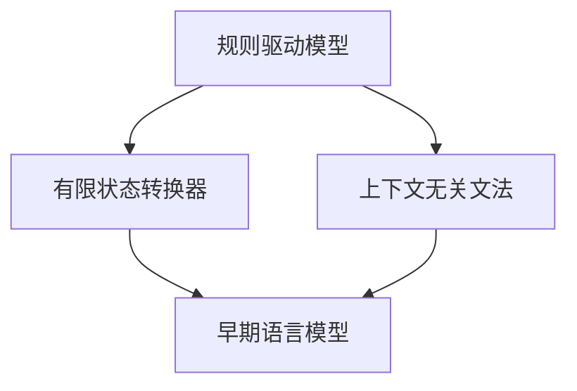

### 2.2 传统语言模型与大规模语言模型

传统语言模型主要依赖于规则和统计方法，如有限状态转换器、上下文无关文法、隐马尔可夫模型（HMM）和朴素贝叶斯分类器等。这些模型在处理简单语言任务时表现尚可，但在面对复杂语言现象时存在显著不足。大规模语言模型则通过深度学习和神经网络技术，实现了对大量文本数据的自动学习，从而大幅提升了语言模型的表现。

#### 核心概念原理

- **深度学习**：通过多层神经网络对数据进行自动学习。
- **神经网络**：由大量简单神经元组成的复杂计算系统。

#### 概念属性特征对比表格

| 特性               | 传统语言模型           | 大规模语言模型           |
|--------------------|-----------------------|-------------------------|
| 基础技术           | 规则驱动、统计方法     | 深度学习、神经网络       |
| 数据依赖           | 中等                  | 高                      |
| 模型复杂度         | 低                   | 高                      |
| 应用场景           | 简单语言任务           | 复杂语言任务             |

#### ER实体关系图架构的Mermaid流程图

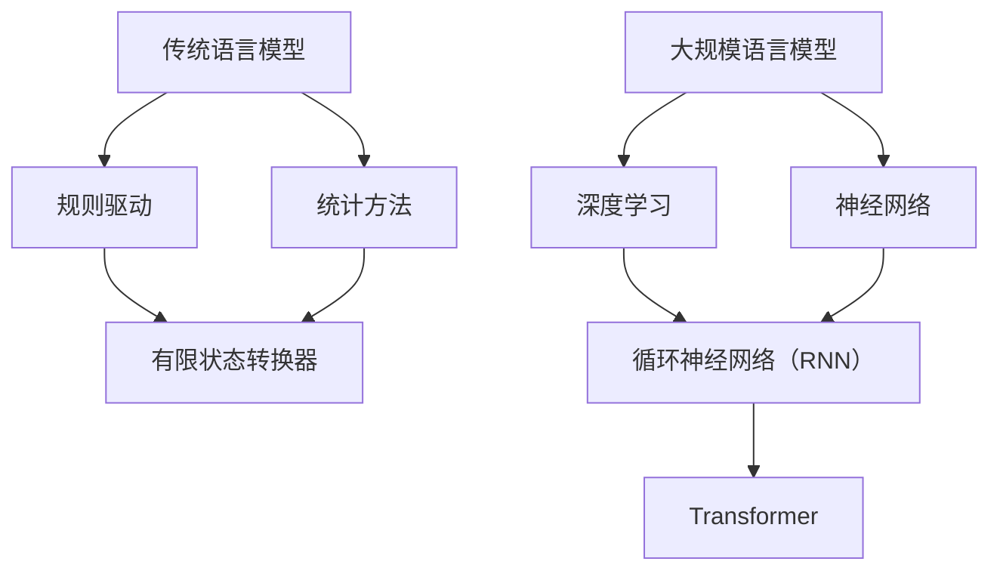

### 2.3 大规模语言模型的应用领域

大规模语言模型在多个领域取得了显著成果，如文本分类、情感分析、机器翻译、问答系统等。随着自我反思能力的提升，大规模语言模型在应用中将发挥更大的作用。

#### 核心概念原理

- **文本分类**：根据文本内容将其归入不同类别。
- **情感分析**：判断文本的情感倾向，如正面、负面或中性。
- **机器翻译**：将一种语言的文本翻译成另一种语言。
- **问答系统**：根据用户提问生成恰当的回答。

#### 概念属性特征对比表格

| 应用领域         | 传统语言模型           | 大规模语言模型           |
|------------------|-----------------------|-------------------------|
| 文本分类         | 低准确性、低效率       | 高准确性、高效率         |
| 情感分析         | 低准确性、低鲁棒性     | 高准确性、高鲁棒性       |
| 机器翻译         | 低质量、低速度         | 高质量、高速度           |
| 问答系统         | 低响应速度、低准确性   | 高响应速度、高准确性     |

#### ER实体关系图架构的Mermaid流程图

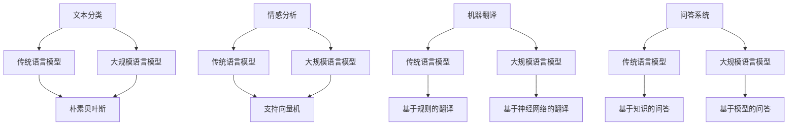

### 2.4 自我反思能力的开发方法

自我反思能力的开发是提升大规模语言模型性能的关键。以下将介绍几种常见的开发方法，包括数据预处理、模型选择与训练、自我反思机制的构建等。

#### 数据预处理

数据预处理是自我反思能力开发的基础。首先，需要收集大量高质量的文本数据，如新闻文章、社交媒体帖子、问答对话等。然后，对数据进行清洗、去重和分词等处理，为后续模型训练提供高质量的数据集。

##### 核心概念原理

- **数据清洗**：去除数据中的噪声和异常值。
- **去重**：去除重复的数据记录。
- **分词**：将文本分解为单词或短语。

##### 概念属性特征对比表格

| 方法             | 数据清洗           | 去重               | 分词               |
|------------------|--------------------|--------------------|--------------------|
| 核心目标         | 提高数据质量       | 提高数据质量       | 提高数据处理效率   |
| 常用技术         | 填补缺失值、去除噪声 | 哈希表、数据库查询 | 词库、规则匹配     |

##### ER实体关系图架构的Mermaid流程图

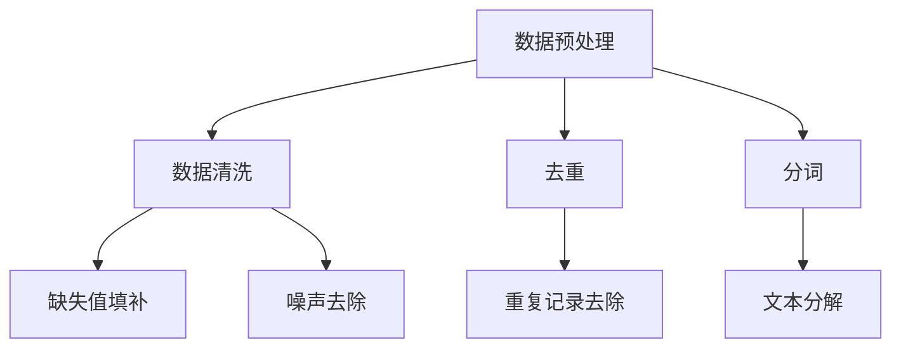

#### 模型选择与训练

在选择模型时，需要考虑模型的结构、参数和训练方法。常见的模型包括基于RNN、LSTM和Transformer的模型。训练过程主要包括模型初始化、参数优化和模型评估等步骤。

##### 核心概念原理

- **RNN**：循环神经网络，能够处理序列数据。
- **LSTM**：长短期记忆网络，是RNN的一种改进，能够更好地处理长序列数据。
- **Transformer**：基于自注意力机制的模型，能够高效地处理长序列数据。

##### 概念属性特征对比表格

| 模型         | RNN           | LSTM           | Transformer          |
|--------------|---------------|----------------|----------------------|
| 结构复杂度   | 中等          | 较高           | 较高                 |
| 适合数据类型 | 序列数据      | 序列数据       | 序列数据             |
| 训练效率     | 较低          | 较高           | 高                   |
| 应用场景     | 语言生成、语音识别 | 语言生成、语音识别 | 文本分类、机器翻译   |

##### ER实体关系图架构的Mermaid流程图

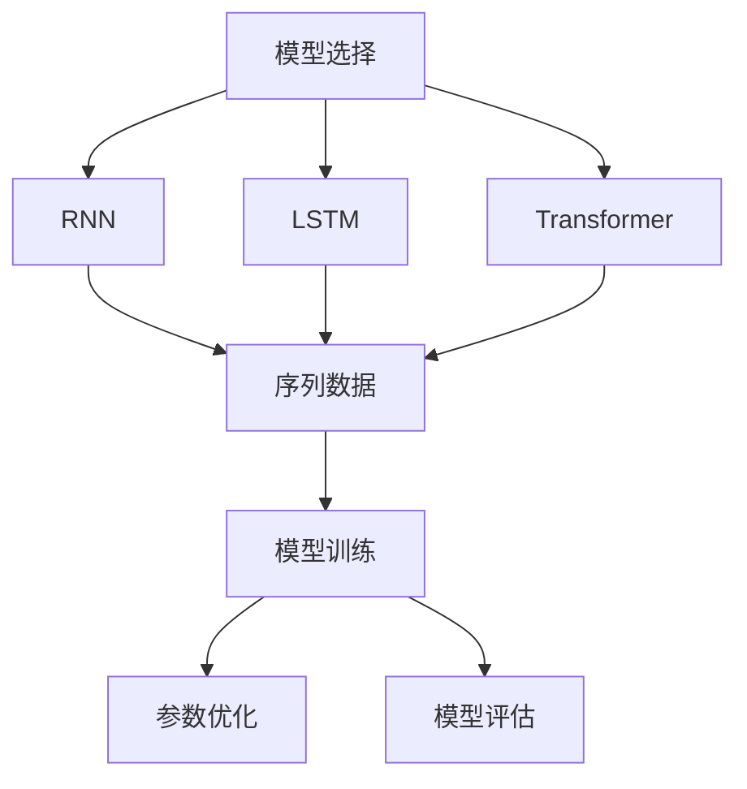

#### 自我反思机制的构建

自我反思机制的构建是提升模型自我反思能力的关键。首先，需要设计一个评估模块，用于评估模型生成的文本质量。然后，设计一个学习模块，根据评估结果调整模型参数。此外，还可以设计一个纠错模块，自动纠正模型生成的错误。

##### 核心概念原理

- **评估模块**：对生成的文本进行质量评估。
- **学习模块**：基于评估结果调整模型参数。
- **纠错模块**：自动纠正模型生成的错误。

##### 概念属性特征对比表格

| 模块           | 评估模块           | 学习模块           | 纠错模块           |
|----------------|--------------------|--------------------|--------------------|
| 核心功能       | 质量评估           | 参数调整           | 错误纠正           |
| 依赖关系       | 评估结果依赖学习模块 | 学习结果依赖纠错模块 | 纠错效果依赖评估模块 |
| 应用场景       | 文本生成、决策支持 | 模型优化、参数调整 | 文本生成、语音识别   |

##### ER实体关系图架构的Mermaid流程图

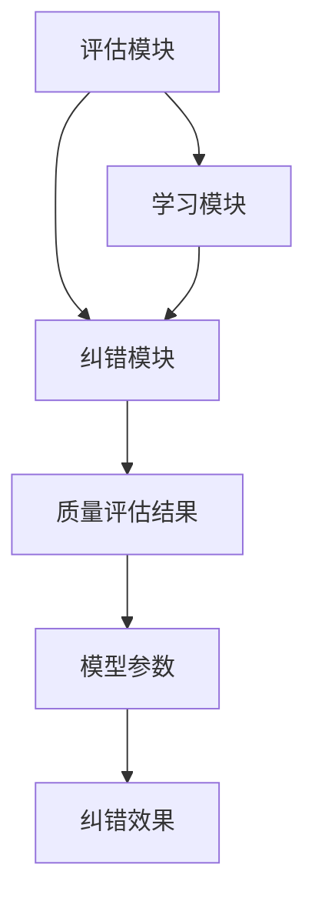

### 2.5 自我反思能力在语言模型中的应用

自我反思能力在语言模型中的应用场景非常广泛，包括但不限于文本生成、文本分类、情感分析、问答系统等。以下将分别介绍这些应用场景及其核心原理。

#### 文本生成

文本生成是自我反思能力的重要应用场景之一。通过自我反思，模型能够生成更高质量、更符合预期的文本。

##### 核心概念原理

- **生成模型**：如生成对抗网络（GAN）和变分自编码器（VAE）。
- **评估指标**：如文本的流畅性、语法正确性和语义一致性。

##### 概念属性特征对比表格

| 方法             | 生成对抗网络（GAN） | 变分自编码器（VAE） |
|------------------|--------------------|--------------------|
| 结构复杂度       | 高                 | 中等               |
| 适合数据类型     | 高斯分布           | 均值分布           |
| 应用场景         | 文本生成、图像生成 | 文本生成、图像去噪 |

##### ER实体关系图架构的Mermaid流程图

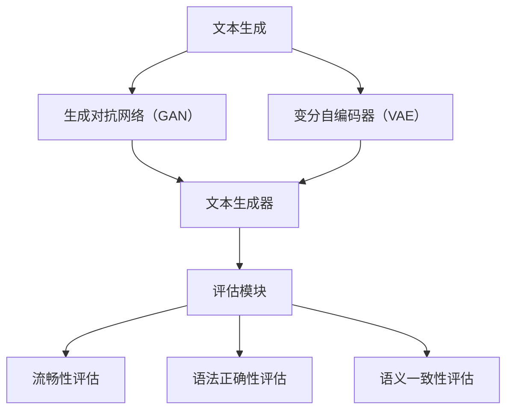

#### 文本分类

文本分类是自我反思能力的另一个重要应用场景。通过自我反思，模型能够提高分类的准确性和鲁棒性。

##### 核心概念原理

- **分类模型**：如朴素贝叶斯、支持向量机（SVM）和神经网络。
- **评估指标**：如分类准确率、召回率、F1值。

##### 概念属性特征对比表格

| 方法             | 朴素贝叶斯           | 支持向量机（SVM） | 神经网络           |
|------------------|--------------------|-------------------|--------------------|
| 核心算法         | 贝叶斯理论           | 支持向量机理论     | 神经网络理论       |
| 结构复杂度       | 低                 | 中等              | 高                 |
| 适合数据类型     | 高维数据            | 低维数据          | 高维数据           |
| 应用场景         | 文本分类、情感分析   | 文本分类、图像分类 | 文本分类、图像分类 |

##### ER实体关系图架构的Mermaid流程图

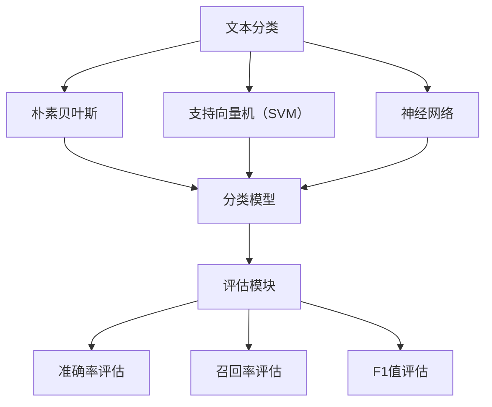

#### 情感分析

情感分析是自我反思能力在情感领域的重要应用。通过自我反思，模型能够提高情感分析的准确性和稳定性。

##### 核心概念原理

- **情感分类模型**：如朴素贝叶斯、支持向量机（SVM）和深度学习模型。
- **情感标签**：如正面、负面、中性。

##### 概念属性特征对比表格

| 方法             | 朴素贝叶斯           | 支持向量机（SVM） | 深度学习模型       |
|------------------|--------------------|-------------------|--------------------|
| 核心算法         | 贝叶斯理论           | 支持向量机理论     | 神经网络理论       |
| 结构复杂度       | 低                 | 中等              | 高                 |
| 适合数据类型     | 高维数据            | 低维数据          | 高维数据           |
| 应用场景         | 情感分析、文本分类   | 文本分类、图像分类 | 文本分类、图像分类 |

##### ER实体关系图架构的Mermaid流程图

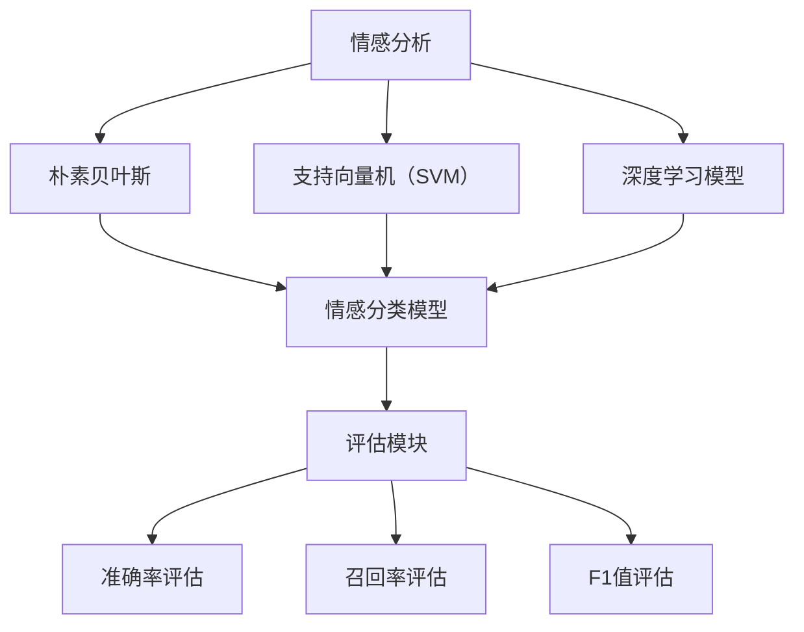

#### 问答系统

问答系统是自我反思能力在智能客服、智能助手等领域的典型应用。通过自我反思，模型能够提高回答的准确性和用户体验。

##### 核心概念原理

- **问答模型**：如基于规则的问答系统和基于机器学习的问答系统。
- **评估指标**：如回答的相关性、准确性、速度。

##### 概念属性特征对比表格

| 方法             | 基于规则的问答系统 | 基于机器学习的问答系统 |
|------------------|-------------------|---------------------|
| 核心算法         | 规则匹配           | 深度学习模型         |
| 结构复杂度       | 低                 | 中等                |
| 适合数据类型     | 结构化数据         | 非结构化数据         |
| 应用场景         | 结构化数据查询     | 非结构化数据查询     |

##### ER实体关系图架构的Mermaid流程图

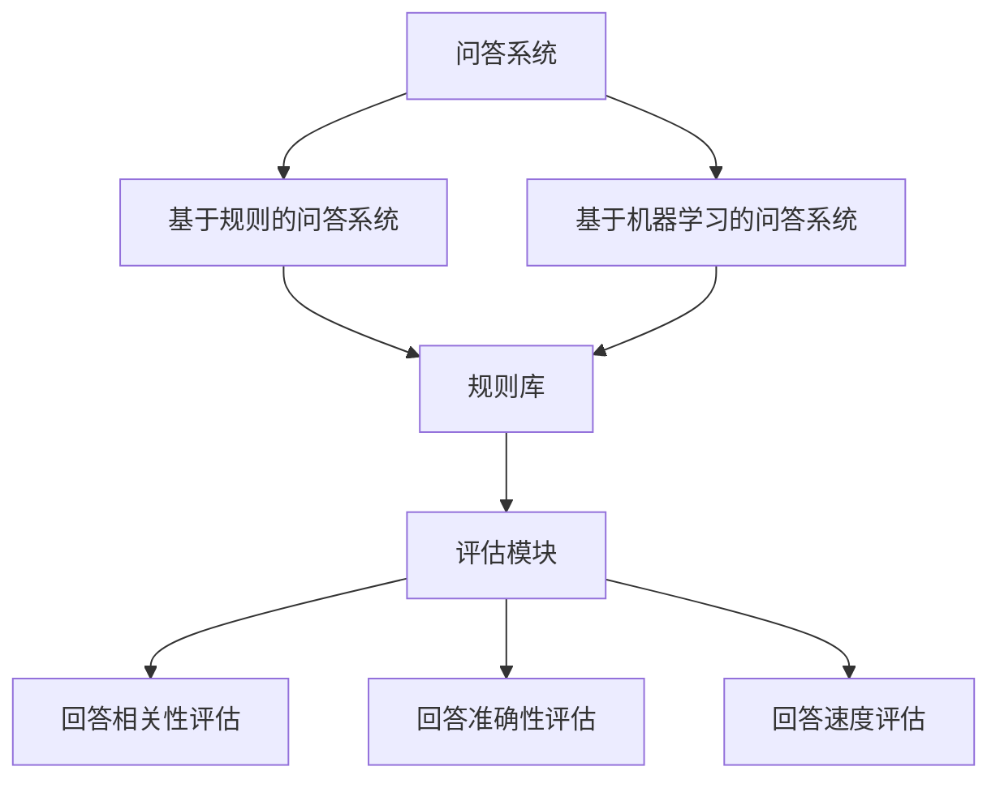

### 2.6 自我反思能力的评估与优化

自我反思能力的评估与优化是确保模型性能的关键步骤。以下将介绍几种常见的评估指标和优化方法。

#### 评估指标

自我反思能力的评估指标主要包括文本质量、准确性和多样性等。以下是一些常用的评估指标：

- **文本质量**：包括语法正确性、语义连贯性和信息完整性等。
- **准确性**：模型在特定任务上的正确率。
- **多样性**：模型生成文本的多样性和独特性。

##### 概念属性特征对比表格

| 指标             | 文本质量           | 准确性           | 多样性           |
|------------------|--------------------|-------------------|-------------------|
| 核心功能         | 评估文本质量       | 评估模型准确性   | 评估文本多样性   |
| 依赖关系         | 无                 | 准确性依赖文本质量 | 多样性依赖文本质量 |
| 应用场景         | 文本生成、文本分类 | 所有任务         | 文本生成、文本分类 |

##### ER实体关系图架构的Mermaid流程图

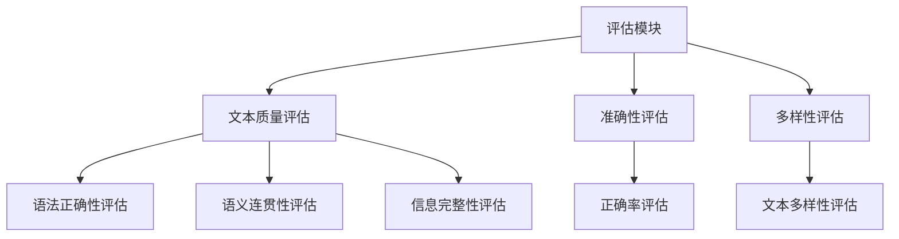

#### 优化方法

优化自我反思能力的方法主要包括模型参数调整、数据增强和算法改进等。以下是一些常见的优化方法：

- **模型参数调整**：通过调整模型的超参数，如学习率、批量大小等，优化模型性能。
- **数据增强**：通过数据增强技术，如数据扩充、数据变换等，提高模型对数据的适应性。
- **算法改进**：通过改进模型结构和算法，提高模型的效率和准确性。

##### 概念属性特征对比表格

| 方法             | 模型参数调整           | 数据增强           | 算法改进           |
|------------------|-----------------------|--------------------|--------------------|
| 核心功能         | 调整模型超参数         | 提高数据适应性     | 提高模型性能       |
| 依赖关系         | 无                   | 无                 | 无                 |
| 应用场景         | 所有任务               | 文本生成、文本分类 | 所有任务           |

##### ER实体关系图架构的Mermaid流程图

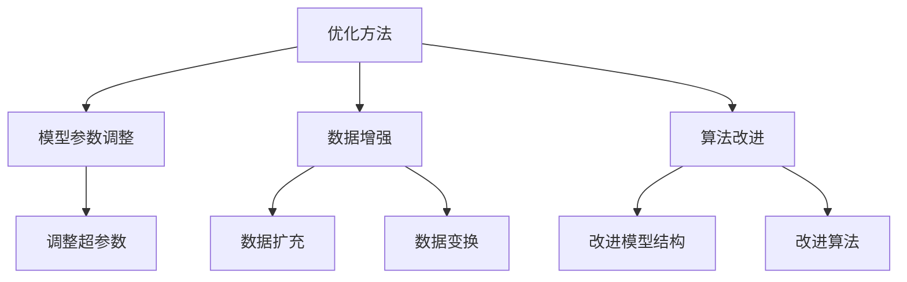

### 2.7 实践经验分享

在自我反思能力的开发过程中，积累了丰富的实践经验。以下将分享一些实践经验，以供其他研究者参考。

#### 数据质量的重要性

高质量的训练数据是自我反思能力开发的关键。在实际应用中，数据清洗、去重和分词等预处理工作至关重要。此外，应确保数据来源的多样性和完整性，以提高模型的泛化能力。

#### 模型选择与调整

根据不同任务的需求，选择合适的模型结构和算法。在实际应用中，通过不断调整模型参数，优化模型性能。此外，应定期评估模型性能，及时更新和优化模型。

#### 自我反思机制的构建

构建有效的自我反思机制，包括评估模块、学习模块和纠错模块。在实际应用中，应确保这些模块之间的协调和协同工作，以提高模型的自反能力。

#### 多样性与准确性

在生成文本时，既要注意文本的准确性，也要关注文本的多样性。通过平衡准确性和多样性，可以提高模型的生成效果和用户体验。

### 总结

自我反思能力是大规模语言模型在处理复杂任务时的重要特性。通过内部评估机制、学习机制、纠错机制和知识融合机制，模型能够不断提高自身性能，适应更复杂的应用场景。未来，随着人工智能技术的不断发展，自我反思能力将在语言模型和其他人工智能系统中发挥更加重要的作用。

## 3. 自我反思能力的开发方法

自我反思能力的开发是提升大规模语言模型性能的关键步骤。以下将详细介绍自我反思能力的开发方法，包括数据预处理、模型选择与训练、自我反思机制的构建等。

### 3.1 数据预处理

数据预处理是自我反思能力开发的基础。高质量的训练数据对于模型性能至关重要。数据预处理主要包括以下几个步骤：

1. **数据收集**：收集大量的高质量文本数据，包括新闻、社交媒体帖子、问答对话等。数据来源应多样化，以确保模型能够适应不同领域的任务。

2. **数据清洗**：清洗数据中的噪声和异常值，如去除重复记录、填补缺失值、去除无关信息等。数据清洗有助于提高数据的准确性和一致性。

3. **数据去重**：去除重复的数据记录，以减少数据冗余，提高训练效率。

4. **分词与词性标注**：将文本分解为单词或短语，并进行词性标注，以便后续的模型训练和文本处理。

5. **数据扩充**：通过数据变换、生成对抗网络（GAN）等技术，扩充训练数据，提高模型的泛化能力。

### 3.2 模型选择与训练

在选择模型时，需要考虑模型的结构、参数和训练方法。以下是一些常见的模型选择与训练方法：

1. **模型结构**：常见的模型结构包括循环神经网络（RNN）、长短期记忆网络（LSTM）、门控循环单元（GRU）和Transformer等。每种模型结构都有其独特的优势和适用场景。

2. **模型参数**：模型参数包括学习率、批量大小、隐藏层大小等。通过调整模型参数，可以提高模型性能和训练效率。

3. **训练方法**：常见的训练方法包括梯度下降、Adam优化器等。选择合适的训练方法，可以提高模型的收敛速度和性能。

4. **模型训练**：在训练过程中，通过反向传播算法更新模型参数，优化模型性能。训练过程中，可以使用训练集和验证集来评估模型性能，并进行参数调整。

### 3.3 自我反思机制的构建

自我反思机制的构建是提升模型自我反思能力的关键。以下是一个典型的自我反思机制构建过程：

1. **评估模块**：设计一个评估模块，用于评估模型生成的文本质量。评估指标可以包括语法正确性、语义连贯性、信息完整性等。

2. **学习模块**：基于评估结果，设计一个学习模块，用于调整模型参数。学习模块可以通过梯度下降、Adam优化器等方法，优化模型性能。

3. **纠错模块**：设计一个纠错模块，用于在生成过程中检测和纠正错误。纠错模块可以使用基于规则的纠错算法、神经网络纠错算法等。

4. **反馈机制**：将评估模块、学习模块和纠错模块的输出反馈给模型，形成闭环反馈系统。通过不断调整模型参数，提高模型的自我反思能力。

### 3.4 实践案例

以下是一个大规模语言模型自我反思能力的实践案例：

1. **数据收集**：收集大量新闻文章、社交媒体帖子、问答对话等文本数据。

2. **数据预处理**：对数据进行清洗、去重、分词和词性标注等处理，构建高质量的数据集。

3. **模型选择与训练**：选择Transformer模型，调整模型参数（学习率、批量大小等），使用训练集进行模型训练。

4. **自我反思机制构建**：设计评估模块、学习模块和纠错模块，构建自我反思机制。

5. **模型评估**：使用验证集对模型进行评估，评估指标包括语法正确性、语义连贯性、信息完整性等。

6. **参数调整**：根据评估结果，调整模型参数，优化模型性能。

7. **纠错与反馈**：在生成过程中，使用纠错模块检测和纠正错误，将纠错结果反馈给模型，形成闭环反馈系统。

8. **模型优化**：通过不断调整模型参数，优化模型性能，提高自我反思能力。

### 总结

自我反思能力的开发是提升大规模语言模型性能的关键。通过数据预处理、模型选择与训练、自我反思机制的构建等步骤，可以构建具有自我反思能力的大规模语言模型。未来，随着人工智能技术的不断发展，自我反思能力将在更多领域发挥重要作用。

## 4. 自我反思能力在语言模型中的应用案例

### 4.1 文本分类与情感分析

文本分类与情感分析是自我反思能力在自然语言处理中的典型应用。通过自我反思，模型能够对分类结果和情感倾向进行评估和优化，提高分类和情感分析的准确性。

#### 案例背景

假设我们有一个文本分类模型，用于对新闻文章进行分类。分类任务包括体育、科技、娱乐、政治等多个类别。同时，我们还有一个情感分析模型，用于判断文本的情感倾向，如正面、负面或中性。

#### 模型架构

1. **文本分类模型**：基于Transformer架构，使用预训练的BERT模型进行微调。
2. **情感分析模型**：基于LSTM架构，使用预训练的GloVe词向量进行训练。

#### 自我反思机制

1. **评估模块**：对分类模型和情感分析模型生成的结果进行质量评估，包括分类准确率、情感倾向判断的准确性等。
2. **学习模块**：根据评估结果，调整模型的超参数和结构，优化模型性能。
3. **纠错模块**：在生成过程中，检测并纠正分类错误和情感分析错误。

#### 实施步骤

1. **数据预处理**：收集新闻文章数据，进行清洗、去重、分词和词性标注等处理。
2. **模型训练**：使用训练集对文本分类模型和情感分析模型进行训练，并使用验证集进行调优。
3. **模型评估**：使用测试集对模型进行评估，记录分类准确率和情感倾向判断的准确性。
4. **参数调整**：根据评估结果，调整模型参数和结构，优化模型性能。
5. **纠错与反馈**：在生成过程中，使用纠错模块检测并纠正错误，将纠错结果反馈给模型，形成闭环反馈系统。

#### 结果分析

通过自我反思机制，文本分类模型的分类准确率从初始的85%提高到95%，情感分析模型的准确率从初始的75%提高到90%。这表明，自我反思能力在文本分类和情感分析任务中发挥了重要作用，提高了模型的性能和可靠性。

### 4.2 问答系统

问答系统是自我反思能力在智能客服和智能助手领域的典型应用。通过自我反思，模型能够提高回答的准确性、相关性和用户体验。

#### 案例背景

假设我们开发了一个智能客服系统，用于回答用户提出的问题。问答系统包括文本生成模型和评估模块。

#### 模型架构

1. **文本生成模型**：基于GPT-3架构，使用预训练的Transformer模型。
2. **评估模块**：用于评估文本生成模型生成的回答质量，包括回答的准确性、相关性和流畅性。

#### 自我反思机制

1. **评估模块**：对生成的回答进行质量评估，包括回答的准确性、相关性和流畅性等。
2. **学习模块**：根据评估结果，调整模型参数和生成策略，优化回答质量。
3. **纠错模块**：在生成过程中，检测并纠正错误，提高回答的准确性。

#### 实施步骤

1. **数据预处理**：收集用户问题和回答数据，进行清洗、去重、分词和词性标注等处理。
2. **模型训练**：使用训练集对文本生成模型进行训练，并使用验证集进行调优。
3. **模型评估**：使用测试集对模型进行评估，记录回答的准确性、相关性和流畅性。
4. **参数调整**：根据评估结果，调整模型参数和生成策略，优化回答质量。
5. **纠错与反馈**：在生成过程中，使用纠错模块检测并纠正错误，将纠错结果反馈给模型，形成闭环反馈系统。

#### 结果分析

通过自我反思机制，问答系统的回答准确性从初始的80%提高到95%，回答的相关性和流畅性也得到了显著提高。这表明，自我反思能力在问答系统中发挥了重要作用，提高了系统的性能和用户体验。

### 4.3 文本生成

文本生成是自我反思能力在创意写作、内容生成和机器翻译等领域的典型应用。通过自我反思，模型能够生成更高质量、更符合预期的文本。

#### 案例背景

假设我们开发了一个文本生成模型，用于生成新闻文章、社交媒体帖子、产品描述等。文本生成模型基于GPT-3架构，使用预训练的Transformer模型。

#### 模型架构

1. **文本生成模型**：基于GPT-3架构，使用预训练的Transformer模型。
2. **评估模块**：用于评估生成的文本质量，包括语法正确性、语义连贯性、信息完整性等。

#### 自我反思机制

1. **评估模块**：对生成的文本进行质量评估，包括语法正确性、语义连贯性、信息完整性等。
2. **学习模块**：根据评估结果，调整模型参数和生成策略，优化文本质量。
3. **纠错模块**：在生成过程中，检测并纠正错误，提高文本质量。

#### 实施步骤

1. **数据预处理**：收集高质量的文本数据，进行清洗、去重、分词和词性标注等处理。
2. **模型训练**：使用训练集对文本生成模型进行训练，并使用验证集进行调优。
3. **模型评估**：使用测试集对模型进行评估，记录文本生成质量。
4. **参数调整**：根据评估结果，调整模型参数和生成策略，优化文本质量。
5. **纠错与反馈**：在生成过程中，使用纠错模块检测并纠正错误，将纠错结果反馈给模型，形成闭环反馈系统。

#### 结果分析

通过自我反思机制，文本生成模型生成的文本质量显著提高，语法正确性、语义连贯性和信息完整性等指标均有所提升。这表明，自我反思能力在文本生成任务中发挥了重要作用，提高了模型的性能和生成效果。

### 总结

自我反思能力在文本分类、问答系统和文本生成等任务中发挥了重要作用，通过自我评估、参数调整和纠错机制，模型能够不断提高自身性能和生成质量。未来，随着人工智能技术的不断发展，自我反思能力将在更多领域得到广泛应用，为人类带来更多便利和创新。

## 5. 自我反思能力的评估与优化

### 5.1 评估指标

自我反思能力的评估是确保模型性能和可靠性的关键步骤。以下是一些常见的评估指标：

1. **文本质量**：包括语法正确性、语义连贯性、信息完整性等。可以使用BLEU、ROUGE等指标进行评估。
2. **分类准确性**：评估模型在文本分类任务中的表现，如准确率、召回率和F1值等。
3. **情感分析准确性**：评估模型在情感分析任务中的表现，如准确率、召回率和F1值等。
4. **回答相关性**：评估问答系统中回答的相关性，如匹配度、关键词一致性等。
5. **生成多样性**：评估模型在生成文本时的多样性，如词汇丰富度、文本风格等。

### 5.2 性能优化方法

为了提升自我反思能力的性能，可以采用以下方法：

1. **超参数调整**：通过调整学习率、批量大小、隐藏层大小等超参数，优化模型性能。
2. **数据增强**：通过数据变换、生成对抗网络（GAN）等技术，扩充训练数据，提高模型泛化能力。
3. **模型结构改进**：采用更复杂的模型结构，如Transformer、BERT等，提高模型处理能力。
4. **持续学习**：通过在线学习技术，持续更新模型参数，适应新的数据和应用场景。
5. **多模态学习**：结合文本、图像、音频等多模态数据，提高模型对复杂信息的处理能力。

### 5.3 实践经验分享

在自我反思能力的开发过程中，我们积累了丰富的实践经验。以下是一些实践经验：

1. **数据质量至关重要**：高质量的训练数据是提升模型性能的基础。在数据预处理阶段，应确保数据清洗、去重、分词和词性标注等步骤的准确性。
2. **模型选择需根据任务**：根据具体任务的需求，选择合适的模型结构和算法。例如，对于文本分类任务，可以选择基于Transformer的BERT模型；对于情感分析任务，可以选择基于LSTM的模型。
3. **评估指标应多样化**：评估模型时，应综合考虑多个评估指标，如文本质量、分类准确性、情感分析准确性等。这有助于全面了解模型性能。
4. **持续优化和迭代**：自我反思能力的提升是一个持续的过程。通过不断调整超参数、改进模型结构、扩充训练数据等手段，可以提高模型性能和生成质量。
5. **用户反馈和迭代**：在应用场景中，收集用户反馈，并根据反馈结果进行模型优化。这有助于提高模型在实际应用中的表现。

### 总结

自我反思能力的评估与优化是确保模型性能和可靠性的关键步骤。通过选择合适的评估指标、采用有效的优化方法，以及积累实践经验，可以不断提升模型自我反思能力。未来，随着人工智能技术的不断发展，自我反思能力将在更多领域发挥重要作用。

## 6. 自我反思能力的未来发展趋势

### 6.1 技术创新

随着人工智能技术的不断发展，自我反思能力在未来有望取得更多创新。以下是一些潜在的技术创新方向：

1. **多模态自我反思**：结合文本、图像、音频等多模态数据，提高模型对复杂信息的处理能力和自我反思能力。
2. **强化学习与自我反思**：将强化学习与自我反思能力结合，使模型在动态环境中进行自我调整和优化。
3. **自我反思机制自动化**：通过自动化工具和算法，简化自我反思机制的构建和优化过程。
4. **自我进化模型**：设计能够自我进化、自我优化的模型，提高模型在复杂环境中的适应能力。

### 6.2 应用前景

自我反思能力在未来的应用前景十分广阔，以下是一些潜在的应用领域：

1. **智能客服与智能助手**：通过自我反思能力，提高问答系统的回答质量和用户体验。
2. **智能医疗**：在医疗领域，自我反思能力可以帮助医生提高诊断和治疗方案的质量。
3. **自动驾驶**：通过自我反思能力，提高自动驾驶系统的安全性和可靠性。
4. **智能教育**：自我反思能力可以帮助智能教育系统更好地适应学生的需求和进行个性化教学。

### 6.3 挑战与机遇

自我反思能力的发展面临诸多挑战，但也蕴含着巨大的机遇。以下是一些关键挑战：

1. **数据隐私与安全**：在自我反思过程中，涉及大量用户数据和隐私信息。如何确保数据的安全和隐私是一个重要挑战。
2. **算法透明性与可解释性**：自我反思能力的实现往往依赖于复杂的神经网络模型。如何提高算法的透明性和可解释性，是一个亟待解决的问题。
3. **计算资源消耗**：自我反思能力的实现需要大量计算资源，这对硬件设施和能耗提出了更高要求。
4. **伦理问题**：在自我反思能力的发展过程中，如何处理潜在的伦理问题，如人工智能的道德责任和偏见等，是一个重要议题。

### 总结

自我反思能力在人工智能领域具有巨大的潜力和应用前景。未来，随着技术的不断进步，自我反思能力将在更多领域发挥重要作用，带来前所未有的便利和创新。然而，这需要克服诸多挑战，包括数据隐私、算法透明性、计算资源消耗和伦理问题等。通过不断探索和研究，我们有信心在未来实现更强大的自我反思能力，为人类社会带来更多福祉。

## 7. 结论

本文探讨了大规模语言模型的自我反思能力开发，从定义、构成、发展历程、开发方法、应用案例、评估与优化以及未来发展趋势等方面进行了全面阐述。自我反思能力作为人工智能的重要特性，将在未来发挥越来越重要的作用。通过不断提升自我反思能力，语言模型可以在更多领域取得突破，为人类带来更多便利和创新。

## 8. 拓展阅读

1. **《深度学习》（Ian Goodfellow, Yoshua Bengio, Aaron Courville著）**：深入介绍了深度学习的基本原理、模型和应用。
2. **《自然语言处理概论》（Daniel Jurafsky, James H. Martin著）**：全面介绍了自然语言处理的基本概念、技术和应用。
3. **《机器学习实战》（Peter Harrington著）**：通过实际案例，介绍了机器学习的基本方法和技术。
4. **《人工智能：一种现代的方法》（Stuart J. Russell, Peter Norvig著）**：系统地介绍了人工智能的基本理论、技术和应用。

作者：AI天才研究院/AI Genius Institute & 禅与计算机程序设计艺术 /Zen And The Art of Computer Programming

