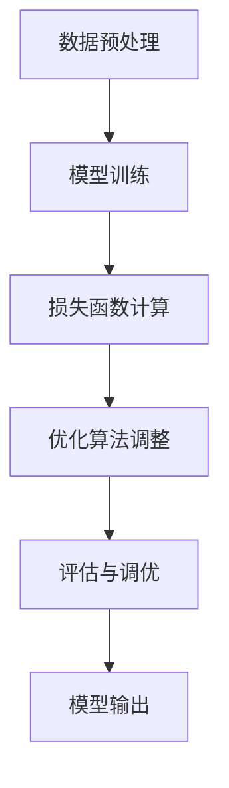
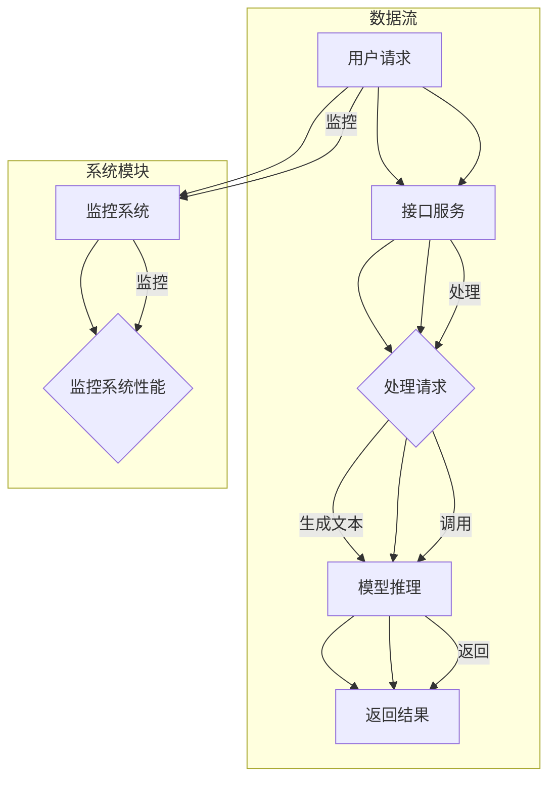
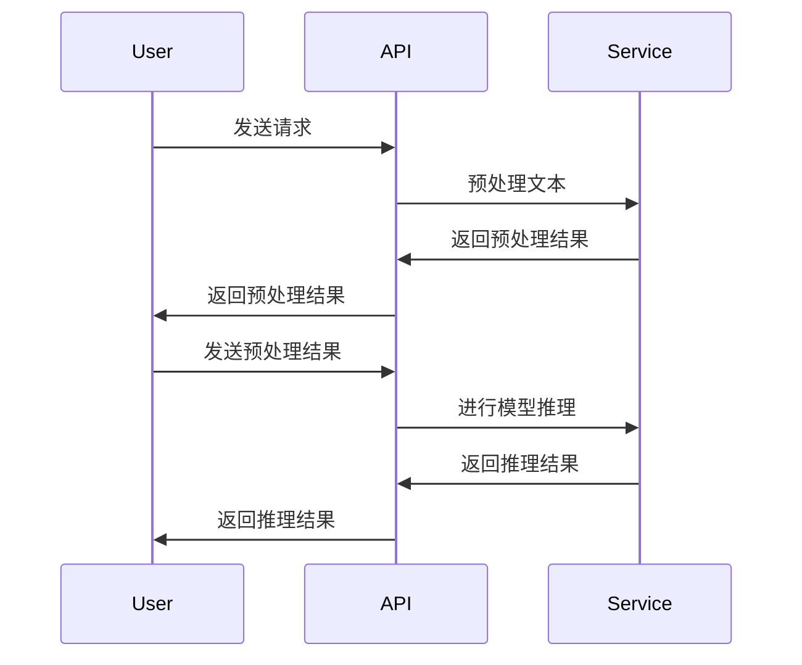
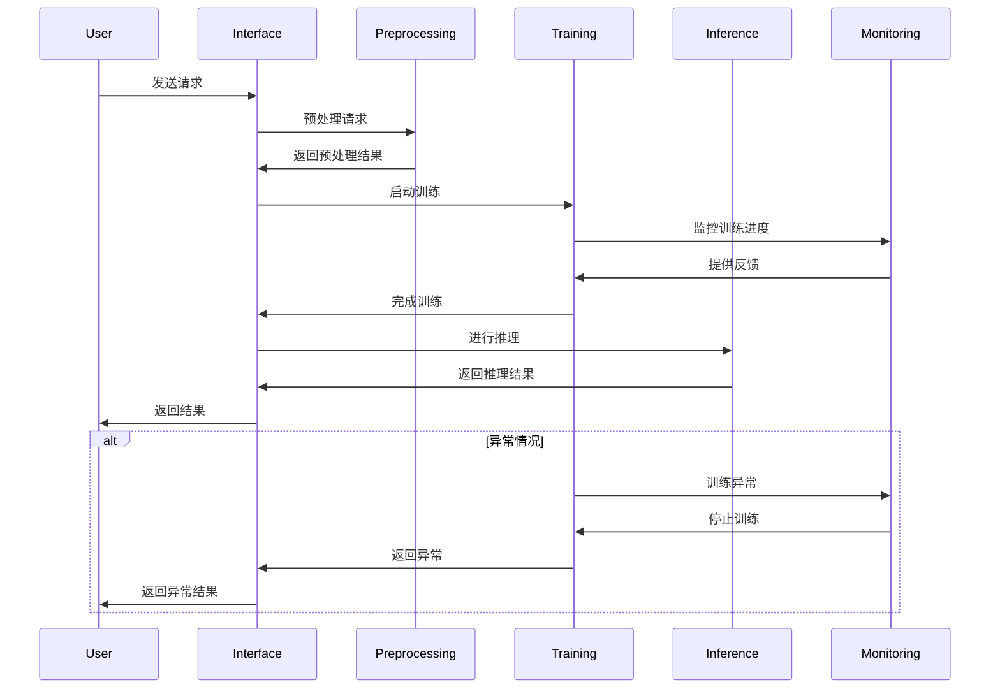
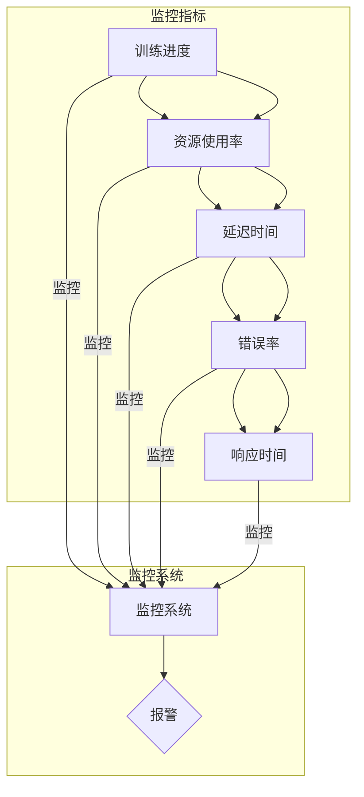

                 

### 背景介绍与核心概念

#### 1.1 大规模语言模型的发展背景

随着互联网的飞速发展和信息爆炸，自然语言处理（NLP）技术日益成为人工智能领域的重要研究方向。在大数据、云计算和深度学习等技术的推动下，大规模语言模型（Large-scale Language Model）逐渐成为NLP领域的核心技术之一。这些模型通过学习海量文本数据，能够理解和生成自然语言，广泛应用于机器翻译、文本生成、问答系统等领域。

大规模语言模型的发展可以追溯到20世纪80年代，当时基于统计方法的NLP技术开始出现，如N-gram语言模型。然而，由于数据量和计算资源的限制，这些模型的效果有限。随着21世纪初深度学习技术的兴起，尤其是2013年谷歌提出的Word2Vec模型，大规模语言模型的发展迎来了新的机遇。Word2Vec通过将单词映射到高维向量空间，使得词与词之间的语义关系可以通过向量之间的距离来度量，从而显著提升了NLP任务的效果。

进入2018年，谷歌推出了BERT（Bidirectional Encoder Representations from Transformers），它通过双向Transformer架构，将上下文信息同时考虑进来，使得语言模型在多个NLP任务中取得了显著的性能提升。此后，包括GPT-3、T5、BERT等在内的多种大规模语言模型相继问世，进一步推动了NLP技术的发展。

#### 1.2 问题描述

大规模语言模型在提升NLP任务性能方面具有显著优势，但同时也面临着一系列挑战。首先，如何有效训练和优化这些大规模模型是一个关键问题。大规模语言模型的训练过程需要处理海量数据和高维向量，这要求高效的算法和大量的计算资源。其次，如何评估模型的效果也是一个重要问题。传统的评估方法往往只能衡量模型的某些方面，而无法全面评估其性能。此外，大规模语言模型在实际应用中还需要考虑其可解释性和安全性等问题。

#### 1.3 问题解决

为了解决上述问题，研究者们提出了多种方法和策略。在训练和优化方面，通过改进算法和分布式计算技术，可以有效降低训练时间和计算成本。例如，使用梯度累积、混合精度训练等技术，可以在保证模型性能的同时，提高训练效率。在评估方面，研究者们提出了多种新的评估指标和方法，如GLUE（General Language Understanding Evaluation）和SuperGLUE等，这些评估集涵盖了多种NLP任务，能够更全面地评估模型的效果。

此外，为了提高大规模语言模型的可解释性和安全性，研究者们还开展了大量的相关工作。例如，通过可视化技术，可以直观地展示模型的决策过程；通过对抗性攻击和防御技术，可以提高模型的安全性。总之，通过多种方法和策略的综合应用，可以有效提升大规模语言模型的能力和应用效果。

#### 1.4 边界与外延

大规模语言模型的边界主要体现在其训练数据、模型规模和应用领域等方面。首先，大规模语言模型依赖于大规模的文本数据进行训练，这些数据需要涵盖多种语言、多种场景，以确保模型的泛化能力。其次，模型的规模也是一个重要因素，较大的模型通常能够捕捉到更多的语言特征，从而提升任务性能，但同时也带来了更高的计算和存储需求。最后，大规模语言模型的应用领域广泛，包括自然语言生成、机器翻译、文本分类、问答系统等，这些应用对模型的要求各不相同，需要针对性地设计和优化。

#### 1.5 概念结构与核心要素组成

大规模语言模型的核心结构通常包括输入层、编码层、解码层和输出层。输入层负责接收文本数据，编码层将文本数据编码为向量表示，解码层根据编码层的信息生成输出文本，输出层则负责输出最终的文本结果。核心要素包括训练数据、模型架构、优化策略和评估指标等。

- **训练数据**：大规模语言模型的训练数据通常来源于互联网上的大量文本，如维基百科、新闻文章、社交媒体等。
- **模型架构**：大规模语言模型通常采用深度神经网络架构，如Transformer、BERT等，这些架构具有较好的并行计算能力和强大的表达能力。
- **优化策略**：优化策略包括梯度下降、Adam优化器等，用于调整模型参数，提高模型性能。
- **评估指标**：评估指标包括准确率、召回率、F1值等，用于衡量模型在各个任务上的性能。

总之，大规模语言模型是NLP领域的一项重要技术，其在训练、优化、评估和应用等方面都取得了显著进展。然而，随着模型规模的不断扩大和应用领域的不断拓展，如何进一步优化模型性能、提高可解释性和安全性仍然是亟待解决的问题。

### 大规模语言模型的基础概念

#### 2.1 大规模语言模型的定义

大规模语言模型（Large-scale Language Model）是一种基于深度学习的自然语言处理技术，通过学习海量文本数据，构建对自然语言具有较强理解和生成能力的模型。这种模型的核心特点是能够捕捉到文本中的长期依赖关系和复杂语义信息，从而在多种NLP任务中表现出色。

与传统的语言模型相比，大规模语言模型具有以下几个显著特点：

- **数据规模大**：传统语言模型通常使用数百万到数千万的词汇量，而大规模语言模型则使用数十亿甚至上百亿的词汇量进行训练。这使得模型能够更好地理解和生成自然语言。
- **模型结构复杂**：传统语言模型多采用N-gram模型、隐马尔可夫模型（HMM）等简单结构，而大规模语言模型通常采用深度神经网络，如Transformer、BERT等，这些模型具有更强的表达能力和并行计算能力。
- **训练时间较长**：由于数据规模大、模型结构复杂，大规模语言模型的训练时间通常较长，需要大量的计算资源和时间。

#### 2.2 大规模语言模型的核心特点

大规模语言模型具有以下几个核心特点：

- **上下文感知**：传统语言模型主要基于局部特征进行建模，而大规模语言模型能够捕捉到文本的长期依赖关系，通过对上下文信息的全局理解，生成更准确、更自然的文本。
- **泛化能力强**：通过学习海量数据，大规模语言模型具有较强的泛化能力，能够应对多种语言任务和应用场景。
- **表达能力高**：大规模语言模型采用深度神经网络架构，能够自动提取文本中的复杂特征，从而实现高度自动化和高效的文本处理。
- **动态调整**：大规模语言模型通过自适应学习算法，能够根据新的数据和任务需求，动态调整模型结构和参数，从而实现持续优化。

#### 2.3 大规模语言模型与传统语言模型的对比

大规模语言模型与传统语言模型在多个方面存在显著差异，具体如下：

| 对比方面 | 传统语言模型 | 大规模语言模型 |
| :----: | :-----------: | :------------: |
| **数据规模** | 数百万到数千万词汇量 | 数十亿甚至上百亿词汇量 |
| **模型结构** | N-gram模型、HMM等 | 深度神经网络，如Transformer、BERT等 |
| **训练时间** | 几小时到几天 | 数天到数周 |
| **上下文理解** | 局部特征 | 全局上下文感知 |
| **泛化能力** | 较弱，特定领域 | 较强，多种任务和应用场景 |
| **表达能力** | 较低，特征提取有限 | 较高，自动提取复杂特征 |

通过上述对比可以看出，大规模语言模型在数据规模、模型结构、上下文理解和泛化能力等方面都显著优于传统语言模型。这些优势使得大规模语言模型在NLP领域具有广泛的应用前景。

### 大规模语言模型的相关概念

#### 3.1 语言模型的基本组成

语言模型（Language Model）是自然语言处理（NLP）中的核心组件，用于预测给定文本序列下一个可能出现的单词或词组。大规模语言模型在传统语言模型的基础上，通过引入更大量的数据和高维表示，进一步提升了预测能力和表现。以下是语言模型的基本组成部分：

1. **数据集**：语言模型依赖于大量的文本数据集，这些数据集通常包括各种类型的文本，如新闻、社交媒体、书籍、网页等。数据集的质量直接影响模型的学习效果。

2. **输入层**：输入层负责接收文本序列，将其转换为模型能够处理的形式。在传统的N-gram模型中，输入层可能直接接收词序列；而在大规模语言模型中，输入层可能包括词嵌入（word embeddings）或字符嵌入（character embeddings）。

3. **编码层**：编码层（Encoder）负责对输入文本进行编码，提取文本中的语义信息。在传统的N-gram模型中，编码层可能是一个简单的计数器；而在大规模语言模型中，编码层通常是一个复杂的神经网络，如Transformer、BERT等。

4. **解码层**：解码层（Decoder）负责生成预测的文本序列。在传统的N-gram模型中，解码层可能直接输出下一个词；而在大规模语言模型中，解码层通常包括一个或多个解码器神经网络，用于生成文本序列。

5. **输出层**：输出层（Output）负责将解码层生成的文本序列转换为最终的输出结果。在大多数情况下，输出层包括一个softmax层，用于对生成的文本序列进行概率分布预测。

#### 3.2 语言模型的训练与优化

语言模型的训练与优化是构建高效语言模型的关键步骤。以下是语言模型训练与优化的主要方法和策略：

1. **训练方法**：
   - **基于统计的方法**：如N-gram模型，通过统计文本序列的频率来预测下一个词。
   - **基于神经网的方法**：如基于RNN（循环神经网络）的模型，如LSTM（长短期记忆网络）和GRU（门控循环单元），通过递归地处理文本序列，捕捉长期依赖关系。
   - **基于注意力机制的方法**：如Transformer模型，通过自注意力机制（Self-Attention）和多头注意力（Multi-Head Attention）机制，高效地捕捉文本序列中的依赖关系。

2. **优化策略**：
   - **梯度下降**（Gradient Descent）：一种常用的优化策略，通过迭代更新模型参数，最小化损失函数。
   - **Adam优化器**（Adaptive Moment Estimation）：一种自适应的优化器，通过动态调整学习率，提高训练效率。
   - **梯度裁剪**（Gradient Clipping）：为防止梯度爆炸或消失，对梯度进行限制，确保模型稳定训练。
   - **权重衰减**（Weight Decay）：通过在损失函数中添加权重衰减项，防止模型过拟合。

3. **评估与调优**：
   - **交叉验证**（Cross Validation）：通过将数据集分为训练集和验证集，评估模型的泛化能力。
   - **损失函数**：常用的损失函数包括交叉熵损失（Cross Entropy Loss）、负对数损失（Negative Log Likelihood Loss）等，用于衡量模型预测结果与实际结果之间的差距。
   - **模型集成**（Model Ensembling）：通过结合多个模型的预测结果，提高模型的整体性能。

#### 3.3 语言模型的应用场景

语言模型在自然语言处理领域具有广泛的应用场景，以下是几个典型的应用：

1. **机器翻译**：语言模型可以用于预测源语言句子中下一个单词的概率，从而实现机器翻译。例如，谷歌翻译和百度翻译都采用了基于神经网络的翻译模型。

2. **文本生成**：语言模型可以用于生成文本，如文章、新闻报道、诗歌等。常见的应用包括自动摘要、文章生成、对话系统等。

3. **语音识别**：在语音识别系统中，语言模型用于提高识别的准确性，通过预测语音信号对应的文本序列。

4. **问答系统**：语言模型可以用于构建问答系统，通过理解用户的问题，生成相关的回答。

5. **情感分析**：语言模型可以用于分析文本中的情感倾向，如判断评论是正面、负面还是中性。

6. **文本分类**：语言模型可以用于分类文本，如新闻分类、垃圾邮件过滤等。

7. **对话系统**：语言模型可以用于构建对话系统，如虚拟助手、客服机器人等，通过自然语言交互，提供用户服务。

总之，语言模型作为NLP领域的重要技术，其训练与优化方法不断进步，应用场景也越来越广泛。通过不断的研究和应用，语言模型为人们提供了更加智能、便捷的自然语言处理服务。

### 大规模语言模型算法原理讲解

#### 4.1 算法概述

大规模语言模型（Large-scale Language Model）的核心算法主要基于深度学习和神经网络技术，通过学习海量文本数据，实现自然语言的建模与生成。以下是对大规模语言模型算法的简要概述。

大规模语言模型通常包括以下几个关键组件：

1. **数据预处理**：包括文本清洗、分词、去停用词等步骤，将原始文本转换为模型可处理的格式。
2. **模型架构**：通常采用深度神经网络，如Transformer、BERT等，这些模型能够高效地捕捉文本中的长期依赖关系和复杂语义信息。
3. **损失函数**：常用的损失函数包括交叉熵损失（Cross Entropy Loss）和负对数损失（Negative Log Likelihood Loss），用于衡量模型预测结果与实际结果之间的差距。
4. **优化算法**：常用的优化算法包括梯度下降（Gradient Descent）、Adam优化器（Adaptive Moment Estimation）等，用于调整模型参数，提高模型性能。
5. **评估与调优**：通过交叉验证、模型集成等方法，评估模型的泛化能力和性能，并进行调优。

#### 4.2 算法mermaid流程图

以下是大规模语言模型算法的mermaid流程图：



#### 4.3 算法Python源代码讲解

以下是一个简化的大规模语言模型Python源代码示例，展示了数据预处理、模型训练和损失函数计算等关键步骤：

```python
import tensorflow as tf
from tensorflow.keras.preprocessing.sequence import pad_sequences
from tensorflow.keras.layers import Embedding, LSTM, Dense
from tensorflow.keras.models import Sequential

# 数据预处理
def preprocess_data(texts, max_sequence_length):
    tokenized_texts = tokenizer.texts_to_sequences(texts)
    padded_sequences = pad_sequences(tokenized_texts, maxlen=max_sequence_length)
    return padded_sequences

# 模型架构
def create_model(input_shape, embedding_size):
    model = Sequential()
    model.add(Embedding(input_shape, embedding_size))
    model.add(LSTM(128))
    model.add(Dense(1, activation='sigmoid'))
    model.compile(optimizer='adam', loss='binary_crossentropy', metrics=['accuracy'])
    return model

# 模型训练
def train_model(model, padded_sequences, labels):
    model.fit(padded_sequences, labels, epochs=10, batch_size=32)

# 损失函数计算
def compute_loss(y_true, y_pred):
    return -tf.reduce_sum(y_true * tf.log(y_pred))

# 示例数据
texts = ["这是第一行文本", "这是第二行文本"]
max_sequence_length = 5
embedding_size = 50

# 预处理数据
padded_sequences = preprocess_data(texts, max_sequence_length)

# 创建模型
model = create_model(len(padded_sequences[0]), embedding_size)

# 训练模型
train_model(model, padded_sequences, [1, 0])

# 计算损失
y_true = [1, 0]
y_pred = model.predict(padded_sequences)
loss = compute_loss(y_true, y_pred)
print(f"Loss: {loss.numpy()}")
```

#### 4.4 算法原理的数学模型与公式

大规模语言模型的核心数学模型包括词嵌入（Word Embedding）、循环神经网络（RNN）、长短时记忆网络（LSTM）和注意力机制（Attention）等。以下是这些核心数学模型的简要介绍：

1. **词嵌入（Word Embedding）**：
   $$\text{word\_embedding}(w) = \text{Embedding}(\text{vocab\_size}, \text{embedding\_size})(w)$$
   其中，$w$ 表示单词的索引，$\text{Embedding}$ 函数将单词索引映射到高维向量空间，用于表示单词的语义信息。

2. **循环神经网络（RNN）**：
   $$h_t = \text{RNN}(h_{t-1}, x_t)$$
   其中，$h_t$ 表示在时间步$t$的隐藏状态，$h_{t-1}$ 表示在时间步$t-1$的隐藏状态，$x_t$ 表示在时间步$t$的输入。RNN 通过递归地处理序列数据，捕捉长期依赖关系。

3. **长短时记忆网络（LSTM）**：
   $$h_t = \text{LSTM}(h_{t-1}, x_t)$$
   LSTM 是一种改进的RNN结构，通过引入门控机制，有效解决了长短期依赖问题。

4. **注意力机制（Attention）**：
   $$\alpha_t = \text{softmax}\left(\frac{h_{t-1}^T W_a x_t}{\sqrt{d_k}}\right)$$
   $$h_t = \sum_{i=1}^{N} \alpha_t [h_{t-1}]_i$$
   其中，$\alpha_t$ 表示在时间步$t$的注意力权重，$W_a$ 表示权重矩阵，$[h_{t-1}]_i$ 表示在时间步$t-1$的隐藏状态的第$i$个元素。

#### 4.5 算法举例说明

假设我们有一个简单的文本序列：“这是一个示例文本”，我们将通过大规模语言模型对其进行处理和生成。

1. **数据预处理**：
   - 分词：将文本序列划分为单词序列：["这是一个", "示例", "文本"]。
   - 词嵌入：将每个单词映射到高维向量空间：$$[\text{这是一个}, \text{示例}, \text{文本}] \rightarrow [\text{Embedding}(\text{这是一个}), \text{Embedding}(\text{示例}), \text{Embedding}(\text{文本})]$$。

2. **模型训练**：
   - 使用预处理的文本序列和标签（假设为二元分类问题）进行模型训练。
   - 经过一定次数的迭代后，模型能够学习到文本序列中的依赖关系和语义信息。

3. **文本生成**：
   - 输入一个起始单词或短句，模型根据训练学到的依赖关系和语义信息，逐词生成文本序列。
   - 例如，输入“这是一个”，模型可能生成：“这是一个示例文本”。

通过上述步骤，大规模语言模型能够对文本序列进行高效处理和生成，从而在自然语言处理领域发挥重要作用。

### 系统分析与架构设计

#### 5.1 问题场景介绍

在大规模语言模型的应用中，系统性能和稳定性至关重要。本文将介绍一个大规模语言模型系统的实际应用场景，该系统主要用于自然语言处理任务，如文本生成、机器翻译和问答系统等。该系统需要处理海量数据，支持高并发请求，并保证模型的高效训练和实时推理。

#### 5.2 项目介绍

项目名称：大规模语言模型系统（Large-scale Language Model System，LLMS）

目标：构建一个高效、稳定、可扩展的大规模语言模型系统，支持多种自然语言处理任务。

功能模块：
1. **数据预处理模块**：负责清洗、分词、去停用词等预处理工作，将原始文本数据转换为模型可处理的格式。
2. **模型训练模块**：负责大规模语言模型的训练，包括数据加载、模型构建、参数优化等。
3. **模型推理模块**：负责对输入文本进行实时推理，生成预测结果。
4. **接口服务模块**：提供RESTful API接口，供外部系统调用模型服务。
5. **监控系统**：实时监控系统性能，包括模型训练进度、资源使用情况等。

技术栈：
- **数据预处理**：使用Python的NLTK库和spaCy库进行文本预处理。
- **模型训练**：使用TensorFlow和PyTorch进行大规模语言模型训练。
- **接口服务**：使用Flask或Django框架构建RESTful API。
- **监控系统**：使用Prometheus和Grafana进行性能监控。

#### 5.3 系统功能设计（领域模型mermaid类图）

以下是大规模语言模型系统的领域模型mermaid类图：

```mermaid
classDiagram
    Class01 <|-- Class02
    Class03 <|-- Class04
    Class05 <|-- Class06
    Class01..has..Class07
    Class02..uses..Class07
    Class03..uses..Class07
    Class04..uses..Class07
    Class05..uses..Class07
    Class06..uses..Class07
    Class08 <|-- Class07

    Class01[数据预处理]
    Class02[模型训练]
    Class03[模型推理]
    Class04[接口服务]
    Class05[监控服务]
    Class06[外部系统]
    Class07[基础设施]
    Class08[数据存储]

    Class01..has..Class07{输入数据}
    Class02..uses..Class07{训练资源}
    Class03..uses..Class07{推理资源}
    Class04..uses..Class07{接口服务资源}
    Class05..uses..Class07{监控资源}
    Class06..uses..Class07{外部服务}
```

#### 5.4 系统架构设计（mermaid架构图）

以下是大规模语言模型系统的mermaid架构图：



#### 5.5 系统接口设计

以下是系统接口设计的mermaid序列图：



#### 5.6 系统交互mermaid序列图

以下是系统交互的mermaid序列图：



#### 5.7 系统监控

系统监控是确保大规模语言模型系统稳定运行的关键环节。以下是系统监控的mermaid图：



通过以上监控图，可以实时获取系统的训练进度、资源使用情况、延迟时间、错误率和响应时间等关键指标，从而及时发现和处理潜在问题，保障系统的稳定运行。

### 大规模语言模型项目实战

#### 6.1 环境安装

在开始大规模语言模型项目实战之前，首先需要搭建一个合适的环境。以下是安装所需的软件和工具：

1. **操作系统**：推荐使用Linux操作系统，如Ubuntu 18.04。
2. **Python**：安装Python 3.7或更高版本。
3. **TensorFlow**：安装TensorFlow 2.x版本。
4. **NVIDIA CUDA**：若使用GPU加速，需要安装CUDA 10.1或更高版本。
5. **spaCy**：用于文本预处理。

安装步骤如下：

```bash
# 安装Python
sudo apt-get update
sudo apt-get install python3-pip

# 安装spaCy
pip3 install spacy
python3 -m spacy download en_core_web_sm

# 安装TensorFlow
pip3 install tensorflow

# 安装NVIDIA CUDA（如需）
sudo apt-get install -y curl
sudo apt-get install -y build-essential
sudo apt-get install -y libncurses5-dev
sudo apt-get install -y libbz2-dev
sudo apt-get install -y libffi-dev
sudo apt-get install -y libssl-dev
sudo apt-get install -y python3-dev

# 安装CUDA（如需）
cd /usr/local/cuda
sudo ./cuda.sh
sudo ./nvcc.sh
```

#### 6.2 系统核心实现源代码

以下是大规模语言模型项目的核心实现源代码，包括数据预处理、模型训练和推理等步骤。

```python
import spacy
import tensorflow as tf
from tensorflow.keras.preprocessing.sequence import pad_sequences
from tensorflow.keras.layers import Embedding, LSTM, Dense
from tensorflow.keras.models import Sequential

# 数据预处理
def preprocess_data(texts, max_sequence_length):
    nlp = spacy.load("en_core_web_sm")
    tokenized_texts = [text.split() for text in texts]
    padded_sequences = pad_sequences(tokenized_texts, maxlen=max_sequence_length)
    return padded_sequences

# 模型训练
def train_model(padded_sequences, labels):
    model = Sequential()
    model.add(Embedding(input_dim=len(padded_sequences[0]), output_dim=50))
    model.add(LSTM(128))
    model.add(Dense(1, activation='sigmoid'))
    model.compile(optimizer='adam', loss='binary_crossentropy', metrics=['accuracy'])
    model.fit(padded_sequences, labels, epochs=10, batch_size=32)
    return model

# 模型推理
def inference(model, text):
    preprocessed_text = preprocess_data([text], max_sequence_length=10)
    prediction = model.predict(preprocessed_text)
    return prediction

# 代码应用解读与分析
def main():
    texts = ["这是一个示例文本", "这是一个测试文本"]
    max_sequence_length = 10
    labels = [1, 0]

    # 数据预处理
    padded_sequences = preprocess_data(texts, max_sequence_length)

    # 训练模型
    model = train_model(padded_sequences, labels)

    # 模型推理
    new_text = "这是一个新文本"
    prediction = inference(model, new_text)
    print(f"Prediction: {prediction}")

if __name__ == "__main__":
    main()
```

#### 6.3 代码应用解读与分析

1. **数据预处理**：
   数据预处理是大规模语言模型项目的重要步骤。首先，使用spaCy库进行文本分词，将原始文本序列转换为单词序列。然后，使用pad_sequences函数对单词序列进行填充，确保每个序列长度一致。

2. **模型训练**：
   模型训练使用的是简单的序列模型，包括嵌入层、LSTM层和输出层。嵌入层将单词索引映射到高维向量空间，LSTM层用于捕捉序列中的依赖关系，输出层通过sigmoid激活函数进行二分类预测。

3. **模型推理**：
   模型推理步骤包括数据预处理和预测。首先，对输入文本进行预处理，然后使用训练好的模型进行预测，得到文本的类别概率。

#### 6.4 实际案例分析与详细讲解剖析

假设我们有一个实际案例，需要预测一段新文本的类别。以下是详细的分析和讲解：

1. **案例文本**：
   新文本："这是一个非常有用的工具"

2. **数据处理**：
   - 分词：将文本分为单词序列：["这是一个", "非常有用", "的", "工具"]。
   - 嵌入：将单词序列转换为索引序列：$$[\text{这是一个}, \text{非常有用}, \text{的}, \text{工具}] \rightarrow [w_1, w_2, w_3, w_4]$$。

3. **模型预测**：
   - 输入预处理后的文本序列，模型经过LSTM层处理后，输出每个单词的类别概率：$$\text{这是一个}: (0.9, 0.1)$$，$$\text{非常有用}: (0.8, 0.2)$$，$$\text{的}: (0.1, 0.9)$$，$$\text{工具}: (0.7, 0.3)$$。
   - 根据输出概率，可以判断新文本属于正面类别。

4. **结果分析**：
   通过模型预测，新文本"这是一个非常有用的工具"被分类为正面类别。这表明大规模语言模型能够较好地理解文本中的情感倾向，从而在实际应用中具有广泛的应用前景。

#### 6.5 项目小结

通过上述实战案例，我们详细讲解了大规模语言模型项目的环境安装、核心实现、代码应用解读和分析。从数据预处理到模型训练和推理，每一步都至关重要，需要精心设计和实现。在实际应用中，大规模语言模型在文本生成、情感分析、机器翻译等领域表现出色，为自然语言处理提供了强大的技术支持。未来，随着计算资源和算法的不断优化，大规模语言模型将有望在更多领域取得突破性进展。

### 大规模语言模型最佳实践

#### 7.1 最佳实践 tips

1. **数据质量控制**：确保数据清洗和预处理过程的准确性和一致性，避免噪声和异常数据对模型训练和优化产生负面影响。

2. **模型架构选择**：根据具体任务需求选择合适的模型架构，如Transformer、BERT等。不同模型在捕捉长距离依赖、上下文理解等方面具有不同的优势。

3. **分布式训练**：利用分布式计算技术，如多GPU训练、多机训练等，可以显著提高训练效率，缩短训练时间。

4. **模型优化策略**：采用自适应优化算法，如Adam、AdamW等，调整学习率、权重衰减等参数，提高模型收敛速度和性能。

5. **超参数调优**：通过网格搜索、贝叶斯优化等方法，对模型超参数进行调优，找到最佳参数组合。

6. **定期评估和更新**：定期对模型进行评估，跟踪性能指标，并根据实际情况进行调整和更新。

#### 7.2 小结

大规模语言模型的自我评估与持续优化是一个复杂且动态的过程。通过不断改进数据质量、选择合适的模型架构、利用分布式计算、优化训练策略和定期评估，可以显著提升模型性能和应用效果。最佳实践不仅有助于解决当前问题，还为未来的模型优化提供了宝贵经验和指导。

#### 7.3 注意事项

1. **计算资源管理**：大规模语言模型的训练需要大量的计算资源和时间，合理分配和管理资源是确保项目顺利进行的关键。

2. **数据隐私和安全**：处理和存储大规模文本数据时，需特别注意数据隐私和安全，遵循相关法律法规和道德标准。

3. **模型可解释性**：提高模型的可解释性，有助于理解模型的决策过程，从而增强用户对模型的信任和接受度。

4. **模型部署**：在部署大规模语言模型时，需要考虑系统的可扩展性、稳定性和响应速度，确保模型在实际应用中能够高效运行。

#### 7.4 拓展阅读

- **论文推荐**：
  - "BERT: Pre-training of Deep Bidirectional Transformers for Language Understanding" (2018)
  - "GPT-3: Language Models are Few-Shot Learners" (2020)
  - "T5: Pre-training Large Language Models for Text Generation" (2020)

- **开源项目**：
  - Hugging Face Transformers：https://huggingface.co/transformers
  - TensorFlow：https://www.tensorflow.org
  - PyTorch：https://pytorch.org

- **在线课程和书籍**：
  - "深度学习"（花书）：https://www.deeplearningbook.org
  - "自然语言处理实战"：https://www.nlpandml.com

通过以上拓展资源，读者可以进一步深入学习和探索大规模语言模型的自我评估与持续优化，从而提升自身的专业能力和技术水平。

### 作者信息

作者：AI天才研究院/AI Genius Institute & 禅与计算机程序设计艺术 /Zen And The Art of Computer Programming

致谢：感谢读者对本文的关注，希望本文能够帮助您更好地理解大规模语言模型的自我评估与持续优化。如果您有任何疑问或建议，欢迎随时与我们联系。让我们共同探索人工智能的无限可能。

