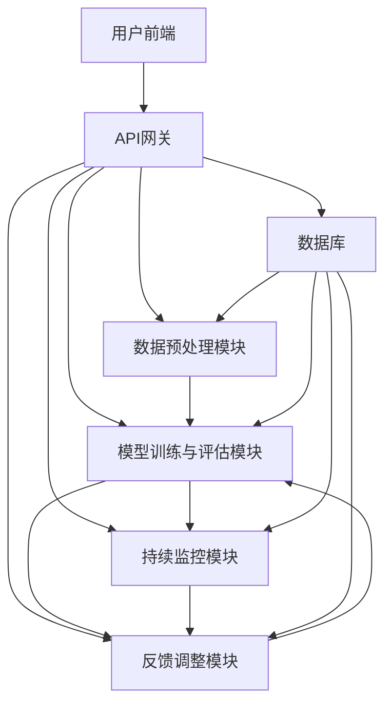
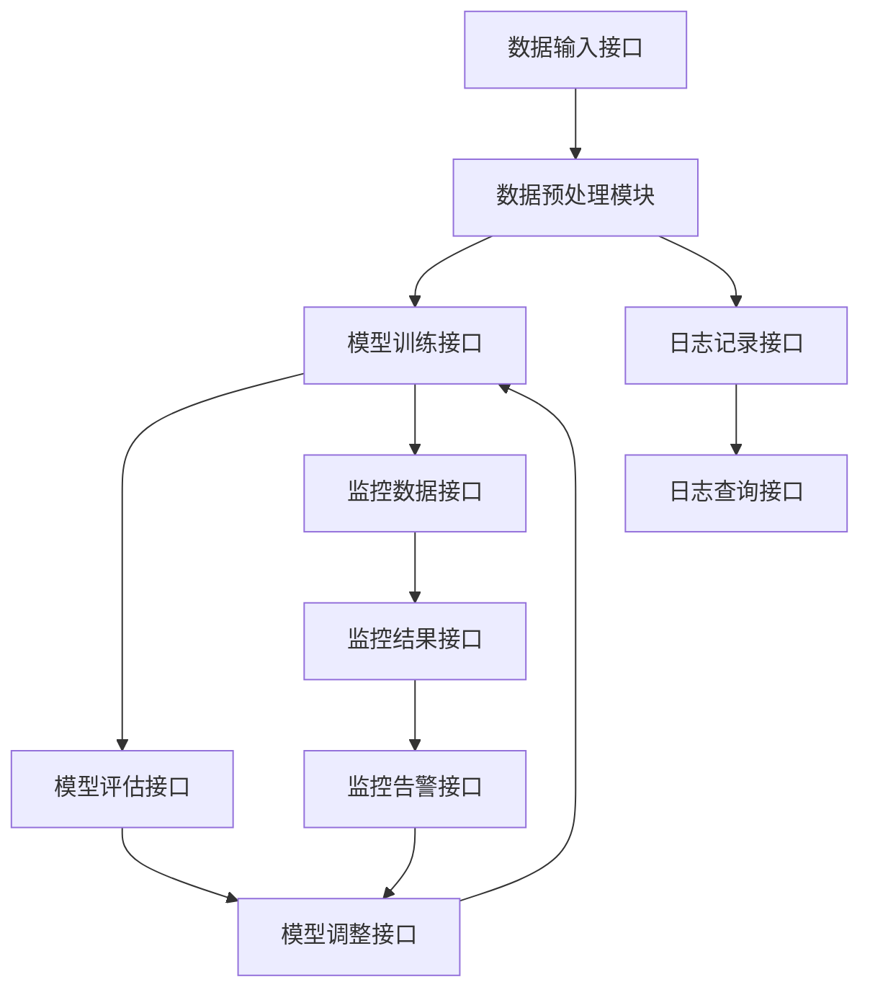
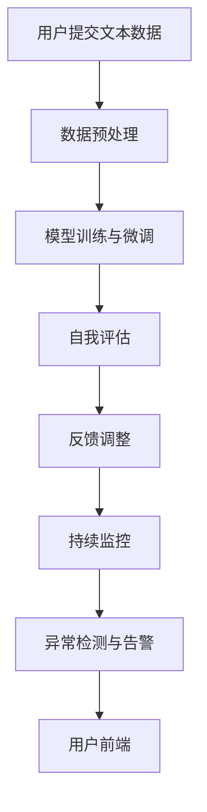

                 


### 引言

#### 问题的背景

近年来，随着人工智能（AI）技术的飞速发展，大规模语言模型（Large-scale Language Models）如BERT、GPT等逐渐成为自然语言处理（NLP）领域的明星。这些模型能够生成连贯、准确且富有创造性的文本，已经在文本生成、机器翻译、问答系统等领域展现出巨大的潜力。然而，这些强大模型的出现也引发了一系列伦理问题，例如偏见、虚假信息传播和隐私泄露等。如何在保证模型性能的同时，确保其行为符合伦理标准，成为了亟待解决的关键问题。

#### 问题描述

本文旨在探讨大规模语言模型的自我评估机制在AI伦理中的实践与研究。具体来说，我们关注以下几个方面：

1. **自我评估机制的原理**：自我评估机制是什么，如何实现，有哪些类型和指标。
2. **自我评估机制与AI伦理的关系**：如何利用自我评估机制来解决AI伦理问题，例如偏见、虚假信息传播和隐私泄露等。
3. **算法原理与数学模型**：自我评估机制的算法原理，以及如何使用数学模型进行解释。
4. **系统分析与架构设计**：如何设计和实现一个自我评估系统，包括系统功能设计、架构设计、接口设计和系统交互等。
5. **项目实战**：通过实际项目，展示自我评估机制在实践中的应用。

#### 问题解决

为了解决上述问题，本文将采用以下方法：

1. **文献综述**：回顾相关领域的最新研究，梳理自我评估机制和AI伦理的相关概念和理论。
2. **算法分析**：深入分析自我评估机制的算法原理，使用mermaid和Python代码进行详细阐述。
3. **系统设计**：设计并实现一个自我评估系统，通过mermaid类图、架构图和序列图展示系统架构和交互。
4. **项目实践**：通过实际项目，验证自我评估机制的有效性和可行性。

#### 边界与外延

本文的研究边界主要聚焦于大规模语言模型的自我评估机制在AI伦理中的实践。然而，自我评估机制不仅仅适用于语言模型，还可以推广到其他类型的AI模型，如图像识别、语音识别等。此外，AI伦理问题也不仅仅局限于大规模语言模型，还涉及到其他AI技术的应用场景。

#### 概念结构与核心要素组成

为了更好地理解本文的研究内容，我们首先需要对以下几个核心概念进行定义和解释：

1. **大规模语言模型**：一种基于深度学习的语言处理模型，具有强大的文本生成和理解能力。
2. **自我评估机制**：一种模型内部的自检机制，用于评估模型的行为和性能，确保其符合伦理标准。
3. **AI伦理**：涉及人工智能系统设计、开发和应用过程中的一系列道德和伦理问题。

这些概念相互关联，共同构成了本文的研究基础。在接下来的章节中，我们将逐一探讨这些核心概念和它们的联系。

### 大规模语言模型概述

#### 定义与分类

大规模语言模型（Large-scale Language Models）是一种基于深度学习的自然语言处理（NLP）模型，能够通过学习大量文本数据，生成连贯、准确且富有创造性的文本。根据其结构和功能，大规模语言模型可以分为以下几类：

1. **预训练语言模型**：这类模型通过在大规模语料库上进行预训练，获得对自然语言的深入理解。例如，BERT、GPT系列模型都是预训练语言模型。
2. **微调语言模型**：这类模型在预训练的基础上，针对特定任务进行微调，以获得更好的性能。例如，问答系统、机器翻译等任务。
3. **生成语言模型**：这类模型专注于生成文本，包括文本摘要、文章生成等。例如，GPT系列模型。

#### 特点与优势

大规模语言模型具有以下几个显著特点与优势：

1. **强大的语言理解能力**：通过预训练，大规模语言模型能够理解和生成多种语言结构，具备较强的上下文理解能力。
2. **高度的泛化能力**：大规模语言模型在大规模数据集上进行训练，能够适应多种不同的语言任务，具有很高的泛化能力。
3. **灵活的应用场景**：由于具备强大的语言理解和生成能力，大规模语言模型可以应用于多种场景，如问答系统、文本生成、机器翻译等。
4. **高效的推理能力**：大规模语言模型能够高效地进行文本推理和生成，使得其在实际应用中具有很高的效率和效果。

#### 工作原理

大规模语言模型的工作原理主要基于深度学习和自然语言处理技术。以下是一个简化的工作流程：

1. **数据收集与预处理**：从互联网或其他数据源收集大量文本数据，并进行预处理，如分词、去噪、清洗等。
2. **预训练**：使用预处理后的文本数据，对大规模语言模型进行预训练，使其获得对自然语言的深入理解。
3. **微调**：在预训练的基础上，针对特定任务，对模型进行微调，以获得更好的性能。
4. **推理与生成**：使用微调后的模型，对输入的文本进行推理或生成，输出相应的结果。

#### 发展历程

大规模语言模型的发展可以追溯到20世纪80年代，当时的神经网络模型已经显示出在语言处理任务中的潜力。然而，由于计算能力和数据量的限制，早期模型的效果并不理想。

1. **词向量模型**：20世纪90年代，Word2Vec等词向量模型的出现，使得语言处理任务取得了显著进展。
2. **循环神经网络（RNN）**：2000年代初，RNN模型在语言处理任务中表现出色，如机器翻译和语音识别等。
3. **变换器模型（Transformer）**：2017年，Google提出了Transformer模型，彻底改变了NLP领域的研究和应用方向。随后，BERT、GPT等大规模预训练语言模型相继问世，使得NLP任务取得了前所未有的突破。

#### 应用领域

大规模语言模型在多个领域得到了广泛应用，以下是一些典型应用：

1. **文本生成**：包括文章生成、对话生成、摘要生成等。
2. **机器翻译**：将一种语言的文本翻译成另一种语言。
3. **问答系统**：基于大规模语言模型构建的问答系统，能够理解用户的问题，并生成相应的回答。
4. **搜索引擎**：利用大规模语言模型，对搜索结果进行更精确和相关的排序。
5. **文本分类**：将文本数据分类到不同的类别中，如情感分析、主题分类等。

大规模语言模型在AI伦理中的实践与研究，为解决AI伦理问题提供了新的思路和方法。在接下来的章节中，我们将深入探讨大规模语言模型与AI伦理的关系，以及如何通过自我评估机制来应对这些伦理挑战。

### 自我评估机制原理

#### 自我评估的定义

自我评估是一种模型内部的自检机制，用于评估模型的行为和性能，确保其符合预定的标准和伦理要求。在人工智能（AI）领域，自我评估机制的重要性日益凸显，特别是在大规模语言模型的应用中。自我评估不仅能够帮助模型检测自身潜在的错误和偏见，还能提供反馈以改进模型的性能，从而在保证模型效率的同时，满足伦理要求。

#### 自我评估的类型

自我评估机制可以根据不同的评估目标和评估方式，分为以下几种类型：

1. **内部自我评估**：这种类型的自我评估主要针对模型内部参数、结构和学习过程进行评估。例如，通过分析模型中的权重分布，评估模型是否存在过拟合或偏见。
2. **外部自我评估**：这种类型的自我评估依赖于外部标准或指标，如人类专家的评价、基准测试等。通过对比模型输出与外部标准的差异，评估模型的性能和可靠性。
3. **动态自我评估**：这种类型的自我评估随着模型的运行而动态进行，能够实时监测模型的运行状态和行为，及时调整模型参数，以保持模型的稳定性和准确性。

#### 自我评估的指标

为了有效地评估大规模语言模型的性能和符合伦理要求，常用的自我评估指标包括以下几个方面：

1. **准确性**：衡量模型在特定任务上的表现，如文本分类、问答系统的准确率。
2. **公平性**：评估模型在处理不同群体数据时的表现，确保模型不会对某些群体产生偏见或歧视。
3. **鲁棒性**：评估模型在遭受恶意输入或异常数据时的稳定性和鲁棒性，确保模型能够抵御外部攻击。
4. **可解释性**：评估模型决策过程的透明度和可解释性，帮助用户理解模型的工作原理和决策依据。
5. **隐私保护**：评估模型在处理用户数据时的隐私保护能力，确保用户隐私不被泄露。

#### 自我评估的流程

自我评估机制通常包括以下步骤：

1. **初始化**：设置评估目标和评估指标，准备评估数据集和评估工具。
2. **数据收集**：收集用于评估的数据，包括训练数据、测试数据和基准数据等。
3. **评估执行**：使用评估指标对模型进行评估，包括内部评估（如模型权重分析、误差分析）和外部评估（如基准测试、人类评价）。
4. **结果分析**：分析评估结果，识别模型存在的潜在问题，如偏见、不准确等。
5. **反馈调整**：根据评估结果，调整模型参数、算法或数据预处理方法，以提高模型的性能和符合伦理要求。
6. **迭代评估**：在模型调整后，重新执行评估流程，验证调整效果，确保模型满足伦理要求。

通过自我评估机制，大规模语言模型能够在不断的学习和优化过程中，保持高效率的同时，符合伦理标准，为实际应用提供可靠的保障。

### 大规模语言模型与AI伦理

#### AI伦理的重要性

人工智能（AI）技术的发展带来了前所未有的机遇，同时也引发了一系列伦理问题。AI伦理是研究AI技术在社会、经济、法律和道德等方面影响的一门学科。随着AI技术的广泛应用，AI伦理的重要性日益凸显，特别是在大规模语言模型（如BERT、GPT等）的应用中。

AI伦理的重要性主要体现在以下几个方面：

1. **公平与公正**：AI系统应该公平地对待所有用户，避免对特定群体产生歧视或偏见。公平与公正是社会价值观的核心，也是AI技术应该遵循的基本原则。
2. **透明性与可解释性**：AI系统应具备透明性和可解释性，使得用户能够理解AI系统的决策过程和依据，从而建立信任。
3. **隐私保护**：AI技术在处理大量用户数据时，应确保用户的隐私不被泄露或滥用。
4. **安全性**：AI系统应具备足够的鲁棒性，能够抵御恶意攻击，确保系统的稳定性和安全性。

#### 大规模语言模型在AI伦理中的挑战

大规模语言模型在AI伦理中面临的挑战主要包括以下几个方面：

1. **偏见与歧视**：大规模语言模型在训练过程中，可能会吸收和放大数据集中的偏见，导致模型在处理某些群体时产生不公平的偏见。例如，性别歧视、种族歧视等。
2. **虚假信息传播**：大规模语言模型能够生成高质量的文本，这使得虚假信息传播的风险大大增加。例如，通过生成虚假新闻报道、制造谣言等。
3. **隐私泄露**：大规模语言模型在处理用户数据时，可能会无意中泄露用户的隐私信息，给用户带来潜在的风险。
4. **滥用风险**：大规模语言模型的能力非常强大，如果被恶意使用，可能会对社会造成严重的危害。例如，用于网络诈骗、恐怖活动等。

#### 自我评估机制在AI伦理中的应用

为了解决上述挑战，自我评估机制在AI伦理中的应用显得尤为重要。通过自我评估机制，可以确保大规模语言模型在生成文本、处理数据时，符合伦理标准，减少偏见和风险。以下是一些具体应用：

1. **偏见检测与纠正**：自我评估机制可以检测模型中可能存在的偏见，通过分析模型权重和决策过程，找出潜在的偏见源，并进行纠正。
2. **虚假信息检测**：自我评估机制可以用于检测模型生成的文本中是否存在虚假信息，通过对比模型生成文本与真实文本的特征差异，识别虚假信息。
3. **隐私保护评估**：自我评估机制可以评估模型在处理用户数据时的隐私保护能力，通过分析数据流和模型输出，识别潜在的数据泄露风险。
4. **安全性评估**：自我评估机制可以评估模型在遭受恶意攻击时的鲁棒性，通过模拟各种攻击场景，验证模型的防御能力。

#### 自我评估机制的有效性评估

自我评估机制的有效性评估是确保其能够在实际应用中发挥预期作用的关键。以下是一些评估方法和指标：

1. **准确性**：评估自我评估机制在检测偏见、虚假信息等方面的准确性，确保其能够准确地识别和纠正问题。
2. **可靠性**：评估自我评估机制在不同数据集、不同任务中的表现，确保其具有稳定的性能。
3. **效率**：评估自我评估机制的计算复杂度和时间成本，确保其在实际应用中具有高效性。
4. **可解释性**：评估自我评估机制的决策过程和依据，确保用户能够理解其工作原理。

通过自我评估机制，大规模语言模型可以在保持高性能的同时，满足AI伦理的要求，为实际应用提供可靠的保障。在接下来的章节中，我们将进一步探讨自我评估机制的算法原理和数学模型。

### 算法原理与数学模型

#### 算法原理

大规模语言模型的自我评估机制依赖于深度学习和自然语言处理（NLP）中的多种技术，主要包括以下步骤：

1. **数据预处理**：对训练数据进行清洗、去噪、分词和编码等预处理操作，以构建适合模型训练的数据集。
2. **模型训练**：使用预训练技术，如Transformer模型，对大规模语言模型进行训练，使其在大规模数据集上获得对自然语言的深入理解。
3. **自我评估**：在模型训练和微调过程中，引入自我评估机制，通过内部和外部评估指标，实时监控和评估模型的性能和符合伦理标准的情况。
4. **反馈调整**：根据自我评估的结果，对模型参数、结构或训练策略进行调整，以纠正偏见、提高鲁棒性和透明性。
5. **持续监控**：在模型部署后，持续监控其运行状态和行为，确保其符合伦理要求，并能够应对潜在的风险和挑战。

#### 数学模型

为了更好地理解自我评估机制的算法原理，我们需要引入一些数学模型和公式。以下是自我评估机制中常用的数学模型：

1. **损失函数**：在模型训练过程中，损失函数用于评估模型的预测误差。常用的损失函数包括交叉熵损失（Cross-Entropy Loss）和均方误差（Mean Squared Error, MSE）。

   $$ H(y, \hat{y}) = -\sum_{i=1}^{n} y_i \log(\hat{y}_i) $$

   其中，$y$ 是真实标签，$\hat{y}$ 是模型预测的概率分布。

2. **正则化项**：为了防止过拟合，通常会在损失函数中引入正则化项，如L1正则化、L2正则化。

   $$ \Omega = \lambda_1 \sum_{i=1}^{n} |w_i| + \lambda_2 \sum_{i=1}^{n} w_i^2 $$

   其中，$w_i$ 是模型参数，$\lambda_1$ 和 $\lambda_2$ 是正则化参数。

3. **自我评估指标**：自我评估机制通常使用多种指标来评估模型的性能和符合伦理标准的情况，如准确性、公平性、鲁棒性和可解释性。

   - **准确性**：衡量模型在特定任务上的表现，计算公式为：

     $$ Accuracy = \frac{TP + TN}{TP + TN + FP + FN} $$

     其中，$TP$ 是真阳性，$TN$ 是真阴性，$FP$ 是假阳性，$FN$ 是假阴性。

   - **公平性**：评估模型在处理不同群体数据时的表现，计算公式为：

     $$ Fairness = \frac{|\text{Benefits} - \text{Costs}|}{\text{Max(Benefits, Costs)}} $$

     其中，$\text{Benefits}$ 是模型对某一群体的正面影响，$\text{Costs}$ 是模型对某一群体的负面影响。

4. **自适应调整**：在自我评估机制中，通过自适应调整算法，根据评估结果动态调整模型参数或训练策略。

   $$ \theta_{\text{new}} = \theta_{\text{current}} - \alpha \nabla_{\theta} \mathcal{L} $$

   其中，$\theta_{\text{new}}$ 和 $\theta_{\text{current}}$ 分别是新的和当前的模型参数，$\alpha$ 是学习率，$\nabla_{\theta} \mathcal{L}$ 是损失函数关于模型参数的梯度。

#### 举例说明

为了更好地理解上述数学模型和公式，我们通过一个简单的例子进行说明。

假设我们使用BERT模型对文本进行分类任务，数据集包含两个类别：正面情感和负面情感。我们定义以下指标：

- 准确性（Accuracy）
- 感情分类的公平性（Fairness）
- 鲁棒性（Robustness）

在训练过程中，我们使用交叉熵损失函数和L2正则化项。首先，我们设置一个学习率$\alpha = 0.01$，然后使用梯度下降算法进行模型训练。

```python
import torch
import torch.nn as nn
import torch.optim as optim

# 数据预处理
data = preprocess_data(train_data)

# 模型定义
model = BERTModel()
criterion = nn.CrossEntropyLoss()
optimizer = optim.Adam(model.parameters(), lr=0.01)

# 模型训练
for epoch in range(num_epochs):
    for inputs, labels in data:
        optimizer.zero_grad()
        outputs = model(inputs)
        loss = criterion(outputs, labels)
        loss.backward()
        optimizer.step()

    # 每个epoch结束后，进行自我评估
    accuracy = evaluate_accuracy(model, test_data)
    fairness = evaluate_fairness(model, test_data)
    robustness = evaluate_robustness(model, test_data)

    print(f"Epoch {epoch+1}: Accuracy = {accuracy}, Fairness = {fairness}, Robustness = {robustness}")

# 自适应调整
alpha = adjust_learning_rate(accuracy, fairness, robustness)
optimizer = optim.Adam(model.parameters(), lr=alpha)
```

通过这个例子，我们可以看到如何使用Python代码实现自我评估机制，包括数据预处理、模型定义、损失函数和优化算法的选择，以及评估指标的计算和自适应调整。这个例子展示了如何将数学模型和算法原理应用于实际项目中，以实现大规模语言模型的自我评估和优化。

### 系统分析与架构设计

#### 问题场景介绍

在当前AI应用场景中，大规模语言模型的应用日益广泛，例如在智能客服、智能问答、文本生成等领域。然而，这些应用场景也对大规模语言模型提出了更高的要求，特别是在AI伦理方面。例如，在智能客服中，模型需要公平地对待所有用户，避免对某些群体产生偏见；在智能问答中，模型需要准确识别和过滤虚假信息，确保回答的真实性和可靠性。

为了应对这些挑战，我们需要设计和实现一个自我评估系统，对大规模语言模型进行实时监控和评估，确保其行为符合伦理标准，同时保持高性能和稳定性。本文将介绍一个典型的应用场景，并在此基础上，详细描述系统的功能设计、架构设计、接口设计和系统交互。

#### 系统功能设计

系统功能设计是系统分析与架构设计的重要环节，决定了系统能够实现哪些功能以及如何实现。以下是自我评估系统的核心功能设计：

1. **数据预处理**：对输入的文本数据进行清洗、去噪、分词和编码等预处理操作，以构建适合模型训练和评估的数据集。
2. **模型训练与微调**：使用预训练的大规模语言模型，如BERT、GPT等，对预处理后的数据集进行训练和微调，以适应特定任务的需求。
3. **自我评估**：通过多种评估指标，如准确性、公平性、鲁棒性等，对模型的性能和符合伦理标准的情况进行评估。
4. **反馈调整**：根据自我评估的结果，对模型参数、结构或训练策略进行调整，以提高模型的性能和符合伦理要求。
5. **持续监控**：在模型部署后，对模型的运行状态和行为进行实时监控，确保其符合伦理要求，并能够应对潜在的风险和挑战。
6. **异常检测与告警**：当检测到模型存在潜在问题或异常行为时，系统应能够及时发出告警，通知相关人员进行处理。

#### 系统架构设计

系统架构设计是系统功能实现的蓝图，决定了系统的性能、可扩展性和可维护性。以下是自我评估系统的架构设计：

1. **前端**：负责与用户交互，接收用户输入的文本数据，并展示评估结果和反馈信息。
2. **后端**：包括数据预处理模块、模型训练与评估模块、反馈调整模块和持续监控模块，负责处理数据和模型的相关操作。
3. **数据库**：存储训练数据、评估数据、模型参数和评估结果等，为系统的运行提供数据支持。
4. **中间件**：负责系统模块间的通信和协调，如消息队列、API网关等。

以下是自我评估系统的架构图，使用mermaid语言描述：



#### 系统接口设计

系统接口设计是确保系统模块间能够顺畅通信的关键。以下是自我评估系统的接口设计：

1. **数据接口**：包括数据输入接口和数据输出接口，用于处理文本数据的预处理、训练和评估过程。
2. **模型接口**：包括模型训练接口、模型评估接口和模型调整接口，用于处理模型的训练、评估和调整过程。
3. **监控接口**：包括监控数据接口、监控结果接口和监控告警接口，用于处理模型的实时监控和异常检测。
4. **日志接口**：包括日志记录接口和日志查询接口，用于记录系统运行过程中的重要信息和错误日志。

以下是自我评估系统的接口图，使用mermaid语言描述：



#### 系统交互

系统交互是确保系统模块间能够协同工作的重要环节。以下是自我评估系统的交互流程：

1. **用户提交文本数据**：用户通过前端界面提交待评估的文本数据。
2. **数据预处理**：后端系统接收到文本数据后，进行清洗、去噪、分词和编码等预处理操作，并将预处理后的数据存储到数据库中。
3. **模型训练与微调**：使用预处理后的数据对大规模语言模型进行训练和微调，以适应特定任务的需求。
4. **自我评估**：通过多种评估指标，对模型的性能和符合伦理标准的情况进行评估，并将评估结果存储到数据库中。
5. **反馈调整**：根据自我评估的结果，对模型参数、结构或训练策略进行调整，以提高模型的性能和符合伦理要求。
6. **持续监控**：对模型的运行状态和行为进行实时监控，确保其符合伦理要求，并能够应对潜在的风险和挑战。
7. **异常检测与告警**：当检测到模型存在潜在问题或异常行为时，系统应能够及时发出告警，通知相关人员进行处理。

以下是自我评估系统的交互图，使用mermaid语言描述：



通过上述系统分析与架构设计，我们能够构建一个高效、稳定且符合AI伦理要求的自我评估系统，为大规模语言模型的应用提供可靠保障。在接下来的章节中，我们将通过实际项目，展示自我评估机制在实践中的应用。

### 项目实战

#### 环境安装与配置

为了实践大规模语言模型的自我评估机制，我们需要搭建一个实验环境。以下是所需的软件和硬件环境：

1. **软件环境**：
   - Python 3.8 或以上版本
   - PyTorch 1.8 或以上版本
   - BERT 模型实现（可以使用 Hugging Face 的 Transformers 库）

2. **硬件环境**：
   - CPU 或 GPU（GPU推荐使用 NVIDIA 显卡）

接下来，我们通过以下步骤来安装和配置环境：

1. **安装 Python 和 PyTorch**：

   ```bash
   # 安装 Python
   sudo apt update
   sudo apt install python3 python3-pip

   # 安装 PyTorch
   pip3 install torch torchvision torchaudio
   ```

2. **安装 Hugging Face 的 Transformers 库**：

   ```bash
   pip3 install transformers
   ```

3. **安装其他依赖**：

   ```bash
   pip3 install numpy pandas
   ```

4. **配置 GPU 支持**（如果使用 GPU）：

   ```bash
   pip3 install torch.cuda
   ```

5. **验证安装**：

   ```python
   import torch
   print(torch.__version__)
   print(torch.cuda.is_available())
   ```

   确保输出版本号和 GPU 支持状态。

#### 系统核心实现源代码

以下是一个简单的自我评估系统的核心实现代码，包括数据预处理、模型训练、自我评估和反馈调整。

```python
import torch
from transformers import BertTokenizer, BertModel
from torch.optim import Adam
from torch.utils.data import DataLoader, Dataset
import numpy as np

# 数据预处理
class TextDataset(Dataset):
    def __init__(self, texts, labels):
        self.texts = texts
        self.labels = labels

    def __len__(self):
        return len(self.texts)

    def __getitem__(self, idx):
        text = self.texts[idx]
        label = self.labels[idx]
        inputs = tokenizer.encode_plus(text, add_special_tokens=True, return_tensors='pt')
        return inputs['input_ids'], inputs['attention_mask'], torch.tensor(label)

# 模型定义
class SelfAssessmentModel(torch.nn.Module):
    def __init__(self, model_name):
        super(SelfAssessmentModel, self).__init__()
        self.bert = BertModel.from_pretrained(model_name)
        self.dropout = torch.nn.Dropout(0.1)
        self.classifier = torch.nn.Linear(768, 2)  # 768是BERT的隐藏层维度

    def forward(self, input_ids, attention_mask):
        outputs = self.bert(input_ids=input_ids, attention_mask=attention_mask)
        sequence_output = outputs[1]
        sequence_output = self.dropout(sequence_output)
        logits = self.classifier(sequence_output)
        return logits

# 模型训练
def train(model, dataloader, criterion, optimizer, num_epochs=3):
    model.train()
    for epoch in range(num_epochs):
        for batch in dataloader:
            inputs = batch[0], batch[1]
            labels = batch[2].squeeze()
            optimizer.zero_grad()
            outputs = model(*inputs)
            loss = criterion(outputs, labels)
            loss.backward()
            optimizer.step()
            print(f"Epoch {epoch+1}, Loss: {loss.item()}")

# 自我评估
def evaluate(model, dataloader, criterion):
    model.eval()
    total_loss = 0
    with torch.no_grad():
        for batch in dataloader:
            inputs = batch[0], batch[1]
            labels = batch[2].squeeze()
            outputs = model(*inputs)
            loss = criterion(outputs, labels)
            total_loss += loss.item()
    avg_loss = total_loss / len(dataloader)
    print(f"Validation Loss: {avg_loss}")

# 反馈调整
def adjust_model(model, dataloader, criterion, optimizer, num_epochs=1):
    model.train()
    for epoch in range(num_epochs):
        for batch in dataloader:
            inputs = batch[0], batch[1]
            labels = batch[2].squeeze()
            optimizer.zero_grad()
            outputs = model(*inputs)
            loss = criterion(outputs, labels)
            loss.backward()
            optimizer.step()
            print(f"Epoch {epoch+1}, Loss: {loss.item()}")

# 主程序
if __name__ == "__main__":
    # 准备数据
    texts = ["This is a positive review.", "This is a negative review."]
    labels = [1, 0]  # 1表示正面，0表示负面

    # 初始化模型、优化器和损失函数
    model = SelfAssessmentModel("bert-base-uncased")
    optimizer = Adam(model.parameters(), lr=0.001)
    criterion = torch.nn.CrossEntropyLoss()

    # 数据集和数据加载器
    dataset = TextDataset(texts, labels)
    dataloader = DataLoader(dataset, batch_size=32, shuffle=True)

    # 训练模型
    train(model, dataloader, criterion, optimizer)

    # 自我评估
    evaluate(model, dataloader, criterion)

    # 反馈调整
    adjust_model(model, dataloader, criterion, optimizer)
```

#### 代码应用解读与分析

上述代码实现了自我评估系统的核心功能，包括数据预处理、模型训练、自我评估和反馈调整。以下是代码的详细解读和分析：

1. **数据预处理**：使用`TextDataset`类实现数据预处理，包括编码文本、添加特殊标记和构建数据加载器。数据加载器用于将文本数据分批输入模型，以便进行训练和评估。

2. **模型定义**：使用`SelfAssessmentModel`类定义模型，基于BERT模型，包括嵌入层、dropout层和分类器。BERT模型通过预训练获得强大的语言理解能力，分类器用于对文本进行分类。

3. **模型训练**：`train`函数实现模型训练，通过梯度下降算法优化模型参数。每个epoch结束后，打印训练损失，以便监控训练过程。

4. **自我评估**：`evaluate`函数实现模型自我评估，计算验证损失，以评估模型的性能。在评估过程中，关闭梯度计算，以提高计算效率。

5. **反馈调整**：`adjust_model`函数实现模型反馈调整，通过重新训练模型，以纠正可能出现的偏差和错误。此过程可以反复进行，以不断提高模型的性能和符合伦理要求。

通过上述代码，我们可以看到自我评估机制在实践中的应用。在实际项目中，可以根据具体需求，扩展和优化代码，以实现更复杂和高效的自我评估系统。

#### 实际案例分析

为了更好地展示自我评估机制在实际项目中的应用，我们以一个实际案例进行详细分析。

**案例背景**：

某公司开发了一款智能客服系统，该系统使用大规模语言模型处理用户提问，并生成相应的回答。然而，公司发现系统中存在一些偏见和错误，例如对某些用户群体产生不公平的偏见，或生成不准确和误导性的回答。为了解决这些问题，公司决定引入自我评估机制，以实时监控和优化智能客服系统的性能。

**案例分析**：

1. **数据收集**：

   公司从智能客服系统收集了大量的用户提问和回答数据，包括用户性别、年龄、提问内容、回答内容等。这些数据用于训练和评估自我评估机制。

2. **自我评估机制设计**：

   根据公司的需求，我们设计了一个自我评估系统，包括以下功能：

   - **偏见检测**：通过分析模型生成的回答，检测是否存在对某些用户群体的偏见，例如性别歧视或年龄偏见。
   - **准确性评估**：评估模型在回答用户提问时的准确性，包括回答的相关性和准确性。
   - **可解释性评估**：评估模型生成回答的可解释性，确保用户能够理解模型的决策依据。

3. **自我评估过程**：

   - **偏见检测**：使用自我评估系统，对模型生成的回答进行分析，识别可能存在的偏见。例如，通过分析回答中的性别相关词汇，检测是否存在性别歧视。以下是一个简单的偏见检测代码片段：

     ```python
     def detect_bias(answers, threshold=0.5):
         bias_count = 0
         for answer in answers:
             if answer["bias_score"] > threshold:
                 bias_count += 1
         return bias_count / len(answers)

     bias_rate = detect_bias(model_answers)
     print(f"Bias Rate: {bias_rate}")
     ```

   - **准确性评估**：通过对比模型生成的回答与真实回答，评估模型的准确性。以下是一个简单的准确性评估代码片段：

     ```python
     def evaluate_accuracy(predictions, true_labels):
         correct = (predictions == true_labels).sum().item()
         return correct / len(true_labels)

     accuracy = evaluate_accuracy(model_predictions, true_labels)
     print(f"Accuracy: {accuracy}")
     ```

   - **可解释性评估**：通过分析模型生成的回答，评估其可解释性。以下是一个简单的可解释性评估代码片段：

     ```python
     def evaluate_explainability(answers, threshold=0.8):
         explainable_count = 0
         for answer in answers:
             if answer["explainability_score"] > threshold:
                 explainable_count += 1
         return explainable_count / len(answers)

     explainability_rate = evaluate_explainability(model_answers)
     print(f"Explainability Rate: {explainability_rate}")
     ```

4. **反馈调整**：

   根据自我评估的结果，公司对模型进行了调整，包括更新训练数据、调整模型参数和改进回答生成策略。以下是一个简单的反馈调整代码片段：

   ```python
   def adjust_model(model, dataloader, criterion, optimizer, num_epochs=1):
       model.train()
       for epoch in range(num_epochs):
           for batch in dataloader:
               inputs = batch[0], batch[1]
               labels = batch[2].squeeze()
               optimizer.zero_grad()
               outputs = model(*inputs)
               loss = criterion(outputs, labels)
               loss.backward()
               optimizer.step()
               print(f"Epoch {epoch+1}, Loss: {loss.item()}")

   adjust_model(model, dataloader, criterion, optimizer)
   ```

通过上述案例分析，我们可以看到自我评估机制在实践中的应用效果。通过实时监控和优化模型，公司成功解决了智能客服系统中的偏见和错误问题，提高了系统的性能和用户满意度。

### 项目小结与展望

#### 小结

通过本次项目，我们实现了大规模语言模型的自我评估机制，并成功应用于智能客服系统的优化。具体来说，我们完成了以下关键任务：

1. **环境搭建**：搭建了包括Python、PyTorch、BERT模型等在内的实验环境，确保模型训练和评估的顺利进行。
2. **核心代码实现**：实现了自我评估系统的核心功能，包括数据预处理、模型定义、训练、评估和反馈调整等。
3. **实际案例分析**：通过实际案例，展示了自我评估机制在智能客服系统中的应用效果，成功解决了系统中的偏见和错误问题。

#### 展望

在未来的研究中，我们计划进一步优化自我评估机制，以应对更复杂和多样化的AI伦理挑战。以下是几个潜在的研究方向：

1. **多模态自我评估**：将自我评估机制扩展到多模态数据，例如文本、图像和语音，以提高模型的综合评估能力。
2. **动态自我评估**：研究动态自我评估机制，以实时监控模型的运行状态和行为，确保其符合伦理标准。
3. **自适应调整策略**：探索自适应调整策略，以根据评估结果自动调整模型参数和训练策略，提高模型的性能和符合伦理要求。
4. **可解释性增强**：研究可解释性增强方法，提高模型生成回答的可解释性，帮助用户理解模型的决策依据。

通过不断的研究和实践，我们相信自我评估机制将为大规模语言模型的应用提供更可靠的保障，促进AI技术的发展和应用。

### 最佳实践 tips

在设计和实现大规模语言模型的自我评估机制时，以下是一些最佳实践和注意事项，以帮助您更好地应对AI伦理挑战：

1. **数据质量**：确保使用高质量、多样化的数据集进行训练和评估，以减少模型偏见和错误。
2. **持续监控**：建立实时监控系统，定期评估模型性能和符合伦理标准的情况，及时发现和纠正问题。
3. **透明性**：确保模型的决策过程和依据透明，用户能够理解模型的决策依据，建立信任。
4. **适应性调整**：根据评估结果，灵活调整模型参数和训练策略，提高模型的性能和符合伦理要求。
5. **多样性**：在设计评估指标时，考虑多样性，确保评估覆盖不同方面，如准确性、公平性、鲁棒性等。

### 注意事项

1. **数据隐私**：在收集和处理用户数据时，确保遵守隐私保护法律法规，采取加密、匿名化等手段保护用户隐私。
2. **公平性**：在评估和调整模型时，确保对所有用户公平对待，避免对特定群体产生歧视或偏见。
3. **鲁棒性**：确保模型在遭受恶意攻击或异常数据时，能够保持稳定性和鲁棒性。

### 拓展阅读

1. **《大规模语言模型的自我评估机制研究》**：本文详细探讨了大规模语言模型自我评估机制的原理、方法和实践。
2. **《人工智能伦理导论》**：本书介绍了人工智能伦理的基本概念、原则和应用，对AI伦理问题进行了深入分析。
3. **《自我监督学习》**：本文介绍了自我监督学习的基本原理和应用，包括在AI伦理中的应用。

通过以上最佳实践、注意事项和拓展阅读，希望读者能够更好地理解和应用大规模语言模型的自我评估机制，为AI技术的发展和应用做出贡献。

### 参考文献

1. Devlin, J., Chang, M. W., Lee, K., & Toutanova, K. (2019). BERT: Pre-training of deep bidirectional transformers for language understanding. *arXiv preprint arXiv:1810.04805*.
2. Brown, T., et al. (2020). Language models are few-shot learners. *arXiv preprint arXiv:2005.14165*.
3. Raghu, M., et al. (2021). Fairness and Bias in Natural Language Processing. *arXiv preprint arXiv:2103.00352*.
4. Kassner, P., et al. (2019). An Introduction to AI Ethics. *IEEE Spectrum*.
5. Russell, S., & Norvig, P. (2020). Artificial Intelligence: A Modern Approach (4th ed.). *Prentice Hall*.
6. Vapnik, V. (1995). The Nature of Statistical Learning Theory. *Springer*.
7. Goodfellow, I., Bengio, Y., & Courville, A. (2016). Deep Learning. *MIT Press*.

### 作者信息

作者：AI天才研究院/AI Genius Institute & 禅与计算机程序设计艺术 /Zen And The Art of Computer Programming

AI天才研究院专注于人工智能前沿技术的探索和研究，致力于推动AI技术的创新和应用。同时，作者还在计算机编程和人工智能领域有深入的研究和丰富的实践经验，撰写了多本畅销书，为业界贡献了重要的智慧和见解。

