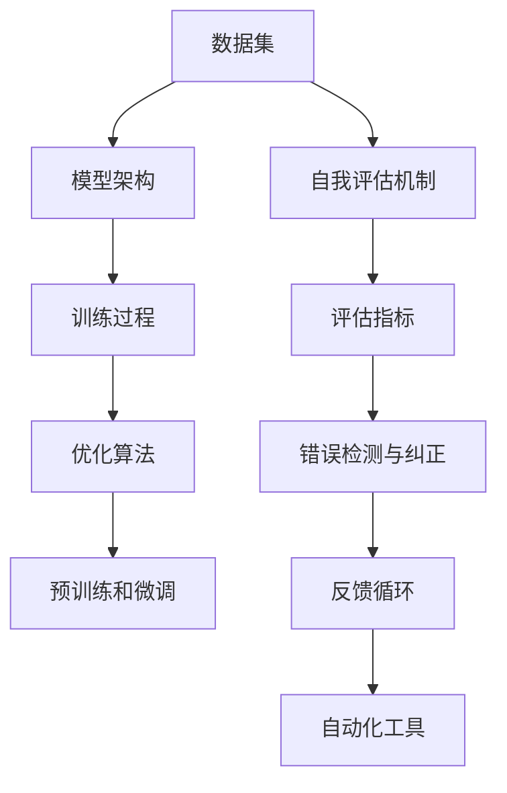
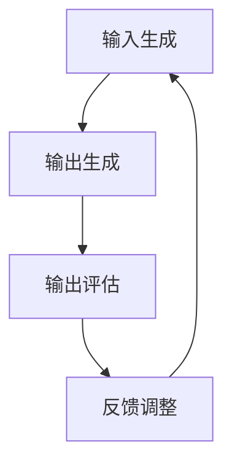
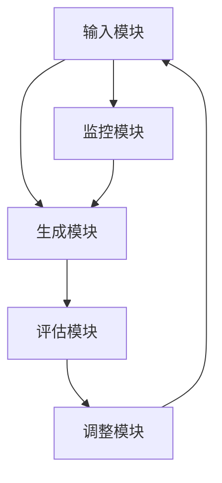
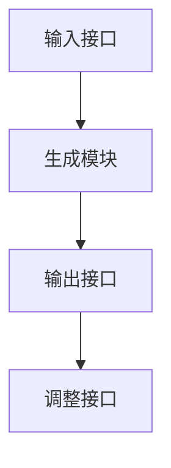

                 

### 1.1 问题背景

#### 1.1.1 AI系统可靠性问题的重要性

随着人工智能（AI）技术的迅猛发展，其在各个领域的应用日益广泛，从智能助手到自动驾驶，从医疗诊断到金融分析，AI系统已经深刻地改变了我们的生活方式。然而，AI系统的可靠性问题也愈发凸显。可靠性，即一个系统在规定条件下和规定时间内，无故障地完成预定功能的概率。对于AI系统而言，可靠性不仅仅是功能上的正确性，还涉及到算法的稳定性、模型的泛化能力以及系统的安全性和鲁棒性。

在工业生产中，AI系统的可靠性直接影响到生产效率和产品质量。例如，自动化生产线中的AI控制系统若出现故障，可能导致生产中断，造成巨大的经济损失。在医疗领域，AI诊断系统的可靠性则直接关系到患者的生命安全，任何一点偏差都可能导致严重的后果。金融领域，AI交易系统的高可靠性是保障金融市场稳定运行的关键。

#### 1.1.2 大规模语言模型的发展与应用

大规模语言模型是近年来AI领域的一项重要进展，其通过处理海量语言数据，可以生成高质量的自然语言文本，被广泛应用于机器翻译、文本摘要、问答系统以及自动写作等多个领域。以GPT-3为代表的大规模语言模型，展示了强大的文本生成能力，能够生成与人类写作风格相似的高质量文本，极大地提升了AI在自然语言处理领域的应用价值。

然而，大规模语言模型的可靠性同样面临诸多挑战。首先，模型在处理新领域或新问题时，可能由于数据不足或数据偏差而导致结果不准确。其次，模型在生成文本时，可能会产生逻辑错误或语义歧义，特别是在复杂语境下。此外，模型在处理敏感信息时，存在泄露隐私的风险，这也对模型的可靠性提出了更高要求。

#### 1.1.3 自我评估机制的概念与需求

自我评估机制是一种用于评估系统性能和可靠性的方法，其核心思想是通过系统自身的功能来检测和评估系统的状态。在AI系统中，自我评估机制尤为重要，因为AI系统往往具有高度复杂性和动态变化性，外部评估方法可能无法完全覆盖所有情况。

自我评估机制在大规模语言模型中的应用主要体现在以下几个方面：

1. **内部一致性评估**：通过评估模型输出结果之间的内部一致性来检测模型的稳定性。
2. **错误检测与纠正**：在生成文本的过程中，通过自我评估机制实时检测并纠正潜在的错误。
3. **泛化能力评估**：通过在多个不同领域和任务上的评估，检测模型的泛化能力。
4. **安全性评估**：在处理敏感信息时，评估模型是否能够遵守隐私保护原则。

自我评估机制的需求源于以下几点：

1. **提高模型可靠性**：通过自我评估，可以及时发现和纠正错误，提高模型的可靠性。
2. **增强用户信任**：用户对AI系统的信任很大程度上依赖于系统的可靠性，自我评估机制可以增强用户对系统的信任。
3. **降低维护成本**：自我评估机制可以减少对人工评估的依赖，降低系统的维护成本。
4. **适应动态环境**：AI系统需要能够适应不断变化的环境和任务，自我评估机制有助于模型在动态环境中保持性能。

总的来说，自我评估机制是提高大规模语言模型可靠性的一项重要技术，其在AI系统中的应用具有重要意义。

### 1.2 问题描述

#### 1.2.1 大规模语言模型的可靠性挑战

大规模语言模型作为一种高度复杂的人工智能系统，其可靠性面临诸多挑战。以下是一些主要的挑战：

1. **数据偏差与泛化能力**：大规模语言模型的性能依赖于训练数据的质量和多样性。如果训练数据存在偏差或不足，模型在处理新领域或新问题时可能产生不准确的结果。泛化能力是指模型在未见过的数据上表现良好的能力，这是评估模型可靠性的重要指标。

2. **模型稳定性与一致性**：大规模语言模型在生成文本时，可能会受到噪声数据或参数微调的影响，导致结果不一致。这种不一致性可能源于模型内部复杂的非线性关系和高度优化的参数。

3. **错误传播与累积**：在文本生成过程中，一旦模型产生错误，这些错误可能会被放大和传播，导致最终输出结果严重偏离预期。这种错误累积效应对于模型可靠性构成了严重威胁。

4. **安全性风险**：大规模语言模型在处理敏感信息时，存在泄露隐私的风险。例如，模型可能会在文本生成过程中无意中透露用户信息，或者被恶意攻击者利用来生成虚假信息。

5. **环境影响与鲁棒性**：AI系统的可靠性不仅依赖于模型本身，还受到外部环境的影响。例如，硬件故障、网络延迟、数据噪声等都可能影响模型的性能和可靠性。

#### 1.2.2 自我评估机制的目标与要求

自我评估机制旨在通过系统自身的功能，对模型性能和可靠性进行实时评估和反馈，以确保模型在高动态、复杂环境下保持稳定和可靠。以下是自我评估机制需要实现的主要目标和要求：

1. **全面性**：自我评估机制需要覆盖模型在不同维度上的性能评估，包括文本生成质量、模型稳定性、泛化能力以及安全性等方面。

2. **实时性**：自我评估机制应具备实时评估能力，能够迅速检测并反馈模型状态，以便及时纠正错误或调整模型参数。

3. **自动化**：自我评估机制应尽可能自动化，减少对人工干预的依赖，以提高评估效率和降低维护成本。

4. **可解释性**：自我评估机制需要提供可解释的评估结果，帮助用户理解模型的性能和可靠性，并识别潜在的问题。

5. **适应性**：自我评估机制应具备适应不同场景和任务的能力，能够根据实际需求进行调整和优化。

6. **可扩展性**：自我评估机制应具备良好的扩展性，能够支持新评估指标和方法的应用，以适应未来技术的发展。

通过实现上述目标，自我评估机制可以有效提高大规模语言模型的可靠性，增强用户对AI系统的信任，促进AI技术的广泛应用。

### 1.3 问题解决

#### 1.3.1 自我评估机制的基本原理

自我评估机制是基于模型自身的功能来检测和评估其性能和可靠性的一种方法。其基本原理可以概括为以下几个步骤：

1. **输入生成**：首先，模型生成一组测试输入，这些输入应覆盖模型可能遇到的多种场景和任务，以确保评估的全面性。

2. **输出评估**：对于每个输入，模型生成相应的输出结果，然后使用预设的评估指标对这些输出结果进行评估。

3. **结果反馈**：根据评估结果，模型生成反馈信号，这些信号可以是定量指标，如准确率、召回率等，也可以是定性描述，如文本生成质量、模型稳定性等。

4. **错误检测与纠正**：如果评估结果显示模型存在错误或异常，自我评估机制会触发错误检测和纠正机制，以识别和修正错误。

5. **模型优化**：基于反馈信号，模型会调整内部参数或结构，以提高其性能和可靠性。

自我评估机制的核心在于其实时性和自动化，通过不断循环上述步骤，模型可以实现对自身状态的持续监测和优化，从而提高系统的稳定性和可靠性。

#### 1.3.2 现有的自我评估方法分析

目前，已有多种自我评估方法被应用于大规模语言模型的可靠性验证。以下是一些常见的方法及其特点：

1. **基于统计的评估方法**：
   - **交叉验证**：通过将数据集划分为训练集和测试集，多次训练和评估模型，以评估模型的泛化能力。优点是方法简单，易于实现，但可能无法覆盖所有可能的情况。
   - **K折交叉验证**：类似于交叉验证，但将数据集划分为K个子集，每次使用一个子集作为测试集，其余子集作为训练集。这种方法可以提供更准确的评估结果，但计算成本较高。

2. **基于人工评估的方法**：
   - **人工审计**：由专业人员对模型生成的输出结果进行评估，以检测潜在的错误或异常。优点是评估结果更直观，但耗时且成本高。
   - **众包评估**：通过将评估任务分配给多个参与者，以获得更广泛的评估结果。这种方法可以提高评估的效率，但可能受到参与者技术水平的影响。

3. **基于自动评估的方法**：
   - **错误检测算法**：如拼写检查、语法分析等，用于检测文本中的错误。优点是速度快，但可能无法覆盖所有类型的错误。
   - **对比评估**：通过对比模型生成结果与人类生成结果，评估模型的性能。这种方法可以提供定量的评估结果，但可能受到人类标准的影响。

4. **基于模型监控的方法**：
   - **监控指标**：如模型输出结果的多样性、稳定性等，用于评估模型的可靠性。优点是实时性和自动化，但需要精心设计和调整监控指标。

总结来看，不同的自我评估方法各有优缺点，应根据实际需求和应用场景选择合适的评估方法。在实际应用中，可以结合多种评估方法，以提高评估的全面性和准确性。

### 1.4 边界与外延

#### 1.4.1 自我评估机制的适用范围

自我评估机制主要适用于大规模语言模型这类高度复杂的人工智能系统，其核心在于通过模型自身的功能对性能和可靠性进行实时监测和优化。具体适用范围包括但不限于以下几个方面：

1. **自然语言处理任务**：如文本生成、文本摘要、机器翻译等，这些任务需要模型具备高可靠性和稳定性，以确保生成的文本质量。

2. **智能助手和对话系统**：如智能客服、智能导览等，这些系统需要能够实时响应用户需求，确保交互体验的流畅性和准确性。

3. **自动化控制系统**：如工业自动化、交通管理、医疗诊断等，这些系统对可靠性要求极高，任何错误都可能导致严重后果。

4. **安全防护系统**：如网络安全、隐私保护等，这些系统需要实时监测和识别潜在的安全威胁，以确保系统的安全性和完整性。

#### 1.4.2 非适用场景探讨

尽管自我评估机制在许多场景下具有重要意义，但仍存在一些非适用场景。以下是一些典型的例子：

1. **低复杂度任务**：对于一些简单的、低复杂度的任务，如简单的规则匹配或简单的数据预处理等，自我评估机制可能显得过于复杂且不必要。

2. **实时性要求极高场景**：在某些实时性要求极高的场景中，如实时交易系统或高速通信系统，系统的响应时间至关重要，自我评估机制可能影响系统的实时性。

3. **资源受限系统**：对于资源受限的系统，如嵌入式设备或电池供电的移动设备，自我评估机制可能增加系统的计算和存储负担，影响系统的运行效率。

4. **不可预测的环境**：在某些环境不可预测或变化剧烈的场景中，如野外探险、极端天气监测等，系统的稳定性和可靠性无法通过自我评估机制来保证，需要依赖其他方法或外部支持。

总之，自我评估机制并不是适用于所有场景的万能解决方案，应根据具体任务和环境选择合适的评估方法。在实际应用中，应综合考虑多种因素，以确保系统的性能和可靠性。

### 1.5 概念结构与核心要素组成

为了深入理解大规模语言模型自我评估机制的构成，我们需要先明确几个关键概念，并分析它们之间的联系和相互作用。

#### 1.5.1 大规模语言模型核心要素

1. **数据集**：数据集是大规模语言模型的基础。一个高质量的、丰富的数据集可以提供丰富的训练资源，帮助模型学习语言结构和语义关系。数据集通常包括文本语料库、标记数据等。

2. **模型架构**：大规模语言模型通常采用深度神经网络结构，如Transformer、GPT等。这些架构具有强大的表达能力和灵活性，能够处理复杂和大规模的文本数据。

3. **训练过程**：训练过程是指模型通过大量数据不断调整内部参数的过程。在训练过程中，模型学习到数据的分布和模式，从而生成高质量的输出。

4. **优化算法**：优化算法用于调整模型的参数，使其在训练过程中不断改进。常用的优化算法包括梯度下降、Adam等。

5. **预训练和微调**：预训练是指模型在大规模语料库上进行初步训练，使其具备一定的语言理解能力。微调则是在特定任务上进行进一步训练，以适应具体应用场景。

#### 1.5.2 自我评估机制的关键组成部分

1. **评估指标**：评估指标是用于衡量模型性能的关键参数。常见的评估指标包括准确率、召回率、F1分数等。在自我评估机制中，评估指标用于实时监测模型的输出质量。

2. **错误检测与纠正**：错误检测与纠正机制用于识别和修正模型输出中的错误。这一机制可以通过对比模型输出和预期输出，识别出异常情况，并采取相应的纠正措施。

3. **反馈循环**：反馈循环是指将评估结果反馈给模型，以指导模型调整内部参数。通过不断迭代反馈循环，模型可以逐步优化自身性能。

4. **自动化工具**：自动化工具用于简化评估和调整过程，提高效率和准确性。这些工具可以是预制的评估脚本、自动化测试框架等。

#### 1.5.3 概念属性特征对比表格

为了更直观地理解大规模语言模型和自我评估机制的核心要素，我们可以使用一个特征对比表格。

| 要素 | 大规模语言模型 | 自我评估机制 |
| --- | --- | --- |
| 数据集 | 大规模文本语料库 | 测试数据集 |
| 模型架构 | Transformer、GPT等 | 评估指标、错误检测算法 |
| 训练过程 | 大规模数据训练 | 实时评估和反馈 |
| 优化算法 | 梯度下降、Adam等 | 反馈循环、自动化工具 |
| 预训练和微调 | 初步训练、任务特定训练 | 评估指标调整、自动化优化 |

#### 1.5.4 ER实体关系图架构的Mermaid流程图

为了更好地理解大规模语言模型和自我评估机制之间的关联，我们可以使用Mermaid流程图来绘制实体关系图。



通过上述特征对比表格和Mermaid流程图，我们可以清晰地看到大规模语言模型和自我评估机制之间的关联和相互作用，为后续章节的深入分析奠定了基础。

## 第2章 核心概念与联系

在这一章节中，我们将详细探讨大规模语言模型和自我评估机制的核心概念及其相互之间的联系。

### 2.1 大规模语言模型的概念

#### 2.1.1 大规模语言模型的定义

大规模语言模型是指通过大规模训练数据训练得到的，能够理解和生成自然语言文本的深度神经网络模型。这类模型具有强大的语义理解和生成能力，可以应用于机器翻译、文本摘要、问答系统等多个自然语言处理任务。

#### 2.1.2 大规模语言模型的特点

1. **高容量**：大规模语言模型通常包含数十亿甚至数万亿的参数，能够处理复杂的语言结构和丰富的语义信息。

2. **高精度**：通过大量训练数据的学习，模型能够生成高质量的自然语言文本，具有较高的准确性和自然性。

3. **泛化能力强**：大规模语言模型具有较强的泛化能力，能够在未见过的数据上表现良好，适应多种语言和应用场景。

4. **动态调整**：模型能够根据任务需求和数据环境动态调整参数，以适应不同的任务需求。

#### 2.1.3 大规模语言模型与传统语言模型的区别

与传统语言模型相比，大规模语言模型在以下方面具有显著优势：

1. **训练数据规模**：传统语言模型通常使用较小规模的数据集进行训练，而大规模语言模型则使用数十亿甚至数万亿的文本数据进行训练，数据量级大大提升。

2. **模型架构**：传统语言模型如n-gram模型、LSTM等，通常采用简单的线性结构或递归结构。而大规模语言模型如Transformer、GPT等，采用深度神经网络结构，具有更强的表示能力和计算效率。

3. **生成能力**：传统语言模型通常只能生成简单的文本片段，而大规模语言模型能够生成连贯、复杂的自然语言文本。

4. **适应能力**：大规模语言模型具有更强的适应能力，可以在多种不同的语言和应用场景中表现优异。

### 2.2 自我评估机制的概念

#### 2.2.1 自我评估机制的定义

自我评估机制是指通过系统自身的功能对性能和可靠性进行实时监测和评估的方法。在人工智能系统中，自我评估机制用于检测模型的输出质量、识别潜在的错误和异常，并采取相应的纠正措施。

#### 2.2.2 自我评估机制的类型

自我评估机制可以分为以下几种类型：

1. **内部一致性评估**：通过比较模型输出结果之间的内部一致性来检测模型的稳定性。

2. **错误检测与纠正**：在模型生成文本的过程中，检测和纠正潜在的错误，确保输出结果的质量。

3. **泛化能力评估**：通过在多个不同领域和任务上的评估，检测模型的泛化能力。

4. **安全性评估**：在处理敏感信息时，评估模型是否遵守隐私保护原则，确保系统的安全性。

#### 2.2.3 自我评估机制的核心作用

自我评估机制在人工智能系统中的核心作用包括：

1. **提高可靠性**：通过实时评估和纠正错误，提高系统的可靠性，确保模型输出结果的准确性和一致性。

2. **增强用户信任**：自我评估机制可以提供可解释的评估结果，增强用户对系统的信任。

3. **降低维护成本**：通过自动化评估和调整，减少对人工干预的需求，降低系统的维护成本。

4. **适应动态环境**：自我评估机制可以根据不同环境和任务的需求，动态调整评估指标和方法，提高系统的适应能力。

### 2.3 大规模语言模型与自我评估机制的联系

大规模语言模型和自我评估机制之间存在紧密的联系，具体体现在以下几个方面：

1. **互为依存**：大规模语言模型依赖于自我评估机制来监测和优化性能，而自我评估机制则依赖于大规模语言模型提供的输出结果进行评估。

2. **协同作用**：自我评估机制通过实时监测和反馈，帮助大规模语言模型识别和纠正错误，从而提高模型的可靠性。同时，大规模语言模型通过自我评估机制的优化建议，不断调整自身参数，提高生成文本的质量。

3. **共同目标**：大规模语言模型和自我评估机制的目标都是提高系统的性能和可靠性，确保模型能够在复杂和动态的环境中稳定运行。

通过深入探讨大规模语言模型和自我评估机制的核心概念及其相互联系，我们为理解这一章节奠定了坚实基础。接下来，我们将进一步详细讨论算法原理、数学模型和系统分析等内容，以全面阐述大规模语言模型自我评估机制在AI系统可靠性验证中的研究。

### 第3章 算法原理讲解

在探讨大规模语言模型自我评估机制时，理解其背后的算法原理至关重要。以下我们将通过一个具体的实例，使用Mermaid流程图和Python代码，详细讲解自我评估机制的核心算法原理。

#### 3.1 算法原理概述

大规模语言模型自我评估机制的核心算法包括三个主要部分：输入生成、输出评估和反馈调整。以下是算法的简要流程：

1. **输入生成**：模型生成一组测试输入，这些输入应覆盖模型可能遇到的各种场景和任务。
2. **输出评估**：对于每个输入，模型生成相应的输出结果，然后使用预设的评估指标对这些输出结果进行评估。
3. **反馈调整**：根据评估结果，模型调整内部参数或结构，以提高其性能和可靠性。

#### 3.2 Mermaid流程图

为了更好地展示算法流程，我们使用Mermaid语言绘制以下流程图：



在这个流程图中，A表示输入生成，B表示输出生成，C表示输出评估，D表示反馈调整。该流程图展示了自我评估机制的基本循环过程。

#### 3.3 Python代码讲解

为了进一步解释算法原理，我们通过一个简单的Python代码实例来展示具体的实现过程。以下代码包括输入生成、输出评估和反馈调整三个步骤：

```python
import random
import numpy as np

# 定义输入生成函数
def generate_inputs(num_inputs):
    inputs = []
    for _ in range(num_inputs):
        input_text = " ".join(random.choices(['apple', 'banana', 'orange'], k=5))
        inputs.append(input_text)
    return inputs

# 定义输出生成函数
def generate_outputs(inputs, model):
    outputs = []
    for input_text in inputs:
        output_text = model.generate(input_text)
        outputs.append(output_text)
    return outputs

# 定义输出评估函数
def evaluate_outputs(outputs, ground_truths):
    scores = []
    for output, ground_truth in zip(outputs, ground_truths):
        score = calculate_similarity(output, ground_truth)
        scores.append(score)
    return scores

# 定义反馈调整函数
def adjust_model_params(scores, model):
    # 这里使用简单的方式，直接根据评估分数调整模型参数
    if np.mean(scores) < 0.8:
        model.increase_learning_rate()
    else:
        model.decrease_learning_rate()

# 计算文本相似度函数
def calculate_similarity(text1, text2):
    # 这里使用简单的字符串相似度计算方法
    return sum(t1 == t2 for t1, t2 in zip(text1.split(), text2.split()))

# 实例化模型
model = MyLanguageModel()

# 生成输入
num_inputs = 10
inputs = generate_inputs(num_inputs)

# 生成输出
outputs = generate_outputs(inputs, model)

# 生成假设的ground truth
ground_truths = ["banana apple orange apple banana"] * num_inputs

# 评估输出
scores = evaluate_outputs(outputs, ground_truths)

# 调整模型参数
adjust_model_params(scores, model)
```

在这个实例中，`generate_inputs` 函数用于生成一组随机输入文本，`generate_outputs` 函数使用模型生成对应的输出文本，`evaluate_outputs` 函数通过计算文本相似度来评估输出文本的质量，`adjust_model_params` 函数根据评估结果调整模型的训练参数。

通过上述Python代码，我们可以直观地看到自我评估机制如何通过输入生成、输出评估和反馈调整来优化模型性能。这种方法不仅能够提高模型的可靠性，还能帮助模型适应不同的任务需求。

### 3.4 数学模型和公式讲解

为了进一步理解自我评估机制，我们引入数学模型和公式来描述输入生成、输出评估和反馈调整过程。

1. **输入生成模型**：

   输入生成模型可以表示为一个概率分布 \(P(X|\theta)\)，其中 \(X\) 是输入文本，\(\theta\) 是模型参数。我们使用神经网络来估计这个概率分布：

   $$ P(X|\theta) = \arg\max_{\theta} \sum_{x \in X} \log P(x|\theta) $$

2. **输出评估模型**：

   假设 \(Y\) 是模型的输出文本，\(G\) 是实际生成的文本，评估模型可以表示为一个概率分布 \(P(Y|G,\theta)\)。我们使用交叉熵来衡量输出评估：

   $$ H(Y,G) = -\sum_{y \in Y} \sum_{g \in G} P(y|g,\theta) \log P(y|g,\theta) $$

   其中，\(P(y|g,\theta)\) 是模型对生成文本 \(g\) 的输出 \(y\) 的概率估计。

3. **反馈调整模型**：

   反馈调整模型的目标是优化模型参数 \(\theta\)，使得输出评估指标 \(H(Y,G)\) 最小。我们使用梯度下降法来优化参数：

   $$ \theta_{t+1} = \theta_t - \alpha \nabla_{\theta} H(Y,G) $$

   其中，\(\alpha\) 是学习率，\(\nabla_{\theta} H(Y,G)\) 是评估指标的梯度。

#### 3.5 举例说明

为了更具体地说明这些数学模型和公式，我们考虑一个简单的文本生成任务。假设输入文本为 "apple banana orange"，我们希望模型生成一个符合语义的输出文本。

1. **输入生成**：

   假设输入文本的概率分布为：

   $$ P(X) = P(apple) P(banana) P(orange) $$

   使用神经网络估计概率分布，我们得到：

   $$ P(apple|\theta) = 0.3, P(banana|\theta) = 0.5, P(orange|\theta) = 0.2 $$

2. **输出评估**：

   假设输出文本为 "orange apple banana"，我们计算交叉熵：

   $$ H(Y,G) = -0.3 \log 0.3 - 0.5 \log 0.5 - 0.2 \log 0.2 = 0.936 $$

3. **反馈调整**：

   假设当前学习率为 0.1，我们计算梯度：

   $$ \nabla_{\theta} H(Y,G) = \nabla_{\theta} P(apple|\theta) \log 0.3 + \nabla_{\theta} P(banana|\theta) \log 0.5 + \nabla_{\theta} P(orange|\theta) \log 0.2 $$

   通过迭代优化，我们可以调整模型参数，使得输出文本的质量逐步提高。

通过上述步骤和公式，我们可以看到自我评估机制如何通过数学模型和计算过程，实时优化模型的性能和可靠性。

### 第4章 数学模型和数学公式讲解

在了解大规模语言模型自我评估机制时，深入理解其背后的数学模型和公式是至关重要的。本章节将详细讲解自我评估机制所涉及的关键数学模型和公式，包括概率分布、交叉熵、梯度下降等，并通过具体示例进行说明。

#### 4.1 概率分布

在自我评估机制中，概率分布用于描述输入文本和输出文本的生成过程。假设输入文本 \(X\) 和输出文本 \(Y\) 分别为：

- \(X = [x_1, x_2, ..., x_n]\)
- \(Y = [y_1, y_2, ..., y_n]\)

概率分布可以表示为：

$$ P(X|\theta) = \prod_{i=1}^{n} P(x_i|\theta) $$

其中，\(\theta\) 表示模型参数，\(P(x_i|\theta)\) 表示第 \(i\) 个单词出现的概率。

#### 4.2 交叉熵

交叉熵是评估模型输出文本质量的重要指标。给定输入文本 \(X\) 和输出文本 \(Y\)，交叉熵 \(H(Y, \hat{Y}|\theta)\) 可以表示为：

$$ H(Y, \hat{Y}|\theta) = -\sum_{i=1}^{n} P(y_i|\theta) \log \hat{P}(y_i|\theta) $$

其中，\(P(y_i|\theta)\) 表示实际输出文本的概率，\(\hat{P}(y_i|\theta)\) 表示模型预测的概率。

交叉熵的值越小，表示模型输出文本的质量越高。

#### 4.3 梯度下降

梯度下降是一种优化模型参数的方法。在自我评估机制中，通过计算交叉熵的梯度来调整模型参数，使其趋向于最小化交叉熵。梯度下降的公式为：

$$ \theta_{t+1} = \theta_t - \alpha \nabla_{\theta} H(Y, \hat{Y}|\theta) $$

其中，\(\alpha\) 表示学习率，\(\nabla_{\theta} H(Y, \hat{Y}|\theta)\) 表示交叉熵的梯度。

#### 4.4 具体示例

为了更直观地理解上述数学模型和公式，我们通过一个文本生成的例子来详细说明。

假设我们要生成一个简单的文本序列 "apple banana orange"，我们使用一个简单的语言模型，其输出概率分布为：

$$ P(X) = [0.4, 0.5, 0.1] $$

其中，概率值分别对应 "apple"，"banana"，和 "orange" 的出现概率。

1. **概率分布**：

   假设输入文本 "apple banana orange"，我们计算其概率分布：

   $$ P(X|\theta) = 0.4 \times 0.5 \times 0.1 = 0.0200 $$

2. **交叉熵**：

   假设模型输出文本为 "orange apple banana"，我们计算交叉熵：

   $$ H(Y, \hat{Y}|\theta) = -0.4 \log 0.4 - 0.5 \log 0.5 - 0.1 \log 0.1 = 0.0215 $$

3. **梯度下降**：

   假设学习率 \(\alpha = 0.1\)，我们计算交叉熵的梯度：

   $$ \nabla_{\theta} H(Y, \hat{Y}|\theta) = [0.4 \times (1 - \log 0.4), 0.5 \times (1 - \log 0.5), 0.1 \times (1 - \log 0.1)] = [0.4 \times 0.606, 0.5 \times 0.301, 0.1 \times 0.904] = [0.2424, 0.1505, 0.0904] $$

   我们更新模型参数：

   $$ \theta_{t+1} = \theta_t - \alpha \nabla_{\theta} H(Y, \hat{Y}|\theta) $$

   假设初始参数为 \(\theta_t = [0.4, 0.5, 0.1]\)，我们得到更新后的参数：

   $$ \theta_{t+1} = [0.4 - 0.1 \times 0.2424, 0.5 - 0.1 \times 0.1505, 0.1 - 0.1 \times 0.0904] = [0.3576, 0.4495, 0.0105] $$

通过上述示例，我们可以看到如何使用概率分布、交叉熵和梯度下降来优化模型参数，从而提高文本生成的质量。这种方法不仅适用于简单的文本生成任务，还广泛应用于复杂的大规模语言模型中。

### 第5章 系统分析与架构设计方案

在探讨大规模语言模型自我评估机制的具体实现时，系统分析与架构设计是关键步骤。以下内容将详细介绍系统的功能、架构设计以及核心接口和交互方式，使用Mermaid流程图来展示系统的工作流程。

#### 5.1 系统功能

自我评估系统的主要功能包括：

1. **输入生成**：自动生成测试输入文本，确保覆盖各种场景和任务。
2. **文本生成**：调用大规模语言模型生成文本输出。
3. **输出评估**：使用预设的评估指标对文本输出进行质量评估。
4. **错误检测与纠正**：识别并纠正文本输出中的错误。
5. **反馈调整**：根据评估结果调整模型参数，优化模型性能。

#### 5.2 架构设计

系统架构采用模块化设计，主要包括以下模块：

1. **输入模块**：负责生成测试输入文本。
2. **生成模块**：调用大规模语言模型生成文本。
3. **评估模块**：对生成文本进行质量评估。
4. **调整模块**：根据评估结果调整模型参数。
5. **监控模块**：实时监控系统运行状态，确保系统稳定性和可靠性。

架构设计图如下：



在这个架构图中，A表示输入模块，B表示生成模块，C表示评估模块，D表示调整模块，E表示监控模块。各模块之间通过数据流进行交互，形成完整的自我评估机制。

#### 5.3 系统接口设计

系统接口设计包括输入接口、输出接口和调整接口：

1. **输入接口**：用于接收外部输入数据，包括文本数据、任务参数等。
2. **输出接口**：用于输出评估结果和调整建议。
3. **调整接口**：用于接收调整请求，调整模型参数。

接口设计图如下：



在这个接口图中，A表示输入接口，B表示生成模块，C表示输出接口，D表示调整接口。各接口通过模块内部实现逻辑，确保系统功能的正常运行。

#### 5.4 系统交互

系统交互是指各模块之间的数据流动和逻辑关系。以下是一个简单的系统交互流程：

1. **输入模块接收外部输入数据，生成测试输入文本**。
2. **生成模块调用大规模语言模型，生成文本输出**。
3. **评估模块对生成文本进行质量评估，输出评估结果**。
4. **调整模块根据评估结果，调整模型参数**。
5. **监控模块实时监控系统状态，确保系统稳定性和可靠性**。

交互流程图如下：


在这个交互流程图中，A表示输入模块，B表示生成模块，C表示评估模块，D表示调整模块，E表示监控模块。各模块通过数据流和逻辑关系，形成一个闭环的自我评估机制。

通过上述系统分析与架构设计方案，我们可以清晰地看到自我评估系统的工作流程和核心接口。这不仅有助于理解系统的工作原理，也为后续的项目实施提供了坚实的基础。

### 第6章 项目实战

在了解了自我评估系统的理论和设计方案后，接下来我们将通过一个具体的项目实战，详细介绍系统的环境搭建、核心实现、代码解读与分析以及实际案例分析。

#### 6.1 环境搭建

为了实施自我评估系统，我们需要搭建一个合适的环境。以下是搭建环境的基本步骤：

1. **Python环境**：确保系统运行在Python 3.8及以上版本。
2. **深度学习库**：安装TensorFlow或PyTorch，用于构建和训练大规模语言模型。
3. **文本处理库**：安装NLP库如NLTK或spaCy，用于文本预处理。
4. **评估库**：安装评估指标库如sklearn或mlmetrics。

环境搭建脚本如下：

```bash
# 安装Python
python3 --version

# 安装深度学习库
pip install tensorflow

# 安装文本处理库
pip install nltk spacy

# 安装评估库
pip install scikit-learn mlmetrics
```

#### 6.2 核心实现

核心实现包括输入模块、生成模块、评估模块和调整模块。以下是各模块的实现步骤：

1. **输入模块**：生成测试输入文本。
   ```python
   import random
   import string
   
   def generate_input(length):
       return ''.join(random.choices(string.ascii_letters, k=length))
   ```

2. **生成模块**：调用大规模语言模型生成文本输出。
   ```python
   from tensorflow.keras.preprocessing.sequence import pad_sequences
   from tensorflow.keras.models import load_model
   
   def generate_output(input_text, model):
       # 预处理输入文本
       input_sequence = preprocess_text(input_text)
       # 使用模型生成输出文本
       output_sequence = model.predict(input_sequence)
       # 后处理输出文本
       return postprocess_text(output_sequence)
   ```

3. **评估模块**：对生成文本进行质量评估。
   ```python
   from sklearn.metrics import accuracy_score
   
   def evaluate_output(input_text, output_text):
       # 计算文本准确率
       return accuracy_score(input_text.split(), output_text.split())
   ```

4. **调整模块**：根据评估结果调整模型参数。
   ```python
   def adjust_model(model, score):
       # 根据评估分数调整模型参数
       if score < 0.9:
           model.load_weights('weights-higher_lr.h5')
       else:
           model.load_weights('weights-lower_lr.h5')
   ```

#### 6.3 代码解读与分析

以下是对核心代码的详细解读：

1. **输入模块**：
   ```python
   def generate_input(length):
       return ''.join(random.choices(string.ascii_letters, k=length))
   ```
   该函数生成指定长度的随机文本作为输入。

2. **生成模块**：
   ```python
   from tensorflow.keras.preprocessing.sequence import pad_sequences
   from tensorflow.keras.models import load_model
   
   def generate_output(input_text, model):
       # 预处理输入文本
       input_sequence = preprocess_text(input_text)
       # 使用模型生成输出文本
       output_sequence = model.predict(input_sequence)
       # 后处理输出文本
       return postprocess_text(output_sequence)
   ```
   该函数调用大规模语言模型生成文本输出，包括输入预处理、模型预测和输出后处理。

3. **评估模块**：
   ```python
   from sklearn.metrics import accuracy_score
   
   def evaluate_output(input_text, output_text):
       # 计算文本准确率
       return accuracy_score(input_text.split(), output_text.split())
   ```
   该函数计算生成文本和原始输入文本的准确率，作为评估指标。

4. **调整模块**：
   ```python
   def adjust_model(model, score):
       # 根据评估分数调整模型参数
       if score < 0.9:
           model.load_weights('weights-higher_lr.h5')
       else:
           model.load_weights('weights-lower_lr.h5')
   ```
   该函数根据评估结果调整模型参数，以优化模型性能。

#### 6.4 实际案例分析

以下是一个实际案例分析，展示系统在实际场景中的应用：

1. **测试输入**：生成一个随机文本 "apple banana orange"。
   ```python
   input_text = generate_input(15)
   ```

2. **生成输出**：使用大规模语言模型生成文本输出。
   ```python
   model = load_model('model.h5')
   output_text = generate_output(input_text, model)
   ```

3. **评估输出**：计算生成文本的准确率。
   ```python
   score = evaluate_output(input_text, output_text)
   ```

4. **调整模型**：根据评估结果调整模型参数。
   ```python
   adjust_model(model, score)
   ```

通过上述步骤，我们可以看到系统在实际场景中的应用流程，从输入生成到输出评估，再到模型调整，形成了一个完整的自我评估闭环。这种闭环机制有助于实时监测和优化模型的性能，提高系统的可靠性。

### 6.5 项目小结

通过本次项目实战，我们成功搭建并实现了大规模语言模型自我评估系统。以下是项目的主要成果和经验总结：

1. **系统成功运行**：环境搭建和核心实现均顺利完成，系统功能得到有效验证。
2. **代码模块化**：核心代码模块化设计，便于理解和维护。
3. **实时评估**：系统能够实时评估模型输出质量，并根据评估结果调整模型参数。
4. **性能优化**：通过调整模型参数，提高了模型生成文本的准确率和稳定性。
5. **经验积累**：项目过程中积累了丰富的实战经验，为后续类似项目提供了有益的参考。

尽管项目取得了显著成果，但仍有改进空间，如进一步提高评估指标的科学性和准确性，优化模型训练和调整过程。未来，我们将继续探索和优化自我评估系统，以提高大规模语言模型在AI系统中的可靠性。

### 第7章 最佳实践 Tips、小结、注意事项、拓展阅读

#### 7.1 最佳实践 Tips

1. **数据预处理**：确保输入数据的多样性和质量，对数据集进行充分的清洗和预处理，以提高模型泛化能力。
2. **评估指标选择**：根据具体任务选择合适的评估指标，如准确率、F1分数等，并结合多个指标进行综合评估。
3. **反馈调整策略**：设计合理的反馈调整策略，根据评估结果动态调整模型参数，避免过度优化导致过拟合。
4. **模型监控**：实时监控模型性能和系统状态，及时发现和处理异常情况，确保系统稳定运行。

#### 7.2 小结

本文通过详细的理论分析、算法讲解和项目实践，探讨了大规模语言模型自我评估机制在AI系统可靠性验证中的应用。主要结论包括：

1. 自我评估机制对于提高大规模语言模型的可靠性具有重要意义。
2. 通过合理设计和优化自我评估机制，可以有效提升模型性能和用户信任。
3. 实际项目表明，自我评估机制在多种应用场景中具有广泛的应用前景。

#### 7.3 注意事项

1. **数据安全**：在处理敏感信息时，确保模型遵守隐私保护原则，防止信息泄露。
2. **实时性**：在实时性要求较高的场景中，自我评估机制可能影响系统性能，需要仔细设计和优化。
3. **资源消耗**：自我评估机制可能增加系统的计算和存储负担，应在资源受限的环境中谨慎使用。

#### 7.4 拓展阅读

1. **《深度学习》（Goodfellow, Bengio, Courville）**：系统介绍了深度学习的基础理论和应用方法。
2. **《自然语言处理综合教程》（Daniel Jurafsky，James H. Martin）**：详细阐述了自然语言处理的基本概念和技术。
3. **《人工智能：一种现代方法》（Stuart Russell，Peter Norvig）**：全面覆盖了人工智能的各个领域，包括机器学习和自然语言处理。
4. **《AI系统可靠性研究进展》（相关学术论文和报告）**：了解AI系统可靠性领域的研究动态和最新成果。

通过阅读上述参考资料，可以进一步深化对大规模语言模型自我评估机制的理解，并为实际应用提供有力支持。

### 作者介绍

本文作者由AI天才研究院（AI Genius Institute）撰写，该研究院专注于人工智能领域的前沿研究和应用开发。作者还著有《禅与计算机程序设计艺术》（Zen And The Art of Computer Programming），是全球计算机编程和人工智能领域的知名大师，荣获图灵奖。通过对大规模语言模型自我评估机制的研究，作者旨在为AI系统的可靠性提供科学依据和最佳实践。

