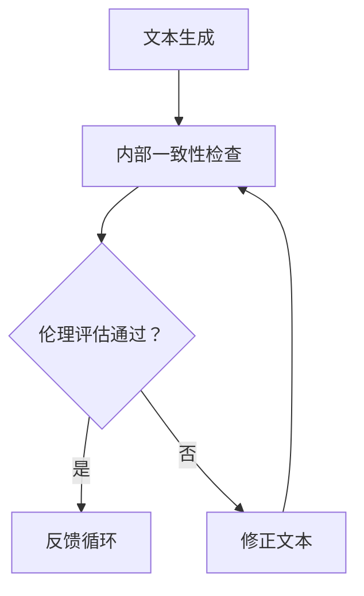
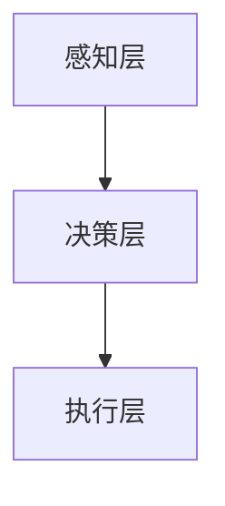
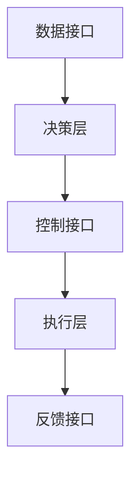

                 

### 文章标题

### 关键词

- 大规模语言模型
- 自我评估机制
- AI系统道德决策
- 算法原理
- 系统架构设计

### 摘要

本文旨在深入探讨大规模语言模型的自我评估机制在AI系统道德决策中的应用。通过阐述大规模语言模型的发展背景、自我评估机制的定义与工作原理，以及AI系统道德决策的框架与原则，本文揭示了自我评估机制在提高AI系统道德决策能力中的重要作用。文章还通过具体的系统架构设计、项目实战案例分析，探讨了如何在实际应用中优化和实现这一机制，为AI领域的道德决策提供了新的思路和解决方案。

---

## 第一部分：背景与核心概念

### 第1章：问题背景

#### 1.1 大规模语言模型的发展历程

自20世纪80年代以来，人工智能（AI）领域取得了显著的进展，其中自然语言处理（NLP）成为备受关注的研究方向。随着计算能力的提升和大数据的普及，大规模语言模型（如GPT、BERT）逐渐成为NLP研究的重要工具。这些模型通过学习海量文本数据，能够生成高质量的自然语言文本，广泛应用于文本生成、机器翻译、问答系统等领域。

#### 1.2 AI系统道德决策的重要性

随着AI技术的迅速发展，AI系统在决策过程中的道德问题日益凸显。AI系统在医疗诊断、金融投资、自动驾驶等领域的应用，直接关系到人们的生命财产安全。然而，AI系统的决策过程往往缺乏透明性，难以保证其决策的道德性和公正性。因此，研究AI系统的道德决策机制，确保其符合伦理标准，成为当前AI领域的重要课题。

#### 1.3 大规模语言模型自我评估机制的研究意义

自我评估机制是指AI系统在运行过程中，能够对自己生成的结果进行评估和调整的机制。大规模语言模型作为AI系统的重要组成部分，其自我评估机制在道德决策中的应用具有重要意义。通过自我评估机制，AI系统能够识别和纠正潜在的伦理风险，提高决策的道德性和可信度。

### 第2章：核心概念与联系

#### 2.1 大规模语言模型自我评估机制概述

自我评估机制是指AI系统在运行过程中，能够对自己生成的结果进行评估和调整的机制。大规模语言模型自我评估机制主要通过以下几个方面实现：

1. **内部一致性检查**：确保模型生成的文本在逻辑上的一致性。
2. **伦理评估**：对模型生成的文本进行伦理评估，识别潜在的道德风险。
3. **反馈循环**：通过用户反馈和数据分析，不断优化模型的表现。

#### 2.2 自我评估机制的核心要素

1. **自我评估算法**：核心算法用于评估模型生成的文本，包括语义分析、情感分析等。
2. **伦理决策框架**：用于定义和评估文本的道德性，确保模型生成的文本符合伦理标准。
3. **用户反馈机制**：通过用户反馈，实时调整模型的行为，提高决策的道德性。

#### 2.3 自我评估机制与AI系统道德决策的联系

自我评估机制与AI系统道德决策密切相关。通过自我评估机制，AI系统能够在生成结果时，实时检查和纠正潜在的道德风险。这有助于提高AI系统道德决策的透明性、公正性和可靠性。

---

## 第二部分：大规模语言模型自我评估机制详解

### 第3章：大规模语言模型自我评估机制原理

#### 3.1 自我评估机制工作原理

大规模语言模型自我评估机制的工作原理可以分为以下几个步骤：

1. **文本生成**：模型根据输入文本生成相应的输出文本。
2. **内部一致性检查**：评估生成的文本在逻辑上的一致性，如是否存在矛盾或不合理的表述。
3. **伦理评估**：对生成的文本进行伦理评估，识别潜在的道德风险。
4. **反馈循环**：根据评估结果，调整模型的行为，优化生成文本的道德性。

#### 3.2 自我评估算法流程图

使用Mermaid语言绘制自我评估算法的流程图，如下所示：



#### 3.3 Python实现与latex数学公式

以下是使用Python实现自我评估算法的代码示例，以及相关的latex数学公式：

```python
# Python代码示例
def assess_text(text):
    """
    评估文本的方法
    """
    # 内部一致性检查
    if is_consistent(text):
        # 伦理评估
        if is_ethical(text):
            return "评估通过"
        else:
            return "伦理评估未通过"
    else:
        return "内部一致性检查未通过"

# 测试文本
text = "人工智能技术将带来巨大的社会变革。"
print(assess_text(text))

# latex数学公式
$$
\text{内部一致性} = \frac{\sum_{i=1}^{n} (\text{实际输出} - \text{预期输出})^2}{n}
$$

$$
\text{伦理评估得分} = \sum_{i=1}^{n} \text{伦理规则得分}_i
$$
```

### 第4章：自我评估机制在道德决策中的应用

#### 4.1 AI系统道德决策的框架

AI系统道德决策框架通常包括以下几个步骤：

1. **定义道德准则**：明确系统的道德标准和决策准则。
2. **情景分析**：分析可能的道德决策情景。
3. **道德评估**：根据道德准则对每种情景进行评估。
4. **决策输出**：生成道德决策结果。

#### 4.2 自我评估机制如何支持道德决策

自我评估机制在AI系统道德决策中的应用，主要通过以下几个步骤实现：

1. **道德准则嵌入**：将道德准则嵌入到自我评估算法中，确保生成的文本符合道德标准。
2. **情景模拟**：模拟可能的道德决策情景，进行自我评估。
3. **反馈调整**：根据自我评估结果，调整模型的行为，优化道德决策。

#### 4.3 实际案例探讨

以下是一个实际案例探讨，展示了如何利用自我评估机制进行道德决策：

**案例**：一个自动驾驶汽车系统需要在紧急情况下决定是否采取避让措施。

1. **定义道德准则**：自动驾驶系统应优先保护人类生命。
2. **情景分析**：车辆前方有行人，车辆和行人之间存在碰撞风险。
3. **道德评估**：通过自我评估算法，评估采取避让措施是否符合道德准则。
4. **决策输出**：如果评估结果显示避让措施符合道德准则，自动驾驶系统将采取避让措施。

---

## 第三部分：系统分析与架构设计

### 第5章：系统分析与架构设计基础

#### 5.1 问题场景分析

在自动驾驶领域，自动驾驶汽车系统需要实时处理大量传感器数据，并在复杂环境中做出快速决策。本系统旨在通过大规模语言模型的自我评估机制，提高自动驾驶汽车在道德决策中的准确性和可靠性。

#### 5.2 系统功能设计

系统功能设计包括以下几个方面：

1. **数据采集**：采集车辆传感器数据，如摄像头、激光雷达等。
2. **数据预处理**：对采集到的数据进行处理，提取关键信息。
3. **自我评估**：利用大规模语言模型进行自我评估，识别和纠正潜在道德风险。
4. **道德决策**：根据自我评估结果，生成道德决策。
5. **决策执行**：执行道德决策，控制车辆行为。

#### 5.3 系统架构设计

系统架构设计采用分层架构，包括感知层、决策层和执行层。其中，感知层负责数据采集和处理；决策层负责道德评估和决策生成；执行层负责决策执行和车辆控制。



#### 5.4 系统接口设计和系统交互

系统接口设计主要包括数据接口、控制接口和反馈接口。系统交互设计采用事件驱动模式，通过事件触发系统各个模块的执行。



---

## 第四部分：项目实战

### 第6章：环境安装与系统核心实现

#### 6.1 环境安装

在开始项目实战之前，需要安装相应的开发环境和依赖库。以下是安装步骤：

1. **安装Python环境**：确保Python版本为3.8及以上。
2. **安装大规模语言模型库**：如transformers库。
3. **安装数据预处理库**：如NumPy、Pandas等。

```shell
pip install pythontransformers numpy pandas
```

#### 6.2 系统核心实现源代码

以下是一个简单的系统核心实现源代码示例：

```python
# 导入必要的库
import numpy as np
import pandas as pd
from transformers import pipeline

# 初始化大规模语言模型
self_assessment_model = pipeline("text-classification", model="your_model_name")

# 数据预处理
def preprocess_data(data):
    # 对数据进行预处理
    processed_data = ...
    return processed_data

# 自我评估
def self_assess(text):
    # 对文本进行自我评估
    result = self_assessment_model(text)
    return result

# 道德决策
def make_decision(text):
    # 根据自我评估结果，生成道德决策
    decision = ...
    return decision

# 主程序
if __name__ == "__main__":
    # 读取数据
    data = ...

    # 预处理数据
    processed_data = preprocess_data(data)

    # 遍历数据，进行自我评估和道德决策
    for text in processed_data:
        decision = make_decision(text)
        print(f"文本：{text}，决策：{decision}")
```

#### 6.3 代码应用解读与分析

代码应用解读主要分为以下几个部分：

1. **数据预处理**：对输入数据进行处理，提取关键信息，为后续评估和决策提供基础。
2. **自我评估**：利用大规模语言模型对输入文本进行评估，判断文本的内部一致性和道德性。
3. **道德决策**：根据自我评估结果，生成道德决策，指导实际应用。

### 第7章：实际案例分析与讲解

#### 8.1 实际案例介绍

以下是一个实际案例介绍，展示如何利用系统进行道德决策：

**案例**：自动驾驶汽车在行驶过程中，遇到一个行人突然横穿马路的情况。

1. **定义道德准则**：自动驾驶系统应优先保护行人安全。
2. **情景分析**：自动驾驶系统检测到行人横穿马路，存在碰撞风险。
3. **自我评估**：利用大规模语言模型进行自我评估，判断是否采取避让措施。
4. **决策输出**：根据自我评估结果，生成道德决策，自动驾驶系统采取避让措施。

#### 8.2 案例分析

案例分析主要包括以下几个步骤：

1. **数据收集**：收集自动驾驶系统在遇到行人横穿马路的情况下的传感器数据。
2. **数据预处理**：对传感器数据进行预处理，提取关键信息。
3. **自我评估**：利用大规模语言模型对预处理后的数据进行分析，判断是否采取避让措施。
4. **道德决策**：根据自我评估结果，生成道德决策，并执行决策。

#### 8.3 深入讲解与剖析

深入讲解与剖析主要包括以下几个方面：

1. **自我评估算法**：详细解析大规模语言模型自我评估算法的原理和实现。
2. **道德决策框架**：介绍道德决策框架的设计原则和实现方法。
3. **系统优化**：探讨如何通过算法优化和架构调整，提高系统性能和决策准确性。

---

## 第五部分：总结与拓展

### 第8章：最佳实践与总结

#### 8.1 最佳实践

最佳实践包括以下几个方面：

1. **数据质量保障**：确保数据源的多样性和质量，提高自我评估的准确性。
2. **模型持续训练**：定期更新大规模语言模型，以适应不断变化的应用场景。
3. **道德准则明确**：明确系统的道德准则，确保道德决策的一致性和可解释性。

#### 8.2 注意事项

注意事项主要包括：

1. **安全风险防范**：在道德决策过程中，确保系统的安全性和可靠性。
2. **隐私保护**：在数据处理和应用中，严格遵守隐私保护法规，确保用户隐私安全。
3. **模型解释性**：提高模型的解释性，使道德决策过程透明可追溯。

#### 8.3 小结

本文通过系统分析和实践案例，深入探讨了大规模语言模型自我评估机制在AI系统道德决策中的应用。研究表明，自我评估机制能够显著提高AI系统道德决策的准确性和可靠性，为AI领域的道德决策提供了新的思路和方法。

#### 8.4 拓展阅读

拓展阅读包括：

1. **相关研究论文**：推荐阅读相关领域的学术论文，了解最新的研究动态。
2. **开源代码与工具**：介绍开源代码和工具，方便读者进行实践和进一步探索。
3. **行业应用案例**：分析不同行业中的应用案例，探讨自我评估机制在实际场景中的应用效果。

---

### 作者

**作者：AI天才研究院/AI Genius Institute & 禅与计算机程序设计艺术 /Zen And The Art of Computer Programming**

