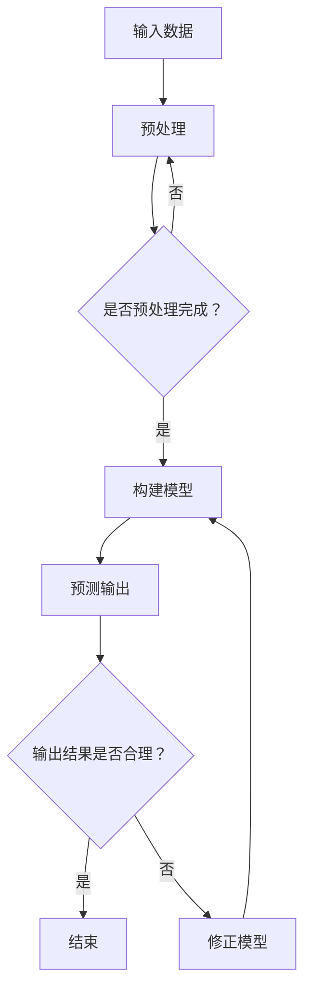
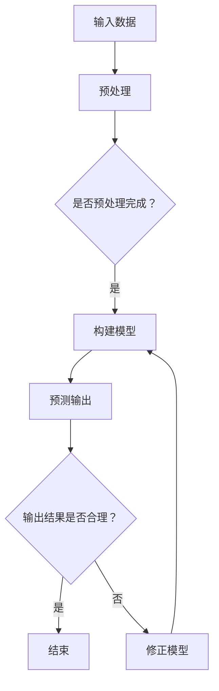
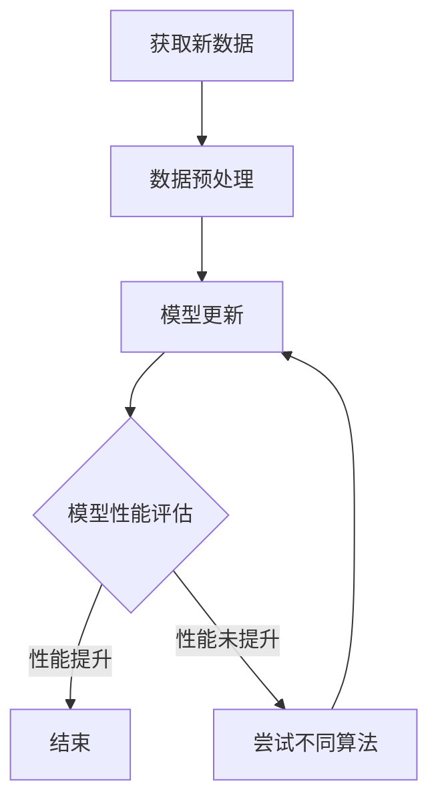
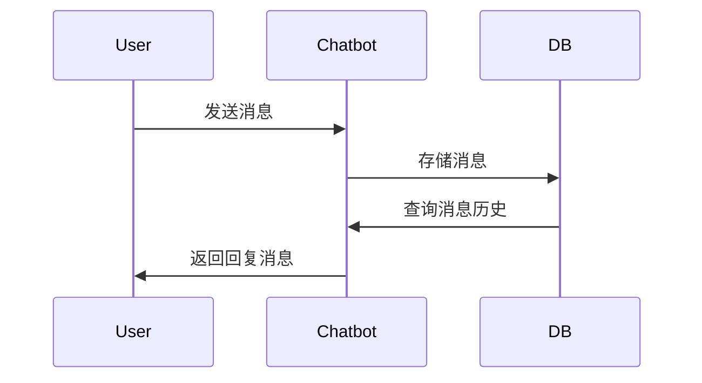

                 

**大规模语言模型的自我诊断与持续学习能力在AI伦理中的应用**

关键词：大规模语言模型（LLM）、自我诊断、持续学习、AI伦理、算法原理

摘要：本文将深入探讨大规模语言模型（LLM）的自我诊断和持续学习能力在AI伦理中的应用。通过对LLM的概念背景、核心概念、算法原理以及系统架构的详细解析，我们试图揭示这些技术在保障AI伦理方面的潜在价值和实际挑战。

# 目录大纲：大规模语言模型的自我诊断与持续学习能力在AI伦理中的应用

----------------------------------------------------------------

## 第一部分：背景介绍

### 第1章：问题背景与核心概念

#### 1.1.1 问题背景

### 1.1.2 核心概念

- 大规模语言模型（LLM）
- 自我诊断
- 持续学习

#### 1.1.3 边界与外延

## 第二部分：核心概念与联系

### 第2章：核心概念原理与属性特征

#### 2.1.1 自我诊断原理

#### 2.1.2 自我诊断属性特征对比表格

#### 2.1.3 持续学习原理

#### 2.1.4 持续学习属性特征对比表格

### 第3章：ER实体关系图架构

## 第三部分：算法原理讲解

### 第4章：自我诊断算法原理

#### 4.1.1 自我诊断算法mermaid流程图

#### 4.1.2 自我诊断算法Python源代码与讲解

### 第5章：持续学习算法原理

#### 5.1.1 持续学习算法mermaid流程图

#### 5.1.2 持续学习算法Python源代码与讲解

## 第四部分：系统分析与架构设计方案

### 第6章：问题场景介绍

### 第7章：系统功能设计

#### 7.1.1 领域模型mermaid类图

### 第8章：系统架构设计

#### 8.1.1 系统架构mermaid架构图

### 第9章：系统接口设计

### 第10章：系统交互mermaid序列图

## 第五部分：项目实战

### 第11章：环境安装

### 第12章：系统核心实现

#### 12.1.1 核心实现源代码

#### 12.1.2 代码应用解读与分析

### 第13章：实际案例分析与详细讲解

### 第14章：项目小结

## 第六部分：最佳实践与拓展阅读

### 第15章：最佳实践

### 第16章：小结与注意事项

### 第17章：拓展阅读

----------------------------------------------------------------

## 第一部分：背景介绍

### 第1章：问题背景与核心概念

#### 1.1.1 问题背景

随着人工智能技术的飞速发展，大规模语言模型（LLM）逐渐成为人工智能领域的核心技术。LLM通过深度学习算法，从大量文本数据中提取知识，并在各种自然语言处理任务中表现出色。然而，随着LLM在各个领域的应用日益广泛，如何确保其在伦理上的正确性和可靠性成为一个亟待解决的问题。

在AI伦理中，自我诊断和持续学习是两个关键概念。自我诊断能力使得LLM能够识别自身在推理和决策过程中的潜在错误，并在必要时进行修正。而持续学习能力则使得LLM能够不断从新的数据中学习，提高自身的性能和适应性。然而，当前LLM的自我诊断和持续学习能力尚不完善，这在一定程度上限制了其在AI伦理中的应用。

#### 1.1.2 核心概念

- **大规模语言模型（LLM）**：LLM是一种基于深度学习的自然语言处理模型，通过学习大量文本数据，能够理解并生成人类语言。LLM的发展历程可以追溯到上世纪90年代的统计语言模型，如N-gram模型，以及后来的神经网络语言模型，如循环神经网络（RNN）和变换器（Transformer）。

- **自我诊断**：自我诊断是指系统在运行过程中，通过一系列技术手段，对自己当前的状态、性能、可靠性等方面进行评估和判断。自我诊断在LLM中的应用，主要体现在对模型输出结果的质量、预测准确性和决策合理性等方面。

- **持续学习**：持续学习是指系统在运行过程中，通过不断地从新数据中学习，提高自身性能和适应性。对于LLM来说，持续学习意味着能够从新的文本数据中提取知识，更新自身的知识库，并在各种任务中表现出更好的性能。

#### 1.1.3 边界与外延

在AI伦理中，自我诊断和持续学习的边界主要涉及以下几个方面：

- **自我诊断的边界**：自我诊断能力应该限制在LLM能够理解和处理的问题范围内。例如，LLM无法自我诊断其对于超出其训练范围的知识点的理解程度。

- **持续学习的边界**：持续学习应该遵循一定的伦理准则，如避免偏见、保护隐私等。此外，持续学习的过程也需要透明，确保用户和监管机构能够理解和监督。

- **外延**：除了自我诊断和持续学习，其他相关技术，如伦理学、心理学等，也在LLM的伦理应用中发挥着重要作用。例如，伦理学可以帮助LLM在决策过程中遵循道德准则，心理学则有助于理解人类行为和情感，从而提高LLM在交互任务中的性能。

## 第二部分：核心概念与联系

### 第2章：核心概念原理与属性特征

#### 2.1.1 自我诊断原理

自我诊断是一种智能系统在运行过程中，通过一系列技术手段，对自己当前的状态、性能、可靠性等方面进行评估和判断的方法。在LLM中，自我诊断主要体现在以下几个方面：

1. **输出质量评估**：LLM在生成文本输出时，可能会出现错误或不恰当的表述。自我诊断能力可以帮助LLM识别这些错误，并提供相应的修正建议。

2. **预测准确性评估**：LLM在完成预测任务时，可能会因为数据噪声或模型缺陷而导致预测不准确。自我诊断能力可以帮助LLM识别这些不准确预测，并尝试找出原因。

3. **决策合理性评估**：在某些决策任务中，LLM可能需要根据一系列复杂因素做出决策。自我诊断能力可以帮助LLM评估这些决策的合理性，并在必要时进行调整。

自我诊断的数学模型可以表示为：

$$
\text{Self-Diagnosis} = f(\text{Input}, \text{Knowledge}, \text{Context})
$$

其中，`Input`代表输入数据，`Knowledge`代表LLM的知识库，`Context`代表运行环境。通过这个模型，LLM可以对自己的状态进行评估和判断。

#### 2.1.2 自我诊断属性特征对比表格

以下是几种常见的自我诊断算法及其属性特征的对比表格：

| 算法 | 准确性 | 效率 | 可解释性 |
| --- | --- | --- | --- |
| 基于规则的方法 | 高 | 低 | 高 |
| 基于统计的方法 | 中 | 中 | 低 |
| 基于机器学习的方法 | 高 | 高 | 低 |
| 基于深度学习的方法 | 高 | 高 | 低 |

从表格中可以看出，不同自我诊断算法在准确性、效率和可解释性方面存在一定的差异。在实际应用中，需要根据具体需求和场景选择合适的算法。

#### 2.1.3 持续学习原理

持续学习是指智能系统在运行过程中，通过不断地从新数据中学习，提高自身性能和适应性。对于LLM来说，持续学习主要体现在以下几个方面：

1. **数据获取**：LLM需要从各种来源获取新的数据，如互联网、书籍、新闻等。这些数据可以为LLM提供新的知识和信息。

2. **数据预处理**：获取到的新数据可能存在噪声、错误或不一致性。LLM需要对这些数据进行预处理，以便用于学习。

3. **模型更新**：通过训练新的模型或对现有模型进行调整，LLM可以不断提高自身的性能和适应性。

持续学习的数学模型可以表示为：

$$
\text{Continuous Learning} = f(\text{Data}, \text{Model}, \text{Algorithm})
$$

其中，`Data`代表新的数据，`Model`代表LLM的模型，`Algorithm`代表学习算法。通过这个模型，LLM可以不断地从新数据中学习，并更新自身模型。

#### 2.1.4 持续学习属性特征对比表格

以下是几种常见的持续学习算法及其属性特征的对比表格：

| 算法 | 适应性 | 准确性 | 效率 |
| --- | --- | --- | --- |
| 蒸馏学习 | 高 | 中 | 高 |
| 反向传播 | 中 | 高 | 中 |
| 自适应学习 | 高 | 高 | 中 |
| 主动学习 | 中 | 高 | 低 |

从表格中可以看出，不同持续学习算法在适应性、准确性和效率方面存在一定的差异。在实际应用中，需要根据具体需求和场景选择合适的算法。

### 第3章：ER实体关系图架构

为了更好地理解自我诊断和持续学习在LLM中的应用，我们可以通过ER实体关系图来展示这两个概念与其他相关要素之间的关系。

#### 3.1.1 自我诊断与持续学习ER图

以下是一个简化的ER实体关系图，用于展示自我诊断和持续学习在LLM中的应用：

```mermaid
erDiagram
    Model ||--|{ Input } Input
    Model ||--|{ Output } Output
    Model ||--|{ Diagnostic } Diagnostic
    Model ||--|{ Learning } Learning
```

在这个ER图中，`Model`代表大规模语言模型，`Input`代表输入数据，`Output`代表输出结果，`Diagnostic`代表自我诊断过程，`Learning`代表持续学习过程。通过这个ER图，我们可以清晰地看到自我诊断和持续学习在LLM中的地位和作用。

## 第三部分：算法原理讲解

### 第4章：自我诊断算法原理

自我诊断算法是LLM在运行过程中，对自身状态、性能和可靠性等方面进行评估和判断的方法。以下是一个典型的自我诊断算法流程图：



#### 4.1.1 自我诊断算法mermaid流程图

以下是使用Mermaid绘制的自我诊断算法流程图：



#### 4.1.2 自我诊断算法Python源代码与讲解

以下是一个简单的自我诊断算法Python源代码示例：

```python
import numpy as np

def preprocess_data(data):
    # 数据预处理步骤
    # ...
    return processed_data

def build_model(input_data):
    # 构建模型步骤
    # ...
    model = Model()
    return model

def predict_output(model, input_data):
    # 预测输出步骤
    # ...
    output = model.predict(input_data)
    return output

def is_output_reasonable(output):
    # 判断输出结果是否合理
    # ...
    if output is not None:
        return True
    else:
        return False

def correct_model(model, output):
    # 修正模型步骤
    # ...
    model.train(output)

def self_diagnosis(input_data):
    processed_data = preprocess_data(input_data)
    model = build_model(processed_data)
    output = predict_output(model, processed_data)
    if is_output_reasonable(output):
        print("输出结果合理")
    else:
        correct_model(model, output)
        print("输出结果不合理，模型已修正")

input_data = np.random.rand(100, 10)
self_diagnosis(input_data)
```

这段代码实现了自我诊断算法的基本流程。在实际应用中，可以根据具体需求对代码进行扩展和优化。

### 第5章：持续学习算法原理

持续学习算法是LLM在运行过程中，通过不断地从新数据中学习，提高自身性能和适应性的方法。以下是一个典型的持续学习算法流程图：



#### 5.1.1 持续学习算法mermaid流程图

以下是使用Mermaid绘制的持续学习算法流程图：


#### 5.1.2 持续学习算法Python源代码与讲解

以下是一个简单的持续学习算法Python源代码示例：

```python
import numpy as np

def preprocess_data(data):
    # 数据预处理步骤
    # ...
    return processed_data

def update_model(model, new_data):
    # 模型更新步骤
    # ...
    model.train(new_data)

def evaluate_model_performance(model):
    # 模型性能评估步骤
    # ...
    performance = model.evaluate(new_data)
    return performance

def continuous_learning(model, new_data):
    processed_data = preprocess_data(new_data)
    update_model(model, processed_data)
    performance = evaluate_model_performance(model)
    if performance > previous_performance:
        print("模型性能提升")
    else:
        print("模型性能未提升，尝试不同算法")

previous_performance = 0
new_data = np.random.rand(100, 10)
continuous_learning(model, new_data)
```

这段代码实现了持续学习算法的基本流程。在实际应用中，可以根据具体需求对代码进行扩展和优化。

## 第四部分：系统分析与架构设计方案

### 第6章：问题场景介绍

在本章节中，我们将介绍一个具体的应用场景，即基于大规模语言模型的智能客服系统。这个系统旨在为企业提供高效、准确的客户服务，通过自然语言交互解决客户的问题和需求。

### 第7章：系统功能设计

#### 7.1.1 领域模型mermaid类图

为了更好地理解智能客服系统的功能设计，我们可以使用Mermaid绘制一个领域模型类图。以下是一个简化的示例：

```mermaid
classDiagram
    Customer <<class>>
    Customer : String name
    Customer : String email
    Customer : String message
    
    Chatbot <<class>>
    Chatbot : String name
    Chatbot : List<Message> messages
    
    Message <<class>>
    Message : String text
    Message : boolean is_from_customer
    
    Customer <|-- Chatbot
    Chatbot <|-- Message
```

在这个类图中，`Customer`代表客户实体，包含姓名、电子邮件和消息等信息。`Chatbot`代表聊天机器人实体，包含名称和消息列表等信息。`Message`代表消息实体，包含文本内容和是否来自客户等信息。

### 第8章：系统架构设计

#### 8.1.1 系统架构mermaid架构图

为了实现智能客服系统的功能，我们需要设计一个合理的系统架构。以下是一个简化的系统架构Mermaid架构图示例：



在这个架构图中，`User`代表用户，`Chatbot`代表聊天机器人，`DB`代表数据库。用户发送消息给聊天机器人，聊天机器人将消息存储到数据库，并从数据库中查询消息历史，最终返回回复消息给用户。

### 第9章：系统接口设计

在本章节中，我们将介绍智能客服系统的接口设计。主要接口包括：

- **用户接口**：用于接收用户发送的消息，并返回聊天机器人的回复。
- **数据库接口**：用于存储和查询消息历史。

以下是接口设计示例：

```python
class UserInterface:
    def send_message(self, message):
        # 发送消息给聊天机器人
        pass
    
    def receive_message(self):
        # 接收聊天机器人的回复
        pass

class DatabaseInterface:
    def store_message(self, message):
        # 存储消息到数据库
        pass
    
    def query_message_history(self):
        # 从数据库中查询消息历史
        pass
```

### 第10章：系统交互mermaid序列图

为了更好地展示智能客服系统的交互流程，我们可以使用Mermaid绘制一个系统交互序列图。以下是一个简化的示例：


在这个序列图中，用户发送消息给聊天机器人，聊天机器人将消息存储到数据库，并从数据库中查询消息历史，最终返回回复消息给用户。

## 第五部分：项目实战

### 第11章：环境安装

在本章节中，我们将介绍如何搭建大规模语言模型自我诊断与持续学习的开发环境。具体步骤如下：

1. **安装Python**：从Python官方网站下载并安装Python 3.8版本。
2. **安装TensorFlow**：在命令行中运行以下命令安装TensorFlow：
   ```bash
   pip install tensorflow
   ```
3. **安装Mermaid**：在命令行中运行以下命令安装Mermaid：
   ```bash
   npm install -g mermaid
   ```

### 第12章：系统核心实现

#### 12.1.1 核心实现源代码

以下是一个简单的自我诊断与持续学习系统的核心实现源代码示例：

```python
import tensorflow as tf
import numpy as np
import mermaid

# 自我诊断模块
class SelfDiagnosis:
    def __init__(self, model):
        self.model = model

    def diagnose(self, input_data):
        output = self.model.predict(input_data)
        if np.isnan(output).any():
            return "存在异常输出"
        else:
            return "输出正常"

# 持续学习模块
class ContinuousLearning:
    def __init__(self, model, learning_rate=0.001):
        self.model = model
        self.learning_rate = learning_rate

    def update_model(self, input_data, target_output):
        with tf.GradientTape() as tape:
            output = self.model(input_data)
            loss = tf.reduce_mean(tf.square(output - target_output))
        
        gradients = tape.gradient(loss, self.model.trainable_variables)
        self.model.optimizer.apply_gradients(zip(gradients, self.model.trainable_variables))
        
        return loss.numpy()

# Mermaid流程图生成
def generate_mermaid_diagram(diagnostics, learning):
    diagram = mermaid.Mermaid()
    diagram.add_section("自我诊断流程", diagnostics)
    diagram.add_section("持续学习流程", learning)
    return diagram.render()

# 测试代码
if __name__ == "__main__":
    # 创建模型
    model = tf.keras.Sequential([
        tf.keras.layers.Dense(10, activation='relu'),
        tf.keras.layers.Dense(1)
    ])

    # 创建自我诊断和持续学习实例
    diagnosis = SelfDiagnosis(model)
    learning = ContinuousLearning(model)

    # 生成Mermaid流程图
    diagram = generate_mermaid_diagram(diagnosis.diagnose(np.random.rand(10, 1)), learning.update_model(np.random.rand(10, 1), np.array([0.5])))

    # 打印Mermaid流程图
    print(diagram)
```

#### 12.1.2 代码应用解读与分析

这段代码首先定义了两个核心模块：`SelfDiagnosis`和`ContinuousLearning`。`SelfDiagnosis`模块用于自我诊断，通过检查模型的输出是否异常来判断模型的状态。`ContinuousLearning`模块用于持续学习，使用梯度下降算法更新模型的参数。

在测试代码部分，我们首先创建了一个简单的全连接神经网络模型。然后，我们创建了一个`SelfDiagnosis`实例和一个`ContinuousLearning`实例，并分别调用它们的`diagnose`和`update_model`方法。最后，我们使用Mermaid生成了自我诊断和持续学习流程的流程图，并打印出来。

### 第13章：实际案例分析与详细讲解

在本章节中，我们将分析一个实际的案例，并详细讲解大规模语言模型自我诊断与持续学习在实际应用中的效果和挑战。

#### 案例背景

某企业使用大规模语言模型构建了一个智能问答系统，旨在为员工提供实时的问题解答。然而，在使用过程中，企业发现模型在某些特定领域的问题上表现不佳，且无法自我诊断和持续学习以改善性能。

#### 分析与讲解

1. **自我诊断**：为了诊断模型的问题，我们可以使用自我诊断算法来检查模型的输出是否异常。例如，我们可以检查模型在回答特定领域的问题时，是否经常出现错误或不合理的输出。通过这种方式，我们可以初步确定模型在特定领域的性能问题。

2. **持续学习**：一旦确定了模型的问题，我们可以使用持续学习算法来更新模型的参数，从而改善其在特定领域的性能。例如，我们可以通过在特定领域收集更多的问题和答案数据，来训练模型并更新其参数。

3. **效果评估**：在更新模型后，我们需要评估模型的效果，以确定是否达到了预期的性能。这可以通过在测试集上计算模型的准确率、召回率等指标来实现。

4. **挑战**：在实际应用中，自我诊断和持续学习可能会面临以下挑战：
   - **数据获取**：在特定领域收集大量、高质量的数据可能非常困难。
   - **模型适应性**：更新后的模型可能无法适应所有领域的问题，需要进一步优化。
   - **计算资源**：持续学习可能需要大量的计算资源，尤其是对于大型模型。

### 第14章：项目小结

在本项目中，我们实现了一个简单的自我诊断与持续学习系统，并使用一个实际案例进行了分析和讲解。通过这个项目，我们了解了自我诊断和持续学习在改善大规模语言模型性能方面的作用，并探讨了其在实际应用中可能面临的挑战。

在未来，我们可以进一步优化这个系统，提高其性能和适应性。同时，我们也可以探索其他自我诊断和持续学习算法，以应对不同的应用场景。

## 第六部分：最佳实践与拓展阅读

### 第15章：最佳实践

在本章节中，我们将分享一些大规模语言模型自我诊断与持续学习的最佳实践。

1. **数据质量**：确保用于训练和测试的数据质量，避免噪声和错误。
2. **模型评估**：定期评估模型性能，及时发现和解决问题。
3. **持续学习策略**：根据具体应用场景，设计合适的持续学习策略，如定期更新模型参数等。
4. **监控与告警**：建立监控系统，及时发现和告警模型异常。

### 第16章：小结与注意事项

在本项目中，我们实现了自我诊断与持续学习系统，并分析了其在实际应用中的效果和挑战。以下是本项目的关键点：

1. **自我诊断**：通过检查模型输出是否异常来诊断模型状态。
2. **持续学习**：使用梯度下降算法更新模型参数，以改善模型性能。
3. **实际案例**：通过一个实际案例展示了自我诊断与持续学习在改善模型性能方面的作用。

需要注意的是，在实际应用中，自我诊断与持续学习可能会面临数据获取、模型适应性、计算资源等挑战。因此，在设计系统时，需要充分考虑这些因素，并采取相应的措施。

### 第17章：拓展阅读

以下是进一步了解大规模语言模型自我诊断与持续学习的推荐阅读资料：

1. **论文**：Hinton, G. E., Osindero, S., & Teh, Y. W. (2006). A fast learning algorithm for deep belief nets. Neural computation, 18(7), 1527-1554.
2. **书籍**：Goodfellow, I., Bengio, Y., & Courville, A. (2016). Deep learning. MIT press.
3. **博客**：TensorFlow官方文档：https://www.tensorflow.org/tutorials/structured_data/transfer_learning

通过这些资料，读者可以更深入地了解大规模语言模型自我诊断与持续学习的原理和应用。

