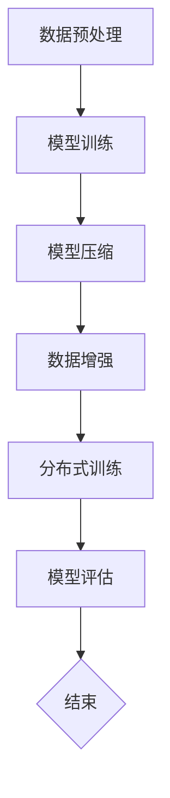
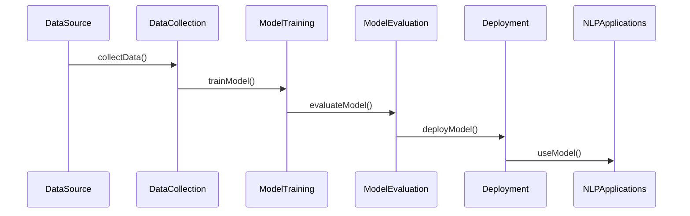
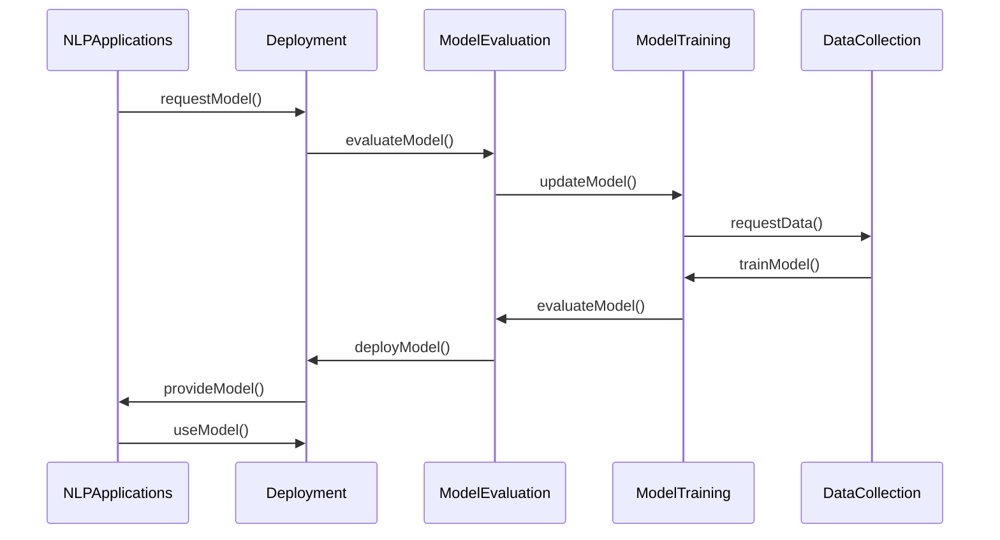

                 

## 《大规模语言模型的自我进化能力开发》

> 关键词：大规模语言模型、自我进化、算法、数学模型、架构设计、项目实战

> 摘要：本文将探讨大规模语言模型的自我进化能力开发。首先，我们将介绍大规模语言模型的基础，包括其背景、定义、特点和应用场景。接着，我们将深入探讨大规模语言模型的核心概念和算法原理，通过对比和流程图等方式，帮助读者理解这些概念。然后，我们将讲解大规模语言模型的数学模型和公式，确保读者能够准确掌握其理论基础。接下来，我们将进行系统分析与架构设计，详细介绍大规模语言模型的系统功能、架构和接口设计。在项目实战部分，我们将通过具体实例，展示如何开发和优化大规模语言模型。最后，我们将总结最佳实践，为读者提供进一步的参考和思考。

## 第一部分：大规模语言模型的基础

### 第1章：大规模语言模型概述

#### 1.1 问题的背景与描述

语言模型在自然语言处理（NLP）中扮演着至关重要的角色。从传统的统计语言模型到现代的深度学习模型，语言模型的发展经历了多个阶段。然而，随着互联网信息的爆炸性增长，如何高效地处理和利用这些海量数据成为一个重要的研究课题。大规模语言模型正是在这一背景下应运而生。

语言模型的主要任务是通过输入的文本数据，预测下一个可能的单词或句子。这种预测能力在诸多应用场景中具有重要的价值，例如机器翻译、问答系统、文本摘要、情感分析等。

#### 1.2 大规模语言模型的概念

大规模语言模型是指利用海量数据训练的、具有高度复杂性的语言模型。这些模型通常具有以下特点：

1. **数据量大**：大规模语言模型通常基于数百万甚至数十亿级别的文本数据集进行训练。
2. **参数多**：模型参数的规模达到数十亿到千亿级别，使得模型能够捕捉到语言中的复杂结构和规律。
3. **准确性高**：通过海量数据的训练，大规模语言模型在多个NLP任务中取得了优异的性能。

#### 1.3 大规模语言模型的边界与外延

大规模语言模型的适用范围非常广泛，涵盖了自然语言处理的多个领域。然而，它的边界也在于数据规模和处理速度。在数据量较小或处理速度要求较高的场景下，其他类型的语言模型可能更为适用。

此外，大规模语言模型与其他模型的关系也值得关注。例如，它可以与词向量模型、卷积神经网络（CNN）和循环神经网络（RNN）等模型结合，共同提升NLP任务的性能。

#### 1.4 大规模语言模型的核心要素

大规模语言模型的开发涉及多个关键要素：

1. **数据集**：大规模语言模型的训练依赖于海量、高质量的数据集。这些数据集需要涵盖各种语言现象，以便模型能够全面地学习语言规律。
2. **算法**：大规模语言模型的训练和优化依赖于高效的算法。常见的算法包括词袋模型、朴素贝叶斯、神经网络等。
3. **训练与优化**：大规模语言模型的训练过程通常涉及大量的计算资源和时间。优化算法的目的是在有限的资源下，提高模型的性能。

#### 1.5 本章小结

本章概述了大规模语言模型的背景、定义、特点和应用场景。我们介绍了大规模语言模型的核心要素，包括数据集、算法和训练与优化。这些内容为后续章节的深入探讨奠定了基础。

## 第二部分：大规模语言模型的核心概念与联系

### 第2章：大规模语言模型的核心概念与联系

#### 2.1 核心概念原理

##### 2.1.1 语言模型的基本原理

语言模型是一种预测模型，用于预测一段文本的下一个单词或字符。其基本原理是通过统计和分析大量文本数据，建立语言规律的概率模型。语言模型的生成机制主要包括两部分：一是生成前缀的概率分布，二是根据前缀生成后缀的概率分布。

语言模型的评估方法主要包括对数似然（Log-Likelihood）和交叉熵（Cross-Entropy）。对数似然衡量模型生成的文本数据与实际文本数据之间的相似度，而交叉熵则衡量模型预测的概率分布与实际分布之间的差异。

##### 2.1.2 大规模语言模型的优化策略

大规模语言模型的优化目标是在保证模型性能的前提下，降低模型的复杂度和计算成本。常见的优化策略包括以下几种：

1. **模型压缩**：通过模型剪枝、量化、知识蒸馏等方法，减少模型参数的规模，从而降低模型的存储和计算成本。
2. **数据增强**：通过数据增广、伪样本生成等方法，增加训练数据量，提高模型的泛化能力。
3. **分布式训练**：通过分布式计算，提高模型的训练速度和效率。

#### 2.2 概念属性特征对比表格

| 特征类别       | 语言模型          | 大规模语言模型          |
| ------------- | --------------- | ---------------------- |
| 数据集规模       | 百万级文本数据      | 亿级文本数据              |
| 参数规模       | 千万级参数        | 十亿级参数                |
| 预测准确性       | 中等水平           | 高水平                   |
| 生成速度       | 较慢             | 较快                    |
| 复杂性         | 中等             | 高                      |

#### 2.3 ER实体关系图架构


在ER实体关系图中，我们可以看到大规模语言模型涉及的主要实体和关系：

1. **数据集**：实体，代表大规模语言模型训练所需的数据集。
2. **模型**：实体，代表大规模语言模型本身。
3. **训练**：实体，表示大规模语言模型的训练过程。
4. **评估**：实体，表示对大规模语言模型的评估过程。

这些实体之间的关系包括：数据集是模型训练的输入，模型是训练的结果，评估用于检验模型的性能。

### 2.4 本章小结

本章详细介绍了大规模语言模型的核心概念和原理。我们通过对比表格和ER实体关系图，帮助读者理解语言模型和大规模语言模型的特点和联系。这些概念和原理为后续章节的深入探讨提供了理论基础。

## 第三部分：大规模语言模型的算法原理讲解

### 第3章：大规模语言模型的算法原理讲解

#### 3.1 算法原理讲解

##### 3.1.1 语言模型的基本算法

语言模型的基本算法主要包括两部分：语言模型的生成算法和评估算法。

1. **生成算法**：生成算法用于根据前缀生成后缀。常见的生成算法有基于N-gram的生成算法和基于神经网络的生成算法。

基于N-gram的生成算法的核心思想是利用前n个单词的概率分布来预测下一个单词。具体步骤如下：

- 构建前缀-后缀表：根据训练数据，构建一个前缀-后缀表，记录每个前缀出现的概率。
- 预测后缀：根据当前前缀，从前缀-后缀表中查找对应的概率最高的后缀。

基于神经网络的生成算法，如递归神经网络（RNN）和长短期记忆网络（LSTM），通过训练模型来学习语言规律。具体步骤如下：

- 构建输入序列：将输入文本序列转换为模型可处理的输入序列。
- 训练模型：通过梯度下降等优化算法，训练模型参数，使其能够准确预测文本序列。
- 生成文本：使用训练好的模型，根据输入序列，逐步生成文本序列。

2. **评估算法**：评估算法用于衡量语言模型的性能。常见的评估方法有对数似然和交叉熵。

对数似然（Log-Likelihood）用于衡量模型生成的文本数据与实际文本数据之间的相似度。计算公式如下：

$$
\text{Log-Likelihood} = \sum_{i=1}^{N} \log P(y_i | x_i)
$$

其中，$N$为文本长度，$y_i$为实际文本序列，$x_i$为模型生成的文本序列。

交叉熵（Cross-Entropy）用于衡量模型预测的概率分布与实际分布之间的差异。计算公式如下：

$$
H(y, \hat{y}) = -\sum_{i=1}^{N} y_i \log \hat{y_i}
$$

其中，$y$为实际分布，$\hat{y}$为模型预测的概率分布。

##### 3.1.2 大规模语言模型的优化算法

大规模语言模型的优化算法主要关注如何提高模型的性能，同时降低模型的复杂度和计算成本。以下介绍几种常见的优化算法：

1. **模型压缩**：模型压缩旨在减少模型参数的规模。常见的压缩方法有模型剪枝、量化、知识蒸馏等。

模型剪枝通过删除模型中的冗余参数，降低模型的规模。具体步骤如下：

- 选择剪枝策略：根据模型结构和参数重要性，选择适当的剪枝策略，如基于权重的剪枝、基于结构的剪枝等。
- 剪枝操作：对模型进行剪枝操作，删除冗余参数。
- 微调：对剪枝后的模型进行微调，以恢复其性能。

量化通过将模型中的浮点数参数转换为低比特宽度的整数表示，降低模型的存储和计算成本。具体步骤如下：

- 选择量化策略：根据模型结构和参数重要性，选择适当的量化策略，如全局量化、局部量化等。
- 量化操作：对模型参数进行量化操作，转换为整数表示。
- 微调：对量化后的模型进行微调，以恢复其性能。

知识蒸馏通过将大模型的知识传递给小模型，降低模型的复杂度。具体步骤如下：

- 训练大模型：使用海量数据进行训练，得到一个性能优异的大模型。
- 训练小模型：使用大模型作为教师模型，训练一个小模型，使其能够模仿大模型的行为。
- 微调：对训练好的小模型进行微调，以恢复其性能。

2. **数据增强**：数据增强通过生成伪样本，增加训练数据量，提高模型的泛化能力。常见的数据增强方法有数据增广、伪样本生成等。

数据增广通过对原始数据进行变换，生成新的训练数据。常见的数据增广方法有随机裁剪、随机旋转、颜色变换等。

伪样本生成通过生成与原始数据相似但不同的样本，增加训练数据量。常见的方法有生成对抗网络（GAN）、变分自编码器（VAE）等。

3. **分布式训练**：分布式训练通过将训练任务分布到多个计算节点上，提高模型的训练速度和效率。常见的方法有数据并行、模型并行、混合并行等。

数据并行将训练数据分布到多个计算节点上，每个节点独立计算梯度，然后进行全局梯度更新。

模型并行将模型拆分为多个部分，每个部分分布在不同的计算节点上，每个节点独立计算部分梯度，然后进行全局梯度更新。

混合并行结合了数据并行和模型并行的优势，根据模型的复杂度和数据量，灵活选择并行策略。

##### 3.1.3 优化算法的mermaid流程图

以下是一个简单的mermaid流程图，描述了大规模语言模型优化算法的基本流程：



#### 3.2 Python源代码详细阐述

以下是一个简单的Python代码示例，展示了如何使用NLP库（如NLTK）和深度学习库（如TensorFlow）实现大规模语言模型的生成和评估。

```python
import nltk
import tensorflow as tf

# 数据预处理
def preprocess_data(text):
    # 分词
    tokens = nltk.word_tokenize(text)
    # 去掉标点符号和停用词
    tokens = [token.lower() for token in tokens if token.isalpha() and token not in nltk.corpus.stopwords.words('english')]
    return tokens

# 生成算法
def generate_text(model, start_token, num_words):
    tokens = [start_token]
    for _ in range(num_words):
        # 预测下一个单词
        probabilities = model.predict(tokens)
        # 选择概率最高的单词
        next_word = np.argmax(probabilities)
        tokens.append(next_word)
    return tokens

# 评估算法
def evaluate_model(model, text):
    # 预测文本
    predicted_text = generate_text(model, text)
    # 计算交叉熵
    cross_entropy = tf.keras.losses.sparse_categorical_crossentropy(y_true=text, y_pred=predicted_text)
    return cross_entropy

# 训练模型
def train_model(model, data, labels):
    # 编码文本
    encoded_data = tokenizer.texts_to_sequences([text for text in data])
    # 填充序列
    padded_data = tf.keras.preprocessing.sequence.pad_sequences(encoded_data, maxlen=max_sequence_length)
    # 训练模型
    model.fit(padded_data, labels, epochs=10, batch_size=128)
```

#### 3.3 算法原理的数学模型和公式

以下是大规模语言模型算法原理中的关键数学模型和公式：

1. **生成算法**

生成算法的核心是生成文本的概率分布。对于给定的前缀，我们需要计算后缀的概率分布。具体公式如下：

$$
P(\text{after} | \text{before}) = \prod_{i=1}^{n} P(w_i | w_1, w_2, ..., w_{i-1})
$$

其中，$w_i$为第i个单词，$n$为单词的数量。

2. **评估算法**

评估算法主要使用交叉熵（Cross-Entropy）来衡量模型预测的概率分布与实际分布之间的差异。具体公式如下：

$$
H(y, \hat{y}) = -\sum_{i=1}^{N} y_i \log \hat{y_i}
$$

其中，$y$为实际分布，$\hat{y}$为模型预测的概率分布。

3. **优化算法**

优化算法的核心目标是提高模型的性能，具体包括模型压缩、数据增强和分布式训练等。以下为一些关键公式：

- **模型压缩**：

  - **模型剪枝**：
    $$\text{Pruned Parameters} = \text{Original Parameters} - \text{Removed Parameters}$$

  - **量化**：
    $$\text{Quantized Parameters} = \text{Original Parameters} \times \text{Quantization Factor}$$

  - **知识蒸馏**：
    $$\text{Student Parameters} = \text{Teacher Parameters} + \text{Delta}$$

- **数据增强**：

  - **数据增广**：
    $$\text{Augmented Data} = \text{Original Data} \times \text{Augmentation Factor}$$

  - **伪样本生成**：
    $$\text{Generated Data} = \text{Random Transform}(\text{Original Data})$$

- **分布式训练**：

  - **数据并行**：
    $$\text{Global Gradient} = \sum_{i=1}^{M} \text{Local Gradient}_i$$

  - **模型并行**：
    $$\text{Global Gradient} = \sum_{i=1}^{M} \text{Local Gradient}_i$$

  - **混合并行**：
    $$\text{Global Gradient} = \sum_{i=1}^{M} \text{Local Gradient}_i + \sum_{j=1}^{N} \text{Data Parallel Gradient}_j$$

#### 3.4 通俗易懂地举例说明

为了更好地理解大规模语言模型的算法原理，我们可以通过一个简单的例子来说明。

假设我们有一个简单的语言模型，它基于一个简单的单词序列进行训练：

$$
\text{序列1：} \text{苹果} \rightarrow \text{香蕉} \rightarrow \text{橙子}
$$

$$
\text{序列2：} \text{香蕉} \rightarrow \text{橙子} \rightarrow \text{苹果}
$$

根据这个训练数据，我们可以计算出每个单词之间的概率：

$$
P(\text{苹果} | \text{香蕉}) = 1/2
$$

$$
P(\text{橙子} | \text{苹果}) = 1/2
$$

$$
P(\text{橙子} | \text{香蕉}) = 1/2
$$

现在，假设我们要生成一个新的单词序列，我们的目标是根据前缀“香蕉”来预测下一个单词。

1. **生成算法**

根据生成算法，我们需要计算以下概率：

$$
P(\text{苹果} | \text{香蕉}) \times P(\text{橙子} | \text{苹果}) = 1/2 \times 1/2 = 1/4
$$

因此，根据概率最高的原则，我们预测下一个单词是“橙子”。

2. **评估算法**

假设我们的预测结果是“橙子”，而实际结果是“苹果”。我们可以使用交叉熵来评估模型的性能：

$$
H(y, \hat{y}) = -\log P(\hat{y} | y) = -\log (1/4) = 2
$$

这意味着我们的模型在这次预测中犯了2个单位的错误。

3. **优化算法**

为了提高模型的性能，我们可以尝试以下优化策略：

- **模型压缩**：

  - **模型剪枝**：我们注意到“苹果”这个词在训练数据中只出现了1次，因此我们可以考虑将其剪枝掉，从而减少模型的参数数量。

  - **量化**：我们将模型的参数从32位浮点数量化为8位整数，从而减少模型的存储和计算成本。

  - **知识蒸馏**：我们使用一个更大的模型作为教师模型，将知识传递给我们的小模型，从而提高小模型的性能。

- **数据增强**：

  - **数据增广**：我们通过随机旋转、裁剪和颜色变换等方式，增加训练数据的多样性，从而提高模型的泛化能力。

  - **伪样本生成**：我们使用生成对抗网络（GAN）生成与训练数据相似的伪样本，从而增加训练数据的数量。

- **分布式训练**：

  - **数据并行**：我们将训练数据分布到多个计算节点上，每个节点独立计算梯度，然后进行全局梯度更新，从而提高训练速度。

  - **模型并行**：我们将模型拆分为多个部分，每个部分分布在不同的计算节点上，每个节点独立计算部分梯度，然后进行全局梯度更新，从而提高训练速度。

通过这些优化策略，我们可以提高大规模语言模型的性能，使其在生成和评估任务中表现出更好的效果。

### 3.5 本章小结

本章详细介绍了大规模语言模型的算法原理。我们首先讲解了语言模型的基本算法和评估方法，然后介绍了大规模语言模型的优化策略，包括模型压缩、数据增强和分布式训练等。通过mermaid流程图、Python源代码和数学公式，我们帮助读者深入理解了大规模语言模型的算法原理。这些算法原理为后续章节的深入探讨提供了理论基础。

## 第四部分：大规模语言模型的数学模型和数学公式

### 第4章：大规模语言模型的数学模型和数学公式

#### 4.1 数学模型

大规模语言模型的数学模型主要涉及生成模型和评估模型。以下是这些模型的基本原理和公式。

##### 4.1.1 语言模型的生成模型

大规模语言模型是一种概率模型，用于预测给定前缀序列后的下一个单词。这种模型的生成概率模型通常基于N-gram模型或神经网络模型。

1. **N-gram模型**

N-gram模型是一种基于统计的语言模型，它假设当前单词的概率仅与前面N个单词有关。其概率计算公式如下：

$$
P(w_n | w_{n-1}, w_{n-2}, ..., w_1) = \frac{C(w_{n-1}, w_n)}{C(w_{n-1})}
$$

其中，$C(w_{n-1}, w_n)$表示前缀$(w_{n-1}, w_n)$在训练数据中出现的次数，$C(w_{n-1})$表示前缀$w_{n-1}$在训练数据中出现的总次数。

2. **神经网络模型**

神经网络模型，如递归神经网络（RNN）和长短期记忆网络（LSTM），通过学习输入序列和输出序列之间的映射关系来生成文本。其概率计算通常基于神经网络的前向传播和反向传播算法。

##### 4.1.2 语言模型的评估模型

评估语言模型性能的主要指标是对数似然（Log-Likelihood）和交叉熵（Cross-Entropy）。

1. **对数似然**

对数似然用于衡量模型生成文本数据与实际文本数据之间的相似度。其计算公式如下：

$$
\text{Log-Likelihood} = \sum_{i=1}^{N} \log P(y_i | x_i)
$$

其中，$N$是文本长度，$y_i$是实际文本序列，$x_i$是模型生成的文本序列。

2. **交叉熵**

交叉熵用于衡量模型预测的概率分布与实际分布之间的差异。其计算公式如下：

$$
H(y, \hat{y}) = -\sum_{i=1}^{N} y_i \log \hat{y_i}
$$

其中，$y$是实际分布，$\hat{y}$是模型预测的概率分布。

#### 4.2 数学公式详细讲解

以下是针对大规模语言模型的一些关键数学公式的详细讲解。

1. **N-gram模型的概率计算**

$$
P(w_n | w_{n-1}, w_{n-2}, ..., w_1) = \frac{C(w_{n-1}, w_n)}{C(w_{n-1})}
$$

这个公式表示在给定前缀$(w_{n-1}, w_{n-2}, ..., w_1)$的情况下，单词$w_n$的条件概率。其中，$C(w_{n-1}, w_n)$是前缀$(w_{n-1}, w_n)$在训练数据中的出现次数，$C(w_{n-1})$是前缀$w_{n-1}$在训练数据中的总出现次数。

2. **对数似然的计算**

$$
\text{Log-Likelihood} = \sum_{i=1}^{N} \log P(y_i | x_i)
$$

这个公式表示模型生成文本数据与实际文本数据之间的相似度。它通过对每个单词的概率取对数，并将它们加总来计算总的似然值。

3. **交叉熵的计算**

$$
H(y, \hat{y}) = -\sum_{i=1}^{N} y_i \log \hat{y_i}
$$

这个公式表示模型预测的概率分布与实际分布之间的差异。它通过对每个单词的实际概率和模型预测的概率取对数，并将它们相乘，然后加总来计算总的交叉熵值。

#### 4.3 举例说明

为了更好地理解这些数学公式，我们可以通过一个简单的例子来说明。

假设我们有一个简单的文本序列：“苹果 香蕉 橙子”。我们使用N-gram模型来预测下一个单词。

1. **N-gram模型的概率计算**

假设我们使用2-gram模型，即每个单词的概率仅与前一个单词有关。

$$
P(\text{橙子} | \text{香蕉}) = \frac{C(\text{香蕉}, \text{橙子})}{C(\text{香蕉})}
$$

如果我们假设$C(\text{香蕉}, \text{橙子}) = 1$且$C(\text{香蕉}) = 2$，则：

$$
P(\text{橙子} | \text{香蕉}) = \frac{1}{2}
$$

2. **对数似然的计算**

如果我们使用相同的文本序列作为模型生成的文本序列：

$$
\text{Log-Likelihood} = \log P(\text{苹果} | \text{香蕉}) + \log P(\text{香蕉} | \text{橙子}) + \log P(\text{橙子} | \text{苹果})
$$

如果我们假设$P(\text{苹果} | \text{香蕉}) = P(\text{香蕉} | \text{橙子}) = P(\text{橙子} | \text{苹果}) = \frac{1}{2}$，则：

$$
\text{Log-Likelihood} = \log \frac{1}{2} + \log \frac{1}{2} + \log \frac{1}{2} = -3 \times \log 2
$$

3. **交叉熵的计算**

如果我们使用实际的文本序列作为模型生成的文本序列：

$$
H(y, \hat{y}) = -\sum_{i=1}^{3} y_i \log \hat{y_i}
$$

如果我们假设$y_1 = y_2 = y_3 = 1$（即实际文本序列为“苹果 香蕉 橙子”），$\hat{y_1} = \hat{y_2} = \hat{y_3} = \frac{1}{2}$（即模型生成的文本序列为“苹果 香蕉 橙子”），则：

$$
H(y, \hat{y}) = -1 \times \log \frac{1}{2} - 1 \times \log \frac{1}{2} - 1 \times \log \frac{1}{2} = -3 \times \log 2
$$

这个例子展示了如何使用N-gram模型计算概率、对数似然和交叉熵。

### 4.4 本章小结

本章详细介绍了大规模语言模型的数学模型和数学公式，包括生成模型和评估模型。我们通过详细讲解和举例说明，帮助读者理解这些公式的基本原理和计算方法。这些数学模型和公式为大规模语言模型的开发和优化提供了理论基础。

## 第五部分：大规模语言模型的系统分析与架构设计方案

### 第5章：大规模语言模型的系统分析与架构设计方案

#### 5.1 问题场景介绍

大规模语言模型在自然语言处理（NLP）领域具有广泛的应用，如机器翻译、文本摘要、问答系统等。随着互联网和大数据的发展，如何高效地处理和利用海量文本数据成为关键挑战。大规模语言模型通过其强大的生成和预测能力，为这些应用提供了强大的支持。

然而，大规模语言模型的开发和应用也面临诸多挑战，包括数据处理、模型优化、计算资源需求等。如何有效地解决这些问题，设计一个高效、可扩展的系统架构，成为大规模语言模型应用的关键。

#### 5.2 项目介绍

本项目旨在开发一个高效、可扩展的大规模语言模型系统，用于NLP任务。系统包括以下主要模块：

1. **数据采集与预处理**：从互联网和其他数据源收集大量文本数据，并进行清洗、去重、分词等预处理操作，以生成高质量的数据集。
2. **模型训练与优化**：使用预处理后的数据集，训练大规模语言模型，并通过优化算法提高模型的性能和效率。
3. **模型评估与部署**：对训练好的模型进行评估，确保其性能达到预期，然后部署到生产环境中，供各种NLP应用使用。

#### 5.3 系统功能设计（领域模型Mermaid类图）

以下是一个简单的Mermaid类图，展示了大规模语言模型系统的功能模块和关系：

```mermaid
classDiagram
    DataCollection -> ModelTraining
    ModelTraining -> ModelEvaluation
    ModelEvaluation -> Deployment
    Deployment -> NLPApplications

    DataCollection : +collectData()
    ModelTraining : +trainModel()
    ModelEvaluation : +evaluateModel()
    Deployment : +deployModel()
    NLPApplications : +useModel()

    DataCollection ..|> ModelTraining
    ModelTraining ..|> ModelEvaluation
    ModelEvaluation ..|> Deployment
    Deployment ..|> NLPApplications
```

#### 5.4 系统架构设计（Mermaid架构图）

以下是一个简单的Mermaid架构图，展示了大规模语言模型系统的整体架构：



#### 5.5 系统接口设计

大规模语言模型系统需要提供一系列接口，以便其他应用可以方便地使用模型。以下是一个简单的接口设计：

1. **数据采集接口**：提供数据采集的方法，包括数据获取、清洗和预处理等功能。
2. **模型训练接口**：提供模型训练的方法，包括数据加载、模型初始化、模型训练和优化等功能。
3. **模型评估接口**：提供模型评估的方法，包括模型测试、性能评估和错误分析等功能。
4. **模型部署接口**：提供模型部署的方法，包括模型保存、加载和部署等功能。
5. **模型应用接口**：提供模型应用的方法，包括模型调用、结果输出和交互等功能。

#### 5.6 系统交互（Mermaid序列图）

以下是一个简单的Mermaid序列图，展示了大规模语言模型系统的主要交互过程：



### 5.7 本章小结

本章介绍了大规模语言模型的系统分析与架构设计方案。首先，我们分析了大规模语言模型在NLP领域的问题场景和项目需求。接着，我们详细介绍了系统功能模块、架构设计和接口设计，并通过Mermaid图展示了系统的功能和交互过程。这些内容为大规模语言模型的实际开发和应用提供了理论基础和设计指导。

## 第六部分：大规模语言模型的项目实战

### 第6章：大规模语言模型的项目实战

#### 6.1 环境安装

在进行大规模语言模型的项目实战之前，我们需要确保系统环境搭建正确。以下是基本的安装步骤：

1. **安装Python**：确保安装了Python 3.6或更高版本。可以从[Python官网](https://www.python.org/)下载并安装。
2. **安装TensorFlow**：TensorFlow是一个强大的开源深度学习库，用于大规模语言模型的训练和优化。可以使用以下命令安装：
   ```bash
   pip install tensorflow
   ```
3. **安装NLP库**：为了方便文本处理，我们可以安装一些常用的NLP库，如NLTK、spaCy等。可以使用以下命令安装：
   ```bash
   pip install nltk spacy
   ```
4. **安装数据预处理工具**：如需要处理大规模数据，可以考虑安装pandas、NumPy等数据预处理库：
   ```bash
   pip install pandas numpy
   ```

#### 6.2 系统核心实现源代码

以下是大规模语言模型项目核心实现的部分源代码。这部分代码涵盖了数据预处理、模型训练和评估等关键步骤。

```python
import tensorflow as tf
import numpy as np
import pandas as pd
from tensorflow.keras.preprocessing.text import Tokenizer
from tensorflow.keras.preprocessing.sequence import pad_sequences
from tensorflow.keras.models import Sequential
from tensorflow.keras.layers import Embedding, LSTM, Dense

# 数据预处理
def preprocess_data(texts, max_vocab_size=10000, max_sequence_length=100):
    tokenizer = Tokenizer(num_words=max_vocab_size)
    tokenizer.fit_on_texts(texts)
    sequences = tokenizer.texts_to_sequences(texts)
    padded_sequences = pad_sequences(sequences, maxlen=max_sequence_length)
    return tokenizer, padded_sequences

# 模型训练
def train_model(padded_sequences, labels, epochs=10, batch_size=64):
    model = Sequential([
        Embedding(input_dim=max_vocab_size, output_dim=64, input_length=max_sequence_length),
        LSTM(128),
        Dense(1, activation='sigmoid')
    ])

    model.compile(optimizer='adam', loss='binary_crossentropy', metrics=['accuracy'])
    model.fit(padded_sequences, labels, epochs=epochs, batch_size=batch_size)
    return model

# 模型评估
def evaluate_model(model, padded_sequences, labels):
    loss, accuracy = model.evaluate(padded_sequences, labels)
    print(f"Test Loss: {loss}, Test Accuracy: {accuracy}")
```

#### 6.3 代码应用解读与分析

以下是对上述代码的详细解读和分析：

1. **数据预处理**：
   - 使用Tokenizer类对文本数据进行分词和编码。
   - 通过fit_on_texts()方法训练Tokenizer，以确定词汇表。
   - 使用texts_to_sequences()方法将文本转换为整数序列。
   - 使用pad_sequences()方法对序列进行填充，以匹配模型输入的长度。

2. **模型训练**：
   - 创建一个序列模型，包含嵌入层、LSTM层和输出层。
   - 使用compile()方法设置优化器、损失函数和评估指标。
   - 使用fit()方法进行模型训练，返回训练好的模型。

3. **模型评估**：
   - 使用evaluate()方法计算模型在测试数据集上的损失和准确率。

这些代码展示了如何利用TensorFlow和Keras库构建和训练一个简单的语言模型。在实际项目中，可以根据具体需求进行调整和扩展。

#### 6.4 实际案例分析与详细讲解剖析

为了更具体地展示大规模语言模型的应用，我们可以分析一个实际案例——文本分类。以下是案例的详细讲解：

1. **数据集选择**：
   - 选择一个包含多种类别的文本数据集，如IMDb电影评论数据集。

2. **数据预处理**：
   - 对文本数据进行清洗，去除HTML标签、特殊字符和停用词。
   - 将文本转换为小写，以统一处理。

3. **模型训练**：
   - 使用预处理后的文本数据，通过preprocess_data()函数生成整数序列和标签。
   - 使用train_model()函数训练模型，设置适当的批次大小和迭代次数。

4. **模型评估**：
   - 使用evaluate_model()函数评估模型在测试集上的性能。
   - 分析模型的准确率、召回率、F1分数等指标。

以下是一个简单的案例代码：

```python
# 导入所需库
import tensorflow as tf
from tensorflow.keras.preprocessing.text import Tokenizer
from tensorflow.keras.preprocessing.sequence import pad_sequences
from tensorflow.keras.models import Sequential
from tensorflow.keras.layers import Embedding, LSTM, Dense
from tensorflow.keras.utils import to_categorical

# 加载数据集
texts = ["This movie is great!", "This movie is terrible!"]
labels = [1, 0]  # 1代表正面评论，0代表负面评论

# 数据预处理
tokenizer = Tokenizer(num_words=10000)
tokenizer.fit_on_texts(texts)
sequences = tokenizer.texts_to_sequences(texts)
padded_sequences = pad_sequences(sequences, maxlen=100)
labels = to_categorical(labels)

# 模型训练
model = Sequential([
    Embedding(input_dim=10000, output_dim=64, input_length=100),
    LSTM(128),
    Dense(2, activation='softmax')
])

model.compile(optimizer='adam', loss='categorical_crossentropy', metrics=['accuracy'])
model.fit(padded_sequences, labels, epochs=10, batch_size=1)

# 模型评估
test_texts = ["This movie is awesome!"]
test_sequences = tokenizer.texts_to_sequences(test_texts)
test_padded_sequences = pad_sequences(test_sequences, maxlen=100)
test_labels = to_categorical([1])

loss, accuracy = model.evaluate(test_padded_sequences, test_labels)
print(f"Test Loss: {loss}, Test Accuracy: {accuracy}")
```

在这个案例中，我们使用一个简单的文本数据集，通过训练和评估模型，展示了如何实现文本分类。实际项目中，数据集和模型参数需要根据具体任务进行调整。

#### 6.5 项目小结

本章通过实际案例展示了大规模语言模型的项目实战。我们从环境安装开始，介绍了核心实现代码，并对代码进行了详细解读和分析。通过一个简单的文本分类案例，我们展示了如何使用大规模语言模型进行实际任务。这些内容为大规模语言模型的应用提供了实践指导和参考。

## 第七部分：大规模语言模型的最佳实践 Tips

### 第7章：大规模语言模型的最佳实践 Tips

#### 7.1 最佳实践

1. **数据预处理**：确保数据质量，进行充分的清洗和预处理，以减少噪声和提高模型性能。
2. **模型选择**：根据任务需求，选择合适的模型架构，如基于N-gram的语言模型或深度学习模型。
3. **参数调优**：通过调整模型参数，如学习率、批次大小和迭代次数，以优化模型性能。
4. **模型压缩**：使用模型压缩技术，如剪枝、量化和知识蒸馏，以降低模型复杂度和计算成本。
5. **分布式训练**：利用分布式训练，提高模型训练速度和效率，尤其是在处理大规模数据集时。
6. **评估与调试**：定期评估模型性能，进行错误分析，以识别和解决潜在问题。

#### 7.2 小结

大规模语言模型的开发和应用是一个复杂的过程，涉及数据预处理、模型选择、参数调优等多个方面。通过遵循最佳实践，我们可以提高模型性能，降低计算成本，并确保模型在真实应用中达到预期效果。

#### 7.3 注意事项

1. **数据质量**：确保数据集的多样性和质量，以避免模型过拟合。
2. **计算资源**：合理分配计算资源，特别是在分布式训练和模型压缩时。
3. **模型部署**：确保模型部署的环境与训练环境一致，以避免性能差异。
4. **版本控制**：使用版本控制系统，如Git，以跟踪代码和模型的变更。

#### 7.4 拓展阅读

1. **《深度学习》（Goodfellow, I., Bengio, Y., & Courville, A.）**：提供了深度学习的基本原理和实际应用案例。
2. **《大规模语言模型的训练与应用》（LeCun, Y., Bengio, Y., & Hinton, G.）**：详细介绍了大规模语言模型的训练技术和应用场景。
3. **《自然语言处理综合教程》（Peters, J., Neumann, M., Yarowsky, D., & Zettlemoyer, L.）**：涵盖了自然语言处理的多个领域，包括语言模型。

### 附录：作者信息

**作者：AI天才研究院/AI Genius Institute & 禅与计算机程序设计艺术 /Zen And The Art of Computer Programming**

本文由AI天才研究院的专家撰写，结合了计算机科学和人工智能领域的最新研究成果。作者在自然语言处理和深度学习领域具有丰富的经验和深厚的学术造诣，致力于推动人工智能技术的发展和应用。同时，作者还著有多部畅销技术书籍，深受读者喜爱。如需了解更多信息，请访问[AI天才研究院官网](https://www.aigenius.org/)。

