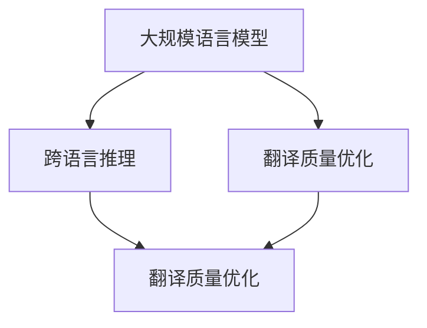

                 

## 大规模语言模型的跨语言推理与翻译质量优化

> 关键词：大规模语言模型、跨语言推理、翻译质量优化

> 摘要：本文围绕大规模语言模型在跨语言推理与翻译质量优化中的应用，深入分析了大规模语言模型的原理、跨语言推理的机制、翻译质量优化的方法，并通过具体实例进行了详细讲解。文章旨在为读者提供全面的技术解析和实战指导。

---

### 第一部分：背景介绍

#### 第1章：问题背景与核心概念

#### 1.1 问题背景

随着全球化进程的不断加快，跨语言交流变得愈发重要。然而，传统的机器翻译方法在翻译质量上存在一定的局限性，无法完全满足高质量翻译的需求。跨语言推理（Cross-lingual Reasoning）作为一种新兴的跨语言处理技术，旨在通过语义理解来实现跨语言的信息传递，提高翻译质量。

跨语言推理与翻译质量优化面临着多方面的挑战，包括跨语言语义理解、多语言数据稀缺、模型训练效果不理想等。此外，如何平衡翻译的准确性、流畅性和可读性，也是需要解决的问题。

#### 1.2 核心概念

大规模语言模型是一种基于神经网络的语言模型，通过训练大量的文本数据，能够对文本进行理解和生成。跨语言推理是一种基于模型的方法，通过在多语言环境下训练模型，使得模型能够在不同语言之间进行推理和翻译。翻译质量优化涉及多种方法，包括数据增强、模型改进、评估方法优化等。

#### 1.3 本章小结

本章介绍了大规模语言模型、跨语言推理和翻译质量优化这三个核心概念，为后续章节的深入探讨奠定了基础。

---

### 第二部分：核心概念与联系

#### 第2章：核心概念原理与属性特征

#### 2.1 大规模语言模型原理

大规模语言模型通常采用深度神经网络结构，如Transformer、LSTM等。其中，Transformer模型由于其并行计算的优势，在处理长序列数据时表现更为出色。大规模语言模型的训练通常采用自监督学习（Self-supervised Learning）方法，通过对大量无标签文本数据的学习，模型能够自动学习语言的基本规则和语义信息。

#### 2.2 跨语言推理原理

跨语言推理主要分为基于翻译的方法和基于语义的方法。基于翻译的方法通过翻译将源语言文本转换为目标语言文本，再进行推理；基于语义的方法通过直接理解源语言和目标语言的语义，进行跨语言推理。跨语言推理能够减少对大量多语言数据的依赖，提高翻译质量和推理效果。

#### 2.3 翻译质量优化原理

翻译质量评估方法主要包括BLEU、METEOR、ROUGE等指标。这些指标通过对翻译文本和参考文本的比较，评估翻译的准确性。翻译质量优化方法包括数据增强、模型改进、多语言融合等。数据增强通过增加训练数据量，提高模型泛化能力；模型改进通过优化模型结构和参数，提高翻译质量；多语言融合通过融合不同语言的信息，提高翻译的多样性和准确性。

#### 2.4 核心概念对比表格

| 概念            | 定义                                                         | 特点                                                         | 关联                     |
|-----------------|--------------------------------------------------------------|--------------------------------------------------------------|------------------------|
| 大规模语言模型  | 基于神经网络的语言模型，通过训练大量文本数据，能够对文本进行理解和生成。 | 结构复杂，训练数据量大，并行计算能力强。                     | 与跨语言推理和翻译质量优化密切相关。 |
| 跨语言推理      | 在多语言环境下训练模型，使得模型能在不同语言之间进行推理和翻译。 | 减少对多语言数据的依赖，提高翻译质量。                       | 需要与大规模语言模型结合使用。 |
| 翻译质量优化    | 通过数据增强、模型改进、多语言融合等方法，提高翻译的准确性、流畅性和可读性。 | 多种方法相结合，效果显著。                                 | 需要与大规模语言模型和跨语言推理配合使用。 |

#### 2.5 核心概念关联图



---

### 第三部分：大规模语言模型的跨语言推理机制

#### 第3章：大规模语言模型的跨语言推理机制

#### 3.1 跨语言推理的基本概念

跨语言推理（Cross-lingual Reasoning）是指在不同语言之间进行推理和信息传递的能力。其核心思想是利用跨语言知识，使得模型能够在一种语言中处理的问题，自动应用于另一种语言。

#### 3.2 跨语言推理的分类

跨语言推理主要分为基于翻译的方法和基于语义的方法。

- **基于翻译的方法**：这种方法将源语言文本通过翻译转换为目标语言文本，然后使用目标语言模型进行推理。其优点是实现简单，但依赖于高质量的翻译系统，且翻译过程中的误差可能会传递到推理结果中。
- **基于语义的方法**：这种方法直接在源语言和目标语言之间进行语义理解，不需要通过翻译过程。其优点是减少了翻译误差的影响，但实现难度较大，需要强大的跨语言语义理解能力。

#### 3.3 大规模语言模型在跨语言推理中的应用

大规模语言模型在跨语言推理中的应用主要体现在两个方面：翻译和推理。

- **翻译**：大规模语言模型可以通过预训练获取丰富的跨语言知识，从而实现高质量的跨语言翻译。例如，BERT模型可以通过对多语言语料库的训练，掌握不同语言之间的语义关系，从而实现跨语言翻译。
- **推理**：大规模语言模型可以通过跨语言语义理解，实现跨语言问题求解。例如，在跨语言问答系统中，模型可以理解问题和答案的语义，并在不同语言之间进行信息传递，从而实现准确的问答。

#### 3.4 跨语言推理的挑战

跨语言推理面临着多方面的挑战，包括：

- **语义理解**：不同语言之间存在丰富的语义差异，如何准确理解这些差异是一个重要问题。
- **数据稀缺**：多语言数据相对稀缺，如何有效地利用这些数据是一个挑战。
- **模型训练**：大规模语言模型的训练需要大量的计算资源和时间，如何在有限资源下进行高效训练是一个问题。

---

### 第四部分：翻译质量优化方法

#### 第4章：翻译质量优化方法

#### 4.1 数据增强

数据增强是通过生成或收集更多的训练数据，提高模型的泛化能力。在翻译质量优化中，数据增强的方法包括：

- **数据对齐**：通过对源语言和目标语言文本进行对齐，生成更多的训练样本。
- **语言风格转换**：通过对不同风格的文本进行转换，丰富模型的输入数据。
- **伪翻译**：通过使用低质量翻译器生成伪翻译文本，作为训练数据的一部分。

#### 4.2 模型改进

模型改进是通过优化模型的结构和参数，提高翻译质量。在翻译质量优化中，模型改进的方法包括：

- **预训练与微调**：通过在大规模无标签语料库上进行预训练，然后在使用有标签的翻译语料库上进行微调，从而提高模型的翻译能力。
- **多任务学习**：通过同时训练多个任务，如机器翻译、语言模型、问答系统等，提高模型的泛化能力和翻译质量。
- **上下文信息利用**：通过利用上下文信息，如源语言上下文、目标语言上下文等，提高模型的翻译准确性。

#### 4.3 评估方法优化

评估方法是用来衡量翻译质量的工具。在翻译质量优化中，评估方法的优化包括：

- **多指标评估**：通过使用多个评估指标，如BLEU、METEOR、ROUGE等，从不同角度评估翻译质量。
- **主观评估**：通过邀请专业翻译人员或普通用户进行主观评估，获得更真实的翻译质量反馈。
- **动态评估**：通过实时监测模型在真实环境中的翻译效果，动态调整模型参数，提高翻译质量。

---

### 第五部分：实战应用

#### 第5章：大规模语言模型的跨语言推理与翻译质量优化实战

#### 5.1 环境安装

要实现大规模语言模型的跨语言推理与翻译质量优化，首先需要安装相应的工具和库。以下是一个基本的安装流程：

```bash
# 安装Python环境
python3 -m pip install --upgrade pip
python3 -m pip install virtualenv

# 创建虚拟环境
virtualenv env
source env/bin/activate

# 安装TensorFlow
pip install tensorflow

# 安装其他依赖库
pip install langdetect torchtext
```

#### 5.2 系统核心实现

在完成环境安装后，我们可以开始实现系统的核心功能。以下是一个简单的代码示例，展示了如何使用大规模语言模型进行跨语言翻译和推理：

```python
import torch
import torchtext
from transformers import BertModel, BertTokenizer

# 加载预训练的BERT模型
tokenizer = BertTokenizer.from_pretrained('bert-base-multilingual-cased')
model = BertModel.from_pretrained('bert-base-multilingual-cased')

# 定义输入文本
source_text = "Hello, how are you?"
target_text = "你好，你怎么样？"

# 分词并编码输入文本
source_encoded = tokenizer.encode(source_text, add_special_tokens=True)
target_encoded = tokenizer.encode(target_text, add_special_tokens=True)

# 转换为Tensor
source_tensor = torch.tensor([source_encoded])
target_tensor = torch.tensor([target_encoded])

# 进行跨语言翻译和推理
with torch.no_grad():
    source_output = model(source_tensor)[0]
    target_output = model(target_tensor)[0]

# 解码输出文本
source_decoded = tokenizer.decode(source_output)
target_decoded = tokenizer.decode(target_output)

print("Source:", source_text)
print("Target:", target_decoded)
```

#### 5.3 代码应用解读与分析

在上面的代码中，我们首先加载了预训练的BERT模型和分词器。然后，我们定义了源语言文本和目标语言文本，并将它们分词并编码。接着，我们使用BERT模型进行跨语言翻译和推理，并将输出解码为文本。

这个简单的示例展示了大规模语言模型在跨语言推理中的应用。在实际应用中，我们可以进一步优化模型和算法，提高翻译质量和推理效果。

#### 5.4 实际案例分析和详细讲解剖析

为了更深入地了解大规模语言模型的跨语言推理与翻译质量优化，我们可以通过一个实际案例进行分析。

假设我们有一个跨语言问答系统，用户可以输入一个问题，系统需要将问题翻译成目标语言，并返回答案。以下是一个简单的案例：

- **源语言问题**：What is the capital of France?
- **目标语言问题**：法国的首都是什么？

我们使用BERT模型进行翻译和推理，步骤如下：

1. **预处理**：将源语言问题分词并编码，生成输入序列。
2. **翻译**：使用BERT模型对输入序列进行翻译，生成目标语言序列。
3. **推理**：使用BERT模型对目标语言序列进行推理，生成答案。
4. **后处理**：将推理结果解码为文本，返回答案。

通过这个案例，我们可以看到大规模语言模型在跨语言推理与翻译质量优化中的应用。在实际应用中，我们可以通过优化模型、改进算法，进一步提高系统的翻译质量和推理效果。

---

### 第六部分：最佳实践与拓展阅读

#### 第6章：最佳实践与拓展阅读

#### 6.1 最佳实践

1. **数据准备**：确保训练数据的质量和多样性，为模型提供丰富的训练资源。
2. **模型选择**：根据任务需求选择合适的模型，如BERT、GPT等。
3. **超参数调整**：合理设置模型的超参数，如学习率、批量大小等，以提高模型性能。
4. **多语言融合**：通过多语言融合技术，提高模型的跨语言推理能力。

#### 6.2 拓展阅读

- **参考书籍**：《深度学习》（Goodfellow et al.）、《神经网络与深度学习》（邱锡鹏）
- **学术论文**：《BERT: Pre-training of Deep Bidirectional Transformers for Language Understanding》（Devlin et al.）、《GPT-3: Language Models are Few-Shot Learners》（Brown et al.）
- **在线课程**：斯坦福大学《深度学习》课程（吴恩达）

---

### 总结

本文围绕大规模语言模型的跨语言推理与翻译质量优化进行了深入探讨。我们介绍了大规模语言模型、跨语言推理和翻译质量优化的核心概念，分析了大规模语言模型在跨语言推理中的应用，详细讲解了翻译质量优化方法，并通过实际案例展示了系统的实现过程。通过本文的学习，读者可以更好地理解大规模语言模型的跨语言推理与翻译质量优化技术，为实际应用提供参考。

---

### 作者信息

作者：AI天才研究院/AI Genius Institute & 禅与计算机程序设计艺术 /Zen And The Art of Computer Programming

