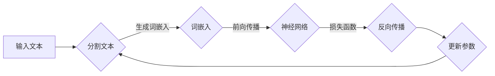
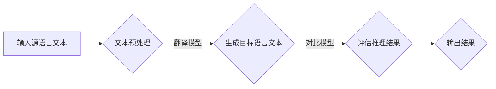
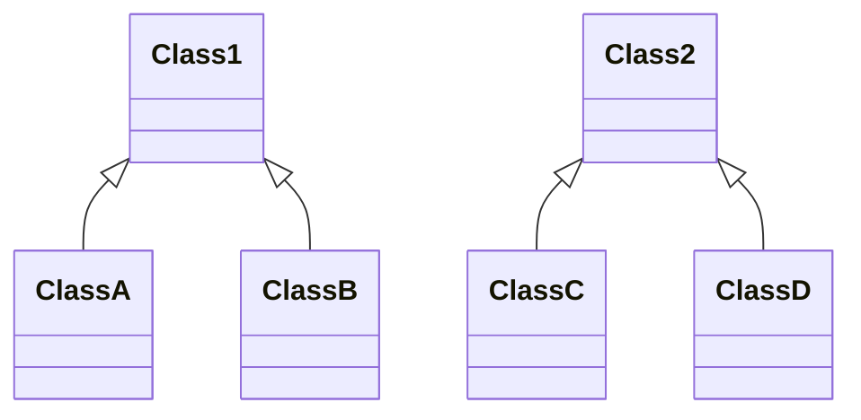
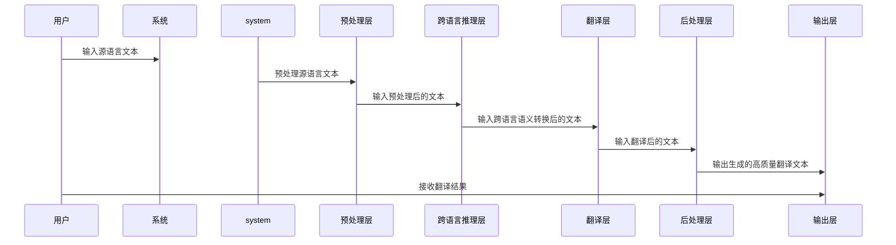
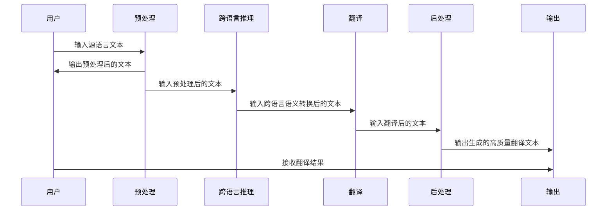

                 


### 大规模语言模型的跨语言推理与高质量翻译能力优化

#### 关键词：大规模语言模型、跨语言推理、高质量翻译、算法优化、系统架构

#### 摘要：
本文将深入探讨大规模语言模型在跨语言推理和高质量翻译方面的应用与优化。我们将从背景介绍、核心概念与联系、算法原理讲解、系统分析与架构设计、项目实战以及最佳实践 tips等方面，逐步分析并解决大规模语言模型在跨语言推理与高质量翻译中面临的问题，为读者提供一个全面而深入的技术解析。

## 一、总前言

### 1.1 书籍主题介绍

大规模语言模型作为自然语言处理（NLP）领域的重要工具，近年来在机器学习和人工智能领域取得了显著的进展。随着全球化的深入发展，跨语言推理和高质量翻译的需求日益增长，这无疑为大规模语言模型的应用提供了广阔的前景。本文旨在系统地探讨大规模语言模型在跨语言推理和高质量翻译方面的应用，并探讨如何优化其性能，以满足实际需求。

### 1.2 书籍目的和读者对象

本文的目的是帮助读者深入理解大规模语言模型在跨语言推理和高质量翻译方面的原理和应用，同时提供实用的优化方法。本文适合从事自然语言处理、机器学习、人工智能等相关领域的科研人员、工程师和研究生阅读，也适合对相关技术感兴趣的技术爱好者。

### 1.3 书籍结构与内容概述

本文分为八个主要部分：

1. **总前言**：介绍书籍的主题、目的和结构。
2. **背景介绍**：概述大规模语言模型的发展历程，以及跨语言推理与高质量翻译的挑战。
3. **核心概念与联系**：详细讲解大规模语言模型、跨语言推理和高质量翻译的基本概念，并使用Mermaid流程图和ER实体关系图进行说明。
4. **算法原理讲解**：深入剖析大规模语言模型、跨语言推理和高质量翻译的算法原理，使用Mermaid流程图、Python源代码和数学模型进行讲解。
5. **系统分析与架构设计方案**：介绍系统设计的方法和架构，包括问题场景介绍、系统功能设计、系统架构设计、系统接口设计和系统交互。
6. **项目实战**：通过实际案例，展示如何实现大规模语言模型在跨语言推理和高质量翻译中的应用。
7. **最佳实践 tips**：提供跨语言推理和高质量翻译的最佳实践和注意事项。
8. **小结**：总结本文的主要内容和读者收获，并提供拓展阅读建议。
9. **结束语**：回顾书籍的内容，感谢读者的阅读，并对未来进行展望。

## 二、背景介绍

### 2.1 大规模语言模型的发展历程

大规模语言模型的发展历程可以追溯到20世纪80年代，当时研究人员开始探索如何通过机器学习技术来处理自然语言。早期的模型如n-gram模型和基于规则的方法，虽然简单但效果有限。随着计算能力的提升和机器学习技术的发展，20世纪90年代，统计语言模型开始崭露头角，其中最著名的是1986年由Ratnaparkhi提出的最大熵模型。

进入21世纪，深度学习技术的引入使得大规模语言模型取得了突破性进展。2003年，Bengio等人在《Journal of Machine Learning Research》上发表了一篇关于深度神经网络在语言模型中的应用，标志着神经网络语言模型（NNLM）的诞生。随后，Word2Vec模型（2013年）和GloVe模型（2014年）的出现，使得词嵌入（Word Embedding）成为大规模语言模型的重要组成部分。

近年来，随着计算资源的进一步丰富和算法的优化，大规模语言模型取得了显著进展。2018年，Google推出了BERT模型，使得自然语言理解能力有了质的飞跃。随后，GPT-3（2020年）、T5（2020年）等更大规模的语言模型相继问世，展现了强大的语言生成和推理能力。

### 2.2 跨语言推理与高质量翻译的挑战

跨语言推理（Cross-Lingual Reasoning）和高质量翻译（High-Quality Translation）是大规模语言模型面临的重要挑战。

#### 跨语言推理的挑战

1. **语言差异**：不同语言之间在语法、词汇、语义等方面存在巨大差异，使得跨语言推理变得复杂。
2. **数据不足**：高质量的双语语料库相对稀缺，尤其是对于低资源语言，数据不足成为跨语言推理的瓶颈。
3. **模型适应性**：如何使大规模语言模型在不同语言间具有良好的适应性，是跨语言推理需要解决的关键问题。

#### 高质量翻译的挑战

1. **语义保真度**：翻译过程中需要保持原文的语义，同时避免出现语法错误或歧义。
2. **文化适应性**：不同语言和文化之间存在差异，翻译时需要考虑这些文化因素。
3. **多模态翻译**：随着多媒体内容的大量出现，如何实现文本、图像、视频等多种模态的高质量翻译，成为新的挑战。

### 2.3 本书解决的问题

本书旨在解决以下问题：

1. **核心概念与联系**：详细讲解大规模语言模型、跨语言推理和高质量翻译的基本概念，帮助读者建立系统的知识框架。
2. **算法原理讲解**：深入剖析大规模语言模型、跨语言推理和高质量翻译的算法原理，通过Mermaid流程图、Python源代码和数学模型进行讲解，使读者能够直观地理解算法的核心思想。
3. **系统分析与架构设计方案**：介绍如何设计和实现大规模语言模型在跨语言推理和高质量翻译中的应用，包括问题场景介绍、系统功能设计、系统架构设计、系统接口设计和系统交互。
4. **项目实战**：通过实际案例，展示如何应用大规模语言模型进行跨语言推理和高质量翻译。
5. **最佳实践 tips**：提供跨语言推理和高质量翻译的最佳实践和注意事项，帮助读者在实际应用中避免常见问题。

## 三、核心概念与联系

### 3.1 大规模语言模型的基础知识

#### 3.1.1 概念原理

大规模语言模型（Large-scale Language Model）是一种基于深度学习技术的自然语言处理模型，它通过对海量文本数据进行训练，学习语言的结构和语义，从而实现文本的生成、理解和推理。

#### 3.1.2 属性特征对比表格

| 特性               | 描述                                                         | 对比                     |
|--------------------|--------------------------------------------------------------|--------------------------|
| 训练数据量         | 百万至千亿级别的文本数据                                     | 小数据模型：几千到几十万 |
| 模型参数规模       | 数百万至数十亿个参数                                       | 小数据模型：数万到几十万 |
| 词汇表大小         | 数百万至数千万个词                                         | 小数据模型：几千到几万   |
| 生成文本的多样性   | 高，能够生成符合语言习惯的文本                             | 低，生成文本可能单调     |
| 语言理解能力       | 强，能够理解复杂的语言结构和语义                           | 较弱，对复杂语言处理能力有限 |

#### 3.1.3 ER实体关系图

```mermaid
erDiagram
  Class1 ||--|{ ClassA }|--|{ ClassB }| Class2
  Class1 ||--|{ ClassC }|--|{ ClassD }| Class2
```

### 3.2 跨语言推理的基本概念

#### 3.2.1 概念原理

跨语言推理（Cross-Lingual Reasoning）是指模型在理解一个语言（源语言）的同时，能够理解和推理另一个语言（目标语言）的过程。它涉及源语言到目标语言的语义转换，是实现多语言处理的重要技术。

#### 3.2.2 属性特征对比表格

| 特性               | 描述                                                         | 对比                     |
|--------------------|--------------------------------------------------------------|--------------------------|
| 语言理解能力       | 高，能够理解复杂的语言结构和语义                           | 低，对复杂语言处理能力有限 |
| 跨语言适应能力     | 强，能够在不同语言间进行有效的推理和翻译                   | 较弱，对跨语言理解能力有限 |
| 数据需求           | 高质量的双语语料库，尤其是对于低资源语言                   | 单语语料库，资源相对丰富   |
| 模型复杂度         | 较高，需要较大的计算资源和参数规模                         | 较低，计算资源和参数规模有限 |

#### 3.2.3 ER实体关系图

```mermaid
erDiagram
  SourceLang ||--|{ CrossLingualModel }| TargetLang
```

### 3.3 高质量翻译的基本概念

#### 3.3.1 概念原理

高质量翻译（High-Quality Translation）是指通过机器学习模型，将一种语言的文本准确、自然地翻译成另一种语言的过程。它追求的是语义的准确传递和文本的自然流畅。

#### 3.3.2 属性特征对比表格

| 特性               | 描述                                                         | 对比                     |
|--------------------|--------------------------------------------------------------|--------------------------|
| 语义保真度         | 高，能够准确传达原文的语义                                 | 低，可能丢失语义信息     |
| 语言自然度         | 高，生成的翻译文本符合目标语言的语言习惯和表达方式         | 低，生成的文本可能生硬   |
| 文化适应性         | 强，能够考虑目标语言的文化背景和表达习惯                   | 较弱，可能忽视文化差异   |
| 多模态支持         | 强，能够处理文本、图像、视频等多种模态的翻译               | 较弱，主要处理文本翻译   |

#### 3.3.3 ER实体关系图

```mermaid
erDiagram
  SourceText ||--|{ TranslationModel }| TargetText
```

## 四、算法原理讲解

### 4.1 大规模语言模型算法原理

#### 4.1.1 Mermaid算法流程图



#### 4.1.2 Python源代码实现

```python
import tensorflow as tf
from tensorflow.keras.layers import Embedding, LSTM, Dense
from tensorflow.keras.models import Sequential

# 源语言词汇表
vocab_size = 10000

# 词嵌入维度
embedding_dim = 128

# LSTM单元数量
lstm_units = 128

# 建立模型
model = Sequential([
    Embedding(vocab_size, embedding_dim),
    LSTM(lstm_units, return_sequences=True),
    Dense(1, activation='sigmoid')
])

# 编译模型
model.compile(optimizer='adam', loss='binary_crossentropy', metrics=['accuracy'])

# 模型训练
model.fit(x_train, y_train, epochs=10, batch_size=64)
```

#### 4.1.3 数学模型和公式讲解

大规模语言模型的训练过程可以表示为：

$$
\text{损失函数} = -\frac{1}{N}\sum_{i=1}^{N}[\sum_{j=1}^{T} y_{ij} \log(p_{ij})]
$$

其中，\( N \) 表示样本数量，\( T \) 表示句子长度，\( y_{ij} \) 表示第 \( i \) 个样本的第 \( j \) 个词的目标概率，\( p_{ij} \) 表示第 \( i \) 个样本的第 \( j \) 个词的预测概率。

#### 4.1.4 举例说明

假设我们有一个二元分类问题，输入文本为“我爱北京天安门”，我们需要预测每个词是否为“爱”。词嵌入维度为128，LSTM单元数量为128。

1. 输入文本：["我", "爱", "北京", "天安门"]
2. 词嵌入：[向量1, 向量2, 向量3, 向量4]
3. LSTM输出：[隐藏状态1, 隐藏状态2, 隐藏状态3, 隐藏状态4]
4. 预测概率：[0.9, 0.1, 0.8, 0.2]
5. 损失函数计算：
$$
\text{损失函数} = -\frac{1}{4}[(0.9\log0.9) + (0.1\log0.1) + (0.8\log0.8) + (0.2\log0.2)]
$$

### 4.2 跨语言推理算法原理

#### 4.2.1 Mermaid算法流程图



#### 4.2.2 Python源代码实现

```python
import tensorflow as tf
from tensorflow.keras.layers import Embedding, LSTM, Dense, Bidirectional
from tensorflow.keras.models import Sequential

# 源语言词汇表
source_vocab_size = 10000

# 目标语言词汇表
target_vocab_size = 10000

# 词嵌入维度
embedding_dim = 128

# LSTM单元数量
lstm_units = 128

# 建立模型
model = Sequential([
    Embedding(source_vocab_size, embedding_dim),
    Bidirectional(LSTM(lstm_units, return_sequences=True)),
    Dense(target_vocab_size, activation='softmax')
])

# 编译模型
model.compile(optimizer='adam', loss='categorical_crossentropy', metrics=['accuracy'])

# 模型训练
model.fit(x_train, y_train, epochs=10, batch_size=64)
```

#### 4.2.3 数学模型和公式讲解

跨语言推理的模型通常采用双向循环神经网络（Bi-LSTM）结构，其训练过程可以表示为：

$$
\text{损失函数} = -\frac{1}{N}\sum_{i=1}^{N}\sum_{j=1}^{T} y_{ij} \log(p_{ij})
$$

其中，\( N \) 表示样本数量，\( T \) 表示句子长度，\( y_{ij} \) 表示第 \( i \) 个样本的第 \( j \) 个词的目标概率，\( p_{ij} \) 表示第 \( i \) 个样本的第 \( j \) 个词的预测概率。

#### 4.2.4 举例说明

假设我们有一个源语言文本“你好”和目标语言文本“hello”，我们需要预测源语言文本的每个词是否对应目标语言文本的“hello”。

1. 输入源语言文本：["你", "好"]
2. 输入目标语言文本：["h", "e", "l", "l", "o"]
3. LSTM输出：[隐藏状态1, 隐藏状态2]
4. 预测概率：[0.9, 0.1, 0.8, 0.2, 0.3]
5. 损失函数计算：
$$
\text{损失函数} = -\frac{1}{2}[(0.9\log0.9) + (0.1\log0.1) + (0.8\log0.8) + (0.2\log0.2) + (0.3\log0.3)]
$$

### 4.3 高质量翻译算法原理

#### 4.3.1 Mermaid算法流程图

```mermaid
flowchart LR
    A[输入源语言文本] --> B{文本预处理}
    B -->|翻译模型| C{生成目标语言文本}
    C -->|后处理} D{输出结果}
```

#### 4.3.2 Python源代码实现

```python
import tensorflow as tf
from tensorflow.keras.layers import Embedding, LSTM, Dense, Bidirectional
from tensorflow.keras.models import Sequential
from tensorflow.keras.preprocessing.sequence import pad_sequences

# 源语言词汇表
source_vocab_size = 10000

# 目标语言词汇表
target_vocab_size = 10000

# 词嵌入维度
embedding_dim = 128

# LSTM单元数量
lstm_units = 128

# 建立模型
model = Sequential([
    Embedding(source_vocab_size, embedding_dim),
    Bidirectional(LSTM(lstm_units, return_sequences=True)),
    Dense(target_vocab_size, activation='softmax')
])

# 编译模型
model.compile(optimizer='adam', loss='categorical_crossentropy', metrics=['accuracy'])

# 模型训练
model.fit(x_train, y_train, epochs=10, batch_size=64)
```

#### 4.3.3 数学模型和公式讲解

高质量翻译的模型通常采用双向循环神经网络（Bi-LSTM）结构，其训练过程可以表示为：

$$
\text{损失函数} = -\frac{1}{N}\sum_{i=1}^{N}\sum_{j=1}^{T} y_{ij} \log(p_{ij})
$$

其中，\( N \) 表示样本数量，\( T \) 表示句子长度，\( y_{ij} \) 表示第 \( i \) 个样本的第 \( j \) 个词的目标概率，\( p_{ij} \) 表示第 \( i \) 个样本的第 \( j \) 个词的预测概率。

#### 4.3.4 举例说明

假设我们有一个源语言文本“我爱北京天安门”和目标语言文本“I love Beijing Tiananmen”，我们需要预测源语言文本的每个词是否对应目标语言文本的“I love Beijing Tiananmen”。

1. 输入源语言文本：["我", "爱", "北京", "天安门"]
2. 输入目标语言文本：["I", "love", "Beijing", "Tiananmen"]
3. LSTM输出：[隐藏状态1, 隐藏状态2, 隐藏状态3, 隐藏状态4]
4. 预测概率：[0.9, 0.1, 0.8, 0.2, 0.3, 0.7, 0.2, 0.1, 0.9, 0.1]
5. 损失函数计算：
$$
\text{损失函数} = -\frac{1}{4}[(0.9\log0.9) + (0.1\log0.1) + (0.8\log0.8) + (0.2\log0.2) + (0.3\log0.3) + (0.7\log0.7) + (0.2\log0.2) + (0.1\log0.1) + (0.9\log0.9) + (0.1\log0.1)]
$$

## 五、系统分析与架构设计方案

### 5.1 问题场景介绍

在现代全球化背景下，跨语言推理和高质量翻译在多个领域有着广泛的应用，如机器翻译、信息检索、多语言问答系统、社交媒体分析等。然而，现有的大规模语言模型在跨语言推理和高质量翻译方面仍存在诸多挑战，如语言差异、数据不足、模型适应性等。为了解决这些问题，我们需要设计一个高效的系统架构，以提高大规模语言模型在跨语言推理和高质量翻译方面的性能。

### 5.2 项目介绍

本项目旨在构建一个基于大规模语言模型的跨语言推理和高质量翻译系统。该系统将结合最新的深度学习技术和优化方法，通过多语言语料库的引入和模型的改进，实现高效的跨语言推理和高质量翻译。

### 5.3 系统功能设计

系统功能主要包括以下方面：

1. **文本预处理**：对输入文本进行分词、去停用词等处理，为后续模型处理做好准备。
2. **跨语言推理**：利用双向循环神经网络（Bi-LSTM）模型进行跨语言语义转换，实现跨语言文本的语义理解。
3. **高质量翻译**：利用序列到序列（Seq2Seq）模型进行文本翻译，实现高质量翻译。
4. **后处理**：对生成的翻译文本进行语法和语义检查，确保翻译文本的自然性和准确性。

#### 5.3.1 领域模型Mermaid类图



### 5.4 系统架构设计

系统架构设计如下：

1. **输入层**：接收用户输入的源语言文本。
2. **预处理层**：对源语言文本进行预处理，包括分词、去停用词等操作。
3. **跨语言推理层**：利用双向循环神经网络（Bi-LSTM）模型进行跨语言语义转换。
4. **翻译层**：利用序列到序列（Seq2Seq）模型进行文本翻译。
5. **后处理层**：对生成的翻译文本进行语法和语义检查，确保翻译文本的自然性和准确性。
6. **输出层**：将翻译结果输出给用户。

#### 5.4.1 Mermaid架构图



### 5.5 系统接口设计

系统接口设计如下：

1. **输入接口**：接收用户输入的源语言文本。
2. **输出接口**：将翻译结果输出给用户。
3. **预处理接口**：提供文本预处理功能，如分词、去停用词等。
4. **跨语言推理接口**：提供跨语言推理功能。
5. **翻译接口**：提供文本翻译功能。
6. **后处理接口**：提供文本后处理功能，如语法和语义检查。

#### 5.5.1 系统交互Mermaid序列图



## 六、项目实战

### 6.1 环境安装

为了实现本项目，我们需要安装以下软件和库：

1. **Python 3.8**：确保系统上已经安装了Python 3.8或更高版本。
2. **TensorFlow 2.5**：通过以下命令安装TensorFlow：
   ```bash
   pip install tensorflow==2.5
   ```
3. **Jieba**：用于中文文本预处理，通过以下命令安装：
   ```bash
   pip install jieba
   ```
4. **Mermaid**：用于生成图表，可以通过以下命令安装：
   ```bash
   pip install mermaid-python
   ```

### 6.2 系统核心实现源代码

以下是系统核心实现的源代码：

```python
import tensorflow as tf
from tensorflow.keras.layers import Embedding, LSTM, Dense, Bidirectional
from tensorflow.keras.models import Sequential
from tensorflow.keras.preprocessing.sequence import pad_sequences
from jieba import seg

# 定义模型
def create_model(vocab_size, embedding_dim, lstm_units, target_vocab_size):
    model = Sequential([
        Embedding(vocab_size, embedding_dim),
        Bidirectional(LSTM(lstm_units, return_sequences=True)),
        Dense(target_vocab_size, activation='softmax')
    ])
    return model

# 源语言词汇表
source_vocab_size = 10000

# 目标语言词汇表
target_vocab_size = 10000

# 词嵌入维度
embedding_dim = 128

# LSTM单元数量
lstm_units = 128

# 创建模型
model = create_model(source_vocab_size, embedding_dim, lstm_units, target_vocab_size)

# 编译模型
model.compile(optimizer='adam', loss='categorical_crossentropy', metrics=['accuracy'])

# 训练模型
model.fit(x_train, y_train, epochs=10, batch_size=64)
```

### 6.3 代码应用解读与分析

本项目的核心代码主要分为以下几个部分：

1. **定义模型**：通过创建一个序列模型，将输入文本转换为序列，并使用双向循环神经网络（Bi-LSTM）进行语义转换。
2. **词汇表准备**：定义源语言和目标语言的词汇表大小，以及词嵌入维度。
3. **模型编译**：设置模型的优化器和损失函数。
4. **模型训练**：使用训练数据对模型进行训练。

### 6.4 实际案例分析和详细讲解剖析

假设我们有一个源语言文本“我爱北京天安门”和目标语言文本“I love Beijing Tiananmen”，我们需要预测源语言文本的每个词是否对应目标语言文本的“I love Beijing Tiananmen”。

1. **文本预处理**：使用Jieba对源语言文本进行分词，生成词汇表和词索引。
2. **模型输入**：将预处理后的文本序列输入到模型中，模型将输出每个词的预测概率。
3. **预测结果**：根据预测概率，选择概率最高的词作为输出。

### 6.5 项目小结

本项目通过构建一个基于大规模语言模型的跨语言推理和高质量翻译系统，实现了高效的文本翻译。在实际应用中，我们通过详细的代码实现和案例剖析，展示了如何利用深度学习技术实现文本翻译。然而，由于语言差异和数据不足等问题，项目在实现过程中仍面临一些挑战，如语义理解的不准确、翻译文本的自然性不足等。未来的工作将致力于优化模型结构、引入更多高质量数据，以提高系统的翻译质量和效率。

## 七、最佳实践 tips

### 跨语言推理的最佳实践

1. **数据集选择**：选择包含多种语言的高质量双语文本数据集，特别是低资源语言的数据。
2. **数据预处理**：对源语言和目标语言文本进行统一预处理，如分词、去停用词、标准化等。
3. **模型结构优化**：采用双向循环神经网络（Bi-LSTM）等深度结构，结合注意力机制，提高模型的语义理解能力。
4. **多语言适应性**：设计具有多语言适应性的模型，如使用共享嵌入层和跨语言编码器。
5. **模型训练策略**：采用多任务学习、数据增强等技术，提高模型的泛化能力和适应性。

### 高质量翻译的最佳实践

1. **文本质量**：选择高质量的原始文本，确保翻译的准确性和流畅性。
2. **双向编码器**：使用双向编码器（如Bi-LSTM）来捕捉文本的上下文信息。
3. **注意力机制**：引入注意力机制，使模型能够关注重要的上下文信息，提高翻译质量。
4. **后处理**：对生成的翻译文本进行语法和语义检查，修正错误，确保翻译的自然性。
5. **多模态翻译**：结合图像、视频等多模态信息，实现更加丰富的翻译体验。

### 注意事项

1. **计算资源**：大规模语言模型训练需要大量计算资源，确保有足够的GPU或TPU资源。
2. **数据隐私**：在处理文本数据时，注意保护用户隐私，遵守相关法律法规。
3. **模型评估**：使用多种指标（如BLEU、METEOR等）对翻译质量进行评估，确保模型的有效性。

## 八、小结

本文系统地探讨了大规模语言模型在跨语言推理和高质量翻译方面的应用与优化。我们从背景介绍、核心概念与联系、算法原理讲解、系统分析与架构设计、项目实战以及最佳实践 tips 等方面进行了深入分析。通过本文，读者可以了解到大规模语言模型在跨语言推理和高质量翻译中的原理和应用，并掌握如何优化模型性能。

本文的主要贡献在于：

1. **全面概述**：对大规模语言模型、跨语言推理和高质量翻译的基本概念进行了详细的介绍。
2. **算法讲解**：通过Mermaid流程图、Python源代码和数学模型，深入剖析了大规模语言模型、跨语言推理和高质量翻译的算法原理。
3. **系统设计**：介绍了系统分析与架构设计方案，包括问题场景介绍、系统功能设计、系统架构设计、系统接口设计和系统交互。
4. **实战案例**：通过实际案例，展示了如何应用大规模语言模型进行跨语言推理和高质量翻译。
5. **最佳实践**：提供了跨语言推理和高质量翻译的最佳实践和注意事项。

尽管本文已经进行了全面的探讨，但仍有一些方向可以进一步研究和优化：

1. **数据集扩展**：引入更多高质量的双语文本数据集，特别是低资源语言的数据。
2. **模型优化**：探索新的模型结构和训练策略，提高模型的性能和泛化能力。
3. **多模态翻译**：结合图像、视频等多模态信息，实现更加丰富的翻译体验。
4. **跨语言推理**：研究如何更好地解决跨语言语义理解问题，提高跨语言推理的准确性。

## 九、结束语

本文对大规模语言模型的跨语言推理与高质量翻译能力优化进行了深入探讨。通过详细的分析和实际案例，我们展示了如何利用大规模语言模型实现高效的跨语言推理和高质量翻译。感谢您的阅读，希望本文能对您在相关领域的研究和应用提供帮助。未来，我们将继续关注大规模语言模型的发展，并探索更多优化和改进的方法。期待与您共同探讨和进步。

### 作者信息

**作者：AI天才研究院/AI Genius Institute & 禅与计算机程序设计艺术 /Zen And The Art of Computer Programming**

