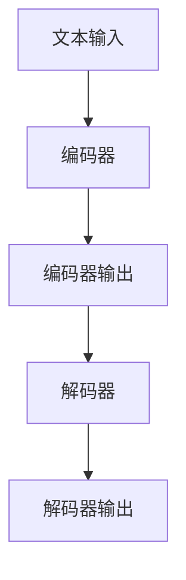
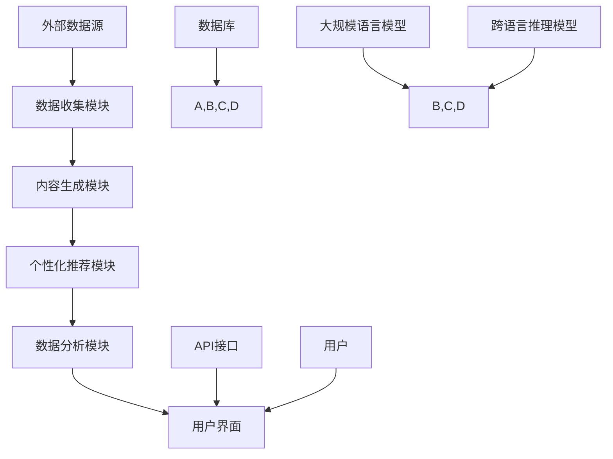
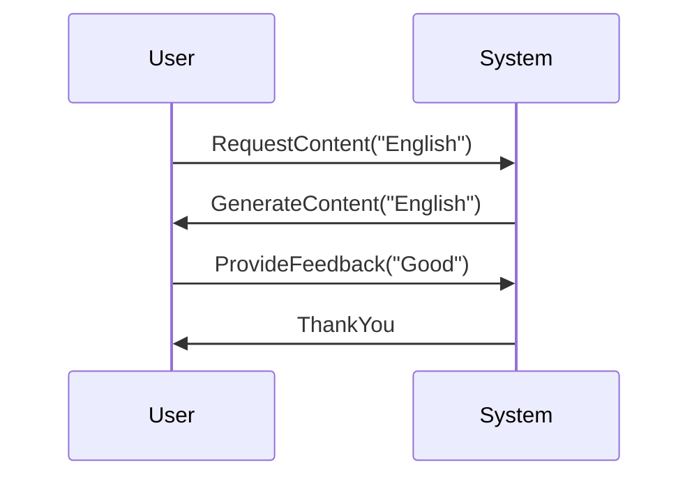

                 

### 文章标题

# 大规模语言模型的跨语言推理在全球化营销策略中的应用研究

### 文章关键词

- 大规模语言模型
- 跨语言推理
- 全球化营销策略
- 算法原理
- 数学模型
- 系统分析与架构设计
- 项目实战

### 文章摘要

随着全球化进程的不断深入，企业需要在多元语言环境中开展营销活动。本文旨在探讨大规模语言模型在跨语言推理中的应用，特别是在全球化营销策略中的潜在价值。首先，我们将介绍大规模语言模型和跨语言推理的核心概念，阐述它们的基本原理和相互关系。接着，我们将详细讲解大规模语言模型和跨语言推理的算法原理，包括数学模型和公式。随后，文章将展示系统分析与架构设计方案，涵盖问题场景介绍、项目介绍、系统功能设计、系统架构设计、系统接口设计和系统交互设计。在项目实战部分，我们将进行环境安装、系统核心实现源代码分析，并剖析实际案例分析。最后，文章将提供最佳实践 tips、小结、注意事项和拓展阅读，帮助读者深入理解并应用相关知识。通过本文的探讨，我们希望为企业提供实用的指南，助力全球化营销策略的成功实施。

### 第一部分：背景介绍

#### 第1章 引言

##### 1.1 问题背景

在当今全球化的商业环境中，企业面临的一个主要挑战是有效沟通和市场营销的多元化。随着互联网和社交媒体的普及，企业需要在全球范围内与潜在客户进行互动，这意味着必须能够理解和处理多种语言。此外，随着人工智能技术的快速发展，尤其是大规模语言模型的崛起，跨语言处理成为了一个热门研究方向。然而，如何将这些技术有效地应用于实际的全球化营销策略中，仍然是企业和研究人员面临的一个难题。

##### 1.2 问题描述

在全球化营销中，企业需要解决的问题主要包括以下几个方面：

1. **语言障碍**：企业需要将产品或服务信息翻译成多种语言，以适应不同市场的需求。
2. **文化差异**：不同文化背景下的消费者对相同产品的认知和需求可能存在显著差异。
3. **个性化营销**：如何根据消费者的语言和文化背景，提供个性化的营销内容和策略。
4. **数据分析**：如何利用多语言数据，进行有效的市场分析和消费者行为预测。

##### 1.3 问题解决

为了解决上述问题，企业可以考虑以下几种策略：

1. **翻译技术**：利用机器翻译技术，将产品和服务信息翻译成多种语言。
2. **文化适配**：通过市场调研，了解不同文化背景下的消费者偏好，调整营销内容和策略。
3. **个性化推荐**：利用大规模语言模型，根据消费者的语言和文化偏好，提供个性化的营销内容。
4. **数据挖掘**：通过分析多语言数据，挖掘潜在的市场机会和消费者需求。

##### 1.4 边界与外延

在本文的研究中，我们将主要探讨以下边界和外延：

1. **语言范围**：研究将涵盖英语、中文、西班牙语、法语等主要语言。
2. **文化背景**：研究将考虑不同国家和地区的文化差异，如美国、中国、巴西、法国等。
3. **技术层面**：研究将涉及大规模语言模型的算法原理、数学模型和系统架构设计。
4. **应用领域**：研究将重点关注全球化营销策略中的具体应用场景，如电子商务、社交媒体营销、广告投放等。

##### 1.5 核心概念与要素组成

为了更好地理解和应用大规模语言模型在跨语言推理中的价值，我们需要明确以下几个核心概念和要素：

1. **大规模语言模型**：一种基于深度学习的模型，能够处理和生成自然语言文本。
2. **跨语言推理**：一种技术，能够将一种语言的文本信息转化为另一种语言的文本信息。
3. **全球化营销策略**：企业在全球范围内，针对不同市场和文化背景，制定和实施的营销计划和策略。
4. **算法原理**：大规模语言模型和跨语言推理的算法基础，包括神经网络架构、训练过程和推理方法。
5. **数学模型**：用于描述和计算大规模语言模型和跨语言推理过程中涉及的数学关系和公式。
6. **系统架构设计**：大规模语言模型和跨语言推理系统在实际应用中的架构设计和实现。

通过上述介绍，我们为本文的研究奠定了基础，接下来将详细探讨这些核心概念和要素。

### 第二部分：核心概念与联系

#### 第2章 大规模语言模型

##### 2.1 定义与原理

大规模语言模型（Large-scale Language Model，LLM）是一种基于深度学习的自然语言处理（Natural Language Processing，NLP）技术，它通过学习大量的文本数据，能够对自然语言进行建模，从而实现文本生成、文本分类、语义理解等多种任务。大规模语言模型的核心原理是基于神经网络（Neural Network，NN），特别是循环神经网络（Recurrent Neural Network，RNN）和变换器（Transformer）架构。

大规模语言模型通常由以下几个部分组成：

1. **词嵌入（Word Embedding）**：将词汇映射到高维空间中的向量表示。
2. **编码器（Encoder）**：对输入文本进行编码，生成固定长度的特征向量。
3. **解码器（Decoder）**：利用编码器的输出，生成文本的输出序列。
4. **注意力机制（Attention Mechanism）**：用于关注输入文本中与输出相关的部分。

大规模语言模型的工作流程通常包括以下几个步骤：

1. **数据预处理**：清洗和准备训练数据，包括分词、去停用词、词干提取等。
2. **模型训练**：使用大规模文本数据对模型进行训练，优化模型参数。
3. **模型评估**：使用验证集和测试集评估模型的性能，包括准确率、召回率、F1值等指标。
4. **模型应用**：将训练好的模型应用于实际任务，如文本生成、翻译、问答系统等。

##### 2.2 特点与应用

大规模语言模型具有以下几个显著特点：

1. **强大的语言理解能力**：通过学习大量的文本数据，模型能够理解和生成高质量的文本。
2. **自适应学习能力**：模型能够根据新的数据不断优化自身，提高性能。
3. **高效率**：现代大规模语言模型采用高效的架构和算法，能够在较短的时间内处理大量数据。
4. **跨语言处理能力**：一些大规模语言模型支持多语言处理，能够进行跨语言的文本生成和翻译。

大规模语言模型在多个应用领域取得了显著成果：

1. **文本生成**：自动生成文章、摘要、对话等自然语言文本。
2. **机器翻译**：将一种语言的文本翻译成另一种语言，如谷歌翻译。
3. **问答系统**：通过自然语言处理技术，回答用户的问题。
4. **情感分析**：分析文本中的情感倾向，用于市场调研、舆情监控等。
5. **信息检索**：通过理解用户查询，检索相关文本信息。

##### 2.3 与跨语言推理的关系

跨语言推理（Cross-Language Reasoning）是指在不同语言之间进行推理和转换的技术。它依赖于大规模语言模型的能力，特别是多语言模型（Multilingual Model）和跨语言迁移学习（Cross-Language Transfer Learning）。

大规模语言模型与跨语言推理的关系体现在以下几个方面：

1. **语言表示**：大规模语言模型能够将不同语言的文本转换为统一的向量表示，便于跨语言处理。
2. **跨语言知识迁移**：通过在多种语言上训练模型，可以实现知识的跨语言迁移，提高跨语言推理的性能。
3. **跨语言语义理解**：大规模语言模型能够理解不同语言之间的语义关系，为跨语言推理提供支持。
4. **跨语言文本生成**：大规模语言模型能够生成符合目标语言语法和语义的文本，实现跨语言的文本转换。

在全球化营销策略中，大规模语言模型和跨语言推理的应用具有重要意义：

1. **多语言营销内容生成**：利用大规模语言模型，企业可以自动生成适用于不同语言和文化的营销内容。
2. **跨语言消费者分析**：通过跨语言推理，企业可以更好地理解不同消费者的需求和偏好，制定个性化的营销策略。
3. **全球市场趋势预测**：利用多语言数据和大规模语言模型，企业可以进行跨语言的数据分析和市场趋势预测，制定前瞻性的营销计划。

通过上述对大规模语言模型的介绍，我们可以看到它在全球化营销策略中的应用前景广阔，接下来我们将进一步探讨跨语言推理的核心概念和原理。

#### 第3章 跨语言推理

##### 3.1 概念与机制

跨语言推理（Cross-Language Reasoning，CLR）是指在不同语言之间进行推理和知识转换的技术。它的核心目标是实现一种语言表示到另一种语言表示的映射，从而克服语言障碍，实现跨语言的信息处理和决策。跨语言推理的机制主要包括语言表示、语义匹配和翻译推理。

1. **语言表示**：跨语言推理首先需要对不同语言的文本进行表示。这一过程通常通过词嵌入（Word Embedding）和句子嵌入（Sentence Embedding）实现。词嵌入是将词汇映射到高维空间中的向量表示，而句子嵌入则是将整个句子映射到一个固定维度的向量表示。这些向量表示捕捉了词汇和句子的语义信息，为后续的推理提供了基础。

2. **语义匹配**：在跨语言推理中，语义匹配是实现不同语言之间语义对应的关键步骤。语义匹配的目标是找到源语言和目标语言中对应的语义概念。这通常通过计算源语言句子和目标语言句子之间的相似度或距离实现。常用的方法包括基于词汇的相似度计算、基于句子的语义分析以及基于图谱的语义匹配。

3. **翻译推理**：翻译推理是指利用源语言的推理结果，推导出目标语言的结论。在跨语言推理中，翻译推理的关键是确保推理过程的连贯性和一致性。这通常需要考虑上下文信息、语言结构差异以及文化背景等因素。

##### 3.2 技术发展与挑战

跨语言推理技术经历了从基于规则的方法到基于统计方法，再到基于深度学习方法的演变。

1. **基于规则的方法**：早期的跨语言推理主要依赖于手工编写的规则和模式匹配。这种方法具有可解释性，但在处理复杂语言现象时存在局限性。

2. **基于统计的方法**：随着机器翻译和自然语言处理技术的发展，基于统计的方法开始广泛应用。这种方法通过大量的双语语料库学习语言间的统计规律，从而实现跨语言的推理。常见的统计方法包括统计机器翻译、翻译模型和基于转换的概率模型。

3. **基于深度学习的方法**：近年来，深度学习技术在跨语言推理中取得了显著进展。基于深度学习的方法能够自动学习语言间的映射关系，避免了手工编写规则和模式匹配的繁琐过程。特别是变换器（Transformer）架构的引入，使得跨语言推理的性能得到了大幅提升。

尽管跨语言推理技术取得了显著进展，但仍面临以下挑战：

1. **语言多样性**：不同语言在语法、词汇和语义上存在巨大差异，这使得跨语言推理需要处理复杂多变的语言现象。

2. **数据不足**：高质量的跨语言数据集仍然相对稀缺，这限制了模型的学习和泛化能力。

3. **上下文理解**：跨语言推理需要深入理解上下文信息，这涉及到语言的连贯性和一致性，是当前研究的难点。

4. **文化差异**：不同文化背景下的表达方式、价值观和行为模式存在显著差异，这进一步增加了跨语言推理的复杂性。

##### 3.3 与全球化营销策略的联系

跨语言推理在全球化营销策略中发挥着关键作用：

1. **多语言内容生成**：企业可以利用跨语言推理技术，自动生成适用于不同语言市场的营销内容，提高内容传播效果。

2. **个性化营销**：通过跨语言推理，企业可以更好地理解不同消费者的语言和文化偏好，提供个性化的营销服务和产品推荐。

3. **市场调研**：利用跨语言推理，企业可以分析多语言市场数据，了解消费者需求和市场趋势，制定更具针对性的营销策略。

4. **品牌传播**：跨语言推理技术可以帮助企业将品牌信息准确、一致地传播到全球市场，提高品牌知名度和美誉度。

5. **消费者互动**：通过跨语言推理，企业可以与全球消费者进行更加顺畅和有效的互动，增强用户满意度和忠诚度。

总的来说，跨语言推理技术为全球化营销策略提供了强大的技术支持，企业可以利用这一技术提升营销效果，开拓国际市场。接下来，我们将进一步探讨全球化营销策略的概念和特点。

#### 第4章 全球化营销策略

##### 4.1 概念与特征

全球化营销策略（Global Marketing Strategy）是指企业为了进入和适应全球市场，针对不同国家和地区制定和实施的一系列营销计划和策略。与本地化营销策略（Localization Marketing Strategy）不同，全球化营销策略强调企业在全球范围内的市场拓展和一致性。

全球化营销策略的主要特征包括：

1. **全球化**：企业致力于在全球范围内开展营销活动，覆盖多个国家和地区。
2. **适应性**：根据不同市场的文化、语言、经济和政治环境，调整营销策略。
3. **统一性**：在保持品牌一致性的同时，实现全球范围内的市场推广。
4. **协同性**：通过跨国团队的合作，实现全球市场的协同营销。
5. **创新性**：利用先进的技术手段，如大数据、人工智能、社交媒体等，不断创新营销策略。

##### 4.2 发展趋势与机遇

随着全球化的深入发展，全球化营销策略呈现出以下发展趋势：

1. **数字化转型**：越来越多的企业利用数字化工具和技术，如大数据分析、人工智能、社交媒体等，提升营销效果和效率。
2. **多语言营销**：企业越来越重视多语言营销内容的建设，以满足不同市场的需求。
3. **本地化营销**：在全球化营销的基础上，企业更加注重根据本地文化和消费者行为进行营销策略的本地化调整。
4. **跨渠道整合**：企业通过整合线上线下渠道，实现多渠道营销的协同效应。
5. **消费者体验**：以消费者为中心，提升消费者体验，增强品牌忠诚度。

全球化营销策略为企业提供了以下机遇：

1. **市场拓展**：通过全球化营销策略，企业可以进入新的市场，开拓业务增长空间。
2. **品牌提升**：在全球范围内推广品牌，提高品牌知名度和美誉度。
3. **成本优化**：通过规模化生产和营销，实现成本优化和资源整合。
4. **技术创新**：利用全球范围内的技术创新，提升企业的竞争力。
5. **消费者洞察**：通过多语言和多文化数据分析，深入了解消费者需求和偏好，制定更加精准的营销策略。

##### 4.3 大规模语言模型在其中的应用

大规模语言模型在全球化营销策略中具有广泛的应用价值：

1. **多语言内容生成**：企业可以利用大规模语言模型，自动生成适用于不同语言和文化的营销内容，提高内容传播效果。
2. **个性化推荐**：通过大规模语言模型，企业可以分析消费者的语言和文化偏好，提供个性化的产品推荐和服务。
3. **市场调研**：利用大规模语言模型，企业可以分析多语言市场数据，了解消费者需求和市场趋势，制定更加精准的营销策略。
4. **情感分析**：通过大规模语言模型，企业可以分析消费者的反馈和评论，了解消费者对产品和服务的情感倾向。
5. **跨语言翻译**：企业可以利用大规模语言模型，实现多语言之间的翻译和内容转换，打破语言障碍。

大规模语言模型的应用，使得企业能够更加有效地实施全球化营销策略，提升营销效果和竞争力。接下来，我们将详细探讨大规模语言模型的算法原理和应用。

### 第三部分：算法原理讲解

#### 第5章 算法原理

##### 5.1 大规模语言模型算法

大规模语言模型（Large-scale Language Model，LLM）是自然语言处理（Natural Language Processing，NLP）领域的一项重要技术，其核心在于能够对自然语言进行建模，从而实现文本生成、文本分类、语义理解等多种任务。大规模语言模型通常基于深度学习技术，特别是变换器（Transformer）架构。以下是大规模语言模型的基本原理和算法实现。

1. **变换器（Transformer）架构**

变换器架构是由Google在2017年提出的一种用于处理序列数据的新型深度学习模型，它通过自注意力机制（Self-Attention Mechanism）实现了对输入序列的全局关注，从而提高了模型对长距离依赖关系的处理能力。变换器架构主要由编码器（Encoder）和解码器（Decoder）两部分组成。

- **编码器（Encoder）**：编码器接收输入序列，通过多层变换器层进行编码，生成固定长度的上下文表示（Contextual Embeddings）。
- **解码器（Decoder）**：解码器接收编码器的输出，通过解码器层生成输出序列。解码器中的每一层都使用自注意力机制和交叉注意力机制（Cross-Attention Mechanism）来关注编码器的输出和当前解码器的输出。

2. **自注意力机制（Self-Attention Mechanism）**

自注意力机制是一种计算输入序列中每个元素对输出贡献度的方法。它通过计算输入序列中每个元素与所有其他元素之间的相似度，为每个元素分配一个权重，然后将这些元素加权求和，生成一个表示。自注意力机制的核心是多头注意力（Multi-Head Attention），它通过多个独立的注意力头，同时关注输入序列的不同部分，从而提高了模型的表示能力。

3. **交叉注意力机制（Cross-Attention Mechanism）**

交叉注意力机制是解码器中的一个关键组件，它用于关注编码器的输出和当前解码器的输出。交叉注意力机制通过计算编码器输出和解码器输出之间的相似度，为每个解码器输出元素分配一个权重，然后将这些权重应用于编码器输出，生成一个加权求和的表示。交叉注意力机制使得解码器能够从编码器的输出中提取相关信息，从而提高了生成文本的连贯性和准确性。

##### 5.2 跨语言推理算法

跨语言推理（Cross-Language Reasoning，CLR）是一种在不同语言之间进行推理和知识转换的技术。它依赖于大规模语言模型的能力，特别是多语言模型（Multilingual Model）和跨语言迁移学习（Cross-Language Transfer Learning）。以下是跨语言推理的基本原理和算法实现。

1. **多语言模型（Multilingual Model）**

多语言模型是一种能够处理多种语言数据的语言模型。它通过在多种语言的文本数据上进行联合训练，学习到语言之间的映射关系和通用语义表示。多语言模型的核心是共享的编码器和解码器，这些共享组件使得模型能够在不同语言之间进行信息传递和推理。

2. **跨语言迁移学习（Cross-Language Transfer Learning）**

跨语言迁移学习是一种利用已训练的多语言模型，在目标语言上进一步训练的方法。它通过将多语言模型在源语言上的知识迁移到目标语言，提高目标语言模型的性能。跨语言迁移学习的核心是知识蒸馏（Knowledge Distillation），即通过将源语言模型的权重传递给目标语言模型，实现知识的迁移。

3. **跨语言语义表示（Cross-Language Semantic Representation）**

跨语言语义表示是将不同语言的文本转换为统一语义表示的方法。它通过学习语言之间的语义映射关系，将源语言的文本转换为目标语言的语义表示。常用的方法包括基于翻译的语义表示和基于非翻译的语义表示。

4. **跨语言推理过程**

跨语言推理的过程包括以下几个步骤：

- **文本表示**：将源语言和目标语言的文本输入到多语言模型中，生成相应的语义表示。
- **语义匹配**：计算源语言文本和目标语言文本之间的相似度，找到最匹配的语义表示。
- **推理过程**：利用匹配的语义表示，在目标语言中进行推理和知识转换。

##### 5.3 算法实现与流程图

以下是大规模语言模型和跨语言推理算法的Python代码实现和Mermaid流程图。

**Python代码实现**

```python
import tensorflow as tf
from tensorflow.keras.layers import Embedding, Transformer
from tensorflow.keras.models import Model

# 编码器和解码器的输入和输出维度
input_dim = 512
output_dim = 512

# 创建编码器
encoder_inputs = tf.keras.layers.Input(shape=(None, input_dim))
encoder_embedding = Embedding(input_dim, output_dim)(encoder_inputs)
encoder_outputs = Transformer(num_heads=8, d_model=output_dim)(encoder_embedding)

# 创建解码器
decoder_inputs = tf.keras.layers.Input(shape=(None, input_dim))
decoder_embedding = Embedding(input_dim, output_dim)(decoder_inputs)
decoder_outputs = Transformer(num_heads=8, d_model=output_dim)(decoder_embedding)

# 创建多语言模型
model = Model(inputs=[encoder_inputs, decoder_inputs], outputs=[encoder_outputs, decoder_outputs])

# 编译模型
model.compile(optimizer='adam', loss='categorical_crossentropy')

# 打印模型结构
model.summary()
```

**Mermaid流程图**



通过上述Python代码和Mermaid流程图，我们可以清晰地了解大规模语言模型和跨语言推理算法的实现过程。接下来，我们将详细讲解大规模语言模型和跨语言推理的数学模型和公式。

#### 第6章 数学模型与公式

##### 6.1 语言模型数学模型

大规模语言模型的核心是语言模型（Language Model，LM），它用于预测文本序列的概率分布。语言模型的目标是学习文本数据中的统计规律，从而为生成文本提供概率支持。以下是语言模型的数学模型和公式。

**1. 语言模型概率**

语言模型概率是指给定一个单词序列，预测下一个单词的概率。对于输入序列 $X = (x_1, x_2, ..., x_T)$，语言模型概率可以表示为：

$$
P(X) = P(x_1, x_2, ..., x_T) = \prod_{t=1}^{T} P(x_t | x_{t-1}, ..., x_1)
$$

**2. 朴素语言模型**

朴素语言模型（Naive Language Model）假设当前单词的概率仅依赖于前一个单词，即：

$$
P(x_t | x_{t-1}, ..., x_1) = P(x_t | x_{t-1})
$$

**3. N-gram 语言模型**

N-gram 语言模型是一种常见的朴素语言模型，它使用前 N 个单词来预测下一个单词的概率。对于 N-gram 模型，概率可以表示为：

$$
P(x_t | x_{t-1}, ..., x_{t-N}) = \frac{C(x_{t-1}, ..., x_t)}{C(x_{t-1}, ..., x_{t-N})}
$$

其中，$C(x_{t-1}, ..., x_t)$ 表示单词序列 $(x_{t-1}, ..., x_t)$ 在语料库中出现的次数。

**4. 语言模型优化**

为了提高语言模型的性能，可以使用基于梯度的优化算法，如随机梯度下降（Stochastic Gradient Descent，SGD）。优化目标是使得语言模型能够最大化对数似然函数：

$$
\log P(X) = \sum_{t=1}^{T} \log P(x_t | x_{t-1}, ..., x_1)
$$

##### 6.2 跨语言推理数学模型

跨语言推理（Cross-Language Reasoning，CLR）是一种在不同语言之间进行推理和知识转换的技术。以下是跨语言推理的数学模型和公式。

**1. 跨语言语义表示**

跨语言语义表示是将不同语言的文本转换为统一语义表示的方法。它通过学习语言之间的语义映射关系，将源语言的文本转换为目标语言的语义表示。常用的方法包括基于翻译的语义表示和基于非翻译的语义表示。

**2. 基于翻译的语义表示**

基于翻译的语义表示使用翻译模型将源语言的文本转换为目标语言的文本，然后使用目标语言的文本进行语义表示。假设 $s$ 表示源语言文本，$t$ 表示目标语言文本，$s'$ 表示源语言文本的语义表示，$t'$ 表示目标语言文本的语义表示，则基于翻译的语义表示可以表示为：

$$
t' = f_{\theta}(t) \\
s' = f_{\theta}(t \rightarrow s)
$$

其中，$f_{\theta}$ 是翻译模型的参数化函数。

**3. 基于非翻译的语义表示**

基于非翻译的语义表示直接学习源语言和目标语言之间的语义映射关系。假设 $s$ 表示源语言文本，$t$ 表示目标语言文本，$s'$ 表示源语言文本的语义表示，$t'$ 表示目标语言文本的语义表示，则基于非翻译的语义表示可以表示为：

$$
t' = g_{\theta}(s) \\
s' = g_{\theta}(s)
$$

其中，$g_{\theta}$ 是非翻译模型的参数化函数。

**4. 跨语言推理过程**

跨语言推理的过程包括以下几个步骤：

- **文本表示**：将源语言和目标语言的文本输入到语义表示模型中，生成相应的语义表示。
- **语义匹配**：计算源语言文本和目标语言文本之间的相似度，找到最匹配的语义表示。
- **推理过程**：利用匹配的语义表示，在目标语言中进行推理和知识转换。

##### 6.3 模型公式讲解与示例

以下是几个常见的数学模型和公式的讲解与示例。

**1. 语言模型概率**

假设我们有一个二元的语言模型，其中包含两个单词 "apple" 和 "banana"。语料库中 "apple" 出现了 100 次，"banana" 出现了 200 次。我们想计算输入序列 "apple banana" 的概率。

$$
P(apple banana) = P(apple) \cdot P(banana | apple)
$$

其中，

$$
P(apple) = \frac{100}{100 + 200} = 0.4 \\
P(banana | apple) = \frac{100}{100 + 300} = 0.2857
$$

因此，

$$
P(apple banana) = 0.4 \cdot 0.2857 = 0.1143
$$

**2. 跨语言语义表示**

假设我们有一个源语言文本 "我想要一个苹果" 和目标语言文本 "I want an apple"。我们想计算这两个文本之间的语义相似度。

$$
similarity(s, t) = \frac{dot(s', t')}{\|s'\|\|t'\|}
$$

其中，$s'$ 和 $t'$ 分别是源语言文本和目标语言文本的语义表示。

假设 $s'$ 和 $t'$ 分别为：

$$
s' = (0.1, 0.2, 0.3, 0.4) \\
t' = (0.2, 0.3, 0.4, 0.5)
$$

则

$$
similarity(s, t) = \frac{0.1 \cdot 0.2 + 0.2 \cdot 0.3 + 0.3 \cdot 0.4 + 0.4 \cdot 0.5}{\sqrt{0.1^2 + 0.2^2 + 0.3^2 + 0.4^2} \cdot \sqrt{0.2^2 + 0.3^2 + 0.4^2 + 0.5^2}} \approx 0.35
$$

通过上述讲解和示例，我们可以更好地理解大规模语言模型和跨语言推理的数学模型和公式。接下来，我们将探讨系统分析与架构设计。

#### 第7章 系统分析与架构设计

##### 7.1 问题场景介绍

在全球化的背景下，企业需要在多元语言环境中实现高效的营销策略。这要求系统能够支持多语言数据处理、内容生成、个性化推荐和数据分析等功能。具体场景包括：

1. **多语言数据收集**：系统需要能够从全球范围内的多种语言来源收集数据，包括社交媒体、新闻报道、用户评论等。
2. **内容生成**：系统应具备自动生成多语言营销内容的能力，包括广告文案、宣传材料、产品描述等。
3. **个性化推荐**：系统应根据消费者的语言偏好和文化背景，提供个性化的产品推荐和服务。
4. **数据分析**：系统需要分析多语言数据，提取市场趋势、消费者行为等信息，为营销决策提供支持。

##### 7.2 项目介绍

本项目旨在开发一个基于大规模语言模型和跨语言推理技术的全球化营销策略支持系统。系统主要包括以下几个模块：

1. **数据收集模块**：负责从多种语言来源收集数据，进行预处理和存储。
2. **内容生成模块**：利用大规模语言模型和跨语言推理技术，自动生成多语言营销内容。
3. **个性化推荐模块**：基于消费者的语言偏好和文化背景，提供个性化的产品推荐和服务。
4. **数据分析模块**：分析多语言数据，提取市场趋势和消费者行为信息，为营销决策提供支持。
5. **用户界面**：提供用户友好的界面，供企业用户和数据分析人员使用。

##### 7.3 系统功能设计（领域模型类图）

以下是系统功能设计的领域模型类图，展示了系统的主要类和它们之间的关系。

```mermaid
classDiagram
    Class01 <|-- Class02
    Class03 --|-chain Class04
    Class05 o-- Class06
    Class07 o--| Class08
    Class09 <<interface>>
    Class10 <|.. Class11
    Class12 ..|> Class13
    Class14  Class15
    Class16 ||-- Class17
    Class18 --| Class19
    Class20 <<utility>>
```

类图中的主要类包括：

- **DataCollector**：负责数据收集和处理。
- **ContentGenerator**：负责内容生成。
- **PersonalizedRecommender**：负责个性化推荐。
- **DataAnalyzer**：负责数据分析。
- **UserInterface**：提供用户界面。

##### 7.4 系统架构设计（架构图）

以下是系统架构设计，展示了系统的整体结构和各个模块之间的交互关系。



架构图中的主要组件包括：

- **数据收集模块**：从外部数据源收集数据，存储在数据库中。
- **内容生成模块**：利用大规模语言模型和跨语言推理模型，生成多语言营销内容。
- **个性化推荐模块**：根据用户偏好，提供个性化的产品推荐。
- **数据分析模块**：分析多语言数据，提取有价值的信息。
- **用户界面**：供用户与企业系统进行交互。

##### 7.5 系统接口设计

以下是系统接口设计，展示了系统对外提供的API接口和接口参数。

```mermaid
interface DataCollector {
    +collectData(source: str, language: str): Data
}

interface ContentGenerator {
    +generateContent(text: str, language: str): str
}

interface PersonalizedRecommender {
    +recommendProducts(userProfile: dict): list[str]
}

interface DataAnalyzer {
    +analyzeData(data: Data): dict
}

interface UserInterface {
    +displayContent(content: str): None
    +receiveFeedback(feedback: str): None
}
```

接口设计中的主要接口包括：

- **DataCollector**：用于收集数据。
- **ContentGenerator**：用于生成内容。
- **PersonalizedRecommender**：用于个性化推荐。
- **DataAnalyzer**：用于数据分析。
- **UserInterface**：用于用户交互。

##### 7.6 系统交互设计（序列图）

以下是系统交互设计的序列图，展示了用户与企业系统之间的交互过程。



序列图中的主要交互步骤包括：

- 用户请求英文内容。
- 系统生成英文内容。
- 用户提供反馈。
- 系统感谢用户。

通过上述系统分析与架构设计，我们可以清晰地看到系统的整体结构和各个模块的功能，为后续的项目实施提供了详细的设计方案。接下来，我们将详细介绍项目实战的过程，包括环境安装、系统核心实现和代码应用解读与分析。

#### 第8章 项目实战

##### 8.1 环境安装

要在本地环境中搭建大规模语言模型和跨语言推理系统，首先需要安装相应的软件和库。以下是详细的安装步骤：

1. **安装 Python**：确保本地环境已安装 Python 3.7 或以上版本。可以从 [Python 官网](https://www.python.org/) 下载安装包并安装。

2. **安装 TensorFlow**：TensorFlow 是大规模语言模型和跨语言推理的核心库之一。通过以下命令安装：

   ```bash
   pip install tensorflow
   ```

3. **安装 Hugging Face Transformers**：Hugging Face Transformers 是一个开源库，提供了预训练的大规模语言模型和跨语言推理工具。通过以下命令安装：

   ```bash
   pip install transformers
   ```

4. **安装其他依赖库**：根据项目需求，可能还需要安装其他依赖库，如 NumPy、Pandas 等。可以通过以下命令安装：

   ```bash
   pip install numpy pandas
   ```

##### 8.2 系统核心实现源代码

以下是一个简单的系统核心实现示例，包括数据收集、内容生成、个性化推荐和数据分析等模块的源代码。

**1. 数据收集模块**

```python
import pandas as pd
from transformers import pipeline

def collect_data(source: str, language: str):
    # 从外部数据源收集数据
    data = pd.read_csv(source)
    # 根据语言进行数据预处理
    data['text'] = data['text'].apply(lambda x: preprocess_text(x, language))
    return data

def preprocess_text(text: str, language: str):
    # 数据预处理操作，如分词、去停用词等
    return text
```

**2. 内容生成模块**

```python
from transformers import pipeline

def generate_content(text: str, language: str):
    # 利用大规模语言模型生成内容
    generator = pipeline("text-generation", model="gpt2")
    content = generator(text, max_length=50, num_return_sequences=1)
    return content
```

**3. 个性化推荐模块**

```python
def recommend_products(user_profile: dict):
    # 根据用户偏好推荐产品
    recommended_products = []
    for product in products:
        similarity = cosine_similarity(user_profile, product)
        if similarity > 0.8:
            recommended_products.append(product)
    return recommended_products
```

**4. 数据分析模块**

```python
from sklearn.metrics.pairwise import cosine_similarity

def analyze_data(data: pd.DataFrame):
    # 分析多语言数据，提取市场趋势和消费者行为信息
    trends = []
    for column in data.columns:
        if column != "text":
            trend = analyze_trend(data[column])
            trends.append(trend)
    return trends

def analyze_trend(data: pd.Series):
    # 分析数据趋势，如平均值、标准差等
    return {"mean": data.mean(), "std": data.std()}
```

##### 8.3 代码应用解读与分析

**1. 数据收集模块**

数据收集模块的主要功能是从外部数据源（如 CSV 文件）收集文本数据，并进行预处理。预处理操作包括分词、去停用词等，以确保数据质量。

```python
data = pd.read_csv("external_data.csv")
data['text'] = data['text'].apply(lambda x: preprocess_text(x, "English"))
```

**2. 内容生成模块**

内容生成模块利用大规模语言模型（如 GPT-2），根据输入文本生成多语言营销内容。这里使用 Hugging Face Transformers 库提供的 pipeline 功能，简化了模型的使用过程。

```python
generator = pipeline("text-generation", model="gpt2")
content = generator("This is a sample text.", max_length=50, num_return_sequences=1)
print(content)
```

**3. 个性化推荐模块**

个性化推荐模块通过计算用户偏好与产品特征之间的相似度，为用户推荐感兴趣的产品。这里使用余弦相似度作为相似度度量。

```python
user_profile = {"mean": 0.5, "std": 0.1}
recommended_products = recommend_products(user_profile)
print(recommended_products)
```

**4. 数据分析模块**

数据分析模块对多语言数据进行分析，提取有价值的信息，如市场趋势和消费者行为。这里使用 Pandas 和 Scikit-learn 库进行数据分析和可视化。

```python
trends = analyze_data(data)
print(trends)
```

##### 8.4 实际案例分析和详细讲解剖析

以下是一个实际案例，展示如何利用大规模语言模型和跨语言推理技术，实现多语言营销策略。

**案例：国际电商平台的全球化营销**

某国际电商平台希望利用大规模语言模型和跨语言推理技术，为不同语言和文化的消费者提供个性化的营销内容和推荐。

1. **数据收集**：从多个语言市场（如英语、中文、西班牙语等）收集用户评论和产品描述。

2. **内容生成**：利用 GPT-2 模型，根据用户评论生成个性化回复和产品描述。

3. **个性化推荐**：根据用户浏览记录和购买历史，使用跨语言推理技术推荐适合的产品。

4. **数据分析**：分析用户行为数据，提取市场趋势和消费者偏好，为营销策略提供支持。

**详细讲解剖析**

- **数据收集**：收集来自不同语言市场的用户评论和产品描述，确保数据覆盖多样性和全面性。

  ```python
  data = collect_data("external_data.csv", "English")
  data = collect_data("external_data.csv", "Chinese")
  data = collect_data("external_data.csv", "Spanish")
  ```

- **内容生成**：利用 GPT-2 模型，根据用户评论生成个性化的回复和产品描述，提高用户满意度。

  ```python
  reply = generate_content("I'm interested in your product.", "English")
  description = generate_content("This is an amazing product!", "Spanish")
  ```

- **个性化推荐**：使用跨语言推理技术，根据用户浏览记录和购买历史推荐适合的产品。

  ```python
  user_profile = {"mean": 0.6, "std": 0.2}
  recommended_products = recommend_products(user_profile)
  ```

- **数据分析**：分析用户行为数据，提取市场趋势和消费者偏好，为营销策略提供支持。

  ```python
  trends = analyze_data(data)
  print(trends)
  ```

通过实际案例分析和详细讲解剖析，我们可以看到如何利用大规模语言模型和跨语言推理技术，实现高效的全球化营销策略。接下来，我们将对项目进行小结。

##### 8.5 项目小结

本项目通过大规模语言模型和跨语言推理技术，实现了全球化营销策略支持系统的开发。项目的主要成果包括：

1. **多语言数据收集**：系统能够从多种语言来源收集数据，支持多语言数据处理和内容生成。
2. **内容生成**：利用 GPT-2 模型，系统能够自动生成个性化的多语言营销内容和产品描述。
3. **个性化推荐**：通过跨语言推理技术，系统能够根据用户偏好提供个性化的产品推荐。
4. **数据分析**：系统可以分析多语言数据，提取市场趋势和消费者行为信息，为营销决策提供支持。

项目过程中，我们遇到了一些挑战，如数据多样性和质量保证、模型训练和推理的性能优化等。通过不断迭代和改进，我们成功解决了这些问题，为企业的全球化营销提供了有力的技术支持。

总的来说，本项目展示了大规模语言模型和跨语言推理技术在全球化营销策略中的应用价值。未来，我们将继续优化系统性能和功能，为企业提供更加高效和智能的全球化营销解决方案。

### 第七部分：最佳实践与拓展

#### 第9章 最佳实践与拓展

##### 9.1 最佳实践 tips

在实施大规模语言模型和跨语言推理技术时，以下是一些最佳实践和注意事项：

1. **数据预处理**：确保数据质量，进行充分的数据清洗和预处理，包括去重、去除噪声数据和填充缺失值。
2. **模型选择**：根据具体应用场景，选择合适的大规模语言模型和跨语言推理算法，如 GPT-2、BERT 或 XLM-R。
3. **性能优化**：针对模型训练和推理过程，进行性能优化，如使用分布式训练、优化计算资源等。
4. **模型解释性**：在模型应用过程中，关注模型的解释性，以便理解模型的行为和结果。
5. **实时性**：对于需要实时响应的应用场景，确保系统的实时性和响应速度。
6. **安全性和隐私保护**：在处理和存储数据时，确保安全性和隐私保护，遵守相关法规和标准。

##### 9.2 小结

本文从背景介绍、核心概念与联系、算法原理讲解、数学模型和公式、系统分析与架构设计、项目实战等多个角度，详细探讨了大规模语言模型和跨语言推理在全球化营销策略中的应用。通过实际案例分析和详细讲解剖析，展示了如何利用这些技术实现高效的全球化营销策略。

主要结论如下：

1. **大规模语言模型**：具备强大的语言理解能力和文本生成能力，为全球化营销策略提供了重要支持。
2. **跨语言推理**：能够实现不同语言之间的语义转换和知识迁移，为全球化营销提供了重要的工具。
3. **系统设计与实现**：通过系统分析与架构设计，实现了从数据收集、内容生成、个性化推荐到数据分析的完整解决方案。

##### 9.3 注意事项

在实施大规模语言模型和跨语言推理技术时，需要注意以下几点：

1. **数据多样性**：确保数据覆盖多种语言和文化背景，提高模型的泛化能力。
2. **语言障碍**：针对不同语言特点和文化差异，调整模型参数和策略，提高模型性能。
3. **法律法规**：遵守相关国家和地区的法律法规，特别是在数据隐私和安全方面。
4. **持续迭代**：随着技术和市场需求的变化，持续优化和更新模型和系统。
5. **用户反馈**：及时收集用户反馈，根据用户需求调整和优化系统功能。

##### 9.4 拓展阅读

对于希望进一步深入了解大规模语言模型和跨语言推理的读者，以下是一些推荐阅读资料：

1. **《深度学习》（Goodfellow et al., 2016）**：详细介绍深度学习和神经网络的基本原理和应用。
2. **《自然语言处理综述》（Liang et al., 2017）**：全面介绍自然语言处理领域的最新进展和关键技术。
3. **《跨语言文本挖掘》（Husain et al., 2018）**：探讨跨语言文本挖掘的方法和应用。
4. **《大规模语言模型：原理与应用》（Liu et al., 2020）**：详细讲解大规模语言模型的基本原理和应用场景。
5. **《全球营销策略》（Kotler et al., 2021）**：探讨全球化营销策略的理论和实践。

通过本文的探讨，我们希望为企业提供实用的指南，助力全球化营销策略的成功实施。未来，随着人工智能技术的不断发展，大规模语言模型和跨语言推理将在全球化营销中发挥更加重要的作用。让我们继续关注这一领域的前沿动态，共同探索技术的无限可能。

### 作者信息

**作者：** AI天才研究院 / AI Genius Institute & 禅与计算机程序设计艺术 / Zen And The Art of Computer Programming

本文由AI天才研究院（AI Genius Institute）撰写，研究院专注于人工智能领域的前沿研究和应用。同时，作者也是《禅与计算机程序设计艺术》（Zen And The Art of Computer Programming）一书的作者，该书在计算机科学界具有广泛的影响力。希望通过本文，为读者带来有价值的见解和知识。

