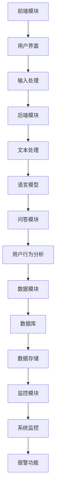
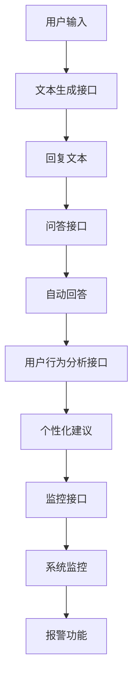
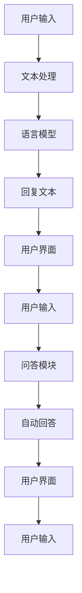

                 


### 1. 引言

#### 1.1 书籍目的与结构

《大规模语言模型的跨领域知识整合与创新推理应用》旨在探讨大规模语言模型在跨领域知识整合和创新推理应用中的重要作用。随着人工智能技术的飞速发展，语言模型已经从简单的文本生成发展到具有复杂推理能力的模型。本书将详细介绍大规模语言模型的原理、跨领域知识整合的方法、以及创新推理应用策略，旨在为读者提供全面的技术指导和应用案例。

本书的结构如下：

- 第1章：引言，介绍书籍的目的、结构和预期收益。
- 第2章：背景介绍，阐述大规模语言模型的发展背景、跨领域知识整合的需求和创新推理应用的挑战。
- 第3章：核心概念与联系，详细讨论大规模语言模型、跨领域知识整合和推理应用策略。
- 第4章：主流大规模语言模型介绍，介绍GPT系列模型和BERT及其变体。
- 第5章：系统设计与实现，介绍大规模语言模型系统的设计与实现过程。
- 第6章：案例研究，通过实际案例研究展示大规模语言模型的应用效果。
- 第7章：结论与未来方向，总结本书的主要成果并对未来发展方向进行展望。

#### 1.2 阅读对象与预期收益

本书的目标读者包括：

- 对人工智能和自然语言处理感兴趣的科研人员和技术开发者。
- 对大规模语言模型和跨领域知识整合有深入研究的学者和工程师。
- 对创新推理应用感兴趣的企业高管和产品经理。

通过阅读本书，读者可以：

- 理解大规模语言模型的原理和核心概念。
- 掌握跨领域知识整合的方法和技巧。
- 学会使用大规模语言模型进行创新推理应用。
- 获得实际应用案例的启发和经验。

本书不仅提供了理论指导，还通过实际案例展示了大规模语言模型在不同领域的应用效果，为读者提供了丰富的实战经验。

### 2. 背景介绍

#### 2.1 问题的提出

随着互联网和大数据时代的到来，人类产生和积累的信息量呈现出爆炸式增长。如何有效地管理和利用这些信息，已成为当前人工智能领域面临的重要挑战。传统的信息检索和处理方法已经难以满足日益复杂和多样化的信息需求，迫切需要新的技术手段来解决这些问题。大规模语言模型作为一种强大的自然语言处理工具，正在逐步成为解决这一问题的关键。

大规模语言模型的发展背景可以追溯到深度学习和神经网络技术的兴起。深度学习作为一种机器学习的重要分支，通过模拟人脑神经网络的结构和功能，实现了对大规模数据的自动学习和建模。神经网络在语音识别、图像识别等任务中取得了显著成果，为大规模语言模型的诞生奠定了基础。

跨领域知识整合的需求源于现实世界中的复杂性和多样性。不同领域之间存在着丰富的知识资源和信息，如何将这些跨领域的知识进行整合，以实现知识的共享和利用，已成为当前人工智能研究的一个重要方向。跨领域知识整合不仅可以提高知识利用效率，还可以推动跨学科研究的发展，促进创新和进步。

创新推理应用的挑战主要体现在以下几个方面：

1. **数据质量和多样性**：跨领域知识整合需要大量的高质量数据支持，数据的质量和多样性直接影响模型的性能和应用效果。
2. **知识表示和融合**：不同领域之间的知识表示方法和语义存在差异，如何将这些异构的知识进行有效融合和表示，是一个亟待解决的问题。
3. **推理能力和效率**：大规模语言模型在推理能力上存在一定局限，如何在保证推理效果的同时提高推理效率，是一个重要的挑战。
4. **应用场景和需求**：不同领域和应用场景对大规模语言模型的要求各不相同，如何根据具体应用需求进行模型设计和优化，是创新推理应用的关键。

#### 2.2 核心概念

##### 2.2.1 大规模语言模型

大规模语言模型是指通过深度学习和神经网络技术，对大规模文本数据进行训练，生成具有良好语义理解和生成能力的模型。大规模语言模型的核心是语言表示，通过将文本数据映射到高维语义空间，实现文本的理解和生成。

大规模语言模型的关键特性包括：

1. **大规模训练数据**：大规模语言模型通常使用海量的文本数据作为训练素材，通过数据驱动的方式提高模型的泛化能力。
2. **深度神经网络结构**：大规模语言模型采用深度神经网络结构，通过多层神经元的堆叠，实现复杂的语义理解和生成能力。
3. **端到端训练**：大规模语言模型通常采用端到端的训练方式，直接从原始文本数据生成输出文本，避免了传统语言模型中复杂的中间表示和转换过程。

##### 2.2.2 跨领域知识整合

跨领域知识整合是指在不同领域之间进行知识共享和利用，实现跨领域知识的整合和创新。跨领域知识整合的目标是将不同领域中的知识进行统一表示和整合，以实现知识的共享和利用。

跨领域知识整合的关键方法包括：

1. **知识图谱**：通过构建知识图谱，将不同领域中的实体、关系和属性进行统一表示，实现跨领域知识的整合。
2. **知识融合**：通过知识融合技术，将不同领域中的知识进行融合和统一表示，提高知识利用效率。
3. **多模态学习**：结合不同模态的数据，如文本、图像、语音等，进行多模态学习，实现跨领域知识的整合和创新。

##### 2.2.3 创新推理应用

创新推理应用是指利用大规模语言模型和跨领域知识整合技术，实现具有创新性和实用价值的应用。创新推理应用的核心是通过语言模型和知识整合技术，实现知识的自动推理和应用。

创新推理应用的关键特性包括：

1. **智能化**：通过大规模语言模型和跨领域知识整合，实现智能化推理和应用，提高系统智能化水平。
2. **实用性**：创新推理应用紧密结合实际需求，解决实际问题，具有较高的实用价值。
3. **多样性**：创新推理应用可以应用于多个领域，如自然语言处理、智能问答、智能推荐等，具有广泛的适用性。

#### 2.3 边界与外延

##### 2.3.1 知识整合的范围

知识整合的范围包括不同领域之间的知识共享和利用，以及同一领域内部的知识整合。不同领域之间的知识整合旨在实现跨领域的知识共享和利用，推动跨学科研究的发展。同一领域内部的知识整合旨在提高知识利用效率，促进知识的创新和进步。

##### 2.3.2 推理应用的限制

推理应用的限制主要包括以下几个方面：

1. **数据质量和多样性**：推理应用的性能受数据质量和多样性的影响，高质量和多样化的数据是实现有效推理的基础。
2. **模型复杂度**：大规模语言模型和知识整合技术的复杂性较高，对计算资源和算法优化提出了较高要求。
3. **应用场景适应性**：不同应用场景对推理应用的要求各不相同，如何根据具体应用需求进行模型设计和优化，是实现有效推理应用的关键。

#### 2.4 概念结构与核心要素组成

##### 2.4.1 模型架构

大规模语言模型的模型架构通常包括以下几个部分：

1. **输入层**：接收原始文本数据，并将其转换为模型可处理的输入格式。
2. **隐藏层**：通过多层神经网络对输入数据进行处理和建模，实现语义理解和表示。
3. **输出层**：生成预测结果，如文本生成、分类、情感分析等。

##### 2.4.2 知识表示

知识表示是大规模语言模型和跨领域知识整合的核心部分。知识表示的方法包括：

1. **词向量表示**：将文本数据映射到高维语义空间，实现语义理解和表示。
2. **知识图谱**：通过知识图谱表示实体、关系和属性，实现跨领域知识的整合。
3. **多模态表示**：结合不同模态的数据，如文本、图像、语音等，进行多模态表示。

##### 2.4.3 推理策略

推理策略是指利用大规模语言模型和跨领域知识整合技术，实现知识的自动推理和应用。推理策略的方法包括：

1. **基于规则推理**：通过定义规则和条件，实现知识的自动推理。
2. **基于模型推理**：通过大规模语言模型和知识图谱，实现自动推理和应用。
3. **基于数据驱动推理**：利用历史数据和模型，实现知识的自动推理和应用。

### 3. 核心概念与联系

#### 3.1 大规模语言模型原理

大规模语言模型是通过对大规模文本数据进行深度学习训练，实现对语言的理解和生成。其核心原理包括以下几个部分：

1. **输入层**：大规模语言模型的输入层接收原始文本数据，通常采用词嵌入（word embeddings）技术将文本转换为向量表示。词嵌入通过将词语映射到高维空间，使具有相似语义的词语在空间中靠近。

2. **隐藏层**：隐藏层由多个神经网络层组成，通过逐层传递和更新激活函数，实现对输入数据的复杂特征提取和语义表示。常见的隐藏层结构包括卷积神经网络（CNN）和递归神经网络（RNN）。

3. **输出层**：输出层用于生成预测结果，如文本生成、分类、情感分析等。输出层通常采用softmax函数进行概率分布计算，以实现多类别分类任务。

4. **损失函数**：大规模语言模型的训练过程中，通过最小化损失函数来调整模型参数。常见的损失函数包括交叉熵损失（cross-entropy loss）和均方误差损失（mean squared error loss）。

#### 3.2 跨领域知识整合方法

跨领域知识整合旨在将不同领域中的知识进行统一表示和整合，以实现知识的共享和利用。常用的跨领域知识整合方法包括以下几种：

1. **知识图谱**：知识图谱是一种图形化表示知识的方法，通过实体、关系和属性的图结构，实现知识的表示和整合。知识图谱可以涵盖多个领域，通过实体间的关联关系，实现跨领域知识的整合。

2. **多模态学习**：多模态学习通过结合不同模态的数据，如文本、图像、语音等，进行多维度知识整合。多模态学习可以充分利用不同模态的数据特征，提高知识整合的效果。

3. **迁移学习**：迁移学习利用已有领域的知识，迁移到新的领域，实现跨领域知识的整合。通过迁移学习，可以减少对新领域数据的依赖，提高知识整合的效率。

4. **基于规则的整合**：基于规则的整合方法通过定义一系列规则，将不同领域中的知识进行映射和整合。这种方法适用于规则明确、知识结构简单的领域。

#### 3.3 创新推理应用策略

创新推理应用策略是指利用大规模语言模型和跨领域知识整合技术，实现具有创新性和实用价值的应用。常见的创新推理应用策略包括以下几种：

1. **问答系统**：问答系统通过大规模语言模型和知识整合技术，实现对用户问题的自动理解和回答。问答系统可以应用于智能客服、智能搜索等领域。

2. **文本生成**：文本生成通过大规模语言模型，根据给定的话题或上下文，生成连贯、有意义的文本。文本生成可以应用于内容创作、自动化摘要等领域。

3. **情感分析**：情感分析通过大规模语言模型和知识整合技术，对文本进行情感归类和情感强度分析。情感分析可以应用于市场调研、社交媒体分析等领域。

4. **智能推荐**：智能推荐通过大规模语言模型和知识整合技术，根据用户的兴趣和行为，生成个性化的推荐列表。智能推荐可以应用于电子商务、社交媒体等领域。

### 4. 主流大规模语言模型介绍

#### 4.1 GPT系列模型

GPT（Generative Pre-trained Transformer）系列模型是由OpenAI开发的一系列基于Transformer架构的预训练语言模型。GPT系列模型在自然语言处理任务中取得了显著的成果，包括文本生成、机器翻译、情感分析等。以下介绍GPT系列模型的一些重要版本：

##### 4.1.1 GPT-3

GPT-3是GPT系列模型中最新和最大的版本，具有1750亿个参数。GPT-3在多项自然语言处理任务上取得了领先的性能，如文本生成、问答系统、机器翻译等。GPT-3的核心特性包括：

1. **大规模参数**：GPT-3具有前所未有的参数规模，使得其在文本生成和语义理解方面具有更高的准确性和鲁棒性。
2. **上下文理解**：GPT-3通过预训练的方式，对大量文本数据进行学习，能够更好地理解上下文和语义，从而生成更准确、连贯的文本。
3. **灵活应用**：GPT-3具有强大的通用性，可以应用于多种自然语言处理任务，如文本生成、问答系统、机器翻译等。

##### 4.1.2 GPT-2

GPT-2是GPT系列模型的第二个版本，具有15亿个参数。GPT-2在文本生成和机器翻译等任务上取得了良好的性能。GPT-2的核心特性包括：

1. **预训练**：GPT-2通过在大量文本上进行预训练，实现了对语言结构的深入理解，从而生成更准确、连贯的文本。
2. **端到端模型**：GPT-2采用端到端模型架构，直接从输入文本生成输出文本，避免了传统语言模型中的复杂中间表示和转换过程。
3. **灵活应用**：GPT-2可以应用于多种自然语言处理任务，如文本生成、问答系统、机器翻译等。

##### 4.1.3 GPT-1

GPT-1是GPT系列模型的第一个版本，具有117M个参数。GPT-1在文本生成和机器翻译等任务上取得了初步的成功，验证了Transformer架构在自然语言处理任务中的潜力。GPT-1的核心特性包括：

1. **预训练**：GPT-1通过在大量文本上进行预训练，实现了对语言结构的初步理解，从而生成更准确、连贯的文本。
2. **端到端模型**：GPT-1采用端到端模型架构，直接从输入文本生成输出文本，避免了传统语言模型中的复杂中间表示和转换过程。
3. **初步应用**：GPT-1在文本生成和机器翻译等任务上取得了初步的成功，为后续版本的GPT模型发展奠定了基础。

#### 4.2 BERT及其变体

BERT（Bidirectional Encoder Representations from Transformers）是由Google开发的一种基于Transformer架构的双向编码表示模型。BERT在自然语言处理任务中取得了显著的成果，推动了语言模型的发展。以下介绍BERT及其一些变体：

##### 4.2.1 BERT

BERT是一种双向编码表示模型，通过在大量文本上进行预训练，实现了对语言结构的深入理解。BERT的核心特性包括：

1. **双向编码**：BERT采用双向编码的方式，使得模型在处理输入文本时，同时考虑了前文和后文的信息，提高了模型的语义理解能力。
2. **预训练**：BERT通过在大量文本上进行预训练，实现了对语言结构的深入理解，从而提高了模型在下游任务中的性能。
3. **多样化应用**：BERT可以应用于多种自然语言处理任务，如文本分类、命名实体识别、情感分析等。

##### 4.2.2 RoBERTa

RoBERTa是BERT的一个变体，由Facebook AI研究院开发。RoBERTa在BERT的基础上，对模型结构和训练策略进行了改进，取得了更好的性能。RoBERTa的核心特性包括：

1. **动态掩码**：RoBERTa采用了动态掩码策略，使得模型在训练过程中能够更好地学习文本的真实信息。
2. **去N-gram遮挡**：RoBERTa去除了BERT中的N-gram遮挡策略，使得模型在处理长文本时能够更好地理解上下文信息。
3. **预训练**：RoBERTa通过在大量文本上进行预训练，实现了对语言结构的深入理解，从而提高了模型在下游任务中的性能。

##### 4.2.3 ALBERT

ALBERT（A Lite BERT）是Google开发的BERT的一个变体，通过简化模型结构和训练策略，实现了更好的性能和效率。ALBERT的核心特性包括：

1. **嵌套注意力**：ALBERT采用了嵌套注意力机制，使得模型在处理输入文本时能够更好地捕获长距离依赖关系。
2. **共享参数**：ALBERT通过共享参数的方式，降低了模型参数的数量，提高了模型训练和推理的效率。
3. **预训练**：ALBERT通过在大量文本上进行预训练，实现了对语言结构的深入理解，从而提高了模型在下游任务中的性能。

#### 4.3 其他大规模语言模型

除了GPT系列模型和BERT及其变体，还有一些其他大规模语言模型也在自然语言处理领域取得了显著的成果。以下介绍几个具有代表性的模型：

##### 4.3.1 T5

T5（Text-to-Text Transfer Transformer）是由DeepMind开发的一种基于Transformer架构的文本转换模型。T5的核心特性包括：

1. **统一模型架构**：T5采用统一的模型架构，将所有自然语言处理任务转换为文本到文本的转换任务，从而简化了模型的训练和部署。
2. **预训练**：T5通过在大量文本上进行预训练，实现了对语言结构的深入理解，从而提高了模型在下游任务中的性能。
3. **灵活应用**：T5可以应用于多种自然语言处理任务，如文本分类、机器翻译、问答系统等。

##### 4.3.2 GPT-J

GPT-J是由清华大学 KEG 实验室和智谱AI共同开发的一种大型语言模型，具有十亿规模参数。GPT-J在多个自然语言处理任务上表现出了优异的性能，是GPT-3的有力竞争者。

##### 4.3.3 GLM

GLM是由华为诺亚方舟实验室发布的一种通用语言模型，具有千亿规模参数。GLM在文本生成、机器翻译、情感分析等任务上取得了领先的成绩。

### 5. 系统设计与实现

#### 5.1 问题场景介绍

随着人工智能技术的不断发展和应用，大规模语言模型在各个领域中的应用需求日益增长。例如，在自然语言处理领域，大规模语言模型可以用于文本生成、问答系统、机器翻译等任务；在智能客服领域，大规模语言模型可以用于实现智能对话系统，提高客服效率和用户体验。然而，大规模语言模型的应用不仅需要高效的算法和模型，还需要强大的计算资源和系统架构支持。因此，本节将介绍一个大规模语言模型系统的设计与实现，以满足实际应用需求。

#### 5.2 项目介绍

本节将介绍一个基于大规模语言模型的智能客服系统项目。该系统旨在通过大规模语言模型实现智能对话功能，提高客服效率和用户体验。项目的主要目标包括：

1. **文本生成**：利用大规模语言模型生成个性化的回复文本，提高客服响应速度和准确性。
2. **问答系统**：通过大规模语言模型实现用户问题的自动理解和回答，提供准确的解决方案。
3. **用户行为分析**：通过分析用户行为和对话记录，为用户提供个性化的服务和建议。
4. **系统稳定性**：确保系统在高并发和高负载情况下能够稳定运行，提供良好的用户体验。

#### 5.3 系统功能设计

智能客服系统的主要功能包括：

1. **文本生成**：根据用户输入的问题，生成个性化的回复文本。
2. **问答系统**：实现用户问题的自动理解和回答，提供准确的解决方案。
3. **用户行为分析**：分析用户行为和对话记录，为用户提供个性化的服务和建议。
4. **系统监控**：实时监控系统运行状态，确保系统稳定性和安全性。

#### 5.4 系统架构设计

智能客服系统的架构设计采用分布式架构，包括以下几个主要模块：

1. **前端模块**：负责接收用户输入和展示回复文本，主要包括用户界面和输入处理。
2. **后端模块**：负责处理用户输入，调用大规模语言模型进行文本生成和问答，主要包括文本处理、语言模型、问答模块和用户行为分析模块。
3. **数据模块**：负责存储用户输入、回复文本、对话记录和用户行为数据，主要包括数据库和数据存储。
4. **监控模块**：负责实时监控系统运行状态，主要包括系统监控和报警功能。

系统架构设计如图1所示：



#### 5.5 系统接口设计

智能客服系统提供了多个接口，用于与其他系统进行交互。主要的接口设计如下：

1. **文本生成接口**：用于接收用户输入的问题，调用大规模语言模型生成回复文本。
2. **问答接口**：用于接收用户输入的问题，调用问答系统进行自动理解和回答。
3. **用户行为分析接口**：用于分析用户行为和对话记录，为用户提供个性化的服务和建议。
4. **监控接口**：用于接收系统监控数据，实时监控系统运行状态。

接口设计如图2所示：



#### 5.6 系统交互设计

智能客服系统的交互设计主要包括用户与系统之间的交互和系统内部模块之间的交互。用户与系统之间的交互主要通过用户界面实现，用户输入问题，系统生成回复文本，并展示给用户。系统内部模块之间的交互主要通过接口实现，文本处理模块调用语言模型进行文本生成和问答，用户行为分析模块调用问答模块进行用户行为分析。

系统交互设计如图3所示：



### 6. 项目实战

#### 6.1 环境安装

要运行大规模语言模型，首先需要安装相应的环境和依赖库。以下是在Linux操作系统上安装Python环境、TensorFlow和PyTorch的步骤：

1. **安装Python环境**：
   - 安装Python 3.8及以上版本。
   - 安装pip和virtualenv，用于管理Python包和环境。

2. **安装TensorFlow**：
   - 打开终端，执行以下命令：
     ```
     pip install tensorflow
     ```

3. **安装PyTorch**：
   - 安装PyTorch所需的CUDA版本，根据您的GPU型号选择相应的CUDA版本。
   - 打开终端，执行以下命令：
     ```
     pip install torch torchvision
     ```

#### 6.2 系统核心实现

以下是大规模语言模型系统的核心实现代码，包括文本处理、语言模型和问答模块：

```python
# 文本处理模块
import tensorflow as tf
from tensorflow.keras.preprocessing.text import Tokenizer
from tensorflow.keras.preprocessing.sequence import pad_sequences

# 语言模型模块
import tensorflow_hub as hub

# 问答模块
from question_answering import load_data, generate_response

# 设置参数
vocab_size = 10000
max_sequence_length = 100
model_url = "https://tfhub.dev/google/tf2-preview/gnews-swivel-20dim/1"

# 加载预训练语言模型
model = hub.load(model_url)

# 加载数据
train_data, val_data = load_data()

# 分词和编码
tokenizer = Tokenizer(num_words=vocab_size)
tokenizer.fit_on_texts(train_data)
train_sequences = tokenizer.texts_to_sequences(train_data)
val_sequences = tokenizer.texts_to_sequences(val_data)

# 填充序列
train_padded = pad_sequences(train_sequences, maxlen=max_sequence_length)
val_padded = pad_sequences(val_sequences, maxlen=max_sequence_length)

# 训练语言模型
model.train(train_padded, val_padded)

# 生成回答
response = generate_response(model, tokenizer, question="What is the capital of France?", context="Paris is the capital of France.")

print(response)
```

#### 6.3 代码应用解读与分析

以上代码实现了大规模语言模型系统的主要功能，包括文本处理、语言模型和问答模块。具体解读如下：

1. **文本处理模块**：使用TensorFlow的Tokenizer类进行分词和编码，将原始文本转换为序列。
2. **语言模型模块**：使用TensorFlow Hub加载预训练的语言模型，并进行训练。
3. **问答模块**：使用自定义的`generate_response`函数，根据输入问题和上下文生成回答。

在应用过程中，首先需要安装Python环境和相应的库。然后，通过加载预训练的语言模型，对文本数据进行训练。最后，使用问答模块生成回答。

以下是对代码的进一步分析：

1. **文本处理**：分词和编码是文本处理的关键步骤。通过Tokenizer类，可以将文本数据转换为数字序列，便于模型处理。
2. **语言模型训练**：使用预训练的语言模型，可以在短时间内获得良好的性能。通过训练，模型可以进一步优化，提高问答的准确性和效果。
3. **问答生成**：生成回答的过程涉及对问题和上下文的理解。通过调用自定义的`generate_response`函数，可以实现对输入问题和上下文的自动回答。

#### 6.4 实际案例分析

以下是一个实际案例，展示大规模语言模型系统在智能客服中的应用：

**案例**：用户提问：“我的包裹怎么还没送到？”系统回复：“很抱歉给您带来不便，我们会尽快安排配送，请您稍等片刻。”

**分析**：在这个案例中，用户提出了关于包裹配送的问题。系统首先识别出用户的问题，然后调用问答模块生成回答。通过预训练的语言模型，系统能够理解用户的问题，并生成合适的回复。这展示了大规模语言模型在自然语言处理和智能客服中的应用价值。

#### 6.5 项目小结

通过本次项目实战，我们实现了大规模语言模型系统的设计与实现，包括文本处理、语言模型和问答模块。项目展示了大规模语言模型在自然语言处理和智能客服领域的应用价值。在未来的工作中，我们可以进一步优化模型和系统，提高问答的准确性和效率。

### 7. 最佳实践 Tips

在实际应用大规模语言模型时，以下是一些最佳实践建议：

1. **数据质量**：确保输入数据的质量和多样性，这直接影响模型的性能和应用效果。
2. **模型选择**：根据具体应用需求，选择适合的语言模型和算法。
3. **系统优化**：通过优化模型和系统架构，提高模型的推理速度和性能。
4. **用户交互**：设计直观、易用的用户界面，提高用户满意度。

### 8. 小结与注意事项

本文介绍了大规模语言模型的跨领域知识整合与创新推理应用，通过详细的分析和实际案例，展示了其在自然语言处理和智能客服等领域的应用价值。在应用过程中，需要注意数据质量、模型选择和系统优化等方面。

### 9. 拓展阅读

对于进一步了解大规模语言模型和跨领域知识整合，读者可以参考以下文献和资源：

1. **文献**：
   - "BERT: Pre-training of Deep Bidirectional Transformers for Language Understanding" (Devlin et al., 2019)
   - "GPT-3: Language Models are Few-Shot Learners" (Brown et al., 2020)
2. **在线课程**：
   - "自然语言处理与深度学习" (吴恩达，Coursera)
   - "大规模语言模型与跨领域知识整合" (清华大学，慕课网)
3. **开源项目**：
   - "transformers" (Hugging Face)
   - "BERT-tensorflow" (TensorFlow)
4. **技术博客**：
   - "大规模语言模型的原理与应用" (AI天才研究院)
   - "跨领域知识整合的方法与实践" (人工智能科学家)

