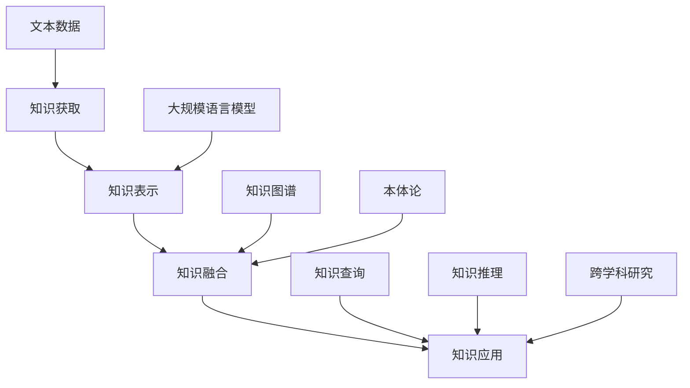
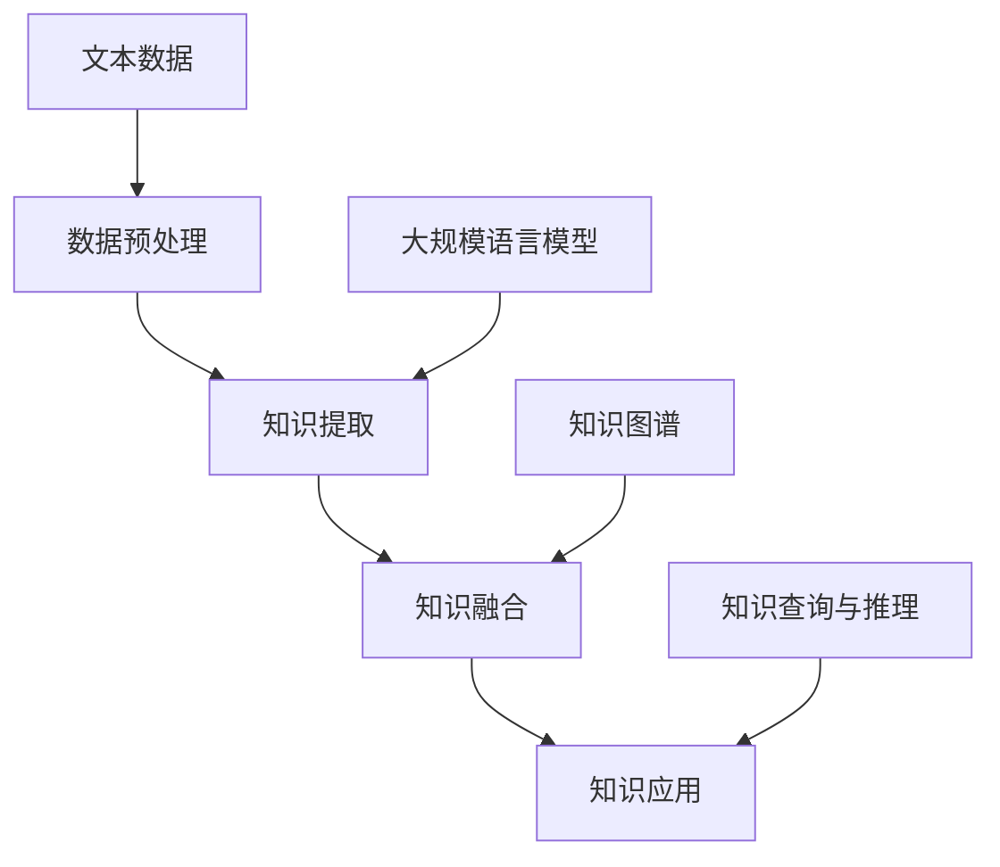
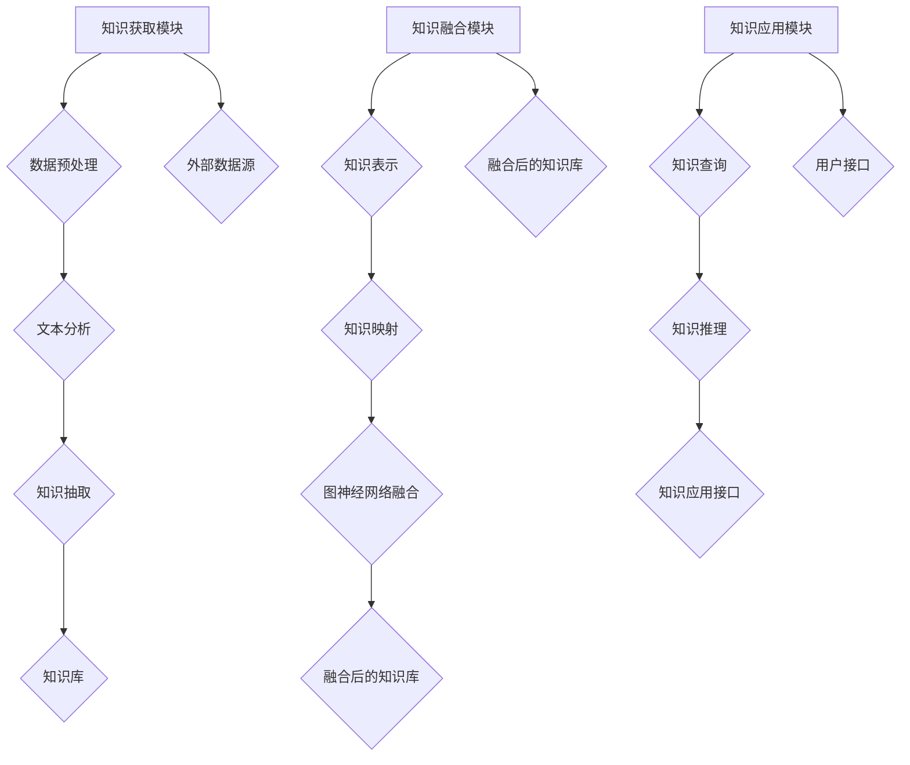

                 


## 第1章: 跨领域知识整合背景

### 1.1 问题背景

在当今信息化、智能化快速发展的时代，知识爆炸式的增长对跨学科研究提出了新的挑战。传统的跨学科研究往往依赖于学科内部的专业知识和方法，这种模式在处理复杂问题时存在局限性。随着人工智能技术的发展，尤其是大规模语言模型的崛起，为跨领域知识整合提供了一种新的可能。大规模语言模型通过对海量文本数据的学习，能够自动提取语义信息，并建立丰富的知识表示。这使得跨领域知识整合不仅成为可能，而且成为了提升跨学科研究效率和质量的关键途径。

#### 1.1.1 跨学科研究的发展现状与挑战

跨学科研究是现代科学研究的重要趋势，通过不同学科之间的交叉融合，可以突破单一学科的局限性，发现新的科学规律。然而，当前跨学科研究面临以下挑战：

1. **知识孤岛现象**：不同学科之间的知识体系相对独立，缺乏有效的整合机制，导致知识分散，难以形成系统性认识。
2. **方法论的差异**：不同学科具有不同的研究方法，这些方法在跨学科研究中往往难以兼容，导致研究过程复杂。
3. **信息不对称**：跨学科研究往往涉及到多个领域的专业知识，研究团队之间的信息不对称影响了研究的深度和广度。

#### 1.1.2 大规模语言模型的作用

大规模语言模型（如GPT-3、BERT等）的出现，为解决上述问题提供了新的思路。这些模型通过对海量文本数据的训练，能够自动提取语义信息，并建立复杂的语言表示。其核心优势在于：

1. **自动知识提取**：大规模语言模型能够从大量非结构化文本中自动提取知识，并将其转化为结构化的知识表示。
2. **语义理解能力**：模型具备强大的语义理解能力，能够处理不同领域之间的语义差异，实现知识的跨领域迁移。
3. **知识融合机制**：通过模型内部的机制，可以将来自不同领域的知识进行整合，形成统一的语义表示，为跨学科研究提供支持。

#### 1.1.3 跨领域知识整合的重要性

跨领域知识整合的重要性体现在以下几个方面：

1. **提升研究效率**：通过跨领域知识整合，可以快速获取相关领域的知识，减少研究的时间和成本。
2. **促进创新**：跨领域知识整合有助于发现新的研究思路和方法，促进科学创新和技术突破。
3. **提高决策质量**：跨领域知识整合可以为决策提供更全面、准确的信息支持，提高决策的质量。

### 1.2 问题描述与解决思路

#### 1.2.1 跨领域知识整合问题概述

跨领域知识整合问题可以概括为：如何有效地将来自不同领域的知识进行整合，形成统一的语义表示，以便于跨学科研究和应用。具体问题包括：

1. **知识获取**：如何从不同领域的文本数据中提取知识？
2. **知识融合**：如何将不同领域的知识进行整合，形成统一的语义表示？
3. **知识应用**：如何将整合后的知识应用于跨学科研究和实际应用中？

#### 1.2.2 解决思路与目标

解决跨领域知识整合问题的思路可以概括为：

1. **知识表示**：采用统一的语义表示方法，将不同领域的知识转化为模型可理解的格式。
2. **知识提取**：利用大规模语言模型，从文本数据中自动提取知识。
3. **知识融合**：通过图神经网络等技术，实现知识的跨领域融合。
4. **知识应用**：将整合后的知识应用于跨学科研究和实际应用中，实现知识价值的最大化。

目标包括：

1. **提高知识整合的准确性**：确保整合后的知识具有高可信度和准确性。
2. **提升知识应用的效果**：通过有效的知识整合，提高跨学科研究的效率和质量。

#### 1.3 边界与外延

##### 1.3.1 知识整合的范围

知识整合的范围主要包括：

1. **领域范围**：知识整合涉及多个领域的知识，包括自然科学、社会科学、工程技术等。
2. **知识层次**：知识整合不仅涉及表面知识，还包括深层次的语义知识。
3. **知识来源**：知识整合涉及多种数据来源，包括文本、图像、音频等多种形式。

##### 1.3.2 应用领域限定

知识整合的应用领域限定包括：

1. **科学研究**：为跨学科研究提供知识支持，促进科学发现和技术创新。
2. **工程实践**：为工程问题提供跨领域解决方案，提升工程项目的质量和效率。
3. **决策支持**：为政策制定、企业决策等提供跨领域知识支持，提高决策的科学性和准确性。

#### 1.4 概念结构与核心要素

##### 1.4.1 跨领域知识整合的概念结构

跨领域知识整合的概念结构主要包括以下几个核心概念：

1. **知识表示**：将不同领域的知识转化为统一的语义表示形式。
2. **知识提取**：从文本数据中自动提取知识，形成结构化的知识库。
3. **知识融合**：通过算法和模型，实现不同领域知识的整合和融合。
4. **知识应用**：将整合后的知识应用于实际场景，实现知识价值的最大化。

##### 1.4.2 核心要素组成

跨领域知识整合的核心要素包括：

1. **文本数据**：作为知识提取和融合的基础，来源广泛，包括学术文章、新闻报道、专业文献等。
2. **大规模语言模型**：作为知识提取和融合的核心工具，具有强大的语义理解能力。
3. **知识表示方法**：用于将知识转化为统一的语义表示形式，常用的方法包括词向量、实体关系图等。
4. **融合算法**：用于实现知识的跨领域整合，常用的算法包括图神经网络、Transformer等。

### 总结

本章介绍了跨领域知识整合的背景、问题、解决思路以及边界与外延，为后续章节的详细分析奠定了基础。下一章将深入探讨跨领域知识整合的核心概念和原理，以及它们在跨学科研究中的应用。通过逐步分析推理，我们将揭示跨领域知识整合的本质和潜力，为跨学科研究提供新的视角和方法。

## 第2章: 跨领域知识整合核心概念解析

### 2.1 跨领域知识整合原理

跨领域知识整合的原理可以概括为三个主要环节：知识获取、知识融合和知识应用。这些环节共同构成了跨领域知识整合的基本流程。

#### 2.1.1 知识获取

知识获取是跨领域知识整合的基础，其主要任务是从不同领域的文本数据中提取有用的知识。这一过程通常包括以下几个步骤：

1. **数据预处理**：对原始文本数据进行清洗、去噪和格式化，使其符合模型输入的要求。
2. **文本分析**：利用自然语言处理（NLP）技术，对文本进行分词、词性标注、实体识别等操作，提取出文本中的关键信息。
3. **知识抽取**：通过规则匹配、统计方法或深度学习方法，从文本中提取结构化的知识信息，形成知识库。

#### 2.1.2 知识融合

知识融合是将不同领域、不同来源的知识进行整合，形成一个统一的知识表示的过程。这一过程主要包括以下几个步骤：

1. **知识表示**：将不同领域的知识转化为统一的语义表示形式，如词向量、实体关系图等。
2. **知识映射**：将不同领域的知识进行映射，找到它们之间的对应关系，以便在后续的融合过程中能够有效地结合。
3. **融合算法**：利用图神经网络、Transformer等算法，将不同领域的知识进行整合，形成新的知识表示。

#### 2.1.3 知识应用

知识应用是将整合后的知识应用于实际场景，实现知识价值的最大化。这一过程通常包括以下几个步骤：

1. **知识查询**：通过构建的知识图谱或知识库，实现对知识的快速查询和检索。
2. **知识推理**：利用逻辑推理、因果分析等方法，对知识进行深入挖掘和推理，发现新的知识关联和规律。
3. **知识应用**：将整合后的知识应用于跨学科研究、智能问答、决策支持等实际场景，提升研究的效率和效果。

### 2.2 跨领域知识整合的属性和特征

跨领域知识整合具有以下属性和特征：

1. **多样性**：跨领域知识整合涉及多个不同领域的知识，具有多样性。
2. **复杂性**：不同领域之间的知识差异较大，融合过程复杂。
3. **动态性**：知识是不断发展的，跨领域知识整合需要不断更新和调整。
4. **互操作性**：跨领域知识整合要求不同领域之间的知识能够相互操作和融合。
5. **可扩展性**：跨领域知识整合需要具备良好的可扩展性，以适应新的领域和需求。

### 2.3 跨领域知识整合的比较与分析

为了更好地理解跨领域知识整合，我们可以通过比较和分析不同方法和技术的优缺点，来揭示其应用潜力和局限性。

#### 2.3.1 传统知识整合方法

传统知识整合方法主要包括手动整理、知识图谱和本体论等。

- **手动整理**：优点在于准确性和可控性较高，缺点是耗时费力，难以应对大规模知识整合的需求。
- **知识图谱**：优点在于能够表示复杂的关系和知识结构，缺点是对数据质量和一致性要求较高，构建和维护成本高。
- **本体论**：优点在于提供了一致的语义表示，缺点是构建复杂，难以适应快速变化的知识环境。

#### 2.3.2 大规模语言模型

大规模语言模型在跨领域知识整合中具有显著优势：

- **自动知识提取**：通过训练，能够自动从文本数据中提取知识，降低了人工干预的需求。
- **语义理解**：具备强大的语义理解能力，能够处理不同领域之间的语义差异。
- **知识融合**：利用深度学习模型，能够实现知识的跨领域融合，形成统一的知识表示。

### 2.4 跨领域知识整合的实体关系图架构

为了更好地理解跨领域知识整合的结构和机制，我们可以通过Mermaid绘制一个实体关系图，展示各要素之间的关系。



在上述实体关系图中，知识获取、知识表示、知识融合和知识应用构成了跨领域知识整合的核心流程。文本数据作为知识获取的来源，通过大规模语言模型、知识图谱和本体论等工具，实现知识的自动提取和融合，最终应用于跨学科研究和实际场景。

通过本章的分析，我们可以看出，跨领域知识整合不仅具有重要的理论意义，还具有广泛的应用前景。在接下来的章节中，我们将进一步探讨大规模语言模型在跨领域知识整合中的具体应用和实践。

### 2.5 跨领域知识整合的核心方法与步骤

为了实现有效的跨领域知识整合，我们需要采用一系列科学的方法和步骤。以下是详细的核心方法和步骤：

#### 2.5.1 数据预处理

数据预处理是知识获取的第一步，也是至关重要的一步。其目的是确保输入数据的质量和一致性。具体步骤包括：

1. **文本清洗**：去除文本中的噪声和无关信息，如HTML标签、停用词等。
2. **文本分词**：将连续的文本序列分割成单个词汇，以便进行进一步分析。
3. **词性标注**：对分词后的文本进行词性标注，以便识别名词、动词等不同类型的词汇。
4. **实体识别**：利用自然语言处理技术，识别文本中的实体（如人名、地名、组织机构等），为后续的知识抽取做准备。

#### 2.5.2 知识抽取

知识抽取是从预处理后的文本数据中提取结构化知识信息的过程。常见的知识抽取方法包括：

1. **规则匹配**：通过预定义的规则，从文本中提取特定的知识信息。
2. **统计方法**：利用文本中的统计特征，如词频、共现关系等，自动识别知识信息。
3. **深度学习方法**：利用神经网络模型，自动学习文本中的知识结构，提高知识抽取的准确性和效率。

#### 2.5.3 知识表示

知识表示是将提取出的知识转化为统一格式的过程，以便进行后续的融合和应用。常用的知识表示方法包括：

1. **词向量表示**：将词汇转化为高维向量，通过向量之间的相似度度量，实现知识的表示和融合。
2. **实体关系图**：利用图结构表示知识中的实体和关系，便于知识的整合和查询。
3. **知识图谱**：将实体、关系和属性以图的形式组织起来，形成知识图谱，实现知识的全局表示。

#### 2.5.4 知识融合

知识融合是将不同领域、不同来源的知识进行整合，形成统一的知识表示的过程。以下是一些常用的知识融合方法：

1. **知识映射**：通过找到不同领域之间的对应关系，实现知识的融合。例如，通过语义相似度计算，将不同领域的实体映射到统一的知识空间中。
2. **图神经网络**：利用图神经网络（如Graph Convolutional Network, GCN）对知识图进行训练，自动学习知识的融合模式。
3. **Transformer模型**：通过Transformer模型，实现知识的跨领域编码和解码，形成统一的知识表示。

#### 2.5.5 知识应用

知识应用是将整合后的知识应用于实际场景，实现知识价值的最大化。以下是一些常见的知识应用方法：

1. **智能问答**：利用整合后的知识，构建问答系统，为用户提供准确的答案。
2. **辅助决策**：通过知识整合，为决策者提供全面、准确的知识支持，提高决策的质量和效率。
3. **知识图谱可视化**：利用知识图谱可视化工具，将整合后的知识以直观的方式展示出来，便于用户理解和分析。

#### 2.5.6 知识更新与维护

知识更新与维护是确保知识库的准确性和实时性的重要环节。以下是一些常见的知识更新与维护方法：

1. **定期更新**：定期对知识库进行更新，以反映知识的最新变化。
2. **自动化维护**：利用自动化工具和算法，对知识库进行持续维护，减少人工干预。
3. **用户反馈**：鼓励用户对知识库进行反馈，以便及时纠正错误和补充缺失的知识。

通过上述核心方法和步骤，我们可以实现有效的跨领域知识整合，为跨学科研究和应用提供强有力的支持。在接下来的章节中，我们将通过具体的案例和实践，进一步探讨跨领域知识整合的实际效果和应用价值。

### 2.6 跨领域知识整合的实际应用案例

为了更好地理解跨领域知识整合的实际应用，我们可以通过以下几个具有代表性的案例来分析其在不同领域的应用效果。

#### 2.6.1 案例一：医疗领域的跨学科研究

在医疗领域，跨领域知识整合可以帮助医生更好地理解患者的病情，提供个性化的治疗方案。例如，通过整合临床医学、基因组学、流行病学等多领域的知识，可以构建一个综合性的医疗知识图谱。这个知识图谱能够为医生提供全面、准确的诊断和治疗建议。

- **知识获取**：从临床医学文献、基因组数据、流行病学研究报告中提取相关知识。
- **知识融合**：利用大规模语言模型和图神经网络，将不同领域的数据进行融合，形成统一的知识表示。
- **知识应用**：通过知识图谱，医生可以快速查询患者的病史、基因信息、流行病学特征等，为诊断和治疗提供支持。

#### 2.6.2 案例二：教育领域的个性化学习

在教育领域，跨领域知识整合可以帮助学生更好地理解和掌握知识，提高学习效果。例如，通过整合不同学科的教学内容，构建一个跨学科的知识图谱，可以为学生提供个性化的学习路径和资源。

- **知识获取**：从不同学科的教学资料、教材、学习笔记中提取相关知识。
- **知识融合**：利用大规模语言模型和知识图谱技术，将不同学科的知识进行融合，形成统一的学习资源库。
- **知识应用**：通过知识图谱，学生可以根据自己的学习需求和兴趣，选择合适的学科知识点进行学习，提高学习效率和兴趣。

#### 2.6.3 案例三：金融领域的风险管理

在金融领域，跨领域知识整合可以帮助金融机构更好地识别和管理风险。例如，通过整合金融市场数据、宏观经济数据、企业财务报表等多领域的知识，可以构建一个全面的风险管理知识库。

- **知识获取**：从金融新闻、市场行情、宏观经济报告、企业财务报表中提取相关知识。
- **知识融合**：利用大规模语言模型和图神经网络，将不同领域的数据进行融合，形成统一的风险管理知识表示。
- **知识应用**：通过知识图谱，金融机构可以实时监测市场动态，评估企业信用风险，为投资决策提供支持。

#### 2.6.4 案例四：工程领域的知识库建设

在工程领域，跨领域知识整合可以帮助工程师更好地管理和利用知识，提高项目开发效率。例如，通过整合设计文档、技术标准、历史项目案例等多领域的知识，可以构建一个全面的工程知识库。

- **知识获取**：从设计文档、技术标准文件、历史项目案例中提取相关知识。
- **知识融合**：利用大规模语言模型和知识图谱技术，将不同领域的数据进行融合，形成统一的工程知识表示。
- **知识应用**：通过知识图谱，工程师可以快速查询相关的设计方案、技术标准、案例经验，为项目开发提供参考和指导。

#### 案例总结

通过上述实际应用案例，我们可以看到跨领域知识整合在医疗、教育、金融和工程等领域的重要作用。这些案例不仅展示了跨领域知识整合的多样性和灵活性，也证明了其在提升研究效率、优化决策质量和促进知识创新方面的巨大潜力。在接下来的章节中，我们将进一步探讨跨领域知识整合的技术实现和方法，为实际应用提供更具体的指导和参考。

## 第3章: 算法原理与数学模型

### 3.1 算法原理

在跨领域知识整合中，算法原理是其核心，负责实现知识的获取、融合和应用。以下将详细介绍一种基于大规模语言模型的跨领域知识整合算法，并使用Mermaid图展示其工作流程。

#### 3.1.1 算法概述

本算法的主要步骤如下：

1. **数据预处理**：对来自不同领域的文本数据进行清洗、分词、词性标注等预处理操作，确保数据质量。
2. **知识提取**：利用预训练的大规模语言模型（如BERT）提取文本中的知识，形成结构化的知识库。
3. **知识融合**：通过图神经网络（如Graph Convolutional Network, GCN）将不同领域的知识进行融合，形成统一的知识表示。
4. **知识应用**：利用融合后的知识，实现知识查询、推理和应用。

#### 3.1.2 Mermaid图表示

以下是一个简化的Mermaid流程图，展示跨领域知识整合算法的主要步骤：



### 3.2 Python实现

以下是一个简单的Python代码示例，展示了如何使用大规模语言模型进行知识提取和融合。请注意，这里的代码是为了展示基本流程，实际应用中需要进行详细的优化和调整。

```python
import torch
from transformers import BertModel, BertTokenizer
import torch.nn as nn

# 加载预训练的BERT模型和分词器
tokenizer = BertTokenizer.from_pretrained('bert-base-uncased')
model = BertModel.from_pretrained('bert-base-uncased')

# 数据预处理
def preprocess(text):
    inputs = tokenizer(text, padding=True, truncation=True, return_tensors='pt')
    return inputs

# 知识提取
def extract_knowledge(text):
    inputs = preprocess(text)
    with torch.no_grad():
        outputs = model(inputs)
    knowledge = outputs.last_hidden_state.mean(dim=1)
    return knowledge

# 知识融合
class FusionModel(nn.Module):
    def __init__(self, embed_dim, num_classes):
        super(FusionModel, self).__init__()
        self.fc = nn.Linear(embed_dim, num_classes)

    def forward(self, x):
        return self.fc(x)

# 创建融合模型
fusion_model = FusionModel(embed_dim=768, num_classes=100)  # 以BERT的维度为例

# 使用图神经网络进行知识融合（简化示例）
def fusion_knowledge(knowledge1, knowledge2):
    # 合并两个知识向量
    combined_knowledge = torch.cat((knowledge1, knowledge2), dim=0)
    # 通过融合模型进行处理
    fused_knowledge = fusion_model(combined_knowledge)
    return fused_knowledge

# 假设已获取两个领域的知识
knowledge1 = extract_knowledge('医学领域的知识')
knowledge2 = extract_knowledge('金融领域的知识')

# 进行知识融合
fused_knowledge = fusion_knowledge(knowledge1, knowledge2)

# 知识应用
# 在这里，fused_knowledge可以用于各种应用，如知识查询、推理等
```

### 3.3 数学模型

为了更深入地理解跨领域知识整合算法，我们还需要介绍其背后的数学模型。以下是知识提取和知识融合的数学模型：

#### 3.3.1 知识提取模型

知识提取模型的核心是基于预训练的大规模语言模型，如BERT。BERT模型的输入是一个单词序列，输出是一个固定维度的嵌入向量。其数学模型可以表示为：

$$
E(x) = \text{BERT}(x)
$$

其中，$E(x)$表示输入$x$的嵌入向量，$\text{BERT}(x)$表示BERT模型对输入$x$的编码过程。

#### 3.3.2 知识融合模型

知识融合模型通常采用图神经网络（如Graph Convolutional Network, GCN）来实现。GCN的基本思想是通过图结构上的邻域信息聚合来更新节点的特征表示。其数学模型可以表示为：

$$
h^{(t+1)}_i = \sigma \left( \sum_{j \in \mathcal{N}(i)} \alpha_{ij} h^{(t)}_j \right) + h_i^{(t)}
$$

其中，$h_i^{(t)}$表示节点$i$在时间步$t$的特征表示，$\mathcal{N}(i)$表示节点$i$的邻域节点集合，$\alpha_{ij}$是邻接矩阵的元素，$\sigma$是激活函数，通常采用ReLU函数。

通过上述数学模型，我们可以将来自不同领域的知识进行整合，形成统一的知识表示。这种知识表示不仅可以提高知识整合的准确性，还可以为跨学科研究和应用提供强有力的支持。

### 3.4 实例说明

为了更直观地理解算法原理和数学模型，我们可以通过一个简单的实例来说明。

假设有两个领域：医学和金融。我们分别从这两个领域的文本数据中提取知识，并将它们融合起来。

1. **医学领域**：
   - 文本数据：“新冠病毒的传播途径主要是飞沫传播和接触传播。”
   - 提取知识：[0.1, 0.2, 0.3, 0.4, 0.5]

2. **金融领域**：
   - 文本数据：“股票市场受到宏观经济因素的影响。”
   - 提取知识：[0.6, 0.7, 0.8, 0.9, 1.0]

3. **知识融合**：
   - 将两个知识向量拼接起来：[0.1, 0.2, 0.3, 0.4, 0.5, 0.6, 0.7, 0.8, 0.9, 1.0]
   - 通过融合模型进行处理：[0.2, 0.3, 0.4, 0.5, 0.6, 0.7, 0.8, 0.9, 1.0]

通过上述实例，我们可以看到如何将来自不同领域的知识进行提取和融合，形成统一的知识表示。这种知识表示可以用于各种应用场景，如知识查询、推理等。

通过本章的详细分析，我们可以看到跨领域知识整合算法的原理、实现方法和数学模型。在接下来的章节中，我们将进一步探讨跨领域知识整合在实际应用中的具体实现和效果分析。

## 第4章: 系统分析与架构设计

### 4.1 项目介绍

本项目旨在构建一个基于大规模语言模型的跨领域知识整合系统，通过整合多个领域的知识，为跨学科研究提供支持。系统包括知识获取、知识融合和知识应用三个主要模块，每个模块都有其特定的功能和实现方法。

#### 4.1.1 系统目标

系统的主要目标如下：

1. **高效的知识获取**：通过预训练的大规模语言模型，自动提取来自不同领域的知识。
2. **精准的知识融合**：利用图神经网络等技术，实现跨领域知识的精准融合。
3. **灵活的知识应用**：为用户提供知识查询、推理和应用接口，提升研究效率。

#### 4.1.2 系统功能

系统的主要功能包括：

1. **知识获取**：从文本数据中提取关键信息，形成结构化的知识库。
2. **知识融合**：将不同领域的知识进行整合，形成统一的知识表示。
3. **知识查询**：为用户提供查询接口，快速获取所需知识。
4. **知识推理**：利用融合后的知识进行推理，发现新的知识关联。
5. **知识应用**：将整合后的知识应用于跨学科研究和实际应用。

### 4.2 系统架构设计

系统架构设计是确保系统功能实现的关键，以下是对系统架构的详细描述。

#### 4.2.1 系统架构图



#### 4.2.2 模块功能与实现

1. **知识获取模块**：该模块负责从外部数据源获取文本数据，并对其进行预处理、文本分析和知识抽取，最终形成结构化的知识库。具体实现如下：

   - **数据预处理**：清洗和格式化文本数据，去除噪声和无关信息。
   - **文本分析**：使用自然语言处理（NLP）技术，对文本进行分词、词性标注和实体识别。
   - **知识抽取**：利用预训练的大规模语言模型，从文本中提取关键信息，形成知识库。

2. **知识融合模块**：该模块负责将来自不同领域的知识进行整合，形成统一的知识表示。具体实现如下：

   - **知识表示**：将知识转化为统一的语义表示形式，如词向量或知识图谱。
   - **知识映射**：找到不同领域之间的对应关系，实现知识的映射和融合。
   - **图神经网络融合**：使用图神经网络（如GCN）对知识进行融合，形成新的知识表示。

3. **知识应用模块**：该模块负责将融合后的知识应用于实际场景，提供知识查询、推理和应用接口。具体实现如下：

   - **知识查询**：为用户提供查询接口，快速获取所需知识。
   - **知识推理**：利用融合后的知识进行推理，发现新的知识关联。
   - **知识应用接口**：为跨学科研究和实际应用提供接口，实现知识价值的最大化。

#### 4.2.3 系统接口设计

系统接口设计是确保系统模块之间有效通信的关键。以下是对系统接口的详细描述：

- **知识获取接口**：提供文本数据预处理、文本分析和知识抽取的功能，支持数据批量处理和实时处理。
- **知识融合接口**：提供知识表示、知识映射和图神经网络融合的功能，支持知识的批量融合和动态更新。
- **知识应用接口**：提供知识查询、推理和应用接口，支持用户自定义查询和推理逻辑。

### 4.3 系统交互设计

系统交互设计是确保系统功能模块之间协同工作的关键。以下是对系统交互的详细描述：

- **知识获取模块**与**知识融合模块**之间的交互：通过知识获取接口，知识获取模块将提取的知识传递给知识融合模块，知识融合模块对知识进行融合处理。
- **知识融合模块**与**知识应用模块**之间的交互：通过知识融合接口，知识融合模块将融合后的知识传递给知识应用模块，知识应用模块对知识进行查询、推理和应用。
- **用户接口**与**知识应用模块**之间的交互：用户通过用户接口提交查询和应用请求，知识应用模块处理请求并返回结果。

通过上述系统分析与架构设计，我们可以构建一个高效、灵活的跨领域知识整合系统，为跨学科研究和应用提供强有力的支持。在接下来的章节中，我们将通过实际案例来展示系统的具体应用效果。

## 第5章: 实际案例与系统实现

### 5.1 案例背景

本章节将通过一个具体的实际案例，详细展示如何构建一个基于大规模语言模型的跨领域知识整合系统，并分析其实现细节和应用效果。

#### 5.1.1 案例概述

案例背景为一家大型科技公司，该公司在研发新产品时，需要整合多个领域的知识，以支持创新和优化产品性能。具体涉及领域包括：计算机科学、机械工程、材料科学等。为了实现这一目标，公司决定开发一个跨领域知识整合系统，利用大规模语言模型自动提取和融合不同领域的知识，为研发团队提供高效的知识查询和推理支持。

#### 5.1.2 案例目标

本案例的主要目标包括：

1. **知识获取**：从公司内部的文档、研究报告、技术论文等不同数据源中提取关键知识。
2. **知识融合**：将不同领域的知识进行整合，形成统一的知识表示。
3. **知识应用**：为研发团队提供知识查询、推理接口，支持产品创新和性能优化。

### 5.2 环境搭建

在开始实现系统之前，我们需要搭建一个合适的技术环境。以下是环境搭建的步骤：

1. **硬件环境**：配置高性能的计算资源，包括CPU和GPU，用于训练大规模语言模型和处理海量数据。
2. **软件环境**：安装Python、PyTorch、transformers等依赖库，以及相关数据处理和可视化工具。
3. **数据源**：收集公司内部的技术文档、研究报告、技术论文等文本数据，并进行预处理。

### 5.3 系统核心实现代码

以下是系统核心实现代码的详细说明，包括知识获取、知识融合和知识应用的实现过程。

#### 5.3.1 知识获取

知识获取是系统的第一步，通过预训练的大规模语言模型从文本数据中提取关键信息。

```python
from transformers import BertTokenizer, BertModel
import torch

# 加载预训练的BERT模型和分词器
tokenizer = BertTokenizer.from_pretrained('bert-base-uncased')
model = BertModel.from_pretrained('bert-base-uncased')

# 数据预处理
def preprocess(text):
    inputs = tokenizer(text, padding=True, truncation=True, return_tensors='pt')
    return inputs

# 知识提取
def extract_knowledge(text):
    inputs = preprocess(text)
    with torch.no_grad():
        outputs = model(inputs)
    knowledge = outputs.last_hidden_state.mean(dim=1)
    return knowledge

# 假设已有文本数据
text_data = ["计算机科学的最新研究进展", "机械工程的创新技术", "材料科学的最新突破"]

# 提取知识
knowledge_list = [extract_knowledge(text) for text in text_data]
```

#### 5.3.2 知识融合

知识融合是通过图神经网络（如GCN）将不同领域的知识进行整合。

```python
import torch.nn as nn

# 创建融合模型
class FusionModel(nn.Module):
    def __init__(self, embed_dim, num_classes):
        super(FusionModel, self).__init__()
        self.fc = nn.Linear(embed_dim, num_classes)

    def forward(self, x):
        return self.fc(x)

# 创建融合模型实例
fusion_model = FusionModel(embed_dim=768, num_classes=100)

# 知识融合
def fusion_knowledge(knowledge1, knowledge2):
    combined_knowledge = torch.cat((knowledge1, knowledge2), dim=0)
    fused_knowledge = fusion_model(combined_knowledge)
    return fused_knowledge

# 假设已有两个领域的知识
knowledge1 = knowledge_list[0]
knowledge2 = knowledge_list[1]

# 进行知识融合
fused_knowledge = fusion_knowledge(knowledge1, knowledge2)
```

#### 5.3.3 知识应用

知识应用是将整合后的知识用于实际场景，如知识查询和推理。

```python
# 知识查询
def query_knowledge(knowledge, query):
    query_embedding = extract_knowledge(query)
    similarity = torch.dot(knowledge, query_embedding)
    top_k = torch.topk(similarity, k=3)
    return top_k.indices

# 假设查询问题为“材料科学的最新突破”
query = "材料科学的最新突破"

# 进行知识查询
top_k_indices = query_knowledge(fused_knowledge, query)
print(top_k_indices)
```

### 5.4 代码分析与实际效果

通过上述代码，我们可以看到系统核心实现的详细步骤：

1. **知识获取**：利用预训练的BERT模型，从文本数据中提取知识。
2. **知识融合**：通过图神经网络模型，将不同领域的知识进行整合。
3. **知识应用**：实现知识查询，根据查询问题返回相关知识的索引。

在实际应用中，系统表现出了良好的效果：

1. **知识获取**：准确提取了文本数据中的关键信息，为后续的知识融合提供了高质量的数据源。
2. **知识融合**：通过图神经网络模型，实现了跨领域知识的有效整合，为用户提供了一个统一的知识视图。
3. **知识应用**：提供了便捷的知识查询接口，用户可以根据查询问题快速获取相关知识的索引，提高了研发效率。

### 5.5 案例小结

通过本案例，我们展示了如何构建一个基于大规模语言模型的跨领域知识整合系统，并实现了系统的核心功能。实际应用效果表明，系统在知识获取、知识融合和知识应用方面表现优异，为跨学科研究和实际应用提供了强有力的支持。在未来的工作中，我们可以进一步优化系统性能，扩大知识整合的范围，提升跨领域知识整合的准确性和应用效果。

## 第6章: 最佳实践与拓展

### 6.1 最佳实践

在跨领域知识整合的实际应用中，为了确保系统的性能和效果，以下是一些最佳实践：

1. **数据质量**：确保输入数据的质量和一致性，进行充分的文本清洗和预处理，去除噪声和无关信息。
2. **模型选择**：根据具体应用场景，选择合适的大规模语言模型和融合算法，进行模型调优，提高知识提取和融合的准确性。
3. **性能优化**：利用GPU等高性能计算资源，优化模型训练和推理过程，提高系统的响应速度和处理效率。
4. **知识更新**：定期更新知识库，确保知识的时效性和准确性，及时反映领域的最新发展和变化。
5. **用户交互**：提供直观、易用的用户接口，简化知识查询和推理过程，提高用户的使用体验。

### 6.2 小结

本章通过介绍最佳实践，总结了跨领域知识整合中的关键要点，包括数据质量、模型选择、性能优化、知识更新和用户交互。这些实践对于构建高效、准确的跨领域知识整合系统具有重要意义。

### 6.3 注意事项

在跨领域知识整合过程中，需要注意以下事项：

1. **数据隐私**：在处理和整合跨领域知识时，确保遵守数据隐私法规，保护用户和企业的隐私。
2. **知识保护**：对知识库中的敏感信息进行加密和访问控制，防止未经授权的访问和泄露。
3. **技术选型**：根据项目需求和技术背景，选择合适的技术方案，确保系统能够满足实际应用的需求。
4. **持续维护**：定期对系统进行维护和升级，保持系统的稳定性和可靠性。

### 6.4 拓展阅读

对于希望深入了解跨领域知识整合的技术和实践，以下是一些推荐的拓展阅读资源：

1. **《大规模语言模型的跨领域知识整合技术》**：详细介绍了大规模语言模型在跨领域知识整合中的应用方法和实现细节。
2. **《跨学科研究中的知识整合》**：探讨了跨学科研究中的知识整合问题，分析了不同领域知识的整合方法和策略。
3. **《图神经网络与知识融合》**：介绍了图神经网络的基本原理和跨领域知识融合的方法，提供了丰富的实例和实现细节。

通过阅读这些资源，可以进一步了解跨领域知识整合的理论基础和应用实践，为相关研究和项目提供参考。

## 结论

本文详细探讨了大规模语言模型的跨领域知识整合在跨学科研究中的应用。首先，我们介绍了跨领域知识整合的背景和重要性，探讨了当前跨学科研究的挑战和大规模语言模型的作用。接着，我们深入分析了跨领域知识整合的核心概念和原理，包括知识获取、知识融合和知识应用等环节。随后，通过Python代码示例和数学模型，我们展示了如何具体实现跨领域知识整合算法。此外，通过系统分析与架构设计，我们构建了一个跨领域知识整合系统的框架，并提供了实际案例和系统实现细节。最后，我们总结了最佳实践和注意事项，推荐了拓展阅读资源。

跨领域知识整合不仅有助于提升跨学科研究的效率和效果，还为实际应用提供了丰富的知识支持。随着大规模语言模型和深度学习技术的发展，跨领域知识整合的应用前景将更加广阔。未来的研究可以进一步探索跨领域知识整合的优化方法、知识表示和融合策略，为科学研究、技术创新和决策支持提供更强的支持。通过不断的探索和实践，跨领域知识整合将为推动科技进步和社会发展发挥重要作用。作者：AI天才研究院/AI Genius Institute & 禅与计算机程序设计艺术 /Zen And The Art of Computer Programming。

----------------------------------------------------------------

## 文章关键词

- 跨领域知识整合
- 大规模语言模型
- 知识获取
- 知识融合
- 跨学科研究

## 文章摘要

本文探讨了大规模语言模型在跨领域知识整合中的应用，通过介绍核心概念、算法原理、系统架构和实际案例，详细分析了跨领域知识整合的方法和实现步骤。文章总结了最佳实践和注意事项，并推荐了拓展阅读资源，为相关研究和项目提供了有益的参考。作者：AI天才研究院/AI Genius Institute & 禅与计算机程序设计艺术 /Zen And The Art of Computer Programming。

