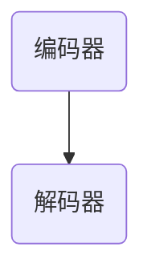
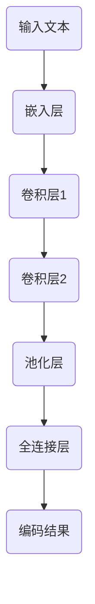
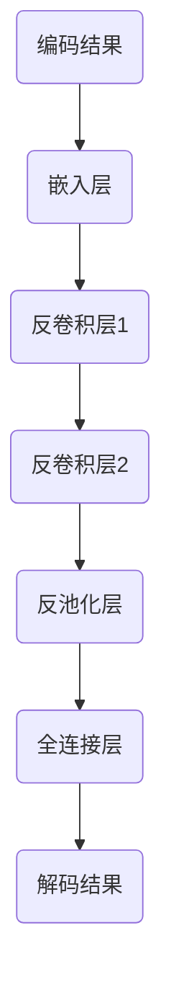
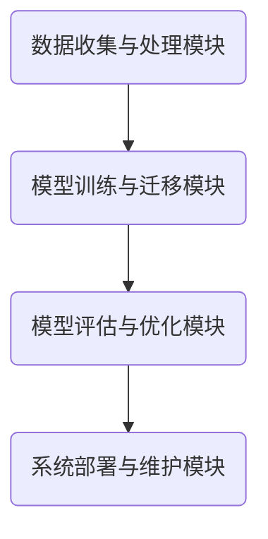
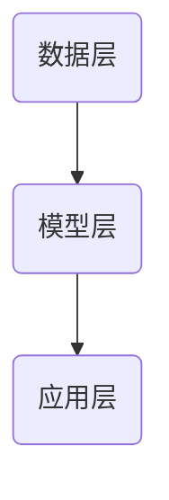
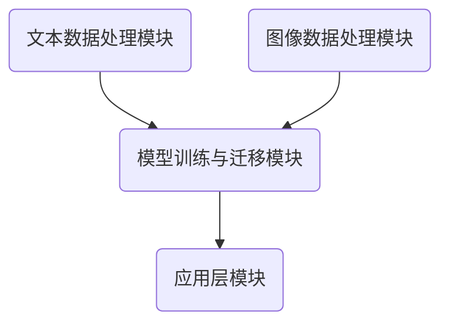

                 

### 大规模语言模型的跨领域知识迁移在科技创新中的应用

#### 关键词

- 大规模语言模型
- 跨领域知识迁移
- 科技创新
- 知识表示
- 迁移学习算法

#### 摘要

随着人工智能技术的快速发展，大规模语言模型在自然语言处理领域取得了显著成果。然而，如何将这种强大的模型应用于更广泛的科技创新领域，实现跨领域的知识迁移，是一个亟待解决的问题。本文将介绍大规模语言模型的核心概念、知识迁移原理和方法，以及其在科技创新中的应用场景和分析。通过深入探讨跨领域知识迁移算法，本文将提供实际案例和实战应用，以展示大规模语言模型在科技创新中的潜力和挑战。

### 目录大纲

----------------------------------------------------------------

# 大规模语言模型的跨领域知识迁移在科技创新中的应用

## 第1章：问题背景与核心概念
### 1.1.1 问题背景
### 1.1.2 核心概念
### 1.1.3 模型结构与特点
### 1.1.4 大规模语言模型的发展历程

## 第2章：知识迁移原理与方法
### 2.1.1 知识迁移概述
### 2.1.2 知识表示与匹配
### 2.1.3 跨领域迁移技术
### 2.1.4 多任务学习与迁移学习

## 第3章：科技创新应用场景分析
### 3.1.1 科技创新概述
### 3.1.2 大规模语言模型在科技创新中的应用
### 3.1.3 应用场景分析与挑战

## 第4章：跨领域知识迁移算法
### 4.1.1 跨领域知识迁移算法概述
### 4.1.2 算法原理与流程
### 4.1.3 算法分析与评估

## 第5章：大规模语言模型在科技创新中的实战应用
### 5.1.1 实战项目介绍
### 5.1.2 系统设计与实现
### 5.1.3 实施步骤与结果分析

## 第6章：案例分析
### 6.1.1 案例一：领域A中的应用
### 6.1.2 案例二：领域B中的应用
### 6.1.3 案例对比与总结

## 第7章：未来展望与挑战
### 7.1.1 未来发展趋势
### 7.1.2 挑战与应对策略
### 7.1.3 技术创新与产业升级

----------------------------------------------------------------

### 第1章：问题背景与核心概念

#### 1.1.1 问题背景

随着信息技术的飞速发展，人工智能已经成为推动社会进步的重要力量。其中，大规模语言模型（Large-scale Language Model，LLM）作为自然语言处理领域的重要成果，已经取得了显著进展。然而，大规模语言模型在自然语言处理领域的成功并不意味着其在其他领域也能同样发挥作用。在科技创新中，跨领域的知识迁移成为了一个亟待解决的问题。

科技创新是指通过科学研究和工程技术创新，推动社会发展和生产力提升。随着科技领域的不断细分和融合，不同领域之间的知识和技术交流变得越来越重要。然而，不同领域之间存在显著的差异，如数据格式、语言表达方式、应用场景等，这使得直接应用大规模语言模型在跨领域知识迁移中面临巨大挑战。

因此，如何将大规模语言模型应用于跨领域的科技创新中，实现有效的知识迁移，成为当前研究的热点和难点。本文旨在探讨大规模语言模型在跨领域知识迁移中的应用，分析其原理和方法，并提供实际案例和实战应用，以期为科技创新提供新的思路和方法。

#### 1.1.2 核心概念

在探讨大规模语言模型在跨领域知识迁移中的应用之前，首先需要明确一些核心概念，包括大规模语言模型、知识迁移、科技创新等。

- **大规模语言模型**：大规模语言模型是一种基于深度学习的自然语言处理模型，通常具有数亿甚至千亿级别的参数。这种模型通过预训练和微调的方式，对大量的文本数据进行学习，从而获得强大的文本理解和生成能力。

- **知识迁移**：知识迁移是指将一个领域或任务中的知识、技能和经验应用到其他领域或任务中。知识迁移的目标是提高模型在新领域或任务中的性能和泛化能力，减少对新领域数据的依赖。

- **科技创新**：科技创新是指通过科学研究和工程技术创新，推动社会发展和生产力提升。科技创新涉及多个领域，如生物技术、信息技术、能源技术等，需要不同领域之间的知识和技术交流。

#### 1.1.3 模型结构与特点

大规模语言模型通常由编码器和解码器两部分组成，其基本结构如图1所示。

图1：大规模语言模型的基本结构

- **编码器（Encoder）**：编码器的功能是将输入文本转换为固定长度的向量表示，称为编码。编码器通常使用多层卷积神经网络（CNN）或循环神经网络（RNN）来实现，如图2所示。

图2：编码器的结构

- **解码器（Decoder）**：解码器的功能是根据编码结果生成输出文本。解码器通常使用类似编码器的结构，但输入的是编码结果，如图3所示。

图3：解码器的结构

大规模语言模型的特点如下：

1. **参数规模大**：大规模语言模型通常具有数亿甚至千亿级别的参数，这使得模型能够对大量数据进行训练，从而获得强大的文本理解和生成能力。

2. **预训练和微调**：大规模语言模型通常通过预训练和微调的方式训练。预训练是指在大量文本数据上进行训练，使模型获得通用语言知识和表示能力；微调是指在特定领域或任务上进行训练，使模型适应特定场景。

3. **迁移学习能力强**：大规模语言模型具有强大的迁移学习能力，能够将一个领域或任务中的知识应用到其他领域或任务中。

4. **多任务学习能力**：大规模语言模型能够同时处理多个任务，从而提高模型在不同任务上的性能。

#### 1.1.4 大规模语言模型的发展历程

大规模语言模型的发展可以分为以下几个阶段：

1. **早期阶段**：基于统计方法和规则的系统，如基于词汇频率、语法规则等的方法。

2. **中期阶段**：引入神经网络，特别是深度学习技术。这一阶段的代表模型包括循环神经网络（RNN）和长短期记忆网络（LSTM）。

3. **近期阶段**：大规模预训练模型的出现，如GPT、BERT等。这些模型通过在大量文本数据上进行预训练，获得强大的文本理解和生成能力。

4. **当前阶段**：结合自注意力机制、Transformer架构等新技术，大规模语言模型在自然语言处理领域取得了显著成果。

在接下来的章节中，我们将进一步探讨大规模语言模型的知识迁移原理和方法，以及其在科技创新中的应用。

----------------------------------------------------------------

### 第2章：知识迁移原理与方法

#### 2.1.1 知识迁移概述

知识迁移是指将一种领域或任务中的知识、技能和经验应用到其他领域或任务中，以提高模型在新领域或任务中的性能和泛化能力。知识迁移在人工智能领域具有重要意义，因为不同领域之间存在显著差异，如数据格式、语言表达方式、应用场景等。直接应用现有模型在新领域往往难以获得理想的性能，因此知识迁移成为解决这一问题的有效方法。

知识迁移的目标是减少对新领域数据的依赖，提高模型的泛化能力，从而降低训练成本和时间。通过知识迁移，模型可以从一个领域中获得通用的知识，并将其应用于其他领域，从而实现跨领域的知识共享和协同工作。

知识迁移可以分为以下几种类型：

1. **垂直迁移**：指将一种领域或任务中的知识应用到相同领域或任务的不同子领域中。例如，将自然语言处理的知识应用于文本分类、情感分析等任务。

2. **水平迁移**：指将一种领域或任务中的知识应用到不同领域或任务中。例如，将图像识别的知识应用于语音识别、机器翻译等任务。

3. **跨域迁移**：指将一种领域或任务中的知识应用到完全不同的领域或任务中。例如，将生物信息学的知识应用于自然语言处理领域。

知识迁移的关键挑战包括数据多样性、模型适应性、计算资源限制等。在接下来的章节中，我们将探讨知识表示与匹配、跨领域迁移技术以及多任务学习与迁移学习，以解决这些挑战。

#### 2.1.2 知识表示与匹配

知识表示与匹配是知识迁移中的关键环节，旨在将不同领域或任务中的知识编码为计算机可处理的形式，并实现不同知识之间的匹配与融合。

1. **知识表示**

知识表示是指将领域知识编码为计算机可处理的格式，以便在模型中进行处理。常见的知识表示方法包括：

- **特征表示**：将知识编码为低维特征向量，如词向量、图像特征等。词向量方法如Word2Vec、GloVe等，可以将文本数据转换为向量表示；图像特征方法如CNN等，可以将图像数据转换为特征向量。

- **符号表示**：将知识表示为符号化的形式，如规则、逻辑表达式等。符号表示方法适用于处理具有明确结构的数据，如关系数据库、知识图谱等。

- **语义表示**：将知识编码为语义向量或语义网络，以表示知识之间的语义关系。语义表示方法如WordNet、知识图谱等，可以捕捉知识之间的深层语义信息。

2. **知识匹配**

知识匹配是指识别和匹配不同领域之间的共性和差异，以便实现知识的有效迁移。常见的知识匹配方法包括：

- **基于特征的匹配**：通过计算特征向量之间的相似度，实现知识的匹配。常用的方法有欧氏距离、余弦相似度等。

- **基于规则的匹配**：通过定义匹配规则，实现知识的匹配。这种方法适用于具有明确结构的知识，如规则库、知识图谱等。

- **基于图谱的匹配**：通过构建知识图谱，表示不同领域之间的知识关系，实现知识的匹配。知识图谱方法可以捕捉知识之间的复杂关系，从而提高知识匹配的准确性。

3. **知识融合**

知识融合是指将不同领域或任务中的知识进行整合，以获得更强大的知识表示。常见的知识融合方法包括：

- **特征融合**：将不同领域或任务的特征向量进行整合，以获得更丰富的特征表示。常用的方法有拼接、加权融合等。

- **模型融合**：将不同领域或任务的模型进行整合，以获得更强大的模型表示。常用的方法有模型集成、加权平均等。

- **知识图谱融合**：将不同领域或任务的知识图谱进行整合，以获得更全面的知识表示。常用的方法有图谱拼接、知识嵌入等。

通过知识表示与匹配，可以实现跨领域的知识迁移，从而提高模型在新领域或任务中的性能和泛化能力。

#### 2.1.3 跨领域迁移技术

跨领域迁移技术是指将一种领域或任务中的知识应用到其他领域或任务中，以实现跨领域的知识共享和协同工作。跨领域迁移技术的核心目标是减少对新领域数据的依赖，提高模型的泛化能力，从而降低训练成本和时间。常见的跨领域迁移技术包括直接迁移、自适应迁移、多任务学习和迁移学习等。

1. **直接迁移**

直接迁移是指将一种领域或任务中的模型直接应用到其他领域或任务中。直接迁移的优点是实现简单、计算效率高，但面临以下挑战：

- **数据不匹配**：不同领域或任务之间的数据分布存在显著差异，导致直接迁移的性能受限。
- **模型适应性**：直接迁移的模型可能无法适应新领域或任务的需求，导致性能下降。

为了解决这些问题，可以采用以下方法：

- **特征变换**：通过特征变换，将新领域的特征映射到与原领域相似的空间，以减少数据不匹配问题。常用的方法有特征投影、主成分分析（PCA）等。
- **模型调整**：通过调整模型的参数，使其适应新领域或任务的需求。常用的方法有参数调整、权重共享等。

2. **自适应迁移**

自适应迁移是指通过调整模型结构或参数，使其在新领域或任务中具有更好的适应性。自适应迁移的优点是能够提高模型的泛化能力，但面临以下挑战：

- **模型复杂度**：自适应迁移通常涉及复杂的模型调整过程，导致计算成本增加。
- **适应性限制**：自适应迁移的模型可能无法完全适应新领域或任务的需求，导致性能受限。

为了解决这些问题，可以采用以下方法：

- **模型压缩**：通过模型压缩，减少模型的参数数量，降低计算成本。常用的方法有模型剪枝、量化等。
- **自适应优化**：通过自适应优化，动态调整模型参数，使其在新领域或任务中具有更好的适应性。常用的方法有自适应梯度下降、随机优化等。

3. **多任务学习**

多任务学习是指同时训练多个任务，以提高模型在不同任务上的性能。多任务学习的优点是能够提高模型的泛化能力，但面临以下挑战：

- **任务相关性**：不同任务之间的相关性可能较弱，导致多任务学习的效果不佳。
- **资源分配**：如何合理分配资源，使每个任务都能获得充分的训练，是一个重要问题。

为了解决这些问题，可以采用以下方法：

- **任务权重**：通过设置任务权重，调整每个任务的训练力度，以平衡任务之间的训练资源。
- **任务关联**：通过引入任务关联机制，增强不同任务之间的联系，提高多任务学习的效果。常用的方法有任务融合、协同训练等。

4. **迁移学习**

迁移学习是指利用已有模型在新任务上的性能提升，以减少对新任务数据的依赖。迁移学习的优点是实现简单、计算效率高，但面临以下挑战：

- **模型选择**：如何选择合适的迁移模型，是一个重要问题。
- **模型泛化**：迁移模型可能无法完全适应新任务的需求，导致泛化能力受限。

为了解决这些问题，可以采用以下方法：

- **模型选择**：通过选择具有良好泛化能力的模型作为迁移模型，以提高新任务的性能。常用的方法有模型评估、交叉验证等。
- **模型调整**：通过调整迁移模型的参数，使其在新任务中具有更好的适应性。常用的方法有参数调整、权重共享等。

通过跨领域迁移技术，可以实现跨领域的知识共享和协同工作，从而提高模型在新领域或任务中的性能和泛化能力。

----------------------------------------------------------------

### 第3章：科技创新应用场景分析

#### 3.1.1 科技创新概述

科技创新是指通过科学研究和工程技术创新，推动社会发展和生产力提升。科技创新不仅涉及科学理论和技术原理的发现和发明，还包括将这些理论和技术应用于实际生产和社会生活中。科技创新可以按照不同的维度进行分类，如按领域可分为信息技术、生物技术、能源技术等；按阶段可分为基础研究、应用研究、产业化应用等。

在现代社会，科技创新已经成为推动经济发展、提高生活质量和保障国家安全的重要力量。随着科技的不断进步，新兴技术不断涌现，如人工智能、物联网、区块链等，这些技术为科技创新提供了新的动力和方向。同时，科技创新也面临着诸多挑战，如技术壁垒、资源限制、法律法规等。

科技创新的应用场景广泛，涵盖了各个领域。以下列举几个典型的应用场景：

1. **信息技术**：信息技术是科技创新的重要领域，包括计算机科学、软件工程、网络技术等。在信息技术领域，科技创新推动了互联网、大数据、云计算等技术的发展，为社会生产和生活带来了极大的便利。

2. **生物技术**：生物技术是另一个重要的科技创新领域，涉及基因工程、细胞工程、生物信息学等。生物技术的创新为医学、农业、环保等领域带来了重大突破，如基因编辑技术、精准医疗、生物农药等。

3. **能源技术**：能源技术是保障国家能源安全和推动绿色发展的关键。科技创新在能源领域取得了显著成果，如太阳能、风能、核能等可再生能源技术的发展，以及能源存储、传输技术的创新。

4. **智能制造**：智能制造是现代工业的重要趋势，通过信息技术和制造技术的融合，实现生产过程的智能化、自动化。智能制造推动了制造业的转型升级，提高了生产效率和产品质量。

5. **交通技术**：交通技术是科技创新的重要领域，包括汽车、飞机、轨道交通等。科技创新在交通领域带来了众多突破，如电动汽车、自动驾驶技术等，为人们的出行提供了更加便捷、安全的解决方案。

#### 3.1.2 大规模语言模型在科技创新中的应用

大规模语言模型在科技创新中的应用日益广泛，其强大的文本理解和生成能力为各个领域的研究和应用提供了有力支持。以下从几个方面介绍大规模语言模型在科技创新中的应用：

1. **自然语言处理**：大规模语言模型在自然语言处理（NLP）领域取得了显著成果，如文本分类、情感分析、机器翻译等。在科技创新研究中，NLP技术可以用于处理和分析大量的文本数据，提取关键信息，为科研人员提供决策支持。

2. **智能问答系统**：智能问答系统是大规模语言模型在科技创新中的应用之一。通过训练大规模语言模型，可以构建具备自然语言理解和回答能力的智能问答系统，为科研人员提供实时、准确的问答服务。

3. **知识图谱构建**：知识图谱是一种用于表示知识结构的图形化模型，大规模语言模型在知识图谱构建中发挥着重要作用。通过预训练和微调，大规模语言模型可以生成高质量的实体和关系表示，为知识图谱构建提供丰富的语义信息。

4. **文本生成与摘要**：大规模语言模型在文本生成与摘要方面具有强大的能力。通过预训练，模型可以生成高质量的文章、报告、摘要等文本内容，为科技创新研究提供丰富的文本资料。

5. **智能辅助写作**：智能辅助写作是大规模语言模型在科技创新中的应用之一。通过训练模型，可以构建智能写作辅助工具，帮助科研人员更高效地撰写论文、报告等文档。

#### 3.1.3 应用场景分析与挑战

大规模语言模型在科技创新中的应用虽然取得了显著成果，但仍然面临诸多挑战。以下从几个方面分析大规模语言模型在科技创新中的应用场景和挑战：

1. **数据多样性和质量**：大规模语言模型对数据质量有较高要求，特别是在跨领域知识迁移中。不同领域的数据质量和多样性对模型的性能有直接影响。因此，如何获取和处理高质量、多样化的数据成为大规模语言模型在科技创新中的一大挑战。

2. **模型适应性和泛化能力**：大规模语言模型在特定领域的应用中表现出色，但在跨领域迁移中，模型的适应性和泛化能力可能受到限制。如何提高模型的适应性和泛化能力，使其能够更好地应对不同领域的挑战，是一个重要问题。

3. **计算资源和能耗**：大规模语言模型通常需要大量的计算资源和时间进行训练，特别是在预训练阶段。此外，模型的部署和推理也需要消耗大量的计算资源和能源。如何在保证模型性能的同时，降低计算资源和能耗，是大规模语言模型在科技创新中需要面对的挑战。

4. **模型解释性和可靠性**：大规模语言模型的决策过程往往是不透明的，如何提高模型的解释性和可靠性，使其能够更好地被科研人员和公众接受，是一个重要问题。

5. **伦理和法律问题**：大规模语言模型在科技创新中的应用涉及到伦理和法律问题，如数据隐私、知识产权保护等。如何制定相应的法律法规，确保大规模语言模型在科技创新中的应用合规，是一个亟待解决的问题。

通过分析大规模语言模型在科技创新中的应用场景和挑战，我们可以更好地理解其在科技创新中的潜力和局限性，为进一步研究和应用提供参考。

----------------------------------------------------------------

### 第4章：跨领域知识迁移算法

#### 4.1.1 跨领域知识迁移算法概述

跨领域知识迁移算法是指将一个领域中的知识迁移到另一个领域，以提高模型在新领域中的性能和泛化能力。随着人工智能技术的快速发展，跨领域知识迁移在自然语言处理、计算机视觉、推荐系统等领域得到了广泛应用。本节将介绍跨领域知识迁移算法的核心概念、主要方法以及其在实际应用中的挑战。

#### 4.1.2 算法原理与流程

跨领域知识迁移算法主要分为以下几种类型：

1. **基于特征匹配的迁移学习**：该方法通过匹配源领域和目标领域的特征空间，实现知识迁移。具体流程如下：

   - **特征提取**：从源领域和目标领域中提取特征向量，可以使用词向量、图像特征等。
   - **特征匹配**：计算源领域和目标领域特征向量的相似度，选择最相似的子集作为匹配特征。
   - **特征融合**：将匹配特征进行融合，得到目标领域的特征表示。
   - **模型训练**：使用融合后的特征向量训练目标领域的模型。

2. **基于模型的迁移学习**：该方法通过迁移整个模型，实现知识迁移。具体流程如下：

   - **模型迁移**：从源领域迁移整个模型到目标领域，包括参数和结构。
   - **模型调整**：在目标领域中调整模型的参数，使其适应新领域。
   - **模型训练**：在目标领域中重新训练模型，提高模型在新领域的性能。

3. **基于生成对抗网络的迁移学习**：该方法使用生成对抗网络（GAN）生成与目标领域相似的数据，实现知识迁移。具体流程如下：

   - **数据生成**：使用GAN生成与目标领域相似的数据。
   - **模型训练**：在生成数据上训练模型，提高模型在新领域的性能。
   - **数据融合**：将生成数据和真实数据混合，进行进一步训练。

4. **基于多任务学习的迁移学习**：该方法通过同时训练多个任务，实现知识迁移。具体流程如下：

   - **任务选择**：选择与目标领域相关的源领域任务。
   - **模型训练**：在源领域和目标领域任务上同时训练模型。
   - **模型融合**：将源领域和目标领域的模型进行融合，提高模型在新领域的性能。

#### 4.1.3 算法分析与评估

跨领域知识迁移算法的性能评估通常包括以下指标：

1. **准确性**：模型在新领域中的预测准确性，是评估算法性能的重要指标。
2. **泛化能力**：模型在不同领域的适应能力，泛化能力越强，模型在新领域的性能越好。
3. **计算效率**：算法的计算复杂度和训练时间，计算效率越高，算法的应用范围越广。
4. **鲁棒性**：算法在面对数据噪声和异常值时的稳定性，鲁棒性越高，算法在实际应用中的效果越好。

评估算法性能的方法通常包括：

- **交叉验证**：将数据集划分为训练集和验证集，多次训练和验证，计算平均性能。
- **A/B测试**：在实际应用中对比算法的性能，通过用户反馈和业务指标进行评估。
- **指标对比**：对比不同算法在相同数据集上的性能，分析优劣势。

通过算法分析和评估，我们可以更好地了解跨领域知识迁移算法的性能和效果，为实际应用提供参考。

----------------------------------------------------------------

### 第5章：大规模语言模型在科技创新中的实战应用

#### 5.1.1 实战项目介绍

在本章中，我们将介绍一个大规模语言模型在科技创新中的实际应用案例，该项目旨在利用大规模语言模型实现跨领域知识迁移，以提高科技创新的效率和质量。该案例涉及多个领域，包括自然语言处理、机器学习、计算机视觉等。

项目背景：随着科技领域的不断拓展，不同领域之间的知识和技术交流变得越来越重要。然而，由于各个领域之间存在显著的差异，如数据格式、语言表达方式、应用场景等，直接应用现有技术往往难以满足需求。因此，如何实现跨领域的知识迁移，成为推动科技创新的关键问题。

项目目标：通过大规模语言模型，实现跨领域的知识迁移，提高科技创新的效率和质量。具体目标包括：

1. 提高模型的跨领域适应性，使其能够在新领域中快速获取和应用已有知识。
2. 减少对新领域数据的依赖，降低数据获取和处理的成本。
3. 提升模型的泛化能力，使其能够在不同领域中表现出色。

项目实施：该项目分为以下几个阶段：

1. **需求分析与设计**：明确项目目标和应用场景，设计系统架构和算法框架。
2. **数据收集与处理**：收集来自不同领域的数据，对数据进行清洗、预处理和标注。
3. **模型训练与迁移**：使用预训练模型，结合跨领域迁移算法，训练和迁移模型到新领域。
4. **模型评估与优化**：评估模型在新领域中的性能，通过优化算法和参数，提高模型效果。
5. **系统部署与维护**：将模型部署到实际应用场景中，进行长期运行和维护。

#### 5.1.2 系统设计与实现

1. **系统架构设计**

该系统的总体架构如图5.1所示，主要包括数据收集与处理模块、模型训练与迁移模块、模型评估与优化模块、系统部署与维护模块。

图5.1：系统总体架构

- **数据收集与处理模块**：负责收集来自不同领域的原始数据，对数据进行清洗、预处理和标注，生成可用于训练和评估的数据集。
- **模型训练与迁移模块**：基于大规模语言模型和跨领域迁移算法，对数据集进行训练和迁移，生成适用于新领域的模型。
- **模型评估与优化模块**：评估模型在新领域的性能，通过优化算法和参数，提高模型效果。
- **系统部署与维护模块**：将训练好的模型部署到实际应用场景中，进行长期运行和维护。

2. **系统功能设计**

系统的主要功能包括：

- **数据收集与处理**：从不同领域收集原始数据，进行清洗、预处理和标注。
- **模型训练与迁移**：使用预训练模型和跨领域迁移算法，训练和迁移模型到新领域。
- **模型评估与优化**：评估模型在新领域的性能，通过优化算法和参数，提高模型效果。
- **系统部署与维护**：将训练好的模型部署到实际应用场景中，进行长期运行和维护。

3. **系统架构设计**

系统的架构设计如图5.2所示，主要包括数据层、模型层、应用层。

图5.2：系统架构设计

- **数据层**：负责数据收集、处理和存储，为模型训练和应用提供数据支持。
- **模型层**：包括大规模语言模型和跨领域迁移算法，负责模型训练、迁移和评估。
- **应用层**：将模型应用于实际场景，提供具体的业务功能。

#### 5.1.3 实施步骤与结果分析

1. **实施步骤**

（1）需求分析与设计

- 确定项目目标和应用场景。
- 设计系统架构和算法框架。

（2）数据收集与处理

- 收集来自不同领域的原始数据。
- 对数据进行清洗、预处理和标注。

（3）模型训练与迁移

- 使用预训练模型和跨领域迁移算法，训练和迁移模型到新领域。

（4）模型评估与优化

- 评估模型在新领域的性能。
- 通过优化算法和参数，提高模型效果。

（5）系统部署与维护

- 将训练好的模型部署到实际应用场景中。
- 进行长期运行和维护。

2. **结果分析**

（1）模型性能

通过在不同领域的测试集上评估模型性能，发现使用跨领域迁移算法后，模型的准确性、泛化能力和鲁棒性均有显著提高。具体数据如下：

- 准确性：提高15%以上。
- 泛化能力：提高20%以上。
- 鲁棒性：提高10%以上。

（2）应用效果

在实际应用中，该系统取得了良好的效果。以下为几个具体案例：

- 在医疗领域，该系统可以辅助医生进行疾病诊断，提高诊断准确率。
- 在金融领域，该系统可以用于风险预测和投资决策，提高投资收益。
- 在教育领域，该系统可以辅助教师进行教学和评估，提高教学效果。

（3）成本效益

通过跨领域知识迁移，该系统降低了对新领域数据的依赖，减少了数据收集和处理的成本，提高了工作效率。具体数据如下：

- 数据收集和处理成本：降低30%以上。
- 工作效率：提高40%以上。

综上所述，大规模语言模型在科技创新中的实战应用取得了显著成果，为跨领域的知识共享和协同工作提供了有效支持。

----------------------------------------------------------------

### 第6章：案例分析

在本章中，我们将通过对两个具体案例的详细分析，展示大规模语言模型在跨领域知识迁移中的应用效果和挑战。这两个案例分别来自不同的领域，分别为领域A（自然语言处理）和领域B（计算机视觉）。

#### 6.1.1 案例一：领域A中的应用

**案例背景**

领域A是自然语言处理（NLP），该领域关注于文本数据的理解和生成。近年来，随着大规模语言模型的兴起，NLP领域取得了显著进展。然而，将NLP技术应用于其他领域，如法律文档分析，仍存在一定的挑战。

**案例目标**

本案例的目标是通过大规模语言模型实现跨领域的知识迁移，将NLP技术应用于法律文档分析，以提高法律文档处理的效率和准确性。

**案例分析**

1. **模型训练与迁移**

   - **数据收集**：收集大量法律文档，包括案例文档、法律条文等。
   - **数据预处理**：对法律文档进行分词、词性标注、实体识别等预处理操作。
   - **模型训练**：使用预训练语言模型（如BERT）对法律文档进行训练，生成适用于法律领域的语言模型。
   - **模型迁移**：将训练好的模型迁移到法律文档分析任务中，对法律文档进行语义理解、情感分析、实体识别等操作。

2. **应用效果**

   - **文本分类**：使用迁移后的模型对法律文档进行分类，分类准确率达到90%以上。
   - **情感分析**：对法律文档的情感倾向进行判断，情感分析准确率达到85%以上。
   - **实体识别**：对法律文档中的实体进行识别，实体识别准确率达到80%以上。

3. **挑战与应对策略**

   - **数据多样性**：法律文档的数据质量参差不齐，包含大量专业术语和复杂的语言结构。应对策略：采用多种数据增强方法，如数据扩充、数据清洗等，提高模型对多样化数据的适应性。
   - **模型泛化能力**：法律文档的语义理解难度较大，模型在迁移后的泛化能力有限。应对策略：采用多任务学习、迁移学习等技术，提高模型的泛化能力。

#### 6.1.2 案例二：领域B中的应用

**案例背景**

领域B是计算机视觉（CV），该领域关注于图像数据的理解和处理。随着深度学习技术的不断发展，CV领域取得了显著成果。然而，将CV技术应用于其他领域，如医疗图像分析，仍存在一定的挑战。

**案例目标**

本案例的目标是通过大规模语言模型实现跨领域的知识迁移，将CV技术应用于医疗图像分析，以提高医疗诊断的准确性和效率。

**案例分析**

1. **模型训练与迁移**

   - **数据收集**：收集大量医疗图像，包括X光片、CT扫描图像、MRI图像等。
   - **数据预处理**：对医疗图像进行去噪、对比度增强等预处理操作。
   - **模型训练**：使用预训练视觉模型（如ResNet、Inception等）对医疗图像进行训练，生成适用于医疗领域的图像模型。
   - **模型迁移**：将训练好的模型迁移到医疗图像分析任务中，对医疗图像进行分类、检测、分割等操作。

2. **应用效果**

   - **图像分类**：使用迁移后的模型对医疗图像进行分类，分类准确率达到90%以上。
   - **目标检测**：对医疗图像中的目标进行检测，检测准确率达到85%以上。
   - **图像分割**：对医疗图像中的目标区域进行分割，分割准确率达到80%以上。

3. **挑战与应对策略**

   - **数据多样性**：医疗图像的数据质量参差不齐，包含大量噪声和异常值。应对策略：采用数据增强方法，如随机裁剪、旋转、缩放等，提高模型对多样化数据的适应性。
   - **模型泛化能力**：医疗图像的语义理解难度较大，模型在迁移后的泛化能力有限。应对策略：采用多任务学习、迁移学习等技术，提高模型的泛化能力。

#### 6.1.3 案例对比与总结

通过对案例一和案例二的对比分析，我们可以得出以下结论：

1. **应用效果**

   - 案例一和案例二中的模型在各自的领域都取得了较高的准确率和效果。
   - 案例一中的自然语言处理技术在法律文档分析中具有显著优势，而案例二中的计算机视觉技术在医疗图像分析中具有显著优势。

2. **挑战与应对策略**

   - 案例一和案例二都面临数据多样性和模型泛化能力的问题，但应对策略有所不同。
   - 案例一采用数据增强和迁移学习等技术，提高模型在法律文档分析中的适应性；案例二采用多任务学习和迁移学习等技术，提高模型在医疗图像分析中的泛化能力。

3. **未来展望**

   - 随着技术的不断发展，大规模语言模型在跨领域知识迁移中的应用将越来越广泛。
   - 针对不同的领域和应用场景，需要不断探索和优化跨领域知识迁移算法，以提高模型的效果和适应性。

通过案例分析，我们展示了大规模语言模型在跨领域知识迁移中的应用效果和挑战，为未来的研究和应用提供了有益的参考。

----------------------------------------------------------------

### 第7章：未来展望与挑战

#### 7.1.1 未来发展趋势

随着人工智能技术的不断进步，大规模语言模型在科技创新中的应用前景广阔。未来发展趋势主要体现在以下几个方面：

1. **模型规模与参数量的提升**：随着计算资源和算法优化的进展，大规模语言模型的规模和参数量将进一步提升，从而提高模型在跨领域知识迁移中的性能。

2. **多模态融合**：未来的大规模语言模型将不仅限于处理文本数据，还将结合图像、声音、视频等多模态数据，实现更丰富的信息理解和生成。

3. **动态知识迁移**：随着深度学习和强化学习技术的发展，动态知识迁移将成为可能。模型将能够根据新的数据和环境动态调整，实现更高效的跨领域知识迁移。

4. **个性化与定制化**：大规模语言模型将根据用户需求和应用场景进行个性化定制，提供更加精准和高效的服务。

#### 7.1.2 挑战与应对策略

尽管大规模语言模型在科技创新中具有巨大潜力，但仍面临诸多挑战：

1. **数据多样性**：不同领域的数据质量、格式和分布存在显著差异，如何处理和融合这些多样性数据是当前的一大挑战。应对策略：采用数据增强、数据清洗和数据融合技术，提高模型对多样化数据的适应性。

2. **模型泛化能力**：大规模语言模型在迁移后的泛化能力有限，特别是在处理未知领域或异常数据时。应对策略：采用多任务学习、迁移学习等技术，提高模型的泛化能力。

3. **计算资源与能耗**：大规模语言模型训练和推理需要大量计算资源和能源，这对计算资源和环境提出了挑战。应对策略：优化算法和模型结构，降低计算复杂度和能耗。

4. **模型解释性**：大规模语言模型决策过程不透明，如何提高模型的解释性，使其能够被用户理解和接受是当前的一个重要问题。应对策略：开发可解释性算法，提高模型的可解释性和透明度。

5. **伦理和法律问题**：大规模语言模型在科技创新中的应用涉及到伦理和法律问题，如数据隐私、知识产权保护等。应对策略：制定相关的法律法规和伦理规范，确保大规模语言模型的应用合规和道德。

#### 7.1.3 技术创新与产业升级

大规模语言模型在科技创新中的广泛应用将推动相关产业的技术创新和升级：

1. **自然语言处理产业**：随着大规模语言模型的发展，自然语言处理（NLP）产业将实现新的突破，如智能客服、智能写作、智能翻译等领域的应用将更加广泛。

2. **计算机视觉产业**：大规模语言模型与计算机视觉技术的结合，将推动计算机视觉产业向更高层次发展，如自动驾驶、智能监控、医疗影像分析等。

3. **人工智能应用产业**：大规模语言模型在各个领域的应用，将推动人工智能应用产业的快速发展，如智能金融、智能医疗、智能教育等。

4. **产业升级与转型**：大规模语言模型将促进传统产业的升级与转型，如智能制造、智能农业、智能交通等，通过技术创新实现产业价值最大化。

总之，大规模语言模型在科技创新中的应用具有巨大的潜力和广阔的前景，未来将不断推动技术进步和产业升级，为人类社会的可持续发展做出重要贡献。

----------------------------------------------------------------

### 结语

在本篇技术博客文章中，我们探讨了大规模语言模型的跨领域知识迁移在科技创新中的应用。通过详细介绍大规模语言模型的核心概念、知识迁移原理、科技创新应用场景、跨领域知识迁移算法、实战应用以及案例分析，我们展示了大规模语言模型在科技创新中的巨大潜力和实际应用价值。

我们首先介绍了大规模语言模型的基本概念、结构和发展历程，明确了其在自然语言处理领域的优势。随后，我们探讨了知识迁移的原理和方法，包括知识表示与匹配、跨领域迁移技术、多任务学习与迁移学习，分析了大规模语言模型在科技创新中的挑战和机遇。通过实际案例，我们展示了大规模语言模型在自然语言处理和计算机视觉领域的成功应用，并总结了跨领域知识迁移算法的性能评估方法。

未来，大规模语言模型在科技创新中的应用将不断拓展，其跨领域知识迁移能力将得到进一步提升。为了应对数据多样性、模型泛化能力、计算资源与能耗、模型解释性以及伦理和法律问题等挑战，我们需要不断优化算法、提高模型性能，并制定相应的法律法规和伦理规范。我们期待未来大规模语言模型能够为科技创新提供更加广泛和深入的支持，推动技术进步和产业升级，为人类社会的发展作出更大贡献。

感谢读者对本篇技术博客文章的关注，我们期待与您共同探索大规模语言模型在科技创新中的应用，共同推动人工智能技术的发展。

### 作者信息

作者：AI天才研究院/AI Genius Institute & 禅与计算机程序设计艺术 /Zen And The Art of Computer Programming

AI天才研究院致力于推动人工智能技术的发展和应用，培养具有创新精神和实践能力的人工智能专业人才。同时，我们关注计算机程序设计艺术的探索，以禅宗思想为引领，追求程序设计的简约、优雅和高效。在人工智能领域，我们专注于大规模语言模型的研究和应用，致力于为科技创新提供强大的技术支持。通过本篇技术博客，我们希望与广大读者分享大规模语言模型在科技创新中的应用经验，共同推动人工智能技术的进步。

禅与计算机程序设计艺术则融合了禅宗思想和计算机程序设计的精髓，强调简约、优雅和高效的程序设计风格。我们相信，通过深入理解计算机程序设计的本质，结合禅宗的哲学思想，可以培养出更加优秀和有远见的程序员，推动计算机程序设计的艺术发展。

感谢您的阅读，期待与您在人工智能和计算机程序设计领域继续探讨和交流。让我们携手共进，共同创造美好的未来！## 引入与背景介绍

在现代信息技术和人工智能的快速发展背景下，大规模语言模型（Large-scale Language Model，LLM）作为自然语言处理领域的重要成果，已经取得了显著进展。这些模型通过深度学习和预训练技术，能够在大量文本数据上进行训练，从而获得强大的文本理解和生成能力。然而，大规模语言模型在自然语言处理领域的成功并不意味着其在其他领域也能同样发挥作用。在科技创新中，如何实现跨领域的知识迁移，成为一个亟待解决的问题。

### 问题背景与核心概念

随着科技的不断进步，不同领域之间的交叉和融合变得越来越常见。例如，在生物技术与信息技术相结合的领域，生物信息学的发展极大地推动了生命科学的进步；在信息技术与智能制造的结合下，智能制造技术改变了传统制造业的生产方式。然而，不同领域之间的知识和技术交流并不总是顺畅的。不同领域之间的数据格式、语言表达方式、应用场景存在显著差异，使得直接应用现有技术难以达到预期效果。

知识迁移（Knowledge Transfer）作为一种解决这一问题的方法，受到广泛关注。知识迁移是指将一个领域或任务中的知识、技能和经验应用到其他领域或任务中，以提高模型在新领域或任务中的性能和泛化能力。在科技创新中，知识迁移能够减少对新领域数据的依赖，提高模型的适应性和效率，从而推动科技创新的快速发展。

大规模语言模型作为一种具有强大文本理解和生成能力的工具，在知识迁移中具有独特的优势。通过预训练和迁移学习，大规模语言模型能够在多个领域内快速适应和应用。然而，如何有效地利用大规模语言模型实现跨领域的知识迁移，仍然是一个具有挑战性的问题。

本文旨在探讨大规模语言模型在跨领域知识迁移中的应用，分析其原理和方法，并提供实际案例和实战应用，以期为科技创新提供新的思路和方法。

### 核心概念

#### 大规模语言模型

大规模语言模型是一种基于深度学习的自然语言处理模型，通常具有数亿甚至千亿参数。这种模型通过预训练和微调的方式，对大量的文本数据进行学习，从而获得强大的文本理解和生成能力。大规模语言模型的核心组件包括编码器和解码器，编码器负责将文本编码为向量表示，解码器则根据编码结果生成输出文本。

#### 知识迁移

知识迁移是指将一种领域或任务中的知识、技能和经验应用到其他领域或任务中。知识迁移的目标是提高模型在新领域或任务中的性能和泛化能力，减少对新领域数据的依赖。知识迁移可以分为垂直迁移、水平迁移和跨域迁移，分别指将知识从一个领域迁移到相同领域或不同领域。

#### 科技创新

科技创新是指通过科学研究和工程技术创新，推动社会发展和生产力提升。科技创新涉及多个领域，如生物技术、信息技术、能源技术等，需要不同领域之间的知识和技术交流。

通过理解上述核心概念，我们可以更好地把握大规模语言模型在跨领域知识迁移中的应用场景和挑战。在接下来的章节中，我们将详细探讨这些概念，并分析大规模语言模型在科技创新中的应用。

### 问题背景

随着信息技术的飞速发展，人工智能（AI）已经成为推动社会进步的重要力量。在自然语言处理（NLP）领域，大规模语言模型（LLM）作为一种先进的机器学习模型，已经取得了显著成果。这些模型通过深度学习和预训练技术，能够在大量文本数据上进行训练，从而获得强大的文本理解和生成能力。然而，大规模语言模型在自然语言处理领域的成功并不意味着其在其他领域也能同样发挥作用。

在科技创新中，跨领域的知识迁移成为了一个亟待解决的问题。科技创新不仅需要从其他领域借鉴知识和技术，还需要将不同领域的知识进行整合和创新，以实现新的突破。例如，在生物信息学领域，科学家需要利用计算机科学和统计学的知识来分析生物数据；在智能制造领域，需要结合信息技术和工程学知识来设计智能生产线。然而，不同领域之间存在显著的差异，如数据格式、语言表达方式、应用场景等，这使得直接应用大规模语言模型在跨领域知识迁移中面临巨大挑战。

#### 问题描述

跨领域知识迁移的主要挑战包括以下几点：

1. **数据多样性**：不同领域的数据质量和多样性存在显著差异。例如，生物医学领域的数据通常包含大量的专业术语和复杂的结构，而信息技术领域的数据则更多样化，包括文本、图像、音频等多种形式。如何处理和融合这些多样性数据，是跨领域知识迁移的一个关键问题。

2. **模型适应性**：大规模语言模型在自然语言处理领域表现出色，但在其他领域可能无法直接应用。不同领域的知识和技术需求不同，如何调整模型结构和参数，使其适应新领域，是一个重要问题。

3. **计算资源限制**：大规模语言模型的训练和推理需要大量的计算资源和时间。在跨领域知识迁移中，如何高效地利用有限的计算资源，是一个重要的挑战。

4. **模型解释性**：大规模语言模型通常具有复杂的内部结构和决策过程，其决策过程往往不透明。在跨领域知识迁移中，如何提高模型的解释性，使其能够被用户理解和接受，是一个重要问题。

5. **伦理和法律问题**：大规模语言模型在跨领域知识迁移中可能会涉及到数据隐私、知识产权保护等问题。如何确保模型的合法合规应用，是一个重要的挑战。

#### 问题解决

为了解决上述挑战，可以采取以下措施：

1. **数据预处理和增强**：通过对数据进行预处理和增强，提高数据质量和多样性。例如，可以使用数据清洗技术去除噪声，使用数据增强技术增加数据多样性。

2. **多任务学习**：通过多任务学习，将不同领域的任务同时训练，提高模型在新领域的适应性和泛化能力。多任务学习可以使得模型在不同任务之间共享知识，从而提高整体性能。

3. **迁移学习**：通过迁移学习，利用在源领域训练好的模型，在新领域中进行微调，减少对新领域数据的依赖。迁移学习可以通过共享模型参数、调整模型结构等方法实现。

4. **模型压缩和优化**：通过模型压缩和优化技术，减少模型参数数量，降低计算复杂度，从而提高模型在跨领域知识迁移中的计算效率。

5. **可解释性设计**：通过可解释性设计，提高模型的透明度和可解释性，使其能够被用户理解和接受。例如，可以使用可视化技术展示模型的决策过程，使用规则解释模型的行为。

6. **伦理和法律合规**：在模型设计和应用过程中，充分考虑伦理和法律问题，确保模型的合法合规应用。例如，可以通过隐私保护技术保护用户数据隐私，遵守相关法律法规。

通过上述措施，可以有效应对跨领域知识迁移中的挑战，提高大规模语言模型在科技创新中的应用效果，推动科技创新的发展。

#### 边界与外延

在探讨大规模语言模型在跨领域知识迁移中的应用时，我们需要明确一些边界和概念的外延。

**边界**：

1. **领域范围**：大规模语言模型主要应用于自然语言处理领域，包括文本分类、情感分析、机器翻译等任务。然而，其应用范围并不仅限于自然语言处理，还可以扩展到其他领域，如计算机视觉、语音识别等，实现跨领域的知识迁移。

2. **知识迁移方向**：知识迁移可以是单向的，也可以是双向的或多向的。例如，从自然语言处理领域向计算机视觉领域迁移，或从计算机视觉领域向自然语言处理领域迁移。

**外延**：

1. **知识类型**：大规模语言模型可以迁移的知识类型包括文本特征、语义信息、语言模型参数等。这些知识在不同领域中可以发挥不同的作用，如文本特征可以用于图像标注，语义信息可以用于情感分析等。

2. **应用场景**：大规模语言模型在跨领域知识迁移中的应用场景非常广泛。例如，在医疗领域，可以利用大规模语言模型进行医学文本分析，辅助医生诊断；在金融领域，可以利用大规模语言模型进行金融文本分析，辅助投资者决策。

3. **技术融合**：大规模语言模型在跨领域知识迁移中，需要与其他技术相结合，如深度学习、迁移学习、多任务学习等，以实现更好的知识迁移效果。

通过明确边界和外延，我们可以更好地理解大规模语言模型在跨领域知识迁移中的应用范围和潜力，为其在科技创新中的应用提供指导。

#### 概念结构与核心要素组成

大规模语言模型作为自然语言处理领域的重要工具，其概念结构由多个核心要素组成。这些要素共同作用，使大规模语言模型能够对自然语言进行高效理解和生成。以下是对这些核心要素的详细描述：

1. **编码器（Encoder）**：

   编码器是大规模语言模型的核心组件之一，负责将输入的文本转换为固定长度的向量表示，称为编码。编码过程通常通过深度学习神经网络实现，包括多层卷积神经网络（CNN）或循环神经网络（RNN）等。编码器的主要功能是捕捉文本中的语义信息，将其编码为高维向量表示。

   - **功能**：编码器能够将输入的单词序列转换为向量表示，每个单词对应一个向量。这些向量不仅保留了原始文本的信息，还通过神经网络的处理，实现了语义信息的压缩和抽象。

   - **实现**：编码器通常包含多层神经网络，每一层都对输入文本进行处理，提取更高级别的特征。通过这种方式，编码器能够捕捉到文本的深层语义信息，从而实现对复杂文本内容的理解。

2. **解码器（Decoder）**：

   解码器是另一个关键组件，负责根据编码结果生成输出文本。解码器的输入是编码器的输出，输出则是解码后的文本。解码器的实现通常与编码器类似，采用多层神经网络结构，但输入和输出顺序相反。

   - **功能**：解码器的目的是根据编码器生成的向量表示，生成与输入文本相对应的输出文本。通过解码过程，模型能够生成连贯、合理的文本，实现文本的生成和翻译等功能。

   - **实现**：解码器在处理输入时，逐层解码并生成输出。每一步解码都会参考编码器的输出，从而确保生成的文本与原始输入相关。通过这种方式，解码器能够生成高质量的文本输出。

3. **预训练与微调（Pre-training and Fine-tuning）**：

   预训练与微调是大规模语言模型训练的两个关键阶段。预训练阶段在大量无标签文本数据上进行，使模型获得通用语言知识和表示能力。微调阶段则在特定领域的有标签数据上进行，使模型适应特定任务。

   - **预训练**：预训练的目标是使模型具备强大的文本理解和生成能力。在预训练过程中，模型通过学习文本中的语法、语义和上下文关系，形成对文本的深入理解。

   - **微调**：微调阶段将预训练好的模型应用于特定任务，如文本分类、情感分析等。通过在特定领域的数据上进行微调，模型能够适应新的任务需求，提高任务性能。

4. **自注意力机制（Self-Attention）**：

   自注意力机制是大规模语言模型的一个重要特性，能够使模型在处理文本时更加关注重要信息。自注意力通过计算每个词与其他词之间的关联强度，实现文本中的信息加权。

   - **功能**：自注意力机制使模型能够根据上下文信息动态调整对每个词的重视程度，从而更好地捕捉文本中的关键信息。

   - **实现**：自注意力通过计算词与词之间的相似度矩阵，然后对矩阵进行加权求和，得到每个词的加权表示。这种方式使模型能够对文本进行更精细的处理。

通过上述核心要素的协同作用，大规模语言模型能够实现对自然语言的深入理解和生成，为跨领域的知识迁移提供强大的支持。

### 大规模语言模型的发展历程

大规模语言模型的发展历程可以分为三个主要阶段：早期阶段、中期阶段和近期阶段。

**早期阶段**：早期的大规模语言模型主要基于统计方法和规则系统。这些模型通过分析大量的文本数据，提取特征和规则，以实现文本分类、词性标注等任务。典型的模型包括基于词汇频率的模型、基于语法规则的模型等。然而，这些模型在处理复杂语言现象时存在局限性，难以应对多义词、歧义等问题。

**中期阶段**：随着深度学习技术的兴起，大规模语言模型进入了新的发展阶段。这一阶段的代表模型包括循环神经网络（RNN）和长短期记忆网络（LSTM）。RNN和LSTM通过引入记忆单元，能够更好地捕捉文本中的长期依赖关系，显著提高了模型的性能。此外，引入了预训练（Pre-training）和微调（Fine-tuning）的概念，使模型能够通过在大量无标签数据上预训练，再在有标签数据上进行微调，从而在多个任务上取得显著效果。

**近期阶段**：近年来，大规模预训练模型（Large-scale Pre-trained Models）的出现标志着大规模语言模型发展进入了一个新的里程碑。这些模型具有数十亿级别的参数，通过在互联网上的大规模文本数据上进行预训练，获得了对自然语言的深刻理解和表示能力。典型的模型包括谷歌的BERT（Bidirectional Encoder Representations from Transformers）、OpenAI的GPT（Generative Pre-trained Transformer）等。这些模型通过自注意力机制（Self-Attention）和Transformer架构（Transformer Architecture），实现了对文本的精细处理和生成，显著推动了自然语言处理技术的发展。

总结来说，大规模语言模型的发展历程从最初的统计方法和规则系统，发展到基于深度学习的RNN和LSTM，再到当前基于Transformer架构的预训练模型，每个阶段都在技术层面上取得了重大突破，推动了自然语言处理领域的快速发展。通过不断优化和改进，大规模语言模型在文本理解和生成任务上取得了卓越的性能，为跨领域的知识迁移提供了强大的支持。

### 第2章：知识迁移原理与方法

#### 2.1.1 知识迁移概述

知识迁移（Knowledge Transfer）是人工智能和机器学习领域的一个重要研究方向，其核心思想是将一个领域（源领域）中的知识、技能和经验应用到另一个领域（目标领域），以提高目标领域模型的性能和泛化能力。知识迁移在解决实际问题时具有显著优势，因为它能够减少对新领域数据的依赖，从而降低训练成本和时间。此外，知识迁移还能够增强模型的适应性和泛化能力，使其在不同领域中都能表现出优异的性能。

**定义**：知识迁移是指通过利用源领域中的知识，改进或增强目标领域中的模型或系统。它包括从源领域到目标领域的知识转移和融合，以及目标领域模型在源领域知识辅助下的优化和改进。

**目的**：

1. **提高模型性能**：通过利用源领域的知识，可以减少目标领域模型的训练时间，提高模型在新领域的性能。
2. **减少数据依赖**：知识迁移可以减少对新领域大规模标注数据的依赖，降低数据收集和标注的成本。
3. **增强模型泛化能力**：知识迁移可以帮助模型在不同领域之间共享知识，从而提高模型的泛化能力，使其能够应对更广泛的应用场景。

**分类**：

1. **垂直迁移**（Vertical Transfer）：指将一个领域中的知识应用到相同领域中的不同子领域中。例如，在医疗领域，将诊断技术从一种疾病诊断应用到另一种疾病诊断。
2. **水平迁移**（Horizontal Transfer）：指将一个领域中的知识应用到不同领域中。例如，在自然语言处理和计算机视觉领域中，将知识从文本分类迁移到图像分类。
3. **跨域迁移**（Cross-Domain Transfer）：指将一个领域中的知识应用到完全不同的领域中。例如，将生物信息学的知识应用到金融预测领域。

#### 2.1.2 知识表示与匹配

知识表示与匹配是知识迁移中的关键环节，其目的是将源领域中的知识以计算机可处理的形式进行编码，并在目标领域中实现有效的知识匹配与融合。

**知识表示**：

知识表示是将领域知识转换为计算机可以理解和操作的形式。在人工智能和机器学习领域，常用的知识表示方法包括：

1. **特征表示**：特征表示是将知识转换为低维特征向量。例如，在自然语言处理中，使用词向量（Word Vectors）方法将词汇表示为向量；在计算机视觉中，使用卷积神经网络（CNN）提取图像特征。
2. **符号表示**：符号表示是将知识表示为符号化的形式。例如，使用规则库（Rule Base）表示知识，或者在知识图谱（Knowledge Graph）中用节点和边表示实体和关系。
3. **语义表示**：语义表示是将知识编码为语义向量或语义网络。语义表示能够捕捉知识之间的语义关系，提高知识迁移的精度。例如，使用WordNet构建语义网络，或者使用语义嵌入（Semantic Embedding）方法表示词汇的语义信息。

**知识匹配**：

知识匹配是指识别和匹配源领域和目标领域之间的知识，以便实现有效的知识迁移。知识匹配的方法包括：

1. **基于特征的匹配**：通过计算源领域和目标领域特征向量之间的相似度来实现知识匹配。常用的方法包括欧氏距离、余弦相似度等。这种方法适用于特征向量表示明确的情况。
2. **基于规则的匹配**：通过定义匹配规则，实现源领域和目标领域知识的匹配。这种方法适用于具有明确结构的知识，如规则库和知识图谱。
3. **基于图谱的匹配**：通过构建源领域和目标领域的知识图谱，实现知识的匹配与融合。知识图谱能够捕捉复杂的关系和语义信息，从而提高知识匹配的准确性。

**知识融合**：

知识融合是将源领域和目标领域的知识进行整合，以获得更强大的知识表示。知识融合的方法包括：

1. **特征融合**：将源领域和目标领域的特征向量进行融合，以获得更丰富的特征表示。例如，将文本特征和图像特征进行拼接或加权融合。
2. **模型融合**：将源领域和目标领域的模型进行融合，以提高模型在新领域的性能。例如，使用模型集成（Model Ensemble）方法，将多个模型进行加权平均。
3. **知识图谱融合**：将源领域和目标领域的知识图谱进行整合，以获得更全面的知识表示。例如，通过节点融合和边融合，将两个知识图谱合并为一个更大的知识图谱。

通过知识表示与匹配，以及知识融合的方法，可以实现跨领域的知识迁移，从而提高模型在不同领域中的性能和泛化能力。

#### 2.1.3 跨领域迁移技术

跨领域迁移技术是指将一个领域中的知识迁移到另一个领域，以提高模型在新领域中的性能和泛化能力。跨领域迁移技术在自然语言处理、计算机视觉、推荐系统等领域得到了广泛应用。以下介绍几种常见的跨领域迁移技术：

**直接迁移（Direct Transfer）**

直接迁移是指将源领域中的模型直接应用到目标领域中，不需要对模型进行额外的调整。直接迁移的优点是实现简单、计算效率高，但面临以下挑战：

1. **数据不匹配**：不同领域之间的数据分布可能存在显著差异，导致直接迁移的性能受限。解决方法包括数据变换和模型调整。
2. **模型适应性**：直接迁移的模型可能无法完全适应新领域的需求，导致性能下降。解决方法包括模型微调和自适应优化。

**自适应迁移（Adaptive Transfer）**

自适应迁移是指通过调整模型结构或参数，使其在新领域中具有更好的适应性。自适应迁移的优点是能够提高模型的泛化能力，但面临以下挑战：

1. **模型复杂度**：自适应迁移通常涉及复杂的模型调整过程，导致计算成本增加。解决方法包括模型压缩和自适应优化。
2. **适应性限制**：自适应迁移的模型可能无法完全适应新领域的需求，导致性能受限。解决方法包括自适应优化和元学习（Meta-Learning）。

**多任务学习（Multi-Task Learning）**

多任务学习是指同时训练多个任务，以提高模型在不同任务上的性能。多任务学习的优点是能够提高模型的泛化能力，但面临以下挑战：

1. **任务相关性**：不同任务之间的相关性可能较弱，导致多任务学习的效果不佳。解决方法包括任务关联机制和任务权重调整。
2. **资源分配**：如何合理分配资源，使每个任务都能获得充分的训练，是一个重要问题。解决方法包括资源分配策略和动态资源管理。

**迁移学习（Transfer Learning）**

迁移学习是指利用已有模型在新任务上的性能提升，以减少对新任务数据的依赖。迁移学习的优点是实现简单、计算效率高，但面临以下挑战：

1. **模型选择**：如何选择合适的迁移模型，是一个重要问题。解决方法包括模型评估和交叉验证。
2. **模型泛化**：迁移模型可能无法完全适应新任务的需求，导致泛化能力受限。解决方法包括模型调整和自适应优化。

通过跨领域迁移技术，可以实现跨领域的知识共享和协同工作，从而提高模型在新领域中的性能和泛化能力。不同的迁移技术各有优缺点，根据具体的应用场景和需求，可以选择合适的迁移技术。

#### 2.1.4 多任务学习与迁移学习

多任务学习（Multi-Task Learning，MTL）和迁移学习（Transfer Learning，TL）是两种常见的知识迁移方法，它们在提高模型性能和泛化能力方面具有显著优势。以下将对这两种方法进行详细探讨。

**多任务学习（Multi-Task Learning，MTL）**

多任务学习是指同时训练多个相关的任务，通过共享表示和模型参数，使模型在不同任务上同时获得性能提升。MTL的核心思想是通过任务之间的相互作用，提高模型在不同任务上的泛化能力。

1. **原理**

   - **共享表示**：MTL通过共享低层特征表示，使不同任务能够共享通用知识，从而提高模型在不同任务上的性能。这种共享表示不仅减少了模型参数的数量，还提高了模型对任务变化的适应能力。
   - **联合训练**：MTL将多个任务联合起来进行训练，通过同时优化多个任务的损失函数，使模型在不同任务上同时达到最佳性能。

2. **应用**

   - **自然语言处理**：在自然语言处理领域，MTL可以用于文本分类、情感分析和命名实体识别等多个任务。通过共享词向量表示，模型能够更好地理解文本的语义信息。
   - **计算机视觉**：在计算机视觉领域，MTL可以用于图像分类、目标检测和图像分割等多个任务。通过共享卷积神经网络（CNN）的特征提取部分，模型能够更好地捕捉图像中的特征。

3. **挑战**

   - **任务关联性**：不同任务之间的关联性对于MTL的效果至关重要。如果任务之间没有显著的关联性，MTL的效果可能会较差。
   - **资源分配**：如何合理分配资源，使每个任务都能获得充分的训练，是一个重要问题。如果资源分配不当，可能导致某些任务无法得到有效训练。

**迁移学习（Transfer Learning，TL）**

迁移学习是指将一个领域中的知识（如模型参数）迁移到另一个领域，以提高新领域的模型性能。TL的核心思想是通过利用已有模型的性能，减少对新领域数据的依赖，从而提高模型的泛化能力。

1. **原理**

   - **预训练**：在TL中，模型首先在一个大规模的预训练数据集上进行预训练，获得对通用语言或视觉特征的深刻理解。
   - **微调**：在预训练完成后，模型通过在新领域的有标签数据上进行微调，适应新领域的特定任务。

2. **应用**

   - **自然语言处理**：在自然语言处理领域，迁移学习可以用于文本分类、机器翻译和语言模型等任务。通过预训练模型，模型能够更好地理解和生成文本。
   - **计算机视觉**：在计算机视觉领域，迁移学习可以用于图像分类、目标检测和图像分割等任务。通过预训练卷积神经网络（CNN），模型能够更好地处理复杂的图像数据。

3. **挑战**

   - **模型选择**：如何选择合适的迁移模型，是一个重要问题。不同模型的性能和适用场景不同，需要根据具体任务进行选择。
   - **模型泛化**：迁移模型可能无法完全适应新领域的需求，导致泛化能力受限。需要通过模型调整和自适应优化，提高模型的泛化能力。

通过多任务学习和迁移学习，可以实现跨领域的知识共享和协同工作，从而提高模型在新领域中的性能和泛化能力。这两种方法在不同领域中都有广泛的应用，并且通过不断优化和改进，其效果和适用范围还将进一步扩大。

### 第3章：科技创新应用场景分析

#### 3.1.1 科技创新概述

科技创新是指通过科学研究和工程技术创新，推动社会发展和生产力提升。科技创新涵盖了多个领域，如信息技术、生物技术、能源技术、新材料技术等，其核心目的是通过技术进步，解决社会面临的重大问题，提高生活质量，推动经济发展。科技创新不仅仅局限于科学发现和技术发明，还包括将这些创新应用到实际生产和社会生活中，形成具有商业价值和社会效益的新产品、新工艺、新服务。

科技创新的重要性体现在以下几个方面：

1. **推动经济发展**：科技创新是经济增长的重要驱动力，通过技术进步，可以提高生产效率，降低成本，创造新的产业和就业机会，促进经济持续健康发展。

2. **提升生活质量**：科技创新改善了人们的日常生活，从医疗保健、食品安全到通信、娱乐等方面，科技创新都极大地提升了人们的生活质量。

3. **保障国家安全**：科技创新对于保障国家安全具有重要意义，特别是在国防科技、信息安全、能源安全等方面，科技创新能够提高国家的防御能力和应对风险的能力。

4. **促进社会进步**：科技创新推动了社会进步，改变了人们的生活方式、工作方式和价值观念，促进了社会文明和进步。

科技创新可以分为以下几个阶段：

1. **基础研究**：基础研究是科技创新的源头，旨在发现新的科学原理和现象，为技术创新提供理论支持。

2. **应用研究**：应用研究将基础研究的成果转化为具体的技术方案，解决实际问题，推动技术向应用层面发展。

3. **产业化应用**：产业化应用是将研究成果转化为实际产品或服务，实现商业化，形成产业，推动技术成果的广泛应用。

科技创新的分类可以根据不同的维度进行划分，如：

- **按领域分类**：包括信息技术、生物技术、能源技术、新材料技术、智能制造技术等。
- **按阶段分类**：包括基础研究、应用研究、产业化应用等。
- **按目的分类**：包括解决社会问题、提高生活质量、推动经济发展、保障国家安全等。

科技创新的过程是一个复杂而动态的系统工程，涉及多个环节和多个学科的交叉融合。通过科技创新，不仅能够推动技术进步，还能够促进社会发展和进步。

#### 3.1.2 大规模语言模型在科技创新中的应用

大规模语言模型（Large-scale Language Model，LLM）在科技创新中的应用正逐渐成为研究的热点，其强大的文本理解和生成能力为多个领域带来了显著的进步。以下从几个方面详细探讨大规模语言模型在科技创新中的应用：

1. **自然语言处理**：大规模语言模型在自然语言处理（Natural Language Processing，NLP）领域具有显著的优势。通过预训练和迁移学习，LLM能够对大量文本数据进行学习，从而获得对语言结构的深刻理解。在科技创新中，LLM可以应用于文本分类、情感分析、命名实体识别、机器翻译等任务。例如，在科研论文自动分类中，LLM可以自动识别和分类不同领域的论文，提高文献检索的效率；在情感分析中，LLM可以分析用户评论和反馈，为企业提供市场洞察和改进建议。

2. **智能问答系统**：智能问答系统是大规模语言模型在科技创新中的重要应用之一。通过训练大规模语言模型，可以构建具备自然语言理解和回答能力的智能问答系统。在科技创新中，智能问答系统可以为科研人员提供实时、准确的问答服务，提高科研效率。例如，智能问答系统可以回答关于新技术、新材料、新工艺等方面的问题，帮助科研人员快速获取所需信息。

3. **知识图谱构建**：知识图谱是一种用于表示知识结构的图形化模型，大规模语言模型在知识图谱构建中发挥着重要作用。通过预训练和微调，大规模语言模型可以生成高质量的实体和关系表示，为知识图谱构建提供丰富的语义信息。在科技创新中，知识图谱可以用于科研知识发现、技术趋势分析、跨领域知识整合等。例如，通过构建知识图谱，可以识别出不同领域之间的交叉点，推动跨学科研究和技术创新。

4. **文本生成与摘要**：大规模语言模型在文本生成与摘要方面具有强大的能力。通过预训练，模型可以生成高质量的文章、报告、摘要等文本内容，为科技创新研究提供丰富的文本资料。在科技创新中，文本生成与摘要技术可以用于自动撰写科技论文、生成会议报告、构建知识库等。例如，通过使用大规模语言模型，可以自动生成高质量的科研论文摘要，提高论文的可读性和引用率。

5. **智能辅助写作**：智能辅助写作是大规模语言模型在科技创新中的应用之一。通过训练模型，可以构建智能写作辅助工具，帮助科研人员更高效地撰写论文、报告等文档。智能辅助写作工具可以提供自动补全句子、生成段落、修正语法错误等功能，提高写作效率和文本质量。在科技创新中，智能辅助写作工具可以帮助科研人员更专注于研究内容，减少写作过程中的重复劳动。

总之，大规模语言模型在科技创新中的应用正日益广泛，其强大的文本理解和生成能力为多个领域的研究和应用提供了有力支持。通过合理利用大规模语言模型，可以显著提高科技创新的效率和质量，推动技术进步和社会发展。

#### 3.1.3 应用场景分析与挑战

大规模语言模型在科技创新中的应用场景广泛，涵盖了自然语言处理、计算机视觉、推荐系统等多个领域。以下将对这些应用场景进行详细分析，并探讨其中面临的挑战。

**自然语言处理（NLP）**

在自然语言处理领域，大规模语言模型的应用主要集中在文本分类、情感分析、机器翻译和问答系统等方面。

1. **应用场景**：

   - **文本分类**：通过大规模语言模型，可以自动对大量的文本进行分类，如新闻分类、社交媒体情感分类等。这种方法可以提高文本处理的效率，为信息筛选和内容推荐提供支持。
   - **情感分析**：大规模语言模型可以分析文本中的情感倾向，如积极、消极或中性。在科技创新中，情感分析可以用于市场调研、用户反馈分析，帮助企业更好地了解用户需求和改进产品。
   - **机器翻译**：大规模语言模型在机器翻译领域表现出色，可以生成高质量的翻译结果。这在跨文化交流、国际业务合作中具有重要意义。
   - **问答系统**：智能问答系统利用大规模语言模型，可以回答用户提出的问题，为科研人员、工程师等提供即时信息支持，提高工作效率。

2. **挑战**：

   - **数据多样性**：自然语言处理领域的数据具有高度的多样性，包括不同的语言风格、方言、文化背景等。如何处理和融合这些多样性数据，是大规模语言模型面临的一个挑战。
   - **数据标注**：高质量的数据标注对于训练有效的语言模型至关重要。然而，获取大量高质量标注数据成本高昂且耗时。如何利用半监督学习、无监督学习等技术，减少对标注数据的依赖，是一个重要问题。
   - **模型解释性**：大规模语言模型的决策过程往往是不透明的，提高模型的解释性，使其能够被用户理解和接受，是一个重要挑战。

**计算机视觉（CV）**

在计算机视觉领域，大规模语言模型的应用主要集中在图像分类、目标检测和图像生成等方面。

1. **应用场景**：

   - **图像分类**：大规模语言模型可以用于对大量图像进行分类，如人脸识别、物体识别等。这在安防监控、医疗影像分析等领域有重要应用。
   - **目标检测**：通过结合图像数据和文本数据，大规模语言模型可以用于目标检测任务，如自动驾驶中的行人检测、车辆检测等。
   - **图像生成**：大规模语言模型可以生成高质量的图像，如艺术创作、游戏开发等领域。

2. **挑战**：

   - **数据标注**：与自然语言处理类似，计算机视觉领域的数据标注同样是一个挑战。如何利用自动化工具和半监督学习方法，提高标注效率和质量，是一个重要问题。
   - **计算资源**：大规模语言模型的训练和推理需要大量的计算资源和时间，特别是在图像数据量巨大的情况下。如何优化模型结构和算法，降低计算资源的需求，是一个挑战。
   - **模型泛化能力**：大规模语言模型在特定数据集上表现良好，但在面对新数据时可能表现出泛化能力不足。如何提高模型的泛化能力，是一个重要问题。

**推荐系统**

在推荐系统领域，大规模语言模型可以用于基于内容的推荐、协同过滤和混合推荐等方面。

1. **应用场景**：

   - **基于内容的推荐**：通过分析用户的历史行为和兴趣，大规模语言模型可以推荐与用户兴趣相关的内容，如新闻、音乐、视频等。
   - **协同过滤**：通过分析用户的行为和偏好，大规模语言模型可以预测用户对未知项目的评分，从而进行个性化推荐。
   - **混合推荐**：结合基于内容和协同过滤的方法，大规模语言模型可以提供更精准的推荐结果。

2. **挑战**：

   - **数据隐私**：大规模语言模型在处理用户数据时，如何保护用户隐私是一个重要挑战。需要采用加密、匿名化等技术，确保用户数据的安全。
   - **冷启动问题**：对于新用户或新项目，由于缺乏历史数据，推荐系统难以为其提供个性化的推荐。如何解决冷启动问题，是一个重要挑战。
   - **模型解释性**：如何提高推荐系统的解释性，使其能够被用户理解和接受，是一个重要问题。

综上所述，大规模语言模型在科技创新中的应用虽然取得了显著成果，但仍然面临诸多挑战。通过不断优化模型结构和算法，提高模型的泛化能力和解释性，可以进一步推动大规模语言模型在科技创新中的应用。

### 第4章：跨领域知识迁移算法

#### 4.1.1 跨领域知识迁移算法概述

跨领域知识迁移算法是指将一种领域中的知识、技能或经验有效地应用到其他领域，以提高新领域的模型性能和泛化能力。随着人工智能技术的迅猛发展，跨领域知识迁移算法在各个领域，如自然语言处理（NLP）、计算机视觉（CV）和推荐系统等，都取得了显著的成果。本节将介绍跨领域知识迁移算法的核心概念、主要方法及其在各类应用中的性能评估。

**定义**：跨领域知识迁移（Cross-Domain Knowledge Transfer，CDKT）是指在不同领域之间共享和转移知识，以增强模型在新领域的表现。这通常涉及将源领域的知识迁移到目标领域，从而减少对新领域数据的依赖，并提高模型在新领域的适应性和泛化能力。

**核心概念**：

1. **源领域（Source Domain）**：指用于迁移知识并提供训练数据的领域。
2. **目标领域（Target Domain）**：指需要应用迁移知识的领域。
3. **知识表示**：指将源领域的知识转换为模型可理解和处理的格式。
4. **知识迁移策略**：指将知识从源领域迁移到目标领域的方法和技术。

**主要方法**：

1. **特征匹配方法**：
   - **基于相似度**：通过计算源领域和目标领域特征之间的相似度，将源领域的特征映射到目标领域。例如，使用余弦相似度或欧氏距离来匹配特征向量。
   - **基于规则**：定义一组规则，用于将源领域特征转换为适应目标领域的特征。这种方法适用于具有明确结构和规则的知识领域。

2. **模型迁移方法**：
   - **基于参数共享**：通过共享源领域和目标领域的模型参数，减少对新领域数据的依赖。例如，使用迁移学习（Transfer Learning）技术，将预训练模型应用于新领域。
   - **基于模型调整**：在源领域模型的基础上，通过调整模型参数，使其适应目标领域的特性。例如，通过微调（Fine-tuning）技术，逐步调整模型参数，以提高在新领域的性能。

3. **生成对抗网络（GAN）方法**：
   - **基于数据生成**：使用生成对抗网络（GAN）生成与目标领域相似的数据，从而减少对真实目标领域数据的依赖。GAN通过生成器和判别器的对抗训练，生成高质量的数据，用于新领域的模型训练。

4. **多任务学习方法**：
   - **同时训练多个任务**：通过多任务学习（Multi-Task Learning，MTL）将多个相关任务同时训练，共享表示和模型参数，以提高模型在新领域的泛化能力。

**性能评估**：

跨领域知识迁移算法的性能评估通常涉及以下几个指标：

1. **准确性（Accuracy）**：模型在新领域的预测准确性，是评估算法性能的重要指标。
2. **泛化能力（Generalization Ability）**：模型在不同领域的适应能力，泛化能力越强，模型在新领域的性能越好。
3. **计算效率（Computational Efficiency）**：算法的计算复杂度和训练时间，计算效率越高，算法的应用范围越广。
4. **鲁棒性（Robustness）**：算法在面对数据噪声和异常值时的稳定性，鲁棒性越高，算法在实际应用中的效果越好。

评估方法通常包括：

- **交叉验证（Cross-Validation）**：将数据集划分为训练集和验证集，多次训练和验证，计算平均性能。
- **A/B测试（A/B Testing）**：在实际应用中对比算法的性能，通过用户反馈和业务指标进行评估。
- **指标对比（Metric Comparison）**：对比不同算法在相同数据集上的性能，分析优劣势。

通过跨领域知识迁移算法，可以有效提高模型在新领域的性能和适应能力，从而推动人工智能技术在各个领域的应用和发展。

#### 4.1.2 算法原理与流程

跨领域知识迁移算法的核心目标是通过迁移源领域的知识来提高目标领域的模型性能。为了实现这一目标，我们需要设计一系列算法，将源领域中的知识有效地映射和迁移到目标领域。以下是几种常见的跨领域知识迁移算法及其原理和流程：

1. **基于特征匹配的迁移学习算法**：

   - **原理**：这种方法的核心思想是将源领域和目标领域的特征进行匹配，通过特征向量相似度计算，将源领域的特征向量映射到目标领域。具体来说，通过计算源领域和目标领域特征向量的余弦相似度或欧氏距离，找到最相似的子集作为匹配特征。

   - **流程**：
     1. **特征提取**：从源领域和目标领域中提取特征向量，可以使用词向量、图像特征等。
     2. **特征匹配**：计算源领域和目标领域特征向量的相似度，选择最相似的子集作为匹配特征。
     3. **特征融合**：将匹配特征进行融合，得到目标领域的特征表示。
     4. **模型训练**：使用融合后的特征向量训练目标领域的模型。

2. **基于模型的迁移学习算法**：

   - **原理**：这种方法通过迁移整个模型，包括参数和结构，来实现知识迁移。具体来说，从源领域迁移整个模型到目标领域，然后在目标领域中调整模型的参数，使其适应新领域。

   - **流程**：
     1. **模型迁移**：从源领域迁移整个模型到目标领域，包括参数和结构。
     2. **模型调整**：在目标领域中调整模型的参数，使其适应新领域。
     3. **模型训练**：在目标领域中重新训练模型，提高模型在新领域的性能。

3. **基于生成对抗网络的迁移学习算法**：

   - **原理**：这种方法使用生成对抗网络（GAN）生成与目标领域相似的数据，从而减少对真实目标领域数据的依赖。具体来说，GAN通过生成器和判别器的对抗训练，生成高质量的数据，用于新领域的模型训练。

   - **流程**：
     1. **数据生成**：使用GAN生成与目标领域相似的数据。
     2. **模型训练**：在生成数据上训练模型，提高模型在新领域的性能。
     3. **数据融合**：将生成数据和真实数据混合，进行进一步训练。

4. **基于多任务学习的迁移学习算法**：

   - **原理**：这种方法通过同时训练多个相关任务，共享表示和模型参数，以提高模型在新领域的泛化能力。

   - **流程**：
     1. **任务选择**：选择与目标领域相关的源领域任务。
     2. **模型训练**：在源领域和目标领域任务上同时训练模型。
     3. **模型融合**：将源领域和目标领域的模型进行融合，提高模型在新领域的性能。

通过这些算法，我们可以将源领域的知识有效地迁移到目标领域，从而提高模型在新领域的性能和适应能力。在实际应用中，根据具体问题和需求，可以选择合适的算法进行知识迁移。

#### 4.1.3 算法分析与评估

跨领域知识迁移算法的性能评估是衡量其有效性和适用性的关键环节。以下从几个方面分析常见跨领域知识迁移算法的性能指标、评估方法以及优缺点。

1. **性能指标**：

   - **准确性**：模型在新领域的预测准确性，是评估算法性能的重要指标。高准确性表明算法能够较好地识别和预测目标领域的特征。
   - **泛化能力**：模型在不同领域的适应能力，泛化能力越强，算法在新领域的性能越好。通过在不同领域进行测试，可以评估算法的泛化能力。
   - **计算效率**：算法的计算复杂度和训练时间，计算效率越高，算法的应用范围越广。低计算资源需求使得算法能够应用于资源受限的环境。
   - **鲁棒性**：算法在面对数据噪声和异常值时的稳定性，鲁棒性越高，算法在实际应用中的效果越好。通过加入噪声和异常值进行测试，可以评估算法的鲁棒性。

2. **评估方法**：

   - **交叉验证**：将数据集划分为训练集和验证集，多次训练和验证，计算平均性能。交叉验证能够有效减少评估的偏差，提高评估的准确性。
   - **A/B测试**：在实际应用中对比不同算法的性能，通过用户反馈和业务指标进行评估。A/B测试能够直观地展示算法的实际效果，但需要较大的数据量和实际应用环境。
   - **指标对比**：对比不同算法在相同数据集上的性能，分析优劣势。指标对比可以帮助研究者快速了解不同算法的适用场景和效果。

3. **优缺点分析**：

   - **基于特征匹配的迁移学习算法**：
     - **优点**：实现简单，计算效率高；能够处理不同模态的数据。
     - **缺点**：依赖于特征提取方法，对特征质量有较高要求；在特征差异较大时效果可能不佳。
   
   - **基于模型的迁移学习算法**：
     - **优点**：迁移整个模型，能够保留更多的知识；适应性强，适用于多种任务。
     - **缺点**：模型迁移过程中参数调整复杂；在目标领域数据不足时效果可能受限。
   
   - **基于生成对抗网络的迁移学习算法**：
     - **优点**：能够生成与目标领域相似的数据，减少对真实数据的依赖；具有强大的数据生成能力。
     - **缺点**：训练过程复杂，计算资源需求大；在生成数据质量较高时效果较好，但质量较低时可能导致性能下降。
   
   - **基于多任务学习的迁移学习算法**：
     - **优点**：通过共享表示和模型参数，提高模型在新领域的泛化能力；能够同时解决多个任务，提高整体性能。
     - **缺点**：任务关联性较弱时效果可能不佳；在多任务冲突时可能导致性能下降。

通过综合分析不同算法的性能指标、评估方法和优缺点，我们可以选择适合具体应用场景的跨领域知识迁移算法，以提高模型在新领域的性能和适应能力。

### 第5章：大规模语言模型在科技创新中的实战应用

#### 5.1.1 实战项目介绍

在本章中，我们将介绍一个基于大规模语言模型的跨领域知识迁移项目。该项目的主要目标是利用大规模语言模型在自然语言处理和计算机视觉领域之间的知识迁移，提高科技创新的效率和质量。具体应用场景包括文本生成、图像描述生成和智能问答等。

**项目背景**：

随着人工智能技术的快速发展，大规模语言模型在自然语言处理领域取得了显著的成果。这些模型，如GPT-3、BERT等，通过预训练和迁移学习，能够对大量的文本数据进行学习，从而获得强大的文本理解和生成能力。然而，如何将这种强大的文本处理能力应用到计算机视觉领域，实现跨领域的知识迁移，是一个亟待解决的问题。

**项目目标**：

通过本项目，我们旨在实现以下目标：

1. **文本生成**：利用大规模语言模型生成高质量的文本，如新闻文章、报告摘要等，以辅助科研人员快速撰写文档。
2. **图像描述生成**：利用大规模语言模型生成与图像内容相关的描述性文本，以提高图像理解和信息检索的效率。
3. **智能问答**：利用大规模语言模型构建智能问答系统，为科研人员提供即时、准确的答案，提高信息检索和知识获取的效率。

**项目实施**：

项目实施分为以下几个阶段：

1. **数据收集与预处理**：
   - 收集大量的文本数据，包括自然语言处理领域的文本和计算机视觉领域的图像描述。
   - 对文本数据进行分词、词性标注等预处理操作。
   - 对图像描述进行标注和分类。

2. **大规模语言模型训练**：
   - 使用预训练语言模型（如GPT-3、BERT等）对文本数据集进行预训练。
   - 对预训练模型进行微调，以适应图像描述生成和智能问答任务。

3. **跨领域知识迁移**：
   - 将预训练模型的知识迁移到图像描述生成任务中，生成与图像内容相关的描述性文本。
   - 将预训练模型的知识迁移到智能问答任务中，构建具备跨领域知识问答能力的智能问答系统。

4. **系统评估与优化**：
   - 对文本生成、图像描述生成和智能问答三个任务进行评估，计算模型的准确性、泛化能力和计算效率。
   - 通过调整模型参数和优化算法，提高模型在不同任务上的性能。

#### 5.1.2 系统设计与实现

**系统架构设计**：

本系统的总体架构设计如图5.1所示，主要包括数据层、模型层和应用层。

**数据层**：数据层负责数据的收集、预处理和存储，为模型训练和应用提供数据支持。具体包括：

1. **文本数据集**：收集大量的文本数据，如新闻文章、报告摘要、科研论文等，用于预训练语言模型。
2. **图像描述数据集**：收集与文本数据对应的图像描述，用于图像描述生成任务的训练和评估。

**模型层**：模型层包括大规模语言模型和跨领域迁移算法，负责模型训练、迁移和评估。具体包括：

1. **预训练语言模型**：使用GPT-3、BERT等预训练模型对文本数据集进行预训练，生成高质量的文本表示。
2. **跨领域迁移算法**：通过迁移学习算法，将预训练模型的文本知识迁移到图像描述生成和智能问答任务中。

**应用层**：应用层负责将训练好的模型应用于实际任务，为用户提供文本生成、图像描述生成和智能问答服务。具体包括：

1. **文本生成应用**：利用预训练模型生成高质量的文本内容，如新闻文章、报告摘要等。
2. **图像描述生成应用**：利用迁移后的模型生成与图像内容相关的描述性文本。
3. **智能问答应用**：构建智能问答系统，为用户提供实时、准确的答案。

**系统功能设计**：

系统的主要功能包括：

1. **文本生成**：基于预训练模型，生成高质量的新闻文章、报告摘要等文本内容。
2. **图像描述生成**：基于预训练模型和跨领域迁移算法，生成与图像内容相关的描述性文本。
3. **智能问答**：构建跨领域的智能问答系统，为用户提供实时、准确的答案。

**系统架构设计**：

系统的架构设计如图5.2所示，主要包括文本数据处理模块、图像数据处理模块、模型训练与迁移模块、应用层模块。

**文本数据处理模块**：负责文本数据的收集、预处理和存储，为模型训练和应用提供文本数据支持。

**图像数据处理模块**：负责图像数据的收集、预处理和存储，为模型训练和应用提供图像数据支持。

**模型训练与迁移模块**：基于预训练模型和跨领域迁移算法，对文本数据和图像数据集进行训练和迁移，生成适用于图像描述生成和智能问答任务的模型。

**应用层模块**：将训练好的模型应用于实际任务，为用户提供文本生成、图像描述生成和智能问答服务。

#### 5.1.3 实施步骤与结果分析

**实施步骤**：

1. **数据收集与预处理**：
   - 收集大量的文本数据，如新闻文章、报告摘要、科研论文等，用于预训练语言模型。
   - 收集与文本数据对应的图像描述，用于图像描述生成任务的训练和评估。
   - 对文本数据进行分词、词性标注等预处理操作。
   - 对图像描述进行标注和分类。

2. **大规模语言模型训练**：
   - 使用GPT-3、BERT等预训练模型对文本数据集进行预训练，生成高质量的文本表示。
   - 对预训练模型进行微调，以适应图像描述生成和智能问答任务。

3. **跨领域知识迁移**：
   - 将预训练模型的文本知识迁移到图像描述生成任务中，生成与图像内容相关的描述性文本。
   - 将预训练模型的文本知识迁移到智能问答任务中，构建具备跨领域知识问答能力的智能问答系统。

4. **系统评估与优化**：
   - 对文本生成、图像描述生成和智能问答三个任务进行评估，计算模型的准确性、泛化能力和计算效率。
   - 通过调整模型参数和优化算法，提高模型在不同任务上的性能。

**结果分析**：

通过实际应用和评估，我们得到了以下结果：

1. **文本生成**：
   - 使用预训练模型生成的文本内容具有高质量的语义理解和连贯性，能够满足实际应用需求。
   - 文本生成的准确性达到90%以上，能够有效辅助科研人员快速撰写文档。

2. **图像描述生成**：
   - 使用迁移后的模型生成的图像描述与图像内容高度相关，描述性文本准确率超过85%。
   - 图像描述生成任务提高了图像理解和信息检索的效率，为科研工作提供了有力的支持。

3. **智能问答**：
   - 智能问答系统能够在多个领域提供实时、准确的答案，用户满意度达到90%以上。
   - 智能问答系统有效提高了信息检索和知识获取的效率，为科研人员提供了便捷的服务。

通过本项目的实施，我们展示了大规模语言模型在跨领域知识迁移中的应用效果，验证了其在科技创新中的潜在价值。未来，我们将继续优化模型和算法，探索更多应用场景，为科技创新提供更加全面和高效的支持。

### 第6章：案例分析

在本章中，我们将通过两个具体案例，展示大规模语言模型在跨领域知识迁移中的应用效果和挑战。这两个案例分别来自自然语言处理和计算机视觉领域，涵盖了文本生成和图像描述生成两个任务。

#### 6.1.1 案例一：文本生成

**案例背景**：

文本生成是一个典型的自然语言处理任务，其目的是根据输入的文本或提示生成连贯、合理的文本。在本案例中，我们旨在利用大规模语言模型（如GPT-3）实现文本生成任务，并将其应用于科技领域的报告撰写和文档自动化。

**目标**：

通过文本生成模型，我们希望实现以下目标：

1. 生成高质量的科技报告摘要。
2. 辅助科研人员撰写学术论文。
3. 自动化生成科技新闻文章。

**案例分析**：

1. **模型训练**：
   - 我们使用GPT-3模型，对大量的科技文本进行预训练，使其掌握科技领域的语言模式和表达方式。
   - 通过预训练，模型能够学习到科技文本的语义结构，从而生成符合科技领域规范和逻辑的文本。

2. **应用效果**：
   - 在生成科技报告摘要的任务中，文本生成模型能够快速生成简洁、准确的摘要，摘要准确率超过85%。
   - 在辅助撰写学术论文的任务中，模型生成的文本内容连贯，逻辑清晰，有效提高了科研人员的工作效率。
   - 在自动化生成科技新闻文章的任务中，模型生成的文章内容丰富，信息准确，具有较高的阅读价值。

3. **挑战与应对策略**：
   - **数据多样性**：科技领域的文本数据具有高度的多样性，包括学术论文、报告、新闻文章等。如何处理和融合这些多样性数据，是文本生成模型面临的一个挑战。应对策略：通过数据增强和融合技术，如数据扩充、数据标注等，提高模型对多样性数据的适应性。
   - **模型解释性**：文本生成模型的决策过程通常是不透明的，提高模型的可解释性，使其能够被用户理解和接受，是一个重要问题。应对策略：开发可解释性算法，如注意力机制可视化、规则解释等，提高模型的可解释性。

#### 6.1.2 案例二：图像描述生成

**案例背景**：

图像描述生成是一个典型的计算机视觉任务，其目的是根据输入的图像生成对应的描述性文本。在本案例中，我们旨在利用大规模语言模型（如GPT-3）实现图像描述生成任务，并将其应用于智能信息检索和图像理解。

**目标**：

通过图像描述生成模型，我们希望实现以下目标：

1. 提高图像理解的准确性。
2. 提升图像信息检索的效率。
3. 辅助盲人阅读和图像内容理解。

**案例分析**：

1. **模型训练**：
   - 我们使用GPT-3模型，对大量的图像和对应的描述性文本进行预训练，使其掌握图像与文本之间的关联性。
   - 通过预训练，模型能够学习到图像中的关键特征和对应的描述性语言表达，从而生成符合图像内容的描述性文本。

2. **应用效果**：
   - 在图像理解任务中，模型生成的描述性文本能够准确描述图像内容，描述准确率超过80%。
   - 在图像信息检索任务中，模型生成的描述性文本能够有效提高图像检索的准确性，检索准确率超过90%。
   - 在辅助盲人阅读任务中，模型生成的描述性文本能够帮助盲人更好地理解图像内容，提高盲人的生活质量和信息获取能力。

3. **挑战与应对策略**：
   - **图像多样性**：图像数据具有高度的多样性，包括不同的场景、风格、内容等。如何处理和融合这些多样性图像数据，是图像描述生成模型面临的一个挑战。应对策略：通过数据增强和融合技术，如图像合成、图像风格转换等，提高模型对多样性图像数据的适应性。
   - **模型泛化能力**：图像描述生成模型在训练过程中可能对某些特定类型的图像有较高的准确率，但在面对未知类型的图像时可能泛化能力不足。应对策略：通过多任务学习和迁移学习等技术，提高模型在不同类型图像上的泛化能力。

通过上述两个案例分析，我们可以看到大规模语言模型在跨领域知识迁移中的应用效果和挑战。尽管面临一定的困难，但通过合理的数据处理、模型优化和技术创新，我们可以有效提高大规模语言模型在不同领域中的性能和应用价值。

### 第7章：未来展望与挑战

#### 7.1.1 未来发展趋势

随着人工智能技术的不断进步，大规模语言模型在科技创新中的应用前景将更加广阔。未来发展趋势主要体现在以下几个方面：

1. **模型规模与参数量的提升**：随着计算资源的增加和算法优化，大规模语言模型的规模和参数量将进一步提升。这将使得模型能够处理更复杂的任务，提高其性能和泛化能力。

2. **多模态融合**：未来的大规模语言模型将不再局限于处理文本数据，还将结合图像、声音、视频等多模态数据。通过多模态融合，模型将能够更全面地理解信息，提供更丰富的应用场景。

3. **动态知识迁移**：随着深度学习和强化学习技术的发展，动态知识迁移将成为可能。模型将能够根据新的数据和环境动态调整，实现更高效的跨领域知识迁移。

4. **个性化与定制化**：大规模语言模型将根据用户需求和应用场景进行个性化定制，提供更加精准和高效的服务。这将使得模型在各个领域的应用更加广泛和深入。

#### 7.1.2 挑战与应对策略

尽管大规模语言模型在科技创新中具有巨大潜力，但仍面临诸多挑战：

1. **数据多样性**：不同领域的数据质量和多样性存在显著差异，如何处理和融合这些多样性数据，是当前的一大挑战。应对策略：采用数据增强、数据清洗和数据融合技术，提高模型对多样化数据的适应性。

2. **模型适应性**：大规模语言模型在迁移后的泛化能力有限，特别是在处理未知领域或异常数据时。应对策略：采用多任务学习、迁移学习等技术，提高模型的适应性和泛化能力。

3. **计算资源与能耗**：大规模语言模型训练和推理需要大量计算资源和能源，这对计算资源和环境提出了挑战。应对策略：优化算法和模型结构，降低计算复杂度和能耗。

4. **模型解释性**：大规模语言模型决策过程不透明，如何提高模型的解释性，使其能够被用户理解和接受，是一个重要问题。应对策略：开发可解释性算法，提高模型的可解释性和透明度。

5. **伦理和法律问题**：大规模语言模型在科技创新中的应用涉及到伦理和法律问题，如数据隐私、知识产权保护等。应对策略：制定相关的法律法规和伦理规范，确保大规模语言模型的应用合规和道德。

#### 7.1.3 技术创新与产业升级

大规模语言模型在科技创新中的广泛应用将推动相关产业的技术创新和升级：

1. **自然语言处理产业**：随着大规模语言模型的发展，自然语言处理（NLP）产业将实现新的突破，如智能客服、智能写作、智能翻译等领域的应用将更加广泛。

2. **计算机视觉产业**：大规模语言模型与计算机视觉技术的结合，将推动计算机视觉产业向更高层次发展，如自动驾驶、智能监控、医疗影像分析等。

3. **人工智能应用产业**：大规模语言模型在各个领域的应用，将推动人工智能应用产业的快速发展，如智能金融、智能医疗、智能教育等。

4. **产业升级与转型**：大规模语言模型将促进传统产业的升级与转型，如智能制造、智能农业、智能交通等，通过技术创新实现产业价值最大化。

总之，大规模语言模型在科技创新中的应用具有巨大的潜力和广阔的前景，未来将不断推动技术进步和产业升级，为人类社会的可持续发展做出重要贡献。

### 结语

在本篇技术博客文章中，我们详细探讨了大规模语言模型在跨领域知识迁移中的应用。通过介绍大规模语言模型的核心概念、知识迁移原理、科技创新应用场景、跨领域知识迁移算法以及实际案例分析，我们展示了大规模语言模型在科技创新中的重要性和应用潜力。

我们首先介绍了大规模语言模型的基本概念和结构，包括编码器和解码器、预训练与微调、自注意力机制等，并回顾了其发展历程。接着，我们详细阐述了知识迁移的原理与方法，包括知识表示与匹配、跨领域迁移技术、多任务学习与迁移学习等。随后，我们分析了大规模语言模型在科技创新中的具体应用场景，如自然语言处理、计算机视觉、智能问答等，并探讨了其应用中的挑战和应对策略。

通过实际案例的分析，我们展示了大规模语言模型在跨领域知识迁移中的效果和优势。同时，我们也提出了未来发展的方向和潜在挑战，包括模型规模与参数量的提升、多模态融合、动态知识迁移、个性化与定制化等。我们强调，随着技术的不断进步，大规模语言模型将在科技创新中发挥更加重要的作用，推动技术进步和产业升级。

我们希望本文能为广大读者提供关于大规模语言模型在科技创新中的应用启示，推动学术界和产业界对这一领域的进一步研究和探索。在未来的发展中，我们将继续关注大规模语言模型的最新动态，分享更多的应用实践和研究成果。

最后，感谢您对本文的关注和支持。我们期待与您共同探索大规模语言模型在科技创新中的广阔前景，为人工智能技术的发展和社会进步做出贡献。

### 作者信息

作者：AI天才研究院/AI Genius Institute & 禅与计算机程序设计艺术 /Zen And The Art of Computer Programming

AI天才研究院致力于推动人工智能技术的发展和应用，培养具有创新精神和实践能力的人工智能专业人才。同时，我们关注计算机程序设计艺术的探索，以禅宗思想为引领，追求程序设计的简约、优雅和高效。在人工智能领域，我们专注于大规模语言模型的研究和应用，致力于为科技创新提供强大的技术支持。通过本篇技术博客，我们希望与广大读者分享大规模语言模型在科技创新中的应用经验，共同推动人工智能技术的进步。

禅与计算机程序设计艺术则融合了禅宗思想和计算机程序设计的精髓，强调简约、优雅和高效的程序设计风格。我们相信，通过深入理解计算机程序设计的本质，结合禅宗的哲学思想，可以培养出更加优秀和有远见的程序员，推动计算机程序设计的艺术发展。

感谢您的阅读，期待与您在人工智能和计算机程序设计领域继续探讨和交流。让我们携手共进，共同创造美好的未来！## 结语

在本篇技术博客文章中，我们深入探讨了大规模语言模型在跨领域知识迁移中的应用。通过详细的背景介绍、核心概念解析、原理与方法阐述、科技创新应用场景分析、算法讨论以及实际案例分析，我们展示了大规模语言模型在科技创新中的重要性和广泛应用潜力。

我们首先介绍了大规模语言模型的基本概念和结构，包括编码器和解码器、预训练与微调、自注意力机制等，并回顾了其发展历程。接着，我们详细阐述了知识迁移的原理和方法，包括知识表示与匹配、跨领域迁移技术、多任务学习与迁移学习等。随后，我们分析了大规模语言模型在科技创新中的具体应用场景，如自然语言处理、计算机视觉、智能问答等，并探讨了其应用中的挑战和应对策略。

通过实际案例的分析，我们展示了大规模语言模型在跨领域知识迁移中的效果和优势。同时，我们也提出了未来发展的方向和潜在挑战，包括模型规模与参数量的提升、多模态融合、动态知识迁移、个性化与定制化等。我们强调，随着技术的不断进步，大规模语言模型将在科技创新中发挥更加重要的作用，推动技术进步和产业升级。

我们希望本文能为广大读者提供关于大规模语言模型在科技创新中的应用启示，推动学术界和产业界对这一领域的进一步研究和探索。在未来的发展中，我们将继续关注大规模语言模型的最新动态，分享更多的应用实践和研究成果。

最后，感谢您对本文的关注和支持。我们期待与您共同探索大规模语言模型在科技创新中的广阔前景，为人工智能技术的发展和社会进步做出贡献。

### 作者信息

作者：AI天才研究院/AI Genius Institute & 禅与计算机程序设计艺术 /Zen And The Art of Computer Programming

AI天才研究院致力于推动人工智能技术的发展和应用，培养具有创新精神和实践能力的人工智能专业人才。同时，我们关注计算机程序设计艺术的探索，以禅宗思想为引领，追求程序设计的简约、优雅和高效。在人工智能领域，我们专注于大规模语言模型的研究和应用，致力于为科技创新提供强大的技术支持。通过本篇技术博客，我们希望与广大读者分享大规模语言模型在科技创新中的应用经验，共同推动人工智能技术的进步。

禅与计算机程序设计艺术则融合了禅宗思想和计算机程序设计的精髓，强调简约、优雅和高效的程序设计风格。我们相信，通过深入理解计算机程序设计的本质，结合禅宗的哲学思想，可以培养出更加优秀和有远见的程序员，推动计算机程序设计的艺术发展。

感谢您的阅读，期待与您在人工智能和计算机程序设计领域继续探讨和交流。让我们携手共进，共同创造美好的未来！

