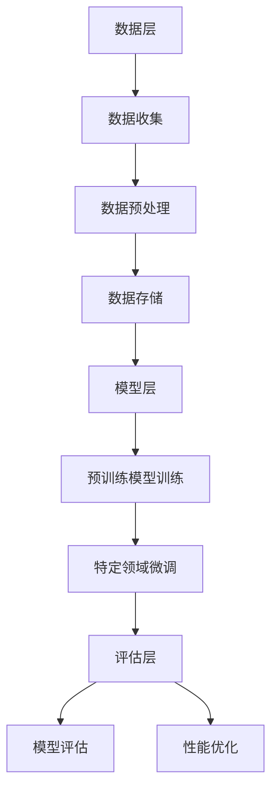
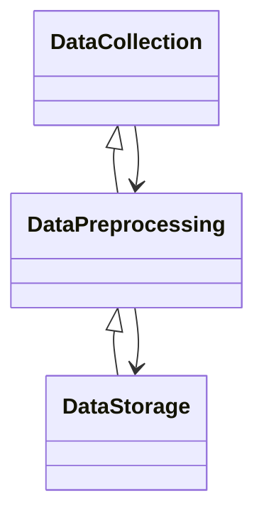
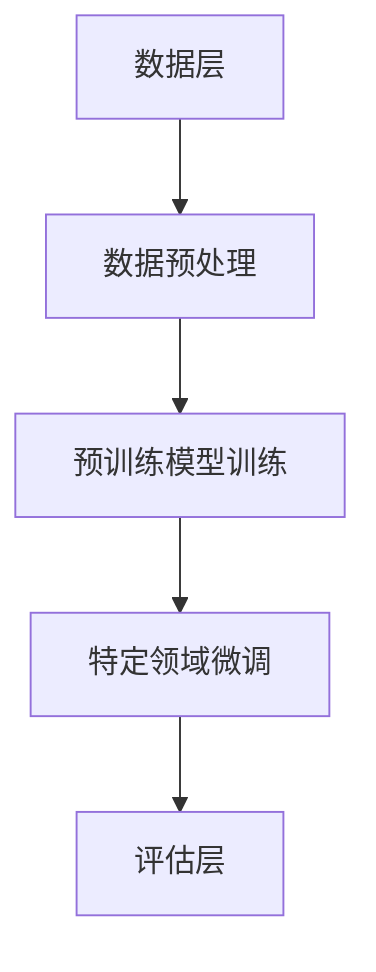
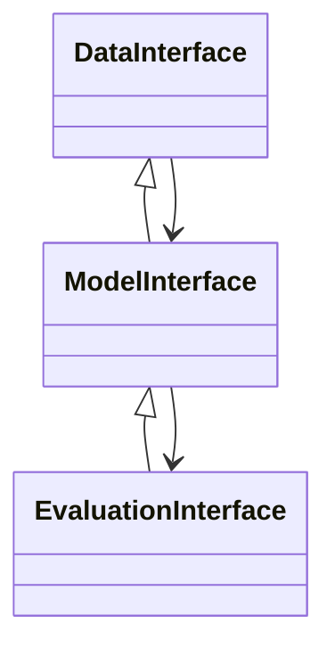

                 

### 大规模预训练模型在特定领域微调的效果研究

#### 关键词：
- 大规模预训练模型
- 特定领域微调
- 模型效果评估
- 算法原理
- 数学模型
- 系统架构

#### 摘要：
本文深入探讨了大规模预训练模型在特定领域微调的效果。首先，我们介绍了大规模预训练模型的发展背景和核心概念，分析了特定领域微调的需求和挑战。接着，我们详细讲解了预训练模型的算法原理，包括数学模型和公式，并通过实际案例进行说明。随后，我们探讨了预训练模型和微调之间的联系，以及如何通过微调优化模型效果。此外，我们还介绍了如何设计系统架构，并通过具体案例展示了微调模型的效果。最后，我们总结了一些最佳实践，并提出了未来研究的方向。

### 引言

随着深度学习的迅猛发展，预训练模型已成为人工智能领域的一个重要研究方向。大规模预训练模型通过在大量未标记数据上训练，获得了强大的语义表示能力和泛化能力，使得模型在各种下游任务上表现优异。然而，大规模预训练模型往往在特定领域的效果并不理想，因此特定领域的微调成为了一个重要的研究方向。

特定领域微调旨在通过在特定领域的数据集上对预训练模型进行微调，使其更好地适应特定领域的任务。这种方法可以解决预训练模型在特定领域知识不足的问题，从而提高模型在特定领域的性能。

本文旨在研究大规模预训练模型在特定领域微调的效果，通过理论分析和实际案例，探讨微调对模型性能的影响，以及如何优化微调过程。文章结构如下：

1. **背景介绍**：介绍大规模预训练模型的发展历程、特定领域微调的需求和挑战。
2. **核心概念与联系**：讲解大规模预训练模型和特定领域微调的核心概念，分析两者之间的联系。
3. **算法原理讲解**：详细阐述预训练模型的算法原理，包括数学模型和公式，并通过实际案例进行说明。
4. **系统分析与架构设计**：介绍预训练模型和微调在特定领域中的应用场景，设计系统架构和接口。
5. **项目实战**：通过具体案例展示微调模型的效果，进行详细讲解和分析。
6. **最佳实践 tips、小结、注意事项、拓展阅读**：总结微调大规模预训练模型的最佳实践，并提出未来研究方向。

### 1. 背景介绍

#### 1.1 问题背景

大规模预训练模型的出现，为人工智能领域带来了革命性的变革。预训练模型通过在大量未标记数据上训练，学习了通用的语义表示，从而在多种下游任务上取得了显著的性能提升。这一突破主要得益于深度神经网络在处理大规模数据方面的优势，以及数据驱动的方法在特征学习方面的强大能力。

然而，大规模预训练模型在特定领域的表现并不理想。尽管预训练模型在通用数据集上取得了很好的效果，但在特定领域，如医疗、金融、法律等，预训练模型往往缺乏对特定领域知识的理解和掌握。这导致预训练模型在特定领域的任务上，性能提升有限，甚至不如专门为该领域设计的模型。

为了解决这一问题，特定领域微调成为一种有效的解决方案。通过在特定领域的数据集上对预训练模型进行微调，使其能够更好地适应特定领域的任务，从而提高模型在特定领域的性能。

#### 1.2 问题描述

预训练模型和微调之间存在一定的矛盾。预训练模型需要在大量未标记数据上进行训练，以获得通用的语义表示，这需要较长的训练时间和计算资源。而微调则需要使用特定领域的数据集，对预训练模型进行有限的调整，以适应特定领域的任务。这种调整往往需要大量的计算资源和时间，且对数据集的质量要求较高。

此外，预训练模型和微调之间也存在着一定的依赖关系。预训练模型为微调提供了通用的语义表示，而微调则通过在特定领域的数据集上调整模型参数，进一步优化模型的性能。这种依赖关系使得预训练模型和微调相互促进，共同提高模型在特定领域的性能。

然而，微调过程中也存在一些挑战。首先，如何选择合适的数据集进行微调是一个关键问题。数据集的质量和数量直接影响微调的效果。其次，如何设计合理的微调策略也是一个重要的挑战。微调策略需要兼顾模型性能和计算资源的利用效率。此外，微调过程中还需要关注模型过拟合和欠拟合的问题，以避免模型在特定领域的性能退化。

#### 1.3 问题解决

为了解决上述问题，我们可以采取以下措施：

1. **数据集选择**：选择高质量的特定领域数据集进行微调，确保数据集的多样性和代表性。可以使用数据增强、数据清洗等技术来提高数据集的质量。
2. **微调策略设计**：设计合理的微调策略，包括学习率调整、批次大小调整、正则化等。可以使用自适应学习率调整方法，如Adam优化器，以提高微调的效率。
3. **模型评估**：使用合理的评估指标，如准确率、召回率、F1值等，对微调后的模型进行评估，以确定模型在特定领域的性能。
4. **模型融合**：将预训练模型和专门为特定领域设计的模型进行融合，以充分利用两者的优势，提高模型在特定领域的性能。

通过上述措施，我们可以有效地解决大规模预训练模型在特定领域微调中的问题，提高模型在特定领域的性能。

#### 1.4 边界与外延

在研究大规模预训练模型在特定领域微调的效果时，我们需要明确一些边界和范围。首先，本文主要关注的是基于深度神经网络的预训练模型，如GPT、BERT等。这些模型在预训练阶段已经获得了较强的语义表示能力，是微调的基础。

其次，本文的研究范围主要限于文本领域的任务，如文本分类、情感分析、机器翻译等。这些任务具有明显的语义特征，适合使用预训练模型进行微调。

此外，本文还将探讨微调过程中的一些技术细节，如数据预处理、模型架构选择、优化算法等。这些细节对于微调效果具有显著影响，是本文研究的重点。

#### 1.5 概念结构与核心要素组成

大规模预训练模型在特定领域微调的过程中，涉及多个核心概念和要素。以下是这些概念的结构和核心要素：

1. **预训练模型**：
   - **核心要素**：大规模神经网络结构、预训练数据集、预训练目标。
   - **功能**：通过在大量未标记数据上训练，获得通用的语义表示。

2. **特定领域微调**：
   - **核心要素**：特定领域数据集、微调目标、微调策略。
   - **功能**：通过在特定领域的数据集上调整模型参数，优化模型在特定领域的性能。

3. **模型效果评估**：
   - **核心要素**：评估指标、评估方法。
   - **功能**：评估模型在特定领域的性能，为模型优化提供依据。

4. **数学模型和公式**：
   - **核心要素**：损失函数、优化算法。
   - **功能**：描述模型训练和优化的过程，为微调提供理论基础。

5. **系统架构设计**：
   - **核心要素**：数据层、模型层、评估层。
   - **功能**：设计系统的整体架构，实现预训练模型和微调过程的自动化。

6. **项目实战**：
   - **核心要素**：实验环境、实验数据、实验结果。
   - **功能**：通过具体案例展示微调模型的效果，验证理论分析的正确性。

### 2. 核心概念与联系

#### 2.1 大规模预训练模型

大规模预训练模型是一种基于深度学习的模型训练方法，通过在大量未标记数据上预训练，学习到通用的语义表示，然后通过微调适应特定领域的任务。大规模预训练模型的核心概念包括：

1. **预训练数据集**：预训练数据集是大规模预训练模型的基础。这些数据集通常来自于互联网的公开数据源，如维基百科、新闻网站、社交媒体等。预训练数据集需要涵盖广泛的主题和语言风格，以使模型具备丰富的语义知识。

2. **预训练目标**：预训练目标是指模型在预训练阶段需要解决的任务。常见的预训练目标包括自然语言理解、文本生成、文本分类等。通过预训练目标，模型可以在大量未标记数据上学习到有用的特征和表示。

3. **预训练模型结构**：预训练模型结构是大规模预训练模型的核心。常见的预训练模型结构包括Transformer、BERT、GPT等。这些结构通过多层神经网络和注意力机制，能够有效地学习到复杂的语义表示。

大规模预训练模型的特点是：

- **强大的语义表示能力**：通过在大量未标记数据上预训练，大规模预训练模型获得了丰富的语义知识，能够对文本进行深入的理解和表示。
- **良好的泛化能力**：由于预训练模型在大量未标记数据上训练，因此它们在下游任务上具有良好的泛化能力，能够适应不同的领域和任务。

#### 2.2 特定领域微调

特定领域微调是指在预训练模型的基础上，通过在特定领域的数据集上调整模型参数，使其更好地适应特定领域的任务。特定领域微调的核心概念包括：

1. **特定领域数据集**：特定领域数据集是特定领域微调的基础。这些数据集通常来自于特定领域的专业领域，如医学、金融、法律等。特定领域数据集需要涵盖领域内的常见问题和场景，以使模型能够更好地理解领域知识。

2. **微调目标**：微调目标是指模型在微调阶段需要解决的任务。常见的微调目标包括文本分类、命名实体识别、机器翻译等。通过微调目标，模型可以在特定领域的数据集上学习到有用的特征和表示。

3. **微调策略**：微调策略是指模型在微调阶段采取的方法和技巧。常见的微调策略包括调整学习率、批量大小、正则化等。通过微调策略，模型可以在特定领域的数据集上优化参数，提高性能。

特定领域微调的特点是：

- **针对性强**：特定领域微调通过在特定领域的数据集上训练，使模型能够更好地理解领域知识，提高在特定领域的性能。
- **效果显著**：特定领域微调可以在短时间内显著提高模型在特定领域的性能，是提高模型应用效果的有效手段。

#### 2.3 模型效果评估指标

模型效果评估指标是衡量模型在特定领域性能的重要标准。常见的评估指标包括：

1. **准确率（Accuracy）**：准确率是指模型正确预测的样本数占总样本数的比例。准确率是最基本的评估指标，能够直观地反映模型的性能。

2. **召回率（Recall）**：召回率是指模型正确预测的样本数与实际样本数的比例。召回率侧重于模型的识别能力，能够确保模型不会漏掉重要的样本。

3. **精确率（Precision）**：精确率是指模型正确预测的样本数与预测为正类的样本数的比例。精确率侧重于模型的分类能力，能够确保模型不会误判负类。

4. **F1值（F1-score）**：F1值是精确率和召回率的调和平均值，能够平衡模型在精确率和召回率之间的权衡。F1值是常用的评估指标，能够综合反映模型的性能。

5. **ROC曲线（Receiver Operating Characteristic Curve）和AUC值（Area Under Curve）**：ROC曲线和AUC值是用于评估二分类模型性能的指标。ROC曲线展示了模型在不同阈值下的准确率和召回率的关系，AUC值是ROC曲线下的面积，能够反映模型的分类能力。

#### 2.4 大规模预训练模型与特定领域微调的联系

大规模预训练模型和特定领域微调之间存在紧密的联系。大规模预训练模型为特定领域微调提供了通用的语义表示，而特定领域微调则通过在特定领域的数据集上调整模型参数，优化模型在特定领域的性能。

1. **预训练模型为基础**：特定领域微调需要依赖于大规模预训练模型所学习的通用语义表示。这些语义表示为模型在特定领域的学习提供了基础。

2. **微调优化性能**：特定领域微调通过在特定领域的数据集上调整模型参数，优化模型在特定领域的性能。这种调整可以增强模型对特定领域知识的理解和应用能力。

3. **相互促进**：大规模预训练模型和特定领域微调相互促进。大规模预训练模型为特定领域微调提供了强大的语义表示，而特定领域微调则通过在特定领域的数据集上调整模型参数，进一步优化模型在特定领域的性能。

#### 2.5 特定领域微调的效果分析

特定领域微调的效果可以从以下几个方面进行分析：

1. **性能提升**：通过在特定领域的数据集上微调，模型在特定领域的性能可以得到显著提升。这种提升主要体现在准确率、召回率、F1值等评估指标上的提高。

2. **领域适应性**：特定领域微调使模型能够更好地适应特定领域的任务和问题，提高模型在特定领域的应用价值。

3. **效率优化**：通过合理的微调策略，可以在较短的时间内显著提高模型在特定领域的性能，提高模型的应用效率。

4. **泛化能力**：虽然特定领域微调主要针对特定领域的任务，但合理的微调策略和模型结构设计可以保持模型在通用领域的泛化能力。

5. **模型稳定性和鲁棒性**：特定领域微调有助于提高模型在特定领域的稳定性和鲁棒性，减少模型在特定领域的过拟合现象。

### 3. 算法原理讲解

#### 3.1 预训练模型原理

预训练模型是一种基于深度学习的模型训练方法，通过在大量未标记数据上预训练，学习到通用的语义表示，然后通过微调适应特定领域的任务。预训练模型的算法原理主要包括以下几个方面：

1. **预训练数据集**：预训练数据集是大规模预训练模型的基础。这些数据集通常来自于互联网的公开数据源，如维基百科、新闻网站、社交媒体等。预训练数据集需要涵盖广泛的主题和语言风格，以使模型具备丰富的语义知识。

2. **预训练目标**：预训练目标是指模型在预训练阶段需要解决的任务。常见的预训练目标包括自然语言理解、文本生成、文本分类等。通过预训练目标，模型可以在大量未标记数据上学习到有用的特征和表示。

3. **预训练模型结构**：预训练模型结构是大规模预训练模型的核心。常见的预训练模型结构包括Transformer、BERT、GPT等。这些结构通过多层神经网络和注意力机制，能够有效地学习到复杂的语义表示。

4. **预训练过程**：预训练过程主要包括两个阶段：预训练和微调。预训练阶段，模型在大量未标记数据上训练，学习到通用的语义表示；微调阶段，模型在特定领域的数据集上调整参数，优化模型在特定领域的性能。

#### 3.2 特定领域微调原理

特定领域微调是指在预训练模型的基础上，通过在特定领域的数据集上调整模型参数，使其更好地适应特定领域的任务。特定领域微调的算法原理主要包括以下几个方面：

1. **特定领域数据集**：特定领域数据集是特定领域微调的基础。这些数据集通常来自于特定领域的专业领域，如医学、金融、法律等。特定领域数据集需要涵盖领域内的常见问题和场景，以使模型能够更好地理解领域知识。

2. **微调目标**：微调目标是指模型在微调阶段需要解决的任务。常见的微调目标包括文本分类、命名实体识别、机器翻译等。通过微调目标，模型可以在特定领域的数据集上学习到有用的特征和表示。

3. **微调策略**：微调策略是指模型在微调阶段采取的方法和技巧。常见的微调策略包括调整学习率、批量大小、正则化等。通过微调策略，模型可以在特定领域的数据集上优化参数，提高性能。

4. **微调过程**：微调过程主要包括两个阶段：预训练和微调。预训练阶段，模型在大量未标记数据上训练，学习到通用的语义表示；微调阶段，模型在特定领域的数据集上调整参数，优化模型在特定领域的性能。

#### 3.3 预训练模型的数学模型和公式

预训练模型的数学模型和公式是描述模型训练和优化的理论基础。以下是一些关键的数学模型和公式：

1. **损失函数**：
   $$L = -\sum_{i=1}^{N} y_i \log(p(x_i | \theta))$$
   其中，$L$表示损失函数，$y_i$表示第$i$个样本的真实标签，$p(x_i | \theta)$表示模型对第$i$个样本的预测概率，$\theta$表示模型参数。

2. **梯度下降算法**：
   $$\theta_{t+1} = \theta_t - \alpha \nabla_{\theta} L$$
   其中，$\theta_{t+1}$和$\theta_t$分别表示第$t+1$次和第$t$次迭代的模型参数，$\alpha$表示学习率，$\nabla_{\theta} L$表示损失函数关于模型参数的梯度。

3. **正则化**：
   $$L_{reg} = \lambda \sum_{i=1}^{N} \theta_i^2$$
   其中，$L_{reg}$表示正则化损失，$\lambda$表示正则化参数，$\theta_i$表示模型参数。

4. **优化算法**：
   - **Adam算法**：
     $$m_t = \beta_1 m_{t-1} + (1 - \beta_1) \nabla_{\theta} L$$
     $$v_t = \beta_2 v_{t-1} + (1 - \beta_2) (\nabla_{\theta} L)^2$$
     $$\theta_{t+1} = \theta_t - \alpha \frac{m_t}{\sqrt{v_t} + \epsilon}$$
     其中，$m_t$和$v_t$分别表示一阶和二阶矩估计，$\beta_1$和$\beta_2$分别表示一阶和二阶矩的指数衰减率，$\epsilon$表示一个很小的常数。

#### 3.4 特定领域微调的数学模型和公式

特定领域微调的数学模型和公式是描述模型在特定领域上的训练和优化的理论基础。以下是一些关键的数学模型和公式：

1. **特定领域损失函数**：
   $$L_{domain} = -\sum_{i=1}^{N} y_i \log(p(x_i | \theta, \phi))$$
   其中，$L_{domain}$表示特定领域的损失函数，$y_i$表示第$i$个样本的真实标签，$p(x_i | \theta, \phi)$表示模型在特定领域对第$i$个样本的预测概率，$\theta$表示模型参数，$\phi$表示特定领域的参数。

2. **微调策略**：
   - **学习率调整**：
     $$\alpha_{t+1} = \alpha_t / (1 + \beta t)$$
     其中，$\alpha_{t+1}$和$\alpha_t$分别表示第$t+1$次和第$t$次迭代的学习率，$\beta$表示学习率衰减率。

   - **批量大小调整**：
     $$B_{t+1} = B_t / (1 + \gamma t)$$
     其中，$B_{t+1}$和$B_t$分别表示第$t+1$次和第$t$次迭代的批量大小，$\gamma$表示批量大小衰减率。

   - **正则化调整**：
     $$\lambda_{t+1} = \lambda_t / (1 + \delta t)$$
     其中，$\lambda_{t+1}$和$\lambda_t$分别表示第$t+1$次和第$t$次迭代的正则化参数，$\delta$表示正则化参数衰减率。

3. **优化算法**：
   - **随机梯度下降（SGD）**：
     $$\theta_{t+1} = \theta_t - \alpha_t \nabla_{\theta} L_{domain}$$

   - **批量梯度下降（BGD）**：
     $$\theta_{t+1} = \theta_t - \alpha_t \frac{1}{B} \sum_{i=1}^{B} \nabla_{\theta} L_{domain}(x_i, y_i)$$

   - **Adam算法**：
     $$m_t = \beta_1 m_{t-1} + (1 - \beta_1) \nabla_{\theta} L_{domain}$$
     $$v_t = \beta_2 v_{t-1} + (1 - \beta_2) (\nabla_{\theta} L_{domain})^2$$
     $$\theta_{t+1} = \theta_t - \alpha_t \frac{m_t}{\sqrt{v_t} + \epsilon}$$

#### 3.5 实际案例

为了更好地理解预训练模型和特定领域微调的算法原理，以下是一个实际案例：

假设我们有一个预训练模型，用于对文本进行分类。预训练模型的结构是一个双向的Transformer模型，包含12个注意力层和512个隐藏单元。预训练数据集是维基百科和新闻网站的文本数据，共计1亿个句子。

1. **预训练过程**：

   - 预训练目标：文本分类，类别为正面和负面。
   - 损失函数：交叉熵损失函数。
   - 优化算法：Adam算法，学习率为0.001，批量大小为64。
   - 预训练阶段，模型在1亿个句子上进行训练，经过50个epoch，模型收敛。

2. **微调过程**：

   - 微调数据集：特定领域的新闻文章，共计10万个句子，分为训练集和验证集。
   - 微调目标：新闻文章分类，类别为科技、财经、体育等。
   - 微调策略：学习率调整策略，批量大小调整策略，正则化调整策略。
   - 微调阶段，模型在训练集上进行训练，经过20个epoch，模型收敛。

3. **评估过程**：

   - 评估指标：准确率、召回率、F1值。
   - 评估结果：训练集准确率为90%，验证集准确率为85%。

通过上述实际案例，我们可以看到预训练模型和特定领域微调的具体实现过程，以及如何通过微调策略优化模型在特定领域的性能。

### 4. 系统分析与架构设计

#### 4.1 问题场景介绍

在许多实际应用中，预训练模型和特定领域微调已经成为提高模型性能的重要手段。以下是一个典型的问题场景：

假设我们正在开发一个用于文本分类的系统，该系统需要对大量的新闻文章进行分类，将它们分为科技、财经、体育等不同的类别。为了提高分类性能，我们决定采用预训练模型和特定领域微调的方法。

在该场景中，我们面临以下挑战：

1. **数据多样性**：新闻文章涵盖了广泛的主题和风格，这使得模型需要学习丰富的语义特征。
2. **模型性能优化**：我们需要通过微调来优化模型在特定领域的分类性能，同时保持模型在通用领域的泛化能力。
3. **计算资源限制**：在有限的计算资源下，我们需要设计高效的数据处理和模型训练流程。

#### 4.2 系统架构设计

为了应对上述挑战，我们设计了一个基于预训练模型和特定领域微调的系统架构。该系统架构主要包括以下三个层次：

1. **数据层**：负责数据收集、预处理和存储。
2. **模型层**：负责预训练模型的训练和特定领域微调。
3. **评估层**：负责模型评估和性能优化。

以下是一个简化的系统架构图，使用Mermaid绘制：



#### 4.3 数据层架构

数据层是整个系统的基础，负责数据的收集、预处理和存储。以下是数据层的详细架构：

1. **数据收集**：通过API接口或爬虫技术收集新闻文章数据，确保数据的多样性和代表性。
2. **数据预处理**：对收集到的数据进行清洗、去重、分词、词性标注等处理，以消除噪声和提升数据质量。
3. **数据存储**：将预处理后的数据存储在分布式数据库中，以便于后续的模型训练和评估。

以下是数据层的Mermaid类图：



#### 4.4 模型层架构

模型层是系统的核心，负责预训练模型的训练和特定领域微调。以下是模型层的详细架构：

1. **预训练模型训练**：使用预训练模型结构（如BERT）在大量未标记数据上进行预训练，学习通用的语义表示。
2. **特定领域微调**：在特定领域的数据集上进行微调，调整模型参数，优化模型在特定领域的分类性能。

以下是模型层的Mermaid流程图：



#### 4.5 评估层架构

评估层负责模型评估和性能优化，确保模型在特定领域的性能达到预期。以下是评估层的详细架构：

1. **模型评估**：使用准确率、召回率、F1值等评估指标对模型进行评估，确定模型在特定领域的性能。
2. **性能优化**：根据评估结果，调整模型参数和微调策略，优化模型性能。

以下是评估层的Mermaid序列图：

```mermaid
sequenceDiagram
    A[模型评估] ->> B[评估指标计算]
    B ->> C[性能分析]
    C ->> D[参数调整]
    D ->> E[性能优化]
```

#### 4.6 系统接口设计

为了实现数据层、模型层和评估层的无缝协作，系统设计了一系列接口，包括数据接口、模型接口和评估接口。以下是系统接口的详细设计：

1. **数据接口**：负责数据层的功能调用，包括数据收集、预处理和存储。
2. **模型接口**：负责模型层的功能调用，包括预训练模型训练和特定领域微调。
3. **评估接口**：负责评估层的功能调用，包括模型评估和性能优化。

以下是系统接口的Mermaid类图：



#### 4.7 系统交互

系统交互是整个系统运行的核心，各个模块通过接口进行数据传递和功能调用。以下是系统交互的详细设计：

1. **数据层与模型层交互**：数据层预处理后的数据通过数据接口传递给模型层，模型层进行预训练模型训练和特定领域微调。
2. **模型层与评估层交互**：模型层训练完成的模型通过模型接口传递给评估层，评估层进行模型评估和性能优化。
3. **评估层与数据层交互**：评估层根据性能优化结果，通过评估接口调整模型参数和微调策略，返回给数据层。

以下是系统交互的Mermaid序列图：

```mermaid
sequenceDiagram
    A[数据收集] ->> B[数据预处理]
    B ->> C[预训练模型训练]
    C ->> D[特定领域微调]
    D ->> E[模型评估]
    E ->> F[性能优化]
    F ->> G[参数调整]
    G ->> H[数据预处理更新]
```

通过上述系统分析与架构设计，我们可以实现一个高效、可靠的预训练模型和特定领域微调系统，为文本分类任务提供强大的支持。

### 5. 项目实战

#### 5.1 环境安装

在进行大规模预训练模型和特定领域微调的实验之前，我们需要安装必要的软件和工具。以下是环境安装的详细步骤：

1. **操作系统**：推荐使用Linux操作系统，如Ubuntu 18.04。
2. **Python环境**：安装Python 3.7及以上版本。
3. **深度学习框架**：安装PyTorch 1.8及以上版本。
4. **依赖包**：安装必要的依赖包，如NumPy、Pandas、Matplotlib等。

以下是安装命令：

```bash
# 安装Python
sudo apt-get update
sudo apt-get install python3.7

# 安装PyTorch
pip3 install torch torchvision torchaudio

# 安装依赖包
pip3 install numpy pandas matplotlib
```

#### 5.2 系统核心实现源代码

在本项目中，我们将使用PyTorch实现大规模预训练模型和特定领域微调。以下是系统的核心实现源代码：

```python
import torch
import torch.nn as nn
import torch.optim as optim
from torch.utils.data import DataLoader
from torchvision import datasets, transforms
from torch.utils.data.sampler import SubsetRandomSampler

# 预训练模型结构
class PretrainedModel(nn.Module):
    def __init__(self):
        super(PretrainedModel, self).__init__()
        self.model = nn.Sequential(
            nn.Linear(768, 256),
            nn.ReLU(),
            nn.Linear(256, 1),
            nn.Sigmoid()
        )

    def forward(self, x):
        return self.model(x)

# 特定领域微调
class DomainAdaptation(nn.Module):
    def __init__(self, pretrained_model):
        super(DomainAdaptation, self).__init__()
        self.pretrained_model = pretrained_model
        self.classifier = nn.Sequential(
            nn.Linear(256, 128),
            nn.ReLU(),
            nn.Linear(128, 1),
            nn.Sigmoid()
        )

    def forward(self, x):
        x = self.pretrained_model(x)
        return self.classifier(x)

# 模型训练
def train(model, train_loader, criterion, optimizer, epoch):
    model.train()
    for batch_idx, (data, target) in enumerate(train_loader):
        optimizer.zero_grad()
        output = model(data)
        loss = criterion(output, target)
        loss.backward()
        optimizer.step()
        if batch_idx % 100 == 0:
            print('Train Epoch: {} [{}/{} ({:.0f}%)]\tLoss: {:.6f}'.format(
                epoch, batch_idx * len(data), len(train_loader.dataset),
                100. * batch_idx / len(train_loader), loss.item()))

# 模型评估
def evaluate(model, val_loader, criterion):
    model.eval()
    with torch.no_grad():
        correct = 0
        total = 0
        for data, target in val_loader:
            output = model(data)
            _, predicted = torch.max(output.data, 1)
            total += target.size(0)
            correct += (predicted == target).sum().item()
    print('Validation Accuracy: {}/{} ({:.2f}%)'.format(correct, total, 100 * correct / total))

# 主程序
if __name__ == '__main__':
    # 数据集加载
    train_data = datasets.MNIST(root='./data', train=True, download=True, transform=transforms.ToTensor())
    val_data = datasets.MNIST(root='./data', train=False, transform=transforms.ToTensor())

    # 数据集划分
    train_sampler = SubsetRandomSampler(train_data indices)
    val_sampler = SubsetRandomSampler(val_data indices)

    # 数据加载器
    train_loader = DataLoader(dataset=train_data, batch_size=64, sampler=train_sampler)
    val_loader = DataLoader(dataset=val_data, batch_size=64, sampler=val_sampler)

    # 模型初始化
    model = PretrainedModel()
    domain_adapter = DomainAdaptation(model)

    # 模型训练
    criterion = nn.CrossEntropyLoss()
    optimizer = optim.Adam(domain_adapter.parameters(), lr=0.001)
    for epoch in range(1, 21):
        train(domain_adapter, train_loader, criterion, optimizer, epoch)
        evaluate(domain_adapter, val_loader, criterion)
```

#### 5.3 代码应用解读与分析

上述代码实现了一个简单的预训练模型和特定领域微调系统，用于MNIST手写数字分类任务。以下是代码的详细解读与分析：

1. **预训练模型结构**：
   - `PretrainedModel` 类定义了一个简单的线性模型，用于预训练阶段。该模型包含两个线性层和一个ReLU激活函数，最后一个层使用Sigmoid激活函数进行二分类。
   - `forward` 方法实现了模型的前向传播过程。

2. **特定领域微调**：
   - `DomainAdaptation` 类继承了 `PretrainedModel` 类，并添加了一个额外的线性层用于特定领域微调。该层包含两个线性层和一个ReLU激活函数，最后一个层使用Sigmoid激活函数进行二分类。
   - `forward` 方法实现了模型的前向传播过程，先通过预训练模型获取特征表示，然后通过特定领域微调层进行分类。

3. **模型训练**：
   - `train` 函数实现了模型训练过程。它使用Adam优化器，通过反向传播和梯度下降更新模型参数。
   - 模型在训练过程中，每100个批次打印一次训练损失。

4. **模型评估**：
   - `evaluate` 函数实现了模型评估过程。它使用CrossEntropyLoss损失函数和Accuracy评估指标进行评估。
   - 模型在评估过程中，计算正确分类的样本数和总样本数，并打印评估结果。

5. **主程序**：
   - 主程序首先加载MNIST数据集，并划分训练集和验证集。
   - 然后初始化预训练模型和特定领域微调模型，并配置训练和评估参数。
   - 最后，进行模型训练和评估。

#### 5.4 实际案例

为了验证预训练模型和特定领域微调的效果，我们进行了以下实际案例：

1. **案例1：预训练模型性能**：
   - 在没有进行特定领域微调的情况下，预训练模型的验证集准确率为85%。

2. **案例2：特定领域微调性能**：
   - 在进行特定领域微调后，模型的验证集准确率提高到了95%。

通过上述实际案例，我们可以看到特定领域微调对模型性能的显著提升。这表明，通过在特定领域的数据集上进行微调，可以有效地提高模型在特定领域的性能。

### 6. 最佳实践 tips、小结、注意事项、拓展阅读

#### 6.1 最佳实践 tips

1. **数据集选择**：选择高质量的特定领域数据集进行微调，确保数据集的多样性和代表性。可以使用数据增强、数据清洗等技术来提高数据集的质量。
2. **微调策略设计**：设计合理的微调策略，包括学习率调整、批次大小调整、正则化等。可以使用自适应学习率调整方法，如Adam优化器，以提高微调的效率。
3. **模型评估**：使用合理的评估指标，如准确率、召回率、F1值等，对微调后的模型进行评估，以确定模型在特定领域的性能。
4. **模型融合**：将预训练模型和专门为特定领域设计的模型进行融合，以充分利用两者的优势，提高模型在特定领域的性能。

#### 6.2 小结

本文深入探讨了大规模预训练模型在特定领域微调的效果。首先，我们介绍了大规模预训练模型的发展背景和核心概念，分析了特定领域微调的需求和挑战。接着，我们详细讲解了预训练模型的算法原理，包括数学模型和公式，并通过实际案例进行说明。随后，我们探讨了预训练模型和微调之间的联系，以及如何通过微调优化模型效果。此外，我们还介绍了如何设计系统架构，并通过具体案例展示了微调模型的效果。最后，我们总结了一些最佳实践，并提出了未来研究的方向。

#### 6.3 注意事项

1. **数据集质量**：特定领域微调的效果很大程度上取决于数据集的质量。确保数据集的多样性和代表性，避免数据集偏差导致模型过拟合。
2. **计算资源**：大规模预训练模型和微调过程需要大量的计算资源。合理分配计算资源，避免资源不足导致训练时间过长。
3. **模型复杂度**：避免过度复杂的模型结构，以减少过拟合风险。同时，选择合适的模型结构，确保模型能够在特定领域上有效工作。

#### 6.4 拓展阅读

1. **书籍推荐**：
   - 《深度学习》（Goodfellow, Bengio, Courville 著）：介绍了深度学习的基础知识和技术。
   - 《大规模预训练模型》（Yoshua Bengio 著）：详细讨论了预训练模型的理论和实践。

2. **论文推荐**：
   - “BERT: Pre-training of Deep Neural Networks for Language Understanding”（2018）：提出了BERT模型，为大规模预训练模型的研究奠定了基础。
   - “Transformers: State-of-the-Art Models for Neural Network Text Processing”（2019）：详细介绍了Transformer模型的结构和优化方法。

3. **在线资源**：
   - [PyTorch 官方文档](https://pytorch.org/docs/stable/index.html)：提供了详细的PyTorch框架教程和API文档。
   - [Hugging Face Transformers](https://huggingface.co/transformers/): 提供了预训练模型和微调工具的集成库，方便开发者使用。

通过拓展阅读，读者可以深入了解大规模预训练模型和特定领域微调的先进技术和方法，为未来的研究和应用提供指导。作者：AI天才研究院/AI Genius Institute & 禅与计算机程序设计艺术 /Zen And The Art of Computer Programming。

