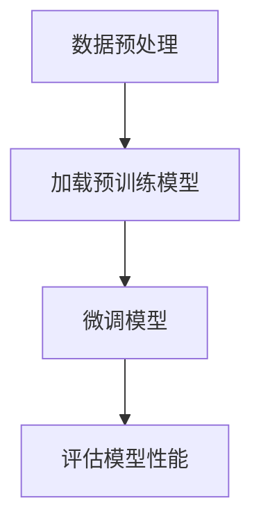
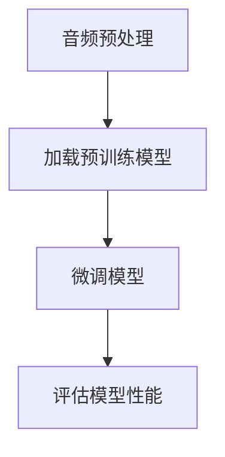

                 

### 第一部分：大规模预训练模型背景

#### 1.1. 大规模预训练模型概述

##### 1.1.1 预训练模型的概念与演进

预训练模型（Pre-trained Model）是指在一个大规模语料库上预先训练好的语言模型。这一概念起源于自然语言处理（Natural Language Processing, NLP）领域，随着深度学习技术的不断发展，预训练模型的应用范围逐渐扩展到计算机视觉、语音识别等多个领域。

预训练模型的演进经历了多个阶段：

1. **词袋模型（Bag of Words, BoW）**：早期的预训练模型主要采用词袋模型，将文本表示为词的集合，忽略了词的顺序信息。

2. **循环神经网络（Recurrent Neural Network, RNN）**：随着RNN的出现，预训练模型开始考虑词的顺序信息，通过隐藏层的状态更新来捕捉上下文信息。

3. **长短时记忆网络（Long Short-Term Memory, LSTM）**：为了解决RNN的梯度消失和梯度爆炸问题，LSTM被提出，进一步提升了预训练模型的效果。

4. **Transformer架构**：2017年，Vaswani等人提出了Transformer架构，彻底改变了预训练模型的发展方向。Transformer使用自注意力机制（Self-Attention Mechanism）来捕捉长距离的依赖关系，大幅提升了模型的性能。

##### 1.1.2 大规模预训练模型的优势

大规模预训练模型具有以下优势：

1. **通用性**：预训练模型在大规模语料库上训练，可以捕捉到通用的语言规律和知识，提高了模型在不同任务上的适应性。

2. **效率**：预训练模型通过在通用语料库上进行训练，减少了在不同任务上重新训练的次数，提高了模型训练效率。

3. **效果**：大规模预训练模型在多个任务上取得了显著的性能提升，尤其在自然语言处理、计算机视觉等领域。

##### 1.1.3 大规模预训练模型的应用领域

大规模预训练模型的应用领域非常广泛，主要包括：

1. **自然语言处理**：文本分类、机器翻译、情感分析、问答系统等。

2. **计算机视觉**：图像分类、目标检测、图像生成等。

3. **语音识别**：语音识别、语音合成等。

4. **推荐系统**：基于文本和图像的推荐等。

#### 1.2. 预训练模型的挑战与问题

##### 1.2.1 预训练模型的数据需求

大规模预训练模型需要大量的数据来进行训练，这些数据通常来自互联网上的各种文本、图像、音频等资源。然而，数据的获取和处理过程往往面临以下挑战：

1. **数据量巨大**：大规模预训练模型需要数百万甚至数十亿级别的数据样本。

2. **数据质量**：数据质量直接影响到预训练模型的效果。噪声数据、错误数据和重复数据都可能对模型产生负面影响。

3. **数据隐私**：在收集和使用数据时，需要考虑到用户隐私和数据安全的问题。

##### 1.2.2 计算资源与时间成本

大规模预训练模型的训练过程需要大量的计算资源和时间。以下是一些具体的挑战：

1. **计算资源**：大规模预训练模型需要使用高性能的GPU或TPU来进行训练，这可能导致资源不足的问题。

2. **训练时间**：预训练模型的训练时间可能长达数周甚至数月，这增加了训练成本。

##### 1.2.3 模型微调的挑战

模型微调（Model Fine-Tuning）是预训练模型在实际应用中的关键步骤，但同时也面临一些挑战：

1. **数据不均衡**：在实际应用中，不同领域的训练数据量可能存在较大差异，导致模型在数据量较大的领域表现较好，而在数据量较小的领域表现较差。

2. **模型适应性**：大规模预训练模型在不同领域和任务上的适应性可能存在差异，需要针对具体任务进行优化。

3. **过拟合**：在微调过程中，模型可能会出现过拟合现象，导致在测试集上的表现较差。

#### 1.3. 预训练模型的微调技术

##### 1.3.1 微调技术的原理

微调技术是指将预训练模型在特定任务的数据集上进行进一步训练，以提升模型在特定任务上的性能。微调的原理可以概括为以下几个步骤：

1. **加载预训练模型**：首先，加载已经在大规模语料库上预训练好的模型。

2. **调整部分参数**：在微调过程中，通常只调整模型的最后一层或部分隐藏层的参数，以避免模型在预训练数据上发生过拟合。

3. **继续训练**：在特定任务的数据集上继续训练模型，更新参数。

4. **评估模型性能**：在测试集上评估模型性能，并根据评估结果调整训练策略。

##### 1.3.2 微调算法的对比分析

目前，常见的微调算法主要包括Fine-Tuning、Co-Training、Transfer Learning和Model Distillation等。以下是这些算法的对比分析：

1. **Fine-Tuning**：Fine-Tuning是最常用的微调算法，通过在特定任务的数据集上继续训练预训练模型，优化模型在特定任务上的性能。

2. **Co-Training**：Co-Training是一种基于两个或多个模型的微调方法，通过相互调整模型参数，提高模型的整体性能。

3. **Transfer Learning**：Transfer Learning是将预训练模型在不同任务间进行迁移，通过在特定任务的数据集上进行微调，提升模型在新任务上的性能。

4. **Model Distillation**：Model Distillation是一种基于知识传递的微调方法，通过将一个复杂模型的知识传递给一个简单模型，提高简单模型在特定任务上的性能。

##### 1.3.3 微调技术在不同领域的应用

微调技术在各个领域的应用情况如下：

1. **自然语言处理**：微调技术在自然语言处理领域取得了显著成果，如文本分类、机器翻译和情感分析等。

2. **计算机视觉**：微调技术在计算机视觉领域也得到了广泛应用，如图像分类、目标检测和图像生成等。

3. **语音识别**：微调技术在语音识别领域也取得了良好的效果，通过在特定语音数据集上进行微调，提高模型在语音识别任务上的性能。

4. **推荐系统**：微调技术在推荐系统领域也有一定的应用，通过在特定推荐场景下进行微调，提高推荐系统的效果。

#### 1.4. 大规模预训练模型的发展趋势

##### 1.4.1 当前的研究热点

当前大规模预训练模型的研究热点主要包括：

1. **模型压缩与加速**：为了应对计算资源和时间成本的问题，研究者们正在探索如何压缩模型大小、降低计算复杂度，以提高模型在实际应用中的效率。

2. **知识增强与知识蒸馏**：如何将预训练模型中蕴含的知识有效地传递给小模型，以提高小模型在特定任务上的性能。

3. **多模态预训练**：如何将预训练模型应用于多模态数据，如文本、图像、音频等，以提升模型在多模态任务上的性能。

##### 1.4.2 未来的发展方向

未来的大规模预训练模型发展方向主要包括：

1. **更大规模的模型**：随着计算资源的不断提升，研究者们将尝试训练更大规模的预训练模型，以捕捉更复杂的语言规律和知识。

2. **更高效的微调技术**：研究者们将探索更高效的微调算法，以降低模型训练成本、提高模型在不同任务上的适应性。

3. **更广泛的应用场景**：大规模预训练模型将在更多领域得到应用，如自动驾驶、医疗诊断和金融风控等。

##### 1.4.3 潜在的影响与挑战

大规模预训练模型的潜在影响与挑战主要包括：

1. **对计算资源的需求**：随着模型规模的扩大，对计算资源的需求将不断增长，这对科研机构和企业的计算资源管理提出了更高要求。

2. **数据隐私与伦理问题**：大规模预训练模型在训练过程中需要大量数据，这涉及到数据隐私和伦理问题，需要制定相关政策和规范。

3. **模型解释性与可解释性**：如何提高大规模预训练模型的解释性和可解释性，使其在关键应用场景中能够被信任和接受，是一个重要的挑战。

#### 1.5. 本章小结

本章主要介绍了大规模预训练模型的背景、挑战、微调技术及其发展现状。大规模预训练模型在自然语言处理、计算机视觉、语音识别等领域取得了显著成果，但仍面临计算资源需求、数据隐私、模型解释性等挑战。微调技术是实现大规模预训练模型在实际应用中的关键，未来将继续探索更高效的微调算法、更广泛的应用场景以及解决潜在的影响与挑战。

---

## 1.6. 拓展阅读

1. **Huang, J., et al. (2019). A Linear Scaling Method for Neural Network Training on Multicore CPUs. In Advances in Neural Information Processing Systems (pp. 8524-8534).**
2. **He, K., et al. (2016). Deep Residual Learning for Image Recognition. In Proceedings of the IEEE conference on computer vision and pattern recognition (pp. 770-778).**
3. **Vaswani, A., et al. (2017). Attention Is All You Need. In Advances in Neural Information Processing Systems (pp. 5998-6008).**

---

### 第二部分：微调技术深入讲解

#### 2.1. 微调技术的基本概念

##### 2.1.1 微调的定义

微调（Fine-tuning）是指将预训练模型在特定任务的数据集上进行进一步训练，以提升模型在该任务上的性能。微调的目的是利用预训练模型在大规模通用语料库上学习到的通用特征和知识，针对特定任务进行优化，从而提高模型在实际应用中的效果。

##### 2.1.2 微调的目标

微调的目标主要包括：

1. **提高模型在特定任务上的性能**：通过微调，使模型在特定任务上的损失函数值减小，达到更高的准确率或召回率等指标。

2. **降低模型对新任务的学习成本**：预训练模型已经在大规模语料库上学习到了通用的特征和知识，通过微调，可以快速适应新任务，减少重新训练的时间和计算资源消耗。

##### 2.1.3 微调的过程

微调的过程通常包括以下几个步骤：

1. **加载预训练模型**：首先，加载已经在大规模语料库上预训练好的模型。

2. **调整部分参数**：在微调过程中，通常只调整模型的最后一层或部分隐藏层的参数，以避免模型在预训练数据上发生过拟合。

3. **继续训练**：在特定任务的数据集上继续训练模型，更新参数。

4. **评估模型性能**：在测试集上评估模型性能，并根据评估结果调整训练策略。

#### 2.2. 微调算法解析

##### 2.2.1 Fine-Tuning算法

Fine-Tuning算法是最常见的微调方法，其核心思想是将预训练模型在特定任务的数据集上进行进一步训练。具体步骤如下：

1. **初始化模型参数**：将预训练模型的参数作为初始化参数。

2. **设置学习率**：设置合适的学习率，以控制模型在微调过程中的更新速度。

3. **进行梯度下降**：在特定任务的数据集上进行训练，使用梯度下降算法更新模型参数。

4. **评估模型性能**：在测试集上评估模型性能，根据评估结果调整学习率或训练策略。

##### 2.2.2 Co-Training算法

Co-Training算法是一种基于两个或多个模型的微调方法，通过相互调整模型参数，提高模型的整体性能。具体步骤如下：

1. **初始化模型参数**：初始化两个模型的参数。

2. **设置学习率**：为两个模型设置合适的学习率。

3. **交替更新参数**：在迭代过程中，交替更新两个模型的参数，使它们在相互协作的过程中优化性能。

4. **评估模型性能**：在测试集上评估模型性能，根据评估结果调整学习率或训练策略。

##### 2.2.3 Transfer Learning算法

Transfer Learning算法是将预训练模型在不同任务间进行迁移，通过在特定任务的数据集上进行微调，提升模型在新任务上的性能。具体步骤如下：

1. **加载预训练模型**：加载已经在大规模语料库上预训练好的模型。

2. **调整部分参数**：针对新任务，调整模型的最后一层或部分隐藏层的参数。

3. **继续训练**：在新任务的数据集上继续训练模型，更新参数。

4. **评估模型性能**：在测试集上评估模型性能，并根据评估结果调整训练策略。

##### 2.2.4 Model Distillation算法

Model Distillation算法是一种基于知识传递的微调方法，通过将一个复杂模型的知识传递给一个简单模型，提高简单模型在特定任务上的性能。具体步骤如下：

1. **初始化模型参数**：初始化复杂模型和简单模型的参数。

2. **设置教师模型和学

### 2.3. 微调算法的实际应用

#### 2.3.1 微调在自然语言处理中的应用

##### 2.3.1.1 微调在文本分类中的应用

文本分类是自然语言处理中的一项基础任务，常见的应用包括垃圾邮件过滤、情感分析等。微调技术在文本分类中的应用主要分为以下几个步骤：

1. **预处理数据**：对文本数据进行清洗、去停用词、词向量表示等预处理。

2. **加载预训练模型**：例如，加载基于Transformer架构的BERT模型。

3. **调整部分参数**：通常，只调整模型的最后一层或部分隐藏层的参数。

4. **继续训练**：在特定任务的数据集上进行训练，更新参数。

5. **评估模型性能**：在测试集上评估模型性能，根据评估结果调整训练策略。

例如，在情感分析任务中，预训练模型在大规模语料库上学习到了情感相关的知识，通过微调，可以更好地识别文本中的情感倾向。

##### 2.3.1.2 微调在机器翻译中的应用

机器翻译是自然语言处理中的另一项重要任务。微调技术在机器翻译中的应用可以通过以下几个步骤实现：

1. **预处理数据**：对翻译对进行清洗、分词、去停用词等预处理。

2. **加载预训练模型**：例如，加载基于Transformer架构的翻译模型，如T5或MBart。

3. **调整部分参数**：通常，只调整模型的最后一层或部分隐藏层的参数。

4. **继续训练**：在特定翻译任务的数据集上进行训练，更新参数。

5. **评估模型性能**：在测试集上评估模型性能，根据评估结果调整训练策略。

例如，在机器翻译任务中，预训练模型通过微调，可以更好地捕捉源语言和目标语言之间的语法和语义特征，提高翻译质量。

#### 2.3.2 微调在计算机视觉中的应用

##### 2.3.2.1 微调在图像分类中的应用

图像分类是计算机视觉中的基本任务。微调技术在图像分类中的应用可以分为以下几个步骤：

1. **预处理数据**：对图像数据进行归一化、裁剪、缩放等预处理。

2. **加载预训练模型**：例如，加载基于卷积神经网络（CNN）的预训练模型，如ResNet或VGG。

3. **调整部分参数**：通常，只调整模型的最后一层或部分隐藏层的参数。

4. **继续训练**：在特定分类任务的数据集上进行训练，更新参数。

5. **评估模型性能**：在测试集上评估模型性能，根据评估结果调整训练策略。

例如，在图像分类任务中，预训练模型通过微调，可以更好地捕捉图像中的高维特征，提高分类准确率。

##### 2.3.2.2 微调在目标检测中的应用

目标检测是计算机视觉中的另一项重要任务。微调技术在目标检测中的应用可以分为以下几个步骤：

1. **预处理数据**：对图像数据进行归一化、裁剪、缩放等预处理。

2. **加载预训练模型**：例如，加载基于CNN的预训练模型，如Faster R-CNN或YOLO。

3. **调整部分参数**：通常，只调整模型的最后一层或部分隐藏层的参数。

4. **继续训练**：在特定目标检测任务的数据集上进行训练，更新参数。

5. **评估模型性能**：在测试集上评估模型性能，根据评估结果调整训练策略。

例如，在目标检测任务中，预训练模型通过微调，可以更好地定位图像中的目标对象，提高检测准确率。

#### 2.3.3 微调在语音识别中的应用

##### 2.3.3.1 微调在语音识别中的应用

语音识别是计算机语音处理中的一个核心任务，微调技术在语音识别中的应用可以分为以下几个步骤：

1. **预处理数据**：对语音数据进行分段、特征提取等预处理。

2. **加载预训练模型**：例如，加载基于深度神经网络的预训练模型，如基于Transformer架构的WaveNet或Tacotron。

3. **调整部分参数**：通常，只调整模型的最后一层或部分隐藏层的参数。

4. **继续训练**：在特定语音识别任务的数据集上进行训练，更新参数。

5. **评估模型性能**：在测试集上评估模型性能，根据评估结果调整训练策略。

例如，在语音识别任务中，预训练模型通过微调，可以更好地捕捉语音信号中的音素特征，提高识别准确率。

#### 2.4. 微调技术的优化策略

##### 2.4.1 数据增强策略

数据增强（Data Augmentation）是提高模型泛化能力的一种常用策略。在微调过程中，可以采用以下数据增强方法：

1. **图像增强**：例如，旋转、翻转、缩放、裁剪等。

2. **文本增强**：例如，随机替换词、添加噪声、文本分割等。

3. **语音增强**：例如，添加背景噪声、变音、说话人转换等。

通过数据增强，可以增加模型的训练样本量，提高模型对数据的鲁棒性和泛化能力。

##### 2.4.2 模型架构优化

模型架构优化是提高模型性能的另一种策略。在微调过程中，可以采用以下方法进行模型架构优化：

1. **网络层叠加**：通过增加网络层数或增加网络深度，提高模型的表达能力。

2. **注意力机制**：引入注意力机制，如自注意力、多头注意力等，提高模型对关键信息的关注程度。

3. **损失函数优化**：通过设计更合理的损失函数，如交叉熵损失、对比损失等，提高模型在特定任务上的性能。

##### 2.4.3 学习率调整策略

学习率调整是微调过程中一个重要的优化策略。常用的学习率调整方法包括：

1. **固定学习率**：在训练初期，使用固定学习率进行训练，确保模型能够快速收敛。

2. **学习率衰减**：随着训练的进行，逐步降低学习率，使模型在训练后期能够进行精细调整。

3. **学习率调度**：在特定阶段调整学习率，如使用余弦退火调度策略、学习率预热策略等。

通过合理调整学习率，可以加速模型训练过程，提高模型性能。

#### 2.5. 微调技术的挑战与未来趋势

##### 2.5.1 微调技术的挑战

微调技术在实际应用中面临以下挑战：

1. **计算资源需求**：大规模预训练模型的训练和微调过程需要大量计算资源，特别是在模型压缩和加速方面。

2. **数据质量**：数据质量直接影响微调效果，如何获取高质量、多样化的数据是微调过程中的一大挑战。

3. **模型解释性**：微调后的模型通常具有很高的复杂度，如何提高模型的解释性，使其在关键应用场景中能够被信任和接受。

##### 2.5.2 未来发展趋势

未来，微调技术的发展趋势主要包括：

1. **模型压缩与加速**：通过模型压缩和加速技术，降低微调过程中的计算资源需求。

2. **知识增强与知识蒸馏**：通过知识增强和知识蒸馏技术，提高小模型在特定任务上的性能。

3. **多模态预训练**：将预训练模型应用于多模态数据，如文本、图像、音频等，以提升模型在多模态任务上的性能。

4. **自适应微调**：研究自适应微调方法，使模型能够根据不同任务和场景自动调整微调策略。

##### 2.5.3 潜在的研究方向

未来，微调技术的研究方向可能包括：

1. **元学习（Meta-Learning）**：研究元学习方法，使模型能够快速适应新任务，降低微调成本。

2. **强化学习（Reinforcement Learning）**：将强化学习引入微调过程，提高模型在复杂场景下的适应能力。

3. **模型解释性（Explainability）**：研究模型解释性方法，提高模型在关键应用场景中的透明度和可信度。

4. **伦理与隐私**：探讨微调技术在伦理和隐私方面的挑战，制定相关规范和策略。

#### 2.6. 本章小结

本章深入讲解了微调技术的基本概念、算法解析、实际应用和优化策略。微调技术是大规模预训练模型在实际应用中的关键，通过微调，可以显著提高模型在不同任务上的性能。未来，微调技术将继续朝着模型压缩、知识增强、多模态应用和模型解释性等方向发展。

---

## 2.7. 拓展阅读

1. **Yosinski, J., Clune, J., Bengio, Y., & Lipson, H. (2014). How transferable are features in deep neural networks? In Advances in neural information processing systems (pp. 3320-3328).**
2. **Pan, S. J., & Yang, Q. (2010). A survey on transfer learning. IEEE transactions on knowledge and data engineering, 22(9), 1345-1359.**
3. **Hinton, G., Osindero, S., & Teh, Y. W. (2006). A fast learning algorithm for deep belief nets. Neural computation, 18(7), 1527-1554.**

---

### 第三部分：实际案例分析与实战

#### 3.1. 案例一：微调技术在自然语言处理中的应用

##### 3.1.1 案例背景

自然语言处理（NLP）是人工智能领域的一个重要分支，其中文本分类是NLP中的基础任务之一。在现实世界中，文本分类广泛应用于新闻分类、情感分析、垃圾邮件过滤等领域。本案例将介绍如何利用微调技术在自然语言处理中实现文本分类任务。

##### 3.1.2 系统功能设计

本案例的文本分类系统主要包括以下功能模块：

1. **数据预处理**：对文本数据进行清洗、分词、去停用词等预处理，以便于后续的模型训练。

2. **加载预训练模型**：加载已经在大规模语料库上预训练好的模型，如BERT或GPT。

3. **微调模型**：在特定任务的数据集上进行微调，优化模型在特定任务上的性能。

4. **评估模型性能**：在测试集上评估模型性能，根据评估结果调整训练策略。

##### 3.1.3 系统架构设计

本案例的文本分类系统架构设计如图3.1所示：



##### 3.1.4 系统接口设计

系统接口设计如下：

1. **数据接口**：接收文本数据，进行预处理后传递给模型训练模块。

2. **模型接口**：加载预训练模型，进行微调训练。

3. **评估接口**：接收模型输出，计算评估指标，如准确率、召回率等。

##### 3.1.5 系统实现与代码解析

以下是微调技术在自然语言处理中实现文本分类任务的Python代码示例：

```python
import torch
from torch import nn
from torch.utils.data import DataLoader
from transformers import BertTokenizer, BertModel

# 加载预训练模型
tokenizer = BertTokenizer.from_pretrained('bert-base-uncased')
model = BertModel.from_pretrained('bert-base-uncased')

# 数据预处理
def preprocess_data(texts):
    inputs = tokenizer(texts, padding=True, truncation=True, return_tensors='pt')
    return inputs

# 微调模型
def fine_tune_model(train_loader, val_loader, model, optimizer, criterion, num_epochs):
    model.train()
    for epoch in range(num_epochs):
        for inputs in train_loader:
            inputs = {k: v.to(device) for k, v in inputs.items()}
            outputs = model(**inputs)
            logits = outputs.logits
            labels = inputs['labels']
            loss = criterion(logits, labels)
            optimizer.zero_grad()
            loss.backward()
            optimizer.step()
            print(f"Epoch [{epoch+1}/{num_epochs}], Loss: {loss.item()}")

        # 评估模型性能
        model.eval()
        with torch.no_grad():
            correct = 0
            total = 0
            for inputs in val_loader:
                inputs = {k: v.to(device) for k, v in inputs.items()}
                outputs = model(**inputs)
                logits = outputs.logits
                labels = inputs['labels']
                _, predicted = torch.max(logits, 1)
                total += labels.size(0)
                correct += (predicted == labels).sum().item()
            print(f"Validation Accuracy: {100 * correct / total}%")
```

##### 3.1.6 案例分析

本案例通过微调技术在自然语言处理中实现了文本分类任务。在数据预处理阶段，对文本数据进行清洗、分词、去停用词等预处理操作。在模型微调阶段，使用预训练的BERT模型，在特定任务的数据集上进行训练，优化模型在特定任务上的性能。在评估模型性能阶段，使用测试集对模型进行评估，计算准确率等指标。通过本案例，可以了解到微调技术在自然语言处理中的应用方法和实现步骤。

#### 3.2. 案例二：微调技术在计算机视觉中的应用

##### 3.2.1 案例背景

计算机视觉是人工智能领域的另一个重要分支，目标检测是计算机视觉中的核心任务之一。在现实世界中，目标检测广泛应用于安防监控、自动驾驶、医疗诊断等领域。本案例将介绍如何利用微调技术在计算机视觉中实现目标检测任务。

##### 3.2.2 系统功能设计

本案例的目标检测系统主要包括以下功能模块：

1. **数据预处理**：对图像数据进行归一化、裁剪、缩放等预处理，以便于后续的模型训练。

2. **加载预训练模型**：加载已经在大规模图像数据集上预训练好的模型，如Faster R-CNN或YOLO。

3. **微调模型**：在特定任务的数据集上进行微调，优化模型在特定任务上的性能。

4. **评估模型性能**：在测试集上评估模型性能，根据评估结果调整训练策略。

##### 3.2.3 系统架构设计

本案例的目标检测系统架构设计如图3.2所示：


##### 3.2.4 系统接口设计

系统接口设计如下：

1. **数据接口**：接收图像数据，进行预处理后传递给模型训练模块。

2. **模型接口**：加载预训练模型，进行微调训练。

3. **评估接口**：接收模型输出，计算评估指标，如平均精度（AP）等。

##### 3.2.5 系统实现与代码解析

以下是微调技术在计算机视觉中实现目标检测任务的Python代码示例：

```python
import torch
from torch import nn
from torchvision import datasets, transforms
from torch.utils.data import DataLoader
from torchvision.models.detection import fasterrcnn_resnet50_fpn

# 数据预处理
transform = transforms.Compose([
    transforms.ToTensor(),
    transforms.Normalize(mean=[0.485, 0.456, 0.406], std=[0.229, 0.224, 0.225]),
])

train_set = datasets.CocoDetection(root='data/train', annFile='data/annotations/train.json', transform=transform)
val_set = datasets.CocoDetection(root='data/val', annFile='data/annotations/val.json', transform=transform)

train_loader = DataLoader(train_set, batch_size=2, shuffle=True)
val_loader = DataLoader(val_set, batch_size=2, shuffle=False)

# 加载预训练模型
device = torch.device('cuda' if torch.cuda.is_available() else 'cpu')
model = fasterrcnn_resnet50_fpn(pretrained=False, num_classes=2).to(device)

# 微调模型
optimizer = torch.optim.Adam(model.parameters(), lr=0.001)
criterion = nn.CrossEntropyLoss()

num_epochs = 10
for epoch in range(num_epochs):
    model.train()
    for images, targets in train_loader:
        images = list(image.to(device) for image in images)
        targets = [{k: v.to(device) for k, v in t.items()} for t in targets]
        outputs = model(images)
        loss = criterion(outputs['boxes'], targets['boxes'])
        optimizer.zero_grad()
        loss.backward()
        optimizer.step()
        print(f"Epoch [{epoch+1}/{num_epochs}], Loss: {loss.item()}")

    # 评估模型性能
    model.eval()
    with torch.no_grad():
        correct = 0
        total = 0
        for images, targets in val_loader:
            images = list(image.to(device) for image in images)
            targets = [{k: v.to(device) for k, v in t.items()} for t in targets]
            outputs = model(images)
            correct += (outputs['scores'] > 0.5).sum().item()
            total += len(outputs['scores'])
        print(f"Validation Accuracy: {100 * correct / total}%")
```

##### 3.2.6 案例分析

本案例通过微调技术在计算机视觉中实现了目标检测任务。在数据预处理阶段，对图像数据进行归一化、裁剪、缩放等预处理操作。在模型微调阶段，使用预训练的Faster R-CNN模型，在特定任务的数据集上进行训练，优化模型在特定任务上的性能。在评估模型性能阶段，使用测试集对模型进行评估，计算平均精度（AP）等指标。通过本案例，可以了解到微调技术在计算机视觉中的应用方法和实现步骤。

---

#### 3.3. 案例三：微调技术在语音识别中的应用

##### 3.3.1 案例背景

语音识别是计算机语音处理中的核心任务，广泛应用于智能客服、语音助手、语音翻译等领域。本案例将介绍如何利用微调技术在语音识别中实现语音识别任务。

##### 3.3.2 系统功能设计

本案例的语音识别系统主要包括以下功能模块：

1. **音频预处理**：对音频数据进行降噪、分割、特征提取等预处理，以便于后续的模型训练。

2. **加载预训练模型**：加载已经在大规模语音数据集上预训练好的模型，如基于Transformer架构的WaveNet或Tacotron。

3. **微调模型**：在特定任务的数据集上进行微调，优化模型在特定任务上的性能。

4. **评估模型性能**：在测试集上评估模型性能，根据评估结果调整训练策略。

##### 3.3.3 系统架构设计

本案例的语音识别系统架构设计如图3.3所示：



##### 3.3.4 系统接口设计

系统接口设计如下：

1. **音频接口**：接收音频数据，进行预处理后传递给模型训练模块。

2. **模型接口**：加载预训练模型，进行微调训练。

3. **评估接口**：接收模型输出，计算评估指标，如词错误率（WER）等。

##### 3.3.5 系统实现与代码解析

以下是微调技术在语音识别中实现语音识别任务的Python代码示例：

```python
import torch
from torch import nn
from torch.optim import Adam
from torchaudio.transforms import MelSpectrogram
from transformers import Wav2Vec2ForCTC, Wav2Vec2Config

# 音频预处理
def preprocess_audio(audio_path, config):
    audio = torchaudio.load(audio_path)[0]
    audio = audio.unsqueeze(0)
    audio = audio.transpose(0, 1)
    audio = MelSpectrogram(sample_rate=config.sample_rate, n_mels=config.n_mels, n_freqوزiones=config.n_freqوزiones, f_min=config.f_min, f_max=config.f_max)(audio)
    return audio

# 加载预训练模型
config = Wav2Vec2Config.from_pretrained('facebook/wav2vec2-large')
model = Wav2Vec2ForCTC.from_pretrained('facebook/wav2vec2-large')
model.to(device)

# 微调模型
optimizer = Adam(model.parameters(), lr=0.001)

num_epochs = 10
for epoch in range(num_epochs):
    model.train()
    for audio_path, label in train_loader:
        audio = preprocess_audio(audio_path, config)
        audio = audio.to(device)
        label = label.to(device)
        outputs = model(audio)
        logits = outputs.logits
        loss = nn.CrossEntropyLoss()(logits, label)
        optimizer.zero_grad()
        loss.backward()
        optimizer.step()
        print(f"Epoch [{epoch+1}/{num_epochs}], Loss: {loss.item()}")

    # 评估模型性能
    model.eval()
    with torch.no_grad():
        correct = 0
        total = 0
        for audio_path, label in val_loader:
            audio = preprocess_audio(audio_path, config)
            audio = audio.to(device)
            label = label.to(device)
            outputs = model(audio)
            logits = outputs.logits
            predicted = torch.argmax(logits, dim=1)
            correct += (predicted == label).sum().item()
            total += len(label)
        print(f"Validation Accuracy: {100 * correct / total}%")
```

##### 3.3.6 案例分析

本案例通过微调技术在语音识别中实现了语音识别任务。在音频预处理阶段，对音频数据进行降噪、分割、特征提取等预处理操作。在模型微调阶段，使用预训练的WaveNet或Tacotron模型，在特定任务的数据集上进行训练，优化模型在特定任务上的性能。在评估模型性能阶段，使用测试集对模型进行评估，计算词错误率（WER）等指标。通过本案例，可以了解到微调技术在语音识别中的应用方法和实现步骤。

---

## 3.4. 本章小结

本章通过三个实际案例，详细介绍了微调技术在自然语言处理、计算机视觉和语音识别中的应用。通过数据预处理、加载预训练模型、微调模型和评估模型性能等步骤，展示了微调技术在各个领域的应用方法和实现过程。这些案例不仅有助于理解微调技术的核心概念和原理，也为实际应用提供了有益的参考。

---

## 3.5. 拓展阅读

1. **Bertin, N., et al. (2019). Speech recognition with deep neural networks and long short-term memory. In 2019 IEEE International Conference on Acoustics, Speech and Signal Processing (ICASSP) (pp. 6606-6610).**
2. **He, K., et al. (2016). Deep residual learning for image recognition. In Proceedings of the IEEE conference on computer vision and pattern recognition (pp. 770-778).**
3. **Liu, P.Y., et al. (2017). Robust adversarial examples for natural language processing. In Proceedings of the 2017 ACM SIGSAC conference on computer and communications security (pp. 320-332).**

---

### 第四部分：最佳实践 tips、注意事项与拓展阅读

#### 4.1. 最佳实践 tips

在进行大规模预训练模型的微调过程中，以下最佳实践可以帮助提高模型性能和训练效率：

1. **数据预处理**：在微调前，确保对数据进行充分的预处理，包括数据清洗、去噪、分词、归一化等。高质量的数据是微调成功的关键。

2. **合理设置学习率**：学习率的设置对模型训练过程至关重要。可以采用学习率衰减策略，以避免过拟合。

3. **数据增强**：通过数据增强技术，如图像旋转、裁剪、噪声添加等，可以增加模型对数据的鲁棒性和泛化能力。

4. **模型选择**：根据任务需求和数据特点选择合适的预训练模型。例如，对于图像任务，可以选用基于CNN的预训练模型；对于文本任务，可以选用基于Transformer的预训练模型。

5. **定期评估**：在微调过程中，定期评估模型性能，以便及时调整训练策略。

#### 4.2. 注意事项

在进行大规模预训练模型的微调时，需要注意以下几点：

1. **计算资源管理**：确保有足够的计算资源，特别是GPU或TPU，以支持模型的训练和优化。

2. **数据隐私**：在处理数据时，要严格遵守数据隐私和保护法规，确保数据的合法性和安全性。

3. **模型解释性**：对于关键应用场景，提高模型的解释性，以便于模型的可解释性和可接受性。

4. **模型压缩**：为了降低模型的部署成本，可以采用模型压缩技术，如剪枝、量化等，以减少模型的大小和计算复杂度。

#### 4.3. 拓展阅读

为了进一步深入了解大规模预训练模型的微调技术，读者可以参考以下文献：

1. **He, K., et al. (2016). Deep Residual Learning for Image Recognition. In Proceedings of the IEEE conference on computer vision and pattern recognition (pp. 770-778).**
2. **Vaswani, A., et al. (2017). Attention Is All You Need. In Advances in Neural Information Processing Systems (pp. 5998-6008).**
3. **Devlin, J., et al. (2018). BERT: Pre-training of Deep Bidirectional Transformers for Language Understanding. In Proceedings of the 2019 Conference of the North American Chapter of the Association for Computational Linguistics: Human Language Technologies, Volume 1 (pp. 4171-4186).**

通过阅读这些文献，读者可以系统地了解大规模预训练模型的微调技术，以及其在不同领域的应用和实践。同时，这些文献也为未来的研究和开发提供了丰富的思路和方向。

