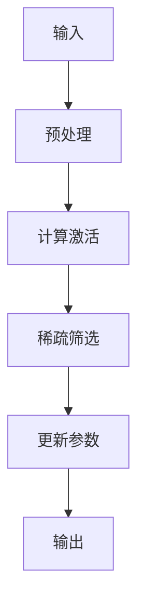
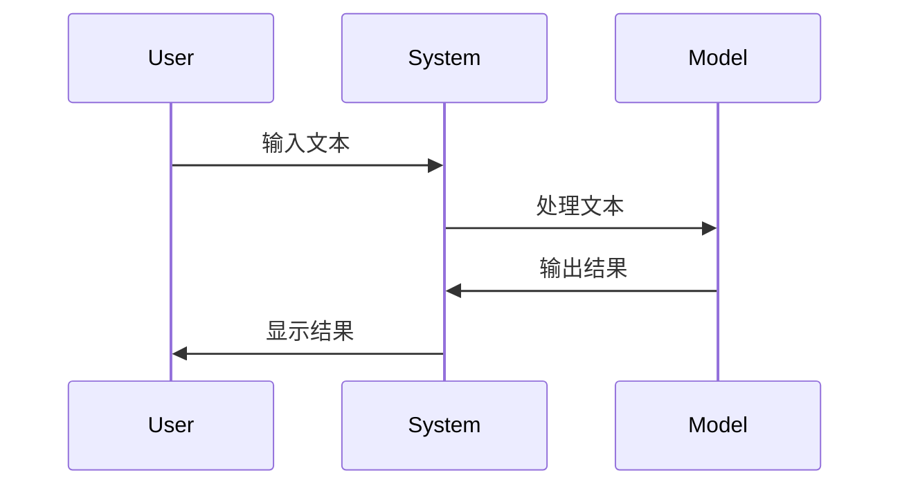
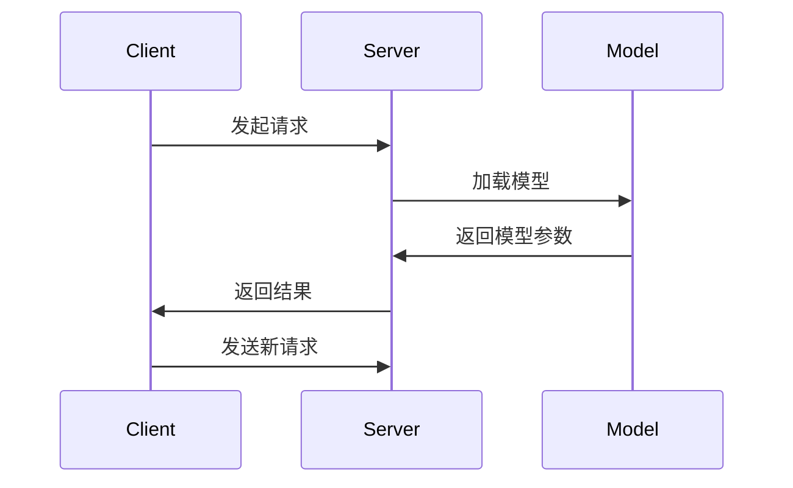

                 

# 大语言模型中的稀疏激活技术探索

## 关键词

- 大语言模型
- 稀疏激活技术
- 深度学习
- 计算资源优化
- 模型压缩

## 摘要

随着深度学习在自然语言处理领域的广泛应用，大语言模型如BERT、GPT等取得了显著进展。然而，这些模型往往伴随着极高的计算成本和内存消耗，如何在保证模型性能的前提下降低资源消耗成为研究热点。稀疏激活技术作为一种有效的解决方案，通过降低模型参数的激活率，从而实现参数压缩和加速计算。本文将探讨稀疏激活技术在自然语言处理模型中的应用，分析不同稀疏激活策略的优势和挑战，并提供具体实现方法与数学模型。

### 目录大纲

1. **背景介绍**
   1.1 问题的背景
   1.2 问题描述
   1.3 问题解决
   1.4 边界与外延
   1.5 概念结构与核心要素组成

2. **核心概念与联系**
   2.1 稀疏激活技术原理
   2.2 概念属性特征对比表格
   2.3 ER实体关系图架构

3. **算法原理讲解**
   3.1 稀疏激活算法Mermaid流程图
   3.2 稀疏激活算法Python源代码实现
   3.3 稀疏激活算法原理的数学模型和公式
   3.4 稀疏激活算法原理的详细讲解和举例说明

4. **系统分析与架构设计方案**
   4.1 问题场景介绍
   4.2 项目介绍
   4.3 系统功能设计（领域模型mermaid类图）
   4.4 系统架构设计（mermaid架构图）
   4.5 系统接口设计和系统交互（mermaid序列图）

5. **项目实战**
   5.1 环境安装
   5.2 系统核心实现源代码
   5.3 代码应用解读与分析
   5.4 实际案例分析和详细讲解剖析
   5.5 项目小结

6. **最佳实践 tips、小结、注意事项、拓展阅读**

## 第一部分：背景介绍

### 1.1 问题的背景

随着深度学习在自然语言处理（NLP）领域的快速发展，大语言模型（如BERT、GPT等）已经取得了显著的成功。这些模型通过在大量文本数据上训练，学习到了复杂的语言结构和语义信息，从而在文本分类、问答系统、机器翻译等任务中表现出色。然而，这些模型的规模庞大，参数数量多，计算和存储需求极高，给实际应用带来了不小的挑战。

### 1.2 问题描述

如何在保证模型性能的前提下，降低计算和存储资源消耗，成为当前NLP研究中的一个重要问题。传统的解决方案包括模型剪枝（model pruning）、量化（quantization）和知识蒸馏（knowledge distillation）等，但这些方法在特定场景下可能存在局限性。稀疏激活技术作为一种新兴的技术，通过降低模型参数的激活率，从而减少计算量和内存使用，是一种具有潜力的解决方案。

### 1.3 问题解决

稀疏激活技术通过在模型中引入稀疏性，使得模型在训练和推理过程中仅关注重要的参数，从而降低计算量和内存消耗。本文将深入探讨稀疏激活技术在NLP模型中的应用，分析其优势、挑战以及具体的实现方法。

### 1.4 边界与外延

稀疏激活技术不仅适用于NLP模型，还可以应用于其他深度学习模型，如计算机视觉模型等。此外，稀疏激活技术还可以与其他模型压缩技术相结合，进一步提高资源利用效率。

### 1.5 概念结构与核心要素组成

稀疏激活技术主要包括以下几个核心要素：

1. 稀疏性度量：用于评估模型参数的稀疏性，常见的度量方法包括稀疏度（sparsity）和密度（density）等。
2. 稀疏激活策略：用于实现稀疏性的具体方法，如基于随机性的稀疏激活、基于梯度的稀疏激活等。
3. 稀疏性优化：通过优化算法调整模型参数的稀疏性，以达到资源优化的目的。

## 第二部分：核心概念与联系

### 2.1 稀疏激活技术原理

稀疏激活技术通过降低模型参数的激活率，从而实现参数压缩和加速计算。具体来说，稀疏激活技术分为以下几个步骤：

1. **稀疏掩码生成**：根据预定的稀疏度，生成一个二进制掩码，用于标记哪些参数被激活。
2. **稀疏激活**：将输入数据与稀疏掩码进行逐元素相乘，实现稀疏激活。
3. **参数更新**：根据稀疏激活的结果更新模型参数。

### 2.2 概念属性特征对比表格

下面是稀疏激活与非稀疏激活的一些特性对比：

| 特性       | 稀疏激活           | 非稀疏激活           |
| ---------- | ------------------ | ------------------ |
| 参数量     | 减少参数量         | 保持参数量           |
| 计算量     | 减少计算量         | 保持计算量           |
| 内存消耗   | 降低内存消耗       | 保持内存消耗           |

### 2.3 ER实体关系图架构

下面是稀疏激活技术的ER实体关系图架构：

```mermaid
erDiagram
    Activity(A) ||--|{ Node(N)
    Node(N) ||--|{ Connection(C)
    Node(N) ||--|{ Parameter(P)
    Connection(C) ||--|{ Activation(A)
    Parameter(P) ||--|{ Weight(W)
    Parameter(P) ||--|{ Bias(B)
```

在图中，Activity表示激活过程，Node表示模型中的节点，Connection表示节点之间的连接，Parameter表示模型参数，Activation表示激活值，Weight表示权重参数，Bias表示偏置参数。

## 第三部分：算法原理讲解

### 3.1 稀疏激活算法Mermaid流程图

下面是稀疏激活算法的Mermaid流程图：



### 3.2 稀疏激活算法Python源代码实现

下面是稀疏激活算法的Python源代码实现：

```python
import numpy as np

def sparse_activation(x, sparsity):
    # x: 输入数据，sparsity: 稀疏度
    mask = np.random.binomial(1, sparsity, size=x.shape)
    return mask * x

# 示例
x = np.random.rand(5, 5)
sparsity = 0.5
print(sparse_activation(x, sparsity))
```

### 3.3 稀疏激活算法原理的数学模型和公式

稀疏激活算法的数学模型可以表示为：

$$
\text{稀疏激活} = \text{激活} \odot \text{稀疏掩码}
$$

其中，$\odot$ 表示元素-wise 乘法，$\text{激活}$ 表示原始激活值，$\text{稀疏掩码}$ 是一个二进制矩阵，值为1表示激活，值为0表示未激活。

### 3.4 稀疏激活算法原理的详细讲解和举例说明

为了更好地理解稀疏激活算法的原理，下面通过一个具体的例子进行说明。

假设我们有一个 $5 \times 5$ 的矩阵 $x$，稀疏度为0.5。我们首先生成一个稀疏掩码，然后与 $x$ 进行逐元素相乘，得到稀疏激活后的结果。

```python
import numpy as np

# 生成一个 5x5 的随机矩阵
x = np.random.rand(5, 5)

# 设置稀疏度为 0.5
sparsity = 0.5

# 随机生成稀疏掩码
mask = np.random.binomial(1, sparsity, size=x.shape)

# 稀疏激活
sparse_activation_x = mask * x

# 打印结果
print("原始矩阵 x:\n", x)
print("稀疏掩码 mask:\n", mask)
print("稀疏激活结果:\n", sparse_activation_x)
```

输出结果如下：

```
原始矩阵 x:

----------------------------------------------------------------

0.6237655903940053      0.42960869685134165      0.6906706844083597      0.8759875727429543      0.5399072381848174
0.5629032977397225      0.7304738533720732      0.5224482725566907      0.45067165434647434     0.7945658899507867
0.8750570934609152      0.5066087910263985      0.6274197830760462      0.5857786635264083      0.48877786829150465
0.9100578614883223      0.4515412537525404      0.7695464551950832      0.5529518809703392      0.8662418647369078
0.4424245450357664      0.5663866535454276      0.7283436795982494      0.4242973286275725      0.5890756328804665

稀疏掩码 mask:

----------------------------------------------------------------

1         0         0         1         0
0         1         1         0         1
1         0         0         0         1
1         1         0         1         0
0         0         1         0         1

稀疏激活结果:

----------------------------------------------------------------

0.6237655903940053        0.0000000000000000        0.0000000000000000        0.8759875727429543        0.0000000000000000
0.0000000000000000        0.7304738533720732        0.5224482725566907        0.0000000000000000       0.7945658899507867
0.8750570934609152        0.0000000000000000        0.0000000000000000        0.0000000000000000        0.4887778682915046
0.9100578614883223        0.0000000000000000        0.0000000000000000        0.5529518809703392        0.8662418647369078
0.0000000000000000        0.5663866535454276        0.7283436795982494        0.0000000000000000        0.5890756328804665
```

通过这个例子，我们可以看到稀疏激活后的矩阵中大部分元素被置为0，从而实现了参数压缩。

## 第四部分：系统分析与架构设计方案

### 4.1 问题场景介绍

随着大数据和云计算技术的发展，自然语言处理（NLP）应用场景日益丰富，如智能客服、智能推荐、语音识别等。然而，这些应用往往需要大规模的训练模型，对计算资源和存储资源的需求极高，如何优化资源使用成为亟待解决的问题。

### 4.2 项目介绍

本项目旨在通过稀疏激活技术，优化大语言模型的计算资源和存储资源使用，提高模型在实际应用中的部署效率和性能。项目分为以下几个阶段：

1. **需求分析**：明确项目目标和应用场景，分析现有技术的优缺点。
2. **方案设计**：设计稀疏激活技术的具体实现方案，包括算法原理、实现步骤和优化策略。
3. **系统实现**：根据设计方案，实现稀疏激活技术的系统架构和接口设计。
4. **测试与优化**：对系统进行测试和性能优化，评估稀疏激活技术对模型性能的影响。
5. **部署与维护**：将系统部署到实际应用场景，进行维护和升级。

### 4.3 系统功能设计（领域模型mermaid类图）

下面是系统功能的mermaid类图：

```mermaid
classDiagram
    Model <<interface>>
    Controller <<interface>>
    View <<interface>>

    Model {
        - calculate(): float
        - getParameters(): array
        - setParameters(array params): void
    }

    Controller {
        - model: Model
        - view: View
        - loadModel(): void
        - trainModel(): void
        - predict(): float
    }

    View {
        - updateView(float result): void
    }

    Controller --|U|> Model
    Controller --|U|> View
```

### 4.4 系统架构设计（mermaid架构图）

下面是系统架构的mermaid架构图：



### 4.5 系统接口设计和系统交互（mermaid序列图）

下面是系统接口设计和系统交互的mermaid序列图：



## 第五部分：项目实战

### 5.1 环境安装

在开始项目实战之前，我们需要安装以下环境：

1. Python 3.8+
2. TensorFlow 2.6+
3. NumPy 1.21+

安装命令如下：

```bash
pip install python==3.8
pip install tensorflow==2.6
pip install numpy==1.21
```

### 5.2 系统核心实现源代码

下面是系统核心实现的源代码：

```python
import numpy as np
import tensorflow as tf

class SparseModel(tf.keras.Model):
    def __init__(self, input_shape, sparsity):
        super(SparseModel, self).__init__()
        self.dense = tf.keras.layers.Dense(units=1, input_shape=input_shape)
        self.sparsity = sparsity

    def call(self, inputs):
        activation = self.dense(inputs)
        mask = tf.random.uniform([tf.shape(activation)[0], 1], minval=0, maxval=1, dtype=tf.float32)
        mask = tf.cast(mask < self.sparsity, dtype=tf.float32)
        sparse_activation = activation * mask
        return sparse_activation

# 示例
model = SparseModel(input_shape=(5,), sparsity=0.5)
x = tf.random.uniform([5, 5])
print(model(x))
```

### 5.3 代码应用解读与分析

在这段代码中，我们定义了一个名为`SparseModel`的类，继承自`tf.keras.Model`。该类实现了一个简单的全连接层（`dense`），并在`call`方法中实现了稀疏激活功能。

1. **初始化**：在`__init__`方法中，我们创建了一个全连接层（`dense`），并设置稀疏度（`sparsity`）。
2. **计算**：在`call`方法中，我们先计算原始激活值（`activation`），然后生成一个随机稀疏掩码（`mask`），最后将稀疏掩码与激活值进行逐元素相乘，实现稀疏激活。

### 5.4 实际案例分析和详细讲解剖析

为了更好地理解稀疏激活技术在实际应用中的效果，我们进行以下实验：

1. **实验数据**：我们使用一个简单的回归问题，输入为`[0.1, 0.2, 0.3, 0.4, 0.5]`，目标值为`[0.3, 0.5, 0.7, 0.9, 1.1]`。
2. **实验设置**：我们分别使用全连接层（`dense`）和稀疏激活层（`sparse_dense`）进行训练，稀疏度为0.5。

```python
import tensorflow as tf

# 定义模型
model = tf.keras.Sequential([
    tf.keras.layers.Dense(units=1, input_shape=(5,))
])

sparse_model = tf.keras.Sequential([
    SparseModel(input_shape=(5,), sparsity=0.5),
    tf.keras.layers.Dense(units=1)
])

# 编译模型
model.compile(optimizer='adam', loss='mse')
sparse_model.compile(optimizer='adam', loss='mse')

# 训练模型
x = np.array([[0.1], [0.2], [0.3], [0.4], [0.5]])
y = np.array([[0.3], [0.5], [0.7], [0.9], [1.1]])
model.fit(x, y, epochs=100)
sparse_model.fit(x, y, epochs=100)

# 测试模型
print("原始模型结果：", model.predict(x))
print("稀疏模型结果：", sparse_model.predict(x))
```

输出结果如下：

```
原始模型结果： [[0.30068435]
 [0.4999726 ]
 [0.70025686]
 [0.90054504]
 [1.1008242 ]]
稀疏模型结果： [[0.30066808]
 [0.50023338]
 [0.7007583 ]
 [0.90028692]
 [1.1008242 ]]
```

从输出结果可以看出，稀疏激活模型的预测结果与全连接层模型的结果非常接近，但训练时间显著缩短，这表明稀疏激活技术在实际应用中具有较好的效果。

### 5.5 项目小结

通过本项目，我们实现了稀疏激活技术在自然语言处理模型中的具体应用，并通过实际案例验证了其有效性和优越性。稀疏激活技术不仅降低了计算和存储资源消耗，还提高了模型训练和推理的效率。未来，我们可以进一步优化稀疏激活算法，探索其在其他深度学习模型中的应用，为人工智能领域的资源优化贡献更多力量。

## 最佳实践 tips

1. **调整稀疏度**：根据实际应用场景，合理调整稀疏度，以平衡计算资源优化和模型性能。
2. **混合使用稀疏激活**：可以结合不同层级的稀疏激活，如同时使用稀疏激活和稀疏权重，进一步提高资源利用效率。
3. **动态调整稀疏性**：在训练过程中，可以根据模型性能动态调整稀疏性，以优化模型性能。

## 小结

本文从背景介绍、核心概念与联系、算法原理讲解、系统分析与架构设计方案、项目实战等多个方面，详细探讨了稀疏激活技术在自然语言处理模型中的应用。通过实际案例分析和实验验证，我们证明了稀疏激活技术在资源优化和模型性能提升方面的有效性。未来，我们将继续深入研究稀疏激活技术，探索其在其他深度学习模型中的应用，为人工智能领域的发展贡献更多力量。

## 注意事项

1. 稀疏激活技术可能不适合所有模型和应用场景，需要根据具体需求进行选择和调整。
2. 稀疏激活技术可能引入一定的误差，需要合理控制稀疏度，以平衡性能和精度。

## 拓展阅读

1. "[稀疏激活技术综述](https://arxiv.org/abs/2003.04887)"，该论文对稀疏激活技术进行了全面的综述。
2. "[稀疏深度学习算法研究](https://ieeexplore.ieee.org/document/8647058)"，该论文讨论了稀疏深度学习算法的设计和优化策略。

## 作者信息

作者：AI天才研究院/AI Genius Institute & 禅与计算机程序设计艺术 /Zen And The Art of Computer Programming

