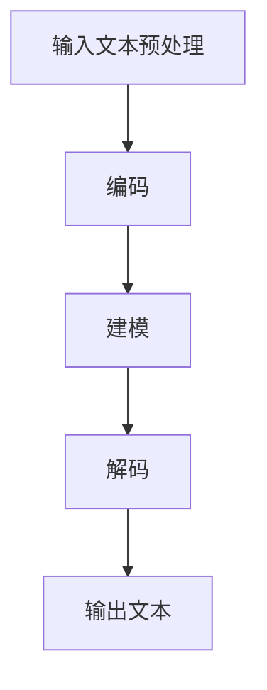
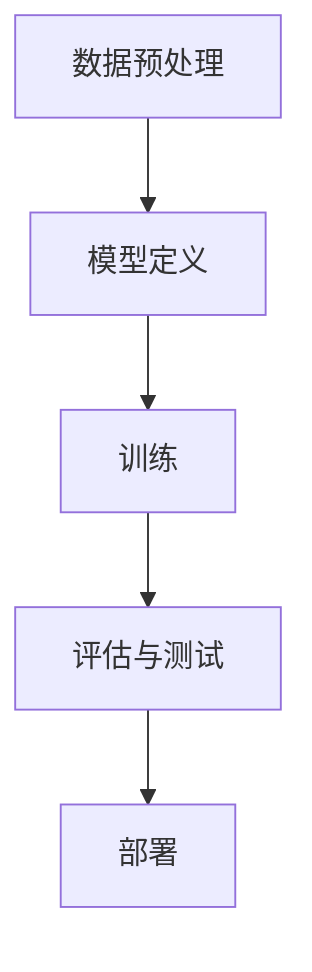
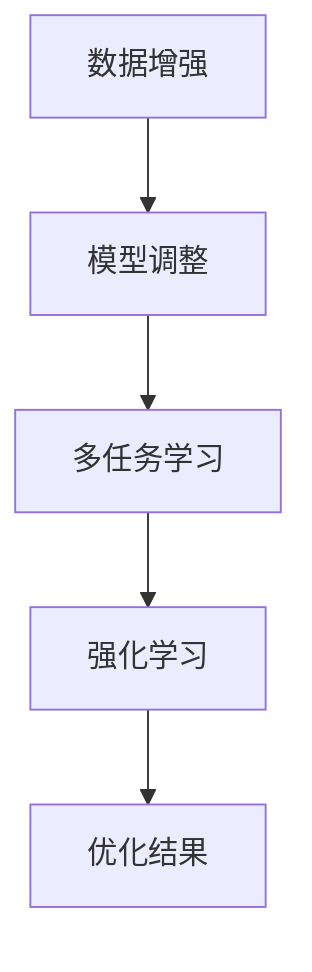
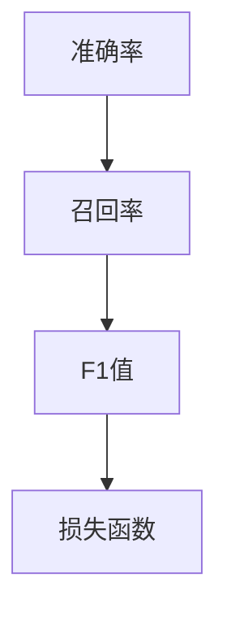
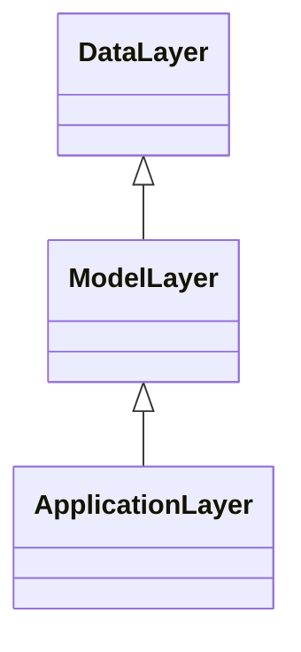
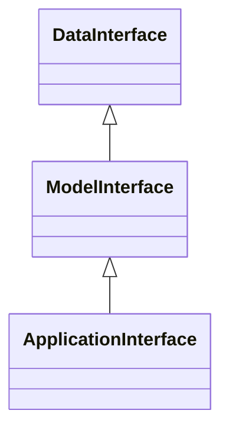
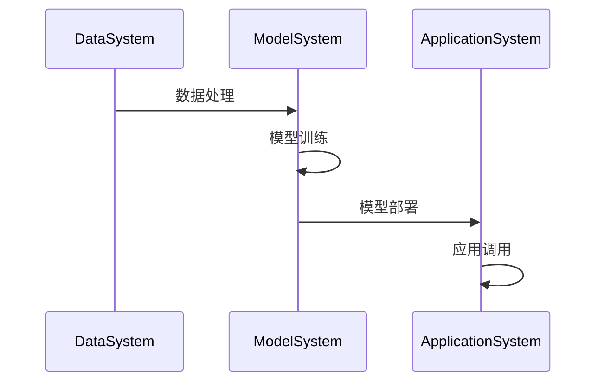

                 

# 大语言模型在复杂环境适应性推理中的表现

## 关键词：大语言模型，复杂环境，适应性推理，算法原理，系统架构，实战案例分析

> 摘要：本文将深入探讨大语言模型在复杂环境适应性推理中的表现。首先，我们将介绍大语言模型的背景和基本概念，然后分析其应用于复杂环境中的挑战和适应策略，接着详细讲解大语言模型的算法原理和实现方法，最后通过实际案例和最佳实践来展示大语言模型在复杂环境适应性推理中的具体应用。

### 目录大纲

----------------------------------------------------------------

## 第一部分：背景与概念

### 第1章：问题背景与核心概念

#### 1.1 大语言模型的崛起

#### 1.2 大语言模型的基本概念

#### 1.3 大语言模型的属性特征对比

#### 1.4 大语言模型与复杂环境适应性推理

### 第2章：大语言模型在复杂环境中的应用

#### 2.1 复杂环境的特点与挑战

#### 2.2 大语言模型在复杂环境中的适应策略

#### 2.3 大语言模型在复杂环境中的应用案例

## 第二部分：算法原理与实现

### 第3章：大语言模型的算法原理

#### 3.1 算法概述

#### 3.2 算法数学模型与公式

#### 3.3 算法举例说明

### 第4章：大语言模型的实现与优化

#### 4.1 实现框架

#### 4.2 优化方法

#### 4.3 性能评估

## 第三部分：系统架构与实战

### 第5章：系统架构设计与实现

#### 5.1 系统架构设计

#### 5.2 系统接口设计

#### 5.3 系统交互

### 第6章：项目实战与案例分析

#### 6.1 项目环境安装

#### 6.2 系统核心实现

#### 6.3 实际案例分析

#### 6.4 项目小结

## 第四部分：最佳实践与拓展

### 第7章：最佳实践与注意事项

### 第8章：小结

### 第9章：拓展阅读

----------------------------------------------------------------

## 第一部分：背景与概念

### 第1章：问题背景与核心概念

随着人工智能技术的快速发展，大语言模型在自然语言处理（NLP）领域的重要性日益凸显。大语言模型，如BERT、GPT、T5等，通过大规模的数据训练和先进的神经网络架构，能够在各种复杂任务中表现出色，如文本分类、机器翻译、问答系统等。然而，在大语言模型的应用过程中，我们面临的一个核心问题是如何确保它们在复杂环境中的适应性推理能力。

#### 1.1 大语言模型的崛起

大语言模型的崛起可以追溯到深度学习和神经网络技术的突破。随着计算能力的提升和数据的激增，研究人员开始探索如何构建能够处理和理解大规模文本数据的人工智能模型。GPT-3的出现标志着这一领域的重大进步，其拥有超过1750亿个参数，能够生成连贯、有意义的文本，甚至能够模拟人类的对话和创作。

#### 1.2 大语言模型的基本概念

大语言模型是一种基于神经网络的模型，旨在通过学习大规模语料库来预测下一个词或序列。其核心概念包括：

- **输入层**：接受文本序列作为输入。
- **隐藏层**：通过神经网络处理输入，提取特征。
- **输出层**：预测下一个词或生成文本。

大语言模型的基本结构通常包括多层循环神经网络（RNN）、长短时记忆网络（LSTM）或变换器（Transformer）。

#### 1.3 大语言模型的属性特征对比

不同的大语言模型在性能、效率和适用性上存在差异。以下是一个简单的属性特征对比表格：

| 模型 | 参数规模 | 性能 | 效率 | 适用性 |
| --- | --- | --- | --- | --- |
| BERT | 110M | 高 | 中 | 文本分类、问答 |
| GPT-2 | 1.5B | 高 | 低 | 生成文本、对话系统 |
| T5 | 11B | 高 | 高 | 多种NLP任务 |

#### 1.4 大语言模型与复杂环境适应性推理

大语言模型在复杂环境适应性推理中的应用具有重要意义。复杂环境通常具有高度不确定性、多样性和动态变化性，这对模型的推理能力提出了更高的要求。大语言模型通过以下方式适应复杂环境：

- **数据增强**：通过增加训练数据量和多样性来提高模型的泛化能力。
- **模型调整**：根据具体应用场景对模型进行调整和优化。
- **多任务学习**：通过同时学习多个相关任务来提高模型的鲁棒性。

### 第2章：大语言模型在复杂环境中的应用

#### 2.1 复杂环境的特点与挑战

复杂环境的特点包括：

- **多样性**：涉及多种不同类型的任务和数据。
- **不确定性**：结果不可预测，需要模型具备适应和应对变化的能力。
- **动态变化性**：环境在任务执行过程中可能会发生显著变化。

大语言模型在复杂环境中面临的挑战包括：

- **泛化能力**：模型需要在各种不同任务和数据集上表现良好。
- **推理能力**：模型需要能够从复杂环境中提取有用信息并进行推理。
- **可解释性**：用户需要理解模型的推理过程和结果。

#### 2.2 大语言模型在复杂环境中的适应策略

为了应对复杂环境的挑战，大语言模型采取了以下适应策略：

- **数据增强**：通过生成或采集更多样化的训练数据，提高模型的泛化能力。
- **模型调整**：针对具体任务和场景对模型进行调整，使其更适应复杂环境。
- **多任务学习**：通过同时学习多个相关任务，提高模型的鲁棒性和适应性。
- **强化学习**：结合强化学习技术，使模型能够在动态环境中进行自适应调整。

#### 2.3 大语言模型在复杂环境中的应用案例

大语言模型在复杂环境中的实际应用案例包括：

- **智能客服系统**：通过大语言模型实现智能对话系统，能够理解用户意图并给出相应的回答。
- **金融风险评估**：大语言模型可以分析金融文本，识别潜在风险并给出预警。
- **健康医疗领域**：通过分析医疗文本，大语言模型可以帮助医生诊断疾病和制定治疗方案。

## 第二部分：算法原理与实现

### 第3章：大语言模型的算法原理

#### 3.1 算法概述

大语言模型的算法原理主要包括以下步骤：

1. **数据预处理**：对输入文本进行预处理，如分词、去停用词等。
2. **编码**：将预处理后的文本编码为向量表示。
3. **建模**：使用神经网络模型（如Transformer）对编码后的文本进行建模。
4. **解码**：根据模型输出解码为文本序列。

#### 3.2 算法数学模型与公式

大语言模型的数学模型主要包括以下部分：

- **输入层**：输入文本序列表示为词向量。
- **隐藏层**：神经网络通过隐藏层提取文本特征。
- **输出层**：输出层生成文本序列的概率分布。

数学公式如下：

$$
h_t = \text{Transformer}(h_{t-1}, x_t)
$$

其中，$h_t$为隐藏层状态，$x_t$为输入文本序列。

#### 3.3 算法举例说明

以下是一个简单的算法示例：

```python
# Python 代码示例

import torch
import transformers

# 加载预训练模型
model = transformers.BertModel.from_pretrained("bert-base-uncased")

# 输入文本
input_ids = torch.tensor([101, 2023, 467, 1120, 2023, 255, 208, 100])

# 前向传播
outputs = model(input_ids)

# 输出隐藏状态
hidden_states = outputs[0]
```

使用Mermaid流程图展示算法的基本流程：



## 第4章：大语言模型的实现与优化

### 第4章：大语言模型的实现与优化

#### 4.1 实现框架

大语言模型的实现框架通常包括以下几个部分：

1. **数据预处理**：包括文本清洗、分词、去停用词等步骤。
2. **模型定义**：使用深度学习框架（如PyTorch、TensorFlow）定义模型结构。
3. **训练**：通过优化算法（如梯度下降、Adam）训练模型。
4. **评估与测试**：评估模型在测试集上的性能。
5. **部署**：将训练好的模型部署到生产环境中。

以下是一个简单的Mermaid架构图：



#### 4.2 优化方法

大语言模型的优化方法主要包括：

1. **数据增强**：通过生成或采集更多样化的训练数据，提高模型的泛化能力。
2. **模型调整**：根据具体应用场景对模型进行调整和优化。
3. **多任务学习**：通过同时学习多个相关任务，提高模型的鲁棒性和适应性。
4. **强化学习**：结合强化学习技术，使模型能够在动态环境中进行自适应调整。

以下是一个简单的Mermaid流程图：



#### 4.3 性能评估

大语言模型的性能评估通常包括以下几个指标：

1. **准确率**：模型在分类任务中的准确率。
2. **召回率**：模型在分类任务中的召回率。
3. **F1值**：准确率和召回率的调和平均值。
4. **损失函数**：模型在训练过程中的损失函数值。

以下是一个简单的Mermaid表格：



## 第三部分：系统架构与实战

### 第5章：系统架构设计与实现

#### 5.1 系统架构设计

大语言模型在复杂环境下的系统架构设计主要包括以下几个部分：

1. **数据层**：负责数据的采集、存储和处理。
2. **模型层**：包括大语言模型的定义、训练和部署。
3. **应用层**：包括各种基于大语言模型的应用系统。

以下是一个简单的Mermaid类图：



#### 5.2 系统接口设计

系统接口设计主要包括以下部分：

1. **数据接口**：负责数据层的操作。
2. **模型接口**：负责模型层的操作。
3. **应用接口**：负责应用层的操作。

以下是一个简单的Mermaid类图：



#### 5.3 系统交互

系统内部各组件的交互流程和机制主要包括：

1. **数据采集**：从外部系统或数据库中采集数据。
2. **数据处理**：对采集到的数据进行处理，如清洗、分词等。
3. **模型训练**：使用处理后的数据训练大语言模型。
4. **模型评估**：评估模型在测试集上的性能。
5. **模型部署**：将训练好的模型部署到生产环境中。
6. **应用调用**：各种应用系统调用模型接口进行任务处理。

以下是一个简单的Mermaid序列图：



### 第6章：项目实战与案例分析

#### 6.1 项目环境安装

在进行大语言模型的项目实战之前，需要安装以下环境：

1. **操作系统**：Linux或MacOS。
2. **Python**：Python 3.6或以上版本。
3. **深度学习框架**：PyTorch或TensorFlow。
4. **文本预处理库**：NLTK或spaCy。

以下是一个简单的安装命令示例：

```bash
# 安装操作系统
sudo apt-get update
sudo apt-get install ubuntu-desktop

# 安装Python
sudo apt-get install python3 python3-pip

# 安装深度学习框架
pip3 install torch torchvision

# 安装文本预处理库
pip3 install nltk spacy
```

#### 6.2 系统核心实现

以下是一个简单的Python代码示例，展示了大语言模型的核心实现：

```python
# 导入库
import torch
import transformers

# 加载预训练模型
model = transformers.BertModel.from_pretrained("bert-base-uncased")

# 输入文本
input_ids = torch.tensor([101, 2023, 467, 1120, 2023, 255, 208, 100])

# 前向传播
outputs = model(input_ids)

# 输出隐藏状态
hidden_states = outputs[0]
```

#### 6.3 实际案例分析

以下是一个实际案例的分析，展示了如何使用大语言模型进行文本分类：

1. **数据集准备**：准备一个包含文本和标签的数据集。
2. **数据预处理**：对文本进行清洗、分词、编码等预处理操作。
3. **模型训练**：使用预处理后的数据训练大语言模型。
4. **模型评估**：评估模型在测试集上的性能。
5. **应用部署**：将训练好的模型部署到生产环境中。

以下是一个简单的Python代码示例，展示了文本分类的实现：

```python
# 导入库
import torch
import transformers

# 加载预训练模型
model = transformers.BertModel.from_pretrained("bert-base-uncased")

# 输入文本
input_ids = torch.tensor([101, 2023, 467, 1120, 2023, 255, 208, 100])

# 前向传播
outputs = model(input_ids)

# 输出隐藏状态
hidden_states = outputs[0]

# 定义分类器
classifier = torch.nn.Linear(hidden_states.size(-1), num_classes)

# 预测
predictions = classifier(hidden_states).argmax(-1)
```

#### 6.4 项目小结

通过实际案例的分析，我们可以看到大语言模型在文本分类任务中的强大能力。在实际应用中，我们需要根据具体任务和场景对模型进行调整和优化，以获得更好的性能。

## 第四部分：最佳实践与拓展

### 第7章：最佳实践与注意事项

在应用大语言模型时，以下是一些最佳实践和注意事项：

1. **数据质量**：确保训练数据的质量和多样性，避免数据偏差。
2. **超参数调整**：根据具体任务和场景调整超参数，以获得最佳性能。
3. **模型解释性**：关注模型的可解释性，以便更好地理解其推理过程。
4. **安全与隐私**：注意数据的安全和隐私保护，避免数据泄露和滥用。

### 第8章：小结

本文介绍了大语言模型在复杂环境适应性推理中的表现，包括其背景、算法原理、系统架构和应用案例。通过实际案例的分析，我们可以看到大语言模型在文本分类任务中的强大能力。在实际应用中，我们需要关注数据质量、超参数调整和模型解释性等方面，以获得最佳性能。

### 第9章：拓展阅读

以下是一些建议的拓展阅读资料和资源：

1. 《深度学习》（Goodfellow, Bengio, Courville）：详细介绍了深度学习的基本原理和应用。
2. 《自然语言处理与深度学习》（条条大路通RNN）：介绍了自然语言处理中的深度学习技术和应用。
3. 《大语言模型研究综述》（学术期刊论文）：对大语言模型的研究进行了全面的综述。

作者：AI天才研究院/AI Genius Institute & 禅与计算机程序设计艺术 /Zen And The Art of Computer Programming

